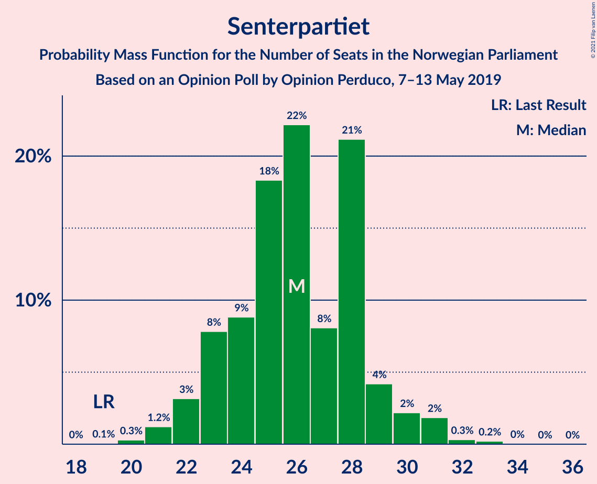
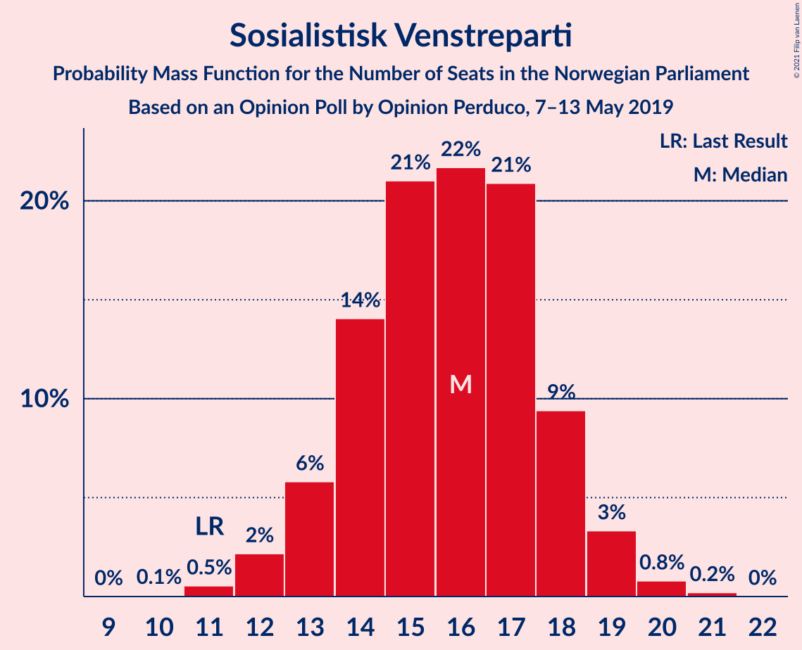
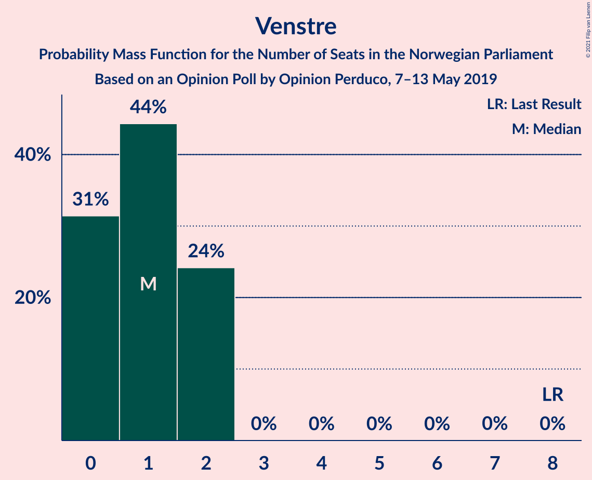
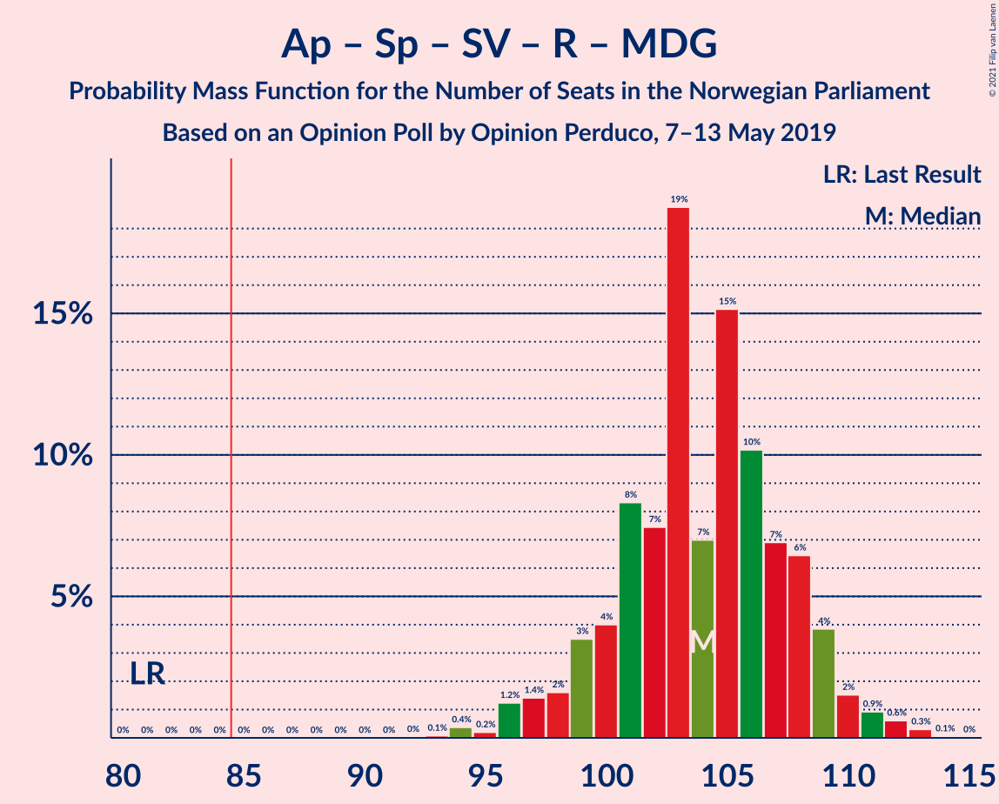
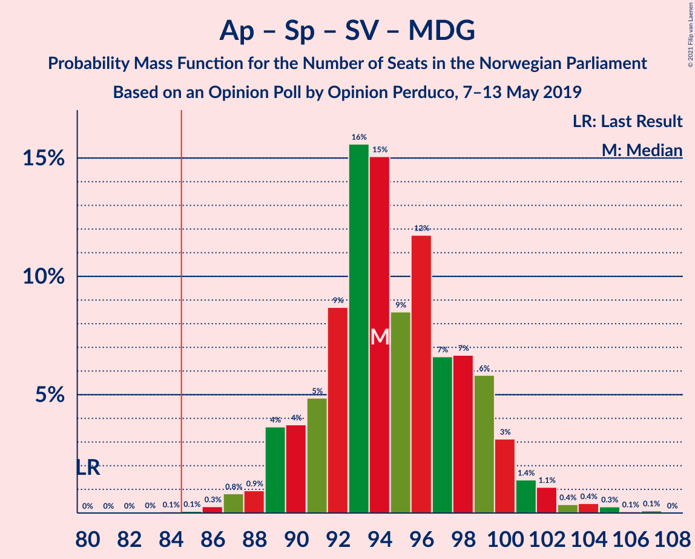
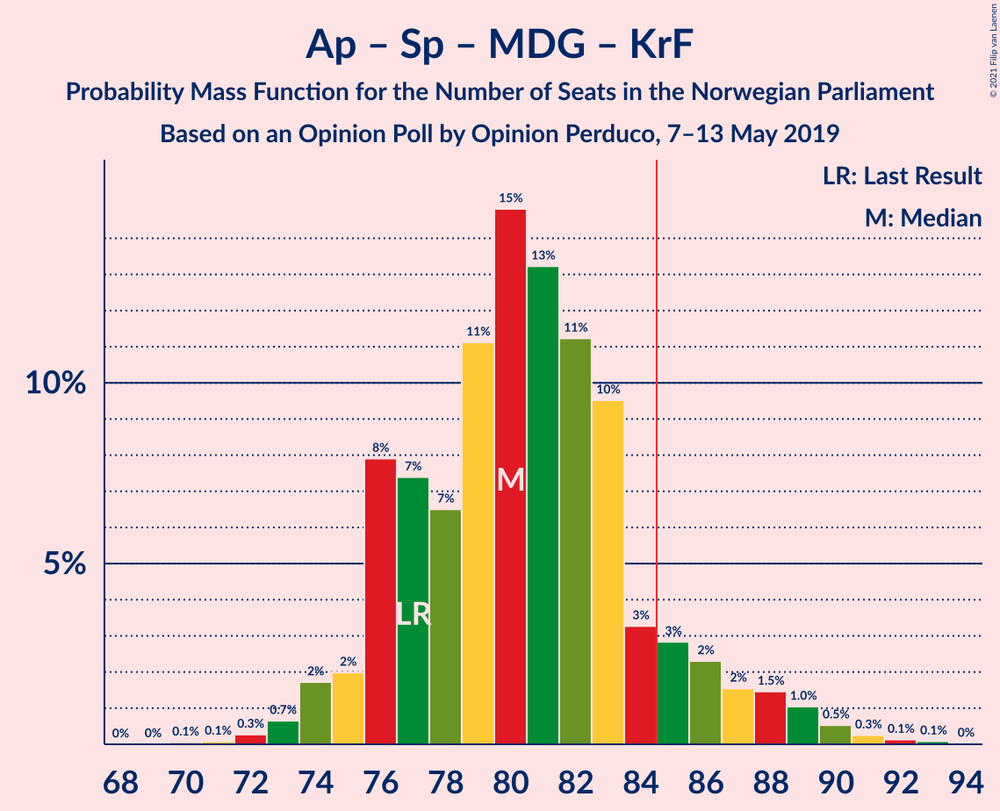
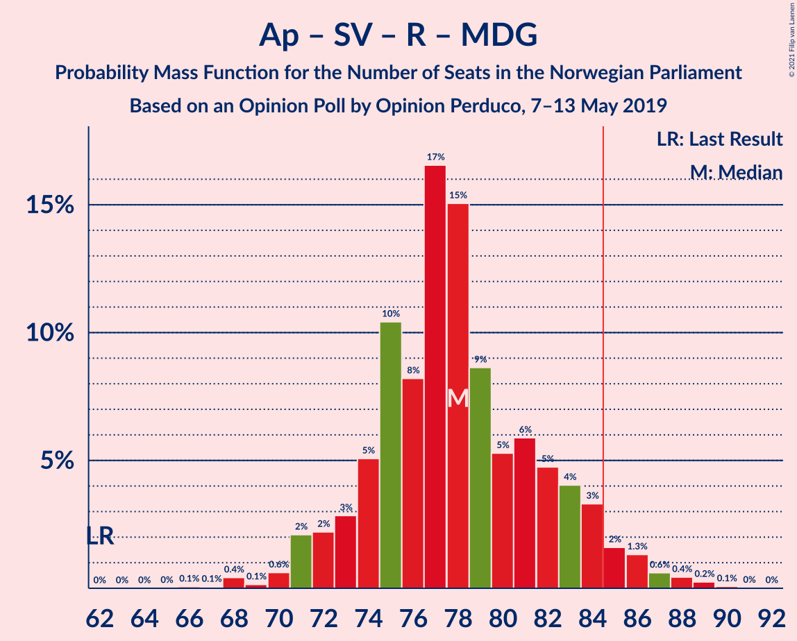
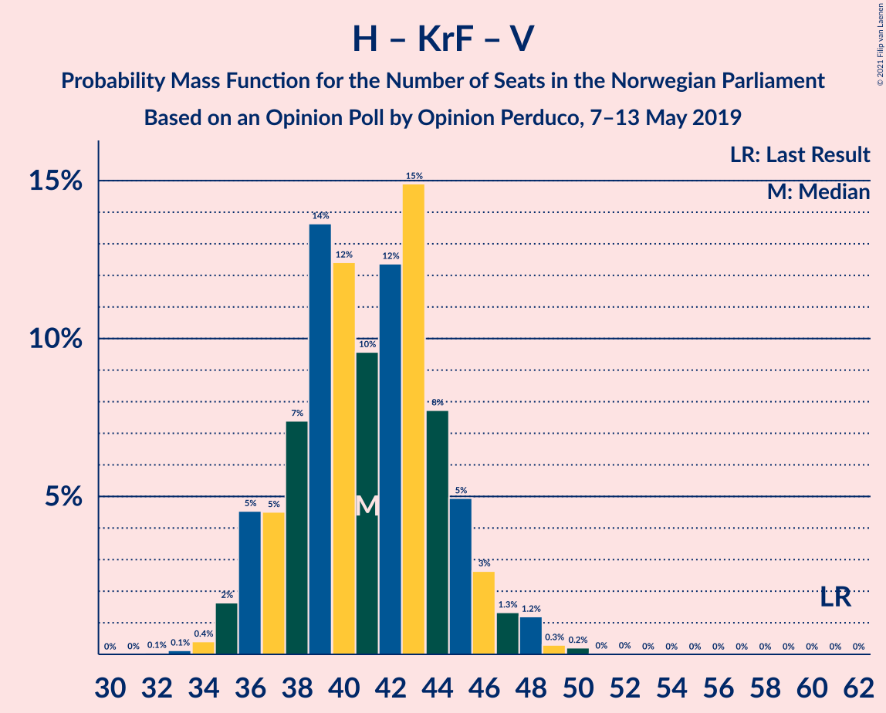

# Opinion Poll by Opinion Perduco, 7–13 May 2019

<a href="#voting-intentions">Voting Intentions</a> | <a href="#seats">Seats</a> | <a href="#coalitions">Coalitions</a> | <a href="#technical-information">Technical Information</a>

## Voting Intentions

### Confidence Intervals

| Party | Last Result | Poll Result | 80% Confidence Interval | 90% Confidence Interval | 95% Confidence Interval | 99% Confidence Interval |
|:-----:|:-----------:|:-----------:|:-----------------------:|:-----------------------:|:-----------------------:|:-----------------------:|
| Arbeiderpartiet | 27.4% | 27.1% | 25.3–29.0% |24.8–29.6% |24.4–30.1% |23.5–31.0% |
| Høyre | 25.0% | 21.1% | 19.5–22.9% |19.1–23.4% |18.7–23.9% |17.9–24.7% |
| Senterpartiet | 10.3% | 14.1% | 12.7–15.6% |12.3–16.1% |12.0–16.5% |11.4–17.2% |
| Fremskrittspartiet | 15.2% | 13.0% | 11.7–14.5% |11.4–15.0% |11.0–15.3% |10.4–16.1% |
| Sosialistisk Venstreparti | 6.0% | 8.3% | 7.3–9.6% |7.0–9.9% |6.7–10.2% |6.2–10.9% |
| Rødt | 2.4% | 5.0% | 4.2–6.1% |4.0–6.4% |3.8–6.6% |3.5–7.2% |
| Miljøpartiet De Grønne | 3.2% | 4.0% | 3.3–4.9% |3.1–5.2% |2.9–5.4% |2.6–5.9% |
| Kristelig Folkeparti | 4.2% | 2.7% | 2.2–3.6% |2.0–3.8% |1.9–4.0% |1.6–4.4% |
| Venstre | 4.4% | 2.1% | 1.6–2.8% |1.5–3.0% |1.4–3.2% |1.2–3.6% |

*Note:* The poll result column reflects the actual value used in the calculations. Published results may vary slightly, and in addition be rounded to fewer digits.

## Seats

### Confidence Intervals

| Party | Last Result | Median | 80% Confidence Interval | 90% Confidence Interval | 95% Confidence Interval | 99% Confidence Interval |
|:-----:|:-----------:|:------:|:-----------------------:|:-----------------------:|:-----------------------:|:-----------------------:|
| <a href="#arbeiderpartiet">Arbeiderpartiet</a> | 49 | 48 | 45–52 |44–53 |43–54 |42–56 |
| <a href="#høyre">Høyre</a> | 45 | 39 | 35–42 |35–43 |34–43 |32–46 |
| <a href="#senterpartiet">Senterpartiet</a> | 19 | 26 | 23–28 |23–29 |22–30 |21–32 |
| <a href="#fremskrittspartiet">Fremskrittspartiet</a> | 27 | 24 | 22–27 |21–28 |20–28 |19–29 |
| <a href="#sosialistisk-venstreparti">Sosialistisk Venstreparti</a> | 11 | 16 | 14–18 |13–18 |12–19 |11–20 |
| <a href="#rødt">Rødt</a> | 1 | 10 | 8–11 |7–12 |2–12 |2–13 |
| <a href="#miljøpartiet-de-grønne">Miljøpartiet De Grønne</a> | 1 | 2 | 2–8 |1–9 |1–10 |1–11 |
| <a href="#kristelig-folkeparti">Kristelig Folkeparti</a> | 8 | 1 | 0–3 |0–3 |0–7 |0–8 |
| <a href="#venstre">Venstre</a> | 8 | 1 | 0–2 |0–2 |0–2 |0–2 |

### Arbeiderpartiet

*For a full overview of the results for this party, see the [Arbeiderpartiet](party-arbeiderpartiet.html) page.*

| Number of Seats | Probability | Accumulated | Special Marks |
|:---------------:|:-----------:|:-----------:|:-------------:|
| 40 | 0% | 100% |  |
| 41 | 0.2% | 99.9% |  |
| 42 | 0.7% | 99.8% |  |
| 43 | 2% | 99.1% |  |
| 44 | 4% | 97% |  |
| 45 | 6% | 93% |  |
| 46 | 6% | 88% |  |
| 47 | 11% | 81% |  |
| 48 | 21% | 71% | Median |
| 49 | 9% | 50% | Last Result |
| 50 | 14% | 40% |  |
| 51 | 12% | 26% |  |
| 52 | 6% | 14% |  |
| 53 | 4% | 8% |  |
| 54 | 2% | 5% |  |
| 55 | 1.4% | 2% |  |
| 56 | 0.6% | 1.0% |  |
| 57 | 0.2% | 0.3% |  |
| 58 | 0.1% | 0.1% |  |
| 59 | 0% | 0% |  |

### Høyre

*For a full overview of the results for this party, see the [Høyre](party-høyre.html) page.*

| Number of Seats | Probability | Accumulated | Special Marks |
|:---------------:|:-----------:|:-----------:|:-------------:|
| 30 | 0.1% | 100% |  |
| 31 | 0.2% | 99.9% |  |
| 32 | 0.4% | 99.7% |  |
| 33 | 1.2% | 99.3% |  |
| 34 | 3% | 98% |  |
| 35 | 7% | 95% |  |
| 36 | 11% | 88% |  |
| 37 | 11% | 77% |  |
| 38 | 15% | 66% |  |
| 39 | 17% | 51% | Median |
| 40 | 11% | 34% |  |
| 41 | 11% | 23% |  |
| 42 | 7% | 12% |  |
| 43 | 3% | 6% |  |
| 44 | 1.4% | 2% |  |
| 45 | 0.5% | 1.0% | Last Result |
| 46 | 0.4% | 0.5% |  |
| 47 | 0.1% | 0.1% |  |
| 48 | 0% | 0% |  |

### Senterpartiet

*For a full overview of the results for this party, see the [Senterpartiet](party-senterpartiet.html) page.*

| Number of Seats | Probability | Accumulated | Special Marks |
|:---------------:|:-----------:|:-----------:|:-------------:|
| 19 | 0.1% | 100% | Last Result |
| 20 | 0.3% | 99.9% |  |
| 21 | 1.2% | 99.6% |  |
| 22 | 3% | 98% |  |
| 23 | 8% | 95% |  |
| 24 | 9% | 87% |  |
| 25 | 18% | 79% |  |
| 26 | 22% | 60% | Median |
| 27 | 8% | 38% |  |
| 28 | 21% | 30% |  |
| 29 | 4% | 9% |  |
| 30 | 2% | 5% |  |
| 31 | 2% | 2% |  |
| 32 | 0.3% | 0.6% |  |
| 33 | 0.2% | 0.3% |  |
| 34 | 0% | 0.1% |  |
| 35 | 0% | 0% |  |

### Fremskrittspartiet

*For a full overview of the results for this party, see the [Fremskrittspartiet](party-fremskrittspartiet.html) page.*

| Number of Seats | Probability | Accumulated | Special Marks |
|:---------------:|:-----------:|:-----------:|:-------------:|
| 17 | 0.1% | 100% |  |
| 18 | 0.2% | 99.9% |  |
| 19 | 1.0% | 99.7% |  |
| 20 | 3% | 98.6% |  |
| 21 | 6% | 96% |  |
| 22 | 11% | 90% |  |
| 23 | 20% | 79% |  |
| 24 | 26% | 59% | Median |
| 25 | 11% | 33% |  |
| 26 | 11% | 22% |  |
| 27 | 5% | 11% | Last Result |
| 28 | 3% | 6% |  |
| 29 | 2% | 2% |  |
| 30 | 0.3% | 0.4% |  |
| 31 | 0.1% | 0.1% |  |
| 32 | 0% | 0% |  |

### Sosialistisk Venstreparti

*For a full overview of the results for this party, see the [Sosialistisk Venstreparti](party-sosialistiskvenstreparti.html) page.*

| Number of Seats | Probability | Accumulated | Special Marks |
|:---------------:|:-----------:|:-----------:|:-------------:|
| 10 | 0.1% | 100% |  |
| 11 | 0.5% | 99.9% | Last Result |
| 12 | 2% | 99.4% |  |
| 13 | 6% | 97% |  |
| 14 | 14% | 91% |  |
| 15 | 21% | 77% |  |
| 16 | 22% | 56% | Median |
| 17 | 21% | 35% |  |
| 18 | 9% | 14% |  |
| 19 | 3% | 4% |  |
| 20 | 0.8% | 1.0% |  |
| 21 | 0.2% | 0.2% |  |
| 22 | 0% | 0% |  |

### Rødt

*For a full overview of the results for this party, see the [Rødt](party-rødt.html) page.*

| Number of Seats | Probability | Accumulated | Special Marks |
|:---------------:|:-----------:|:-----------:|:-------------:|
| 1 | 0% | 100% | Last Result |
| 2 | 5% | 100% |  |
| 3 | 0% | 95% |  |
| 4 | 0% | 95% |  |
| 5 | 0% | 95% |  |
| 6 | 0% | 95% |  |
| 7 | 1.3% | 95% |  |
| 8 | 13% | 94% |  |
| 9 | 26% | 81% |  |
| 10 | 34% | 56% | Median |
| 11 | 16% | 21% |  |
| 12 | 4% | 5% |  |
| 13 | 0.7% | 0.8% |  |
| 14 | 0.1% | 0.1% |  |
| 15 | 0% | 0% |  |

### Miljøpartiet De Grønne

*For a full overview of the results for this party, see the [Miljøpartiet De Grønne](party-miljøpartietdegrønne.html) page.*

| Number of Seats | Probability | Accumulated | Special Marks |
|:---------------:|:-----------:|:-----------:|:-------------:|
| 1 | 9% | 100% | Last Result |
| 2 | 54% | 91% | Median |
| 3 | 2% | 37% |  |
| 4 | 0.5% | 35% |  |
| 5 | 0% | 35% |  |
| 6 | 0% | 35% |  |
| 7 | 11% | 35% |  |
| 8 | 16% | 24% |  |
| 9 | 5% | 8% |  |
| 10 | 2% | 3% |  |
| 11 | 0.8% | 0.9% |  |
| 12 | 0.1% | 0.1% |  |
| 13 | 0% | 0% |  |

### Kristelig Folkeparti

*For a full overview of the results for this party, see the [Kristelig Folkeparti](party-kristeligfolkeparti.html) page.*

| Number of Seats | Probability | Accumulated | Special Marks |
|:---------------:|:-----------:|:-----------:|:-------------:|
| 0 | 17% | 100% |  |
| 1 | 50% | 83% | Median |
| 2 | 4% | 33% |  |
| 3 | 26% | 28% |  |
| 4 | 0% | 3% |  |
| 5 | 0% | 3% |  |
| 6 | 0% | 3% |  |
| 7 | 2% | 3% |  |
| 8 | 1.0% | 1.1% | Last Result |
| 9 | 0.1% | 0.1% |  |
| 10 | 0% | 0% |  |

### Venstre

*For a full overview of the results for this party, see the [Venstre](party-venstre.html) page.*

| Number of Seats | Probability | Accumulated | Special Marks |
|:---------------:|:-----------:|:-----------:|:-------------:|
| 0 | 31% | 100% |  |
| 1 | 44% | 69% | Median |
| 2 | 24% | 24% |  |
| 3 | 0% | 0.1% |  |
| 4 | 0% | 0.1% |  |
| 5 | 0% | 0.1% |  |
| 6 | 0% | 0.1% |  |
| 7 | 0% | 0.1% |  |
| 8 | 0% | 0% | Last Result |

## Coalitions

### Confidence Intervals

| Coalition | Last Result | Median | Majority? | 80% Confidence Interval | 90% Confidence Interval | 95% Confidence Interval | 99% Confidence Interval |
|:---------:|:-----------:|:------:|:---------:|:-----------------------:|:-----------------------:|:-----------------------:|:-----------------------:|
| Arbeiderpartiet – Senterpartiet – Sosialistisk Venstreparti – Rødt – Miljøpartiet De Grønne | 81 | 104 | 100% | 100–108 | 99–109 | 97–110 | 95–112 |
| Arbeiderpartiet – Senterpartiet – Sosialistisk Venstreparti – Rødt | 80 | 101 | 100% | 95–104 | 93–105 | 92–106 | 90–108 |
| Arbeiderpartiet – Senterpartiet – Sosialistisk Venstreparti – Miljøpartiet De Grønne – Kristelig Folkeparti | 88 | 96 | 100% | 92–100 | 91–101 | 90–103 | 88–106 |
| Arbeiderpartiet – Senterpartiet – Sosialistisk Venstreparti – Miljøpartiet De Grønne | 80 | 94 | 99.9% | 91–99 | 89–100 | 89–101 | 87–104 |
| Arbeiderpartiet – Senterpartiet – Sosialistisk Venstreparti | 79 | 91 | 94% | 86–94 | 84–96 | 83–98 | 81–99 |
| Høyre – Senterpartiet – Fremskrittspartiet – Kristelig Folkeparti – Venstre | 107 | 91 | 96% | 86–95 | 85–97 | 83–98 | 81–101 |
| Arbeiderpartiet – Senterpartiet – Miljøpartiet De Grønne – Kristelig Folkeparti | 77 | 80 | 10% | 76–85 | 76–87 | 74–88 | 73–91 |
| Arbeiderpartiet – Sosialistisk Venstreparti – Rødt – Miljøpartiet De Grønne | 62 | 78 | 4% | 74–83 | 72–84 | 71–86 | 68–88 |
| Arbeiderpartiet – Senterpartiet – Kristelig Folkeparti | 76 | 76 | 0.6% | 72–81 | 71–81 | 70–83 | 68–85 |
| Arbeiderpartiet – Senterpartiet | 68 | 75 | 0.1% | 71–78 | 69–80 | 68–81 | 67–83 |
| Høyre – Fremskrittspartiet – Miljøpartiet De Grønne – Kristelig Folkeparti – Venstre | 89 | 68 | 0% | 65–74 | 64–76 | 63–77 | 61–79 |
| Høyre – Fremskrittspartiet – Kristelig Folkeparti – Venstre | 88 | 65 | 0% | 61–69 | 60–70 | 59–72 | 57–74 |
| Arbeiderpartiet – Sosialistisk Venstreparti | 60 | 65 | 0% | 60–68 | 59–70 | 58–70 | 57–73 |
| Høyre – Fremskrittspartiet – Venstre | 80 | 63 | 0% | 60–67 | 59–69 | 58–70 | 56–72 |
| Høyre – Fremskrittspartiet | 72 | 62 | 0% | 59–66 | 58–68 | 57–69 | 54–71 |
| Høyre – Kristelig Folkeparti – Venstre | 61 | 41 | 0% | 37–45 | 36–46 | 36–47 | 34–49 |
| Senterpartiet – Kristelig Folkeparti – Venstre | 35 | 28 | 0% | 25–32 | 25–33 | 24–34 | 22–36 |

### Arbeiderpartiet – Senterpartiet – Sosialistisk Venstreparti – Rødt – Miljøpartiet De Grønne

| Number of Seats | Probability | Accumulated | Special Marks |
|:---------------:|:-----------:|:-----------:|:-------------:|
| 81 | 0% | 100% | Last Result |
| 82 | 0% | 100% |  |
| 83 | 0% | 100% |  |
| 84 | 0% | 100% |  |
| 85 | 0% | 100% | Majority |
| 86 | 0% | 100% |  |
| 87 | 0% | 100% |  |
| 88 | 0% | 100% |  |
| 89 | 0% | 100% |  |
| 90 | 0% | 100% |  |
| 91 | 0% | 100% |  |
| 92 | 0% | 100% |  |
| 93 | 0.1% | 100% |  |
| 94 | 0.4% | 99.9% |  |
| 95 | 0.2% | 99.5% |  |
| 96 | 1.2% | 99.3% |  |
| 97 | 1.4% | 98% |  |
| 98 | 2% | 97% |  |
| 99 | 3% | 95% |  |
| 100 | 4% | 92% |  |
| 101 | 8% | 88% |  |
| 102 | 7% | 79% | Median |
| 103 | 19% | 72% |  |
| 104 | 7% | 53% |  |
| 105 | 15% | 46% |  |
| 106 | 10% | 31% |  |
| 107 | 7% | 21% |  |
| 108 | 6% | 14% |  |
| 109 | 4% | 7% |  |
| 110 | 2% | 3% |  |
| 111 | 0.9% | 2% |  |
| 112 | 0.6% | 1.0% |  |
| 113 | 0.3% | 0.4% |  |
| 114 | 0.1% | 0.1% |  |
| 115 | 0% | 0% |  |

### Arbeiderpartiet – Senterpartiet – Sosialistisk Venstreparti – Rødt

| Number of Seats | Probability | Accumulated | Special Marks |
|:---------------:|:-----------:|:-----------:|:-------------:|
| 80 | 0% | 100% | Last Result |
| 81 | 0% | 100% |  |
| 82 | 0% | 100% |  |
| 83 | 0% | 100% |  |
| 84 | 0% | 100% |  |
| 85 | 0% | 100% | Majority |
| 86 | 0% | 100% |  |
| 87 | 0% | 100% |  |
| 88 | 0.1% | 100% |  |
| 89 | 0.3% | 99.9% |  |
| 90 | 0.3% | 99.6% |  |
| 91 | 1.2% | 99.3% |  |
| 92 | 2% | 98% |  |
| 93 | 2% | 97% |  |
| 94 | 5% | 95% |  |
| 95 | 4% | 90% |  |
| 96 | 3% | 86% |  |
| 97 | 6% | 83% |  |
| 98 | 7% | 77% |  |
| 99 | 10% | 71% |  |
| 100 | 10% | 61% | Median |
| 101 | 18% | 51% |  |
| 102 | 8% | 33% |  |
| 103 | 13% | 25% |  |
| 104 | 4% | 12% |  |
| 105 | 4% | 8% |  |
| 106 | 1.4% | 3% |  |
| 107 | 0.9% | 2% |  |
| 108 | 0.7% | 0.8% |  |
| 109 | 0.1% | 0.2% |  |
| 110 | 0% | 0% |  |

### Arbeiderpartiet – Senterpartiet – Sosialistisk Venstreparti – Miljøpartiet De Grønne – Kristelig Folkeparti

| Number of Seats | Probability | Accumulated | Special Marks |
|:---------------:|:-----------:|:-----------:|:-------------:|
| 85 | 0% | 100% | Majority |
| 86 | 0% | 99.9% |  |
| 87 | 0.2% | 99.9% |  |
| 88 | 0.4% | 99.7% | Last Result |
| 89 | 1.0% | 99.3% |  |
| 90 | 1.3% | 98% |  |
| 91 | 3% | 97% |  |
| 92 | 7% | 94% |  |
| 93 | 9% | 88% | Median |
| 94 | 12% | 79% |  |
| 95 | 9% | 67% |  |
| 96 | 10% | 58% |  |
| 97 | 15% | 48% |  |
| 98 | 11% | 34% |  |
| 99 | 10% | 23% |  |
| 100 | 5% | 13% |  |
| 101 | 3% | 8% |  |
| 102 | 2% | 5% |  |
| 103 | 1.3% | 3% |  |
| 104 | 0.8% | 2% |  |
| 105 | 0.4% | 1.0% |  |
| 106 | 0.2% | 0.5% |  |
| 107 | 0.1% | 0.3% |  |
| 108 | 0.1% | 0.2% |  |
| 109 | 0% | 0% |  |

### Arbeiderpartiet – Senterpartiet – Sosialistisk Venstreparti – Miljøpartiet De Grønne

| Number of Seats | Probability | Accumulated | Special Marks |
|:---------------:|:-----------:|:-----------:|:-------------:|
| 80 | 0% | 100% | Last Result |
| 81 | 0% | 100% |  |
| 82 | 0% | 100% |  |
| 83 | 0% | 100% |  |
| 84 | 0.1% | 100% |  |
| 85 | 0.1% | 99.9% | Majority |
| 86 | 0.3% | 99.8% |  |
| 87 | 0.8% | 99.6% |  |
| 88 | 0.9% | 98.7% |  |
| 89 | 4% | 98% |  |
| 90 | 4% | 94% |  |
| 91 | 5% | 90% |  |
| 92 | 9% | 86% | Median |
| 93 | 16% | 77% |  |
| 94 | 15% | 61% |  |
| 95 | 9% | 46% |  |
| 96 | 12% | 38% |  |
| 97 | 7% | 26% |  |
| 98 | 7% | 19% |  |
| 99 | 6% | 13% |  |
| 100 | 3% | 7% |  |
| 101 | 1.4% | 4% |  |
| 102 | 1.1% | 2% |  |
| 103 | 0.4% | 1.2% |  |
| 104 | 0.4% | 0.9% |  |
| 105 | 0.3% | 0.5% |  |
| 106 | 0.1% | 0.2% |  |
| 107 | 0.1% | 0.1% |  |
| 108 | 0% | 0% |  |

### Arbeiderpartiet – Senterpartiet – Sosialistisk Venstreparti

| Number of Seats | Probability | Accumulated | Special Marks |
|:---------------:|:-----------:|:-----------:|:-------------:|
| 79 | 0% | 100% | Last Result |
| 80 | 0.1% | 99.9% |  |
| 81 | 0.4% | 99.9% |  |
| 82 | 0.8% | 99.4% |  |
| 83 | 2% | 98.6% |  |
| 84 | 3% | 96% |  |
| 85 | 3% | 94% | Majority |
| 86 | 2% | 91% |  |
| 87 | 5% | 89% |  |
| 88 | 6% | 84% |  |
| 89 | 9% | 78% |  |
| 90 | 13% | 69% | Median |
| 91 | 17% | 56% |  |
| 92 | 16% | 40% |  |
| 93 | 8% | 23% |  |
| 94 | 7% | 16% |  |
| 95 | 2% | 8% |  |
| 96 | 2% | 7% |  |
| 97 | 2% | 5% |  |
| 98 | 2% | 3% |  |
| 99 | 0.5% | 1.0% |  |
| 100 | 0.2% | 0.4% |  |
| 101 | 0.1% | 0.2% |  |
| 102 | 0.1% | 0.1% |  |
| 103 | 0% | 0.1% |  |
| 104 | 0% | 0% |  |

### Høyre – Senterpartiet – Fremskrittspartiet – Kristelig Folkeparti – Venstre

| Number of Seats | Probability | Accumulated | Special Marks |
|:---------------:|:-----------:|:-----------:|:-------------:|
| 79 | 0.1% | 100% |  |
| 80 | 0.3% | 99.9% |  |
| 81 | 0.4% | 99.6% |  |
| 82 | 0.6% | 99.2% |  |
| 83 | 1.3% | 98.6% |  |
| 84 | 2% | 97% |  |
| 85 | 3% | 96% | Majority |
| 86 | 4% | 92% |  |
| 87 | 5% | 88% |  |
| 88 | 6% | 83% |  |
| 89 | 5% | 77% |  |
| 90 | 9% | 72% |  |
| 91 | 15% | 63% | Median |
| 92 | 16% | 48% |  |
| 93 | 8% | 32% |  |
| 94 | 10% | 24% |  |
| 95 | 5% | 13% |  |
| 96 | 3% | 8% |  |
| 97 | 2% | 5% |  |
| 98 | 2% | 3% |  |
| 99 | 0.6% | 1.3% |  |
| 100 | 0.1% | 0.7% |  |
| 101 | 0.4% | 0.5% |  |
| 102 | 0.1% | 0.1% |  |
| 103 | 0.1% | 0.1% |  |
| 104 | 0% | 0% |  |
| 105 | 0% | 0% |  |
| 106 | 0% | 0% |  |
| 107 | 0% | 0% | Last Result |

### Arbeiderpartiet – Senterpartiet – Miljøpartiet De Grønne – Kristelig Folkeparti

| Number of Seats | Probability | Accumulated | Special Marks |
|:---------------:|:-----------:|:-----------:|:-------------:|
| 70 | 0.1% | 100% |  |
| 71 | 0.1% | 99.9% |  |
| 72 | 0.3% | 99.9% |  |
| 73 | 0.7% | 99.6% |  |
| 74 | 2% | 98.9% |  |
| 75 | 2% | 97% |  |
| 76 | 8% | 95% |  |
| 77 | 7% | 87% | Last Result, Median |
| 78 | 7% | 80% |  |
| 79 | 11% | 73% |  |
| 80 | 15% | 62% |  |
| 81 | 13% | 47% |  |
| 82 | 11% | 34% |  |
| 83 | 10% | 23% |  |
| 84 | 3% | 14% |  |
| 85 | 3% | 10% | Majority |
| 86 | 2% | 7% |  |
| 87 | 2% | 5% |  |
| 88 | 1.5% | 4% |  |
| 89 | 1.0% | 2% |  |
| 90 | 0.5% | 1.0% |  |
| 91 | 0.3% | 0.5% |  |
| 92 | 0.1% | 0.3% |  |
| 93 | 0.1% | 0.1% |  |
| 94 | 0% | 0% |  |

### Arbeiderpartiet – Sosialistisk Venstreparti – Rødt – Miljøpartiet De Grønne

| Number of Seats | Probability | Accumulated | Special Marks |
|:---------------:|:-----------:|:-----------:|:-------------:|
| 62 | 0% | 100% | Last Result |
| 63 | 0% | 100% |  |
| 64 | 0% | 100% |  |
| 65 | 0% | 100% |  |
| 66 | 0.1% | 100% |  |
| 67 | 0.1% | 99.9% |  |
| 68 | 0.4% | 99.9% |  |
| 69 | 0.1% | 99.4% |  |
| 70 | 0.6% | 99.3% |  |
| 71 | 2% | 98.7% |  |
| 72 | 2% | 97% |  |
| 73 | 3% | 94% |  |
| 74 | 5% | 92% |  |
| 75 | 10% | 86% |  |
| 76 | 8% | 76% | Median |
| 77 | 17% | 68% |  |
| 78 | 15% | 51% |  |
| 79 | 9% | 36% |  |
| 80 | 5% | 28% |  |
| 81 | 6% | 22% |  |
| 82 | 5% | 16% |  |
| 83 | 4% | 12% |  |
| 84 | 3% | 8% |  |
| 85 | 2% | 4% | Majority |
| 86 | 1.3% | 3% |  |
| 87 | 0.6% | 1.4% |  |
| 88 | 0.4% | 0.8% |  |
| 89 | 0.2% | 0.3% |  |
| 90 | 0.1% | 0.1% |  |
| 91 | 0% | 0% |  |

### Arbeiderpartiet – Senterpartiet – Kristelig Folkeparti

| Number of Seats | Probability | Accumulated | Special Marks |
|:---------------:|:-----------:|:-----------:|:-------------:|
| 66 | 0.1% | 100% |  |
| 67 | 0.2% | 99.9% |  |
| 68 | 0.4% | 99.8% |  |
| 69 | 1.2% | 99.3% |  |
| 70 | 2% | 98% |  |
| 71 | 2% | 97% |  |
| 72 | 7% | 94% |  |
| 73 | 7% | 87% |  |
| 74 | 12% | 80% |  |
| 75 | 11% | 68% | Median |
| 76 | 8% | 57% | Last Result |
| 77 | 10% | 49% |  |
| 78 | 11% | 39% |  |
| 79 | 10% | 29% |  |
| 80 | 5% | 18% |  |
| 81 | 8% | 13% |  |
| 82 | 2% | 5% |  |
| 83 | 2% | 3% |  |
| 84 | 0.6% | 1.2% |  |
| 85 | 0.2% | 0.6% | Majority |
| 86 | 0.2% | 0.4% |  |
| 87 | 0.1% | 0.1% |  |
| 88 | 0% | 0% |  |

### Arbeiderpartiet – Senterpartiet

| Number of Seats | Probability | Accumulated | Special Marks |
|:---------------:|:-----------:|:-----------:|:-------------:|
| 65 | 0.2% | 100% |  |
| 66 | 0.2% | 99.8% |  |
| 67 | 2% | 99.6% |  |
| 68 | 0.9% | 98% | Last Result |
| 69 | 3% | 97% |  |
| 70 | 4% | 94% |  |
| 71 | 5% | 90% |  |
| 72 | 7% | 85% |  |
| 73 | 8% | 78% |  |
| 74 | 15% | 69% | Median |
| 75 | 9% | 54% |  |
| 76 | 14% | 45% |  |
| 77 | 12% | 31% |  |
| 78 | 9% | 19% |  |
| 79 | 4% | 10% |  |
| 80 | 2% | 6% |  |
| 81 | 2% | 4% |  |
| 82 | 0.9% | 2% |  |
| 83 | 0.5% | 0.8% |  |
| 84 | 0.2% | 0.2% |  |
| 85 | 0% | 0.1% | Majority |
| 86 | 0% | 0% |  |

### Høyre – Fremskrittspartiet – Miljøpartiet De Grønne – Kristelig Folkeparti – Venstre

| Number of Seats | Probability | Accumulated | Special Marks |
|:---------------:|:-----------:|:-----------:|:-------------:|
| 60 | 0.1% | 100% |  |
| 61 | 0.7% | 99.8% |  |
| 62 | 0.9% | 99.1% |  |
| 63 | 2% | 98% |  |
| 64 | 4% | 97% |  |
| 65 | 4% | 92% |  |
| 66 | 14% | 88% |  |
| 67 | 8% | 74% | Median |
| 68 | 18% | 66% |  |
| 69 | 10% | 48% |  |
| 70 | 10% | 38% |  |
| 71 | 6% | 29% |  |
| 72 | 5% | 22% |  |
| 73 | 3% | 17% |  |
| 74 | 4% | 13% |  |
| 75 | 4% | 10% |  |
| 76 | 2% | 5% |  |
| 77 | 2% | 3% |  |
| 78 | 1.1% | 2% |  |
| 79 | 0.3% | 0.7% |  |
| 80 | 0.3% | 0.4% |  |
| 81 | 0.1% | 0.1% |  |
| 82 | 0% | 0% |  |
| 83 | 0% | 0% |  |
| 84 | 0% | 0% |  |
| 85 | 0% | 0% | Majority |
| 86 | 0% | 0% |  |
| 87 | 0% | 0% |  |
| 88 | 0% | 0% |  |
| 89 | 0% | 0% | Last Result |

### Høyre – Fremskrittspartiet – Kristelig Folkeparti – Venstre

| Number of Seats | Probability | Accumulated | Special Marks |
|:---------------:|:-----------:|:-----------:|:-------------:|
| 55 | 0.1% | 100% |  |
| 56 | 0.3% | 99.9% |  |
| 57 | 0.6% | 99.6% |  |
| 58 | 0.9% | 99.0% |  |
| 59 | 2% | 98% |  |
| 60 | 4% | 96% |  |
| 61 | 7% | 93% |  |
| 62 | 7% | 86% |  |
| 63 | 10% | 79% |  |
| 64 | 15% | 69% |  |
| 65 | 7% | 53% | Median |
| 66 | 19% | 46% |  |
| 67 | 7% | 28% |  |
| 68 | 8% | 20% |  |
| 69 | 4% | 12% |  |
| 70 | 3% | 8% |  |
| 71 | 1.4% | 5% |  |
| 72 | 1.4% | 3% |  |
| 73 | 1.2% | 2% |  |
| 74 | 0.2% | 0.7% |  |
| 75 | 0.4% | 0.5% |  |
| 76 | 0.1% | 0.1% |  |
| 77 | 0% | 0% |  |
| 78 | 0% | 0% |  |
| 79 | 0% | 0% |  |
| 80 | 0% | 0% |  |
| 81 | 0% | 0% |  |
| 82 | 0% | 0% |  |
| 83 | 0% | 0% |  |
| 84 | 0% | 0% |  |
| 85 | 0% | 0% | Majority |
| 86 | 0% | 0% |  |
| 87 | 0% | 0% |  |
| 88 | 0% | 0% | Last Result |

### Arbeiderpartiet – Sosialistisk Venstreparti

| Number of Seats | Probability | Accumulated | Special Marks |
|:---------------:|:-----------:|:-----------:|:-------------:|
| 55 | 0.1% | 100% |  |
| 56 | 0.3% | 99.9% |  |
| 57 | 0.9% | 99.6% |  |
| 58 | 2% | 98.7% |  |
| 59 | 3% | 97% |  |
| 60 | 5% | 94% | Last Result |
| 61 | 5% | 88% |  |
| 62 | 8% | 83% |  |
| 63 | 8% | 75% |  |
| 64 | 14% | 67% | Median |
| 65 | 16% | 53% |  |
| 66 | 12% | 37% |  |
| 67 | 8% | 25% |  |
| 68 | 9% | 17% |  |
| 69 | 3% | 8% |  |
| 70 | 3% | 6% |  |
| 71 | 1.4% | 2% |  |
| 72 | 0.5% | 1.0% |  |
| 73 | 0.3% | 0.5% |  |
| 74 | 0.2% | 0.2% |  |
| 75 | 0% | 0.1% |  |
| 76 | 0% | 0% |  |

### Høyre – Fremskrittspartiet – Venstre

| Number of Seats | Probability | Accumulated | Special Marks |
|:---------------:|:-----------:|:-----------:|:-------------:|
| 53 | 0.1% | 100% |  |
| 54 | 0.1% | 99.9% |  |
| 55 | 0.2% | 99.8% |  |
| 56 | 0.9% | 99.6% |  |
| 57 | 1.0% | 98.7% |  |
| 58 | 2% | 98% |  |
| 59 | 4% | 96% |  |
| 60 | 9% | 92% |  |
| 61 | 10% | 83% |  |
| 62 | 11% | 73% |  |
| 63 | 17% | 62% |  |
| 64 | 12% | 45% | Median |
| 65 | 10% | 34% |  |
| 66 | 10% | 23% |  |
| 67 | 4% | 14% |  |
| 68 | 3% | 10% |  |
| 69 | 3% | 7% |  |
| 70 | 1.5% | 4% |  |
| 71 | 1.1% | 2% |  |
| 72 | 0.6% | 1.0% |  |
| 73 | 0.1% | 0.5% |  |
| 74 | 0.3% | 0.4% |  |
| 75 | 0% | 0% |  |
| 76 | 0% | 0% |  |
| 77 | 0% | 0% |  |
| 78 | 0% | 0% |  |
| 79 | 0% | 0% |  |
| 80 | 0% | 0% | Last Result |

### Høyre – Fremskrittspartiet

| Number of Seats | Probability | Accumulated | Special Marks |
|:---------------:|:-----------:|:-----------:|:-------------:|
| 52 | 0.1% | 100% |  |
| 53 | 0.1% | 99.9% |  |
| 54 | 0.4% | 99.8% |  |
| 55 | 0.7% | 99.4% |  |
| 56 | 1.0% | 98.7% |  |
| 57 | 2% | 98% |  |
| 58 | 3% | 95% |  |
| 59 | 5% | 92% |  |
| 60 | 13% | 87% |  |
| 61 | 10% | 74% |  |
| 62 | 18% | 64% |  |
| 63 | 12% | 46% | Median |
| 64 | 10% | 35% |  |
| 65 | 11% | 24% |  |
| 66 | 4% | 13% |  |
| 67 | 3% | 9% |  |
| 68 | 2% | 6% |  |
| 69 | 2% | 4% |  |
| 70 | 0.9% | 2% |  |
| 71 | 0.6% | 1.0% |  |
| 72 | 0.1% | 0.4% | Last Result |
| 73 | 0.2% | 0.3% |  |
| 74 | 0% | 0% |  |

### Høyre – Kristelig Folkeparti – Venstre

| Number of Seats | Probability | Accumulated | Special Marks |
|:---------------:|:-----------:|:-----------:|:-------------:|
| 32 | 0.1% | 100% |  |
| 33 | 0.1% | 99.9% |  |
| 34 | 0.4% | 99.8% |  |
| 35 | 2% | 99.4% |  |
| 36 | 5% | 98% |  |
| 37 | 5% | 93% |  |
| 38 | 7% | 89% |  |
| 39 | 14% | 81% |  |
| 40 | 12% | 68% |  |
| 41 | 10% | 55% | Median |
| 42 | 12% | 46% |  |
| 43 | 15% | 33% |  |
| 44 | 8% | 18% |  |
| 45 | 5% | 11% |  |
| 46 | 3% | 6% |  |
| 47 | 1.3% | 3% |  |
| 48 | 1.2% | 2% |  |
| 49 | 0.3% | 0.6% |  |
| 50 | 0.2% | 0.3% |  |
| 51 | 0% | 0.1% |  |
| 52 | 0% | 0% |  |
| 53 | 0% | 0% |  |
| 54 | 0% | 0% |  |
| 55 | 0% | 0% |  |
| 56 | 0% | 0% |  |
| 57 | 0% | 0% |  |
| 58 | 0% | 0% |  |
| 59 | 0% | 0% |  |
| 60 | 0% | 0% |  |
| 61 | 0% | 0% | Last Result |

### Senterpartiet – Kristelig Folkeparti – Venstre

| Number of Seats | Probability | Accumulated | Special Marks |
|:---------------:|:-----------:|:-----------:|:-------------:|
| 21 | 0.1% | 100% |  |
| 22 | 0.4% | 99.9% |  |
| 23 | 0.8% | 99.4% |  |
| 24 | 2% | 98.6% |  |
| 25 | 11% | 97% |  |
| 26 | 8% | 86% |  |
| 27 | 21% | 78% |  |
| 28 | 10% | 57% | Median |
| 29 | 13% | 47% |  |
| 30 | 7% | 33% |  |
| 31 | 7% | 26% |  |
| 32 | 13% | 20% |  |
| 33 | 4% | 7% |  |
| 34 | 1.2% | 3% |  |
| 35 | 0.8% | 1.3% | Last Result |
| 36 | 0.3% | 0.5% |  |
| 37 | 0.1% | 0.2% |  |
| 38 | 0% | 0.1% |  |
| 39 | 0% | 0% |  |

## Technical Information

### Opinion Poll

+ **Polling firm:** Opinion Perduco
+ **Commissioner(s):** —
+ **Fieldwork period:** 7–13 May 2019

### Calculations

+ **Sample size:** 951
+ **Simulations done:** 1,048,576
+ **Error estimate:** 1.17%

