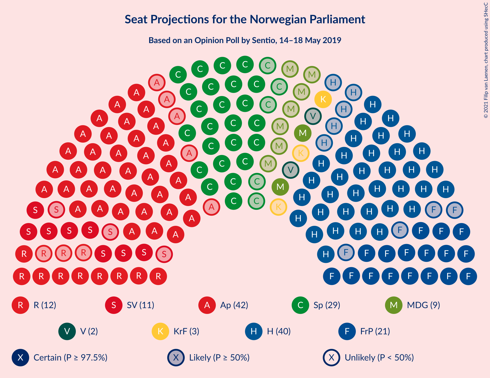
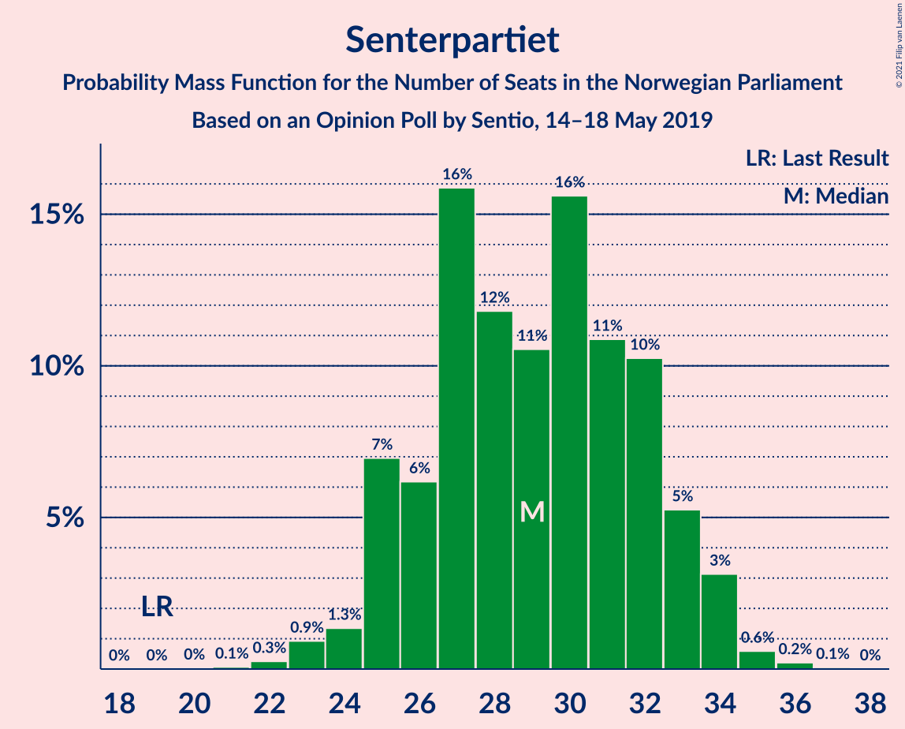
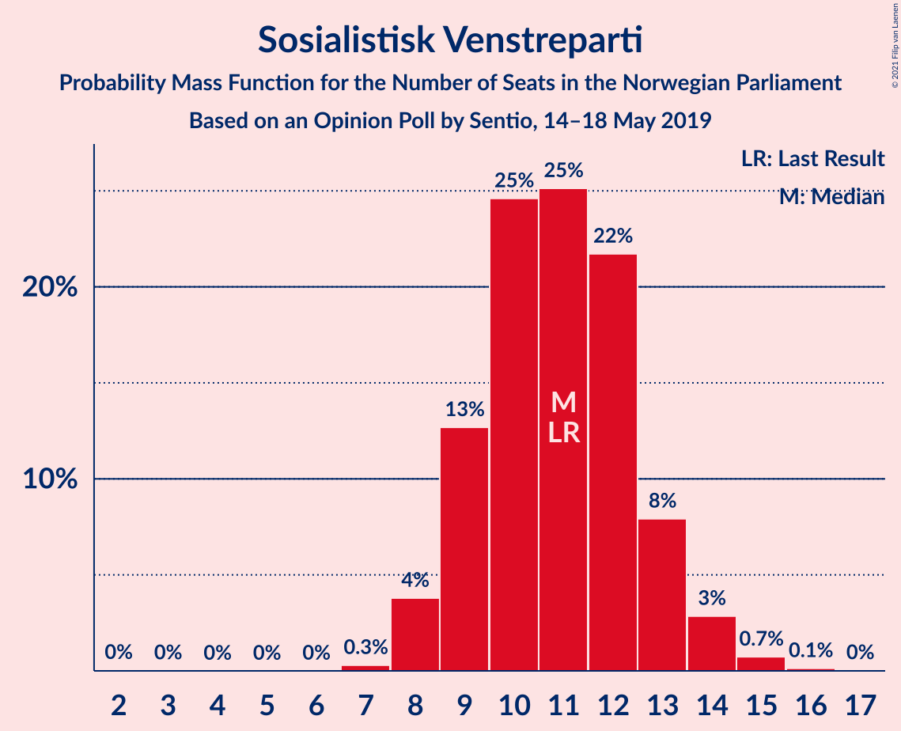
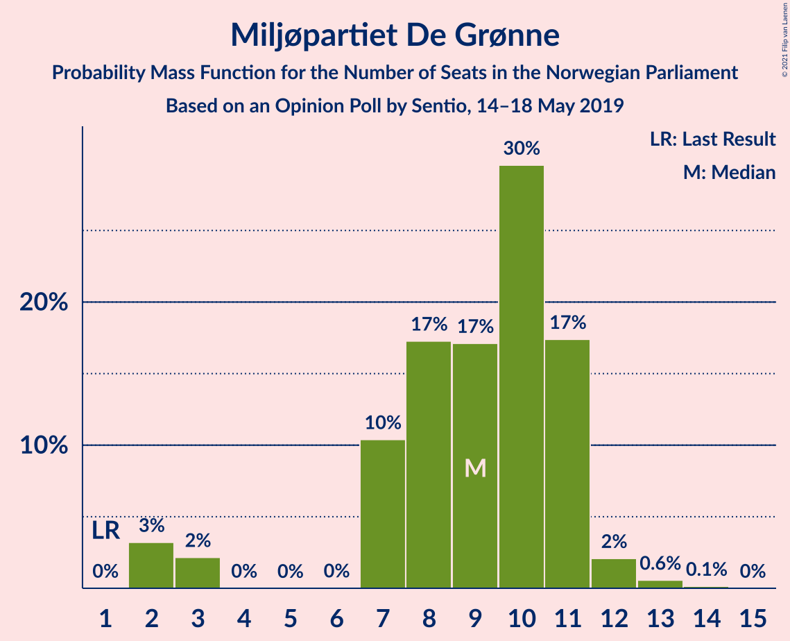
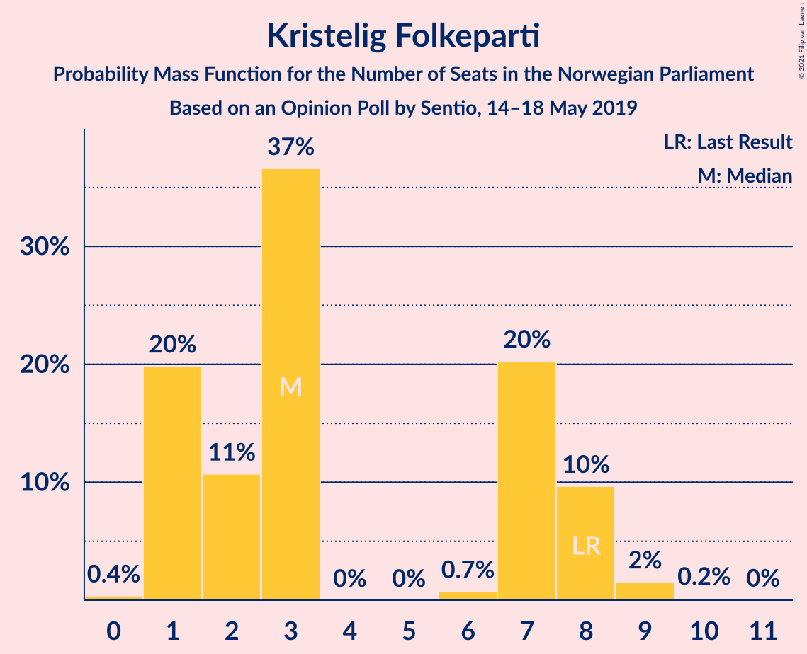
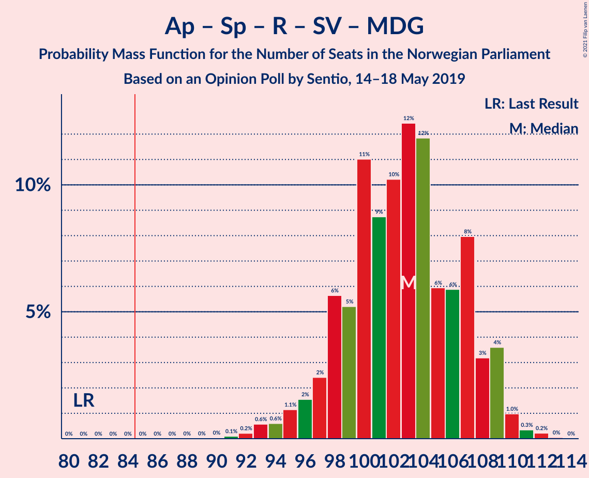
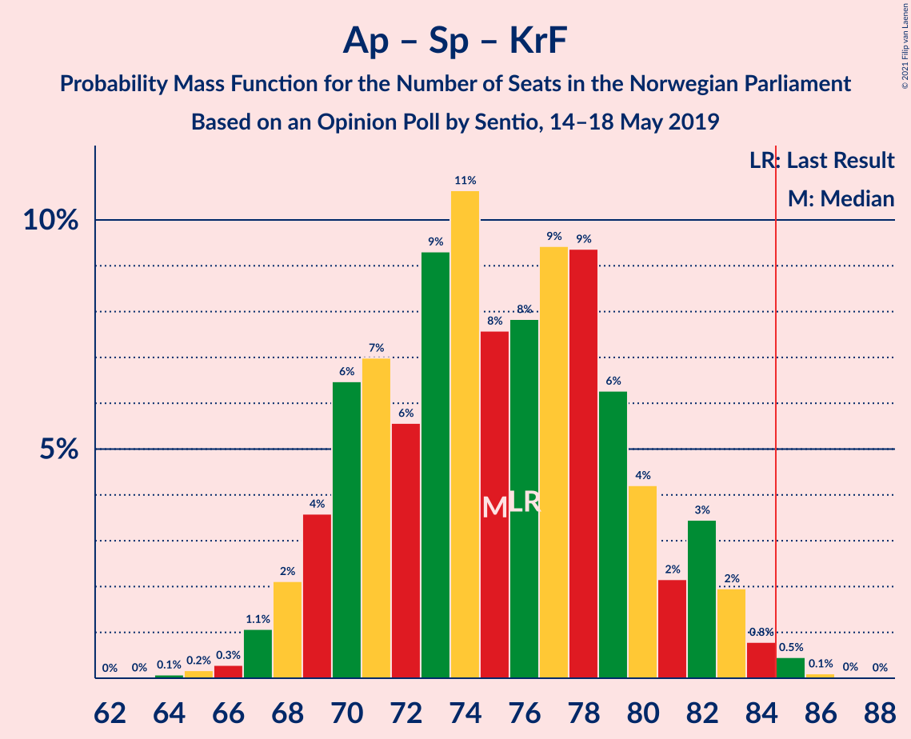
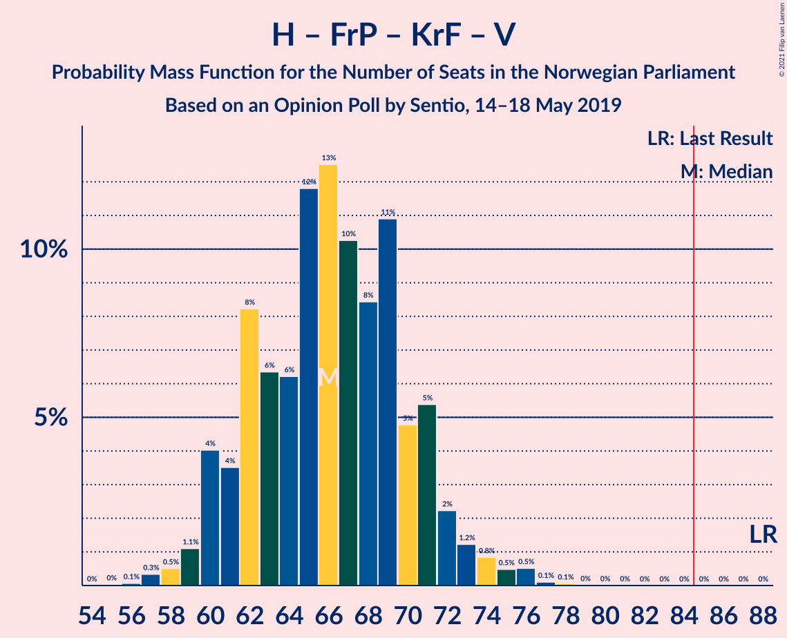
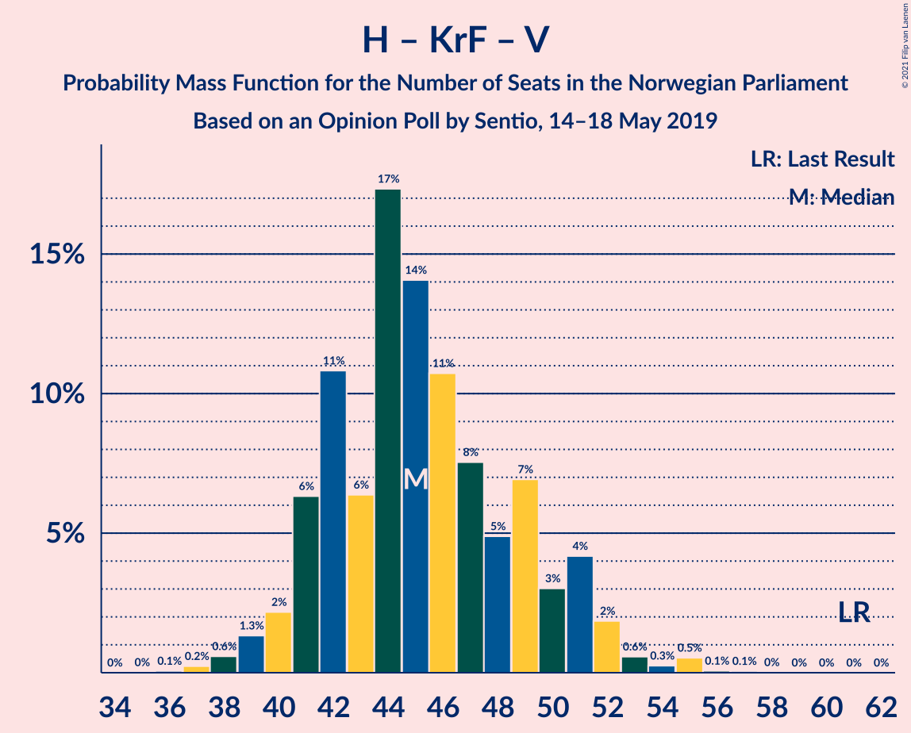
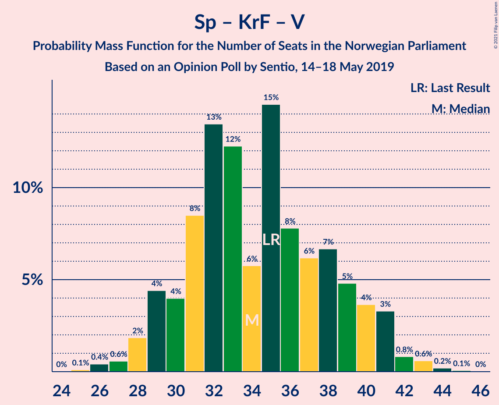

# Opinion Poll by Sentio, 14–18 May 2019

<a href="#voting-intentions">Voting Intentions</a> | <a href="#seats">Seats</a> | <a href="#coalitions">Coalitions</a> | <a href="#technical-information">Technical Information</a>

## Voting Intentions

### Confidence Intervals

| Party | Last Result | Poll Result | 80% Confidence Interval | 90% Confidence Interval | 95% Confidence Interval | 99% Confidence Interval |
|:-----:|:-----------:|:-----------:|:-----------------------:|:-----------------------:|:-----------------------:|:-----------------------:|
| Arbeiderpartiet | 27.4% | 23.1% | 21.4–24.9% |21.0–25.4% |20.6–25.8% |19.8–26.7% |
| Høyre | 25.0% | 22.6% | 21.0–24.4% |20.5–24.9% |20.1–25.3% |19.3–26.2% |
| Senterpartiet | 10.3% | 15.8% | 14.4–17.4% |14.0–17.8% |13.7–18.2% |13.0–19.0% |
| Fremskrittspartiet | 15.2% | 11.9% | 10.7–13.3% |10.3–13.7% |10.0–14.1% |9.5–14.8% |
| Rødt | 2.4% | 6.6% | 5.7–7.7% |5.4–8.0% |5.2–8.3% |4.8–8.9% |
| Sosialistisk Venstreparti | 6.0% | 6.1% | 5.2–7.2% |5.0–7.5% |4.8–7.8% |4.4–8.3% |
| Miljøpartiet De Grønne | 3.2% | 5.1% | 4.3–6.1% |4.1–6.4% |3.9–6.6% |3.6–7.2% |
| Kristelig Folkeparti | 4.2% | 3.6% | 2.9–4.5% |2.8–4.7% |2.6–5.0% |2.3–5.4% |
| Venstre | 4.4% | 2.3% | 1.8–3.0% |1.6–3.2% |1.5–3.4% |1.3–3.8% |

*Note:* The poll result column reflects the actual value used in the calculations. Published results may vary slightly, and in addition be rounded to fewer digits.

## Seats

### Confidence Intervals

| Party | Last Result | Median | 80% Confidence Interval | 90% Confidence Interval | 95% Confidence Interval | 99% Confidence Interval |
|:-----:|:-----------:|:------:|:-----------------------:|:-----------------------:|:-----------------------:|:-----------------------:|
| <a href="#arbeiderpartiet">Arbeiderpartiet</a> | 49 | 41 | 38–46 |37–46 |37–47 |36–49 |
| <a href="#høyre">Høyre</a> | 45 | 39 | 36–44 |35–45 |35–46 |33–48 |
| <a href="#senterpartiet">Senterpartiet</a> | 19 | 29 | 26–33 |25–34 |24–34 |22–35 |
| <a href="#fremskrittspartiet">Fremskrittspartiet</a> | 27 | 21 | 19–24 |18–25 |17–25 |16–28 |
| <a href="#rødt">Rødt</a> | 1 | 12 | 10–14 |10–14 |9–15 |8–16 |
| <a href="#sosialistisk-venstreparti">Sosialistisk Venstreparti</a> | 11 | 11 | 9–13 |8–14 |8–14 |7–15 |
| <a href="#miljøpartiet-de-grønne">Miljøpartiet De Grønne</a> | 1 | 9 | 7–11 |7–12 |3–12 |2–12 |
| <a href="#kristelig-folkeparti">Kristelig Folkeparti</a> | 8 | 3 | 1–8 |1–8 |1–8 |1–9 |
| <a href="#venstre">Venstre</a> | 8 | 2 | 0–2 |0–2 |0–2 |0–2 |

### Arbeiderpartiet

*For a full overview of the results for this party, see the [Arbeiderpartiet](party-arbeiderpartiet.html) page.*

| Number of Seats | Probability | Accumulated | Special Marks |
|:---------------:|:-----------:|:-----------:|:-------------:|
| 34 | 0.2% | 100% |  |
| 35 | 0.3% | 99.8% |  |
| 36 | 1.0% | 99.5% |  |
| 37 | 6% | 98.6% |  |
| 38 | 5% | 93% |  |
| 39 | 19% | 88% |  |
| 40 | 11% | 69% |  |
| 41 | 11% | 58% | Median |
| 42 | 3% | 47% |  |
| 43 | 3% | 44% |  |
| 44 | 29% | 41% |  |
| 45 | 2% | 12% |  |
| 46 | 5% | 10% |  |
| 47 | 3% | 5% |  |
| 48 | 1.1% | 2% |  |
| 49 | 0.3% | 0.8% | Last Result |
| 50 | 0.3% | 0.4% |  |
| 51 | 0.1% | 0.1% |  |
| 52 | 0% | 0.1% |  |
| 53 | 0% | 0% |  |

### Høyre

*For a full overview of the results for this party, see the [Høyre](party-høyre.html) page.*

| Number of Seats | Probability | Accumulated | Special Marks |
|:---------------:|:-----------:|:-----------:|:-------------:|
| 31 | 0.2% | 100% |  |
| 32 | 0.1% | 99.8% |  |
| 33 | 0.3% | 99.7% |  |
| 34 | 0.6% | 99.5% |  |
| 35 | 5% | 98.8% |  |
| 36 | 7% | 94% |  |
| 37 | 8% | 87% |  |
| 38 | 18% | 80% |  |
| 39 | 12% | 62% | Median |
| 40 | 9% | 50% |  |
| 41 | 9% | 41% |  |
| 42 | 4% | 31% |  |
| 43 | 17% | 27% |  |
| 44 | 3% | 11% |  |
| 45 | 4% | 7% | Last Result |
| 46 | 2% | 3% |  |
| 47 | 0.5% | 1.1% |  |
| 48 | 0.6% | 0.7% |  |
| 49 | 0% | 0.1% |  |
| 50 | 0% | 0.1% |  |
| 51 | 0% | 0% |  |

### Senterpartiet

*For a full overview of the results for this party, see the [Senterpartiet](party-senterpartiet.html) page.*

| Number of Seats | Probability | Accumulated | Special Marks |
|:---------------:|:-----------:|:-----------:|:-------------:|
| 19 | 0% | 100% | Last Result |
| 20 | 0% | 100% |  |
| 21 | 0.1% | 100% |  |
| 22 | 0.5% | 99.9% |  |
| 23 | 1.0% | 99.4% |  |
| 24 | 2% | 98% |  |
| 25 | 6% | 97% |  |
| 26 | 19% | 90% |  |
| 27 | 3% | 71% |  |
| 28 | 13% | 68% |  |
| 29 | 8% | 55% | Median |
| 30 | 21% | 47% |  |
| 31 | 7% | 26% |  |
| 32 | 8% | 19% |  |
| 33 | 6% | 11% |  |
| 34 | 4% | 5% |  |
| 35 | 0.7% | 1.0% |  |
| 36 | 0.2% | 0.3% |  |
| 37 | 0.1% | 0.1% |  |
| 38 | 0% | 0% |  |

### Fremskrittspartiet

*For a full overview of the results for this party, see the [Fremskrittspartiet](party-fremskrittspartiet.html) page.*

| Number of Seats | Probability | Accumulated | Special Marks |
|:---------------:|:-----------:|:-----------:|:-------------:|
| 15 | 0.1% | 100% |  |
| 16 | 0.5% | 99.9% |  |
| 17 | 2% | 99.4% |  |
| 18 | 7% | 97% |  |
| 19 | 13% | 90% |  |
| 20 | 26% | 77% |  |
| 21 | 8% | 52% | Median |
| 22 | 13% | 44% |  |
| 23 | 12% | 31% |  |
| 24 | 14% | 19% |  |
| 25 | 3% | 6% |  |
| 26 | 1.2% | 2% |  |
| 27 | 0.2% | 1.0% | Last Result |
| 28 | 0.7% | 0.7% |  |
| 29 | 0% | 0% |  |

### Rødt

*For a full overview of the results for this party, see the [Rødt](party-rødt.html) page.*

| Number of Seats | Probability | Accumulated | Special Marks |
|:---------------:|:-----------:|:-----------:|:-------------:|
| 1 | 0% | 100% | Last Result |
| 2 | 0% | 100% |  |
| 3 | 0% | 100% |  |
| 4 | 0% | 100% |  |
| 5 | 0% | 100% |  |
| 6 | 0% | 100% |  |
| 7 | 0.1% | 100% |  |
| 8 | 0.6% | 99.8% |  |
| 9 | 3% | 99.2% |  |
| 10 | 19% | 96% |  |
| 11 | 16% | 77% |  |
| 12 | 43% | 61% | Median |
| 13 | 8% | 18% |  |
| 14 | 6% | 10% |  |
| 15 | 4% | 5% |  |
| 16 | 0.4% | 0.7% |  |
| 17 | 0.3% | 0.3% |  |
| 18 | 0% | 0% |  |

### Sosialistisk Venstreparti

*For a full overview of the results for this party, see the [Sosialistisk Venstreparti](party-sosialistiskvenstreparti.html) page.*

| Number of Seats | Probability | Accumulated | Special Marks |
|:---------------:|:-----------:|:-----------:|:-------------:|
| 2 | 0.1% | 100% |  |
| 3 | 0% | 99.9% |  |
| 4 | 0% | 99.9% |  |
| 5 | 0% | 99.9% |  |
| 6 | 0% | 99.9% |  |
| 7 | 0.5% | 99.8% |  |
| 8 | 5% | 99.3% |  |
| 9 | 13% | 94% |  |
| 10 | 16% | 81% |  |
| 11 | 36% | 65% | Last Result, Median |
| 12 | 15% | 29% |  |
| 13 | 8% | 14% |  |
| 14 | 5% | 6% |  |
| 15 | 1.0% | 1.2% |  |
| 16 | 0.2% | 0.2% |  |
| 17 | 0.1% | 0.1% |  |
| 18 | 0% | 0% |  |

### Miljøpartiet De Grønne

*For a full overview of the results for this party, see the [Miljøpartiet De Grønne](party-miljøpartietdegrønne.html) page.*

| Number of Seats | Probability | Accumulated | Special Marks |
|:---------------:|:-----------:|:-----------:|:-------------:|
| 1 | 0% | 100% | Last Result |
| 2 | 2% | 100% |  |
| 3 | 0.5% | 98% |  |
| 4 | 0% | 97% |  |
| 5 | 0% | 97% |  |
| 6 | 0% | 97% |  |
| 7 | 14% | 97% |  |
| 8 | 26% | 83% |  |
| 9 | 17% | 57% | Median |
| 10 | 11% | 40% |  |
| 11 | 24% | 29% |  |
| 12 | 5% | 6% |  |
| 13 | 0.3% | 0.4% |  |
| 14 | 0.1% | 0.1% |  |
| 15 | 0% | 0% |  |

### Kristelig Folkeparti

*For a full overview of the results for this party, see the [Kristelig Folkeparti](party-kristeligfolkeparti.html) page.*

| Number of Seats | Probability | Accumulated | Special Marks |
|:---------------:|:-----------:|:-----------:|:-------------:|
| 0 | 0.2% | 100% |  |
| 1 | 26% | 99.8% |  |
| 2 | 9% | 74% |  |
| 3 | 27% | 65% | Median |
| 4 | 0% | 38% |  |
| 5 | 0% | 38% |  |
| 6 | 0.6% | 38% |  |
| 7 | 24% | 37% |  |
| 8 | 12% | 13% | Last Result |
| 9 | 1.4% | 2% |  |
| 10 | 0.1% | 0.2% |  |
| 11 | 0% | 0% |  |

### Venstre

*For a full overview of the results for this party, see the [Venstre](party-venstre.html) page.*

| Number of Seats | Probability | Accumulated | Special Marks |
|:---------------:|:-----------:|:-----------:|:-------------:|
| 0 | 20% | 100% |  |
| 1 | 22% | 80% |  |
| 2 | 58% | 58% | Median |
| 3 | 0.1% | 0.3% |  |
| 4 | 0% | 0.3% |  |
| 5 | 0% | 0.3% |  |
| 6 | 0.1% | 0.3% |  |
| 7 | 0.1% | 0.2% |  |
| 8 | 0% | 0% | Last Result |

## Coalitions

### Confidence Intervals

| Coalition | Last Result | Median | Majority? | 80% Confidence Interval | 90% Confidence Interval | 95% Confidence Interval | 99% Confidence Interval |
|:---------:|:-----------:|:------:|:---------:|:-----------------------:|:-----------------------:|:-----------------------:|:-----------------------:|
| Arbeiderpartiet – Senterpartiet – Rødt – Sosialistisk Venstreparti – Miljøpartiet De Grønne | 81 | 103 | 100% | 97–107 | 96–108 | 95–109 | 92–111 |
| Høyre – Senterpartiet – Fremskrittspartiet – Kristelig Folkeparti – Venstre | 107 | 96 | 99.9% | 92–100 | 90–101 | 89–101 | 87–104 |
| Arbeiderpartiet – Senterpartiet – Sosialistisk Venstreparti – Miljøpartiet De Grønne – Kristelig Folkeparti | 88 | 95 | 99.8% | 90–99 | 88–101 | 87–101 | 86–103 |
| Arbeiderpartiet – Senterpartiet – Rødt – Sosialistisk Venstreparti | 80 | 93 | 98% | 88–98 | 87–100 | 87–101 | 82–102 |
| Arbeiderpartiet – Senterpartiet – Sosialistisk Venstreparti – Miljøpartiet De Grønne | 80 | 91 | 95% | 86–95 | 85–98 | 84–98 | 80–99 |
| Arbeiderpartiet – Senterpartiet – Miljøpartiet De Grønne – Kristelig Folkeparti | 77 | 84 | 32% | 80–89 | 78–90 | 76–90 | 75–93 |
| Arbeiderpartiet – Senterpartiet – Sosialistisk Venstreparti | 79 | 81 | 17% | 77–86 | 75–88 | 74–90 | 71–92 |
| Arbeiderpartiet – Senterpartiet – Kristelig Folkeparti | 76 | 75 | 0.3% | 70–80 | 68–81 | 68–83 | 67–84 |
| Høyre – Fremskrittspartiet – Miljøpartiet De Grønne – Kristelig Folkeparti – Venstre | 89 | 76 | 1.3% | 71–80 | 69–82 | 68–82 | 66–86 |
| Arbeiderpartiet – Senterpartiet | 68 | 70 | 0% | 67–75 | 65–76 | 64–77 | 62–79 |
| Høyre – Fremskrittspartiet – Kristelig Folkeparti – Venstre | 88 | 66 | 0% | 62–71 | 60–72 | 60–73 | 57–77 |
| Høyre – Fremskrittspartiet – Venstre | 80 | 62 | 0% | 58–67 | 58–68 | 57–69 | 55–71 |
| Høyre – Fremskrittspartiet | 72 | 61 | 0% | 57–65 | 56–66 | 56–68 | 53–69 |
| Arbeiderpartiet – Sosialistisk Venstreparti | 60 | 52 | 0% | 48–58 | 47–59 | 47–59 | 46–61 |
| Høyre – Kristelig Folkeparti – Venstre | 61 | 46 | 0% | 41–50 | 41–51 | 40–52 | 38–56 |
| Senterpartiet – Kristelig Folkeparti – Venstre | 35 | 34 | 0% | 30–40 | 29–41 | 29–41 | 27–43 |

### Arbeiderpartiet – Senterpartiet – Rødt – Sosialistisk Venstreparti – Miljøpartiet De Grønne

| Number of Seats | Probability | Accumulated | Special Marks |
|:---------------:|:-----------:|:-----------:|:-------------:|
| 81 | 0% | 100% | Last Result |
| 82 | 0% | 100% |  |
| 83 | 0% | 100% |  |
| 84 | 0% | 100% |  |
| 85 | 0% | 100% | Majority |
| 86 | 0% | 100% |  |
| 87 | 0% | 100% |  |
| 88 | 0% | 100% |  |
| 89 | 0% | 100% |  |
| 90 | 0% | 100% |  |
| 91 | 0.2% | 99.9% |  |
| 92 | 1.0% | 99.7% |  |
| 93 | 0.2% | 98.7% |  |
| 94 | 0.3% | 98.5% |  |
| 95 | 2% | 98% |  |
| 96 | 1.4% | 96% |  |
| 97 | 5% | 95% |  |
| 98 | 4% | 90% |  |
| 99 | 8% | 86% |  |
| 100 | 13% | 78% |  |
| 101 | 3% | 65% |  |
| 102 | 10% | 62% | Median |
| 103 | 20% | 52% |  |
| 104 | 8% | 32% |  |
| 105 | 8% | 24% |  |
| 106 | 5% | 16% |  |
| 107 | 2% | 10% |  |
| 108 | 3% | 8% |  |
| 109 | 3% | 5% |  |
| 110 | 1.0% | 1.5% |  |
| 111 | 0.1% | 0.5% |  |
| 112 | 0.4% | 0.4% |  |
| 113 | 0% | 0% |  |

### Høyre – Senterpartiet – Fremskrittspartiet – Kristelig Folkeparti – Venstre

| Number of Seats | Probability | Accumulated | Special Marks |
|:---------------:|:-----------:|:-----------:|:-------------:|
| 84 | 0.1% | 100% |  |
| 85 | 0% | 99.9% | Majority |
| 86 | 0.2% | 99.9% |  |
| 87 | 0.4% | 99.7% |  |
| 88 | 0.6% | 99.3% |  |
| 89 | 3% | 98.7% |  |
| 90 | 4% | 96% |  |
| 91 | 1.4% | 92% |  |
| 92 | 14% | 90% |  |
| 93 | 2% | 76% |  |
| 94 | 4% | 73% | Median |
| 95 | 18% | 69% |  |
| 96 | 18% | 52% |  |
| 97 | 10% | 34% |  |
| 98 | 5% | 24% |  |
| 99 | 4% | 18% |  |
| 100 | 7% | 14% |  |
| 101 | 6% | 7% |  |
| 102 | 0.7% | 2% |  |
| 103 | 0.4% | 1.1% |  |
| 104 | 0.5% | 0.7% |  |
| 105 | 0.1% | 0.2% |  |
| 106 | 0% | 0.1% |  |
| 107 | 0% | 0% | Last Result |

### Arbeiderpartiet – Senterpartiet – Sosialistisk Venstreparti – Miljøpartiet De Grønne – Kristelig Folkeparti

| Number of Seats | Probability | Accumulated | Special Marks |
|:---------------:|:-----------:|:-----------:|:-------------:|
| 82 | 0% | 100% |  |
| 83 | 0% | 99.9% |  |
| 84 | 0.1% | 99.9% |  |
| 85 | 0.1% | 99.8% | Majority |
| 86 | 2% | 99.6% |  |
| 87 | 2% | 98% |  |
| 88 | 2% | 96% | Last Result |
| 89 | 4% | 94% |  |
| 90 | 5% | 90% |  |
| 91 | 1.2% | 85% |  |
| 92 | 16% | 84% |  |
| 93 | 5% | 69% | Median |
| 94 | 6% | 64% |  |
| 95 | 19% | 58% |  |
| 96 | 16% | 39% |  |
| 97 | 0.9% | 23% |  |
| 98 | 4% | 22% |  |
| 99 | 12% | 18% |  |
| 100 | 0.7% | 6% |  |
| 101 | 4% | 5% |  |
| 102 | 0.4% | 1.2% |  |
| 103 | 0.4% | 0.8% |  |
| 104 | 0.3% | 0.4% |  |
| 105 | 0% | 0.1% |  |
| 106 | 0% | 0% |  |

### Arbeiderpartiet – Senterpartiet – Rødt – Sosialistisk Venstreparti

| Number of Seats | Probability | Accumulated | Special Marks |
|:---------------:|:-----------:|:-----------:|:-------------:|
| 80 | 0% | 100% | Last Result |
| 81 | 0.1% | 100% |  |
| 82 | 0.4% | 99.9% |  |
| 83 | 0.1% | 99.5% |  |
| 84 | 0.9% | 99.3% |  |
| 85 | 0.6% | 98% | Majority |
| 86 | 0.2% | 98% |  |
| 87 | 6% | 98% |  |
| 88 | 3% | 92% |  |
| 89 | 7% | 89% |  |
| 90 | 4% | 82% |  |
| 91 | 6% | 78% |  |
| 92 | 14% | 72% |  |
| 93 | 17% | 58% | Median |
| 94 | 5% | 41% |  |
| 95 | 9% | 36% |  |
| 96 | 14% | 27% |  |
| 97 | 3% | 13% |  |
| 98 | 2% | 11% |  |
| 99 | 3% | 8% |  |
| 100 | 0.7% | 5% |  |
| 101 | 2% | 4% |  |
| 102 | 1.4% | 2% |  |
| 103 | 0.3% | 0.4% |  |
| 104 | 0.1% | 0.1% |  |
| 105 | 0% | 0.1% |  |
| 106 | 0% | 0.1% |  |
| 107 | 0% | 0.1% |  |
| 108 | 0% | 0% |  |

### Arbeiderpartiet – Senterpartiet – Sosialistisk Venstreparti – Miljøpartiet De Grønne

| Number of Seats | Probability | Accumulated | Special Marks |
|:---------------:|:-----------:|:-----------:|:-------------:|
| 79 | 0.1% | 100% |  |
| 80 | 1.0% | 99.9% | Last Result |
| 81 | 0.4% | 98.9% |  |
| 82 | 0.3% | 98.5% |  |
| 83 | 0.5% | 98% |  |
| 84 | 2% | 98% |  |
| 85 | 3% | 95% | Majority |
| 86 | 6% | 92% |  |
| 87 | 7% | 87% |  |
| 88 | 16% | 80% |  |
| 89 | 4% | 64% |  |
| 90 | 2% | 60% | Median |
| 91 | 17% | 59% |  |
| 92 | 15% | 42% |  |
| 93 | 13% | 27% |  |
| 94 | 2% | 14% |  |
| 95 | 3% | 12% |  |
| 96 | 3% | 9% |  |
| 97 | 1.3% | 6% |  |
| 98 | 4% | 5% |  |
| 99 | 0.6% | 1.0% |  |
| 100 | 0.1% | 0.4% |  |
| 101 | 0.1% | 0.4% |  |
| 102 | 0.2% | 0.2% |  |
| 103 | 0% | 0% |  |

### Arbeiderpartiet – Senterpartiet – Miljøpartiet De Grønne – Kristelig Folkeparti

| Number of Seats | Probability | Accumulated | Special Marks |
|:---------------:|:-----------:|:-----------:|:-------------:|
| 72 | 0.1% | 100% |  |
| 73 | 0.1% | 99.9% |  |
| 74 | 0.1% | 99.9% |  |
| 75 | 0.5% | 99.8% |  |
| 76 | 2% | 99.3% |  |
| 77 | 2% | 97% | Last Result |
| 78 | 1.2% | 95% |  |
| 79 | 3% | 94% |  |
| 80 | 8% | 91% |  |
| 81 | 15% | 83% |  |
| 82 | 10% | 69% | Median |
| 83 | 7% | 59% |  |
| 84 | 20% | 52% |  |
| 85 | 5% | 32% | Majority |
| 86 | 3% | 27% |  |
| 87 | 6% | 24% |  |
| 88 | 4% | 18% |  |
| 89 | 6% | 14% |  |
| 90 | 6% | 7% |  |
| 91 | 0.7% | 1.4% |  |
| 92 | 0.2% | 0.7% |  |
| 93 | 0.4% | 0.5% |  |
| 94 | 0.1% | 0.1% |  |
| 95 | 0% | 0% |  |

### Arbeiderpartiet – Senterpartiet – Sosialistisk Venstreparti

| Number of Seats | Probability | Accumulated | Special Marks |
|:---------------:|:-----------:|:-----------:|:-------------:|
| 70 | 0.4% | 100% |  |
| 71 | 0.1% | 99.6% |  |
| 72 | 0.7% | 99.4% |  |
| 73 | 0.2% | 98.7% |  |
| 74 | 3% | 98.6% |  |
| 75 | 1.1% | 95% |  |
| 76 | 3% | 94% |  |
| 77 | 7% | 91% |  |
| 78 | 4% | 84% |  |
| 79 | 3% | 80% | Last Result |
| 80 | 18% | 77% |  |
| 81 | 17% | 59% | Median |
| 82 | 3% | 42% |  |
| 83 | 4% | 38% |  |
| 84 | 17% | 34% |  |
| 85 | 4% | 17% | Majority |
| 86 | 5% | 13% |  |
| 87 | 2% | 8% |  |
| 88 | 2% | 6% |  |
| 89 | 0.3% | 4% |  |
| 90 | 3% | 4% |  |
| 91 | 0.3% | 0.8% |  |
| 92 | 0.5% | 0.6% |  |
| 93 | 0% | 0.1% |  |
| 94 | 0% | 0% |  |

### Arbeiderpartiet – Senterpartiet – Kristelig Folkeparti

| Number of Seats | Probability | Accumulated | Special Marks |
|:---------------:|:-----------:|:-----------:|:-------------:|
| 64 | 0.2% | 100% |  |
| 65 | 0% | 99.8% |  |
| 66 | 0.3% | 99.8% |  |
| 67 | 0.7% | 99.5% |  |
| 68 | 5% | 98.8% |  |
| 69 | 2% | 94% |  |
| 70 | 16% | 92% |  |
| 71 | 3% | 76% |  |
| 72 | 4% | 73% |  |
| 73 | 6% | 68% | Median |
| 74 | 9% | 63% |  |
| 75 | 13% | 54% |  |
| 76 | 4% | 41% | Last Result |
| 77 | 14% | 37% |  |
| 78 | 3% | 23% |  |
| 79 | 8% | 19% |  |
| 80 | 6% | 11% |  |
| 81 | 2% | 6% |  |
| 82 | 0.6% | 4% |  |
| 83 | 2% | 3% |  |
| 84 | 0.3% | 0.6% |  |
| 85 | 0.2% | 0.3% | Majority |
| 86 | 0% | 0.1% |  |
| 87 | 0% | 0.1% |  |
| 88 | 0.1% | 0.1% |  |
| 89 | 0% | 0% |  |

### Høyre – Fremskrittspartiet – Miljøpartiet De Grønne – Kristelig Folkeparti – Venstre

| Number of Seats | Probability | Accumulated | Special Marks |
|:---------------:|:-----------:|:-----------:|:-------------:|
| 62 | 0.1% | 100% |  |
| 63 | 0% | 99.9% |  |
| 64 | 0.1% | 99.9% |  |
| 65 | 0.2% | 99.9% |  |
| 66 | 0.3% | 99.6% |  |
| 67 | 2% | 99.3% |  |
| 68 | 2% | 98% |  |
| 69 | 0.8% | 95% |  |
| 70 | 3% | 94% |  |
| 71 | 3% | 91% |  |
| 72 | 3% | 88% |  |
| 73 | 14% | 86% |  |
| 74 | 9% | 72% | Median |
| 75 | 6% | 62% |  |
| 76 | 17% | 56% |  |
| 77 | 13% | 39% |  |
| 78 | 6% | 25% |  |
| 79 | 3% | 19% |  |
| 80 | 7% | 16% |  |
| 81 | 3% | 9% |  |
| 82 | 4% | 6% |  |
| 83 | 0.2% | 2% |  |
| 84 | 0.5% | 2% |  |
| 85 | 0.8% | 1.3% | Majority |
| 86 | 0.1% | 0.5% |  |
| 87 | 0.4% | 0.5% |  |
| 88 | 0.1% | 0.1% |  |
| 89 | 0% | 0% | Last Result |

### Arbeiderpartiet – Senterpartiet

| Number of Seats | Probability | Accumulated | Special Marks |
|:---------------:|:-----------:|:-----------:|:-------------:|
| 61 | 0.2% | 100% |  |
| 62 | 0.4% | 99.8% |  |
| 63 | 1.3% | 99.4% |  |
| 64 | 0.7% | 98% |  |
| 65 | 4% | 97% |  |
| 66 | 2% | 93% |  |
| 67 | 10% | 91% |  |
| 68 | 2% | 81% | Last Result |
| 69 | 17% | 78% |  |
| 70 | 13% | 61% | Median |
| 71 | 9% | 48% |  |
| 72 | 16% | 39% |  |
| 73 | 6% | 23% |  |
| 74 | 5% | 17% |  |
| 75 | 4% | 13% |  |
| 76 | 4% | 9% |  |
| 77 | 2% | 4% |  |
| 78 | 2% | 2% |  |
| 79 | 0.3% | 0.8% |  |
| 80 | 0.4% | 0.5% |  |
| 81 | 0% | 0.1% |  |
| 82 | 0% | 0% |  |

### Høyre – Fremskrittspartiet – Kristelig Folkeparti – Venstre

| Number of Seats | Probability | Accumulated | Special Marks |
|:---------------:|:-----------:|:-----------:|:-------------:|
| 56 | 0% | 100% |  |
| 57 | 0.5% | 99.9% |  |
| 58 | 0.2% | 99.4% |  |
| 59 | 1.0% | 99.3% |  |
| 60 | 4% | 98% |  |
| 61 | 3% | 95% |  |
| 62 | 2% | 91% |  |
| 63 | 6% | 89% |  |
| 64 | 9% | 83% |  |
| 65 | 8% | 75% | Median |
| 66 | 21% | 67% |  |
| 67 | 11% | 46% |  |
| 68 | 3% | 35% |  |
| 69 | 13% | 32% |  |
| 70 | 8% | 20% |  |
| 71 | 4% | 12% |  |
| 72 | 5% | 8% |  |
| 73 | 1.1% | 3% |  |
| 74 | 0.3% | 2% |  |
| 75 | 0.2% | 1.4% |  |
| 76 | 0.2% | 1.2% |  |
| 77 | 0.9% | 1.1% |  |
| 78 | 0.1% | 0.2% |  |
| 79 | 0% | 0% |  |
| 80 | 0% | 0% |  |
| 81 | 0% | 0% |  |
| 82 | 0% | 0% |  |
| 83 | 0% | 0% |  |
| 84 | 0% | 0% |  |
| 85 | 0% | 0% | Majority |
| 86 | 0% | 0% |  |
| 87 | 0% | 0% |  |
| 88 | 0% | 0% | Last Result |

### Høyre – Fremskrittspartiet – Venstre

| Number of Seats | Probability | Accumulated | Special Marks |
|:---------------:|:-----------:|:-----------:|:-------------:|
| 53 | 0.1% | 100% |  |
| 54 | 0.3% | 99.8% |  |
| 55 | 0.7% | 99.5% |  |
| 56 | 0.7% | 98.8% |  |
| 57 | 1.3% | 98% |  |
| 58 | 7% | 97% |  |
| 59 | 7% | 89% |  |
| 60 | 8% | 83% |  |
| 61 | 12% | 75% |  |
| 62 | 19% | 63% | Median |
| 63 | 6% | 44% |  |
| 64 | 8% | 38% |  |
| 65 | 16% | 30% |  |
| 66 | 2% | 14% |  |
| 67 | 7% | 12% |  |
| 68 | 1.2% | 5% |  |
| 69 | 2% | 4% |  |
| 70 | 1.0% | 2% |  |
| 71 | 0.8% | 1.0% |  |
| 72 | 0% | 0.2% |  |
| 73 | 0.1% | 0.2% |  |
| 74 | 0% | 0% |  |
| 75 | 0% | 0% |  |
| 76 | 0% | 0% |  |
| 77 | 0% | 0% |  |
| 78 | 0% | 0% |  |
| 79 | 0% | 0% |  |
| 80 | 0% | 0% | Last Result |

### Høyre – Fremskrittspartiet

| Number of Seats | Probability | Accumulated | Special Marks |
|:---------------:|:-----------:|:-----------:|:-------------:|
| 51 | 0.1% | 100% |  |
| 52 | 0.2% | 99.9% |  |
| 53 | 0.4% | 99.6% |  |
| 54 | 0.3% | 99.2% |  |
| 55 | 1.2% | 98.9% |  |
| 56 | 5% | 98% |  |
| 57 | 5% | 92% |  |
| 58 | 12% | 88% |  |
| 59 | 6% | 76% |  |
| 60 | 6% | 70% | Median |
| 61 | 15% | 64% |  |
| 62 | 15% | 49% |  |
| 63 | 19% | 34% |  |
| 64 | 3% | 15% |  |
| 65 | 4% | 13% |  |
| 66 | 4% | 8% |  |
| 67 | 1.5% | 4% |  |
| 68 | 1.4% | 3% |  |
| 69 | 1.1% | 1.3% |  |
| 70 | 0% | 0.2% |  |
| 71 | 0.2% | 0.2% |  |
| 72 | 0% | 0% | Last Result |

### Arbeiderpartiet – Sosialistisk Venstreparti

| Number of Seats | Probability | Accumulated | Special Marks |
|:---------------:|:-----------:|:-----------:|:-------------:|
| 43 | 0% | 100% |  |
| 44 | 0.1% | 99.9% |  |
| 45 | 0.2% | 99.8% |  |
| 46 | 1.2% | 99.6% |  |
| 47 | 6% | 98% |  |
| 48 | 9% | 93% |  |
| 49 | 5% | 84% |  |
| 50 | 15% | 79% |  |
| 51 | 10% | 63% |  |
| 52 | 4% | 54% | Median |
| 53 | 7% | 49% |  |
| 54 | 3% | 42% |  |
| 55 | 15% | 38% |  |
| 56 | 9% | 23% |  |
| 57 | 2% | 14% |  |
| 58 | 6% | 13% |  |
| 59 | 5% | 6% |  |
| 60 | 1.1% | 2% | Last Result |
| 61 | 0.4% | 0.5% |  |
| 62 | 0.1% | 0.1% |  |
| 63 | 0% | 0% |  |

### Høyre – Kristelig Folkeparti – Venstre

| Number of Seats | Probability | Accumulated | Special Marks |
|:---------------:|:-----------:|:-----------:|:-------------:|
| 36 | 0% | 100% |  |
| 37 | 0.4% | 99.9% |  |
| 38 | 0.6% | 99.6% |  |
| 39 | 0.8% | 98.9% |  |
| 40 | 2% | 98% |  |
| 41 | 6% | 96% |  |
| 42 | 11% | 89% |  |
| 43 | 3% | 78% |  |
| 44 | 12% | 75% | Median |
| 45 | 12% | 62% |  |
| 46 | 24% | 51% |  |
| 47 | 6% | 27% |  |
| 48 | 4% | 21% |  |
| 49 | 5% | 17% |  |
| 50 | 6% | 12% |  |
| 51 | 1.3% | 6% |  |
| 52 | 3% | 4% |  |
| 53 | 0.3% | 2% |  |
| 54 | 0.5% | 1.3% |  |
| 55 | 0.2% | 0.8% |  |
| 56 | 0.6% | 0.6% |  |
| 57 | 0% | 0% |  |
| 58 | 0% | 0% |  |
| 59 | 0% | 0% |  |
| 60 | 0% | 0% |  |
| 61 | 0% | 0% | Last Result |

### Senterpartiet – Kristelig Folkeparti – Venstre

| Number of Seats | Probability | Accumulated | Special Marks |
|:---------------:|:-----------:|:-----------:|:-------------:|
| 25 | 0.2% | 100% |  |
| 26 | 0.2% | 99.8% |  |
| 27 | 0.6% | 99.6% |  |
| 28 | 0.8% | 99.0% |  |
| 29 | 7% | 98% |  |
| 30 | 3% | 91% |  |
| 31 | 7% | 88% |  |
| 32 | 4% | 80% |  |
| 33 | 26% | 76% |  |
| 34 | 12% | 51% | Median |
| 35 | 7% | 39% | Last Result |
| 36 | 5% | 31% |  |
| 37 | 6% | 26% |  |
| 38 | 5% | 20% |  |
| 39 | 4% | 15% |  |
| 40 | 4% | 11% |  |
| 41 | 4% | 6% |  |
| 42 | 0.9% | 2% |  |
| 43 | 0.4% | 0.8% |  |
| 44 | 0.2% | 0.4% |  |
| 45 | 0.2% | 0.2% |  |
| 46 | 0% | 0% |  |

## Technical Information

### Opinion Poll

+ **Polling firm:** Sentio
+ **Commissioner(s):** —
+ **Fieldwork period:** 14–18 May 2019

### Calculations

+ **Sample size:** 1000
+ **Simulations done:** 131,072
+ **Error estimate:** 2.55%

