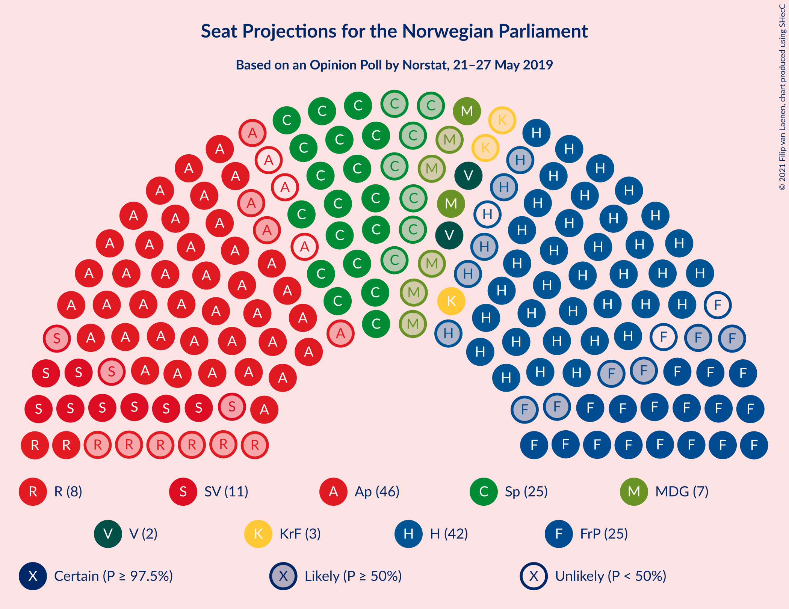
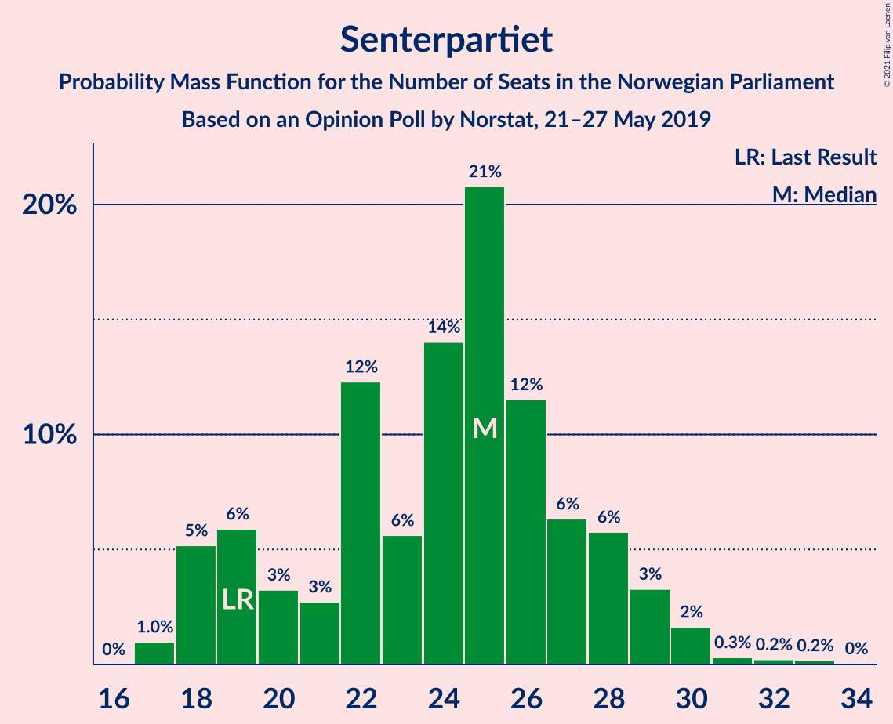
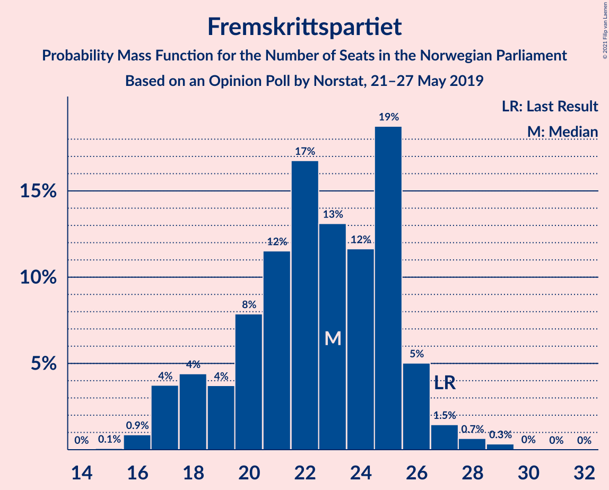
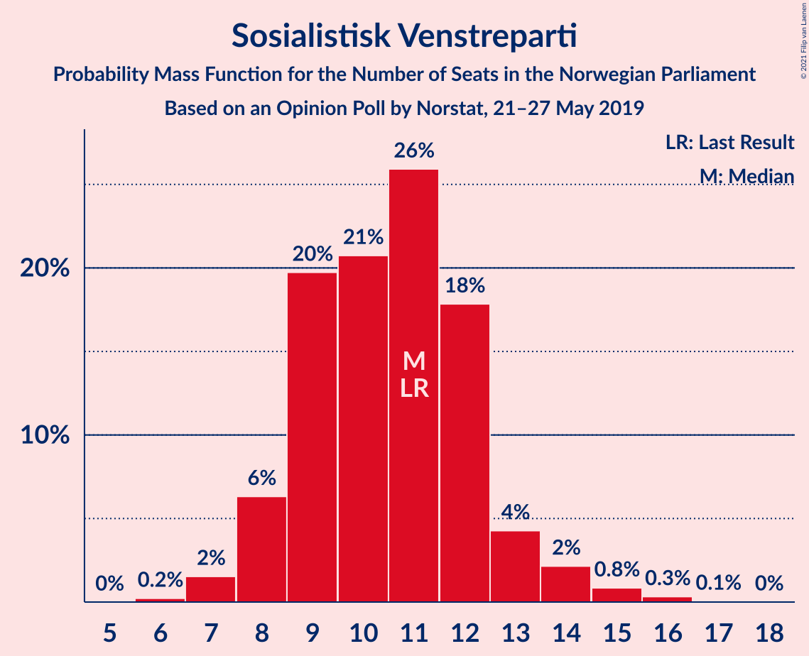
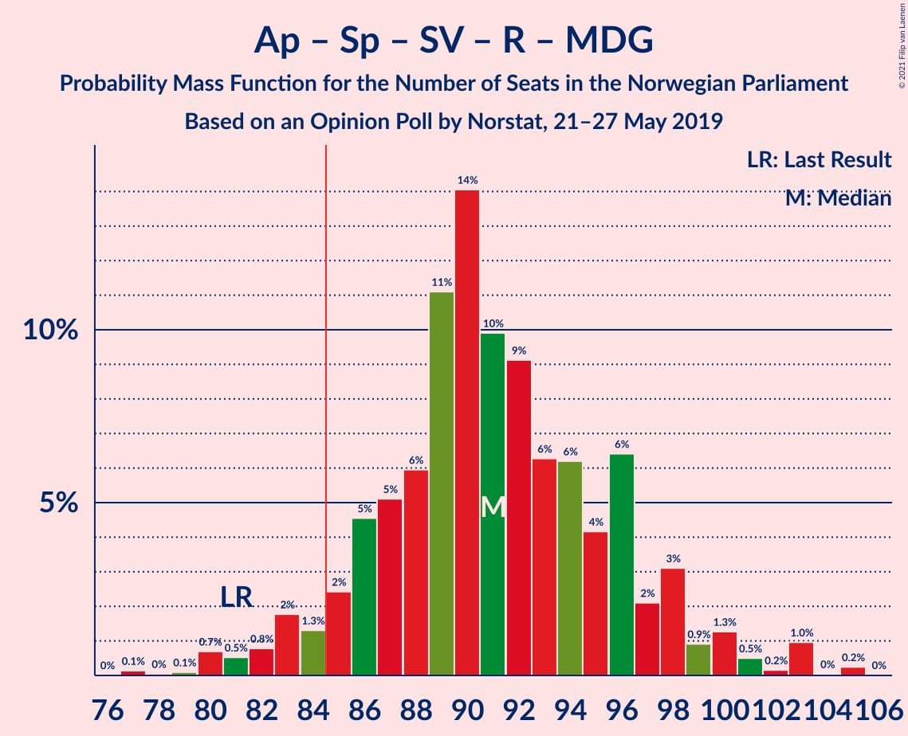
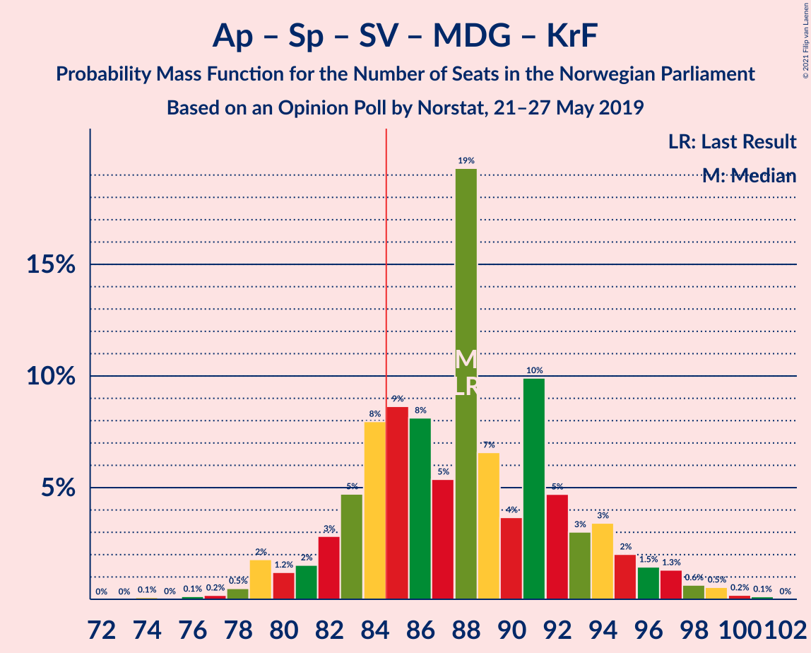
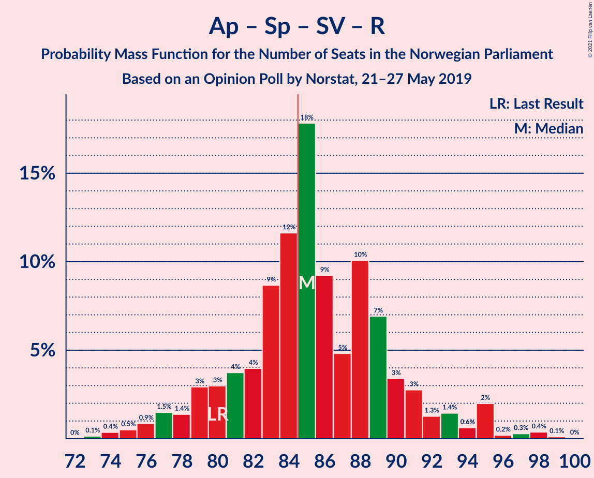
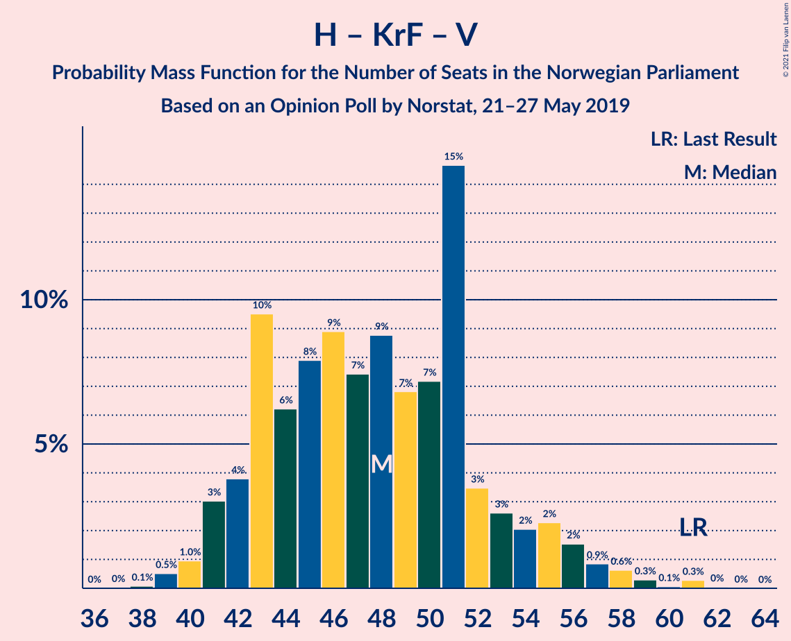

# Opinion Poll by Norstat, 21–27 May 2019

<a href="#voting-intentions">Voting Intentions</a> | <a href="#seats">Seats</a> | <a href="#coalitions">Coalitions</a> | <a href="#technical-information">Technical Information</a>

## Voting Intentions

### Confidence Intervals

| Party | Last Result | Poll Result | 80% Confidence Interval | 90% Confidence Interval | 95% Confidence Interval | 99% Confidence Interval |
|:-----:|:-----------:|:-----------:|:-----------------------:|:-----------------------:|:-----------------------:|:-----------------------:|
| Arbeiderpartiet | 27.4% | 23.7% | 22.0–25.6% |21.5–26.1% |21.1–26.6% |20.3–27.5% |
| Høyre | 25.0% | 22.9% | 21.2–24.7% |20.7–25.2% |20.3–25.7% |19.5–26.6% |
| Senterpartiet | 10.3% | 13.3% | 12.0–14.8% |11.6–15.3% |11.3–15.6% |10.7–16.4% |
| Fremskrittspartiet | 15.2% | 12.4% | 11.2–13.9% |10.8–14.4% |10.5–14.7% |9.9–15.5% |
| Sosialistisk Venstreparti | 6.0% | 6.5% | 5.6–7.6% |5.3–8.0% |5.1–8.3% |4.7–8.8% |
| Rødt | 2.4% | 4.8% | 4.0–5.8% |3.8–6.1% |3.6–6.4% |3.2–6.9% |
| Miljøpartiet De Grønne | 3.2% | 4.3% | 3.5–5.2% |3.3–5.5% |3.1–5.7% |2.8–6.2% |
| Kristelig Folkeparti | 4.2% | 3.7% | 3.0–4.6% |2.9–4.9% |2.7–5.1% |2.4–5.6% |
| Venstre | 4.4% | 3.4% | 2.8–4.3% |2.6–4.5% |2.4–4.8% |2.1–5.2% |

*Note:* The poll result column reflects the actual value used in the calculations. Published results may vary slightly, and in addition be rounded to fewer digits.

## Seats

### Confidence Intervals

| Party | Last Result | Median | 80% Confidence Interval | 90% Confidence Interval | 95% Confidence Interval | 99% Confidence Interval |
|:-----:|:-----------:|:------:|:-----------------------:|:-----------------------:|:-----------------------:|:-----------------------:|
| <a href="#arbeiderpartiet">Arbeiderpartiet</a> | 49 | 43 | 40–47 |40–47 |39–49 |36–53 |
| <a href="#høyre">Høyre</a> | 45 | 42 | 38–44 |36–47 |36–47 |35–50 |
| <a href="#senterpartiet">Senterpartiet</a> | 19 | 24 | 20–27 |19–28 |18–29 |17–31 |
| <a href="#fremskrittspartiet">Fremskrittspartiet</a> | 27 | 23 | 19–25 |18–26 |17–28 |16–29 |
| <a href="#sosialistisk-venstreparti">Sosialistisk Venstreparti</a> | 11 | 10 | 9–13 |8–14 |8–14 |7–15 |
| <a href="#rødt">Rødt</a> | 1 | 9 | 6–10 |2–10 |2–11 |2–12 |
| <a href="#miljøpartiet-de-grønne">Miljøpartiet De Grønne</a> | 1 | 3 | 2–8 |2–9 |1–10 |1–10 |
| <a href="#kristelig-folkeparti">Kristelig Folkeparti</a> | 8 | 3 | 2–7 |1–8 |1–8 |1–9 |
| <a href="#venstre">Venstre</a> | 8 | 2 | 2–7 |1–7 |1–7 |1–8 |

### Arbeiderpartiet

*For a full overview of the results for this party, see the [Arbeiderpartiet](party-arbeiderpartiet.html) page.*

| Number of Seats | Probability | Accumulated | Special Marks |
|:---------------:|:-----------:|:-----------:|:-------------:|
| 35 | 0% | 100% |  |
| 36 | 0.5% | 99.9% |  |
| 37 | 0.5% | 99.5% |  |
| 38 | 0.1% | 98.9% |  |
| 39 | 3% | 98.8% |  |
| 40 | 14% | 96% |  |
| 41 | 6% | 83% |  |
| 42 | 20% | 77% |  |
| 43 | 15% | 56% | Median |
| 44 | 11% | 42% |  |
| 45 | 13% | 30% |  |
| 46 | 5% | 17% |  |
| 47 | 7% | 12% |  |
| 48 | 1.5% | 5% |  |
| 49 | 1.2% | 3% | Last Result |
| 50 | 1.1% | 2% |  |
| 51 | 0.2% | 1.1% |  |
| 52 | 0.3% | 0.9% |  |
| 53 | 0.1% | 0.6% |  |
| 54 | 0.3% | 0.5% |  |
| 55 | 0.2% | 0.2% |  |
| 56 | 0% | 0% |  |

### Høyre

*For a full overview of the results for this party, see the [Høyre](party-høyre.html) page.*

| Number of Seats | Probability | Accumulated | Special Marks |
|:---------------:|:-----------:|:-----------:|:-------------:|
| 33 | 0.1% | 100% |  |
| 34 | 0.1% | 99.9% |  |
| 35 | 0.4% | 99.8% |  |
| 36 | 5% | 99.4% |  |
| 37 | 4% | 95% |  |
| 38 | 12% | 91% |  |
| 39 | 4% | 79% |  |
| 40 | 16% | 76% |  |
| 41 | 5% | 60% |  |
| 42 | 9% | 55% | Median |
| 43 | 31% | 46% |  |
| 44 | 6% | 15% |  |
| 45 | 2% | 9% | Last Result |
| 46 | 0.6% | 7% |  |
| 47 | 4% | 6% |  |
| 48 | 1.0% | 2% |  |
| 49 | 0.6% | 1.1% |  |
| 50 | 0.3% | 0.5% |  |
| 51 | 0.2% | 0.2% |  |
| 52 | 0% | 0% |  |

### Senterpartiet

*For a full overview of the results for this party, see the [Senterpartiet](party-senterpartiet.html) page.*

| Number of Seats | Probability | Accumulated | Special Marks |
|:---------------:|:-----------:|:-----------:|:-------------:|
| 17 | 0.8% | 100% |  |
| 18 | 4% | 99.2% |  |
| 19 | 4% | 95% | Last Result |
| 20 | 4% | 91% |  |
| 21 | 7% | 87% |  |
| 22 | 6% | 80% |  |
| 23 | 2% | 74% |  |
| 24 | 22% | 72% | Median |
| 25 | 26% | 50% |  |
| 26 | 14% | 24% |  |
| 27 | 4% | 10% |  |
| 28 | 3% | 7% |  |
| 29 | 2% | 3% |  |
| 30 | 0.5% | 1.0% |  |
| 31 | 0.3% | 0.5% |  |
| 32 | 0.1% | 0.2% |  |
| 33 | 0.1% | 0.2% |  |
| 34 | 0.1% | 0.1% |  |
| 35 | 0% | 0% |  |

### Fremskrittspartiet

*For a full overview of the results for this party, see the [Fremskrittspartiet](party-fremskrittspartiet.html) page.*

| Number of Seats | Probability | Accumulated | Special Marks |
|:---------------:|:-----------:|:-----------:|:-------------:|
| 15 | 0% | 100% |  |
| 16 | 1.4% | 99.9% |  |
| 17 | 2% | 98.6% |  |
| 18 | 2% | 97% |  |
| 19 | 7% | 94% |  |
| 20 | 4% | 88% |  |
| 21 | 9% | 84% |  |
| 22 | 1.0% | 75% |  |
| 23 | 29% | 74% | Median |
| 24 | 20% | 45% |  |
| 25 | 19% | 25% |  |
| 26 | 2% | 7% |  |
| 27 | 2% | 5% | Last Result |
| 28 | 2% | 3% |  |
| 29 | 0.4% | 0.7% |  |
| 30 | 0.2% | 0.2% |  |
| 31 | 0% | 0% |  |

### Sosialistisk Venstreparti

*For a full overview of the results for this party, see the [Sosialistisk Venstreparti](party-sosialistiskvenstreparti.html) page.*

| Number of Seats | Probability | Accumulated | Special Marks |
|:---------------:|:-----------:|:-----------:|:-------------:|
| 6 | 0.2% | 100% |  |
| 7 | 0.7% | 99.8% |  |
| 8 | 5% | 99.0% |  |
| 9 | 17% | 94% |  |
| 10 | 30% | 77% | Median |
| 11 | 8% | 47% | Last Result |
| 12 | 29% | 39% |  |
| 13 | 5% | 10% |  |
| 14 | 5% | 5% |  |
| 15 | 0.5% | 0.6% |  |
| 16 | 0.1% | 0.2% |  |
| 17 | 0.1% | 0.1% |  |
| 18 | 0% | 0% |  |

### Rødt

*For a full overview of the results for this party, see the [Rødt](party-rødt.html) page.*

| Number of Seats | Probability | Accumulated | Special Marks |
|:---------------:|:-----------:|:-----------:|:-------------:|
| 1 | 0.1% | 100% | Last Result |
| 2 | 8% | 99.9% |  |
| 3 | 0% | 92% |  |
| 4 | 0% | 92% |  |
| 5 | 0.2% | 92% |  |
| 6 | 7% | 92% |  |
| 7 | 6% | 85% |  |
| 8 | 23% | 79% |  |
| 9 | 36% | 56% | Median |
| 10 | 17% | 20% |  |
| 11 | 2% | 3% |  |
| 12 | 0.9% | 1.0% |  |
| 13 | 0.1% | 0.1% |  |
| 14 | 0% | 0% |  |

### Miljøpartiet De Grønne

*For a full overview of the results for this party, see the [Miljøpartiet De Grønne](party-miljøpartietdegrønne.html) page.*

| Number of Seats | Probability | Accumulated | Special Marks |
|:---------------:|:-----------:|:-----------:|:-------------:|
| 1 | 3% | 100% | Last Result |
| 2 | 41% | 97% |  |
| 3 | 28% | 56% | Median |
| 4 | 0.1% | 28% |  |
| 5 | 0.1% | 28% |  |
| 6 | 2% | 28% |  |
| 7 | 10% | 26% |  |
| 8 | 7% | 16% |  |
| 9 | 6% | 9% |  |
| 10 | 3% | 3% |  |
| 11 | 0.3% | 0.4% |  |
| 12 | 0.1% | 0.1% |  |
| 13 | 0% | 0% |  |

### Kristelig Folkeparti

*For a full overview of the results for this party, see the [Kristelig Folkeparti](party-kristeligfolkeparti.html) page.*

| Number of Seats | Probability | Accumulated | Special Marks |
|:---------------:|:-----------:|:-----------:|:-------------:|
| 0 | 0.2% | 100% |  |
| 1 | 5% | 99.8% |  |
| 2 | 18% | 95% |  |
| 3 | 46% | 76% | Median |
| 4 | 0% | 30% |  |
| 5 | 0.9% | 30% |  |
| 6 | 6% | 29% |  |
| 7 | 15% | 23% |  |
| 8 | 7% | 8% | Last Result |
| 9 | 0.7% | 0.9% |  |
| 10 | 0.1% | 0.2% |  |
| 11 | 0% | 0% |  |

### Venstre

*For a full overview of the results for this party, see the [Venstre](party-venstre.html) page.*

| Number of Seats | Probability | Accumulated | Special Marks |
|:---------------:|:-----------:|:-----------:|:-------------:|
| 1 | 7% | 100% |  |
| 2 | 68% | 93% | Median |
| 3 | 4% | 25% |  |
| 4 | 0.1% | 21% |  |
| 5 | 0.8% | 21% |  |
| 6 | 3% | 20% |  |
| 7 | 16% | 18% |  |
| 8 | 1.0% | 1.2% | Last Result |
| 9 | 0.1% | 0.2% |  |
| 10 | 0% | 0% |  |

## Coalitions

### Confidence Intervals

| Coalition | Last Result | Median | Majority? | 80% Confidence Interval | 90% Confidence Interval | 95% Confidence Interval | 99% Confidence Interval |
|:---------:|:-----------:|:------:|:---------:|:-----------------------:|:-----------------------:|:-----------------------:|:-----------------------:|
| Høyre – Senterpartiet – Fremskrittspartiet – Kristelig Folkeparti – Venstre | 107 | 96 | 99.8% | 90–99 | 88–101 | 85–103 | 85–107 |
| Arbeiderpartiet – Senterpartiet – Sosialistisk Venstreparti – Rødt – Miljøpartiet De Grønne | 81 | 90 | 94% | 86–95 | 84–98 | 83–98 | 80–104 |
| Arbeiderpartiet – Senterpartiet – Sosialistisk Venstreparti – Miljøpartiet De Grønne – Kristelig Folkeparti | 88 | 84 | 49% | 79–92 | 79–93 | 79–97 | 74–98 |
| Arbeiderpartiet – Senterpartiet – Sosialistisk Venstreparti – Rødt | 80 | 87 | 68% | 81–89 | 79–90 | 78–93 | 75–96 |
| Arbeiderpartiet – Senterpartiet – Sosialistisk Venstreparti – Miljøpartiet De Grønne | 80 | 81 | 18% | 76–88 | 76–90 | 76–92 | 72–95 |
| Arbeiderpartiet – Senterpartiet – Sosialistisk Venstreparti | 79 | 79 | 3% | 74–81 | 73–83 | 70–85 | 69–87 |
| Høyre – Fremskrittspartiet – Miljøpartiet De Grønne – Kristelig Folkeparti – Venstre | 89 | 74 | 2% | 71–82 | 71–84 | 70–84 | 65–86 |
| Arbeiderpartiet – Senterpartiet – Miljøpartiet De Grønne – Kristelig Folkeparti | 77 | 75 | 2% | 69–81 | 69–83 | 68–84 | 65–88 |
| Høyre – Fremskrittspartiet – Kristelig Folkeparti – Venstre | 88 | 71 | 0% | 67–76 | 64–77 | 63–81 | 62–82 |
| Arbeiderpartiet – Senterpartiet – Kristelig Folkeparti | 76 | 70 | 0% | 67–76 | 66–77 | 65–80 | 62–82 |
| Arbeiderpartiet – Senterpartiet | 68 | 67 | 0% | 63–71 | 62–73 | 61–74 | 59–77 |
| Høyre – Fremskrittspartiet – Venstre | 80 | 68 | 0% | 63–72 | 61–73 | 60–74 | 58–79 |
| Høyre – Fremskrittspartiet | 72 | 65 | 0% | 60–67 | 58–69 | 58–71 | 54–72 |
| Arbeiderpartiet – Sosialistisk Venstreparti | 60 | 54 | 0% | 50–57 | 50–59 | 48–60 | 46–63 |
| Høyre – Kristelig Folkeparti – Venstre | 61 | 47 | 0% | 45–54 | 43–56 | 41–56 | 40–58 |
| Senterpartiet – Kristelig Folkeparti – Venstre | 35 | 31 | 0% | 27–34 | 25–37 | 24–38 | 22–41 |

### Høyre – Senterpartiet – Fremskrittspartiet – Kristelig Folkeparti – Venstre

| Number of Seats | Probability | Accumulated | Special Marks |
|:---------------:|:-----------:|:-----------:|:-------------:|
| 81 | 0.1% | 100% |  |
| 82 | 0% | 99.9% |  |
| 83 | 0% | 99.9% |  |
| 84 | 0.1% | 99.8% |  |
| 85 | 2% | 99.8% | Majority |
| 86 | 0.8% | 97% |  |
| 87 | 0.5% | 97% |  |
| 88 | 4% | 96% |  |
| 89 | 0.5% | 92% |  |
| 90 | 2% | 91% |  |
| 91 | 0.8% | 89% |  |
| 92 | 9% | 88% |  |
| 93 | 3% | 79% |  |
| 94 | 18% | 77% | Median |
| 95 | 4% | 59% |  |
| 96 | 20% | 55% |  |
| 97 | 11% | 35% |  |
| 98 | 5% | 23% |  |
| 99 | 12% | 19% |  |
| 100 | 2% | 7% |  |
| 101 | 0.9% | 5% |  |
| 102 | 1.3% | 4% |  |
| 103 | 0.7% | 3% |  |
| 104 | 0.4% | 2% |  |
| 105 | 0.4% | 2% |  |
| 106 | 0.1% | 1.4% |  |
| 107 | 1.3% | 1.3% | Last Result |
| 108 | 0% | 0% |  |

### Arbeiderpartiet – Senterpartiet – Sosialistisk Venstreparti – Rødt – Miljøpartiet De Grønne

| Number of Seats | Probability | Accumulated | Special Marks |
|:---------------:|:-----------:|:-----------:|:-------------:|
| 78 | 0% | 100% |  |
| 79 | 0.2% | 99.9% |  |
| 80 | 1.0% | 99.7% |  |
| 81 | 0.3% | 98.7% | Last Result |
| 82 | 0.6% | 98% |  |
| 83 | 1.0% | 98% |  |
| 84 | 2% | 97% |  |
| 85 | 1.2% | 94% | Majority |
| 86 | 16% | 93% |  |
| 87 | 4% | 77% |  |
| 88 | 3% | 73% |  |
| 89 | 2% | 69% | Median |
| 90 | 23% | 67% |  |
| 91 | 25% | 44% |  |
| 92 | 6% | 19% |  |
| 93 | 2% | 14% |  |
| 94 | 0.4% | 12% |  |
| 95 | 2% | 11% |  |
| 96 | 3% | 10% |  |
| 97 | 1.3% | 7% |  |
| 98 | 3% | 5% |  |
| 99 | 0.6% | 2% |  |
| 100 | 0.2% | 1.3% |  |
| 101 | 0.1% | 1.1% |  |
| 102 | 0.4% | 0.9% |  |
| 103 | 0% | 0.5% |  |
| 104 | 0% | 0.5% |  |
| 105 | 0.4% | 0.5% |  |
| 106 | 0.1% | 0.1% |  |
| 107 | 0% | 0% |  |

### Arbeiderpartiet – Senterpartiet – Sosialistisk Venstreparti – Miljøpartiet De Grønne – Kristelig Folkeparti

| Number of Seats | Probability | Accumulated | Special Marks |
|:---------------:|:-----------:|:-----------:|:-------------:|
| 74 | 0.9% | 100% |  |
| 75 | 0% | 99.1% |  |
| 76 | 0.1% | 99.1% |  |
| 77 | 0.1% | 99.0% |  |
| 78 | 0.4% | 98.9% |  |
| 79 | 9% | 98.5% |  |
| 80 | 1.2% | 89% |  |
| 81 | 2% | 88% |  |
| 82 | 4% | 86% |  |
| 83 | 6% | 83% | Median |
| 84 | 28% | 77% |  |
| 85 | 1.1% | 49% | Majority |
| 86 | 11% | 48% |  |
| 87 | 3% | 37% |  |
| 88 | 13% | 34% | Last Result |
| 89 | 2% | 21% |  |
| 90 | 2% | 19% |  |
| 91 | 6% | 17% |  |
| 92 | 5% | 11% |  |
| 93 | 1.2% | 5% |  |
| 94 | 0.4% | 4% |  |
| 95 | 0.4% | 4% |  |
| 96 | 0.2% | 3% |  |
| 97 | 2% | 3% |  |
| 98 | 0.5% | 1.0% |  |
| 99 | 0.1% | 0.5% |  |
| 100 | 0.2% | 0.4% |  |
| 101 | 0.2% | 0.2% |  |
| 102 | 0% | 0.1% |  |
| 103 | 0.1% | 0.1% |  |
| 104 | 0% | 0% |  |

### Arbeiderpartiet – Senterpartiet – Sosialistisk Venstreparti – Rødt

| Number of Seats | Probability | Accumulated | Special Marks |
|:---------------:|:-----------:|:-----------:|:-------------:|
| 73 | 0% | 100% |  |
| 74 | 0.1% | 99.9% |  |
| 75 | 0.4% | 99.8% |  |
| 76 | 0.2% | 99.4% |  |
| 77 | 1.5% | 99.2% |  |
| 78 | 2% | 98% |  |
| 79 | 5% | 96% |  |
| 80 | 1.2% | 92% | Last Result |
| 81 | 3% | 90% |  |
| 82 | 3% | 87% |  |
| 83 | 3% | 84% |  |
| 84 | 13% | 80% |  |
| 85 | 6% | 68% | Majority |
| 86 | 2% | 61% | Median |
| 87 | 10% | 59% |  |
| 88 | 31% | 49% |  |
| 89 | 10% | 17% |  |
| 90 | 3% | 8% |  |
| 91 | 0.9% | 4% |  |
| 92 | 0.3% | 3% |  |
| 93 | 0.4% | 3% |  |
| 94 | 0.8% | 2% |  |
| 95 | 1.1% | 2% |  |
| 96 | 0.3% | 0.5% |  |
| 97 | 0.2% | 0.3% |  |
| 98 | 0% | 0.1% |  |
| 99 | 0% | 0.1% |  |
| 100 | 0% | 0% |  |

### Arbeiderpartiet – Senterpartiet – Sosialistisk Venstreparti – Miljøpartiet De Grønne

| Number of Seats | Probability | Accumulated | Special Marks |
|:---------------:|:-----------:|:-----------:|:-------------:|
| 72 | 0.9% | 100% |  |
| 73 | 0.2% | 99.0% |  |
| 74 | 0.3% | 98.8% |  |
| 75 | 0.9% | 98% |  |
| 76 | 11% | 98% |  |
| 77 | 2% | 87% |  |
| 78 | 2% | 85% |  |
| 79 | 4% | 82% |  |
| 80 | 10% | 79% | Last Result, Median |
| 81 | 21% | 68% |  |
| 82 | 16% | 47% |  |
| 83 | 9% | 31% |  |
| 84 | 4% | 22% |  |
| 85 | 3% | 18% | Majority |
| 86 | 2% | 15% |  |
| 87 | 2% | 13% |  |
| 88 | 2% | 11% |  |
| 89 | 2% | 8% |  |
| 90 | 4% | 7% |  |
| 91 | 0.5% | 3% |  |
| 92 | 0.5% | 3% |  |
| 93 | 0.2% | 2% |  |
| 94 | 1.4% | 2% |  |
| 95 | 0.1% | 0.5% |  |
| 96 | 0.2% | 0.4% |  |
| 97 | 0.2% | 0.2% |  |
| 98 | 0% | 0.1% |  |
| 99 | 0% | 0.1% |  |
| 100 | 0.1% | 0.1% |  |
| 101 | 0% | 0% |  |

### Arbeiderpartiet – Senterpartiet – Sosialistisk Venstreparti

| Number of Seats | Probability | Accumulated | Special Marks |
|:---------------:|:-----------:|:-----------:|:-------------:|
| 67 | 0.1% | 100% |  |
| 68 | 0.3% | 99.8% |  |
| 69 | 1.0% | 99.5% |  |
| 70 | 2% | 98.5% |  |
| 71 | 0.8% | 97% |  |
| 72 | 0.4% | 96% |  |
| 73 | 5% | 95% |  |
| 74 | 11% | 90% |  |
| 75 | 2% | 79% |  |
| 76 | 6% | 78% |  |
| 77 | 4% | 72% | Median |
| 78 | 17% | 67% |  |
| 79 | 29% | 50% | Last Result |
| 80 | 2% | 21% |  |
| 81 | 9% | 19% |  |
| 82 | 4% | 9% |  |
| 83 | 0.7% | 5% |  |
| 84 | 2% | 5% |  |
| 85 | 0.4% | 3% | Majority |
| 86 | 1.2% | 2% |  |
| 87 | 0.5% | 0.9% |  |
| 88 | 0.1% | 0.4% |  |
| 89 | 0.2% | 0.3% |  |
| 90 | 0.1% | 0.1% |  |
| 91 | 0% | 0% |  |

### Høyre – Fremskrittspartiet – Miljøpartiet De Grønne – Kristelig Folkeparti – Venstre

| Number of Seats | Probability | Accumulated | Special Marks |
|:---------------:|:-----------:|:-----------:|:-------------:|
| 63 | 0.1% | 100% |  |
| 64 | 0.4% | 99.9% |  |
| 65 | 0.3% | 99.5% |  |
| 66 | 0.4% | 99.2% |  |
| 67 | 0.4% | 98.8% |  |
| 68 | 0.3% | 98% |  |
| 69 | 0.4% | 98% |  |
| 70 | 2% | 98% |  |
| 71 | 9% | 95% |  |
| 72 | 16% | 86% |  |
| 73 | 3% | 70% | Median |
| 74 | 28% | 67% |  |
| 75 | 3% | 39% |  |
| 76 | 3% | 37% |  |
| 77 | 10% | 33% |  |
| 78 | 5% | 23% |  |
| 79 | 4% | 18% |  |
| 80 | 2% | 14% |  |
| 81 | 1.5% | 12% |  |
| 82 | 0.9% | 11% |  |
| 83 | 2% | 10% |  |
| 84 | 5% | 8% |  |
| 85 | 1.1% | 2% | Majority |
| 86 | 1.0% | 1.4% |  |
| 87 | 0.2% | 0.4% |  |
| 88 | 0.1% | 0.2% |  |
| 89 | 0% | 0.1% | Last Result |
| 90 | 0.1% | 0.1% |  |
| 91 | 0% | 0% |  |

### Arbeiderpartiet – Senterpartiet – Miljøpartiet De Grønne – Kristelig Folkeparti

| Number of Seats | Probability | Accumulated | Special Marks |
|:---------------:|:-----------:|:-----------:|:-------------:|
| 65 | 1.0% | 100% |  |
| 66 | 0% | 99.0% |  |
| 67 | 0.1% | 98.9% |  |
| 68 | 2% | 98.8% |  |
| 69 | 12% | 97% |  |
| 70 | 2% | 85% |  |
| 71 | 3% | 83% |  |
| 72 | 17% | 80% |  |
| 73 | 2% | 63% | Median |
| 74 | 9% | 61% |  |
| 75 | 11% | 52% |  |
| 76 | 4% | 41% |  |
| 77 | 4% | 37% | Last Result |
| 78 | 13% | 33% |  |
| 79 | 6% | 19% |  |
| 80 | 3% | 14% |  |
| 81 | 1.5% | 11% |  |
| 82 | 2% | 9% |  |
| 83 | 2% | 7% |  |
| 84 | 3% | 5% |  |
| 85 | 0.4% | 2% | Majority |
| 86 | 0.9% | 2% |  |
| 87 | 0.4% | 1.0% |  |
| 88 | 0.4% | 0.6% |  |
| 89 | 0% | 0.2% |  |
| 90 | 0% | 0.2% |  |
| 91 | 0.1% | 0.1% |  |
| 92 | 0% | 0% |  |

### Høyre – Fremskrittspartiet – Kristelig Folkeparti – Venstre

| Number of Seats | Probability | Accumulated | Special Marks |
|:---------------:|:-----------:|:-----------:|:-------------:|
| 58 | 0.1% | 100% |  |
| 59 | 0.1% | 99.9% |  |
| 60 | 0.1% | 99.9% |  |
| 61 | 0.1% | 99.8% |  |
| 62 | 0.7% | 99.6% |  |
| 63 | 2% | 98.9% |  |
| 64 | 4% | 97% |  |
| 65 | 0.9% | 93% |  |
| 66 | 2% | 92% |  |
| 67 | 2% | 91% |  |
| 68 | 5% | 89% |  |
| 69 | 8% | 84% |  |
| 70 | 18% | 76% | Median |
| 71 | 26% | 58% |  |
| 72 | 3% | 32% |  |
| 73 | 3% | 29% |  |
| 74 | 2% | 26% |  |
| 75 | 12% | 24% |  |
| 76 | 2% | 12% |  |
| 77 | 5% | 10% |  |
| 78 | 2% | 5% |  |
| 79 | 0.4% | 3% |  |
| 80 | 0.3% | 3% |  |
| 81 | 1.1% | 3% |  |
| 82 | 1.3% | 1.4% |  |
| 83 | 0.1% | 0.1% |  |
| 84 | 0% | 0.1% |  |
| 85 | 0% | 0% | Majority |
| 86 | 0% | 0% |  |
| 87 | 0% | 0% |  |
| 88 | 0% | 0% | Last Result |

### Arbeiderpartiet – Senterpartiet – Kristelig Folkeparti

| Number of Seats | Probability | Accumulated | Special Marks |
|:---------------:|:-----------:|:-----------:|:-------------:|
| 60 | 0.1% | 100% |  |
| 61 | 0% | 99.9% |  |
| 62 | 0.6% | 99.9% |  |
| 63 | 1.2% | 99.3% |  |
| 64 | 0.4% | 98% |  |
| 65 | 0.8% | 98% |  |
| 66 | 3% | 97% |  |
| 67 | 13% | 94% |  |
| 68 | 2% | 81% |  |
| 69 | 20% | 79% |  |
| 70 | 11% | 59% | Median |
| 71 | 3% | 48% |  |
| 72 | 17% | 45% |  |
| 73 | 4% | 28% |  |
| 74 | 3% | 24% |  |
| 75 | 2% | 20% |  |
| 76 | 10% | 18% | Last Result |
| 77 | 3% | 8% |  |
| 78 | 2% | 5% |  |
| 79 | 0.4% | 3% |  |
| 80 | 0.7% | 3% |  |
| 81 | 0.5% | 2% |  |
| 82 | 2% | 2% |  |
| 83 | 0.1% | 0.1% |  |
| 84 | 0% | 0% |  |

### Arbeiderpartiet – Senterpartiet

| Number of Seats | Probability | Accumulated | Special Marks |
|:---------------:|:-----------:|:-----------:|:-------------:|
| 57 | 0.1% | 100% |  |
| 58 | 0.1% | 99.9% |  |
| 59 | 0.9% | 99.9% |  |
| 60 | 0.6% | 99.0% |  |
| 61 | 3% | 98% |  |
| 62 | 0.9% | 96% |  |
| 63 | 5% | 95% |  |
| 64 | 17% | 90% |  |
| 65 | 2% | 73% |  |
| 66 | 6% | 71% |  |
| 67 | 19% | 65% | Median |
| 68 | 5% | 46% | Last Result |
| 69 | 28% | 41% |  |
| 70 | 2% | 13% |  |
| 71 | 3% | 11% |  |
| 72 | 3% | 8% |  |
| 73 | 2% | 5% |  |
| 74 | 2% | 4% |  |
| 75 | 0.5% | 1.2% |  |
| 76 | 0.3% | 0.8% |  |
| 77 | 0.3% | 0.5% |  |
| 78 | 0.1% | 0.2% |  |
| 79 | 0.1% | 0.1% |  |
| 80 | 0% | 0% |  |

### Høyre – Fremskrittspartiet – Venstre

| Number of Seats | Probability | Accumulated | Special Marks |
|:---------------:|:-----------:|:-----------:|:-------------:|
| 55 | 0.1% | 100% |  |
| 56 | 0.2% | 99.9% |  |
| 57 | 0.1% | 99.7% |  |
| 58 | 0.2% | 99.6% |  |
| 59 | 0.3% | 99.4% |  |
| 60 | 2% | 99.2% |  |
| 61 | 5% | 97% |  |
| 62 | 2% | 92% |  |
| 63 | 13% | 90% |  |
| 64 | 2% | 77% |  |
| 65 | 4% | 75% |  |
| 66 | 9% | 72% |  |
| 67 | 9% | 62% | Median |
| 68 | 11% | 53% |  |
| 69 | 18% | 42% |  |
| 70 | 4% | 24% |  |
| 71 | 4% | 19% |  |
| 72 | 10% | 15% |  |
| 73 | 1.0% | 5% |  |
| 74 | 3% | 4% |  |
| 75 | 0.4% | 2% |  |
| 76 | 0.3% | 1.4% |  |
| 77 | 0.1% | 1.1% |  |
| 78 | 0.1% | 1.0% |  |
| 79 | 0.9% | 0.9% |  |
| 80 | 0% | 0% | Last Result |

### Høyre – Fremskrittspartiet

| Number of Seats | Probability | Accumulated | Special Marks |
|:---------------:|:-----------:|:-----------:|:-------------:|
| 53 | 0.2% | 100% |  |
| 54 | 0.4% | 99.7% |  |
| 55 | 0.4% | 99.3% |  |
| 56 | 0.6% | 99.0% |  |
| 57 | 0.8% | 98% |  |
| 58 | 3% | 98% |  |
| 59 | 4% | 94% |  |
| 60 | 2% | 90% |  |
| 61 | 13% | 88% |  |
| 62 | 3% | 75% |  |
| 63 | 3% | 72% |  |
| 64 | 6% | 69% |  |
| 65 | 25% | 63% | Median |
| 66 | 11% | 39% |  |
| 67 | 19% | 28% |  |
| 68 | 3% | 9% |  |
| 69 | 1.2% | 5% |  |
| 70 | 0.4% | 4% |  |
| 71 | 2% | 3% |  |
| 72 | 1.2% | 2% | Last Result |
| 73 | 0.2% | 0.3% |  |
| 74 | 0% | 0.1% |  |
| 75 | 0.1% | 0.1% |  |
| 76 | 0% | 0% |  |

### Arbeiderpartiet – Sosialistisk Venstreparti

| Number of Seats | Probability | Accumulated | Special Marks |
|:---------------:|:-----------:|:-----------:|:-------------:|
| 45 | 0.5% | 100% |  |
| 46 | 0.1% | 99.5% |  |
| 47 | 0.8% | 99.4% |  |
| 48 | 1.3% | 98.6% |  |
| 49 | 0.8% | 97% |  |
| 50 | 13% | 96% |  |
| 51 | 3% | 83% |  |
| 52 | 14% | 80% |  |
| 53 | 5% | 66% | Median |
| 54 | 16% | 61% |  |
| 55 | 16% | 44% |  |
| 56 | 14% | 28% |  |
| 57 | 5% | 14% |  |
| 58 | 3% | 10% |  |
| 59 | 3% | 7% |  |
| 60 | 2% | 4% | Last Result |
| 61 | 0.7% | 2% |  |
| 62 | 0.8% | 2% |  |
| 63 | 0.4% | 0.8% |  |
| 64 | 0% | 0.4% |  |
| 65 | 0.1% | 0.3% |  |
| 66 | 0.2% | 0.3% |  |
| 67 | 0.1% | 0.1% |  |
| 68 | 0% | 0% |  |

### Høyre – Kristelig Folkeparti – Venstre

| Number of Seats | Probability | Accumulated | Special Marks |
|:---------------:|:-----------:|:-----------:|:-------------:|
| 38 | 0.1% | 100% |  |
| 39 | 0.3% | 99.9% |  |
| 40 | 1.4% | 99.6% |  |
| 41 | 0.7% | 98% |  |
| 42 | 2% | 97% |  |
| 43 | 3% | 95% |  |
| 44 | 0.8% | 93% |  |
| 45 | 6% | 92% |  |
| 46 | 10% | 85% |  |
| 47 | 26% | 76% | Median |
| 48 | 11% | 49% |  |
| 49 | 6% | 38% |  |
| 50 | 12% | 32% |  |
| 51 | 4% | 20% |  |
| 52 | 3% | 16% |  |
| 53 | 3% | 13% |  |
| 54 | 2% | 10% |  |
| 55 | 2% | 8% |  |
| 56 | 5% | 7% |  |
| 57 | 0.1% | 1.4% |  |
| 58 | 0.9% | 1.3% |  |
| 59 | 0.2% | 0.4% |  |
| 60 | 0.1% | 0.2% |  |
| 61 | 0.1% | 0.1% | Last Result |
| 62 | 0% | 0% |  |

### Senterpartiet – Kristelig Folkeparti – Venstre

| Number of Seats | Probability | Accumulated | Special Marks |
|:---------------:|:-----------:|:-----------:|:-------------:|
| 22 | 0.7% | 100% |  |
| 23 | 0.8% | 99.3% |  |
| 24 | 3% | 98% |  |
| 25 | 3% | 96% |  |
| 26 | 3% | 93% |  |
| 27 | 8% | 90% |  |
| 28 | 3% | 83% |  |
| 29 | 23% | 80% | Median |
| 30 | 4% | 57% |  |
| 31 | 12% | 54% |  |
| 32 | 3% | 41% |  |
| 33 | 13% | 39% |  |
| 34 | 16% | 25% |  |
| 35 | 2% | 10% | Last Result |
| 36 | 3% | 8% |  |
| 37 | 2% | 5% |  |
| 38 | 1.2% | 3% |  |
| 39 | 0.6% | 2% |  |
| 40 | 0.7% | 1.4% |  |
| 41 | 0.4% | 0.6% |  |
| 42 | 0.2% | 0.2% |  |
| 43 | 0% | 0.1% |  |
| 44 | 0% | 0% |  |

## Technical Information

### Opinion Poll

+ **Polling firm:** Norstat
+ **Commissioner(s):** —
+ **Fieldwork period:** 21–27 May 2019

### Calculations

+ **Sample size:** 940
+ **Simulations done:** 131,072
+ **Error estimate:** 2.10%

