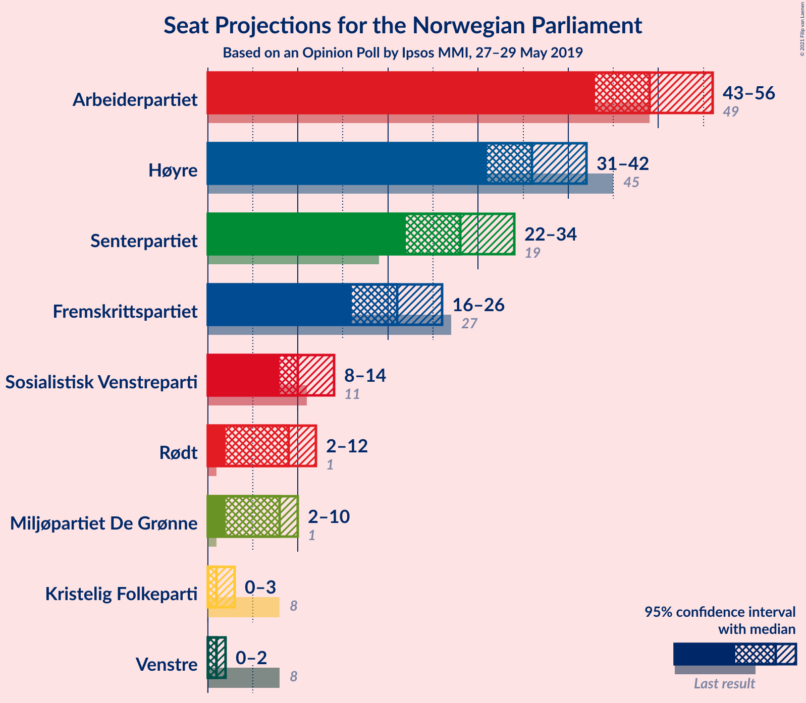
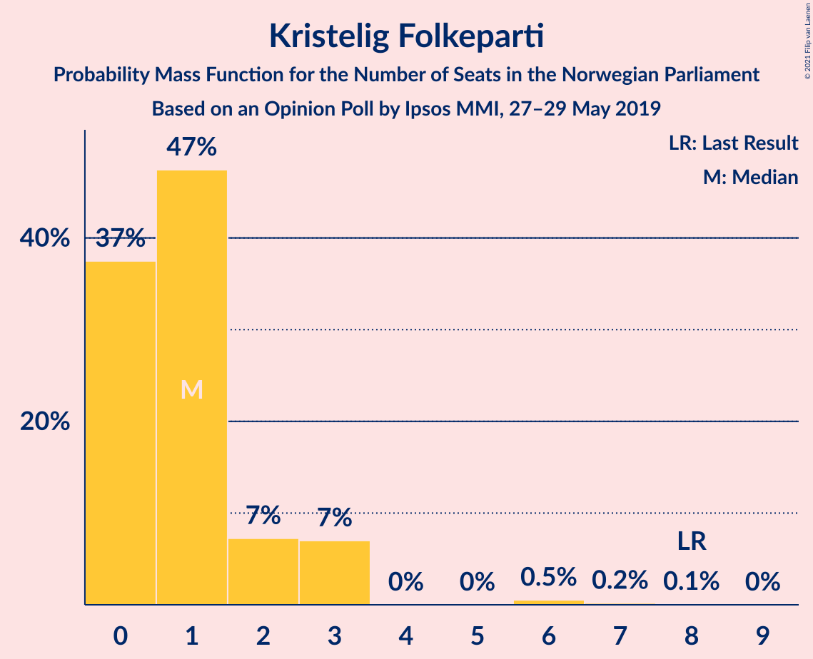
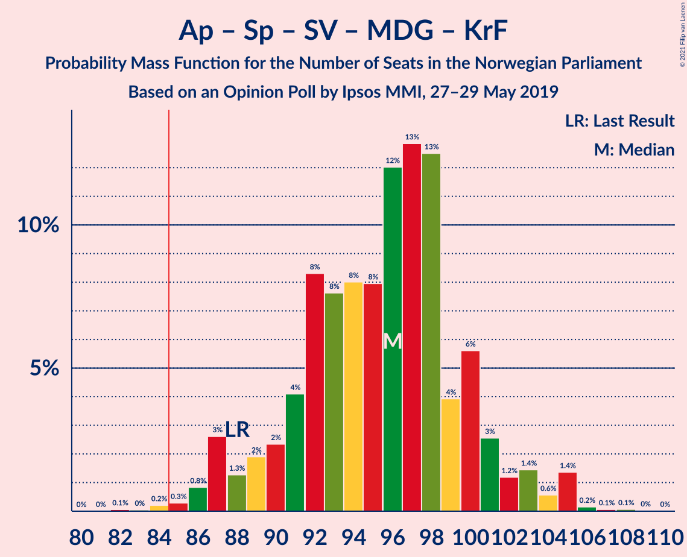
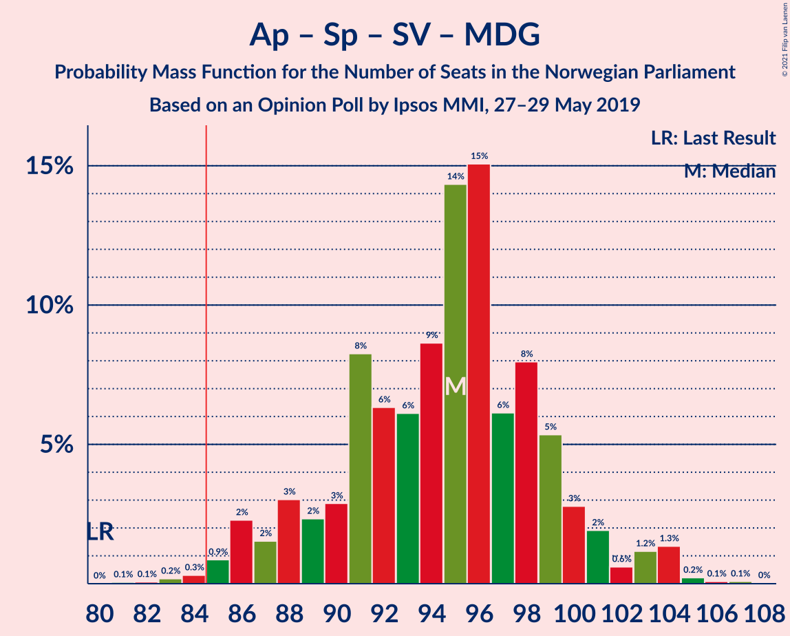
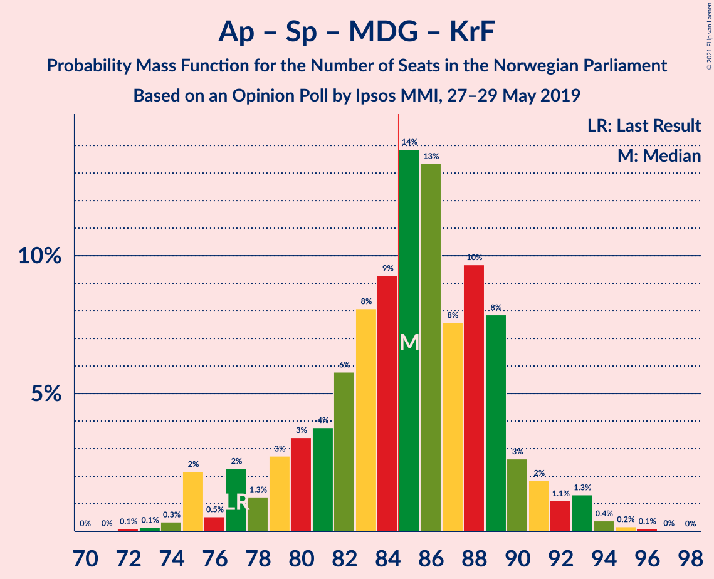
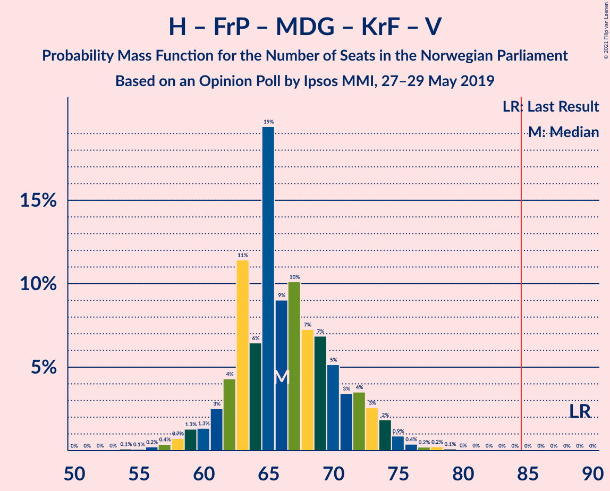
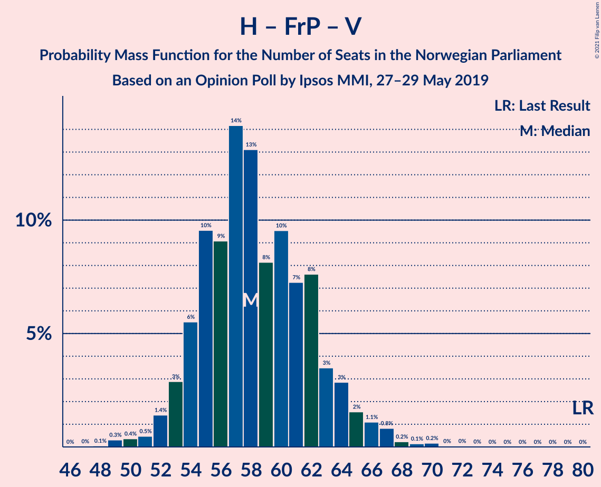

# Opinion Poll by Ipsos MMI, 27–29 May 2019

<a href="#voting-intentions">Voting Intentions</a> | <a href="#seats">Seats</a> | <a href="#coalitions">Coalitions</a> | <a href="#technical-information">Technical Information</a>

## Voting Intentions

### Confidence Intervals

| Party | Last Result | Poll Result | 80% Confidence Interval | 90% Confidence Interval | 95% Confidence Interval | 99% Confidence Interval |
|:-----:|:-----------:|:-----------:|:-----------------------:|:-----------------------:|:-----------------------:|:-----------------------:|
| Arbeiderpartiet | 27.4% | 26.9% | 24.9–29.1% |24.3–29.7% |23.9–30.3% |22.9–31.3% |
| Høyre | 25.0% | 20.7% | 18.9–22.7% |18.4–23.3% |17.9–23.8% |17.1–24.8% |
| Senterpartiet | 10.3% | 15.2% | 13.6–17.0% |13.1–17.5% |12.7–17.9% |12.0–18.8% |
| Fremskrittspartiet | 15.2% | 12.0% | 10.6–13.7% |10.2–14.2% |9.9–14.6% |9.3–15.4% |
| Sosialistisk Venstreparti | 6.0% | 6.4% | 5.3–7.7% |5.1–8.0% |4.8–8.4% |4.4–9.0% |
| Rødt | 2.4% | 5.1% | 4.2–6.3% |4.0–6.7% |3.8–7.0% |3.4–7.6% |
| Miljøpartiet De Grønne | 3.2% | 4.6% | 3.7–5.7% |3.5–6.1% |3.3–6.4% |2.9–7.0% |
| Kristelig Folkeparti | 4.2% | 2.3% | 1.7–3.2% |1.6–3.4% |1.4–3.7% |1.2–4.1% |
| Venstre | 4.4% | 2.0% | 1.5–2.9% |1.4–3.1% |1.2–3.3% |1.0–3.8% |

*Note:* The poll result column reflects the actual value used in the calculations. Published results may vary slightly, and in addition be rounded to fewer digits.

## Seats

### Confidence Intervals

| Party | Last Result | Median | 80% Confidence Interval | 90% Confidence Interval | 95% Confidence Interval | 99% Confidence Interval |
|:-----:|:-----------:|:------:|:-----------------------:|:-----------------------:|:-----------------------:|:-----------------------:|
| <a href="#arbeiderpartiet">Arbeiderpartiet</a> | 49 | 52 | 45–56 |44–56 |44–56 |42–57 |
| <a href="#høyre">Høyre</a> | 45 | 36 | 34–40 |33–41 |32–42 |30–43 |
| <a href="#senterpartiet">Senterpartiet</a> | 19 | 27 | 23–32 |23–33 |22–34 |21–35 |
| <a href="#fremskrittspartiet">Fremskrittspartiet</a> | 27 | 21 | 18–24 |17–25 |16–26 |15–28 |
| <a href="#sosialistisk-venstreparti">Sosialistisk Venstreparti</a> | 11 | 11 | 9–13 |8–13 |8–13 |7–15 |
| <a href="#rødt">Rødt</a> | 1 | 8 | 7–10 |6–11 |2–11 |2–13 |
| <a href="#miljøpartiet-de-grønne">Miljøpartiet De Grønne</a> | 1 | 7 | 2–9 |2–10 |2–11 |1–12 |
| <a href="#kristelig-folkeparti">Kristelig Folkeparti</a> | 8 | 1 | 0–3 |0–3 |0–3 |0–3 |
| <a href="#venstre">Venstre</a> | 8 | 1 | 0–2 |0–2 |0–2 |0–2 |

### Arbeiderpartiet

*For a full overview of the results for this party, see the [Arbeiderpartiet](party-arbeiderpartiet.html) page.*

| Number of Seats | Probability | Accumulated | Special Marks |
|:---------------:|:-----------:|:-----------:|:-------------:|
| 40 | 0.2% | 100% |  |
| 41 | 0.1% | 99.8% |  |
| 42 | 0.9% | 99.7% |  |
| 43 | 1.0% | 98.8% |  |
| 44 | 7% | 98% |  |
| 45 | 5% | 90% |  |
| 46 | 10% | 86% |  |
| 47 | 6% | 75% |  |
| 48 | 3% | 70% |  |
| 49 | 2% | 67% | Last Result |
| 50 | 8% | 65% |  |
| 51 | 3% | 57% |  |
| 52 | 24% | 53% | Median |
| 53 | 13% | 30% |  |
| 54 | 3% | 16% |  |
| 55 | 2% | 13% |  |
| 56 | 9% | 11% |  |
| 57 | 1.5% | 2% |  |
| 58 | 0.3% | 0.5% |  |
| 59 | 0.1% | 0.2% |  |
| 60 | 0.1% | 0.1% |  |
| 61 | 0% | 0% |  |

### Høyre

*For a full overview of the results for this party, see the [Høyre](party-høyre.html) page.*

| Number of Seats | Probability | Accumulated | Special Marks |
|:---------------:|:-----------:|:-----------:|:-------------:|
| 27 | 0% | 100% |  |
| 28 | 0.2% | 99.9% |  |
| 29 | 0.2% | 99.8% |  |
| 30 | 0.3% | 99.6% |  |
| 31 | 0.8% | 99.3% |  |
| 32 | 1.3% | 98.5% |  |
| 33 | 4% | 97% |  |
| 34 | 26% | 93% |  |
| 35 | 14% | 67% |  |
| 36 | 12% | 52% | Median |
| 37 | 13% | 40% |  |
| 38 | 9% | 27% |  |
| 39 | 2% | 18% |  |
| 40 | 8% | 16% |  |
| 41 | 3% | 8% |  |
| 42 | 3% | 4% |  |
| 43 | 0.4% | 0.7% |  |
| 44 | 0.1% | 0.3% |  |
| 45 | 0.2% | 0.3% | Last Result |
| 46 | 0% | 0.1% |  |
| 47 | 0% | 0.1% |  |
| 48 | 0% | 0.1% |  |
| 49 | 0% | 0.1% |  |
| 50 | 0% | 0% |  |

### Senterpartiet

*For a full overview of the results for this party, see the [Senterpartiet](party-senterpartiet.html) page.*

| Number of Seats | Probability | Accumulated | Special Marks |
|:---------------:|:-----------:|:-----------:|:-------------:|
| 18 | 0.2% | 100% |  |
| 19 | 0.1% | 99.8% | Last Result |
| 20 | 0.1% | 99.7% |  |
| 21 | 0.8% | 99.6% |  |
| 22 | 2% | 98.8% |  |
| 23 | 10% | 97% |  |
| 24 | 3% | 87% |  |
| 25 | 13% | 83% |  |
| 26 | 6% | 70% |  |
| 27 | 25% | 64% | Median |
| 28 | 5% | 39% |  |
| 29 | 9% | 33% |  |
| 30 | 7% | 25% |  |
| 31 | 2% | 18% |  |
| 32 | 10% | 16% |  |
| 33 | 2% | 6% |  |
| 34 | 3% | 4% |  |
| 35 | 0.7% | 1.1% |  |
| 36 | 0.4% | 0.4% |  |
| 37 | 0% | 0% |  |

### Fremskrittspartiet

*For a full overview of the results for this party, see the [Fremskrittspartiet](party-fremskrittspartiet.html) page.*

| Number of Seats | Probability | Accumulated | Special Marks |
|:---------------:|:-----------:|:-----------:|:-------------:|
| 13 | 0.1% | 100% |  |
| 14 | 0.1% | 99.9% |  |
| 15 | 1.4% | 99.8% |  |
| 16 | 2% | 98% |  |
| 17 | 6% | 96% |  |
| 18 | 12% | 90% |  |
| 19 | 15% | 78% |  |
| 20 | 13% | 63% |  |
| 21 | 8% | 50% | Median |
| 22 | 10% | 43% |  |
| 23 | 14% | 32% |  |
| 24 | 13% | 18% |  |
| 25 | 2% | 6% |  |
| 26 | 1.3% | 4% |  |
| 27 | 1.4% | 2% | Last Result |
| 28 | 0.6% | 0.8% |  |
| 29 | 0.2% | 0.2% |  |
| 30 | 0% | 0% |  |

### Sosialistisk Venstreparti

*For a full overview of the results for this party, see the [Sosialistisk Venstreparti](party-sosialistiskvenstreparti.html) page.*

| Number of Seats | Probability | Accumulated | Special Marks |
|:---------------:|:-----------:|:-----------:|:-------------:|
| 2 | 0.1% | 100% |  |
| 3 | 0% | 99.9% |  |
| 4 | 0% | 99.9% |  |
| 5 | 0% | 99.9% |  |
| 6 | 0% | 99.9% |  |
| 7 | 1.4% | 99.9% |  |
| 8 | 8% | 98.5% |  |
| 9 | 18% | 90% |  |
| 10 | 14% | 72% |  |
| 11 | 33% | 59% | Last Result, Median |
| 12 | 9% | 26% |  |
| 13 | 14% | 17% |  |
| 14 | 1.4% | 2% |  |
| 15 | 0.5% | 1.0% |  |
| 16 | 0.4% | 0.5% |  |
| 17 | 0% | 0.1% |  |
| 18 | 0% | 0% |  |

### Rødt

*For a full overview of the results for this party, see the [Rødt](party-rødt.html) page.*

| Number of Seats | Probability | Accumulated | Special Marks |
|:---------------:|:-----------:|:-----------:|:-------------:|
| 1 | 0% | 100% | Last Result |
| 2 | 3% | 100% |  |
| 3 | 0% | 97% |  |
| 4 | 0% | 97% |  |
| 5 | 0% | 97% |  |
| 6 | 3% | 97% |  |
| 7 | 22% | 94% |  |
| 8 | 25% | 72% | Median |
| 9 | 29% | 47% |  |
| 10 | 9% | 19% |  |
| 11 | 8% | 10% |  |
| 12 | 0.6% | 2% |  |
| 13 | 1.1% | 1.2% |  |
| 14 | 0.1% | 0.1% |  |
| 15 | 0% | 0% |  |

### Miljøpartiet De Grønne

*For a full overview of the results for this party, see the [Miljøpartiet De Grønne](party-miljøpartietdegrønne.html) page.*

| Number of Seats | Probability | Accumulated | Special Marks |
|:---------------:|:-----------:|:-----------:|:-------------:|
| 1 | 1.0% | 100% | Last Result |
| 2 | 16% | 99.0% |  |
| 3 | 5% | 83% |  |
| 4 | 0.3% | 79% |  |
| 5 | 0% | 78% |  |
| 6 | 1.1% | 78% |  |
| 7 | 28% | 77% | Median |
| 8 | 28% | 50% |  |
| 9 | 13% | 22% |  |
| 10 | 6% | 9% |  |
| 11 | 2% | 3% |  |
| 12 | 0.7% | 1.0% |  |
| 13 | 0.3% | 0.3% |  |
| 14 | 0% | 0% |  |

### Kristelig Folkeparti

*For a full overview of the results for this party, see the [Kristelig Folkeparti](party-kristeligfolkeparti.html) page.*

| Number of Seats | Probability | Accumulated | Special Marks |
|:---------------:|:-----------:|:-----------:|:-------------:|
| 0 | 41% | 100% |  |
| 1 | 41% | 59% | Median |
| 2 | 6% | 18% |  |
| 3 | 12% | 12% |  |
| 4 | 0% | 0.3% |  |
| 5 | 0% | 0.3% |  |
| 6 | 0.2% | 0.3% |  |
| 7 | 0.1% | 0.1% |  |
| 8 | 0% | 0% | Last Result |

### Venstre

*For a full overview of the results for this party, see the [Venstre](party-venstre.html) page.*

| Number of Seats | Probability | Accumulated | Special Marks |
|:---------------:|:-----------:|:-----------:|:-------------:|
| 0 | 33% | 100% |  |
| 1 | 40% | 67% | Median |
| 2 | 27% | 27% |  |
| 3 | 0% | 0.2% |  |
| 4 | 0% | 0.1% |  |
| 5 | 0% | 0.1% |  |
| 6 | 0% | 0.1% |  |
| 7 | 0.1% | 0.1% |  |
| 8 | 0% | 0% | Last Result |

## Coalitions

### Confidence Intervals

| Coalition | Last Result | Median | Majority? | 80% Confidence Interval | 90% Confidence Interval | 95% Confidence Interval | 99% Confidence Interval |
|:---------:|:-----------:|:------:|:---------:|:-----------------------:|:-----------------------:|:-----------------------:|:-----------------------:|
| Arbeiderpartiet – Senterpartiet – Sosialistisk Venstreparti – Rødt – Miljøpartiet De Grønne | 81 | 104 | 100% | 98–108 | 97–109 | 96–109 | 94–111 |
| Arbeiderpartiet – Senterpartiet – Sosialistisk Venstreparti – Rødt | 80 | 97 | 99.9% | 92–100 | 90–101 | 89–101 | 87–106 |
| Arbeiderpartiet – Senterpartiet – Sosialistisk Venstreparti – Miljøpartiet De Grønne – Kristelig Folkeparti | 88 | 96 | 99.8% | 91–101 | 90–101 | 88–101 | 86–105 |
| Arbeiderpartiet – Senterpartiet – Sosialistisk Venstreparti – Miljøpartiet De Grønne | 80 | 96 | 99.6% | 90–100 | 88–101 | 87–101 | 85–105 |
| Arbeiderpartiet – Senterpartiet – Sosialistisk Venstreparti | 79 | 89 | 85% | 83–92 | 81–92 | 81–94 | 78–98 |
| Høyre – Senterpartiet – Fremskrittspartiet – Kristelig Folkeparti – Venstre | 107 | 86 | 66% | 79–93 | 78–94 | 78–94 | 78–97 |
| Arbeiderpartiet – Senterpartiet – Miljøpartiet De Grønne – Kristelig Folkeparti | 77 | 87 | 64% | 80–89 | 79–91 | 78–91 | 76–94 |
| Arbeiderpartiet – Senterpartiet – Kristelig Folkeparti | 76 | 79 | 1.2% | 75–82 | 74–83 | 72–83 | 70–86 |
| Arbeiderpartiet – Senterpartiet | 68 | 78 | 0.7% | 74–81 | 73–82 | 71–82 | 69–85 |
| Høyre – Fremskrittspartiet – Miljøpartiet De Grønne – Kristelig Folkeparti – Venstre | 89 | 65 | 0% | 61–71 | 60–72 | 59–72 | 57–75 |
| Arbeiderpartiet – Sosialistisk Venstreparti | 60 | 62 | 0% | 55–66 | 53–67 | 52–67 | 50–69 |
| Høyre – Fremskrittspartiet – Kristelig Folkeparti – Venstre | 88 | 59 | 0% | 54–63 | 54–64 | 54–65 | 51–69 |
| Høyre – Fremskrittspartiet – Venstre | 80 | 58 | 0% | 54–62 | 53–63 | 53–64 | 51–67 |
| Høyre – Fremskrittspartiet | 72 | 57 | 0% | 53–62 | 52–62 | 52–63 | 49–66 |
| Høyre – Kristelig Folkeparti – Venstre | 61 | 38 | 0% | 35–41 | 35–42 | 34–43 | 32–45 |
| Senterpartiet – Kristelig Folkeparti – Venstre | 35 | 28 | 0% | 24–34 | 24–35 | 24–37 | 22–39 |

### Arbeiderpartiet – Senterpartiet – Sosialistisk Venstreparti – Rødt – Miljøpartiet De Grønne

| Number of Seats | Probability | Accumulated | Special Marks |
|:---------------:|:-----------:|:-----------:|:-------------:|
| 81 | 0% | 100% | Last Result |
| 82 | 0% | 100% |  |
| 83 | 0% | 100% |  |
| 84 | 0% | 100% |  |
| 85 | 0% | 100% | Majority |
| 86 | 0% | 100% |  |
| 87 | 0% | 100% |  |
| 88 | 0% | 100% |  |
| 89 | 0% | 100% |  |
| 90 | 0% | 100% |  |
| 91 | 0% | 99.9% |  |
| 92 | 0.2% | 99.9% |  |
| 93 | 0.1% | 99.7% |  |
| 94 | 0.4% | 99.6% |  |
| 95 | 0.9% | 99.2% |  |
| 96 | 3% | 98% |  |
| 97 | 0.9% | 95% |  |
| 98 | 7% | 94% |  |
| 99 | 4% | 87% |  |
| 100 | 8% | 84% |  |
| 101 | 6% | 76% |  |
| 102 | 10% | 70% |  |
| 103 | 9% | 60% |  |
| 104 | 6% | 51% |  |
| 105 | 7% | 45% | Median |
| 106 | 10% | 38% |  |
| 107 | 14% | 29% |  |
| 108 | 8% | 14% |  |
| 109 | 5% | 7% |  |
| 110 | 1.0% | 2% |  |
| 111 | 0.5% | 0.8% |  |
| 112 | 0.3% | 0.4% |  |
| 113 | 0% | 0.1% |  |
| 114 | 0% | 0.1% |  |
| 115 | 0% | 0% |  |

### Arbeiderpartiet – Senterpartiet – Sosialistisk Venstreparti – Rødt

| Number of Seats | Probability | Accumulated | Special Marks |
|:---------------:|:-----------:|:-----------:|:-------------:|
| 80 | 0% | 100% | Last Result |
| 81 | 0% | 100% |  |
| 82 | 0% | 100% |  |
| 83 | 0% | 100% |  |
| 84 | 0.1% | 99.9% |  |
| 85 | 0% | 99.9% | Majority |
| 86 | 0.3% | 99.8% |  |
| 87 | 0.1% | 99.5% |  |
| 88 | 0.2% | 99.4% |  |
| 89 | 4% | 99.2% |  |
| 90 | 2% | 95% |  |
| 91 | 3% | 94% |  |
| 92 | 2% | 90% |  |
| 93 | 6% | 88% |  |
| 94 | 5% | 82% |  |
| 95 | 4% | 78% |  |
| 96 | 14% | 74% |  |
| 97 | 10% | 59% |  |
| 98 | 15% | 49% | Median |
| 99 | 18% | 34% |  |
| 100 | 9% | 16% |  |
| 101 | 5% | 7% |  |
| 102 | 1.0% | 2% |  |
| 103 | 0.1% | 1.2% |  |
| 104 | 0.2% | 1.0% |  |
| 105 | 0.2% | 0.8% |  |
| 106 | 0.1% | 0.6% |  |
| 107 | 0.2% | 0.5% |  |
| 108 | 0.1% | 0.3% |  |
| 109 | 0.2% | 0.2% |  |
| 110 | 0% | 0% |  |

### Arbeiderpartiet – Senterpartiet – Sosialistisk Venstreparti – Miljøpartiet De Grønne – Kristelig Folkeparti

| Number of Seats | Probability | Accumulated | Special Marks |
|:---------------:|:-----------:|:-----------:|:-------------:|
| 84 | 0.2% | 100% |  |
| 85 | 0.1% | 99.8% | Majority |
| 86 | 0.9% | 99.7% |  |
| 87 | 0.4% | 98.8% |  |
| 88 | 1.2% | 98% | Last Result |
| 89 | 2% | 97% |  |
| 90 | 2% | 95% |  |
| 91 | 8% | 93% |  |
| 92 | 7% | 86% |  |
| 93 | 8% | 79% |  |
| 94 | 6% | 71% |  |
| 95 | 2% | 65% |  |
| 96 | 14% | 63% |  |
| 97 | 7% | 49% |  |
| 98 | 14% | 42% | Median |
| 99 | 5% | 28% |  |
| 100 | 11% | 24% |  |
| 101 | 10% | 12% |  |
| 102 | 0.4% | 2% |  |
| 103 | 1.2% | 2% |  |
| 104 | 0.1% | 0.8% |  |
| 105 | 0.3% | 0.7% |  |
| 106 | 0.3% | 0.4% |  |
| 107 | 0.1% | 0.1% |  |
| 108 | 0% | 0.1% |  |
| 109 | 0% | 0.1% |  |
| 110 | 0% | 0% |  |

### Arbeiderpartiet – Senterpartiet – Sosialistisk Venstreparti – Miljøpartiet De Grønne

| Number of Seats | Probability | Accumulated | Special Marks |
|:---------------:|:-----------:|:-----------:|:-------------:|
| 80 | 0% | 100% | Last Result |
| 81 | 0% | 100% |  |
| 82 | 0% | 100% |  |
| 83 | 0.1% | 100% |  |
| 84 | 0.3% | 99.9% |  |
| 85 | 0.4% | 99.6% | Majority |
| 86 | 1.2% | 99.3% |  |
| 87 | 0.9% | 98% |  |
| 88 | 3% | 97% |  |
| 89 | 2% | 94% |  |
| 90 | 6% | 92% |  |
| 91 | 7% | 85% |  |
| 92 | 7% | 79% |  |
| 93 | 6% | 72% |  |
| 94 | 10% | 66% |  |
| 95 | 2% | 56% |  |
| 96 | 12% | 54% |  |
| 97 | 6% | 42% | Median |
| 98 | 12% | 36% |  |
| 99 | 11% | 24% |  |
| 100 | 6% | 13% |  |
| 101 | 5% | 7% |  |
| 102 | 0.9% | 2% |  |
| 103 | 0.3% | 1.0% |  |
| 104 | 0% | 0.7% |  |
| 105 | 0.4% | 0.7% |  |
| 106 | 0.2% | 0.2% |  |
| 107 | 0% | 0% |  |

### Arbeiderpartiet – Senterpartiet – Sosialistisk Venstreparti

| Number of Seats | Probability | Accumulated | Special Marks |
|:---------------:|:-----------:|:-----------:|:-------------:|
| 76 | 0.1% | 100% |  |
| 77 | 0.2% | 99.9% |  |
| 78 | 0.3% | 99.7% |  |
| 79 | 0.5% | 99.4% | Last Result |
| 80 | 0.6% | 99.0% |  |
| 81 | 3% | 98% |  |
| 82 | 1.4% | 95% |  |
| 83 | 6% | 94% |  |
| 84 | 3% | 87% |  |
| 85 | 4% | 85% | Majority |
| 86 | 6% | 81% |  |
| 87 | 8% | 75% |  |
| 88 | 7% | 67% |  |
| 89 | 20% | 61% |  |
| 90 | 14% | 40% | Median |
| 91 | 8% | 26% |  |
| 92 | 14% | 18% |  |
| 93 | 1.0% | 4% |  |
| 94 | 0.4% | 3% |  |
| 95 | 1.4% | 2% |  |
| 96 | 0.2% | 1.1% |  |
| 97 | 0.3% | 0.8% |  |
| 98 | 0.4% | 0.5% |  |
| 99 | 0.1% | 0.1% |  |
| 100 | 0% | 0% |  |

### Høyre – Senterpartiet – Fremskrittspartiet – Kristelig Folkeparti – Venstre

| Number of Seats | Probability | Accumulated | Special Marks |
|:---------------:|:-----------:|:-----------:|:-------------:|
| 75 | 0.1% | 100% |  |
| 76 | 0.3% | 99.9% |  |
| 77 | 0% | 99.6% |  |
| 78 | 9% | 99.6% |  |
| 79 | 2% | 90% |  |
| 80 | 3% | 89% |  |
| 81 | 11% | 86% |  |
| 82 | 4% | 75% |  |
| 83 | 3% | 71% |  |
| 84 | 2% | 68% |  |
| 85 | 9% | 66% | Majority |
| 86 | 9% | 57% | Median |
| 87 | 7% | 47% |  |
| 88 | 2% | 41% |  |
| 89 | 3% | 38% |  |
| 90 | 11% | 35% |  |
| 91 | 5% | 25% |  |
| 92 | 9% | 19% |  |
| 93 | 5% | 11% |  |
| 94 | 4% | 6% |  |
| 95 | 1.1% | 2% |  |
| 96 | 0.4% | 1.1% |  |
| 97 | 0.3% | 0.7% |  |
| 98 | 0.2% | 0.4% |  |
| 99 | 0% | 0.2% |  |
| 100 | 0.1% | 0.1% |  |
| 101 | 0% | 0.1% |  |
| 102 | 0% | 0% |  |
| 103 | 0% | 0% |  |
| 104 | 0% | 0% |  |
| 105 | 0% | 0% |  |
| 106 | 0% | 0% |  |
| 107 | 0% | 0% | Last Result |

### Arbeiderpartiet – Senterpartiet – Miljøpartiet De Grønne – Kristelig Folkeparti

| Number of Seats | Probability | Accumulated | Special Marks |
|:---------------:|:-----------:|:-----------:|:-------------:|
| 72 | 0.1% | 100% |  |
| 73 | 0.1% | 99.9% |  |
| 74 | 0% | 99.9% |  |
| 75 | 0.3% | 99.8% |  |
| 76 | 0.8% | 99.6% |  |
| 77 | 1.1% | 98.8% | Last Result |
| 78 | 2% | 98% |  |
| 79 | 2% | 96% |  |
| 80 | 6% | 94% |  |
| 81 | 3% | 88% |  |
| 82 | 7% | 85% |  |
| 83 | 9% | 78% |  |
| 84 | 5% | 69% |  |
| 85 | 4% | 64% | Majority |
| 86 | 9% | 61% |  |
| 87 | 24% | 51% | Median |
| 88 | 11% | 27% |  |
| 89 | 8% | 16% |  |
| 90 | 2% | 8% |  |
| 91 | 5% | 6% |  |
| 92 | 0.3% | 1.3% |  |
| 93 | 0.4% | 1.0% |  |
| 94 | 0.4% | 0.6% |  |
| 95 | 0.1% | 0.2% |  |
| 96 | 0% | 0.1% |  |
| 97 | 0% | 0.1% |  |
| 98 | 0% | 0.1% |  |
| 99 | 0% | 0% |  |

### Arbeiderpartiet – Senterpartiet – Kristelig Folkeparti

| Number of Seats | Probability | Accumulated | Special Marks |
|:---------------:|:-----------:|:-----------:|:-------------:|
| 67 | 0% | 100% |  |
| 68 | 0.1% | 99.9% |  |
| 69 | 0.2% | 99.9% |  |
| 70 | 1.2% | 99.7% |  |
| 71 | 0.6% | 98% |  |
| 72 | 1.1% | 98% |  |
| 73 | 1.3% | 97% |  |
| 74 | 3% | 96% |  |
| 75 | 4% | 92% |  |
| 76 | 10% | 88% | Last Result |
| 77 | 6% | 78% |  |
| 78 | 13% | 72% |  |
| 79 | 20% | 60% |  |
| 80 | 19% | 40% | Median |
| 81 | 9% | 21% |  |
| 82 | 4% | 12% |  |
| 83 | 5% | 7% |  |
| 84 | 1.2% | 2% |  |
| 85 | 0.7% | 1.2% | Majority |
| 86 | 0.3% | 0.6% |  |
| 87 | 0.1% | 0.3% |  |
| 88 | 0% | 0.2% |  |
| 89 | 0.1% | 0.1% |  |
| 90 | 0% | 0% |  |

### Arbeiderpartiet – Senterpartiet

| Number of Seats | Probability | Accumulated | Special Marks |
|:---------------:|:-----------:|:-----------:|:-------------:|
| 65 | 0% | 100% |  |
| 66 | 0.1% | 99.9% |  |
| 67 | 0.1% | 99.8% |  |
| 68 | 0.2% | 99.7% | Last Result |
| 69 | 0.5% | 99.5% |  |
| 70 | 1.0% | 99.0% |  |
| 71 | 0.7% | 98% |  |
| 72 | 1.5% | 97% |  |
| 73 | 5% | 96% |  |
| 74 | 6% | 91% |  |
| 75 | 8% | 85% |  |
| 76 | 7% | 78% |  |
| 77 | 11% | 70% |  |
| 78 | 10% | 60% |  |
| 79 | 24% | 50% | Median |
| 80 | 15% | 26% |  |
| 81 | 4% | 11% |  |
| 82 | 6% | 8% |  |
| 83 | 0.5% | 2% |  |
| 84 | 0.7% | 1.4% |  |
| 85 | 0.5% | 0.7% | Majority |
| 86 | 0.2% | 0.2% |  |
| 87 | 0% | 0% |  |

### Høyre – Fremskrittspartiet – Miljøpartiet De Grønne – Kristelig Folkeparti – Venstre

| Number of Seats | Probability | Accumulated | Special Marks |
|:---------------:|:-----------:|:-----------:|:-------------:|
| 54 | 0.1% | 100% |  |
| 55 | 0.1% | 99.9% |  |
| 56 | 0% | 99.8% |  |
| 57 | 0.3% | 99.8% |  |
| 58 | 0.2% | 99.5% |  |
| 59 | 3% | 99.3% |  |
| 60 | 2% | 97% |  |
| 61 | 6% | 95% |  |
| 62 | 7% | 89% |  |
| 63 | 18% | 83% |  |
| 64 | 9% | 64% |  |
| 65 | 13% | 55% |  |
| 66 | 3% | 42% | Median |
| 67 | 4% | 39% |  |
| 68 | 11% | 34% |  |
| 69 | 2% | 23% |  |
| 70 | 7% | 21% |  |
| 71 | 8% | 15% |  |
| 72 | 5% | 7% |  |
| 73 | 0.7% | 2% |  |
| 74 | 0.4% | 1.2% |  |
| 75 | 0.3% | 0.7% |  |
| 76 | 0.1% | 0.5% |  |
| 77 | 0% | 0.4% |  |
| 78 | 0.2% | 0.4% |  |
| 79 | 0.1% | 0.2% |  |
| 80 | 0% | 0.1% |  |
| 81 | 0% | 0% |  |
| 82 | 0% | 0% |  |
| 83 | 0% | 0% |  |
| 84 | 0% | 0% |  |
| 85 | 0% | 0% | Majority |
| 86 | 0% | 0% |  |
| 87 | 0% | 0% |  |
| 88 | 0% | 0% |  |
| 89 | 0% | 0% | Last Result |

### Arbeiderpartiet – Sosialistisk Venstreparti

| Number of Seats | Probability | Accumulated | Special Marks |
|:---------------:|:-----------:|:-----------:|:-------------:|
| 49 | 0.2% | 100% |  |
| 50 | 0.4% | 99.7% |  |
| 51 | 0.4% | 99.3% |  |
| 52 | 3% | 98.9% |  |
| 53 | 3% | 96% |  |
| 54 | 3% | 93% |  |
| 55 | 3% | 90% |  |
| 56 | 5% | 87% |  |
| 57 | 9% | 83% |  |
| 58 | 5% | 74% |  |
| 59 | 5% | 69% |  |
| 60 | 2% | 64% | Last Result |
| 61 | 3% | 62% |  |
| 62 | 16% | 59% |  |
| 63 | 10% | 43% | Median |
| 64 | 10% | 32% |  |
| 65 | 11% | 23% |  |
| 66 | 3% | 12% |  |
| 67 | 8% | 10% |  |
| 68 | 0.4% | 1.2% |  |
| 69 | 0.6% | 0.9% |  |
| 70 | 0.2% | 0.3% |  |
| 71 | 0.1% | 0.1% |  |
| 72 | 0% | 0% |  |

### Høyre – Fremskrittspartiet – Kristelig Folkeparti – Venstre

| Number of Seats | Probability | Accumulated | Special Marks |
|:---------------:|:-----------:|:-----------:|:-------------:|
| 50 | 0.1% | 100% |  |
| 51 | 0.4% | 99.9% |  |
| 52 | 0.4% | 99.4% |  |
| 53 | 1.3% | 99.0% |  |
| 54 | 11% | 98% |  |
| 55 | 12% | 87% |  |
| 56 | 2% | 75% |  |
| 57 | 7% | 72% |  |
| 58 | 13% | 65% |  |
| 59 | 7% | 52% | Median |
| 60 | 11% | 45% |  |
| 61 | 7% | 34% |  |
| 62 | 10% | 27% |  |
| 63 | 9% | 17% |  |
| 64 | 5% | 8% |  |
| 65 | 0.4% | 3% |  |
| 66 | 0.7% | 2% |  |
| 67 | 1.0% | 2% |  |
| 68 | 0.2% | 0.7% |  |
| 69 | 0.1% | 0.5% |  |
| 70 | 0.2% | 0.4% |  |
| 71 | 0.1% | 0.1% |  |
| 72 | 0% | 0.1% |  |
| 73 | 0% | 0% |  |
| 74 | 0% | 0% |  |
| 75 | 0% | 0% |  |
| 76 | 0% | 0% |  |
| 77 | 0% | 0% |  |
| 78 | 0% | 0% |  |
| 79 | 0% | 0% |  |
| 80 | 0% | 0% |  |
| 81 | 0% | 0% |  |
| 82 | 0% | 0% |  |
| 83 | 0% | 0% |  |
| 84 | 0% | 0% |  |
| 85 | 0% | 0% | Majority |
| 86 | 0% | 0% |  |
| 87 | 0% | 0% |  |
| 88 | 0% | 0% | Last Result |

### Høyre – Fremskrittspartiet – Venstre

| Number of Seats | Probability | Accumulated | Special Marks |
|:---------------:|:-----------:|:-----------:|:-------------:|
| 49 | 0.1% | 100% |  |
| 50 | 0.4% | 99.9% |  |
| 51 | 0.4% | 99.5% |  |
| 52 | 2% | 99.1% |  |
| 53 | 5% | 98% |  |
| 54 | 11% | 92% |  |
| 55 | 12% | 82% |  |
| 56 | 6% | 70% |  |
| 57 | 4% | 64% |  |
| 58 | 17% | 60% | Median |
| 59 | 10% | 43% |  |
| 60 | 7% | 33% |  |
| 61 | 12% | 26% |  |
| 62 | 9% | 14% |  |
| 63 | 3% | 6% |  |
| 64 | 0.9% | 3% |  |
| 65 | 0.7% | 2% |  |
| 66 | 0.4% | 2% |  |
| 67 | 0.8% | 1.2% |  |
| 68 | 0.2% | 0.4% |  |
| 69 | 0% | 0.3% |  |
| 70 | 0.2% | 0.2% |  |
| 71 | 0% | 0.1% |  |
| 72 | 0% | 0% |  |
| 73 | 0% | 0% |  |
| 74 | 0% | 0% |  |
| 75 | 0% | 0% |  |
| 76 | 0% | 0% |  |
| 77 | 0% | 0% |  |
| 78 | 0% | 0% |  |
| 79 | 0% | 0% |  |
| 80 | 0% | 0% | Last Result |

### Høyre – Fremskrittspartiet

| Number of Seats | Probability | Accumulated | Special Marks |
|:---------------:|:-----------:|:-----------:|:-------------:|
| 48 | 0.3% | 100% |  |
| 49 | 0.2% | 99.6% |  |
| 50 | 0.3% | 99.4% |  |
| 51 | 1.2% | 99.1% |  |
| 52 | 6% | 98% |  |
| 53 | 11% | 92% |  |
| 54 | 12% | 81% |  |
| 55 | 6% | 69% |  |
| 56 | 10% | 62% |  |
| 57 | 2% | 52% | Median |
| 58 | 13% | 50% |  |
| 59 | 10% | 37% |  |
| 60 | 11% | 27% |  |
| 61 | 5% | 16% |  |
| 62 | 6% | 11% |  |
| 63 | 2% | 4% |  |
| 64 | 0.5% | 2% |  |
| 65 | 0.5% | 2% |  |
| 66 | 1.0% | 1.4% |  |
| 67 | 0.1% | 0.4% |  |
| 68 | 0.1% | 0.3% |  |
| 69 | 0% | 0.2% |  |
| 70 | 0.2% | 0.2% |  |
| 71 | 0% | 0% |  |
| 72 | 0% | 0% | Last Result |

### Høyre – Kristelig Folkeparti – Venstre

| Number of Seats | Probability | Accumulated | Special Marks |
|:---------------:|:-----------:|:-----------:|:-------------:|
| 29 | 0% | 100% |  |
| 30 | 0.1% | 99.9% |  |
| 31 | 0.2% | 99.9% |  |
| 32 | 0.7% | 99.7% |  |
| 33 | 1.2% | 99.0% |  |
| 34 | 0.5% | 98% |  |
| 35 | 14% | 97% |  |
| 36 | 18% | 83% |  |
| 37 | 12% | 65% |  |
| 38 | 8% | 53% | Median |
| 39 | 14% | 45% |  |
| 40 | 12% | 31% |  |
| 41 | 9% | 19% |  |
| 42 | 6% | 10% |  |
| 43 | 2% | 4% |  |
| 44 | 0.4% | 1.1% |  |
| 45 | 0.3% | 0.6% |  |
| 46 | 0.1% | 0.3% |  |
| 47 | 0% | 0.2% |  |
| 48 | 0% | 0.2% |  |
| 49 | 0% | 0.1% |  |
| 50 | 0% | 0.1% |  |
| 51 | 0.1% | 0.1% |  |
| 52 | 0% | 0% |  |
| 53 | 0% | 0% |  |
| 54 | 0% | 0% |  |
| 55 | 0% | 0% |  |
| 56 | 0% | 0% |  |
| 57 | 0% | 0% |  |
| 58 | 0% | 0% |  |
| 59 | 0% | 0% |  |
| 60 | 0% | 0% |  |
| 61 | 0% | 0% | Last Result |

### Senterpartiet – Kristelig Folkeparti – Venstre

| Number of Seats | Probability | Accumulated | Special Marks |
|:---------------:|:-----------:|:-----------:|:-------------:|
| 18 | 0.1% | 100% |  |
| 19 | 0% | 99.9% |  |
| 20 | 0% | 99.9% |  |
| 21 | 0.1% | 99.9% |  |
| 22 | 0.4% | 99.7% |  |
| 23 | 2% | 99.4% |  |
| 24 | 11% | 98% |  |
| 25 | 2% | 87% |  |
| 26 | 5% | 85% |  |
| 27 | 11% | 80% |  |
| 28 | 21% | 70% |  |
| 29 | 10% | 49% | Median |
| 30 | 3% | 39% |  |
| 31 | 8% | 36% |  |
| 32 | 1.1% | 28% |  |
| 33 | 14% | 27% |  |
| 34 | 7% | 13% |  |
| 35 | 2% | 6% | Last Result |
| 36 | 0.7% | 4% |  |
| 37 | 1.0% | 3% |  |
| 38 | 2% | 2% |  |
| 39 | 0.8% | 0.9% |  |
| 40 | 0% | 0.1% |  |
| 41 | 0% | 0.1% |  |
| 42 | 0% | 0% |  |

## Technical Information

### Opinion Poll

+ **Polling firm:** Ipsos MMI
+ **Commissioner(s):** —
+ **Fieldwork period:** 27–29 May 2019

### Calculations

+ **Sample size:** 739
+ **Simulations done:** 131,072
+ **Error estimate:** 4.44%

