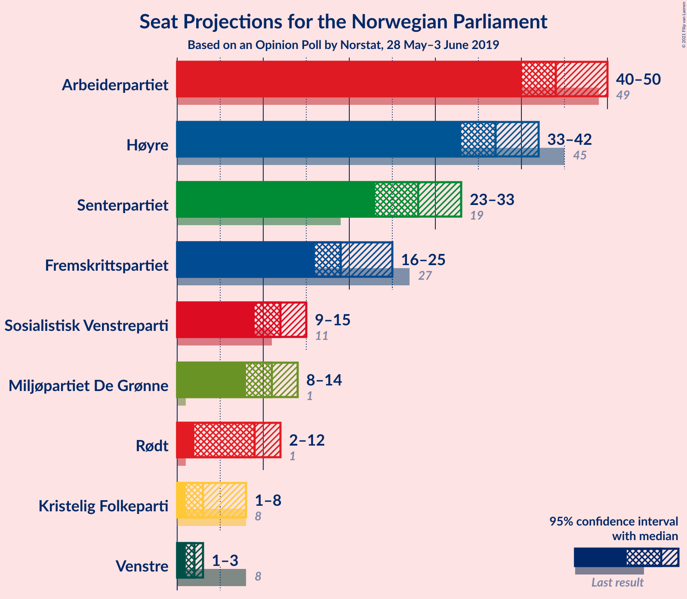
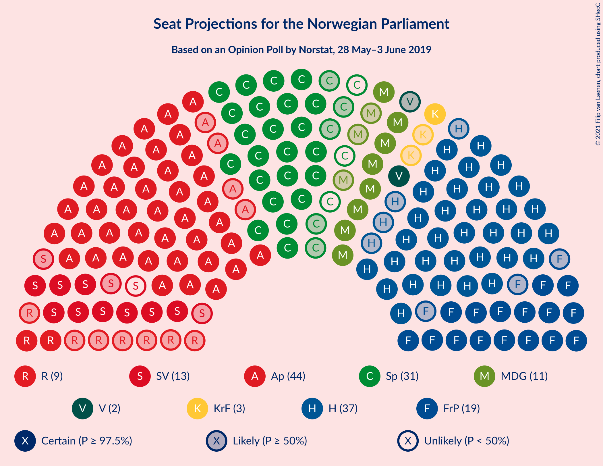
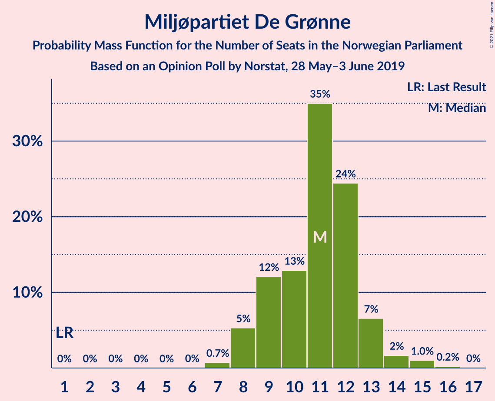
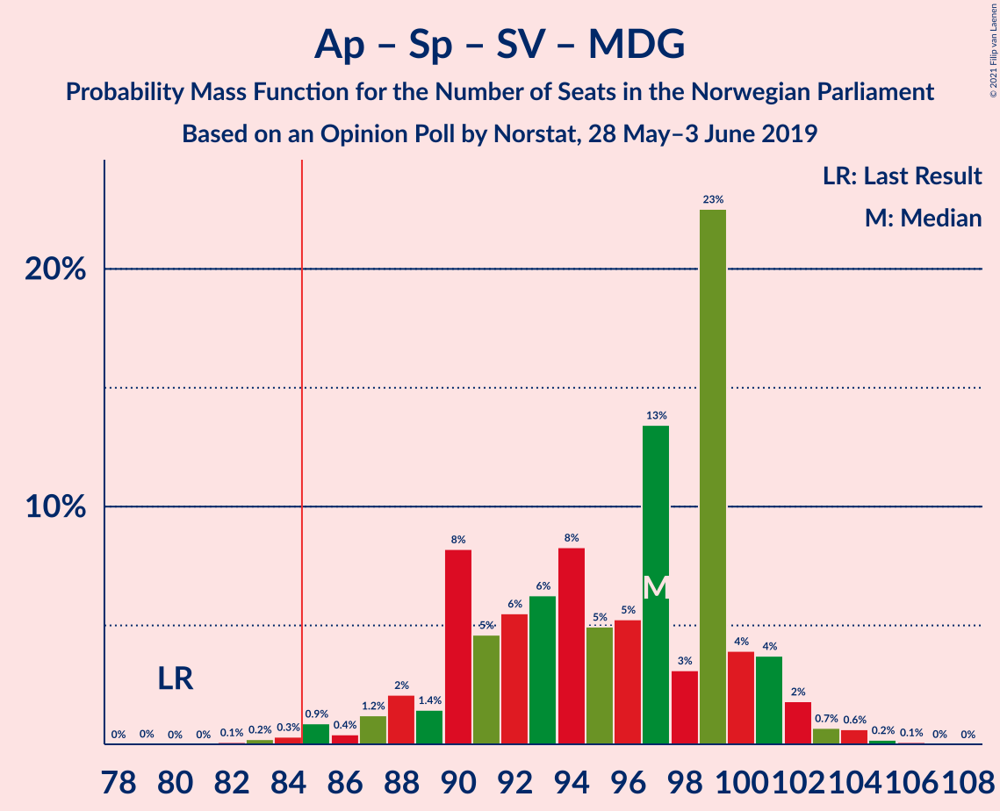
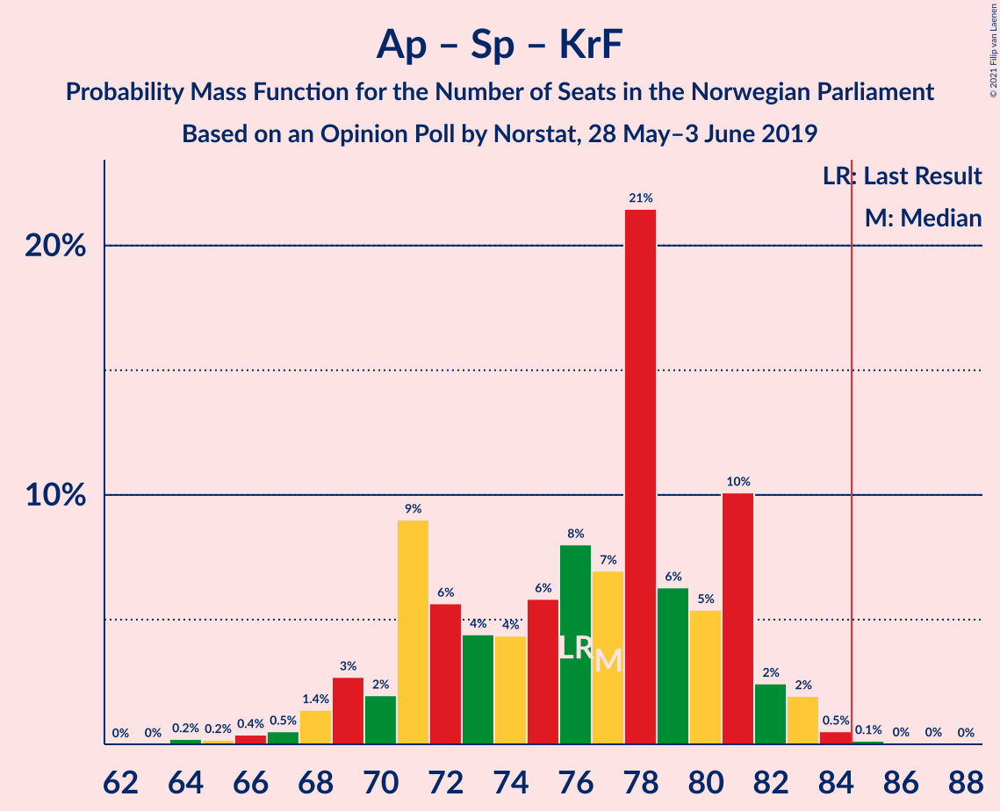
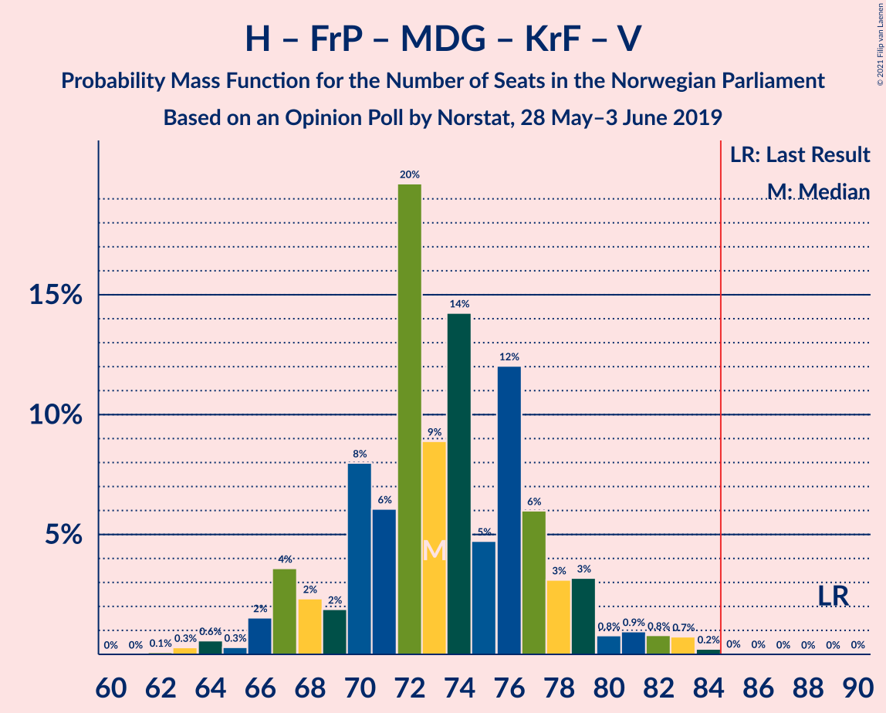
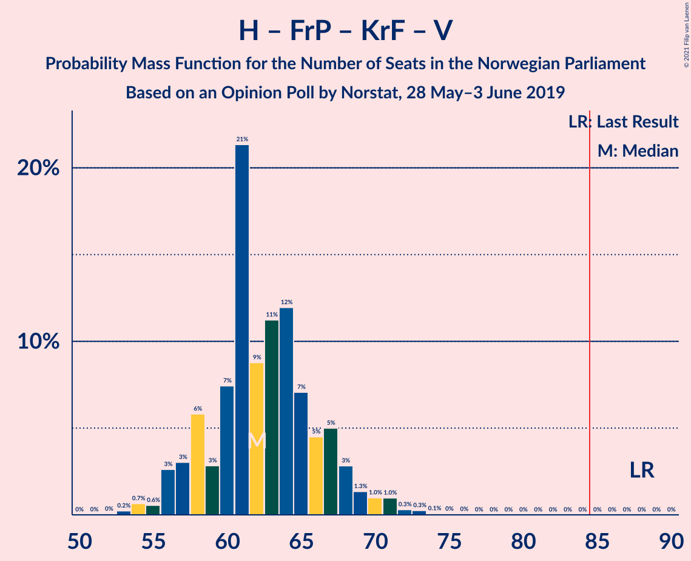
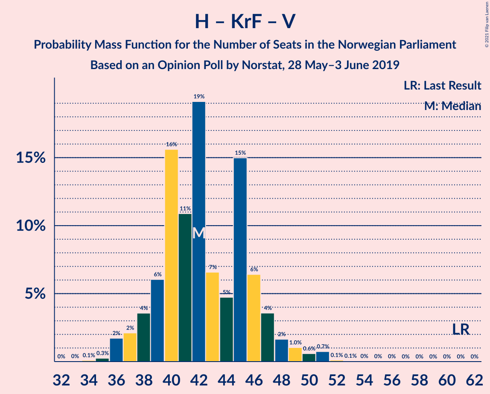

# Opinion Poll by Norstat, 28 May–3 June 2019

<a href="#voting-intentions">Voting Intentions</a> | <a href="#seats">Seats</a> | <a href="#coalitions">Coalitions</a> | <a href="#technical-information">Technical Information</a>

## Voting Intentions

### Confidence Intervals

| Party | Last Result | Poll Result | 80% Confidence Interval | 90% Confidence Interval | 95% Confidence Interval | 99% Confidence Interval |
|:-----:|:-----------:|:-----------:|:-----------------------:|:-----------------------:|:-----------------------:|:-----------------------:|
| Arbeiderpartiet | 27.4% | 24.4% | 22.7–26.2% |22.2–26.8% |21.8–27.2% |21.0–28.1% |
| Høyre | 25.0% | 21.0% | 19.4–22.8% |18.9–23.3% |18.5–23.7% |17.8–24.6% |
| Senterpartiet | 10.3% | 14.9% | 13.5–16.5% |13.1–16.9% |12.8–17.3% |12.2–18.1% |
| Fremskrittspartiet | 15.2% | 11.4% | 10.1–12.8% |9.8–13.2% |9.5–13.5% |8.9–14.3% |
| Sosialistisk Venstreparti | 6.0% | 6.8% | 5.9–8.0% |5.6–8.3% |5.4–8.6% |5.0–9.2% |
| Miljøpartiet De Grønne | 3.2% | 6.3% | 5.4–7.4% |5.1–7.8% |4.9–8.0% |4.5–8.6% |
| Rødt | 2.4% | 5.0% | 4.2–6.1% |4.0–6.4% |3.8–6.6% |3.5–7.2% |
| Kristelig Folkeparti | 4.2% | 3.5% | 2.8–4.4% |2.6–4.6% |2.5–4.8% |2.2–5.3% |
| Venstre | 4.4% | 2.7% | 2.2–3.6% |2.0–3.8% |1.9–4.0% |1.6–4.4% |

*Note:* The poll result column reflects the actual value used in the calculations. Published results may vary slightly, and in addition be rounded to fewer digits.

## Seats

### Confidence Intervals

| Party | Last Result | Median | 80% Confidence Interval | 90% Confidence Interval | 95% Confidence Interval | 99% Confidence Interval |
|:-----:|:-----------:|:------:|:-----------------------:|:-----------------------:|:-----------------------:|:-----------------------:|
| <a href="#arbeiderpartiet">Arbeiderpartiet</a> | 49 | 44 | 41–49 |40–49 |39–52 |37–53 |
| <a href="#høyre">Høyre</a> | 45 | 37 | 34–40 |33–41 |32–42 |31–44 |
| <a href="#senterpartiet">Senterpartiet</a> | 19 | 27 | 24–32 |23–32 |23–33 |21–35 |
| <a href="#fremskrittspartiet">Fremskrittspartiet</a> | 27 | 20 | 16–24 |16–25 |15–25 |14–26 |
| <a href="#sosialistisk-venstreparti">Sosialistisk Venstreparti</a> | 11 | 12 | 9–14 |9–15 |8–16 |8–17 |
| <a href="#miljøpartiet-de-grønne">Miljøpartiet De Grønne</a> | 1 | 10 | 8–13 |8–13 |8–14 |7–15 |
| <a href="#rødt">Rødt</a> | 1 | 9 | 6–11 |2–12 |2–12 |2–13 |
| <a href="#kristelig-folkeparti">Kristelig Folkeparti</a> | 8 | 3 | 1–7 |1–7 |0–8 |0–9 |
| <a href="#venstre">Venstre</a> | 8 | 2 | 1–2 |1–2 |1–3 |0–7 |

### Arbeiderpartiet

*For a full overview of the results for this party, see the [Arbeiderpartiet](party-arbeiderpartiet.html) page.*

| Number of Seats | Probability | Accumulated | Special Marks |
|:---------------:|:-----------:|:-----------:|:-------------:|
| 37 | 0.6% | 100% |  |
| 38 | 1.4% | 99.3% |  |
| 39 | 0.8% | 98% |  |
| 40 | 4% | 97% |  |
| 41 | 6% | 93% |  |
| 42 | 11% | 87% |  |
| 43 | 9% | 76% |  |
| 44 | 19% | 67% | Median |
| 45 | 8% | 48% |  |
| 46 | 20% | 40% |  |
| 47 | 7% | 20% |  |
| 48 | 2% | 13% |  |
| 49 | 6% | 11% | Last Result |
| 50 | 0.9% | 5% |  |
| 51 | 0.6% | 4% |  |
| 52 | 2% | 3% |  |
| 53 | 0.6% | 0.8% |  |
| 54 | 0% | 0.2% |  |
| 55 | 0.2% | 0.2% |  |
| 56 | 0% | 0% |  |

### Høyre

*For a full overview of the results for this party, see the [Høyre](party-høyre.html) page.*

| Number of Seats | Probability | Accumulated | Special Marks |
|:---------------:|:-----------:|:-----------:|:-------------:|
| 29 | 0% | 100% |  |
| 30 | 0.2% | 99.9% |  |
| 31 | 0.6% | 99.7% |  |
| 32 | 3% | 99.1% |  |
| 33 | 3% | 97% |  |
| 34 | 3% | 93% |  |
| 35 | 7% | 90% |  |
| 36 | 23% | 83% |  |
| 37 | 11% | 60% | Median |
| 38 | 19% | 49% |  |
| 39 | 13% | 29% |  |
| 40 | 8% | 17% |  |
| 41 | 6% | 9% |  |
| 42 | 1.2% | 3% |  |
| 43 | 0.6% | 2% |  |
| 44 | 0.7% | 0.9% |  |
| 45 | 0.1% | 0.3% | Last Result |
| 46 | 0.1% | 0.1% |  |
| 47 | 0% | 0% |  |

### Senterpartiet

*For a full overview of the results for this party, see the [Senterpartiet](party-senterpartiet.html) page.*

| Number of Seats | Probability | Accumulated | Special Marks |
|:---------------:|:-----------:|:-----------:|:-------------:|
| 19 | 0% | 100% | Last Result |
| 20 | 0.1% | 99.9% |  |
| 21 | 1.3% | 99.9% |  |
| 22 | 0.7% | 98.5% |  |
| 23 | 4% | 98% |  |
| 24 | 9% | 94% |  |
| 25 | 17% | 85% |  |
| 26 | 15% | 67% |  |
| 27 | 7% | 52% | Median |
| 28 | 10% | 45% |  |
| 29 | 10% | 35% |  |
| 30 | 2% | 26% |  |
| 31 | 5% | 24% |  |
| 32 | 15% | 19% |  |
| 33 | 3% | 4% |  |
| 34 | 0.7% | 1.2% |  |
| 35 | 0.3% | 0.5% |  |
| 36 | 0.2% | 0.2% |  |
| 37 | 0% | 0% |  |

### Fremskrittspartiet

*For a full overview of the results for this party, see the [Fremskrittspartiet](party-fremskrittspartiet.html) page.*

| Number of Seats | Probability | Accumulated | Special Marks |
|:---------------:|:-----------:|:-----------:|:-------------:|
| 13 | 0% | 100% |  |
| 14 | 2% | 99.9% |  |
| 15 | 2% | 98% |  |
| 16 | 8% | 96% |  |
| 17 | 8% | 88% |  |
| 18 | 8% | 80% |  |
| 19 | 15% | 72% |  |
| 20 | 23% | 57% | Median |
| 21 | 8% | 34% |  |
| 22 | 3% | 26% |  |
| 23 | 11% | 23% |  |
| 24 | 5% | 12% |  |
| 25 | 6% | 7% |  |
| 26 | 0.8% | 0.9% |  |
| 27 | 0% | 0.1% | Last Result |
| 28 | 0% | 0% |  |

### Sosialistisk Venstreparti

*For a full overview of the results for this party, see the [Sosialistisk Venstreparti](party-sosialistiskvenstreparti.html) page.*

| Number of Seats | Probability | Accumulated | Special Marks |
|:---------------:|:-----------:|:-----------:|:-------------:|
| 7 | 0.3% | 100% |  |
| 8 | 3% | 99.7% |  |
| 9 | 11% | 97% |  |
| 10 | 12% | 86% |  |
| 11 | 15% | 74% | Last Result |
| 12 | 19% | 59% | Median |
| 13 | 26% | 40% |  |
| 14 | 6% | 14% |  |
| 15 | 3% | 7% |  |
| 16 | 4% | 5% |  |
| 17 | 0.4% | 0.5% |  |
| 18 | 0.1% | 0.1% |  |
| 19 | 0% | 0% |  |

### Miljøpartiet De Grønne

*For a full overview of the results for this party, see the [Miljøpartiet De Grønne](party-miljøpartietdegrønne.html) page.*

| Number of Seats | Probability | Accumulated | Special Marks |
|:---------------:|:-----------:|:-----------:|:-------------:|
| 1 | 0% | 100% | Last Result |
| 2 | 0% | 100% |  |
| 3 | 0% | 100% |  |
| 4 | 0% | 100% |  |
| 5 | 0% | 99.9% |  |
| 6 | 0% | 99.9% |  |
| 7 | 0.5% | 99.9% |  |
| 8 | 12% | 99.5% |  |
| 9 | 25% | 88% |  |
| 10 | 14% | 63% | Median |
| 11 | 20% | 49% |  |
| 12 | 17% | 29% |  |
| 13 | 8% | 12% |  |
| 14 | 3% | 4% |  |
| 15 | 1.3% | 2% |  |
| 16 | 0.1% | 0.2% |  |
| 17 | 0.1% | 0.1% |  |
| 18 | 0% | 0% |  |

### Rødt

*For a full overview of the results for this party, see the [Rødt](party-rødt.html) page.*

| Number of Seats | Probability | Accumulated | Special Marks |
|:---------------:|:-----------:|:-----------:|:-------------:|
| 1 | 0% | 100% | Last Result |
| 2 | 9% | 100% |  |
| 3 | 0% | 91% |  |
| 4 | 0% | 91% |  |
| 5 | 0% | 91% |  |
| 6 | 3% | 91% |  |
| 7 | 9% | 88% |  |
| 8 | 17% | 78% |  |
| 9 | 19% | 61% | Median |
| 10 | 17% | 42% |  |
| 11 | 18% | 25% |  |
| 12 | 6% | 7% |  |
| 13 | 2% | 2% |  |
| 14 | 0.1% | 0.1% |  |
| 15 | 0% | 0% |  |

### Kristelig Folkeparti

*For a full overview of the results for this party, see the [Kristelig Folkeparti](party-kristeligfolkeparti.html) page.*

| Number of Seats | Probability | Accumulated | Special Marks |
|:---------------:|:-----------:|:-----------:|:-------------:|
| 0 | 3% | 100% |  |
| 1 | 25% | 97% |  |
| 2 | 7% | 72% |  |
| 3 | 36% | 65% | Median |
| 4 | 0% | 29% |  |
| 5 | 0% | 29% |  |
| 6 | 4% | 29% |  |
| 7 | 20% | 25% |  |
| 8 | 4% | 5% | Last Result |
| 9 | 0.6% | 0.9% |  |
| 10 | 0.2% | 0.3% |  |
| 11 | 0% | 0% |  |

### Venstre

*For a full overview of the results for this party, see the [Venstre](party-venstre.html) page.*

| Number of Seats | Probability | Accumulated | Special Marks |
|:---------------:|:-----------:|:-----------:|:-------------:|
| 0 | 2% | 100% |  |
| 1 | 12% | 98% |  |
| 2 | 83% | 86% | Median |
| 3 | 0.9% | 3% |  |
| 4 | 0.1% | 2% |  |
| 5 | 0% | 2% |  |
| 6 | 1.2% | 2% |  |
| 7 | 0.9% | 1.1% |  |
| 8 | 0.2% | 0.3% | Last Result |
| 9 | 0% | 0% |  |

## Coalitions

### Confidence Intervals

| Coalition | Last Result | Median | Majority? | 80% Confidence Interval | 90% Confidence Interval | 95% Confidence Interval | 99% Confidence Interval |
|:---------:|:-----------:|:------:|:---------:|:-----------------------:|:-----------------------:|:-----------------------:|:-----------------------:|
| Arbeiderpartiet – Senterpartiet – Sosialistisk Venstreparti – Miljøpartiet De Grønne – Rødt | 81 | 104 | 100% | 98–109 | 94–109 | 92–110 | 92–113 |
| Arbeiderpartiet – Senterpartiet – Sosialistisk Venstreparti – Miljøpartiet De Grønne – Kristelig Folkeparti | 88 | 99 | 100% | 91–103 | 91–104 | 88–107 | 87–109 |
| Arbeiderpartiet – Senterpartiet – Sosialistisk Venstreparti – Miljøpartiet De Grønne | 80 | 94 | 99.1% | 89–100 | 88–100 | 85–101 | 84–104 |
| Arbeiderpartiet – Senterpartiet – Sosialistisk Venstreparti – Rødt | 80 | 93 | 95% | 88–98 | 85–99 | 84–99 | 81–101 |
| Høyre – Senterpartiet – Fremskrittspartiet – Kristelig Folkeparti – Venstre | 107 | 91 | 89% | 84–94 | 83–96 | 83–97 | 81–100 |
| Arbeiderpartiet – Senterpartiet – Miljøpartiet De Grønne – Kristelig Folkeparti | 77 | 87 | 67% | 81–91 | 78–93 | 77–94 | 76–96 |
| Arbeiderpartiet – Senterpartiet – Sosialistisk Venstreparti | 79 | 84 | 41% | 79–89 | 77–89 | 77–90 | 75–92 |
| Arbeiderpartiet – Senterpartiet – Kristelig Folkeparti | 76 | 77 | 0.8% | 70–80 | 69–81 | 68–83 | 66–85 |
| Høyre – Fremskrittspartiet – Miljøpartiet De Grønne – Kristelig Folkeparti – Venstre | 89 | 74 | 0.3% | 68–78 | 67–79 | 66–80 | 65–83 |
| Arbeiderpartiet – Senterpartiet | 68 | 71 | 0% | 68–77 | 66–78 | 65–78 | 63–80 |
| Høyre – Fremskrittspartiet – Kristelig Folkeparti – Venstre | 88 | 63 | 0% | 58–68 | 57–69 | 56–70 | 54–72 |
| Høyre – Fremskrittspartiet – Venstre | 80 | 59 | 0% | 56–64 | 54–67 | 53–67 | 51–69 |
| Høyre – Fremskrittspartiet | 72 | 57 | 0% | 54–62 | 52–65 | 51–65 | 49–67 |
| Arbeiderpartiet – Sosialistisk Venstreparti | 60 | 57 | 0% | 52–61 | 51–61 | 50–62 | 49–65 |
| Høyre – Kristelig Folkeparti – Venstre | 61 | 43 | 0% | 39–47 | 37–47 | 37–49 | 36–51 |
| Senterpartiet – Kristelig Folkeparti – Venstre | 35 | 33 | 0% | 29–37 | 27–39 | 26–41 | 24–43 |

### Arbeiderpartiet – Senterpartiet – Sosialistisk Venstreparti – Miljøpartiet De Grønne – Rødt

| Number of Seats | Probability | Accumulated | Special Marks |
|:---------------:|:-----------:|:-----------:|:-------------:|
| 81 | 0% | 100% | Last Result |
| 82 | 0% | 100% |  |
| 83 | 0% | 100% |  |
| 84 | 0% | 100% |  |
| 85 | 0% | 100% | Majority |
| 86 | 0% | 100% |  |
| 87 | 0% | 100% |  |
| 88 | 0% | 100% |  |
| 89 | 0% | 100% |  |
| 90 | 0.3% | 99.9% |  |
| 91 | 0% | 99.6% |  |
| 92 | 2% | 99.6% |  |
| 93 | 0.7% | 97% |  |
| 94 | 2% | 97% |  |
| 95 | 0.3% | 95% |  |
| 96 | 2% | 95% |  |
| 97 | 2% | 93% |  |
| 98 | 4% | 91% |  |
| 99 | 9% | 87% |  |
| 100 | 3% | 78% |  |
| 101 | 8% | 75% |  |
| 102 | 10% | 67% | Median |
| 103 | 4% | 57% |  |
| 104 | 18% | 52% |  |
| 105 | 10% | 34% |  |
| 106 | 3% | 24% |  |
| 107 | 1.0% | 21% |  |
| 108 | 4% | 20% |  |
| 109 | 12% | 16% |  |
| 110 | 2% | 4% |  |
| 111 | 2% | 2% |  |
| 112 | 0.3% | 0.8% |  |
| 113 | 0.3% | 0.5% |  |
| 114 | 0.2% | 0.3% |  |
| 115 | 0% | 0% |  |

### Arbeiderpartiet – Senterpartiet – Sosialistisk Venstreparti – Miljøpartiet De Grønne – Kristelig Folkeparti

| Number of Seats | Probability | Accumulated | Special Marks |
|:---------------:|:-----------:|:-----------:|:-------------:|
| 86 | 0.4% | 100% |  |
| 87 | 0.2% | 99.6% |  |
| 88 | 3% | 99.4% | Last Result |
| 89 | 0.6% | 97% |  |
| 90 | 0.9% | 96% |  |
| 91 | 7% | 95% |  |
| 92 | 1.1% | 88% |  |
| 93 | 3% | 87% |  |
| 94 | 5% | 84% |  |
| 95 | 6% | 79% |  |
| 96 | 8% | 73% | Median |
| 97 | 7% | 66% |  |
| 98 | 5% | 59% |  |
| 99 | 6% | 53% |  |
| 100 | 27% | 47% |  |
| 101 | 2% | 20% |  |
| 102 | 7% | 18% |  |
| 103 | 6% | 11% |  |
| 104 | 2% | 6% |  |
| 105 | 0.6% | 4% |  |
| 106 | 0.6% | 3% |  |
| 107 | 0.2% | 3% |  |
| 108 | 1.3% | 2% |  |
| 109 | 0.9% | 1.0% |  |
| 110 | 0% | 0.1% |  |
| 111 | 0.1% | 0.1% |  |
| 112 | 0% | 0% |  |

### Arbeiderpartiet – Senterpartiet – Sosialistisk Venstreparti – Miljøpartiet De Grønne

| Number of Seats | Probability | Accumulated | Special Marks |
|:---------------:|:-----------:|:-----------:|:-------------:|
| 80 | 0% | 100% | Last Result |
| 81 | 0% | 100% |  |
| 82 | 0.3% | 100% |  |
| 83 | 0.1% | 99.7% |  |
| 84 | 0.5% | 99.6% |  |
| 85 | 2% | 99.1% | Majority |
| 86 | 0.7% | 97% |  |
| 87 | 1.0% | 96% |  |
| 88 | 3% | 95% |  |
| 89 | 3% | 92% |  |
| 90 | 5% | 89% |  |
| 91 | 5% | 84% |  |
| 92 | 8% | 80% |  |
| 93 | 18% | 72% | Median |
| 94 | 9% | 54% |  |
| 95 | 6% | 45% |  |
| 96 | 5% | 38% |  |
| 97 | 7% | 33% |  |
| 98 | 6% | 26% |  |
| 99 | 9% | 20% |  |
| 100 | 7% | 11% |  |
| 101 | 1.3% | 4% |  |
| 102 | 1.3% | 2% |  |
| 103 | 0.5% | 1.1% |  |
| 104 | 0.2% | 0.5% |  |
| 105 | 0.3% | 0.3% |  |
| 106 | 0.1% | 0.1% |  |
| 107 | 0% | 0% |  |

### Arbeiderpartiet – Senterpartiet – Sosialistisk Venstreparti – Rødt

| Number of Seats | Probability | Accumulated | Special Marks |
|:---------------:|:-----------:|:-----------:|:-------------:|
| 79 | 0.1% | 100% |  |
| 80 | 0% | 99.8% | Last Result |
| 81 | 0.3% | 99.8% |  |
| 82 | 0.1% | 99.5% |  |
| 83 | 1.3% | 99.4% |  |
| 84 | 3% | 98% |  |
| 85 | 1.4% | 95% | Majority |
| 86 | 2% | 94% |  |
| 87 | 1.2% | 92% |  |
| 88 | 7% | 91% |  |
| 89 | 6% | 84% |  |
| 90 | 13% | 78% |  |
| 91 | 8% | 65% |  |
| 92 | 3% | 57% | Median |
| 93 | 8% | 54% |  |
| 94 | 6% | 46% |  |
| 95 | 18% | 40% |  |
| 96 | 5% | 22% |  |
| 97 | 3% | 17% |  |
| 98 | 5% | 14% |  |
| 99 | 9% | 10% |  |
| 100 | 0.3% | 1.0% |  |
| 101 | 0.5% | 0.8% |  |
| 102 | 0.2% | 0.3% |  |
| 103 | 0% | 0.1% |  |
| 104 | 0.1% | 0.1% |  |
| 105 | 0% | 0% |  |

### Høyre – Senterpartiet – Fremskrittspartiet – Kristelig Folkeparti – Venstre

| Number of Seats | Probability | Accumulated | Special Marks |
|:---------------:|:-----------:|:-----------:|:-------------:|
| 77 | 0% | 100% |  |
| 78 | 0% | 99.9% |  |
| 79 | 0% | 99.9% |  |
| 80 | 0.1% | 99.9% |  |
| 81 | 0.5% | 99.7% |  |
| 82 | 1.0% | 99.2% |  |
| 83 | 3% | 98% |  |
| 84 | 6% | 95% |  |
| 85 | 4% | 89% | Majority |
| 86 | 7% | 86% |  |
| 87 | 2% | 78% |  |
| 88 | 3% | 77% |  |
| 89 | 2% | 73% | Median |
| 90 | 21% | 71% |  |
| 91 | 7% | 50% |  |
| 92 | 22% | 43% |  |
| 93 | 5% | 21% |  |
| 94 | 7% | 16% |  |
| 95 | 2% | 9% |  |
| 96 | 4% | 7% |  |
| 97 | 0.8% | 3% |  |
| 98 | 0.5% | 2% |  |
| 99 | 1.2% | 2% |  |
| 100 | 0.2% | 0.6% |  |
| 101 | 0.3% | 0.4% |  |
| 102 | 0% | 0.1% |  |
| 103 | 0% | 0% |  |
| 104 | 0% | 0% |  |
| 105 | 0% | 0% |  |
| 106 | 0% | 0% |  |
| 107 | 0% | 0% | Last Result |

### Arbeiderpartiet – Senterpartiet – Miljøpartiet De Grønne – Kristelig Folkeparti

| Number of Seats | Probability | Accumulated | Special Marks |
|:---------------:|:-----------:|:-----------:|:-------------:|
| 74 | 0.3% | 100% |  |
| 75 | 0% | 99.6% |  |
| 76 | 0.3% | 99.6% |  |
| 77 | 3% | 99.3% | Last Result |
| 78 | 2% | 97% |  |
| 79 | 0.9% | 95% |  |
| 80 | 2% | 94% |  |
| 81 | 9% | 92% |  |
| 82 | 5% | 82% |  |
| 83 | 3% | 78% |  |
| 84 | 8% | 74% | Median |
| 85 | 2% | 67% | Majority |
| 86 | 4% | 64% |  |
| 87 | 29% | 61% |  |
| 88 | 6% | 32% |  |
| 89 | 11% | 26% |  |
| 90 | 3% | 15% |  |
| 91 | 3% | 12% |  |
| 92 | 3% | 9% |  |
| 93 | 3% | 6% |  |
| 94 | 0.5% | 3% |  |
| 95 | 2% | 2% |  |
| 96 | 0.2% | 0.7% |  |
| 97 | 0.2% | 0.4% |  |
| 98 | 0.2% | 0.2% |  |
| 99 | 0% | 0% |  |

### Arbeiderpartiet – Senterpartiet – Sosialistisk Venstreparti

| Number of Seats | Probability | Accumulated | Special Marks |
|:---------------:|:-----------:|:-----------:|:-------------:|
| 73 | 0.3% | 100% |  |
| 74 | 0.1% | 99.6% |  |
| 75 | 0.6% | 99.5% |  |
| 76 | 0.4% | 98.9% |  |
| 77 | 4% | 98.5% |  |
| 78 | 3% | 94% |  |
| 79 | 2% | 92% | Last Result |
| 80 | 5% | 90% |  |
| 81 | 15% | 85% |  |
| 82 | 3% | 71% |  |
| 83 | 11% | 68% | Median |
| 84 | 16% | 57% |  |
| 85 | 3% | 41% | Majority |
| 86 | 10% | 38% |  |
| 87 | 11% | 28% |  |
| 88 | 5% | 17% |  |
| 89 | 8% | 11% |  |
| 90 | 2% | 4% |  |
| 91 | 0.7% | 1.4% |  |
| 92 | 0.4% | 0.7% |  |
| 93 | 0.2% | 0.3% |  |
| 94 | 0.1% | 0.1% |  |
| 95 | 0% | 0% |  |

### Arbeiderpartiet – Senterpartiet – Kristelig Folkeparti

| Number of Seats | Probability | Accumulated | Special Marks |
|:---------------:|:-----------:|:-----------:|:-------------:|
| 64 | 0% | 100% |  |
| 65 | 0.4% | 99.9% |  |
| 66 | 0.7% | 99.5% |  |
| 67 | 0.7% | 98.8% |  |
| 68 | 1.4% | 98% |  |
| 69 | 3% | 97% |  |
| 70 | 4% | 93% |  |
| 71 | 8% | 89% |  |
| 72 | 9% | 81% |  |
| 73 | 7% | 72% |  |
| 74 | 3% | 65% | Median |
| 75 | 4% | 63% |  |
| 76 | 7% | 59% | Last Result |
| 77 | 10% | 52% |  |
| 78 | 19% | 41% |  |
| 79 | 8% | 22% |  |
| 80 | 5% | 14% |  |
| 81 | 5% | 9% |  |
| 82 | 1.4% | 4% |  |
| 83 | 2% | 3% |  |
| 84 | 0.2% | 1.0% |  |
| 85 | 0.4% | 0.8% | Majority |
| 86 | 0.1% | 0.3% |  |
| 87 | 0.2% | 0.3% |  |
| 88 | 0.1% | 0.1% |  |
| 89 | 0% | 0% |  |

### Høyre – Fremskrittspartiet – Miljøpartiet De Grønne – Kristelig Folkeparti – Venstre

| Number of Seats | Probability | Accumulated | Special Marks |
|:---------------:|:-----------:|:-----------:|:-------------:|
| 62 | 0.1% | 100% |  |
| 63 | 0.2% | 99.9% |  |
| 64 | 0.1% | 99.7% |  |
| 65 | 1.0% | 99.6% |  |
| 66 | 3% | 98.7% |  |
| 67 | 4% | 96% |  |
| 68 | 3% | 92% |  |
| 69 | 3% | 89% |  |
| 70 | 10% | 86% |  |
| 71 | 11% | 76% |  |
| 72 | 11% | 65% | Median |
| 73 | 3% | 55% |  |
| 74 | 23% | 52% |  |
| 75 | 3% | 29% |  |
| 76 | 7% | 25% |  |
| 77 | 2% | 19% |  |
| 78 | 7% | 17% |  |
| 79 | 6% | 10% |  |
| 80 | 1.5% | 4% |  |
| 81 | 1.0% | 2% |  |
| 82 | 0.3% | 1.2% |  |
| 83 | 0.5% | 0.9% |  |
| 84 | 0.1% | 0.4% |  |
| 85 | 0.1% | 0.3% | Majority |
| 86 | 0.1% | 0.2% |  |
| 87 | 0% | 0.1% |  |
| 88 | 0% | 0.1% |  |
| 89 | 0% | 0.1% | Last Result |
| 90 | 0.1% | 0.1% |  |
| 91 | 0% | 0% |  |

### Arbeiderpartiet – Senterpartiet

| Number of Seats | Probability | Accumulated | Special Marks |
|:---------------:|:-----------:|:-----------:|:-------------:|
| 63 | 0.8% | 100% |  |
| 64 | 0.9% | 99.2% |  |
| 65 | 2% | 98% |  |
| 66 | 3% | 96% |  |
| 67 | 2% | 93% |  |
| 68 | 6% | 91% | Last Result |
| 69 | 9% | 85% |  |
| 70 | 6% | 77% |  |
| 71 | 25% | 71% | Median |
| 72 | 4% | 46% |  |
| 73 | 6% | 42% |  |
| 74 | 2% | 36% |  |
| 75 | 10% | 34% |  |
| 76 | 12% | 23% |  |
| 77 | 5% | 11% |  |
| 78 | 4% | 6% |  |
| 79 | 1.2% | 2% |  |
| 80 | 0.6% | 0.9% |  |
| 81 | 0.2% | 0.3% |  |
| 82 | 0% | 0.1% |  |
| 83 | 0% | 0% |  |

### Høyre – Fremskrittspartiet – Kristelig Folkeparti – Venstre

| Number of Seats | Probability | Accumulated | Special Marks |
|:---------------:|:-----------:|:-----------:|:-------------:|
| 53 | 0.1% | 100% |  |
| 54 | 0.9% | 99.9% |  |
| 55 | 0.6% | 99.0% |  |
| 56 | 2% | 98% |  |
| 57 | 3% | 96% |  |
| 58 | 5% | 93% |  |
| 59 | 7% | 88% |  |
| 60 | 17% | 81% |  |
| 61 | 5% | 64% |  |
| 62 | 3% | 59% | Median |
| 63 | 11% | 56% |  |
| 64 | 9% | 45% |  |
| 65 | 16% | 36% |  |
| 66 | 5% | 20% |  |
| 67 | 4% | 15% |  |
| 68 | 6% | 11% |  |
| 69 | 1.2% | 5% |  |
| 70 | 3% | 4% |  |
| 71 | 0.3% | 1.4% |  |
| 72 | 0.7% | 1.1% |  |
| 73 | 0.2% | 0.5% |  |
| 74 | 0.2% | 0.3% |  |
| 75 | 0% | 0.2% |  |
| 76 | 0.1% | 0.1% |  |
| 77 | 0% | 0% |  |
| 78 | 0% | 0% |  |
| 79 | 0% | 0% |  |
| 80 | 0% | 0% |  |
| 81 | 0% | 0% |  |
| 82 | 0% | 0% |  |
| 83 | 0% | 0% |  |
| 84 | 0% | 0% |  |
| 85 | 0% | 0% | Majority |
| 86 | 0% | 0% |  |
| 87 | 0% | 0% |  |
| 88 | 0% | 0% | Last Result |

### Høyre – Fremskrittspartiet – Venstre

| Number of Seats | Probability | Accumulated | Special Marks |
|:---------------:|:-----------:|:-----------:|:-------------:|
| 49 | 0% | 100% |  |
| 50 | 0.1% | 99.9% |  |
| 51 | 0.7% | 99.9% |  |
| 52 | 1.0% | 99.1% |  |
| 53 | 3% | 98% |  |
| 54 | 1.4% | 95% |  |
| 55 | 2% | 94% |  |
| 56 | 11% | 91% |  |
| 57 | 8% | 81% |  |
| 58 | 20% | 73% |  |
| 59 | 15% | 52% | Median |
| 60 | 9% | 38% |  |
| 61 | 9% | 29% |  |
| 62 | 7% | 20% |  |
| 63 | 2% | 13% |  |
| 64 | 1.4% | 11% |  |
| 65 | 3% | 10% |  |
| 66 | 1.4% | 7% |  |
| 67 | 5% | 6% |  |
| 68 | 0.5% | 1.1% |  |
| 69 | 0.4% | 0.6% |  |
| 70 | 0.1% | 0.2% |  |
| 71 | 0.1% | 0.1% |  |
| 72 | 0% | 0.1% |  |
| 73 | 0% | 0% |  |
| 74 | 0% | 0% |  |
| 75 | 0% | 0% |  |
| 76 | 0% | 0% |  |
| 77 | 0% | 0% |  |
| 78 | 0% | 0% |  |
| 79 | 0% | 0% |  |
| 80 | 0% | 0% | Last Result |

### Høyre – Fremskrittspartiet

| Number of Seats | Probability | Accumulated | Special Marks |
|:---------------:|:-----------:|:-----------:|:-------------:|
| 47 | 0% | 100% |  |
| 48 | 0.1% | 99.9% |  |
| 49 | 0.6% | 99.9% |  |
| 50 | 1.1% | 99.3% |  |
| 51 | 2% | 98% |  |
| 52 | 3% | 96% |  |
| 53 | 3% | 94% |  |
| 54 | 8% | 91% |  |
| 55 | 10% | 83% |  |
| 56 | 21% | 73% |  |
| 57 | 15% | 52% | Median |
| 58 | 8% | 37% |  |
| 59 | 9% | 29% |  |
| 60 | 6% | 20% |  |
| 61 | 3% | 13% |  |
| 62 | 0.9% | 11% |  |
| 63 | 1.1% | 10% |  |
| 64 | 3% | 9% |  |
| 65 | 5% | 6% |  |
| 66 | 0.3% | 0.8% |  |
| 67 | 0.4% | 0.5% |  |
| 68 | 0% | 0.1% |  |
| 69 | 0% | 0.1% |  |
| 70 | 0.1% | 0.1% |  |
| 71 | 0% | 0% |  |
| 72 | 0% | 0% | Last Result |

### Arbeiderpartiet – Sosialistisk Venstreparti

| Number of Seats | Probability | Accumulated | Special Marks |
|:---------------:|:-----------:|:-----------:|:-------------:|
| 48 | 0.3% | 100% |  |
| 49 | 1.1% | 99.7% |  |
| 50 | 2% | 98.6% |  |
| 51 | 6% | 97% |  |
| 52 | 6% | 91% |  |
| 53 | 6% | 85% |  |
| 54 | 7% | 79% |  |
| 55 | 9% | 72% |  |
| 56 | 10% | 63% | Median |
| 57 | 10% | 53% |  |
| 58 | 10% | 43% |  |
| 59 | 21% | 33% |  |
| 60 | 1.0% | 12% | Last Result |
| 61 | 6% | 11% |  |
| 62 | 3% | 5% |  |
| 63 | 0.7% | 2% |  |
| 64 | 0.5% | 1.2% |  |
| 65 | 0.5% | 0.7% |  |
| 66 | 0.1% | 0.1% |  |
| 67 | 0% | 0.1% |  |
| 68 | 0.1% | 0.1% |  |
| 69 | 0% | 0% |  |

### Høyre – Kristelig Folkeparti – Venstre

| Number of Seats | Probability | Accumulated | Special Marks |
|:---------------:|:-----------:|:-----------:|:-------------:|
| 33 | 0% | 100% |  |
| 34 | 0.2% | 99.9% |  |
| 35 | 0.2% | 99.8% |  |
| 36 | 1.4% | 99.6% |  |
| 37 | 4% | 98% |  |
| 38 | 3% | 94% |  |
| 39 | 6% | 91% |  |
| 40 | 7% | 85% |  |
| 41 | 18% | 78% |  |
| 42 | 4% | 59% | Median |
| 43 | 10% | 56% |  |
| 44 | 10% | 46% |  |
| 45 | 18% | 35% |  |
| 46 | 7% | 17% |  |
| 47 | 5% | 10% |  |
| 48 | 2% | 5% |  |
| 49 | 2% | 3% |  |
| 50 | 0.5% | 1.2% |  |
| 51 | 0.2% | 0.6% |  |
| 52 | 0.3% | 0.5% |  |
| 53 | 0% | 0.2% |  |
| 54 | 0.1% | 0.2% |  |
| 55 | 0% | 0% |  |
| 56 | 0% | 0% |  |
| 57 | 0% | 0% |  |
| 58 | 0% | 0% |  |
| 59 | 0% | 0% |  |
| 60 | 0% | 0% |  |
| 61 | 0% | 0% | Last Result |

### Senterpartiet – Kristelig Folkeparti – Venstre

| Number of Seats | Probability | Accumulated | Special Marks |
|:---------------:|:-----------:|:-----------:|:-------------:|
| 24 | 0.5% | 100% |  |
| 25 | 0.3% | 99.5% |  |
| 26 | 4% | 99.2% |  |
| 27 | 0.9% | 95% |  |
| 28 | 4% | 94% |  |
| 29 | 9% | 91% |  |
| 30 | 5% | 81% |  |
| 31 | 10% | 76% |  |
| 32 | 10% | 66% | Median |
| 33 | 9% | 56% |  |
| 34 | 17% | 47% |  |
| 35 | 8% | 30% | Last Result |
| 36 | 5% | 22% |  |
| 37 | 9% | 16% |  |
| 38 | 2% | 8% |  |
| 39 | 1.4% | 6% |  |
| 40 | 0.8% | 4% |  |
| 41 | 2% | 4% |  |
| 42 | 1.2% | 2% |  |
| 43 | 0.3% | 0.6% |  |
| 44 | 0.2% | 0.3% |  |
| 45 | 0.2% | 0.2% |  |
| 46 | 0% | 0% |  |

## Technical Information

### Opinion Poll

+ **Polling firm:** Norstat
+ **Commissioner(s):** —
+ **Fieldwork period:** 28 May–3 June 2019

### Calculations

+ **Sample size:** 951
+ **Simulations done:** 131,072
+ **Error estimate:** 1.84%

