# Opinion Poll by Norfakta, 4–5 June 2019

<a href="#voting-intentions">Voting Intentions</a> | <a href="#seats">Seats</a> | <a href="#coalitions">Coalitions</a> | <a href="#technical-information">Technical Information</a>

## Voting Intentions

### Confidence Intervals

| Party | Last Result | Poll Result | 80% Confidence Interval | 90% Confidence Interval | 95% Confidence Interval | 99% Confidence Interval |
|:-----:|:-----------:|:-----------:|:-----------------------:|:-----------------------:|:-----------------------:|:-----------------------:|
| Arbeiderpartiet | 27.4% | 25.1% | 23.4–26.9% |22.9–27.4% |22.5–27.9% |21.7–28.8% |
| Høyre | 25.0% | 24.3% | 22.6–26.1% |22.1–26.6% |21.7–27.1% |21.0–27.9% |
| Senterpartiet | 10.3% | 15.8% | 14.4–17.4% |14.0–17.8% |13.7–18.2% |13.0–19.0% |
| Fremskrittspartiet | 15.2% | 10.2% | 9.1–11.5% |8.7–11.9% |8.5–12.2% |8.0–12.9% |
| Sosialistisk Venstreparti | 6.0% | 6.0% | 5.1–7.1% |4.9–7.4% |4.7–7.7% |4.3–8.2% |
| Rødt | 2.4% | 5.9% | 5.0–7.0% |4.8–7.3% |4.6–7.5% |4.2–8.1% |
| Miljøpartiet De Grønne | 3.2% | 5.7% | 4.9–6.8% |4.6–7.1% |4.4–7.3% |4.1–7.9% |
| Kristelig Folkeparti | 4.2% | 3.2% | 2.6–4.0% |2.4–4.3% |2.3–4.5% |2.0–4.9% |
| Venstre | 4.4% | 1.5% | 1.1–2.1% |1.0–2.3% |0.9–2.5% |0.7–2.8% |

*Note:* The poll result column reflects the actual value used in the calculations. Published results may vary slightly, and in addition be rounded to fewer digits.

## Seats

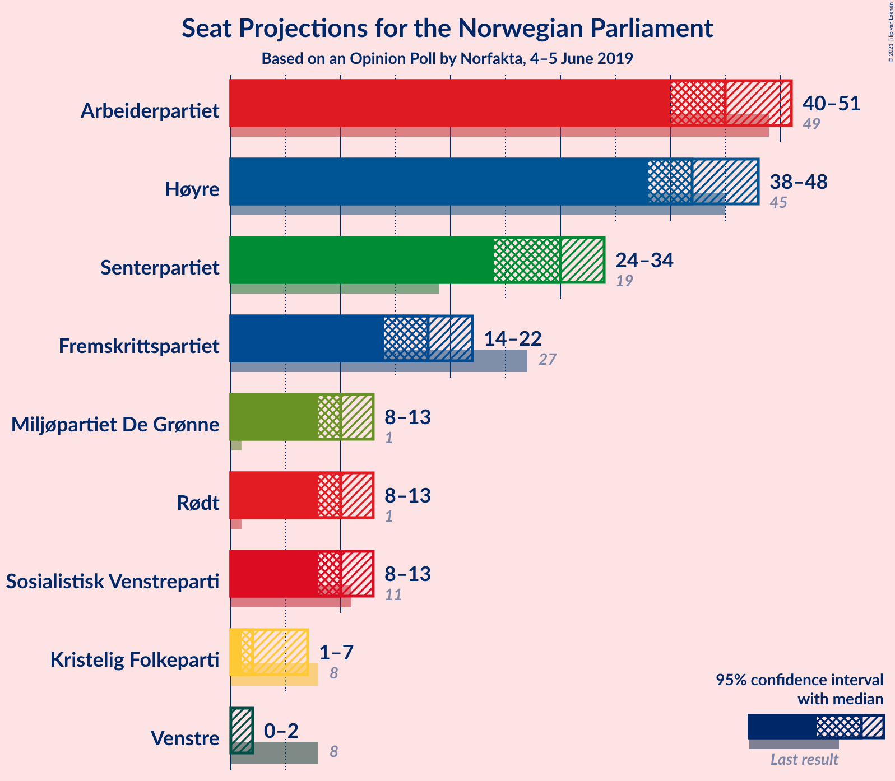

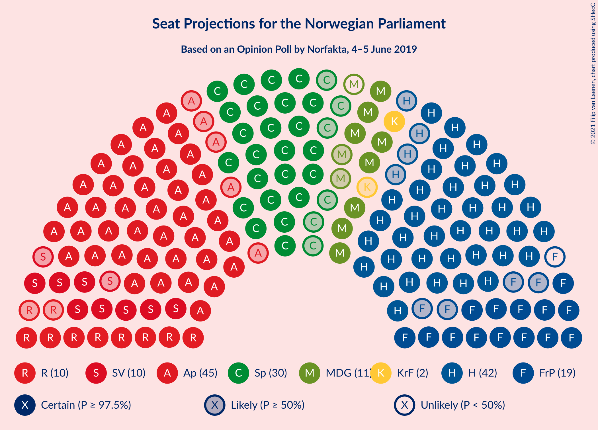

### Confidence Intervals

| Party | Last Result | Median | 80% Confidence Interval | 90% Confidence Interval | 95% Confidence Interval | 99% Confidence Interval |
|:-----:|:-----------:|:------:|:-----------------------:|:-----------------------:|:-----------------------:|:-----------------------:|
| <a href="#arbeiderpartiet">Arbeiderpartiet</a> | 49 | 45 | 42–48 |42–49 |40–51 |39–53 |
| <a href="#høyre">Høyre</a> | 45 | 42 | 40–46 |39–47 |38–48 |37–50 |
| <a href="#senterpartiet">Senterpartiet</a> | 19 | 30 | 25–34 |25–34 |24–34 |23–35 |
| <a href="#fremskrittspartiet">Fremskrittspartiet</a> | 27 | 18 | 16–20 |15–20 |14–22 |13–23 |
| <a href="#sosialistisk-venstreparti">Sosialistisk Venstreparti</a> | 11 | 10 | 9–12 |9–13 |8–13 |8–14 |
| <a href="#rødt">Rødt</a> | 1 | 10 | 9–12 |8–13 |8–13 |7–14 |
| <a href="#miljøpartiet-de-grønne">Miljøpartiet De Grønne</a> | 1 | 10 | 9–12 |8–12 |8–13 |7–14 |
| <a href="#kristelig-folkeparti">Kristelig Folkeparti</a> | 8 | 2 | 1–7 |1–7 |1–7 |0–8 |
| <a href="#venstre">Venstre</a> | 8 | 0 | 0–1 |0–1 |0–2 |0–2 |

### Arbeiderpartiet

*For a full overview of the results for this party, see the [Arbeiderpartiet](party-arbeiderpartiet.html) page.*

| Number of Seats | Probability | Accumulated | Special Marks |
|:---------------:|:-----------:|:-----------:|:-------------:|
| 37 | 0% | 100% |  |
| 38 | 0.1% | 99.9% |  |
| 39 | 0.6% | 99.8% |  |
| 40 | 2% | 99.2% |  |
| 41 | 2% | 97% |  |
| 42 | 12% | 96% |  |
| 43 | 16% | 84% |  |
| 44 | 18% | 68% |  |
| 45 | 18% | 51% | Median |
| 46 | 10% | 33% |  |
| 47 | 11% | 23% |  |
| 48 | 4% | 12% |  |
| 49 | 3% | 8% | Last Result |
| 50 | 2% | 5% |  |
| 51 | 1.4% | 3% |  |
| 52 | 0.6% | 2% |  |
| 53 | 0.5% | 1.0% |  |
| 54 | 0.2% | 0.4% |  |
| 55 | 0.1% | 0.2% |  |
| 56 | 0% | 0% |  |

### Høyre

*For a full overview of the results for this party, see the [Høyre](party-høyre.html) page.*

| Number of Seats | Probability | Accumulated | Special Marks |
|:---------------:|:-----------:|:-----------:|:-------------:|
| 35 | 0.1% | 100% |  |
| 36 | 0.3% | 99.9% |  |
| 37 | 0.7% | 99.6% |  |
| 38 | 3% | 98.9% |  |
| 39 | 5% | 96% |  |
| 40 | 11% | 90% |  |
| 41 | 15% | 79% |  |
| 42 | 17% | 64% | Median |
| 43 | 10% | 46% |  |
| 44 | 15% | 37% |  |
| 45 | 10% | 22% | Last Result |
| 46 | 5% | 12% |  |
| 47 | 3% | 7% |  |
| 48 | 1.3% | 3% |  |
| 49 | 1.2% | 2% |  |
| 50 | 0.7% | 0.9% |  |
| 51 | 0.2% | 0.3% |  |
| 52 | 0.1% | 0.1% |  |
| 53 | 0% | 0% |  |

### Senterpartiet

*For a full overview of the results for this party, see the [Senterpartiet](party-senterpartiet.html) page.*

| Number of Seats | Probability | Accumulated | Special Marks |
|:---------------:|:-----------:|:-----------:|:-------------:|
| 19 | 0% | 100% | Last Result |
| 20 | 0% | 100% |  |
| 21 | 0.1% | 100% |  |
| 22 | 0.3% | 99.9% |  |
| 23 | 0.9% | 99.6% |  |
| 24 | 2% | 98.7% |  |
| 25 | 8% | 97% |  |
| 26 | 9% | 89% |  |
| 27 | 10% | 80% |  |
| 28 | 4% | 70% |  |
| 29 | 8% | 65% |  |
| 30 | 8% | 58% | Median |
| 31 | 11% | 50% |  |
| 32 | 13% | 39% |  |
| 33 | 14% | 25% |  |
| 34 | 9% | 11% |  |
| 35 | 2% | 2% |  |
| 36 | 0.2% | 0.2% |  |
| 37 | 0% | 0% |  |

### Fremskrittspartiet

*For a full overview of the results for this party, see the [Fremskrittspartiet](party-fremskrittspartiet.html) page.*

| Number of Seats | Probability | Accumulated | Special Marks |
|:---------------:|:-----------:|:-----------:|:-------------:|
| 12 | 0.1% | 100% |  |
| 13 | 0.6% | 99.9% |  |
| 14 | 2% | 99.4% |  |
| 15 | 2% | 97% |  |
| 16 | 18% | 95% |  |
| 17 | 17% | 77% |  |
| 18 | 13% | 60% | Median |
| 19 | 27% | 47% |  |
| 20 | 16% | 20% |  |
| 21 | 1.4% | 4% |  |
| 22 | 2% | 3% |  |
| 23 | 0.4% | 0.7% |  |
| 24 | 0.2% | 0.2% |  |
| 25 | 0.1% | 0.1% |  |
| 26 | 0% | 0% |  |
| 27 | 0% | 0% | Last Result |

### Sosialistisk Venstreparti

*For a full overview of the results for this party, see the [Sosialistisk Venstreparti](party-sosialistiskvenstreparti.html) page.*

| Number of Seats | Probability | Accumulated | Special Marks |
|:---------------:|:-----------:|:-----------:|:-------------:|
| 2 | 0% | 100% |  |
| 3 | 0% | 99.9% |  |
| 4 | 0% | 99.9% |  |
| 5 | 0% | 99.9% |  |
| 6 | 0% | 99.9% |  |
| 7 | 0.4% | 99.9% |  |
| 8 | 4% | 99.5% |  |
| 9 | 16% | 95% |  |
| 10 | 35% | 79% | Median |
| 11 | 20% | 44% | Last Result |
| 12 | 16% | 24% |  |
| 13 | 6% | 8% |  |
| 14 | 2% | 2% |  |
| 15 | 0.3% | 0.4% |  |
| 16 | 0.1% | 0.1% |  |
| 17 | 0% | 0% |  |

### Rødt

*For a full overview of the results for this party, see the [Rødt](party-rødt.html) page.*

| Number of Seats | Probability | Accumulated | Special Marks |
|:---------------:|:-----------:|:-----------:|:-------------:|
| 1 | 0% | 100% | Last Result |
| 2 | 0.1% | 100% |  |
| 3 | 0% | 99.9% |  |
| 4 | 0% | 99.9% |  |
| 5 | 0% | 99.9% |  |
| 6 | 0% | 99.9% |  |
| 7 | 0.6% | 99.9% |  |
| 8 | 6% | 99.2% |  |
| 9 | 16% | 94% |  |
| 10 | 36% | 78% | Median |
| 11 | 21% | 42% |  |
| 12 | 14% | 21% |  |
| 13 | 5% | 7% |  |
| 14 | 0.8% | 1.1% |  |
| 15 | 0.2% | 0.3% |  |
| 16 | 0% | 0% |  |

### Miljøpartiet De Grønne

*For a full overview of the results for this party, see the [Miljøpartiet De Grønne](party-miljøpartietdegrønne.html) page.*

| Number of Seats | Probability | Accumulated | Special Marks |
|:---------------:|:-----------:|:-----------:|:-------------:|
| 1 | 0% | 100% | Last Result |
| 2 | 0.2% | 100% |  |
| 3 | 0.1% | 99.8% |  |
| 4 | 0% | 99.7% |  |
| 5 | 0% | 99.6% |  |
| 6 | 0% | 99.6% |  |
| 7 | 0.6% | 99.6% |  |
| 8 | 8% | 99.0% |  |
| 9 | 27% | 91% |  |
| 10 | 17% | 64% | Median |
| 11 | 34% | 47% |  |
| 12 | 9% | 13% |  |
| 13 | 3% | 3% |  |
| 14 | 0.7% | 0.8% |  |
| 15 | 0.1% | 0.1% |  |
| 16 | 0% | 0% |  |

### Kristelig Folkeparti

*For a full overview of the results for this party, see the [Kristelig Folkeparti](party-kristeligfolkeparti.html) page.*

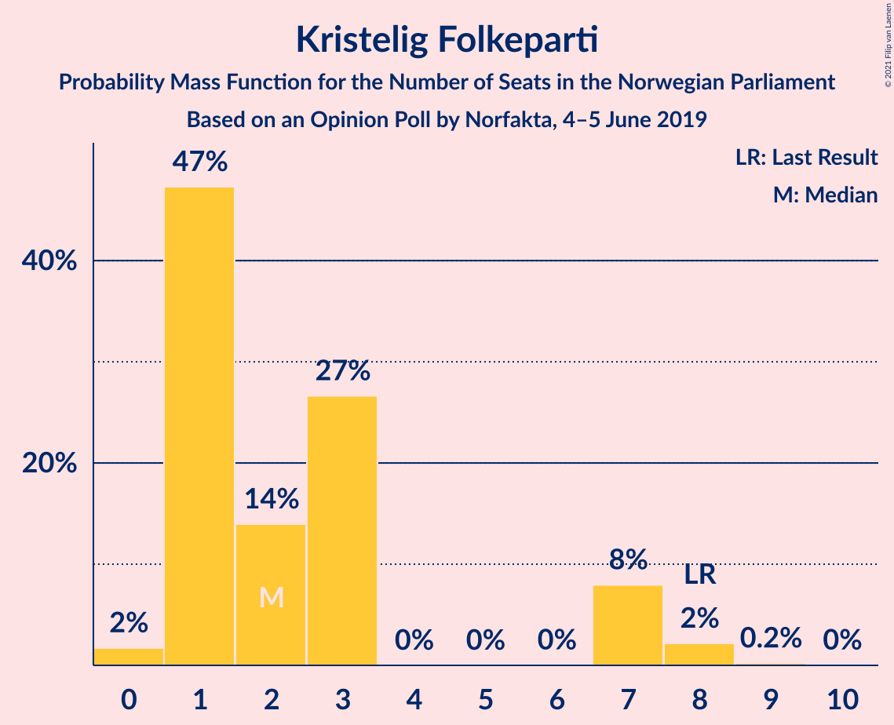

| Number of Seats | Probability | Accumulated | Special Marks |
|:---------------:|:-----------:|:-----------:|:-------------:|
| 0 | 2% | 100% |  |
| 1 | 47% | 98% |  |
| 2 | 14% | 51% | Median |
| 3 | 27% | 37% |  |
| 4 | 0% | 10% |  |
| 5 | 0% | 10% |  |
| 6 | 0% | 10% |  |
| 7 | 8% | 10% |  |
| 8 | 2% | 2% | Last Result |
| 9 | 0.2% | 0.2% |  |
| 10 | 0% | 0% |  |

### Venstre

*For a full overview of the results for this party, see the [Venstre](party-venstre.html) page.*

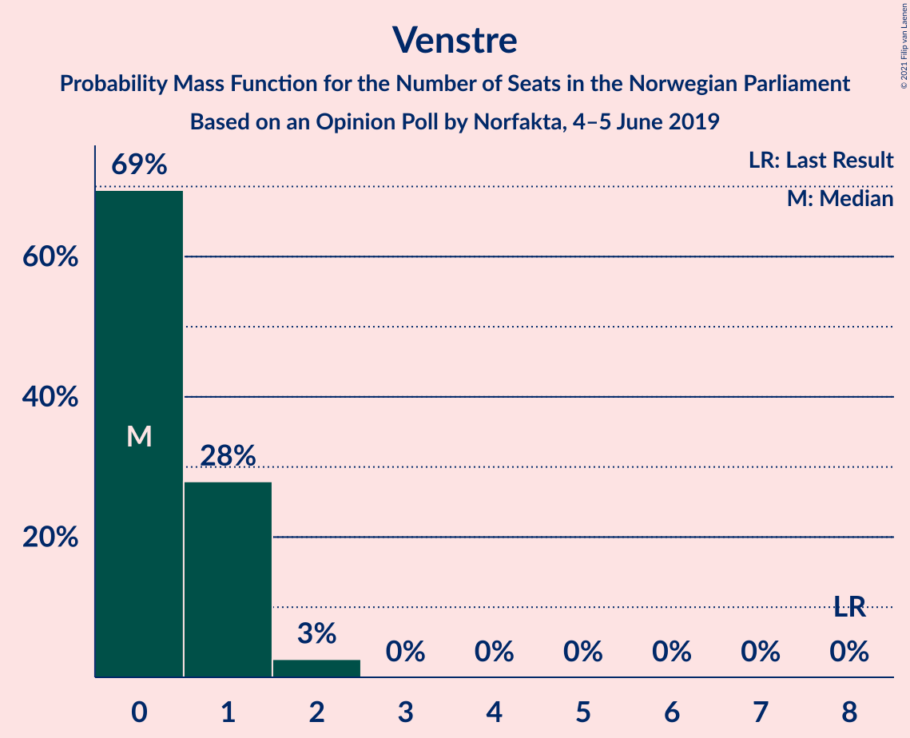

| Number of Seats | Probability | Accumulated | Special Marks |
|:---------------:|:-----------:|:-----------:|:-------------:|
| 0 | 69% | 100% | Median |
| 1 | 28% | 31% |  |
| 2 | 3% | 3% |  |
| 3 | 0% | 0% |  |
| 4 | 0% | 0% |  |
| 5 | 0% | 0% |  |
| 6 | 0% | 0% |  |
| 7 | 0% | 0% |  |
| 8 | 0% | 0% | Last Result |

## Coalitions

### Confidence Intervals

| Coalition | Last Result | Median | Majority? | 80% Confidence Interval | 90% Confidence Interval | 95% Confidence Interval | 99% Confidence Interval |
|:---------:|:-----------:|:------:|:---------:|:-----------------------:|:-----------------------:|:-----------------------:|:-----------------------:|
| Arbeiderpartiet – Senterpartiet – Sosialistisk Venstreparti – Rødt – Miljøpartiet De Grønne | 81 | 106 | 100% | 102–109 | 101–110 | 99–111 | 97–113 |
| Arbeiderpartiet – Senterpartiet – Sosialistisk Venstreparti – Miljøpartiet De Grønne – Kristelig Folkeparti | 88 | 98 | 100% | 94–101 | 92–103 | 92–104 | 89–106 |
| Arbeiderpartiet – Senterpartiet – Sosialistisk Venstreparti – Miljøpartiet De Grønne | 80 | 95 | 99.9% | 92–99 | 90–100 | 89–101 | 87–103 |
| Arbeiderpartiet – Senterpartiet – Sosialistisk Venstreparti – Rødt | 80 | 96 | 100% | 92–100 | 90–100 | 89–101 | 87–103 |
| Høyre – Senterpartiet – Fremskrittspartiet – Kristelig Folkeparti – Venstre | 107 | 93 | 99.3% | 89–97 | 88–98 | 86–99 | 84–100 |
| Arbeiderpartiet – Senterpartiet – Miljøpartiet De Grønne – Kristelig Folkeparti | 77 | 87 | 78% | 83–91 | 82–92 | 81–94 | 79–96 |
| Arbeiderpartiet – Senterpartiet – Sosialistisk Venstreparti | 79 | 85 | 58% | 82–89 | 80–90 | 79–91 | 77–93 |
| Arbeiderpartiet – Senterpartiet – Kristelig Folkeparti | 76 | 77 | 2% | 73–81 | 72–82 | 71–84 | 69–86 |
| Arbeiderpartiet – Sosialistisk Venstreparti – Rødt – Miljøpartiet De Grønne | 62 | 76 | 0.7% | 72–80 | 71–81 | 70–83 | 69–85 |
| Arbeiderpartiet – Senterpartiet | 68 | 75 | 0% | 71–79 | 70–80 | 68–80 | 66–82 |
| Høyre – Fremskrittspartiet – Miljøpartiet De Grønne – Kristelig Folkeparti – Venstre | 89 | 73 | 0% | 69–77 | 69–79 | 68–80 | 66–82 |
| Høyre – Fremskrittspartiet – Kristelig Folkeparti – Venstre | 88 | 63 | 0% | 60–67 | 59–68 | 58–70 | 56–72 |
| Høyre – Fremskrittspartiet – Venstre | 80 | 61 | 0% | 58–65 | 56–66 | 55–67 | 54–69 |
| Høyre – Fremskrittspartiet | 72 | 60 | 0% | 57–65 | 56–65 | 55–66 | 53–69 |
| Arbeiderpartiet – Sosialistisk Venstreparti | 60 | 55 | 0% | 52–59 | 51–60 | 51–62 | 49–64 |
| Høyre – Kristelig Folkeparti – Venstre | 61 | 45 | 0% | 42–49 | 41–50 | 40–51 | 39–54 |
| Senterpartiet – Kristelig Folkeparti – Venstre | 35 | 33 | 0% | 28–36 | 27–37 | 26–40 | 25–41 |

### Arbeiderpartiet – Senterpartiet – Sosialistisk Venstreparti – Rødt – Miljøpartiet De Grønne

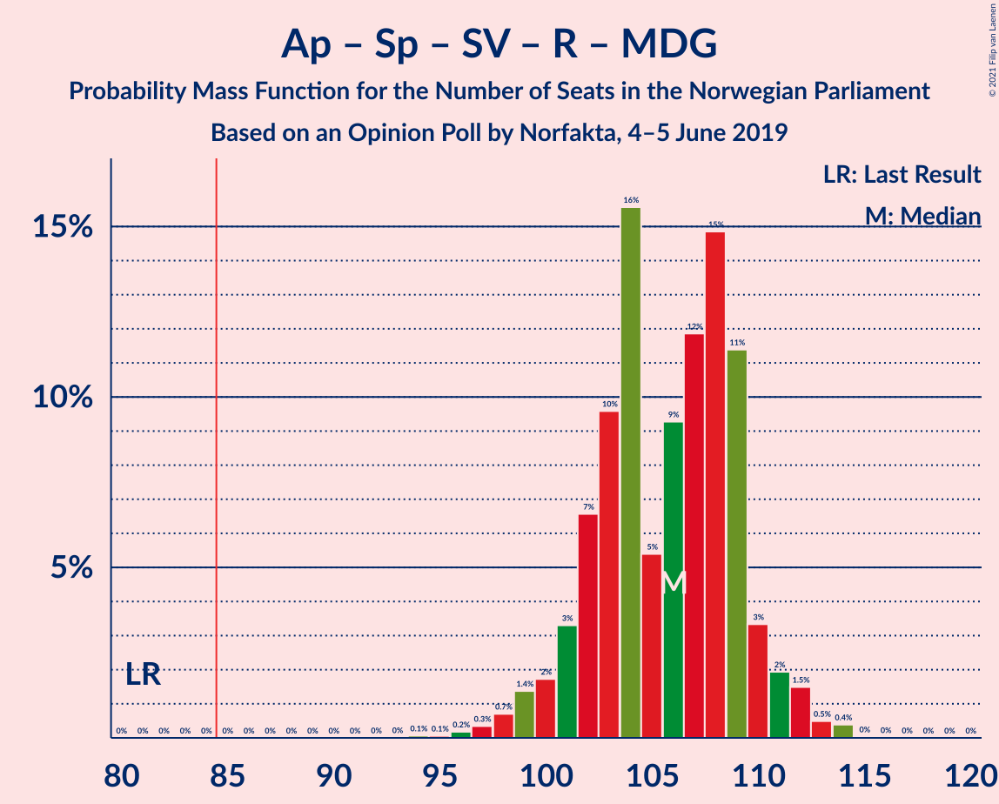

| Number of Seats | Probability | Accumulated | Special Marks |
|:---------------:|:-----------:|:-----------:|:-------------:|
| 81 | 0% | 100% | Last Result |
| 82 | 0% | 100% |  |
| 83 | 0% | 100% |  |
| 84 | 0% | 100% |  |
| 85 | 0% | 100% | Majority |
| 86 | 0% | 100% |  |
| 87 | 0% | 100% |  |
| 88 | 0% | 100% |  |
| 89 | 0% | 100% |  |
| 90 | 0% | 100% |  |
| 91 | 0% | 100% |  |
| 92 | 0% | 100% |  |
| 93 | 0% | 100% |  |
| 94 | 0.1% | 100% |  |
| 95 | 0.1% | 99.9% |  |
| 96 | 0.2% | 99.9% |  |
| 97 | 0.3% | 99.7% |  |
| 98 | 0.7% | 99.3% |  |
| 99 | 1.4% | 98.6% |  |
| 100 | 2% | 97% |  |
| 101 | 3% | 96% |  |
| 102 | 7% | 92% |  |
| 103 | 10% | 86% |  |
| 104 | 16% | 76% |  |
| 105 | 5% | 60% | Median |
| 106 | 9% | 55% |  |
| 107 | 12% | 46% |  |
| 108 | 15% | 34% |  |
| 109 | 11% | 19% |  |
| 110 | 3% | 8% |  |
| 111 | 2% | 4% |  |
| 112 | 1.5% | 2% |  |
| 113 | 0.5% | 0.9% |  |
| 114 | 0.4% | 0.4% |  |
| 115 | 0% | 0.1% |  |
| 116 | 0% | 0% |  |

### Arbeiderpartiet – Senterpartiet – Sosialistisk Venstreparti – Miljøpartiet De Grønne – Kristelig Folkeparti

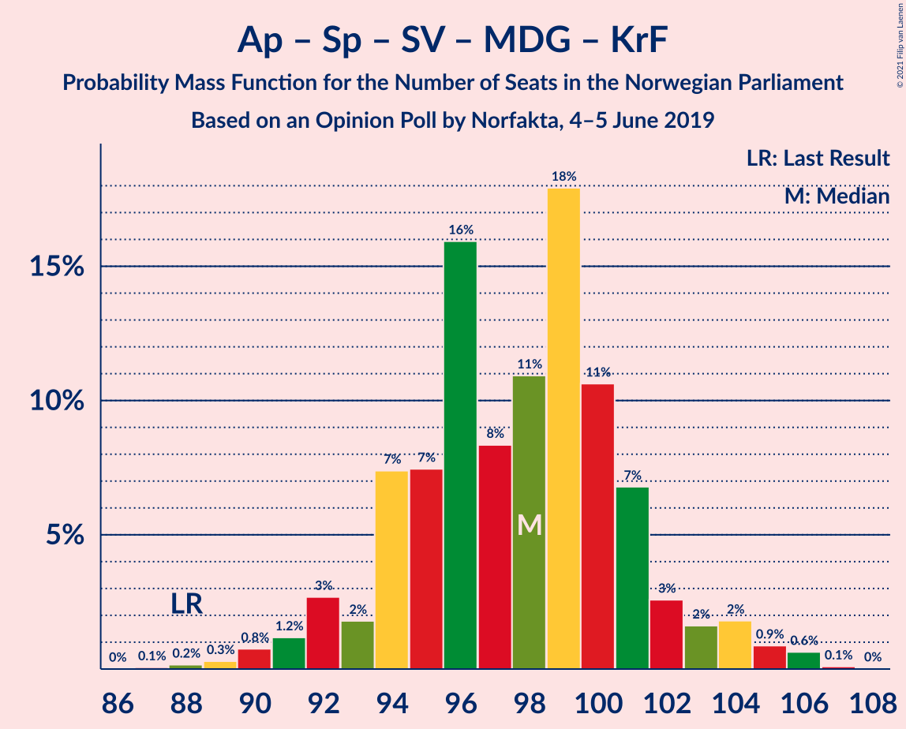

| Number of Seats | Probability | Accumulated | Special Marks |
|:---------------:|:-----------:|:-----------:|:-------------:|
| 87 | 0.1% | 100% |  |
| 88 | 0.2% | 99.9% | Last Result |
| 89 | 0.3% | 99.7% |  |
| 90 | 0.8% | 99.5% |  |
| 91 | 1.2% | 98.7% |  |
| 92 | 3% | 98% |  |
| 93 | 2% | 95% |  |
| 94 | 7% | 93% |  |
| 95 | 7% | 86% |  |
| 96 | 16% | 78% |  |
| 97 | 8% | 62% | Median |
| 98 | 11% | 54% |  |
| 99 | 18% | 43% |  |
| 100 | 11% | 25% |  |
| 101 | 7% | 14% |  |
| 102 | 3% | 8% |  |
| 103 | 2% | 5% |  |
| 104 | 2% | 3% |  |
| 105 | 0.9% | 2% |  |
| 106 | 0.6% | 0.8% |  |
| 107 | 0.1% | 0.1% |  |
| 108 | 0% | 0% |  |

### Arbeiderpartiet – Senterpartiet – Sosialistisk Venstreparti – Miljøpartiet De Grønne

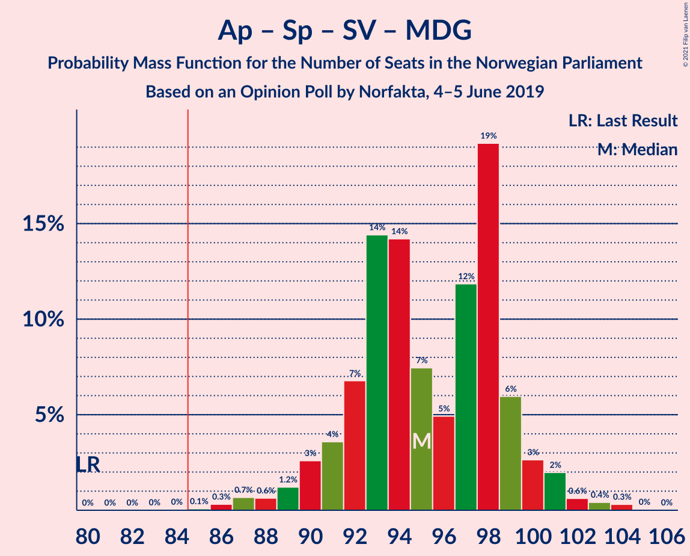

| Number of Seats | Probability | Accumulated | Special Marks |
|:---------------:|:-----------:|:-----------:|:-------------:|
| 80 | 0% | 100% | Last Result |
| 81 | 0% | 100% |  |
| 82 | 0% | 100% |  |
| 83 | 0% | 100% |  |
| 84 | 0% | 100% |  |
| 85 | 0.1% | 99.9% | Majority |
| 86 | 0.3% | 99.8% |  |
| 87 | 0.7% | 99.5% |  |
| 88 | 0.6% | 98.9% |  |
| 89 | 1.2% | 98% |  |
| 90 | 3% | 97% |  |
| 91 | 4% | 94% |  |
| 92 | 7% | 91% |  |
| 93 | 14% | 84% |  |
| 94 | 14% | 70% |  |
| 95 | 7% | 55% | Median |
| 96 | 5% | 48% |  |
| 97 | 12% | 43% |  |
| 98 | 19% | 31% |  |
| 99 | 6% | 12% |  |
| 100 | 3% | 6% |  |
| 101 | 2% | 3% |  |
| 102 | 0.6% | 1.4% |  |
| 103 | 0.4% | 0.8% |  |
| 104 | 0.3% | 0.4% |  |
| 105 | 0% | 0.1% |  |
| 106 | 0% | 0% |  |

### Arbeiderpartiet – Senterpartiet – Sosialistisk Venstreparti – Rødt

| Number of Seats | Probability | Accumulated | Special Marks |
|:---------------:|:-----------:|:-----------:|:-------------:|
| 80 | 0% | 100% | Last Result |
| 81 | 0% | 100% |  |
| 82 | 0% | 100% |  |
| 83 | 0% | 100% |  |
| 84 | 0% | 100% |  |
| 85 | 0.1% | 100% | Majority |
| 86 | 0.2% | 99.9% |  |
| 87 | 0.4% | 99.7% |  |
| 88 | 0.6% | 99.3% |  |
| 89 | 2% | 98.7% |  |
| 90 | 2% | 97% |  |
| 91 | 2% | 95% |  |
| 92 | 6% | 93% |  |
| 93 | 16% | 87% |  |
| 94 | 9% | 70% |  |
| 95 | 10% | 62% | Median |
| 96 | 8% | 52% |  |
| 97 | 15% | 44% |  |
| 98 | 12% | 29% |  |
| 99 | 6% | 16% |  |
| 100 | 6% | 10% |  |
| 101 | 2% | 4% |  |
| 102 | 1.1% | 2% |  |
| 103 | 0.6% | 0.9% |  |
| 104 | 0.2% | 0.4% |  |
| 105 | 0.1% | 0.1% |  |
| 106 | 0% | 0% |  |

### Høyre – Senterpartiet – Fremskrittspartiet – Kristelig Folkeparti – Venstre

| Number of Seats | Probability | Accumulated | Special Marks |
|:---------------:|:-----------:|:-----------:|:-------------:|
| 81 | 0% | 100% |  |
| 82 | 0.2% | 99.9% |  |
| 83 | 0.1% | 99.8% |  |
| 84 | 0.4% | 99.7% |  |
| 85 | 0.6% | 99.3% | Majority |
| 86 | 2% | 98.7% |  |
| 87 | 1.2% | 97% |  |
| 88 | 3% | 96% |  |
| 89 | 6% | 93% |  |
| 90 | 9% | 87% |  |
| 91 | 5% | 77% |  |
| 92 | 10% | 72% | Median |
| 93 | 14% | 62% |  |
| 94 | 17% | 49% |  |
| 95 | 12% | 31% |  |
| 96 | 6% | 19% |  |
| 97 | 4% | 13% |  |
| 98 | 6% | 9% |  |
| 99 | 2% | 3% |  |
| 100 | 0.7% | 1.1% |  |
| 101 | 0.3% | 0.5% |  |
| 102 | 0.1% | 0.2% |  |
| 103 | 0.1% | 0.1% |  |
| 104 | 0% | 0% |  |
| 105 | 0% | 0% |  |
| 106 | 0% | 0% |  |
| 107 | 0% | 0% | Last Result |

### Arbeiderpartiet – Senterpartiet – Miljøpartiet De Grønne – Kristelig Folkeparti

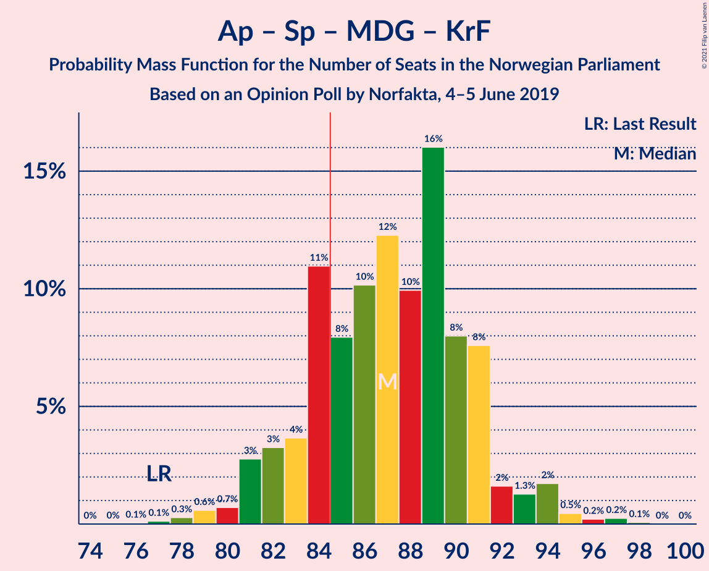

| Number of Seats | Probability | Accumulated | Special Marks |
|:---------------:|:-----------:|:-----------:|:-------------:|
| 76 | 0.1% | 100% |  |
| 77 | 0.1% | 99.9% | Last Result |
| 78 | 0.3% | 99.8% |  |
| 79 | 0.6% | 99.5% |  |
| 80 | 0.7% | 98.9% |  |
| 81 | 3% | 98% |  |
| 82 | 3% | 95% |  |
| 83 | 4% | 92% |  |
| 84 | 11% | 89% |  |
| 85 | 8% | 78% | Majority |
| 86 | 10% | 70% |  |
| 87 | 12% | 59% | Median |
| 88 | 10% | 47% |  |
| 89 | 16% | 37% |  |
| 90 | 8% | 21% |  |
| 91 | 8% | 13% |  |
| 92 | 2% | 6% |  |
| 93 | 1.3% | 4% |  |
| 94 | 2% | 3% |  |
| 95 | 0.5% | 1.0% |  |
| 96 | 0.2% | 0.5% |  |
| 97 | 0.2% | 0.3% |  |
| 98 | 0.1% | 0.1% |  |
| 99 | 0% | 0% |  |

### Arbeiderpartiet – Senterpartiet – Sosialistisk Venstreparti

| Number of Seats | Probability | Accumulated | Special Marks |
|:---------------:|:-----------:|:-----------:|:-------------:|
| 74 | 0% | 100% |  |
| 75 | 0.1% | 99.9% |  |
| 76 | 0.2% | 99.9% |  |
| 77 | 0.5% | 99.7% |  |
| 78 | 0.8% | 99.2% |  |
| 79 | 2% | 98% | Last Result |
| 80 | 2% | 96% |  |
| 81 | 3% | 94% |  |
| 82 | 11% | 91% |  |
| 83 | 8% | 79% |  |
| 84 | 14% | 72% |  |
| 85 | 9% | 58% | Median, Majority |
| 86 | 12% | 49% |  |
| 87 | 16% | 37% |  |
| 88 | 9% | 21% |  |
| 89 | 5% | 12% |  |
| 90 | 5% | 8% |  |
| 91 | 1.4% | 3% |  |
| 92 | 0.5% | 1.3% |  |
| 93 | 0.6% | 0.8% |  |
| 94 | 0.2% | 0.2% |  |
| 95 | 0% | 0.1% |  |
| 96 | 0% | 0% |  |

### Arbeiderpartiet – Senterpartiet – Kristelig Folkeparti

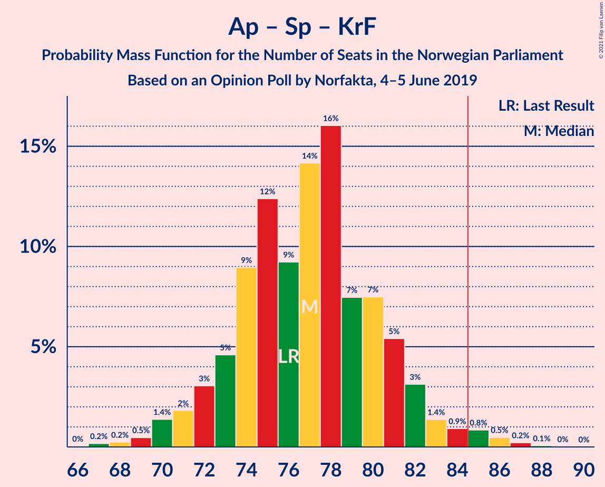

| Number of Seats | Probability | Accumulated | Special Marks |
|:---------------:|:-----------:|:-----------:|:-------------:|
| 66 | 0% | 100% |  |
| 67 | 0.2% | 99.9% |  |
| 68 | 0.2% | 99.8% |  |
| 69 | 0.5% | 99.5% |  |
| 70 | 1.4% | 99.1% |  |
| 71 | 2% | 98% |  |
| 72 | 3% | 96% |  |
| 73 | 5% | 93% |  |
| 74 | 9% | 88% |  |
| 75 | 12% | 79% |  |
| 76 | 9% | 67% | Last Result |
| 77 | 14% | 58% | Median |
| 78 | 16% | 43% |  |
| 79 | 7% | 27% |  |
| 80 | 7% | 20% |  |
| 81 | 5% | 12% |  |
| 82 | 3% | 7% |  |
| 83 | 1.4% | 4% |  |
| 84 | 0.9% | 3% |  |
| 85 | 0.8% | 2% | Majority |
| 86 | 0.5% | 0.8% |  |
| 87 | 0.2% | 0.3% |  |
| 88 | 0.1% | 0.1% |  |
| 89 | 0% | 0% |  |

### Arbeiderpartiet – Sosialistisk Venstreparti – Rødt – Miljøpartiet De Grønne

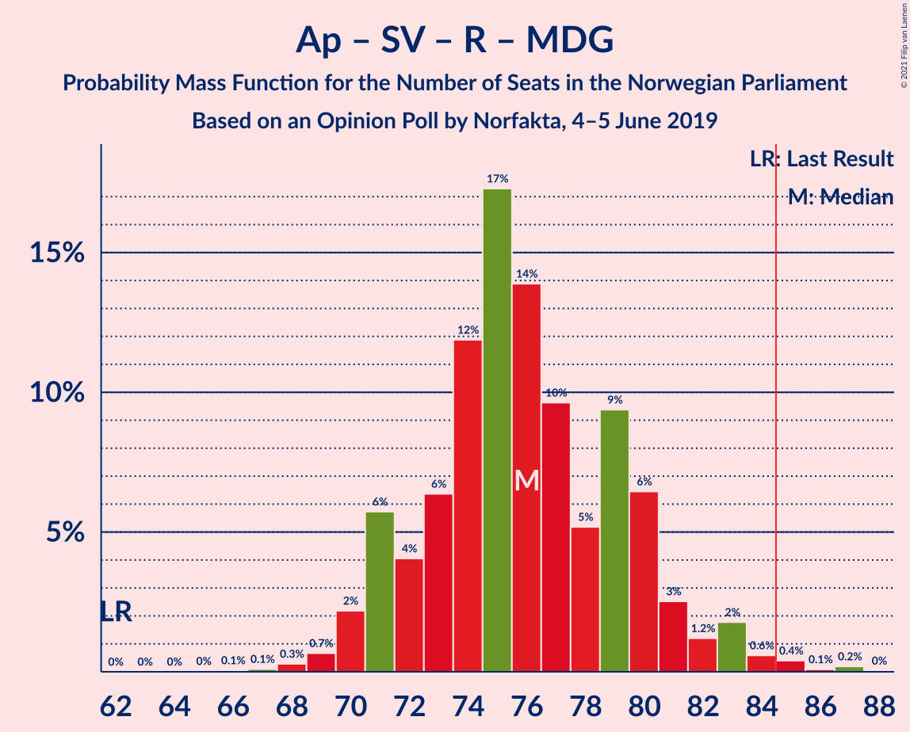

| Number of Seats | Probability | Accumulated | Special Marks |
|:---------------:|:-----------:|:-----------:|:-------------:|
| 62 | 0% | 100% | Last Result |
| 63 | 0% | 100% |  |
| 64 | 0% | 100% |  |
| 65 | 0% | 100% |  |
| 66 | 0.1% | 100% |  |
| 67 | 0.1% | 99.9% |  |
| 68 | 0.3% | 99.8% |  |
| 69 | 0.7% | 99.5% |  |
| 70 | 2% | 98.9% |  |
| 71 | 6% | 97% |  |
| 72 | 4% | 91% |  |
| 73 | 6% | 87% |  |
| 74 | 12% | 81% |  |
| 75 | 17% | 69% | Median |
| 76 | 14% | 51% |  |
| 77 | 10% | 37% |  |
| 78 | 5% | 28% |  |
| 79 | 9% | 23% |  |
| 80 | 6% | 13% |  |
| 81 | 3% | 7% |  |
| 82 | 1.2% | 4% |  |
| 83 | 2% | 3% |  |
| 84 | 0.6% | 1.3% |  |
| 85 | 0.4% | 0.7% | Majority |
| 86 | 0.1% | 0.3% |  |
| 87 | 0.2% | 0.2% |  |
| 88 | 0% | 0% |  |

### Arbeiderpartiet – Senterpartiet

| Number of Seats | Probability | Accumulated | Special Marks |
|:---------------:|:-----------:|:-----------:|:-------------:|
| 65 | 0.1% | 100% |  |
| 66 | 0.4% | 99.8% |  |
| 67 | 0.9% | 99.4% |  |
| 68 | 1.5% | 98.6% | Last Result |
| 69 | 2% | 97% |  |
| 70 | 5% | 95% |  |
| 71 | 5% | 90% |  |
| 72 | 12% | 85% |  |
| 73 | 9% | 73% |  |
| 74 | 10% | 64% |  |
| 75 | 9% | 54% | Median |
| 76 | 15% | 45% |  |
| 77 | 15% | 30% |  |
| 78 | 5% | 15% |  |
| 79 | 5% | 10% |  |
| 80 | 3% | 5% |  |
| 81 | 2% | 2% |  |
| 82 | 0.6% | 0.8% |  |
| 83 | 0.1% | 0.2% |  |
| 84 | 0% | 0.1% |  |
| 85 | 0% | 0% | Majority |

### Høyre – Fremskrittspartiet – Miljøpartiet De Grønne – Kristelig Folkeparti – Venstre

| Number of Seats | Probability | Accumulated | Special Marks |
|:---------------:|:-----------:|:-----------:|:-------------:|
| 64 | 0.1% | 100% |  |
| 65 | 0.3% | 99.9% |  |
| 66 | 0.6% | 99.6% |  |
| 67 | 1.1% | 99.0% |  |
| 68 | 2% | 98% |  |
| 69 | 6% | 96% |  |
| 70 | 6% | 90% |  |
| 71 | 12% | 83% |  |
| 72 | 15% | 71% | Median |
| 73 | 8% | 56% |  |
| 74 | 10% | 48% |  |
| 75 | 9% | 38% |  |
| 76 | 16% | 30% |  |
| 77 | 6% | 13% |  |
| 78 | 2% | 7% |  |
| 79 | 2% | 5% |  |
| 80 | 2% | 3% |  |
| 81 | 0.6% | 1.3% |  |
| 82 | 0.3% | 0.6% |  |
| 83 | 0.2% | 0.3% |  |
| 84 | 0.1% | 0.1% |  |
| 85 | 0% | 0% | Majority |
| 86 | 0% | 0% |  |
| 87 | 0% | 0% |  |
| 88 | 0% | 0% |  |
| 89 | 0% | 0% | Last Result |

### Høyre – Fremskrittspartiet – Kristelig Folkeparti – Venstre

| Number of Seats | Probability | Accumulated | Special Marks |
|:---------------:|:-----------:|:-----------:|:-------------:|
| 54 | 0% | 100% |  |
| 55 | 0.4% | 99.9% |  |
| 56 | 0.5% | 99.5% |  |
| 57 | 2% | 99.0% |  |
| 58 | 2% | 98% |  |
| 59 | 3% | 96% |  |
| 60 | 11% | 92% |  |
| 61 | 15% | 81% |  |
| 62 | 12% | 66% | Median |
| 63 | 9% | 54% |  |
| 64 | 5% | 45% |  |
| 65 | 16% | 39% |  |
| 66 | 10% | 24% |  |
| 67 | 7% | 14% |  |
| 68 | 3% | 8% |  |
| 69 | 2% | 4% |  |
| 70 | 1.4% | 3% |  |
| 71 | 0.7% | 1.4% |  |
| 72 | 0.3% | 0.7% |  |
| 73 | 0.2% | 0.3% |  |
| 74 | 0.1% | 0.1% |  |
| 75 | 0.1% | 0.1% |  |
| 76 | 0% | 0% |  |
| 77 | 0% | 0% |  |
| 78 | 0% | 0% |  |
| 79 | 0% | 0% |  |
| 80 | 0% | 0% |  |
| 81 | 0% | 0% |  |
| 82 | 0% | 0% |  |
| 83 | 0% | 0% |  |
| 84 | 0% | 0% |  |
| 85 | 0% | 0% | Majority |
| 86 | 0% | 0% |  |
| 87 | 0% | 0% |  |
| 88 | 0% | 0% | Last Result |

### Høyre – Fremskrittspartiet – Venstre

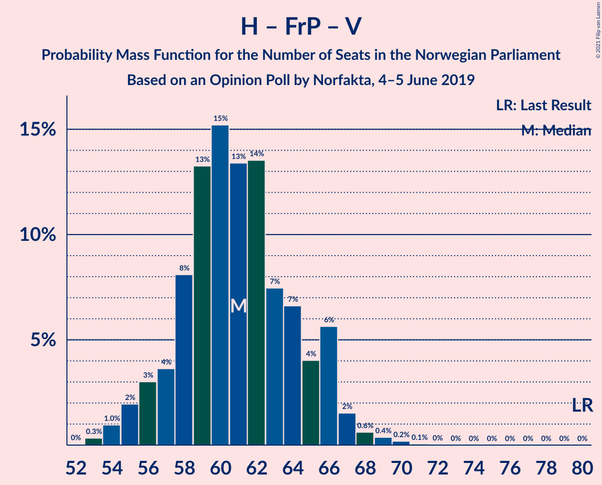

| Number of Seats | Probability | Accumulated | Special Marks |
|:---------------:|:-----------:|:-----------:|:-------------:|
| 52 | 0% | 100% |  |
| 53 | 0.3% | 99.9% |  |
| 54 | 1.0% | 99.6% |  |
| 55 | 2% | 98.6% |  |
| 56 | 3% | 97% |  |
| 57 | 4% | 94% |  |
| 58 | 8% | 90% |  |
| 59 | 13% | 82% |  |
| 60 | 15% | 69% | Median |
| 61 | 13% | 53% |  |
| 62 | 14% | 40% |  |
| 63 | 7% | 27% |  |
| 64 | 7% | 19% |  |
| 65 | 4% | 12% |  |
| 66 | 6% | 8% |  |
| 67 | 2% | 3% |  |
| 68 | 0.6% | 1.3% |  |
| 69 | 0.4% | 0.7% |  |
| 70 | 0.2% | 0.3% |  |
| 71 | 0.1% | 0.1% |  |
| 72 | 0% | 0% |  |
| 73 | 0% | 0% |  |
| 74 | 0% | 0% |  |
| 75 | 0% | 0% |  |
| 76 | 0% | 0% |  |
| 77 | 0% | 0% |  |
| 78 | 0% | 0% |  |
| 79 | 0% | 0% |  |
| 80 | 0% | 0% | Last Result |

### Høyre – Fremskrittspartiet

| Number of Seats | Probability | Accumulated | Special Marks |
|:---------------:|:-----------:|:-----------:|:-------------:|
| 52 | 0.1% | 100% |  |
| 53 | 0.4% | 99.8% |  |
| 54 | 1.0% | 99.5% |  |
| 55 | 3% | 98% |  |
| 56 | 3% | 95% |  |
| 57 | 4% | 93% |  |
| 58 | 11% | 88% |  |
| 59 | 11% | 77% |  |
| 60 | 17% | 66% | Median |
| 61 | 17% | 49% |  |
| 62 | 8% | 33% |  |
| 63 | 6% | 24% |  |
| 64 | 8% | 18% |  |
| 65 | 5% | 10% |  |
| 66 | 3% | 5% |  |
| 67 | 1.0% | 2% |  |
| 68 | 0.5% | 1.0% |  |
| 69 | 0.3% | 0.5% |  |
| 70 | 0.1% | 0.2% |  |
| 71 | 0% | 0.1% |  |
| 72 | 0% | 0% | Last Result |

### Arbeiderpartiet – Sosialistisk Venstreparti

| Number of Seats | Probability | Accumulated | Special Marks |
|:---------------:|:-----------:|:-----------:|:-------------:|
| 47 | 0.1% | 100% |  |
| 48 | 0.2% | 99.9% |  |
| 49 | 0.5% | 99.7% |  |
| 50 | 1.1% | 99.3% |  |
| 51 | 4% | 98% |  |
| 52 | 6% | 94% |  |
| 53 | 18% | 89% |  |
| 54 | 10% | 71% |  |
| 55 | 17% | 61% | Median |
| 56 | 11% | 43% |  |
| 57 | 13% | 32% |  |
| 58 | 7% | 19% |  |
| 59 | 4% | 12% |  |
| 60 | 4% | 8% | Last Result |
| 61 | 2% | 4% |  |
| 62 | 1.3% | 3% |  |
| 63 | 0.8% | 1.5% |  |
| 64 | 0.3% | 0.6% |  |
| 65 | 0.2% | 0.3% |  |
| 66 | 0.1% | 0.1% |  |
| 67 | 0.1% | 0.1% |  |
| 68 | 0% | 0% |  |

### Høyre – Kristelig Folkeparti – Venstre

| Number of Seats | Probability | Accumulated | Special Marks |
|:---------------:|:-----------:|:-----------:|:-------------:|
| 37 | 0.1% | 100% |  |
| 38 | 0.3% | 99.9% |  |
| 39 | 1.1% | 99.6% |  |
| 40 | 2% | 98% |  |
| 41 | 4% | 97% |  |
| 42 | 13% | 92% |  |
| 43 | 11% | 79% |  |
| 44 | 9% | 68% | Median |
| 45 | 14% | 59% |  |
| 46 | 13% | 45% |  |
| 47 | 13% | 32% |  |
| 48 | 7% | 20% |  |
| 49 | 4% | 12% |  |
| 50 | 4% | 9% |  |
| 51 | 3% | 5% |  |
| 52 | 0.8% | 2% |  |
| 53 | 0.6% | 1.2% |  |
| 54 | 0.2% | 0.6% |  |
| 55 | 0.1% | 0.4% |  |
| 56 | 0.1% | 0.3% |  |
| 57 | 0.2% | 0.2% |  |
| 58 | 0% | 0% |  |
| 59 | 0% | 0% |  |
| 60 | 0% | 0% |  |
| 61 | 0% | 0% | Last Result |

### Senterpartiet – Kristelig Folkeparti – Venstre

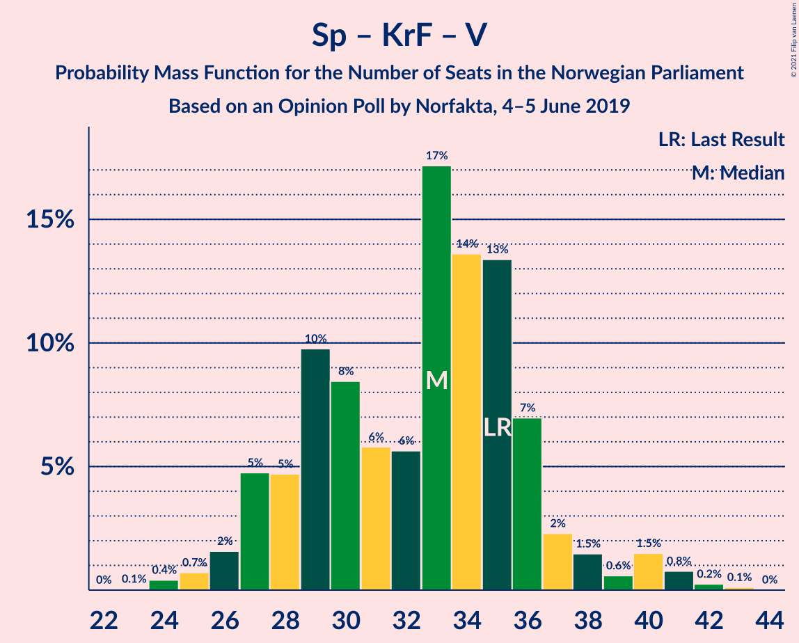

| Number of Seats | Probability | Accumulated | Special Marks |
|:---------------:|:-----------:|:-----------:|:-------------:|
| 23 | 0.1% | 100% |  |
| 24 | 0.4% | 99.9% |  |
| 25 | 0.7% | 99.5% |  |
| 26 | 2% | 98.8% |  |
| 27 | 5% | 97% |  |
| 28 | 5% | 92% |  |
| 29 | 10% | 88% |  |
| 30 | 8% | 78% |  |
| 31 | 6% | 70% |  |
| 32 | 6% | 64% | Median |
| 33 | 17% | 58% |  |
| 34 | 14% | 41% |  |
| 35 | 13% | 27% | Last Result |
| 36 | 7% | 14% |  |
| 37 | 2% | 7% |  |
| 38 | 1.5% | 5% |  |
| 39 | 0.6% | 3% |  |
| 40 | 1.5% | 3% |  |
| 41 | 0.8% | 1.2% |  |
| 42 | 0.2% | 0.4% |  |
| 43 | 0.1% | 0.1% |  |
| 44 | 0% | 0% |  |

## Technical Information

### Opinion Poll

+ **Polling firm:** Norfakta
+ **Commissioner(s):** —
+ **Fieldwork period:** 4–5 June 2019

### Calculations

+ **Sample size:** 1000
+ **Simulations done:** 1,048,576
+ **Error estimate:** 1.80%

