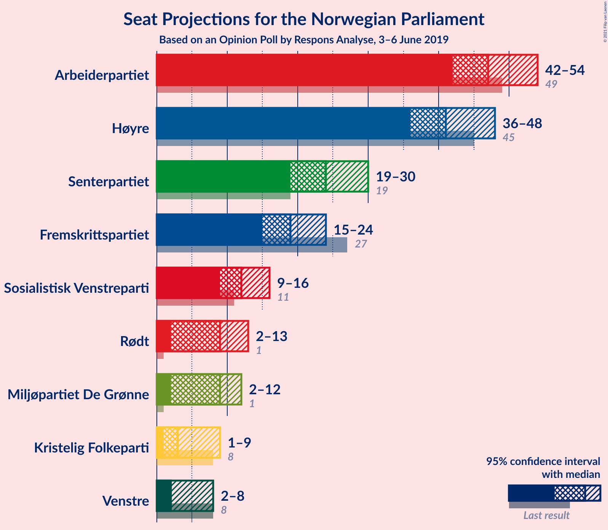
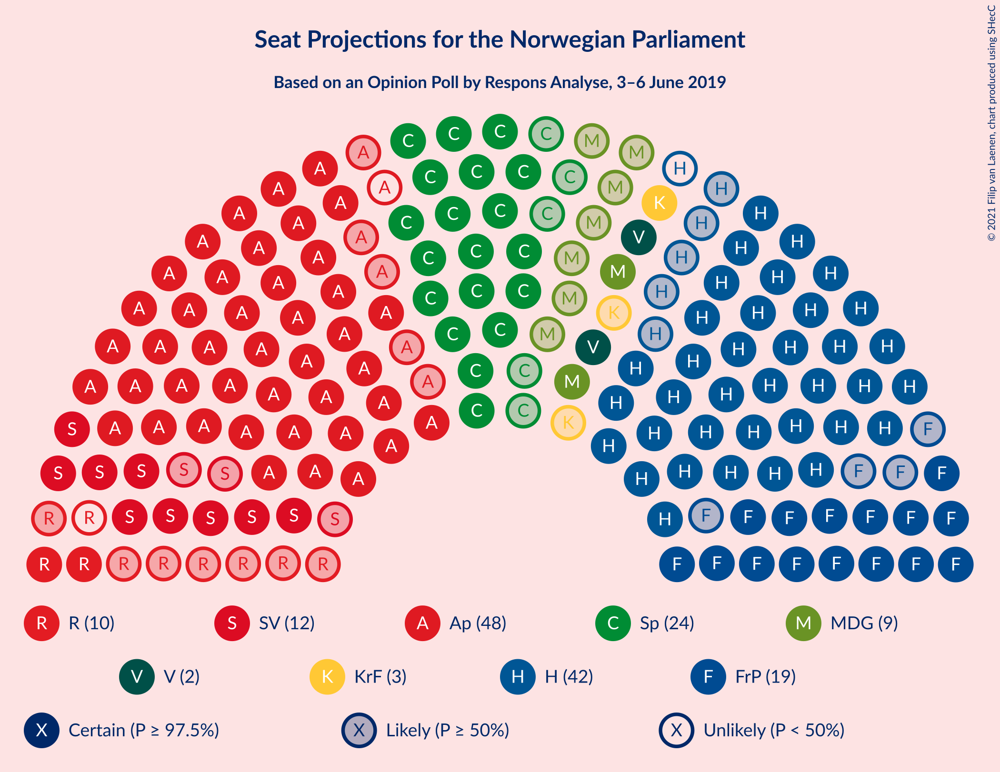
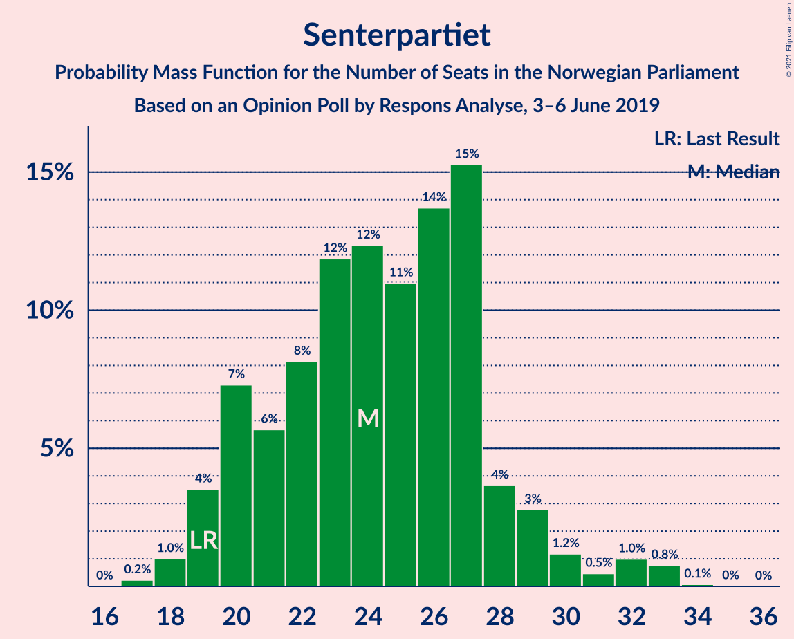
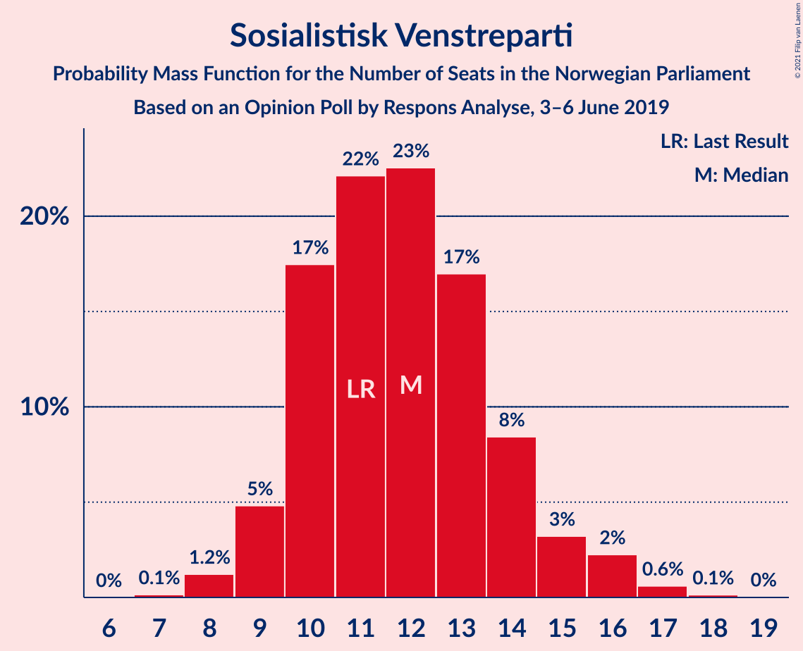
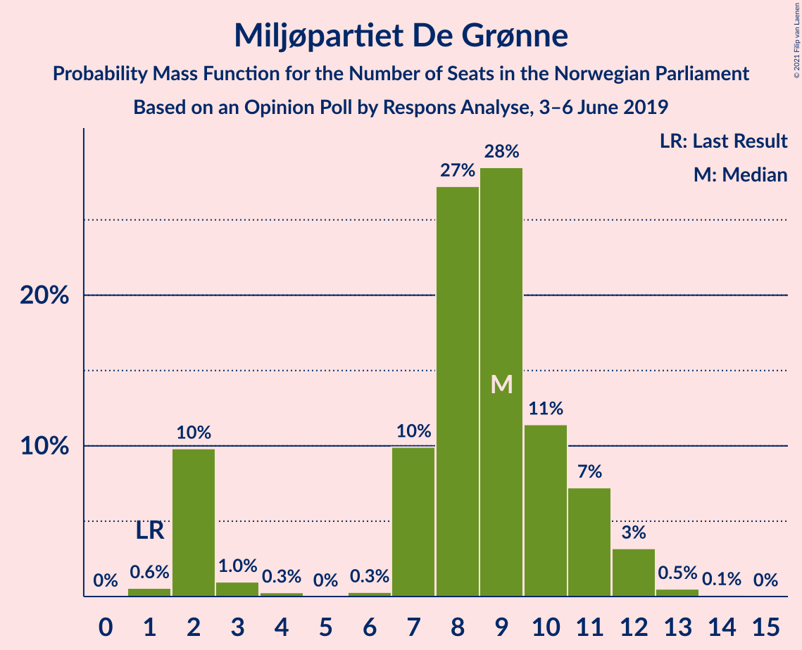
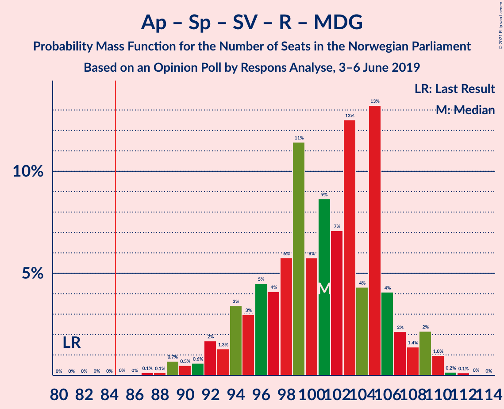
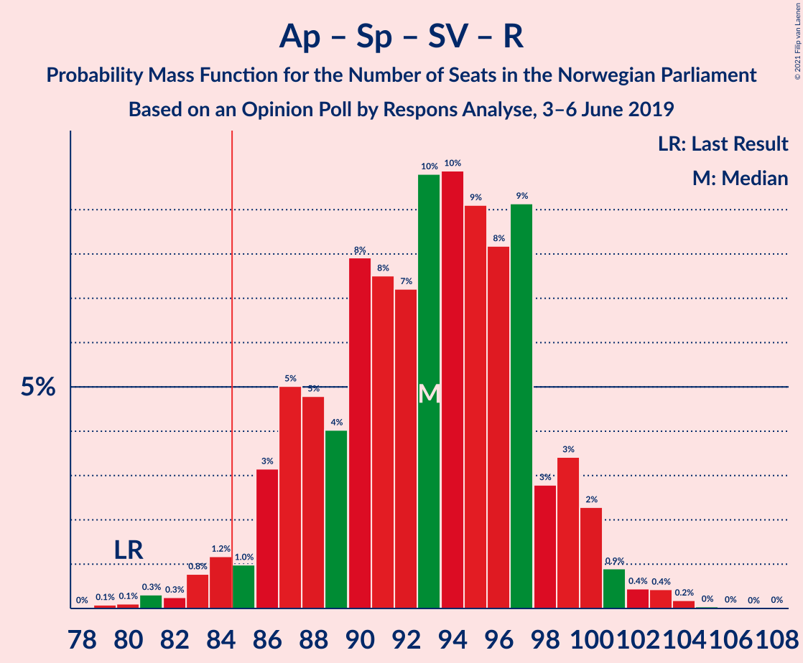
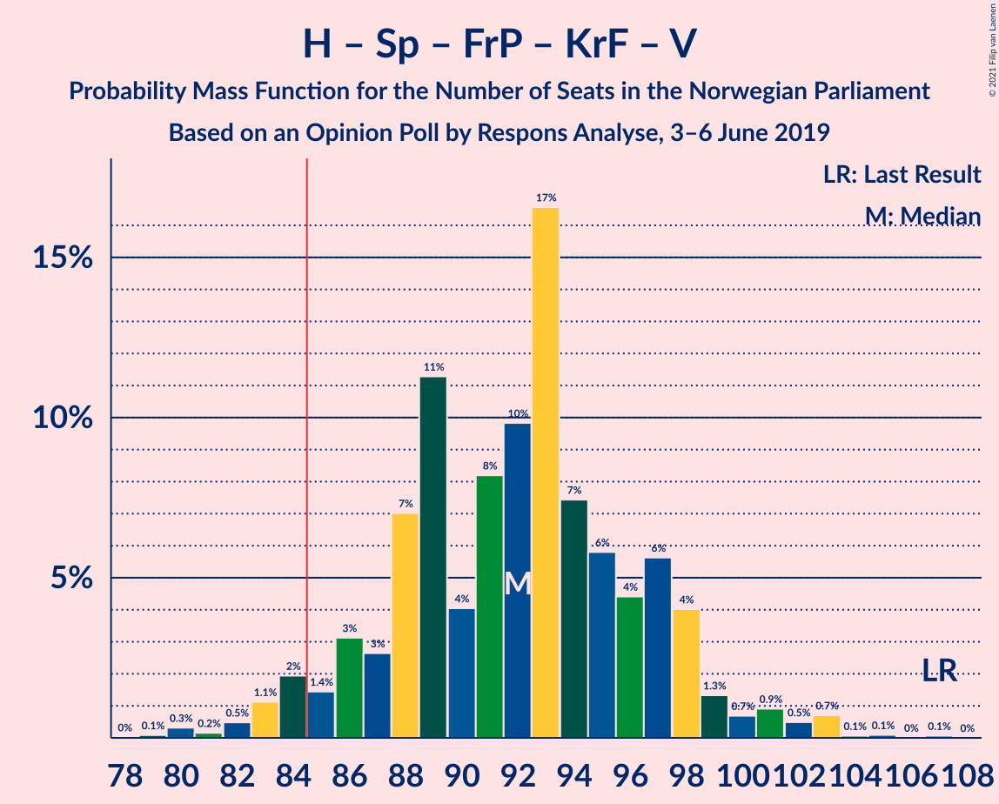
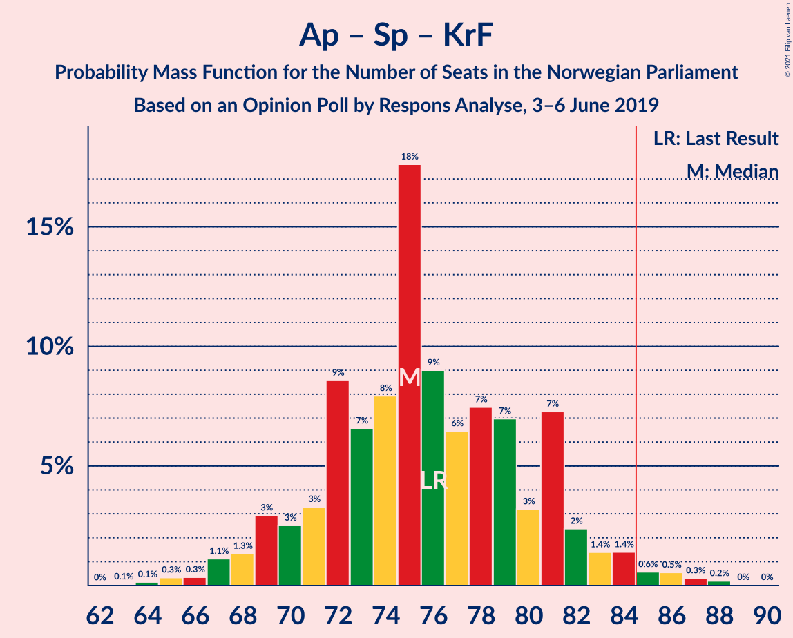

# Opinion Poll by Respons Analyse, 3–6 June 2019

<a href="#voting-intentions">Voting Intentions</a> | <a href="#seats">Seats</a> | <a href="#coalitions">Coalitions</a> | <a href="#technical-information">Technical Information</a>

## Voting Intentions

### Confidence Intervals

| Party | Last Result | Poll Result | 80% Confidence Interval | 90% Confidence Interval | 95% Confidence Interval | 99% Confidence Interval |
|:-----:|:-----------:|:-----------:|:-----------------------:|:-----------------------:|:-----------------------:|:-----------------------:|
| Arbeiderpartiet | 27.4% | 26.0% | 24.0–28.0% |23.5–28.6% |23.0–29.2% |22.1–30.2% |
| Høyre | 25.0% | 23.1% | 21.3–25.2% |20.8–25.7% |20.3–26.2% |19.5–27.2% |
| Senterpartiet | 10.3% | 13.3% | 11.8–15.0% |11.4–15.5% |11.1–15.9% |10.4–16.7% |
| Fremskrittspartiet | 15.2% | 10.7% | 9.4–12.3% |9.1–12.7% |8.7–13.1% |8.2–13.9% |
| Sosialistisk Venstreparti | 6.0% | 6.8% | 5.7–8.1% |5.5–8.4% |5.2–8.8% |4.8–9.4% |
| Rødt | 2.4% | 5.2% | 4.3–6.4% |4.1–6.8% |3.9–7.0% |3.5–7.7% |
| Miljøpartiet De Grønne | 3.2% | 4.9% | 4.0–6.0% |3.8–6.3% |3.6–6.6% |3.2–7.2% |
| Kristelig Folkeparti | 4.2% | 3.6% | 2.9–4.6% |2.7–4.9% |2.5–5.1% |2.2–5.7% |
| Venstre | 4.4% | 3.5% | 2.7–4.5% |2.5–4.7% |2.4–5.0% |2.1–5.5% |

*Note:* The poll result column reflects the actual value used in the calculations. Published results may vary slightly, and in addition be rounded to fewer digits.

## Seats

### Confidence Intervals

| Party | Last Result | Median | 80% Confidence Interval | 90% Confidence Interval | 95% Confidence Interval | 99% Confidence Interval |
|:-----:|:-----------:|:------:|:-----------------------:|:-----------------------:|:-----------------------:|:-----------------------:|
| <a href="#arbeiderpartiet">Arbeiderpartiet</a> | 49 | 47 | 43–53 |42–54 |42–56 |40–57 |
| <a href="#høyre">Høyre</a> | 45 | 42 | 37–46 |36–47 |35–48 |34–49 |
| <a href="#senterpartiet">Senterpartiet</a> | 19 | 24 | 20–28 |20–30 |19–30 |18–33 |
| <a href="#fremskrittspartiet">Fremskrittspartiet</a> | 27 | 19 | 16–22 |15–23 |15–24 |14–25 |
| <a href="#sosialistisk-venstreparti">Sosialistisk Venstreparti</a> | 11 | 11 | 10–14 |9–15 |9–15 |8–17 |
| <a href="#rødt">Rødt</a> | 1 | 9 | 8–12 |7–12 |2–13 |2–13 |
| <a href="#miljøpartiet-de-grønne">Miljøpartiet De Grønne</a> | 1 | 9 | 2–11 |2–11 |2–11 |2–13 |
| <a href="#kristelig-folkeparti">Kristelig Folkeparti</a> | 8 | 3 | 1–8 |1–8 |1–9 |0–9 |
| <a href="#venstre">Venstre</a> | 8 | 2 | 2–7 |2–9 |1–9 |1–10 |

### Arbeiderpartiet

*For a full overview of the results for this party, see the [Arbeiderpartiet](party-arbeiderpartiet.html) page.*

| Number of Seats | Probability | Accumulated | Special Marks |
|:---------------:|:-----------:|:-----------:|:-------------:|
| 39 | 0.2% | 100% |  |
| 40 | 0.3% | 99.8% |  |
| 41 | 0.7% | 99.5% |  |
| 42 | 4% | 98.8% |  |
| 43 | 5% | 95% |  |
| 44 | 5% | 90% |  |
| 45 | 6% | 85% |  |
| 46 | 19% | 79% |  |
| 47 | 15% | 59% | Median |
| 48 | 4% | 45% |  |
| 49 | 9% | 41% | Last Result |
| 50 | 4% | 32% |  |
| 51 | 3% | 28% |  |
| 52 | 10% | 24% |  |
| 53 | 8% | 14% |  |
| 54 | 3% | 7% |  |
| 55 | 0.7% | 3% |  |
| 56 | 0.3% | 3% |  |
| 57 | 2% | 2% |  |
| 58 | 0.4% | 0.4% |  |
| 59 | 0% | 0% |  |

### Høyre

*For a full overview of the results for this party, see the [Høyre](party-høyre.html) page.*

| Number of Seats | Probability | Accumulated | Special Marks |
|:---------------:|:-----------:|:-----------:|:-------------:|
| 32 | 0.1% | 100% |  |
| 33 | 0.1% | 99.9% |  |
| 34 | 0.6% | 99.9% |  |
| 35 | 2% | 99.3% |  |
| 36 | 3% | 97% |  |
| 37 | 8% | 95% |  |
| 38 | 4% | 87% |  |
| 39 | 8% | 83% |  |
| 40 | 10% | 75% |  |
| 41 | 11% | 65% |  |
| 42 | 13% | 55% | Median |
| 43 | 7% | 42% |  |
| 44 | 2% | 34% |  |
| 45 | 17% | 32% | Last Result |
| 46 | 7% | 15% |  |
| 47 | 5% | 8% |  |
| 48 | 2% | 3% |  |
| 49 | 0.6% | 0.8% |  |
| 50 | 0.1% | 0.3% |  |
| 51 | 0.1% | 0.2% |  |
| 52 | 0.1% | 0.2% |  |
| 53 | 0% | 0% |  |

### Senterpartiet

*For a full overview of the results for this party, see the [Senterpartiet](party-senterpartiet.html) page.*

| Number of Seats | Probability | Accumulated | Special Marks |
|:---------------:|:-----------:|:-----------:|:-------------:|
| 17 | 0.2% | 100% |  |
| 18 | 1.1% | 99.8% |  |
| 19 | 3% | 98.7% | Last Result |
| 20 | 11% | 95% |  |
| 21 | 6% | 85% |  |
| 22 | 12% | 79% |  |
| 23 | 6% | 66% |  |
| 24 | 27% | 60% | Median |
| 25 | 6% | 33% |  |
| 26 | 8% | 28% |  |
| 27 | 2% | 19% |  |
| 28 | 9% | 17% |  |
| 29 | 2% | 8% |  |
| 30 | 4% | 6% |  |
| 31 | 0.1% | 2% |  |
| 32 | 0.4% | 2% |  |
| 33 | 2% | 2% |  |
| 34 | 0.2% | 0.2% |  |
| 35 | 0% | 0% |  |

### Fremskrittspartiet

*For a full overview of the results for this party, see the [Fremskrittspartiet](party-fremskrittspartiet.html) page.*

| Number of Seats | Probability | Accumulated | Special Marks |
|:---------------:|:-----------:|:-----------:|:-------------:|
| 12 | 0.1% | 100% |  |
| 13 | 0.3% | 99.9% |  |
| 14 | 0.6% | 99.5% |  |
| 15 | 5% | 98.9% |  |
| 16 | 15% | 94% |  |
| 17 | 8% | 79% |  |
| 18 | 12% | 70% |  |
| 19 | 18% | 58% | Median |
| 20 | 9% | 40% |  |
| 21 | 13% | 31% |  |
| 22 | 9% | 17% |  |
| 23 | 5% | 8% |  |
| 24 | 3% | 3% |  |
| 25 | 0.4% | 0.7% |  |
| 26 | 0.2% | 0.3% |  |
| 27 | 0.1% | 0.2% | Last Result |
| 28 | 0% | 0% |  |

### Sosialistisk Venstreparti

*For a full overview of the results for this party, see the [Sosialistisk Venstreparti](party-sosialistiskvenstreparti.html) page.*

| Number of Seats | Probability | Accumulated | Special Marks |
|:---------------:|:-----------:|:-----------:|:-------------:|
| 7 | 0.1% | 100% |  |
| 8 | 1.0% | 99.9% |  |
| 9 | 6% | 98.9% |  |
| 10 | 20% | 93% |  |
| 11 | 26% | 72% | Last Result, Median |
| 12 | 21% | 47% |  |
| 13 | 8% | 25% |  |
| 14 | 11% | 17% |  |
| 15 | 3% | 6% |  |
| 16 | 0.5% | 2% |  |
| 17 | 2% | 2% |  |
| 18 | 0.1% | 0.2% |  |
| 19 | 0.1% | 0.1% |  |
| 20 | 0% | 0% |  |

### Rødt

*For a full overview of the results for this party, see the [Rødt](party-rødt.html) page.*

| Number of Seats | Probability | Accumulated | Special Marks |
|:---------------:|:-----------:|:-----------:|:-------------:|
| 1 | 0% | 100% | Last Result |
| 2 | 3% | 100% |  |
| 3 | 0% | 97% |  |
| 4 | 0% | 97% |  |
| 5 | 0% | 97% |  |
| 6 | 0.2% | 97% |  |
| 7 | 6% | 97% |  |
| 8 | 20% | 91% |  |
| 9 | 29% | 71% | Median |
| 10 | 23% | 43% |  |
| 11 | 4% | 20% |  |
| 12 | 12% | 16% |  |
| 13 | 3% | 4% |  |
| 14 | 0.4% | 0.5% |  |
| 15 | 0.1% | 0.1% |  |
| 16 | 0% | 0% |  |

### Miljøpartiet De Grønne

*For a full overview of the results for this party, see the [Miljøpartiet De Grønne](party-miljøpartietdegrønne.html) page.*

| Number of Seats | Probability | Accumulated | Special Marks |
|:---------------:|:-----------:|:-----------:|:-------------:|
| 1 | 0.2% | 100% | Last Result |
| 2 | 18% | 99.8% |  |
| 3 | 3% | 82% |  |
| 4 | 0% | 79% |  |
| 5 | 0% | 79% |  |
| 6 | 0.9% | 79% |  |
| 7 | 5% | 78% |  |
| 8 | 20% | 72% |  |
| 9 | 17% | 52% | Median |
| 10 | 20% | 35% |  |
| 11 | 14% | 15% |  |
| 12 | 0.6% | 1.5% |  |
| 13 | 0.7% | 0.8% |  |
| 14 | 0.1% | 0.1% |  |
| 15 | 0% | 0% |  |

### Kristelig Folkeparti

*For a full overview of the results for this party, see the [Kristelig Folkeparti](party-kristeligfolkeparti.html) page.*

| Number of Seats | Probability | Accumulated | Special Marks |
|:---------------:|:-----------:|:-----------:|:-------------:|
| 0 | 0.8% | 100% |  |
| 1 | 21% | 99.2% |  |
| 2 | 14% | 78% |  |
| 3 | 33% | 64% | Median |
| 4 | 0% | 30% |  |
| 5 | 0% | 30% |  |
| 6 | 2% | 30% |  |
| 7 | 8% | 28% |  |
| 8 | 15% | 19% | Last Result |
| 9 | 4% | 5% |  |
| 10 | 0.3% | 0.4% |  |
| 11 | 0.1% | 0.1% |  |
| 12 | 0% | 0% |  |

### Venstre

*For a full overview of the results for this party, see the [Venstre](party-venstre.html) page.*

| Number of Seats | Probability | Accumulated | Special Marks |
|:---------------:|:-----------:|:-----------:|:-------------:|
| 1 | 3% | 100% |  |
| 2 | 78% | 97% | Median |
| 3 | 0.7% | 18% |  |
| 4 | 0% | 18% |  |
| 5 | 0% | 18% |  |
| 6 | 0.4% | 18% |  |
| 7 | 7% | 17% |  |
| 8 | 4% | 10% | Last Result |
| 9 | 5% | 6% |  |
| 10 | 1.1% | 1.2% |  |
| 11 | 0% | 0% |  |

## Coalitions

### Confidence Intervals

| Coalition | Last Result | Median | Majority? | 80% Confidence Interval | 90% Confidence Interval | 95% Confidence Interval | 99% Confidence Interval |
|:---------:|:-----------:|:------:|:---------:|:-----------------------:|:-----------------------:|:-----------------------:|:-----------------------:|
| Arbeiderpartiet – Senterpartiet – Sosialistisk Venstreparti – Rødt – Miljøpartiet De Grønne | 81 | 101 | 100% | 94–107 | 93–109 | 90–110 | 90–110 |
| Arbeiderpartiet – Senterpartiet – Sosialistisk Venstreparti – Miljøpartiet De Grønne – Kristelig Folkeparti | 88 | 95 | 99.7% | 89–102 | 88–103 | 87–104 | 85–107 |
| Arbeiderpartiet – Senterpartiet – Sosialistisk Venstreparti – Rødt | 80 | 93 | 96% | 86–99 | 85–100 | 83–101 | 81–102 |
| Arbeiderpartiet – Senterpartiet – Sosialistisk Venstreparti – Miljøpartiet De Grønne | 80 | 92 | 89% | 84–99 | 84–100 | 82–101 | 81–104 |
| Høyre – Senterpartiet – Fremskrittspartiet – Kristelig Folkeparti – Venstre | 107 | 92 | 92% | 85–97 | 84–98 | 83–99 | 82–102 |
| Arbeiderpartiet – Senterpartiet – Miljøpartiet De Grønne – Kristelig Folkeparti | 77 | 84 | 39% | 78–90 | 76–92 | 75–93 | 74–95 |
| Arbeiderpartiet – Senterpartiet – Sosialistisk Venstreparti | 79 | 84 | 47% | 77–90 | 76–92 | 74–92 | 73–94 |
| Høyre – Fremskrittspartiet – Miljøpartiet De Grønne – Kristelig Folkeparti – Venstre | 89 | 76 | 4% | 69–82 | 69–83 | 67–85 | 66–88 |
| Arbeiderpartiet – Senterpartiet – Kristelig Folkeparti | 76 | 77 | 0.8% | 71–81 | 68–83 | 68–84 | 66–86 |
| Arbeiderpartiet – Senterpartiet | 68 | 71 | 0% | 66–78 | 65–80 | 64–81 | 62–81 |
| Høyre – Fremskrittspartiet – Kristelig Folkeparti – Venstre | 88 | 68 | 0% | 60–74 | 59–75 | 59–78 | 59–79 |
| Høyre – Fremskrittspartiet – Venstre | 80 | 64 | 0% | 58–69 | 57–71 | 56–73 | 54–73 |
| Arbeiderpartiet – Sosialistisk Venstreparti | 60 | 59 | 0% | 56–66 | 54–66 | 54–68 | 52–69 |
| Høyre – Fremskrittspartiet | 72 | 61 | 0% | 55–66 | 54–66 | 54–67 | 50–70 |
| Høyre – Kristelig Folkeparti – Venstre | 61 | 48 | 0% | 43–55 | 42–56 | 40–59 | 40–62 |
| Senterpartiet – Kristelig Folkeparti – Venstre | 35 | 31 | 0% | 26–36 | 24–40 | 24–40 | 23–43 |

### Arbeiderpartiet – Senterpartiet – Sosialistisk Venstreparti – Rødt – Miljøpartiet De Grønne

| Number of Seats | Probability | Accumulated | Special Marks |
|:---------------:|:-----------:|:-----------:|:-------------:|
| 81 | 0% | 100% | Last Result |
| 82 | 0% | 100% |  |
| 83 | 0% | 100% |  |
| 84 | 0% | 100% |  |
| 85 | 0.1% | 100% | Majority |
| 86 | 0% | 99.9% |  |
| 87 | 0.1% | 99.9% |  |
| 88 | 0.1% | 99.8% |  |
| 89 | 0.1% | 99.7% |  |
| 90 | 2% | 99.6% |  |
| 91 | 1.4% | 97% |  |
| 92 | 0.3% | 96% |  |
| 93 | 2% | 96% |  |
| 94 | 7% | 94% |  |
| 95 | 1.2% | 87% |  |
| 96 | 3% | 86% |  |
| 97 | 7% | 82% |  |
| 98 | 9% | 76% |  |
| 99 | 3% | 66% |  |
| 100 | 9% | 63% | Median |
| 101 | 14% | 54% |  |
| 102 | 7% | 40% |  |
| 103 | 0.8% | 33% |  |
| 104 | 11% | 32% |  |
| 105 | 4% | 21% |  |
| 106 | 7% | 18% |  |
| 107 | 2% | 10% |  |
| 108 | 0.3% | 9% |  |
| 109 | 4% | 8% |  |
| 110 | 5% | 5% |  |
| 111 | 0.1% | 0.2% |  |
| 112 | 0.1% | 0.1% |  |
| 113 | 0% | 0% |  |

### Arbeiderpartiet – Senterpartiet – Sosialistisk Venstreparti – Miljøpartiet De Grønne – Kristelig Folkeparti

| Number of Seats | Probability | Accumulated | Special Marks |
|:---------------:|:-----------:|:-----------:|:-------------:|
| 82 | 0% | 100% |  |
| 83 | 0% | 99.9% |  |
| 84 | 0.2% | 99.9% |  |
| 85 | 0.7% | 99.7% | Majority |
| 86 | 0.4% | 99.1% |  |
| 87 | 2% | 98.7% |  |
| 88 | 3% | 97% | Last Result |
| 89 | 5% | 93% |  |
| 90 | 0.6% | 88% |  |
| 91 | 13% | 87% |  |
| 92 | 4% | 74% |  |
| 93 | 2% | 70% |  |
| 94 | 12% | 68% | Median |
| 95 | 12% | 56% |  |
| 96 | 1.0% | 44% |  |
| 97 | 16% | 43% |  |
| 98 | 4% | 27% |  |
| 99 | 6% | 23% |  |
| 100 | 3% | 17% |  |
| 101 | 2% | 13% |  |
| 102 | 4% | 11% |  |
| 103 | 3% | 7% |  |
| 104 | 3% | 5% |  |
| 105 | 0.2% | 1.4% |  |
| 106 | 0.4% | 1.1% |  |
| 107 | 0.5% | 0.8% |  |
| 108 | 0.1% | 0.2% |  |
| 109 | 0.1% | 0.1% |  |
| 110 | 0% | 0.1% |  |
| 111 | 0% | 0% |  |

### Arbeiderpartiet – Senterpartiet – Sosialistisk Venstreparti – Rødt

| Number of Seats | Probability | Accumulated | Special Marks |
|:---------------:|:-----------:|:-----------:|:-------------:|
| 77 | 0.1% | 100% |  |
| 78 | 0% | 99.9% |  |
| 79 | 0.1% | 99.9% |  |
| 80 | 0.1% | 99.8% | Last Result |
| 81 | 2% | 99.7% |  |
| 82 | 0.1% | 98% |  |
| 83 | 0.6% | 98% |  |
| 84 | 2% | 97% |  |
| 85 | 1.4% | 96% | Majority |
| 86 | 5% | 94% |  |
| 87 | 1.4% | 90% |  |
| 88 | 15% | 88% |  |
| 89 | 4% | 74% |  |
| 90 | 5% | 69% |  |
| 91 | 3% | 65% | Median |
| 92 | 2% | 62% |  |
| 93 | 15% | 60% |  |
| 94 | 3% | 45% |  |
| 95 | 8% | 42% |  |
| 96 | 3% | 34% |  |
| 97 | 4% | 30% |  |
| 98 | 7% | 26% |  |
| 99 | 12% | 20% |  |
| 100 | 5% | 8% |  |
| 101 | 0.5% | 3% |  |
| 102 | 2% | 2% |  |
| 103 | 0.2% | 0.3% |  |
| 104 | 0% | 0.1% |  |
| 105 | 0% | 0% |  |

### Arbeiderpartiet – Senterpartiet – Sosialistisk Venstreparti – Miljøpartiet De Grønne

| Number of Seats | Probability | Accumulated | Special Marks |
|:---------------:|:-----------:|:-----------:|:-------------:|
| 78 | 0.1% | 100% |  |
| 79 | 0% | 99.9% |  |
| 80 | 0.1% | 99.8% | Last Result |
| 81 | 1.1% | 99.8% |  |
| 82 | 2% | 98.7% |  |
| 83 | 1.3% | 96% |  |
| 84 | 6% | 95% |  |
| 85 | 2% | 89% | Majority |
| 86 | 5% | 87% |  |
| 87 | 1.2% | 82% |  |
| 88 | 5% | 81% |  |
| 89 | 11% | 76% |  |
| 90 | 8% | 65% |  |
| 91 | 5% | 57% | Median |
| 92 | 22% | 53% |  |
| 93 | 2% | 30% |  |
| 94 | 4% | 28% |  |
| 95 | 3% | 25% |  |
| 96 | 6% | 22% |  |
| 97 | 1.1% | 15% |  |
| 98 | 4% | 14% |  |
| 99 | 2% | 11% |  |
| 100 | 4% | 8% |  |
| 101 | 4% | 5% |  |
| 102 | 0% | 0.8% |  |
| 103 | 0% | 0.7% |  |
| 104 | 0.7% | 0.7% |  |
| 105 | 0% | 0% |  |

### Høyre – Senterpartiet – Fremskrittspartiet – Kristelig Folkeparti – Venstre

| Number of Seats | Probability | Accumulated | Special Marks |
|:---------------:|:-----------:|:-----------:|:-------------:|
| 79 | 0% | 100% |  |
| 80 | 0.1% | 99.9% |  |
| 81 | 0.2% | 99.9% |  |
| 82 | 2% | 99.6% |  |
| 83 | 1.5% | 98% |  |
| 84 | 4% | 96% |  |
| 85 | 3% | 92% | Majority |
| 86 | 0.6% | 90% |  |
| 87 | 4% | 89% |  |
| 88 | 6% | 85% |  |
| 89 | 11% | 79% |  |
| 90 | 4% | 68% | Median |
| 91 | 2% | 64% |  |
| 92 | 15% | 62% |  |
| 93 | 14% | 47% |  |
| 94 | 6% | 33% |  |
| 95 | 10% | 27% |  |
| 96 | 3% | 17% |  |
| 97 | 5% | 14% |  |
| 98 | 5% | 9% |  |
| 99 | 2% | 4% |  |
| 100 | 1.2% | 2% |  |
| 101 | 0.7% | 1.3% |  |
| 102 | 0.1% | 0.6% |  |
| 103 | 0.2% | 0.4% |  |
| 104 | 0.1% | 0.2% |  |
| 105 | 0.1% | 0.1% |  |
| 106 | 0% | 0% |  |
| 107 | 0% | 0% | Last Result |

### Arbeiderpartiet – Senterpartiet – Miljøpartiet De Grønne – Kristelig Folkeparti

| Number of Seats | Probability | Accumulated | Special Marks |
|:---------------:|:-----------:|:-----------:|:-------------:|
| 70 | 0.1% | 100% |  |
| 71 | 0% | 99.9% |  |
| 72 | 0.2% | 99.9% |  |
| 73 | 0.1% | 99.7% |  |
| 74 | 0.3% | 99.6% |  |
| 75 | 4% | 99.3% |  |
| 76 | 3% | 96% |  |
| 77 | 3% | 93% | Last Result |
| 78 | 2% | 90% |  |
| 79 | 5% | 88% |  |
| 80 | 14% | 83% |  |
| 81 | 9% | 68% |  |
| 82 | 5% | 59% |  |
| 83 | 4% | 54% | Median |
| 84 | 11% | 51% |  |
| 85 | 0.5% | 39% | Majority |
| 86 | 0.9% | 39% |  |
| 87 | 17% | 38% |  |
| 88 | 7% | 21% |  |
| 89 | 2% | 14% |  |
| 90 | 3% | 12% |  |
| 91 | 4% | 9% |  |
| 92 | 1.2% | 5% |  |
| 93 | 3% | 4% |  |
| 94 | 0.2% | 0.7% |  |
| 95 | 0.3% | 0.6% |  |
| 96 | 0.1% | 0.3% |  |
| 97 | 0% | 0.1% |  |
| 98 | 0.1% | 0.1% |  |
| 99 | 0% | 0% |  |

### Arbeiderpartiet – Senterpartiet – Sosialistisk Venstreparti

| Number of Seats | Probability | Accumulated | Special Marks |
|:---------------:|:-----------:|:-----------:|:-------------:|
| 71 | 0% | 100% |  |
| 72 | 0% | 99.9% |  |
| 73 | 2% | 99.9% |  |
| 74 | 1.5% | 98% |  |
| 75 | 1.1% | 97% |  |
| 76 | 5% | 96% |  |
| 77 | 1.4% | 91% |  |
| 78 | 2% | 89% |  |
| 79 | 11% | 87% | Last Result |
| 80 | 6% | 76% |  |
| 81 | 10% | 69% |  |
| 82 | 6% | 59% | Median |
| 83 | 2% | 53% |  |
| 84 | 4% | 50% |  |
| 85 | 7% | 47% | Majority |
| 86 | 6% | 40% |  |
| 87 | 5% | 34% |  |
| 88 | 8% | 30% |  |
| 89 | 1.3% | 21% |  |
| 90 | 14% | 20% |  |
| 91 | 0.5% | 6% |  |
| 92 | 5% | 6% |  |
| 93 | 0.2% | 0.8% |  |
| 94 | 0.6% | 0.6% |  |
| 95 | 0% | 0.1% |  |
| 96 | 0% | 0% |  |

### Høyre – Fremskrittspartiet – Miljøpartiet De Grønne – Kristelig Folkeparti – Venstre

| Number of Seats | Probability | Accumulated | Special Marks |
|:---------------:|:-----------:|:-----------:|:-------------:|
| 63 | 0% | 100% |  |
| 64 | 0.1% | 99.9% |  |
| 65 | 0.2% | 99.9% |  |
| 66 | 0.3% | 99.7% |  |
| 67 | 2% | 99.3% |  |
| 68 | 1.3% | 97% |  |
| 69 | 7% | 96% |  |
| 70 | 12% | 89% |  |
| 71 | 7% | 77% |  |
| 72 | 4% | 70% |  |
| 73 | 4% | 66% |  |
| 74 | 9% | 62% |  |
| 75 | 2% | 53% | Median |
| 76 | 14% | 51% |  |
| 77 | 2% | 37% |  |
| 78 | 3% | 35% |  |
| 79 | 5% | 32% |  |
| 80 | 4% | 27% |  |
| 81 | 13% | 23% |  |
| 82 | 1.4% | 10% |  |
| 83 | 5% | 9% |  |
| 84 | 0.4% | 4% |  |
| 85 | 1.3% | 4% | Majority |
| 86 | 0.5% | 2% |  |
| 87 | 0% | 2% |  |
| 88 | 2% | 2% |  |
| 89 | 0.1% | 0.2% | Last Result |
| 90 | 0% | 0.1% |  |
| 91 | 0% | 0% |  |

### Arbeiderpartiet – Senterpartiet – Kristelig Folkeparti

| Number of Seats | Probability | Accumulated | Special Marks |
|:---------------:|:-----------:|:-----------:|:-------------:|
| 63 | 0% | 100% |  |
| 64 | 0% | 99.9% |  |
| 65 | 0.1% | 99.9% |  |
| 66 | 0.3% | 99.8% |  |
| 67 | 2% | 99.5% |  |
| 68 | 4% | 98% |  |
| 69 | 2% | 94% |  |
| 70 | 0.9% | 92% |  |
| 71 | 5% | 91% |  |
| 72 | 4% | 86% |  |
| 73 | 16% | 82% |  |
| 74 | 5% | 65% | Median |
| 75 | 1.1% | 60% |  |
| 76 | 8% | 59% | Last Result |
| 77 | 10% | 51% |  |
| 78 | 21% | 41% |  |
| 79 | 6% | 20% |  |
| 80 | 1.4% | 14% |  |
| 81 | 3% | 13% |  |
| 82 | 3% | 10% |  |
| 83 | 3% | 7% |  |
| 84 | 3% | 4% |  |
| 85 | 0.1% | 0.8% | Majority |
| 86 | 0.3% | 0.7% |  |
| 87 | 0.1% | 0.4% |  |
| 88 | 0.1% | 0.4% |  |
| 89 | 0.1% | 0.2% |  |
| 90 | 0.1% | 0.1% |  |
| 91 | 0% | 0% |  |

### Arbeiderpartiet – Senterpartiet

| Number of Seats | Probability | Accumulated | Special Marks |
|:---------------:|:-----------:|:-----------:|:-------------:|
| 60 | 0% | 100% |  |
| 61 | 0% | 99.9% |  |
| 62 | 2% | 99.9% |  |
| 63 | 0.5% | 98% |  |
| 64 | 2% | 98% |  |
| 65 | 2% | 96% |  |
| 66 | 7% | 93% |  |
| 67 | 2% | 86% |  |
| 68 | 5% | 84% | Last Result |
| 69 | 10% | 78% |  |
| 70 | 16% | 68% |  |
| 71 | 5% | 52% | Median |
| 72 | 3% | 47% |  |
| 73 | 3% | 44% |  |
| 74 | 2% | 41% |  |
| 75 | 8% | 39% |  |
| 76 | 9% | 31% |  |
| 77 | 11% | 22% |  |
| 78 | 4% | 11% |  |
| 79 | 2% | 8% |  |
| 80 | 2% | 6% |  |
| 81 | 3% | 3% |  |
| 82 | 0.2% | 0.3% |  |
| 83 | 0% | 0% |  |

### Høyre – Fremskrittspartiet – Kristelig Folkeparti – Venstre

| Number of Seats | Probability | Accumulated | Special Marks |
|:---------------:|:-----------:|:-----------:|:-------------:|
| 56 | 0% | 100% |  |
| 57 | 0.1% | 99.9% |  |
| 58 | 0.2% | 99.8% |  |
| 59 | 6% | 99.6% |  |
| 60 | 5% | 94% |  |
| 61 | 1.1% | 89% |  |
| 62 | 2% | 88% |  |
| 63 | 7% | 86% |  |
| 64 | 4% | 79% |  |
| 65 | 11% | 75% |  |
| 66 | 0.8% | 65% | Median |
| 67 | 6% | 64% |  |
| 68 | 13% | 58% |  |
| 69 | 10% | 45% |  |
| 70 | 3% | 34% |  |
| 71 | 10% | 31% |  |
| 72 | 7% | 22% |  |
| 73 | 3% | 15% |  |
| 74 | 1.2% | 11% |  |
| 75 | 6% | 10% |  |
| 76 | 0.7% | 4% |  |
| 77 | 0.1% | 3% |  |
| 78 | 1.1% | 3% |  |
| 79 | 2% | 2% |  |
| 80 | 0% | 0.2% |  |
| 81 | 0% | 0.2% |  |
| 82 | 0.1% | 0.1% |  |
| 83 | 0% | 0% |  |
| 84 | 0% | 0% |  |
| 85 | 0% | 0% | Majority |
| 86 | 0% | 0% |  |
| 87 | 0% | 0% |  |
| 88 | 0% | 0% | Last Result |

### Høyre – Fremskrittspartiet – Venstre

| Number of Seats | Probability | Accumulated | Special Marks |
|:---------------:|:-----------:|:-----------:|:-------------:|
| 51 | 0.1% | 100% |  |
| 52 | 0.3% | 99.9% |  |
| 53 | 0.1% | 99.6% |  |
| 54 | 0.2% | 99.5% |  |
| 55 | 0.2% | 99.3% |  |
| 56 | 3% | 99.1% |  |
| 57 | 5% | 96% |  |
| 58 | 4% | 90% |  |
| 59 | 2% | 87% |  |
| 60 | 4% | 84% |  |
| 61 | 4% | 80% |  |
| 62 | 13% | 76% |  |
| 63 | 12% | 64% | Median |
| 64 | 8% | 51% |  |
| 65 | 3% | 43% |  |
| 66 | 12% | 40% |  |
| 67 | 3% | 28% |  |
| 68 | 13% | 24% |  |
| 69 | 3% | 11% |  |
| 70 | 2% | 8% |  |
| 71 | 3% | 7% |  |
| 72 | 0.5% | 3% |  |
| 73 | 2% | 3% |  |
| 74 | 0.1% | 0.4% |  |
| 75 | 0.2% | 0.3% |  |
| 76 | 0.1% | 0.1% |  |
| 77 | 0.1% | 0.1% |  |
| 78 | 0% | 0% |  |
| 79 | 0% | 0% |  |
| 80 | 0% | 0% | Last Result |

### Arbeiderpartiet – Sosialistisk Venstreparti

| Number of Seats | Probability | Accumulated | Special Marks |
|:---------------:|:-----------:|:-----------:|:-------------:|
| 49 | 0.1% | 100% |  |
| 50 | 0% | 99.9% |  |
| 51 | 0.3% | 99.8% |  |
| 52 | 0.3% | 99.5% |  |
| 53 | 1.1% | 99.2% |  |
| 54 | 6% | 98% |  |
| 55 | 2% | 92% |  |
| 56 | 11% | 90% |  |
| 57 | 25% | 79% |  |
| 58 | 4% | 54% | Median |
| 59 | 5% | 50% |  |
| 60 | 8% | 46% | Last Result |
| 61 | 4% | 38% |  |
| 62 | 10% | 34% |  |
| 63 | 2% | 24% |  |
| 64 | 5% | 22% |  |
| 65 | 3% | 17% |  |
| 66 | 10% | 14% |  |
| 67 | 0.3% | 4% |  |
| 68 | 2% | 4% |  |
| 69 | 2% | 2% |  |
| 70 | 0.1% | 0.2% |  |
| 71 | 0% | 0.1% |  |
| 72 | 0% | 0% |  |

### Høyre – Fremskrittspartiet

| Number of Seats | Probability | Accumulated | Special Marks |
|:---------------:|:-----------:|:-----------:|:-------------:|
| 49 | 0.1% | 100% |  |
| 50 | 0.5% | 99.9% |  |
| 51 | 0.1% | 99.4% |  |
| 52 | 0.9% | 99.3% |  |
| 53 | 0.2% | 98% |  |
| 54 | 5% | 98% |  |
| 55 | 8% | 93% |  |
| 56 | 4% | 85% |  |
| 57 | 3% | 81% |  |
| 58 | 5% | 78% |  |
| 59 | 1.5% | 73% |  |
| 60 | 15% | 71% |  |
| 61 | 13% | 57% | Median |
| 62 | 5% | 43% |  |
| 63 | 5% | 38% |  |
| 64 | 13% | 33% |  |
| 65 | 3% | 20% |  |
| 66 | 13% | 18% |  |
| 67 | 3% | 4% |  |
| 68 | 0.8% | 1.4% |  |
| 69 | 0.1% | 0.7% |  |
| 70 | 0.4% | 0.6% |  |
| 71 | 0.1% | 0.2% |  |
| 72 | 0% | 0.1% | Last Result |
| 73 | 0% | 0.1% |  |
| 74 | 0% | 0.1% |  |
| 75 | 0% | 0.1% |  |
| 76 | 0% | 0% |  |

### Høyre – Kristelig Folkeparti – Venstre

| Number of Seats | Probability | Accumulated | Special Marks |
|:---------------:|:-----------:|:-----------:|:-------------:|
| 37 | 0.1% | 100% |  |
| 38 | 0% | 99.9% |  |
| 39 | 0.2% | 99.9% |  |
| 40 | 3% | 99.7% |  |
| 41 | 0.4% | 96% |  |
| 42 | 4% | 96% |  |
| 43 | 4% | 92% |  |
| 44 | 3% | 88% |  |
| 45 | 9% | 85% |  |
| 46 | 22% | 76% |  |
| 47 | 2% | 54% | Median |
| 48 | 8% | 52% |  |
| 49 | 3% | 44% |  |
| 50 | 5% | 41% |  |
| 51 | 8% | 36% |  |
| 52 | 0.7% | 28% |  |
| 53 | 6% | 28% |  |
| 54 | 0.6% | 21% |  |
| 55 | 15% | 21% |  |
| 56 | 2% | 6% |  |
| 57 | 0.4% | 4% |  |
| 58 | 0.7% | 4% |  |
| 59 | 2% | 3% |  |
| 60 | 0% | 1.1% |  |
| 61 | 0.1% | 1.1% | Last Result |
| 62 | 0.8% | 0.9% |  |
| 63 | 0.1% | 0.1% |  |
| 64 | 0% | 0% |  |

### Senterpartiet – Kristelig Folkeparti – Venstre

| Number of Seats | Probability | Accumulated | Special Marks |
|:---------------:|:-----------:|:-----------:|:-------------:|
| 22 | 0.1% | 100% |  |
| 23 | 2% | 99.9% |  |
| 24 | 5% | 98% |  |
| 25 | 2% | 94% |  |
| 26 | 4% | 92% |  |
| 27 | 4% | 88% |  |
| 28 | 11% | 84% |  |
| 29 | 20% | 73% | Median |
| 30 | 2% | 53% |  |
| 31 | 10% | 50% |  |
| 32 | 14% | 41% |  |
| 33 | 4% | 26% |  |
| 34 | 3% | 23% |  |
| 35 | 6% | 20% | Last Result |
| 36 | 5% | 14% |  |
| 37 | 1.2% | 9% |  |
| 38 | 1.3% | 8% |  |
| 39 | 0.9% | 7% |  |
| 40 | 5% | 6% |  |
| 41 | 0.3% | 1.1% |  |
| 42 | 0.2% | 0.7% |  |
| 43 | 0.1% | 0.6% |  |
| 44 | 0.2% | 0.5% |  |
| 45 | 0% | 0.3% |  |
| 46 | 0.3% | 0.3% |  |
| 47 | 0% | 0% |  |

## Technical Information

### Opinion Poll

+ **Polling firm:** Respons Analyse
+ **Commissioner(s):** —
+ **Fieldwork period:** 3–6 June 2019

### Calculations

+ **Sample size:** 782
+ **Simulations done:** 131,072
+ **Error estimate:** 1.52%

