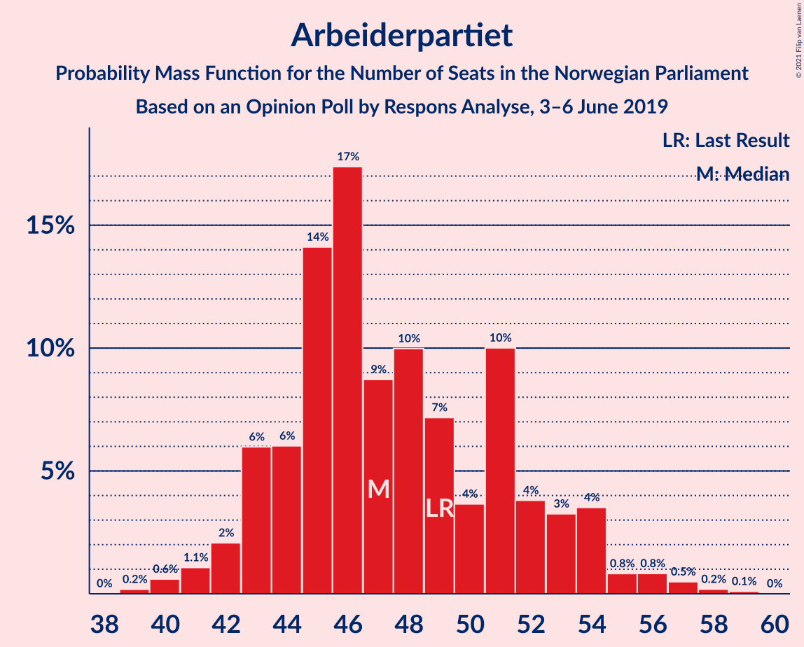
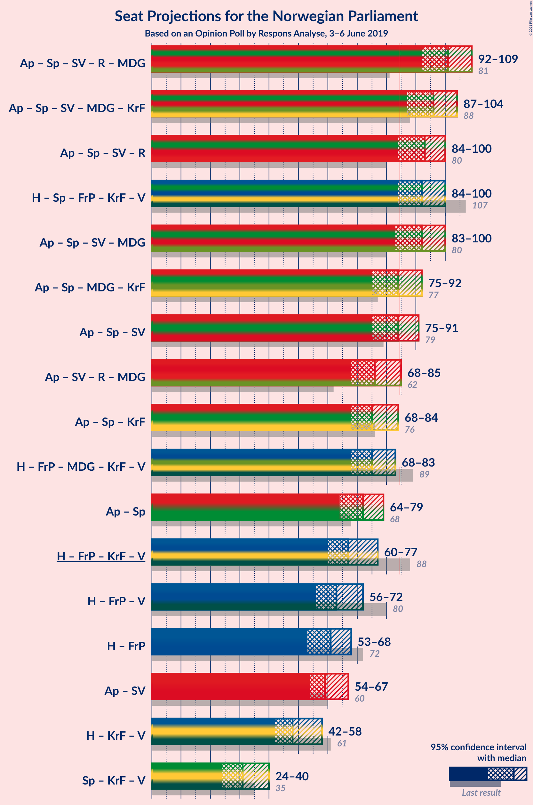
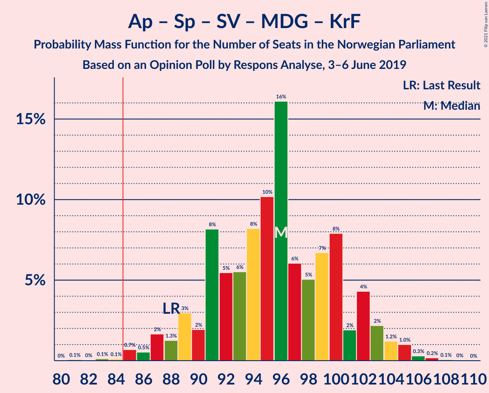
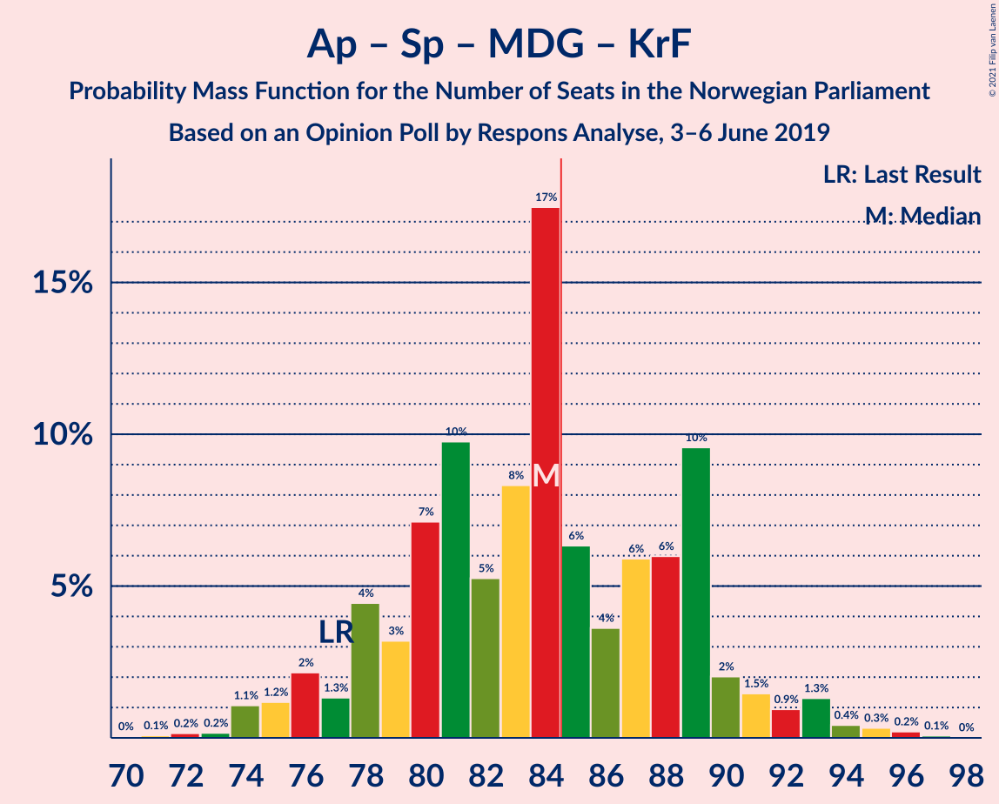
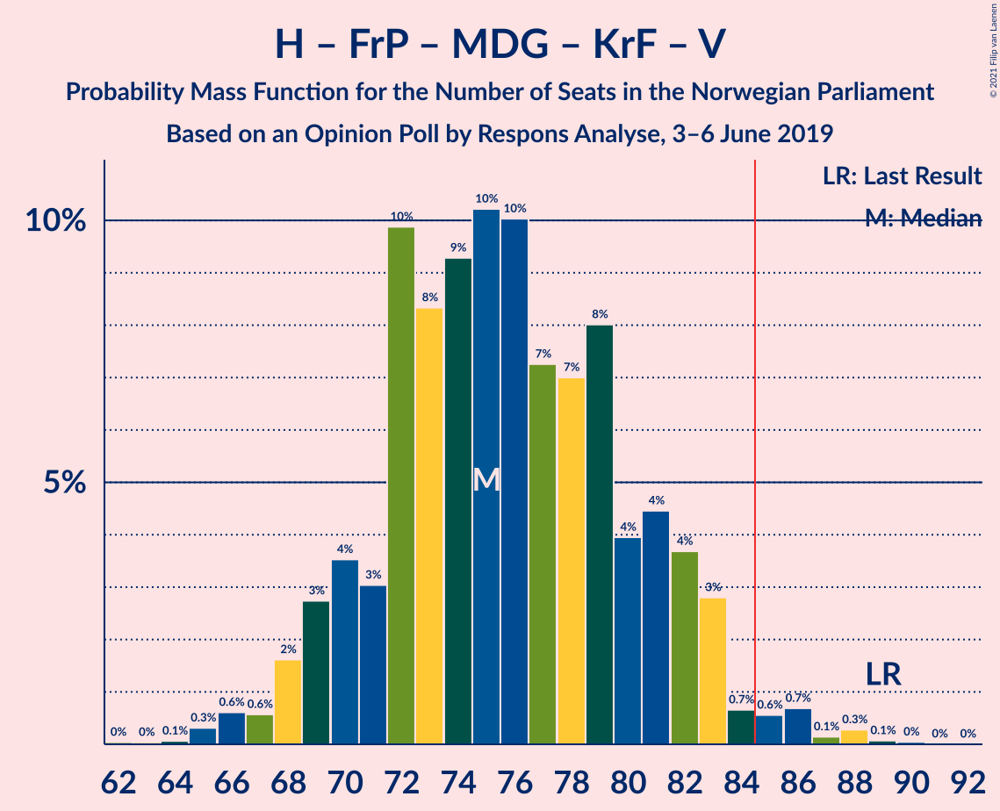
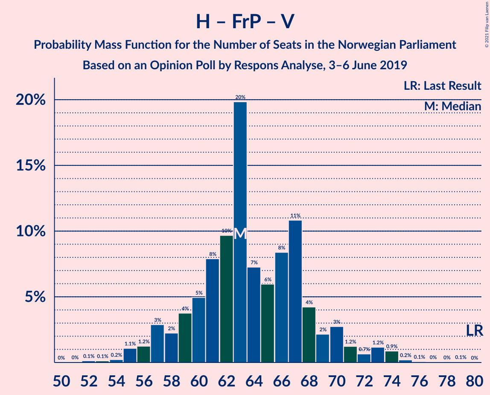

# Opinion Poll by Respons Analyse, 3–6 June 2019

<a href="#voting-intentions">Voting Intentions</a> | <a href="#seats">Seats</a> | <a href="#coalitions">Coalitions</a> | <a href="#technical-information">Technical Information</a>

## Voting Intentions

### Confidence Intervals

| Party | Last Result | Poll Result | 80% Confidence Interval | 90% Confidence Interval | 95% Confidence Interval | 99% Confidence Interval |
|:-----:|:-----------:|:-----------:|:-----------------------:|:-----------------------:|:-----------------------:|:-----------------------:|
| Arbeiderpartiet | 27.4% | 26.0% | 24.0–28.0% |23.5–28.6% |23.0–29.2% |22.1–30.2% |
| Høyre | 25.0% | 23.1% | 21.3–25.2% |20.8–25.7% |20.3–26.2% |19.5–27.2% |
| Senterpartiet | 10.3% | 13.3% | 11.8–15.0% |11.4–15.5% |11.1–15.9% |10.4–16.7% |
| Fremskrittspartiet | 15.2% | 10.7% | 9.4–12.3% |9.1–12.7% |8.7–13.1% |8.2–13.9% |
| Sosialistisk Venstreparti | 6.0% | 6.8% | 5.7–8.1% |5.5–8.4% |5.2–8.8% |4.8–9.4% |
| Rødt | 2.4% | 5.2% | 4.3–6.4% |4.1–6.8% |3.9–7.0% |3.5–7.7% |
| Miljøpartiet De Grønne | 3.2% | 4.9% | 4.0–6.0% |3.8–6.3% |3.6–6.6% |3.2–7.2% |
| Kristelig Folkeparti | 4.2% | 3.6% | 2.9–4.6% |2.7–4.9% |2.5–5.1% |2.2–5.7% |
| Venstre | 4.4% | 3.5% | 2.7–4.5% |2.5–4.7% |2.4–5.0% |2.1–5.5% |

*Note:* The poll result column reflects the actual value used in the calculations. Published results may vary slightly, and in addition be rounded to fewer digits.

## Seats

### Confidence Intervals

| Party | Last Result | Median | 80% Confidence Interval | 90% Confidence Interval | 95% Confidence Interval | 99% Confidence Interval |
|:-----:|:-----------:|:------:|:-----------------------:|:-----------------------:|:-----------------------:|:-----------------------:|
| <a href="#arbeiderpartiet">Arbeiderpartiet</a> | 49 | 47 | 44–52 |43–54 |42–54 |40–57 |
| <a href="#høyre">Høyre</a> | 45 | 41 | 37–46 |36–47 |36–48 |35–50 |
| <a href="#senterpartiet">Senterpartiet</a> | 19 | 24 | 20–27 |20–29 |19–30 |18–33 |
| <a href="#fremskrittspartiet">Fremskrittspartiet</a> | 27 | 19 | 16–22 |16–23 |15–24 |14–25 |
| <a href="#sosialistisk-venstreparti">Sosialistisk Venstreparti</a> | 11 | 12 | 10–14 |9–15 |9–16 |8–17 |
| <a href="#rødt">Rødt</a> | 1 | 9 | 7–11 |7–12 |2–13 |2–13 |
| <a href="#miljøpartiet-de-grønne">Miljøpartiet De Grønne</a> | 1 | 9 | 2–11 |2–11 |2–12 |1–13 |
| <a href="#kristelig-folkeparti">Kristelig Folkeparti</a> | 8 | 3 | 1–8 |1–8 |1–9 |1–10 |
| <a href="#venstre">Venstre</a> | 8 | 2 | 2–8 |2–8 |2–8 |1–9 |

### Arbeiderpartiet

*For a full overview of the results for this party, see the [Arbeiderpartiet](party-arbeiderpartiet.html) page.*

| Number of Seats | Probability | Accumulated | Special Marks |
|:---------------:|:-----------:|:-----------:|:-------------:|
| 39 | 0.2% | 100% |  |
| 40 | 0.6% | 99.8% |  |
| 41 | 1.1% | 99.2% |  |
| 42 | 2% | 98% |  |
| 43 | 6% | 96% |  |
| 44 | 6% | 90% |  |
| 45 | 14% | 84% |  |
| 46 | 17% | 70% |  |
| 47 | 9% | 53% | Median |
| 48 | 10% | 44% |  |
| 49 | 7% | 34% | Last Result |
| 50 | 4% | 27% |  |
| 51 | 10% | 23% |  |
| 52 | 4% | 13% |  |
| 53 | 3% | 9% |  |
| 54 | 4% | 6% |  |
| 55 | 0.8% | 2% |  |
| 56 | 0.8% | 2% |  |
| 57 | 0.5% | 0.8% |  |
| 58 | 0.2% | 0.3% |  |
| 59 | 0.1% | 0.1% |  |
| 60 | 0% | 0% |  |

### Høyre

*For a full overview of the results for this party, see the [Høyre](party-høyre.html) page.*

| Number of Seats | Probability | Accumulated | Special Marks |
|:---------------:|:-----------:|:-----------:|:-------------:|
| 32 | 0% | 100% |  |
| 33 | 0.1% | 99.9% |  |
| 34 | 0.3% | 99.9% |  |
| 35 | 0.9% | 99.5% |  |
| 36 | 6% | 98.6% |  |
| 37 | 7% | 93% |  |
| 38 | 6% | 86% |  |
| 39 | 11% | 81% |  |
| 40 | 12% | 70% |  |
| 41 | 9% | 58% | Median |
| 42 | 12% | 49% |  |
| 43 | 11% | 37% |  |
| 44 | 8% | 26% |  |
| 45 | 5% | 18% | Last Result |
| 46 | 7% | 12% |  |
| 47 | 3% | 5% |  |
| 48 | 1.4% | 3% |  |
| 49 | 0.6% | 1.2% |  |
| 50 | 0.4% | 0.7% |  |
| 51 | 0.1% | 0.3% |  |
| 52 | 0.1% | 0.1% |  |
| 53 | 0% | 0% |  |

### Senterpartiet

*For a full overview of the results for this party, see the [Senterpartiet](party-senterpartiet.html) page.*

| Number of Seats | Probability | Accumulated | Special Marks |
|:---------------:|:-----------:|:-----------:|:-------------:|
| 17 | 0.2% | 100% |  |
| 18 | 1.0% | 99.8% |  |
| 19 | 4% | 98.8% | Last Result |
| 20 | 7% | 95% |  |
| 21 | 6% | 88% |  |
| 22 | 8% | 82% |  |
| 23 | 12% | 74% |  |
| 24 | 12% | 62% | Median |
| 25 | 11% | 50% |  |
| 26 | 14% | 39% |  |
| 27 | 15% | 25% |  |
| 28 | 4% | 10% |  |
| 29 | 3% | 6% |  |
| 30 | 1.2% | 4% |  |
| 31 | 0.5% | 2% |  |
| 32 | 1.0% | 2% |  |
| 33 | 0.8% | 0.9% |  |
| 34 | 0.1% | 0.1% |  |
| 35 | 0% | 0% |  |

### Fremskrittspartiet

*For a full overview of the results for this party, see the [Fremskrittspartiet](party-fremskrittspartiet.html) page.*

| Number of Seats | Probability | Accumulated | Special Marks |
|:---------------:|:-----------:|:-----------:|:-------------:|
| 12 | 0.1% | 100% |  |
| 13 | 0.3% | 99.9% |  |
| 14 | 0.8% | 99.6% |  |
| 15 | 3% | 98.8% |  |
| 16 | 11% | 96% |  |
| 17 | 10% | 84% |  |
| 18 | 11% | 75% |  |
| 19 | 17% | 64% | Median |
| 20 | 17% | 47% |  |
| 21 | 17% | 29% |  |
| 22 | 7% | 12% |  |
| 23 | 2% | 6% |  |
| 24 | 2% | 3% |  |
| 25 | 1.0% | 1.3% |  |
| 26 | 0.2% | 0.3% |  |
| 27 | 0.1% | 0.1% | Last Result |
| 28 | 0% | 0% |  |

### Sosialistisk Venstreparti

*For a full overview of the results for this party, see the [Sosialistisk Venstreparti](party-sosialistiskvenstreparti.html) page.*

| Number of Seats | Probability | Accumulated | Special Marks |
|:---------------:|:-----------:|:-----------:|:-------------:|
| 7 | 0.1% | 100% |  |
| 8 | 1.2% | 99.8% |  |
| 9 | 5% | 98.6% |  |
| 10 | 17% | 94% |  |
| 11 | 22% | 76% | Last Result |
| 12 | 23% | 54% | Median |
| 13 | 17% | 32% |  |
| 14 | 8% | 15% |  |
| 15 | 3% | 6% |  |
| 16 | 2% | 3% |  |
| 17 | 0.6% | 0.8% |  |
| 18 | 0.1% | 0.2% |  |
| 19 | 0% | 0% |  |

### Rødt

*For a full overview of the results for this party, see the [Rødt](party-rødt.html) page.*

| Number of Seats | Probability | Accumulated | Special Marks |
|:---------------:|:-----------:|:-----------:|:-------------:|
| 1 | 0% | 100% | Last Result |
| 2 | 3% | 100% |  |
| 3 | 0% | 97% |  |
| 4 | 0% | 97% |  |
| 5 | 0% | 97% |  |
| 6 | 0.3% | 97% |  |
| 7 | 9% | 97% |  |
| 8 | 21% | 88% |  |
| 9 | 18% | 67% | Median |
| 10 | 31% | 49% |  |
| 11 | 11% | 18% |  |
| 12 | 4% | 7% |  |
| 13 | 2% | 3% |  |
| 14 | 0.3% | 0.4% |  |
| 15 | 0.1% | 0.1% |  |
| 16 | 0% | 0% |  |

### Miljøpartiet De Grønne

*For a full overview of the results for this party, see the [Miljøpartiet De Grønne](party-miljøpartietdegrønne.html) page.*

| Number of Seats | Probability | Accumulated | Special Marks |
|:---------------:|:-----------:|:-----------:|:-------------:|
| 1 | 0.6% | 100% | Last Result |
| 2 | 10% | 99.4% |  |
| 3 | 1.0% | 90% |  |
| 4 | 0.3% | 89% |  |
| 5 | 0% | 88% |  |
| 6 | 0.3% | 88% |  |
| 7 | 10% | 88% |  |
| 8 | 27% | 78% |  |
| 9 | 28% | 51% | Median |
| 10 | 11% | 22% |  |
| 11 | 7% | 11% |  |
| 12 | 3% | 4% |  |
| 13 | 0.5% | 0.6% |  |
| 14 | 0.1% | 0.1% |  |
| 15 | 0% | 0% |  |

### Kristelig Folkeparti

*For a full overview of the results for this party, see the [Kristelig Folkeparti](party-kristeligfolkeparti.html) page.*

| Number of Seats | Probability | Accumulated | Special Marks |
|:---------------:|:-----------:|:-----------:|:-------------:|
| 0 | 0.4% | 100% |  |
| 1 | 19% | 99.6% |  |
| 2 | 8% | 80% |  |
| 3 | 43% | 72% | Median |
| 4 | 0% | 29% |  |
| 5 | 0% | 29% |  |
| 6 | 2% | 29% |  |
| 7 | 12% | 27% |  |
| 8 | 12% | 15% | Last Result |
| 9 | 3% | 3% |  |
| 10 | 0.5% | 0.7% |  |
| 11 | 0.1% | 0.1% |  |
| 12 | 0% | 0% |  |

### Venstre

*For a full overview of the results for this party, see the [Venstre](party-venstre.html) page.*

| Number of Seats | Probability | Accumulated | Special Marks |
|:---------------:|:-----------:|:-----------:|:-------------:|
| 0 | 0.1% | 100% |  |
| 1 | 2% | 99.9% |  |
| 2 | 72% | 98% | Median |
| 3 | 4% | 26% |  |
| 4 | 0% | 21% |  |
| 5 | 0% | 21% |  |
| 6 | 0.4% | 21% |  |
| 7 | 9% | 21% |  |
| 8 | 9% | 12% | Last Result |
| 9 | 2% | 2% |  |
| 10 | 0.4% | 0.5% |  |
| 11 | 0% | 0% |  |

## Coalitions

### Confidence Intervals

| Coalition | Last Result | Median | Majority? | 80% Confidence Interval | 90% Confidence Interval | 95% Confidence Interval | 99% Confidence Interval |
|:---------:|:-----------:|:------:|:---------:|:-----------------------:|:-----------------------:|:-----------------------:|:-----------------------:|
| Arbeiderpartiet – Senterpartiet – Sosialistisk Venstreparti – Rødt – Miljøpartiet De Grønne | 81 | 101 | 100% | 95–106 | 93–107 | 92–109 | 89–110 |
| Arbeiderpartiet – Senterpartiet – Sosialistisk Venstreparti – Miljøpartiet De Grønne – Kristelig Folkeparti | 88 | 96 | 99.6% | 91–101 | 89–102 | 87–104 | 85–106 |
| Arbeiderpartiet – Senterpartiet – Sosialistisk Venstreparti – Rødt | 80 | 93 | 97% | 87–98 | 86–99 | 84–100 | 81–103 |
| Høyre – Senterpartiet – Fremskrittspartiet – Kristelig Folkeparti – Venstre | 107 | 92 | 96% | 87–97 | 85–98 | 84–100 | 81–103 |
| Arbeiderpartiet – Senterpartiet – Sosialistisk Venstreparti – Miljøpartiet De Grønne | 80 | 92 | 94% | 86–97 | 84–99 | 83–100 | 80–101 |
| Arbeiderpartiet – Senterpartiet – Miljøpartiet De Grønne – Kristelig Folkeparti | 77 | 84 | 38% | 78–89 | 77–90 | 75–92 | 74–95 |
| Arbeiderpartiet – Senterpartiet – Sosialistisk Venstreparti | 79 | 84 | 45% | 79–89 | 77–90 | 75–91 | 73–93 |
| Arbeiderpartiet – Sosialistisk Venstreparti – Rødt – Miljøpartiet De Grønne | 62 | 76 | 3% | 72–81 | 70–83 | 68–85 | 66–87 |
| Arbeiderpartiet – Senterpartiet – Kristelig Folkeparti | 76 | 75 | 2% | 71–81 | 69–82 | 68–84 | 65–87 |
| Høyre – Fremskrittspartiet – Miljøpartiet De Grønne – Kristelig Folkeparti – Venstre | 89 | 75 | 2% | 71–81 | 69–83 | 68–83 | 65–87 |
| Arbeiderpartiet – Senterpartiet | 68 | 72 | 0% | 67–78 | 65–78 | 64–79 | 62–81 |
| Høyre – Fremskrittspartiet – Kristelig Folkeparti – Venstre | 88 | 67 | 0% | 63–73 | 61–75 | 60–77 | 58–80 |
| Høyre – Fremskrittspartiet – Venstre | 80 | 63 | 0% | 59–68 | 57–70 | 56–72 | 54–74 |
| Høyre – Fremskrittspartiet | 72 | 61 | 0% | 56–65 | 54–66 | 53–68 | 51–71 |
| Arbeiderpartiet – Sosialistisk Venstreparti | 60 | 59 | 0% | 55–64 | 54–66 | 54–67 | 51–69 |
| Høyre – Kristelig Folkeparti – Venstre | 61 | 48 | 0% | 44–54 | 42–56 | 42–58 | 40–61 |
| Senterpartiet – Kristelig Folkeparti – Venstre | 35 | 31 | 0% | 27–37 | 25–38 | 24–40 | 23–42 |

### Arbeiderpartiet – Senterpartiet – Sosialistisk Venstreparti – Rødt – Miljøpartiet De Grønne

| Number of Seats | Probability | Accumulated | Special Marks |
|:---------------:|:-----------:|:-----------:|:-------------:|
| 81 | 0% | 100% | Last Result |
| 82 | 0% | 100% |  |
| 83 | 0% | 100% |  |
| 84 | 0% | 100% |  |
| 85 | 0% | 100% | Majority |
| 86 | 0% | 99.9% |  |
| 87 | 0.1% | 99.9% |  |
| 88 | 0.1% | 99.8% |  |
| 89 | 0.7% | 99.6% |  |
| 90 | 0.5% | 98.9% |  |
| 91 | 0.6% | 98% |  |
| 92 | 2% | 98% |  |
| 93 | 1.3% | 96% |  |
| 94 | 3% | 95% |  |
| 95 | 3% | 91% |  |
| 96 | 5% | 88% |  |
| 97 | 4% | 84% |  |
| 98 | 6% | 80% |  |
| 99 | 11% | 74% |  |
| 100 | 6% | 63% |  |
| 101 | 9% | 57% | Median |
| 102 | 7% | 48% |  |
| 103 | 13% | 41% |  |
| 104 | 4% | 29% |  |
| 105 | 13% | 24% |  |
| 106 | 4% | 11% |  |
| 107 | 2% | 7% |  |
| 108 | 1.4% | 5% |  |
| 109 | 2% | 3% |  |
| 110 | 1.0% | 1.3% |  |
| 111 | 0.2% | 0.4% |  |
| 112 | 0.1% | 0.2% |  |
| 113 | 0% | 0.1% |  |
| 114 | 0% | 0% |  |

### Arbeiderpartiet – Senterpartiet – Sosialistisk Venstreparti – Miljøpartiet De Grønne – Kristelig Folkeparti

| Number of Seats | Probability | Accumulated | Special Marks |
|:---------------:|:-----------:|:-----------:|:-------------:|
| 81 | 0.1% | 100% |  |
| 82 | 0% | 99.9% |  |
| 83 | 0.1% | 99.9% |  |
| 84 | 0.1% | 99.7% |  |
| 85 | 0.7% | 99.6% | Majority |
| 86 | 0.5% | 98.9% |  |
| 87 | 2% | 98% |  |
| 88 | 1.3% | 97% | Last Result |
| 89 | 3% | 95% |  |
| 90 | 2% | 93% |  |
| 91 | 8% | 91% |  |
| 92 | 5% | 82% |  |
| 93 | 6% | 77% |  |
| 94 | 8% | 71% |  |
| 95 | 10% | 63% | Median |
| 96 | 16% | 53% |  |
| 97 | 6% | 37% |  |
| 98 | 5% | 31% |  |
| 99 | 7% | 26% |  |
| 100 | 8% | 19% |  |
| 101 | 2% | 11% |  |
| 102 | 4% | 9% |  |
| 103 | 2% | 5% |  |
| 104 | 1.2% | 3% |  |
| 105 | 1.0% | 2% |  |
| 106 | 0.3% | 0.6% |  |
| 107 | 0.2% | 0.3% |  |
| 108 | 0.1% | 0.1% |  |
| 109 | 0% | 0.1% |  |
| 110 | 0% | 0% |  |

### Arbeiderpartiet – Senterpartiet – Sosialistisk Venstreparti – Rødt

| Number of Seats | Probability | Accumulated | Special Marks |
|:---------------:|:-----------:|:-----------:|:-------------:|
| 79 | 0.1% | 100% |  |
| 80 | 0.1% | 99.9% | Last Result |
| 81 | 0.3% | 99.8% |  |
| 82 | 0.3% | 99.5% |  |
| 83 | 0.8% | 99.2% |  |
| 84 | 1.2% | 98% |  |
| 85 | 1.0% | 97% | Majority |
| 86 | 3% | 96% |  |
| 87 | 5% | 93% |  |
| 88 | 5% | 88% |  |
| 89 | 4% | 83% |  |
| 90 | 8% | 79% |  |
| 91 | 8% | 71% |  |
| 92 | 7% | 64% | Median |
| 93 | 10% | 57% |  |
| 94 | 10% | 47% |  |
| 95 | 9% | 37% |  |
| 96 | 8% | 28% |  |
| 97 | 9% | 20% |  |
| 98 | 3% | 11% |  |
| 99 | 3% | 8% |  |
| 100 | 2% | 4% |  |
| 101 | 0.9% | 2% |  |
| 102 | 0.4% | 1.2% |  |
| 103 | 0.4% | 0.7% |  |
| 104 | 0.2% | 0.3% |  |
| 105 | 0% | 0.1% |  |
| 106 | 0% | 0.1% |  |
| 107 | 0% | 0% |  |

### Høyre – Senterpartiet – Fremskrittspartiet – Kristelig Folkeparti – Venstre

| Number of Seats | Probability | Accumulated | Special Marks |
|:---------------:|:-----------:|:-----------:|:-------------:|
| 79 | 0.1% | 100% |  |
| 80 | 0.3% | 99.9% |  |
| 81 | 0.2% | 99.6% |  |
| 82 | 0.5% | 99.4% |  |
| 83 | 1.1% | 98.9% |  |
| 84 | 2% | 98% |  |
| 85 | 1.4% | 96% | Majority |
| 86 | 3% | 94% |  |
| 87 | 3% | 91% |  |
| 88 | 7% | 89% |  |
| 89 | 11% | 82% | Median |
| 90 | 4% | 70% |  |
| 91 | 8% | 66% |  |
| 92 | 10% | 58% |  |
| 93 | 17% | 48% |  |
| 94 | 7% | 32% |  |
| 95 | 6% | 24% |  |
| 96 | 4% | 18% |  |
| 97 | 6% | 14% |  |
| 98 | 4% | 8% |  |
| 99 | 1.3% | 4% |  |
| 100 | 0.7% | 3% |  |
| 101 | 0.9% | 2% |  |
| 102 | 0.5% | 1.4% |  |
| 103 | 0.7% | 0.9% |  |
| 104 | 0.1% | 0.2% |  |
| 105 | 0.1% | 0.2% |  |
| 106 | 0% | 0.1% |  |
| 107 | 0.1% | 0.1% | Last Result |
| 108 | 0% | 0% |  |

### Arbeiderpartiet – Senterpartiet – Sosialistisk Venstreparti – Miljøpartiet De Grønne

| Number of Seats | Probability | Accumulated | Special Marks |
|:---------------:|:-----------:|:-----------:|:-------------:|
| 77 | 0% | 100% |  |
| 78 | 0.1% | 99.9% |  |
| 79 | 0.1% | 99.8% |  |
| 80 | 0.7% | 99.7% | Last Result |
| 81 | 0.3% | 99.1% |  |
| 82 | 1.0% | 98.7% |  |
| 83 | 1.3% | 98% |  |
| 84 | 2% | 96% |  |
| 85 | 3% | 94% | Majority |
| 86 | 3% | 92% |  |
| 87 | 5% | 89% |  |
| 88 | 9% | 84% |  |
| 89 | 5% | 75% |  |
| 90 | 6% | 70% |  |
| 91 | 6% | 63% |  |
| 92 | 9% | 57% | Median |
| 93 | 16% | 49% |  |
| 94 | 6% | 33% |  |
| 95 | 5% | 27% |  |
| 96 | 7% | 22% |  |
| 97 | 8% | 15% |  |
| 98 | 2% | 7% |  |
| 99 | 2% | 5% |  |
| 100 | 1.4% | 3% |  |
| 101 | 1.3% | 2% |  |
| 102 | 0.2% | 0.5% |  |
| 103 | 0.1% | 0.3% |  |
| 104 | 0.1% | 0.2% |  |
| 105 | 0% | 0.1% |  |
| 106 | 0% | 0% |  |

### Arbeiderpartiet – Senterpartiet – Miljøpartiet De Grønne – Kristelig Folkeparti

| Number of Seats | Probability | Accumulated | Special Marks |
|:---------------:|:-----------:|:-----------:|:-------------:|
| 70 | 0% | 100% |  |
| 71 | 0.1% | 99.9% |  |
| 72 | 0.2% | 99.8% |  |
| 73 | 0.2% | 99.7% |  |
| 74 | 1.1% | 99.5% |  |
| 75 | 1.2% | 98% |  |
| 76 | 2% | 97% |  |
| 77 | 1.3% | 95% | Last Result |
| 78 | 4% | 94% |  |
| 79 | 3% | 89% |  |
| 80 | 7% | 86% |  |
| 81 | 10% | 79% |  |
| 82 | 5% | 69% |  |
| 83 | 8% | 64% | Median |
| 84 | 17% | 56% |  |
| 85 | 6% | 38% | Majority |
| 86 | 4% | 32% |  |
| 87 | 6% | 28% |  |
| 88 | 6% | 22% |  |
| 89 | 10% | 16% |  |
| 90 | 2% | 7% |  |
| 91 | 1.5% | 5% |  |
| 92 | 0.9% | 3% |  |
| 93 | 1.3% | 2% |  |
| 94 | 0.4% | 1.1% |  |
| 95 | 0.3% | 0.6% |  |
| 96 | 0.2% | 0.3% |  |
| 97 | 0.1% | 0.1% |  |
| 98 | 0% | 0% |  |

### Arbeiderpartiet – Senterpartiet – Sosialistisk Venstreparti

| Number of Seats | Probability | Accumulated | Special Marks |
|:---------------:|:-----------:|:-----------:|:-------------:|
| 71 | 0.1% | 100% |  |
| 72 | 0.1% | 99.9% |  |
| 73 | 0.5% | 99.8% |  |
| 74 | 0.6% | 99.3% |  |
| 75 | 1.4% | 98.7% |  |
| 76 | 2% | 97% |  |
| 77 | 2% | 95% |  |
| 78 | 3% | 93% |  |
| 79 | 8% | 90% | Last Result |
| 80 | 8% | 82% |  |
| 81 | 6% | 75% |  |
| 82 | 6% | 68% |  |
| 83 | 5% | 62% | Median |
| 84 | 12% | 58% |  |
| 85 | 13% | 45% | Majority |
| 86 | 7% | 33% |  |
| 87 | 6% | 25% |  |
| 88 | 7% | 20% |  |
| 89 | 6% | 13% |  |
| 90 | 3% | 7% |  |
| 91 | 2% | 4% |  |
| 92 | 1.3% | 2% |  |
| 93 | 0.4% | 0.8% |  |
| 94 | 0.3% | 0.4% |  |
| 95 | 0.1% | 0.2% |  |
| 96 | 0% | 0.1% |  |
| 97 | 0% | 0.1% |  |
| 98 | 0% | 0% |  |

### Arbeiderpartiet – Sosialistisk Venstreparti – Rødt – Miljøpartiet De Grønne

| Number of Seats | Probability | Accumulated | Special Marks |
|:---------------:|:-----------:|:-----------:|:-------------:|
| 62 | 0.1% | 100% | Last Result |
| 63 | 0.1% | 99.9% |  |
| 64 | 0.1% | 99.8% |  |
| 65 | 0.1% | 99.7% |  |
| 66 | 0.8% | 99.6% |  |
| 67 | 0.6% | 98.8% |  |
| 68 | 1.0% | 98% |  |
| 69 | 0.8% | 97% |  |
| 70 | 2% | 96% |  |
| 71 | 4% | 95% |  |
| 72 | 6% | 90% |  |
| 73 | 5% | 84% |  |
| 74 | 7% | 79% |  |
| 75 | 8% | 72% |  |
| 76 | 18% | 65% |  |
| 77 | 10% | 47% | Median |
| 78 | 8% | 37% |  |
| 79 | 3% | 29% |  |
| 80 | 11% | 26% |  |
| 81 | 6% | 15% |  |
| 82 | 2% | 9% |  |
| 83 | 2% | 6% |  |
| 84 | 1.0% | 4% |  |
| 85 | 2% | 3% | Majority |
| 86 | 0.8% | 2% |  |
| 87 | 0.4% | 0.8% |  |
| 88 | 0.1% | 0.4% |  |
| 89 | 0.3% | 0.3% |  |
| 90 | 0% | 0.1% |  |
| 91 | 0% | 0% |  |

### Arbeiderpartiet – Senterpartiet – Kristelig Folkeparti

| Number of Seats | Probability | Accumulated | Special Marks |
|:---------------:|:-----------:|:-----------:|:-------------:|
| 63 | 0.1% | 100% |  |
| 64 | 0.1% | 99.9% |  |
| 65 | 0.3% | 99.8% |  |
| 66 | 0.3% | 99.4% |  |
| 67 | 1.1% | 99.1% |  |
| 68 | 1.3% | 98% |  |
| 69 | 3% | 97% |  |
| 70 | 3% | 94% |  |
| 71 | 3% | 91% |  |
| 72 | 9% | 88% |  |
| 73 | 7% | 79% |  |
| 74 | 8% | 73% | Median |
| 75 | 18% | 65% |  |
| 76 | 9% | 47% | Last Result |
| 77 | 6% | 38% |  |
| 78 | 7% | 32% |  |
| 79 | 7% | 24% |  |
| 80 | 3% | 17% |  |
| 81 | 7% | 14% |  |
| 82 | 2% | 7% |  |
| 83 | 1.4% | 4% |  |
| 84 | 1.4% | 3% |  |
| 85 | 0.6% | 2% | Majority |
| 86 | 0.5% | 1.1% |  |
| 87 | 0.3% | 0.6% |  |
| 88 | 0.2% | 0.2% |  |
| 89 | 0% | 0.1% |  |
| 90 | 0% | 0% |  |

### Høyre – Fremskrittspartiet – Miljøpartiet De Grønne – Kristelig Folkeparti – Venstre

| Number of Seats | Probability | Accumulated | Special Marks |
|:---------------:|:-----------:|:-----------:|:-------------:|
| 62 | 0% | 100% |  |
| 63 | 0% | 99.9% |  |
| 64 | 0.1% | 99.9% |  |
| 65 | 0.3% | 99.8% |  |
| 66 | 0.6% | 99.5% |  |
| 67 | 0.6% | 98.9% |  |
| 68 | 2% | 98% |  |
| 69 | 3% | 97% |  |
| 70 | 4% | 94% |  |
| 71 | 3% | 90% |  |
| 72 | 10% | 87% |  |
| 73 | 8% | 78% |  |
| 74 | 9% | 69% | Median |
| 75 | 10% | 60% |  |
| 76 | 10% | 50% |  |
| 77 | 7% | 40% |  |
| 78 | 7% | 32% |  |
| 79 | 8% | 25% |  |
| 80 | 4% | 17% |  |
| 81 | 4% | 13% |  |
| 82 | 4% | 9% |  |
| 83 | 3% | 5% |  |
| 84 | 0.7% | 2% |  |
| 85 | 0.6% | 2% | Majority |
| 86 | 0.7% | 1.2% |  |
| 87 | 0.1% | 0.6% |  |
| 88 | 0.3% | 0.4% |  |
| 89 | 0.1% | 0.1% | Last Result |
| 90 | 0% | 0.1% |  |
| 91 | 0% | 0% |  |

### Arbeiderpartiet – Senterpartiet

| Number of Seats | Probability | Accumulated | Special Marks |
|:---------------:|:-----------:|:-----------:|:-------------:|
| 60 | 0% | 100% |  |
| 61 | 0.2% | 99.9% |  |
| 62 | 0.5% | 99.7% |  |
| 63 | 0.6% | 99.2% |  |
| 64 | 2% | 98.7% |  |
| 65 | 2% | 96% |  |
| 66 | 4% | 95% |  |
| 67 | 3% | 91% |  |
| 68 | 6% | 88% | Last Result |
| 69 | 10% | 81% |  |
| 70 | 7% | 71% |  |
| 71 | 7% | 65% | Median |
| 72 | 17% | 58% |  |
| 73 | 10% | 41% |  |
| 74 | 5% | 31% |  |
| 75 | 6% | 26% |  |
| 76 | 6% | 20% |  |
| 77 | 3% | 14% |  |
| 78 | 7% | 11% |  |
| 79 | 2% | 3% |  |
| 80 | 1.0% | 2% |  |
| 81 | 0.6% | 0.8% |  |
| 82 | 0.1% | 0.2% |  |
| 83 | 0.1% | 0.1% |  |
| 84 | 0% | 0% |  |

### Høyre – Fremskrittspartiet – Kristelig Folkeparti – Venstre

| Number of Seats | Probability | Accumulated | Special Marks |
|:---------------:|:-----------:|:-----------:|:-------------:|
| 55 | 0% | 100% |  |
| 56 | 0.1% | 99.9% |  |
| 57 | 0.2% | 99.9% |  |
| 58 | 0.3% | 99.7% |  |
| 59 | 1.3% | 99.4% |  |
| 60 | 2% | 98% |  |
| 61 | 2% | 96% |  |
| 62 | 2% | 94% |  |
| 63 | 4% | 91% |  |
| 64 | 13% | 87% |  |
| 65 | 5% | 73% | Median |
| 66 | 13% | 69% |  |
| 67 | 7% | 55% |  |
| 68 | 8% | 48% |  |
| 69 | 6% | 40% |  |
| 70 | 11% | 34% |  |
| 71 | 6% | 22% |  |
| 72 | 4% | 17% |  |
| 73 | 4% | 13% |  |
| 74 | 3% | 9% |  |
| 75 | 3% | 6% |  |
| 76 | 1.0% | 4% |  |
| 77 | 1.1% | 3% |  |
| 78 | 0.4% | 2% |  |
| 79 | 0.3% | 1.1% |  |
| 80 | 0.6% | 0.8% |  |
| 81 | 0.1% | 0.2% |  |
| 82 | 0.1% | 0.1% |  |
| 83 | 0% | 0% |  |
| 84 | 0% | 0% |  |
| 85 | 0% | 0% | Majority |
| 86 | 0% | 0% |  |
| 87 | 0% | 0% |  |
| 88 | 0% | 0% | Last Result |

### Høyre – Fremskrittspartiet – Venstre

| Number of Seats | Probability | Accumulated | Special Marks |
|:---------------:|:-----------:|:-----------:|:-------------:|
| 52 | 0.1% | 100% |  |
| 53 | 0.1% | 99.8% |  |
| 54 | 0.2% | 99.7% |  |
| 55 | 1.1% | 99.5% |  |
| 56 | 1.2% | 98% |  |
| 57 | 3% | 97% |  |
| 58 | 2% | 94% |  |
| 59 | 4% | 92% |  |
| 60 | 5% | 88% |  |
| 61 | 8% | 83% |  |
| 62 | 10% | 75% | Median |
| 63 | 20% | 66% |  |
| 64 | 7% | 46% |  |
| 65 | 6% | 39% |  |
| 66 | 8% | 33% |  |
| 67 | 11% | 24% |  |
| 68 | 4% | 13% |  |
| 69 | 2% | 9% |  |
| 70 | 3% | 7% |  |
| 71 | 1.2% | 4% |  |
| 72 | 0.7% | 3% |  |
| 73 | 1.2% | 2% |  |
| 74 | 0.9% | 1.3% |  |
| 75 | 0.2% | 0.4% |  |
| 76 | 0.1% | 0.2% |  |
| 77 | 0% | 0.1% |  |
| 78 | 0% | 0.1% |  |
| 79 | 0.1% | 0.1% |  |
| 80 | 0% | 0% | Last Result |

### Høyre – Fremskrittspartiet

| Number of Seats | Probability | Accumulated | Special Marks |
|:---------------:|:-----------:|:-----------:|:-------------:|
| 49 | 0.1% | 100% |  |
| 50 | 0.2% | 99.9% |  |
| 51 | 0.3% | 99.7% |  |
| 52 | 0.5% | 99.4% |  |
| 53 | 2% | 98.9% |  |
| 54 | 2% | 97% |  |
| 55 | 4% | 95% |  |
| 56 | 4% | 90% |  |
| 57 | 8% | 86% |  |
| 58 | 5% | 78% |  |
| 59 | 9% | 73% |  |
| 60 | 10% | 64% | Median |
| 61 | 20% | 54% |  |
| 62 | 6% | 34% |  |
| 63 | 5% | 28% |  |
| 64 | 9% | 24% |  |
| 65 | 7% | 15% |  |
| 66 | 4% | 8% |  |
| 67 | 1.2% | 4% |  |
| 68 | 2% | 3% |  |
| 69 | 0.3% | 1.1% |  |
| 70 | 0.2% | 0.8% |  |
| 71 | 0.3% | 0.5% |  |
| 72 | 0.1% | 0.2% | Last Result |
| 73 | 0% | 0.1% |  |
| 74 | 0% | 0% |  |

### Arbeiderpartiet – Sosialistisk Venstreparti

| Number of Seats | Probability | Accumulated | Special Marks |
|:---------------:|:-----------:|:-----------:|:-------------:|
| 49 | 0.1% | 100% |  |
| 50 | 0.2% | 99.9% |  |
| 51 | 0.3% | 99.7% |  |
| 52 | 0.5% | 99.5% |  |
| 53 | 1.3% | 99.0% |  |
| 54 | 4% | 98% |  |
| 55 | 4% | 94% |  |
| 56 | 12% | 89% |  |
| 57 | 17% | 78% |  |
| 58 | 6% | 61% |  |
| 59 | 13% | 55% | Median |
| 60 | 10% | 42% | Last Result |
| 61 | 5% | 33% |  |
| 62 | 9% | 27% |  |
| 63 | 3% | 19% |  |
| 64 | 7% | 16% |  |
| 65 | 3% | 8% |  |
| 66 | 2% | 6% |  |
| 67 | 0.9% | 3% |  |
| 68 | 1.3% | 2% |  |
| 69 | 0.8% | 1.1% |  |
| 70 | 0.2% | 0.4% |  |
| 71 | 0.1% | 0.2% |  |
| 72 | 0% | 0% |  |

### Høyre – Kristelig Folkeparti – Venstre

| Number of Seats | Probability | Accumulated | Special Marks |
|:---------------:|:-----------:|:-----------:|:-------------:|
| 37 | 0% | 100% |  |
| 38 | 0.1% | 99.9% |  |
| 39 | 0.2% | 99.9% |  |
| 40 | 0.8% | 99.7% |  |
| 41 | 1.1% | 98.8% |  |
| 42 | 4% | 98% |  |
| 43 | 3% | 94% |  |
| 44 | 9% | 91% |  |
| 45 | 11% | 82% |  |
| 46 | 8% | 70% | Median |
| 47 | 9% | 62% |  |
| 48 | 9% | 53% |  |
| 49 | 7% | 45% |  |
| 50 | 6% | 38% |  |
| 51 | 10% | 32% |  |
| 52 | 5% | 23% |  |
| 53 | 4% | 18% |  |
| 54 | 4% | 13% |  |
| 55 | 3% | 9% |  |
| 56 | 2% | 6% |  |
| 57 | 0.8% | 4% |  |
| 58 | 2% | 3% |  |
| 59 | 0.5% | 2% |  |
| 60 | 0.2% | 1.2% |  |
| 61 | 0.6% | 0.9% | Last Result |
| 62 | 0.2% | 0.3% |  |
| 63 | 0% | 0.1% |  |
| 64 | 0% | 0% |  |

### Senterpartiet – Kristelig Folkeparti – Venstre

| Number of Seats | Probability | Accumulated | Special Marks |
|:---------------:|:-----------:|:-----------:|:-------------:|
| 21 | 0.1% | 100% |  |
| 22 | 0.4% | 99.9% |  |
| 23 | 1.1% | 99.6% |  |
| 24 | 3% | 98% |  |
| 25 | 2% | 96% |  |
| 26 | 2% | 94% |  |
| 27 | 8% | 91% |  |
| 28 | 12% | 84% |  |
| 29 | 6% | 72% | Median |
| 30 | 6% | 66% |  |
| 31 | 12% | 59% |  |
| 32 | 15% | 48% |  |
| 33 | 5% | 33% |  |
| 34 | 4% | 28% |  |
| 35 | 5% | 24% | Last Result |
| 36 | 5% | 19% |  |
| 37 | 5% | 15% |  |
| 38 | 4% | 9% |  |
| 39 | 2% | 5% |  |
| 40 | 2% | 3% |  |
| 41 | 0.4% | 1.1% |  |
| 42 | 0.3% | 0.7% |  |
| 43 | 0.2% | 0.4% |  |
| 44 | 0.1% | 0.3% |  |
| 45 | 0.1% | 0.2% |  |
| 46 | 0.1% | 0.1% |  |
| 47 | 0% | 0% |  |

## Technical Information

### Opinion Poll

+ **Polling firm:** Respons Analyse
+ **Commissioner(s):** —
+ **Fieldwork period:** 3–6 June 2019

### Calculations

+ **Sample size:** 782
+ **Simulations done:** 1,048,576
+ **Error estimate:** 1.45%

