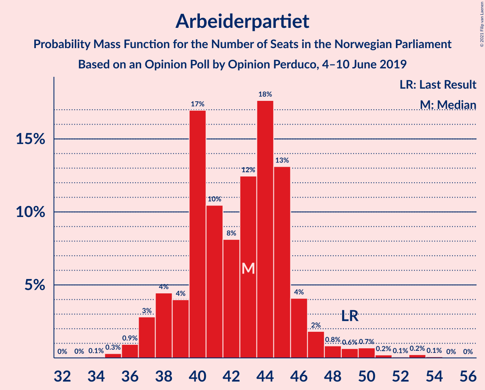
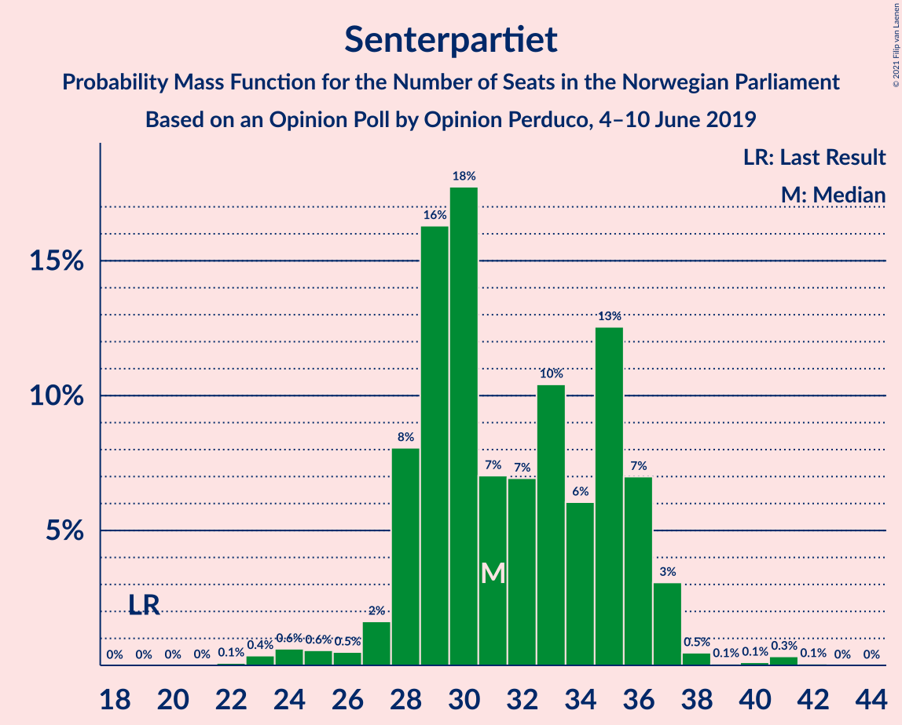
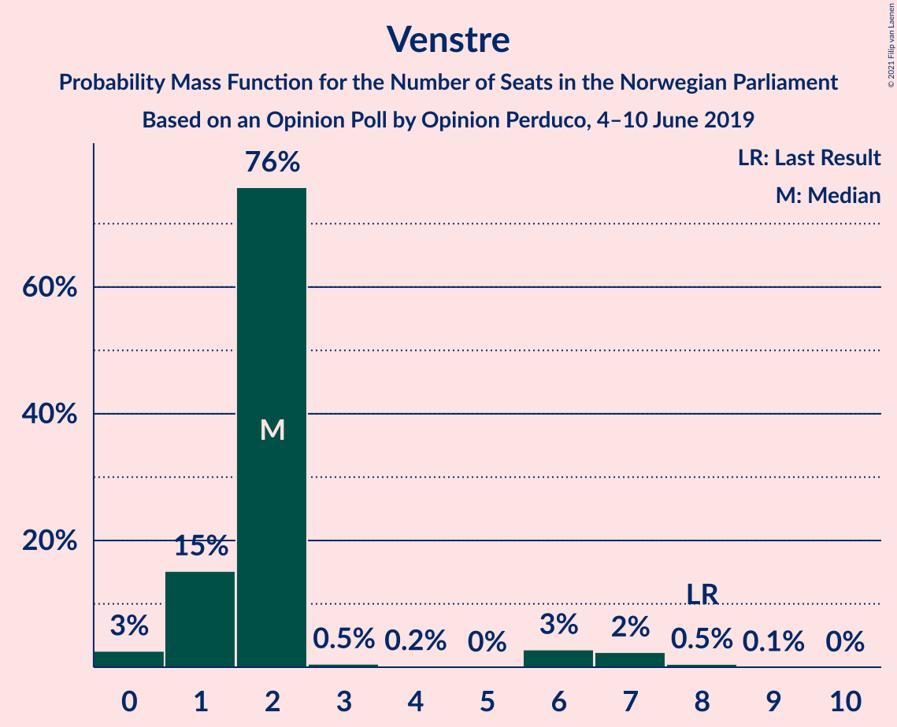
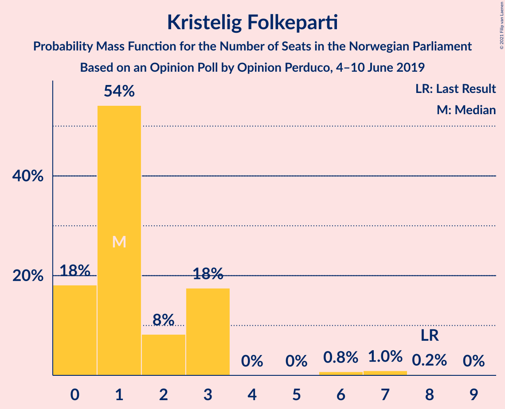
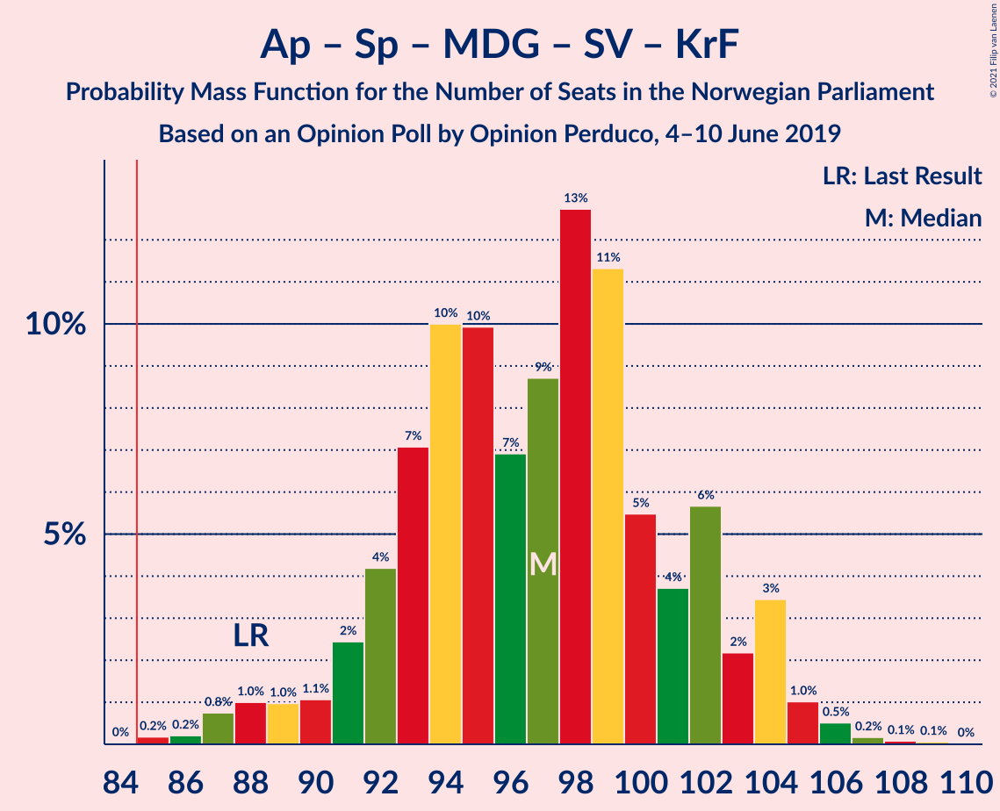
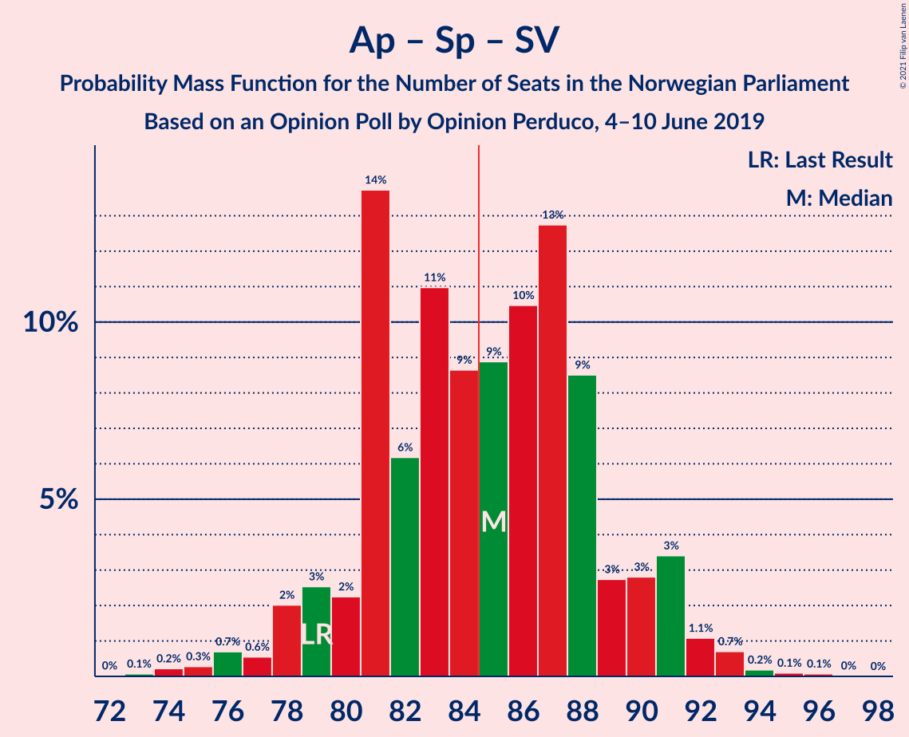

# Opinion Poll by Opinion Perduco, 4–10 June 2019

<a href="#voting-intentions">Voting Intentions</a> | <a href="#seats">Seats</a> | <a href="#coalitions">Coalitions</a> | <a href="#technical-information">Technical Information</a>

## Voting Intentions

### Confidence Intervals

| Party | Last Result | Poll Result | 80% Confidence Interval | 90% Confidence Interval | 95% Confidence Interval | 99% Confidence Interval |
|:-----:|:-----------:|:-----------:|:-----------------------:|:-----------------------:|:-----------------------:|:-----------------------:|
| Arbeiderpartiet | 27.4% | 23.1% | 21.1–25.2% |20.6–25.8% |20.1–26.3% |19.2–27.4% |
| Høyre | 25.0% | 19.1% | 17.3–21.1% |16.8–21.7% |16.4–22.2% |15.5–23.2% |
| Senterpartiet | 10.3% | 16.8% | 15.1–18.8% |14.7–19.3% |14.3–19.8% |13.5–20.7% |
| Fremskrittspartiet | 15.2% | 11.5% | 10.0–13.1% |9.6–13.6% |9.3–14.0% |8.7–14.9% |
| Rødt | 2.4% | 7.1% | 6.0–8.5% |5.7–8.9% |5.4–9.2% |4.9–9.9% |
| Miljøpartiet De Grønne | 3.2% | 6.5% | 5.5–7.8% |5.2–8.2% |4.9–8.6% |4.5–9.3% |
| Sosialistisk Venstreparti | 6.0% | 6.4% | 5.3–7.7% |5.0–8.1% |4.8–8.4% |4.3–9.1% |
| Venstre | 4.4% | 2.8% | 2.2–3.8% |2.0–4.1% |1.8–4.3% |1.6–4.8% |
| Kristelig Folkeparti | 4.2% | 2.5% | 1.9–3.5% |1.8–3.7% |1.6–4.0% |1.4–4.5% |

*Note:* The poll result column reflects the actual value used in the calculations. Published results may vary slightly, and in addition be rounded to fewer digits.

## Seats

### Confidence Intervals

| Party | Last Result | Median | 80% Confidence Interval | 90% Confidence Interval | 95% Confidence Interval | 99% Confidence Interval |
|:-----:|:-----------:|:------:|:-----------------------:|:-----------------------:|:-----------------------:|:-----------------------:|
| <a href="#arbeiderpartiet">Arbeiderpartiet</a> | 49 | 43 | 39–45 |38–46 |37–48 |36–51 |
| <a href="#høyre">Høyre</a> | 45 | 33 | 31–37 |30–38 |29–40 |27–41 |
| <a href="#senterpartiet">Senterpartiet</a> | 19 | 31 | 28–36 |28–36 |27–37 |24–40 |
| <a href="#fremskrittspartiet">Fremskrittspartiet</a> | 27 | 19 | 17–24 |16–24 |15–25 |14–26 |
| <a href="#rødt">Rødt</a> | 1 | 12 | 9–14 |9–15 |9–15 |8–17 |
| <a href="#miljøpartiet-de-grønne">Miljøpartiet De Grønne</a> | 1 | 11 | 9–13 |8–14 |8–14 |7–16 |
| <a href="#sosialistisk-venstreparti">Sosialistisk Venstreparti</a> | 11 | 10 | 8–13 |8–14 |7–15 |7–16 |
| <a href="#venstre">Venstre</a> | 8 | 2 | 1–2 |1–6 |0–7 |0–8 |
| <a href="#kristelig-folkeparti">Kristelig Folkeparti</a> | 8 | 1 | 0–3 |0–3 |0–3 |0–7 |

### Arbeiderpartiet

*For a full overview of the results for this party, see the [Arbeiderpartiet](party-arbeiderpartiet.html) page.*

| Number of Seats | Probability | Accumulated | Special Marks |
|:---------------:|:-----------:|:-----------:|:-------------:|
| 34 | 0.1% | 100% |  |
| 35 | 0.3% | 99.9% |  |
| 36 | 0.9% | 99.6% |  |
| 37 | 3% | 98.7% |  |
| 38 | 4% | 96% |  |
| 39 | 4% | 91% |  |
| 40 | 17% | 87% |  |
| 41 | 10% | 70% |  |
| 42 | 8% | 60% |  |
| 43 | 12% | 52% | Median |
| 44 | 18% | 39% |  |
| 45 | 13% | 22% |  |
| 46 | 4% | 9% |  |
| 47 | 2% | 5% |  |
| 48 | 0.8% | 3% |  |
| 49 | 0.6% | 2% | Last Result |
| 50 | 0.7% | 1.3% |  |
| 51 | 0.2% | 0.6% |  |
| 52 | 0.1% | 0.4% |  |
| 53 | 0.2% | 0.3% |  |
| 54 | 0.1% | 0.1% |  |
| 55 | 0% | 0% |  |

### Høyre

*For a full overview of the results for this party, see the [Høyre](party-høyre.html) page.*

| Number of Seats | Probability | Accumulated | Special Marks |
|:---------------:|:-----------:|:-----------:|:-------------:|
| 25 | 0.1% | 100% |  |
| 26 | 0.2% | 99.8% |  |
| 27 | 0.4% | 99.6% |  |
| 28 | 1.1% | 99.3% |  |
| 29 | 2% | 98% |  |
| 30 | 6% | 96% |  |
| 31 | 11% | 91% |  |
| 32 | 8% | 80% |  |
| 33 | 22% | 71% | Median |
| 34 | 18% | 49% |  |
| 35 | 9% | 32% |  |
| 36 | 9% | 23% |  |
| 37 | 6% | 14% |  |
| 38 | 4% | 8% |  |
| 39 | 1.3% | 4% |  |
| 40 | 0.8% | 3% |  |
| 41 | 2% | 2% |  |
| 42 | 0.3% | 0.4% |  |
| 43 | 0% | 0.1% |  |
| 44 | 0% | 0% |  |
| 45 | 0% | 0% | Last Result |

### Senterpartiet

*For a full overview of the results for this party, see the [Senterpartiet](party-senterpartiet.html) page.*

| Number of Seats | Probability | Accumulated | Special Marks |
|:---------------:|:-----------:|:-----------:|:-------------:|
| 19 | 0% | 100% | Last Result |
| 20 | 0% | 100% |  |
| 21 | 0% | 100% |  |
| 22 | 0.1% | 100% |  |
| 23 | 0.4% | 99.9% |  |
| 24 | 0.6% | 99.5% |  |
| 25 | 0.6% | 98.9% |  |
| 26 | 0.5% | 98% |  |
| 27 | 2% | 98% |  |
| 28 | 8% | 96% |  |
| 29 | 16% | 88% |  |
| 30 | 18% | 72% |  |
| 31 | 7% | 54% | Median |
| 32 | 7% | 47% |  |
| 33 | 10% | 40% |  |
| 34 | 6% | 30% |  |
| 35 | 13% | 24% |  |
| 36 | 7% | 11% |  |
| 37 | 3% | 4% |  |
| 38 | 0.5% | 1.1% |  |
| 39 | 0.1% | 0.6% |  |
| 40 | 0.1% | 0.5% |  |
| 41 | 0.3% | 0.4% |  |
| 42 | 0.1% | 0.1% |  |
| 43 | 0% | 0% |  |

### Fremskrittspartiet

*For a full overview of the results for this party, see the [Fremskrittspartiet](party-fremskrittspartiet.html) page.*

| Number of Seats | Probability | Accumulated | Special Marks |
|:---------------:|:-----------:|:-----------:|:-------------:|
| 12 | 0.1% | 100% |  |
| 13 | 0.3% | 99.9% |  |
| 14 | 2% | 99.7% |  |
| 15 | 2% | 98% |  |
| 16 | 4% | 96% |  |
| 17 | 18% | 92% |  |
| 18 | 11% | 74% |  |
| 19 | 15% | 63% | Median |
| 20 | 12% | 48% |  |
| 21 | 9% | 36% |  |
| 22 | 11% | 27% |  |
| 23 | 5% | 17% |  |
| 24 | 9% | 12% |  |
| 25 | 1.4% | 3% |  |
| 26 | 1.2% | 2% |  |
| 27 | 0.2% | 0.4% | Last Result |
| 28 | 0.1% | 0.1% |  |
| 29 | 0% | 0% |  |

### Rødt

*For a full overview of the results for this party, see the [Rødt](party-rødt.html) page.*

| Number of Seats | Probability | Accumulated | Special Marks |
|:---------------:|:-----------:|:-----------:|:-------------:|
| 1 | 0% | 100% | Last Result |
| 2 | 0% | 100% |  |
| 3 | 0% | 100% |  |
| 4 | 0% | 100% |  |
| 5 | 0% | 100% |  |
| 6 | 0% | 100% |  |
| 7 | 0.2% | 100% |  |
| 8 | 2% | 99.8% |  |
| 9 | 9% | 98% |  |
| 10 | 17% | 89% |  |
| 11 | 14% | 73% |  |
| 12 | 26% | 59% | Median |
| 13 | 14% | 33% |  |
| 14 | 11% | 19% |  |
| 15 | 6% | 8% |  |
| 16 | 1.5% | 2% |  |
| 17 | 0.5% | 0.7% |  |
| 18 | 0.2% | 0.2% |  |
| 19 | 0% | 0% |  |

### Miljøpartiet De Grønne

*For a full overview of the results for this party, see the [Miljøpartiet De Grønne](party-miljøpartietdegrønne.html) page.*

| Number of Seats | Probability | Accumulated | Special Marks |
|:---------------:|:-----------:|:-----------:|:-------------:|
| 1 | 0% | 100% | Last Result |
| 2 | 0% | 100% |  |
| 3 | 0.1% | 100% |  |
| 4 | 0% | 99.9% |  |
| 5 | 0% | 99.9% |  |
| 6 | 0.1% | 99.9% |  |
| 7 | 1.3% | 99.9% |  |
| 8 | 6% | 98.5% |  |
| 9 | 13% | 92% |  |
| 10 | 19% | 79% |  |
| 11 | 24% | 60% | Median |
| 12 | 18% | 36% |  |
| 13 | 10% | 18% |  |
| 14 | 6% | 7% |  |
| 15 | 1.3% | 2% |  |
| 16 | 0.5% | 0.6% |  |
| 17 | 0.1% | 0.1% |  |
| 18 | 0% | 0% |  |

### Sosialistisk Venstreparti

*For a full overview of the results for this party, see the [Sosialistisk Venstreparti](party-sosialistiskvenstreparti.html) page.*

| Number of Seats | Probability | Accumulated | Special Marks |
|:---------------:|:-----------:|:-----------:|:-------------:|
| 2 | 0.1% | 100% |  |
| 3 | 0.1% | 99.9% |  |
| 4 | 0% | 99.9% |  |
| 5 | 0% | 99.9% |  |
| 6 | 0.1% | 99.9% |  |
| 7 | 3% | 99.7% |  |
| 8 | 7% | 97% |  |
| 9 | 20% | 90% |  |
| 10 | 21% | 70% | Median |
| 11 | 20% | 49% | Last Result |
| 12 | 14% | 29% |  |
| 13 | 5% | 15% |  |
| 14 | 6% | 9% |  |
| 15 | 3% | 3% |  |
| 16 | 0.4% | 0.6% |  |
| 17 | 0.1% | 0.2% |  |
| 18 | 0% | 0% |  |

### Venstre

*For a full overview of the results for this party, see the [Venstre](party-venstre.html) page.*

| Number of Seats | Probability | Accumulated | Special Marks |
|:---------------:|:-----------:|:-----------:|:-------------:|
| 0 | 3% | 100% |  |
| 1 | 15% | 97% |  |
| 2 | 76% | 82% | Median |
| 3 | 0.5% | 7% |  |
| 4 | 0.2% | 6% |  |
| 5 | 0% | 6% |  |
| 6 | 3% | 6% |  |
| 7 | 2% | 3% |  |
| 8 | 0.5% | 0.6% | Last Result |
| 9 | 0.1% | 0.1% |  |
| 10 | 0% | 0% |  |

### Kristelig Folkeparti

*For a full overview of the results for this party, see the [Kristelig Folkeparti](party-kristeligfolkeparti.html) page.*

| Number of Seats | Probability | Accumulated | Special Marks |
|:---------------:|:-----------:|:-----------:|:-------------:|
| 0 | 18% | 100% |  |
| 1 | 54% | 82% | Median |
| 2 | 8% | 28% |  |
| 3 | 18% | 19% |  |
| 4 | 0% | 2% |  |
| 5 | 0% | 2% |  |
| 6 | 0.8% | 2% |  |
| 7 | 1.0% | 1.2% |  |
| 8 | 0.2% | 0.2% | Last Result |
| 9 | 0% | 0% |  |

## Coalitions

### Confidence Intervals

| Coalition | Last Result | Median | Majority? | 80% Confidence Interval | 90% Confidence Interval | 95% Confidence Interval | 99% Confidence Interval |
|:---------:|:-----------:|:------:|:---------:|:-----------------------:|:-----------------------:|:-----------------------:|:-----------------------:|
| Arbeiderpartiet – Senterpartiet – Rødt – Miljøpartiet De Grønne – Sosialistisk Venstreparti | 81 | 108 | 100% | 103–113 | 100–114 | 99–115 | 95–117 |
| Arbeiderpartiet – Senterpartiet – Miljøpartiet De Grønne – Sosialistisk Venstreparti – Kristelig Folkeparti | 88 | 97 | 99.9% | 92–102 | 91–104 | 89–104 | 87–106 |
| Arbeiderpartiet – Senterpartiet – Rødt – Sosialistisk Venstreparti | 80 | 97 | 99.8% | 92–101 | 91–103 | 89–104 | 85–106 |
| Arbeiderpartiet – Senterpartiet – Miljøpartiet De Grønne – Sosialistisk Venstreparti | 80 | 96 | 99.7% | 91–100 | 89–102 | 87–103 | 85–105 |
| Høyre – Senterpartiet – Fremskrittspartiet – Venstre – Kristelig Folkeparti | 107 | 88 | 88% | 84–93 | 83–95 | 81–96 | 80–98 |
| Arbeiderpartiet – Senterpartiet – Miljøpartiet De Grønne – Kristelig Folkeparti | 77 | 86 | 66% | 81–91 | 80–92 | 78–93 | 77–95 |
| Arbeiderpartiet – Senterpartiet – Sosialistisk Venstreparti | 79 | 85 | 52% | 81–89 | 79–91 | 78–91 | 75–93 |
| Arbeiderpartiet – Senterpartiet – Kristelig Folkeparti | 76 | 75 | 0.5% | 70–80 | 70–81 | 69–82 | 66–84 |
| Arbeiderpartiet – Senterpartiet | 68 | 74 | 0.1% | 69–78 | 69–79 | 67–80 | 65–83 |
| Høyre – Fremskrittspartiet – Miljøpartiet De Grønne – Venstre – Kristelig Folkeparti | 89 | 68 | 0% | 63–73 | 62–74 | 61–76 | 59–79 |
| Høyre – Fremskrittspartiet – Venstre – Kristelig Folkeparti | 88 | 56 | 0% | 53–62 | 52–63 | 51–65 | 48–67 |
| Høyre – Fremskrittspartiet – Venstre | 80 | 55 | 0% | 51–61 | 51–62 | 49–63 | 47–65 |
| Høyre – Fremskrittspartiet | 72 | 53 | 0% | 50–59 | 49–60 | 47–61 | 45–62 |
| Arbeiderpartiet – Sosialistisk Venstreparti | 60 | 53 | 0% | 49–57 | 48–58 | 47–59 | 45–62 |
| Høyre – Venstre – Kristelig Folkeparti | 61 | 37 | 0% | 34–41 | 33–43 | 32–44 | 30–46 |
| Senterpartiet – Venstre – Kristelig Folkeparti | 35 | 34 | 0% | 31–40 | 31–40 | 30–42 | 26–44 |

### Arbeiderpartiet – Senterpartiet – Rødt – Miljøpartiet De Grønne – Sosialistisk Venstreparti

| Number of Seats | Probability | Accumulated | Special Marks |
|:---------------:|:-----------:|:-----------:|:-------------:|
| 81 | 0% | 100% | Last Result |
| 82 | 0% | 100% |  |
| 83 | 0% | 100% |  |
| 84 | 0% | 100% |  |
| 85 | 0% | 100% | Majority |
| 86 | 0% | 100% |  |
| 87 | 0% | 100% |  |
| 88 | 0% | 100% |  |
| 89 | 0% | 100% |  |
| 90 | 0% | 100% |  |
| 91 | 0% | 100% |  |
| 92 | 0% | 100% |  |
| 93 | 0% | 100% |  |
| 94 | 0.1% | 99.9% |  |
| 95 | 0.4% | 99.9% |  |
| 96 | 0.2% | 99.5% |  |
| 97 | 0.5% | 99.3% |  |
| 98 | 0.4% | 98.8% |  |
| 99 | 2% | 98% |  |
| 100 | 2% | 96% |  |
| 101 | 2% | 95% |  |
| 102 | 2% | 93% |  |
| 103 | 4% | 91% |  |
| 104 | 10% | 86% |  |
| 105 | 10% | 77% |  |
| 106 | 9% | 66% |  |
| 107 | 6% | 57% | Median |
| 108 | 15% | 52% |  |
| 109 | 9% | 37% |  |
| 110 | 8% | 27% |  |
| 111 | 3% | 19% |  |
| 112 | 5% | 16% |  |
| 113 | 4% | 11% |  |
| 114 | 3% | 8% |  |
| 115 | 2% | 4% |  |
| 116 | 1.2% | 2% |  |
| 117 | 0.5% | 0.8% |  |
| 118 | 0.2% | 0.3% |  |
| 119 | 0.1% | 0.2% |  |
| 120 | 0% | 0.1% |  |
| 121 | 0% | 0.1% |  |
| 122 | 0% | 0% |  |

### Arbeiderpartiet – Senterpartiet – Miljøpartiet De Grønne – Sosialistisk Venstreparti – Kristelig Folkeparti

| Number of Seats | Probability | Accumulated | Special Marks |
|:---------------:|:-----------:|:-----------:|:-------------:|
| 84 | 0% | 100% |  |
| 85 | 0.2% | 99.9% | Majority |
| 86 | 0.2% | 99.8% |  |
| 87 | 0.8% | 99.5% |  |
| 88 | 1.0% | 98.8% | Last Result |
| 89 | 1.0% | 98% |  |
| 90 | 1.1% | 97% |  |
| 91 | 2% | 96% |  |
| 92 | 4% | 93% |  |
| 93 | 7% | 89% |  |
| 94 | 10% | 82% |  |
| 95 | 10% | 72% |  |
| 96 | 7% | 62% | Median |
| 97 | 9% | 55% |  |
| 98 | 13% | 46% |  |
| 99 | 11% | 34% |  |
| 100 | 5% | 22% |  |
| 101 | 4% | 17% |  |
| 102 | 6% | 13% |  |
| 103 | 2% | 8% |  |
| 104 | 3% | 5% |  |
| 105 | 1.0% | 2% |  |
| 106 | 0.5% | 0.9% |  |
| 107 | 0.2% | 0.4% |  |
| 108 | 0.1% | 0.2% |  |
| 109 | 0.1% | 0.1% |  |
| 110 | 0% | 0% |  |

### Arbeiderpartiet – Senterpartiet – Rødt – Sosialistisk Venstreparti

| Number of Seats | Probability | Accumulated | Special Marks |
|:---------------:|:-----------:|:-----------:|:-------------:|
| 80 | 0% | 100% | Last Result |
| 81 | 0% | 100% |  |
| 82 | 0% | 100% |  |
| 83 | 0% | 100% |  |
| 84 | 0.1% | 99.9% |  |
| 85 | 0.4% | 99.8% | Majority |
| 86 | 0.1% | 99.5% |  |
| 87 | 0.3% | 99.3% |  |
| 88 | 0.9% | 99.0% |  |
| 89 | 2% | 98% |  |
| 90 | 1.4% | 97% |  |
| 91 | 3% | 95% |  |
| 92 | 3% | 92% |  |
| 93 | 13% | 89% |  |
| 94 | 6% | 76% |  |
| 95 | 8% | 70% |  |
| 96 | 9% | 62% | Median |
| 97 | 15% | 53% |  |
| 98 | 13% | 38% |  |
| 99 | 6% | 25% |  |
| 100 | 6% | 19% |  |
| 101 | 5% | 13% |  |
| 102 | 2% | 7% |  |
| 103 | 2% | 5% |  |
| 104 | 2% | 3% |  |
| 105 | 0.6% | 1.5% |  |
| 106 | 0.6% | 0.9% |  |
| 107 | 0.2% | 0.3% |  |
| 108 | 0.1% | 0.1% |  |
| 109 | 0% | 0.1% |  |
| 110 | 0% | 0% |  |

### Arbeiderpartiet – Senterpartiet – Miljøpartiet De Grønne – Sosialistisk Venstreparti

| Number of Seats | Probability | Accumulated | Special Marks |
|:---------------:|:-----------:|:-----------:|:-------------:|
| 80 | 0% | 100% | Last Result |
| 81 | 0% | 100% |  |
| 82 | 0% | 100% |  |
| 83 | 0% | 99.9% |  |
| 84 | 0.2% | 99.9% |  |
| 85 | 0.3% | 99.7% | Majority |
| 86 | 0.5% | 99.5% |  |
| 87 | 2% | 98.9% |  |
| 88 | 1.0% | 97% |  |
| 89 | 2% | 96% |  |
| 90 | 2% | 95% |  |
| 91 | 5% | 93% |  |
| 92 | 11% | 88% |  |
| 93 | 10% | 78% |  |
| 94 | 7% | 68% |  |
| 95 | 8% | 60% | Median |
| 96 | 14% | 53% |  |
| 97 | 6% | 39% |  |
| 98 | 10% | 33% |  |
| 99 | 9% | 23% |  |
| 100 | 4% | 13% |  |
| 101 | 4% | 10% |  |
| 102 | 2% | 6% |  |
| 103 | 3% | 4% |  |
| 104 | 0.7% | 1.2% |  |
| 105 | 0.3% | 0.5% |  |
| 106 | 0.1% | 0.2% |  |
| 107 | 0.1% | 0.1% |  |
| 108 | 0% | 0.1% |  |
| 109 | 0% | 0% |  |

### Høyre – Senterpartiet – Fremskrittspartiet – Venstre – Kristelig Folkeparti

| Number of Seats | Probability | Accumulated | Special Marks |
|:---------------:|:-----------:|:-----------:|:-------------:|
| 76 | 0.1% | 100% |  |
| 77 | 0.1% | 99.9% |  |
| 78 | 0.1% | 99.9% |  |
| 79 | 0.2% | 99.8% |  |
| 80 | 0.8% | 99.5% |  |
| 81 | 1.3% | 98.8% |  |
| 82 | 2% | 97% |  |
| 83 | 2% | 96% |  |
| 84 | 6% | 94% |  |
| 85 | 5% | 88% | Majority |
| 86 | 18% | 83% | Median |
| 87 | 11% | 65% |  |
| 88 | 11% | 54% |  |
| 89 | 10% | 43% |  |
| 90 | 5% | 34% |  |
| 91 | 6% | 29% |  |
| 92 | 6% | 22% |  |
| 93 | 7% | 16% |  |
| 94 | 3% | 10% |  |
| 95 | 2% | 6% |  |
| 96 | 2% | 4% |  |
| 97 | 0.9% | 2% |  |
| 98 | 0.6% | 1.0% |  |
| 99 | 0.2% | 0.4% |  |
| 100 | 0.1% | 0.2% |  |
| 101 | 0% | 0.1% |  |
| 102 | 0% | 0% |  |
| 103 | 0% | 0% |  |
| 104 | 0% | 0% |  |
| 105 | 0% | 0% |  |
| 106 | 0% | 0% |  |
| 107 | 0% | 0% | Last Result |

### Arbeiderpartiet – Senterpartiet – Miljøpartiet De Grønne – Kristelig Folkeparti

| Number of Seats | Probability | Accumulated | Special Marks |
|:---------------:|:-----------:|:-----------:|:-------------:|
| 74 | 0.1% | 100% |  |
| 75 | 0.1% | 99.9% |  |
| 76 | 0.2% | 99.8% |  |
| 77 | 0.4% | 99.6% | Last Result |
| 78 | 2% | 99.1% |  |
| 79 | 0.6% | 97% |  |
| 80 | 2% | 97% |  |
| 81 | 6% | 95% |  |
| 82 | 3% | 88% |  |
| 83 | 12% | 85% |  |
| 84 | 7% | 72% |  |
| 85 | 10% | 66% | Majority |
| 86 | 8% | 56% | Median |
| 87 | 7% | 48% |  |
| 88 | 9% | 41% |  |
| 89 | 12% | 32% |  |
| 90 | 6% | 21% |  |
| 91 | 5% | 15% |  |
| 92 | 5% | 9% |  |
| 93 | 2% | 4% |  |
| 94 | 1.3% | 2% |  |
| 95 | 0.7% | 1.0% |  |
| 96 | 0.2% | 0.4% |  |
| 97 | 0.1% | 0.2% |  |
| 98 | 0% | 0.1% |  |
| 99 | 0.1% | 0.1% |  |
| 100 | 0% | 0% |  |

### Arbeiderpartiet – Senterpartiet – Sosialistisk Venstreparti

| Number of Seats | Probability | Accumulated | Special Marks |
|:---------------:|:-----------:|:-----------:|:-------------:|
| 73 | 0.1% | 100% |  |
| 74 | 0.2% | 99.9% |  |
| 75 | 0.3% | 99.7% |  |
| 76 | 0.7% | 99.4% |  |
| 77 | 0.6% | 98.7% |  |
| 78 | 2% | 98% |  |
| 79 | 3% | 96% | Last Result |
| 80 | 2% | 94% |  |
| 81 | 14% | 91% |  |
| 82 | 6% | 78% |  |
| 83 | 11% | 71% |  |
| 84 | 9% | 60% | Median |
| 85 | 9% | 52% | Majority |
| 86 | 10% | 43% |  |
| 87 | 13% | 32% |  |
| 88 | 9% | 20% |  |
| 89 | 3% | 11% |  |
| 90 | 3% | 8% |  |
| 91 | 3% | 6% |  |
| 92 | 1.1% | 2% |  |
| 93 | 0.7% | 1.1% |  |
| 94 | 0.2% | 0.4% |  |
| 95 | 0.1% | 0.2% |  |
| 96 | 0.1% | 0.1% |  |
| 97 | 0% | 0% |  |

### Arbeiderpartiet – Senterpartiet – Kristelig Folkeparti

| Number of Seats | Probability | Accumulated | Special Marks |
|:---------------:|:-----------:|:-----------:|:-------------:|
| 64 | 0.1% | 100% |  |
| 65 | 0.1% | 99.9% |  |
| 66 | 0.3% | 99.7% |  |
| 67 | 0.7% | 99.5% |  |
| 68 | 1.1% | 98.8% |  |
| 69 | 2% | 98% |  |
| 70 | 8% | 96% |  |
| 71 | 10% | 88% |  |
| 72 | 4% | 78% |  |
| 73 | 5% | 73% |  |
| 74 | 7% | 69% |  |
| 75 | 12% | 62% | Median |
| 76 | 7% | 49% | Last Result |
| 77 | 10% | 43% |  |
| 78 | 12% | 33% |  |
| 79 | 7% | 21% |  |
| 80 | 5% | 14% |  |
| 81 | 5% | 9% |  |
| 82 | 1.2% | 3% |  |
| 83 | 1.3% | 2% |  |
| 84 | 0.5% | 1.0% |  |
| 85 | 0.2% | 0.5% | Majority |
| 86 | 0.1% | 0.2% |  |
| 87 | 0.1% | 0.1% |  |
| 88 | 0% | 0% |  |

### Arbeiderpartiet – Senterpartiet

| Number of Seats | Probability | Accumulated | Special Marks |
|:---------------:|:-----------:|:-----------:|:-------------:|
| 63 | 0% | 100% |  |
| 64 | 0.2% | 99.9% |  |
| 65 | 0.7% | 99.7% |  |
| 66 | 0.7% | 99.0% |  |
| 67 | 0.9% | 98% |  |
| 68 | 2% | 97% | Last Result |
| 69 | 8% | 96% |  |
| 70 | 11% | 88% |  |
| 71 | 6% | 77% |  |
| 72 | 6% | 71% |  |
| 73 | 7% | 65% |  |
| 74 | 11% | 57% | Median |
| 75 | 9% | 46% |  |
| 76 | 7% | 37% |  |
| 77 | 9% | 30% |  |
| 78 | 12% | 21% |  |
| 79 | 5% | 9% |  |
| 80 | 3% | 4% |  |
| 81 | 0.6% | 2% |  |
| 82 | 0.6% | 1.3% |  |
| 83 | 0.5% | 0.6% |  |
| 84 | 0.1% | 0.2% |  |
| 85 | 0% | 0.1% | Majority |
| 86 | 0% | 0.1% |  |
| 87 | 0% | 0% |  |

### Høyre – Fremskrittspartiet – Miljøpartiet De Grønne – Venstre – Kristelig Folkeparti

| Number of Seats | Probability | Accumulated | Special Marks |
|:---------------:|:-----------:|:-----------:|:-------------:|
| 55 | 0.1% | 100% |  |
| 56 | 0% | 99.9% |  |
| 57 | 0.1% | 99.9% |  |
| 58 | 0.2% | 99.8% |  |
| 59 | 0.3% | 99.6% |  |
| 60 | 0.7% | 99.3% |  |
| 61 | 2% | 98.6% |  |
| 62 | 4% | 97% |  |
| 63 | 5% | 93% |  |
| 64 | 7% | 87% |  |
| 65 | 13% | 80% |  |
| 66 | 11% | 67% | Median |
| 67 | 5% | 57% |  |
| 68 | 11% | 52% |  |
| 69 | 11% | 40% |  |
| 70 | 4% | 30% |  |
| 71 | 8% | 26% |  |
| 72 | 5% | 18% |  |
| 73 | 5% | 12% |  |
| 74 | 3% | 7% |  |
| 75 | 2% | 5% |  |
| 76 | 1.0% | 3% |  |
| 77 | 0.7% | 2% |  |
| 78 | 0.3% | 0.9% |  |
| 79 | 0.2% | 0.6% |  |
| 80 | 0.1% | 0.4% |  |
| 81 | 0.3% | 0.3% |  |
| 82 | 0% | 0% |  |
| 83 | 0% | 0% |  |
| 84 | 0% | 0% |  |
| 85 | 0% | 0% | Majority |
| 86 | 0% | 0% |  |
| 87 | 0% | 0% |  |
| 88 | 0% | 0% |  |
| 89 | 0% | 0% | Last Result |

### Høyre – Fremskrittspartiet – Venstre – Kristelig Folkeparti

| Number of Seats | Probability | Accumulated | Special Marks |
|:---------------:|:-----------:|:-----------:|:-------------:|
| 45 | 0.1% | 100% |  |
| 46 | 0% | 99.9% |  |
| 47 | 0.2% | 99.9% |  |
| 48 | 0.3% | 99.7% |  |
| 49 | 0.5% | 99.4% |  |
| 50 | 0.9% | 98.9% |  |
| 51 | 1.1% | 98% |  |
| 52 | 5% | 97% |  |
| 53 | 7% | 92% |  |
| 54 | 13% | 85% |  |
| 55 | 12% | 71% | Median |
| 56 | 12% | 59% |  |
| 57 | 10% | 47% |  |
| 58 | 9% | 37% |  |
| 59 | 9% | 29% |  |
| 60 | 4% | 20% |  |
| 61 | 4% | 16% |  |
| 62 | 2% | 12% |  |
| 63 | 5% | 10% |  |
| 64 | 2% | 4% |  |
| 65 | 1.4% | 3% |  |
| 66 | 0.5% | 1.4% |  |
| 67 | 0.4% | 0.9% |  |
| 68 | 0.2% | 0.5% |  |
| 69 | 0.1% | 0.3% |  |
| 70 | 0.2% | 0.2% |  |
| 71 | 0% | 0% |  |
| 72 | 0% | 0% |  |
| 73 | 0% | 0% |  |
| 74 | 0% | 0% |  |
| 75 | 0% | 0% |  |
| 76 | 0% | 0% |  |
| 77 | 0% | 0% |  |
| 78 | 0% | 0% |  |
| 79 | 0% | 0% |  |
| 80 | 0% | 0% |  |
| 81 | 0% | 0% |  |
| 82 | 0% | 0% |  |
| 83 | 0% | 0% |  |
| 84 | 0% | 0% |  |
| 85 | 0% | 0% | Majority |
| 86 | 0% | 0% |  |
| 87 | 0% | 0% |  |
| 88 | 0% | 0% | Last Result |

### Høyre – Fremskrittspartiet – Venstre

| Number of Seats | Probability | Accumulated | Special Marks |
|:---------------:|:-----------:|:-----------:|:-------------:|
| 44 | 0% | 100% |  |
| 45 | 0.1% | 99.9% |  |
| 46 | 0.2% | 99.8% |  |
| 47 | 0.3% | 99.6% |  |
| 48 | 0.6% | 99.3% |  |
| 49 | 2% | 98.8% |  |
| 50 | 2% | 97% |  |
| 51 | 6% | 96% |  |
| 52 | 8% | 90% |  |
| 53 | 13% | 82% |  |
| 54 | 14% | 69% | Median |
| 55 | 13% | 55% |  |
| 56 | 8% | 42% |  |
| 57 | 9% | 34% |  |
| 58 | 6% | 25% |  |
| 59 | 5% | 19% |  |
| 60 | 3% | 14% |  |
| 61 | 2% | 11% |  |
| 62 | 5% | 9% |  |
| 63 | 2% | 4% |  |
| 64 | 1.1% | 2% |  |
| 65 | 0.4% | 0.7% |  |
| 66 | 0.2% | 0.4% |  |
| 67 | 0.1% | 0.2% |  |
| 68 | 0% | 0.1% |  |
| 69 | 0% | 0% |  |
| 70 | 0% | 0% |  |
| 71 | 0% | 0% |  |
| 72 | 0% | 0% |  |
| 73 | 0% | 0% |  |
| 74 | 0% | 0% |  |
| 75 | 0% | 0% |  |
| 76 | 0% | 0% |  |
| 77 | 0% | 0% |  |
| 78 | 0% | 0% |  |
| 79 | 0% | 0% |  |
| 80 | 0% | 0% | Last Result |

### Høyre – Fremskrittspartiet

| Number of Seats | Probability | Accumulated | Special Marks |
|:---------------:|:-----------:|:-----------:|:-------------:|
| 42 | 0% | 100% |  |
| 43 | 0.1% | 99.9% |  |
| 44 | 0.2% | 99.9% |  |
| 45 | 0.3% | 99.6% |  |
| 46 | 0.7% | 99.3% |  |
| 47 | 1.3% | 98.7% |  |
| 48 | 2% | 97% |  |
| 49 | 4% | 96% |  |
| 50 | 7% | 92% |  |
| 51 | 16% | 85% |  |
| 52 | 13% | 68% | Median |
| 53 | 17% | 56% |  |
| 54 | 8% | 39% |  |
| 55 | 9% | 31% |  |
| 56 | 5% | 22% |  |
| 57 | 4% | 17% |  |
| 58 | 3% | 13% |  |
| 59 | 2% | 10% |  |
| 60 | 5% | 8% |  |
| 61 | 2% | 3% |  |
| 62 | 1.2% | 2% |  |
| 63 | 0.2% | 0.5% |  |
| 64 | 0.2% | 0.2% |  |
| 65 | 0% | 0.1% |  |
| 66 | 0% | 0% |  |
| 67 | 0% | 0% |  |
| 68 | 0% | 0% |  |
| 69 | 0% | 0% |  |
| 70 | 0% | 0% |  |
| 71 | 0% | 0% |  |
| 72 | 0% | 0% | Last Result |

### Arbeiderpartiet – Sosialistisk Venstreparti

| Number of Seats | Probability | Accumulated | Special Marks |
|:---------------:|:-----------:|:-----------:|:-------------:|
| 43 | 0.1% | 100% |  |
| 44 | 0.2% | 99.8% |  |
| 45 | 0.4% | 99.7% |  |
| 46 | 0.7% | 99.2% |  |
| 47 | 3% | 98.5% |  |
| 48 | 3% | 95% |  |
| 49 | 7% | 92% |  |
| 50 | 4% | 85% |  |
| 51 | 14% | 82% |  |
| 52 | 9% | 68% |  |
| 53 | 15% | 59% | Median |
| 54 | 16% | 44% |  |
| 55 | 9% | 28% |  |
| 56 | 6% | 19% |  |
| 57 | 5% | 13% |  |
| 58 | 3% | 8% |  |
| 59 | 2% | 5% |  |
| 60 | 1.2% | 2% | Last Result |
| 61 | 0.3% | 1.0% |  |
| 62 | 0.3% | 0.7% |  |
| 63 | 0.1% | 0.4% |  |
| 64 | 0.3% | 0.3% |  |
| 65 | 0% | 0% |  |

### Høyre – Venstre – Kristelig Folkeparti

| Number of Seats | Probability | Accumulated | Special Marks |
|:---------------:|:-----------:|:-----------:|:-------------:|
| 28 | 0.1% | 100% |  |
| 29 | 0.2% | 99.9% |  |
| 30 | 0.4% | 99.7% |  |
| 31 | 0.7% | 99.3% |  |
| 32 | 1.1% | 98.6% |  |
| 33 | 5% | 97% |  |
| 34 | 7% | 92% |  |
| 35 | 15% | 85% |  |
| 36 | 17% | 69% | Median |
| 37 | 13% | 53% |  |
| 38 | 11% | 39% |  |
| 39 | 7% | 28% |  |
| 40 | 7% | 21% |  |
| 41 | 6% | 14% |  |
| 42 | 2% | 7% |  |
| 43 | 2% | 5% |  |
| 44 | 2% | 3% |  |
| 45 | 0.5% | 1.1% |  |
| 46 | 0.2% | 0.6% |  |
| 47 | 0.1% | 0.4% |  |
| 48 | 0.3% | 0.3% |  |
| 49 | 0% | 0.1% |  |
| 50 | 0% | 0% |  |
| 51 | 0% | 0% |  |
| 52 | 0% | 0% |  |
| 53 | 0% | 0% |  |
| 54 | 0% | 0% |  |
| 55 | 0% | 0% |  |
| 56 | 0% | 0% |  |
| 57 | 0% | 0% |  |
| 58 | 0% | 0% |  |
| 59 | 0% | 0% |  |
| 60 | 0% | 0% |  |
| 61 | 0% | 0% | Last Result |

### Senterpartiet – Venstre – Kristelig Folkeparti

| Number of Seats | Probability | Accumulated | Special Marks |
|:---------------:|:-----------:|:-----------:|:-------------:|
| 25 | 0.1% | 100% |  |
| 26 | 0.6% | 99.9% |  |
| 27 | 0.6% | 99.3% |  |
| 28 | 0.3% | 98.6% |  |
| 29 | 0.2% | 98% |  |
| 30 | 1.3% | 98% |  |
| 31 | 11% | 97% |  |
| 32 | 10% | 86% |  |
| 33 | 15% | 76% |  |
| 34 | 12% | 61% | Median |
| 35 | 9% | 49% | Last Result |
| 36 | 6% | 40% |  |
| 37 | 5% | 34% |  |
| 38 | 9% | 29% |  |
| 39 | 9% | 20% |  |
| 40 | 7% | 11% |  |
| 41 | 1.2% | 4% |  |
| 42 | 0.9% | 3% |  |
| 43 | 1.1% | 2% |  |
| 44 | 0.6% | 1.0% |  |
| 45 | 0.2% | 0.4% |  |
| 46 | 0.1% | 0.2% |  |
| 47 | 0.1% | 0.1% |  |
| 48 | 0% | 0% |  |

## Technical Information

### Opinion Poll

+ **Polling firm:** Opinion Perduco
+ **Commissioner(s):** —
+ **Fieldwork period:** 4–10 June 2019

### Calculations

+ **Sample size:** 707
+ **Simulations done:** 1,048,576
+ **Error estimate:** 1.63%

