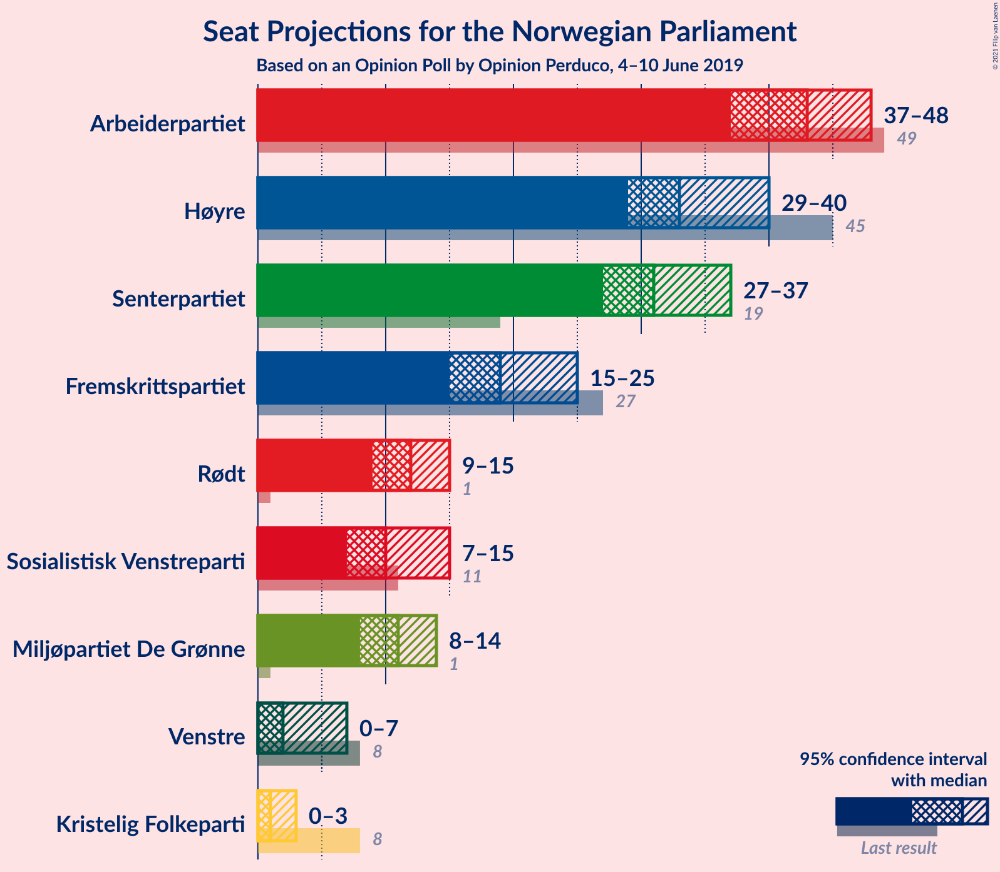
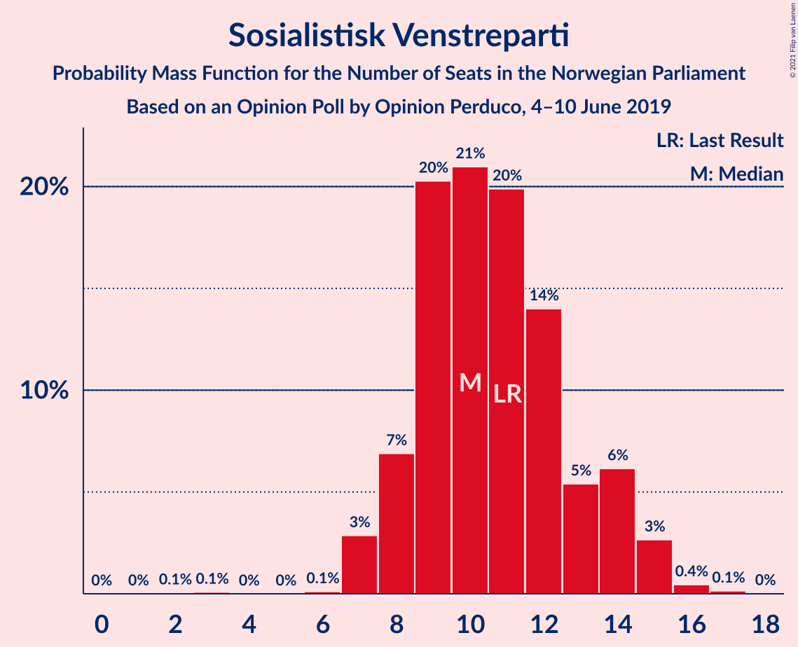
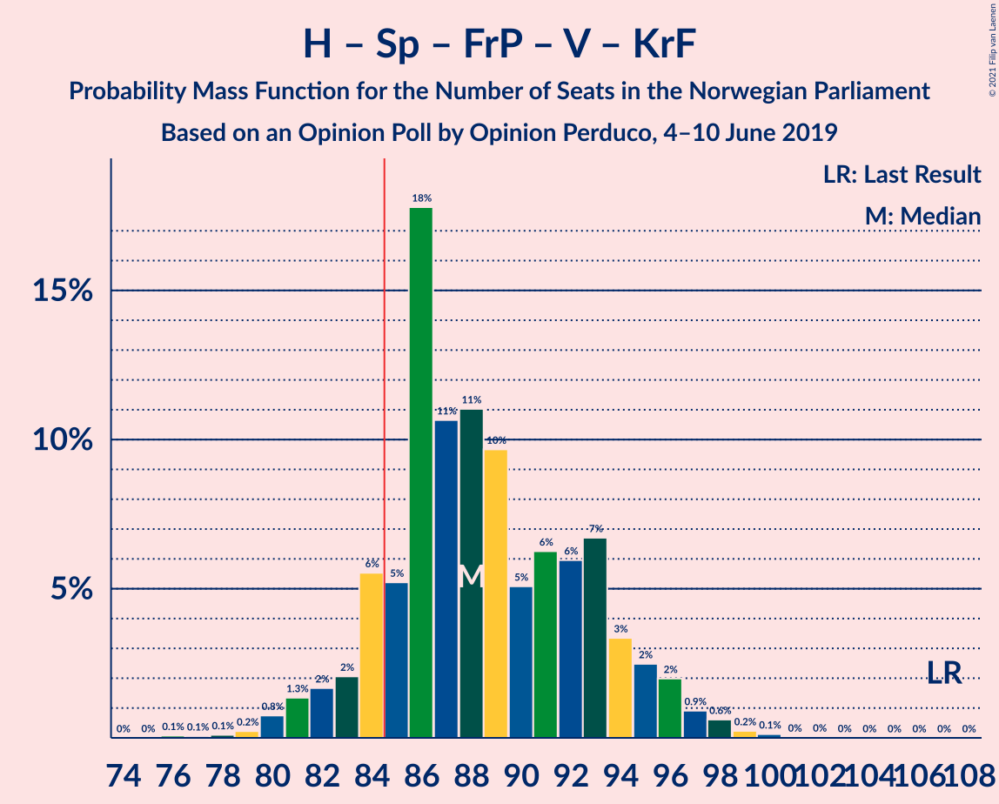
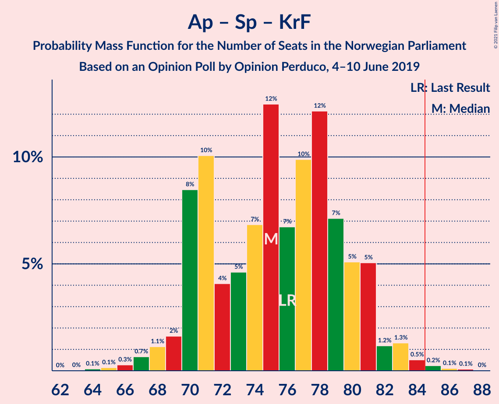
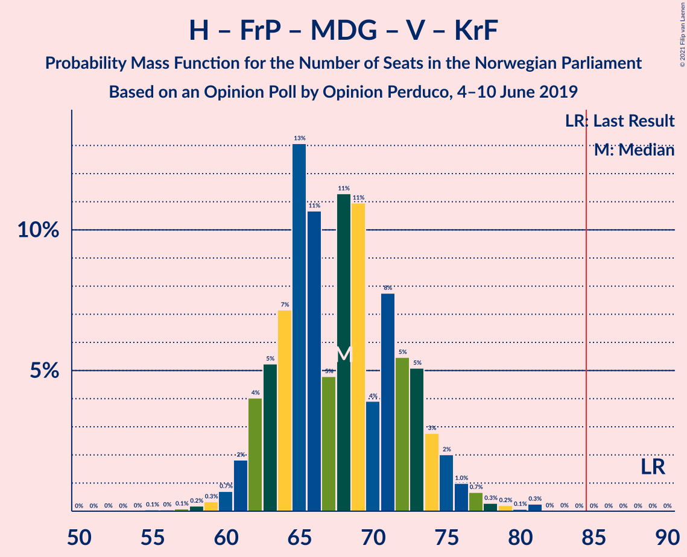
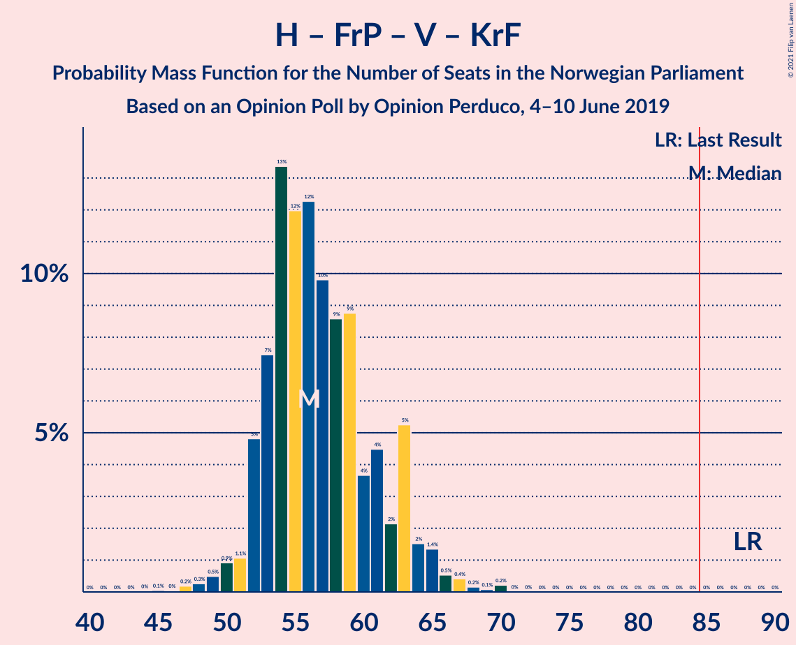
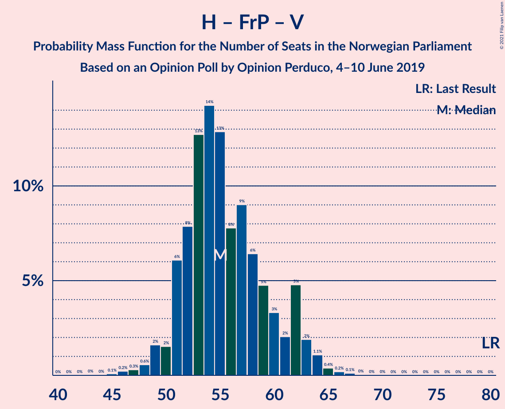
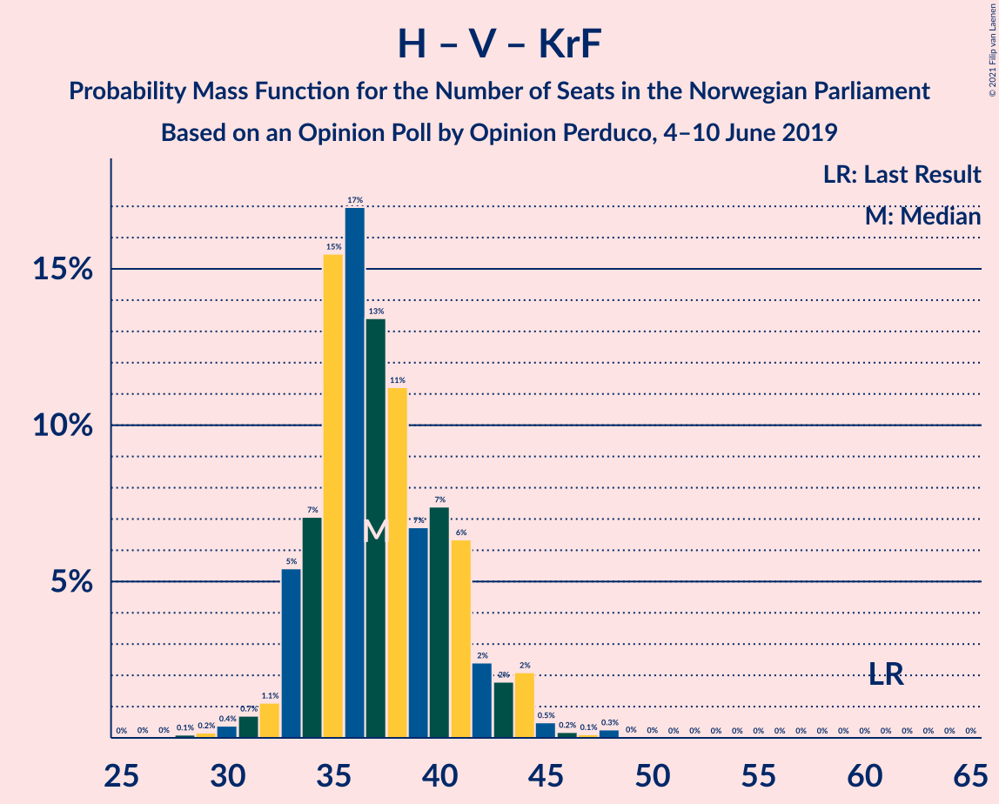
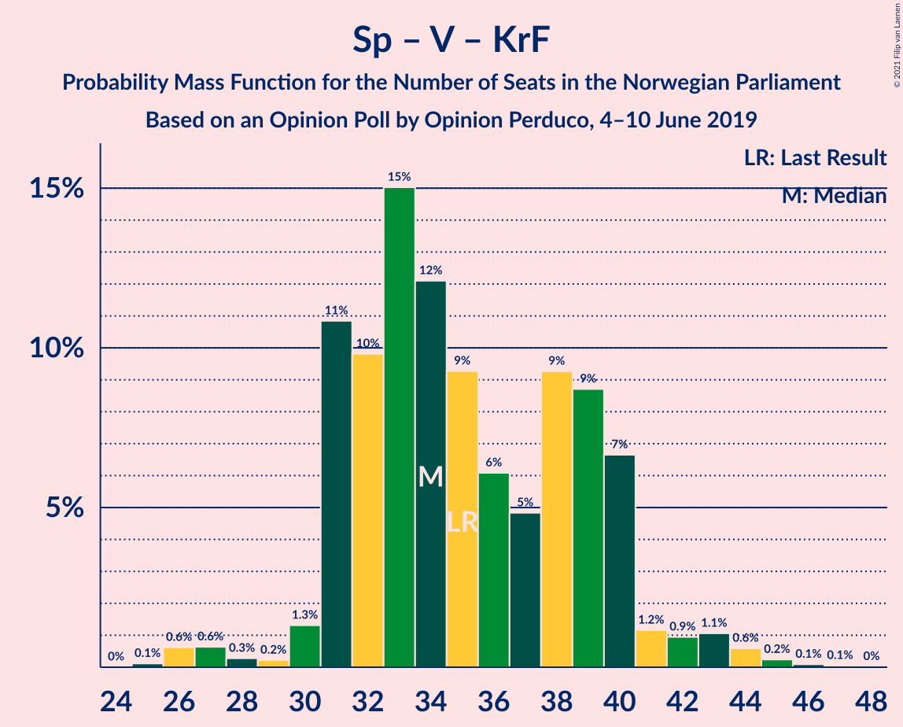

# Opinion Poll by Opinion Perduco, 4–10 June 2019

<a href="#voting-intentions">Voting Intentions</a> | <a href="#seats">Seats</a> | <a href="#coalitions">Coalitions</a> | <a href="#technical-information">Technical Information</a>

## Voting Intentions

### Confidence Intervals

| Party | Last Result | Poll Result | 80% Confidence Interval | 90% Confidence Interval | 95% Confidence Interval | 99% Confidence Interval |
|:-----:|:-----------:|:-----------:|:-----------------------:|:-----------------------:|:-----------------------:|:-----------------------:|
| Arbeiderpartiet | 27.4% | 23.1% | 21.1–25.2% |20.6–25.8% |20.1–26.3% |19.2–27.4% |
| Høyre | 25.0% | 19.1% | 17.3–21.1% |16.8–21.7% |16.4–22.2% |15.5–23.2% |
| Senterpartiet | 10.3% | 16.8% | 15.1–18.8% |14.7–19.3% |14.3–19.8% |13.5–20.7% |
| Fremskrittspartiet | 15.2% | 11.5% | 10.0–13.1% |9.6–13.6% |9.3–14.0% |8.7–14.9% |
| Rødt | 2.4% | 7.1% | 6.0–8.5% |5.7–8.9% |5.4–9.2% |4.9–9.9% |
| Miljøpartiet De Grønne | 3.2% | 6.5% | 5.5–7.8% |5.2–8.2% |4.9–8.6% |4.5–9.3% |
| Sosialistisk Venstreparti | 6.0% | 6.4% | 5.3–7.7% |5.0–8.1% |4.8–8.4% |4.3–9.1% |
| Venstre | 4.4% | 2.8% | 2.2–3.8% |2.0–4.1% |1.8–4.3% |1.6–4.8% |
| Kristelig Folkeparti | 4.2% | 2.5% | 1.9–3.5% |1.8–3.7% |1.6–4.0% |1.4–4.5% |

*Note:* The poll result column reflects the actual value used in the calculations. Published results may vary slightly, and in addition be rounded to fewer digits.

## Seats

### Confidence Intervals

| Party | Last Result | Median | 80% Confidence Interval | 90% Confidence Interval | 95% Confidence Interval | 99% Confidence Interval |
|:-----:|:-----------:|:------:|:-----------------------:|:-----------------------:|:-----------------------:|:-----------------------:|
| <a href="#arbeiderpartiet">Arbeiderpartiet</a> | 49 | 43 | 38–45 |38–48 |37–48 |36–54 |
| <a href="#høyre">Høyre</a> | 45 | 34 | 31–37 |30–39 |30–41 |27–41 |
| <a href="#senterpartiet">Senterpartiet</a> | 19 | 32 | 28–36 |27–36 |27–37 |24–41 |
| <a href="#fremskrittspartiet">Fremskrittspartiet</a> | 27 | 18 | 16–24 |15–24 |14–25 |13–26 |
| <a href="#rødt">Rødt</a> | 1 | 11 | 9–15 |9–15 |9–15 |8–17 |
| <a href="#miljøpartiet-de-grønne">Miljøpartiet De Grønne</a> | 1 | 11 | 9–13 |8–13 |7–14 |7–16 |
| <a href="#sosialistisk-venstreparti">Sosialistisk Venstreparti</a> | 11 | 10 | 8–13 |7–14 |7–14 |7–15 |
| <a href="#venstre">Venstre</a> | 8 | 2 | 1–2 |1–6 |1–7 |0–7 |
| <a href="#kristelig-folkeparti">Kristelig Folkeparti</a> | 8 | 1 | 0–3 |0–3 |0–7 |0–7 |

### Arbeiderpartiet

*For a full overview of the results for this party, see the [Arbeiderpartiet](party-arbeiderpartiet.html) page.*

| Number of Seats | Probability | Accumulated | Special Marks |
|:---------------:|:-----------:|:-----------:|:-------------:|
| 33 | 0% | 100% |  |
| 34 | 0.1% | 99.9% |  |
| 35 | 0.3% | 99.9% |  |
| 36 | 0.9% | 99.6% |  |
| 37 | 1.4% | 98.7% |  |
| 38 | 10% | 97% |  |
| 39 | 5% | 88% |  |
| 40 | 12% | 82% |  |
| 41 | 8% | 70% |  |
| 42 | 8% | 63% |  |
| 43 | 14% | 54% | Median |
| 44 | 14% | 40% |  |
| 45 | 17% | 26% |  |
| 46 | 2% | 9% |  |
| 47 | 2% | 7% |  |
| 48 | 4% | 5% |  |
| 49 | 0.3% | 1.3% | Last Result |
| 50 | 0.2% | 1.0% |  |
| 51 | 0.2% | 0.8% |  |
| 52 | 0.1% | 0.7% |  |
| 53 | 0% | 0.6% |  |
| 54 | 0.6% | 0.6% |  |
| 55 | 0% | 0% |  |

### Høyre

*For a full overview of the results for this party, see the [Høyre](party-høyre.html) page.*

| Number of Seats | Probability | Accumulated | Special Marks |
|:---------------:|:-----------:|:-----------:|:-------------:|
| 25 | 0.1% | 100% |  |
| 26 | 0.2% | 99.9% |  |
| 27 | 0.4% | 99.7% |  |
| 28 | 0.5% | 99.3% |  |
| 29 | 1.3% | 98.8% |  |
| 30 | 4% | 98% |  |
| 31 | 5% | 93% |  |
| 32 | 7% | 88% |  |
| 33 | 28% | 81% |  |
| 34 | 20% | 53% | Median |
| 35 | 13% | 33% |  |
| 36 | 7% | 20% |  |
| 37 | 5% | 13% |  |
| 38 | 1.2% | 8% |  |
| 39 | 3% | 7% |  |
| 40 | 0.2% | 3% |  |
| 41 | 3% | 3% |  |
| 42 | 0.2% | 0.4% |  |
| 43 | 0.1% | 0.2% |  |
| 44 | 0% | 0% |  |
| 45 | 0% | 0% | Last Result |

### Senterpartiet

*For a full overview of the results for this party, see the [Senterpartiet](party-senterpartiet.html) page.*

| Number of Seats | Probability | Accumulated | Special Marks |
|:---------------:|:-----------:|:-----------:|:-------------:|
| 19 | 0% | 100% | Last Result |
| 20 | 0% | 100% |  |
| 21 | 0% | 100% |  |
| 22 | 0% | 99.9% |  |
| 23 | 0.2% | 99.9% |  |
| 24 | 1.1% | 99.7% |  |
| 25 | 0.4% | 98.6% |  |
| 26 | 0.3% | 98% |  |
| 27 | 5% | 98% |  |
| 28 | 6% | 93% |  |
| 29 | 9% | 87% |  |
| 30 | 15% | 79% |  |
| 31 | 12% | 63% |  |
| 32 | 7% | 52% | Median |
| 33 | 11% | 44% |  |
| 34 | 4% | 33% |  |
| 35 | 9% | 29% |  |
| 36 | 16% | 20% |  |
| 37 | 2% | 4% |  |
| 38 | 0.3% | 1.2% |  |
| 39 | 0.1% | 0.9% |  |
| 40 | 0.2% | 0.8% |  |
| 41 | 0.6% | 0.6% |  |
| 42 | 0% | 0% |  |

### Fremskrittspartiet

*For a full overview of the results for this party, see the [Fremskrittspartiet](party-fremskrittspartiet.html) page.*

| Number of Seats | Probability | Accumulated | Special Marks |
|:---------------:|:-----------:|:-----------:|:-------------:|
| 13 | 0.7% | 100% |  |
| 14 | 3% | 99.3% |  |
| 15 | 3% | 96% |  |
| 16 | 3% | 93% |  |
| 17 | 16% | 90% |  |
| 18 | 26% | 74% | Median |
| 19 | 8% | 48% |  |
| 20 | 16% | 40% |  |
| 21 | 7% | 24% |  |
| 22 | 4% | 16% |  |
| 23 | 2% | 13% |  |
| 24 | 8% | 11% |  |
| 25 | 2% | 3% |  |
| 26 | 0.7% | 0.9% |  |
| 27 | 0.2% | 0.2% | Last Result |
| 28 | 0.1% | 0.1% |  |
| 29 | 0% | 0% |  |

### Rødt

*For a full overview of the results for this party, see the [Rødt](party-rødt.html) page.*

| Number of Seats | Probability | Accumulated | Special Marks |
|:---------------:|:-----------:|:-----------:|:-------------:|
| 1 | 0% | 100% | Last Result |
| 2 | 0% | 100% |  |
| 3 | 0% | 100% |  |
| 4 | 0% | 100% |  |
| 5 | 0% | 100% |  |
| 6 | 0% | 100% |  |
| 7 | 0.2% | 100% |  |
| 8 | 1.4% | 99.8% |  |
| 9 | 15% | 98% |  |
| 10 | 14% | 83% |  |
| 11 | 22% | 69% | Median |
| 12 | 11% | 46% |  |
| 13 | 19% | 35% |  |
| 14 | 6% | 16% |  |
| 15 | 9% | 10% |  |
| 16 | 0.5% | 1.1% |  |
| 17 | 0.4% | 0.5% |  |
| 18 | 0.1% | 0.2% |  |
| 19 | 0% | 0% |  |

### Miljøpartiet De Grønne

*For a full overview of the results for this party, see the [Miljøpartiet De Grønne](party-miljøpartietdegrønne.html) page.*

| Number of Seats | Probability | Accumulated | Special Marks |
|:---------------:|:-----------:|:-----------:|:-------------:|
| 1 | 0% | 100% | Last Result |
| 2 | 0% | 100% |  |
| 3 | 0% | 100% |  |
| 4 | 0% | 100% |  |
| 5 | 0% | 100% |  |
| 6 | 0% | 100% |  |
| 7 | 3% | 99.9% |  |
| 8 | 4% | 97% |  |
| 9 | 13% | 93% |  |
| 10 | 26% | 80% |  |
| 11 | 14% | 54% | Median |
| 12 | 23% | 39% |  |
| 13 | 13% | 17% |  |
| 14 | 1.0% | 3% |  |
| 15 | 0.6% | 2% |  |
| 16 | 2% | 2% |  |
| 17 | 0% | 0% |  |

### Sosialistisk Venstreparti

*For a full overview of the results for this party, see the [Sosialistisk Venstreparti](party-sosialistiskvenstreparti.html) page.*

| Number of Seats | Probability | Accumulated | Special Marks |
|:---------------:|:-----------:|:-----------:|:-------------:|
| 2 | 0.1% | 100% |  |
| 3 | 0.1% | 99.9% |  |
| 4 | 0% | 99.9% |  |
| 5 | 0% | 99.9% |  |
| 6 | 0% | 99.9% |  |
| 7 | 8% | 99.8% |  |
| 8 | 4% | 91% |  |
| 9 | 30% | 87% |  |
| 10 | 8% | 58% | Median |
| 11 | 20% | 50% | Last Result |
| 12 | 13% | 30% |  |
| 13 | 9% | 17% |  |
| 14 | 7% | 8% |  |
| 15 | 1.2% | 1.4% |  |
| 16 | 0.2% | 0.2% |  |
| 17 | 0.1% | 0.1% |  |
| 18 | 0% | 0% |  |

### Venstre

*For a full overview of the results for this party, see the [Venstre](party-venstre.html) page.*

| Number of Seats | Probability | Accumulated | Special Marks |
|:---------------:|:-----------:|:-----------:|:-------------:|
| 0 | 0.9% | 100% |  |
| 1 | 22% | 99.1% |  |
| 2 | 69% | 77% | Median |
| 3 | 0.8% | 8% |  |
| 4 | 0% | 7% |  |
| 5 | 0% | 7% |  |
| 6 | 3% | 7% |  |
| 7 | 4% | 4% |  |
| 8 | 0.2% | 0.3% | Last Result |
| 9 | 0.1% | 0.1% |  |
| 10 | 0% | 0% |  |

### Kristelig Folkeparti

*For a full overview of the results for this party, see the [Kristelig Folkeparti](party-kristeligfolkeparti.html) page.*

| Number of Seats | Probability | Accumulated | Special Marks |
|:---------------:|:-----------:|:-----------:|:-------------:|
| 0 | 16% | 100% |  |
| 1 | 63% | 84% | Median |
| 2 | 5% | 21% |  |
| 3 | 13% | 17% |  |
| 4 | 0% | 4% |  |
| 5 | 0% | 4% |  |
| 6 | 0.6% | 4% |  |
| 7 | 3% | 3% |  |
| 8 | 0.1% | 0.1% | Last Result |
| 9 | 0% | 0% |  |

## Coalitions

### Confidence Intervals

| Coalition | Last Result | Median | Majority? | 80% Confidence Interval | 90% Confidence Interval | 95% Confidence Interval | 99% Confidence Interval |
|:---------:|:-----------:|:------:|:---------:|:-----------------------:|:-----------------------:|:-----------------------:|:-----------------------:|
| Arbeiderpartiet – Senterpartiet – Rødt – Miljøpartiet De Grønne – Sosialistisk Venstreparti | 81 | 107 | 100% | 103–113 | 101–113 | 99–116 | 96–117 |
| Arbeiderpartiet – Senterpartiet – Miljøpartiet De Grønne – Sosialistisk Venstreparti – Kristelig Folkeparti | 88 | 98 | 99.9% | 93–102 | 91–103 | 90–105 | 87–106 |
| Arbeiderpartiet – Senterpartiet – Rødt – Sosialistisk Venstreparti | 80 | 96 | 99.8% | 92–101 | 91–102 | 88–104 | 87–107 |
| Arbeiderpartiet – Senterpartiet – Miljøpartiet De Grønne – Sosialistisk Venstreparti | 80 | 96 | 99.7% | 91–100 | 89–103 | 87–103 | 86–105 |
| Høyre – Senterpartiet – Fremskrittspartiet – Venstre – Kristelig Folkeparti | 107 | 88 | 86% | 84–94 | 83–97 | 82–97 | 80–99 |
| Arbeiderpartiet – Senterpartiet – Miljøpartiet De Grønne – Kristelig Folkeparti | 77 | 86 | 72% | 83–92 | 82–92 | 80–94 | 76–95 |
| Arbeiderpartiet – Senterpartiet – Sosialistisk Venstreparti | 79 | 85 | 60% | 81–90 | 79–91 | 76–91 | 75–93 |
| Arbeiderpartiet – Senterpartiet – Kristelig Folkeparti | 76 | 75 | 0.6% | 71–80 | 70–83 | 69–83 | 66–85 |
| Arbeiderpartiet – Senterpartiet | 68 | 74 | 0% | 70–79 | 69–80 | 65–80 | 64–82 |
| Høyre – Fremskrittspartiet – Miljøpartiet De Grønne – Venstre – Kristelig Folkeparti | 89 | 67 | 0% | 62–72 | 62–75 | 60–76 | 59–81 |
| Høyre – Fremskrittspartiet – Venstre – Kristelig Folkeparti | 88 | 56 | 0% | 53–62 | 52–64 | 51–65 | 47–70 |
| Høyre – Fremskrittspartiet – Venstre | 80 | 54 | 0% | 52–60 | 50–63 | 50–63 | 47–64 |
| Høyre – Fremskrittspartiet | 72 | 53 | 0% | 50–58 | 48–61 | 48–61 | 45–62 |
| Arbeiderpartiet – Sosialistisk Venstreparti | 60 | 52 | 0% | 48–58 | 47–59 | 47–59 | 45–64 |
| Høyre – Venstre – Kristelig Folkeparti | 61 | 37 | 0% | 34–42 | 33–44 | 32–44 | 30–48 |
| Senterpartiet – Venstre – Kristelig Folkeparti | 35 | 36 | 0% | 31–40 | 31–42 | 30–43 | 26–44 |

### Arbeiderpartiet – Senterpartiet – Rødt – Miljøpartiet De Grønne – Sosialistisk Venstreparti

| Number of Seats | Probability | Accumulated | Special Marks |
|:---------------:|:-----------:|:-----------:|:-------------:|
| 81 | 0% | 100% | Last Result |
| 82 | 0% | 100% |  |
| 83 | 0% | 100% |  |
| 84 | 0% | 100% |  |
| 85 | 0% | 100% | Majority |
| 86 | 0% | 100% |  |
| 87 | 0% | 100% |  |
| 88 | 0% | 100% |  |
| 89 | 0% | 100% |  |
| 90 | 0% | 100% |  |
| 91 | 0% | 100% |  |
| 92 | 0% | 100% |  |
| 93 | 0% | 100% |  |
| 94 | 0.1% | 99.9% |  |
| 95 | 0.1% | 99.9% |  |
| 96 | 0.4% | 99.8% |  |
| 97 | 0.2% | 99.4% |  |
| 98 | 0.4% | 99.2% |  |
| 99 | 2% | 98.8% |  |
| 100 | 1.2% | 96% |  |
| 101 | 0.4% | 95% |  |
| 102 | 2% | 95% |  |
| 103 | 3% | 93% |  |
| 104 | 12% | 90% |  |
| 105 | 13% | 78% |  |
| 106 | 10% | 65% |  |
| 107 | 9% | 55% | Median |
| 108 | 14% | 46% |  |
| 109 | 6% | 32% |  |
| 110 | 3% | 26% |  |
| 111 | 8% | 23% |  |
| 112 | 2% | 15% |  |
| 113 | 8% | 13% |  |
| 114 | 0.7% | 5% |  |
| 115 | 0.5% | 4% |  |
| 116 | 3% | 4% |  |
| 117 | 0.2% | 0.7% |  |
| 118 | 0.4% | 0.5% |  |
| 119 | 0% | 0% |  |

### Arbeiderpartiet – Senterpartiet – Miljøpartiet De Grønne – Sosialistisk Venstreparti – Kristelig Folkeparti

| Number of Seats | Probability | Accumulated | Special Marks |
|:---------------:|:-----------:|:-----------:|:-------------:|
| 82 | 0.1% | 100% |  |
| 83 | 0% | 99.9% |  |
| 84 | 0.1% | 99.9% |  |
| 85 | 0% | 99.9% | Majority |
| 86 | 0.3% | 99.8% |  |
| 87 | 0.4% | 99.6% |  |
| 88 | 0.2% | 99.2% | Last Result |
| 89 | 0.7% | 99.0% |  |
| 90 | 1.3% | 98% |  |
| 91 | 4% | 97% |  |
| 92 | 2% | 93% |  |
| 93 | 7% | 91% |  |
| 94 | 9% | 84% |  |
| 95 | 12% | 75% |  |
| 96 | 7% | 63% |  |
| 97 | 5% | 56% | Median |
| 98 | 16% | 52% |  |
| 99 | 15% | 35% |  |
| 100 | 2% | 21% |  |
| 101 | 7% | 19% |  |
| 102 | 5% | 12% |  |
| 103 | 4% | 7% |  |
| 104 | 0.3% | 3% |  |
| 105 | 0.8% | 3% |  |
| 106 | 2% | 2% |  |
| 107 | 0.3% | 0.4% |  |
| 108 | 0.1% | 0.1% |  |
| 109 | 0% | 0% |  |

### Arbeiderpartiet – Senterpartiet – Rødt – Sosialistisk Venstreparti

| Number of Seats | Probability | Accumulated | Special Marks |
|:---------------:|:-----------:|:-----------:|:-------------:|
| 80 | 0% | 100% | Last Result |
| 81 | 0% | 100% |  |
| 82 | 0.1% | 100% |  |
| 83 | 0% | 99.9% |  |
| 84 | 0% | 99.9% |  |
| 85 | 0.1% | 99.8% | Majority |
| 86 | 0.2% | 99.7% |  |
| 87 | 0.4% | 99.5% |  |
| 88 | 2% | 99.1% |  |
| 89 | 0.7% | 97% |  |
| 90 | 0.5% | 96% |  |
| 91 | 5% | 96% |  |
| 92 | 5% | 90% |  |
| 93 | 2% | 85% |  |
| 94 | 15% | 84% |  |
| 95 | 3% | 69% |  |
| 96 | 20% | 65% | Median |
| 97 | 10% | 46% |  |
| 98 | 11% | 36% |  |
| 99 | 1.0% | 25% |  |
| 100 | 5% | 24% |  |
| 101 | 12% | 19% |  |
| 102 | 1.5% | 6% |  |
| 103 | 0.8% | 5% |  |
| 104 | 3% | 4% |  |
| 105 | 0.3% | 1.0% |  |
| 106 | 0% | 0.6% |  |
| 107 | 0.5% | 0.6% |  |
| 108 | 0% | 0.1% |  |
| 109 | 0.1% | 0.1% |  |
| 110 | 0% | 0% |  |

### Arbeiderpartiet – Senterpartiet – Miljøpartiet De Grønne – Sosialistisk Venstreparti

| Number of Seats | Probability | Accumulated | Special Marks |
|:---------------:|:-----------:|:-----------:|:-------------:|
| 80 | 0% | 100% | Last Result |
| 81 | 0.1% | 100% |  |
| 82 | 0% | 99.9% |  |
| 83 | 0% | 99.9% |  |
| 84 | 0.1% | 99.9% |  |
| 85 | 0.1% | 99.7% | Majority |
| 86 | 0.5% | 99.6% |  |
| 87 | 2% | 99.1% |  |
| 88 | 0.7% | 97% |  |
| 89 | 1.5% | 96% |  |
| 90 | 4% | 95% |  |
| 91 | 1.5% | 91% |  |
| 92 | 6% | 90% |  |
| 93 | 12% | 84% |  |
| 94 | 10% | 72% |  |
| 95 | 10% | 62% |  |
| 96 | 4% | 52% | Median |
| 97 | 14% | 48% |  |
| 98 | 14% | 33% |  |
| 99 | 4% | 19% |  |
| 100 | 6% | 15% |  |
| 101 | 3% | 9% |  |
| 102 | 0.3% | 6% |  |
| 103 | 4% | 6% |  |
| 104 | 0.8% | 1.4% |  |
| 105 | 0.3% | 0.6% |  |
| 106 | 0.2% | 0.3% |  |
| 107 | 0% | 0% |  |

### Høyre – Senterpartiet – Fremskrittspartiet – Venstre – Kristelig Folkeparti

| Number of Seats | Probability | Accumulated | Special Marks |
|:---------------:|:-----------:|:-----------:|:-------------:|
| 76 | 0% | 100% |  |
| 77 | 0.1% | 99.9% |  |
| 78 | 0.1% | 99.8% |  |
| 79 | 0.1% | 99.7% |  |
| 80 | 2% | 99.6% |  |
| 81 | 0.2% | 98% |  |
| 82 | 1.4% | 98% |  |
| 83 | 3% | 97% |  |
| 84 | 7% | 94% |  |
| 85 | 5% | 86% | Majority |
| 86 | 8% | 82% |  |
| 87 | 21% | 74% | Median |
| 88 | 11% | 52% |  |
| 89 | 5% | 41% |  |
| 90 | 4% | 36% |  |
| 91 | 15% | 32% |  |
| 92 | 1.4% | 17% |  |
| 93 | 4% | 16% |  |
| 94 | 6% | 12% |  |
| 95 | 0.7% | 6% |  |
| 96 | 0.4% | 5% |  |
| 97 | 3% | 5% |  |
| 98 | 2% | 2% |  |
| 99 | 0.2% | 0.7% |  |
| 100 | 0.4% | 0.5% |  |
| 101 | 0% | 0% |  |
| 102 | 0% | 0% |  |
| 103 | 0% | 0% |  |
| 104 | 0% | 0% |  |
| 105 | 0% | 0% |  |
| 106 | 0% | 0% |  |
| 107 | 0% | 0% | Last Result |

### Arbeiderpartiet – Senterpartiet – Miljøpartiet De Grønne – Kristelig Folkeparti

| Number of Seats | Probability | Accumulated | Special Marks |
|:---------------:|:-----------:|:-----------:|:-------------:|
| 75 | 0.2% | 100% |  |
| 76 | 0.3% | 99.7% |  |
| 77 | 0.3% | 99.4% | Last Result |
| 78 | 0.6% | 99.1% |  |
| 79 | 0.2% | 98.5% |  |
| 80 | 0.9% | 98% |  |
| 81 | 0.3% | 97% |  |
| 82 | 7% | 97% |  |
| 83 | 5% | 90% |  |
| 84 | 14% | 86% |  |
| 85 | 16% | 72% | Majority |
| 86 | 15% | 56% |  |
| 87 | 7% | 41% | Median |
| 88 | 2% | 34% |  |
| 89 | 3% | 32% |  |
| 90 | 10% | 29% |  |
| 91 | 9% | 20% |  |
| 92 | 8% | 11% |  |
| 93 | 0.5% | 3% |  |
| 94 | 2% | 3% |  |
| 95 | 0.4% | 0.6% |  |
| 96 | 0.1% | 0.2% |  |
| 97 | 0% | 0.1% |  |
| 98 | 0% | 0.1% |  |
| 99 | 0% | 0% |  |

### Arbeiderpartiet – Senterpartiet – Sosialistisk Venstreparti

| Number of Seats | Probability | Accumulated | Special Marks |
|:---------------:|:-----------:|:-----------:|:-------------:|
| 69 | 0.1% | 100% |  |
| 70 | 0% | 99.9% |  |
| 71 | 0% | 99.9% |  |
| 72 | 0% | 99.9% |  |
| 73 | 0.1% | 99.9% |  |
| 74 | 0.1% | 99.9% |  |
| 75 | 0.6% | 99.7% |  |
| 76 | 2% | 99.2% |  |
| 77 | 0.9% | 97% |  |
| 78 | 0.8% | 96% |  |
| 79 | 3% | 96% | Last Result |
| 80 | 2% | 92% |  |
| 81 | 10% | 91% |  |
| 82 | 5% | 81% |  |
| 83 | 9% | 75% |  |
| 84 | 6% | 66% |  |
| 85 | 14% | 60% | Median, Majority |
| 86 | 15% | 46% |  |
| 87 | 8% | 31% |  |
| 88 | 11% | 23% |  |
| 89 | 0.5% | 12% |  |
| 90 | 5% | 11% |  |
| 91 | 4% | 6% |  |
| 92 | 0.9% | 2% |  |
| 93 | 1.1% | 2% |  |
| 94 | 0.2% | 0.4% |  |
| 95 | 0.1% | 0.2% |  |
| 96 | 0.1% | 0.1% |  |
| 97 | 0% | 0% |  |

### Arbeiderpartiet – Senterpartiet – Kristelig Folkeparti

| Number of Seats | Probability | Accumulated | Special Marks |
|:---------------:|:-----------:|:-----------:|:-------------:|
| 64 | 0.1% | 100% |  |
| 65 | 0.3% | 99.9% |  |
| 66 | 0.1% | 99.6% |  |
| 67 | 0.5% | 99.5% |  |
| 68 | 0.8% | 99.0% |  |
| 69 | 1.0% | 98% |  |
| 70 | 4% | 97% |  |
| 71 | 4% | 93% |  |
| 72 | 8% | 89% |  |
| 73 | 6% | 81% |  |
| 74 | 15% | 76% |  |
| 75 | 13% | 60% |  |
| 76 | 5% | 47% | Last Result, Median |
| 77 | 12% | 42% |  |
| 78 | 2% | 30% |  |
| 79 | 9% | 29% |  |
| 80 | 11% | 20% |  |
| 81 | 3% | 9% |  |
| 82 | 0.4% | 6% |  |
| 83 | 4% | 5% |  |
| 84 | 0.8% | 1.4% |  |
| 85 | 0.5% | 0.6% | Majority |
| 86 | 0.1% | 0.1% |  |
| 87 | 0% | 0% |  |

### Arbeiderpartiet – Senterpartiet

| Number of Seats | Probability | Accumulated | Special Marks |
|:---------------:|:-----------:|:-----------:|:-------------:|
| 62 | 0% | 100% |  |
| 63 | 0.1% | 99.9% |  |
| 64 | 0.4% | 99.9% |  |
| 65 | 2% | 99.4% |  |
| 66 | 0.3% | 97% |  |
| 67 | 0.4% | 97% |  |
| 68 | 2% | 97% | Last Result |
| 69 | 2% | 95% |  |
| 70 | 6% | 93% |  |
| 71 | 6% | 87% |  |
| 72 | 10% | 81% |  |
| 73 | 14% | 71% |  |
| 74 | 11% | 57% |  |
| 75 | 8% | 47% | Median |
| 76 | 10% | 39% |  |
| 77 | 2% | 28% |  |
| 78 | 10% | 26% |  |
| 79 | 7% | 16% |  |
| 80 | 7% | 9% |  |
| 81 | 0.2% | 2% |  |
| 82 | 1.4% | 2% |  |
| 83 | 0.4% | 0.5% |  |
| 84 | 0.1% | 0.1% |  |
| 85 | 0% | 0% | Majority |

### Høyre – Fremskrittspartiet – Miljøpartiet De Grønne – Venstre – Kristelig Folkeparti

| Number of Seats | Probability | Accumulated | Special Marks |
|:---------------:|:-----------:|:-----------:|:-------------:|
| 55 | 0% | 100% |  |
| 56 | 0% | 99.9% |  |
| 57 | 0% | 99.9% |  |
| 58 | 0.4% | 99.9% |  |
| 59 | 0.1% | 99.5% |  |
| 60 | 2% | 99.4% |  |
| 61 | 1.0% | 97% |  |
| 62 | 7% | 96% |  |
| 63 | 3% | 89% |  |
| 64 | 9% | 87% |  |
| 65 | 16% | 78% |  |
| 66 | 10% | 62% | Median |
| 67 | 6% | 52% |  |
| 68 | 10% | 45% |  |
| 69 | 10% | 35% |  |
| 70 | 3% | 25% |  |
| 71 | 10% | 22% |  |
| 72 | 2% | 12% |  |
| 73 | 0.6% | 10% |  |
| 74 | 2% | 9% |  |
| 75 | 5% | 8% |  |
| 76 | 0.2% | 3% |  |
| 77 | 0.5% | 2% |  |
| 78 | 0.2% | 2% |  |
| 79 | 0.1% | 2% |  |
| 80 | 0.1% | 2% |  |
| 81 | 2% | 2% |  |
| 82 | 0% | 0% |  |
| 83 | 0% | 0% |  |
| 84 | 0% | 0% |  |
| 85 | 0% | 0% | Majority |
| 86 | 0% | 0% |  |
| 87 | 0% | 0% |  |
| 88 | 0% | 0% |  |
| 89 | 0% | 0% | Last Result |

### Høyre – Fremskrittspartiet – Venstre – Kristelig Folkeparti

| Number of Seats | Probability | Accumulated | Special Marks |
|:---------------:|:-----------:|:-----------:|:-------------:|
| 45 | 0.1% | 100% |  |
| 46 | 0.1% | 99.9% |  |
| 47 | 0.4% | 99.9% |  |
| 48 | 0.2% | 99.4% |  |
| 49 | 0.1% | 99.3% |  |
| 50 | 0.2% | 99.1% |  |
| 51 | 1.5% | 98.9% |  |
| 52 | 6% | 97% |  |
| 53 | 9% | 92% |  |
| 54 | 12% | 83% |  |
| 55 | 16% | 71% | Median |
| 56 | 17% | 55% |  |
| 57 | 5% | 38% |  |
| 58 | 10% | 33% |  |
| 59 | 8% | 22% |  |
| 60 | 1.3% | 15% |  |
| 61 | 3% | 13% |  |
| 62 | 2% | 10% |  |
| 63 | 2% | 8% |  |
| 64 | 3% | 7% |  |
| 65 | 1.1% | 3% |  |
| 66 | 0.4% | 2% |  |
| 67 | 0.1% | 2% |  |
| 68 | 0.1% | 2% |  |
| 69 | 0% | 2% |  |
| 70 | 2% | 2% |  |
| 71 | 0% | 0% |  |
| 72 | 0% | 0% |  |
| 73 | 0% | 0% |  |
| 74 | 0% | 0% |  |
| 75 | 0% | 0% |  |
| 76 | 0% | 0% |  |
| 77 | 0% | 0% |  |
| 78 | 0% | 0% |  |
| 79 | 0% | 0% |  |
| 80 | 0% | 0% |  |
| 81 | 0% | 0% |  |
| 82 | 0% | 0% |  |
| 83 | 0% | 0% |  |
| 84 | 0% | 0% |  |
| 85 | 0% | 0% | Majority |
| 86 | 0% | 0% |  |
| 87 | 0% | 0% |  |
| 88 | 0% | 0% | Last Result |

### Høyre – Fremskrittspartiet – Venstre

| Number of Seats | Probability | Accumulated | Special Marks |
|:---------------:|:-----------:|:-----------:|:-------------:|
| 44 | 0.1% | 100% |  |
| 45 | 0% | 99.9% |  |
| 46 | 0.3% | 99.9% |  |
| 47 | 0.2% | 99.6% |  |
| 48 | 0.3% | 99.4% |  |
| 49 | 0.4% | 99.1% |  |
| 50 | 5% | 98.7% |  |
| 51 | 4% | 94% |  |
| 52 | 8% | 90% |  |
| 53 | 15% | 82% |  |
| 54 | 19% | 67% | Median |
| 55 | 11% | 48% |  |
| 56 | 6% | 37% |  |
| 57 | 9% | 31% |  |
| 58 | 7% | 21% |  |
| 59 | 2% | 14% |  |
| 60 | 2% | 12% |  |
| 61 | 2% | 9% |  |
| 62 | 0.8% | 7% |  |
| 63 | 5% | 6% |  |
| 64 | 0.5% | 0.9% |  |
| 65 | 0.2% | 0.4% |  |
| 66 | 0.1% | 0.2% |  |
| 67 | 0% | 0.1% |  |
| 68 | 0% | 0.1% |  |
| 69 | 0% | 0% |  |
| 70 | 0% | 0% |  |
| 71 | 0% | 0% |  |
| 72 | 0% | 0% |  |
| 73 | 0% | 0% |  |
| 74 | 0% | 0% |  |
| 75 | 0% | 0% |  |
| 76 | 0% | 0% |  |
| 77 | 0% | 0% |  |
| 78 | 0% | 0% |  |
| 79 | 0% | 0% |  |
| 80 | 0% | 0% | Last Result |

### Høyre – Fremskrittspartiet

| Number of Seats | Probability | Accumulated | Special Marks |
|:---------------:|:-----------:|:-----------:|:-------------:|
| 42 | 0.1% | 100% |  |
| 43 | 0% | 99.9% |  |
| 44 | 0.3% | 99.9% |  |
| 45 | 0.3% | 99.6% |  |
| 46 | 0.4% | 99.4% |  |
| 47 | 0.2% | 98.9% |  |
| 48 | 5% | 98.7% |  |
| 49 | 4% | 94% |  |
| 50 | 6% | 90% |  |
| 51 | 19% | 84% |  |
| 52 | 12% | 66% | Median |
| 53 | 23% | 54% |  |
| 54 | 3% | 31% |  |
| 55 | 12% | 28% |  |
| 56 | 3% | 15% |  |
| 57 | 1.2% | 12% |  |
| 58 | 2% | 11% |  |
| 59 | 3% | 9% |  |
| 60 | 0.7% | 7% |  |
| 61 | 5% | 6% |  |
| 62 | 0.6% | 0.9% |  |
| 63 | 0.1% | 0.3% |  |
| 64 | 0.1% | 0.1% |  |
| 65 | 0% | 0.1% |  |
| 66 | 0% | 0% |  |
| 67 | 0% | 0% |  |
| 68 | 0% | 0% |  |
| 69 | 0% | 0% |  |
| 70 | 0% | 0% |  |
| 71 | 0% | 0% |  |
| 72 | 0% | 0% | Last Result |

### Arbeiderpartiet – Sosialistisk Venstreparti

| Number of Seats | Probability | Accumulated | Special Marks |
|:---------------:|:-----------:|:-----------:|:-------------:|
| 40 | 0.1% | 100% |  |
| 41 | 0% | 99.9% |  |
| 42 | 0% | 99.9% |  |
| 43 | 0.1% | 99.9% |  |
| 44 | 0.3% | 99.8% |  |
| 45 | 0.3% | 99.6% |  |
| 46 | 1.4% | 99.3% |  |
| 47 | 7% | 98% |  |
| 48 | 3% | 91% |  |
| 49 | 6% | 88% |  |
| 50 | 6% | 82% |  |
| 51 | 7% | 77% |  |
| 52 | 20% | 70% |  |
| 53 | 12% | 50% | Median |
| 54 | 10% | 38% |  |
| 55 | 5% | 28% |  |
| 56 | 5% | 24% |  |
| 57 | 7% | 19% |  |
| 58 | 6% | 12% |  |
| 59 | 5% | 6% |  |
| 60 | 0.3% | 1.3% | Last Result |
| 61 | 0.2% | 1.0% |  |
| 62 | 0.1% | 0.8% |  |
| 63 | 0.1% | 0.7% |  |
| 64 | 0.6% | 0.7% |  |
| 65 | 0% | 0% |  |

### Høyre – Venstre – Kristelig Folkeparti

| Number of Seats | Probability | Accumulated | Special Marks |
|:---------------:|:-----------:|:-----------:|:-------------:|
| 27 | 0% | 100% |  |
| 28 | 0% | 99.9% |  |
| 29 | 0% | 99.9% |  |
| 30 | 0.4% | 99.9% |  |
| 31 | 0.5% | 99.5% |  |
| 32 | 2% | 99.0% |  |
| 33 | 4% | 97% |  |
| 34 | 6% | 94% |  |
| 35 | 12% | 88% |  |
| 36 | 19% | 75% |  |
| 37 | 18% | 57% | Median |
| 38 | 10% | 39% |  |
| 39 | 11% | 29% |  |
| 40 | 1.3% | 18% |  |
| 41 | 5% | 17% |  |
| 42 | 6% | 12% |  |
| 43 | 0.6% | 7% |  |
| 44 | 4% | 6% |  |
| 45 | 0.5% | 2% |  |
| 46 | 0.2% | 2% |  |
| 47 | 0.1% | 2% |  |
| 48 | 2% | 2% |  |
| 49 | 0% | 0% |  |
| 50 | 0% | 0% |  |
| 51 | 0% | 0% |  |
| 52 | 0% | 0% |  |
| 53 | 0% | 0% |  |
| 54 | 0% | 0% |  |
| 55 | 0% | 0% |  |
| 56 | 0% | 0% |  |
| 57 | 0% | 0% |  |
| 58 | 0% | 0% |  |
| 59 | 0% | 0% |  |
| 60 | 0% | 0% |  |
| 61 | 0% | 0% | Last Result |

### Senterpartiet – Venstre – Kristelig Folkeparti

| Number of Seats | Probability | Accumulated | Special Marks |
|:---------------:|:-----------:|:-----------:|:-------------:|
| 25 | 0.1% | 100% |  |
| 26 | 1.1% | 99.9% |  |
| 27 | 0.4% | 98.8% |  |
| 28 | 0.2% | 98% |  |
| 29 | 0.3% | 98% |  |
| 30 | 1.2% | 98% |  |
| 31 | 9% | 97% |  |
| 32 | 7% | 88% |  |
| 33 | 11% | 80% |  |
| 34 | 13% | 69% |  |
| 35 | 5% | 57% | Last Result, Median |
| 36 | 13% | 52% |  |
| 37 | 10% | 39% |  |
| 38 | 14% | 29% |  |
| 39 | 5% | 15% |  |
| 40 | 2% | 10% |  |
| 41 | 3% | 9% |  |
| 42 | 2% | 5% |  |
| 43 | 1.0% | 3% |  |
| 44 | 2% | 2% |  |
| 45 | 0.1% | 0.2% |  |
| 46 | 0% | 0.1% |  |
| 47 | 0.1% | 0.1% |  |
| 48 | 0% | 0% |  |

## Technical Information

### Opinion Poll

+ **Polling firm:** Opinion Perduco
+ **Commissioner(s):** —
+ **Fieldwork period:** 4–10 June 2019

### Calculations

+ **Sample size:** 707
+ **Simulations done:** 131,072
+ **Error estimate:** 2.94%

