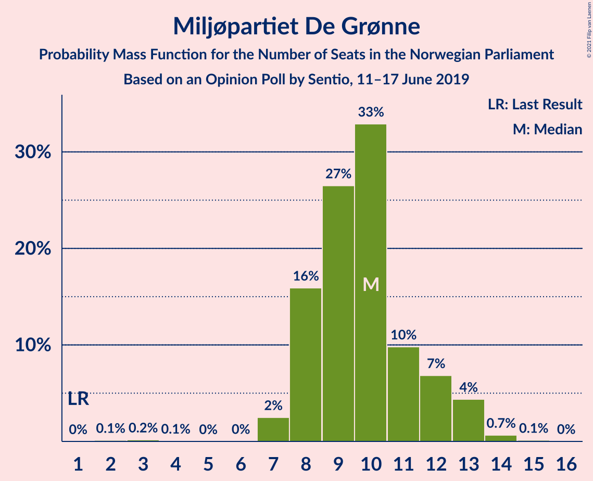
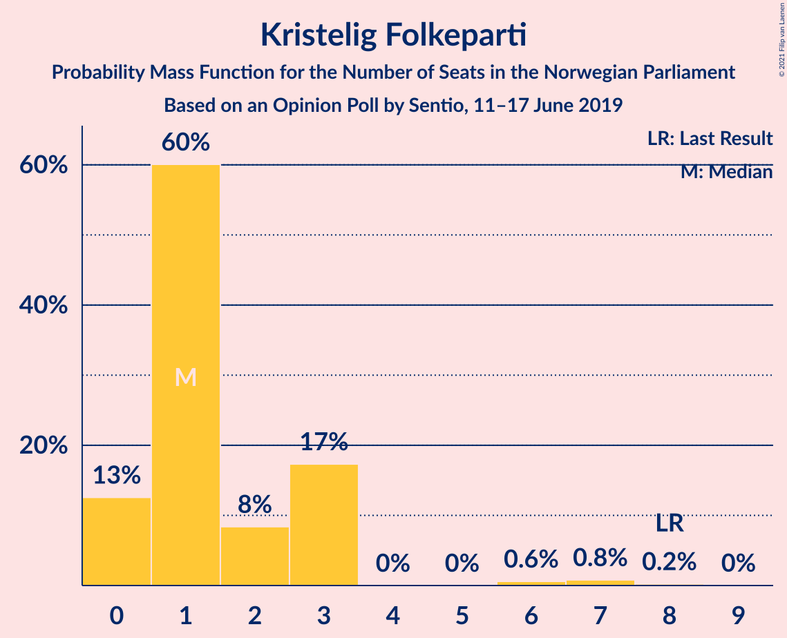
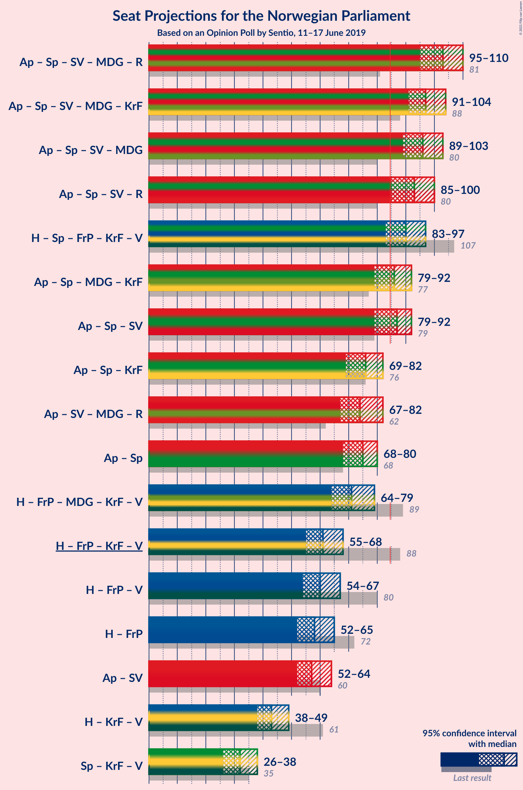
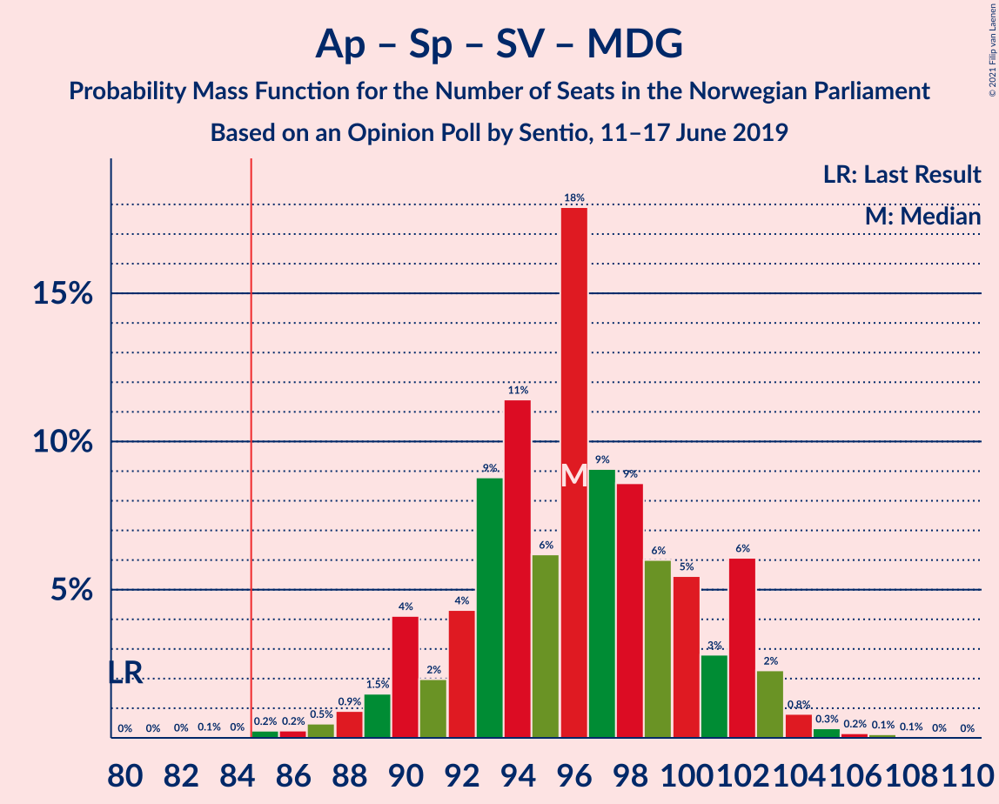
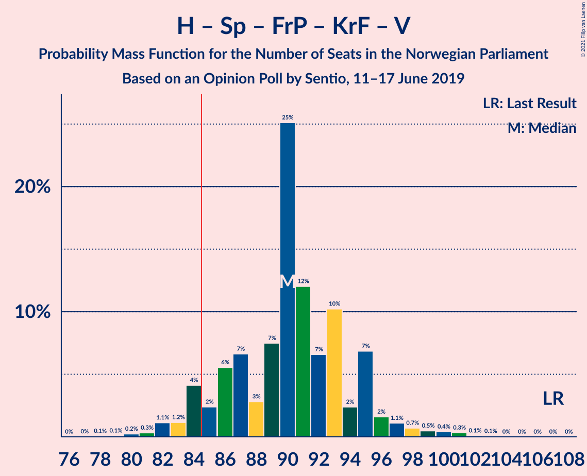
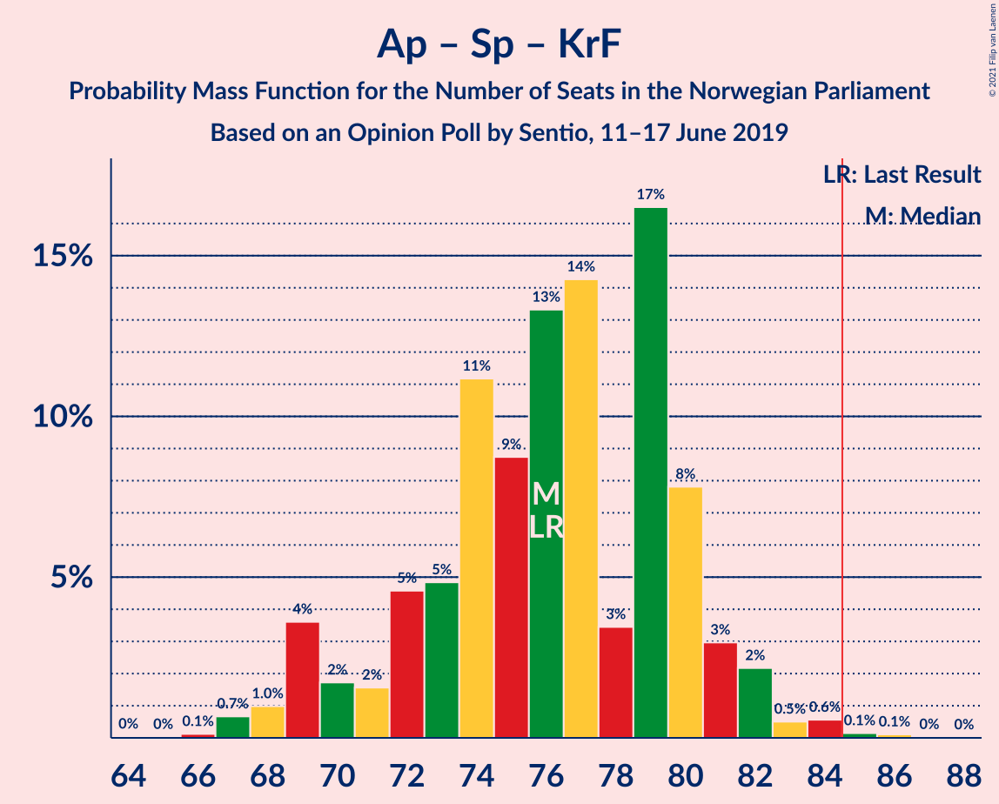
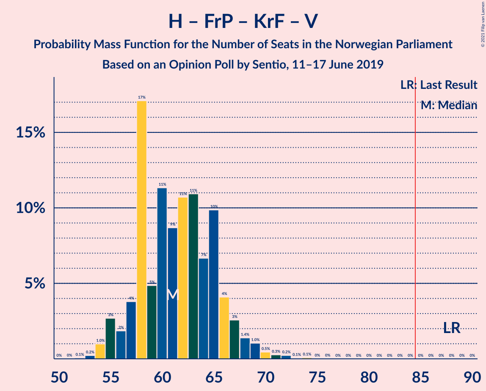
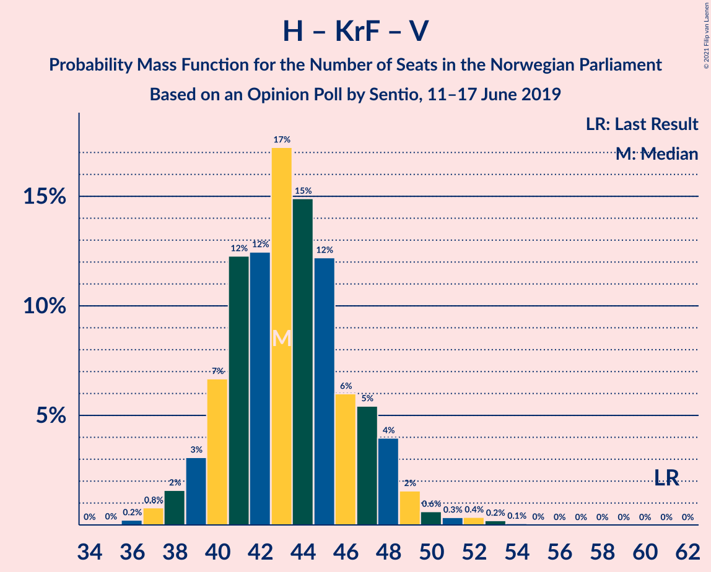

# Opinion Poll by Sentio, 11–17 June 2019

<a href="#voting-intentions">Voting Intentions</a> | <a href="#seats">Seats</a> | <a href="#coalitions">Coalitions</a> | <a href="#technical-information">Technical Information</a>

## Voting Intentions

### Confidence Intervals

| Party | Last Result | Poll Result | 80% Confidence Interval | 90% Confidence Interval | 95% Confidence Interval | 99% Confidence Interval |
|:-----:|:-----------:|:-----------:|:-----------------------:|:-----------------------:|:-----------------------:|:-----------------------:|
| Arbeiderpartiet | 27.4% | 25.2% | 23.5–27.0% |23.0–27.5% |22.6–28.0% |21.8–28.9% |
| Høyre | 25.0% | 22.7% | 21.1–24.5% |20.6–25.0% |20.2–25.4% |19.4–26.3% |
| Senterpartiet | 10.3% | 15.2% | 13.8–16.8% |13.4–17.2% |13.1–17.6% |12.5–18.3% |
| Fremskrittspartiet | 15.2% | 10.5% | 9.3–11.8% |9.0–12.2% |8.7–12.6% |8.2–13.2% |
| Sosialistisk Venstreparti | 6.0% | 6.8% | 5.9–7.9% |5.6–8.3% |5.4–8.5% |5.0–9.1% |
| Miljøpartiet De Grønne | 3.2% | 5.8% | 5.0–6.9% |4.7–7.2% |4.5–7.4% |4.1–8.0% |
| Rødt | 2.4% | 4.5% | 3.8–5.5% |3.6–5.7% |3.4–6.0% |3.0–6.5% |
| Kristelig Folkeparti | 4.2% | 2.7% | 2.1–3.5% |2.0–3.7% |1.9–3.9% |1.6–4.3% |
| Venstre | 4.4% | 2.5% | 2.0–3.3% |1.8–3.5% |1.7–3.7% |1.5–4.1% |

*Note:* The poll result column reflects the actual value used in the calculations. Published results may vary slightly, and in addition be rounded to fewer digits.

## Seats

### Confidence Intervals

| Party | Last Result | Median | 80% Confidence Interval | 90% Confidence Interval | 95% Confidence Interval | 99% Confidence Interval |
|:-----:|:-----------:|:------:|:-----------------------:|:-----------------------:|:-----------------------:|:-----------------------:|
| <a href="#arbeiderpartiet">Arbeiderpartiet</a> | 49 | 43 | 41–51 |41–52 |41–52 |41–55 |
| <a href="#høyre">Høyre</a> | 45 | 40 | 37–43 |36–45 |35–46 |35–47 |
| <a href="#senterpartiet">Senterpartiet</a> | 19 | 28 | 25–32 |24–33 |23–34 |22–35 |
| <a href="#fremskrittspartiet">Fremskrittspartiet</a> | 27 | 19 | 16–21 |16–22 |15–22 |14–24 |
| <a href="#sosialistisk-venstreparti">Sosialistisk Venstreparti</a> | 11 | 12 | 10–13 |10–15 |9–16 |8–17 |
| <a href="#miljøpartiet-de-grønne">Miljøpartiet De Grønne</a> | 1 | 10 | 9–12 |8–13 |8–13 |7–14 |
| <a href="#rødt">Rødt</a> | 1 | 7 | 2–9 |2–10 |2–11 |2–12 |
| <a href="#kristelig-folkeparti">Kristelig Folkeparti</a> | 8 | 1 | 1–3 |0–3 |0–3 |0–7 |
| <a href="#venstre">Venstre</a> | 8 | 2 | 1–2 |1–2 |1–2 |0–6 |

### Arbeiderpartiet

*For a full overview of the results for this party, see the [Arbeiderpartiet](party-arbeiderpartiet.html) page.*

| Number of Seats | Probability | Accumulated | Special Marks |
|:---------------:|:-----------:|:-----------:|:-------------:|
| 39 | 0% | 100% |  |
| 40 | 0.2% | 99.9% |  |
| 41 | 29% | 99.7% |  |
| 42 | 17% | 71% |  |
| 43 | 5% | 54% | Median |
| 44 | 7% | 49% |  |
| 45 | 5% | 41% |  |
| 46 | 13% | 36% |  |
| 47 | 2% | 24% |  |
| 48 | 2% | 22% |  |
| 49 | 3% | 19% | Last Result |
| 50 | 4% | 16% |  |
| 51 | 8% | 13% |  |
| 52 | 3% | 5% |  |
| 53 | 0.9% | 2% |  |
| 54 | 0.4% | 1.4% |  |
| 55 | 0.9% | 1.0% |  |
| 56 | 0.1% | 0.1% |  |
| 57 | 0.1% | 0.1% |  |
| 58 | 0% | 0% |  |

### Høyre

*For a full overview of the results for this party, see the [Høyre](party-høyre.html) page.*

| Number of Seats | Probability | Accumulated | Special Marks |
|:---------------:|:-----------:|:-----------:|:-------------:|
| 33 | 0.1% | 100% |  |
| 34 | 0.3% | 99.9% |  |
| 35 | 4% | 99.6% |  |
| 36 | 1.5% | 96% |  |
| 37 | 11% | 94% |  |
| 38 | 11% | 84% |  |
| 39 | 4% | 73% |  |
| 40 | 21% | 69% | Median |
| 41 | 27% | 49% |  |
| 42 | 5% | 22% |  |
| 43 | 9% | 17% |  |
| 44 | 2% | 8% |  |
| 45 | 1.5% | 6% | Last Result |
| 46 | 4% | 4% |  |
| 47 | 0.3% | 0.6% |  |
| 48 | 0.2% | 0.3% |  |
| 49 | 0.1% | 0.1% |  |
| 50 | 0% | 0% |  |

### Senterpartiet

*For a full overview of the results for this party, see the [Senterpartiet](party-senterpartiet.html) page.*

| Number of Seats | Probability | Accumulated | Special Marks |
|:---------------:|:-----------:|:-----------:|:-------------:|
| 19 | 0% | 100% | Last Result |
| 20 | 0.1% | 100% |  |
| 21 | 0.2% | 99.9% |  |
| 22 | 0.4% | 99.7% |  |
| 23 | 2% | 99.3% |  |
| 24 | 4% | 97% |  |
| 25 | 5% | 92% |  |
| 26 | 7% | 88% |  |
| 27 | 29% | 81% |  |
| 28 | 13% | 51% | Median |
| 29 | 6% | 38% |  |
| 30 | 2% | 32% |  |
| 31 | 15% | 30% |  |
| 32 | 5% | 15% |  |
| 33 | 6% | 10% |  |
| 34 | 4% | 4% |  |
| 35 | 0.3% | 0.5% |  |
| 36 | 0.2% | 0.2% |  |
| 37 | 0% | 0% |  |

### Fremskrittspartiet

*For a full overview of the results for this party, see the [Fremskrittspartiet](party-fremskrittspartiet.html) page.*

| Number of Seats | Probability | Accumulated | Special Marks |
|:---------------:|:-----------:|:-----------:|:-------------:|
| 12 | 0% | 100% |  |
| 13 | 0.1% | 99.9% |  |
| 14 | 0.9% | 99.8% |  |
| 15 | 3% | 98.9% |  |
| 16 | 9% | 96% |  |
| 17 | 9% | 86% |  |
| 18 | 14% | 78% |  |
| 19 | 26% | 64% | Median |
| 20 | 5% | 38% |  |
| 21 | 26% | 33% |  |
| 22 | 6% | 7% |  |
| 23 | 0.2% | 1.0% |  |
| 24 | 0.5% | 0.8% |  |
| 25 | 0.2% | 0.2% |  |
| 26 | 0% | 0% |  |
| 27 | 0% | 0% | Last Result |

### Sosialistisk Venstreparti

*For a full overview of the results for this party, see the [Sosialistisk Venstreparti](party-sosialistiskvenstreparti.html) page.*

| Number of Seats | Probability | Accumulated | Special Marks |
|:---------------:|:-----------:|:-----------:|:-------------:|
| 7 | 0.1% | 100% |  |
| 8 | 2% | 99.9% |  |
| 9 | 2% | 98% |  |
| 10 | 22% | 97% |  |
| 11 | 9% | 75% | Last Result |
| 12 | 44% | 66% | Median |
| 13 | 13% | 21% |  |
| 14 | 4% | 9% |  |
| 15 | 1.4% | 5% |  |
| 16 | 3% | 4% |  |
| 17 | 0.6% | 0.6% |  |
| 18 | 0% | 0% |  |

### Miljøpartiet De Grønne

*For a full overview of the results for this party, see the [Miljøpartiet De Grønne](party-miljøpartietdegrønne.html) page.*

| Number of Seats | Probability | Accumulated | Special Marks |
|:---------------:|:-----------:|:-----------:|:-------------:|
| 1 | 0% | 100% | Last Result |
| 2 | 0% | 100% |  |
| 3 | 0.4% | 100% |  |
| 4 | 0.1% | 99.6% |  |
| 5 | 0% | 99.5% |  |
| 6 | 0% | 99.5% |  |
| 7 | 2% | 99.5% |  |
| 8 | 6% | 98% |  |
| 9 | 28% | 91% |  |
| 10 | 31% | 64% | Median |
| 11 | 11% | 33% |  |
| 12 | 17% | 22% |  |
| 13 | 3% | 5% |  |
| 14 | 2% | 2% |  |
| 15 | 0.1% | 0.1% |  |
| 16 | 0% | 0% |  |

### Rødt

*For a full overview of the results for this party, see the [Rødt](party-rødt.html) page.*

| Number of Seats | Probability | Accumulated | Special Marks |
|:---------------:|:-----------:|:-----------:|:-------------:|
| 1 | 0% | 100% | Last Result |
| 2 | 19% | 100% |  |
| 3 | 0% | 81% |  |
| 4 | 0% | 81% |  |
| 5 | 0% | 81% |  |
| 6 | 0.9% | 81% |  |
| 7 | 34% | 80% | Median |
| 8 | 26% | 46% |  |
| 9 | 12% | 20% |  |
| 10 | 5% | 8% |  |
| 11 | 2% | 3% |  |
| 12 | 0.9% | 1.0% |  |
| 13 | 0.1% | 0.1% |  |
| 14 | 0% | 0% |  |

### Kristelig Folkeparti

*For a full overview of the results for this party, see the [Kristelig Folkeparti](party-kristeligfolkeparti.html) page.*

| Number of Seats | Probability | Accumulated | Special Marks |
|:---------------:|:-----------:|:-----------:|:-------------:|
| 0 | 9% | 100% |  |
| 1 | 69% | 91% | Median |
| 2 | 4% | 22% |  |
| 3 | 17% | 18% |  |
| 4 | 0% | 0.9% |  |
| 5 | 0% | 0.9% |  |
| 6 | 0.3% | 0.9% |  |
| 7 | 0.4% | 0.6% |  |
| 8 | 0.2% | 0.2% | Last Result |
| 9 | 0% | 0% |  |

### Venstre

*For a full overview of the results for this party, see the [Venstre](party-venstre.html) page.*

| Number of Seats | Probability | Accumulated | Special Marks |
|:---------------:|:-----------:|:-----------:|:-------------:|
| 0 | 2% | 100% |  |
| 1 | 21% | 98% |  |
| 2 | 76% | 77% | Median |
| 3 | 0.2% | 0.8% |  |
| 4 | 0% | 0.7% |  |
| 5 | 0% | 0.7% |  |
| 6 | 0.5% | 0.7% |  |
| 7 | 0.2% | 0.2% |  |
| 8 | 0% | 0% | Last Result |

## Coalitions

### Confidence Intervals

| Coalition | Last Result | Median | Majority? | 80% Confidence Interval | 90% Confidence Interval | 95% Confidence Interval | 99% Confidence Interval |
|:---------:|:-----------:|:------:|:---------:|:-----------------------:|:-----------------------:|:-----------------------:|:-----------------------:|
| Arbeiderpartiet – Senterpartiet – Sosialistisk Venstreparti – Miljøpartiet De Grønne – Rødt | 81 | 100 | 100% | 97–110 | 95–111 | 94–112 | 93–113 |
| Arbeiderpartiet – Senterpartiet – Sosialistisk Venstreparti – Miljøpartiet De Grønne – Kristelig Folkeparti | 88 | 95 | 99.9% | 91–104 | 91–105 | 90–106 | 86–108 |
| Arbeiderpartiet – Senterpartiet – Sosialistisk Venstreparti – Miljøpartiet De Grønne | 80 | 93 | 99.9% | 90–102 | 89–104 | 88–104 | 85–106 |
| Arbeiderpartiet – Senterpartiet – Sosialistisk Venstreparti – Rødt | 80 | 91 | 96% | 87–98 | 85–100 | 84–101 | 82–103 |
| Høyre – Senterpartiet – Fremskrittspartiet – Kristelig Folkeparti – Venstre | 107 | 92 | 94% | 86–95 | 83–95 | 82–96 | 80–98 |
| Arbeiderpartiet – Senterpartiet – Miljøpartiet De Grønne – Kristelig Folkeparti | 77 | 83 | 43% | 79–91 | 79–92 | 78–94 | 76–95 |
| Arbeiderpartiet – Senterpartiet – Sosialistisk Venstreparti | 79 | 83 | 45% | 80–91 | 80–92 | 77–94 | 76–95 |
| Arbeiderpartiet – Senterpartiet – Kristelig Folkeparti | 76 | 74 | 0.6% | 69–81 | 68–82 | 67–83 | 67–86 |
| Arbeiderpartiet – Senterpartiet | 68 | 73 | 0% | 68–79 | 67–80 | 65–82 | 65–84 |
| Høyre – Fremskrittspartiet – Miljøpartiet De Grønne – Kristelig Folkeparti – Venstre | 89 | 74 | 0% | 67–77 | 64–79 | 64–79 | 63–81 |
| Høyre – Fremskrittspartiet – Kristelig Folkeparti – Venstre | 88 | 62 | 0% | 57–67 | 56–68 | 55–68 | 54–71 |
| Høyre – Fremskrittspartiet – Venstre | 80 | 61 | 0% | 55–64 | 55–67 | 54–67 | 53–69 |
| Høyre – Fremskrittspartiet | 72 | 59 | 0% | 54–63 | 53–65 | 52–66 | 52–67 |
| Arbeiderpartiet – Sosialistisk Venstreparti | 60 | 55 | 0% | 52–64 | 52–64 | 52–65 | 50–67 |
| Høyre – Kristelig Folkeparti – Venstre | 61 | 43 | 0% | 40–47 | 40–48 | 38–48 | 37–50 |
| Senterpartiet – Kristelig Folkeparti – Venstre | 35 | 31 | 0% | 28–36 | 27–37 | 25–38 | 24–39 |

### Arbeiderpartiet – Senterpartiet – Sosialistisk Venstreparti – Miljøpartiet De Grønne – Rødt

| Number of Seats | Probability | Accumulated | Special Marks |
|:---------------:|:-----------:|:-----------:|:-------------:|
| 81 | 0% | 100% | Last Result |
| 82 | 0% | 100% |  |
| 83 | 0% | 100% |  |
| 84 | 0% | 100% |  |
| 85 | 0% | 100% | Majority |
| 86 | 0% | 100% |  |
| 87 | 0% | 100% |  |
| 88 | 0% | 100% |  |
| 89 | 0% | 100% |  |
| 90 | 0.1% | 100% |  |
| 91 | 0% | 99.9% |  |
| 92 | 0.2% | 99.9% |  |
| 93 | 1.1% | 99.6% |  |
| 94 | 1.3% | 98.5% |  |
| 95 | 3% | 97% |  |
| 96 | 0.8% | 94% |  |
| 97 | 24% | 93% |  |
| 98 | 0.9% | 69% |  |
| 99 | 0.5% | 69% |  |
| 100 | 22% | 68% | Median |
| 101 | 4% | 46% |  |
| 102 | 8% | 42% |  |
| 103 | 2% | 34% |  |
| 104 | 3% | 32% |  |
| 105 | 3% | 28% |  |
| 106 | 10% | 26% |  |
| 107 | 3% | 16% |  |
| 108 | 2% | 13% |  |
| 109 | 0.6% | 11% |  |
| 110 | 3% | 11% |  |
| 111 | 5% | 8% |  |
| 112 | 0.7% | 3% |  |
| 113 | 2% | 2% |  |
| 114 | 0.1% | 0.2% |  |
| 115 | 0.1% | 0.1% |  |
| 116 | 0% | 0% |  |

### Arbeiderpartiet – Senterpartiet – Sosialistisk Venstreparti – Miljøpartiet De Grønne – Kristelig Folkeparti

| Number of Seats | Probability | Accumulated | Special Marks |
|:---------------:|:-----------:|:-----------:|:-------------:|
| 84 | 0.1% | 100% |  |
| 85 | 0% | 99.9% | Majority |
| 86 | 1.3% | 99.9% |  |
| 87 | 0% | 98.6% |  |
| 88 | 0.1% | 98.6% | Last Result |
| 89 | 0.6% | 98% |  |
| 90 | 0.5% | 98% |  |
| 91 | 28% | 97% |  |
| 92 | 1.1% | 70% |  |
| 93 | 17% | 69% |  |
| 94 | 0.7% | 51% | Median |
| 95 | 3% | 51% |  |
| 96 | 5% | 48% |  |
| 97 | 2% | 43% |  |
| 98 | 3% | 41% |  |
| 99 | 6% | 38% |  |
| 100 | 2% | 32% |  |
| 101 | 12% | 31% |  |
| 102 | 7% | 18% |  |
| 103 | 0.9% | 11% |  |
| 104 | 4% | 10% |  |
| 105 | 3% | 6% |  |
| 106 | 1.4% | 3% |  |
| 107 | 0.6% | 1.2% |  |
| 108 | 0.5% | 0.6% |  |
| 109 | 0.1% | 0.2% |  |
| 110 | 0.1% | 0.1% |  |
| 111 | 0% | 0% |  |

### Arbeiderpartiet – Senterpartiet – Sosialistisk Venstreparti – Miljøpartiet De Grønne

| Number of Seats | Probability | Accumulated | Special Marks |
|:---------------:|:-----------:|:-----------:|:-------------:|
| 80 | 0% | 100% | Last Result |
| 81 | 0% | 100% |  |
| 82 | 0% | 100% |  |
| 83 | 0.1% | 100% |  |
| 84 | 0.1% | 99.9% |  |
| 85 | 1.3% | 99.9% | Majority |
| 86 | 0.2% | 98.6% |  |
| 87 | 0.1% | 98% |  |
| 88 | 3% | 98% |  |
| 89 | 0.3% | 95% |  |
| 90 | 25% | 95% |  |
| 91 | 1.2% | 70% |  |
| 92 | 18% | 69% |  |
| 93 | 4% | 51% | Median |
| 94 | 2% | 47% |  |
| 95 | 3% | 45% |  |
| 96 | 1.4% | 42% |  |
| 97 | 4% | 41% |  |
| 98 | 11% | 37% |  |
| 99 | 4% | 26% |  |
| 100 | 5% | 22% |  |
| 101 | 6% | 16% |  |
| 102 | 1.0% | 11% |  |
| 103 | 4% | 10% |  |
| 104 | 4% | 6% |  |
| 105 | 2% | 2% |  |
| 106 | 0.2% | 0.6% |  |
| 107 | 0.3% | 0.4% |  |
| 108 | 0.1% | 0.1% |  |
| 109 | 0% | 0% |  |

### Arbeiderpartiet – Senterpartiet – Sosialistisk Venstreparti – Rødt

| Number of Seats | Probability | Accumulated | Special Marks |
|:---------------:|:-----------:|:-----------:|:-------------:|
| 80 | 0% | 100% | Last Result |
| 81 | 0.1% | 100% |  |
| 82 | 1.0% | 99.9% |  |
| 83 | 0.2% | 98.8% |  |
| 84 | 3% | 98.7% |  |
| 85 | 1.3% | 96% | Majority |
| 86 | 1.1% | 95% |  |
| 87 | 24% | 94% |  |
| 88 | 6% | 69% |  |
| 89 | 1.1% | 63% |  |
| 90 | 4% | 62% | Median |
| 91 | 18% | 58% |  |
| 92 | 5% | 40% |  |
| 93 | 1.3% | 35% |  |
| 94 | 9% | 34% |  |
| 95 | 4% | 25% |  |
| 96 | 2% | 22% |  |
| 97 | 5% | 19% |  |
| 98 | 5% | 14% |  |
| 99 | 3% | 9% |  |
| 100 | 2% | 6% |  |
| 101 | 2% | 4% |  |
| 102 | 2% | 2% |  |
| 103 | 0.4% | 0.6% |  |
| 104 | 0% | 0.1% |  |
| 105 | 0% | 0.1% |  |
| 106 | 0% | 0.1% |  |
| 107 | 0% | 0% |  |

### Høyre – Senterpartiet – Fremskrittspartiet – Kristelig Folkeparti – Venstre

| Number of Seats | Probability | Accumulated | Special Marks |
|:---------------:|:-----------:|:-----------:|:-------------:|
| 78 | 0.3% | 100% |  |
| 79 | 0% | 99.7% |  |
| 80 | 0.6% | 99.7% |  |
| 81 | 0.2% | 99.0% |  |
| 82 | 4% | 98.8% |  |
| 83 | 0.3% | 95% |  |
| 84 | 1.0% | 95% |  |
| 85 | 3% | 94% | Majority |
| 86 | 6% | 90% |  |
| 87 | 4% | 85% |  |
| 88 | 2% | 81% |  |
| 89 | 3% | 79% |  |
| 90 | 9% | 75% | Median |
| 91 | 11% | 66% |  |
| 92 | 25% | 55% |  |
| 93 | 17% | 29% |  |
| 94 | 2% | 13% |  |
| 95 | 8% | 11% |  |
| 96 | 0.8% | 3% |  |
| 97 | 1.1% | 2% |  |
| 98 | 0.9% | 1.3% |  |
| 99 | 0.2% | 0.4% |  |
| 100 | 0% | 0.1% |  |
| 101 | 0% | 0.1% |  |
| 102 | 0.1% | 0.1% |  |
| 103 | 0% | 0% |  |
| 104 | 0% | 0% |  |
| 105 | 0% | 0% |  |
| 106 | 0% | 0% |  |
| 107 | 0% | 0% | Last Result |

### Arbeiderpartiet – Senterpartiet – Miljøpartiet De Grønne – Kristelig Folkeparti

| Number of Seats | Probability | Accumulated | Special Marks |
|:---------------:|:-----------:|:-----------:|:-------------:|
| 73 | 0% | 100% |  |
| 74 | 0% | 99.9% |  |
| 75 | 0.3% | 99.9% |  |
| 76 | 1.3% | 99.7% |  |
| 77 | 0.1% | 98% | Last Result |
| 78 | 2% | 98% |  |
| 79 | 27% | 97% |  |
| 80 | 0.5% | 70% |  |
| 81 | 3% | 69% |  |
| 82 | 2% | 66% | Median |
| 83 | 15% | 64% |  |
| 84 | 6% | 49% |  |
| 85 | 2% | 43% | Majority |
| 86 | 6% | 41% |  |
| 87 | 1.4% | 35% |  |
| 88 | 6% | 34% |  |
| 89 | 10% | 27% |  |
| 90 | 5% | 18% |  |
| 91 | 3% | 13% |  |
| 92 | 5% | 10% |  |
| 93 | 0.5% | 4% |  |
| 94 | 2% | 4% |  |
| 95 | 0.8% | 1.3% |  |
| 96 | 0.4% | 0.5% |  |
| 97 | 0% | 0.1% |  |
| 98 | 0% | 0.1% |  |
| 99 | 0.1% | 0.1% |  |
| 100 | 0% | 0% |  |

### Arbeiderpartiet – Senterpartiet – Sosialistisk Venstreparti

| Number of Seats | Probability | Accumulated | Special Marks |
|:---------------:|:-----------:|:-----------:|:-------------:|
| 75 | 0.1% | 100% |  |
| 76 | 1.2% | 99.9% |  |
| 77 | 3% | 98.6% |  |
| 78 | 0.4% | 96% |  |
| 79 | 0.5% | 96% | Last Result |
| 80 | 25% | 95% |  |
| 81 | 4% | 70% |  |
| 82 | 0.4% | 66% |  |
| 83 | 19% | 66% | Median |
| 84 | 2% | 47% |  |
| 85 | 2% | 45% | Majority |
| 86 | 7% | 42% |  |
| 87 | 4% | 35% |  |
| 88 | 7% | 31% |  |
| 89 | 3% | 25% |  |
| 90 | 7% | 21% |  |
| 91 | 4% | 14% |  |
| 92 | 6% | 10% |  |
| 93 | 0.8% | 4% |  |
| 94 | 0.9% | 3% |  |
| 95 | 2% | 2% |  |
| 96 | 0% | 0.3% |  |
| 97 | 0% | 0.3% |  |
| 98 | 0.2% | 0.2% |  |
| 99 | 0% | 0% |  |

### Arbeiderpartiet – Senterpartiet – Kristelig Folkeparti

| Number of Seats | Probability | Accumulated | Special Marks |
|:---------------:|:-----------:|:-----------:|:-------------:|
| 64 | 0% | 100% |  |
| 65 | 0% | 99.9% |  |
| 66 | 0.1% | 99.9% |  |
| 67 | 3% | 99.9% |  |
| 68 | 3% | 97% |  |
| 69 | 24% | 94% |  |
| 70 | 0.6% | 70% |  |
| 71 | 0.5% | 70% |  |
| 72 | 7% | 69% | Median |
| 73 | 2% | 62% |  |
| 74 | 18% | 60% |  |
| 75 | 1.1% | 42% |  |
| 76 | 6% | 41% | Last Result |
| 77 | 6% | 35% |  |
| 78 | 8% | 28% |  |
| 79 | 4% | 20% |  |
| 80 | 5% | 16% |  |
| 81 | 5% | 11% |  |
| 82 | 3% | 6% |  |
| 83 | 0.5% | 3% |  |
| 84 | 2% | 2% |  |
| 85 | 0.1% | 0.6% | Majority |
| 86 | 0.4% | 0.5% |  |
| 87 | 0% | 0.1% |  |
| 88 | 0.1% | 0.1% |  |
| 89 | 0% | 0% |  |

### Arbeiderpartiet – Senterpartiet

| Number of Seats | Probability | Accumulated | Special Marks |
|:---------------:|:-----------:|:-----------:|:-------------:|
| 64 | 0.1% | 100% |  |
| 65 | 3% | 99.8% |  |
| 66 | 1.4% | 97% |  |
| 67 | 2% | 96% |  |
| 68 | 24% | 94% | Last Result |
| 69 | 3% | 70% |  |
| 70 | 0.3% | 67% |  |
| 71 | 6% | 67% | Median |
| 72 | 1.2% | 61% |  |
| 73 | 19% | 60% |  |
| 74 | 6% | 41% |  |
| 75 | 5% | 35% |  |
| 76 | 4% | 30% |  |
| 77 | 7% | 26% |  |
| 78 | 7% | 19% |  |
| 79 | 4% | 12% |  |
| 80 | 4% | 9% |  |
| 81 | 2% | 5% |  |
| 82 | 2% | 3% |  |
| 83 | 0.6% | 1.5% |  |
| 84 | 0.8% | 0.9% |  |
| 85 | 0% | 0% | Majority |

### Høyre – Fremskrittspartiet – Miljøpartiet De Grønne – Kristelig Folkeparti – Venstre

| Number of Seats | Probability | Accumulated | Special Marks |
|:---------------:|:-----------:|:-----------:|:-------------:|
| 62 | 0.1% | 100% |  |
| 63 | 0.6% | 99.8% |  |
| 64 | 4% | 99.2% |  |
| 65 | 1.5% | 95% |  |
| 66 | 1.4% | 93% |  |
| 67 | 3% | 92% |  |
| 68 | 5% | 89% |  |
| 69 | 3% | 84% |  |
| 70 | 8% | 81% |  |
| 71 | 16% | 73% |  |
| 72 | 4% | 57% | Median |
| 73 | 2% | 53% |  |
| 74 | 7% | 51% |  |
| 75 | 30% | 43% |  |
| 76 | 1.0% | 13% |  |
| 77 | 4% | 12% |  |
| 78 | 3% | 8% |  |
| 79 | 4% | 5% |  |
| 80 | 0.6% | 1.1% |  |
| 81 | 0.3% | 0.5% |  |
| 82 | 0.1% | 0.2% |  |
| 83 | 0% | 0.1% |  |
| 84 | 0% | 0% |  |
| 85 | 0% | 0% | Majority |
| 86 | 0% | 0% |  |
| 87 | 0% | 0% |  |
| 88 | 0% | 0% |  |
| 89 | 0% | 0% | Last Result |

### Høyre – Fremskrittspartiet – Kristelig Folkeparti – Venstre

| Number of Seats | Probability | Accumulated | Special Marks |
|:---------------:|:-----------:|:-----------:|:-------------:|
| 52 | 0% | 100% |  |
| 53 | 0.1% | 99.9% |  |
| 54 | 0.7% | 99.8% |  |
| 55 | 2% | 99.1% |  |
| 56 | 6% | 97% |  |
| 57 | 3% | 91% |  |
| 58 | 7% | 88% |  |
| 59 | 6% | 81% |  |
| 60 | 3% | 75% |  |
| 61 | 2% | 71% |  |
| 62 | 23% | 69% | Median |
| 63 | 4% | 46% |  |
| 64 | 2% | 42% |  |
| 65 | 26% | 40% |  |
| 66 | 2% | 14% |  |
| 67 | 6% | 12% |  |
| 68 | 5% | 6% |  |
| 69 | 0.5% | 1.3% |  |
| 70 | 0.3% | 0.9% |  |
| 71 | 0.5% | 0.6% |  |
| 72 | 0% | 0.1% |  |
| 73 | 0% | 0.1% |  |
| 74 | 0% | 0% |  |
| 75 | 0% | 0% |  |
| 76 | 0% | 0% |  |
| 77 | 0% | 0% |  |
| 78 | 0% | 0% |  |
| 79 | 0% | 0% |  |
| 80 | 0% | 0% |  |
| 81 | 0% | 0% |  |
| 82 | 0% | 0% |  |
| 83 | 0% | 0% |  |
| 84 | 0% | 0% |  |
| 85 | 0% | 0% | Majority |
| 86 | 0% | 0% |  |
| 87 | 0% | 0% |  |
| 88 | 0% | 0% | Last Result |

### Høyre – Fremskrittspartiet – Venstre

| Number of Seats | Probability | Accumulated | Special Marks |
|:---------------:|:-----------:|:-----------:|:-------------:|
| 51 | 0.1% | 100% |  |
| 52 | 0.1% | 99.9% |  |
| 53 | 0.3% | 99.8% |  |
| 54 | 4% | 99.5% |  |
| 55 | 7% | 95% |  |
| 56 | 2% | 88% |  |
| 57 | 6% | 87% |  |
| 58 | 6% | 81% |  |
| 59 | 11% | 75% |  |
| 60 | 2% | 64% |  |
| 61 | 17% | 62% | Median |
| 62 | 5% | 45% |  |
| 63 | 2% | 41% |  |
| 64 | 30% | 39% |  |
| 65 | 2% | 9% |  |
| 66 | 0.6% | 7% |  |
| 67 | 4% | 6% |  |
| 68 | 1.1% | 2% |  |
| 69 | 0.2% | 0.6% |  |
| 70 | 0.4% | 0.5% |  |
| 71 | 0% | 0.1% |  |
| 72 | 0% | 0% |  |
| 73 | 0% | 0% |  |
| 74 | 0% | 0% |  |
| 75 | 0% | 0% |  |
| 76 | 0% | 0% |  |
| 77 | 0% | 0% |  |
| 78 | 0% | 0% |  |
| 79 | 0% | 0% |  |
| 80 | 0% | 0% | Last Result |

### Høyre – Fremskrittspartiet

| Number of Seats | Probability | Accumulated | Special Marks |
|:---------------:|:-----------:|:-----------:|:-------------:|
| 50 | 0.1% | 100% |  |
| 51 | 0.3% | 99.9% |  |
| 52 | 3% | 99.6% |  |
| 53 | 6% | 96% |  |
| 54 | 4% | 90% |  |
| 55 | 3% | 87% |  |
| 56 | 7% | 84% |  |
| 57 | 11% | 77% |  |
| 58 | 3% | 66% |  |
| 59 | 17% | 63% | Median |
| 60 | 3% | 46% |  |
| 61 | 3% | 43% |  |
| 62 | 26% | 40% |  |
| 63 | 5% | 14% |  |
| 64 | 2% | 8% |  |
| 65 | 4% | 7% |  |
| 66 | 2% | 3% |  |
| 67 | 0.2% | 0.7% |  |
| 68 | 0.3% | 0.5% |  |
| 69 | 0.1% | 0.2% |  |
| 70 | 0% | 0% |  |
| 71 | 0% | 0% |  |
| 72 | 0% | 0% | Last Result |

### Arbeiderpartiet – Sosialistisk Venstreparti

| Number of Seats | Probability | Accumulated | Special Marks |
|:---------------:|:-----------:|:-----------:|:-------------:|
| 49 | 0.1% | 100% |  |
| 50 | 0.7% | 99.9% |  |
| 51 | 0.8% | 99.2% |  |
| 52 | 14% | 98% |  |
| 53 | 31% | 84% |  |
| 54 | 1.1% | 53% |  |
| 55 | 6% | 52% | Median |
| 56 | 5% | 46% |  |
| 57 | 5% | 41% |  |
| 58 | 9% | 36% |  |
| 59 | 3% | 27% |  |
| 60 | 2% | 24% | Last Result |
| 61 | 3% | 22% |  |
| 62 | 5% | 19% |  |
| 63 | 2% | 14% |  |
| 64 | 8% | 11% |  |
| 65 | 2% | 3% |  |
| 66 | 0.1% | 0.7% |  |
| 67 | 0.3% | 0.5% |  |
| 68 | 0.3% | 0.3% |  |
| 69 | 0% | 0% |  |

### Høyre – Kristelig Folkeparti – Venstre

| Number of Seats | Probability | Accumulated | Special Marks |
|:---------------:|:-----------:|:-----------:|:-------------:|
| 36 | 0.1% | 100% |  |
| 37 | 0.8% | 99.9% |  |
| 38 | 2% | 99.1% |  |
| 39 | 1.4% | 97% |  |
| 40 | 15% | 96% |  |
| 41 | 2% | 81% |  |
| 42 | 5% | 79% |  |
| 43 | 24% | 73% | Median |
| 44 | 26% | 49% |  |
| 45 | 6% | 23% |  |
| 46 | 7% | 17% |  |
| 47 | 4% | 10% |  |
| 48 | 5% | 7% |  |
| 49 | 1.1% | 2% |  |
| 50 | 0.4% | 0.8% |  |
| 51 | 0.2% | 0.4% |  |
| 52 | 0.1% | 0.2% |  |
| 53 | 0% | 0.1% |  |
| 54 | 0% | 0% |  |
| 55 | 0% | 0% |  |
| 56 | 0% | 0% |  |
| 57 | 0% | 0% |  |
| 58 | 0% | 0% |  |
| 59 | 0% | 0% |  |
| 60 | 0% | 0% |  |
| 61 | 0% | 0% | Last Result |

### Senterpartiet – Kristelig Folkeparti – Venstre

| Number of Seats | Probability | Accumulated | Special Marks |
|:---------------:|:-----------:|:-----------:|:-------------:|
| 21 | 0.1% | 100% |  |
| 22 | 0.1% | 99.9% |  |
| 23 | 0% | 99.9% |  |
| 24 | 0.4% | 99.8% |  |
| 25 | 2% | 99.4% |  |
| 26 | 0.5% | 97% |  |
| 27 | 4% | 97% |  |
| 28 | 6% | 93% |  |
| 29 | 8% | 87% |  |
| 30 | 28% | 79% |  |
| 31 | 9% | 51% | Median |
| 32 | 5% | 43% |  |
| 33 | 7% | 37% |  |
| 34 | 16% | 30% |  |
| 35 | 4% | 14% | Last Result |
| 36 | 5% | 10% |  |
| 37 | 2% | 6% |  |
| 38 | 3% | 4% |  |
| 39 | 0.3% | 0.7% |  |
| 40 | 0.2% | 0.4% |  |
| 41 | 0% | 0.2% |  |
| 42 | 0.1% | 0.1% |  |
| 43 | 0.1% | 0.1% |  |
| 44 | 0% | 0% |  |

## Technical Information

### Opinion Poll

+ **Polling firm:** Sentio
+ **Commissioner(s):** —
+ **Fieldwork period:** 11–17 June 2019

### Calculations

+ **Sample size:** 1000
+ **Simulations done:** 131,072
+ **Error estimate:** 1.91%

