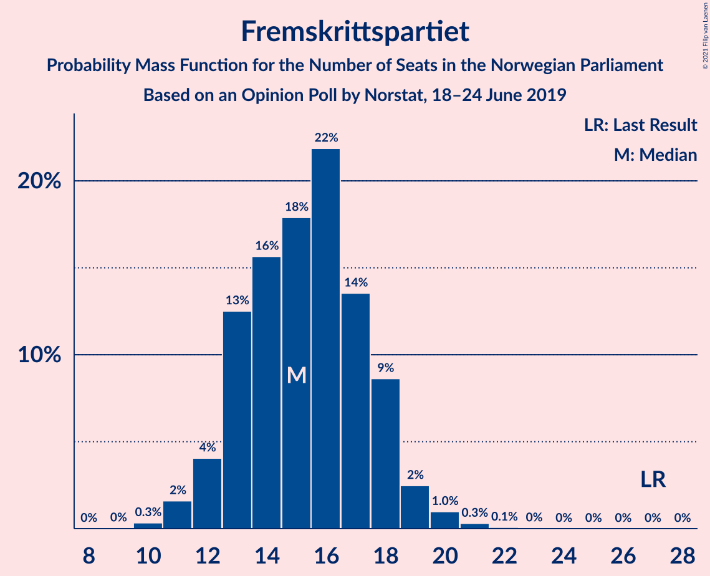
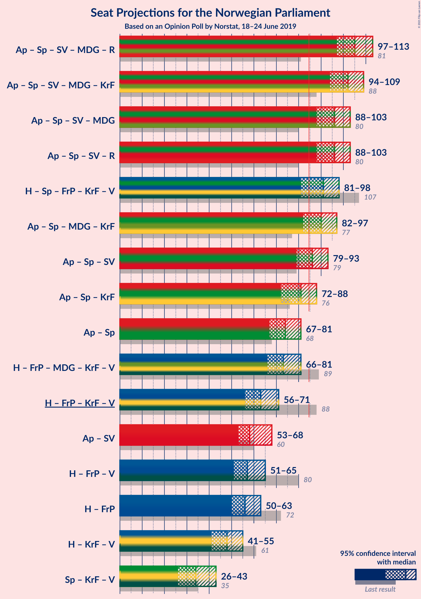
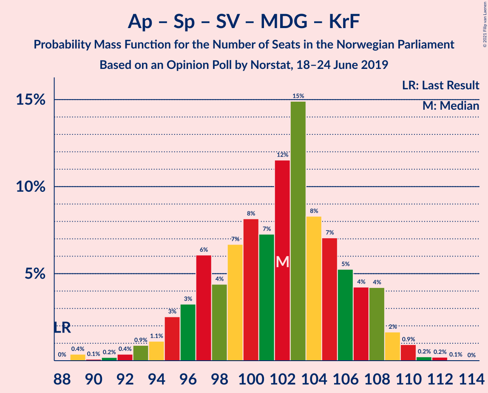
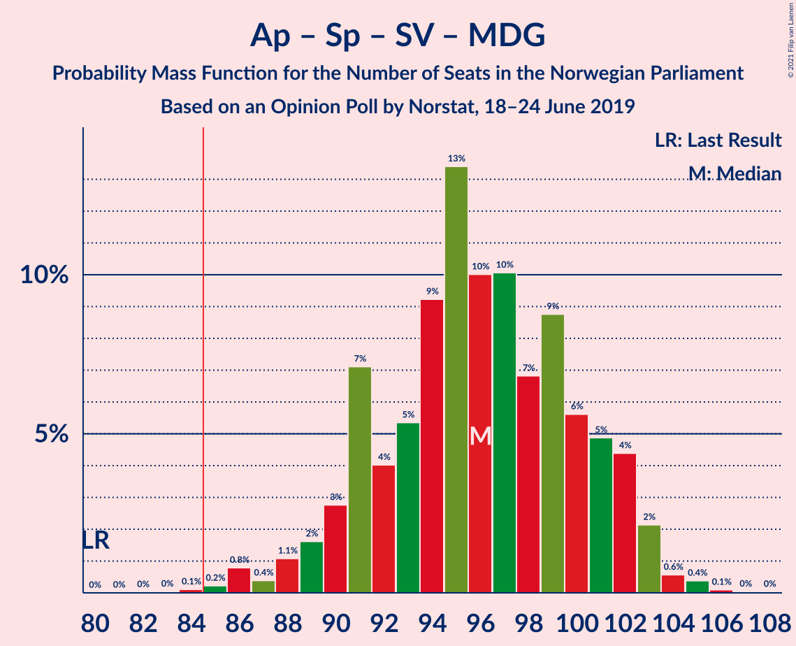
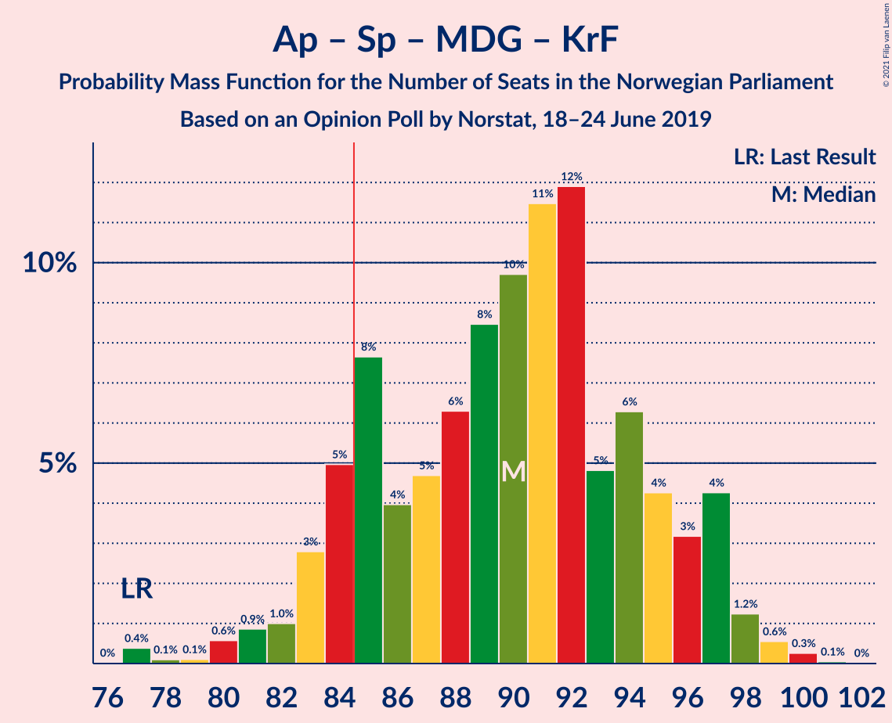
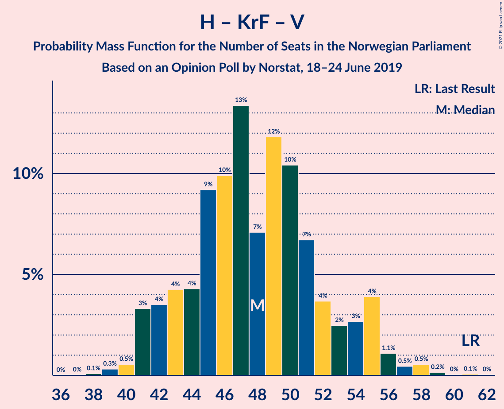

# Opinion Poll by Norstat, 18–24 June 2019

<a href="#voting-intentions">Voting Intentions</a> | <a href="#seats">Seats</a> | <a href="#coalitions">Coalitions</a> | <a href="#technical-information">Technical Information</a>

## Voting Intentions

### Confidence Intervals

| Party | Last Result | Poll Result | 80% Confidence Interval | 90% Confidence Interval | 95% Confidence Interval | 99% Confidence Interval |
|:-----:|:-----------:|:-----------:|:-----------------------:|:-----------------------:|:-----------------------:|:-----------------------:|
| Arbeiderpartiet | 27.4% | 26.0% | 24.2–27.9% |23.7–28.4% |23.3–28.9% |22.5–29.8% |
| Høyre | 25.0% | 22.9% | 21.3–24.8% |20.8–25.3% |20.4–25.7% |19.6–26.6% |
| Senterpartiet | 10.3% | 14.3% | 12.9–15.9% |12.6–16.3% |12.2–16.7% |11.6–17.5% |
| Fremskrittspartiet | 15.2% | 8.9% | 7.8–10.2% |7.5–10.6% |7.3–10.9% |6.8–11.6% |
| Sosialistisk Venstreparti | 6.0% | 6.9% | 6.0–8.1% |5.7–8.5% |5.5–8.7% |5.1–9.3% |
| Miljøpartiet De Grønne | 3.2% | 5.7% | 4.8–6.8% |4.6–7.1% |4.4–7.3% |4.0–7.9% |
| Rødt | 2.4% | 5.4% | 4.5–6.4% |4.3–6.7% |4.1–7.0% |3.7–7.5% |
| Kristelig Folkeparti | 4.2% | 4.2% | 3.5–5.2% |3.3–5.4% |3.1–5.7% |2.8–6.2% |
| Venstre | 4.4% | 2.5% | 2.0–3.3% |1.8–3.5% |1.7–3.7% |1.5–4.1% |

*Note:* The poll result column reflects the actual value used in the calculations. Published results may vary slightly, and in addition be rounded to fewer digits.

## Seats

### Confidence Intervals

| Party | Last Result | Median | 80% Confidence Interval | 90% Confidence Interval | 95% Confidence Interval | 99% Confidence Interval |
|:-----:|:-----------:|:------:|:-----------------------:|:-----------------------:|:-----------------------:|:-----------------------:|
| <a href="#arbeiderpartiet">Arbeiderpartiet</a> | 49 | 46 | 44–52 |43–55 |43–56 |41–58 |
| <a href="#høyre">Høyre</a> | 45 | 40 | 37–46 |36–46 |36–46 |34–48 |
| <a href="#senterpartiet">Senterpartiet</a> | 19 | 28 | 23–33 |22–33 |21–34 |20–35 |
| <a href="#fremskrittspartiet">Fremskrittspartiet</a> | 27 | 16 | 14–18 |13–18 |12–19 |11–21 |
| <a href="#sosialistisk-venstreparti">Sosialistisk Venstreparti</a> | 11 | 12 | 10–14 |10–15 |9–15 |8–16 |
| <a href="#miljøpartiet-de-grønne">Miljøpartiet De Grønne</a> | 1 | 10 | 8–11 |7–12 |7–13 |3–14 |
| <a href="#rødt">Rødt</a> | 1 | 9 | 7–11 |7–12 |2–12 |2–13 |
| <a href="#kristelig-folkeparti">Kristelig Folkeparti</a> | 8 | 7 | 3–8 |3–9 |1–9 |1–10 |
| <a href="#venstre">Venstre</a> | 8 | 2 | 1–2 |0–2 |0–2 |0–7 |

### Arbeiderpartiet

*For a full overview of the results for this party, see the [Arbeiderpartiet](party-arbeiderpartiet.html) page.*

| Number of Seats | Probability | Accumulated | Special Marks |
|:---------------:|:-----------:|:-----------:|:-------------:|
| 40 | 0.3% | 100% |  |
| 41 | 0.3% | 99.7% |  |
| 42 | 1.5% | 99.4% |  |
| 43 | 7% | 98% |  |
| 44 | 33% | 90% |  |
| 45 | 7% | 58% |  |
| 46 | 14% | 51% | Median |
| 47 | 8% | 37% |  |
| 48 | 4% | 28% |  |
| 49 | 1.3% | 24% | Last Result |
| 50 | 8% | 23% |  |
| 51 | 4% | 16% |  |
| 52 | 4% | 12% |  |
| 53 | 2% | 8% |  |
| 54 | 1.1% | 7% |  |
| 55 | 1.2% | 5% |  |
| 56 | 2% | 4% |  |
| 57 | 1.0% | 2% |  |
| 58 | 1.2% | 1.2% |  |
| 59 | 0% | 0% |  |

### Høyre

*For a full overview of the results for this party, see the [Høyre](party-høyre.html) page.*

| Number of Seats | Probability | Accumulated | Special Marks |
|:---------------:|:-----------:|:-----------:|:-------------:|
| 33 | 0.3% | 100% |  |
| 34 | 0.3% | 99.7% |  |
| 35 | 1.4% | 99.4% |  |
| 36 | 4% | 98% |  |
| 37 | 7% | 94% |  |
| 38 | 18% | 87% |  |
| 39 | 18% | 69% |  |
| 40 | 12% | 51% | Median |
| 41 | 9% | 39% |  |
| 42 | 2% | 30% |  |
| 43 | 6% | 28% |  |
| 44 | 7% | 21% |  |
| 45 | 5% | 15% | Last Result |
| 46 | 8% | 10% |  |
| 47 | 0.6% | 2% |  |
| 48 | 0.5% | 1.0% |  |
| 49 | 0.2% | 0.5% |  |
| 50 | 0.2% | 0.3% |  |
| 51 | 0% | 0.1% |  |
| 52 | 0% | 0% |  |

### Senterpartiet

*For a full overview of the results for this party, see the [Senterpartiet](party-senterpartiet.html) page.*

| Number of Seats | Probability | Accumulated | Special Marks |
|:---------------:|:-----------:|:-----------:|:-------------:|
| 18 | 0.1% | 100% |  |
| 19 | 0.3% | 99.9% | Last Result |
| 20 | 2% | 99.7% |  |
| 21 | 2% | 98% |  |
| 22 | 4% | 95% |  |
| 23 | 6% | 91% |  |
| 24 | 8% | 86% |  |
| 25 | 6% | 78% |  |
| 26 | 6% | 72% |  |
| 27 | 10% | 66% |  |
| 28 | 8% | 56% | Median |
| 29 | 12% | 48% |  |
| 30 | 12% | 36% |  |
| 31 | 6% | 23% |  |
| 32 | 5% | 17% |  |
| 33 | 9% | 12% |  |
| 34 | 2% | 3% |  |
| 35 | 0.4% | 0.5% |  |
| 36 | 0.1% | 0.1% |  |
| 37 | 0% | 0% |  |

### Fremskrittspartiet

*For a full overview of the results for this party, see the [Fremskrittspartiet](party-fremskrittspartiet.html) page.*

| Number of Seats | Probability | Accumulated | Special Marks |
|:---------------:|:-----------:|:-----------:|:-------------:|
| 10 | 0.3% | 100% |  |
| 11 | 1.5% | 99.7% |  |
| 12 | 3% | 98% |  |
| 13 | 4% | 95% |  |
| 14 | 19% | 91% |  |
| 15 | 9% | 72% |  |
| 16 | 35% | 63% | Median |
| 17 | 7% | 27% |  |
| 18 | 17% | 21% |  |
| 19 | 3% | 4% |  |
| 20 | 0.6% | 1.2% |  |
| 21 | 0.4% | 0.6% |  |
| 22 | 0.2% | 0.3% |  |
| 23 | 0% | 0% |  |
| 24 | 0% | 0% |  |
| 25 | 0% | 0% |  |
| 26 | 0% | 0% |  |
| 27 | 0% | 0% | Last Result |

### Sosialistisk Venstreparti

*For a full overview of the results for this party, see the [Sosialistisk Venstreparti](party-sosialistiskvenstreparti.html) page.*

| Number of Seats | Probability | Accumulated | Special Marks |
|:---------------:|:-----------:|:-----------:|:-------------:|
| 7 | 0.1% | 100% |  |
| 8 | 0.6% | 99.9% |  |
| 9 | 2% | 99.3% |  |
| 10 | 16% | 97% |  |
| 11 | 23% | 81% | Last Result |
| 12 | 12% | 58% | Median |
| 13 | 27% | 46% |  |
| 14 | 11% | 19% |  |
| 15 | 6% | 8% |  |
| 16 | 2% | 2% |  |
| 17 | 0.4% | 0.5% |  |
| 18 | 0% | 0% |  |

### Miljøpartiet De Grønne

*For a full overview of the results for this party, see the [Miljøpartiet De Grønne](party-miljøpartietdegrønne.html) page.*

| Number of Seats | Probability | Accumulated | Special Marks |
|:---------------:|:-----------:|:-----------:|:-------------:|
| 1 | 0% | 100% | Last Result |
| 2 | 0.2% | 100% |  |
| 3 | 1.0% | 99.8% |  |
| 4 | 0% | 98.9% |  |
| 5 | 0% | 98.8% |  |
| 6 | 0% | 98.8% |  |
| 7 | 4% | 98.8% |  |
| 8 | 16% | 95% |  |
| 9 | 28% | 78% |  |
| 10 | 30% | 50% | Median |
| 11 | 11% | 20% |  |
| 12 | 5% | 9% |  |
| 13 | 3% | 4% |  |
| 14 | 0.7% | 0.7% |  |
| 15 | 0% | 0.1% |  |
| 16 | 0% | 0% |  |

### Rødt

*For a full overview of the results for this party, see the [Rødt](party-rødt.html) page.*

| Number of Seats | Probability | Accumulated | Special Marks |
|:---------------:|:-----------:|:-----------:|:-------------:|
| 1 | 0% | 100% | Last Result |
| 2 | 4% | 100% |  |
| 3 | 0% | 96% |  |
| 4 | 0% | 96% |  |
| 5 | 0% | 96% |  |
| 6 | 0.2% | 96% |  |
| 7 | 6% | 96% |  |
| 8 | 33% | 90% |  |
| 9 | 17% | 57% | Median |
| 10 | 25% | 40% |  |
| 11 | 10% | 15% |  |
| 12 | 5% | 6% |  |
| 13 | 0.5% | 0.9% |  |
| 14 | 0.3% | 0.3% |  |
| 15 | 0% | 0% |  |

### Kristelig Folkeparti

*For a full overview of the results for this party, see the [Kristelig Folkeparti](party-kristeligfolkeparti.html) page.*

| Number of Seats | Probability | Accumulated | Special Marks |
|:---------------:|:-----------:|:-----------:|:-------------:|
| 1 | 4% | 100% |  |
| 2 | 1.4% | 96% |  |
| 3 | 32% | 95% |  |
| 4 | 0% | 63% |  |
| 5 | 0% | 63% |  |
| 6 | 0.9% | 63% |  |
| 7 | 31% | 63% | Median |
| 8 | 27% | 32% | Last Result |
| 9 | 4% | 5% |  |
| 10 | 1.5% | 2% |  |
| 11 | 0.2% | 0.3% |  |
| 12 | 0.1% | 0.1% |  |
| 13 | 0% | 0% |  |

### Venstre

*For a full overview of the results for this party, see the [Venstre](party-venstre.html) page.*

| Number of Seats | Probability | Accumulated | Special Marks |
|:---------------:|:-----------:|:-----------:|:-------------:|
| 0 | 6% | 100% |  |
| 1 | 32% | 94% |  |
| 2 | 61% | 62% | Median |
| 3 | 0.1% | 1.0% |  |
| 4 | 0% | 0.9% |  |
| 5 | 0% | 0.9% |  |
| 6 | 0.1% | 0.9% |  |
| 7 | 0.6% | 0.9% |  |
| 8 | 0.2% | 0.2% | Last Result |
| 9 | 0% | 0% |  |

## Coalitions

### Confidence Intervals

| Coalition | Last Result | Median | Majority? | 80% Confidence Interval | 90% Confidence Interval | 95% Confidence Interval | 99% Confidence Interval |
|:---------:|:-----------:|:------:|:---------:|:-----------------------:|:-----------------------:|:-----------------------:|:-----------------------:|
| Arbeiderpartiet – Senterpartiet – Sosialistisk Venstreparti – Miljøpartiet De Grønne – Rødt | 81 | 104 | 100% | 101–110 | 100–111 | 99–112 | 94–114 |
| Arbeiderpartiet – Senterpartiet – Sosialistisk Venstreparti – Miljøpartiet De Grønne – Kristelig Folkeparti | 88 | 103 | 100% | 95–106 | 95–108 | 93–109 | 92–110 |
| Arbeiderpartiet – Senterpartiet – Sosialistisk Venstreparti – Miljøpartiet De Grønne | 80 | 96 | 99.9% | 92–101 | 90–102 | 89–102 | 85–105 |
| Arbeiderpartiet – Senterpartiet – Sosialistisk Venstreparti – Rødt | 80 | 95 | 99.5% | 91–100 | 90–101 | 88–102 | 84–105 |
| Arbeiderpartiet – Senterpartiet – Miljøpartiet De Grønne – Kristelig Folkeparti | 77 | 90 | 87% | 84–94 | 84–96 | 82–97 | 80–99 |
| Høyre – Senterpartiet – Fremskrittspartiet – Kristelig Folkeparti – Venstre | 107 | 93 | 91% | 86–96 | 82–97 | 80–97 | 80–99 |
| Arbeiderpartiet – Senterpartiet – Sosialistisk Venstreparti | 79 | 87 | 73% | 82–91 | 81–92 | 79–92 | 76–95 |
| Arbeiderpartiet – Senterpartiet – Kristelig Folkeparti | 76 | 81 | 16% | 74–85 | 74–86 | 71–87 | 70–90 |
| Arbeiderpartiet – Senterpartiet | 68 | 74 | 0.1% | 71–78 | 69–80 | 67–81 | 64–83 |
| Høyre – Fremskrittspartiet – Miljøpartiet De Grønne – Kristelig Folkeparti – Venstre | 89 | 73 | 0.5% | 68–78 | 67–78 | 66–80 | 64–84 |
| Høyre – Fremskrittspartiet – Kristelig Folkeparti – Venstre | 88 | 64 | 0% | 59–67 | 57–68 | 55–70 | 54–74 |
| Arbeiderpartiet – Sosialistisk Venstreparti | 60 | 58 | 0% | 55–64 | 54–66 | 53–68 | 52–70 |
| Høyre – Fremskrittspartiet – Venstre | 80 | 58 | 0% | 54–64 | 52–64 | 51–65 | 49–67 |
| Høyre – Fremskrittspartiet | 72 | 56 | 0% | 52–62 | 50–62 | 49–63 | 48–64 |
| Høyre – Kristelig Folkeparti – Venstre | 61 | 49 | 0% | 43–51 | 43–52 | 41–53 | 40–59 |
| Senterpartiet – Kristelig Folkeparti – Venstre | 35 | 35 | 0% | 30–42 | 28–42 | 26–42 | 25–44 |

### Arbeiderpartiet – Senterpartiet – Sosialistisk Venstreparti – Miljøpartiet De Grønne – Rødt

| Number of Seats | Probability | Accumulated | Special Marks |
|:---------------:|:-----------:|:-----------:|:-------------:|
| 81 | 0% | 100% | Last Result |
| 82 | 0% | 100% |  |
| 83 | 0% | 100% |  |
| 84 | 0% | 100% |  |
| 85 | 0% | 100% | Majority |
| 86 | 0% | 100% |  |
| 87 | 0% | 100% |  |
| 88 | 0% | 100% |  |
| 89 | 0% | 100% |  |
| 90 | 0% | 100% |  |
| 91 | 0% | 100% |  |
| 92 | 0% | 100% |  |
| 93 | 0.4% | 100% |  |
| 94 | 0.1% | 99.6% |  |
| 95 | 0.1% | 99.5% |  |
| 96 | 0.3% | 99.3% |  |
| 97 | 0.7% | 99.1% |  |
| 98 | 0.7% | 98% |  |
| 99 | 2% | 98% |  |
| 100 | 0.9% | 95% |  |
| 101 | 6% | 94% |  |
| 102 | 13% | 89% |  |
| 103 | 7% | 76% |  |
| 104 | 20% | 69% |  |
| 105 | 5% | 49% | Median |
| 106 | 20% | 45% |  |
| 107 | 6% | 25% |  |
| 108 | 4% | 19% |  |
| 109 | 2% | 15% |  |
| 110 | 7% | 13% |  |
| 111 | 2% | 6% |  |
| 112 | 1.0% | 3% |  |
| 113 | 1.4% | 2% |  |
| 114 | 0.6% | 1.0% |  |
| 115 | 0.3% | 0.5% |  |
| 116 | 0.1% | 0.2% |  |
| 117 | 0.1% | 0.1% |  |
| 118 | 0% | 0% |  |

### Arbeiderpartiet – Senterpartiet – Sosialistisk Venstreparti – Miljøpartiet De Grønne – Kristelig Folkeparti

| Number of Seats | Probability | Accumulated | Special Marks |
|:---------------:|:-----------:|:-----------:|:-------------:|
| 88 | 0% | 100% | Last Result |
| 89 | 0% | 100% |  |
| 90 | 0% | 99.9% |  |
| 91 | 0.2% | 99.9% |  |
| 92 | 0.5% | 99.7% |  |
| 93 | 2% | 99.2% |  |
| 94 | 0.4% | 97% |  |
| 95 | 10% | 97% |  |
| 96 | 0.7% | 87% |  |
| 97 | 2% | 87% |  |
| 98 | 1.4% | 84% |  |
| 99 | 7% | 83% |  |
| 100 | 7% | 76% |  |
| 101 | 7% | 69% |  |
| 102 | 8% | 62% |  |
| 103 | 15% | 53% | Median |
| 104 | 10% | 39% |  |
| 105 | 17% | 29% |  |
| 106 | 3% | 11% |  |
| 107 | 3% | 8% |  |
| 108 | 1.0% | 5% |  |
| 109 | 3% | 4% |  |
| 110 | 0.2% | 0.7% |  |
| 111 | 0.4% | 0.5% |  |
| 112 | 0% | 0.1% |  |
| 113 | 0% | 0.1% |  |
| 114 | 0% | 0% |  |

### Arbeiderpartiet – Senterpartiet – Sosialistisk Venstreparti – Miljøpartiet De Grønne

| Number of Seats | Probability | Accumulated | Special Marks |
|:---------------:|:-----------:|:-----------:|:-------------:|
| 80 | 0% | 100% | Last Result |
| 81 | 0% | 100% |  |
| 82 | 0% | 100% |  |
| 83 | 0% | 100% |  |
| 84 | 0% | 100% |  |
| 85 | 0.4% | 99.9% | Majority |
| 86 | 0.3% | 99.5% |  |
| 87 | 0.3% | 99.1% |  |
| 88 | 1.1% | 98.8% |  |
| 89 | 0.5% | 98% |  |
| 90 | 4% | 97% |  |
| 91 | 0.8% | 94% |  |
| 92 | 12% | 93% |  |
| 93 | 2% | 80% |  |
| 94 | 8% | 79% |  |
| 95 | 4% | 70% |  |
| 96 | 24% | 67% | Median |
| 97 | 10% | 43% |  |
| 98 | 11% | 32% |  |
| 99 | 8% | 22% |  |
| 100 | 3% | 14% |  |
| 101 | 4% | 11% |  |
| 102 | 6% | 8% |  |
| 103 | 0.8% | 2% |  |
| 104 | 0.4% | 1.0% |  |
| 105 | 0.3% | 0.6% |  |
| 106 | 0.2% | 0.3% |  |
| 107 | 0% | 0.2% |  |
| 108 | 0.1% | 0.1% |  |
| 109 | 0% | 0% |  |

### Arbeiderpartiet – Senterpartiet – Sosialistisk Venstreparti – Rødt

| Number of Seats | Probability | Accumulated | Special Marks |
|:---------------:|:-----------:|:-----------:|:-------------:|
| 80 | 0% | 100% | Last Result |
| 81 | 0% | 100% |  |
| 82 | 0% | 100% |  |
| 83 | 0% | 100% |  |
| 84 | 0.5% | 99.9% |  |
| 85 | 0.1% | 99.5% | Majority |
| 86 | 0.5% | 99.4% |  |
| 87 | 1.0% | 99.0% |  |
| 88 | 0.7% | 98% |  |
| 89 | 0.6% | 97% |  |
| 90 | 2% | 97% |  |
| 91 | 6% | 95% |  |
| 92 | 12% | 89% |  |
| 93 | 2% | 77% |  |
| 94 | 13% | 76% |  |
| 95 | 13% | 63% | Median |
| 96 | 13% | 50% |  |
| 97 | 12% | 37% |  |
| 98 | 9% | 25% |  |
| 99 | 2% | 15% |  |
| 100 | 6% | 14% |  |
| 101 | 4% | 7% |  |
| 102 | 1.3% | 3% |  |
| 103 | 1.1% | 2% |  |
| 104 | 0.3% | 1.0% |  |
| 105 | 0.6% | 0.8% |  |
| 106 | 0% | 0.1% |  |
| 107 | 0.1% | 0.1% |  |
| 108 | 0% | 0% |  |

### Arbeiderpartiet – Senterpartiet – Miljøpartiet De Grønne – Kristelig Folkeparti

| Number of Seats | Probability | Accumulated | Special Marks |
|:---------------:|:-----------:|:-----------:|:-------------:|
| 77 | 0.1% | 100% | Last Result |
| 78 | 0% | 99.9% |  |
| 79 | 0.1% | 99.8% |  |
| 80 | 0.4% | 99.7% |  |
| 81 | 2% | 99.4% |  |
| 82 | 2% | 98% |  |
| 83 | 0.7% | 96% |  |
| 84 | 8% | 95% |  |
| 85 | 2% | 87% | Majority |
| 86 | 7% | 85% |  |
| 87 | 6% | 78% |  |
| 88 | 6% | 72% |  |
| 89 | 3% | 67% |  |
| 90 | 14% | 64% |  |
| 91 | 18% | 49% | Median |
| 92 | 10% | 32% |  |
| 93 | 3% | 21% |  |
| 94 | 11% | 19% |  |
| 95 | 1.1% | 8% |  |
| 96 | 3% | 7% |  |
| 97 | 2% | 4% |  |
| 98 | 1.4% | 2% |  |
| 99 | 0.5% | 0.6% |  |
| 100 | 0.1% | 0.1% |  |
| 101 | 0% | 0% |  |

### Høyre – Senterpartiet – Fremskrittspartiet – Kristelig Folkeparti – Venstre

| Number of Seats | Probability | Accumulated | Special Marks |
|:---------------:|:-----------:|:-----------:|:-------------:|
| 78 | 0.2% | 100% |  |
| 79 | 0.2% | 99.8% |  |
| 80 | 4% | 99.5% |  |
| 81 | 0.8% | 96% |  |
| 82 | 0.6% | 95% |  |
| 83 | 1.0% | 94% |  |
| 84 | 2% | 93% |  |
| 85 | 0.8% | 91% | Majority |
| 86 | 1.3% | 91% |  |
| 87 | 10% | 89% |  |
| 88 | 5% | 79% |  |
| 89 | 5% | 74% |  |
| 90 | 5% | 69% |  |
| 91 | 3% | 64% |  |
| 92 | 8% | 61% |  |
| 93 | 8% | 53% | Median |
| 94 | 16% | 44% |  |
| 95 | 15% | 29% |  |
| 96 | 8% | 14% |  |
| 97 | 3% | 6% |  |
| 98 | 0.6% | 2% |  |
| 99 | 1.4% | 2% |  |
| 100 | 0% | 0.1% |  |
| 101 | 0% | 0% |  |
| 102 | 0% | 0% |  |
| 103 | 0% | 0% |  |
| 104 | 0% | 0% |  |
| 105 | 0% | 0% |  |
| 106 | 0% | 0% |  |
| 107 | 0% | 0% | Last Result |

### Arbeiderpartiet – Senterpartiet – Sosialistisk Venstreparti

| Number of Seats | Probability | Accumulated | Special Marks |
|:---------------:|:-----------:|:-----------:|:-------------:|
| 74 | 0.1% | 100% |  |
| 75 | 0.2% | 99.9% |  |
| 76 | 0.5% | 99.7% |  |
| 77 | 0.1% | 99.1% |  |
| 78 | 0.8% | 99.0% |  |
| 79 | 2% | 98% | Last Result |
| 80 | 0.8% | 96% |  |
| 81 | 0.7% | 95% |  |
| 82 | 11% | 95% |  |
| 83 | 4% | 84% |  |
| 84 | 7% | 80% |  |
| 85 | 7% | 73% | Majority |
| 86 | 2% | 66% | Median |
| 87 | 17% | 64% |  |
| 88 | 27% | 47% |  |
| 89 | 7% | 20% |  |
| 90 | 3% | 14% |  |
| 91 | 3% | 11% |  |
| 92 | 6% | 8% |  |
| 93 | 0.6% | 2% |  |
| 94 | 1.1% | 2% |  |
| 95 | 0.6% | 0.7% |  |
| 96 | 0% | 0.2% |  |
| 97 | 0% | 0.1% |  |
| 98 | 0% | 0.1% |  |
| 99 | 0.1% | 0.1% |  |
| 100 | 0% | 0% |  |

### Arbeiderpartiet – Senterpartiet – Kristelig Folkeparti

| Number of Seats | Probability | Accumulated | Special Marks |
|:---------------:|:-----------:|:-----------:|:-------------:|
| 67 | 0.1% | 100% |  |
| 68 | 0.1% | 99.9% |  |
| 69 | 0.1% | 99.9% |  |
| 70 | 2% | 99.7% |  |
| 71 | 0.5% | 98% |  |
| 72 | 0.1% | 97% |  |
| 73 | 1.4% | 97% |  |
| 74 | 11% | 96% |  |
| 75 | 0.8% | 84% |  |
| 76 | 4% | 84% | Last Result |
| 77 | 3% | 79% |  |
| 78 | 5% | 76% |  |
| 79 | 5% | 71% |  |
| 80 | 4% | 65% |  |
| 81 | 24% | 61% | Median |
| 82 | 4% | 37% |  |
| 83 | 14% | 33% |  |
| 84 | 3% | 19% |  |
| 85 | 8% | 16% | Majority |
| 86 | 3% | 8% |  |
| 87 | 2% | 4% |  |
| 88 | 1.1% | 2% |  |
| 89 | 0.1% | 0.9% |  |
| 90 | 0.7% | 0.8% |  |
| 91 | 0.1% | 0.1% |  |
| 92 | 0% | 0% |  |

### Arbeiderpartiet – Senterpartiet

| Number of Seats | Probability | Accumulated | Special Marks |
|:---------------:|:-----------:|:-----------:|:-------------:|
| 62 | 0.1% | 100% |  |
| 63 | 0% | 99.9% |  |
| 64 | 0.4% | 99.9% |  |
| 65 | 0.1% | 99.5% |  |
| 66 | 1.3% | 99.3% |  |
| 67 | 2% | 98% |  |
| 68 | 0.4% | 96% | Last Result |
| 69 | 0.8% | 96% |  |
| 70 | 3% | 95% |  |
| 71 | 15% | 92% |  |
| 72 | 3% | 77% |  |
| 73 | 7% | 74% |  |
| 74 | 19% | 68% | Median |
| 75 | 13% | 49% |  |
| 76 | 7% | 36% |  |
| 77 | 12% | 29% |  |
| 78 | 8% | 18% |  |
| 79 | 4% | 9% |  |
| 80 | 3% | 5% |  |
| 81 | 2% | 3% |  |
| 82 | 0.4% | 1.0% |  |
| 83 | 0.4% | 0.6% |  |
| 84 | 0.1% | 0.2% |  |
| 85 | 0.1% | 0.1% | Majority |
| 86 | 0% | 0% |  |

### Høyre – Fremskrittspartiet – Miljøpartiet De Grønne – Kristelig Folkeparti – Venstre

| Number of Seats | Probability | Accumulated | Special Marks |
|:---------------:|:-----------:|:-----------:|:-------------:|
| 62 | 0.2% | 100% |  |
| 63 | 0.2% | 99.7% |  |
| 64 | 0.8% | 99.5% |  |
| 65 | 1.0% | 98.8% |  |
| 66 | 2% | 98% |  |
| 67 | 2% | 96% |  |
| 68 | 5% | 94% |  |
| 69 | 7% | 89% |  |
| 70 | 2% | 82% |  |
| 71 | 9% | 80% |  |
| 72 | 12% | 71% |  |
| 73 | 12% | 59% |  |
| 74 | 13% | 47% |  |
| 75 | 11% | 34% | Median |
| 76 | 1.4% | 23% |  |
| 77 | 11% | 22% |  |
| 78 | 5% | 10% |  |
| 79 | 2% | 5% |  |
| 80 | 0.3% | 3% |  |
| 81 | 0.4% | 2% |  |
| 82 | 0.9% | 2% |  |
| 83 | 0.4% | 0.9% |  |
| 84 | 0% | 0.5% |  |
| 85 | 0.4% | 0.5% | Majority |
| 86 | 0% | 0% |  |
| 87 | 0% | 0% |  |
| 88 | 0% | 0% |  |
| 89 | 0% | 0% | Last Result |

### Høyre – Fremskrittspartiet – Kristelig Folkeparti – Venstre

| Number of Seats | Probability | Accumulated | Special Marks |
|:---------------:|:-----------:|:-----------:|:-------------:|
| 52 | 0.1% | 100% |  |
| 53 | 0.1% | 99.9% |  |
| 54 | 1.0% | 99.8% |  |
| 55 | 2% | 98.7% |  |
| 56 | 1.4% | 97% |  |
| 57 | 1.0% | 96% |  |
| 58 | 3% | 95% |  |
| 59 | 7% | 92% |  |
| 60 | 3% | 85% |  |
| 61 | 5% | 82% |  |
| 62 | 6% | 77% |  |
| 63 | 20% | 72% |  |
| 64 | 5% | 52% |  |
| 65 | 19% | 47% | Median |
| 66 | 7% | 28% |  |
| 67 | 13% | 21% |  |
| 68 | 3% | 8% |  |
| 69 | 0.9% | 5% |  |
| 70 | 2% | 4% |  |
| 71 | 0.5% | 2% |  |
| 72 | 0.5% | 1.1% |  |
| 73 | 0.2% | 0.7% |  |
| 74 | 0% | 0.5% |  |
| 75 | 0.1% | 0.5% |  |
| 76 | 0.4% | 0.4% |  |
| 77 | 0% | 0% |  |
| 78 | 0% | 0% |  |
| 79 | 0% | 0% |  |
| 80 | 0% | 0% |  |
| 81 | 0% | 0% |  |
| 82 | 0% | 0% |  |
| 83 | 0% | 0% |  |
| 84 | 0% | 0% |  |
| 85 | 0% | 0% | Majority |
| 86 | 0% | 0% |  |
| 87 | 0% | 0% |  |
| 88 | 0% | 0% | Last Result |

### Arbeiderpartiet – Sosialistisk Venstreparti

| Number of Seats | Probability | Accumulated | Special Marks |
|:---------------:|:-----------:|:-----------:|:-------------:|
| 51 | 0.2% | 100% |  |
| 52 | 0.7% | 99.8% |  |
| 53 | 2% | 99.2% |  |
| 54 | 3% | 97% |  |
| 55 | 19% | 94% |  |
| 56 | 5% | 76% |  |
| 57 | 18% | 71% |  |
| 58 | 9% | 53% | Median |
| 59 | 12% | 44% |  |
| 60 | 5% | 32% | Last Result |
| 61 | 6% | 27% |  |
| 62 | 3% | 21% |  |
| 63 | 2% | 17% |  |
| 64 | 7% | 15% |  |
| 65 | 1.0% | 8% |  |
| 66 | 3% | 7% |  |
| 67 | 2% | 4% |  |
| 68 | 0.4% | 3% |  |
| 69 | 0.9% | 2% |  |
| 70 | 1.3% | 1.4% |  |
| 71 | 0% | 0.1% |  |
| 72 | 0% | 0.1% |  |
| 73 | 0.1% | 0.1% |  |
| 74 | 0% | 0% |  |

### Høyre – Fremskrittspartiet – Venstre

| Number of Seats | Probability | Accumulated | Special Marks |
|:---------------:|:-----------:|:-----------:|:-------------:|
| 47 | 0.1% | 100% |  |
| 48 | 0.2% | 99.9% |  |
| 49 | 0.3% | 99.8% |  |
| 50 | 0.6% | 99.5% |  |
| 51 | 3% | 98.9% |  |
| 52 | 3% | 95% |  |
| 53 | 2% | 92% |  |
| 54 | 4% | 90% |  |
| 55 | 17% | 86% |  |
| 56 | 12% | 69% |  |
| 57 | 4% | 57% |  |
| 58 | 20% | 53% | Median |
| 59 | 5% | 33% |  |
| 60 | 4% | 28% |  |
| 61 | 4% | 24% |  |
| 62 | 7% | 21% |  |
| 63 | 2% | 13% |  |
| 64 | 8% | 11% |  |
| 65 | 2% | 3% |  |
| 66 | 0.2% | 0.8% |  |
| 67 | 0.1% | 0.6% |  |
| 68 | 0.1% | 0.5% |  |
| 69 | 0.4% | 0.4% |  |
| 70 | 0% | 0% |  |
| 71 | 0% | 0% |  |
| 72 | 0% | 0% |  |
| 73 | 0% | 0% |  |
| 74 | 0% | 0% |  |
| 75 | 0% | 0% |  |
| 76 | 0% | 0% |  |
| 77 | 0% | 0% |  |
| 78 | 0% | 0% |  |
| 79 | 0% | 0% |  |
| 80 | 0% | 0% | Last Result |

### Høyre – Fremskrittspartiet

| Number of Seats | Probability | Accumulated | Special Marks |
|:---------------:|:-----------:|:-----------:|:-------------:|
| 46 | 0% | 100% |  |
| 47 | 0.4% | 99.9% |  |
| 48 | 0.5% | 99.5% |  |
| 49 | 2% | 99.0% |  |
| 50 | 3% | 97% |  |
| 51 | 4% | 94% |  |
| 52 | 2% | 91% |  |
| 53 | 11% | 88% |  |
| 54 | 13% | 77% |  |
| 55 | 10% | 64% |  |
| 56 | 16% | 55% | Median |
| 57 | 8% | 39% |  |
| 58 | 2% | 30% |  |
| 59 | 3% | 29% |  |
| 60 | 11% | 26% |  |
| 61 | 3% | 15% |  |
| 62 | 9% | 12% |  |
| 63 | 2% | 3% |  |
| 64 | 0.3% | 0.5% |  |
| 65 | 0.1% | 0.3% |  |
| 66 | 0.1% | 0.2% |  |
| 67 | 0% | 0.1% |  |
| 68 | 0% | 0% |  |
| 69 | 0% | 0% |  |
| 70 | 0% | 0% |  |
| 71 | 0% | 0% |  |
| 72 | 0% | 0% | Last Result |

### Høyre – Kristelig Folkeparti – Venstre

| Number of Seats | Probability | Accumulated | Special Marks |
|:---------------:|:-----------:|:-----------:|:-------------:|
| 38 | 0.4% | 100% |  |
| 39 | 0.1% | 99.6% |  |
| 40 | 0.5% | 99.5% |  |
| 41 | 2% | 99.0% |  |
| 42 | 2% | 97% |  |
| 43 | 7% | 95% |  |
| 44 | 3% | 88% |  |
| 45 | 5% | 85% |  |
| 46 | 6% | 81% |  |
| 47 | 22% | 75% |  |
| 48 | 2% | 53% |  |
| 49 | 22% | 51% | Median |
| 50 | 12% | 29% |  |
| 51 | 10% | 17% |  |
| 52 | 4% | 7% |  |
| 53 | 0.9% | 3% |  |
| 54 | 0.6% | 2% |  |
| 55 | 0.3% | 2% |  |
| 56 | 0.5% | 2% |  |
| 57 | 0.2% | 1.1% |  |
| 58 | 0.2% | 0.8% |  |
| 59 | 0.3% | 0.7% |  |
| 60 | 0% | 0.4% |  |
| 61 | 0.3% | 0.4% | Last Result |
| 62 | 0% | 0% |  |

### Senterpartiet – Kristelig Folkeparti – Venstre

| Number of Seats | Probability | Accumulated | Special Marks |
|:---------------:|:-----------:|:-----------:|:-------------:|
| 24 | 0.5% | 100% |  |
| 25 | 0.2% | 99.5% |  |
| 26 | 2% | 99.3% |  |
| 27 | 2% | 97% |  |
| 28 | 3% | 95% |  |
| 29 | 2% | 93% |  |
| 30 | 5% | 91% |  |
| 31 | 2% | 86% |  |
| 32 | 16% | 83% |  |
| 33 | 6% | 68% |  |
| 34 | 8% | 61% |  |
| 35 | 4% | 53% | Last Result |
| 36 | 4% | 49% |  |
| 37 | 8% | 45% | Median |
| 38 | 3% | 37% |  |
| 39 | 22% | 34% |  |
| 40 | 2% | 12% |  |
| 41 | 0.4% | 10% |  |
| 42 | 9% | 10% |  |
| 43 | 1.0% | 2% |  |
| 44 | 0.4% | 0.5% |  |
| 45 | 0.1% | 0.2% |  |
| 46 | 0.1% | 0.1% |  |
| 47 | 0% | 0% |  |

## Technical Information

### Opinion Poll

+ **Polling firm:** Norstat
+ **Commissioner(s):** —
+ **Fieldwork period:** 18–24 June 2019

### Calculations

+ **Sample size:** 950
+ **Simulations done:** 131,072
+ **Error estimate:** 3.05%

