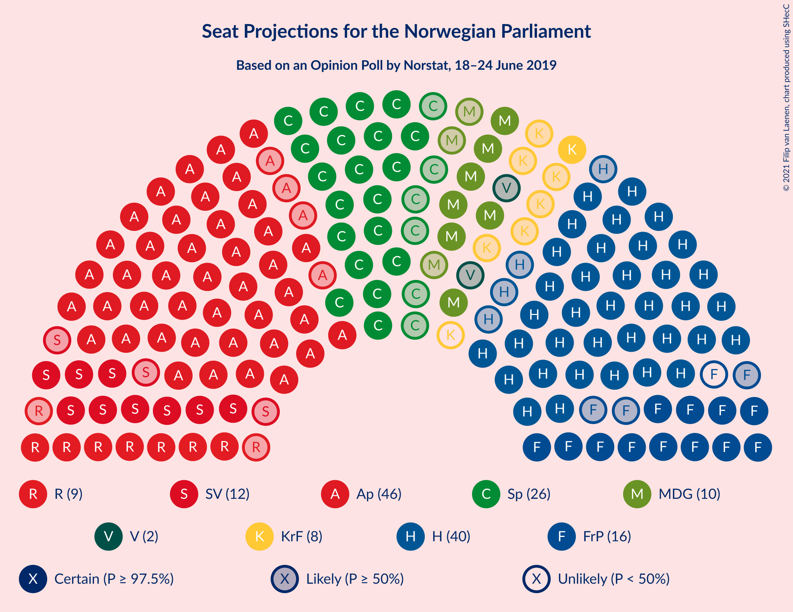
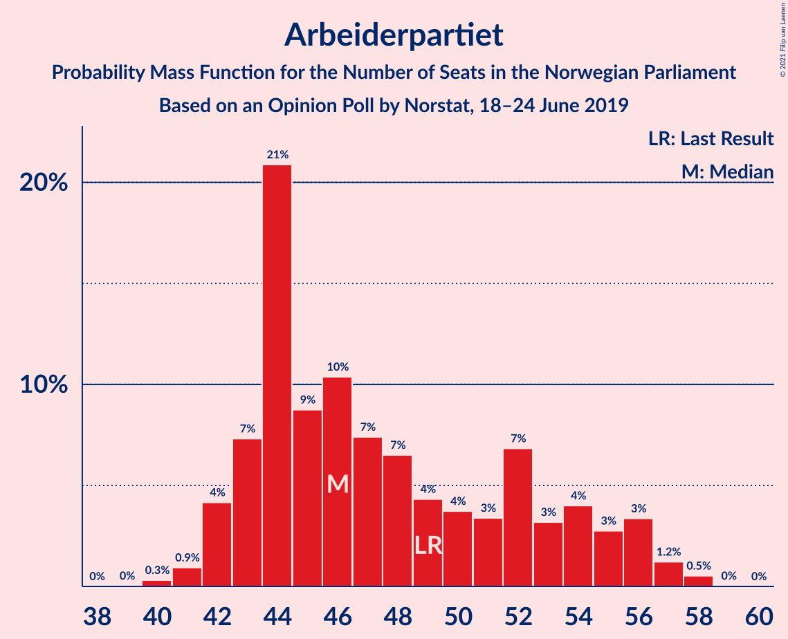
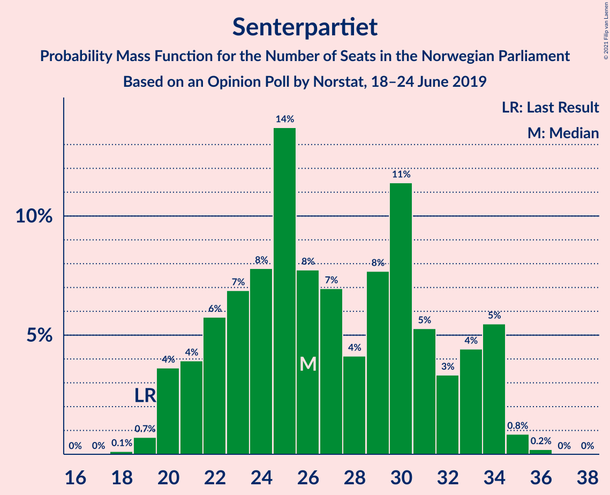
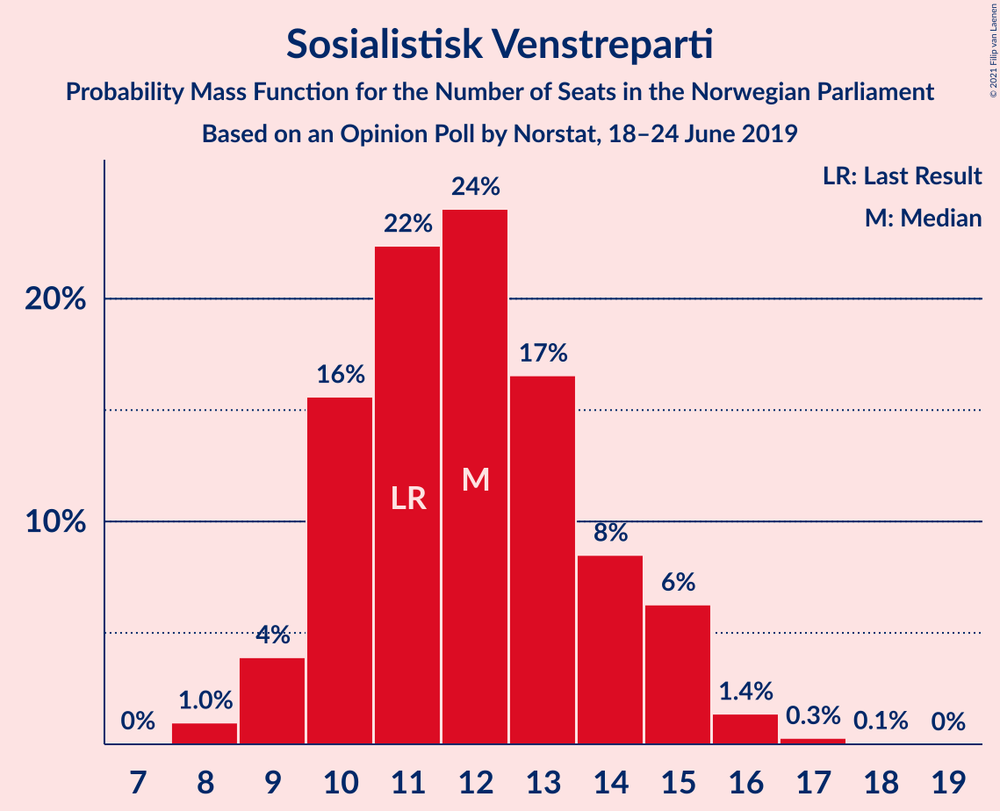
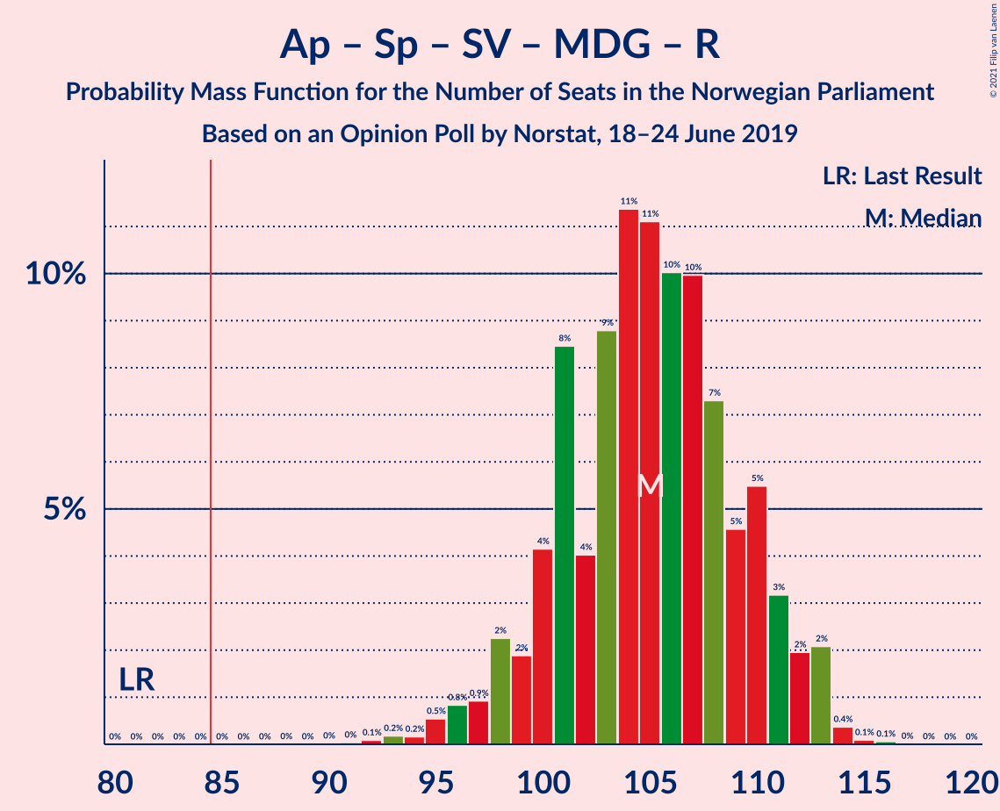
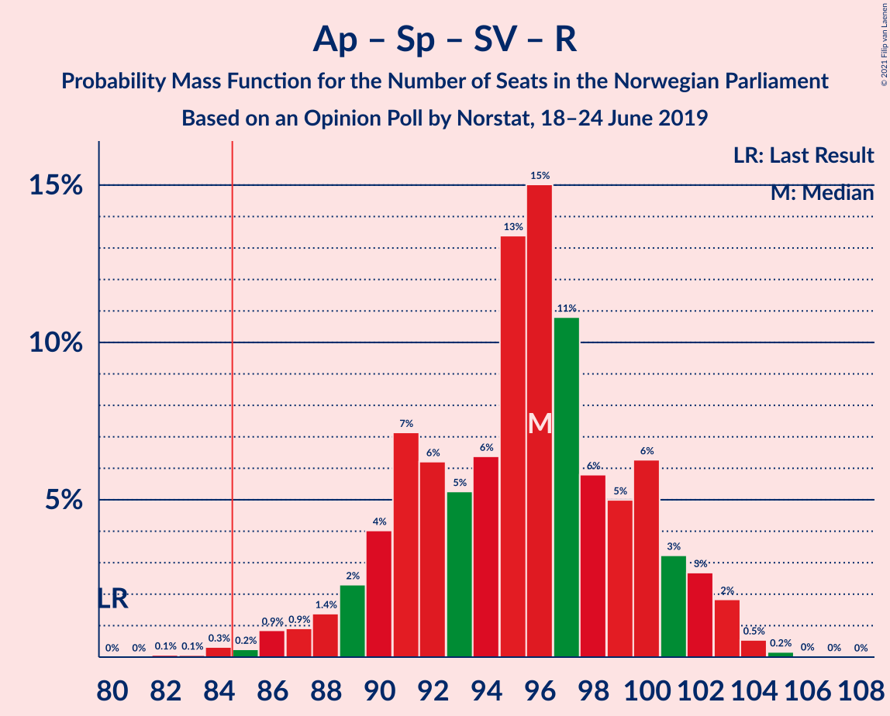
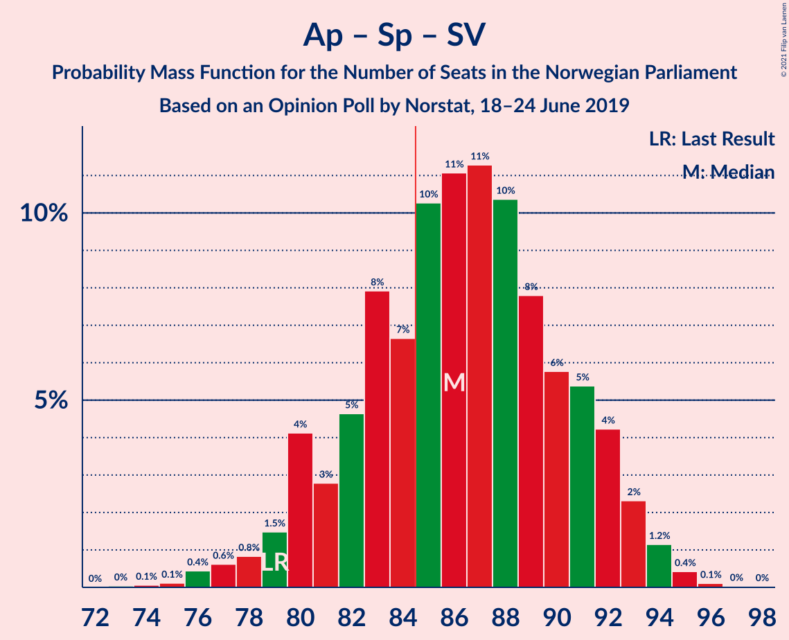
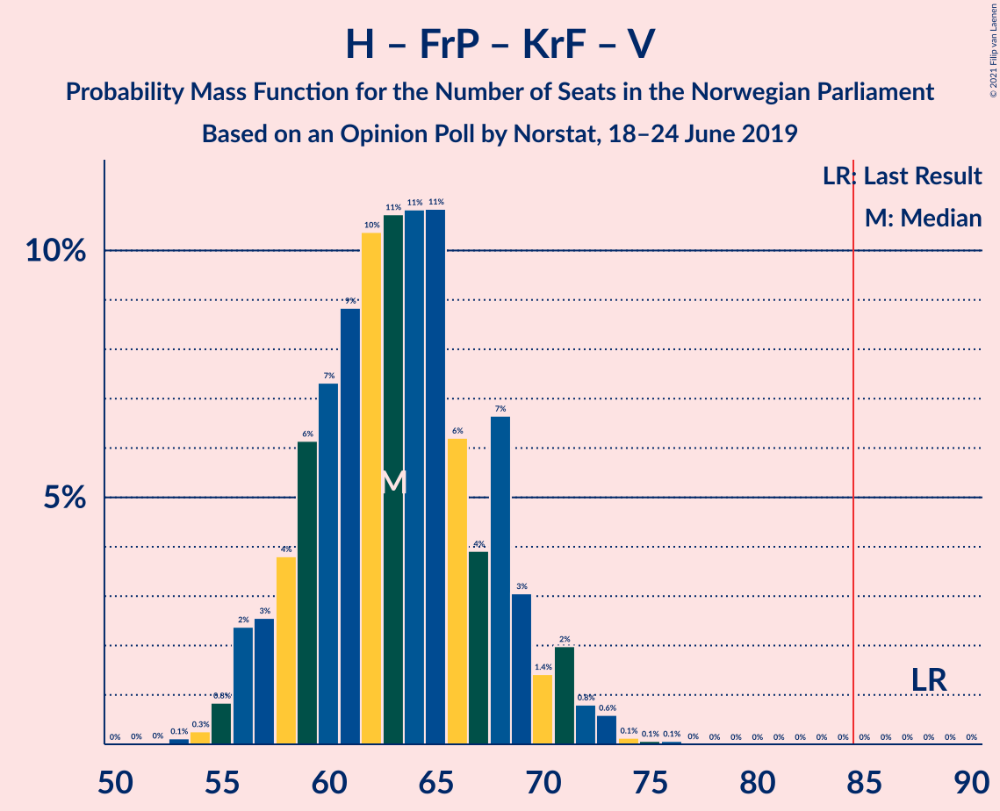

# Opinion Poll by Norstat, 18–24 June 2019

<a href="#voting-intentions">Voting Intentions</a> | <a href="#seats">Seats</a> | <a href="#coalitions">Coalitions</a> | <a href="#technical-information">Technical Information</a>

## Voting Intentions

### Confidence Intervals

| Party | Last Result | Poll Result | 80% Confidence Interval | 90% Confidence Interval | 95% Confidence Interval | 99% Confidence Interval |
|:-----:|:-----------:|:-----------:|:-----------------------:|:-----------------------:|:-----------------------:|:-----------------------:|
| Arbeiderpartiet | 27.4% | 26.0% | 24.2–27.9% |23.7–28.4% |23.3–28.9% |22.5–29.8% |
| Høyre | 25.0% | 22.9% | 21.3–24.8% |20.8–25.3% |20.4–25.7% |19.6–26.6% |
| Senterpartiet | 10.3% | 14.3% | 12.9–15.9% |12.6–16.3% |12.2–16.7% |11.6–17.5% |
| Fremskrittspartiet | 15.2% | 8.9% | 7.8–10.2% |7.5–10.6% |7.3–10.9% |6.8–11.6% |
| Sosialistisk Venstreparti | 6.0% | 6.9% | 6.0–8.1% |5.7–8.5% |5.5–8.7% |5.1–9.3% |
| Miljøpartiet De Grønne | 3.2% | 5.7% | 4.8–6.8% |4.6–7.1% |4.4–7.3% |4.0–7.9% |
| Rødt | 2.4% | 5.4% | 4.5–6.4% |4.3–6.7% |4.1–7.0% |3.7–7.5% |
| Kristelig Folkeparti | 4.2% | 4.2% | 3.5–5.2% |3.3–5.4% |3.1–5.7% |2.8–6.2% |
| Venstre | 4.4% | 2.5% | 2.0–3.3% |1.8–3.5% |1.7–3.7% |1.5–4.1% |

*Note:* The poll result column reflects the actual value used in the calculations. Published results may vary slightly, and in addition be rounded to fewer digits.

## Seats

### Confidence Intervals

| Party | Last Result | Median | 80% Confidence Interval | 90% Confidence Interval | 95% Confidence Interval | 99% Confidence Interval |
|:-----:|:-----------:|:------:|:-----------------------:|:-----------------------:|:-----------------------:|:-----------------------:|
| <a href="#arbeiderpartiet">Arbeiderpartiet</a> | 49 | 46 | 43–54 |42–56 |42–56 |41–58 |
| <a href="#høyre">Høyre</a> | 45 | 40 | 37–45 |36–46 |36–46 |34–49 |
| <a href="#senterpartiet">Senterpartiet</a> | 19 | 26 | 22–33 |21–34 |20–34 |19–35 |
| <a href="#fremskrittspartiet">Fremskrittspartiet</a> | 27 | 15 | 13–18 |12–18 |12–19 |11–20 |
| <a href="#sosialistisk-venstreparti">Sosialistisk Venstreparti</a> | 11 | 12 | 10–14 |10–15 |9–15 |8–16 |
| <a href="#miljøpartiet-de-grønne">Miljøpartiet De Grønne</a> | 1 | 10 | 8–11 |8–12 |7–13 |3–14 |
| <a href="#rødt">Rødt</a> | 1 | 9 | 8–11 |7–12 |7–12 |2–13 |
| <a href="#kristelig-folkeparti">Kristelig Folkeparti</a> | 8 | 7 | 3–8 |3–9 |1–10 |1–10 |
| <a href="#venstre">Venstre</a> | 8 | 2 | 1–2 |1–2 |0–2 |0–7 |

### Arbeiderpartiet

*For a full overview of the results for this party, see the [Arbeiderpartiet](party-arbeiderpartiet.html) page.*

| Number of Seats | Probability | Accumulated | Special Marks |
|:---------------:|:-----------:|:-----------:|:-------------:|
| 40 | 0.3% | 100% |  |
| 41 | 0.9% | 99.7% |  |
| 42 | 4% | 98.7% |  |
| 43 | 7% | 95% |  |
| 44 | 21% | 87% |  |
| 45 | 9% | 66% |  |
| 46 | 10% | 58% | Median |
| 47 | 7% | 47% |  |
| 48 | 7% | 40% |  |
| 49 | 4% | 33% | Last Result |
| 50 | 4% | 29% |  |
| 51 | 3% | 25% |  |
| 52 | 7% | 22% |  |
| 53 | 3% | 15% |  |
| 54 | 4% | 12% |  |
| 55 | 3% | 8% |  |
| 56 | 3% | 5% |  |
| 57 | 1.2% | 2% |  |
| 58 | 0.5% | 0.6% |  |
| 59 | 0% | 0% |  |

### Høyre

*For a full overview of the results for this party, see the [Høyre](party-høyre.html) page.*

| Number of Seats | Probability | Accumulated | Special Marks |
|:---------------:|:-----------:|:-----------:|:-------------:|
| 32 | 0% | 100% |  |
| 33 | 0.2% | 99.9% |  |
| 34 | 0.4% | 99.8% |  |
| 35 | 2% | 99.4% |  |
| 36 | 4% | 98% |  |
| 37 | 10% | 94% |  |
| 38 | 13% | 84% |  |
| 39 | 9% | 71% |  |
| 40 | 18% | 61% | Median |
| 41 | 12% | 43% |  |
| 42 | 10% | 32% |  |
| 43 | 6% | 22% |  |
| 44 | 4% | 16% |  |
| 45 | 6% | 12% | Last Result |
| 46 | 3% | 6% |  |
| 47 | 1.0% | 2% |  |
| 48 | 0.9% | 1.5% |  |
| 49 | 0.3% | 0.6% |  |
| 50 | 0.2% | 0.2% |  |
| 51 | 0% | 0.1% |  |
| 52 | 0% | 0% |  |

### Senterpartiet

*For a full overview of the results for this party, see the [Senterpartiet](party-senterpartiet.html) page.*

| Number of Seats | Probability | Accumulated | Special Marks |
|:---------------:|:-----------:|:-----------:|:-------------:|
| 18 | 0.1% | 100% |  |
| 19 | 0.7% | 99.9% | Last Result |
| 20 | 4% | 99.2% |  |
| 21 | 4% | 96% |  |
| 22 | 6% | 92% |  |
| 23 | 7% | 86% |  |
| 24 | 8% | 79% |  |
| 25 | 14% | 71% |  |
| 26 | 8% | 57% | Median |
| 27 | 7% | 50% |  |
| 28 | 4% | 43% |  |
| 29 | 8% | 39% |  |
| 30 | 11% | 31% |  |
| 31 | 5% | 20% |  |
| 32 | 3% | 14% |  |
| 33 | 4% | 11% |  |
| 34 | 5% | 7% |  |
| 35 | 0.8% | 1.1% |  |
| 36 | 0.2% | 0.2% |  |
| 37 | 0% | 0% |  |

### Fremskrittspartiet

*For a full overview of the results for this party, see the [Fremskrittspartiet](party-fremskrittspartiet.html) page.*

| Number of Seats | Probability | Accumulated | Special Marks |
|:---------------:|:-----------:|:-----------:|:-------------:|
| 10 | 0.3% | 100% |  |
| 11 | 2% | 99.6% |  |
| 12 | 4% | 98% |  |
| 13 | 13% | 94% |  |
| 14 | 16% | 81% |  |
| 15 | 18% | 66% | Median |
| 16 | 22% | 48% |  |
| 17 | 14% | 26% |  |
| 18 | 9% | 13% |  |
| 19 | 2% | 4% |  |
| 20 | 1.0% | 1.4% |  |
| 21 | 0.3% | 0.4% |  |
| 22 | 0.1% | 0.1% |  |
| 23 | 0% | 0% |  |
| 24 | 0% | 0% |  |
| 25 | 0% | 0% |  |
| 26 | 0% | 0% |  |
| 27 | 0% | 0% | Last Result |

### Sosialistisk Venstreparti

*For a full overview of the results for this party, see the [Sosialistisk Venstreparti](party-sosialistiskvenstreparti.html) page.*

| Number of Seats | Probability | Accumulated | Special Marks |
|:---------------:|:-----------:|:-----------:|:-------------:|
| 7 | 0% | 100% |  |
| 8 | 1.0% | 99.9% |  |
| 9 | 4% | 99.0% |  |
| 10 | 16% | 95% |  |
| 11 | 22% | 79% | Last Result |
| 12 | 24% | 57% | Median |
| 13 | 17% | 33% |  |
| 14 | 8% | 16% |  |
| 15 | 6% | 8% |  |
| 16 | 1.4% | 2% |  |
| 17 | 0.3% | 0.4% |  |
| 18 | 0.1% | 0.1% |  |
| 19 | 0% | 0% |  |

### Miljøpartiet De Grønne

*For a full overview of the results for this party, see the [Miljøpartiet De Grønne](party-miljøpartietdegrønne.html) page.*

| Number of Seats | Probability | Accumulated | Special Marks |
|:---------------:|:-----------:|:-----------:|:-------------:|
| 1 | 0% | 100% | Last Result |
| 2 | 0.4% | 100% |  |
| 3 | 0.4% | 99.6% |  |
| 4 | 0% | 99.1% |  |
| 5 | 0% | 99.1% |  |
| 6 | 0.1% | 99.1% |  |
| 7 | 3% | 99.0% |  |
| 8 | 17% | 96% |  |
| 9 | 22% | 79% |  |
| 10 | 28% | 57% | Median |
| 11 | 20% | 28% |  |
| 12 | 5% | 8% |  |
| 13 | 3% | 3% |  |
| 14 | 0.5% | 0.6% |  |
| 15 | 0% | 0.1% |  |
| 16 | 0% | 0% |  |

### Rødt

*For a full overview of the results for this party, see the [Rødt](party-rødt.html) page.*

| Number of Seats | Probability | Accumulated | Special Marks |
|:---------------:|:-----------:|:-----------:|:-------------:|
| 1 | 0% | 100% | Last Result |
| 2 | 2% | 100% |  |
| 3 | 0% | 98% |  |
| 4 | 0% | 98% |  |
| 5 | 0% | 98% |  |
| 6 | 0.3% | 98% |  |
| 7 | 8% | 98% |  |
| 8 | 27% | 90% |  |
| 9 | 23% | 64% | Median |
| 10 | 26% | 41% |  |
| 11 | 9% | 15% |  |
| 12 | 5% | 6% |  |
| 13 | 0.8% | 1.0% |  |
| 14 | 0.2% | 0.2% |  |
| 15 | 0% | 0% |  |

### Kristelig Folkeparti

*For a full overview of the results for this party, see the [Kristelig Folkeparti](party-kristeligfolkeparti.html) page.*

| Number of Seats | Probability | Accumulated | Special Marks |
|:---------------:|:-----------:|:-----------:|:-------------:|
| 1 | 3% | 100% |  |
| 2 | 1.5% | 97% |  |
| 3 | 35% | 96% |  |
| 4 | 0% | 61% |  |
| 5 | 0% | 61% |  |
| 6 | 2% | 61% |  |
| 7 | 20% | 60% | Median |
| 8 | 30% | 39% | Last Result |
| 9 | 7% | 10% |  |
| 10 | 3% | 3% |  |
| 11 | 0.3% | 0.4% |  |
| 12 | 0.1% | 0.1% |  |
| 13 | 0% | 0% |  |

### Venstre

*For a full overview of the results for this party, see the [Venstre](party-venstre.html) page.*

| Number of Seats | Probability | Accumulated | Special Marks |
|:---------------:|:-----------:|:-----------:|:-------------:|
| 0 | 5% | 100% |  |
| 1 | 33% | 95% |  |
| 2 | 61% | 62% | Median |
| 3 | 0.3% | 1.2% |  |
| 4 | 0% | 0.9% |  |
| 5 | 0% | 0.9% |  |
| 6 | 0.3% | 0.9% |  |
| 7 | 0.5% | 0.6% |  |
| 8 | 0.1% | 0.1% | Last Result |
| 9 | 0% | 0% |  |

## Coalitions

### Confidence Intervals

| Coalition | Last Result | Median | Majority? | 80% Confidence Interval | 90% Confidence Interval | 95% Confidence Interval | 99% Confidence Interval |
|:---------:|:-----------:|:------:|:---------:|:-----------------------:|:-----------------------:|:-----------------------:|:-----------------------:|
| Arbeiderpartiet – Senterpartiet – Sosialistisk Venstreparti – Miljøpartiet De Grønne – Rødt | 81 | 105 | 100% | 100–110 | 98–111 | 97–113 | 94–114 |
| Arbeiderpartiet – Senterpartiet – Sosialistisk Venstreparti – Miljøpartiet De Grønne – Kristelig Folkeparti | 88 | 102 | 100% | 97–107 | 95–108 | 94–109 | 90–111 |
| Arbeiderpartiet – Senterpartiet – Sosialistisk Venstreparti – Miljøpartiet De Grønne | 80 | 96 | 99.8% | 91–101 | 90–102 | 88–103 | 86–105 |
| Arbeiderpartiet – Senterpartiet – Sosialistisk Venstreparti – Rødt | 80 | 96 | 99.5% | 90–100 | 89–102 | 88–103 | 85–104 |
| Høyre – Senterpartiet – Fremskrittspartiet – Kristelig Folkeparti – Venstre | 107 | 91 | 87% | 84–96 | 82–97 | 81–98 | 80–99 |
| Arbeiderpartiet – Senterpartiet – Miljøpartiet De Grønne – Kristelig Folkeparti | 77 | 90 | 89% | 84–95 | 83–97 | 82–97 | 78–99 |
| Arbeiderpartiet – Senterpartiet – Sosialistisk Venstreparti | 79 | 86 | 70% | 81–91 | 80–92 | 79–93 | 76–95 |
| Arbeiderpartiet – Senterpartiet – Kristelig Folkeparti | 76 | 81 | 16% | 74–86 | 73–87 | 72–88 | 68–90 |
| Arbeiderpartiet – Senterpartiet | 68 | 74 | 0.1% | 70–79 | 68–80 | 67–81 | 65–83 |
| Høyre – Fremskrittspartiet – Miljøpartiet De Grønne – Kristelig Folkeparti – Venstre | 89 | 73 | 0.1% | 68–78 | 67–79 | 66–81 | 63–83 |
| Høyre – Fremskrittspartiet – Kristelig Folkeparti – Venstre | 88 | 63 | 0% | 58–68 | 57–70 | 56–71 | 55–73 |
| Arbeiderpartiet – Sosialistisk Venstreparti | 60 | 58 | 0% | 55–66 | 54–67 | 53–68 | 52–70 |
| Høyre – Fremskrittspartiet – Venstre | 80 | 57 | 0% | 53–62 | 52–64 | 51–65 | 49–66 |
| Høyre – Fremskrittspartiet | 72 | 56 | 0% | 51–60 | 50–62 | 50–63 | 48–64 |
| Høyre – Kristelig Folkeparti – Venstre | 61 | 48 | 0% | 43–53 | 42–55 | 41–55 | 40–58 |
| Senterpartiet – Kristelig Folkeparti – Venstre | 35 | 34 | 0% | 28–41 | 27–43 | 26–43 | 25–45 |

### Arbeiderpartiet – Senterpartiet – Sosialistisk Venstreparti – Miljøpartiet De Grønne – Rødt

| Number of Seats | Probability | Accumulated | Special Marks |
|:---------------:|:-----------:|:-----------:|:-------------:|
| 81 | 0% | 100% | Last Result |
| 82 | 0% | 100% |  |
| 83 | 0% | 100% |  |
| 84 | 0% | 100% |  |
| 85 | 0% | 100% | Majority |
| 86 | 0% | 100% |  |
| 87 | 0% | 100% |  |
| 88 | 0% | 100% |  |
| 89 | 0% | 100% |  |
| 90 | 0% | 100% |  |
| 91 | 0% | 100% |  |
| 92 | 0.1% | 99.9% |  |
| 93 | 0.2% | 99.8% |  |
| 94 | 0.2% | 99.7% |  |
| 95 | 0.5% | 99.5% |  |
| 96 | 0.8% | 98.9% |  |
| 97 | 0.9% | 98% |  |
| 98 | 2% | 97% |  |
| 99 | 2% | 95% |  |
| 100 | 4% | 93% |  |
| 101 | 8% | 89% |  |
| 102 | 4% | 80% |  |
| 103 | 9% | 76% | Median |
| 104 | 11% | 68% |  |
| 105 | 11% | 56% |  |
| 106 | 10% | 45% |  |
| 107 | 10% | 35% |  |
| 108 | 7% | 25% |  |
| 109 | 5% | 18% |  |
| 110 | 5% | 13% |  |
| 111 | 3% | 8% |  |
| 112 | 2% | 5% |  |
| 113 | 2% | 3% |  |
| 114 | 0.4% | 0.5% |  |
| 115 | 0.1% | 0.2% |  |
| 116 | 0.1% | 0.1% |  |
| 117 | 0% | 0% |  |

### Arbeiderpartiet – Senterpartiet – Sosialistisk Venstreparti – Miljøpartiet De Grønne – Kristelig Folkeparti

| Number of Seats | Probability | Accumulated | Special Marks |
|:---------------:|:-----------:|:-----------:|:-------------:|
| 88 | 0% | 100% | Last Result |
| 89 | 0.4% | 99.9% |  |
| 90 | 0.1% | 99.6% |  |
| 91 | 0.2% | 99.5% |  |
| 92 | 0.4% | 99.3% |  |
| 93 | 0.9% | 98.9% |  |
| 94 | 1.1% | 98% |  |
| 95 | 3% | 97% |  |
| 96 | 3% | 94% |  |
| 97 | 6% | 91% |  |
| 98 | 4% | 85% |  |
| 99 | 7% | 81% |  |
| 100 | 8% | 74% |  |
| 101 | 7% | 66% | Median |
| 102 | 12% | 59% |  |
| 103 | 15% | 47% |  |
| 104 | 8% | 32% |  |
| 105 | 7% | 24% |  |
| 106 | 5% | 17% |  |
| 107 | 4% | 12% |  |
| 108 | 4% | 7% |  |
| 109 | 2% | 3% |  |
| 110 | 0.9% | 1.4% |  |
| 111 | 0.2% | 0.5% |  |
| 112 | 0.2% | 0.3% |  |
| 113 | 0.1% | 0.1% |  |
| 114 | 0% | 0% |  |

### Arbeiderpartiet – Senterpartiet – Sosialistisk Venstreparti – Miljøpartiet De Grønne

| Number of Seats | Probability | Accumulated | Special Marks |
|:---------------:|:-----------:|:-----------:|:-------------:|
| 80 | 0% | 100% | Last Result |
| 81 | 0% | 100% |  |
| 82 | 0% | 100% |  |
| 83 | 0% | 100% |  |
| 84 | 0.1% | 99.9% |  |
| 85 | 0.2% | 99.8% | Majority |
| 86 | 0.8% | 99.6% |  |
| 87 | 0.4% | 98.8% |  |
| 88 | 1.1% | 98% |  |
| 89 | 2% | 97% |  |
| 90 | 3% | 96% |  |
| 91 | 7% | 93% |  |
| 92 | 4% | 86% |  |
| 93 | 5% | 82% |  |
| 94 | 9% | 76% | Median |
| 95 | 13% | 67% |  |
| 96 | 10% | 54% |  |
| 97 | 10% | 44% |  |
| 98 | 7% | 34% |  |
| 99 | 9% | 27% |  |
| 100 | 6% | 18% |  |
| 101 | 5% | 13% |  |
| 102 | 4% | 8% |  |
| 103 | 2% | 3% |  |
| 104 | 0.6% | 1.1% |  |
| 105 | 0.4% | 0.6% |  |
| 106 | 0.1% | 0.2% |  |
| 107 | 0% | 0.1% |  |
| 108 | 0% | 0% |  |

### Arbeiderpartiet – Senterpartiet – Sosialistisk Venstreparti – Rødt

| Number of Seats | Probability | Accumulated | Special Marks |
|:---------------:|:-----------:|:-----------:|:-------------:|
| 80 | 0% | 100% | Last Result |
| 81 | 0% | 100% |  |
| 82 | 0.1% | 100% |  |
| 83 | 0.1% | 99.9% |  |
| 84 | 0.3% | 99.8% |  |
| 85 | 0.2% | 99.5% | Majority |
| 86 | 0.9% | 99.3% |  |
| 87 | 0.9% | 98% |  |
| 88 | 1.4% | 98% |  |
| 89 | 2% | 96% |  |
| 90 | 4% | 94% |  |
| 91 | 7% | 90% |  |
| 92 | 6% | 83% |  |
| 93 | 5% | 76% | Median |
| 94 | 6% | 71% |  |
| 95 | 13% | 65% |  |
| 96 | 15% | 51% |  |
| 97 | 11% | 36% |  |
| 98 | 6% | 26% |  |
| 99 | 5% | 20% |  |
| 100 | 6% | 15% |  |
| 101 | 3% | 9% |  |
| 102 | 3% | 5% |  |
| 103 | 2% | 3% |  |
| 104 | 0.5% | 0.8% |  |
| 105 | 0.2% | 0.2% |  |
| 106 | 0% | 0.1% |  |
| 107 | 0% | 0% |  |

### Høyre – Senterpartiet – Fremskrittspartiet – Kristelig Folkeparti – Venstre

| Number of Seats | Probability | Accumulated | Special Marks |
|:---------------:|:-----------:|:-----------:|:-------------:|
| 78 | 0.1% | 100% |  |
| 79 | 0.2% | 99.9% |  |
| 80 | 2% | 99.7% |  |
| 81 | 1.5% | 98% |  |
| 82 | 2% | 96% |  |
| 83 | 4% | 94% |  |
| 84 | 4% | 90% |  |
| 85 | 9% | 87% | Majority |
| 86 | 4% | 78% |  |
| 87 | 8% | 73% |  |
| 88 | 3% | 65% |  |
| 89 | 6% | 62% |  |
| 90 | 4% | 56% | Median |
| 91 | 5% | 52% |  |
| 92 | 7% | 48% |  |
| 93 | 8% | 41% |  |
| 94 | 14% | 33% |  |
| 95 | 6% | 19% |  |
| 96 | 7% | 14% |  |
| 97 | 3% | 7% |  |
| 98 | 2% | 4% |  |
| 99 | 0.9% | 1.4% |  |
| 100 | 0.3% | 0.5% |  |
| 101 | 0.1% | 0.2% |  |
| 102 | 0% | 0.1% |  |
| 103 | 0% | 0% |  |
| 104 | 0% | 0% |  |
| 105 | 0% | 0% |  |
| 106 | 0% | 0% |  |
| 107 | 0% | 0% | Last Result |

### Arbeiderpartiet – Senterpartiet – Miljøpartiet De Grønne – Kristelig Folkeparti

| Number of Seats | Probability | Accumulated | Special Marks |
|:---------------:|:-----------:|:-----------:|:-------------:|
| 77 | 0.4% | 100% | Last Result |
| 78 | 0.1% | 99.6% |  |
| 79 | 0.1% | 99.5% |  |
| 80 | 0.6% | 99.4% |  |
| 81 | 0.9% | 98.8% |  |
| 82 | 1.0% | 98% |  |
| 83 | 3% | 97% |  |
| 84 | 5% | 94% |  |
| 85 | 8% | 89% | Majority |
| 86 | 4% | 81% |  |
| 87 | 5% | 78% |  |
| 88 | 6% | 73% |  |
| 89 | 8% | 67% | Median |
| 90 | 10% | 58% |  |
| 91 | 11% | 48% |  |
| 92 | 12% | 37% |  |
| 93 | 5% | 25% |  |
| 94 | 6% | 20% |  |
| 95 | 4% | 14% |  |
| 96 | 3% | 10% |  |
| 97 | 4% | 6% |  |
| 98 | 1.2% | 2% |  |
| 99 | 0.6% | 0.9% |  |
| 100 | 0.3% | 0.3% |  |
| 101 | 0.1% | 0.1% |  |
| 102 | 0% | 0% |  |

### Arbeiderpartiet – Senterpartiet – Sosialistisk Venstreparti

| Number of Seats | Probability | Accumulated | Special Marks |
|:---------------:|:-----------:|:-----------:|:-------------:|
| 74 | 0.1% | 100% |  |
| 75 | 0.1% | 99.9% |  |
| 76 | 0.4% | 99.8% |  |
| 77 | 0.6% | 99.3% |  |
| 78 | 0.8% | 98.7% |  |
| 79 | 1.5% | 98% | Last Result |
| 80 | 4% | 96% |  |
| 81 | 3% | 92% |  |
| 82 | 5% | 89% |  |
| 83 | 8% | 85% |  |
| 84 | 7% | 77% | Median |
| 85 | 10% | 70% | Majority |
| 86 | 11% | 60% |  |
| 87 | 11% | 49% |  |
| 88 | 10% | 38% |  |
| 89 | 8% | 27% |  |
| 90 | 6% | 19% |  |
| 91 | 5% | 14% |  |
| 92 | 4% | 8% |  |
| 93 | 2% | 4% |  |
| 94 | 1.2% | 2% |  |
| 95 | 0.4% | 0.6% |  |
| 96 | 0.1% | 0.2% |  |
| 97 | 0% | 0.1% |  |
| 98 | 0% | 0% |  |

### Arbeiderpartiet – Senterpartiet – Kristelig Folkeparti

| Number of Seats | Probability | Accumulated | Special Marks |
|:---------------:|:-----------:|:-----------:|:-------------:|
| 67 | 0% | 100% |  |
| 68 | 0.5% | 99.9% |  |
| 69 | 0.2% | 99.5% |  |
| 70 | 0.4% | 99.3% |  |
| 71 | 0.6% | 98.9% |  |
| 72 | 0.8% | 98% |  |
| 73 | 3% | 97% |  |
| 74 | 8% | 94% |  |
| 75 | 3% | 86% |  |
| 76 | 4% | 84% | Last Result |
| 77 | 6% | 80% |  |
| 78 | 6% | 73% |  |
| 79 | 8% | 68% | Median |
| 80 | 9% | 60% |  |
| 81 | 9% | 51% |  |
| 82 | 12% | 42% |  |
| 83 | 6% | 30% |  |
| 84 | 8% | 24% |  |
| 85 | 4% | 16% | Majority |
| 86 | 4% | 12% |  |
| 87 | 4% | 8% |  |
| 88 | 3% | 4% |  |
| 89 | 1.2% | 2% |  |
| 90 | 0.5% | 0.6% |  |
| 91 | 0.1% | 0.1% |  |
| 92 | 0% | 0% |  |

### Arbeiderpartiet – Senterpartiet

| Number of Seats | Probability | Accumulated | Special Marks |
|:---------------:|:-----------:|:-----------:|:-------------:|
| 63 | 0.1% | 100% |  |
| 64 | 0.2% | 99.9% |  |
| 65 | 0.8% | 99.7% |  |
| 66 | 1.0% | 98.8% |  |
| 67 | 1.1% | 98% |  |
| 68 | 2% | 97% | Last Result |
| 69 | 4% | 95% |  |
| 70 | 5% | 91% |  |
| 71 | 12% | 85% |  |
| 72 | 6% | 74% | Median |
| 73 | 6% | 68% |  |
| 74 | 15% | 62% |  |
| 75 | 7% | 47% |  |
| 76 | 8% | 40% |  |
| 77 | 12% | 32% |  |
| 78 | 6% | 20% |  |
| 79 | 6% | 15% |  |
| 80 | 4% | 9% |  |
| 81 | 3% | 4% |  |
| 82 | 1.0% | 2% |  |
| 83 | 0.4% | 0.6% |  |
| 84 | 0.1% | 0.2% |  |
| 85 | 0% | 0.1% | Majority |
| 86 | 0% | 0% |  |

### Høyre – Fremskrittspartiet – Miljøpartiet De Grønne – Kristelig Folkeparti – Venstre

| Number of Seats | Probability | Accumulated | Special Marks |
|:---------------:|:-----------:|:-----------:|:-------------:|
| 61 | 0% | 100% |  |
| 62 | 0.1% | 99.9% |  |
| 63 | 0.4% | 99.8% |  |
| 64 | 0.4% | 99.4% |  |
| 65 | 1.0% | 99.1% |  |
| 66 | 2% | 98% |  |
| 67 | 3% | 96% |  |
| 68 | 6% | 93% |  |
| 69 | 7% | 86% |  |
| 70 | 5% | 80% |  |
| 71 | 8% | 74% |  |
| 72 | 11% | 66% |  |
| 73 | 15% | 55% |  |
| 74 | 11% | 40% | Median |
| 75 | 6% | 30% |  |
| 76 | 5% | 24% |  |
| 77 | 5% | 19% |  |
| 78 | 5% | 14% |  |
| 79 | 4% | 9% |  |
| 80 | 2% | 5% |  |
| 81 | 1.2% | 3% |  |
| 82 | 0.8% | 2% |  |
| 83 | 0.4% | 0.7% |  |
| 84 | 0.2% | 0.3% |  |
| 85 | 0.1% | 0.1% | Majority |
| 86 | 0% | 0% |  |
| 87 | 0% | 0% |  |
| 88 | 0% | 0% |  |
| 89 | 0% | 0% | Last Result |

### Høyre – Fremskrittspartiet – Kristelig Folkeparti – Venstre

| Number of Seats | Probability | Accumulated | Special Marks |
|:---------------:|:-----------:|:-----------:|:-------------:|
| 53 | 0.1% | 100% |  |
| 54 | 0.3% | 99.8% |  |
| 55 | 0.8% | 99.6% |  |
| 56 | 2% | 98.7% |  |
| 57 | 3% | 96% |  |
| 58 | 4% | 94% |  |
| 59 | 6% | 90% |  |
| 60 | 7% | 84% |  |
| 61 | 9% | 77% |  |
| 62 | 10% | 68% |  |
| 63 | 11% | 57% |  |
| 64 | 11% | 47% | Median |
| 65 | 11% | 36% |  |
| 66 | 6% | 25% |  |
| 67 | 4% | 19% |  |
| 68 | 7% | 15% |  |
| 69 | 3% | 8% |  |
| 70 | 1.4% | 5% |  |
| 71 | 2% | 4% |  |
| 72 | 0.8% | 2% |  |
| 73 | 0.6% | 0.9% |  |
| 74 | 0.1% | 0.3% |  |
| 75 | 0.1% | 0.2% |  |
| 76 | 0.1% | 0.1% |  |
| 77 | 0% | 0% |  |
| 78 | 0% | 0% |  |
| 79 | 0% | 0% |  |
| 80 | 0% | 0% |  |
| 81 | 0% | 0% |  |
| 82 | 0% | 0% |  |
| 83 | 0% | 0% |  |
| 84 | 0% | 0% |  |
| 85 | 0% | 0% | Majority |
| 86 | 0% | 0% |  |
| 87 | 0% | 0% |  |
| 88 | 0% | 0% | Last Result |

### Arbeiderpartiet – Sosialistisk Venstreparti

| Number of Seats | Probability | Accumulated | Special Marks |
|:---------------:|:-----------:|:-----------:|:-------------:|
| 50 | 0.1% | 100% |  |
| 51 | 0.4% | 99.9% |  |
| 52 | 0.6% | 99.6% |  |
| 53 | 3% | 98.9% |  |
| 54 | 4% | 96% |  |
| 55 | 12% | 91% |  |
| 56 | 11% | 80% |  |
| 57 | 10% | 68% |  |
| 58 | 11% | 59% | Median |
| 59 | 7% | 48% |  |
| 60 | 4% | 40% | Last Result |
| 61 | 5% | 37% |  |
| 62 | 5% | 32% |  |
| 63 | 8% | 27% |  |
| 64 | 4% | 19% |  |
| 65 | 2% | 14% |  |
| 66 | 5% | 12% |  |
| 67 | 5% | 8% |  |
| 68 | 1.0% | 3% |  |
| 69 | 1.2% | 2% |  |
| 70 | 0.6% | 0.7% |  |
| 71 | 0.1% | 0.1% |  |
| 72 | 0% | 0% |  |

### Høyre – Fremskrittspartiet – Venstre

| Number of Seats | Probability | Accumulated | Special Marks |
|:---------------:|:-----------:|:-----------:|:-------------:|
| 48 | 0.1% | 100% |  |
| 49 | 0.4% | 99.9% |  |
| 50 | 0.7% | 99.5% |  |
| 51 | 2% | 98.8% |  |
| 52 | 4% | 97% |  |
| 53 | 8% | 93% |  |
| 54 | 7% | 85% |  |
| 55 | 8% | 78% |  |
| 56 | 14% | 70% |  |
| 57 | 8% | 57% | Median |
| 58 | 14% | 48% |  |
| 59 | 11% | 35% |  |
| 60 | 6% | 24% |  |
| 61 | 5% | 18% |  |
| 62 | 5% | 13% |  |
| 63 | 2% | 8% |  |
| 64 | 3% | 6% |  |
| 65 | 2% | 3% |  |
| 66 | 0.8% | 1.2% |  |
| 67 | 0.1% | 0.3% |  |
| 68 | 0.1% | 0.2% |  |
| 69 | 0.1% | 0.1% |  |
| 70 | 0% | 0% |  |
| 71 | 0% | 0% |  |
| 72 | 0% | 0% |  |
| 73 | 0% | 0% |  |
| 74 | 0% | 0% |  |
| 75 | 0% | 0% |  |
| 76 | 0% | 0% |  |
| 77 | 0% | 0% |  |
| 78 | 0% | 0% |  |
| 79 | 0% | 0% |  |
| 80 | 0% | 0% | Last Result |

### Høyre – Fremskrittspartiet

| Number of Seats | Probability | Accumulated | Special Marks |
|:---------------:|:-----------:|:-----------:|:-------------:|
| 46 | 0% | 100% |  |
| 47 | 0.2% | 99.9% |  |
| 48 | 0.6% | 99.7% |  |
| 49 | 2% | 99.2% |  |
| 50 | 3% | 98% |  |
| 51 | 7% | 95% |  |
| 52 | 6% | 88% |  |
| 53 | 8% | 82% |  |
| 54 | 10% | 74% |  |
| 55 | 13% | 64% | Median |
| 56 | 13% | 51% |  |
| 57 | 9% | 38% |  |
| 58 | 11% | 30% |  |
| 59 | 4% | 19% |  |
| 60 | 6% | 15% |  |
| 61 | 3% | 9% |  |
| 62 | 3% | 6% |  |
| 63 | 2% | 3% |  |
| 64 | 1.0% | 1.4% |  |
| 65 | 0.2% | 0.4% |  |
| 66 | 0.1% | 0.2% |  |
| 67 | 0% | 0.1% |  |
| 68 | 0% | 0% |  |
| 69 | 0% | 0% |  |
| 70 | 0% | 0% |  |
| 71 | 0% | 0% |  |
| 72 | 0% | 0% | Last Result |

### Høyre – Kristelig Folkeparti – Venstre

| Number of Seats | Probability | Accumulated | Special Marks |
|:---------------:|:-----------:|:-----------:|:-------------:|
| 38 | 0.1% | 100% |  |
| 39 | 0.3% | 99.9% |  |
| 40 | 0.5% | 99.6% |  |
| 41 | 3% | 99.0% |  |
| 42 | 4% | 96% |  |
| 43 | 4% | 92% |  |
| 44 | 4% | 88% |  |
| 45 | 9% | 84% |  |
| 46 | 10% | 74% |  |
| 47 | 13% | 65% |  |
| 48 | 7% | 51% |  |
| 49 | 12% | 44% | Median |
| 50 | 10% | 32% |  |
| 51 | 7% | 22% |  |
| 52 | 4% | 15% |  |
| 53 | 2% | 11% |  |
| 54 | 3% | 9% |  |
| 55 | 4% | 6% |  |
| 56 | 1.1% | 2% |  |
| 57 | 0.5% | 1.3% |  |
| 58 | 0.5% | 0.8% |  |
| 59 | 0.2% | 0.3% |  |
| 60 | 0% | 0.1% |  |
| 61 | 0.1% | 0.1% | Last Result |
| 62 | 0% | 0% |  |

### Senterpartiet – Kristelig Folkeparti – Venstre

| Number of Seats | Probability | Accumulated | Special Marks |
|:---------------:|:-----------:|:-----------:|:-------------:|
| 23 | 0% | 100% |  |
| 24 | 0.4% | 99.9% |  |
| 25 | 1.1% | 99.6% |  |
| 26 | 1.2% | 98.5% |  |
| 27 | 6% | 97% |  |
| 28 | 5% | 91% |  |
| 29 | 6% | 86% |  |
| 30 | 6% | 81% |  |
| 31 | 5% | 74% |  |
| 32 | 7% | 70% |  |
| 33 | 5% | 63% |  |
| 34 | 8% | 58% |  |
| 35 | 7% | 49% | Last Result, Median |
| 36 | 6% | 42% |  |
| 37 | 5% | 37% |  |
| 38 | 6% | 31% |  |
| 39 | 11% | 26% |  |
| 40 | 5% | 15% |  |
| 41 | 3% | 11% |  |
| 42 | 2% | 8% |  |
| 43 | 3% | 5% |  |
| 44 | 1.4% | 2% |  |
| 45 | 0.8% | 0.9% |  |
| 46 | 0.1% | 0.1% |  |
| 47 | 0% | 0% |  |

## Technical Information

### Opinion Poll

+ **Polling firm:** Norstat
+ **Commissioner(s):** —
+ **Fieldwork period:** 18–24 June 2019

### Calculations

+ **Sample size:** 950
+ **Simulations done:** 1,048,576
+ **Error estimate:** 2.07%

