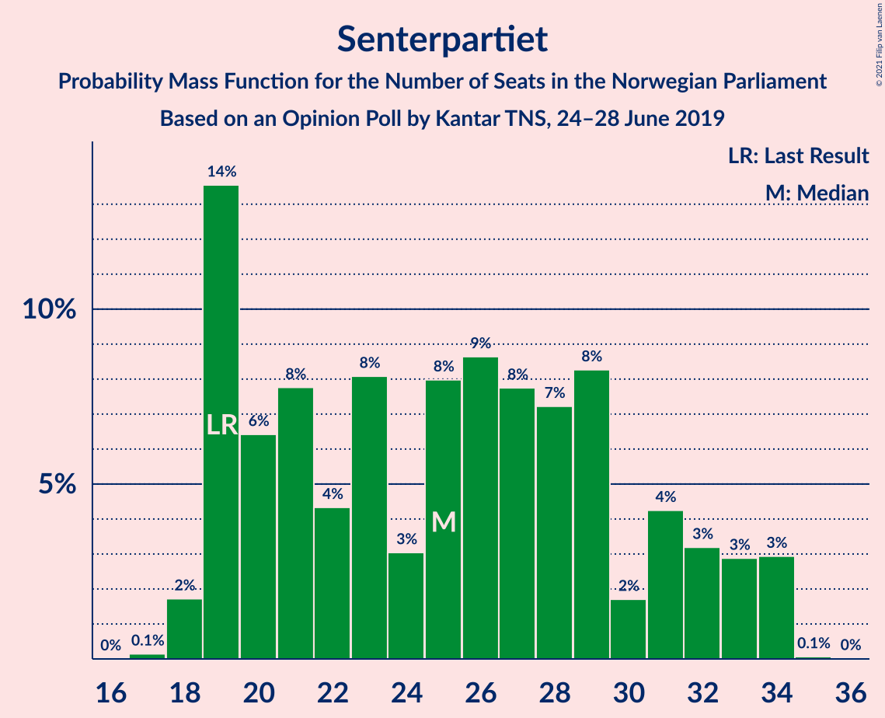
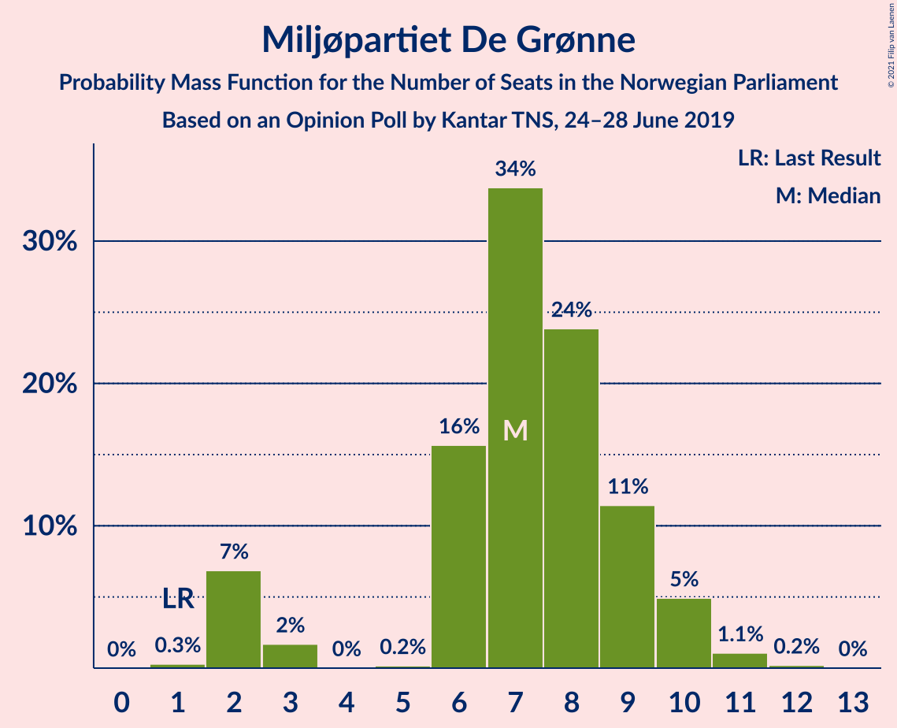
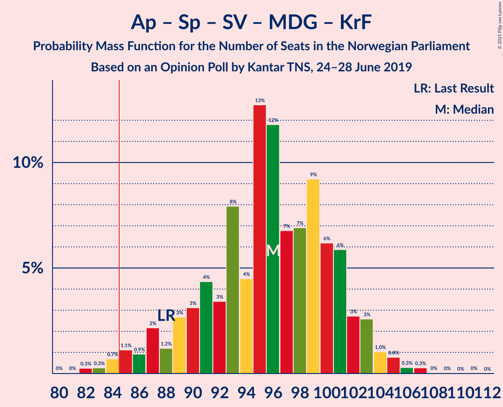
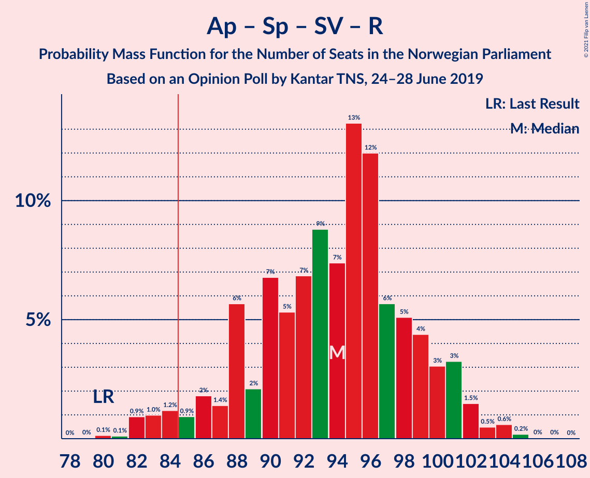
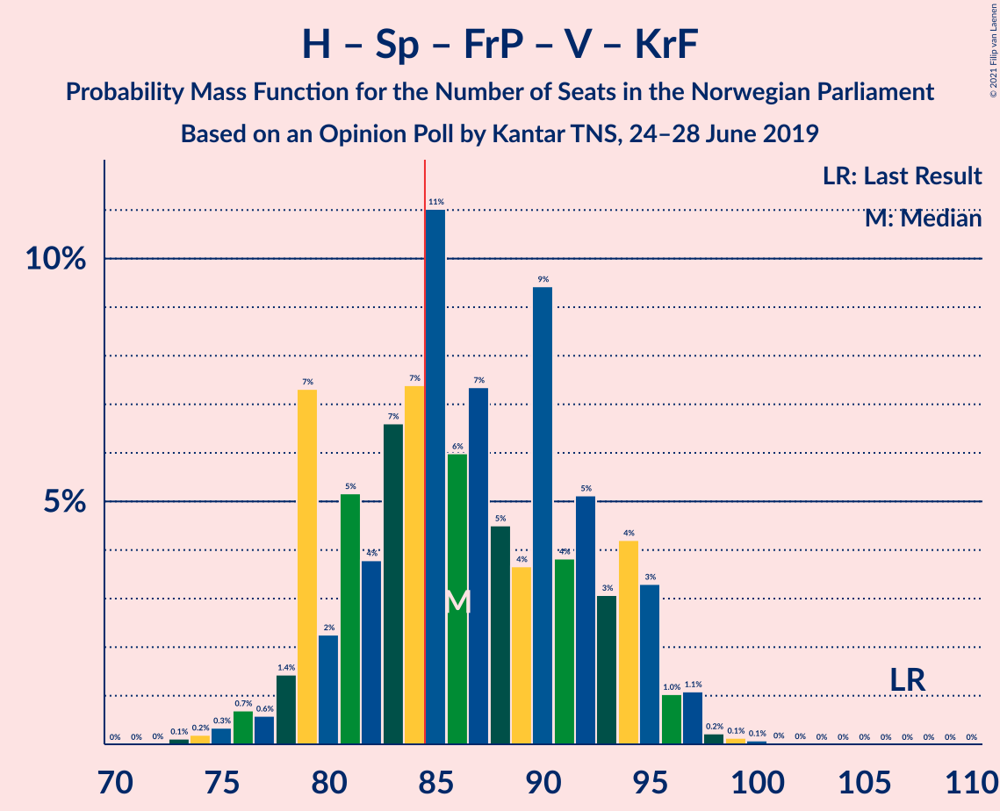
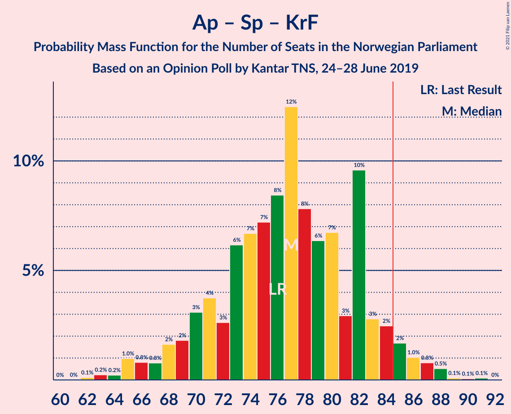
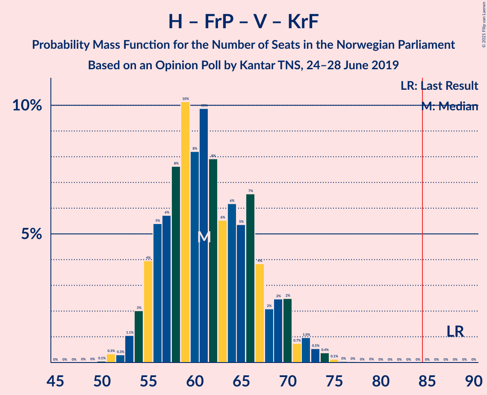
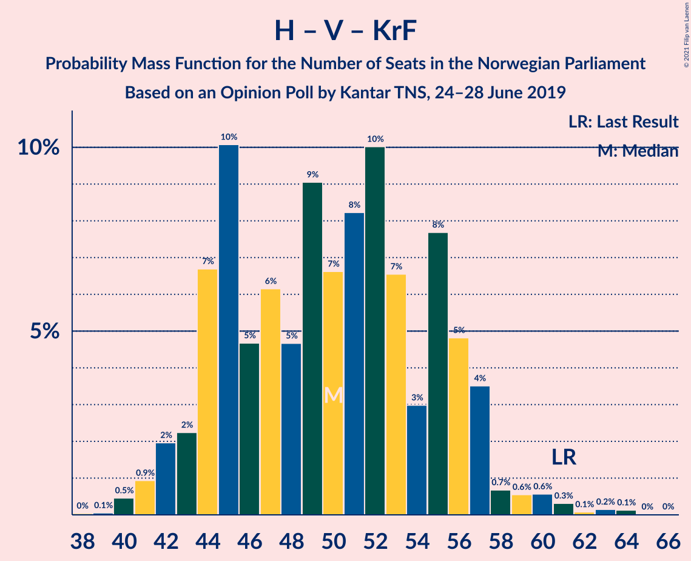
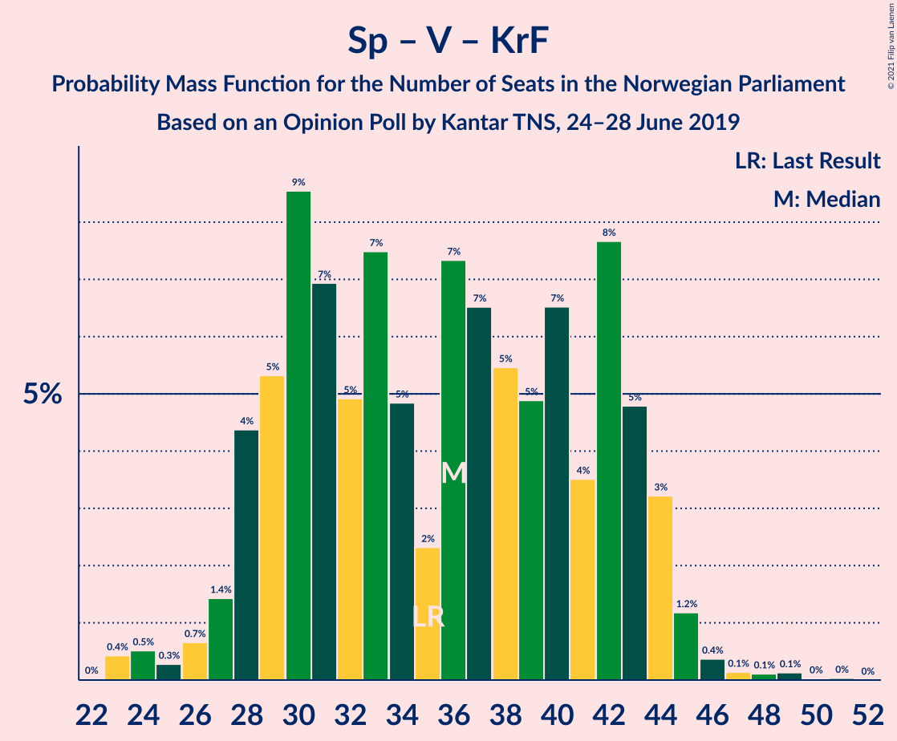

# Opinion Poll by Kantar TNS, 24–28 June 2019

<a href="#voting-intentions">Voting Intentions</a> | <a href="#seats">Seats</a> | <a href="#coalitions">Coalitions</a> | <a href="#technical-information">Technical Information</a>

## Voting Intentions

### Confidence Intervals

| Party | Last Result | Poll Result | 80% Confidence Interval | 90% Confidence Interval | 95% Confidence Interval | 99% Confidence Interval |
|:-----:|:-----------:|:-----------:|:-----------------------:|:-----------------------:|:-----------------------:|:-----------------------:|
| Arbeiderpartiet | 27.4% | 25.5% | 23.6–27.6% |23.0–28.2% |22.6–28.7% |21.7–29.7% |
| Høyre | 25.0% | 22.1% | 20.2–24.1% |19.7–24.6% |19.3–25.1% |18.4–26.1% |
| Senterpartiet | 10.3% | 13.3% | 11.9–15.0% |11.5–15.5% |11.1–15.9% |10.5–16.8% |
| Sosialistisk Venstreparti | 6.0% | 7.8% | 6.7–9.2% |6.4–9.6% |6.1–9.9% |5.6–10.6% |
| Fremskrittspartiet | 15.2% | 7.4% | 6.4–8.8% |6.1–9.2% |5.8–9.5% |5.3–10.2% |
| Rødt | 2.4% | 5.6% | 4.7–6.8% |4.5–7.2% |4.2–7.5% |3.8–8.1% |
| Venstre | 4.4% | 5.0% | 4.1–6.2% |3.9–6.5% |3.7–6.8% |3.3–7.4% |
| Miljøpartiet De Grønne | 3.2% | 4.9% | 4.0–6.0% |3.8–6.3% |3.6–6.6% |3.2–7.2% |
| Kristelig Folkeparti | 4.2% | 3.5% | 2.8–4.5% |2.5–4.7% |2.4–5.0% |2.1–5.5% |

*Note:* The poll result column reflects the actual value used in the calculations. Published results may vary slightly, and in addition be rounded to fewer digits.

## Seats

### Confidence Intervals

| Party | Last Result | Median | 80% Confidence Interval | 90% Confidence Interval | 95% Confidence Interval | 99% Confidence Interval |
|:-----:|:-----------:|:------:|:-----------------------:|:-----------------------:|:-----------------------:|:-----------------------:|
| <a href="#arbeiderpartiet">Arbeiderpartiet</a> | 49 | 51 | 45–56 |43–56 |42–57 |40–58 |
| <a href="#høyre">Høyre</a> | 45 | 39 | 36–47 |35–47 |34–48 |33–50 |
| <a href="#senterpartiet">Senterpartiet</a> | 19 | 23 | 19–34 |19–34 |19–35 |19–36 |
| <a href="#sosialistisk-venstreparti">Sosialistisk Venstreparti</a> | 11 | 12 | 9–14 |9–15 |8–17 |7–17 |
| <a href="#fremskrittspartiet">Fremskrittspartiet</a> | 27 | 11 | 9–14 |8–15 |8–15 |7–18 |
| <a href="#rødt">Rødt</a> | 1 | 8 | 6–10 |6–11 |6–11 |2–13 |
| <a href="#venstre">Venstre</a> | 8 | 7 | 6–9 |2–10 |2–10 |2–11 |
| <a href="#miljøpartiet-de-grønne">Miljøpartiet De Grønne</a> | 1 | 7 | 6–9 |2–9 |2–10 |1–11 |
| <a href="#kristelig-folkeparti">Kristelig Folkeparti</a> | 8 | 3 | 1–6 |1–7 |1–7 |0–8 |

### Arbeiderpartiet

*For a full overview of the results for this party, see the [Arbeiderpartiet](party-arbeiderpartiet.html) page.*

| Number of Seats | Probability | Accumulated | Special Marks |
|:---------------:|:-----------:|:-----------:|:-------------:|
| 38 | 0% | 100% |  |
| 39 | 0.1% | 99.9% |  |
| 40 | 0.7% | 99.9% |  |
| 41 | 1.2% | 99.2% |  |
| 42 | 1.4% | 98% |  |
| 43 | 2% | 97% |  |
| 44 | 3% | 94% |  |
| 45 | 13% | 92% |  |
| 46 | 5% | 79% |  |
| 47 | 6% | 74% |  |
| 48 | 3% | 68% |  |
| 49 | 3% | 66% | Last Result |
| 50 | 2% | 63% |  |
| 51 | 15% | 61% | Median |
| 52 | 6% | 46% |  |
| 53 | 3% | 39% |  |
| 54 | 12% | 36% |  |
| 55 | 14% | 24% |  |
| 56 | 8% | 11% |  |
| 57 | 1.0% | 3% |  |
| 58 | 1.1% | 2% |  |
| 59 | 0.4% | 0.5% |  |
| 60 | 0.1% | 0.1% |  |
| 61 | 0% | 0% |  |

### Høyre

*For a full overview of the results for this party, see the [Høyre](party-høyre.html) page.*

| Number of Seats | Probability | Accumulated | Special Marks |
|:---------------:|:-----------:|:-----------:|:-------------:|
| 30 | 0.1% | 100% |  |
| 31 | 0.1% | 99.9% |  |
| 32 | 0.1% | 99.8% |  |
| 33 | 0.3% | 99.6% |  |
| 34 | 4% | 99.3% |  |
| 35 | 4% | 95% |  |
| 36 | 11% | 92% |  |
| 37 | 18% | 81% |  |
| 38 | 3% | 63% |  |
| 39 | 12% | 60% | Median |
| 40 | 5% | 48% |  |
| 41 | 9% | 43% |  |
| 42 | 2% | 35% |  |
| 43 | 3% | 32% |  |
| 44 | 9% | 29% |  |
| 45 | 0.7% | 21% | Last Result |
| 46 | 2% | 20% |  |
| 47 | 13% | 18% |  |
| 48 | 2% | 4% |  |
| 49 | 1.3% | 2% |  |
| 50 | 0.4% | 0.6% |  |
| 51 | 0.1% | 0.2% |  |
| 52 | 0% | 0.1% |  |
| 53 | 0% | 0.1% |  |
| 54 | 0% | 0% |  |

### Senterpartiet

*For a full overview of the results for this party, see the [Senterpartiet](party-senterpartiet.html) page.*

| Number of Seats | Probability | Accumulated | Special Marks |
|:---------------:|:-----------:|:-----------:|:-------------:|
| 18 | 0.3% | 100% |  |
| 19 | 14% | 99.7% | Last Result |
| 20 | 23% | 86% |  |
| 21 | 8% | 62% |  |
| 22 | 1.0% | 54% |  |
| 23 | 9% | 53% | Median |
| 24 | 8% | 44% |  |
| 25 | 6% | 36% |  |
| 26 | 4% | 30% |  |
| 27 | 1.2% | 26% |  |
| 28 | 1.1% | 25% |  |
| 29 | 2% | 24% |  |
| 30 | 2% | 22% |  |
| 31 | 2% | 20% |  |
| 32 | 2% | 18% |  |
| 33 | 0.9% | 16% |  |
| 34 | 10% | 15% |  |
| 35 | 3% | 4% |  |
| 36 | 1.1% | 1.1% |  |
| 37 | 0% | 0% |  |

### Sosialistisk Venstreparti

*For a full overview of the results for this party, see the [Sosialistisk Venstreparti](party-sosialistiskvenstreparti.html) page.*

| Number of Seats | Probability | Accumulated | Special Marks |
|:---------------:|:-----------:|:-----------:|:-------------:|
| 7 | 0.5% | 100% |  |
| 8 | 2% | 99.4% |  |
| 9 | 7% | 97% |  |
| 10 | 20% | 90% |  |
| 11 | 17% | 70% | Last Result |
| 12 | 16% | 53% | Median |
| 13 | 24% | 36% |  |
| 14 | 4% | 12% |  |
| 15 | 4% | 8% |  |
| 16 | 1.2% | 4% |  |
| 17 | 2% | 3% |  |
| 18 | 0.2% | 0.5% |  |
| 19 | 0.2% | 0.3% |  |
| 20 | 0.1% | 0.1% |  |
| 21 | 0% | 0% |  |

### Fremskrittspartiet

*For a full overview of the results for this party, see the [Fremskrittspartiet](party-fremskrittspartiet.html) page.*

| Number of Seats | Probability | Accumulated | Special Marks |
|:---------------:|:-----------:|:-----------:|:-------------:|
| 6 | 0.2% | 100% |  |
| 7 | 0.6% | 99.8% |  |
| 8 | 6% | 99.1% |  |
| 9 | 16% | 93% |  |
| 10 | 24% | 78% |  |
| 11 | 13% | 54% | Median |
| 12 | 25% | 41% |  |
| 13 | 6% | 16% |  |
| 14 | 4% | 10% |  |
| 15 | 4% | 6% |  |
| 16 | 0.6% | 2% |  |
| 17 | 0.9% | 2% |  |
| 18 | 0.5% | 0.8% |  |
| 19 | 0% | 0.2% |  |
| 20 | 0.2% | 0.2% |  |
| 21 | 0% | 0.1% |  |
| 22 | 0% | 0% |  |
| 23 | 0% | 0% |  |
| 24 | 0% | 0% |  |
| 25 | 0% | 0% |  |
| 26 | 0% | 0% |  |
| 27 | 0% | 0% | Last Result |

### Rødt

*For a full overview of the results for this party, see the [Rødt](party-rødt.html) page.*

| Number of Seats | Probability | Accumulated | Special Marks |
|:---------------:|:-----------:|:-----------:|:-------------:|
| 1 | 0% | 100% | Last Result |
| 2 | 1.3% | 100% |  |
| 3 | 0% | 98.7% |  |
| 4 | 0% | 98.7% |  |
| 5 | 0.2% | 98.7% |  |
| 6 | 16% | 98% |  |
| 7 | 11% | 83% |  |
| 8 | 38% | 72% | Median |
| 9 | 18% | 33% |  |
| 10 | 10% | 15% |  |
| 11 | 4% | 5% |  |
| 12 | 0.4% | 1.0% |  |
| 13 | 0.5% | 0.6% |  |
| 14 | 0% | 0% |  |

### Venstre

*For a full overview of the results for this party, see the [Venstre](party-venstre.html) page.*

| Number of Seats | Probability | Accumulated | Special Marks |
|:---------------:|:-----------:|:-----------:|:-------------:|
| 2 | 7% | 100% |  |
| 3 | 0% | 93% |  |
| 4 | 0% | 93% |  |
| 5 | 0.1% | 93% |  |
| 6 | 10% | 93% |  |
| 7 | 46% | 83% | Median |
| 8 | 11% | 37% | Last Result |
| 9 | 20% | 26% |  |
| 10 | 5% | 6% |  |
| 11 | 1.4% | 2% |  |
| 12 | 0.2% | 0.3% |  |
| 13 | 0.1% | 0.1% |  |
| 14 | 0% | 0% |  |

### Miljøpartiet De Grønne

*For a full overview of the results for this party, see the [Miljøpartiet De Grønne](party-miljøpartietdegrønne.html) page.*

| Number of Seats | Probability | Accumulated | Special Marks |
|:---------------:|:-----------:|:-----------:|:-------------:|
| 1 | 1.0% | 100% | Last Result |
| 2 | 4% | 99.0% |  |
| 3 | 0.3% | 95% |  |
| 4 | 0% | 95% |  |
| 5 | 0.3% | 95% |  |
| 6 | 36% | 94% |  |
| 7 | 36% | 58% | Median |
| 8 | 11% | 22% |  |
| 9 | 7% | 11% |  |
| 10 | 2% | 4% |  |
| 11 | 1.2% | 2% |  |
| 12 | 0.3% | 0.3% |  |
| 13 | 0% | 0% |  |

### Kristelig Folkeparti

*For a full overview of the results for this party, see the [Kristelig Folkeparti](party-kristeligfolkeparti.html) page.*

| Number of Seats | Probability | Accumulated | Special Marks |
|:---------------:|:-----------:|:-----------:|:-------------:|
| 0 | 0.6% | 100% |  |
| 1 | 24% | 99.4% |  |
| 2 | 21% | 75% |  |
| 3 | 29% | 54% | Median |
| 4 | 0.3% | 25% |  |
| 5 | 3% | 25% |  |
| 6 | 12% | 22% |  |
| 7 | 8% | 9% |  |
| 8 | 2% | 2% | Last Result |
| 9 | 0.1% | 0.1% |  |
| 10 | 0% | 0% |  |

## Coalitions

### Confidence Intervals

| Coalition | Last Result | Median | Majority? | 80% Confidence Interval | 90% Confidence Interval | 95% Confidence Interval | 99% Confidence Interval |
|:---------:|:-----------:|:------:|:---------:|:-----------------------:|:-----------------------:|:-----------------------:|:-----------------------:|
| Arbeiderpartiet – Senterpartiet – Sosialistisk Venstreparti – Rødt – Miljøpartiet De Grønne | 81 | 101 | 100% | 96–108 | 93–109 | 91–110 | 89–115 |
| Arbeiderpartiet – Senterpartiet – Sosialistisk Venstreparti – Miljøpartiet De Grønne – Kristelig Folkeparti | 88 | 97 | 98.7% | 91–101 | 89–103 | 86–104 | 84–107 |
| Arbeiderpartiet – Senterpartiet – Sosialistisk Venstreparti – Rødt | 80 | 94 | 98% | 90–101 | 86–102 | 85–103 | 83–105 |
| Arbeiderpartiet – Senterpartiet – Sosialistisk Venstreparti – Miljøpartiet De Grønne | 80 | 94 | 94% | 88–99 | 84–100 | 82–100 | 81–104 |
| Høyre – Senterpartiet – Fremskrittspartiet – Venstre – Kristelig Folkeparti | 107 | 86 | 53% | 79–92 | 78–96 | 76–96 | 75–97 |
| Arbeiderpartiet – Senterpartiet – Sosialistisk Venstreparti | 79 | 86 | 75% | 81–92 | 77–93 | 77–93 | 73–95 |
| Arbeiderpartiet – Senterpartiet – Miljøpartiet De Grønne – Kristelig Folkeparti | 77 | 85 | 53% | 80–90 | 78–92 | 75–93 | 71–94 |
| Arbeiderpartiet – Senterpartiet – Kristelig Folkeparti | 76 | 79 | 6% | 73–83 | 71–85 | 69–86 | 64–86 |
| Arbeiderpartiet – Senterpartiet | 68 | 76 | 0.2% | 70–79 | 66–80 | 65–80 | 62–83 |
| Høyre – Fremskrittspartiet – Venstre – Miljøpartiet De Grønne – Kristelig Folkeparti | 89 | 68 | 0% | 62–77 | 61–77 | 60–78 | 58–81 |
| Høyre – Fremskrittspartiet – Venstre – Kristelig Folkeparti | 88 | 61 | 0% | 56–70 | 54–70 | 53–71 | 52–73 |
| Arbeiderpartiet – Sosialistisk Venstreparti | 60 | 64 | 0% | 55–68 | 55–69 | 54–69 | 52–69 |
| Høyre – Fremskrittspartiet – Venstre | 80 | 58 | 0% | 53–68 | 51–68 | 50–68 | 47–69 |
| Høyre – Fremskrittspartiet | 72 | 50 | 0% | 47–59 | 45–59 | 45–59 | 44–62 |
| Høyre – Venstre – Kristelig Folkeparti | 61 | 51 | 0% | 45–58 | 44–58 | 41–59 | 40–61 |
| Senterpartiet – Venstre – Kristelig Folkeparti | 35 | 32 | 0% | 30–44 | 29–45 | 28–45 | 27–47 |

### Arbeiderpartiet – Senterpartiet – Sosialistisk Venstreparti – Rødt – Miljøpartiet De Grønne

| Number of Seats | Probability | Accumulated | Special Marks |
|:---------------:|:-----------:|:-----------:|:-------------:|
| 81 | 0% | 100% | Last Result |
| 82 | 0% | 100% |  |
| 83 | 0% | 100% |  |
| 84 | 0% | 100% |  |
| 85 | 0% | 100% | Majority |
| 86 | 0.1% | 100% |  |
| 87 | 0.1% | 99.9% |  |
| 88 | 0.3% | 99.8% |  |
| 89 | 0.3% | 99.6% |  |
| 90 | 0.3% | 99.2% |  |
| 91 | 2% | 99.0% |  |
| 92 | 1.3% | 97% |  |
| 93 | 3% | 96% |  |
| 94 | 0.5% | 93% |  |
| 95 | 1.0% | 92% |  |
| 96 | 3% | 91% |  |
| 97 | 9% | 89% |  |
| 98 | 5% | 80% |  |
| 99 | 16% | 75% |  |
| 100 | 3% | 59% |  |
| 101 | 7% | 57% | Median |
| 102 | 5% | 49% |  |
| 103 | 10% | 44% |  |
| 104 | 9% | 34% |  |
| 105 | 8% | 25% |  |
| 106 | 2% | 17% |  |
| 107 | 2% | 15% |  |
| 108 | 7% | 13% |  |
| 109 | 2% | 7% |  |
| 110 | 3% | 5% |  |
| 111 | 0.6% | 2% |  |
| 112 | 0.3% | 0.9% |  |
| 113 | 0.1% | 0.7% |  |
| 114 | 0% | 0.6% |  |
| 115 | 0.5% | 0.5% |  |
| 116 | 0% | 0% |  |

### Arbeiderpartiet – Senterpartiet – Sosialistisk Venstreparti – Miljøpartiet De Grønne – Kristelig Folkeparti

| Number of Seats | Probability | Accumulated | Special Marks |
|:---------------:|:-----------:|:-----------:|:-------------:|
| 82 | 0.1% | 100% |  |
| 83 | 0.2% | 99.9% |  |
| 84 | 1.0% | 99.7% |  |
| 85 | 1.0% | 98.7% | Majority |
| 86 | 0.3% | 98% |  |
| 87 | 1.0% | 97% |  |
| 88 | 0.8% | 96% | Last Result |
| 89 | 2% | 96% |  |
| 90 | 2% | 93% |  |
| 91 | 2% | 92% |  |
| 92 | 1.1% | 90% |  |
| 93 | 12% | 88% |  |
| 94 | 9% | 76% |  |
| 95 | 2% | 67% |  |
| 96 | 7% | 65% | Median |
| 97 | 18% | 58% |  |
| 98 | 12% | 41% |  |
| 99 | 3% | 28% |  |
| 100 | 8% | 26% |  |
| 101 | 11% | 18% |  |
| 102 | 2% | 7% |  |
| 103 | 2% | 5% |  |
| 104 | 0.6% | 3% |  |
| 105 | 1.4% | 2% |  |
| 106 | 0.2% | 0.9% |  |
| 107 | 0.6% | 0.7% |  |
| 108 | 0% | 0.1% |  |
| 109 | 0% | 0.1% |  |
| 110 | 0% | 0% |  |

### Arbeiderpartiet – Senterpartiet – Sosialistisk Venstreparti – Rødt

| Number of Seats | Probability | Accumulated | Special Marks |
|:---------------:|:-----------:|:-----------:|:-------------:|
| 79 | 0% | 100% |  |
| 80 | 0% | 99.9% | Last Result |
| 81 | 0.2% | 99.9% |  |
| 82 | 0.2% | 99.7% |  |
| 83 | 0.3% | 99.5% |  |
| 84 | 2% | 99.2% |  |
| 85 | 2% | 98% | Majority |
| 86 | 0.7% | 96% |  |
| 87 | 3% | 95% |  |
| 88 | 1.4% | 92% |  |
| 89 | 0.7% | 91% |  |
| 90 | 2% | 90% |  |
| 91 | 9% | 89% |  |
| 92 | 19% | 80% |  |
| 93 | 6% | 61% |  |
| 94 | 5% | 55% | Median |
| 95 | 7% | 50% |  |
| 96 | 4% | 42% |  |
| 97 | 11% | 39% |  |
| 98 | 7% | 28% |  |
| 99 | 7% | 21% |  |
| 100 | 2% | 14% |  |
| 101 | 5% | 12% |  |
| 102 | 2% | 7% |  |
| 103 | 4% | 5% |  |
| 104 | 0.5% | 1.3% |  |
| 105 | 0.6% | 0.8% |  |
| 106 | 0.2% | 0.2% |  |
| 107 | 0% | 0% |  |

### Arbeiderpartiet – Senterpartiet – Sosialistisk Venstreparti – Miljøpartiet De Grønne

| Number of Seats | Probability | Accumulated | Special Marks |
|:---------------:|:-----------:|:-----------:|:-------------:|
| 78 | 0.2% | 100% |  |
| 79 | 0.1% | 99.8% |  |
| 80 | 0.1% | 99.7% | Last Result |
| 81 | 1.2% | 99.6% |  |
| 82 | 1.1% | 98% |  |
| 83 | 2% | 97% |  |
| 84 | 0.8% | 95% |  |
| 85 | 0.5% | 94% | Majority |
| 86 | 1.4% | 94% |  |
| 87 | 2% | 93% |  |
| 88 | 2% | 90% |  |
| 89 | 1.3% | 89% |  |
| 90 | 1.0% | 87% |  |
| 91 | 20% | 86% |  |
| 92 | 10% | 67% |  |
| 93 | 5% | 57% | Median |
| 94 | 6% | 52% |  |
| 95 | 13% | 46% |  |
| 96 | 16% | 33% |  |
| 97 | 1.5% | 17% |  |
| 98 | 2% | 16% |  |
| 99 | 9% | 14% |  |
| 100 | 3% | 5% |  |
| 101 | 0.6% | 2% |  |
| 102 | 0.2% | 1.2% |  |
| 103 | 0.1% | 1.0% |  |
| 104 | 0.7% | 0.9% |  |
| 105 | 0.1% | 0.2% |  |
| 106 | 0% | 0.1% |  |
| 107 | 0% | 0% |  |

### Høyre – Senterpartiet – Fremskrittspartiet – Venstre – Kristelig Folkeparti

| Number of Seats | Probability | Accumulated | Special Marks |
|:---------------:|:-----------:|:-----------:|:-------------:|
| 74 | 0.1% | 100% |  |
| 75 | 0.5% | 99.9% |  |
| 76 | 2% | 99.4% |  |
| 77 | 0.2% | 97% |  |
| 78 | 4% | 97% |  |
| 79 | 8% | 93% |  |
| 80 | 2% | 85% |  |
| 81 | 3% | 83% |  |
| 82 | 5% | 80% |  |
| 83 | 12% | 75% | Median |
| 84 | 10% | 62% |  |
| 85 | 2% | 53% | Majority |
| 86 | 1.4% | 50% |  |
| 87 | 4% | 49% |  |
| 88 | 4% | 45% |  |
| 89 | 3% | 42% |  |
| 90 | 19% | 39% |  |
| 91 | 1.0% | 20% |  |
| 92 | 11% | 19% |  |
| 93 | 0.7% | 8% |  |
| 94 | 2% | 7% |  |
| 95 | 0.6% | 6% |  |
| 96 | 4% | 5% |  |
| 97 | 0.8% | 1.3% |  |
| 98 | 0.1% | 0.5% |  |
| 99 | 0.3% | 0.4% |  |
| 100 | 0.1% | 0.1% |  |
| 101 | 0% | 0.1% |  |
| 102 | 0% | 0% |  |
| 103 | 0% | 0% |  |
| 104 | 0% | 0% |  |
| 105 | 0% | 0% |  |
| 106 | 0% | 0% |  |
| 107 | 0% | 0% | Last Result |

### Arbeiderpartiet – Senterpartiet – Sosialistisk Venstreparti

| Number of Seats | Probability | Accumulated | Special Marks |
|:---------------:|:-----------:|:-----------:|:-------------:|
| 72 | 0% | 100% |  |
| 73 | 0.8% | 99.9% |  |
| 74 | 0.9% | 99.2% |  |
| 75 | 0.4% | 98% |  |
| 76 | 0.3% | 98% |  |
| 77 | 3% | 98% |  |
| 78 | 0.6% | 95% |  |
| 79 | 0.8% | 94% | Last Result |
| 80 | 1.4% | 93% |  |
| 81 | 3% | 92% |  |
| 82 | 0.6% | 89% |  |
| 83 | 1.4% | 89% |  |
| 84 | 12% | 87% |  |
| 85 | 15% | 75% | Majority |
| 86 | 12% | 60% | Median |
| 87 | 6% | 48% |  |
| 88 | 5% | 43% |  |
| 89 | 11% | 38% |  |
| 90 | 12% | 27% |  |
| 91 | 2% | 15% |  |
| 92 | 8% | 13% |  |
| 93 | 4% | 5% |  |
| 94 | 0.8% | 1.4% |  |
| 95 | 0.2% | 0.6% |  |
| 96 | 0.3% | 0.4% |  |
| 97 | 0.1% | 0.1% |  |
| 98 | 0% | 0.1% |  |
| 99 | 0% | 0% |  |

### Arbeiderpartiet – Senterpartiet – Miljøpartiet De Grønne – Kristelig Folkeparti

| Number of Seats | Probability | Accumulated | Special Marks |
|:---------------:|:-----------:|:-----------:|:-------------:|
| 69 | 0.3% | 100% |  |
| 70 | 0.1% | 99.6% |  |
| 71 | 0.2% | 99.6% |  |
| 72 | 0.4% | 99.4% |  |
| 73 | 0.3% | 99.0% |  |
| 74 | 0.6% | 98.7% |  |
| 75 | 1.3% | 98% |  |
| 76 | 0.6% | 97% |  |
| 77 | 0.9% | 96% | Last Result |
| 78 | 0.8% | 95% |  |
| 79 | 4% | 94% |  |
| 80 | 12% | 91% |  |
| 81 | 2% | 79% |  |
| 82 | 2% | 76% |  |
| 83 | 13% | 74% |  |
| 84 | 9% | 62% | Median |
| 85 | 8% | 53% | Majority |
| 86 | 5% | 44% |  |
| 87 | 9% | 40% |  |
| 88 | 17% | 31% |  |
| 89 | 1.4% | 13% |  |
| 90 | 3% | 12% |  |
| 91 | 2% | 9% |  |
| 92 | 2% | 7% |  |
| 93 | 3% | 5% |  |
| 94 | 1.1% | 2% |  |
| 95 | 0.3% | 0.4% |  |
| 96 | 0.1% | 0.1% |  |
| 97 | 0% | 0% |  |

### Arbeiderpartiet – Senterpartiet – Kristelig Folkeparti

| Number of Seats | Probability | Accumulated | Special Marks |
|:---------------:|:-----------:|:-----------:|:-------------:|
| 63 | 0.4% | 100% |  |
| 64 | 0.2% | 99.6% |  |
| 65 | 0% | 99.4% |  |
| 66 | 0.1% | 99.4% |  |
| 67 | 1.3% | 99.2% |  |
| 68 | 0.4% | 98% |  |
| 69 | 1.0% | 98% |  |
| 70 | 1.3% | 97% |  |
| 71 | 0.6% | 95% |  |
| 72 | 2% | 95% |  |
| 73 | 15% | 93% |  |
| 74 | 3% | 78% |  |
| 75 | 4% | 76% |  |
| 76 | 2% | 71% | Last Result |
| 77 | 13% | 69% | Median |
| 78 | 6% | 56% |  |
| 79 | 11% | 50% |  |
| 80 | 4% | 39% |  |
| 81 | 14% | 35% |  |
| 82 | 9% | 21% |  |
| 83 | 4% | 12% |  |
| 84 | 2% | 8% |  |
| 85 | 2% | 6% | Majority |
| 86 | 3% | 4% |  |
| 87 | 0.1% | 0.4% |  |
| 88 | 0.2% | 0.3% |  |
| 89 | 0.1% | 0.1% |  |
| 90 | 0% | 0% |  |

### Arbeiderpartiet – Senterpartiet

| Number of Seats | Probability | Accumulated | Special Marks |
|:---------------:|:-----------:|:-----------:|:-------------:|
| 61 | 0.4% | 100% |  |
| 62 | 0.2% | 99.5% |  |
| 63 | 0.1% | 99.3% |  |
| 64 | 1.4% | 99.2% |  |
| 65 | 0.7% | 98% |  |
| 66 | 3% | 97% |  |
| 67 | 1.4% | 95% |  |
| 68 | 1.0% | 93% | Last Result |
| 69 | 0.9% | 92% |  |
| 70 | 2% | 91% |  |
| 71 | 14% | 90% |  |
| 72 | 4% | 75% |  |
| 73 | 3% | 71% |  |
| 74 | 13% | 69% | Median |
| 75 | 6% | 56% |  |
| 76 | 8% | 50% |  |
| 77 | 8% | 42% |  |
| 78 | 13% | 34% |  |
| 79 | 14% | 22% |  |
| 80 | 6% | 8% |  |
| 81 | 0.4% | 2% |  |
| 82 | 1.2% | 2% |  |
| 83 | 0.4% | 0.9% |  |
| 84 | 0.2% | 0.4% |  |
| 85 | 0.1% | 0.2% | Majority |
| 86 | 0.1% | 0.1% |  |
| 87 | 0% | 0% |  |

### Høyre – Fremskrittspartiet – Venstre – Miljøpartiet De Grønne – Kristelig Folkeparti

| Number of Seats | Probability | Accumulated | Special Marks |
|:---------------:|:-----------:|:-----------:|:-------------:|
| 57 | 0.2% | 100% |  |
| 58 | 0.4% | 99.8% |  |
| 59 | 0.5% | 99.4% |  |
| 60 | 3% | 98.9% |  |
| 61 | 3% | 96% |  |
| 62 | 7% | 94% |  |
| 63 | 6% | 87% |  |
| 64 | 10% | 80% |  |
| 65 | 3% | 71% |  |
| 66 | 5% | 68% |  |
| 67 | 10% | 63% | Median |
| 68 | 5% | 53% |  |
| 69 | 6% | 48% |  |
| 70 | 15% | 42% |  |
| 71 | 0.7% | 27% |  |
| 72 | 3% | 26% |  |
| 73 | 4% | 23% |  |
| 74 | 1.1% | 19% |  |
| 75 | 0.9% | 18% |  |
| 76 | 0.4% | 17% |  |
| 77 | 14% | 17% |  |
| 78 | 0.9% | 3% |  |
| 79 | 0.9% | 2% |  |
| 80 | 0% | 1.2% |  |
| 81 | 0.7% | 1.1% |  |
| 82 | 0.3% | 0.4% |  |
| 83 | 0.1% | 0.1% |  |
| 84 | 0% | 0% |  |
| 85 | 0% | 0% | Majority |
| 86 | 0% | 0% |  |
| 87 | 0% | 0% |  |
| 88 | 0% | 0% |  |
| 89 | 0% | 0% | Last Result |

### Høyre – Fremskrittspartiet – Venstre – Kristelig Folkeparti

| Number of Seats | Probability | Accumulated | Special Marks |
|:---------------:|:-----------:|:-----------:|:-------------:|
| 50 | 0.1% | 100% |  |
| 51 | 0.3% | 99.9% |  |
| 52 | 0.7% | 99.6% |  |
| 53 | 3% | 98.9% |  |
| 54 | 3% | 96% |  |
| 55 | 1.1% | 93% |  |
| 56 | 7% | 92% |  |
| 57 | 8% | 85% |  |
| 58 | 10% | 76% |  |
| 59 | 5% | 66% |  |
| 60 | 6% | 61% | Median |
| 61 | 6% | 55% |  |
| 62 | 7% | 49% |  |
| 63 | 1.4% | 41% |  |
| 64 | 14% | 40% |  |
| 65 | 2% | 26% |  |
| 66 | 2% | 24% |  |
| 67 | 3% | 21% |  |
| 68 | 1.1% | 18% |  |
| 69 | 0.7% | 17% |  |
| 70 | 13% | 16% |  |
| 71 | 2% | 3% |  |
| 72 | 1.3% | 2% |  |
| 73 | 0.2% | 0.6% |  |
| 74 | 0.2% | 0.4% |  |
| 75 | 0.1% | 0.2% |  |
| 76 | 0.1% | 0.1% |  |
| 77 | 0% | 0% |  |
| 78 | 0% | 0% |  |
| 79 | 0% | 0% |  |
| 80 | 0% | 0% |  |
| 81 | 0% | 0% |  |
| 82 | 0% | 0% |  |
| 83 | 0% | 0% |  |
| 84 | 0% | 0% |  |
| 85 | 0% | 0% | Majority |
| 86 | 0% | 0% |  |
| 87 | 0% | 0% |  |
| 88 | 0% | 0% | Last Result |

### Arbeiderpartiet – Sosialistisk Venstreparti

| Number of Seats | Probability | Accumulated | Special Marks |
|:---------------:|:-----------:|:-----------:|:-------------:|
| 49 | 0% | 100% |  |
| 50 | 0.2% | 99.9% |  |
| 51 | 0.1% | 99.7% |  |
| 52 | 0.3% | 99.7% |  |
| 53 | 2% | 99.4% |  |
| 54 | 2% | 98% |  |
| 55 | 10% | 96% |  |
| 56 | 2% | 86% |  |
| 57 | 9% | 84% |  |
| 58 | 4% | 75% |  |
| 59 | 4% | 70% |  |
| 60 | 2% | 66% | Last Result |
| 61 | 3% | 64% |  |
| 62 | 2% | 60% |  |
| 63 | 1.2% | 58% | Median |
| 64 | 15% | 57% |  |
| 65 | 13% | 42% |  |
| 66 | 4% | 29% |  |
| 67 | 14% | 25% |  |
| 68 | 4% | 10% |  |
| 69 | 6% | 6% |  |
| 70 | 0.3% | 0.5% |  |
| 71 | 0.1% | 0.2% |  |
| 72 | 0.1% | 0.1% |  |
| 73 | 0% | 0% |  |

### Høyre – Fremskrittspartiet – Venstre

| Number of Seats | Probability | Accumulated | Special Marks |
|:---------------:|:-----------:|:-----------:|:-------------:|
| 47 | 0.7% | 100% |  |
| 48 | 0.3% | 99.3% |  |
| 49 | 0.2% | 99.0% |  |
| 50 | 1.5% | 98.8% |  |
| 51 | 4% | 97% |  |
| 52 | 2% | 93% |  |
| 53 | 5% | 92% |  |
| 54 | 5% | 87% |  |
| 55 | 17% | 82% |  |
| 56 | 8% | 66% |  |
| 57 | 6% | 58% | Median |
| 58 | 10% | 52% |  |
| 59 | 3% | 42% |  |
| 60 | 4% | 39% |  |
| 61 | 10% | 35% |  |
| 62 | 3% | 26% |  |
| 63 | 3% | 23% |  |
| 64 | 3% | 20% |  |
| 65 | 3% | 18% |  |
| 66 | 1.2% | 15% |  |
| 67 | 1.4% | 14% |  |
| 68 | 12% | 12% |  |
| 69 | 0.4% | 0.9% |  |
| 70 | 0.3% | 0.5% |  |
| 71 | 0.1% | 0.2% |  |
| 72 | 0% | 0.1% |  |
| 73 | 0.1% | 0.1% |  |
| 74 | 0% | 0% |  |
| 75 | 0% | 0% |  |
| 76 | 0% | 0% |  |
| 77 | 0% | 0% |  |
| 78 | 0% | 0% |  |
| 79 | 0% | 0% |  |
| 80 | 0% | 0% | Last Result |

### Høyre – Fremskrittspartiet

| Number of Seats | Probability | Accumulated | Special Marks |
|:---------------:|:-----------:|:-----------:|:-------------:|
| 40 | 0.1% | 100% |  |
| 41 | 0% | 99.9% |  |
| 42 | 0% | 99.9% |  |
| 43 | 0.3% | 99.8% |  |
| 44 | 1.3% | 99.6% |  |
| 45 | 4% | 98% |  |
| 46 | 4% | 95% |  |
| 47 | 6% | 90% |  |
| 48 | 17% | 85% |  |
| 49 | 12% | 67% |  |
| 50 | 9% | 56% | Median |
| 51 | 10% | 46% |  |
| 52 | 2% | 36% |  |
| 53 | 2% | 34% |  |
| 54 | 9% | 32% |  |
| 55 | 1.4% | 23% |  |
| 56 | 2% | 22% |  |
| 57 | 0.3% | 20% |  |
| 58 | 4% | 19% |  |
| 59 | 13% | 15% |  |
| 60 | 1.0% | 2% |  |
| 61 | 0.2% | 1.4% |  |
| 62 | 0.9% | 1.3% |  |
| 63 | 0.2% | 0.3% |  |
| 64 | 0.1% | 0.1% |  |
| 65 | 0% | 0% |  |
| 66 | 0% | 0% |  |
| 67 | 0% | 0% |  |
| 68 | 0% | 0% |  |
| 69 | 0% | 0% |  |
| 70 | 0% | 0% |  |
| 71 | 0% | 0% |  |
| 72 | 0% | 0% | Last Result |

### Høyre – Venstre – Kristelig Folkeparti

| Number of Seats | Probability | Accumulated | Special Marks |
|:---------------:|:-----------:|:-----------:|:-------------:|
| 38 | 0% | 100% |  |
| 39 | 0.1% | 99.9% |  |
| 40 | 1.0% | 99.9% |  |
| 41 | 1.5% | 98.9% |  |
| 42 | 0.1% | 97% |  |
| 43 | 1.2% | 97% |  |
| 44 | 5% | 96% |  |
| 45 | 17% | 91% |  |
| 46 | 2% | 74% |  |
| 47 | 3% | 72% |  |
| 48 | 1.5% | 69% |  |
| 49 | 12% | 67% | Median |
| 50 | 4% | 55% |  |
| 51 | 4% | 50% |  |
| 52 | 6% | 47% |  |
| 53 | 4% | 41% |  |
| 54 | 14% | 37% |  |
| 55 | 2% | 23% |  |
| 56 | 2% | 21% |  |
| 57 | 3% | 19% |  |
| 58 | 12% | 16% |  |
| 59 | 3% | 4% |  |
| 60 | 0.7% | 1.4% |  |
| 61 | 0.5% | 0.7% | Last Result |
| 62 | 0% | 0.1% |  |
| 63 | 0% | 0.1% |  |
| 64 | 0% | 0.1% |  |
| 65 | 0% | 0% |  |

### Senterpartiet – Venstre – Kristelig Folkeparti

| Number of Seats | Probability | Accumulated | Special Marks |
|:---------------:|:-----------:|:-----------:|:-------------:|
| 22 | 0.1% | 100% |  |
| 23 | 0% | 99.9% |  |
| 24 | 0% | 99.9% |  |
| 25 | 0% | 99.8% |  |
| 26 | 0% | 99.8% |  |
| 27 | 2% | 99.8% |  |
| 28 | 1.4% | 98% |  |
| 29 | 3% | 97% |  |
| 30 | 13% | 93% |  |
| 31 | 23% | 80% |  |
| 32 | 9% | 57% |  |
| 33 | 14% | 48% | Median |
| 34 | 3% | 34% |  |
| 35 | 0.7% | 31% | Last Result |
| 36 | 0.2% | 30% |  |
| 37 | 0.1% | 30% |  |
| 38 | 0.6% | 30% |  |
| 39 | 3% | 29% |  |
| 40 | 1.0% | 26% |  |
| 41 | 2% | 25% |  |
| 42 | 3% | 23% |  |
| 43 | 4% | 20% |  |
| 44 | 10% | 15% |  |
| 45 | 3% | 5% |  |
| 46 | 1.1% | 2% |  |
| 47 | 0.3% | 0.8% |  |
| 48 | 0.4% | 0.5% |  |
| 49 | 0% | 0.1% |  |
| 50 | 0% | 0% |  |

## Technical Information

### Opinion Poll

+ **Polling firm:** Kantar TNS
+ **Commissioner(s):** —
+ **Fieldwork period:** 24–28 June 2019

### Calculations

+ **Sample size:** 780
+ **Simulations done:** 131,072
+ **Error estimate:** 2.99%

