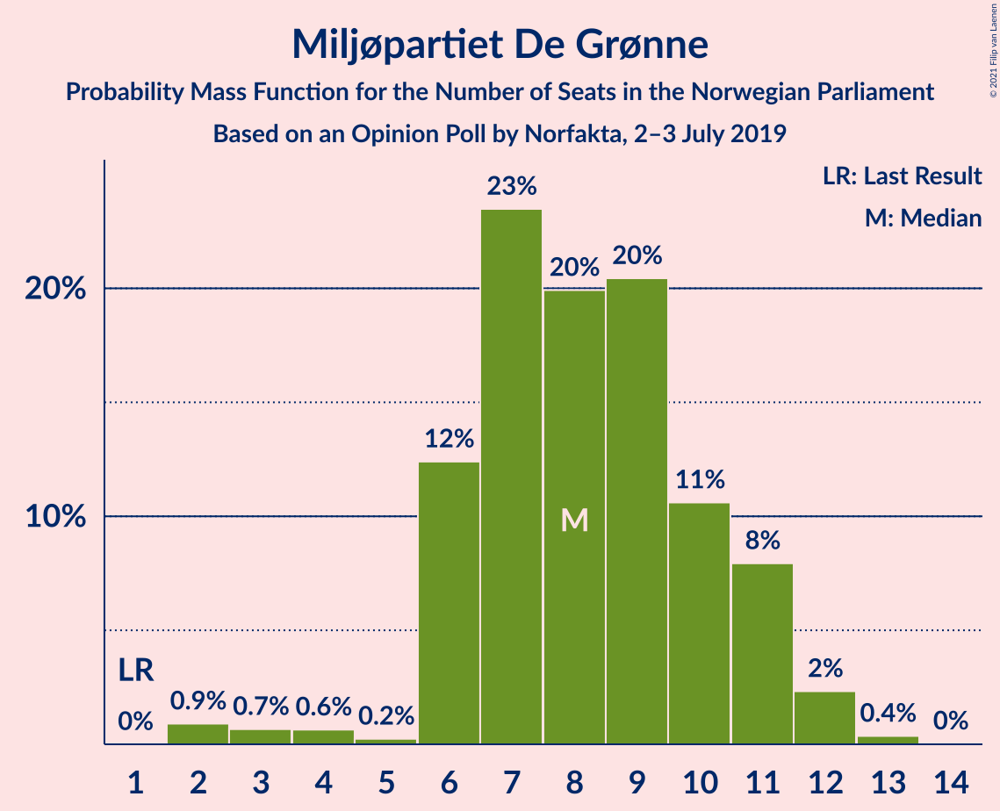
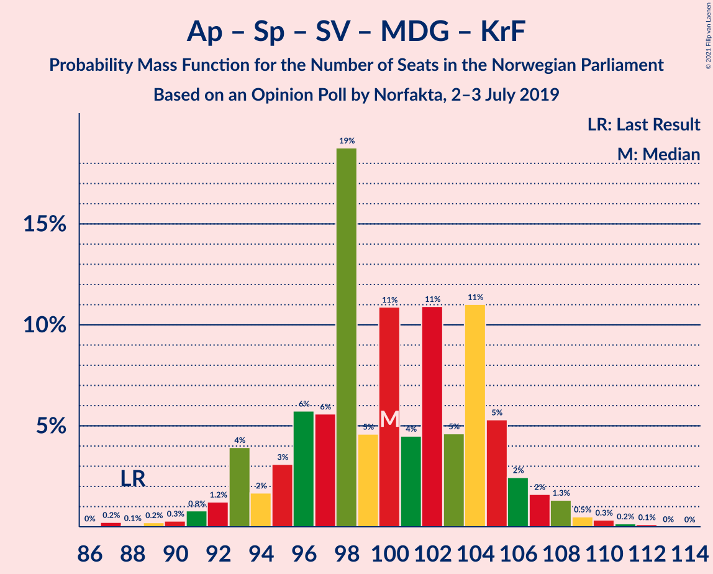
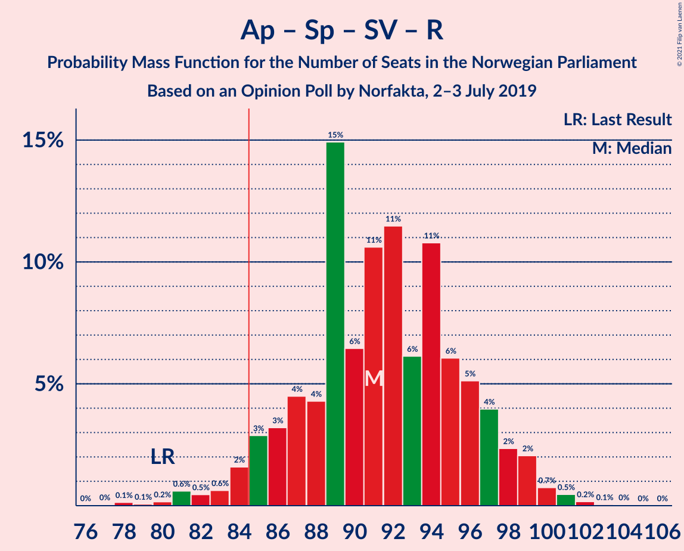
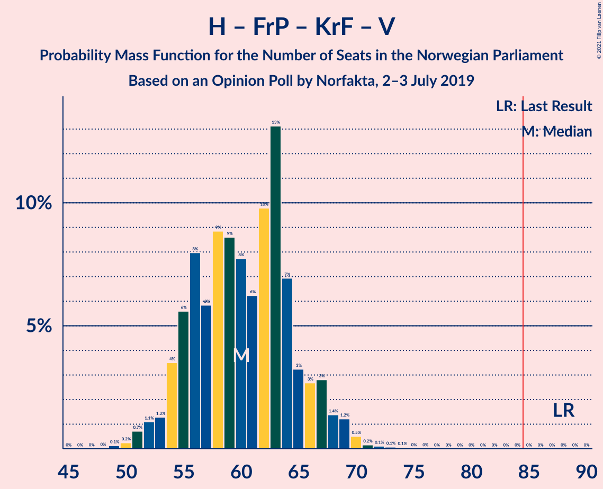
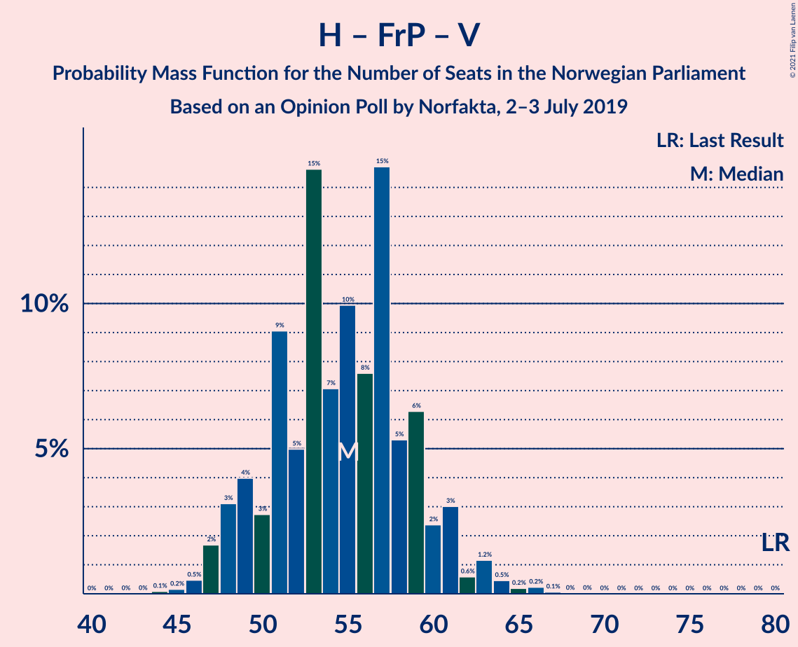

# Opinion Poll by Norfakta, 2–3 July 2019

<a href="#voting-intentions">Voting Intentions</a> | <a href="#seats">Seats</a> | <a href="#coalitions">Coalitions</a> | <a href="#technical-information">Technical Information</a>

## Voting Intentions

### Confidence Intervals

| Party | Last Result | Poll Result | 80% Confidence Interval | 90% Confidence Interval | 95% Confidence Interval | 99% Confidence Interval |
|:-----:|:-----------:|:-----------:|:-----------------------:|:-----------------------:|:-----------------------:|:-----------------------:|
| Arbeiderpartiet | 27.4% | 24.4% | 22.4–26.5% |21.9–27.1% |21.4–27.6% |20.5–28.6% |
| Høyre | 25.0% | 21.2% | 19.3–23.2% |18.8–23.7% |18.4–24.2% |17.6–25.2% |
| Senterpartiet | 10.3% | 15.0% | 13.5–16.8% |13.0–17.3% |12.7–17.8% |11.9–18.7% |
| Fremskrittspartiet | 15.2% | 8.8% | 7.6–10.3% |7.3–10.7% |7.0–11.0% |6.4–11.8% |
| Sosialistisk Venstreparti | 6.0% | 7.6% | 6.5–9.0% |6.2–9.4% |5.9–9.7% |5.4–10.4% |
| Miljøpartiet De Grønne | 3.2% | 5.5% | 4.5–6.7% |4.3–7.0% |4.1–7.3% |3.6–8.0% |
| Rødt | 2.4% | 4.3% | 3.4–5.4% |3.2–5.7% |3.0–6.0% |2.7–6.5% |
| Kristelig Folkeparti | 4.2% | 4.3% | 3.4–5.4% |3.2–5.7% |3.0–6.0% |2.7–6.5% |
| Venstre | 4.4% | 2.9% | 2.3–3.9% |2.1–4.2% |1.9–4.4% |1.7–4.9% |

*Note:* The poll result column reflects the actual value used in the calculations. Published results may vary slightly, and in addition be rounded to fewer digits.

## Seats

### Confidence Intervals

| Party | Last Result | Median | 80% Confidence Interval | 90% Confidence Interval | 95% Confidence Interval | 99% Confidence Interval |
|:-----:|:-----------:|:------:|:-----------------------:|:-----------------------:|:-----------------------:|:-----------------------:|
| <a href="#arbeiderpartiet">Arbeiderpartiet</a> | 49 | 46 | 41–50 |41–52 |40–54 |38–56 |
| <a href="#høyre">Høyre</a> | 45 | 37 | 34–43 |33–44 |32–44 |31–48 |
| <a href="#senterpartiet">Senterpartiet</a> | 19 | 29 | 25–34 |24–35 |23–36 |20–38 |
| <a href="#fremskrittspartiet">Fremskrittspartiet</a> | 27 | 13 | 11–17 |11–19 |10–20 |9–21 |
| <a href="#sosialistisk-venstreparti">Sosialistisk Venstreparti</a> | 11 | 12 | 10–15 |9–16 |9–17 |8–17 |
| <a href="#miljøpartiet-de-grønne">Miljøpartiet De Grønne</a> | 1 | 9 | 7–10 |6–11 |3–11 |2–12 |
| <a href="#rødt">Rødt</a> | 1 | 6 | 2–8 |2–9 |2–9 |1–9 |
| <a href="#kristelig-folkeparti">Kristelig Folkeparti</a> | 8 | 6 | 1–8 |1–9 |1–9 |1–10 |
| <a href="#venstre">Venstre</a> | 8 | 2 | 1–2 |1–6 |1–6 |0–7 |

### Arbeiderpartiet

*For a full overview of the results for this party, see the [Arbeiderpartiet](party-arbeiderpartiet.html) page.*

| Number of Seats | Probability | Accumulated | Special Marks |
|:---------------:|:-----------:|:-----------:|:-------------:|
| 37 | 0.1% | 100% |  |
| 38 | 0.6% | 99.9% |  |
| 39 | 0.7% | 99.3% |  |
| 40 | 3% | 98.7% |  |
| 41 | 18% | 96% |  |
| 42 | 3% | 78% |  |
| 43 | 6% | 75% |  |
| 44 | 9% | 69% |  |
| 45 | 9% | 61% |  |
| 46 | 5% | 51% | Median |
| 47 | 3% | 46% |  |
| 48 | 7% | 43% |  |
| 49 | 25% | 36% | Last Result |
| 50 | 2% | 11% |  |
| 51 | 2% | 9% |  |
| 52 | 4% | 7% |  |
| 53 | 0.3% | 3% |  |
| 54 | 2% | 3% |  |
| 55 | 0.3% | 1.2% |  |
| 56 | 0.4% | 0.9% |  |
| 57 | 0.1% | 0.5% |  |
| 58 | 0.2% | 0.4% |  |
| 59 | 0.2% | 0.2% |  |
| 60 | 0% | 0% |  |

### Høyre

*For a full overview of the results for this party, see the [Høyre](party-høyre.html) page.*

| Number of Seats | Probability | Accumulated | Special Marks |
|:---------------:|:-----------:|:-----------:|:-------------:|
| 30 | 0.1% | 100% |  |
| 31 | 0.8% | 99.9% |  |
| 32 | 3% | 99.0% |  |
| 33 | 5% | 96% |  |
| 34 | 5% | 91% |  |
| 35 | 9% | 86% |  |
| 36 | 9% | 76% |  |
| 37 | 22% | 67% | Median |
| 38 | 8% | 45% |  |
| 39 | 3% | 38% |  |
| 40 | 7% | 34% |  |
| 41 | 14% | 27% |  |
| 42 | 3% | 14% |  |
| 43 | 4% | 11% |  |
| 44 | 5% | 7% |  |
| 45 | 1.1% | 2% | Last Result |
| 46 | 0.1% | 1.1% |  |
| 47 | 0.3% | 0.9% |  |
| 48 | 0.4% | 0.6% |  |
| 49 | 0.2% | 0.2% |  |
| 50 | 0% | 0.1% |  |
| 51 | 0% | 0% |  |

### Senterpartiet

*For a full overview of the results for this party, see the [Senterpartiet](party-senterpartiet.html) page.*

| Number of Seats | Probability | Accumulated | Special Marks |
|:---------------:|:-----------:|:-----------:|:-------------:|
| 19 | 0.3% | 100% | Last Result |
| 20 | 0.7% | 99.7% |  |
| 21 | 0.8% | 99.0% |  |
| 22 | 0.3% | 98% |  |
| 23 | 1.4% | 98% |  |
| 24 | 4% | 96% |  |
| 25 | 11% | 93% |  |
| 26 | 8% | 82% |  |
| 27 | 5% | 74% |  |
| 28 | 7% | 68% |  |
| 29 | 21% | 62% | Median |
| 30 | 5% | 41% |  |
| 31 | 2% | 35% |  |
| 32 | 4% | 33% |  |
| 33 | 13% | 29% |  |
| 34 | 9% | 16% |  |
| 35 | 2% | 7% |  |
| 36 | 2% | 5% |  |
| 37 | 1.3% | 2% |  |
| 38 | 0.8% | 0.9% |  |
| 39 | 0.1% | 0.1% |  |
| 40 | 0% | 0% |  |

### Fremskrittspartiet

*For a full overview of the results for this party, see the [Fremskrittspartiet](party-fremskrittspartiet.html) page.*

| Number of Seats | Probability | Accumulated | Special Marks |
|:---------------:|:-----------:|:-----------:|:-------------:|
| 8 | 0.1% | 100% |  |
| 9 | 1.3% | 99.9% |  |
| 10 | 3% | 98.6% |  |
| 11 | 27% | 96% |  |
| 12 | 10% | 69% |  |
| 13 | 14% | 59% | Median |
| 14 | 8% | 45% |  |
| 15 | 9% | 37% |  |
| 16 | 1.4% | 28% |  |
| 17 | 17% | 27% |  |
| 18 | 5% | 10% |  |
| 19 | 0.4% | 5% |  |
| 20 | 3% | 5% |  |
| 21 | 1.3% | 2% |  |
| 22 | 0.3% | 0.5% |  |
| 23 | 0% | 0.1% |  |
| 24 | 0% | 0.1% |  |
| 25 | 0.1% | 0.1% |  |
| 26 | 0% | 0% |  |
| 27 | 0% | 0% | Last Result |

### Sosialistisk Venstreparti

*For a full overview of the results for this party, see the [Sosialistisk Venstreparti](party-sosialistiskvenstreparti.html) page.*

| Number of Seats | Probability | Accumulated | Special Marks |
|:---------------:|:-----------:|:-----------:|:-------------:|
| 7 | 0.4% | 100% |  |
| 8 | 2% | 99.5% |  |
| 9 | 7% | 98% |  |
| 10 | 12% | 91% |  |
| 11 | 13% | 79% | Last Result |
| 12 | 33% | 67% | Median |
| 13 | 10% | 34% |  |
| 14 | 2% | 24% |  |
| 15 | 13% | 22% |  |
| 16 | 4% | 9% |  |
| 17 | 5% | 5% |  |
| 18 | 0.2% | 0.2% |  |
| 19 | 0% | 0% |  |

### Miljøpartiet De Grønne

*For a full overview of the results for this party, see the [Miljøpartiet De Grønne](party-miljøpartietdegrønne.html) page.*

| Number of Seats | Probability | Accumulated | Special Marks |
|:---------------:|:-----------:|:-----------:|:-------------:|
| 1 | 0.1% | 100% | Last Result |
| 2 | 1.2% | 99.9% |  |
| 3 | 2% | 98.8% |  |
| 4 | 0.1% | 97% |  |
| 5 | 0.1% | 97% |  |
| 6 | 6% | 97% |  |
| 7 | 16% | 91% |  |
| 8 | 10% | 75% |  |
| 9 | 43% | 65% | Median |
| 10 | 16% | 22% |  |
| 11 | 6% | 6% |  |
| 12 | 0.6% | 0.9% |  |
| 13 | 0.2% | 0.3% |  |
| 14 | 0.1% | 0.1% |  |
| 15 | 0% | 0% |  |

### Rødt

*For a full overview of the results for this party, see the [Rødt](party-rødt.html) page.*

| Number of Seats | Probability | Accumulated | Special Marks |
|:---------------:|:-----------:|:-----------:|:-------------:|
| 1 | 2% | 100% | Last Result |
| 2 | 32% | 98% |  |
| 3 | 0% | 66% |  |
| 4 | 0% | 66% |  |
| 5 | 0.2% | 66% |  |
| 6 | 36% | 66% | Median |
| 7 | 19% | 31% |  |
| 8 | 6% | 12% |  |
| 9 | 6% | 6% |  |
| 10 | 0.4% | 0.5% |  |
| 11 | 0.1% | 0.1% |  |
| 12 | 0% | 0% |  |

### Kristelig Folkeparti

*For a full overview of the results for this party, see the [Kristelig Folkeparti](party-kristeligfolkeparti.html) page.*

| Number of Seats | Probability | Accumulated | Special Marks |
|:---------------:|:-----------:|:-----------:|:-------------:|
| 0 | 0.1% | 100% |  |
| 1 | 11% | 99.9% |  |
| 2 | 0.9% | 89% |  |
| 3 | 34% | 88% |  |
| 4 | 0% | 54% |  |
| 5 | 0.3% | 54% |  |
| 6 | 7% | 54% | Median |
| 7 | 33% | 47% |  |
| 8 | 9% | 14% | Last Result |
| 9 | 4% | 5% |  |
| 10 | 0.4% | 0.9% |  |
| 11 | 0.4% | 0.5% |  |
| 12 | 0% | 0% |  |

### Venstre

*For a full overview of the results for this party, see the [Venstre](party-venstre.html) page.*

| Number of Seats | Probability | Accumulated | Special Marks |
|:---------------:|:-----------:|:-----------:|:-------------:|
| 0 | 1.4% | 100% |  |
| 1 | 18% | 98.6% |  |
| 2 | 74% | 80% | Median |
| 3 | 0.2% | 6% |  |
| 4 | 0% | 6% |  |
| 5 | 0.1% | 6% |  |
| 6 | 4% | 6% |  |
| 7 | 0.9% | 1.2% |  |
| 8 | 0.3% | 0.4% | Last Result |
| 9 | 0% | 0% |  |

## Coalitions

### Confidence Intervals

| Coalition | Last Result | Median | Majority? | 80% Confidence Interval | 90% Confidence Interval | 95% Confidence Interval | 99% Confidence Interval |
|:---------:|:-----------:|:------:|:---------:|:-----------------------:|:-----------------------:|:-----------------------:|:-----------------------:|
| Arbeiderpartiet – Senterpartiet – Sosialistisk Venstreparti – Miljøpartiet De Grønne – Rødt | 81 | 101 | 100% | 95–106 | 94–106 | 91–108 | 88–110 |
| Arbeiderpartiet – Senterpartiet – Sosialistisk Venstreparti – Miljøpartiet De Grønne – Kristelig Folkeparti | 88 | 102 | 100% | 95–106 | 92–106 | 91–107 | 86–111 |
| Arbeiderpartiet – Senterpartiet – Sosialistisk Venstreparti – Miljøpartiet De Grønne | 80 | 98 | 98.8% | 90–100 | 88–101 | 88–102 | 83–104 |
| Arbeiderpartiet – Senterpartiet – Sosialistisk Venstreparti – Rødt | 80 | 93 | 95% | 88–97 | 85–98 | 80–100 | 80–102 |
| Høyre – Senterpartiet – Fremskrittspartiet – Kristelig Folkeparti – Venstre | 107 | 88 | 86% | 83–94 | 81–96 | 81–98 | 78–99 |
| Arbeiderpartiet – Senterpartiet – Miljøpartiet De Grønne – Kristelig Folkeparti | 77 | 89 | 80% | 82–94 | 79–95 | 79–97 | 77–99 |
| Arbeiderpartiet – Senterpartiet – Sosialistisk Venstreparti | 79 | 89 | 77% | 83–91 | 79–92 | 78–93 | 74–96 |
| Arbeiderpartiet – Senterpartiet – Kristelig Folkeparti | 76 | 80 | 32% | 73–85 | 72–88 | 72–89 | 68–91 |
| Arbeiderpartiet – Senterpartiet | 68 | 76 | 0.8% | 69–79 | 68–81 | 66–83 | 65–85 |
| Høyre – Fremskrittspartiet – Miljøpartiet De Grønne – Kristelig Folkeparti – Venstre | 89 | 66 | 0% | 64–72 | 62–75 | 60–80 | 58–81 |
| Høyre – Fremskrittspartiet – Kristelig Folkeparti – Venstre | 88 | 58 | 0% | 55–64 | 54–66 | 53–70 | 50–72 |
| Arbeiderpartiet – Sosialistisk Venstreparti | 60 | 58 | 0% | 53–62 | 52–63 | 51–65 | 50–69 |
| Høyre – Fremskrittspartiet – Venstre | 80 | 54 | 0% | 50–59 | 48–61 | 48–63 | 44–67 |
| Høyre – Fremskrittspartiet | 72 | 52 | 0% | 48–57 | 46–59 | 46–61 | 42–65 |
| Høyre – Kristelig Folkeparti – Venstre | 61 | 46 | 0% | 40–49 | 39–50 | 38–51 | 36–55 |
| Senterpartiet – Kristelig Folkeparti – Venstre | 35 | 37 | 0% | 30–43 | 29–45 | 29–46 | 25–49 |

### Arbeiderpartiet – Senterpartiet – Sosialistisk Venstreparti – Miljøpartiet De Grønne – Rødt

| Number of Seats | Probability | Accumulated | Special Marks |
|:---------------:|:-----------:|:-----------:|:-------------:|
| 81 | 0% | 100% | Last Result |
| 82 | 0% | 100% |  |
| 83 | 0% | 100% |  |
| 84 | 0% | 100% |  |
| 85 | 0% | 100% | Majority |
| 86 | 0% | 100% |  |
| 87 | 0% | 100% |  |
| 88 | 0.4% | 99.9% |  |
| 89 | 0.8% | 99.5% |  |
| 90 | 0.7% | 98.7% |  |
| 91 | 2% | 98% |  |
| 92 | 0.2% | 96% |  |
| 93 | 0.6% | 96% |  |
| 94 | 2% | 95% |  |
| 95 | 5% | 93% |  |
| 96 | 5% | 88% |  |
| 97 | 5% | 84% |  |
| 98 | 3% | 79% |  |
| 99 | 8% | 76% |  |
| 100 | 9% | 68% |  |
| 101 | 12% | 59% |  |
| 102 | 4% | 47% | Median |
| 103 | 5% | 43% |  |
| 104 | 2% | 38% |  |
| 105 | 23% | 36% |  |
| 106 | 10% | 13% |  |
| 107 | 0.3% | 3% |  |
| 108 | 0.9% | 3% |  |
| 109 | 1.3% | 2% |  |
| 110 | 0.2% | 0.6% |  |
| 111 | 0.2% | 0.4% |  |
| 112 | 0.1% | 0.2% |  |
| 113 | 0% | 0% |  |

### Arbeiderpartiet – Senterpartiet – Sosialistisk Venstreparti – Miljøpartiet De Grønne – Kristelig Folkeparti

| Number of Seats | Probability | Accumulated | Special Marks |
|:---------------:|:-----------:|:-----------:|:-------------:|
| 86 | 0.6% | 100% |  |
| 87 | 0.1% | 99.4% |  |
| 88 | 0% | 99.3% | Last Result |
| 89 | 0.4% | 99.2% |  |
| 90 | 0.2% | 98.9% |  |
| 91 | 4% | 98.7% |  |
| 92 | 0.5% | 95% |  |
| 93 | 1.0% | 95% |  |
| 94 | 0.4% | 94% |  |
| 95 | 6% | 93% |  |
| 96 | 10% | 87% |  |
| 97 | 1.4% | 77% |  |
| 98 | 3% | 76% |  |
| 99 | 7% | 73% |  |
| 100 | 6% | 66% |  |
| 101 | 9% | 60% |  |
| 102 | 13% | 52% | Median |
| 103 | 4% | 39% |  |
| 104 | 3% | 35% |  |
| 105 | 3% | 33% |  |
| 106 | 25% | 30% |  |
| 107 | 2% | 4% |  |
| 108 | 0.4% | 2% |  |
| 109 | 0.8% | 2% |  |
| 110 | 0.6% | 1.2% |  |
| 111 | 0.5% | 0.6% |  |
| 112 | 0.1% | 0.1% |  |
| 113 | 0% | 0% |  |

### Arbeiderpartiet – Senterpartiet – Sosialistisk Venstreparti – Miljøpartiet De Grønne

| Number of Seats | Probability | Accumulated | Special Marks |
|:---------------:|:-----------:|:-----------:|:-------------:|
| 80 | 0% | 100% | Last Result |
| 81 | 0.1% | 99.9% |  |
| 82 | 0% | 99.9% |  |
| 83 | 0.9% | 99.8% |  |
| 84 | 0.1% | 98.9% |  |
| 85 | 0.3% | 98.8% | Majority |
| 86 | 0.6% | 98.6% |  |
| 87 | 0.3% | 98% |  |
| 88 | 4% | 98% |  |
| 89 | 3% | 94% |  |
| 90 | 3% | 91% |  |
| 91 | 1.3% | 88% |  |
| 92 | 7% | 87% |  |
| 93 | 14% | 80% |  |
| 94 | 2% | 66% |  |
| 95 | 6% | 65% |  |
| 96 | 4% | 59% | Median |
| 97 | 1.5% | 55% |  |
| 98 | 7% | 54% |  |
| 99 | 32% | 47% |  |
| 100 | 9% | 15% |  |
| 101 | 2% | 5% |  |
| 102 | 2% | 3% |  |
| 103 | 0.6% | 1.3% |  |
| 104 | 0.4% | 0.7% |  |
| 105 | 0.1% | 0.4% |  |
| 106 | 0% | 0.2% |  |
| 107 | 0.1% | 0.2% |  |
| 108 | 0.1% | 0.1% |  |
| 109 | 0% | 0% |  |

### Arbeiderpartiet – Senterpartiet – Sosialistisk Venstreparti – Rødt

| Number of Seats | Probability | Accumulated | Special Marks |
|:---------------:|:-----------:|:-----------:|:-------------:|
| 79 | 0.1% | 100% |  |
| 80 | 3% | 99.9% | Last Result |
| 81 | 0.3% | 97% |  |
| 82 | 0.3% | 96% |  |
| 83 | 0.3% | 96% |  |
| 84 | 0.5% | 96% |  |
| 85 | 0.6% | 95% | Majority |
| 86 | 2% | 95% |  |
| 87 | 1.1% | 93% |  |
| 88 | 8% | 92% |  |
| 89 | 4% | 84% |  |
| 90 | 5% | 80% |  |
| 91 | 18% | 74% |  |
| 92 | 4% | 56% |  |
| 93 | 7% | 52% | Median |
| 94 | 2% | 45% |  |
| 95 | 3% | 43% |  |
| 96 | 26% | 41% |  |
| 97 | 8% | 15% |  |
| 98 | 3% | 7% |  |
| 99 | 0.9% | 4% |  |
| 100 | 0.7% | 3% |  |
| 101 | 1.4% | 2% |  |
| 102 | 0.2% | 0.6% |  |
| 103 | 0.2% | 0.4% |  |
| 104 | 0.1% | 0.2% |  |
| 105 | 0% | 0.1% |  |
| 106 | 0% | 0% |  |

### Høyre – Senterpartiet – Fremskrittspartiet – Kristelig Folkeparti – Venstre

| Number of Seats | Probability | Accumulated | Special Marks |
|:---------------:|:-----------:|:-----------:|:-------------:|
| 76 | 0% | 100% |  |
| 77 | 0.3% | 99.9% |  |
| 78 | 2% | 99.7% |  |
| 79 | 0.1% | 98% |  |
| 80 | 0.2% | 98% |  |
| 81 | 4% | 98% |  |
| 82 | 1.4% | 94% |  |
| 83 | 5% | 92% |  |
| 84 | 1.3% | 87% |  |
| 85 | 6% | 86% | Majority |
| 86 | 21% | 80% |  |
| 87 | 7% | 59% | Median |
| 88 | 5% | 52% |  |
| 89 | 8% | 47% |  |
| 90 | 6% | 39% |  |
| 91 | 16% | 32% |  |
| 92 | 3% | 16% |  |
| 93 | 3% | 13% |  |
| 94 | 2% | 10% |  |
| 95 | 0.7% | 8% |  |
| 96 | 4% | 7% |  |
| 97 | 0.9% | 3% |  |
| 98 | 0.6% | 3% |  |
| 99 | 2% | 2% |  |
| 100 | 0.1% | 0.3% |  |
| 101 | 0.1% | 0.2% |  |
| 102 | 0% | 0% |  |
| 103 | 0% | 0% |  |
| 104 | 0% | 0% |  |
| 105 | 0% | 0% |  |
| 106 | 0% | 0% |  |
| 107 | 0% | 0% | Last Result |

### Arbeiderpartiet – Senterpartiet – Miljøpartiet De Grønne – Kristelig Folkeparti

| Number of Seats | Probability | Accumulated | Special Marks |
|:---------------:|:-----------:|:-----------:|:-------------:|
| 74 | 0% | 100% |  |
| 75 | 0.1% | 99.9% |  |
| 76 | 0% | 99.9% |  |
| 77 | 0.6% | 99.8% | Last Result |
| 78 | 0.2% | 99.2% |  |
| 79 | 4% | 99.1% |  |
| 80 | 1.2% | 95% |  |
| 81 | 3% | 94% |  |
| 82 | 1.1% | 91% |  |
| 83 | 5% | 90% |  |
| 84 | 5% | 85% |  |
| 85 | 6% | 80% | Majority |
| 86 | 3% | 74% |  |
| 87 | 11% | 71% |  |
| 88 | 5% | 60% |  |
| 89 | 11% | 55% |  |
| 90 | 8% | 44% | Median |
| 91 | 3% | 36% |  |
| 92 | 2% | 33% |  |
| 93 | 2% | 31% |  |
| 94 | 23% | 29% |  |
| 95 | 1.3% | 6% |  |
| 96 | 1.3% | 5% |  |
| 97 | 2% | 3% |  |
| 98 | 0.7% | 2% |  |
| 99 | 0.8% | 1.0% |  |
| 100 | 0.1% | 0.2% |  |
| 101 | 0.1% | 0.1% |  |
| 102 | 0% | 0.1% |  |
| 103 | 0% | 0% |  |

### Arbeiderpartiet – Senterpartiet – Sosialistisk Venstreparti

| Number of Seats | Probability | Accumulated | Special Marks |
|:---------------:|:-----------:|:-----------:|:-------------:|
| 72 | 0% | 100% |  |
| 73 | 0.1% | 99.9% |  |
| 74 | 0.9% | 99.9% |  |
| 75 | 0.1% | 99.0% |  |
| 76 | 0.1% | 98.9% |  |
| 77 | 0.2% | 98.9% |  |
| 78 | 3% | 98.6% |  |
| 79 | 3% | 96% | Last Result |
| 80 | 1.2% | 93% |  |
| 81 | 1.0% | 92% |  |
| 82 | 0.6% | 91% |  |
| 83 | 3% | 90% |  |
| 84 | 10% | 87% |  |
| 85 | 2% | 77% | Majority |
| 86 | 11% | 75% |  |
| 87 | 4% | 65% | Median |
| 88 | 3% | 61% |  |
| 89 | 19% | 58% |  |
| 90 | 22% | 39% |  |
| 91 | 9% | 17% |  |
| 92 | 4% | 8% |  |
| 93 | 2% | 4% |  |
| 94 | 0.9% | 2% |  |
| 95 | 0.9% | 2% |  |
| 96 | 0.3% | 0.7% |  |
| 97 | 0.3% | 0.5% |  |
| 98 | 0.1% | 0.1% |  |
| 99 | 0.1% | 0.1% |  |
| 100 | 0% | 0% |  |

### Arbeiderpartiet – Senterpartiet – Kristelig Folkeparti

| Number of Seats | Probability | Accumulated | Special Marks |
|:---------------:|:-----------:|:-----------:|:-------------:|
| 67 | 0.1% | 100% |  |
| 68 | 0.6% | 99.9% |  |
| 69 | 0.2% | 99.3% |  |
| 70 | 0.5% | 99.1% |  |
| 71 | 0.6% | 98.5% |  |
| 72 | 7% | 98% |  |
| 73 | 2% | 91% |  |
| 74 | 0.8% | 89% |  |
| 75 | 1.2% | 88% |  |
| 76 | 5% | 87% | Last Result |
| 77 | 17% | 81% |  |
| 78 | 4% | 64% |  |
| 79 | 4% | 61% |  |
| 80 | 12% | 57% |  |
| 81 | 5% | 45% | Median |
| 82 | 0.7% | 40% |  |
| 83 | 4% | 39% |  |
| 84 | 4% | 36% |  |
| 85 | 23% | 32% | Majority |
| 86 | 2% | 9% |  |
| 87 | 2% | 7% |  |
| 88 | 2% | 5% |  |
| 89 | 1.2% | 4% |  |
| 90 | 0.4% | 2% |  |
| 91 | 2% | 2% |  |
| 92 | 0.1% | 0.1% |  |
| 93 | 0% | 0.1% |  |
| 94 | 0% | 0% |  |

### Arbeiderpartiet – Senterpartiet

| Number of Seats | Probability | Accumulated | Special Marks |
|:---------------:|:-----------:|:-----------:|:-------------:|
| 60 | 0.1% | 100% |  |
| 61 | 0% | 99.9% |  |
| 62 | 0% | 99.9% |  |
| 63 | 0.1% | 99.9% |  |
| 64 | 0.1% | 99.8% |  |
| 65 | 1.3% | 99.7% |  |
| 66 | 2% | 98% |  |
| 67 | 0.5% | 96% |  |
| 68 | 2% | 95% | Last Result |
| 69 | 7% | 93% |  |
| 70 | 0.8% | 86% |  |
| 71 | 4% | 86% |  |
| 72 | 1.1% | 82% |  |
| 73 | 11% | 81% |  |
| 74 | 16% | 70% |  |
| 75 | 1.1% | 54% | Median |
| 76 | 5% | 53% |  |
| 77 | 4% | 47% |  |
| 78 | 27% | 43% |  |
| 79 | 7% | 16% |  |
| 80 | 2% | 9% |  |
| 81 | 2% | 6% |  |
| 82 | 0.9% | 4% |  |
| 83 | 2% | 3% |  |
| 84 | 0.9% | 2% |  |
| 85 | 0.3% | 0.8% | Majority |
| 86 | 0.4% | 0.5% |  |
| 87 | 0% | 0.1% |  |
| 88 | 0% | 0% |  |

### Høyre – Fremskrittspartiet – Miljøpartiet De Grønne – Kristelig Folkeparti – Venstre

| Number of Seats | Probability | Accumulated | Special Marks |
|:---------------:|:-----------:|:-----------:|:-------------:|
| 55 | 0.1% | 100% |  |
| 56 | 0.1% | 99.9% |  |
| 57 | 0.1% | 99.8% |  |
| 58 | 0.4% | 99.7% |  |
| 59 | 1.5% | 99.3% |  |
| 60 | 0.8% | 98% |  |
| 61 | 1.2% | 97% |  |
| 62 | 2% | 96% |  |
| 63 | 3% | 94% |  |
| 64 | 14% | 91% |  |
| 65 | 6% | 77% |  |
| 66 | 22% | 71% |  |
| 67 | 2% | 49% | Median |
| 68 | 15% | 47% |  |
| 69 | 11% | 32% |  |
| 70 | 5% | 21% |  |
| 71 | 6% | 17% |  |
| 72 | 3% | 10% |  |
| 73 | 0.8% | 7% |  |
| 74 | 0.7% | 6% |  |
| 75 | 0.7% | 6% |  |
| 76 | 0.7% | 5% |  |
| 77 | 0.4% | 4% |  |
| 78 | 0.4% | 4% |  |
| 79 | 0.6% | 3% |  |
| 80 | 0.6% | 3% |  |
| 81 | 2% | 2% |  |
| 82 | 0.1% | 0.2% |  |
| 83 | 0% | 0% |  |
| 84 | 0% | 0% |  |
| 85 | 0% | 0% | Majority |
| 86 | 0% | 0% |  |
| 87 | 0% | 0% |  |
| 88 | 0% | 0% |  |
| 89 | 0% | 0% | Last Result |

### Høyre – Fremskrittspartiet – Kristelig Folkeparti – Venstre

| Number of Seats | Probability | Accumulated | Special Marks |
|:---------------:|:-----------:|:-----------:|:-------------:|
| 48 | 0.1% | 100% |  |
| 49 | 0.1% | 99.8% |  |
| 50 | 0.8% | 99.7% |  |
| 51 | 0.2% | 98.9% |  |
| 52 | 0.3% | 98.7% |  |
| 53 | 2% | 98% |  |
| 54 | 3% | 96% |  |
| 55 | 11% | 93% |  |
| 56 | 3% | 82% |  |
| 57 | 22% | 79% |  |
| 58 | 17% | 57% | Median |
| 59 | 2% | 40% |  |
| 60 | 14% | 38% |  |
| 61 | 2% | 24% |  |
| 62 | 6% | 23% |  |
| 63 | 4% | 16% |  |
| 64 | 4% | 12% |  |
| 65 | 0.5% | 8% |  |
| 66 | 3% | 7% |  |
| 67 | 0.4% | 5% |  |
| 68 | 0.4% | 4% |  |
| 69 | 0.3% | 4% |  |
| 70 | 3% | 4% |  |
| 71 | 0.3% | 0.9% |  |
| 72 | 0.3% | 0.6% |  |
| 73 | 0.2% | 0.2% |  |
| 74 | 0% | 0% |  |
| 75 | 0% | 0% |  |
| 76 | 0% | 0% |  |
| 77 | 0% | 0% |  |
| 78 | 0% | 0% |  |
| 79 | 0% | 0% |  |
| 80 | 0% | 0% |  |
| 81 | 0% | 0% |  |
| 82 | 0% | 0% |  |
| 83 | 0% | 0% |  |
| 84 | 0% | 0% |  |
| 85 | 0% | 0% | Majority |
| 86 | 0% | 0% |  |
| 87 | 0% | 0% |  |
| 88 | 0% | 0% | Last Result |

### Arbeiderpartiet – Sosialistisk Venstreparti

| Number of Seats | Probability | Accumulated | Special Marks |
|:---------------:|:-----------:|:-----------:|:-------------:|
| 47 | 0% | 100% |  |
| 48 | 0.1% | 99.9% |  |
| 49 | 0.2% | 99.8% |  |
| 50 | 0.5% | 99.6% |  |
| 51 | 4% | 99.2% |  |
| 52 | 3% | 95% |  |
| 53 | 4% | 92% |  |
| 54 | 7% | 88% |  |
| 55 | 3% | 81% |  |
| 56 | 13% | 78% |  |
| 57 | 9% | 65% |  |
| 58 | 6% | 55% | Median |
| 59 | 8% | 50% |  |
| 60 | 2% | 42% | Last Result |
| 61 | 28% | 40% |  |
| 62 | 4% | 12% |  |
| 63 | 4% | 8% |  |
| 64 | 1.0% | 4% |  |
| 65 | 2% | 4% |  |
| 66 | 0.6% | 2% |  |
| 67 | 0.3% | 1.0% |  |
| 68 | 0.2% | 0.7% |  |
| 69 | 0.3% | 0.6% |  |
| 70 | 0.1% | 0.2% |  |
| 71 | 0% | 0.1% |  |
| 72 | 0% | 0.1% |  |
| 73 | 0% | 0% |  |

### Høyre – Fremskrittspartiet – Venstre

| Number of Seats | Probability | Accumulated | Special Marks |
|:---------------:|:-----------:|:-----------:|:-------------:|
| 44 | 0.6% | 100% |  |
| 45 | 0.2% | 99.3% |  |
| 46 | 0.5% | 99.2% |  |
| 47 | 1.0% | 98.6% |  |
| 48 | 3% | 98% |  |
| 49 | 2% | 94% |  |
| 50 | 23% | 92% |  |
| 51 | 3% | 69% |  |
| 52 | 6% | 66% | Median |
| 53 | 5% | 60% |  |
| 54 | 11% | 54% |  |
| 55 | 18% | 44% |  |
| 56 | 3% | 26% |  |
| 57 | 7% | 22% |  |
| 58 | 3% | 16% |  |
| 59 | 3% | 13% |  |
| 60 | 4% | 10% |  |
| 61 | 0.6% | 5% |  |
| 62 | 0.2% | 5% |  |
| 63 | 3% | 5% |  |
| 64 | 0.1% | 2% |  |
| 65 | 0.9% | 2% |  |
| 66 | 0.1% | 0.9% |  |
| 67 | 0.7% | 0.7% |  |
| 68 | 0% | 0% |  |
| 69 | 0% | 0% |  |
| 70 | 0% | 0% |  |
| 71 | 0% | 0% |  |
| 72 | 0% | 0% |  |
| 73 | 0% | 0% |  |
| 74 | 0% | 0% |  |
| 75 | 0% | 0% |  |
| 76 | 0% | 0% |  |
| 77 | 0% | 0% |  |
| 78 | 0% | 0% |  |
| 79 | 0% | 0% |  |
| 80 | 0% | 0% | Last Result |

### Høyre – Fremskrittspartiet

| Number of Seats | Probability | Accumulated | Special Marks |
|:---------------:|:-----------:|:-----------:|:-------------:|
| 41 | 0% | 100% |  |
| 42 | 0.6% | 99.9% |  |
| 43 | 0.1% | 99.3% |  |
| 44 | 0.4% | 99.2% |  |
| 45 | 0.9% | 98.8% |  |
| 46 | 4% | 98% |  |
| 47 | 2% | 94% |  |
| 48 | 24% | 91% |  |
| 49 | 3% | 67% |  |
| 50 | 5% | 64% | Median |
| 51 | 4% | 59% |  |
| 52 | 14% | 55% |  |
| 53 | 8% | 41% |  |
| 54 | 12% | 33% |  |
| 55 | 6% | 21% |  |
| 56 | 2% | 15% |  |
| 57 | 4% | 12% |  |
| 58 | 3% | 9% |  |
| 59 | 0.4% | 5% |  |
| 60 | 0.5% | 5% |  |
| 61 | 3% | 4% |  |
| 62 | 0.1% | 2% |  |
| 63 | 0.8% | 2% |  |
| 64 | 0.1% | 0.8% |  |
| 65 | 0.7% | 0.7% |  |
| 66 | 0% | 0% |  |
| 67 | 0% | 0% |  |
| 68 | 0% | 0% |  |
| 69 | 0% | 0% |  |
| 70 | 0% | 0% |  |
| 71 | 0% | 0% |  |
| 72 | 0% | 0% | Last Result |

### Høyre – Kristelig Folkeparti – Venstre

| Number of Seats | Probability | Accumulated | Special Marks |
|:---------------:|:-----------:|:-----------:|:-------------:|
| 36 | 0.9% | 100% |  |
| 37 | 0.2% | 99.0% |  |
| 38 | 3% | 98.8% |  |
| 39 | 1.3% | 96% |  |
| 40 | 5% | 94% |  |
| 41 | 6% | 90% |  |
| 42 | 3% | 83% |  |
| 43 | 13% | 81% |  |
| 44 | 3% | 67% |  |
| 45 | 14% | 64% | Median |
| 46 | 23% | 50% |  |
| 47 | 5% | 27% |  |
| 48 | 4% | 22% |  |
| 49 | 10% | 18% |  |
| 50 | 4% | 8% |  |
| 51 | 0.9% | 3% |  |
| 52 | 0.8% | 2% |  |
| 53 | 0.7% | 2% |  |
| 54 | 0.2% | 0.9% |  |
| 55 | 0.3% | 0.7% |  |
| 56 | 0.1% | 0.3% |  |
| 57 | 0.1% | 0.2% |  |
| 58 | 0% | 0.1% |  |
| 59 | 0% | 0.1% |  |
| 60 | 0% | 0% |  |
| 61 | 0% | 0% | Last Result |

### Senterpartiet – Kristelig Folkeparti – Venstre

| Number of Seats | Probability | Accumulated | Special Marks |
|:---------------:|:-----------:|:-----------:|:-------------:|
| 24 | 0.2% | 100% |  |
| 25 | 0.3% | 99.8% |  |
| 26 | 0% | 99.5% |  |
| 27 | 0.5% | 99.4% |  |
| 28 | 0.7% | 99.0% |  |
| 29 | 3% | 98% |  |
| 30 | 10% | 95% |  |
| 31 | 2% | 85% |  |
| 32 | 3% | 83% |  |
| 33 | 6% | 80% |  |
| 34 | 2% | 74% |  |
| 35 | 8% | 72% | Last Result |
| 36 | 1.4% | 64% |  |
| 37 | 20% | 63% | Median |
| 38 | 23% | 43% |  |
| 39 | 4% | 20% |  |
| 40 | 1.1% | 16% |  |
| 41 | 3% | 15% |  |
| 42 | 2% | 12% |  |
| 43 | 3% | 10% |  |
| 44 | 2% | 7% |  |
| 45 | 2% | 5% |  |
| 46 | 0.7% | 3% |  |
| 47 | 0.3% | 2% |  |
| 48 | 1.3% | 2% |  |
| 49 | 0.3% | 0.6% |  |
| 50 | 0.3% | 0.3% |  |
| 51 | 0% | 0% |  |

## Technical Information

### Opinion Poll

+ **Polling firm:** Norfakta
+ **Commissioner(s):** —
+ **Fieldwork period:** 2–3 July 2019

### Calculations

+ **Sample size:** 751
+ **Simulations done:** 131,072
+ **Error estimate:** 1.46%

