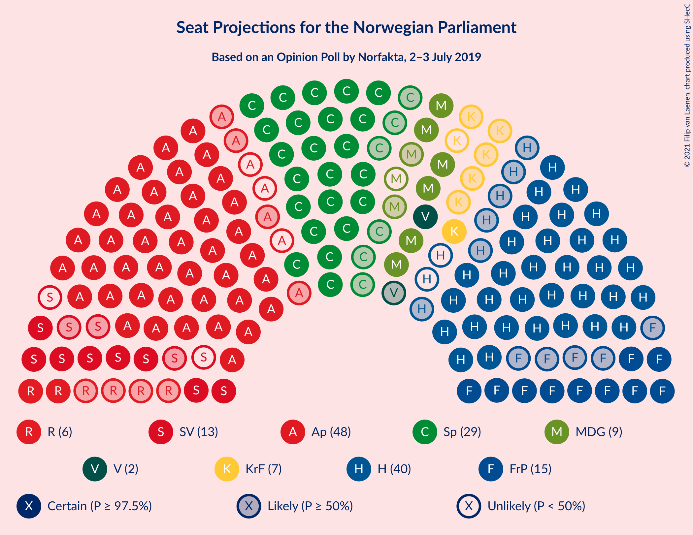
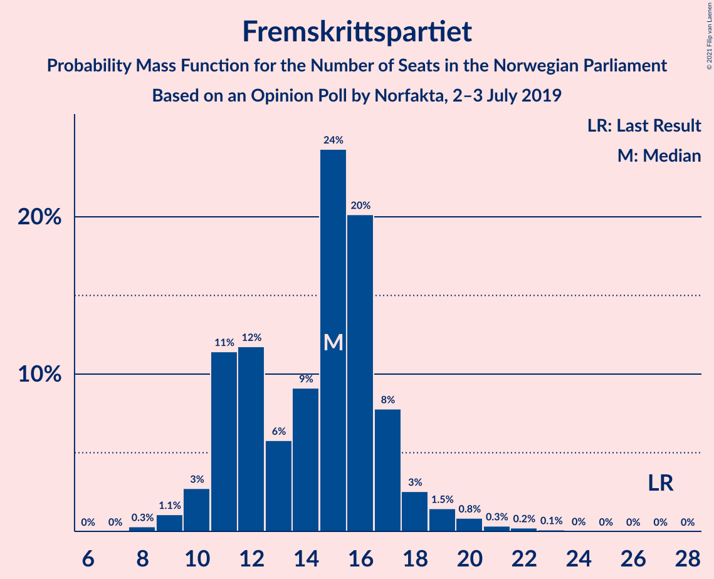
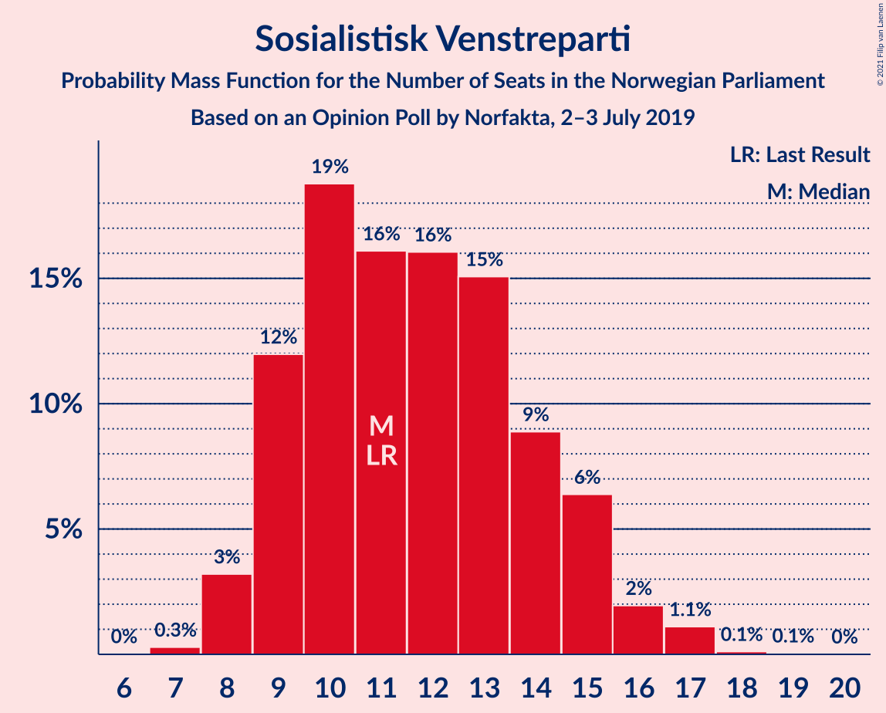
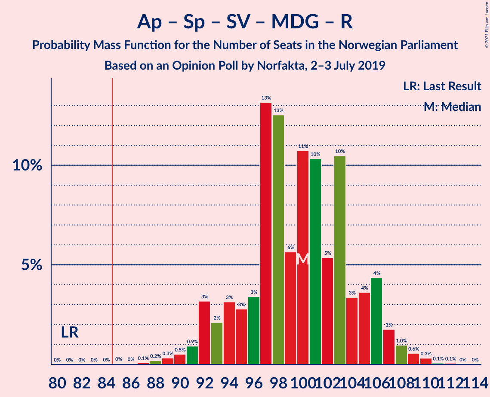
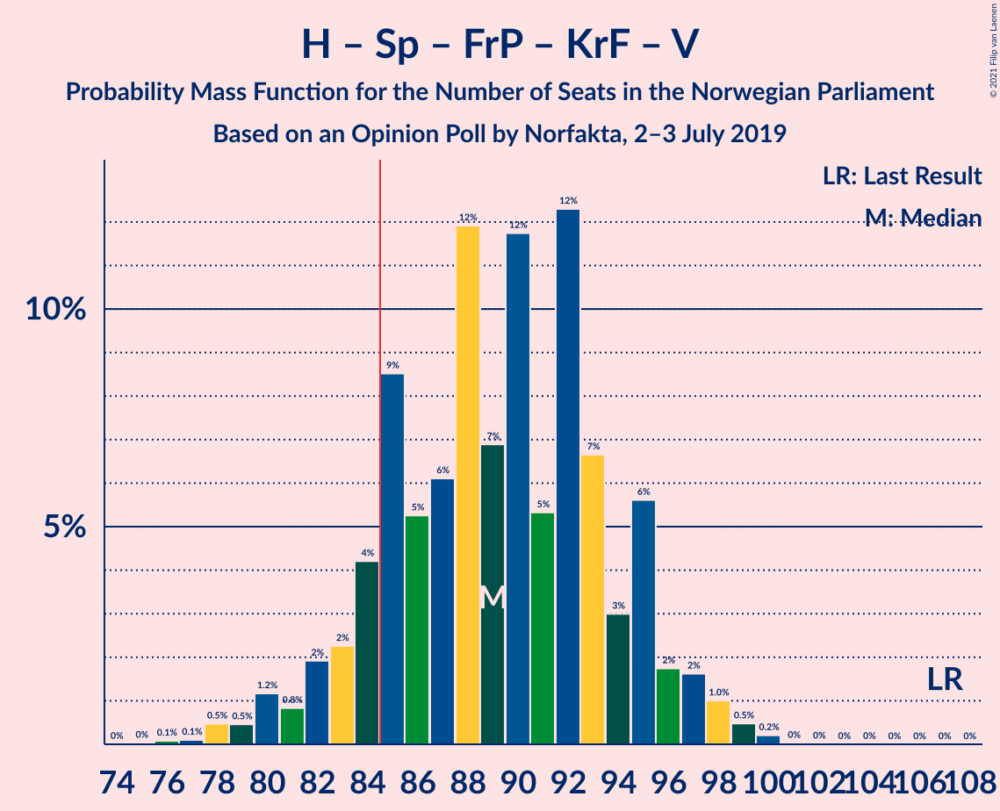
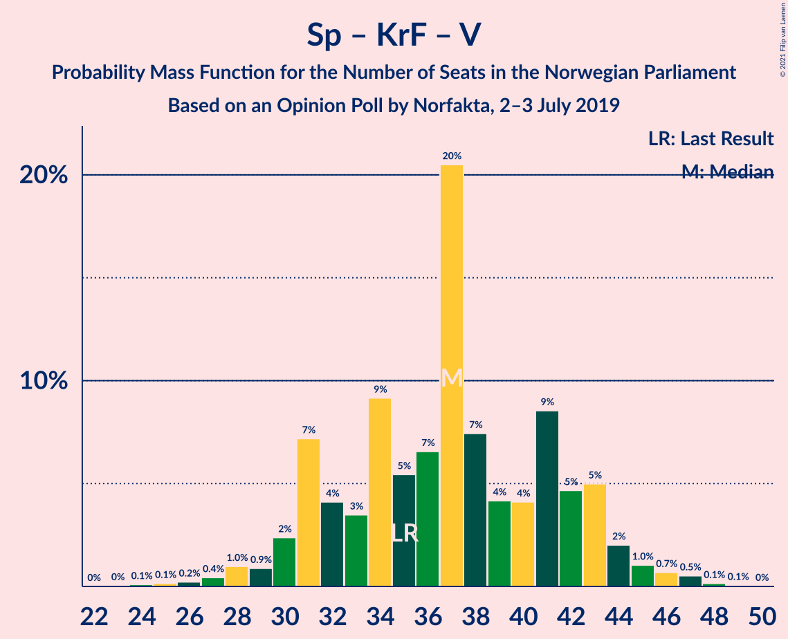

# Opinion Poll by Norfakta, 2–3 July 2019

<a href="#voting-intentions">Voting Intentions</a> | <a href="#seats">Seats</a> | <a href="#coalitions">Coalitions</a> | <a href="#technical-information">Technical Information</a>

## Voting Intentions

### Confidence Intervals

| Party | Last Result | Poll Result | 80% Confidence Interval | 90% Confidence Interval | 95% Confidence Interval | 99% Confidence Interval |
|:-----:|:-----------:|:-----------:|:-----------------------:|:-----------------------:|:-----------------------:|:-----------------------:|
| Arbeiderpartiet | 27.4% | 24.4% | 22.4–26.5% |21.9–27.1% |21.4–27.6% |20.5–28.6% |
| Høyre | 25.0% | 21.2% | 19.3–23.2% |18.8–23.7% |18.4–24.2% |17.6–25.2% |
| Senterpartiet | 10.3% | 15.0% | 13.5–16.8% |13.0–17.3% |12.7–17.8% |11.9–18.7% |
| Fremskrittspartiet | 15.2% | 8.8% | 7.6–10.3% |7.3–10.7% |7.0–11.0% |6.4–11.8% |
| Sosialistisk Venstreparti | 6.0% | 7.6% | 6.5–9.0% |6.2–9.4% |5.9–9.7% |5.4–10.4% |
| Miljøpartiet De Grønne | 3.2% | 5.5% | 4.5–6.7% |4.3–7.0% |4.1–7.3% |3.6–8.0% |
| Rødt | 2.4% | 4.3% | 3.4–5.4% |3.2–5.7% |3.0–6.0% |2.7–6.5% |
| Kristelig Folkeparti | 4.2% | 4.3% | 3.4–5.4% |3.2–5.7% |3.0–6.0% |2.7–6.5% |
| Venstre | 4.4% | 2.9% | 2.3–3.9% |2.1–4.2% |1.9–4.4% |1.7–4.9% |

*Note:* The poll result column reflects the actual value used in the calculations. Published results may vary slightly, and in addition be rounded to fewer digits.

## Seats

### Confidence Intervals

| Party | Last Result | Median | 80% Confidence Interval | 90% Confidence Interval | 95% Confidence Interval | 99% Confidence Interval |
|:-----:|:-----------:|:------:|:-----------------------:|:-----------------------:|:-----------------------:|:-----------------------:|
| <a href="#arbeiderpartiet">Arbeiderpartiet</a> | 49 | 45 | 42–50 |41–52 |41–53 |39–55 |
| <a href="#høyre">Høyre</a> | 45 | 38 | 34–42 |33–42 |32–43 |31–47 |
| <a href="#senterpartiet">Senterpartiet</a> | 19 | 29 | 25–34 |24–35 |23–35 |20–36 |
| <a href="#fremskrittspartiet">Fremskrittspartiet</a> | 27 | 15 | 11–17 |11–18 |10–19 |9–21 |
| <a href="#sosialistisk-venstreparti">Sosialistisk Venstreparti</a> | 11 | 11 | 9–14 |9–15 |8–16 |8–17 |
| <a href="#miljøpartiet-de-grønne">Miljøpartiet De Grønne</a> | 1 | 8 | 6–11 |6–11 |6–12 |2–12 |
| <a href="#rødt">Rødt</a> | 1 | 6 | 2–8 |2–8 |2–9 |1–10 |
| <a href="#kristelig-folkeparti">Kristelig Folkeparti</a> | 8 | 6 | 3–8 |2–9 |1–9 |1–10 |
| <a href="#venstre">Venstre</a> | 8 | 2 | 2–3 |1–6 |1–6 |0–7 |

### Arbeiderpartiet

*For a full overview of the results for this party, see the [Arbeiderpartiet](party-arbeiderpartiet.html) page.*

| Number of Seats | Probability | Accumulated | Special Marks |
|:---------------:|:-----------:|:-----------:|:-------------:|
| 37 | 0.1% | 100% |  |
| 38 | 0.2% | 99.9% |  |
| 39 | 0.5% | 99.7% |  |
| 40 | 1.2% | 99.2% |  |
| 41 | 4% | 98% |  |
| 42 | 6% | 94% |  |
| 43 | 9% | 88% |  |
| 44 | 25% | 79% |  |
| 45 | 13% | 54% | Median |
| 46 | 10% | 41% |  |
| 47 | 5% | 31% |  |
| 48 | 9% | 25% |  |
| 49 | 7% | 17% | Last Result |
| 50 | 2% | 10% |  |
| 51 | 2% | 8% |  |
| 52 | 2% | 6% |  |
| 53 | 2% | 4% |  |
| 54 | 0.8% | 2% |  |
| 55 | 0.4% | 0.9% |  |
| 56 | 0.1% | 0.5% |  |
| 57 | 0.2% | 0.3% |  |
| 58 | 0.1% | 0.2% |  |
| 59 | 0% | 0% |  |

### Høyre

*For a full overview of the results for this party, see the [Høyre](party-høyre.html) page.*

| Number of Seats | Probability | Accumulated | Special Marks |
|:---------------:|:-----------:|:-----------:|:-------------:|
| 30 | 0.1% | 100% |  |
| 31 | 0.4% | 99.8% |  |
| 32 | 2% | 99.5% |  |
| 33 | 3% | 97% |  |
| 34 | 6% | 94% |  |
| 35 | 8% | 88% |  |
| 36 | 12% | 80% |  |
| 37 | 8% | 68% |  |
| 38 | 16% | 60% | Median |
| 39 | 11% | 45% |  |
| 40 | 17% | 34% |  |
| 41 | 5% | 17% |  |
| 42 | 8% | 12% |  |
| 43 | 2% | 4% |  |
| 44 | 0.6% | 2% |  |
| 45 | 0.4% | 1.3% | Last Result |
| 46 | 0.4% | 0.9% |  |
| 47 | 0.2% | 0.5% |  |
| 48 | 0.2% | 0.3% |  |
| 49 | 0.1% | 0.2% |  |
| 50 | 0.1% | 0.1% |  |
| 51 | 0% | 0% |  |

### Senterpartiet

*For a full overview of the results for this party, see the [Senterpartiet](party-senterpartiet.html) page.*

| Number of Seats | Probability | Accumulated | Special Marks |
|:---------------:|:-----------:|:-----------:|:-------------:|
| 18 | 0.2% | 100% |  |
| 19 | 0.2% | 99.8% | Last Result |
| 20 | 0.4% | 99.6% |  |
| 21 | 0.6% | 99.1% |  |
| 22 | 0.9% | 98.5% |  |
| 23 | 2% | 98% |  |
| 24 | 2% | 95% |  |
| 25 | 6% | 93% |  |
| 26 | 14% | 88% |  |
| 27 | 8% | 74% |  |
| 28 | 12% | 66% |  |
| 29 | 15% | 54% | Median |
| 30 | 7% | 39% |  |
| 31 | 7% | 32% |  |
| 32 | 7% | 25% |  |
| 33 | 6% | 18% |  |
| 34 | 7% | 13% |  |
| 35 | 3% | 5% |  |
| 36 | 2% | 2% |  |
| 37 | 0.2% | 0.2% |  |
| 38 | 0% | 0% |  |

### Fremskrittspartiet

*For a full overview of the results for this party, see the [Fremskrittspartiet](party-fremskrittspartiet.html) page.*

| Number of Seats | Probability | Accumulated | Special Marks |
|:---------------:|:-----------:|:-----------:|:-------------:|
| 8 | 0.3% | 100% |  |
| 9 | 1.1% | 99.7% |  |
| 10 | 3% | 98.6% |  |
| 11 | 11% | 96% |  |
| 12 | 12% | 84% |  |
| 13 | 6% | 73% |  |
| 14 | 9% | 67% |  |
| 15 | 24% | 58% | Median |
| 16 | 20% | 33% |  |
| 17 | 8% | 13% |  |
| 18 | 3% | 6% |  |
| 19 | 1.5% | 3% |  |
| 20 | 0.8% | 2% |  |
| 21 | 0.3% | 0.7% |  |
| 22 | 0.2% | 0.4% |  |
| 23 | 0.1% | 0.1% |  |
| 24 | 0% | 0% |  |
| 25 | 0% | 0% |  |
| 26 | 0% | 0% |  |
| 27 | 0% | 0% | Last Result |

### Sosialistisk Venstreparti

*For a full overview of the results for this party, see the [Sosialistisk Venstreparti](party-sosialistiskvenstreparti.html) page.*

| Number of Seats | Probability | Accumulated | Special Marks |
|:---------------:|:-----------:|:-----------:|:-------------:|
| 7 | 0.3% | 100% |  |
| 8 | 3% | 99.7% |  |
| 9 | 12% | 96% |  |
| 10 | 19% | 85% |  |
| 11 | 16% | 66% | Last Result, Median |
| 12 | 16% | 50% |  |
| 13 | 15% | 34% |  |
| 14 | 9% | 19% |  |
| 15 | 6% | 10% |  |
| 16 | 2% | 3% |  |
| 17 | 1.1% | 1.3% |  |
| 18 | 0.1% | 0.2% |  |
| 19 | 0.1% | 0.1% |  |
| 20 | 0% | 0% |  |

### Miljøpartiet De Grønne

*For a full overview of the results for this party, see the [Miljøpartiet De Grønne](party-miljøpartietdegrønne.html) page.*

| Number of Seats | Probability | Accumulated | Special Marks |
|:---------------:|:-----------:|:-----------:|:-------------:|
| 1 | 0% | 100% | Last Result |
| 2 | 0.9% | 100% |  |
| 3 | 0.7% | 99.1% |  |
| 4 | 0.6% | 98% |  |
| 5 | 0.2% | 98% |  |
| 6 | 12% | 98% |  |
| 7 | 23% | 85% |  |
| 8 | 20% | 62% | Median |
| 9 | 20% | 42% |  |
| 10 | 11% | 21% |  |
| 11 | 8% | 11% |  |
| 12 | 2% | 3% |  |
| 13 | 0.4% | 0.4% |  |
| 14 | 0% | 0% |  |

### Rødt

*For a full overview of the results for this party, see the [Rødt](party-rødt.html) page.*

| Number of Seats | Probability | Accumulated | Special Marks |
|:---------------:|:-----------:|:-----------:|:-------------:|
| 1 | 0.8% | 100% | Last Result |
| 2 | 32% | 99.2% |  |
| 3 | 0.1% | 67% |  |
| 4 | 0% | 67% |  |
| 5 | 1.5% | 67% |  |
| 6 | 28% | 66% | Median |
| 7 | 23% | 38% |  |
| 8 | 10% | 15% |  |
| 9 | 4% | 5% |  |
| 10 | 0.7% | 0.8% |  |
| 11 | 0.1% | 0.1% |  |
| 12 | 0% | 0% |  |

### Kristelig Folkeparti

*For a full overview of the results for this party, see the [Kristelig Folkeparti](party-kristeligfolkeparti.html) page.*

| Number of Seats | Probability | Accumulated | Special Marks |
|:---------------:|:-----------:|:-----------:|:-------------:|
| 1 | 4% | 100% |  |
| 2 | 2% | 96% |  |
| 3 | 26% | 94% |  |
| 4 | 0% | 68% |  |
| 5 | 0.7% | 68% |  |
| 6 | 23% | 67% | Median |
| 7 | 32% | 45% |  |
| 8 | 8% | 13% | Last Result |
| 9 | 4% | 6% |  |
| 10 | 1.2% | 1.4% |  |
| 11 | 0.2% | 0.3% |  |
| 12 | 0% | 0.1% |  |
| 13 | 0% | 0% |  |

### Venstre

*For a full overview of the results for this party, see the [Venstre](party-venstre.html) page.*

| Number of Seats | Probability | Accumulated | Special Marks |
|:---------------:|:-----------:|:-----------:|:-------------:|
| 0 | 0.9% | 100% |  |
| 1 | 8% | 99.1% |  |
| 2 | 78% | 91% | Median |
| 3 | 5% | 13% |  |
| 4 | 0.1% | 7% |  |
| 5 | 0.3% | 7% |  |
| 6 | 6% | 7% |  |
| 7 | 1.2% | 1.4% |  |
| 8 | 0.2% | 0.2% | Last Result |
| 9 | 0% | 0% |  |

## Coalitions

### Confidence Intervals

| Coalition | Last Result | Median | Majority? | 80% Confidence Interval | 90% Confidence Interval | 95% Confidence Interval | 99% Confidence Interval |
|:---------:|:-----------:|:------:|:---------:|:-----------------------:|:-----------------------:|:-----------------------:|:-----------------------:|
| Arbeiderpartiet – Senterpartiet – Sosialistisk Venstreparti – Miljøpartiet De Grønne – Kristelig Folkeparti | 88 | 100 | 100% | 95–105 | 93–106 | 92–107 | 89–110 |
| Arbeiderpartiet – Senterpartiet – Sosialistisk Venstreparti – Miljøpartiet De Grønne – Rødt | 81 | 100 | 100% | 94–105 | 92–106 | 92–107 | 89–109 |
| Arbeiderpartiet – Senterpartiet – Sosialistisk Venstreparti – Miljøpartiet De Grønne | 80 | 94 | 99.3% | 89–100 | 87–101 | 87–102 | 84–104 |
| Arbeiderpartiet – Senterpartiet – Sosialistisk Venstreparti – Rødt | 80 | 91 | 96% | 87–96 | 85–98 | 84–99 | 81–101 |
| Høyre – Senterpartiet – Fremskrittspartiet – Kristelig Folkeparti – Venstre | 107 | 89 | 88% | 84–95 | 82–96 | 81–97 | 78–99 |
| Arbeiderpartiet – Senterpartiet – Miljøpartiet De Grønne – Kristelig Folkeparti | 77 | 88 | 82% | 83–93 | 82–94 | 80–96 | 77–98 |
| Arbeiderpartiet – Senterpartiet – Sosialistisk Venstreparti | 79 | 86 | 67% | 81–91 | 80–92 | 79–93 | 76–95 |
| Arbeiderpartiet – Senterpartiet – Kristelig Folkeparti | 76 | 80 | 14% | 75–85 | 74–87 | 72–88 | 69–90 |
| Arbeiderpartiet – Senterpartiet | 68 | 75 | 0.3% | 70–79 | 68–80 | 67–81 | 64–83 |
| Arbeiderpartiet – Sosialistisk Venstreparti – Miljøpartiet De Grønne – Rødt | 62 | 71 | 0.1% | 66–75 | 64–77 | 63–79 | 61–82 |
| Høyre – Fremskrittspartiet – Miljøpartiet De Grønne – Kristelig Folkeparti – Venstre | 89 | 68 | 0% | 64–73 | 62–75 | 61–76 | 59–79 |
| Høyre – Fremskrittspartiet – Kristelig Folkeparti – Venstre | 88 | 60 | 0% | 55–65 | 54–67 | 53–68 | 51–70 |
| Arbeiderpartiet – Sosialistisk Venstreparti | 60 | 57 | 0% | 53–61 | 52–64 | 51–65 | 49–68 |
| Høyre – Fremskrittspartiet – Venstre | 80 | 55 | 0% | 50–59 | 48–61 | 48–62 | 46–65 |
| Høyre – Fremskrittspartiet | 72 | 52 | 0% | 47–57 | 46–58 | 46–59 | 44–62 |
| Høyre – Kristelig Folkeparti – Venstre | 61 | 47 | 0% | 41–50 | 40–51 | 39–52 | 37–56 |
| Senterpartiet – Kristelig Folkeparti – Venstre | 35 | 37 | 0% | 31–42 | 30–43 | 29–44 | 26–47 |

### Arbeiderpartiet – Senterpartiet – Sosialistisk Venstreparti – Miljøpartiet De Grønne – Kristelig Folkeparti

| Number of Seats | Probability | Accumulated | Special Marks |
|:---------------:|:-----------:|:-----------:|:-------------:|
| 86 | 0% | 100% |  |
| 87 | 0.2% | 99.9% |  |
| 88 | 0.1% | 99.7% | Last Result |
| 89 | 0.2% | 99.6% |  |
| 90 | 0.3% | 99.4% |  |
| 91 | 0.8% | 99.1% |  |
| 92 | 1.2% | 98% |  |
| 93 | 4% | 97% |  |
| 94 | 2% | 93% |  |
| 95 | 3% | 91% |  |
| 96 | 6% | 88% |  |
| 97 | 6% | 83% |  |
| 98 | 19% | 77% |  |
| 99 | 5% | 58% | Median |
| 100 | 11% | 54% |  |
| 101 | 4% | 43% |  |
| 102 | 11% | 38% |  |
| 103 | 5% | 27% |  |
| 104 | 11% | 23% |  |
| 105 | 5% | 12% |  |
| 106 | 2% | 6% |  |
| 107 | 2% | 4% |  |
| 108 | 1.3% | 2% |  |
| 109 | 0.5% | 1.1% |  |
| 110 | 0.3% | 0.6% |  |
| 111 | 0.2% | 0.3% |  |
| 112 | 0.1% | 0.1% |  |
| 113 | 0% | 0% |  |

### Arbeiderpartiet – Senterpartiet – Sosialistisk Venstreparti – Miljøpartiet De Grønne – Rødt

| Number of Seats | Probability | Accumulated | Special Marks |
|:---------------:|:-----------:|:-----------:|:-------------:|
| 81 | 0% | 100% | Last Result |
| 82 | 0% | 100% |  |
| 83 | 0% | 100% |  |
| 84 | 0% | 100% |  |
| 85 | 0% | 100% | Majority |
| 86 | 0% | 100% |  |
| 87 | 0.1% | 99.9% |  |
| 88 | 0.2% | 99.8% |  |
| 89 | 0.3% | 99.7% |  |
| 90 | 0.5% | 99.3% |  |
| 91 | 0.9% | 98.8% |  |
| 92 | 3% | 98% |  |
| 93 | 2% | 95% |  |
| 94 | 3% | 93% |  |
| 95 | 3% | 89% |  |
| 96 | 3% | 87% |  |
| 97 | 13% | 83% |  |
| 98 | 13% | 70% |  |
| 99 | 6% | 58% | Median |
| 100 | 11% | 52% |  |
| 101 | 10% | 41% |  |
| 102 | 5% | 31% |  |
| 103 | 10% | 26% |  |
| 104 | 3% | 15% |  |
| 105 | 4% | 12% |  |
| 106 | 4% | 8% |  |
| 107 | 2% | 4% |  |
| 108 | 1.0% | 2% |  |
| 109 | 0.6% | 1.0% |  |
| 110 | 0.3% | 0.4% |  |
| 111 | 0.1% | 0.1% |  |
| 112 | 0.1% | 0.1% |  |
| 113 | 0% | 0% |  |

### Arbeiderpartiet – Senterpartiet – Sosialistisk Venstreparti – Miljøpartiet De Grønne

| Number of Seats | Probability | Accumulated | Special Marks |
|:---------------:|:-----------:|:-----------:|:-------------:|
| 80 | 0% | 100% | Last Result |
| 81 | 0% | 100% |  |
| 82 | 0.1% | 99.9% |  |
| 83 | 0.2% | 99.8% |  |
| 84 | 0.3% | 99.6% |  |
| 85 | 0.8% | 99.3% | Majority |
| 86 | 0.9% | 98.5% |  |
| 87 | 3% | 98% |  |
| 88 | 2% | 94% |  |
| 89 | 2% | 92% |  |
| 90 | 5% | 90% |  |
| 91 | 7% | 85% |  |
| 92 | 11% | 78% |  |
| 93 | 12% | 67% | Median |
| 94 | 6% | 55% |  |
| 95 | 12% | 50% |  |
| 96 | 7% | 38% |  |
| 97 | 8% | 31% |  |
| 98 | 5% | 22% |  |
| 99 | 7% | 17% |  |
| 100 | 3% | 10% |  |
| 101 | 5% | 8% |  |
| 102 | 1.2% | 3% |  |
| 103 | 0.7% | 1.3% |  |
| 104 | 0.4% | 0.6% |  |
| 105 | 0.1% | 0.3% |  |
| 106 | 0.1% | 0.1% |  |
| 107 | 0.1% | 0.1% |  |
| 108 | 0% | 0% |  |

### Arbeiderpartiet – Senterpartiet – Sosialistisk Venstreparti – Rødt

| Number of Seats | Probability | Accumulated | Special Marks |
|:---------------:|:-----------:|:-----------:|:-------------:|
| 77 | 0% | 100% |  |
| 78 | 0.1% | 99.9% |  |
| 79 | 0.1% | 99.8% |  |
| 80 | 0.2% | 99.7% | Last Result |
| 81 | 0.6% | 99.6% |  |
| 82 | 0.5% | 99.0% |  |
| 83 | 0.6% | 98.5% |  |
| 84 | 2% | 98% |  |
| 85 | 3% | 96% | Majority |
| 86 | 3% | 93% |  |
| 87 | 4% | 90% |  |
| 88 | 4% | 86% |  |
| 89 | 15% | 81% |  |
| 90 | 6% | 67% |  |
| 91 | 11% | 60% | Median |
| 92 | 11% | 49% |  |
| 93 | 6% | 38% |  |
| 94 | 11% | 32% |  |
| 95 | 6% | 21% |  |
| 96 | 5% | 15% |  |
| 97 | 4% | 10% |  |
| 98 | 2% | 6% |  |
| 99 | 2% | 4% |  |
| 100 | 0.7% | 1.5% |  |
| 101 | 0.5% | 0.7% |  |
| 102 | 0.2% | 0.3% |  |
| 103 | 0.1% | 0.1% |  |
| 104 | 0% | 0.1% |  |
| 105 | 0% | 0% |  |

### Høyre – Senterpartiet – Fremskrittspartiet – Kristelig Folkeparti – Venstre

| Number of Seats | Probability | Accumulated | Special Marks |
|:---------------:|:-----------:|:-----------:|:-------------:|
| 76 | 0.1% | 100% |  |
| 77 | 0.1% | 99.9% |  |
| 78 | 0.5% | 99.8% |  |
| 79 | 0.5% | 99.3% |  |
| 80 | 1.2% | 98.8% |  |
| 81 | 0.8% | 98% |  |
| 82 | 2% | 97% |  |
| 83 | 2% | 95% |  |
| 84 | 4% | 93% |  |
| 85 | 9% | 88% | Majority |
| 86 | 5% | 80% |  |
| 87 | 6% | 75% |  |
| 88 | 12% | 69% |  |
| 89 | 7% | 57% |  |
| 90 | 12% | 50% | Median |
| 91 | 5% | 38% |  |
| 92 | 12% | 33% |  |
| 93 | 7% | 20% |  |
| 94 | 3% | 14% |  |
| 95 | 6% | 11% |  |
| 96 | 2% | 5% |  |
| 97 | 2% | 3% |  |
| 98 | 1.0% | 2% |  |
| 99 | 0.5% | 0.7% |  |
| 100 | 0.2% | 0.3% |  |
| 101 | 0% | 0.1% |  |
| 102 | 0% | 0% |  |
| 103 | 0% | 0% |  |
| 104 | 0% | 0% |  |
| 105 | 0% | 0% |  |
| 106 | 0% | 0% |  |
| 107 | 0% | 0% | Last Result |

### Arbeiderpartiet – Senterpartiet – Miljøpartiet De Grønne – Kristelig Folkeparti

| Number of Seats | Probability | Accumulated | Special Marks |
|:---------------:|:-----------:|:-----------:|:-------------:|
| 74 | 0.1% | 100% |  |
| 75 | 0.1% | 99.9% |  |
| 76 | 0.1% | 99.8% |  |
| 77 | 0.2% | 99.7% | Last Result |
| 78 | 0.4% | 99.5% |  |
| 79 | 0.9% | 99.1% |  |
| 80 | 1.2% | 98% |  |
| 81 | 2% | 97% |  |
| 82 | 4% | 95% |  |
| 83 | 5% | 91% |  |
| 84 | 4% | 86% |  |
| 85 | 7% | 82% | Majority |
| 86 | 7% | 76% |  |
| 87 | 7% | 69% |  |
| 88 | 12% | 62% | Median |
| 89 | 12% | 50% |  |
| 90 | 5% | 38% |  |
| 91 | 7% | 33% |  |
| 92 | 12% | 26% |  |
| 93 | 6% | 14% |  |
| 94 | 3% | 8% |  |
| 95 | 1.5% | 5% |  |
| 96 | 0.9% | 3% |  |
| 97 | 2% | 2% |  |
| 98 | 0.4% | 0.8% |  |
| 99 | 0.1% | 0.4% |  |
| 100 | 0.2% | 0.2% |  |
| 101 | 0% | 0% |  |

### Arbeiderpartiet – Senterpartiet – Sosialistisk Venstreparti

| Number of Seats | Probability | Accumulated | Special Marks |
|:---------------:|:-----------:|:-----------:|:-------------:|
| 73 | 0% | 100% |  |
| 74 | 0.1% | 99.9% |  |
| 75 | 0.2% | 99.9% |  |
| 76 | 0.4% | 99.6% |  |
| 77 | 0.5% | 99.3% |  |
| 78 | 0.8% | 98.8% |  |
| 79 | 2% | 98% | Last Result |
| 80 | 2% | 96% |  |
| 81 | 4% | 94% |  |
| 82 | 2% | 90% |  |
| 83 | 13% | 87% |  |
| 84 | 8% | 75% |  |
| 85 | 8% | 67% | Median, Majority |
| 86 | 11% | 59% |  |
| 87 | 8% | 48% |  |
| 88 | 11% | 40% |  |
| 89 | 9% | 29% |  |
| 90 | 9% | 20% |  |
| 91 | 4% | 10% |  |
| 92 | 3% | 6% |  |
| 93 | 1.4% | 3% |  |
| 94 | 0.7% | 1.3% |  |
| 95 | 0.3% | 0.6% |  |
| 96 | 0.2% | 0.3% |  |
| 97 | 0.1% | 0.2% |  |
| 98 | 0% | 0% |  |

### Arbeiderpartiet – Senterpartiet – Kristelig Folkeparti

| Number of Seats | Probability | Accumulated | Special Marks |
|:---------------:|:-----------:|:-----------:|:-------------:|
| 65 | 0.1% | 100% |  |
| 66 | 0.1% | 99.9% |  |
| 67 | 0% | 99.9% |  |
| 68 | 0.2% | 99.8% |  |
| 69 | 0.2% | 99.6% |  |
| 70 | 0.7% | 99.4% |  |
| 71 | 0.8% | 98.7% |  |
| 72 | 2% | 98% |  |
| 73 | 1.2% | 96% |  |
| 74 | 2% | 95% |  |
| 75 | 4% | 93% |  |
| 76 | 6% | 89% | Last Result |
| 77 | 9% | 83% |  |
| 78 | 7% | 74% |  |
| 79 | 13% | 67% |  |
| 80 | 6% | 54% | Median |
| 81 | 9% | 48% |  |
| 82 | 10% | 39% |  |
| 83 | 9% | 29% |  |
| 84 | 6% | 20% |  |
| 85 | 6% | 14% | Majority |
| 86 | 3% | 8% |  |
| 87 | 3% | 5% |  |
| 88 | 1.1% | 3% |  |
| 89 | 0.7% | 1.4% |  |
| 90 | 0.3% | 0.6% |  |
| 91 | 0.1% | 0.3% |  |
| 92 | 0.1% | 0.2% |  |
| 93 | 0.1% | 0.1% |  |
| 94 | 0% | 0% |  |

### Arbeiderpartiet – Senterpartiet

| Number of Seats | Probability | Accumulated | Special Marks |
|:---------------:|:-----------:|:-----------:|:-------------:|
| 61 | 0% | 100% |  |
| 62 | 0.1% | 99.9% |  |
| 63 | 0.1% | 99.8% |  |
| 64 | 0.2% | 99.7% |  |
| 65 | 0.4% | 99.5% |  |
| 66 | 1.2% | 99.1% |  |
| 67 | 2% | 98% |  |
| 68 | 2% | 96% | Last Result |
| 69 | 3% | 94% |  |
| 70 | 4% | 91% |  |
| 71 | 8% | 88% |  |
| 72 | 6% | 79% |  |
| 73 | 13% | 73% |  |
| 74 | 9% | 60% | Median |
| 75 | 9% | 51% |  |
| 76 | 10% | 42% |  |
| 77 | 8% | 32% |  |
| 78 | 9% | 24% |  |
| 79 | 8% | 15% |  |
| 80 | 4% | 7% |  |
| 81 | 2% | 4% |  |
| 82 | 0.9% | 2% |  |
| 83 | 0.4% | 0.8% |  |
| 84 | 0.1% | 0.5% |  |
| 85 | 0.2% | 0.3% | Majority |
| 86 | 0% | 0.1% |  |
| 87 | 0% | 0% |  |

### Arbeiderpartiet – Sosialistisk Venstreparti – Miljøpartiet De Grønne – Rødt

| Number of Seats | Probability | Accumulated | Special Marks |
|:---------------:|:-----------:|:-----------:|:-------------:|
| 59 | 0.1% | 100% |  |
| 60 | 0.1% | 99.9% |  |
| 61 | 0.5% | 99.8% |  |
| 62 | 0.7% | 99.3% | Last Result |
| 63 | 2% | 98.6% |  |
| 64 | 2% | 96% |  |
| 65 | 3% | 94% |  |
| 66 | 6% | 92% |  |
| 67 | 9% | 86% |  |
| 68 | 4% | 77% |  |
| 69 | 15% | 73% |  |
| 70 | 7% | 58% | Median |
| 71 | 11% | 51% |  |
| 72 | 10% | 40% |  |
| 73 | 6% | 30% |  |
| 74 | 9% | 24% |  |
| 75 | 6% | 15% |  |
| 76 | 3% | 9% |  |
| 77 | 2% | 6% |  |
| 78 | 2% | 5% |  |
| 79 | 0.6% | 3% |  |
| 80 | 0.9% | 2% |  |
| 81 | 0.4% | 1.0% |  |
| 82 | 0.3% | 0.6% |  |
| 83 | 0.1% | 0.2% |  |
| 84 | 0% | 0.1% |  |
| 85 | 0% | 0.1% | Majority |
| 86 | 0% | 0% |  |

### Høyre – Fremskrittspartiet – Miljøpartiet De Grønne – Kristelig Folkeparti – Venstre

| Number of Seats | Probability | Accumulated | Special Marks |
|:---------------:|:-----------:|:-----------:|:-------------:|
| 56 | 0% | 100% |  |
| 57 | 0.1% | 99.9% |  |
| 58 | 0.2% | 99.9% |  |
| 59 | 0.8% | 99.6% |  |
| 60 | 1.0% | 98.9% |  |
| 61 | 1.2% | 98% |  |
| 62 | 3% | 97% |  |
| 63 | 4% | 94% |  |
| 64 | 7% | 90% |  |
| 65 | 8% | 83% |  |
| 66 | 5% | 75% |  |
| 67 | 10% | 69% |  |
| 68 | 10% | 59% |  |
| 69 | 9% | 48% | Median |
| 70 | 8% | 40% |  |
| 71 | 8% | 31% |  |
| 72 | 10% | 24% |  |
| 73 | 6% | 14% |  |
| 74 | 2% | 8% |  |
| 75 | 3% | 6% |  |
| 76 | 2% | 3% |  |
| 77 | 0.7% | 2% |  |
| 78 | 0.3% | 1.1% |  |
| 79 | 0.4% | 0.8% |  |
| 80 | 0.2% | 0.4% |  |
| 81 | 0.1% | 0.2% |  |
| 82 | 0.1% | 0.1% |  |
| 83 | 0% | 0% |  |
| 84 | 0% | 0% |  |
| 85 | 0% | 0% | Majority |
| 86 | 0% | 0% |  |
| 87 | 0% | 0% |  |
| 88 | 0% | 0% |  |
| 89 | 0% | 0% | Last Result |

### Høyre – Fremskrittspartiet – Kristelig Folkeparti – Venstre

| Number of Seats | Probability | Accumulated | Special Marks |
|:---------------:|:-----------:|:-----------:|:-------------:|
| 49 | 0.1% | 100% |  |
| 50 | 0.2% | 99.8% |  |
| 51 | 0.7% | 99.6% |  |
| 52 | 1.1% | 98.9% |  |
| 53 | 1.3% | 98% |  |
| 54 | 4% | 96% |  |
| 55 | 6% | 93% |  |
| 56 | 8% | 87% |  |
| 57 | 6% | 79% |  |
| 58 | 9% | 74% |  |
| 59 | 9% | 65% |  |
| 60 | 8% | 56% |  |
| 61 | 6% | 48% | Median |
| 62 | 10% | 42% |  |
| 63 | 13% | 32% |  |
| 64 | 7% | 19% |  |
| 65 | 3% | 12% |  |
| 66 | 3% | 9% |  |
| 67 | 3% | 6% |  |
| 68 | 1.4% | 4% |  |
| 69 | 1.2% | 2% |  |
| 70 | 0.5% | 0.9% |  |
| 71 | 0.2% | 0.4% |  |
| 72 | 0.1% | 0.3% |  |
| 73 | 0.1% | 0.2% |  |
| 74 | 0.1% | 0.1% |  |
| 75 | 0% | 0% |  |
| 76 | 0% | 0% |  |
| 77 | 0% | 0% |  |
| 78 | 0% | 0% |  |
| 79 | 0% | 0% |  |
| 80 | 0% | 0% |  |
| 81 | 0% | 0% |  |
| 82 | 0% | 0% |  |
| 83 | 0% | 0% |  |
| 84 | 0% | 0% |  |
| 85 | 0% | 0% | Majority |
| 86 | 0% | 0% |  |
| 87 | 0% | 0% |  |
| 88 | 0% | 0% | Last Result |

### Arbeiderpartiet – Sosialistisk Venstreparti

| Number of Seats | Probability | Accumulated | Special Marks |
|:---------------:|:-----------:|:-----------:|:-------------:|
| 48 | 0.1% | 100% |  |
| 49 | 0.5% | 99.9% |  |
| 50 | 1.1% | 99.3% |  |
| 51 | 1.4% | 98% |  |
| 52 | 2% | 97% |  |
| 53 | 8% | 94% |  |
| 54 | 13% | 87% |  |
| 55 | 11% | 74% |  |
| 56 | 10% | 63% | Median |
| 57 | 11% | 54% |  |
| 58 | 10% | 43% |  |
| 59 | 5% | 33% |  |
| 60 | 8% | 28% | Last Result |
| 61 | 10% | 20% |  |
| 62 | 2% | 10% |  |
| 63 | 2% | 8% |  |
| 64 | 2% | 5% |  |
| 65 | 2% | 4% |  |
| 66 | 0.5% | 1.5% |  |
| 67 | 0.4% | 1.0% |  |
| 68 | 0.2% | 0.5% |  |
| 69 | 0.2% | 0.3% |  |
| 70 | 0.1% | 0.1% |  |
| 71 | 0.1% | 0.1% |  |
| 72 | 0% | 0% |  |

### Høyre – Fremskrittspartiet – Venstre

| Number of Seats | Probability | Accumulated | Special Marks |
|:---------------:|:-----------:|:-----------:|:-------------:|
| 44 | 0.1% | 100% |  |
| 45 | 0.2% | 99.9% |  |
| 46 | 0.5% | 99.7% |  |
| 47 | 2% | 99.3% |  |
| 48 | 3% | 98% |  |
| 49 | 4% | 94% |  |
| 50 | 3% | 90% |  |
| 51 | 9% | 88% |  |
| 52 | 5% | 79% |  |
| 53 | 15% | 74% |  |
| 54 | 7% | 59% |  |
| 55 | 10% | 52% | Median |
| 56 | 8% | 42% |  |
| 57 | 15% | 34% |  |
| 58 | 5% | 20% |  |
| 59 | 6% | 14% |  |
| 60 | 2% | 8% |  |
| 61 | 3% | 6% |  |
| 62 | 0.6% | 3% |  |
| 63 | 1.2% | 2% |  |
| 64 | 0.5% | 1.0% |  |
| 65 | 0.2% | 0.5% |  |
| 66 | 0.2% | 0.3% |  |
| 67 | 0.1% | 0.1% |  |
| 68 | 0% | 0% |  |
| 69 | 0% | 0% |  |
| 70 | 0% | 0% |  |
| 71 | 0% | 0% |  |
| 72 | 0% | 0% |  |
| 73 | 0% | 0% |  |
| 74 | 0% | 0% |  |
| 75 | 0% | 0% |  |
| 76 | 0% | 0% |  |
| 77 | 0% | 0% |  |
| 78 | 0% | 0% |  |
| 79 | 0% | 0% |  |
| 80 | 0% | 0% | Last Result |

### Høyre – Fremskrittspartiet

| Number of Seats | Probability | Accumulated | Special Marks |
|:---------------:|:-----------:|:-----------:|:-------------:|
| 42 | 0% | 100% |  |
| 43 | 0.2% | 99.9% |  |
| 44 | 0.5% | 99.7% |  |
| 45 | 1.5% | 99.2% |  |
| 46 | 4% | 98% |  |
| 47 | 4% | 94% |  |
| 48 | 3% | 90% |  |
| 49 | 9% | 87% |  |
| 50 | 5% | 78% |  |
| 51 | 16% | 72% |  |
| 52 | 7% | 56% |  |
| 53 | 9% | 49% | Median |
| 54 | 10% | 40% |  |
| 55 | 11% | 30% |  |
| 56 | 6% | 19% |  |
| 57 | 6% | 12% |  |
| 58 | 2% | 6% |  |
| 59 | 3% | 5% |  |
| 60 | 0.7% | 2% |  |
| 61 | 0.5% | 1.1% |  |
| 62 | 0.3% | 0.7% |  |
| 63 | 0.2% | 0.4% |  |
| 64 | 0.2% | 0.3% |  |
| 65 | 0.1% | 0.1% |  |
| 66 | 0% | 0% |  |
| 67 | 0% | 0% |  |
| 68 | 0% | 0% |  |
| 69 | 0% | 0% |  |
| 70 | 0% | 0% |  |
| 71 | 0% | 0% |  |
| 72 | 0% | 0% | Last Result |

### Høyre – Kristelig Folkeparti – Venstre

| Number of Seats | Probability | Accumulated | Special Marks |
|:---------------:|:-----------:|:-----------:|:-------------:|
| 35 | 0.1% | 100% |  |
| 36 | 0.2% | 99.9% |  |
| 37 | 0.5% | 99.7% |  |
| 38 | 2% | 99.2% |  |
| 39 | 2% | 98% |  |
| 40 | 2% | 96% |  |
| 41 | 5% | 94% |  |
| 42 | 5% | 88% |  |
| 43 | 8% | 84% |  |
| 44 | 11% | 76% |  |
| 45 | 8% | 65% |  |
| 46 | 6% | 57% | Median |
| 47 | 16% | 52% |  |
| 48 | 19% | 36% |  |
| 49 | 5% | 17% |  |
| 50 | 4% | 12% |  |
| 51 | 4% | 8% |  |
| 52 | 1.2% | 4% |  |
| 53 | 0.9% | 2% |  |
| 54 | 0.6% | 1.5% |  |
| 55 | 0.4% | 0.9% |  |
| 56 | 0.3% | 0.5% |  |
| 57 | 0.1% | 0.2% |  |
| 58 | 0% | 0.1% |  |
| 59 | 0% | 0.1% |  |
| 60 | 0% | 0% |  |
| 61 | 0% | 0% | Last Result |

### Senterpartiet – Kristelig Folkeparti – Venstre

| Number of Seats | Probability | Accumulated | Special Marks |
|:---------------:|:-----------:|:-----------:|:-------------:|
| 24 | 0.1% | 100% |  |
| 25 | 0.1% | 99.9% |  |
| 26 | 0.2% | 99.7% |  |
| 27 | 0.4% | 99.5% |  |
| 28 | 1.0% | 99.1% |  |
| 29 | 0.9% | 98% |  |
| 30 | 2% | 97% |  |
| 31 | 7% | 95% |  |
| 32 | 4% | 88% |  |
| 33 | 3% | 84% |  |
| 34 | 9% | 80% |  |
| 35 | 5% | 71% | Last Result |
| 36 | 7% | 65% |  |
| 37 | 20% | 59% | Median |
| 38 | 7% | 38% |  |
| 39 | 4% | 31% |  |
| 40 | 4% | 27% |  |
| 41 | 9% | 23% |  |
| 42 | 5% | 14% |  |
| 43 | 5% | 9% |  |
| 44 | 2% | 4% |  |
| 45 | 1.0% | 2% |  |
| 46 | 0.7% | 1.4% |  |
| 47 | 0.5% | 0.7% |  |
| 48 | 0.1% | 0.2% |  |
| 49 | 0.1% | 0.1% |  |
| 50 | 0% | 0% |  |

## Technical Information

### Opinion Poll

+ **Polling firm:** Norfakta
+ **Commissioner(s):** —
+ **Fieldwork period:** 2–3 July 2019

### Calculations

+ **Sample size:** 751
+ **Simulations done:** 1,048,576
+ **Error estimate:** 1.60%

