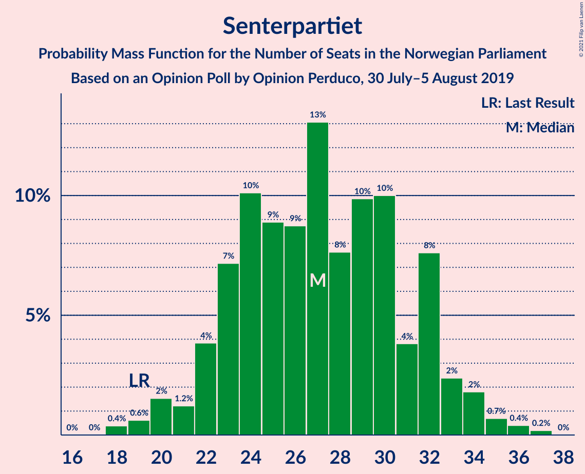
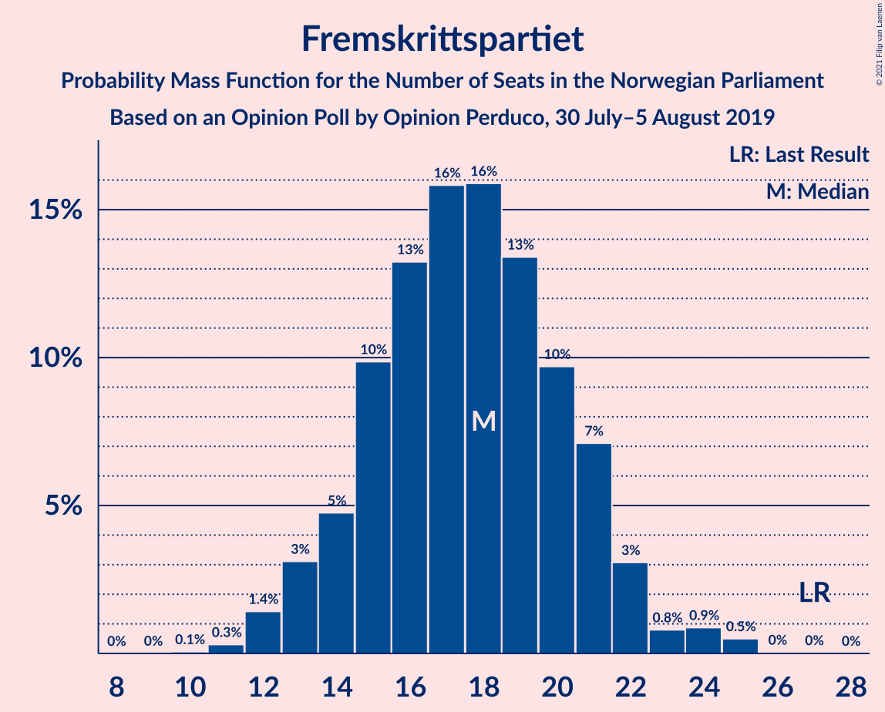
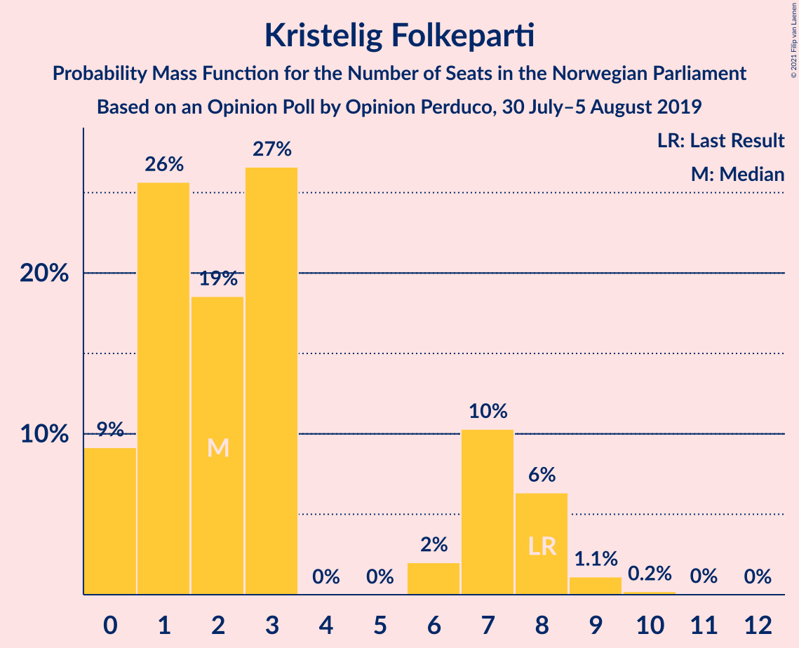
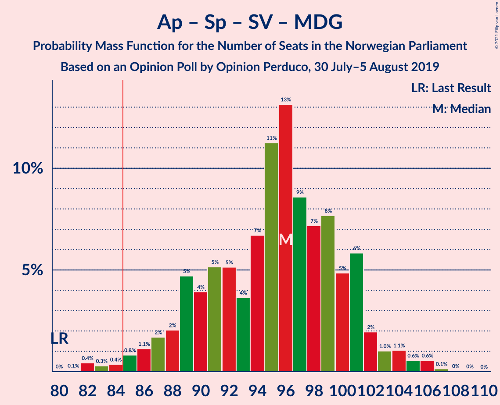
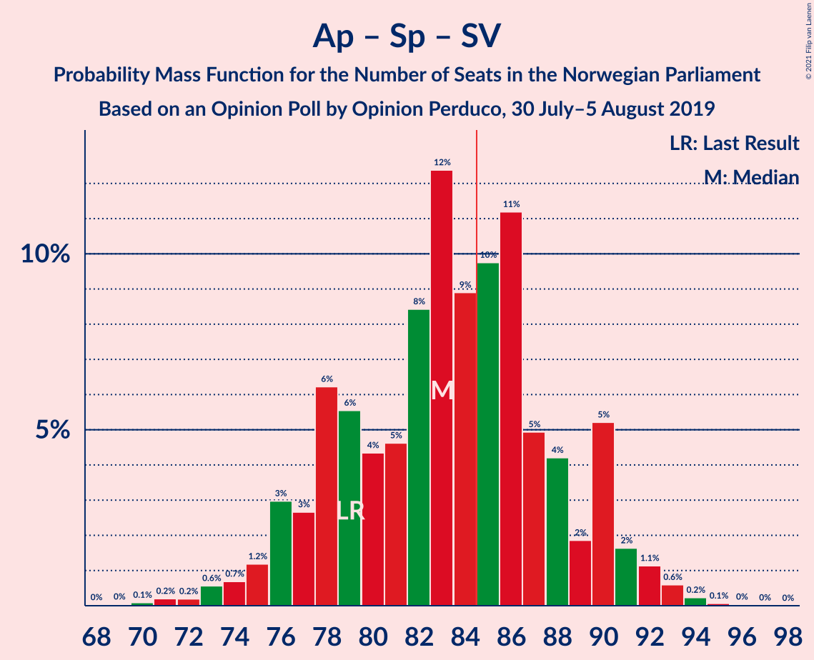
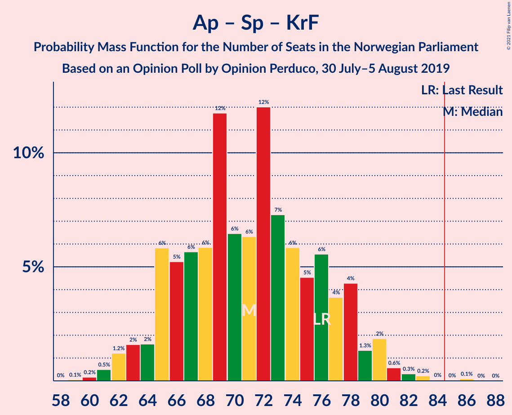
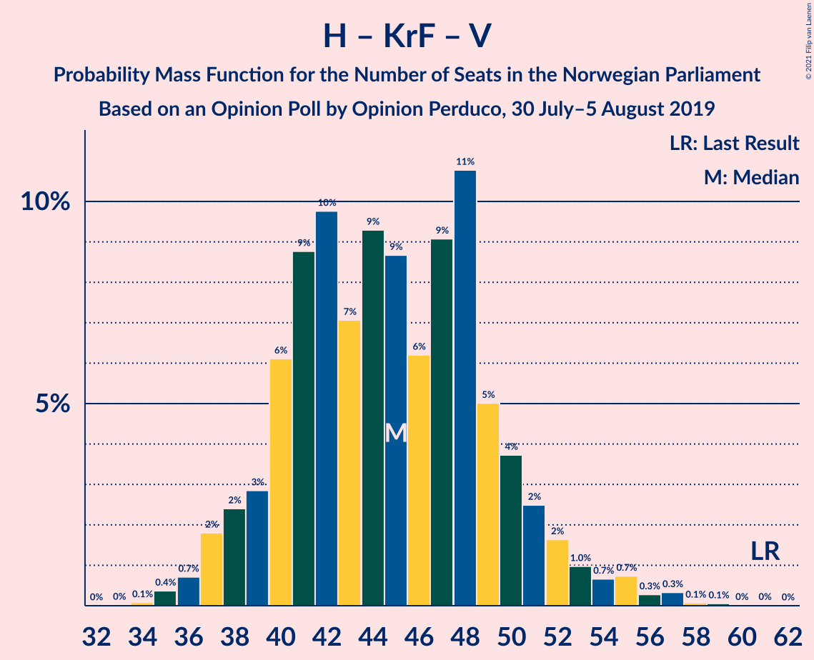

# Opinion Poll by Opinion Perduco, 30 July–5 August 2019

<a href="#voting-intentions">Voting Intentions</a> | <a href="#seats">Seats</a> | <a href="#coalitions">Coalitions</a> | <a href="#technical-information">Technical Information</a>

## Voting Intentions

### Confidence Intervals

| Party | Last Result | Poll Result | 80% Confidence Interval | 90% Confidence Interval | 95% Confidence Interval | 99% Confidence Interval |
|:-----:|:-----------:|:-----------:|:-----------------------:|:-----------------------:|:-----------------------:|:-----------------------:|
| Arbeiderpartiet | 27.4% | 22.2% | 20.2–24.4% |19.7–25.0% |19.2–25.5% |18.3–26.6% |
| Høyre | 25.0% | 22.1% | 20.1–24.2% |19.5–24.8% |19.1–25.4% |18.2–26.4% |
| Senterpartiet | 10.3% | 14.7% | 13.0–16.6% |12.5–17.1% |12.2–17.6% |11.4–18.5% |
| Fremskrittspartiet | 15.2% | 10.1% | 8.7–11.8% |8.4–12.3% |8.0–12.7% |7.4–13.5% |
| Sosialistisk Venstreparti | 6.0% | 8.8% | 7.5–10.3% |7.1–10.8% |6.8–11.2% |6.3–12.0% |
| Miljøpartiet De Grønne | 3.2% | 6.9% | 5.8–8.4% |5.5–8.8% |5.2–9.2% |4.8–9.9% |
| Rødt | 2.4% | 5.1% | 4.2–6.4% |3.9–6.8% |3.7–7.1% |3.3–7.8% |
| Venstre | 4.4% | 3.2% | 2.5–4.2% |2.3–4.5% |2.1–4.8% |1.8–5.4% |
| Kristelig Folkeparti | 4.2% | 3.2% | 2.5–4.2% |2.3–4.5% |2.1–4.8% |1.8–5.4% |

*Note:* The poll result column reflects the actual value used in the calculations. Published results may vary slightly, and in addition be rounded to fewer digits.

## Seats

### Confidence Intervals

| Party | Last Result | Median | 80% Confidence Interval | 90% Confidence Interval | 95% Confidence Interval | 99% Confidence Interval |
|:-----:|:-----------:|:------:|:-----------------------:|:-----------------------:|:-----------------------:|:-----------------------:|
| <a href="#arbeiderpartiet">Arbeiderpartiet</a> | 49 | 40 | 37–45 |37–46 |33–47 |31–51 |
| <a href="#høyre">Høyre</a> | 45 | 37 | 33–45 |33–48 |32–48 |30–49 |
| <a href="#senterpartiet">Senterpartiet</a> | 19 | 27 | 24–33 |21–34 |20–36 |19–37 |
| <a href="#fremskrittspartiet">Fremskrittspartiet</a> | 27 | 18 | 14–22 |13–24 |12–25 |11–25 |
| <a href="#sosialistisk-venstreparti">Sosialistisk Venstreparti</a> | 11 | 15 | 12–18 |10–19 |9–19 |9–21 |
| <a href="#miljøpartiet-de-grønne">Miljøpartiet De Grønne</a> | 1 | 11 | 10–14 |9–15 |8–15 |8–17 |
| <a href="#rødt">Rødt</a> | 1 | 8 | 7–11 |2–11 |2–12 |2–13 |
| <a href="#venstre">Venstre</a> | 8 | 2 | 1–8 |1–8 |1–9 |0–9 |
| <a href="#kristelig-folkeparti">Kristelig Folkeparti</a> | 8 | 3 | 1–6 |0–7 |0–8 |0–9 |

### Arbeiderpartiet

*For a full overview of the results for this party, see the [Arbeiderpartiet](party-arbeiderpartiet.html) page.*

| Number of Seats | Probability | Accumulated | Special Marks |
|:---------------:|:-----------:|:-----------:|:-------------:|
| 29 | 0.2% | 100% |  |
| 30 | 0.2% | 99.8% |  |
| 31 | 0.6% | 99.7% |  |
| 32 | 1.2% | 99.1% |  |
| 33 | 0.4% | 98% |  |
| 34 | 0.2% | 97% |  |
| 35 | 0.8% | 97% |  |
| 36 | 1.3% | 96% |  |
| 37 | 25% | 95% |  |
| 38 | 5% | 70% |  |
| 39 | 11% | 65% |  |
| 40 | 10% | 54% | Median |
| 41 | 3% | 45% |  |
| 42 | 5% | 42% |  |
| 43 | 9% | 37% |  |
| 44 | 7% | 28% |  |
| 45 | 13% | 21% |  |
| 46 | 4% | 7% |  |
| 47 | 1.4% | 3% |  |
| 48 | 0.3% | 2% |  |
| 49 | 0.2% | 1.5% | Last Result |
| 50 | 0.4% | 1.3% |  |
| 51 | 0.5% | 0.9% |  |
| 52 | 0.1% | 0.5% |  |
| 53 | 0.2% | 0.3% |  |
| 54 | 0.1% | 0.1% |  |
| 55 | 0% | 0% |  |

### Høyre

*For a full overview of the results for this party, see the [Høyre](party-høyre.html) page.*

| Number of Seats | Probability | Accumulated | Special Marks |
|:---------------:|:-----------:|:-----------:|:-------------:|
| 29 | 0.1% | 100% |  |
| 30 | 1.5% | 99.8% |  |
| 31 | 0.6% | 98% |  |
| 32 | 2% | 98% |  |
| 33 | 7% | 95% |  |
| 34 | 15% | 89% |  |
| 35 | 3% | 74% |  |
| 36 | 11% | 71% |  |
| 37 | 12% | 60% | Median |
| 38 | 10% | 48% |  |
| 39 | 9% | 38% |  |
| 40 | 4% | 29% |  |
| 41 | 3% | 25% |  |
| 42 | 4% | 21% |  |
| 43 | 4% | 17% |  |
| 44 | 3% | 13% |  |
| 45 | 2% | 10% | Last Result |
| 46 | 2% | 9% |  |
| 47 | 1.5% | 7% |  |
| 48 | 4% | 5% |  |
| 49 | 0.7% | 1.0% |  |
| 50 | 0.1% | 0.3% |  |
| 51 | 0.1% | 0.2% |  |
| 52 | 0% | 0.2% |  |
| 53 | 0.1% | 0.1% |  |
| 54 | 0% | 0% |  |

### Senterpartiet

*For a full overview of the results for this party, see the [Senterpartiet](party-senterpartiet.html) page.*

| Number of Seats | Probability | Accumulated | Special Marks |
|:---------------:|:-----------:|:-----------:|:-------------:|
| 18 | 0.1% | 100% |  |
| 19 | 1.1% | 99.9% | Last Result |
| 20 | 3% | 98.8% |  |
| 21 | 2% | 96% |  |
| 22 | 1.3% | 94% |  |
| 23 | 3% | 93% |  |
| 24 | 13% | 90% |  |
| 25 | 6% | 77% |  |
| 26 | 8% | 71% |  |
| 27 | 22% | 63% | Median |
| 28 | 10% | 41% |  |
| 29 | 7% | 31% |  |
| 30 | 1.4% | 24% |  |
| 31 | 6% | 23% |  |
| 32 | 3% | 17% |  |
| 33 | 6% | 14% |  |
| 34 | 4% | 8% |  |
| 35 | 0.3% | 4% |  |
| 36 | 3% | 4% |  |
| 37 | 0.7% | 0.9% |  |
| 38 | 0.1% | 0.1% |  |
| 39 | 0% | 0% |  |

### Fremskrittspartiet

*For a full overview of the results for this party, see the [Fremskrittspartiet](party-fremskrittspartiet.html) page.*

| Number of Seats | Probability | Accumulated | Special Marks |
|:---------------:|:-----------:|:-----------:|:-------------:|
| 9 | 0.1% | 100% |  |
| 10 | 0.1% | 99.9% |  |
| 11 | 0.5% | 99.8% |  |
| 12 | 2% | 99.3% |  |
| 13 | 6% | 97% |  |
| 14 | 4% | 91% |  |
| 15 | 4% | 87% |  |
| 16 | 10% | 83% |  |
| 17 | 11% | 73% |  |
| 18 | 21% | 62% | Median |
| 19 | 5% | 41% |  |
| 20 | 14% | 37% |  |
| 21 | 6% | 23% |  |
| 22 | 11% | 17% |  |
| 23 | 1.0% | 6% |  |
| 24 | 1.2% | 5% |  |
| 25 | 4% | 4% |  |
| 26 | 0.1% | 0.4% |  |
| 27 | 0.2% | 0.2% | Last Result |
| 28 | 0% | 0% |  |

### Sosialistisk Venstreparti

*For a full overview of the results for this party, see the [Sosialistisk Venstreparti](party-sosialistiskvenstreparti.html) page.*

| Number of Seats | Probability | Accumulated | Special Marks |
|:---------------:|:-----------:|:-----------:|:-------------:|
| 8 | 0.1% | 100% |  |
| 9 | 3% | 99.9% |  |
| 10 | 2% | 97% |  |
| 11 | 4% | 94% | Last Result |
| 12 | 9% | 90% |  |
| 13 | 6% | 81% |  |
| 14 | 20% | 76% |  |
| 15 | 22% | 56% | Median |
| 16 | 9% | 33% |  |
| 17 | 12% | 25% |  |
| 18 | 5% | 13% |  |
| 19 | 5% | 8% |  |
| 20 | 1.0% | 2% |  |
| 21 | 1.2% | 1.5% |  |
| 22 | 0.2% | 0.3% |  |
| 23 | 0.1% | 0.2% |  |
| 24 | 0% | 0.1% |  |
| 25 | 0% | 0.1% |  |
| 26 | 0% | 0% |  |

### Miljøpartiet De Grønne

*For a full overview of the results for this party, see the [Miljøpartiet De Grønne](party-miljøpartietdegrønne.html) page.*

| Number of Seats | Probability | Accumulated | Special Marks |
|:---------------:|:-----------:|:-----------:|:-------------:|
| 1 | 0% | 100% | Last Result |
| 2 | 0% | 100% |  |
| 3 | 0% | 100% |  |
| 4 | 0% | 100% |  |
| 5 | 0% | 100% |  |
| 6 | 0% | 100% |  |
| 7 | 0.3% | 99.9% |  |
| 8 | 2% | 99.6% |  |
| 9 | 7% | 97% |  |
| 10 | 21% | 91% |  |
| 11 | 22% | 69% | Median |
| 12 | 16% | 47% |  |
| 13 | 18% | 31% |  |
| 14 | 7% | 13% |  |
| 15 | 4% | 6% |  |
| 16 | 1.4% | 2% |  |
| 17 | 0.6% | 0.8% |  |
| 18 | 0.1% | 0.2% |  |
| 19 | 0% | 0% |  |

### Rødt

*For a full overview of the results for this party, see the [Rødt](party-rødt.html) page.*

| Number of Seats | Probability | Accumulated | Special Marks |
|:---------------:|:-----------:|:-----------:|:-------------:|
| 1 | 0.3% | 100% | Last Result |
| 2 | 5% | 99.7% |  |
| 3 | 0% | 94% |  |
| 4 | 0% | 94% |  |
| 5 | 0% | 94% |  |
| 6 | 1.4% | 94% |  |
| 7 | 15% | 93% |  |
| 8 | 30% | 78% | Median |
| 9 | 16% | 48% |  |
| 10 | 12% | 32% |  |
| 11 | 16% | 21% |  |
| 12 | 4% | 4% |  |
| 13 | 0.7% | 0.9% |  |
| 14 | 0.1% | 0.2% |  |
| 15 | 0.1% | 0.1% |  |
| 16 | 0% | 0% |  |

### Venstre

*For a full overview of the results for this party, see the [Venstre](party-venstre.html) page.*

| Number of Seats | Probability | Accumulated | Special Marks |
|:---------------:|:-----------:|:-----------:|:-------------:|
| 0 | 0.7% | 100% |  |
| 1 | 36% | 99.3% |  |
| 2 | 30% | 63% | Median |
| 3 | 0% | 33% |  |
| 4 | 0% | 33% |  |
| 5 | 0% | 33% |  |
| 6 | 3% | 33% |  |
| 7 | 20% | 30% |  |
| 8 | 8% | 10% | Last Result |
| 9 | 2% | 3% |  |
| 10 | 0.2% | 0.2% |  |
| 11 | 0% | 0.1% |  |
| 12 | 0% | 0% |  |

### Kristelig Folkeparti

*For a full overview of the results for this party, see the [Kristelig Folkeparti](party-kristeligfolkeparti.html) page.*

| Number of Seats | Probability | Accumulated | Special Marks |
|:---------------:|:-----------:|:-----------:|:-------------:|
| 0 | 7% | 100% |  |
| 1 | 15% | 93% |  |
| 2 | 22% | 78% |  |
| 3 | 44% | 57% | Median |
| 4 | 0% | 13% |  |
| 5 | 0% | 13% |  |
| 6 | 7% | 13% |  |
| 7 | 3% | 6% |  |
| 8 | 2% | 3% | Last Result |
| 9 | 0.5% | 0.7% |  |
| 10 | 0.2% | 0.2% |  |
| 11 | 0% | 0% |  |

## Coalitions

### Confidence Intervals

| Coalition | Last Result | Median | Majority? | 80% Confidence Interval | 90% Confidence Interval | 95% Confidence Interval | 99% Confidence Interval |
|:---------:|:-----------:|:------:|:---------:|:-----------------------:|:-----------------------:|:-----------------------:|:-----------------------:|
| Arbeiderpartiet – Senterpartiet – Sosialistisk Venstreparti – Miljøpartiet De Grønne – Rødt | 81 | 103 | 100% | 96–111 | 94–112 | 93–113 | 90–115 |
| Arbeiderpartiet – Senterpartiet – Sosialistisk Venstreparti – Miljøpartiet De Grønne – Kristelig Folkeparti | 88 | 97 | 99.8% | 91–106 | 90–107 | 88–107 | 86–110 |
| Arbeiderpartiet – Senterpartiet – Sosialistisk Venstreparti – Miljøpartiet De Grønne | 80 | 94 | 97% | 88–103 | 86–104 | 84–105 | 82–107 |
| Arbeiderpartiet – Senterpartiet – Sosialistisk Venstreparti – Rødt | 80 | 92 | 91% | 85–99 | 83–101 | 81–101 | 79–104 |
| Høyre – Senterpartiet – Fremskrittspartiet – Kristelig Folkeparti – Venstre | 107 | 90 | 90% | 84–96 | 82–98 | 80–100 | 77–103 |
| Arbeiderpartiet – Senterpartiet – Sosialistisk Venstreparti | 79 | 82 | 41% | 77–91 | 75–93 | 73–93 | 70–95 |
| Arbeiderpartiet – Senterpartiet – Miljøpartiet De Grønne – Kristelig Folkeparti | 77 | 82 | 33% | 77–90 | 75–90 | 74–92 | 72–94 |
| Høyre – Fremskrittspartiet – Miljøpartiet De Grønne – Kristelig Folkeparti – Venstre | 89 | 75 | 3% | 67–82 | 63–83 | 61–85 | 60–89 |
| Arbeiderpartiet – Senterpartiet – Kristelig Folkeparti | 76 | 70 | 0.4% | 65–79 | 63–79 | 63–80 | 59–84 |
| Arbeiderpartiet – Senterpartiet | 68 | 68 | 0% | 63–76 | 61–77 | 60–78 | 56–78 |
| Høyre – Fremskrittspartiet – Kristelig Folkeparti – Venstre | 88 | 63 | 0% | 55–71 | 51–72 | 50–73 | 48–76 |
| Høyre – Fremskrittspartiet – Venstre | 80 | 60 | 0% | 52–68 | 48–70 | 48–70 | 47–72 |
| Høyre – Fremskrittspartiet | 72 | 56 | 0% | 49–66 | 46–68 | 46–68 | 45–68 |
| Arbeiderpartiet – Sosialistisk Venstreparti | 60 | 55 | 0% | 49–62 | 48–63 | 48–65 | 46–67 |
| Høyre – Kristelig Folkeparti – Venstre | 61 | 44 | 0% | 39–50 | 36–53 | 35–54 | 35–57 |
| Senterpartiet – Kristelig Folkeparti – Venstre | 35 | 33 | 0% | 27–39 | 26–40 | 25–42 | 23–46 |

### Arbeiderpartiet – Senterpartiet – Sosialistisk Venstreparti – Miljøpartiet De Grønne – Rødt

| Number of Seats | Probability | Accumulated | Special Marks |
|:---------------:|:-----------:|:-----------:|:-------------:|
| 81 | 0% | 100% | Last Result |
| 82 | 0% | 100% |  |
| 83 | 0% | 100% |  |
| 84 | 0% | 100% |  |
| 85 | 0% | 100% | Majority |
| 86 | 0% | 99.9% |  |
| 87 | 0% | 99.9% |  |
| 88 | 0% | 99.9% |  |
| 89 | 0.2% | 99.8% |  |
| 90 | 0.3% | 99.6% |  |
| 91 | 0.6% | 99.3% |  |
| 92 | 0.3% | 98.7% |  |
| 93 | 2% | 98% |  |
| 94 | 2% | 96% |  |
| 95 | 2% | 94% |  |
| 96 | 3% | 92% |  |
| 97 | 3% | 89% |  |
| 98 | 8% | 86% |  |
| 99 | 15% | 78% |  |
| 100 | 3% | 63% |  |
| 101 | 3% | 60% | Median |
| 102 | 5% | 56% |  |
| 103 | 8% | 51% |  |
| 104 | 4% | 43% |  |
| 105 | 2% | 39% |  |
| 106 | 5% | 37% |  |
| 107 | 4% | 33% |  |
| 108 | 11% | 29% |  |
| 109 | 4% | 18% |  |
| 110 | 3% | 14% |  |
| 111 | 3% | 11% |  |
| 112 | 5% | 8% |  |
| 113 | 0.4% | 3% |  |
| 114 | 1.4% | 2% |  |
| 115 | 0.7% | 1.1% |  |
| 116 | 0.1% | 0.3% |  |
| 117 | 0% | 0.3% |  |
| 118 | 0.1% | 0.2% |  |
| 119 | 0% | 0.2% |  |
| 120 | 0.2% | 0.2% |  |
| 121 | 0% | 0% |  |

### Arbeiderpartiet – Senterpartiet – Sosialistisk Venstreparti – Miljøpartiet De Grønne – Kristelig Folkeparti

| Number of Seats | Probability | Accumulated | Special Marks |
|:---------------:|:-----------:|:-----------:|:-------------:|
| 81 | 0% | 100% |  |
| 82 | 0% | 99.9% |  |
| 83 | 0.1% | 99.9% |  |
| 84 | 0.1% | 99.8% |  |
| 85 | 0.2% | 99.8% | Majority |
| 86 | 0.1% | 99.5% |  |
| 87 | 2% | 99.4% |  |
| 88 | 2% | 98% | Last Result |
| 89 | 1.0% | 96% |  |
| 90 | 4% | 95% |  |
| 91 | 2% | 91% |  |
| 92 | 10% | 89% |  |
| 93 | 7% | 79% |  |
| 94 | 17% | 72% |  |
| 95 | 2% | 55% |  |
| 96 | 3% | 53% | Median |
| 97 | 5% | 50% |  |
| 98 | 2% | 45% |  |
| 99 | 2% | 43% |  |
| 100 | 12% | 41% |  |
| 101 | 8% | 30% |  |
| 102 | 6% | 21% |  |
| 103 | 0.9% | 16% |  |
| 104 | 4% | 15% |  |
| 105 | 0.6% | 11% |  |
| 106 | 4% | 10% |  |
| 107 | 5% | 7% |  |
| 108 | 1.2% | 2% |  |
| 109 | 0.2% | 0.8% |  |
| 110 | 0.3% | 0.5% |  |
| 111 | 0.1% | 0.2% |  |
| 112 | 0.1% | 0.1% |  |
| 113 | 0% | 0% |  |

### Arbeiderpartiet – Senterpartiet – Sosialistisk Venstreparti – Miljøpartiet De Grønne

| Number of Seats | Probability | Accumulated | Special Marks |
|:---------------:|:-----------:|:-----------:|:-------------:|
| 78 | 0% | 100% |  |
| 79 | 0% | 99.9% |  |
| 80 | 0.1% | 99.9% | Last Result |
| 81 | 0.2% | 99.8% |  |
| 82 | 0.2% | 99.6% |  |
| 83 | 0.6% | 99.5% |  |
| 84 | 2% | 98.8% |  |
| 85 | 0.3% | 97% | Majority |
| 86 | 2% | 97% |  |
| 87 | 3% | 95% |  |
| 88 | 3% | 91% |  |
| 89 | 6% | 88% |  |
| 90 | 7% | 82% |  |
| 91 | 12% | 75% |  |
| 92 | 8% | 63% |  |
| 93 | 3% | 55% | Median |
| 94 | 2% | 52% |  |
| 95 | 8% | 50% |  |
| 96 | 3% | 42% |  |
| 97 | 10% | 38% |  |
| 98 | 5% | 29% |  |
| 99 | 4% | 23% |  |
| 100 | 5% | 19% |  |
| 101 | 1.1% | 14% |  |
| 102 | 2% | 13% |  |
| 103 | 4% | 12% |  |
| 104 | 4% | 8% |  |
| 105 | 3% | 3% |  |
| 106 | 0.2% | 0.7% |  |
| 107 | 0.2% | 0.5% |  |
| 108 | 0.1% | 0.4% |  |
| 109 | 0.2% | 0.2% |  |
| 110 | 0% | 0% |  |

### Arbeiderpartiet – Senterpartiet – Sosialistisk Venstreparti – Rødt

| Number of Seats | Probability | Accumulated | Special Marks |
|:---------------:|:-----------:|:-----------:|:-------------:|
| 75 | 0.1% | 100% |  |
| 76 | 0% | 99.9% |  |
| 77 | 0.2% | 99.9% |  |
| 78 | 0.2% | 99.7% |  |
| 79 | 0.4% | 99.5% |  |
| 80 | 1.2% | 99.2% | Last Result |
| 81 | 0.7% | 98% |  |
| 82 | 2% | 97% |  |
| 83 | 1.3% | 96% |  |
| 84 | 4% | 94% |  |
| 85 | 1.2% | 91% | Majority |
| 86 | 16% | 90% |  |
| 87 | 9% | 73% |  |
| 88 | 4% | 64% |  |
| 89 | 2% | 60% |  |
| 90 | 2% | 58% | Median |
| 91 | 5% | 56% |  |
| 92 | 10% | 52% |  |
| 93 | 7% | 41% |  |
| 94 | 5% | 35% |  |
| 95 | 0.8% | 30% |  |
| 96 | 4% | 29% |  |
| 97 | 3% | 25% |  |
| 98 | 9% | 22% |  |
| 99 | 4% | 13% |  |
| 100 | 3% | 9% |  |
| 101 | 4% | 7% |  |
| 102 | 2% | 2% |  |
| 103 | 0.3% | 0.9% |  |
| 104 | 0.4% | 0.5% |  |
| 105 | 0% | 0.1% |  |
| 106 | 0.1% | 0.1% |  |
| 107 | 0% | 0% |  |

### Høyre – Senterpartiet – Fremskrittspartiet – Kristelig Folkeparti – Venstre

| Number of Seats | Probability | Accumulated | Special Marks |
|:---------------:|:-----------:|:-----------:|:-------------:|
| 74 | 0.1% | 100% |  |
| 75 | 0% | 99.9% |  |
| 76 | 0.1% | 99.8% |  |
| 77 | 0.6% | 99.7% |  |
| 78 | 0.3% | 99.2% |  |
| 79 | 0.9% | 98.9% |  |
| 80 | 0.9% | 98% |  |
| 81 | 0.2% | 97% |  |
| 82 | 5% | 97% |  |
| 83 | 1.5% | 92% |  |
| 84 | 1.2% | 91% |  |
| 85 | 3% | 90% | Majority |
| 86 | 5% | 86% |  |
| 87 | 7% | 82% | Median |
| 88 | 14% | 75% |  |
| 89 | 5% | 60% |  |
| 90 | 17% | 55% |  |
| 91 | 7% | 39% |  |
| 92 | 3% | 31% |  |
| 93 | 7% | 28% |  |
| 94 | 3% | 22% |  |
| 95 | 4% | 19% |  |
| 96 | 8% | 15% |  |
| 97 | 1.5% | 7% |  |
| 98 | 1.3% | 6% |  |
| 99 | 0.9% | 4% |  |
| 100 | 1.2% | 3% |  |
| 101 | 0.7% | 2% |  |
| 102 | 0.4% | 1.4% |  |
| 103 | 0.6% | 1.0% |  |
| 104 | 0.1% | 0.3% |  |
| 105 | 0.1% | 0.3% |  |
| 106 | 0.1% | 0.1% |  |
| 107 | 0% | 0% | Last Result |

### Arbeiderpartiet – Senterpartiet – Sosialistisk Venstreparti

| Number of Seats | Probability | Accumulated | Special Marks |
|:---------------:|:-----------:|:-----------:|:-------------:|
| 67 | 0% | 100% |  |
| 68 | 0.1% | 99.9% |  |
| 69 | 0% | 99.8% |  |
| 70 | 0.4% | 99.8% |  |
| 71 | 0.2% | 99.4% |  |
| 72 | 1.0% | 99.1% |  |
| 73 | 0.7% | 98% |  |
| 74 | 2% | 97% |  |
| 75 | 2% | 95% |  |
| 76 | 0.8% | 93% |  |
| 77 | 8% | 92% |  |
| 78 | 12% | 84% |  |
| 79 | 5% | 72% | Last Result |
| 80 | 6% | 67% |  |
| 81 | 10% | 61% |  |
| 82 | 3% | 51% | Median |
| 83 | 2% | 48% |  |
| 84 | 4% | 46% |  |
| 85 | 4% | 41% | Majority |
| 86 | 8% | 38% |  |
| 87 | 10% | 30% |  |
| 88 | 4% | 19% |  |
| 89 | 2% | 16% |  |
| 90 | 3% | 14% |  |
| 91 | 1.0% | 10% |  |
| 92 | 2% | 9% |  |
| 93 | 6% | 7% |  |
| 94 | 0.4% | 1.1% |  |
| 95 | 0.3% | 0.7% |  |
| 96 | 0.4% | 0.4% |  |
| 97 | 0% | 0.1% |  |
| 98 | 0% | 0.1% |  |
| 99 | 0% | 0% |  |

### Arbeiderpartiet – Senterpartiet – Miljøpartiet De Grønne – Kristelig Folkeparti

| Number of Seats | Probability | Accumulated | Special Marks |
|:---------------:|:-----------:|:-----------:|:-------------:|
| 69 | 0.1% | 100% |  |
| 70 | 0.1% | 99.9% |  |
| 71 | 0.3% | 99.8% |  |
| 72 | 0.5% | 99.5% |  |
| 73 | 1.2% | 99.0% |  |
| 74 | 2% | 98% |  |
| 75 | 1.1% | 96% |  |
| 76 | 4% | 95% |  |
| 77 | 8% | 90% | Last Result |
| 78 | 2% | 83% |  |
| 79 | 9% | 81% |  |
| 80 | 16% | 72% |  |
| 81 | 2% | 57% | Median |
| 82 | 8% | 55% |  |
| 83 | 8% | 47% |  |
| 84 | 7% | 39% |  |
| 85 | 11% | 33% | Majority |
| 86 | 0.9% | 22% |  |
| 87 | 4% | 21% |  |
| 88 | 1.4% | 17% |  |
| 89 | 2% | 15% |  |
| 90 | 9% | 13% |  |
| 91 | 0.6% | 4% |  |
| 92 | 3% | 4% |  |
| 93 | 0.3% | 1.1% |  |
| 94 | 0.6% | 0.9% |  |
| 95 | 0.1% | 0.3% |  |
| 96 | 0% | 0.2% |  |
| 97 | 0.1% | 0.1% |  |
| 98 | 0% | 0.1% |  |
| 99 | 0% | 0.1% |  |
| 100 | 0% | 0% |  |

### Høyre – Fremskrittspartiet – Miljøpartiet De Grønne – Kristelig Folkeparti – Venstre

| Number of Seats | Probability | Accumulated | Special Marks |
|:---------------:|:-----------:|:-----------:|:-------------:|
| 58 | 0% | 100% |  |
| 59 | 0.1% | 99.9% |  |
| 60 | 2% | 99.9% |  |
| 61 | 2% | 98% |  |
| 62 | 0.4% | 96% |  |
| 63 | 2% | 95% |  |
| 64 | 0.2% | 93% |  |
| 65 | 2% | 93% |  |
| 66 | 0.5% | 91% |  |
| 67 | 1.1% | 90% |  |
| 68 | 5% | 89% |  |
| 69 | 1.2% | 85% |  |
| 70 | 8% | 84% |  |
| 71 | 10% | 75% | Median |
| 72 | 5% | 65% |  |
| 73 | 4% | 60% |  |
| 74 | 0.9% | 55% |  |
| 75 | 10% | 55% |  |
| 76 | 15% | 45% |  |
| 77 | 6% | 30% |  |
| 78 | 5% | 24% |  |
| 79 | 1.4% | 19% |  |
| 80 | 2% | 18% |  |
| 81 | 2% | 15% |  |
| 82 | 6% | 14% |  |
| 83 | 5% | 8% |  |
| 84 | 0.8% | 4% |  |
| 85 | 0.8% | 3% | Majority |
| 86 | 0.4% | 2% |  |
| 87 | 0.6% | 2% |  |
| 88 | 0.3% | 0.9% |  |
| 89 | 0.4% | 0.7% | Last Result |
| 90 | 0.1% | 0.3% |  |
| 91 | 0.1% | 0.2% |  |
| 92 | 0% | 0% |  |

### Arbeiderpartiet – Senterpartiet – Kristelig Folkeparti

| Number of Seats | Probability | Accumulated | Special Marks |
|:---------------:|:-----------:|:-----------:|:-------------:|
| 57 | 0.1% | 100% |  |
| 58 | 0.1% | 99.9% |  |
| 59 | 0.4% | 99.7% |  |
| 60 | 0.5% | 99.3% |  |
| 61 | 0.2% | 98.8% |  |
| 62 | 1.0% | 98.6% |  |
| 63 | 3% | 98% |  |
| 64 | 2% | 94% |  |
| 65 | 6% | 92% |  |
| 66 | 3% | 87% |  |
| 67 | 16% | 83% |  |
| 68 | 11% | 67% |  |
| 69 | 4% | 56% |  |
| 70 | 4% | 52% | Median |
| 71 | 4% | 48% |  |
| 72 | 8% | 44% |  |
| 73 | 6% | 36% |  |
| 74 | 2% | 30% |  |
| 75 | 9% | 28% |  |
| 76 | 0.8% | 19% | Last Result |
| 77 | 0.8% | 18% |  |
| 78 | 6% | 17% |  |
| 79 | 7% | 11% |  |
| 80 | 4% | 5% |  |
| 81 | 0.3% | 1.1% |  |
| 82 | 0.2% | 0.8% |  |
| 83 | 0.1% | 0.7% |  |
| 84 | 0.2% | 0.6% |  |
| 85 | 0.3% | 0.4% | Majority |
| 86 | 0% | 0.1% |  |
| 87 | 0% | 0% |  |

### Arbeiderpartiet – Senterpartiet

| Number of Seats | Probability | Accumulated | Special Marks |
|:---------------:|:-----------:|:-----------:|:-------------:|
| 54 | 0.1% | 100% |  |
| 55 | 0% | 99.9% |  |
| 56 | 1.2% | 99.8% |  |
| 57 | 0.3% | 98.6% |  |
| 58 | 0.2% | 98% |  |
| 59 | 0.4% | 98% |  |
| 60 | 1.3% | 98% |  |
| 61 | 1.4% | 96% |  |
| 62 | 3% | 95% |  |
| 63 | 5% | 92% |  |
| 64 | 18% | 88% |  |
| 65 | 7% | 69% |  |
| 66 | 11% | 62% |  |
| 67 | 1.4% | 51% | Median |
| 68 | 2% | 50% | Last Result |
| 69 | 9% | 48% |  |
| 70 | 8% | 39% |  |
| 71 | 1.3% | 30% |  |
| 72 | 13% | 29% |  |
| 73 | 2% | 16% |  |
| 74 | 1.2% | 14% |  |
| 75 | 1.4% | 13% |  |
| 76 | 5% | 12% |  |
| 77 | 4% | 7% |  |
| 78 | 3% | 3% |  |
| 79 | 0.1% | 0.5% |  |
| 80 | 0.1% | 0.4% |  |
| 81 | 0% | 0.3% |  |
| 82 | 0.2% | 0.3% |  |
| 83 | 0% | 0% |  |

### Høyre – Fremskrittspartiet – Kristelig Folkeparti – Venstre

| Number of Seats | Probability | Accumulated | Special Marks |
|:---------------:|:-----------:|:-----------:|:-------------:|
| 48 | 1.1% | 100% |  |
| 49 | 0.3% | 98.9% |  |
| 50 | 3% | 98.6% |  |
| 51 | 3% | 95% |  |
| 52 | 0.5% | 92% |  |
| 53 | 0.5% | 92% |  |
| 54 | 1.0% | 91% |  |
| 55 | 0.5% | 90% |  |
| 56 | 1.1% | 90% |  |
| 57 | 4% | 89% |  |
| 58 | 0.7% | 84% |  |
| 59 | 8% | 84% |  |
| 60 | 6% | 76% | Median |
| 61 | 12% | 71% |  |
| 62 | 6% | 58% |  |
| 63 | 18% | 52% |  |
| 64 | 3% | 34% |  |
| 65 | 4% | 31% |  |
| 66 | 3% | 27% |  |
| 67 | 5% | 24% |  |
| 68 | 4% | 20% |  |
| 69 | 3% | 15% |  |
| 70 | 2% | 12% |  |
| 71 | 4% | 10% |  |
| 72 | 3% | 6% |  |
| 73 | 1.2% | 3% |  |
| 74 | 0.7% | 2% |  |
| 75 | 0.5% | 1.3% |  |
| 76 | 0.6% | 0.9% |  |
| 77 | 0.1% | 0.3% |  |
| 78 | 0.2% | 0.2% |  |
| 79 | 0% | 0% |  |
| 80 | 0% | 0% |  |
| 81 | 0% | 0% |  |
| 82 | 0% | 0% |  |
| 83 | 0% | 0% |  |
| 84 | 0% | 0% |  |
| 85 | 0% | 0% | Majority |
| 86 | 0% | 0% |  |
| 87 | 0% | 0% |  |
| 88 | 0% | 0% | Last Result |

### Høyre – Fremskrittspartiet – Venstre

| Number of Seats | Probability | Accumulated | Special Marks |
|:---------------:|:-----------:|:-----------:|:-------------:|
| 46 | 0.1% | 100% |  |
| 47 | 1.3% | 99.9% |  |
| 48 | 4% | 98.6% |  |
| 49 | 2% | 94% |  |
| 50 | 0.7% | 92% |  |
| 51 | 0.9% | 91% |  |
| 52 | 0.6% | 90% |  |
| 53 | 0.9% | 90% |  |
| 54 | 4% | 89% |  |
| 55 | 2% | 85% |  |
| 56 | 2% | 83% |  |
| 57 | 6% | 82% | Median |
| 58 | 11% | 75% |  |
| 59 | 8% | 64% |  |
| 60 | 21% | 56% |  |
| 61 | 7% | 36% |  |
| 62 | 6% | 29% |  |
| 63 | 3% | 23% |  |
| 64 | 1.1% | 20% |  |
| 65 | 4% | 19% |  |
| 66 | 2% | 15% |  |
| 67 | 0.9% | 13% |  |
| 68 | 3% | 12% |  |
| 69 | 5% | 10% |  |
| 70 | 4% | 5% |  |
| 71 | 0.2% | 1.0% |  |
| 72 | 0.7% | 0.9% |  |
| 73 | 0.1% | 0.2% |  |
| 74 | 0% | 0.1% |  |
| 75 | 0.1% | 0.1% |  |
| 76 | 0% | 0% |  |
| 77 | 0% | 0% |  |
| 78 | 0% | 0% |  |
| 79 | 0% | 0% |  |
| 80 | 0% | 0% | Last Result |

### Høyre – Fremskrittspartiet

| Number of Seats | Probability | Accumulated | Special Marks |
|:---------------:|:-----------:|:-----------:|:-------------:|
| 44 | 0.1% | 100% |  |
| 45 | 1.3% | 99.9% |  |
| 46 | 4% | 98.6% |  |
| 47 | 2% | 94% |  |
| 48 | 2% | 92% |  |
| 49 | 2% | 90% |  |
| 50 | 3% | 89% |  |
| 51 | 10% | 85% |  |
| 52 | 8% | 75% |  |
| 53 | 3% | 67% |  |
| 54 | 7% | 64% |  |
| 55 | 1.3% | 57% | Median |
| 56 | 6% | 56% |  |
| 57 | 5% | 50% |  |
| 58 | 3% | 44% |  |
| 59 | 16% | 41% |  |
| 60 | 3% | 25% |  |
| 61 | 3% | 22% |  |
| 62 | 2% | 19% |  |
| 63 | 2% | 17% |  |
| 64 | 3% | 15% |  |
| 65 | 1.4% | 12% |  |
| 66 | 3% | 11% |  |
| 67 | 2% | 8% |  |
| 68 | 6% | 6% |  |
| 69 | 0.2% | 0.4% |  |
| 70 | 0.2% | 0.2% |  |
| 71 | 0% | 0% |  |
| 72 | 0% | 0% | Last Result |

### Arbeiderpartiet – Sosialistisk Venstreparti

| Number of Seats | Probability | Accumulated | Special Marks |
|:---------------:|:-----------:|:-----------:|:-------------:|
| 42 | 0.2% | 100% |  |
| 43 | 0.1% | 99.8% |  |
| 44 | 0.1% | 99.7% |  |
| 45 | 0.1% | 99.7% |  |
| 46 | 1.1% | 99.5% |  |
| 47 | 0.6% | 98% |  |
| 48 | 4% | 98% |  |
| 49 | 7% | 94% |  |
| 50 | 1.4% | 87% |  |
| 51 | 12% | 86% |  |
| 52 | 10% | 74% |  |
| 53 | 7% | 64% |  |
| 54 | 6% | 56% |  |
| 55 | 4% | 51% | Median |
| 56 | 6% | 46% |  |
| 57 | 2% | 41% |  |
| 58 | 3% | 39% |  |
| 59 | 7% | 36% |  |
| 60 | 15% | 29% | Last Result |
| 61 | 1.3% | 14% |  |
| 62 | 6% | 12% |  |
| 63 | 2% | 6% |  |
| 64 | 2% | 4% |  |
| 65 | 2% | 3% |  |
| 66 | 0.3% | 0.8% |  |
| 67 | 0.2% | 0.5% |  |
| 68 | 0.3% | 0.3% |  |
| 69 | 0% | 0.1% |  |
| 70 | 0% | 0.1% |  |
| 71 | 0% | 0% |  |

### Høyre – Kristelig Folkeparti – Venstre

| Number of Seats | Probability | Accumulated | Special Marks |
|:---------------:|:-----------:|:-----------:|:-------------:|
| 33 | 0.1% | 100% |  |
| 34 | 0.3% | 99.9% |  |
| 35 | 2% | 99.6% |  |
| 36 | 2% | 97% |  |
| 37 | 1.3% | 95% |  |
| 38 | 2% | 94% |  |
| 39 | 2% | 92% |  |
| 40 | 1.2% | 89% |  |
| 41 | 20% | 88% |  |
| 42 | 7% | 68% | Median |
| 43 | 9% | 61% |  |
| 44 | 12% | 53% |  |
| 45 | 7% | 41% |  |
| 46 | 3% | 33% |  |
| 47 | 9% | 31% |  |
| 48 | 4% | 22% |  |
| 49 | 5% | 18% |  |
| 50 | 2% | 12% |  |
| 51 | 3% | 10% |  |
| 52 | 2% | 7% |  |
| 53 | 2% | 5% |  |
| 54 | 2% | 3% |  |
| 55 | 0.4% | 1.5% |  |
| 56 | 0.4% | 1.0% |  |
| 57 | 0.2% | 0.6% |  |
| 58 | 0.3% | 0.4% |  |
| 59 | 0% | 0.1% |  |
| 60 | 0% | 0.1% |  |
| 61 | 0% | 0.1% | Last Result |
| 62 | 0% | 0% |  |

### Senterpartiet – Kristelig Folkeparti – Venstre

| Number of Seats | Probability | Accumulated | Special Marks |
|:---------------:|:-----------:|:-----------:|:-------------:|
| 21 | 0.4% | 100% |  |
| 22 | 0.1% | 99.6% |  |
| 23 | 1.0% | 99.5% |  |
| 24 | 0.8% | 98.6% |  |
| 25 | 2% | 98% |  |
| 26 | 2% | 96% |  |
| 27 | 6% | 94% |  |
| 28 | 3% | 88% |  |
| 29 | 2% | 85% |  |
| 30 | 1.4% | 83% |  |
| 31 | 17% | 82% |  |
| 32 | 11% | 65% | Median |
| 33 | 6% | 54% |  |
| 34 | 2% | 48% |  |
| 35 | 8% | 46% | Last Result |
| 36 | 5% | 38% |  |
| 37 | 13% | 33% |  |
| 38 | 4% | 19% |  |
| 39 | 8% | 15% |  |
| 40 | 3% | 7% |  |
| 41 | 2% | 4% |  |
| 42 | 0.7% | 3% |  |
| 43 | 0.9% | 2% |  |
| 44 | 0.2% | 1.1% |  |
| 45 | 0.3% | 0.9% |  |
| 46 | 0.2% | 0.6% |  |
| 47 | 0.1% | 0.4% |  |
| 48 | 0% | 0.2% |  |
| 49 | 0.1% | 0.2% |  |
| 50 | 0.1% | 0.1% |  |
| 51 | 0% | 0% |  |

## Technical Information

### Opinion Poll

+ **Polling firm:** Opinion Perduco
+ **Commissioner(s):** —
+ **Fieldwork period:** 30 July–5 August 2019

### Calculations

+ **Sample size:** 662
+ **Simulations done:** 131,072
+ **Error estimate:** 4.36%

