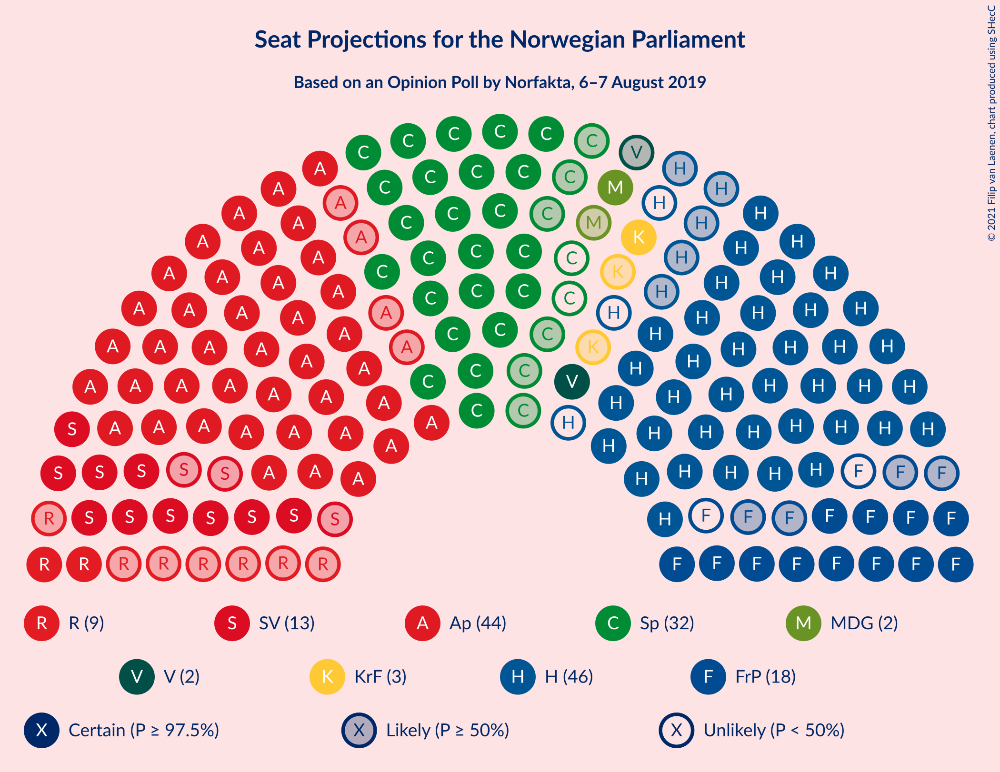
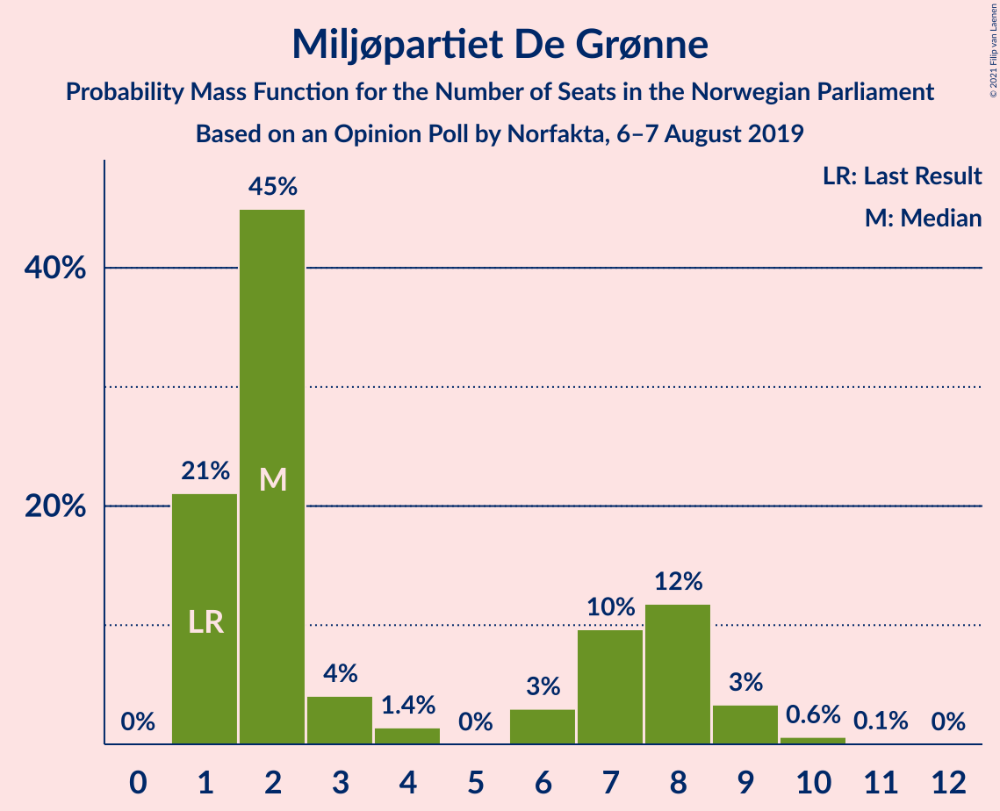
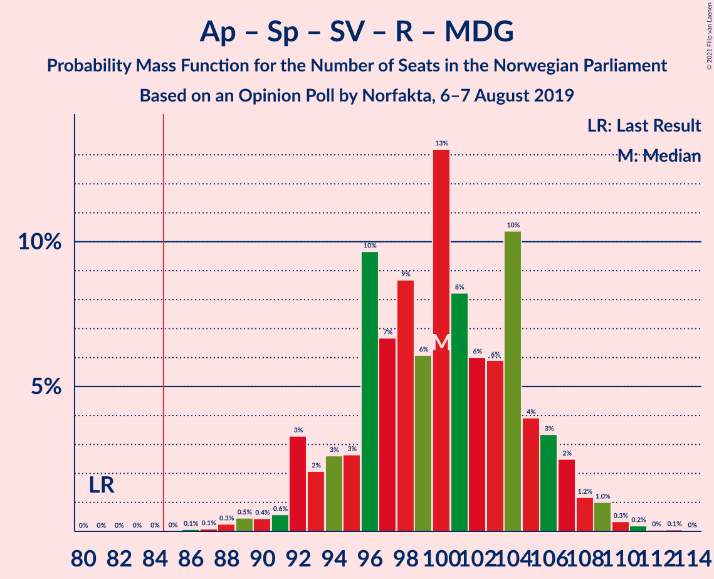
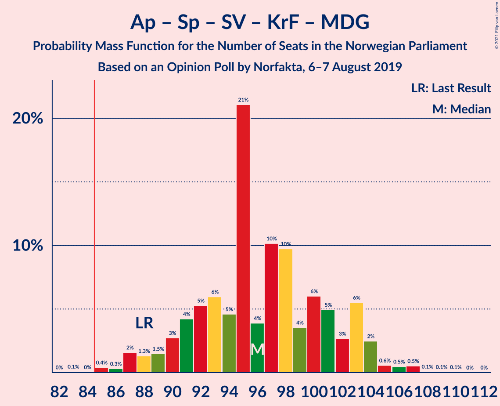
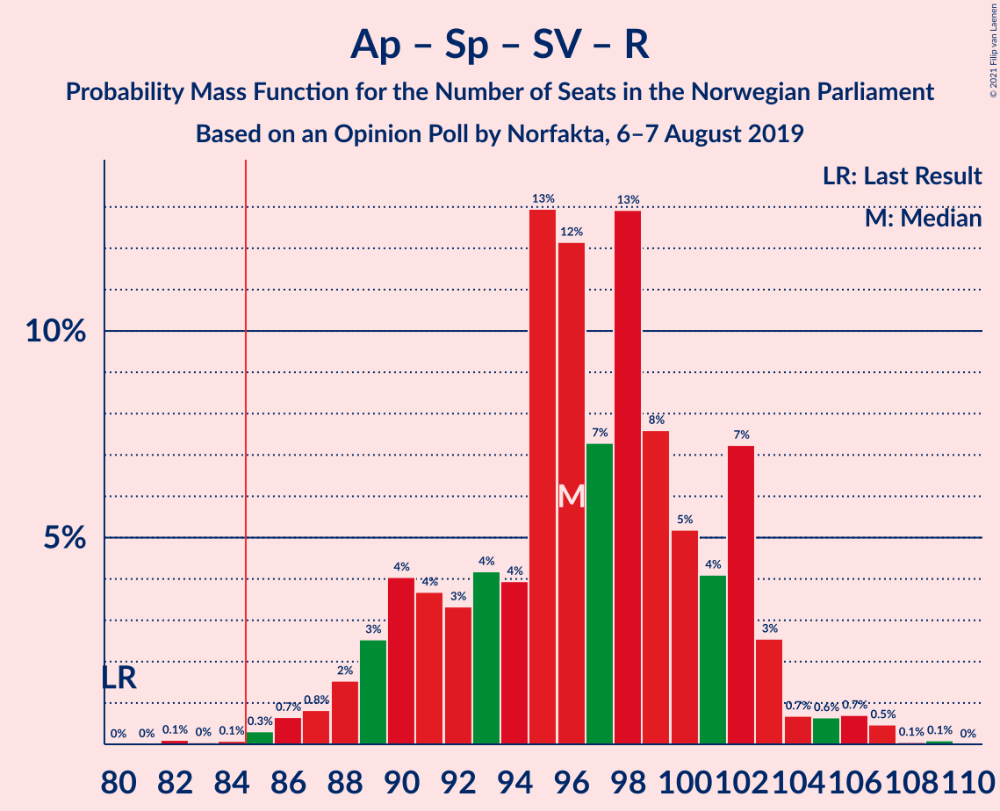
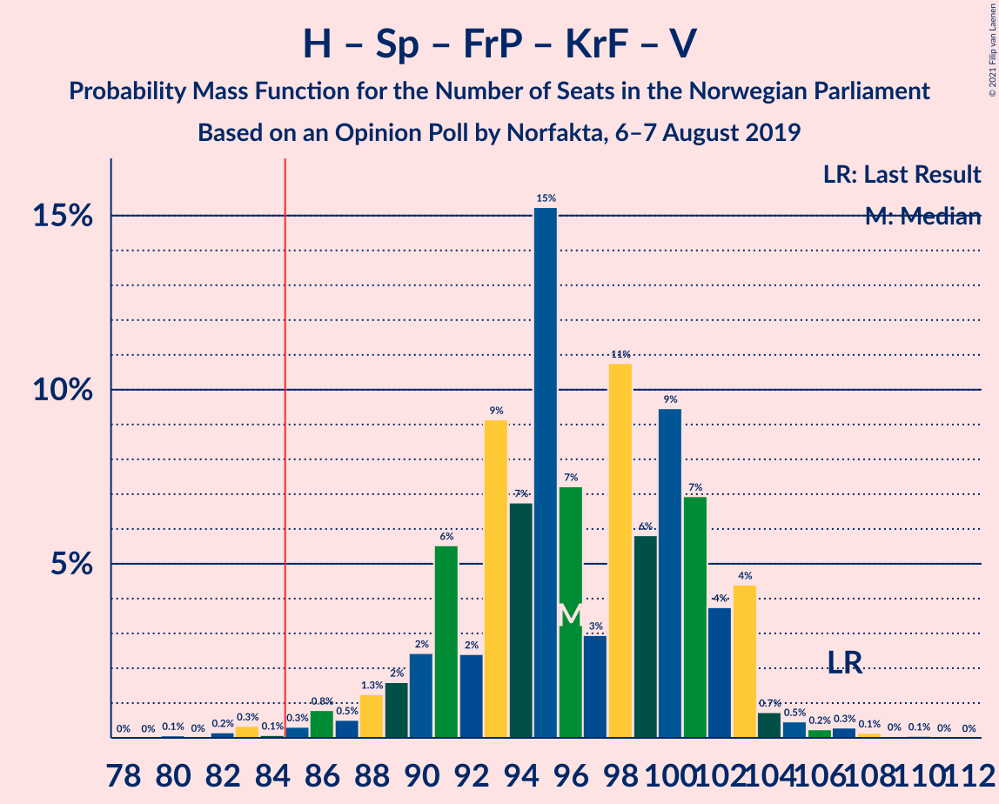
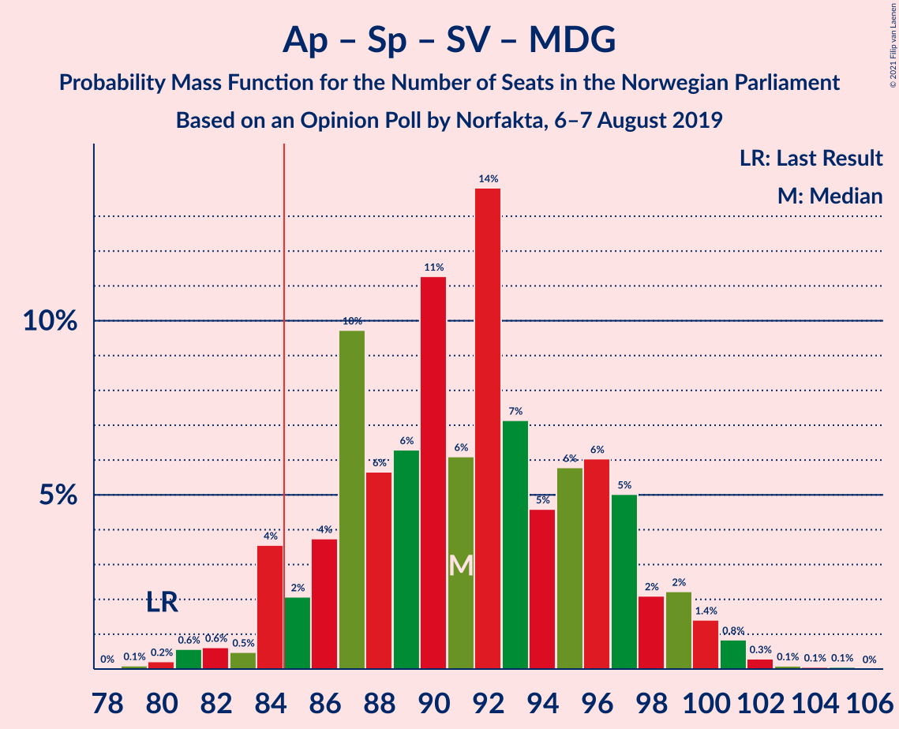
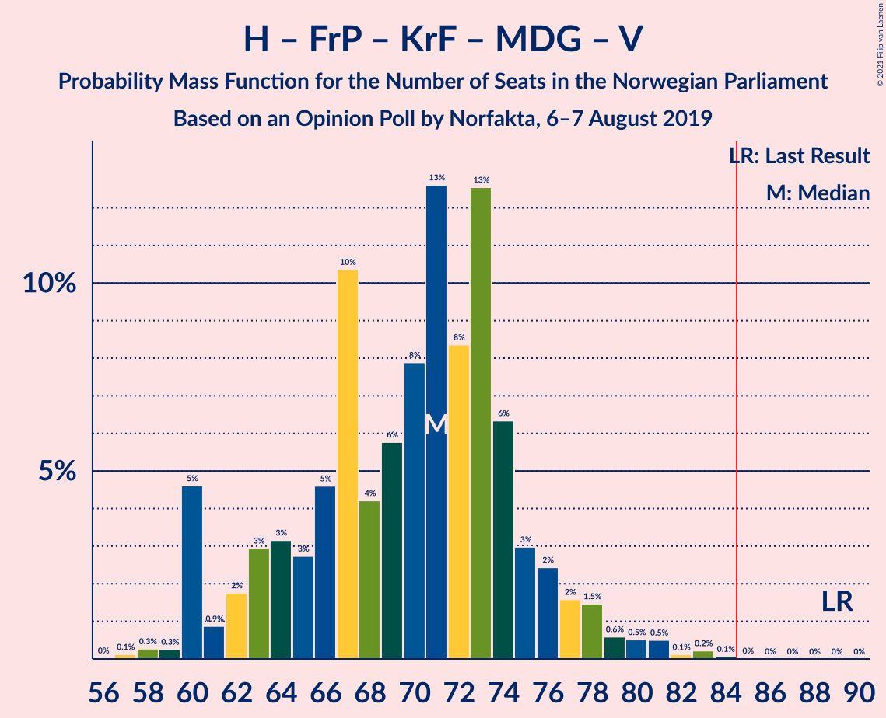

# Opinion Poll by Norfakta, 6–7 August 2019

<a href="#voting-intentions">Voting Intentions</a> | <a href="#seats">Seats</a> | <a href="#coalitions">Coalitions</a> | <a href="#technical-information">Technical Information</a>

## Voting Intentions

### Confidence Intervals

| Party | Last Result | Poll Result | 80% Confidence Interval | 90% Confidence Interval | 95% Confidence Interval | 99% Confidence Interval |
|:-----:|:-----------:|:-----------:|:-----------------------:|:-----------------------:|:-----------------------:|:-----------------------:|
| Arbeiderpartiet | 27.4% | 24.4% | 22.5–26.4% |22.0–27.0% |21.6–27.5% |20.7–28.4% |
| Høyre | 25.0% | 24.1% | 22.3–26.1% |21.8–26.7% |21.3–27.2% |20.5–28.2% |
| Senterpartiet | 10.3% | 15.9% | 14.3–17.6% |13.9–18.1% |13.5–18.5% |12.8–19.4% |
| Fremskrittspartiet | 15.2% | 9.0% | 7.8–10.4% |7.5–10.8% |7.2–11.2% |6.7–11.9% |
| Sosialistisk Venstreparti | 6.0% | 7.4% | 6.4–8.7% |6.1–9.1% |5.8–9.4% |5.4–10.1% |
| Rødt | 2.4% | 5.0% | 4.1–6.1% |3.9–6.4% |3.7–6.7% |3.3–7.3% |
| Kristelig Folkeparti | 4.2% | 3.9% | 3.2–4.9% |2.9–5.2% |2.8–5.5% |2.5–6.0% |
| Miljøpartiet De Grønne | 3.2% | 3.7% | 2.9–4.6% |2.7–4.9% |2.6–5.2% |2.3–5.7% |
| Venstre | 4.4% | 2.8% | 2.2–3.7% |2.0–3.9% |1.9–4.2% |1.6–4.6% |

*Note:* The poll result column reflects the actual value used in the calculations. Published results may vary slightly, and in addition be rounded to fewer digits.

## Seats

### Confidence Intervals

| Party | Last Result | Median | 80% Confidence Interval | 90% Confidence Interval | 95% Confidence Interval | 99% Confidence Interval |
|:-----:|:-----------:|:------:|:-----------------------:|:-----------------------:|:-----------------------:|:-----------------------:|
| <a href="#arbeiderpartiet">Arbeiderpartiet</a> | 49 | 44 | 42–48 |41–50 |40–51 |39–54 |
| <a href="#høyre">Høyre</a> | 45 | 43 | 39–47 |38–49 |38–49 |36–53 |
| <a href="#senterpartiet">Senterpartiet</a> | 19 | 30 | 26–35 |25–35 |24–35 |22–36 |
| <a href="#fremskrittspartiet">Fremskrittspartiet</a> | 27 | 16 | 13–18 |13–19 |12–19 |10–22 |
| <a href="#sosialistisk-venstreparti">Sosialistisk Venstreparti</a> | 11 | 13 | 11–15 |10–16 |10–17 |9–19 |
| <a href="#rødt">Rødt</a> | 1 | 9 | 7–11 |2–12 |2–12 |2–13 |
| <a href="#kristelig-folkeparti">Kristelig Folkeparti</a> | 8 | 3 | 2–8 |1–9 |1–9 |1–10 |
| <a href="#miljøpartiet-de-grønne">Miljøpartiet De Grønne</a> | 1 | 2 | 1–8 |1–8 |1–9 |1–10 |
| <a href="#venstre">Venstre</a> | 8 | 2 | 1–2 |1–3 |1–7 |0–8 |

### Arbeiderpartiet

*For a full overview of the results for this party, see the [Arbeiderpartiet](party-arbeiderpartiet.html) page.*

| Number of Seats | Probability | Accumulated | Special Marks |
|:---------------:|:-----------:|:-----------:|:-------------:|
| 36 | 0% | 100% |  |
| 37 | 0.1% | 99.9% |  |
| 38 | 0.2% | 99.8% |  |
| 39 | 0.7% | 99.6% |  |
| 40 | 2% | 98.9% |  |
| 41 | 6% | 97% |  |
| 42 | 13% | 91% |  |
| 43 | 11% | 78% |  |
| 44 | 25% | 67% | Median |
| 45 | 15% | 42% |  |
| 46 | 4% | 28% |  |
| 47 | 3% | 24% |  |
| 48 | 11% | 21% |  |
| 49 | 4% | 10% | Last Result |
| 50 | 2% | 6% |  |
| 51 | 2% | 4% |  |
| 52 | 0.6% | 2% |  |
| 53 | 0.4% | 1.3% |  |
| 54 | 0.6% | 0.9% |  |
| 55 | 0.2% | 0.3% |  |
| 56 | 0.1% | 0.1% |  |
| 57 | 0% | 0% |  |

### Høyre

*For a full overview of the results for this party, see the [Høyre](party-høyre.html) page.*

| Number of Seats | Probability | Accumulated | Special Marks |
|:---------------:|:-----------:|:-----------:|:-------------:|
| 34 | 0.1% | 100% |  |
| 35 | 0.3% | 99.9% |  |
| 36 | 1.0% | 99.6% |  |
| 37 | 0.8% | 98.6% |  |
| 38 | 3% | 98% |  |
| 39 | 10% | 95% |  |
| 40 | 8% | 85% |  |
| 41 | 14% | 77% |  |
| 42 | 9% | 63% |  |
| 43 | 9% | 54% | Median |
| 44 | 9% | 46% |  |
| 45 | 8% | 36% | Last Result |
| 46 | 13% | 29% |  |
| 47 | 9% | 16% |  |
| 48 | 2% | 7% |  |
| 49 | 3% | 5% |  |
| 50 | 0.6% | 2% |  |
| 51 | 0.9% | 2% |  |
| 52 | 0.3% | 0.9% |  |
| 53 | 0.6% | 0.6% |  |
| 54 | 0% | 0.1% |  |
| 55 | 0% | 0% |  |

### Senterpartiet

*For a full overview of the results for this party, see the [Senterpartiet](party-senterpartiet.html) page.*

| Number of Seats | Probability | Accumulated | Special Marks |
|:---------------:|:-----------:|:-----------:|:-------------:|
| 19 | 0% | 100% | Last Result |
| 20 | 0% | 99.9% |  |
| 21 | 0.2% | 99.9% |  |
| 22 | 0.3% | 99.7% |  |
| 23 | 1.2% | 99.4% |  |
| 24 | 2% | 98% |  |
| 25 | 3% | 96% |  |
| 26 | 3% | 93% |  |
| 27 | 10% | 90% |  |
| 28 | 9% | 80% |  |
| 29 | 21% | 71% |  |
| 30 | 11% | 50% | Median |
| 31 | 6% | 39% |  |
| 32 | 9% | 32% |  |
| 33 | 6% | 24% |  |
| 34 | 5% | 17% |  |
| 35 | 11% | 13% |  |
| 36 | 2% | 2% |  |
| 37 | 0.2% | 0.3% |  |
| 38 | 0% | 0.1% |  |
| 39 | 0% | 0% |  |

### Fremskrittspartiet

*For a full overview of the results for this party, see the [Fremskrittspartiet](party-fremskrittspartiet.html) page.*

| Number of Seats | Probability | Accumulated | Special Marks |
|:---------------:|:-----------:|:-----------:|:-------------:|
| 9 | 0.1% | 100% |  |
| 10 | 0.7% | 99.9% |  |
| 11 | 0.7% | 99.2% |  |
| 12 | 3% | 98% |  |
| 13 | 7% | 96% |  |
| 14 | 7% | 88% |  |
| 15 | 18% | 81% |  |
| 16 | 17% | 63% | Median |
| 17 | 17% | 46% |  |
| 18 | 22% | 28% |  |
| 19 | 4% | 7% |  |
| 20 | 0.7% | 2% |  |
| 21 | 0.9% | 1.5% |  |
| 22 | 0.4% | 0.6% |  |
| 23 | 0.1% | 0.2% |  |
| 24 | 0.1% | 0.1% |  |
| 25 | 0% | 0% |  |
| 26 | 0% | 0% |  |
| 27 | 0% | 0% | Last Result |

### Sosialistisk Venstreparti

*For a full overview of the results for this party, see the [Sosialistisk Venstreparti](party-sosialistiskvenstreparti.html) page.*

| Number of Seats | Probability | Accumulated | Special Marks |
|:---------------:|:-----------:|:-----------:|:-------------:|
| 8 | 0.3% | 100% |  |
| 9 | 2% | 99.6% |  |
| 10 | 7% | 98% |  |
| 11 | 10% | 91% | Last Result |
| 12 | 15% | 81% |  |
| 13 | 29% | 66% | Median |
| 14 | 16% | 37% |  |
| 15 | 11% | 21% |  |
| 16 | 6% | 9% |  |
| 17 | 2% | 3% |  |
| 18 | 0.5% | 1.0% |  |
| 19 | 0.5% | 0.6% |  |
| 20 | 0% | 0.1% |  |
| 21 | 0% | 0% |  |

### Rødt

*For a full overview of the results for this party, see the [Rødt](party-rødt.html) page.*

| Number of Seats | Probability | Accumulated | Special Marks |
|:---------------:|:-----------:|:-----------:|:-------------:|
| 1 | 0% | 100% | Last Result |
| 2 | 6% | 100% |  |
| 3 | 0% | 94% |  |
| 4 | 0% | 94% |  |
| 5 | 0% | 94% |  |
| 6 | 0.7% | 94% |  |
| 7 | 6% | 93% |  |
| 8 | 36% | 87% |  |
| 9 | 22% | 52% | Median |
| 10 | 14% | 29% |  |
| 11 | 9% | 15% |  |
| 12 | 6% | 6% |  |
| 13 | 0.5% | 0.7% |  |
| 14 | 0.1% | 0.1% |  |
| 15 | 0% | 0% |  |

### Kristelig Folkeparti

*For a full overview of the results for this party, see the [Kristelig Folkeparti](party-kristeligfolkeparti.html) page.*

| Number of Seats | Probability | Accumulated | Special Marks |
|:---------------:|:-----------:|:-----------:|:-------------:|
| 0 | 0.1% | 100% |  |
| 1 | 8% | 99.9% |  |
| 2 | 7% | 92% |  |
| 3 | 38% | 86% | Median |
| 4 | 0% | 47% |  |
| 5 | 0% | 47% |  |
| 6 | 3% | 47% |  |
| 7 | 17% | 44% |  |
| 8 | 20% | 27% | Last Result |
| 9 | 6% | 8% |  |
| 10 | 1.1% | 2% |  |
| 11 | 0.4% | 0.5% |  |
| 12 | 0.1% | 0.1% |  |
| 13 | 0% | 0% |  |

### Miljøpartiet De Grønne

*For a full overview of the results for this party, see the [Miljøpartiet De Grønne](party-miljøpartietdegrønne.html) page.*

| Number of Seats | Probability | Accumulated | Special Marks |
|:---------------:|:-----------:|:-----------:|:-------------:|
| 1 | 21% | 100% | Last Result |
| 2 | 45% | 79% | Median |
| 3 | 4% | 34% |  |
| 4 | 1.4% | 30% |  |
| 5 | 0% | 28% |  |
| 6 | 3% | 28% |  |
| 7 | 10% | 26% |  |
| 8 | 12% | 16% |  |
| 9 | 3% | 4% |  |
| 10 | 0.6% | 0.7% |  |
| 11 | 0.1% | 0.1% |  |
| 12 | 0% | 0% |  |

### Venstre

*For a full overview of the results for this party, see the [Venstre](party-venstre.html) page.*

| Number of Seats | Probability | Accumulated | Special Marks |
|:---------------:|:-----------:|:-----------:|:-------------:|
| 0 | 0.9% | 100% |  |
| 1 | 17% | 99.1% |  |
| 2 | 75% | 82% | Median |
| 3 | 4% | 7% |  |
| 4 | 0% | 3% |  |
| 5 | 0% | 3% |  |
| 6 | 0.3% | 3% |  |
| 7 | 2% | 3% |  |
| 8 | 0.6% | 0.8% | Last Result |
| 9 | 0.2% | 0.2% |  |
| 10 | 0% | 0% |  |

## Coalitions

### Confidence Intervals

| Coalition | Last Result | Median | Majority? | 80% Confidence Interval | 90% Confidence Interval | 95% Confidence Interval | 99% Confidence Interval |
|:---------:|:-----------:|:------:|:---------:|:-----------------------:|:-----------------------:|:-----------------------:|:-----------------------:|
| Arbeiderpartiet – Senterpartiet – Sosialistisk Venstreparti – Rødt – Miljøpartiet De Grønne | 81 | 100 | 100% | 95–105 | 92–107 | 92–108 | 89–110 |
| Arbeiderpartiet – Senterpartiet – Sosialistisk Venstreparti – Kristelig Folkeparti – Miljøpartiet De Grønne | 88 | 96 | 99.8% | 91–102 | 89–103 | 88–104 | 85–107 |
| Arbeiderpartiet – Senterpartiet – Sosialistisk Venstreparti – Rødt | 80 | 96 | 99.7% | 90–102 | 89–103 | 88–104 | 85–107 |
| Høyre – Senterpartiet – Fremskrittspartiet – Kristelig Folkeparti – Venstre | 107 | 96 | 99.3% | 91–102 | 89–103 | 88–103 | 83–107 |
| Arbeiderpartiet – Senterpartiet – Sosialistisk Venstreparti – Miljøpartiet De Grønne | 80 | 91 | 94% | 86–97 | 84–99 | 84–100 | 81–102 |
| Arbeiderpartiet – Senterpartiet – Sosialistisk Venstreparti | 79 | 88 | 81% | 82–93 | 81–94 | 80–96 | 77–99 |
| Arbeiderpartiet – Senterpartiet – Kristelig Folkeparti – Miljøpartiet De Grønne | 77 | 83 | 41% | 78–89 | 76–90 | 74–92 | 72–94 |
| Arbeiderpartiet – Senterpartiet – Kristelig Folkeparti | 76 | 80 | 12% | 75–85 | 72–86 | 72–87 | 69–90 |
| Arbeiderpartiet – Senterpartiet | 68 | 75 | 0.3% | 71–80 | 69–80 | 67–82 | 65–84 |
| Arbeiderpartiet – Sosialistisk Venstreparti – Rødt – Miljøpartiet De Grønne | 62 | 69 | 0% | 65–75 | 63–78 | 62–78 | 61–81 |
| Høyre – Fremskrittspartiet – Kristelig Folkeparti – Miljøpartiet De Grønne – Venstre | 89 | 71 | 0% | 63–75 | 60–77 | 60–78 | 59–81 |
| Høyre – Fremskrittspartiet – Kristelig Folkeparti – Venstre | 88 | 66 | 0% | 60–71 | 58–73 | 58–74 | 55–77 |
| Høyre – Fremskrittspartiet – Venstre | 80 | 61 | 0% | 55–66 | 55–68 | 54–69 | 52–72 |
| Høyre – Fremskrittspartiet | 72 | 59 | 0% | 54–65 | 53–66 | 52–66 | 50–70 |
| Arbeiderpartiet – Sosialistisk Venstreparti | 60 | 58 | 0% | 54–62 | 52–63 | 52–65 | 50–68 |
| Høyre – Kristelig Folkeparti – Venstre | 61 | 51 | 0% | 45–55 | 43–56 | 43–58 | 40–61 |
| Senterpartiet – Kristelig Folkeparti – Venstre | 35 | 37 | 0% | 32–42 | 30–44 | 29–45 | 27–46 |

### Arbeiderpartiet – Senterpartiet – Sosialistisk Venstreparti – Rødt – Miljøpartiet De Grønne

| Number of Seats | Probability | Accumulated | Special Marks |
|:---------------:|:-----------:|:-----------:|:-------------:|
| 81 | 0% | 100% | Last Result |
| 82 | 0% | 100% |  |
| 83 | 0% | 100% |  |
| 84 | 0% | 100% |  |
| 85 | 0% | 100% | Majority |
| 86 | 0.1% | 100% |  |
| 87 | 0.1% | 99.9% |  |
| 88 | 0.3% | 99.8% |  |
| 89 | 0.5% | 99.6% |  |
| 90 | 0.4% | 99.1% |  |
| 91 | 0.6% | 98.6% |  |
| 92 | 3% | 98% |  |
| 93 | 2% | 95% |  |
| 94 | 3% | 93% |  |
| 95 | 3% | 90% |  |
| 96 | 10% | 87% |  |
| 97 | 7% | 78% |  |
| 98 | 9% | 71% | Median |
| 99 | 6% | 62% |  |
| 100 | 13% | 56% |  |
| 101 | 8% | 43% |  |
| 102 | 6% | 35% |  |
| 103 | 6% | 29% |  |
| 104 | 10% | 23% |  |
| 105 | 4% | 13% |  |
| 106 | 3% | 9% |  |
| 107 | 2% | 5% |  |
| 108 | 1.2% | 3% |  |
| 109 | 1.0% | 2% |  |
| 110 | 0.3% | 0.7% |  |
| 111 | 0.2% | 0.3% |  |
| 112 | 0% | 0.1% |  |
| 113 | 0.1% | 0.1% |  |
| 114 | 0% | 0% |  |

### Arbeiderpartiet – Senterpartiet – Sosialistisk Venstreparti – Kristelig Folkeparti – Miljøpartiet De Grønne

| Number of Seats | Probability | Accumulated | Special Marks |
|:---------------:|:-----------:|:-----------:|:-------------:|
| 83 | 0.1% | 100% |  |
| 84 | 0% | 99.9% |  |
| 85 | 0.4% | 99.8% | Majority |
| 86 | 0.3% | 99.4% |  |
| 87 | 2% | 99.1% |  |
| 88 | 1.3% | 98% | Last Result |
| 89 | 1.5% | 96% |  |
| 90 | 3% | 95% |  |
| 91 | 4% | 92% |  |
| 92 | 5% | 88% | Median |
| 93 | 6% | 82% |  |
| 94 | 5% | 76% |  |
| 95 | 21% | 72% |  |
| 96 | 4% | 51% |  |
| 97 | 10% | 47% |  |
| 98 | 10% | 37% |  |
| 99 | 4% | 27% |  |
| 100 | 6% | 23% |  |
| 101 | 5% | 17% |  |
| 102 | 3% | 12% |  |
| 103 | 6% | 10% |  |
| 104 | 2% | 4% |  |
| 105 | 0.6% | 2% |  |
| 106 | 0.5% | 1.2% |  |
| 107 | 0.5% | 0.8% |  |
| 108 | 0.1% | 0.2% |  |
| 109 | 0.1% | 0.2% |  |
| 110 | 0.1% | 0.1% |  |
| 111 | 0% | 0% |  |

### Arbeiderpartiet – Senterpartiet – Sosialistisk Venstreparti – Rødt

| Number of Seats | Probability | Accumulated | Special Marks |
|:---------------:|:-----------:|:-----------:|:-------------:|
| 80 | 0% | 100% | Last Result |
| 81 | 0% | 100% |  |
| 82 | 0.1% | 100% |  |
| 83 | 0% | 99.9% |  |
| 84 | 0.1% | 99.8% |  |
| 85 | 0.3% | 99.7% | Majority |
| 86 | 0.7% | 99.4% |  |
| 87 | 0.8% | 98.8% |  |
| 88 | 2% | 98% |  |
| 89 | 3% | 96% |  |
| 90 | 4% | 94% |  |
| 91 | 4% | 90% |  |
| 92 | 3% | 86% |  |
| 93 | 4% | 83% |  |
| 94 | 4% | 79% |  |
| 95 | 13% | 75% |  |
| 96 | 12% | 62% | Median |
| 97 | 7% | 50% |  |
| 98 | 13% | 42% |  |
| 99 | 8% | 29% |  |
| 100 | 5% | 22% |  |
| 101 | 4% | 17% |  |
| 102 | 7% | 12% |  |
| 103 | 3% | 5% |  |
| 104 | 0.7% | 3% |  |
| 105 | 0.6% | 2% |  |
| 106 | 0.7% | 1.3% |  |
| 107 | 0.5% | 0.6% |  |
| 108 | 0.1% | 0.2% |  |
| 109 | 0.1% | 0.1% |  |
| 110 | 0% | 0% |  |

### Høyre – Senterpartiet – Fremskrittspartiet – Kristelig Folkeparti – Venstre

| Number of Seats | Probability | Accumulated | Special Marks |
|:---------------:|:-----------:|:-----------:|:-------------:|
| 80 | 0.1% | 100% |  |
| 81 | 0% | 99.9% |  |
| 82 | 0.2% | 99.9% |  |
| 83 | 0.3% | 99.7% |  |
| 84 | 0.1% | 99.4% |  |
| 85 | 0.3% | 99.3% | Majority |
| 86 | 0.8% | 99.0% |  |
| 87 | 0.5% | 98% |  |
| 88 | 1.3% | 98% |  |
| 89 | 2% | 96% |  |
| 90 | 2% | 95% |  |
| 91 | 6% | 92% |  |
| 92 | 2% | 87% |  |
| 93 | 9% | 84% |  |
| 94 | 7% | 75% | Median |
| 95 | 15% | 69% |  |
| 96 | 7% | 53% |  |
| 97 | 3% | 46% |  |
| 98 | 11% | 43% |  |
| 99 | 6% | 32% |  |
| 100 | 9% | 27% |  |
| 101 | 7% | 17% |  |
| 102 | 4% | 10% |  |
| 103 | 4% | 6% |  |
| 104 | 0.7% | 2% |  |
| 105 | 0.5% | 1.3% |  |
| 106 | 0.2% | 0.8% |  |
| 107 | 0.3% | 0.6% | Last Result |
| 108 | 0.1% | 0.3% |  |
| 109 | 0% | 0.1% |  |
| 110 | 0.1% | 0.1% |  |
| 111 | 0% | 0% |  |

### Arbeiderpartiet – Senterpartiet – Sosialistisk Venstreparti – Miljøpartiet De Grønne

| Number of Seats | Probability | Accumulated | Special Marks |
|:---------------:|:-----------:|:-----------:|:-------------:|
| 78 | 0% | 100% |  |
| 79 | 0.1% | 99.9% |  |
| 80 | 0.2% | 99.9% | Last Result |
| 81 | 0.6% | 99.6% |  |
| 82 | 0.6% | 99.1% |  |
| 83 | 0.5% | 98% |  |
| 84 | 4% | 98% |  |
| 85 | 2% | 94% | Majority |
| 86 | 4% | 92% |  |
| 87 | 10% | 89% |  |
| 88 | 6% | 79% |  |
| 89 | 6% | 73% | Median |
| 90 | 11% | 67% |  |
| 91 | 6% | 56% |  |
| 92 | 14% | 50% |  |
| 93 | 7% | 36% |  |
| 94 | 5% | 29% |  |
| 95 | 6% | 24% |  |
| 96 | 6% | 18% |  |
| 97 | 5% | 12% |  |
| 98 | 2% | 7% |  |
| 99 | 2% | 5% |  |
| 100 | 1.4% | 3% |  |
| 101 | 0.8% | 1.4% |  |
| 102 | 0.3% | 0.5% |  |
| 103 | 0.1% | 0.2% |  |
| 104 | 0.1% | 0.1% |  |
| 105 | 0.1% | 0.1% |  |
| 106 | 0% | 0% |  |

### Arbeiderpartiet – Senterpartiet – Sosialistisk Venstreparti

| Number of Seats | Probability | Accumulated | Special Marks |
|:---------------:|:-----------:|:-----------:|:-------------:|
| 75 | 0.1% | 100% |  |
| 76 | 0.1% | 99.9% |  |
| 77 | 0.3% | 99.8% |  |
| 78 | 0.5% | 99.5% |  |
| 79 | 1.0% | 99.0% | Last Result |
| 80 | 1.2% | 98% |  |
| 81 | 3% | 97% |  |
| 82 | 4% | 94% |  |
| 83 | 3% | 89% |  |
| 84 | 5% | 86% |  |
| 85 | 6% | 81% | Majority |
| 86 | 10% | 75% |  |
| 87 | 9% | 65% | Median |
| 88 | 15% | 56% |  |
| 89 | 5% | 41% |  |
| 90 | 12% | 36% |  |
| 91 | 8% | 24% |  |
| 92 | 5% | 16% |  |
| 93 | 5% | 11% |  |
| 94 | 1.2% | 6% |  |
| 95 | 2% | 5% |  |
| 96 | 1.4% | 3% |  |
| 97 | 0.4% | 1.3% |  |
| 98 | 0.1% | 0.9% |  |
| 99 | 0.6% | 0.8% |  |
| 100 | 0% | 0.1% |  |
| 101 | 0.1% | 0.1% |  |
| 102 | 0% | 0% |  |

### Arbeiderpartiet – Senterpartiet – Kristelig Folkeparti – Miljøpartiet De Grønne

| Number of Seats | Probability | Accumulated | Special Marks |
|:---------------:|:-----------:|:-----------:|:-------------:|
| 70 | 0.1% | 100% |  |
| 71 | 0.1% | 99.8% |  |
| 72 | 0.4% | 99.7% |  |
| 73 | 0.2% | 99.3% |  |
| 74 | 2% | 99.1% |  |
| 75 | 0.9% | 97% |  |
| 76 | 2% | 96% |  |
| 77 | 4% | 95% | Last Result |
| 78 | 6% | 90% |  |
| 79 | 4% | 84% | Median |
| 80 | 4% | 80% |  |
| 81 | 9% | 77% |  |
| 82 | 15% | 68% |  |
| 83 | 8% | 52% |  |
| 84 | 4% | 45% |  |
| 85 | 13% | 41% | Majority |
| 86 | 6% | 28% |  |
| 87 | 5% | 22% |  |
| 88 | 4% | 18% |  |
| 89 | 6% | 13% |  |
| 90 | 2% | 7% |  |
| 91 | 1.3% | 5% |  |
| 92 | 2% | 3% |  |
| 93 | 0.3% | 1.2% |  |
| 94 | 0.6% | 0.9% |  |
| 95 | 0.2% | 0.3% |  |
| 96 | 0.1% | 0.1% |  |
| 97 | 0% | 0.1% |  |
| 98 | 0% | 0.1% |  |
| 99 | 0% | 0% |  |

### Arbeiderpartiet – Senterpartiet – Kristelig Folkeparti

| Number of Seats | Probability | Accumulated | Special Marks |
|:---------------:|:-----------:|:-----------:|:-------------:|
| 66 | 0% | 100% |  |
| 67 | 0.1% | 99.9% |  |
| 68 | 0.3% | 99.9% |  |
| 69 | 0.2% | 99.6% |  |
| 70 | 1.2% | 99.4% |  |
| 71 | 0.6% | 98% |  |
| 72 | 3% | 98% |  |
| 73 | 1.2% | 95% |  |
| 74 | 3% | 93% |  |
| 75 | 6% | 91% |  |
| 76 | 8% | 85% | Last Result |
| 77 | 5% | 77% | Median |
| 78 | 6% | 72% |  |
| 79 | 8% | 66% |  |
| 80 | 13% | 58% |  |
| 81 | 14% | 45% |  |
| 82 | 4% | 31% |  |
| 83 | 12% | 27% |  |
| 84 | 4% | 16% |  |
| 85 | 4% | 12% | Majority |
| 86 | 5% | 8% |  |
| 87 | 1.2% | 3% |  |
| 88 | 0.9% | 2% |  |
| 89 | 0.6% | 1.2% |  |
| 90 | 0.4% | 0.6% |  |
| 91 | 0.1% | 0.2% |  |
| 92 | 0% | 0.1% |  |
| 93 | 0% | 0% |  |

### Arbeiderpartiet – Senterpartiet

| Number of Seats | Probability | Accumulated | Special Marks |
|:---------------:|:-----------:|:-----------:|:-------------:|
| 63 | 0.1% | 100% |  |
| 64 | 0.2% | 99.9% |  |
| 65 | 0.3% | 99.7% |  |
| 66 | 0.7% | 99.4% |  |
| 67 | 1.5% | 98.7% |  |
| 68 | 1.2% | 97% | Last Result |
| 69 | 4% | 96% |  |
| 70 | 2% | 92% |  |
| 71 | 8% | 90% |  |
| 72 | 8% | 82% |  |
| 73 | 13% | 74% |  |
| 74 | 11% | 61% | Median |
| 75 | 9% | 50% |  |
| 76 | 7% | 41% |  |
| 77 | 12% | 34% |  |
| 78 | 7% | 22% |  |
| 79 | 4% | 15% |  |
| 80 | 7% | 11% |  |
| 81 | 1.4% | 5% |  |
| 82 | 0.8% | 3% |  |
| 83 | 1.4% | 2% |  |
| 84 | 0.8% | 1.0% |  |
| 85 | 0.1% | 0.3% | Majority |
| 86 | 0.1% | 0.1% |  |
| 87 | 0% | 0.1% |  |
| 88 | 0% | 0% |  |

### Arbeiderpartiet – Sosialistisk Venstreparti – Rødt – Miljøpartiet De Grønne

| Number of Seats | Probability | Accumulated | Special Marks |
|:---------------:|:-----------:|:-----------:|:-------------:|
| 57 | 0.1% | 100% |  |
| 58 | 0% | 99.9% |  |
| 59 | 0.2% | 99.9% |  |
| 60 | 0.2% | 99.7% |  |
| 61 | 0.4% | 99.5% |  |
| 62 | 3% | 99.1% | Last Result |
| 63 | 0.9% | 96% |  |
| 64 | 3% | 95% |  |
| 65 | 3% | 92% |  |
| 66 | 6% | 89% |  |
| 67 | 13% | 83% |  |
| 68 | 10% | 69% | Median |
| 69 | 13% | 60% |  |
| 70 | 7% | 47% |  |
| 71 | 11% | 40% |  |
| 72 | 2% | 29% |  |
| 73 | 6% | 27% |  |
| 74 | 7% | 21% |  |
| 75 | 5% | 14% |  |
| 76 | 2% | 9% |  |
| 77 | 1.0% | 7% |  |
| 78 | 4% | 6% |  |
| 79 | 1.1% | 2% |  |
| 80 | 0.2% | 0.8% |  |
| 81 | 0.2% | 0.5% |  |
| 82 | 0.2% | 0.3% |  |
| 83 | 0.1% | 0.1% |  |
| 84 | 0% | 0.1% |  |
| 85 | 0% | 0% | Majority |

### Høyre – Fremskrittspartiet – Kristelig Folkeparti – Miljøpartiet De Grønne – Venstre

| Number of Seats | Probability | Accumulated | Special Marks |
|:---------------:|:-----------:|:-----------:|:-------------:|
| 57 | 0.1% | 100% |  |
| 58 | 0.3% | 99.8% |  |
| 59 | 0.3% | 99.6% |  |
| 60 | 5% | 99.3% |  |
| 61 | 0.9% | 95% |  |
| 62 | 2% | 94% |  |
| 63 | 3% | 92% |  |
| 64 | 3% | 89% |  |
| 65 | 3% | 86% |  |
| 66 | 5% | 83% | Median |
| 67 | 10% | 79% |  |
| 68 | 4% | 68% |  |
| 69 | 6% | 64% |  |
| 70 | 8% | 58% |  |
| 71 | 13% | 50% |  |
| 72 | 8% | 38% |  |
| 73 | 13% | 29% |  |
| 74 | 6% | 17% |  |
| 75 | 3% | 11% |  |
| 76 | 2% | 8% |  |
| 77 | 2% | 5% |  |
| 78 | 1.5% | 4% |  |
| 79 | 0.6% | 2% |  |
| 80 | 0.5% | 1.5% |  |
| 81 | 0.5% | 0.9% |  |
| 82 | 0.1% | 0.4% |  |
| 83 | 0.2% | 0.3% |  |
| 84 | 0.1% | 0.1% |  |
| 85 | 0% | 0% | Majority |
| 86 | 0% | 0% |  |
| 87 | 0% | 0% |  |
| 88 | 0% | 0% |  |
| 89 | 0% | 0% | Last Result |

### Høyre – Fremskrittspartiet – Kristelig Folkeparti – Venstre

| Number of Seats | Probability | Accumulated | Special Marks |
|:---------------:|:-----------:|:-----------:|:-------------:|
| 53 | 0.1% | 100% |  |
| 54 | 0.2% | 99.9% |  |
| 55 | 0.6% | 99.7% |  |
| 56 | 0.6% | 99.1% |  |
| 57 | 0.8% | 98.6% |  |
| 58 | 4% | 98% |  |
| 59 | 2% | 93% |  |
| 60 | 3% | 91% |  |
| 61 | 3% | 88% |  |
| 62 | 5% | 85% |  |
| 63 | 6% | 80% |  |
| 64 | 5% | 75% | Median |
| 65 | 9% | 70% |  |
| 66 | 14% | 61% |  |
| 67 | 6% | 48% |  |
| 68 | 6% | 42% |  |
| 69 | 13% | 36% |  |
| 70 | 5% | 22% |  |
| 71 | 8% | 17% |  |
| 72 | 4% | 10% |  |
| 73 | 2% | 6% |  |
| 74 | 2% | 4% |  |
| 75 | 0.8% | 2% |  |
| 76 | 0.7% | 1.3% |  |
| 77 | 0.2% | 0.6% |  |
| 78 | 0.2% | 0.4% |  |
| 79 | 0% | 0.1% |  |
| 80 | 0.1% | 0.1% |  |
| 81 | 0% | 0% |  |
| 82 | 0% | 0% |  |
| 83 | 0% | 0% |  |
| 84 | 0% | 0% |  |
| 85 | 0% | 0% | Majority |
| 86 | 0% | 0% |  |
| 87 | 0% | 0% |  |
| 88 | 0% | 0% | Last Result |

### Høyre – Fremskrittspartiet – Venstre

| Number of Seats | Probability | Accumulated | Special Marks |
|:---------------:|:-----------:|:-----------:|:-------------:|
| 49 | 0.1% | 100% |  |
| 50 | 0.1% | 99.9% |  |
| 51 | 0.2% | 99.8% |  |
| 52 | 0.5% | 99.6% |  |
| 53 | 1.3% | 99.1% |  |
| 54 | 2% | 98% |  |
| 55 | 6% | 96% |  |
| 56 | 3% | 90% |  |
| 57 | 5% | 86% |  |
| 58 | 12% | 81% |  |
| 59 | 8% | 69% |  |
| 60 | 8% | 61% |  |
| 61 | 4% | 53% | Median |
| 62 | 8% | 49% |  |
| 63 | 7% | 41% |  |
| 64 | 7% | 34% |  |
| 65 | 6% | 27% |  |
| 66 | 12% | 21% |  |
| 67 | 3% | 9% |  |
| 68 | 4% | 6% |  |
| 69 | 1.2% | 3% |  |
| 70 | 0.6% | 1.4% |  |
| 71 | 0.2% | 0.8% |  |
| 72 | 0.4% | 0.7% |  |
| 73 | 0.1% | 0.3% |  |
| 74 | 0.1% | 0.1% |  |
| 75 | 0% | 0% |  |
| 76 | 0% | 0% |  |
| 77 | 0% | 0% |  |
| 78 | 0% | 0% |  |
| 79 | 0% | 0% |  |
| 80 | 0% | 0% | Last Result |

### Høyre – Fremskrittspartiet

| Number of Seats | Probability | Accumulated | Special Marks |
|:---------------:|:-----------:|:-----------:|:-------------:|
| 47 | 0% | 100% |  |
| 48 | 0.2% | 99.9% |  |
| 49 | 0.2% | 99.8% |  |
| 50 | 0.4% | 99.5% |  |
| 51 | 1.3% | 99.2% |  |
| 52 | 2% | 98% |  |
| 53 | 3% | 96% |  |
| 54 | 7% | 93% |  |
| 55 | 5% | 86% |  |
| 56 | 12% | 81% |  |
| 57 | 7% | 69% |  |
| 58 | 8% | 62% |  |
| 59 | 4% | 53% | Median |
| 60 | 9% | 49% |  |
| 61 | 7% | 40% |  |
| 62 | 7% | 33% |  |
| 63 | 5% | 26% |  |
| 64 | 11% | 21% |  |
| 65 | 5% | 10% |  |
| 66 | 3% | 6% |  |
| 67 | 1.0% | 2% |  |
| 68 | 0.7% | 1.4% |  |
| 69 | 0.1% | 0.7% |  |
| 70 | 0.3% | 0.5% |  |
| 71 | 0.1% | 0.2% |  |
| 72 | 0.1% | 0.1% | Last Result |
| 73 | 0% | 0% |  |

### Arbeiderpartiet – Sosialistisk Venstreparti

| Number of Seats | Probability | Accumulated | Special Marks |
|:---------------:|:-----------:|:-----------:|:-------------:|
| 49 | 0.1% | 100% |  |
| 50 | 0.4% | 99.8% |  |
| 51 | 1.2% | 99.4% |  |
| 52 | 5% | 98% |  |
| 53 | 4% | 94% |  |
| 54 | 6% | 90% |  |
| 55 | 8% | 84% |  |
| 56 | 9% | 76% |  |
| 57 | 15% | 66% | Median |
| 58 | 13% | 51% |  |
| 59 | 10% | 38% |  |
| 60 | 7% | 29% | Last Result |
| 61 | 10% | 21% |  |
| 62 | 2% | 11% |  |
| 63 | 5% | 9% |  |
| 64 | 2% | 5% |  |
| 65 | 0.7% | 3% |  |
| 66 | 1.1% | 2% |  |
| 67 | 0.3% | 0.9% |  |
| 68 | 0.4% | 0.6% |  |
| 69 | 0.1% | 0.2% |  |
| 70 | 0.1% | 0.1% |  |
| 71 | 0% | 0% |  |

### Høyre – Kristelig Folkeparti – Venstre

| Number of Seats | Probability | Accumulated | Special Marks |
|:---------------:|:-----------:|:-----------:|:-------------:|
| 39 | 0.1% | 100% |  |
| 40 | 0.5% | 99.9% |  |
| 41 | 0.6% | 99.4% |  |
| 42 | 0.4% | 98.8% |  |
| 43 | 5% | 98% |  |
| 44 | 2% | 93% |  |
| 45 | 2% | 91% |  |
| 46 | 6% | 89% |  |
| 47 | 4% | 83% |  |
| 48 | 11% | 79% | Median |
| 49 | 7% | 67% |  |
| 50 | 6% | 60% |  |
| 51 | 23% | 54% |  |
| 52 | 8% | 31% |  |
| 53 | 4% | 23% |  |
| 54 | 7% | 19% |  |
| 55 | 5% | 12% |  |
| 56 | 3% | 7% |  |
| 57 | 1.4% | 4% |  |
| 58 | 1.2% | 3% |  |
| 59 | 0.7% | 2% |  |
| 60 | 0.3% | 1.0% |  |
| 61 | 0.3% | 0.6% | Last Result |
| 62 | 0.2% | 0.4% |  |
| 63 | 0.1% | 0.2% |  |
| 64 | 0% | 0% |  |

### Senterpartiet – Kristelig Folkeparti – Venstre

| Number of Seats | Probability | Accumulated | Special Marks |
|:---------------:|:-----------:|:-----------:|:-------------:|
| 26 | 0.1% | 100% |  |
| 27 | 0.6% | 99.9% |  |
| 28 | 0.5% | 99.3% |  |
| 29 | 2% | 98.8% |  |
| 30 | 2% | 97% |  |
| 31 | 4% | 94% |  |
| 32 | 4% | 91% |  |
| 33 | 5% | 86% |  |
| 34 | 11% | 81% |  |
| 35 | 6% | 71% | Last Result, Median |
| 36 | 6% | 65% |  |
| 37 | 9% | 59% |  |
| 38 | 9% | 50% |  |
| 39 | 18% | 41% |  |
| 40 | 5% | 23% |  |
| 41 | 6% | 18% |  |
| 42 | 3% | 12% |  |
| 43 | 3% | 9% |  |
| 44 | 4% | 6% |  |
| 45 | 2% | 3% |  |
| 46 | 0.4% | 0.9% |  |
| 47 | 0.2% | 0.5% |  |
| 48 | 0.1% | 0.3% |  |
| 49 | 0.1% | 0.2% |  |
| 50 | 0% | 0.1% |  |
| 51 | 0% | 0% |  |

## Technical Information

### Opinion Poll

+ **Polling firm:** Norfakta
+ **Commissioner(s):** —
+ **Fieldwork period:** 6–7 August 2019

### Calculations

+ **Sample size:** 820
+ **Simulations done:** 1,048,576
+ **Error estimate:** 2.09%

