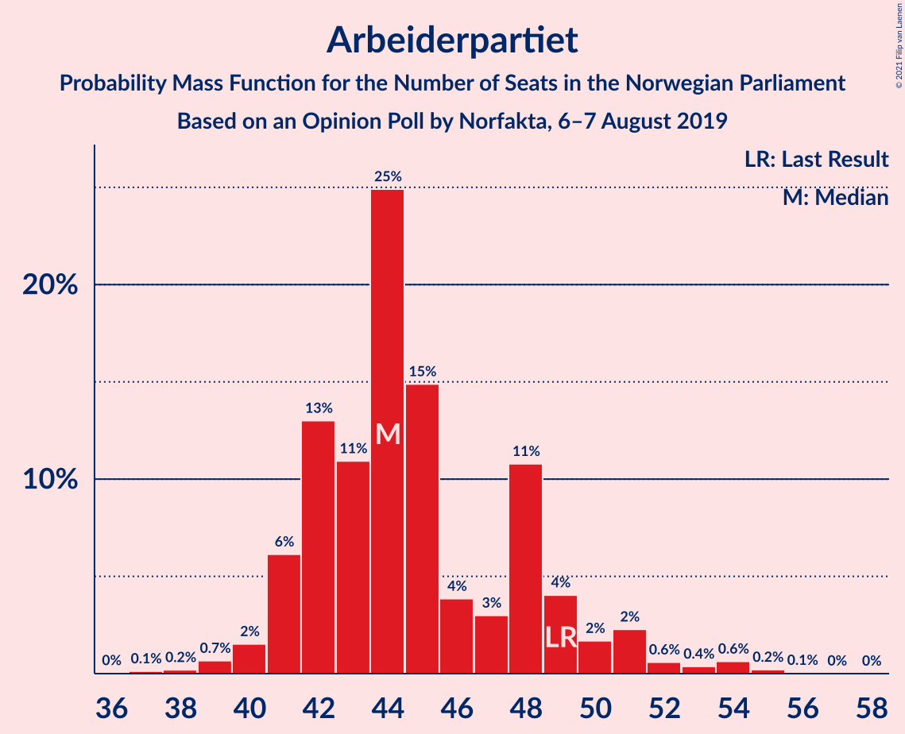
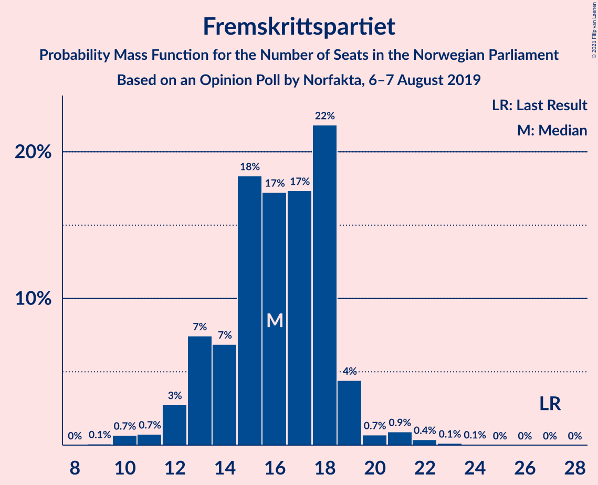
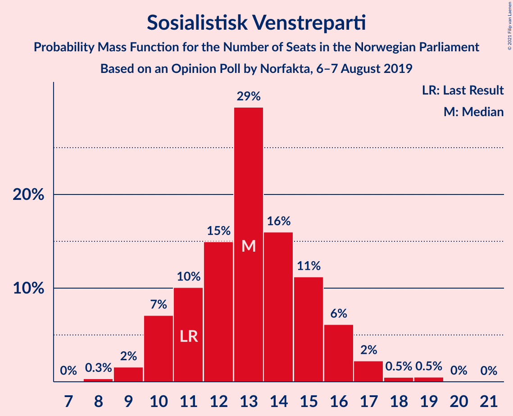
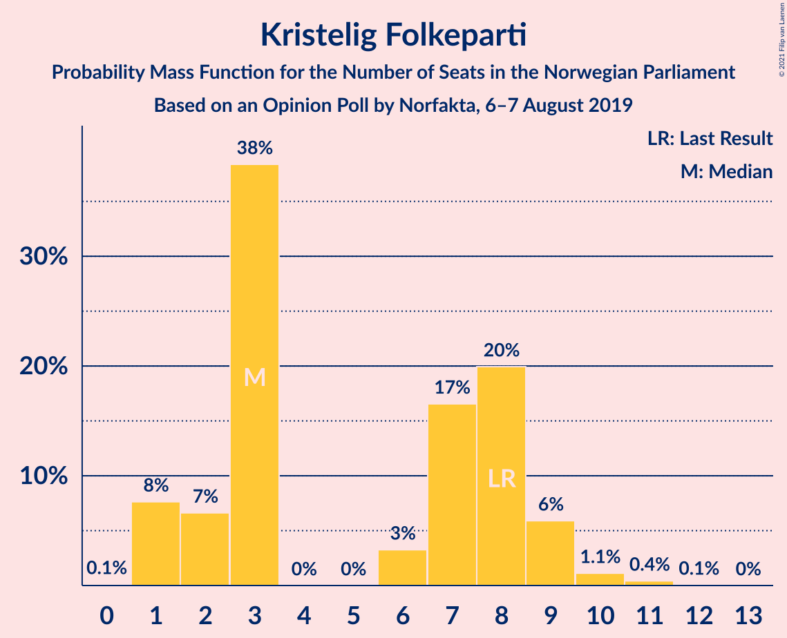
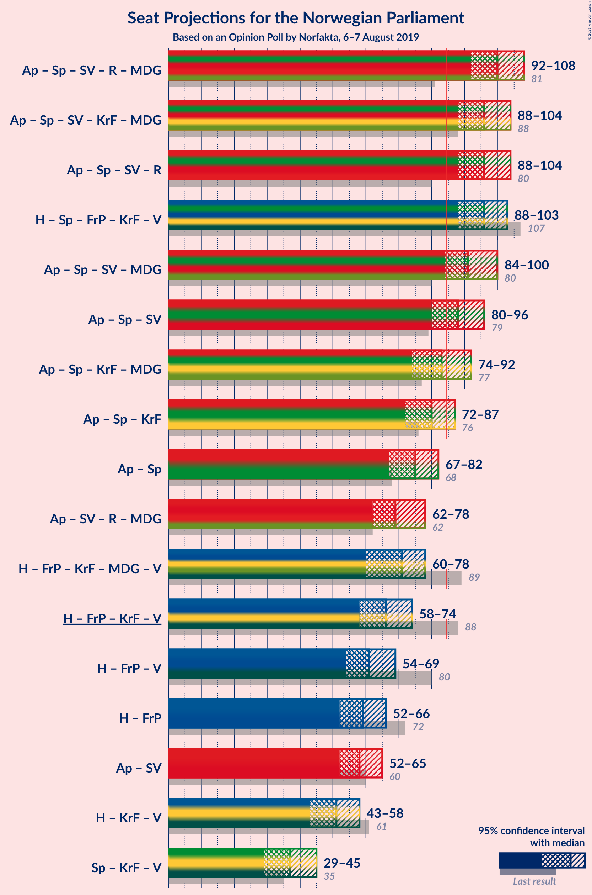
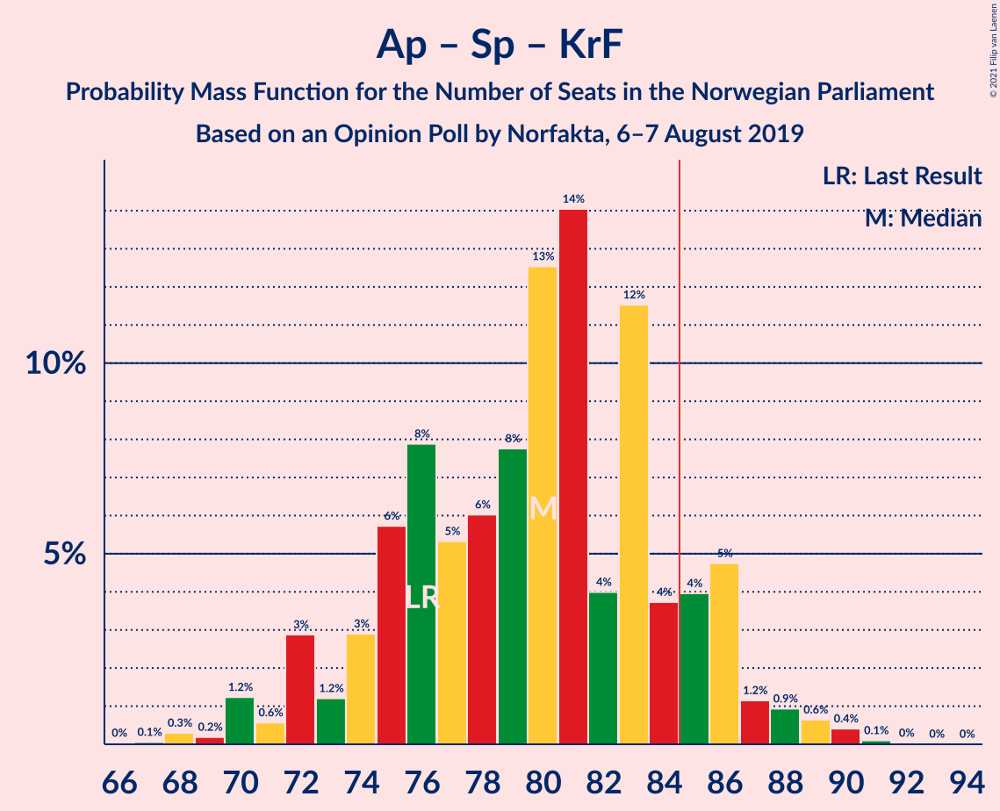
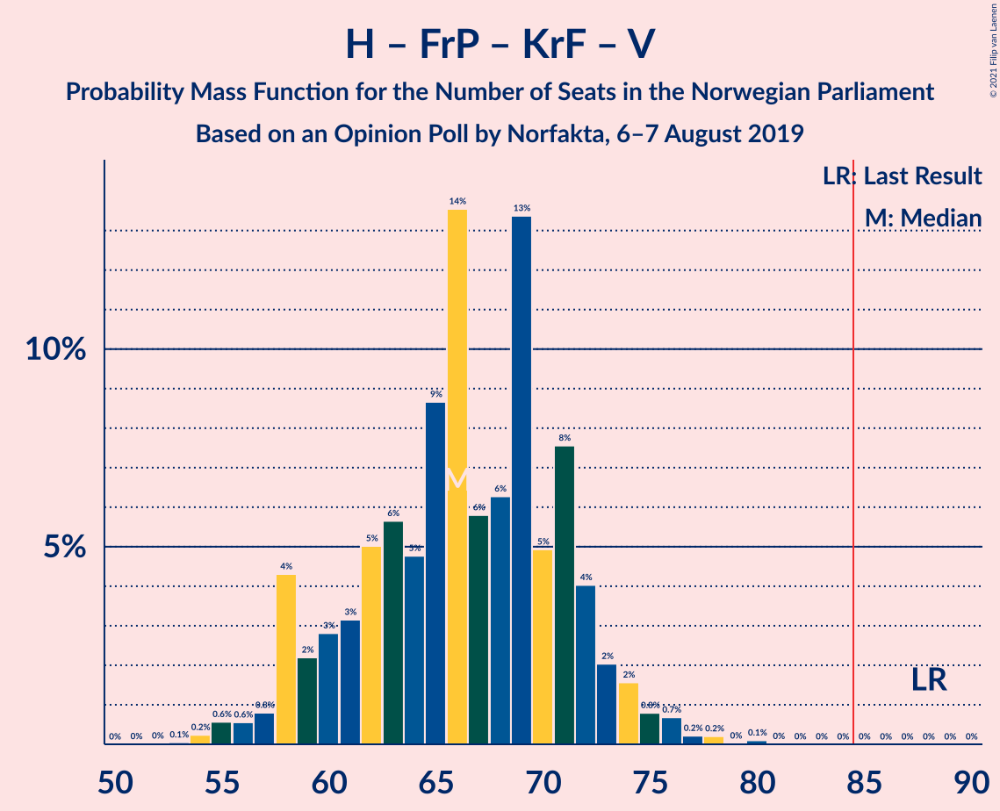
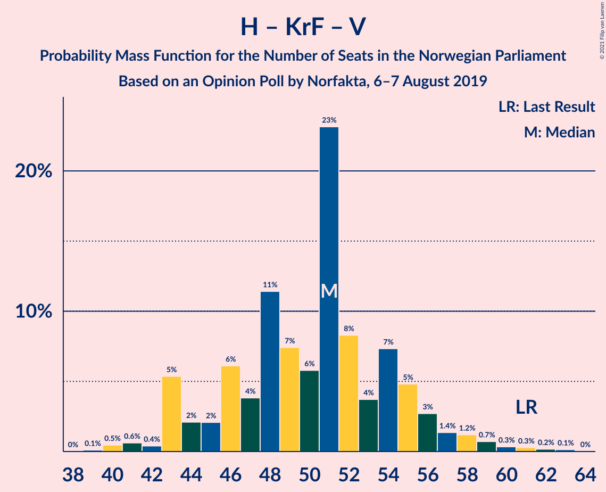
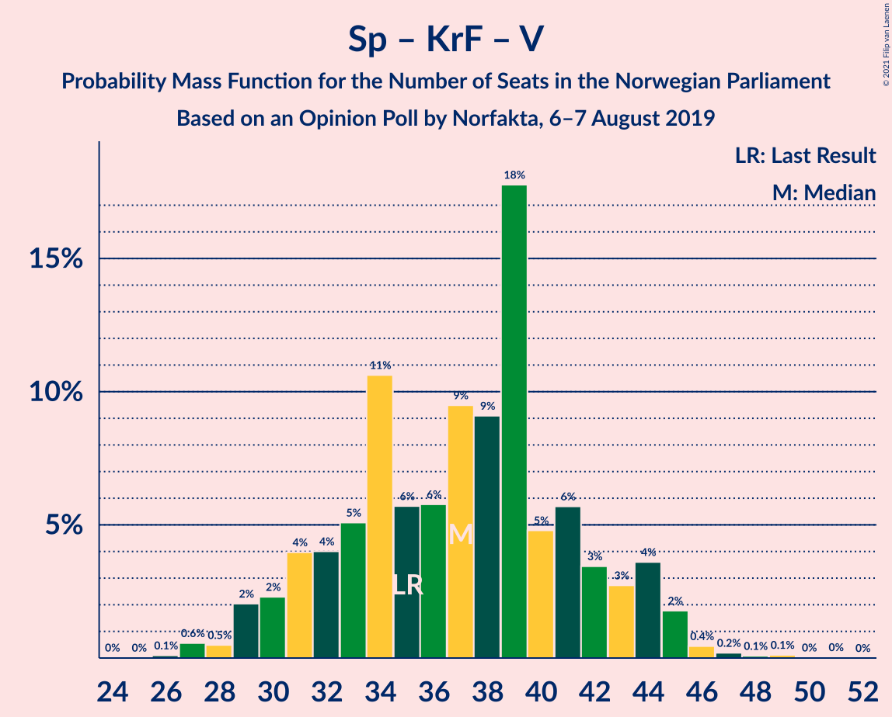

# Opinion Poll by Norfakta, 6–7 August 2019

<a href="#voting-intentions">Voting Intentions</a> | <a href="#seats">Seats</a> | <a href="#coalitions">Coalitions</a> | <a href="#technical-information">Technical Information</a>

## Voting Intentions

### Confidence Intervals

| Party | Last Result | Poll Result | 80% Confidence Interval | 90% Confidence Interval | 95% Confidence Interval | 99% Confidence Interval |
|:-----:|:-----------:|:-----------:|:-----------------------:|:-----------------------:|:-----------------------:|:-----------------------:|
| Arbeiderpartiet | 27.4% | 24.4% | 22.5–26.4% |22.0–27.0% |21.6–27.5% |20.7–28.4% |
| Høyre | 25.0% | 24.1% | 22.3–26.1% |21.8–26.7% |21.3–27.2% |20.5–28.2% |
| Senterpartiet | 10.3% | 15.9% | 14.3–17.6% |13.9–18.1% |13.5–18.5% |12.8–19.4% |
| Fremskrittspartiet | 15.2% | 9.0% | 7.8–10.4% |7.5–10.8% |7.2–11.2% |6.7–11.9% |
| Sosialistisk Venstreparti | 6.0% | 7.4% | 6.4–8.7% |6.1–9.1% |5.8–9.4% |5.4–10.1% |
| Rødt | 2.4% | 5.0% | 4.1–6.1% |3.9–6.4% |3.7–6.7% |3.3–7.3% |
| Kristelig Folkeparti | 4.2% | 3.9% | 3.2–4.9% |2.9–5.2% |2.8–5.5% |2.5–6.0% |
| Miljøpartiet De Grønne | 3.2% | 3.7% | 2.9–4.6% |2.7–4.9% |2.6–5.2% |2.3–5.7% |
| Venstre | 4.4% | 2.8% | 2.2–3.7% |2.0–3.9% |1.9–4.2% |1.6–4.6% |

*Note:* The poll result column reflects the actual value used in the calculations. Published results may vary slightly, and in addition be rounded to fewer digits.

## Seats

### Confidence Intervals

| Party | Last Result | Median | 80% Confidence Interval | 90% Confidence Interval | 95% Confidence Interval | 99% Confidence Interval |
|:-----:|:-----------:|:------:|:-----------------------:|:-----------------------:|:-----------------------:|:-----------------------:|
| <a href="#arbeiderpartiet">Arbeiderpartiet</a> | 49 | 45 | 42–49 |41–49 |40–51 |38–53 |
| <a href="#høyre">Høyre</a> | 45 | 44 | 40–46 |38–47 |37–49 |35–52 |
| <a href="#senterpartiet">Senterpartiet</a> | 19 | 31 | 27–35 |25–35 |25–36 |22–37 |
| <a href="#fremskrittspartiet">Fremskrittspartiet</a> | 27 | 17 | 13–18 |13–18 |11–20 |10–21 |
| <a href="#sosialistisk-venstreparti">Sosialistisk Venstreparti</a> | 11 | 12 | 10–15 |10–16 |10–17 |9–18 |
| <a href="#rødt">Rødt</a> | 1 | 8 | 7–12 |2–12 |2–12 |2–12 |
| <a href="#kristelig-folkeparti">Kristelig Folkeparti</a> | 8 | 3 | 3–8 |1–8 |1–9 |1–11 |
| <a href="#miljøpartiet-de-grønne">Miljøpartiet De Grønne</a> | 1 | 2 | 1–8 |1–8 |1–8 |1–9 |
| <a href="#venstre">Venstre</a> | 8 | 2 | 1–2 |1–2 |1–7 |0–8 |

### Arbeiderpartiet

*For a full overview of the results for this party, see the [Arbeiderpartiet](party-arbeiderpartiet.html) page.*

| Number of Seats | Probability | Accumulated | Special Marks |
|:---------------:|:-----------:|:-----------:|:-------------:|
| 37 | 0.4% | 100% |  |
| 38 | 0.2% | 99.6% |  |
| 39 | 0.4% | 99.4% |  |
| 40 | 2% | 99.0% |  |
| 41 | 6% | 97% |  |
| 42 | 12% | 90% |  |
| 43 | 20% | 78% |  |
| 44 | 5% | 58% |  |
| 45 | 20% | 53% | Median |
| 46 | 4% | 33% |  |
| 47 | 4% | 29% |  |
| 48 | 11% | 25% |  |
| 49 | 11% | 14% | Last Result |
| 50 | 0.5% | 3% |  |
| 51 | 2% | 3% |  |
| 52 | 0.3% | 0.8% |  |
| 53 | 0.2% | 0.5% |  |
| 54 | 0.1% | 0.3% |  |
| 55 | 0.1% | 0.3% |  |
| 56 | 0% | 0.2% |  |
| 57 | 0.1% | 0.1% |  |
| 58 | 0% | 0% |  |

### Høyre

*For a full overview of the results for this party, see the [Høyre](party-høyre.html) page.*

| Number of Seats | Probability | Accumulated | Special Marks |
|:---------------:|:-----------:|:-----------:|:-------------:|
| 34 | 0.5% | 100% |  |
| 35 | 0.7% | 99.5% |  |
| 36 | 1.0% | 98.8% |  |
| 37 | 0.7% | 98% |  |
| 38 | 3% | 97% |  |
| 39 | 4% | 94% |  |
| 40 | 2% | 91% |  |
| 41 | 7% | 89% |  |
| 42 | 2% | 81% |  |
| 43 | 14% | 79% |  |
| 44 | 23% | 66% | Median |
| 45 | 15% | 43% | Last Result |
| 46 | 20% | 28% |  |
| 47 | 4% | 8% |  |
| 48 | 1.0% | 4% |  |
| 49 | 1.1% | 3% |  |
| 50 | 0.9% | 2% |  |
| 51 | 0.7% | 1.2% |  |
| 52 | 0.2% | 0.6% |  |
| 53 | 0.2% | 0.3% |  |
| 54 | 0% | 0.1% |  |
| 55 | 0.1% | 0.1% |  |
| 56 | 0% | 0% |  |

### Senterpartiet

*For a full overview of the results for this party, see the [Senterpartiet](party-senterpartiet.html) page.*

| Number of Seats | Probability | Accumulated | Special Marks |
|:---------------:|:-----------:|:-----------:|:-------------:|
| 19 | 0% | 100% | Last Result |
| 20 | 0% | 100% |  |
| 21 | 0.2% | 99.9% |  |
| 22 | 0.4% | 99.8% |  |
| 23 | 1.0% | 99.4% |  |
| 24 | 0.4% | 98% |  |
| 25 | 5% | 98% |  |
| 26 | 1.4% | 93% |  |
| 27 | 2% | 91% |  |
| 28 | 14% | 89% |  |
| 29 | 11% | 75% |  |
| 30 | 7% | 64% |  |
| 31 | 11% | 57% | Median |
| 32 | 13% | 46% |  |
| 33 | 16% | 33% |  |
| 34 | 6% | 17% |  |
| 35 | 7% | 10% |  |
| 36 | 2% | 3% |  |
| 37 | 1.3% | 2% |  |
| 38 | 0.3% | 0.3% |  |
| 39 | 0% | 0.1% |  |
| 40 | 0% | 0% |  |

### Fremskrittspartiet

*For a full overview of the results for this party, see the [Fremskrittspartiet](party-fremskrittspartiet.html) page.*

| Number of Seats | Probability | Accumulated | Special Marks |
|:---------------:|:-----------:|:-----------:|:-------------:|
| 9 | 0.4% | 100% |  |
| 10 | 2% | 99.5% |  |
| 11 | 0.4% | 98% |  |
| 12 | 2% | 97% |  |
| 13 | 7% | 96% |  |
| 14 | 4% | 89% |  |
| 15 | 10% | 85% |  |
| 16 | 16% | 75% |  |
| 17 | 25% | 58% | Median |
| 18 | 28% | 33% |  |
| 19 | 2% | 5% |  |
| 20 | 0.5% | 3% |  |
| 21 | 2% | 2% |  |
| 22 | 0.1% | 0.3% |  |
| 23 | 0.2% | 0.2% |  |
| 24 | 0% | 0% |  |
| 25 | 0% | 0% |  |
| 26 | 0% | 0% |  |
| 27 | 0% | 0% | Last Result |

### Sosialistisk Venstreparti

*For a full overview of the results for this party, see the [Sosialistisk Venstreparti](party-sosialistiskvenstreparti.html) page.*

| Number of Seats | Probability | Accumulated | Special Marks |
|:---------------:|:-----------:|:-----------:|:-------------:|
| 8 | 0.2% | 100% |  |
| 9 | 0.9% | 99.8% |  |
| 10 | 13% | 98.9% |  |
| 11 | 6% | 86% | Last Result |
| 12 | 33% | 80% | Median |
| 13 | 11% | 48% |  |
| 14 | 21% | 36% |  |
| 15 | 9% | 16% |  |
| 16 | 3% | 7% |  |
| 17 | 3% | 4% |  |
| 18 | 0.4% | 0.5% |  |
| 19 | 0.1% | 0.1% |  |
| 20 | 0% | 0.1% |  |
| 21 | 0% | 0% |  |

### Rødt

*For a full overview of the results for this party, see the [Rødt](party-rødt.html) page.*

| Number of Seats | Probability | Accumulated | Special Marks |
|:---------------:|:-----------:|:-----------:|:-------------:|
| 1 | 0% | 100% | Last Result |
| 2 | 7% | 100% |  |
| 3 | 0% | 93% |  |
| 4 | 0% | 93% |  |
| 5 | 0% | 93% |  |
| 6 | 0.4% | 93% |  |
| 7 | 13% | 92% |  |
| 8 | 43% | 80% | Median |
| 9 | 8% | 37% |  |
| 10 | 10% | 29% |  |
| 11 | 2% | 19% |  |
| 12 | 16% | 17% |  |
| 13 | 0.3% | 0.3% |  |
| 14 | 0% | 0.1% |  |
| 15 | 0% | 0% |  |

### Kristelig Folkeparti

*For a full overview of the results for this party, see the [Kristelig Folkeparti](party-kristeligfolkeparti.html) page.*

| Number of Seats | Probability | Accumulated | Special Marks |
|:---------------:|:-----------:|:-----------:|:-------------:|
| 1 | 7% | 100% |  |
| 2 | 1.3% | 93% |  |
| 3 | 44% | 92% | Median |
| 4 | 0% | 47% |  |
| 5 | 0% | 47% |  |
| 6 | 2% | 47% |  |
| 7 | 26% | 45% |  |
| 8 | 16% | 19% | Last Result |
| 9 | 0.8% | 3% |  |
| 10 | 0.9% | 2% |  |
| 11 | 1.1% | 1.1% |  |
| 12 | 0% | 0% |  |

### Miljøpartiet De Grønne

*For a full overview of the results for this party, see the [Miljøpartiet De Grønne](party-miljøpartietdegrønne.html) page.*

| Number of Seats | Probability | Accumulated | Special Marks |
|:---------------:|:-----------:|:-----------:|:-------------:|
| 1 | 41% | 100% | Last Result |
| 2 | 34% | 59% | Median |
| 3 | 6% | 25% |  |
| 4 | 0.1% | 19% |  |
| 5 | 0% | 18% |  |
| 6 | 0.9% | 18% |  |
| 7 | 6% | 18% |  |
| 8 | 9% | 12% |  |
| 9 | 2% | 2% |  |
| 10 | 0.3% | 0.4% |  |
| 11 | 0.1% | 0.1% |  |
| 12 | 0% | 0% |  |

### Venstre

*For a full overview of the results for this party, see the [Venstre](party-venstre.html) page.*

| Number of Seats | Probability | Accumulated | Special Marks |
|:---------------:|:-----------:|:-----------:|:-------------:|
| 0 | 1.1% | 100% |  |
| 1 | 35% | 98.9% |  |
| 2 | 61% | 64% | Median |
| 3 | 0% | 3% |  |
| 4 | 0% | 3% |  |
| 5 | 0% | 3% |  |
| 6 | 0.1% | 3% |  |
| 7 | 2% | 3% |  |
| 8 | 0.7% | 0.8% | Last Result |
| 9 | 0.1% | 0.1% |  |
| 10 | 0% | 0% |  |

## Coalitions

### Confidence Intervals

| Coalition | Last Result | Median | Majority? | 80% Confidence Interval | 90% Confidence Interval | 95% Confidence Interval | 99% Confidence Interval |
|:---------:|:-----------:|:------:|:---------:|:-----------------------:|:-----------------------:|:-----------------------:|:-----------------------:|
| Arbeiderpartiet – Senterpartiet – Sosialistisk Venstreparti – Rødt – Miljøpartiet De Grønne | 81 | 100 | 100% | 93–105 | 93–106 | 93–107 | 90–109 |
| Høyre – Senterpartiet – Fremskrittspartiet – Kristelig Folkeparti – Venstre | 107 | 99 | 98% | 92–102 | 89–104 | 88–104 | 83–107 |
| Arbeiderpartiet – Senterpartiet – Sosialistisk Venstreparti – Kristelig Folkeparti – Miljøpartiet De Grønne | 88 | 96 | 99.9% | 93–101 | 90–102 | 90–103 | 87–107 |
| Arbeiderpartiet – Senterpartiet – Sosialistisk Venstreparti – Rødt | 80 | 96 | 99.8% | 91–102 | 91–103 | 89–103 | 86–106 |
| Arbeiderpartiet – Senterpartiet – Sosialistisk Venstreparti – Miljøpartiet De Grønne | 80 | 91 | 98.9% | 86–98 | 86–99 | 86–99 | 83–102 |
| Arbeiderpartiet – Senterpartiet – Sosialistisk Venstreparti | 79 | 88 | 84% | 84–92 | 84–95 | 82–95 | 79–97 |
| Arbeiderpartiet – Senterpartiet – Kristelig Folkeparti – Miljøpartiet De Grønne | 77 | 83 | 33% | 79–88 | 78–89 | 77–90 | 73–94 |
| Arbeiderpartiet – Senterpartiet – Kristelig Folkeparti | 76 | 81 | 5% | 76–84 | 76–85 | 73–88 | 70–91 |
| Arbeiderpartiet – Senterpartiet | 68 | 76 | 0.3% | 72–79 | 70–80 | 69–81 | 67–84 |
| Høyre – Fremskrittspartiet – Kristelig Folkeparti – Miljøpartiet De Grønne – Venstre | 89 | 69 | 0.1% | 66–74 | 63–75 | 62–79 | 60–82 |
| Høyre – Fremskrittspartiet – Kristelig Folkeparti – Venstre | 88 | 68 | 0% | 61–72 | 58–72 | 56–73 | 54–79 |
| Høyre – Fremskrittspartiet – Venstre | 80 | 63 | 0% | 57–65 | 55–66 | 53–68 | 51–71 |
| Høyre – Fremskrittspartiet | 72 | 61 | 0% | 54–64 | 53–65 | 51–65 | 50–69 |
| Arbeiderpartiet – Sosialistisk Venstreparti | 60 | 59 | 0% | 53–61 | 53–61 | 53–64 | 50–66 |
| Høyre – Kristelig Folkeparti – Venstre | 61 | 50 | 0% | 46–55 | 43–55 | 41–57 | 41–60 |
| Senterpartiet – Kristelig Folkeparti – Venstre | 35 | 38 | 0% | 33–41 | 31–43 | 30–45 | 27–47 |

### Arbeiderpartiet – Senterpartiet – Sosialistisk Venstreparti – Rødt – Miljøpartiet De Grønne

| Number of Seats | Probability | Accumulated | Special Marks |
|:---------------:|:-----------:|:-----------:|:-------------:|
| 81 | 0% | 100% | Last Result |
| 82 | 0% | 100% |  |
| 83 | 0% | 100% |  |
| 84 | 0% | 100% |  |
| 85 | 0% | 100% | Majority |
| 86 | 0% | 100% |  |
| 87 | 0% | 100% |  |
| 88 | 0.2% | 100% |  |
| 89 | 0.1% | 99.7% |  |
| 90 | 0.8% | 99.6% |  |
| 91 | 0.2% | 98.7% |  |
| 92 | 0.4% | 98.5% |  |
| 93 | 11% | 98% |  |
| 94 | 0.7% | 87% |  |
| 95 | 5% | 86% |  |
| 96 | 3% | 81% |  |
| 97 | 6% | 78% |  |
| 98 | 13% | 71% | Median |
| 99 | 8% | 59% |  |
| 100 | 3% | 50% |  |
| 101 | 18% | 47% |  |
| 102 | 4% | 30% |  |
| 103 | 12% | 26% |  |
| 104 | 2% | 15% |  |
| 105 | 4% | 12% |  |
| 106 | 6% | 9% |  |
| 107 | 2% | 3% |  |
| 108 | 0.7% | 2% |  |
| 109 | 0.5% | 0.8% |  |
| 110 | 0.1% | 0.3% |  |
| 111 | 0% | 0.2% |  |
| 112 | 0% | 0.2% |  |
| 113 | 0% | 0.2% |  |
| 114 | 0% | 0.2% |  |
| 115 | 0.1% | 0.1% |  |
| 116 | 0% | 0% |  |

### Høyre – Senterpartiet – Fremskrittspartiet – Kristelig Folkeparti – Venstre

| Number of Seats | Probability | Accumulated | Special Marks |
|:---------------:|:-----------:|:-----------:|:-------------:|
| 83 | 1.4% | 100% |  |
| 84 | 0.1% | 98.6% |  |
| 85 | 0% | 98% | Majority |
| 86 | 0.1% | 98% |  |
| 87 | 0.6% | 98% |  |
| 88 | 2% | 98% |  |
| 89 | 0.8% | 95% |  |
| 90 | 1.0% | 95% |  |
| 91 | 1.5% | 94% |  |
| 92 | 3% | 92% |  |
| 93 | 3% | 89% |  |
| 94 | 0.9% | 87% |  |
| 95 | 17% | 86% |  |
| 96 | 1.4% | 69% |  |
| 97 | 3% | 68% | Median |
| 98 | 12% | 64% |  |
| 99 | 11% | 52% |  |
| 100 | 17% | 41% |  |
| 101 | 13% | 24% |  |
| 102 | 3% | 11% |  |
| 103 | 0.8% | 8% |  |
| 104 | 5% | 7% |  |
| 105 | 0.2% | 2% |  |
| 106 | 0.9% | 2% |  |
| 107 | 0.3% | 0.7% | Last Result |
| 108 | 0.3% | 0.4% |  |
| 109 | 0% | 0.1% |  |
| 110 | 0% | 0.1% |  |
| 111 | 0% | 0.1% |  |
| 112 | 0% | 0% |  |

### Arbeiderpartiet – Senterpartiet – Sosialistisk Venstreparti – Kristelig Folkeparti – Miljøpartiet De Grønne

| Number of Seats | Probability | Accumulated | Special Marks |
|:---------------:|:-----------:|:-----------:|:-------------:|
| 83 | 0% | 100% |  |
| 84 | 0.1% | 99.9% |  |
| 85 | 0.1% | 99.9% | Majority |
| 86 | 0.1% | 99.8% |  |
| 87 | 0.3% | 99.7% |  |
| 88 | 0.3% | 99.4% | Last Result |
| 89 | 0.4% | 99.1% |  |
| 90 | 5% | 98.7% |  |
| 91 | 2% | 94% |  |
| 92 | 0.6% | 93% |  |
| 93 | 12% | 92% | Median |
| 94 | 25% | 80% |  |
| 95 | 3% | 55% |  |
| 96 | 16% | 52% |  |
| 97 | 2% | 36% |  |
| 98 | 14% | 34% |  |
| 99 | 1.0% | 19% |  |
| 100 | 4% | 18% |  |
| 101 | 6% | 15% |  |
| 102 | 5% | 9% |  |
| 103 | 2% | 4% |  |
| 104 | 0.3% | 2% |  |
| 105 | 0.3% | 2% |  |
| 106 | 0.6% | 1.3% |  |
| 107 | 0.3% | 0.7% |  |
| 108 | 0.1% | 0.4% |  |
| 109 | 0.1% | 0.2% |  |
| 110 | 0% | 0.1% |  |
| 111 | 0% | 0.1% |  |
| 112 | 0% | 0% |  |

### Arbeiderpartiet – Senterpartiet – Sosialistisk Venstreparti – Rødt

| Number of Seats | Probability | Accumulated | Special Marks |
|:---------------:|:-----------:|:-----------:|:-------------:|
| 80 | 0% | 100% | Last Result |
| 81 | 0% | 100% |  |
| 82 | 0% | 100% |  |
| 83 | 0% | 100% |  |
| 84 | 0.1% | 100% |  |
| 85 | 0.2% | 99.8% | Majority |
| 86 | 0.5% | 99.7% |  |
| 87 | 0.4% | 99.1% |  |
| 88 | 0.5% | 98.7% |  |
| 89 | 1.3% | 98% |  |
| 90 | 1.3% | 97% |  |
| 91 | 11% | 96% |  |
| 92 | 1.4% | 84% |  |
| 93 | 4% | 83% |  |
| 94 | 7% | 79% |  |
| 95 | 8% | 72% |  |
| 96 | 16% | 64% | Median |
| 97 | 7% | 48% |  |
| 98 | 4% | 41% |  |
| 99 | 4% | 38% |  |
| 100 | 14% | 33% |  |
| 101 | 2% | 19% |  |
| 102 | 10% | 17% |  |
| 103 | 5% | 7% |  |
| 104 | 0.3% | 2% |  |
| 105 | 0.4% | 2% |  |
| 106 | 1.0% | 1.3% |  |
| 107 | 0.1% | 0.3% |  |
| 108 | 0.1% | 0.2% |  |
| 109 | 0% | 0% |  |

### Arbeiderpartiet – Senterpartiet – Sosialistisk Venstreparti – Miljøpartiet De Grønne

| Number of Seats | Probability | Accumulated | Special Marks |
|:---------------:|:-----------:|:-----------:|:-------------:|
| 80 | 0.2% | 100% | Last Result |
| 81 | 0.1% | 99.7% |  |
| 82 | 0.1% | 99.6% |  |
| 83 | 0.2% | 99.5% |  |
| 84 | 0.4% | 99.3% |  |
| 85 | 0.4% | 98.9% | Majority |
| 86 | 12% | 98.6% |  |
| 87 | 18% | 87% |  |
| 88 | 1.5% | 69% |  |
| 89 | 0.9% | 67% |  |
| 90 | 13% | 67% | Median |
| 91 | 14% | 54% |  |
| 92 | 3% | 40% |  |
| 93 | 16% | 37% |  |
| 94 | 3% | 21% |  |
| 95 | 2% | 18% |  |
| 96 | 0.6% | 16% |  |
| 97 | 4% | 16% |  |
| 98 | 6% | 12% |  |
| 99 | 5% | 6% |  |
| 100 | 0.4% | 1.1% |  |
| 101 | 0.2% | 0.7% |  |
| 102 | 0.1% | 0.5% |  |
| 103 | 0% | 0.4% |  |
| 104 | 0% | 0.4% |  |
| 105 | 0.2% | 0.3% |  |
| 106 | 0% | 0.1% |  |
| 107 | 0.1% | 0.1% |  |
| 108 | 0% | 0% |  |

### Arbeiderpartiet – Senterpartiet – Sosialistisk Venstreparti

| Number of Seats | Probability | Accumulated | Special Marks |
|:---------------:|:-----------:|:-----------:|:-------------:|
| 76 | 0% | 100% |  |
| 77 | 0% | 99.9% |  |
| 78 | 0.4% | 99.9% |  |
| 79 | 1.0% | 99.5% | Last Result |
| 80 | 0.3% | 98.6% |  |
| 81 | 0.1% | 98% |  |
| 82 | 0.7% | 98% |  |
| 83 | 0.7% | 97% |  |
| 84 | 12% | 97% |  |
| 85 | 11% | 84% | Majority |
| 86 | 10% | 73% |  |
| 87 | 3% | 63% |  |
| 88 | 14% | 60% | Median |
| 89 | 3% | 47% |  |
| 90 | 15% | 44% |  |
| 91 | 5% | 29% |  |
| 92 | 15% | 23% |  |
| 93 | 0.9% | 8% |  |
| 94 | 1.2% | 7% |  |
| 95 | 5% | 6% |  |
| 96 | 0.3% | 1.3% |  |
| 97 | 0.4% | 0.9% |  |
| 98 | 0.2% | 0.5% |  |
| 99 | 0% | 0.3% |  |
| 100 | 0.2% | 0.2% |  |
| 101 | 0% | 0% |  |

### Arbeiderpartiet – Senterpartiet – Kristelig Folkeparti – Miljøpartiet De Grønne

| Number of Seats | Probability | Accumulated | Special Marks |
|:---------------:|:-----------:|:-----------:|:-------------:|
| 69 | 0.1% | 100% |  |
| 70 | 0% | 99.9% |  |
| 71 | 0.2% | 99.9% |  |
| 72 | 0.1% | 99.7% |  |
| 73 | 0.1% | 99.6% |  |
| 74 | 0.2% | 99.4% |  |
| 75 | 0.4% | 99.3% |  |
| 76 | 0.2% | 98.9% |  |
| 77 | 3% | 98.7% | Last Result |
| 78 | 5% | 96% |  |
| 79 | 0.9% | 91% |  |
| 80 | 3% | 90% |  |
| 81 | 6% | 86% | Median |
| 82 | 30% | 80% |  |
| 83 | 16% | 50% |  |
| 84 | 2% | 35% |  |
| 85 | 3% | 33% | Majority |
| 86 | 17% | 30% |  |
| 87 | 2% | 13% |  |
| 88 | 5% | 11% |  |
| 89 | 2% | 6% |  |
| 90 | 2% | 4% |  |
| 91 | 0.5% | 2% |  |
| 92 | 0.3% | 2% |  |
| 93 | 1.0% | 2% |  |
| 94 | 0.3% | 0.6% |  |
| 95 | 0.1% | 0.3% |  |
| 96 | 0.1% | 0.2% |  |
| 97 | 0% | 0.1% |  |
| 98 | 0% | 0.1% |  |
| 99 | 0% | 0.1% |  |
| 100 | 0% | 0% |  |

### Arbeiderpartiet – Senterpartiet – Kristelig Folkeparti

| Number of Seats | Probability | Accumulated | Special Marks |
|:---------------:|:-----------:|:-----------:|:-------------:|
| 67 | 0% | 100% |  |
| 68 | 0.1% | 99.9% |  |
| 69 | 0.1% | 99.8% |  |
| 70 | 0.4% | 99.8% |  |
| 71 | 0.2% | 99.4% |  |
| 72 | 1.4% | 99.2% |  |
| 73 | 1.3% | 98% |  |
| 74 | 0.7% | 97% |  |
| 75 | 0.7% | 96% |  |
| 76 | 7% | 95% | Last Result |
| 77 | 6% | 88% |  |
| 78 | 1.3% | 82% |  |
| 79 | 8% | 81% | Median |
| 80 | 9% | 73% |  |
| 81 | 36% | 64% |  |
| 82 | 4% | 27% |  |
| 83 | 6% | 23% |  |
| 84 | 12% | 17% |  |
| 85 | 1.4% | 5% | Majority |
| 86 | 0.7% | 4% |  |
| 87 | 0.8% | 3% |  |
| 88 | 1.0% | 3% |  |
| 89 | 0.5% | 1.5% |  |
| 90 | 0.3% | 1.0% |  |
| 91 | 0.6% | 0.6% |  |
| 92 | 0% | 0% |  |

### Arbeiderpartiet – Senterpartiet

| Number of Seats | Probability | Accumulated | Special Marks |
|:---------------:|:-----------:|:-----------:|:-------------:|
| 63 | 0.1% | 100% |  |
| 64 | 0.1% | 99.9% |  |
| 65 | 0.1% | 99.8% |  |
| 66 | 0.1% | 99.7% |  |
| 67 | 0.5% | 99.6% |  |
| 68 | 1.1% | 99.2% | Last Result |
| 69 | 3% | 98% |  |
| 70 | 1.0% | 95% |  |
| 71 | 3% | 94% |  |
| 72 | 7% | 91% |  |
| 73 | 8% | 84% |  |
| 74 | 17% | 77% |  |
| 75 | 4% | 60% |  |
| 76 | 16% | 56% | Median |
| 77 | 4% | 41% |  |
| 78 | 25% | 37% |  |
| 79 | 2% | 12% |  |
| 80 | 6% | 9% |  |
| 81 | 1.2% | 3% |  |
| 82 | 0.8% | 2% |  |
| 83 | 0.8% | 1.3% |  |
| 84 | 0.2% | 0.5% |  |
| 85 | 0.1% | 0.3% | Majority |
| 86 | 0.2% | 0.2% |  |
| 87 | 0% | 0% |  |

### Høyre – Fremskrittspartiet – Kristelig Folkeparti – Miljøpartiet De Grønne – Venstre

| Number of Seats | Probability | Accumulated | Special Marks |
|:---------------:|:-----------:|:-----------:|:-------------:|
| 56 | 0.2% | 100% |  |
| 57 | 0% | 99.8% |  |
| 58 | 0.1% | 99.8% |  |
| 59 | 0.2% | 99.7% |  |
| 60 | 0.5% | 99.5% |  |
| 61 | 0.9% | 99.0% |  |
| 62 | 0.7% | 98% |  |
| 63 | 4% | 97% |  |
| 64 | 0.9% | 93% |  |
| 65 | 0.9% | 92% |  |
| 66 | 9% | 91% |  |
| 67 | 16% | 83% |  |
| 68 | 2% | 67% | Median |
| 69 | 18% | 65% |  |
| 70 | 3% | 47% |  |
| 71 | 12% | 44% |  |
| 72 | 6% | 32% |  |
| 73 | 13% | 27% |  |
| 74 | 7% | 13% |  |
| 75 | 2% | 6% |  |
| 76 | 0.3% | 4% |  |
| 77 | 0.9% | 4% |  |
| 78 | 0.5% | 3% |  |
| 79 | 1.0% | 3% |  |
| 80 | 1.1% | 2% |  |
| 81 | 0.1% | 0.6% |  |
| 82 | 0% | 0.5% |  |
| 83 | 0.3% | 0.5% |  |
| 84 | 0.1% | 0.2% |  |
| 85 | 0.1% | 0.1% | Majority |
| 86 | 0% | 0% |  |
| 87 | 0% | 0% |  |
| 88 | 0% | 0% |  |
| 89 | 0% | 0% | Last Result |

### Høyre – Fremskrittspartiet – Kristelig Folkeparti – Venstre

| Number of Seats | Probability | Accumulated | Special Marks |
|:---------------:|:-----------:|:-----------:|:-------------:|
| 53 | 0.2% | 100% |  |
| 54 | 0.3% | 99.8% |  |
| 55 | 0.5% | 99.5% |  |
| 56 | 2% | 99.0% |  |
| 57 | 0.4% | 97% |  |
| 58 | 2% | 96% |  |
| 59 | 1.2% | 95% |  |
| 60 | 2% | 94% |  |
| 61 | 5% | 92% |  |
| 62 | 3% | 87% |  |
| 63 | 7% | 85% |  |
| 64 | 0.8% | 77% |  |
| 65 | 3% | 77% |  |
| 66 | 16% | 74% | Median |
| 67 | 3% | 58% |  |
| 68 | 14% | 55% |  |
| 69 | 13% | 41% |  |
| 70 | 6% | 28% |  |
| 71 | 11% | 22% |  |
| 72 | 6% | 11% |  |
| 73 | 3% | 5% |  |
| 74 | 0.2% | 2% |  |
| 75 | 0.4% | 2% |  |
| 76 | 0.3% | 1.3% |  |
| 77 | 0.1% | 1.0% |  |
| 78 | 0.1% | 0.9% |  |
| 79 | 0.8% | 0.8% |  |
| 80 | 0% | 0% |  |
| 81 | 0% | 0% |  |
| 82 | 0% | 0% |  |
| 83 | 0% | 0% |  |
| 84 | 0% | 0% |  |
| 85 | 0% | 0% | Majority |
| 86 | 0% | 0% |  |
| 87 | 0% | 0% |  |
| 88 | 0% | 0% | Last Result |

### Høyre – Fremskrittspartiet – Venstre

| Number of Seats | Probability | Accumulated | Special Marks |
|:---------------:|:-----------:|:-----------:|:-------------:|
| 50 | 0.2% | 100% |  |
| 51 | 0.6% | 99.7% |  |
| 52 | 1.5% | 99.1% |  |
| 53 | 1.1% | 98% |  |
| 54 | 0.5% | 96% |  |
| 55 | 4% | 96% |  |
| 56 | 2% | 92% |  |
| 57 | 2% | 90% |  |
| 58 | 6% | 88% |  |
| 59 | 0.8% | 82% |  |
| 60 | 6% | 81% |  |
| 61 | 3% | 75% |  |
| 62 | 12% | 72% |  |
| 63 | 31% | 60% | Median |
| 64 | 3% | 30% |  |
| 65 | 18% | 27% |  |
| 66 | 5% | 8% |  |
| 67 | 0.5% | 3% |  |
| 68 | 0.3% | 3% |  |
| 69 | 0.8% | 2% |  |
| 70 | 0.4% | 2% |  |
| 71 | 0.8% | 1.1% |  |
| 72 | 0% | 0.2% |  |
| 73 | 0.2% | 0.2% |  |
| 74 | 0% | 0% |  |
| 75 | 0% | 0% |  |
| 76 | 0% | 0% |  |
| 77 | 0% | 0% |  |
| 78 | 0% | 0% |  |
| 79 | 0% | 0% |  |
| 80 | 0% | 0% | Last Result |

### Høyre – Fremskrittspartiet

| Number of Seats | Probability | Accumulated | Special Marks |
|:---------------:|:-----------:|:-----------:|:-------------:|
| 48 | 0.1% | 100% |  |
| 49 | 0.3% | 99.9% |  |
| 50 | 1.2% | 99.5% |  |
| 51 | 1.1% | 98% |  |
| 52 | 1.4% | 97% |  |
| 53 | 2% | 96% |  |
| 54 | 4% | 94% |  |
| 55 | 0.7% | 90% |  |
| 56 | 8% | 89% |  |
| 57 | 0.6% | 81% |  |
| 58 | 6% | 81% |  |
| 59 | 4% | 75% |  |
| 60 | 13% | 71% |  |
| 61 | 22% | 58% | Median |
| 62 | 12% | 37% |  |
| 63 | 5% | 25% |  |
| 64 | 13% | 20% |  |
| 65 | 4% | 6% |  |
| 66 | 0.1% | 2% |  |
| 67 | 0.9% | 2% |  |
| 68 | 0.3% | 1.3% |  |
| 69 | 0.8% | 1.0% |  |
| 70 | 0% | 0.2% |  |
| 71 | 0% | 0.1% |  |
| 72 | 0.1% | 0.1% | Last Result |
| 73 | 0% | 0% |  |

### Arbeiderpartiet – Sosialistisk Venstreparti

| Number of Seats | Probability | Accumulated | Special Marks |
|:---------------:|:-----------:|:-----------:|:-------------:|
| 48 | 0.2% | 100% |  |
| 49 | 0% | 99.8% |  |
| 50 | 0.6% | 99.8% |  |
| 51 | 0.4% | 99.2% |  |
| 52 | 0.5% | 98.7% |  |
| 53 | 16% | 98% |  |
| 54 | 7% | 82% |  |
| 55 | 8% | 75% |  |
| 56 | 4% | 67% |  |
| 57 | 8% | 64% | Median |
| 58 | 5% | 56% |  |
| 59 | 16% | 51% |  |
| 60 | 18% | 35% | Last Result |
| 61 | 13% | 18% |  |
| 62 | 0.5% | 5% |  |
| 63 | 0.6% | 4% |  |
| 64 | 2% | 4% |  |
| 65 | 0.6% | 1.3% |  |
| 66 | 0.3% | 0.8% |  |
| 67 | 0.2% | 0.5% |  |
| 68 | 0.1% | 0.3% |  |
| 69 | 0% | 0.2% |  |
| 70 | 0.1% | 0.1% |  |
| 71 | 0% | 0% |  |

### Høyre – Kristelig Folkeparti – Venstre

| Number of Seats | Probability | Accumulated | Special Marks |
|:---------------:|:-----------:|:-----------:|:-------------:|
| 39 | 0.2% | 100% |  |
| 40 | 0.3% | 99.8% |  |
| 41 | 3% | 99.5% |  |
| 42 | 1.2% | 97% |  |
| 43 | 2% | 96% |  |
| 44 | 1.4% | 94% |  |
| 45 | 2% | 93% |  |
| 46 | 6% | 91% |  |
| 47 | 1.1% | 85% |  |
| 48 | 2% | 84% |  |
| 49 | 16% | 82% | Median |
| 50 | 20% | 67% |  |
| 51 | 1.2% | 47% |  |
| 52 | 2% | 46% |  |
| 53 | 31% | 44% |  |
| 54 | 1.5% | 13% |  |
| 55 | 7% | 11% |  |
| 56 | 2% | 4% |  |
| 57 | 0.5% | 3% |  |
| 58 | 0.3% | 2% |  |
| 59 | 0.5% | 2% |  |
| 60 | 0.9% | 1.2% |  |
| 61 | 0% | 0.3% | Last Result |
| 62 | 0.1% | 0.3% |  |
| 63 | 0% | 0.1% |  |
| 64 | 0% | 0.1% |  |
| 65 | 0.1% | 0.1% |  |
| 66 | 0% | 0% |  |

### Senterpartiet – Kristelig Folkeparti – Venstre

| Number of Seats | Probability | Accumulated | Special Marks |
|:---------------:|:-----------:|:-----------:|:-------------:|
| 25 | 0% | 100% |  |
| 26 | 0.3% | 99.9% |  |
| 27 | 0.7% | 99.7% |  |
| 28 | 0.3% | 98.9% |  |
| 29 | 0.2% | 98.6% |  |
| 30 | 2% | 98% |  |
| 31 | 2% | 97% |  |
| 32 | 0.9% | 95% |  |
| 33 | 4% | 94% |  |
| 34 | 13% | 89% |  |
| 35 | 0.9% | 77% | Last Result |
| 36 | 6% | 76% | Median |
| 37 | 17% | 70% |  |
| 38 | 17% | 53% |  |
| 39 | 5% | 37% |  |
| 40 | 17% | 31% |  |
| 41 | 7% | 15% |  |
| 42 | 1.3% | 8% |  |
| 43 | 3% | 7% |  |
| 44 | 1.0% | 4% |  |
| 45 | 0.9% | 3% |  |
| 46 | 1.0% | 2% |  |
| 47 | 0.3% | 0.7% |  |
| 48 | 0.2% | 0.4% |  |
| 49 | 0.1% | 0.2% |  |
| 50 | 0% | 0.1% |  |
| 51 | 0% | 0.1% |  |
| 52 | 0% | 0.1% |  |
| 53 | 0.1% | 0.1% |  |
| 54 | 0% | 0% |  |

## Technical Information

### Opinion Poll

+ **Polling firm:** Norfakta
+ **Commissioner(s):** —
+ **Fieldwork period:** 6–7 August 2019

### Calculations

+ **Sample size:** 820
+ **Simulations done:** 131,072
+ **Error estimate:** 2.27%

