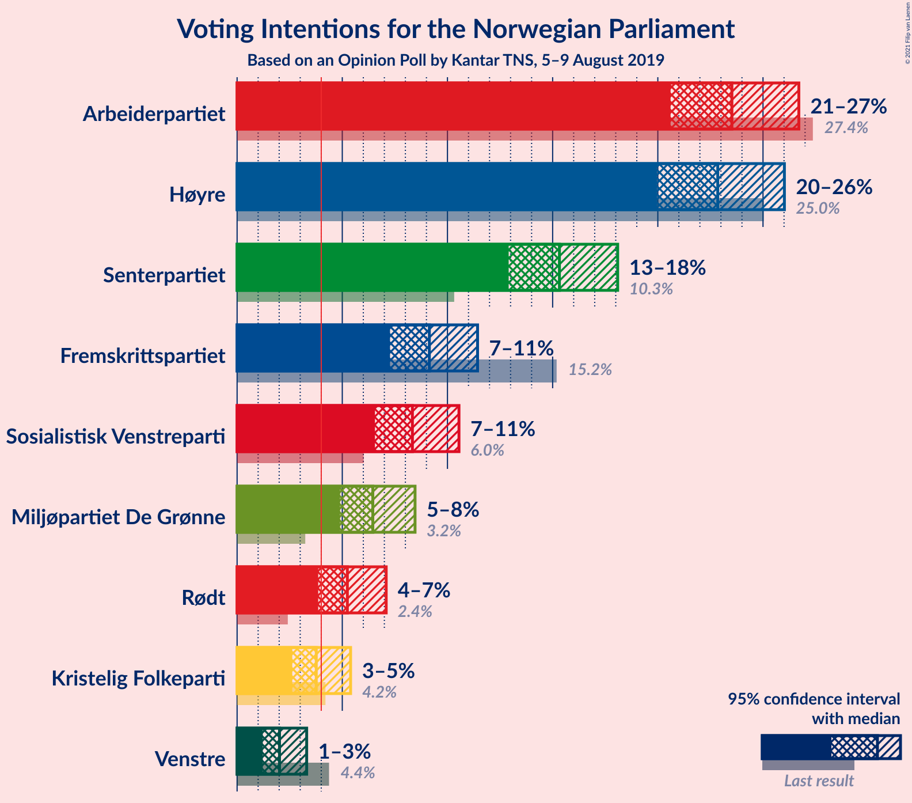
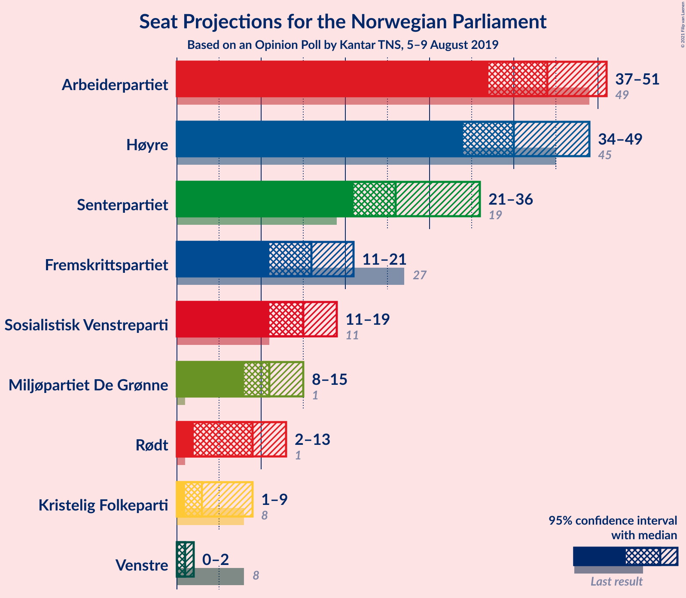
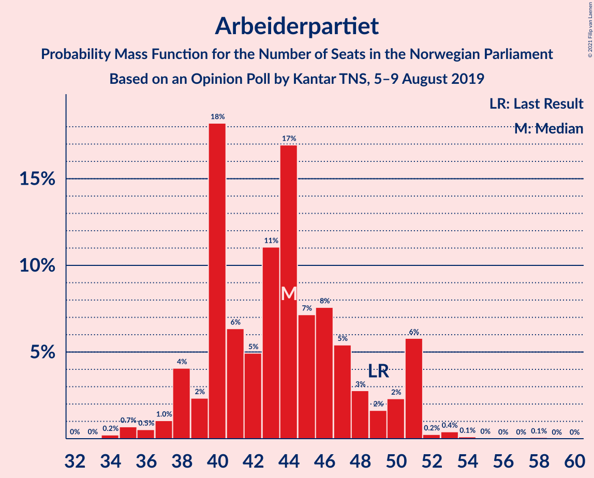
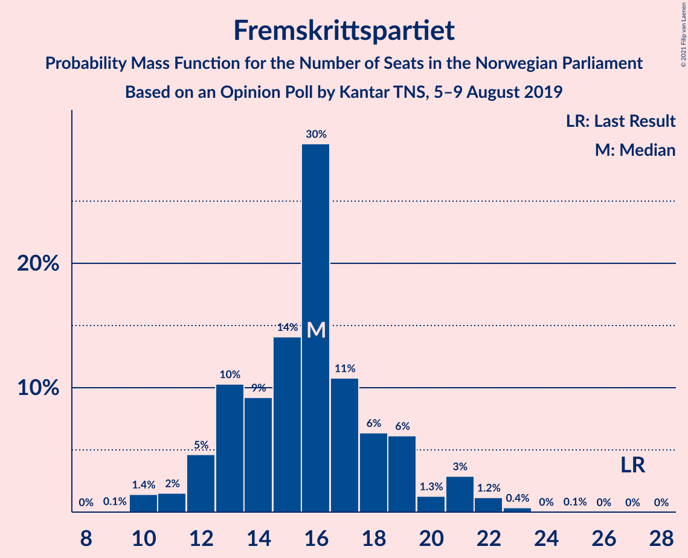
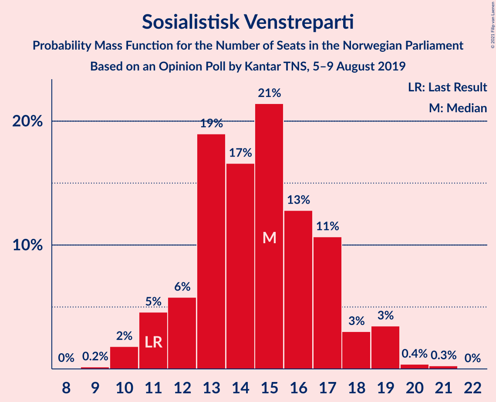
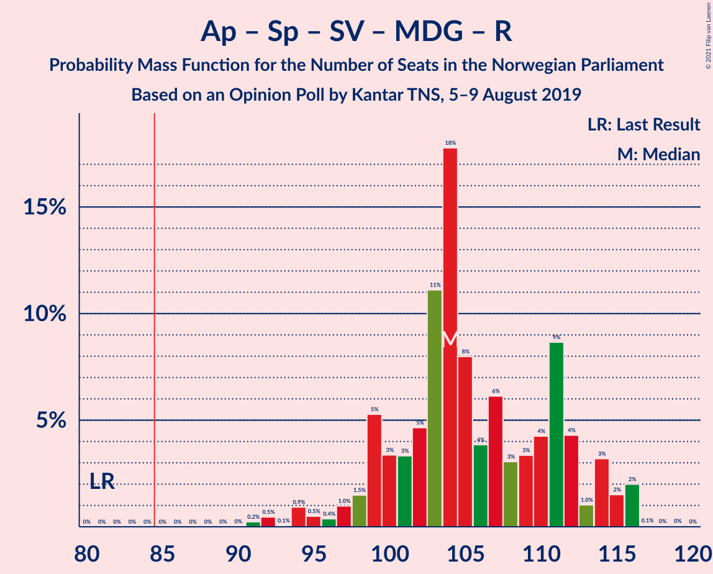
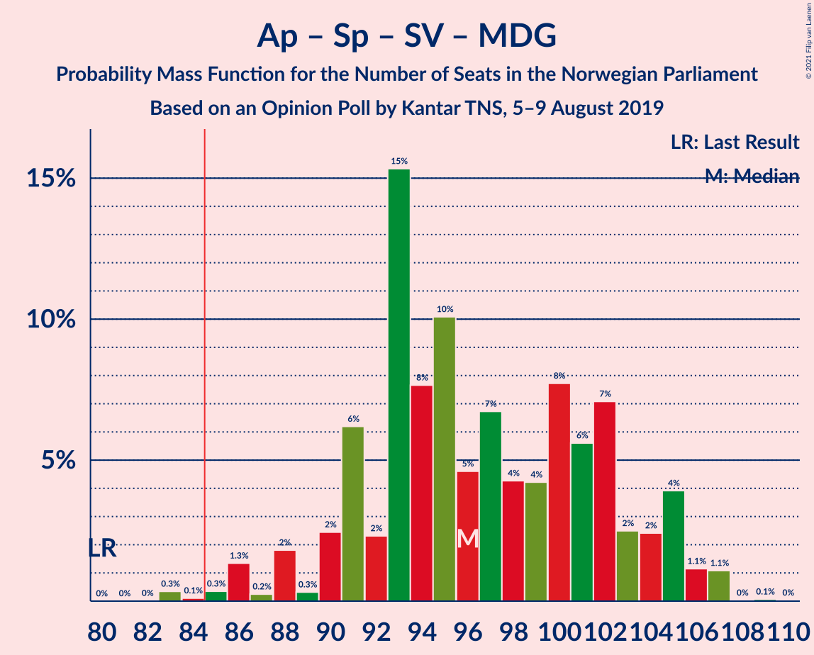
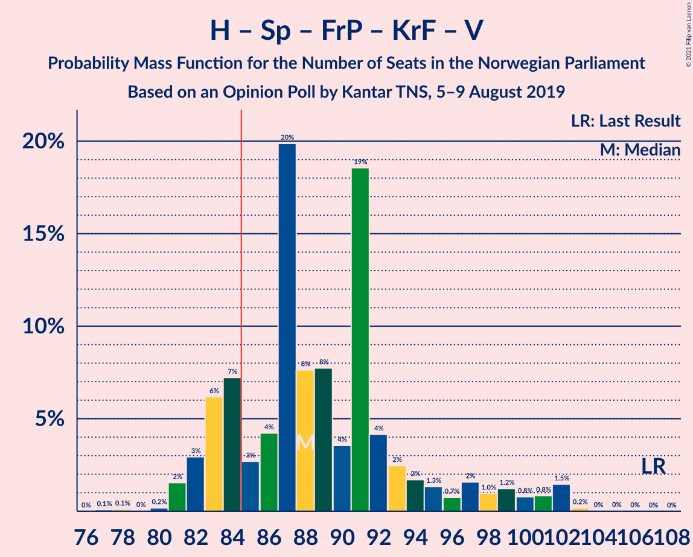

# Opinion Poll by Kantar TNS, 5–9 August 2019

<a href="#voting-intentions">Voting Intentions</a> | <a href="#seats">Seats</a> | <a href="#coalitions">Coalitions</a> | <a href="#technical-information">Technical Information</a>

## Voting Intentions

### Confidence Intervals

| Party | Last Result | Poll Result | 80% Confidence Interval | 90% Confidence Interval | 95% Confidence Interval | 99% Confidence Interval |
|:-----:|:-----------:|:-----------:|:-----------------------:|:-----------------------:|:-----------------------:|:-----------------------:|
| Arbeiderpartiet | 27.4% | 23.5% | 21.6–25.6% |21.1–26.2% |20.6–26.7% |19.7–27.7% |
| Høyre | 25.0% | 22.8% | 21.0–24.9% |20.4–25.5% |20.0–26.0% |19.1–27.0% |
| Senterpartiet | 10.3% | 15.3% | 13.7–17.1% |13.3–17.6% |12.9–18.1% |12.2–19.0% |
| Fremskrittspartiet | 15.2% | 9.1% | 7.9–10.6% |7.6–11.1% |7.3–11.4% |6.7–12.2% |
| Sosialistisk Venstreparti | 6.0% | 8.3% | 7.2–9.8% |6.8–10.2% |6.6–10.5% |6.0–11.3% |
| Miljøpartiet De Grønne | 3.2% | 6.5% | 5.4–7.8% |5.1–8.1% |4.9–8.5% |4.5–9.1% |
| Rødt | 2.4% | 5.2% | 4.3–6.4% |4.1–6.8% |3.9–7.1% |3.5–7.7% |
| Kristelig Folkeparti | 4.2% | 3.8% | 3.0–4.8% |2.8–5.1% |2.6–5.4% |2.3–5.9% |
| Venstre | 4.4% | 2.0% | 1.5–2.9% |1.3–3.1% |1.2–3.3% |1.0–3.7% |

*Note:* The poll result column reflects the actual value used in the calculations. Published results may vary slightly, and in addition be rounded to fewer digits.

## Seats

### Confidence Intervals

| Party | Last Result | Median | 80% Confidence Interval | 90% Confidence Interval | 95% Confidence Interval | 99% Confidence Interval |
|:-----:|:-----------:|:------:|:-----------------------:|:-----------------------:|:-----------------------:|:-----------------------:|
| <a href="#arbeiderpartiet">Arbeiderpartiet</a> | 49 | 40 | 40–45 |40–45 |40–45 |36–47 |
| <a href="#høyre">Høyre</a> | 45 | 40 | 34–49 |34–49 |34–49 |31–49 |
| <a href="#senterpartiet">Senterpartiet</a> | 19 | 40 | 23–40 |23–40 |23–40 |23–40 |
| <a href="#fremskrittspartiet">Fremskrittspartiet</a> | 27 | 12 | 12–19 |12–19 |12–19 |12–19 |
| <a href="#sosialistisk-venstreparti">Sosialistisk Venstreparti</a> | 11 | 10 | 10–18 |10–18 |10–18 |10–21 |
| <a href="#miljøpartiet-de-grønne">Miljøpartiet De Grønne</a> | 1 | 11 | 10–11 |10–12 |10–13 |10–17 |
| <a href="#rødt">Rødt</a> | 1 | 6 | 2–6 |2–6 |1–7 |1–12 |
| <a href="#kristelig-folkeparti">Kristelig Folkeparti</a> | 8 | 3 | 2–3 |2–7 |2–7 |1–8 |
| <a href="#venstre">Venstre</a> | 8 | 0 | 0 |0–1 |0–1 |0–2 |

### Arbeiderpartiet

*For a full overview of the results for this party, see the [Arbeiderpartiet](party-arbeiderpartiet.html) page.*

| Number of Seats | Probability | Accumulated | Special Marks |
|:---------------:|:-----------:|:-----------:|:-------------:|
| 33 | 0% | 100% |  |
| 34 | 0% | 99.9% |  |
| 35 | 0% | 99.9% |  |
| 36 | 0.6% | 99.9% |  |
| 37 | 0% | 99.3% |  |
| 38 | 0.1% | 99.3% |  |
| 39 | 0.1% | 99.2% |  |
| 40 | 58% | 99.1% | Median |
| 41 | 0% | 41% |  |
| 42 | 0% | 41% |  |
| 43 | 0.1% | 41% |  |
| 44 | 0.7% | 41% |  |
| 45 | 39% | 40% |  |
| 46 | 0% | 1.3% |  |
| 47 | 0.9% | 1.3% |  |
| 48 | 0% | 0.3% |  |
| 49 | 0.2% | 0.3% | Last Result |
| 50 | 0% | 0.1% |  |
| 51 | 0% | 0.1% |  |
| 52 | 0% | 0.1% |  |
| 53 | 0% | 0.1% |  |
| 54 | 0% | 0.1% |  |
| 55 | 0% | 0.1% |  |
| 56 | 0% | 0.1% |  |
| 57 | 0% | 0.1% |  |
| 58 | 0% | 0.1% |  |
| 59 | 0.1% | 0.1% |  |
| 60 | 0% | 0% |  |

### Høyre

*For a full overview of the results for this party, see the [Høyre](party-høyre.html) page.*

| Number of Seats | Probability | Accumulated | Special Marks |
|:---------------:|:-----------:|:-----------:|:-------------:|
| 31 | 0.6% | 100% |  |
| 32 | 0% | 99.4% |  |
| 33 | 0% | 99.4% |  |
| 34 | 10% | 99.4% |  |
| 35 | 0.8% | 90% |  |
| 36 | 5% | 89% |  |
| 37 | 0% | 84% |  |
| 38 | 0.1% | 84% |  |
| 39 | 0.1% | 84% |  |
| 40 | 57% | 84% | Median |
| 41 | 2% | 27% |  |
| 42 | 0% | 25% |  |
| 43 | 0.1% | 25% |  |
| 44 | 0% | 25% |  |
| 45 | 0.1% | 25% | Last Result |
| 46 | 0% | 25% |  |
| 47 | 0% | 25% |  |
| 48 | 0% | 25% |  |
| 49 | 24% | 25% |  |
| 50 | 0% | 0.5% |  |
| 51 | 0.4% | 0.5% |  |
| 52 | 0.1% | 0.1% |  |
| 53 | 0% | 0% |  |

### Senterpartiet

*For a full overview of the results for this party, see the [Senterpartiet](party-senterpartiet.html) page.*

| Number of Seats | Probability | Accumulated | Special Marks |
|:---------------:|:-----------:|:-----------:|:-------------:|
| 19 | 0% | 100% | Last Result |
| 20 | 0.2% | 100% |  |
| 21 | 0.1% | 99.8% |  |
| 22 | 0.1% | 99.6% |  |
| 23 | 24% | 99.6% |  |
| 24 | 0% | 75% |  |
| 25 | 0.1% | 75% |  |
| 26 | 0% | 75% |  |
| 27 | 0% | 75% |  |
| 28 | 0% | 75% |  |
| 29 | 0% | 75% |  |
| 30 | 0.4% | 75% |  |
| 31 | 0.6% | 75% |  |
| 32 | 0.1% | 74% |  |
| 33 | 0% | 74% |  |
| 34 | 0% | 74% |  |
| 35 | 0.7% | 74% |  |
| 36 | 0.6% | 73% |  |
| 37 | 1.1% | 73% |  |
| 38 | 4% | 72% |  |
| 39 | 10% | 67% |  |
| 40 | 57% | 57% | Median |
| 41 | 0% | 0% |  |

### Fremskrittspartiet

*For a full overview of the results for this party, see the [Fremskrittspartiet](party-fremskrittspartiet.html) page.*

| Number of Seats | Probability | Accumulated | Special Marks |
|:---------------:|:-----------:|:-----------:|:-------------:|
| 9 | 0.1% | 100% |  |
| 10 | 0% | 99.9% |  |
| 11 | 0.3% | 99.9% |  |
| 12 | 59% | 99.6% | Median |
| 13 | 0.1% | 41% |  |
| 14 | 10% | 41% |  |
| 15 | 0.7% | 31% |  |
| 16 | 6% | 30% |  |
| 17 | 0.1% | 25% |  |
| 18 | 0.1% | 25% |  |
| 19 | 24% | 25% |  |
| 20 | 0.1% | 0.3% |  |
| 21 | 0% | 0.2% |  |
| 22 | 0% | 0.1% |  |
| 23 | 0% | 0.1% |  |
| 24 | 0% | 0.1% |  |
| 25 | 0% | 0.1% |  |
| 26 | 0.1% | 0.1% |  |
| 27 | 0% | 0% | Last Result |

### Sosialistisk Venstreparti

*For a full overview of the results for this party, see the [Sosialistisk Venstreparti](party-sosialistiskvenstreparti.html) page.*

| Number of Seats | Probability | Accumulated | Special Marks |
|:---------------:|:-----------:|:-----------:|:-------------:|
| 9 | 0.1% | 100% |  |
| 10 | 58% | 99.8% | Median |
| 11 | 0.5% | 41% | Last Result |
| 12 | 0.7% | 41% |  |
| 13 | 5% | 40% |  |
| 14 | 0.2% | 35% |  |
| 15 | 10% | 35% |  |
| 16 | 0% | 25% |  |
| 17 | 0.2% | 25% |  |
| 18 | 24% | 25% |  |
| 19 | 0% | 0.7% |  |
| 20 | 0.1% | 0.7% |  |
| 21 | 0.6% | 0.6% |  |
| 22 | 0% | 0% |  |

### Miljøpartiet De Grønne

*For a full overview of the results for this party, see the [Miljøpartiet De Grønne](party-miljøpartietdegrønne.html) page.*

| Number of Seats | Probability | Accumulated | Special Marks |
|:---------------:|:-----------:|:-----------:|:-------------:|
| 1 | 0% | 100% | Last Result |
| 2 | 0% | 100% |  |
| 3 | 0% | 100% |  |
| 4 | 0% | 100% |  |
| 5 | 0% | 100% |  |
| 6 | 0% | 100% |  |
| 7 | 0% | 100% |  |
| 8 | 0.1% | 100% |  |
| 9 | 0% | 99.9% |  |
| 10 | 10% | 99.8% |  |
| 11 | 82% | 90% | Median |
| 12 | 5% | 8% |  |
| 13 | 0.6% | 3% |  |
| 14 | 0.2% | 2% |  |
| 15 | 1.1% | 2% |  |
| 16 | 0% | 0.8% |  |
| 17 | 0.8% | 0.8% |  |
| 18 | 0% | 0% |  |

### Rødt

*For a full overview of the results for this party, see the [Rødt](party-rødt.html) page.*

| Number of Seats | Probability | Accumulated | Special Marks |
|:---------------:|:-----------:|:-----------:|:-------------:|
| 1 | 4% | 100% | Last Result |
| 2 | 36% | 96% |  |
| 3 | 0% | 60% |  |
| 4 | 0% | 60% |  |
| 5 | 0% | 60% |  |
| 6 | 57% | 60% | Median |
| 7 | 0.7% | 3% |  |
| 8 | 0.7% | 2% |  |
| 9 | 0.3% | 1.2% |  |
| 10 | 0.1% | 1.0% |  |
| 11 | 0.1% | 0.9% |  |
| 12 | 0.7% | 0.7% |  |
| 13 | 0% | 0% |  |

### Kristelig Folkeparti

*For a full overview of the results for this party, see the [Kristelig Folkeparti](party-kristeligfolkeparti.html) page.*

| Number of Seats | Probability | Accumulated | Special Marks |
|:---------------:|:-----------:|:-----------:|:-------------:|
| 0 | 0.1% | 100% |  |
| 1 | 0.4% | 99.9% |  |
| 2 | 25% | 99.5% |  |
| 3 | 69% | 75% | Median |
| 4 | 0% | 6% |  |
| 5 | 0% | 6% |  |
| 6 | 0% | 6% |  |
| 7 | 5% | 6% |  |
| 8 | 1.1% | 1.3% | Last Result |
| 9 | 0.1% | 0.2% |  |
| 10 | 0.1% | 0.1% |  |
| 11 | 0% | 0% |  |

### Venstre

*For a full overview of the results for this party, see the [Venstre](party-venstre.html) page.*

| Number of Seats | Probability | Accumulated | Special Marks |
|:---------------:|:-----------:|:-----------:|:-------------:|
| 0 | 93% | 100% | Median |
| 1 | 5% | 7% |  |
| 2 | 1.0% | 1.1% |  |
| 3 | 0% | 0.1% |  |
| 4 | 0% | 0.1% |  |
| 5 | 0% | 0.1% |  |
| 6 | 0% | 0.1% |  |
| 7 | 0.1% | 0.1% |  |
| 8 | 0% | 0% | Last Result |

## Coalitions

### Confidence Intervals

| Coalition | Last Result | Median | Majority? | 80% Confidence Interval | 90% Confidence Interval | 95% Confidence Interval | 99% Confidence Interval |
|:---------:|:-----------:|:------:|:---------:|:-----------------------:|:-----------------------:|:-----------------------:|:-----------------------:|
| Arbeiderpartiet – Senterpartiet – Sosialistisk Venstreparti – Miljøpartiet De Grønne – Kristelig Folkeparti | 88 | 104 | 100% | 99–112 | 99–112 | 99–115 | 99–115 |
| Arbeiderpartiet – Senterpartiet – Sosialistisk Venstreparti – Miljøpartiet De Grønne – Rødt | 81 | 107 | 100% | 99–111 | 99–111 | 99–111 | 99–120 |
| Arbeiderpartiet – Senterpartiet – Sosialistisk Venstreparti – Miljøpartiet De Grønne | 80 | 101 | 100% | 97–108 | 97–109 | 97–109 | 95–109 |
| Arbeiderpartiet – Senterpartiet – Miljøpartiet De Grønne – Kristelig Folkeparti | 77 | 94 | 75% | 81–97 | 81–100 | 81–102 | 81–102 |
| Arbeiderpartiet – Senterpartiet – Sosialistisk Venstreparti – Rødt | 80 | 96 | 99.7% | 88–101 | 88–101 | 88–101 | 88–103 |
| Arbeiderpartiet – Senterpartiet – Sosialistisk Venstreparti | 79 | 90 | 99.4% | 86–96 | 86–99 | 86–99 | 79–99 |
| Høyre – Senterpartiet – Fremskrittspartiet – Kristelig Folkeparti – Venstre | 107 | 95 | 98.6% | 90–95 | 90–98 | 90–98 | 83–102 |
| Arbeiderpartiet – Senterpartiet – Kristelig Folkeparti | 76 | 83 | 16% | 70–87 | 70–87 | 70–90 | 70–90 |
| Arbeiderpartiet – Senterpartiet | 68 | 80 | 0% | 68–83 | 68–84 | 68–84 | 67–84 |
| Høyre – Fremskrittspartiet – Miljøpartiet De Grønne – Kristelig Folkeparti – Venstre | 89 | 66 | 0.1% | 61–81 | 61–81 | 61–81 | 60–81 |
| Høyre – Fremskrittspartiet – Kristelig Folkeparti – Venstre | 88 | 55 | 0% | 51–70 | 51–70 | 51–70 | 47–70 |
| Høyre – Fremskrittspartiet | 72 | 52 | 0% | 48–68 | 48–68 | 48–68 | 43–68 |
| Høyre – Fremskrittspartiet – Venstre | 80 | 52 | 0% | 48–68 | 48–68 | 48–68 | 44–68 |
| Arbeiderpartiet – Sosialistisk Venstreparti | 60 | 50 | 0% | 50–63 | 50–63 | 50–63 | 50–63 |
| Høyre – Kristelig Folkeparti – Venstre | 61 | 43 | 0% | 37–51 | 37–51 | 37–51 | 35–53 |
| Senterpartiet – Kristelig Folkeparti – Venstre | 35 | 43 | 0% | 25–43 | 25–45 | 25–46 | 25–46 |

### Arbeiderpartiet – Senterpartiet – Sosialistisk Venstreparti – Miljøpartiet De Grønne – Kristelig Folkeparti

| Number of Seats | Probability | Accumulated | Special Marks |
|:---------------:|:-----------:|:-----------:|:-------------:|
| 86 | 0.1% | 100% |  |
| 87 | 0.1% | 99.9% |  |
| 88 | 0% | 99.8% | Last Result |
| 89 | 0% | 99.8% |  |
| 90 | 0% | 99.8% |  |
| 91 | 0.1% | 99.8% |  |
| 92 | 0% | 99.7% |  |
| 93 | 0% | 99.7% |  |
| 94 | 0% | 99.7% |  |
| 95 | 0% | 99.7% |  |
| 96 | 0% | 99.7% |  |
| 97 | 0.2% | 99.7% |  |
| 98 | 0% | 99.5% |  |
| 99 | 24% | 99.5% |  |
| 100 | 0% | 75% |  |
| 101 | 0.1% | 75% |  |
| 102 | 0.1% | 75% |  |
| 103 | 0.7% | 75% |  |
| 104 | 58% | 74% | Median |
| 105 | 0.1% | 17% |  |
| 106 | 0% | 17% |  |
| 107 | 0% | 17% |  |
| 108 | 0% | 17% |  |
| 109 | 0.1% | 17% |  |
| 110 | 2% | 17% |  |
| 111 | 0% | 14% |  |
| 112 | 10% | 14% |  |
| 113 | 0% | 5% |  |
| 114 | 0% | 5% |  |
| 115 | 5% | 5% |  |
| 116 | 0% | 0% |  |

### Arbeiderpartiet – Senterpartiet – Sosialistisk Venstreparti – Miljøpartiet De Grønne – Rødt

| Number of Seats | Probability | Accumulated | Special Marks |
|:---------------:|:-----------:|:-----------:|:-------------:|
| 81 | 0% | 100% | Last Result |
| 82 | 0% | 100% |  |
| 83 | 0% | 100% |  |
| 84 | 0% | 100% |  |
| 85 | 0% | 100% | Majority |
| 86 | 0% | 100% |  |
| 87 | 0% | 100% |  |
| 88 | 0% | 100% |  |
| 89 | 0% | 100% |  |
| 90 | 0% | 100% |  |
| 91 | 0% | 100% |  |
| 92 | 0% | 100% |  |
| 93 | 0.1% | 100% |  |
| 94 | 0% | 99.8% |  |
| 95 | 0.1% | 99.8% |  |
| 96 | 0.1% | 99.8% |  |
| 97 | 0% | 99.7% |  |
| 98 | 0.1% | 99.7% |  |
| 99 | 24% | 99.6% |  |
| 100 | 0% | 75% |  |
| 101 | 0% | 75% |  |
| 102 | 0% | 75% |  |
| 103 | 0.4% | 75% |  |
| 104 | 1.3% | 75% |  |
| 105 | 0% | 74% |  |
| 106 | 0% | 74% |  |
| 107 | 57% | 74% | Median |
| 108 | 0.6% | 16% |  |
| 109 | 4% | 16% |  |
| 110 | 0.1% | 11% |  |
| 111 | 10% | 11% |  |
| 112 | 0% | 1.3% |  |
| 113 | 0% | 1.3% |  |
| 114 | 0.5% | 1.3% |  |
| 115 | 0% | 0.8% |  |
| 116 | 0% | 0.7% |  |
| 117 | 0% | 0.7% |  |
| 118 | 0% | 0.7% |  |
| 119 | 0% | 0.7% |  |
| 120 | 0.7% | 0.7% |  |
| 121 | 0% | 0% |  |

### Arbeiderpartiet – Senterpartiet – Sosialistisk Venstreparti – Miljøpartiet De Grønne

| Number of Seats | Probability | Accumulated | Special Marks |
|:---------------:|:-----------:|:-----------:|:-------------:|
| 80 | 0% | 100% | Last Result |
| 81 | 0% | 100% |  |
| 82 | 0% | 100% |  |
| 83 | 0% | 100% |  |
| 84 | 0% | 100% |  |
| 85 | 0% | 100% | Majority |
| 86 | 0.2% | 100% |  |
| 87 | 0.1% | 99.8% |  |
| 88 | 0.1% | 99.7% |  |
| 89 | 0% | 99.6% |  |
| 90 | 0% | 99.6% |  |
| 91 | 0% | 99.6% |  |
| 92 | 0% | 99.6% |  |
| 93 | 0% | 99.6% |  |
| 94 | 0% | 99.5% |  |
| 95 | 0.1% | 99.5% |  |
| 96 | 0.1% | 99.4% |  |
| 97 | 24% | 99.3% |  |
| 98 | 0% | 75% |  |
| 99 | 0% | 75% |  |
| 100 | 0.6% | 75% |  |
| 101 | 58% | 74% | Median |
| 102 | 1.3% | 17% |  |
| 103 | 0% | 16% |  |
| 104 | 0% | 16% |  |
| 105 | 0% | 16% |  |
| 106 | 0.1% | 16% |  |
| 107 | 0.5% | 15% |  |
| 108 | 5% | 15% |  |
| 109 | 10% | 10% |  |
| 110 | 0% | 0.1% |  |
| 111 | 0% | 0.1% |  |
| 112 | 0% | 0.1% |  |
| 113 | 0% | 0% |  |

### Arbeiderpartiet – Senterpartiet – Miljøpartiet De Grønne – Kristelig Folkeparti

| Number of Seats | Probability | Accumulated | Special Marks |
|:---------------:|:-----------:|:-----------:|:-------------:|
| 72 | 0.1% | 100% |  |
| 73 | 0% | 99.9% |  |
| 74 | 0% | 99.9% |  |
| 75 | 0% | 99.9% |  |
| 76 | 0% | 99.9% |  |
| 77 | 0.1% | 99.9% | Last Result |
| 78 | 0.1% | 99.9% |  |
| 79 | 0% | 99.7% |  |
| 80 | 0% | 99.7% |  |
| 81 | 24% | 99.7% |  |
| 82 | 0.6% | 75% |  |
| 83 | 0.1% | 75% |  |
| 84 | 0.1% | 75% |  |
| 85 | 0.1% | 75% | Majority |
| 86 | 0.1% | 75% |  |
| 87 | 0.1% | 74% |  |
| 88 | 0% | 74% |  |
| 89 | 0% | 74% |  |
| 90 | 0% | 74% |  |
| 91 | 0.3% | 74% |  |
| 92 | 0% | 74% |  |
| 93 | 0% | 74% |  |
| 94 | 57% | 74% | Median |
| 95 | 0% | 17% |  |
| 96 | 0.1% | 17% |  |
| 97 | 10% | 17% |  |
| 98 | 0.7% | 7% |  |
| 99 | 0.6% | 6% |  |
| 100 | 1.1% | 6% |  |
| 101 | 0% | 5% |  |
| 102 | 4% | 5% |  |
| 103 | 0% | 0% |  |

### Arbeiderpartiet – Senterpartiet – Sosialistisk Venstreparti – Rødt

| Number of Seats | Probability | Accumulated | Special Marks |
|:---------------:|:-----------:|:-----------:|:-------------:|
| 80 | 0% | 100% | Last Result |
| 81 | 0% | 100% |  |
| 82 | 0.1% | 100% |  |
| 83 | 0.1% | 99.9% |  |
| 84 | 0.1% | 99.8% |  |
| 85 | 0% | 99.7% | Majority |
| 86 | 0% | 99.7% |  |
| 87 | 0.1% | 99.7% |  |
| 88 | 24% | 99.6% |  |
| 89 | 1.1% | 75% |  |
| 90 | 0.1% | 74% |  |
| 91 | 0.1% | 74% |  |
| 92 | 0.3% | 74% |  |
| 93 | 0.1% | 74% |  |
| 94 | 0% | 74% |  |
| 95 | 0% | 74% |  |
| 96 | 58% | 74% | Median |
| 97 | 5% | 16% |  |
| 98 | 0% | 11% |  |
| 99 | 0.1% | 11% |  |
| 100 | 0% | 11% |  |
| 101 | 10% | 11% |  |
| 102 | 0% | 0.8% |  |
| 103 | 0.7% | 0.8% |  |
| 104 | 0% | 0.1% |  |
| 105 | 0% | 0.1% |  |
| 106 | 0% | 0.1% |  |
| 107 | 0% | 0.1% |  |
| 108 | 0% | 0% |  |

### Arbeiderpartiet – Senterpartiet – Sosialistisk Venstreparti

| Number of Seats | Probability | Accumulated | Special Marks |
|:---------------:|:-----------:|:-----------:|:-------------:|
| 74 | 0.1% | 100% |  |
| 75 | 0.1% | 99.9% |  |
| 76 | 0.1% | 99.8% |  |
| 77 | 0% | 99.7% |  |
| 78 | 0.1% | 99.7% |  |
| 79 | 0.1% | 99.6% | Last Result |
| 80 | 0% | 99.5% |  |
| 81 | 0% | 99.5% |  |
| 82 | 0% | 99.5% |  |
| 83 | 0.1% | 99.5% |  |
| 84 | 0% | 99.4% |  |
| 85 | 0% | 99.4% | Majority |
| 86 | 24% | 99.4% |  |
| 87 | 1.1% | 75% |  |
| 88 | 0.6% | 74% |  |
| 89 | 0% | 73% |  |
| 90 | 58% | 73% | Median |
| 91 | 0.8% | 16% |  |
| 92 | 0% | 15% |  |
| 93 | 0% | 15% |  |
| 94 | 0.5% | 15% |  |
| 95 | 0.1% | 14% |  |
| 96 | 4% | 14% |  |
| 97 | 0% | 10% |  |
| 98 | 0% | 10% |  |
| 99 | 10% | 10% |  |
| 100 | 0% | 0% |  |

### Høyre – Senterpartiet – Fremskrittspartiet – Kristelig Folkeparti – Venstre

| Number of Seats | Probability | Accumulated | Special Marks |
|:---------------:|:-----------:|:-----------:|:-------------:|
| 77 | 0.1% | 100% |  |
| 78 | 0% | 99.9% |  |
| 79 | 0% | 99.9% |  |
| 80 | 0% | 99.9% |  |
| 81 | 0.1% | 99.9% |  |
| 82 | 0% | 99.8% |  |
| 83 | 0.5% | 99.7% |  |
| 84 | 0.7% | 99.2% |  |
| 85 | 0% | 98.6% | Majority |
| 86 | 0% | 98.6% |  |
| 87 | 0.2% | 98.6% |  |
| 88 | 0.1% | 98% |  |
| 89 | 0.2% | 98% |  |
| 90 | 10% | 98% |  |
| 91 | 0.2% | 88% |  |
| 92 | 0.6% | 88% |  |
| 93 | 24% | 88% |  |
| 94 | 0.1% | 63% |  |
| 95 | 57% | 63% | Median |
| 96 | 0.3% | 6% |  |
| 97 | 0% | 6% |  |
| 98 | 4% | 6% |  |
| 99 | 0% | 1.1% |  |
| 100 | 0% | 1.1% |  |
| 101 | 0% | 1.1% |  |
| 102 | 1.1% | 1.1% |  |
| 103 | 0% | 0% |  |
| 104 | 0% | 0% |  |
| 105 | 0% | 0% |  |
| 106 | 0% | 0% |  |
| 107 | 0% | 0% | Last Result |

### Arbeiderpartiet – Senterpartiet – Kristelig Folkeparti

| Number of Seats | Probability | Accumulated | Special Marks |
|:---------------:|:-----------:|:-----------:|:-------------:|
| 61 | 0.1% | 100% |  |
| 62 | 0% | 99.9% |  |
| 63 | 0.1% | 99.9% |  |
| 64 | 0% | 99.9% |  |
| 65 | 0% | 99.8% |  |
| 66 | 0% | 99.8% |  |
| 67 | 0.1% | 99.8% |  |
| 68 | 0.1% | 99.7% |  |
| 69 | 0% | 99.6% |  |
| 70 | 25% | 99.5% |  |
| 71 | 0% | 75% |  |
| 72 | 0% | 75% |  |
| 73 | 0.1% | 75% |  |
| 74 | 0% | 75% |  |
| 75 | 0.1% | 75% |  |
| 76 | 0% | 74% | Last Result |
| 77 | 0% | 74% |  |
| 78 | 0% | 74% |  |
| 79 | 0.1% | 74% |  |
| 80 | 0.3% | 74% |  |
| 81 | 0.7% | 74% |  |
| 82 | 0% | 73% |  |
| 83 | 57% | 73% | Median |
| 84 | 0% | 16% |  |
| 85 | 1.2% | 16% | Majority |
| 86 | 0.5% | 15% |  |
| 87 | 10% | 14% |  |
| 88 | 0% | 5% |  |
| 89 | 0% | 5% |  |
| 90 | 4% | 4% |  |
| 91 | 0% | 0% |  |

### Arbeiderpartiet – Senterpartiet

| Number of Seats | Probability | Accumulated | Special Marks |
|:---------------:|:-----------:|:-----------:|:-------------:|
| 60 | 0.2% | 100% |  |
| 61 | 0.1% | 99.8% |  |
| 62 | 0% | 99.7% |  |
| 63 | 0% | 99.7% |  |
| 64 | 0% | 99.7% |  |
| 65 | 0% | 99.7% |  |
| 66 | 0.1% | 99.7% |  |
| 67 | 0.7% | 99.7% |  |
| 68 | 24% | 98.9% | Last Result |
| 69 | 0.2% | 75% |  |
| 70 | 0% | 74% |  |
| 71 | 0% | 74% |  |
| 72 | 0% | 74% |  |
| 73 | 0.1% | 74% |  |
| 74 | 0.1% | 74% |  |
| 75 | 0% | 74% |  |
| 76 | 0% | 74% |  |
| 77 | 1.4% | 74% |  |
| 78 | 0% | 73% |  |
| 79 | 0.7% | 73% |  |
| 80 | 57% | 72% | Median |
| 81 | 0% | 15% |  |
| 82 | 0.1% | 15% |  |
| 83 | 5% | 15% |  |
| 84 | 10% | 10% |  |
| 85 | 0% | 0% | Majority |

### Høyre – Fremskrittspartiet – Miljøpartiet De Grønne – Kristelig Folkeparti – Venstre

| Number of Seats | Probability | Accumulated | Special Marks |
|:---------------:|:-----------:|:-----------:|:-------------:|
| 59 | 0% | 100% |  |
| 60 | 0.5% | 99.9% |  |
| 61 | 10% | 99.4% |  |
| 62 | 0% | 90% |  |
| 63 | 0% | 90% |  |
| 64 | 0% | 90% |  |
| 65 | 0.1% | 90% |  |
| 66 | 58% | 90% | Median |
| 67 | 0.1% | 32% |  |
| 68 | 0% | 32% |  |
| 69 | 0% | 31% |  |
| 70 | 0.1% | 31% |  |
| 71 | 0% | 31% |  |
| 72 | 5% | 31% |  |
| 73 | 0.6% | 27% |  |
| 74 | 0% | 26% |  |
| 75 | 0% | 26% |  |
| 76 | 0% | 26% |  |
| 77 | 0.4% | 26% |  |
| 78 | 0.1% | 26% |  |
| 79 | 0.2% | 26% |  |
| 80 | 1.1% | 26% |  |
| 81 | 24% | 25% |  |
| 82 | 0.1% | 0.2% |  |
| 83 | 0% | 0.1% |  |
| 84 | 0% | 0.1% |  |
| 85 | 0% | 0.1% | Majority |
| 86 | 0% | 0.1% |  |
| 87 | 0.1% | 0.1% |  |
| 88 | 0% | 0% |  |
| 89 | 0% | 0% | Last Result |

### Høyre – Fremskrittspartiet – Kristelig Folkeparti – Venstre

| Number of Seats | Probability | Accumulated | Special Marks |
|:---------------:|:-----------:|:-----------:|:-------------:|
| 47 | 0.5% | 100% |  |
| 48 | 0% | 99.4% |  |
| 49 | 0.7% | 99.4% |  |
| 50 | 0% | 98.8% |  |
| 51 | 10% | 98.7% |  |
| 52 | 0% | 89% |  |
| 53 | 0% | 89% |  |
| 54 | 0.1% | 89% |  |
| 55 | 57% | 89% | Median |
| 56 | 0.1% | 32% |  |
| 57 | 0% | 32% |  |
| 58 | 0.1% | 32% |  |
| 59 | 0.1% | 31% |  |
| 60 | 4% | 31% |  |
| 61 | 0.6% | 27% |  |
| 62 | 0% | 26% |  |
| 63 | 0% | 26% |  |
| 64 | 0% | 26% |  |
| 65 | 1.2% | 26% |  |
| 66 | 0.4% | 25% |  |
| 67 | 0% | 25% |  |
| 68 | 0% | 25% |  |
| 69 | 0.2% | 25% |  |
| 70 | 24% | 24% |  |
| 71 | 0.1% | 0.2% |  |
| 72 | 0% | 0.1% |  |
| 73 | 0.1% | 0.1% |  |
| 74 | 0% | 0% |  |
| 75 | 0% | 0% |  |
| 76 | 0% | 0% |  |
| 77 | 0% | 0% |  |
| 78 | 0% | 0% |  |
| 79 | 0% | 0% |  |
| 80 | 0% | 0% |  |
| 81 | 0% | 0% |  |
| 82 | 0% | 0% |  |
| 83 | 0% | 0% |  |
| 84 | 0% | 0% |  |
| 85 | 0% | 0% | Majority |
| 86 | 0% | 0% |  |
| 87 | 0% | 0% |  |
| 88 | 0% | 0% | Last Result |

### Høyre – Fremskrittspartiet

| Number of Seats | Probability | Accumulated | Special Marks |
|:---------------:|:-----------:|:-----------:|:-------------:|
| 43 | 0.6% | 100% |  |
| 44 | 0% | 99.4% |  |
| 45 | 0% | 99.4% |  |
| 46 | 0.1% | 99.4% |  |
| 47 | 0.7% | 99.4% |  |
| 48 | 10% | 98.7% |  |
| 49 | 0.1% | 89% |  |
| 50 | 0% | 89% |  |
| 51 | 0.1% | 89% |  |
| 52 | 62% | 89% | Median |
| 53 | 0% | 27% |  |
| 54 | 0% | 27% |  |
| 55 | 0.2% | 27% |  |
| 56 | 0.7% | 27% |  |
| 57 | 1.1% | 26% |  |
| 58 | 0.1% | 25% |  |
| 59 | 0.1% | 25% |  |
| 60 | 0% | 25% |  |
| 61 | 0% | 25% |  |
| 62 | 0.3% | 25% |  |
| 63 | 0% | 25% |  |
| 64 | 0% | 25% |  |
| 65 | 0% | 25% |  |
| 66 | 0.2% | 25% |  |
| 67 | 0% | 24% |  |
| 68 | 24% | 24% |  |
| 69 | 0% | 0.1% |  |
| 70 | 0.1% | 0.1% |  |
| 71 | 0% | 0% |  |
| 72 | 0% | 0% | Last Result |

### Høyre – Fremskrittspartiet – Venstre

| Number of Seats | Probability | Accumulated | Special Marks |
|:---------------:|:-----------:|:-----------:|:-------------:|
| 44 | 0.6% | 100% |  |
| 45 | 0% | 99.4% |  |
| 46 | 0% | 99.4% |  |
| 47 | 0.7% | 99.4% |  |
| 48 | 10% | 98.7% |  |
| 49 | 0% | 89% |  |
| 50 | 0% | 89% |  |
| 51 | 0.1% | 89% |  |
| 52 | 57% | 89% | Median |
| 53 | 4% | 32% |  |
| 54 | 0% | 27% |  |
| 55 | 0.2% | 27% |  |
| 56 | 0% | 27% |  |
| 57 | 1.1% | 27% |  |
| 58 | 0.8% | 26% |  |
| 59 | 0% | 25% |  |
| 60 | 0% | 25% |  |
| 61 | 0.1% | 25% |  |
| 62 | 0% | 25% |  |
| 63 | 0.3% | 25% |  |
| 64 | 0% | 25% |  |
| 65 | 0% | 25% |  |
| 66 | 0.1% | 25% |  |
| 67 | 0% | 25% |  |
| 68 | 24% | 25% |  |
| 69 | 0% | 0.1% |  |
| 70 | 0.1% | 0.1% |  |
| 71 | 0% | 0% |  |
| 72 | 0% | 0% |  |
| 73 | 0% | 0% |  |
| 74 | 0% | 0% |  |
| 75 | 0% | 0% |  |
| 76 | 0% | 0% |  |
| 77 | 0% | 0% |  |
| 78 | 0% | 0% |  |
| 79 | 0% | 0% |  |
| 80 | 0% | 0% | Last Result |

### Arbeiderpartiet – Sosialistisk Venstreparti

| Number of Seats | Probability | Accumulated | Special Marks |
|:---------------:|:-----------:|:-----------:|:-------------:|
| 50 | 58% | 100% | Median |
| 51 | 0% | 42% |  |
| 52 | 0% | 42% |  |
| 53 | 0.2% | 42% |  |
| 54 | 0.1% | 41% |  |
| 55 | 0% | 41% |  |
| 56 | 0.9% | 41% |  |
| 57 | 0.6% | 40% |  |
| 58 | 5% | 40% |  |
| 59 | 0.1% | 35% |  |
| 60 | 10% | 35% | Last Result |
| 61 | 0% | 25% |  |
| 62 | 0% | 25% |  |
| 63 | 24% | 25% |  |
| 64 | 0.1% | 0.3% |  |
| 65 | 0% | 0.2% |  |
| 66 | 0.1% | 0.2% |  |
| 67 | 0% | 0.1% |  |
| 68 | 0% | 0.1% |  |
| 69 | 0% | 0.1% |  |
| 70 | 0% | 0.1% |  |
| 71 | 0% | 0.1% |  |
| 72 | 0.1% | 0.1% |  |
| 73 | 0% | 0% |  |

### Høyre – Kristelig Folkeparti – Venstre

| Number of Seats | Probability | Accumulated | Special Marks |
|:---------------:|:-----------:|:-----------:|:-------------:|
| 35 | 0.5% | 100% |  |
| 36 | 0.1% | 99.4% |  |
| 37 | 10% | 99.3% |  |
| 38 | 0% | 89% |  |
| 39 | 0.1% | 89% |  |
| 40 | 0% | 89% |  |
| 41 | 0% | 89% |  |
| 42 | 0% | 89% |  |
| 43 | 57% | 89% | Median |
| 44 | 5% | 31% |  |
| 45 | 0.1% | 27% |  |
| 46 | 0.6% | 27% |  |
| 47 | 0% | 26% |  |
| 48 | 0% | 26% |  |
| 49 | 1.1% | 26% |  |
| 50 | 0% | 25% |  |
| 51 | 24% | 25% |  |
| 52 | 0.1% | 0.6% |  |
| 53 | 0.1% | 0.5% |  |
| 54 | 0% | 0.5% |  |
| 55 | 0.4% | 0.5% |  |
| 56 | 0% | 0.1% |  |
| 57 | 0.1% | 0.1% |  |
| 58 | 0% | 0% |  |
| 59 | 0% | 0% |  |
| 60 | 0% | 0% |  |
| 61 | 0% | 0% | Last Result |

### Senterpartiet – Kristelig Folkeparti – Venstre

| Number of Seats | Probability | Accumulated | Special Marks |
|:---------------:|:-----------:|:-----------:|:-------------:|
| 21 | 0.1% | 100% |  |
| 22 | 0% | 99.9% |  |
| 23 | 0.1% | 99.9% |  |
| 24 | 0.1% | 99.8% |  |
| 25 | 24% | 99.7% |  |
| 26 | 0.1% | 75% |  |
| 27 | 0% | 75% |  |
| 28 | 0.1% | 75% |  |
| 29 | 0% | 75% |  |
| 30 | 0.1% | 75% |  |
| 31 | 0% | 75% |  |
| 32 | 0.1% | 75% |  |
| 33 | 0% | 75% |  |
| 34 | 0.3% | 75% |  |
| 35 | 0% | 75% | Last Result |
| 36 | 0.7% | 75% |  |
| 37 | 0.7% | 74% |  |
| 38 | 0.1% | 73% |  |
| 39 | 0% | 73% |  |
| 40 | 0.6% | 73% |  |
| 41 | 0% | 73% |  |
| 42 | 10% | 73% |  |
| 43 | 57% | 63% | Median |
| 44 | 0% | 6% |  |
| 45 | 1.1% | 6% |  |
| 46 | 4% | 5% |  |
| 47 | 0% | 0% |  |

## Technical Information

### Opinion Poll

+ **Polling firm:** Kantar TNS
+ **Commissioner(s):** —
+ **Fieldwork period:** 5–9 August 2019

### Calculations

+ **Sample size:** 744
+ **Simulations done:** 1,024
+ **Error estimate:** 7.59%

