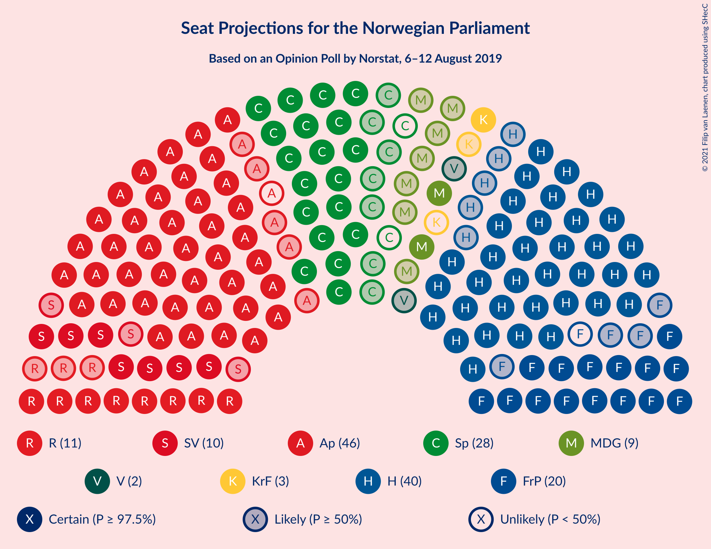
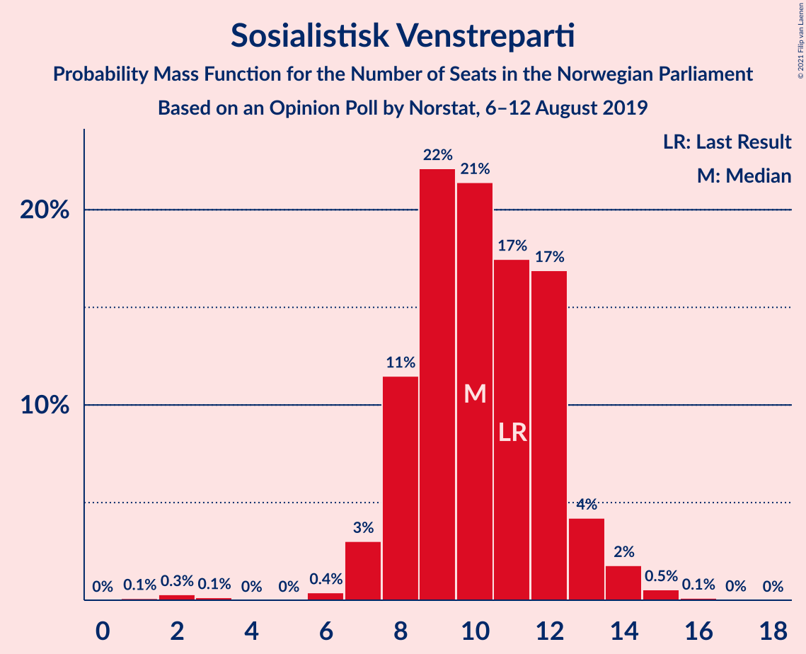
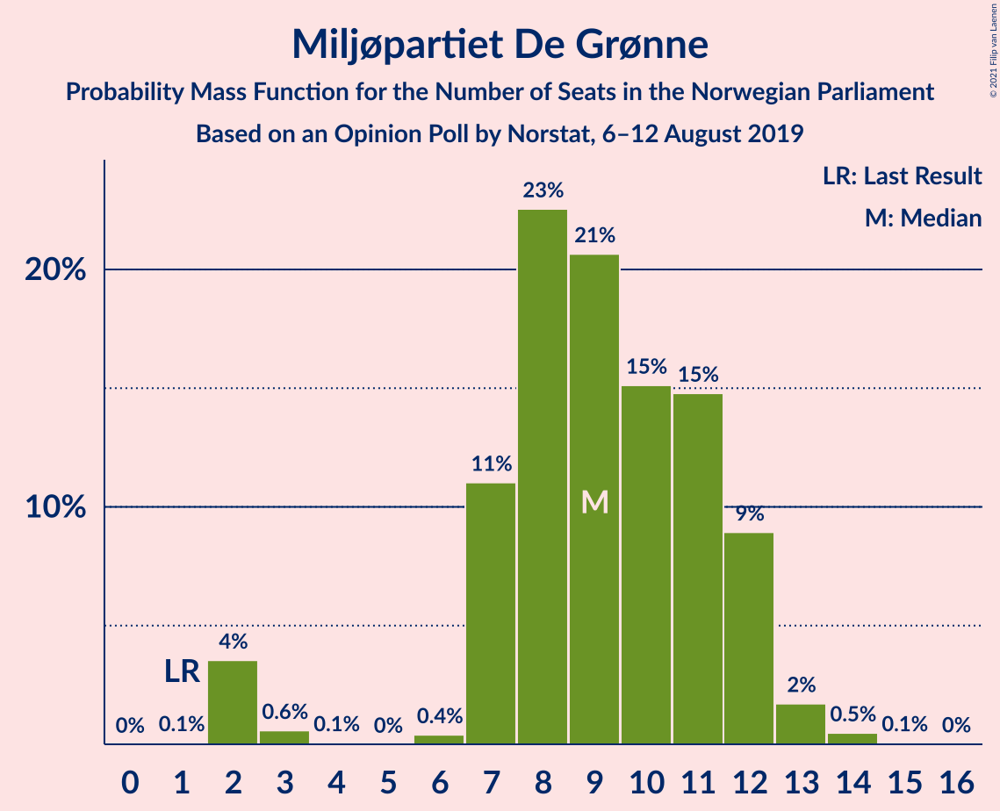
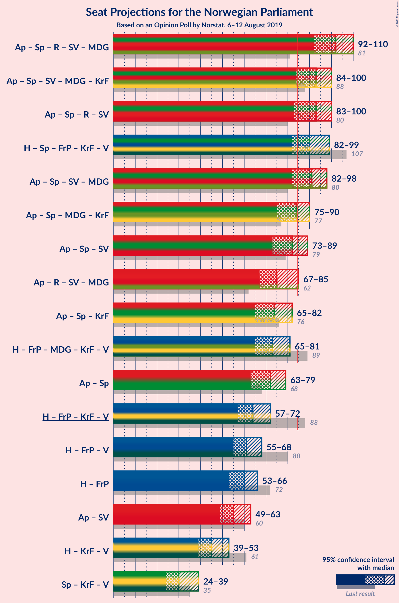
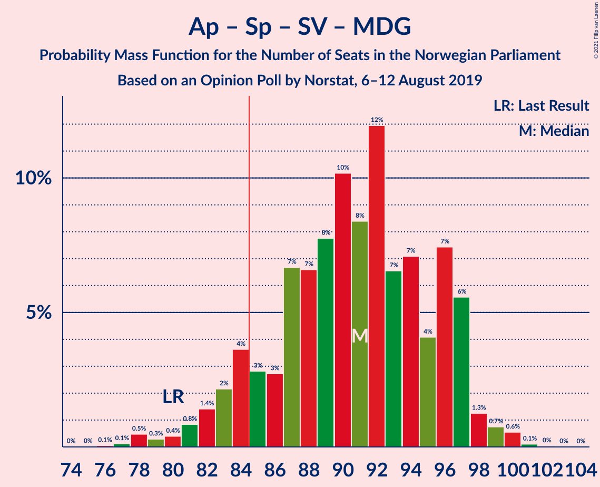
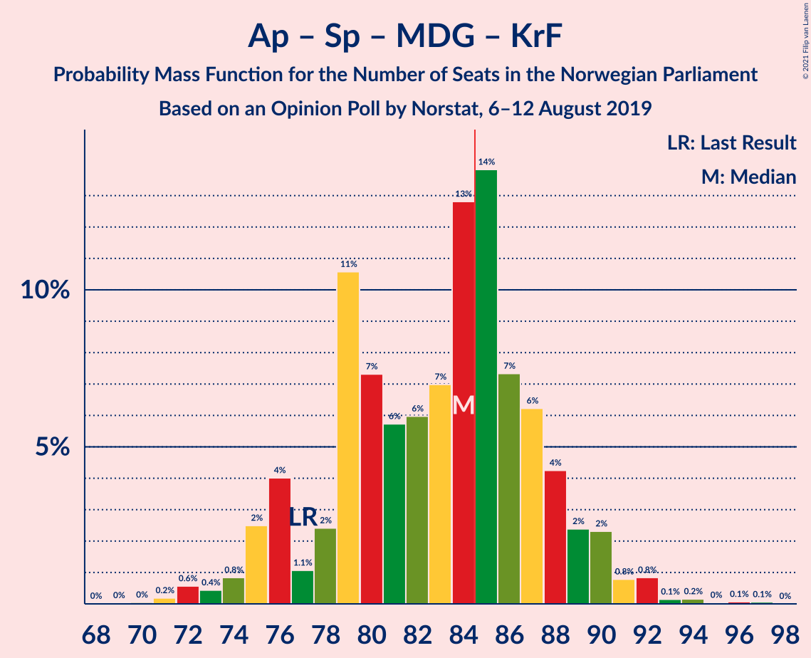
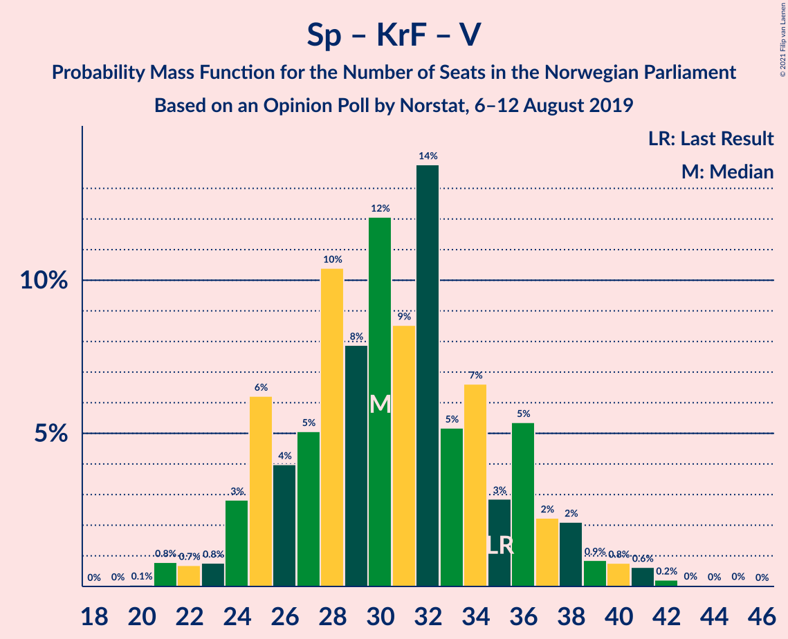

# Opinion Poll by Norstat, 6–12 August 2019

<a href="#voting-intentions">Voting Intentions</a> | <a href="#seats">Seats</a> | <a href="#coalitions">Coalitions</a> | <a href="#technical-information">Technical Information</a>

## Voting Intentions

### Confidence Intervals

| Party | Last Result | Poll Result | 80% Confidence Interval | 90% Confidence Interval | 95% Confidence Interval | 99% Confidence Interval |
|:-----:|:-----------:|:-----------:|:-----------------------:|:-----------------------:|:-----------------------:|:-----------------------:|
| Arbeiderpartiet | 27.4% | 24.6% | 22.6–26.7% |22.1–27.3% |21.6–27.8% |20.7–28.9% |
| Høyre | 25.0% | 22.8% | 20.9–24.9% |20.4–25.5% |19.9–26.0% |19.0–27.0% |
| Senterpartiet | 10.3% | 14.1% | 12.6–15.9% |12.2–16.4% |11.8–16.9% |11.1–17.8% |
| Fremskrittspartiet | 15.2% | 10.9% | 9.5–12.5% |9.1–12.9% |8.8–13.3% |8.2–14.1% |
| Rødt | 2.4% | 6.5% | 5.4–7.8% |5.1–8.2% |4.9–8.5% |4.4–9.2% |
| Sosialistisk Venstreparti | 6.0% | 5.9% | 4.9–7.2% |4.6–7.5% |4.4–7.9% |4.0–8.5% |
| Miljøpartiet De Grønne | 3.2% | 5.4% | 4.4–6.6% |4.2–6.9% |3.9–7.3% |3.5–7.9% |
| Kristelig Folkeparti | 4.2% | 3.2% | 2.5–4.2% |2.3–4.5% |2.1–4.7% |1.8–5.2% |
| Venstre | 4.4% | 2.7% | 2.1–3.7% |1.9–4.0% |1.8–4.2% |1.5–4.7% |

*Note:* The poll result column reflects the actual value used in the calculations. Published results may vary slightly, and in addition be rounded to fewer digits.

## Seats

### Confidence Intervals

| Party | Last Result | Median | 80% Confidence Interval | 90% Confidence Interval | 95% Confidence Interval | 99% Confidence Interval |
|:-----:|:-----------:|:------:|:-----------------------:|:-----------------------:|:-----------------------:|:-----------------------:|
| <a href="#arbeiderpartiet">Arbeiderpartiet</a> | 49 | 44 | 40–52 |39–54 |39–54 |38–56 |
| <a href="#høyre">Høyre</a> | 45 | 41 | 36–46 |35–46 |35–48 |34–50 |
| <a href="#senterpartiet">Senterpartiet</a> | 19 | 25 | 22–31 |21–32 |19–33 |18–34 |
| <a href="#fremskrittspartiet">Fremskrittspartiet</a> | 27 | 19 | 15–23 |15–24 |15–25 |14–25 |
| <a href="#rødt">Rødt</a> | 1 | 11 | 9–13 |8–14 |8–15 |7–16 |
| <a href="#sosialistisk-venstreparti">Sosialistisk Venstreparti</a> | 11 | 10 | 8–13 |8–13 |7–13 |2–15 |
| <a href="#miljøpartiet-de-grønne">Miljøpartiet De Grønne</a> | 1 | 9 | 7–11 |7–12 |3–12 |2–13 |
| <a href="#kristelig-folkeparti">Kristelig Folkeparti</a> | 8 | 2 | 1–6 |1–7 |0–8 |0–9 |
| <a href="#venstre">Venstre</a> | 8 | 2 | 1–2 |1–6 |0–7 |0–9 |

### Arbeiderpartiet

*For a full overview of the results for this party, see the [Arbeiderpartiet](party-arbeiderpartiet.html) page.*

| Number of Seats | Probability | Accumulated | Special Marks |
|:---------------:|:-----------:|:-----------:|:-------------:|
| 36 | 0.1% | 100% |  |
| 37 | 0.2% | 99.9% |  |
| 38 | 0.4% | 99.7% |  |
| 39 | 4% | 99.3% |  |
| 40 | 5% | 95% |  |
| 41 | 8% | 90% |  |
| 42 | 3% | 81% |  |
| 43 | 17% | 78% |  |
| 44 | 13% | 61% | Median |
| 45 | 8% | 48% |  |
| 46 | 3% | 40% |  |
| 47 | 13% | 38% |  |
| 48 | 2% | 24% |  |
| 49 | 2% | 22% | Last Result |
| 50 | 3% | 21% |  |
| 51 | 4% | 18% |  |
| 52 | 6% | 14% |  |
| 53 | 0.4% | 7% |  |
| 54 | 6% | 7% |  |
| 55 | 0.2% | 0.8% |  |
| 56 | 0.5% | 0.5% |  |
| 57 | 0% | 0% |  |

### Høyre

*For a full overview of the results for this party, see the [Høyre](party-høyre.html) page.*

| Number of Seats | Probability | Accumulated | Special Marks |
|:---------------:|:-----------:|:-----------:|:-------------:|
| 32 | 0.1% | 100% |  |
| 33 | 0.3% | 99.9% |  |
| 34 | 0.3% | 99.6% |  |
| 35 | 4% | 99.3% |  |
| 36 | 10% | 95% |  |
| 37 | 11% | 85% |  |
| 38 | 10% | 74% |  |
| 39 | 9% | 63% |  |
| 40 | 3% | 55% |  |
| 41 | 10% | 52% | Median |
| 42 | 8% | 42% |  |
| 43 | 5% | 34% |  |
| 44 | 13% | 30% |  |
| 45 | 1.4% | 17% | Last Result |
| 46 | 11% | 16% |  |
| 47 | 2% | 4% |  |
| 48 | 2% | 3% |  |
| 49 | 0.2% | 0.8% |  |
| 50 | 0.1% | 0.5% |  |
| 51 | 0.2% | 0.5% |  |
| 52 | 0.1% | 0.2% |  |
| 53 | 0% | 0.1% |  |
| 54 | 0.1% | 0.1% |  |
| 55 | 0% | 0% |  |

### Senterpartiet

*For a full overview of the results for this party, see the [Senterpartiet](party-senterpartiet.html) page.*

| Number of Seats | Probability | Accumulated | Special Marks |
|:---------------:|:-----------:|:-----------:|:-------------:|
| 18 | 0.7% | 100% |  |
| 19 | 3% | 99.2% | Last Result |
| 20 | 1.1% | 96% |  |
| 21 | 3% | 95% |  |
| 22 | 6% | 92% |  |
| 23 | 13% | 87% |  |
| 24 | 9% | 74% |  |
| 25 | 20% | 66% | Median |
| 26 | 9% | 45% |  |
| 27 | 2% | 36% |  |
| 28 | 11% | 34% |  |
| 29 | 7% | 23% |  |
| 30 | 6% | 16% |  |
| 31 | 2% | 10% |  |
| 32 | 5% | 8% |  |
| 33 | 1.2% | 3% |  |
| 34 | 2% | 2% |  |
| 35 | 0.1% | 0.2% |  |
| 36 | 0.1% | 0.1% |  |
| 37 | 0% | 0% |  |

### Fremskrittspartiet

*For a full overview of the results for this party, see the [Fremskrittspartiet](party-fremskrittspartiet.html) page.*

| Number of Seats | Probability | Accumulated | Special Marks |
|:---------------:|:-----------:|:-----------:|:-------------:|
| 12 | 0.2% | 100% |  |
| 13 | 0.3% | 99.8% |  |
| 14 | 1.0% | 99.5% |  |
| 15 | 17% | 98.5% |  |
| 16 | 6% | 81% |  |
| 17 | 7% | 75% |  |
| 18 | 7% | 68% |  |
| 19 | 23% | 60% | Median |
| 20 | 15% | 37% |  |
| 21 | 9% | 22% |  |
| 22 | 2% | 13% |  |
| 23 | 4% | 11% |  |
| 24 | 3% | 8% |  |
| 25 | 5% | 5% |  |
| 26 | 0.2% | 0.2% |  |
| 27 | 0.1% | 0.1% | Last Result |
| 28 | 0% | 0% |  |

### Rødt

*For a full overview of the results for this party, see the [Rødt](party-rødt.html) page.*

| Number of Seats | Probability | Accumulated | Special Marks |
|:---------------:|:-----------:|:-----------:|:-------------:|
| 1 | 0% | 100% | Last Result |
| 2 | 0.1% | 100% |  |
| 3 | 0% | 99.9% |  |
| 4 | 0% | 99.9% |  |
| 5 | 0% | 99.9% |  |
| 6 | 0.1% | 99.9% |  |
| 7 | 1.4% | 99.8% |  |
| 8 | 6% | 98% |  |
| 9 | 13% | 92% |  |
| 10 | 27% | 79% |  |
| 11 | 27% | 52% | Median |
| 12 | 9% | 25% |  |
| 13 | 7% | 16% |  |
| 14 | 5% | 9% |  |
| 15 | 3% | 4% |  |
| 16 | 0.9% | 1.1% |  |
| 17 | 0.1% | 0.2% |  |
| 18 | 0% | 0% |  |

### Sosialistisk Venstreparti

*For a full overview of the results for this party, see the [Sosialistisk Venstreparti](party-sosialistiskvenstreparti.html) page.*

| Number of Seats | Probability | Accumulated | Special Marks |
|:---------------:|:-----------:|:-----------:|:-------------:|
| 1 | 0.1% | 100% |  |
| 2 | 0.5% | 99.9% |  |
| 3 | 0.1% | 99.4% |  |
| 4 | 0% | 99.3% |  |
| 5 | 0% | 99.3% |  |
| 6 | 0.1% | 99.3% |  |
| 7 | 2% | 99.2% |  |
| 8 | 10% | 97% |  |
| 9 | 28% | 87% |  |
| 10 | 22% | 60% | Median |
| 11 | 9% | 37% | Last Result |
| 12 | 16% | 28% |  |
| 13 | 10% | 12% |  |
| 14 | 0.7% | 2% |  |
| 15 | 1.0% | 1.3% |  |
| 16 | 0.2% | 0.2% |  |
| 17 | 0.1% | 0.1% |  |
| 18 | 0% | 0% |  |

### Miljøpartiet De Grønne

*For a full overview of the results for this party, see the [Miljøpartiet De Grønne](party-miljøpartietdegrønne.html) page.*

| Number of Seats | Probability | Accumulated | Special Marks |
|:---------------:|:-----------:|:-----------:|:-------------:|
| 1 | 0% | 100% | Last Result |
| 2 | 2% | 100% |  |
| 3 | 0.1% | 98% |  |
| 4 | 0.4% | 97% |  |
| 5 | 0% | 97% |  |
| 6 | 0.6% | 97% |  |
| 7 | 8% | 96% |  |
| 8 | 27% | 89% |  |
| 9 | 16% | 61% | Median |
| 10 | 31% | 45% |  |
| 11 | 5% | 14% |  |
| 12 | 9% | 10% |  |
| 13 | 0.4% | 0.7% |  |
| 14 | 0.2% | 0.3% |  |
| 15 | 0% | 0.1% |  |
| 16 | 0.1% | 0.1% |  |
| 17 | 0% | 0% |  |

### Kristelig Folkeparti

*For a full overview of the results for this party, see the [Kristelig Folkeparti](party-kristeligfolkeparti.html) page.*

| Number of Seats | Probability | Accumulated | Special Marks |
|:---------------:|:-----------:|:-----------:|:-------------:|
| 0 | 3% | 100% |  |
| 1 | 36% | 97% |  |
| 2 | 12% | 61% | Median |
| 3 | 36% | 49% |  |
| 4 | 0% | 13% |  |
| 5 | 0% | 13% |  |
| 6 | 6% | 13% |  |
| 7 | 3% | 6% |  |
| 8 | 2% | 3% | Last Result |
| 9 | 0.6% | 0.7% |  |
| 10 | 0.1% | 0.1% |  |
| 11 | 0% | 0% |  |

### Venstre

*For a full overview of the results for this party, see the [Venstre](party-venstre.html) page.*

| Number of Seats | Probability | Accumulated | Special Marks |
|:---------------:|:-----------:|:-----------:|:-------------:|
| 0 | 4% | 100% |  |
| 1 | 12% | 96% |  |
| 2 | 77% | 85% | Median |
| 3 | 0.1% | 7% |  |
| 4 | 0% | 7% |  |
| 5 | 0% | 7% |  |
| 6 | 4% | 7% |  |
| 7 | 0.8% | 3% |  |
| 8 | 0.8% | 2% | Last Result |
| 9 | 1.5% | 1.5% |  |
| 10 | 0% | 0% |  |

## Coalitions

### Confidence Intervals

| Coalition | Last Result | Median | Majority? | 80% Confidence Interval | 90% Confidence Interval | 95% Confidence Interval | 99% Confidence Interval |
|:---------:|:-----------:|:------:|:---------:|:-----------------------:|:-----------------------:|:-----------------------:|:-----------------------:|
| Arbeiderpartiet – Senterpartiet – Rødt – Sosialistisk Venstreparti – Miljøpartiet De Grønne | 81 | 101 | 100% | 95–108 | 94–109 | 92–110 | 90–113 |
| Arbeiderpartiet – Senterpartiet – Rødt – Sosialistisk Venstreparti | 80 | 92 | 97% | 87–99 | 86–100 | 84–101 | 82–103 |
| Arbeiderpartiet – Senterpartiet – Sosialistisk Venstreparti – Miljøpartiet De Grønne – Kristelig Folkeparti | 88 | 93 | 98% | 88–99 | 85–100 | 85–100 | 82–102 |
| Arbeiderpartiet – Senterpartiet – Sosialistisk Venstreparti – Miljøpartiet De Grønne | 80 | 91 | 92% | 85–97 | 84–99 | 81–99 | 79–100 |
| Høyre – Senterpartiet – Fremskrittspartiet – Kristelig Folkeparti – Venstre | 107 | 89 | 86% | 84–95 | 83–97 | 81–98 | 80–101 |
| Arbeiderpartiet – Senterpartiet – Miljøpartiet De Grønne – Kristelig Folkeparti | 77 | 82 | 42% | 78–89 | 76–90 | 75–90 | 72–92 |
| Arbeiderpartiet – Senterpartiet – Sosialistisk Venstreparti | 79 | 81 | 32% | 76–89 | 74–89 | 73–89 | 72–90 |
| Arbeiderpartiet – Senterpartiet – Kristelig Folkeparti | 76 | 73 | 0.3% | 68–80 | 67–81 | 66–82 | 62–84 |
| Høyre – Fremskrittspartiet – Miljøpartiet De Grønne – Kristelig Folkeparti – Venstre | 89 | 73 | 0.2% | 68–80 | 67–80 | 65–81 | 61–84 |
| Arbeiderpartiet – Senterpartiet | 68 | 71 | 0% | 66–79 | 64–79 | 64–79 | 60–80 |
| Høyre – Fremskrittspartiet – Kristelig Folkeparti – Venstre | 88 | 64 | 0% | 58–70 | 58–71 | 56–73 | 55–74 |
| Høyre – Fremskrittspartiet – Venstre | 80 | 62 | 0% | 55–67 | 55–67 | 55–67 | 53–72 |
| Høyre – Fremskrittspartiet | 72 | 59 | 0% | 53–65 | 53–65 | 53–65 | 51–69 |
| Arbeiderpartiet – Sosialistisk Venstreparti | 60 | 55 | 0% | 51–62 | 49–63 | 48–63 | 46–66 |
| Høyre – Kristelig Folkeparti – Venstre | 61 | 45 | 0% | 40–51 | 38–51 | 38–53 | 37–55 |
| Senterpartiet – Kristelig Folkeparti – Venstre | 35 | 31 | 0% | 26–37 | 24–39 | 23–39 | 22–41 |

### Arbeiderpartiet – Senterpartiet – Rødt – Sosialistisk Venstreparti – Miljøpartiet De Grønne

| Number of Seats | Probability | Accumulated | Special Marks |
|:---------------:|:-----------:|:-----------:|:-------------:|
| 81 | 0% | 100% | Last Result |
| 82 | 0% | 100% |  |
| 83 | 0% | 100% |  |
| 84 | 0% | 100% |  |
| 85 | 0.1% | 100% | Majority |
| 86 | 0.1% | 99.9% |  |
| 87 | 0.1% | 99.8% |  |
| 88 | 0% | 99.6% |  |
| 89 | 0.1% | 99.6% |  |
| 90 | 0.9% | 99.5% |  |
| 91 | 0.8% | 98.6% |  |
| 92 | 0.3% | 98% |  |
| 93 | 2% | 97% |  |
| 94 | 2% | 95% |  |
| 95 | 6% | 94% |  |
| 96 | 9% | 88% |  |
| 97 | 2% | 79% |  |
| 98 | 2% | 77% |  |
| 99 | 13% | 75% | Median |
| 100 | 4% | 62% |  |
| 101 | 10% | 58% |  |
| 102 | 10% | 49% |  |
| 103 | 8% | 39% |  |
| 104 | 3% | 31% |  |
| 105 | 2% | 28% |  |
| 106 | 9% | 26% |  |
| 107 | 5% | 17% |  |
| 108 | 5% | 12% |  |
| 109 | 4% | 7% |  |
| 110 | 0.7% | 3% |  |
| 111 | 0.6% | 2% |  |
| 112 | 0.3% | 2% |  |
| 113 | 1.3% | 1.3% |  |
| 114 | 0% | 0% |  |

### Arbeiderpartiet – Senterpartiet – Rødt – Sosialistisk Venstreparti

| Number of Seats | Probability | Accumulated | Special Marks |
|:---------------:|:-----------:|:-----------:|:-------------:|
| 76 | 0.1% | 100% |  |
| 77 | 0% | 99.9% |  |
| 78 | 0% | 99.9% |  |
| 79 | 0.1% | 99.9% |  |
| 80 | 0% | 99.7% | Last Result |
| 81 | 0.1% | 99.7% |  |
| 82 | 2% | 99.6% |  |
| 83 | 0.3% | 98% |  |
| 84 | 0.6% | 98% |  |
| 85 | 1.1% | 97% | Majority |
| 86 | 6% | 96% |  |
| 87 | 10% | 90% |  |
| 88 | 3% | 80% |  |
| 89 | 13% | 77% |  |
| 90 | 7% | 64% | Median |
| 91 | 2% | 57% |  |
| 92 | 6% | 55% |  |
| 93 | 11% | 49% |  |
| 94 | 7% | 38% |  |
| 95 | 3% | 32% |  |
| 96 | 6% | 28% |  |
| 97 | 2% | 22% |  |
| 98 | 7% | 20% |  |
| 99 | 5% | 14% |  |
| 100 | 6% | 9% |  |
| 101 | 0.9% | 3% |  |
| 102 | 0.3% | 2% |  |
| 103 | 1.4% | 2% |  |
| 104 | 0.2% | 0.3% |  |
| 105 | 0.1% | 0.1% |  |
| 106 | 0% | 0% |  |

### Arbeiderpartiet – Senterpartiet – Sosialistisk Venstreparti – Miljøpartiet De Grønne – Kristelig Folkeparti

| Number of Seats | Probability | Accumulated | Special Marks |
|:---------------:|:-----------:|:-----------:|:-------------:|
| 78 | 0% | 100% |  |
| 79 | 0.1% | 99.9% |  |
| 80 | 0% | 99.9% |  |
| 81 | 0.2% | 99.9% |  |
| 82 | 0.4% | 99.7% |  |
| 83 | 1.2% | 99.2% |  |
| 84 | 0.3% | 98% |  |
| 85 | 3% | 98% | Majority |
| 86 | 3% | 95% |  |
| 87 | 1.1% | 92% |  |
| 88 | 8% | 91% | Last Result |
| 89 | 8% | 83% |  |
| 90 | 3% | 75% | Median |
| 91 | 14% | 72% |  |
| 92 | 8% | 59% |  |
| 93 | 2% | 51% |  |
| 94 | 9% | 48% |  |
| 95 | 3% | 40% |  |
| 96 | 8% | 37% |  |
| 97 | 8% | 29% |  |
| 98 | 4% | 21% |  |
| 99 | 9% | 17% |  |
| 100 | 6% | 7% |  |
| 101 | 1.1% | 2% |  |
| 102 | 0.2% | 0.6% |  |
| 103 | 0.1% | 0.4% |  |
| 104 | 0% | 0.3% |  |
| 105 | 0.2% | 0.3% |  |
| 106 | 0.1% | 0.1% |  |
| 107 | 0% | 0% |  |

### Arbeiderpartiet – Senterpartiet – Sosialistisk Venstreparti – Miljøpartiet De Grønne

| Number of Seats | Probability | Accumulated | Special Marks |
|:---------------:|:-----------:|:-----------:|:-------------:|
| 74 | 0.1% | 100% |  |
| 75 | 0% | 99.9% |  |
| 76 | 0.1% | 99.8% |  |
| 77 | 0.1% | 99.7% |  |
| 78 | 0.1% | 99.6% |  |
| 79 | 0.4% | 99.6% |  |
| 80 | 0.2% | 99.2% | Last Result |
| 81 | 2% | 99.0% |  |
| 82 | 0.3% | 97% |  |
| 83 | 0.6% | 96% |  |
| 84 | 4% | 96% |  |
| 85 | 6% | 92% | Majority |
| 86 | 9% | 86% |  |
| 87 | 5% | 77% |  |
| 88 | 15% | 72% | Median |
| 89 | 0.9% | 57% |  |
| 90 | 3% | 56% |  |
| 91 | 7% | 53% |  |
| 92 | 4% | 45% |  |
| 93 | 16% | 41% |  |
| 94 | 2% | 25% |  |
| 95 | 4% | 23% |  |
| 96 | 8% | 20% |  |
| 97 | 5% | 12% |  |
| 98 | 1.2% | 7% |  |
| 99 | 4% | 6% |  |
| 100 | 1.4% | 2% |  |
| 101 | 0.1% | 0.2% |  |
| 102 | 0% | 0.1% |  |
| 103 | 0% | 0% |  |

### Høyre – Senterpartiet – Fremskrittspartiet – Kristelig Folkeparti – Venstre

| Number of Seats | Probability | Accumulated | Special Marks |
|:---------------:|:-----------:|:-----------:|:-------------:|
| 78 | 0% | 100% |  |
| 79 | 0.1% | 99.9% |  |
| 80 | 0.5% | 99.8% |  |
| 81 | 2% | 99.3% |  |
| 82 | 1.1% | 97% |  |
| 83 | 2% | 96% |  |
| 84 | 8% | 94% |  |
| 85 | 2% | 86% | Majority |
| 86 | 7% | 84% |  |
| 87 | 3% | 78% |  |
| 88 | 8% | 75% |  |
| 89 | 18% | 67% | Median |
| 90 | 3% | 49% |  |
| 91 | 4% | 46% |  |
| 92 | 4% | 42% |  |
| 93 | 21% | 39% |  |
| 94 | 2% | 18% |  |
| 95 | 7% | 16% |  |
| 96 | 3% | 9% |  |
| 97 | 2% | 6% |  |
| 98 | 2% | 4% |  |
| 99 | 0.7% | 2% |  |
| 100 | 0.4% | 1.4% |  |
| 101 | 0.9% | 1.0% |  |
| 102 | 0% | 0.1% |  |
| 103 | 0% | 0.1% |  |
| 104 | 0% | 0.1% |  |
| 105 | 0% | 0% |  |
| 106 | 0% | 0% |  |
| 107 | 0% | 0% | Last Result |

### Arbeiderpartiet – Senterpartiet – Miljøpartiet De Grønne – Kristelig Folkeparti

| Number of Seats | Probability | Accumulated | Special Marks |
|:---------------:|:-----------:|:-----------:|:-------------:|
| 69 | 0% | 100% |  |
| 70 | 0% | 99.9% |  |
| 71 | 0.2% | 99.9% |  |
| 72 | 0.5% | 99.7% |  |
| 73 | 0.9% | 99.3% |  |
| 74 | 0.5% | 98% |  |
| 75 | 3% | 98% |  |
| 76 | 3% | 95% |  |
| 77 | 2% | 92% | Last Result |
| 78 | 1.2% | 90% |  |
| 79 | 20% | 89% |  |
| 80 | 3% | 69% | Median |
| 81 | 11% | 66% |  |
| 82 | 7% | 55% |  |
| 83 | 3% | 48% |  |
| 84 | 3% | 45% |  |
| 85 | 5% | 42% | Majority |
| 86 | 9% | 37% |  |
| 87 | 7% | 28% |  |
| 88 | 8% | 20% |  |
| 89 | 6% | 12% |  |
| 90 | 4% | 6% |  |
| 91 | 0.7% | 1.5% |  |
| 92 | 0.4% | 0.8% |  |
| 93 | 0.1% | 0.4% |  |
| 94 | 0.1% | 0.3% |  |
| 95 | 0% | 0.3% |  |
| 96 | 0.1% | 0.3% |  |
| 97 | 0.2% | 0.2% |  |
| 98 | 0% | 0% |  |

### Arbeiderpartiet – Senterpartiet – Sosialistisk Venstreparti

| Number of Seats | Probability | Accumulated | Special Marks |
|:---------------:|:-----------:|:-----------:|:-------------:|
| 66 | 0% | 100% |  |
| 67 | 0% | 99.9% |  |
| 68 | 0% | 99.9% |  |
| 69 | 0.1% | 99.9% |  |
| 70 | 0.1% | 99.8% |  |
| 71 | 0.1% | 99.6% |  |
| 72 | 0.8% | 99.5% |  |
| 73 | 2% | 98.7% |  |
| 74 | 3% | 97% |  |
| 75 | 2% | 94% |  |
| 76 | 7% | 92% |  |
| 77 | 7% | 85% |  |
| 78 | 14% | 78% |  |
| 79 | 7% | 64% | Last Result, Median |
| 80 | 4% | 57% |  |
| 81 | 4% | 53% |  |
| 82 | 2% | 49% |  |
| 83 | 12% | 46% |  |
| 84 | 3% | 35% |  |
| 85 | 10% | 32% | Majority |
| 86 | 2% | 22% |  |
| 87 | 2% | 20% |  |
| 88 | 7% | 18% |  |
| 89 | 9% | 10% |  |
| 90 | 2% | 2% |  |
| 91 | 0.1% | 0.2% |  |
| 92 | 0.1% | 0.2% |  |
| 93 | 0% | 0.1% |  |
| 94 | 0% | 0% |  |

### Arbeiderpartiet – Senterpartiet – Kristelig Folkeparti

| Number of Seats | Probability | Accumulated | Special Marks |
|:---------------:|:-----------:|:-----------:|:-------------:|
| 61 | 0% | 100% |  |
| 62 | 0.5% | 99.9% |  |
| 63 | 0.1% | 99.5% |  |
| 64 | 0.4% | 99.4% |  |
| 65 | 0.4% | 99.0% |  |
| 66 | 1.4% | 98.6% |  |
| 67 | 4% | 97% |  |
| 68 | 4% | 93% |  |
| 69 | 13% | 89% |  |
| 70 | 8% | 76% |  |
| 71 | 5% | 68% | Median |
| 72 | 12% | 63% |  |
| 73 | 2% | 51% |  |
| 74 | 3% | 49% |  |
| 75 | 3% | 46% |  |
| 76 | 9% | 43% | Last Result |
| 77 | 10% | 34% |  |
| 78 | 1.3% | 24% |  |
| 79 | 5% | 23% |  |
| 80 | 8% | 18% |  |
| 81 | 5% | 10% |  |
| 82 | 4% | 5% |  |
| 83 | 0.1% | 0.6% |  |
| 84 | 0.2% | 0.5% |  |
| 85 | 0.1% | 0.3% | Majority |
| 86 | 0.2% | 0.3% |  |
| 87 | 0.1% | 0.1% |  |
| 88 | 0% | 0% |  |

### Høyre – Fremskrittspartiet – Miljøpartiet De Grønne – Kristelig Folkeparti – Venstre

| Number of Seats | Probability | Accumulated | Special Marks |
|:---------------:|:-----------:|:-----------:|:-------------:|
| 61 | 0.7% | 100% |  |
| 62 | 0.6% | 99.2% |  |
| 63 | 0.2% | 98.6% |  |
| 64 | 0.6% | 98% |  |
| 65 | 1.2% | 98% |  |
| 66 | 2% | 97% |  |
| 67 | 2% | 95% |  |
| 68 | 9% | 94% |  |
| 69 | 9% | 85% |  |
| 70 | 11% | 76% |  |
| 71 | 8% | 64% |  |
| 72 | 3% | 56% |  |
| 73 | 12% | 54% | Median |
| 74 | 5% | 41% |  |
| 75 | 3% | 36% |  |
| 76 | 5% | 33% |  |
| 77 | 3% | 28% |  |
| 78 | 1.1% | 25% |  |
| 79 | 7% | 24% |  |
| 80 | 13% | 17% |  |
| 81 | 2% | 4% |  |
| 82 | 1.2% | 2% |  |
| 83 | 0.5% | 1.1% |  |
| 84 | 0.4% | 0.6% |  |
| 85 | 0.1% | 0.2% | Majority |
| 86 | 0% | 0.2% |  |
| 87 | 0.1% | 0.1% |  |
| 88 | 0% | 0% |  |
| 89 | 0% | 0% | Last Result |

### Arbeiderpartiet – Senterpartiet

| Number of Seats | Probability | Accumulated | Special Marks |
|:---------------:|:-----------:|:-----------:|:-------------:|
| 58 | 0.1% | 100% |  |
| 59 | 0.1% | 99.9% |  |
| 60 | 0.6% | 99.9% |  |
| 61 | 0.4% | 99.3% |  |
| 62 | 0.5% | 98.9% |  |
| 63 | 0.6% | 98% |  |
| 64 | 3% | 98% |  |
| 65 | 0.5% | 95% |  |
| 66 | 15% | 94% |  |
| 67 | 8% | 79% |  |
| 68 | 0.7% | 71% | Last Result |
| 69 | 14% | 70% | Median |
| 70 | 6% | 57% |  |
| 71 | 5% | 51% |  |
| 72 | 3% | 46% |  |
| 73 | 9% | 44% |  |
| 74 | 4% | 34% |  |
| 75 | 1.2% | 30% |  |
| 76 | 13% | 29% |  |
| 77 | 4% | 15% |  |
| 78 | 0.7% | 12% |  |
| 79 | 10% | 11% |  |
| 80 | 0.2% | 0.6% |  |
| 81 | 0.3% | 0.4% |  |
| 82 | 0% | 0.1% |  |
| 83 | 0.1% | 0.1% |  |
| 84 | 0% | 0% |  |

### Høyre – Fremskrittspartiet – Kristelig Folkeparti – Venstre

| Number of Seats | Probability | Accumulated | Special Marks |
|:---------------:|:-----------:|:-----------:|:-------------:|
| 52 | 0% | 100% |  |
| 53 | 0.1% | 99.9% |  |
| 54 | 0.1% | 99.9% |  |
| 55 | 1.1% | 99.8% |  |
| 56 | 2% | 98.7% |  |
| 57 | 2% | 97% |  |
| 58 | 8% | 95% |  |
| 59 | 2% | 87% |  |
| 60 | 5% | 86% |  |
| 61 | 12% | 81% |  |
| 62 | 9% | 70% |  |
| 63 | 10% | 60% |  |
| 64 | 7% | 51% | Median |
| 65 | 2% | 43% |  |
| 66 | 6% | 41% |  |
| 67 | 9% | 34% |  |
| 68 | 5% | 25% |  |
| 69 | 2% | 20% |  |
| 70 | 13% | 18% |  |
| 71 | 0.6% | 5% |  |
| 72 | 1.3% | 4% |  |
| 73 | 1.3% | 3% |  |
| 74 | 2% | 2% |  |
| 75 | 0.1% | 0.3% |  |
| 76 | 0% | 0.3% |  |
| 77 | 0.1% | 0.2% |  |
| 78 | 0.1% | 0.1% |  |
| 79 | 0% | 0.1% |  |
| 80 | 0% | 0% |  |
| 81 | 0% | 0% |  |
| 82 | 0% | 0% |  |
| 83 | 0% | 0% |  |
| 84 | 0% | 0% |  |
| 85 | 0% | 0% | Majority |
| 86 | 0% | 0% |  |
| 87 | 0% | 0% |  |
| 88 | 0% | 0% | Last Result |

### Høyre – Fremskrittspartiet – Venstre

| Number of Seats | Probability | Accumulated | Special Marks |
|:---------------:|:-----------:|:-----------:|:-------------:|
| 50 | 0% | 100% |  |
| 51 | 0.1% | 99.9% |  |
| 52 | 0.1% | 99.9% |  |
| 53 | 0.6% | 99.8% |  |
| 54 | 0.8% | 99.2% |  |
| 55 | 13% | 98% |  |
| 56 | 4% | 85% |  |
| 57 | 2% | 82% |  |
| 58 | 2% | 79% |  |
| 59 | 10% | 78% |  |
| 60 | 3% | 68% |  |
| 61 | 14% | 64% |  |
| 62 | 10% | 50% | Median |
| 63 | 1.0% | 41% |  |
| 64 | 5% | 39% |  |
| 65 | 9% | 35% |  |
| 66 | 11% | 26% |  |
| 67 | 13% | 15% |  |
| 68 | 0.4% | 2% |  |
| 69 | 0.3% | 2% |  |
| 70 | 0.5% | 1.3% |  |
| 71 | 0.3% | 0.9% |  |
| 72 | 0.4% | 0.5% |  |
| 73 | 0.1% | 0.1% |  |
| 74 | 0% | 0.1% |  |
| 75 | 0% | 0% |  |
| 76 | 0% | 0% |  |
| 77 | 0% | 0% |  |
| 78 | 0% | 0% |  |
| 79 | 0% | 0% |  |
| 80 | 0% | 0% | Last Result |

### Høyre – Fremskrittspartiet

| Number of Seats | Probability | Accumulated | Special Marks |
|:---------------:|:-----------:|:-----------:|:-------------:|
| 48 | 0.1% | 100% |  |
| 49 | 0% | 99.9% |  |
| 50 | 0.2% | 99.9% |  |
| 51 | 0.2% | 99.7% |  |
| 52 | 1.0% | 99.5% |  |
| 53 | 9% | 98% |  |
| 54 | 6% | 89% |  |
| 55 | 7% | 83% |  |
| 56 | 2% | 76% |  |
| 57 | 11% | 74% |  |
| 58 | 1.4% | 63% |  |
| 59 | 12% | 61% |  |
| 60 | 10% | 49% | Median |
| 61 | 1.2% | 38% |  |
| 62 | 4% | 37% |  |
| 63 | 6% | 33% |  |
| 64 | 11% | 27% |  |
| 65 | 14% | 16% |  |
| 66 | 0.6% | 2% |  |
| 67 | 0.4% | 2% |  |
| 68 | 0.4% | 1.2% |  |
| 69 | 0.3% | 0.8% |  |
| 70 | 0.2% | 0.5% |  |
| 71 | 0.2% | 0.3% |  |
| 72 | 0% | 0% | Last Result |

### Arbeiderpartiet – Sosialistisk Venstreparti

| Number of Seats | Probability | Accumulated | Special Marks |
|:---------------:|:-----------:|:-----------:|:-------------:|
| 43 | 0% | 100% |  |
| 44 | 0% | 99.9% |  |
| 45 | 0.1% | 99.9% |  |
| 46 | 1.3% | 99.8% |  |
| 47 | 0.2% | 98.6% |  |
| 48 | 2% | 98% |  |
| 49 | 5% | 97% |  |
| 50 | 1.4% | 92% |  |
| 51 | 8% | 91% |  |
| 52 | 10% | 82% |  |
| 53 | 10% | 72% |  |
| 54 | 4% | 62% | Median |
| 55 | 14% | 57% |  |
| 56 | 5% | 44% |  |
| 57 | 8% | 38% |  |
| 58 | 1.4% | 30% |  |
| 59 | 3% | 29% |  |
| 60 | 5% | 26% | Last Result |
| 61 | 7% | 21% |  |
| 62 | 5% | 13% |  |
| 63 | 6% | 9% |  |
| 64 | 0.2% | 2% |  |
| 65 | 2% | 2% |  |
| 66 | 0% | 0.5% |  |
| 67 | 0.4% | 0.5% |  |
| 68 | 0% | 0% |  |

### Høyre – Kristelig Folkeparti – Venstre

| Number of Seats | Probability | Accumulated | Special Marks |
|:---------------:|:-----------:|:-----------:|:-------------:|
| 35 | 0% | 100% |  |
| 36 | 0.1% | 99.9% |  |
| 37 | 1.0% | 99.8% |  |
| 38 | 4% | 98.9% |  |
| 39 | 5% | 95% |  |
| 40 | 3% | 90% |  |
| 41 | 6% | 87% |  |
| 42 | 6% | 81% |  |
| 43 | 12% | 75% |  |
| 44 | 9% | 63% |  |
| 45 | 7% | 55% | Median |
| 46 | 9% | 48% |  |
| 47 | 7% | 39% |  |
| 48 | 3% | 32% |  |
| 49 | 7% | 28% |  |
| 50 | 3% | 21% |  |
| 51 | 13% | 18% |  |
| 52 | 1.4% | 5% |  |
| 53 | 1.4% | 3% |  |
| 54 | 1.1% | 2% |  |
| 55 | 0.3% | 0.8% |  |
| 56 | 0.2% | 0.5% |  |
| 57 | 0.2% | 0.3% |  |
| 58 | 0.1% | 0.1% |  |
| 59 | 0% | 0.1% |  |
| 60 | 0% | 0% |  |
| 61 | 0% | 0% | Last Result |

### Senterpartiet – Kristelig Folkeparti – Venstre

| Number of Seats | Probability | Accumulated | Special Marks |
|:---------------:|:-----------:|:-----------:|:-------------:|
| 21 | 0.3% | 100% |  |
| 22 | 2% | 99.6% |  |
| 23 | 0.6% | 98% |  |
| 24 | 3% | 97% |  |
| 25 | 2% | 94% |  |
| 26 | 6% | 93% |  |
| 27 | 4% | 86% |  |
| 28 | 19% | 82% |  |
| 29 | 5% | 63% | Median |
| 30 | 8% | 59% |  |
| 31 | 16% | 51% |  |
| 32 | 10% | 35% |  |
| 33 | 5% | 25% |  |
| 34 | 3% | 19% |  |
| 35 | 2% | 17% | Last Result |
| 36 | 4% | 15% |  |
| 37 | 3% | 11% |  |
| 38 | 3% | 8% |  |
| 39 | 4% | 5% |  |
| 40 | 0.2% | 0.8% |  |
| 41 | 0.4% | 0.6% |  |
| 42 | 0.1% | 0.2% |  |
| 43 | 0.1% | 0.1% |  |
| 44 | 0% | 0.1% |  |
| 45 | 0% | 0.1% |  |
| 46 | 0% | 0% |  |

## Technical Information

### Opinion Poll

+ **Polling firm:** Norstat
+ **Commissioner(s):** —
+ **Fieldwork period:** 6–12 August 2019

### Calculations

+ **Sample size:** 728
+ **Simulations done:** 131,072
+ **Error estimate:** 1.89%

