# Opinion Poll by Norstat, 6–12 August 2019

<a href="#voting-intentions">Voting Intentions</a> | <a href="#seats">Seats</a> | <a href="#coalitions">Coalitions</a> | <a href="#technical-information">Technical Information</a>

## Voting Intentions

### Confidence Intervals

| Party | Last Result | Poll Result | 80% Confidence Interval | 90% Confidence Interval | 95% Confidence Interval | 99% Confidence Interval |
|:-----:|:-----------:|:-----------:|:-----------------------:|:-----------------------:|:-----------------------:|:-----------------------:|
| Arbeiderpartiet | 27.4% | 24.6% | 22.6–26.7% |22.1–27.3% |21.6–27.8% |20.7–28.9% |
| Høyre | 25.0% | 22.8% | 20.9–24.9% |20.4–25.5% |19.9–26.0% |19.0–27.0% |
| Senterpartiet | 10.3% | 14.1% | 12.6–15.9% |12.2–16.4% |11.8–16.9% |11.1–17.8% |
| Fremskrittspartiet | 15.2% | 10.9% | 9.5–12.5% |9.1–12.9% |8.8–13.3% |8.2–14.1% |
| Rødt | 2.4% | 6.5% | 5.4–7.8% |5.1–8.2% |4.9–8.5% |4.4–9.2% |
| Sosialistisk Venstreparti | 6.0% | 5.9% | 4.9–7.2% |4.6–7.5% |4.4–7.9% |4.0–8.5% |
| Miljøpartiet De Grønne | 3.2% | 5.4% | 4.4–6.6% |4.2–6.9% |3.9–7.3% |3.5–7.9% |
| Kristelig Folkeparti | 4.2% | 3.2% | 2.5–4.2% |2.3–4.5% |2.1–4.7% |1.8–5.2% |
| Venstre | 4.4% | 2.7% | 2.1–3.7% |1.9–4.0% |1.8–4.2% |1.5–4.7% |

*Note:* The poll result column reflects the actual value used in the calculations. Published results may vary slightly, and in addition be rounded to fewer digits.

## Seats

### Confidence Intervals

| Party | Last Result | Median | 80% Confidence Interval | 90% Confidence Interval | 95% Confidence Interval | 99% Confidence Interval |
|:-----:|:-----------:|:------:|:-----------------------:|:-----------------------:|:-----------------------:|:-----------------------:|
| <a href="#arbeiderpartiet">Arbeiderpartiet</a> | 49 | 40 | 40–45 |40–46 |40–48 |38–49 |
| <a href="#høyre">Høyre</a> | 45 | 44 | 41–44 |34–44 |34–44 |30–50 |
| <a href="#senterpartiet">Senterpartiet</a> | 19 | 25 | 25–26 |23–28 |23–31 |22–31 |
| <a href="#fremskrittspartiet">Fremskrittspartiet</a> | 27 | 25 | 23–25 |19–25 |17–26 |15–26 |
| <a href="#rødt">Rødt</a> | 1 | 13 | 11–13 |10–13 |9–13 |8–14 |
| <a href="#sosialistisk-venstreparti">Sosialistisk Venstreparti</a> | 11 | 11 | 11 |10–14 |9–14 |8–14 |
| <a href="#miljøpartiet-de-grønne">Miljøpartiet De Grønne</a> | 1 | 8 | 8–10 |8–10 |6–11 |1–11 |
| <a href="#kristelig-folkeparti">Kristelig Folkeparti</a> | 8 | 1 | 1 |1–3 |0–3 |0–7 |
| <a href="#venstre">Venstre</a> | 8 | 2 | 2 |2 |0–2 |0–7 |

### Arbeiderpartiet

*For a full overview of the results for this party, see the [Arbeiderpartiet](party-arbeiderpartiet.html) page.*

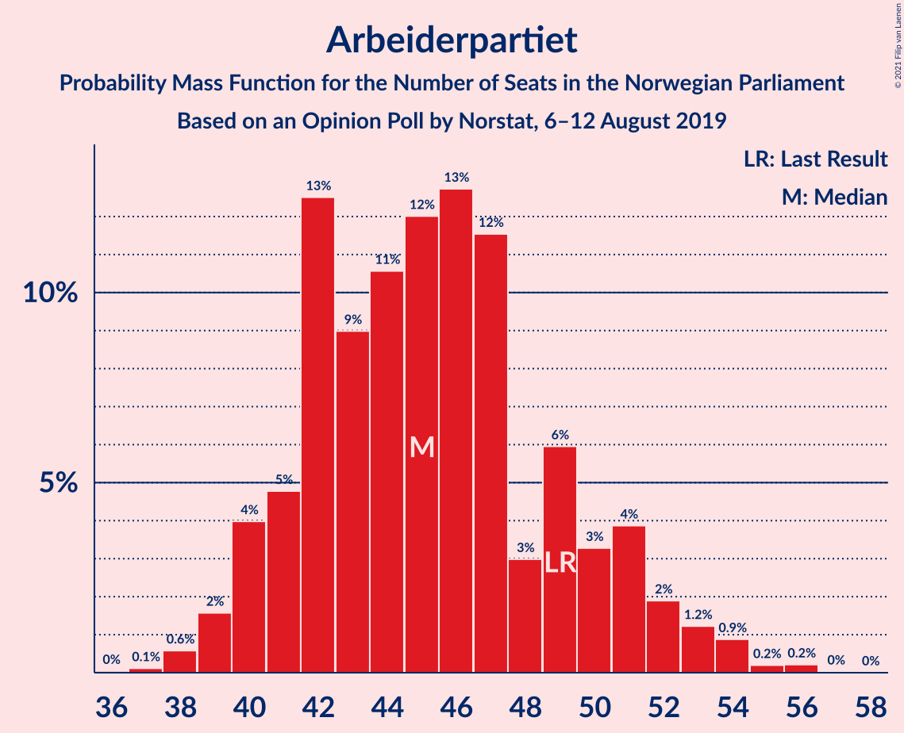

| Number of Seats | Probability | Accumulated | Special Marks |
|:---------------:|:-----------:|:-----------:|:-------------:|
| 38 | 0.9% | 100% |  |
| 39 | 0.1% | 99.1% |  |
| 40 | 84% | 99.0% | Median |
| 41 | 0% | 15% |  |
| 42 | 4% | 15% |  |
| 43 | 0% | 10% |  |
| 44 | 0% | 10% |  |
| 45 | 5% | 10% |  |
| 46 | 2% | 6% |  |
| 47 | 0% | 3% |  |
| 48 | 1.3% | 3% |  |
| 49 | 2% | 2% | Last Result |
| 50 | 0% | 0.1% |  |
| 51 | 0% | 0.1% |  |
| 52 | 0% | 0.1% |  |
| 53 | 0% | 0.1% |  |
| 54 | 0.1% | 0.1% |  |
| 55 | 0% | 0% |  |

### Høyre

*For a full overview of the results for this party, see the [Høyre](party-høyre.html) page.*

| Number of Seats | Probability | Accumulated | Special Marks |
|:---------------:|:-----------:|:-----------:|:-------------:|
| 30 | 1.3% | 100% |  |
| 31 | 0% | 98.7% |  |
| 32 | 0% | 98.7% |  |
| 33 | 0% | 98.7% |  |
| 34 | 4% | 98.7% |  |
| 35 | 0% | 94% |  |
| 36 | 0% | 94% |  |
| 37 | 0% | 94% |  |
| 38 | 2% | 94% |  |
| 39 | 0% | 92% |  |
| 40 | 2% | 92% |  |
| 41 | 0.3% | 90% |  |
| 42 | 4% | 90% |  |
| 43 | 1.0% | 85% |  |
| 44 | 83% | 84% | Median |
| 45 | 0% | 1.1% | Last Result |
| 46 | 0.2% | 1.1% |  |
| 47 | 0% | 0.9% |  |
| 48 | 0% | 0.9% |  |
| 49 | 0% | 0.9% |  |
| 50 | 0.9% | 0.9% |  |
| 51 | 0% | 0.1% |  |
| 52 | 0% | 0.1% |  |
| 53 | 0% | 0.1% |  |
| 54 | 0% | 0.1% |  |
| 55 | 0% | 0.1% |  |
| 56 | 0% | 0.1% |  |
| 57 | 0.1% | 0.1% |  |
| 58 | 0% | 0% |  |

### Senterpartiet

*For a full overview of the results for this party, see the [Senterpartiet](party-senterpartiet.html) page.*

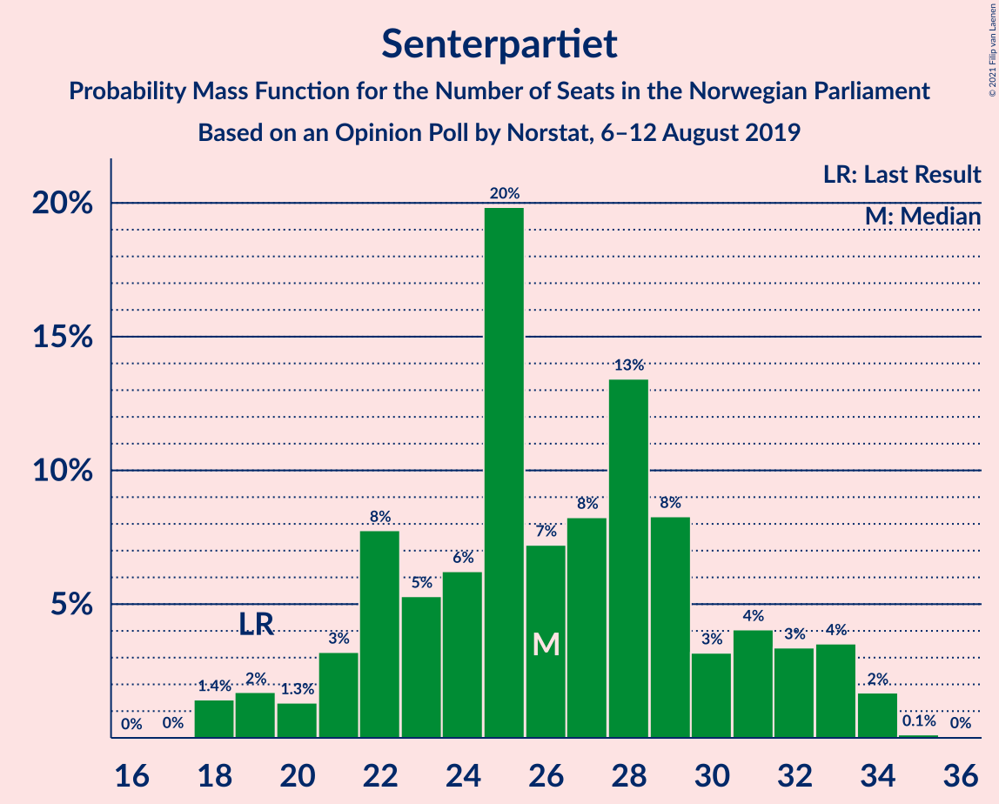

| Number of Seats | Probability | Accumulated | Special Marks |
|:---------------:|:-----------:|:-----------:|:-------------:|
| 19 | 0.3% | 100% | Last Result |
| 20 | 0.1% | 99.6% |  |
| 21 | 0% | 99.5% |  |
| 22 | 0% | 99.5% |  |
| 23 | 5% | 99.5% |  |
| 24 | 0% | 94% |  |
| 25 | 83% | 94% | Median |
| 26 | 5% | 11% |  |
| 27 | 0% | 7% |  |
| 28 | 2% | 6% |  |
| 29 | 0% | 5% |  |
| 30 | 0% | 5% |  |
| 31 | 5% | 5% |  |
| 32 | 0% | 0% |  |

### Fremskrittspartiet

*For a full overview of the results for this party, see the [Fremskrittspartiet](party-fremskrittspartiet.html) page.*

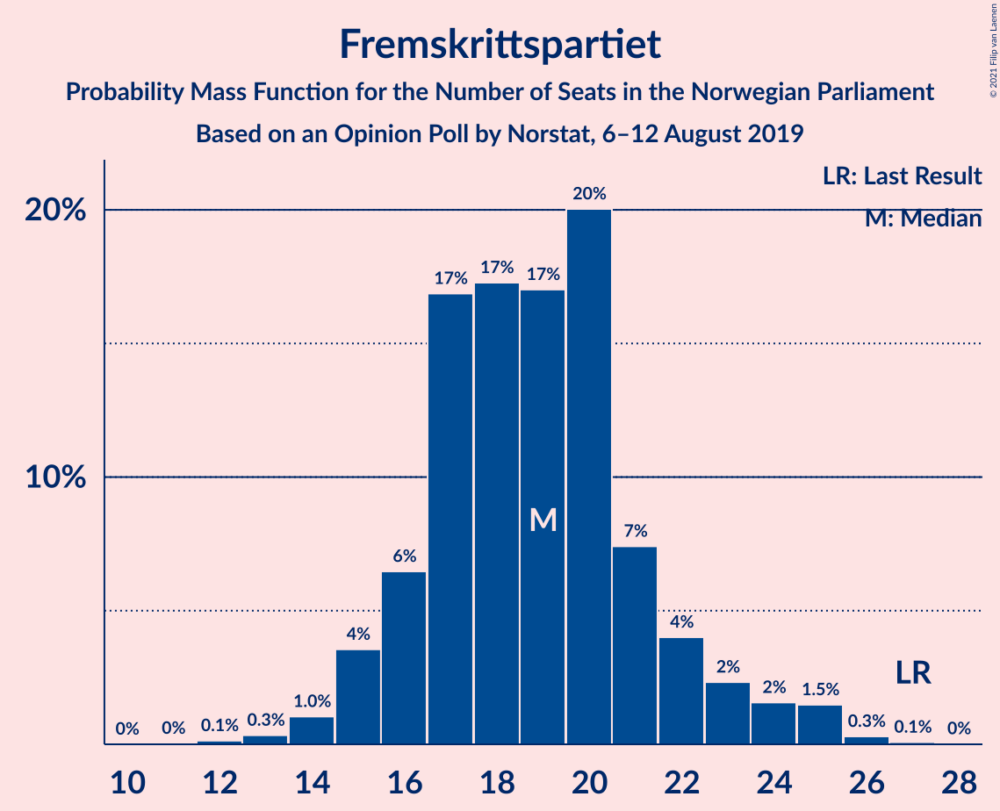

| Number of Seats | Probability | Accumulated | Special Marks |
|:---------------:|:-----------:|:-----------:|:-------------:|
| 13 | 0.1% | 100% |  |
| 14 | 0% | 99.9% |  |
| 15 | 0.9% | 99.9% |  |
| 16 | 0% | 99.0% |  |
| 17 | 2% | 99.0% |  |
| 18 | 2% | 97% |  |
| 19 | 0% | 95% |  |
| 20 | 0% | 95% |  |
| 21 | 2% | 95% |  |
| 22 | 0% | 93% |  |
| 23 | 5% | 93% |  |
| 24 | 0% | 89% |  |
| 25 | 84% | 89% | Median |
| 26 | 4% | 4% |  |
| 27 | 0% | 0% | Last Result |

### Rødt

*For a full overview of the results for this party, see the [Rødt](party-rødt.html) page.*

| Number of Seats | Probability | Accumulated | Special Marks |
|:---------------:|:-----------:|:-----------:|:-------------:|
| 1 | 0% | 100% | Last Result |
| 2 | 0.1% | 100% |  |
| 3 | 0% | 99.9% |  |
| 4 | 0% | 99.9% |  |
| 5 | 0% | 99.9% |  |
| 6 | 0.1% | 99.9% |  |
| 7 | 0% | 99.8% |  |
| 8 | 2% | 99.8% |  |
| 9 | 1.4% | 98% |  |
| 10 | 5% | 96% |  |
| 11 | 7% | 91% |  |
| 12 | 0% | 84% |  |
| 13 | 83% | 84% | Median |
| 14 | 0.9% | 1.0% |  |
| 15 | 0% | 0.1% |  |
| 16 | 0.1% | 0.1% |  |
| 17 | 0% | 0.1% |  |
| 18 | 0% | 0.1% |  |
| 19 | 0% | 0% |  |

### Sosialistisk Venstreparti

*For a full overview of the results for this party, see the [Sosialistisk Venstreparti](party-sosialistiskvenstreparti.html) page.*

| Number of Seats | Probability | Accumulated | Special Marks |
|:---------------:|:-----------:|:-----------:|:-------------:|
| 7 | 0.2% | 100% |  |
| 8 | 0.9% | 99.8% |  |
| 9 | 3% | 98.9% |  |
| 10 | 2% | 95% |  |
| 11 | 85% | 94% | Last Result, Median |
| 12 | 0.4% | 9% |  |
| 13 | 0.1% | 9% |  |
| 14 | 9% | 9% |  |
| 15 | 0% | 0% |  |

### Miljøpartiet De Grønne

*For a full overview of the results for this party, see the [Miljøpartiet De Grønne](party-miljøpartietdegrønne.html) page.*

| Number of Seats | Probability | Accumulated | Special Marks |
|:---------------:|:-----------:|:-----------:|:-------------:|
| 1 | 2% | 100% | Last Result |
| 2 | 0% | 98% |  |
| 3 | 0% | 98% |  |
| 4 | 0% | 98% |  |
| 5 | 0% | 98% |  |
| 6 | 1.0% | 98% |  |
| 7 | 0% | 97% |  |
| 8 | 86% | 97% | Median |
| 9 | 0.5% | 12% |  |
| 10 | 7% | 11% |  |
| 11 | 5% | 5% |  |
| 12 | 0% | 0% |  |

### Kristelig Folkeparti

*For a full overview of the results for this party, see the [Kristelig Folkeparti](party-kristeligfolkeparti.html) page.*

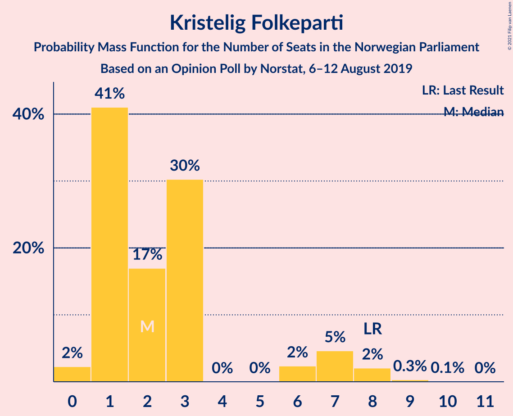

| Number of Seats | Probability | Accumulated | Special Marks |
|:---------------:|:-----------:|:-----------:|:-------------:|
| 0 | 5% | 100% |  |
| 1 | 87% | 95% | Median |
| 2 | 0% | 8% |  |
| 3 | 6% | 8% |  |
| 4 | 0% | 2% |  |
| 5 | 0% | 2% |  |
| 6 | 0.1% | 2% |  |
| 7 | 2% | 2% |  |
| 8 | 0% | 0% | Last Result |

### Venstre

*For a full overview of the results for this party, see the [Venstre](party-venstre.html) page.*

| Number of Seats | Probability | Accumulated | Special Marks |
|:---------------:|:-----------:|:-----------:|:-------------:|
| 0 | 3% | 100% |  |
| 1 | 1.5% | 97% |  |
| 2 | 94% | 96% | Median |
| 3 | 0% | 2% |  |
| 4 | 0% | 2% |  |
| 5 | 0% | 2% |  |
| 6 | 0% | 2% |  |
| 7 | 2% | 2% |  |
| 8 | 0% | 0% | Last Result |

## Coalitions

### Confidence Intervals

| Coalition | Last Result | Median | Majority? | 80% Confidence Interval | 90% Confidence Interval | 95% Confidence Interval | 99% Confidence Interval |
|:---------:|:-----------:|:------:|:---------:|:-----------------------:|:-----------------------:|:-----------------------:|:-----------------------:|
| Arbeiderpartiet – Senterpartiet – Rødt – Sosialistisk Venstreparti – Miljøpartiet De Grønne | 81 | 97 | 100% | 97–102 | 97–104 | 96–105 | 88–109 |
| Høyre – Senterpartiet – Fremskrittspartiet – Kristelig Folkeparti – Venstre | 107 | 97 | 98.5% | 91–97 | 90–97 | 89–99 | 83–101 |
| Arbeiderpartiet – Senterpartiet – Rødt – Sosialistisk Venstreparti | 80 | 89 | 98% | 89–93 | 89–95 | 89–97 | 82–99 |
| Arbeiderpartiet – Senterpartiet – Sosialistisk Venstreparti – Miljøpartiet De Grønne – Kristelig Folkeparti | 88 | 85 | 99.0% | 85–92 | 85–96 | 85–96 | 79–103 |
| Arbeiderpartiet – Senterpartiet – Sosialistisk Venstreparti – Miljøpartiet De Grønne | 80 | 84 | 16% | 84–92 | 84–93 | 84–94 | 78–100 |
| Arbeiderpartiet – Senterpartiet – Sosialistisk Venstreparti | 79 | 76 | 6% | 76–82 | 76–86 | 76–87 | 72–90 |
| Arbeiderpartiet – Senterpartiet – Miljøpartiet De Grønne – Kristelig Folkeparti | 77 | 74 | 6% | 74–82 | 74–85 | 74–86 | 70–92 |
| Arbeiderpartiet – Senterpartiet – Kristelig Folkeparti | 76 | 66 | 0% | 66–71 | 66–78 | 66–82 | 64–84 |
| Høyre – Fremskrittspartiet – Miljøpartiet De Grønne – Kristelig Folkeparti – Venstre | 89 | 80 | 0.1% | 76–80 | 74–80 | 66–80 | 62–80 |
| Arbeiderpartiet – Senterpartiet | 68 | 65 | 0% | 65–68 | 65–77 | 65–77 | 63–79 |
| Høyre – Fremskrittspartiet – Kristelig Folkeparti – Venstre | 88 | 72 | 0% | 67–72 | 65–72 | 58–72 | 52–73 |
| Høyre – Fremskrittspartiet – Venstre | 80 | 71 | 0% | 66–71 | 62–71 | 57–71 | 49–71 |
| Høyre – Fremskrittspartiet | 72 | 69 | 0% | 60–69 | 59–69 | 57–69 | 48–69 |
| Arbeiderpartiet – Sosialistisk Venstreparti | 60 | 51 | 0% | 51–56 | 51–59 | 51–59 | 46–59 |
| Høyre – Kristelig Folkeparti – Venstre | 61 | 47 | 0% | 44–47 | 39–47 | 39–52 | 34–53 |
| Senterpartiet – Kristelig Folkeparti – Venstre | 35 | 28 | 0% | 28–31 | 26–32 | 25–35 | 25–42 |

### Arbeiderpartiet – Senterpartiet – Rødt – Sosialistisk Venstreparti – Miljøpartiet De Grønne

| Number of Seats | Probability | Accumulated | Special Marks |
|:---------------:|:-----------:|:-----------:|:-------------:|
| 81 | 0% | 100% | Last Result |
| 82 | 0% | 100% |  |
| 83 | 0% | 100% |  |
| 84 | 0% | 100% |  |
| 85 | 0% | 100% | Majority |
| 86 | 0% | 100% |  |
| 87 | 0% | 100% |  |
| 88 | 1.0% | 100% |  |
| 89 | 0% | 99.0% |  |
| 90 | 0% | 99.0% |  |
| 91 | 0% | 99.0% |  |
| 92 | 0.1% | 99.0% |  |
| 93 | 0.4% | 98.8% |  |
| 94 | 0% | 98% |  |
| 95 | 0% | 98% |  |
| 96 | 2% | 98% |  |
| 97 | 83% | 97% | Median |
| 98 | 0% | 14% |  |
| 99 | 0% | 14% |  |
| 100 | 0.1% | 14% |  |
| 101 | 0.9% | 13% |  |
| 102 | 4% | 13% |  |
| 103 | 0% | 8% |  |
| 104 | 4% | 8% |  |
| 105 | 2% | 4% |  |
| 106 | 0% | 1.4% |  |
| 107 | 0% | 1.4% |  |
| 108 | 0% | 1.4% |  |
| 109 | 1.3% | 1.4% |  |
| 110 | 0% | 0.1% |  |
| 111 | 0% | 0.1% |  |
| 112 | 0% | 0.1% |  |
| 113 | 0.1% | 0.1% |  |
| 114 | 0% | 0% |  |

### Høyre – Senterpartiet – Fremskrittspartiet – Kristelig Folkeparti – Venstre

| Number of Seats | Probability | Accumulated | Special Marks |
|:---------------:|:-----------:|:-----------:|:-------------:|
| 80 | 0.1% | 100% |  |
| 81 | 0% | 99.9% |  |
| 82 | 0.1% | 99.9% |  |
| 83 | 1.3% | 99.9% |  |
| 84 | 0% | 98.5% |  |
| 85 | 0.3% | 98.5% | Majority |
| 86 | 0% | 98% |  |
| 87 | 0% | 98% |  |
| 88 | 0% | 98% |  |
| 89 | 2% | 98% |  |
| 90 | 4% | 96% |  |
| 91 | 4% | 91% |  |
| 92 | 0% | 87% |  |
| 93 | 0% | 87% |  |
| 94 | 1.0% | 87% |  |
| 95 | 0% | 86% |  |
| 96 | 0% | 86% |  |
| 97 | 83% | 86% | Median |
| 98 | 0% | 3% |  |
| 99 | 0.9% | 3% |  |
| 100 | 0% | 2% |  |
| 101 | 2% | 2% |  |
| 102 | 0% | 0% |  |
| 103 | 0% | 0% |  |
| 104 | 0% | 0% |  |
| 105 | 0% | 0% |  |
| 106 | 0% | 0% |  |
| 107 | 0% | 0% | Last Result |

### Arbeiderpartiet – Senterpartiet – Rødt – Sosialistisk Venstreparti

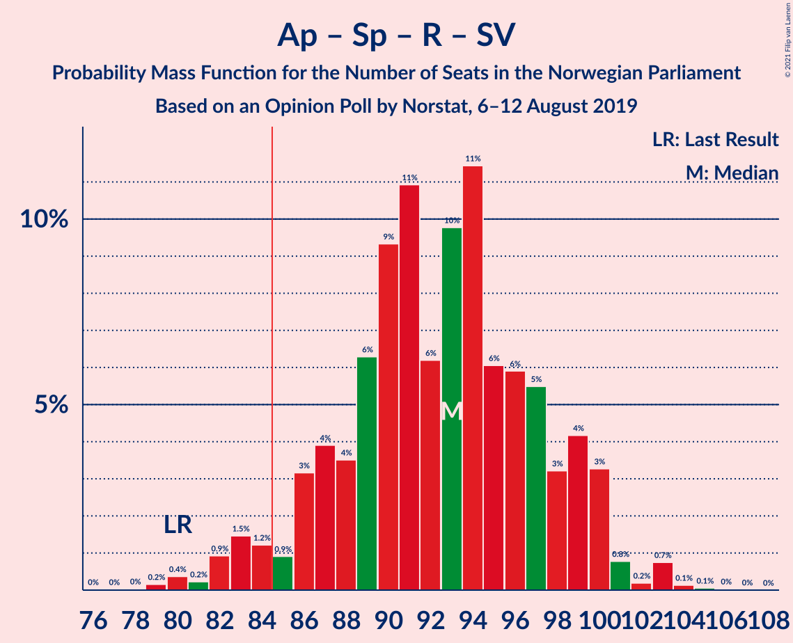

| Number of Seats | Probability | Accumulated | Special Marks |
|:---------------:|:-----------:|:-----------:|:-------------:|
| 80 | 0% | 100% | Last Result |
| 81 | 0% | 100% |  |
| 82 | 1.0% | 100% |  |
| 83 | 0.2% | 99.0% |  |
| 84 | 0.3% | 98.8% |  |
| 85 | 0% | 98% | Majority |
| 86 | 0% | 98% |  |
| 87 | 0% | 98% |  |
| 88 | 0% | 98% |  |
| 89 | 83% | 98% | Median |
| 90 | 0.1% | 15% |  |
| 91 | 0.9% | 15% |  |
| 92 | 4% | 14% |  |
| 93 | 4% | 10% |  |
| 94 | 0% | 6% |  |
| 95 | 2% | 6% |  |
| 96 | 0% | 4% |  |
| 97 | 2% | 4% |  |
| 98 | 0% | 1.4% |  |
| 99 | 1.3% | 1.4% |  |
| 100 | 0% | 0.1% |  |
| 101 | 0% | 0.1% |  |
| 102 | 0.1% | 0.1% |  |
| 103 | 0% | 0% |  |

### Arbeiderpartiet – Senterpartiet – Sosialistisk Venstreparti – Miljøpartiet De Grønne – Kristelig Folkeparti

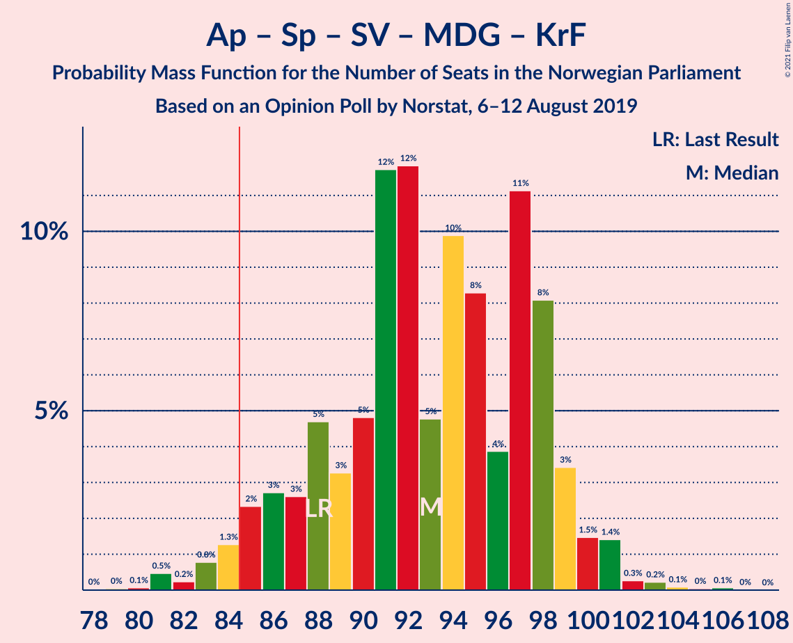

| Number of Seats | Probability | Accumulated | Special Marks |
|:---------------:|:-----------:|:-----------:|:-------------:|
| 79 | 1.0% | 100% |  |
| 80 | 0% | 99.0% |  |
| 81 | 0% | 99.0% |  |
| 82 | 0% | 99.0% |  |
| 83 | 0% | 99.0% |  |
| 84 | 0% | 99.0% |  |
| 85 | 83% | 99.0% | Median, Majority |
| 86 | 0% | 15% |  |
| 87 | 0.1% | 15% |  |
| 88 | 0.9% | 15% | Last Result |
| 89 | 0% | 15% |  |
| 90 | 0% | 15% |  |
| 91 | 0% | 15% |  |
| 92 | 5% | 15% |  |
| 93 | 0% | 10% |  |
| 94 | 0% | 10% |  |
| 95 | 4% | 10% |  |
| 96 | 4% | 6% |  |
| 97 | 0% | 1.4% |  |
| 98 | 0% | 1.4% |  |
| 99 | 0% | 1.4% |  |
| 100 | 0% | 1.4% |  |
| 101 | 0% | 1.4% |  |
| 102 | 0% | 1.4% |  |
| 103 | 1.3% | 1.4% |  |
| 104 | 0.1% | 0.1% |  |
| 105 | 0% | 0% |  |

### Arbeiderpartiet – Senterpartiet – Sosialistisk Venstreparti – Miljøpartiet De Grønne

| Number of Seats | Probability | Accumulated | Special Marks |
|:---------------:|:-----------:|:-----------:|:-------------:|
| 78 | 1.0% | 100% |  |
| 79 | 0% | 99.0% |  |
| 80 | 0% | 99.0% | Last Result |
| 81 | 0% | 99.0% |  |
| 82 | 0% | 99.0% |  |
| 83 | 0% | 99.0% |  |
| 84 | 83% | 99.0% | Median |
| 85 | 0.3% | 16% | Majority |
| 86 | 0.1% | 15% |  |
| 87 | 0.9% | 15% |  |
| 88 | 2% | 14% |  |
| 89 | 0% | 13% |  |
| 90 | 0% | 13% |  |
| 91 | 0.1% | 13% |  |
| 92 | 4% | 13% |  |
| 93 | 4% | 8% |  |
| 94 | 2% | 4% |  |
| 95 | 0% | 1.4% |  |
| 96 | 0% | 1.4% |  |
| 97 | 0% | 1.4% |  |
| 98 | 0% | 1.4% |  |
| 99 | 0% | 1.4% |  |
| 100 | 1.3% | 1.4% |  |
| 101 | 0% | 0.1% |  |
| 102 | 0% | 0.1% |  |
| 103 | 0% | 0.1% |  |
| 104 | 0.1% | 0.1% |  |
| 105 | 0% | 0% |  |

### Arbeiderpartiet – Senterpartiet – Sosialistisk Venstreparti

| Number of Seats | Probability | Accumulated | Special Marks |
|:---------------:|:-----------:|:-----------:|:-------------:|
| 72 | 1.0% | 100% |  |
| 73 | 0% | 99.0% |  |
| 74 | 0.1% | 99.0% |  |
| 75 | 0% | 98.9% |  |
| 76 | 83% | 98.9% | Median |
| 77 | 1.0% | 15% |  |
| 78 | 0% | 14% |  |
| 79 | 0% | 14% | Last Result |
| 80 | 0% | 14% |  |
| 81 | 0.1% | 14% |  |
| 82 | 9% | 14% |  |
| 83 | 0% | 6% |  |
| 84 | 0% | 6% |  |
| 85 | 0% | 6% | Majority |
| 86 | 2% | 6% |  |
| 87 | 2% | 3% |  |
| 88 | 0% | 1.4% |  |
| 89 | 0% | 1.4% |  |
| 90 | 1.3% | 1.4% |  |
| 91 | 0% | 0.1% |  |
| 92 | 0% | 0.1% |  |
| 93 | 0.1% | 0.1% |  |
| 94 | 0% | 0% |  |

### Arbeiderpartiet – Senterpartiet – Miljøpartiet De Grønne – Kristelig Folkeparti

| Number of Seats | Probability | Accumulated | Special Marks |
|:---------------:|:-----------:|:-----------:|:-------------:|
| 70 | 1.0% | 100% |  |
| 71 | 0% | 99.0% |  |
| 72 | 0% | 99.0% |  |
| 73 | 0.4% | 99.0% |  |
| 74 | 83% | 98.6% | Median |
| 75 | 0% | 15% |  |
| 76 | 0% | 15% |  |
| 77 | 0% | 15% | Last Result |
| 78 | 4% | 15% |  |
| 79 | 0% | 11% |  |
| 80 | 0.9% | 11% |  |
| 81 | 0.1% | 10% |  |
| 82 | 4% | 10% |  |
| 83 | 0% | 6% |  |
| 84 | 0% | 6% |  |
| 85 | 2% | 6% | Majority |
| 86 | 2% | 4% |  |
| 87 | 0% | 1.4% |  |
| 88 | 0% | 1.4% |  |
| 89 | 0% | 1.4% |  |
| 90 | 0% | 1.4% |  |
| 91 | 0.1% | 1.4% |  |
| 92 | 1.3% | 1.3% |  |
| 93 | 0% | 0% |  |

### Arbeiderpartiet – Senterpartiet – Kristelig Folkeparti

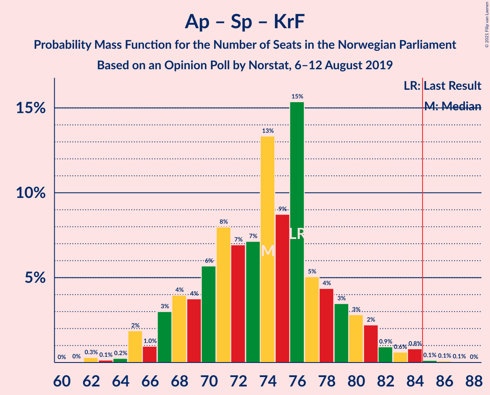

| Number of Seats | Probability | Accumulated | Special Marks |
|:---------------:|:-----------:|:-----------:|:-------------:|
| 64 | 1.3% | 100% |  |
| 65 | 0% | 98.6% |  |
| 66 | 83% | 98.6% | Median |
| 67 | 0% | 15% |  |
| 68 | 4% | 15% |  |
| 69 | 0% | 11% |  |
| 70 | 0.9% | 11% |  |
| 71 | 5% | 10% |  |
| 72 | 0% | 6% |  |
| 73 | 0% | 6% |  |
| 74 | 0% | 6% |  |
| 75 | 0% | 6% |  |
| 76 | 0.1% | 6% | Last Result |
| 77 | 0% | 6% |  |
| 78 | 2% | 6% |  |
| 79 | 0% | 3% |  |
| 80 | 0.1% | 3% |  |
| 81 | 0% | 3% |  |
| 82 | 1.3% | 3% |  |
| 83 | 0% | 2% |  |
| 84 | 2% | 2% |  |
| 85 | 0% | 0% | Majority |

### Høyre – Fremskrittspartiet – Miljøpartiet De Grønne – Kristelig Folkeparti – Venstre

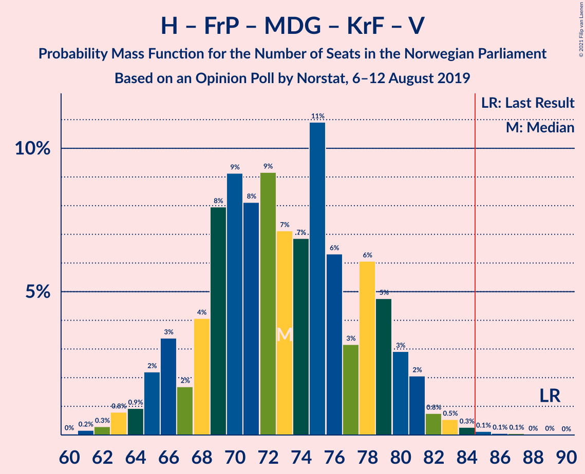

| Number of Seats | Probability | Accumulated | Special Marks |
|:---------------:|:-----------:|:-----------:|:-------------:|
| 62 | 1.3% | 100% |  |
| 63 | 0% | 98.7% |  |
| 64 | 0% | 98.7% |  |
| 65 | 0% | 98.7% |  |
| 66 | 2% | 98.7% |  |
| 67 | 0.1% | 96% |  |
| 68 | 0% | 96% |  |
| 69 | 0% | 96% |  |
| 70 | 0.1% | 96% |  |
| 71 | 0% | 96% |  |
| 72 | 0% | 96% |  |
| 73 | 0% | 96% |  |
| 74 | 2% | 96% |  |
| 75 | 0.3% | 94% |  |
| 76 | 4% | 94% |  |
| 77 | 5% | 90% |  |
| 78 | 0.9% | 84% |  |
| 79 | 0.1% | 83% |  |
| 80 | 83% | 83% | Median |
| 81 | 0% | 0.1% |  |
| 82 | 0% | 0.1% |  |
| 83 | 0% | 0.1% |  |
| 84 | 0% | 0.1% |  |
| 85 | 0% | 0.1% | Majority |
| 86 | 0.1% | 0.1% |  |
| 87 | 0% | 0% |  |
| 88 | 0% | 0% |  |
| 89 | 0% | 0% | Last Result |

### Arbeiderpartiet – Senterpartiet

| Number of Seats | Probability | Accumulated | Special Marks |
|:---------------:|:-----------:|:-----------:|:-------------:|
| 63 | 1.0% | 100% |  |
| 64 | 0.3% | 99.0% |  |
| 65 | 83% | 98.6% | Median |
| 66 | 0% | 15% |  |
| 67 | 0% | 15% |  |
| 68 | 9% | 15% | Last Result |
| 69 | 0.9% | 7% |  |
| 70 | 0.2% | 6% |  |
| 71 | 0% | 6% |  |
| 72 | 0% | 6% |  |
| 73 | 0% | 6% |  |
| 74 | 0% | 6% |  |
| 75 | 0% | 6% |  |
| 76 | 0% | 6% |  |
| 77 | 4% | 6% |  |
| 78 | 0% | 1.4% |  |
| 79 | 1.3% | 1.4% |  |
| 80 | 0.1% | 0.1% |  |
| 81 | 0% | 0% |  |

### Høyre – Fremskrittspartiet – Kristelig Folkeparti – Venstre

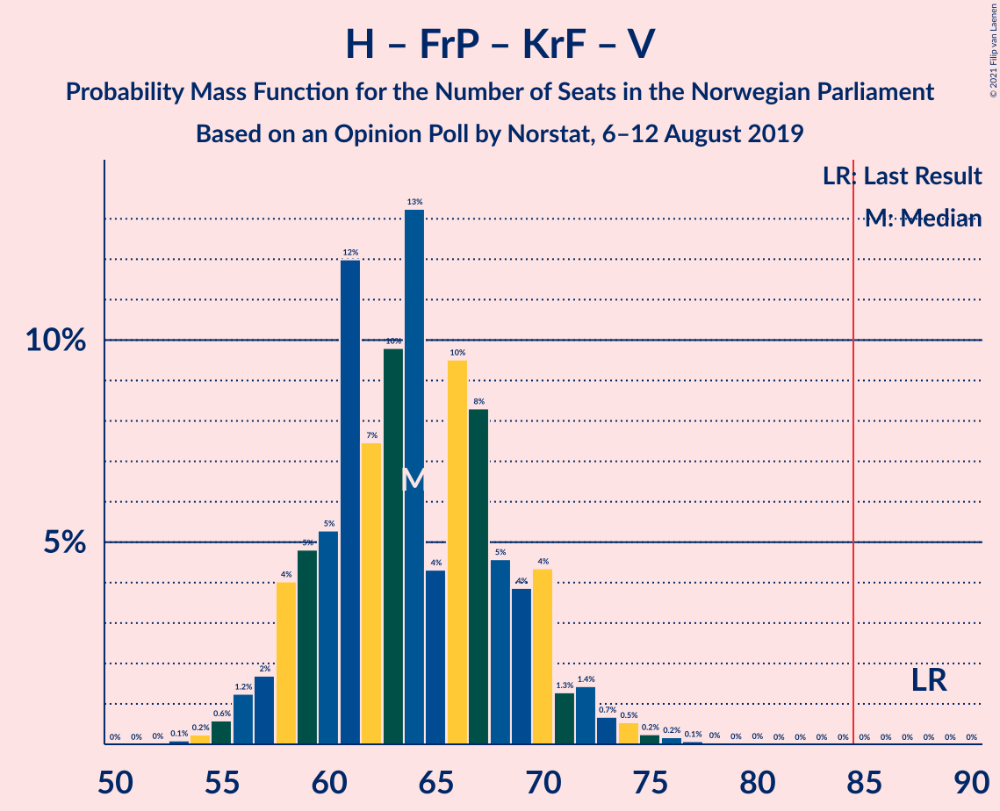

| Number of Seats | Probability | Accumulated | Special Marks |
|:---------------:|:-----------:|:-----------:|:-------------:|
| 52 | 1.3% | 100% |  |
| 53 | 0% | 98.7% |  |
| 54 | 0% | 98.7% |  |
| 55 | 0% | 98.7% |  |
| 56 | 0.1% | 98.7% |  |
| 57 | 0% | 98.6% |  |
| 58 | 2% | 98.6% |  |
| 59 | 0% | 96% |  |
| 60 | 0.1% | 96% |  |
| 61 | 0% | 96% |  |
| 62 | 0% | 96% |  |
| 63 | 0% | 96% |  |
| 64 | 0% | 96% |  |
| 65 | 4% | 96% |  |
| 66 | 0.4% | 92% |  |
| 67 | 4% | 91% |  |
| 68 | 0.9% | 87% |  |
| 69 | 0% | 86% |  |
| 70 | 0.1% | 86% |  |
| 71 | 1.0% | 86% |  |
| 72 | 83% | 85% | Median |
| 73 | 2% | 2% |  |
| 74 | 0% | 0.1% |  |
| 75 | 0% | 0.1% |  |
| 76 | 0.1% | 0.1% |  |
| 77 | 0% | 0% |  |
| 78 | 0% | 0% |  |
| 79 | 0% | 0% |  |
| 80 | 0% | 0% |  |
| 81 | 0% | 0% |  |
| 82 | 0% | 0% |  |
| 83 | 0% | 0% |  |
| 84 | 0% | 0% |  |
| 85 | 0% | 0% | Majority |
| 86 | 0% | 0% |  |
| 87 | 0% | 0% |  |
| 88 | 0% | 0% | Last Result |

### Høyre – Fremskrittspartiet – Venstre

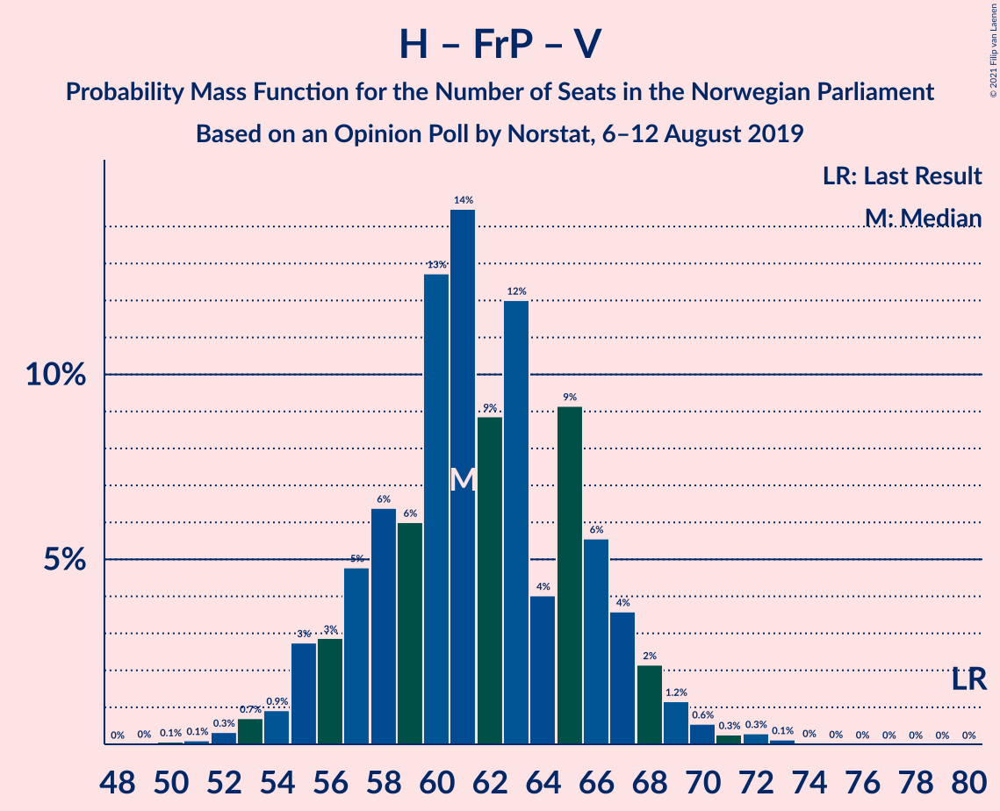

| Number of Seats | Probability | Accumulated | Special Marks |
|:---------------:|:-----------:|:-----------:|:-------------:|
| 49 | 1.3% | 100% |  |
| 50 | 0% | 98.7% |  |
| 51 | 0% | 98.7% |  |
| 52 | 0% | 98.7% |  |
| 53 | 0% | 98.7% |  |
| 54 | 0% | 98.7% |  |
| 55 | 0% | 98.7% |  |
| 56 | 0.1% | 98.7% |  |
| 57 | 2% | 98.6% |  |
| 58 | 0% | 96% |  |
| 59 | 0% | 96% |  |
| 60 | 0% | 96% |  |
| 61 | 0% | 96% |  |
| 62 | 4% | 96% |  |
| 63 | 0% | 92% |  |
| 64 | 0.1% | 92% |  |
| 65 | 0% | 91% |  |
| 66 | 2% | 91% |  |
| 67 | 5% | 89% |  |
| 68 | 0% | 84% |  |
| 69 | 0% | 84% |  |
| 70 | 1.0% | 84% |  |
| 71 | 83% | 83% | Median |
| 72 | 0% | 0.1% |  |
| 73 | 0% | 0.1% |  |
| 74 | 0% | 0.1% |  |
| 75 | 0.1% | 0.1% |  |
| 76 | 0% | 0% |  |
| 77 | 0% | 0% |  |
| 78 | 0% | 0% |  |
| 79 | 0% | 0% |  |
| 80 | 0% | 0% | Last Result |

### Høyre – Fremskrittspartiet

| Number of Seats | Probability | Accumulated | Special Marks |
|:---------------:|:-----------:|:-----------:|:-------------:|
| 48 | 1.3% | 100% |  |
| 49 | 0% | 98.7% |  |
| 50 | 0% | 98.7% |  |
| 51 | 0% | 98.7% |  |
| 52 | 0% | 98.7% |  |
| 53 | 0% | 98.7% |  |
| 54 | 0% | 98.7% |  |
| 55 | 0.1% | 98.7% |  |
| 56 | 0% | 98.5% |  |
| 57 | 2% | 98.5% |  |
| 58 | 0% | 96% |  |
| 59 | 2% | 96% |  |
| 60 | 4% | 94% |  |
| 61 | 0% | 90% |  |
| 62 | 0% | 90% |  |
| 63 | 0% | 90% |  |
| 64 | 0.5% | 90% |  |
| 65 | 5% | 89% |  |
| 66 | 0% | 84% |  |
| 67 | 0% | 84% |  |
| 68 | 1.0% | 84% |  |
| 69 | 83% | 83% | Median |
| 70 | 0% | 0.1% |  |
| 71 | 0% | 0.1% |  |
| 72 | 0% | 0.1% | Last Result |
| 73 | 0% | 0.1% |  |
| 74 | 0% | 0.1% |  |
| 75 | 0.1% | 0.1% |  |
| 76 | 0% | 0% |  |

### Arbeiderpartiet – Sosialistisk Venstreparti

| Number of Seats | Probability | Accumulated | Special Marks |
|:---------------:|:-----------:|:-----------:|:-------------:|
| 46 | 1.0% | 100% |  |
| 47 | 0% | 99.0% |  |
| 48 | 0% | 99.0% |  |
| 49 | 1.0% | 99.0% |  |
| 50 | 0.1% | 98% |  |
| 51 | 83% | 98% | Median |
| 52 | 0% | 15% |  |
| 53 | 0% | 15% |  |
| 54 | 0.1% | 15% |  |
| 55 | 2% | 15% |  |
| 56 | 5% | 12% |  |
| 57 | 0.3% | 8% |  |
| 58 | 0% | 7% |  |
| 59 | 7% | 7% |  |
| 60 | 0% | 0.1% | Last Result |
| 61 | 0% | 0.1% |  |
| 62 | 0% | 0.1% |  |
| 63 | 0% | 0.1% |  |
| 64 | 0% | 0.1% |  |
| 65 | 0% | 0.1% |  |
| 66 | 0% | 0.1% |  |
| 67 | 0.1% | 0.1% |  |
| 68 | 0% | 0% |  |

### Høyre – Kristelig Folkeparti – Venstre

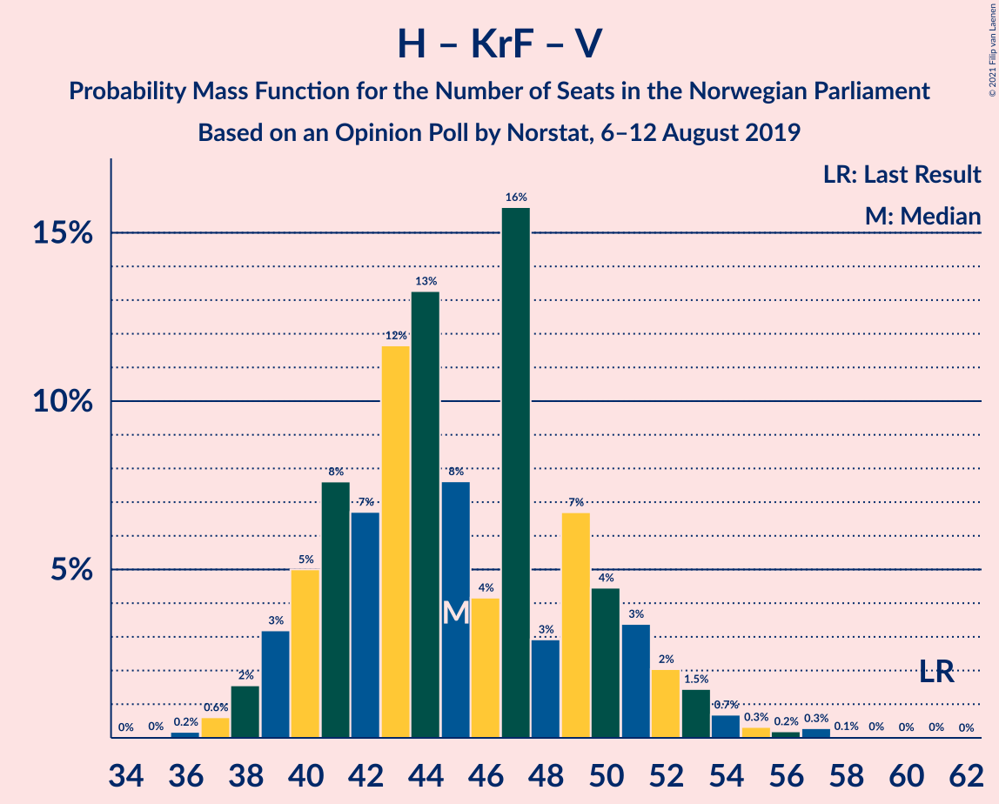

| Number of Seats | Probability | Accumulated | Special Marks |
|:---------------:|:-----------:|:-----------:|:-------------:|
| 34 | 1.3% | 100% |  |
| 35 | 0% | 98.7% |  |
| 36 | 0% | 98.7% |  |
| 37 | 0% | 98.7% |  |
| 38 | 0% | 98.7% |  |
| 39 | 5% | 98.7% |  |
| 40 | 0% | 94% |  |
| 41 | 2% | 94% |  |
| 42 | 0% | 92% |  |
| 43 | 0.4% | 92% |  |
| 44 | 4% | 91% |  |
| 45 | 0% | 87% |  |
| 46 | 1.0% | 87% |  |
| 47 | 83% | 86% | Median |
| 48 | 0% | 3% |  |
| 49 | 0% | 3% |  |
| 50 | 0% | 3% |  |
| 51 | 0% | 3% |  |
| 52 | 2% | 3% |  |
| 53 | 0.9% | 0.9% |  |
| 54 | 0% | 0.1% |  |
| 55 | 0% | 0.1% |  |
| 56 | 0% | 0.1% |  |
| 57 | 0% | 0.1% |  |
| 58 | 0.1% | 0.1% |  |
| 59 | 0% | 0% |  |
| 60 | 0% | 0% |  |
| 61 | 0% | 0% | Last Result |

### Senterpartiet – Kristelig Folkeparti – Venstre

| Number of Seats | Probability | Accumulated | Special Marks |
|:---------------:|:-----------:|:-----------:|:-------------:|
| 21 | 0.4% | 100% |  |
| 22 | 0% | 99.6% |  |
| 23 | 0% | 99.6% |  |
| 24 | 0% | 99.6% |  |
| 25 | 4% | 99.6% |  |
| 26 | 1.1% | 95% |  |
| 27 | 0.1% | 94% |  |
| 28 | 83% | 94% | Median |
| 29 | 0% | 11% |  |
| 30 | 0% | 11% |  |
| 31 | 4% | 11% |  |
| 32 | 2% | 7% |  |
| 33 | 0% | 4% |  |
| 34 | 0.9% | 4% |  |
| 35 | 1.3% | 3% | Last Result |
| 36 | 0% | 2% |  |
| 37 | 0.1% | 2% |  |
| 38 | 0% | 2% |  |
| 39 | 0% | 2% |  |
| 40 | 0% | 2% |  |
| 41 | 0% | 2% |  |
| 42 | 2% | 2% |  |
| 43 | 0% | 0% |  |

## Technical Information

### Opinion Poll

+ **Polling firm:** Norstat
+ **Commissioner(s):** —
+ **Fieldwork period:** 6–12 August 2019

### Calculations

+ **Sample size:** 728
+ **Simulations done:** 1,024
+ **Error estimate:** 5.67%

