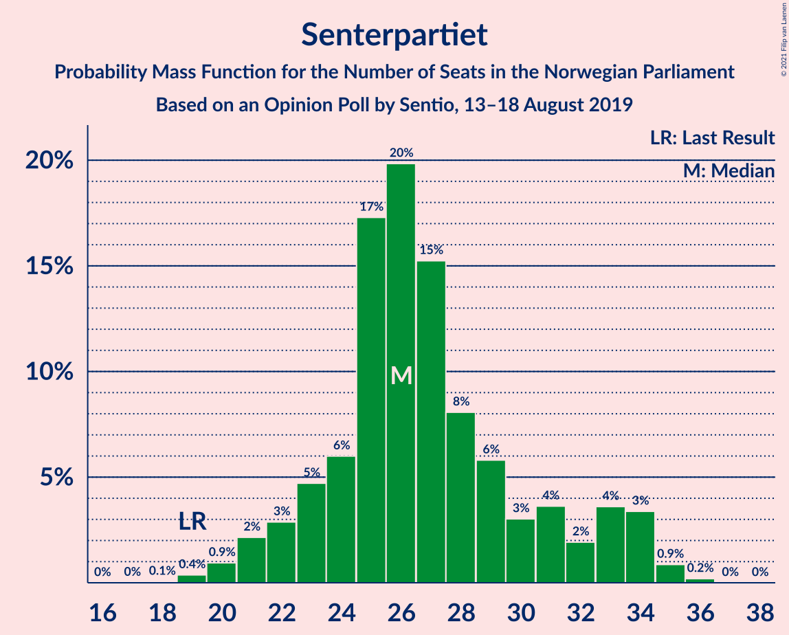
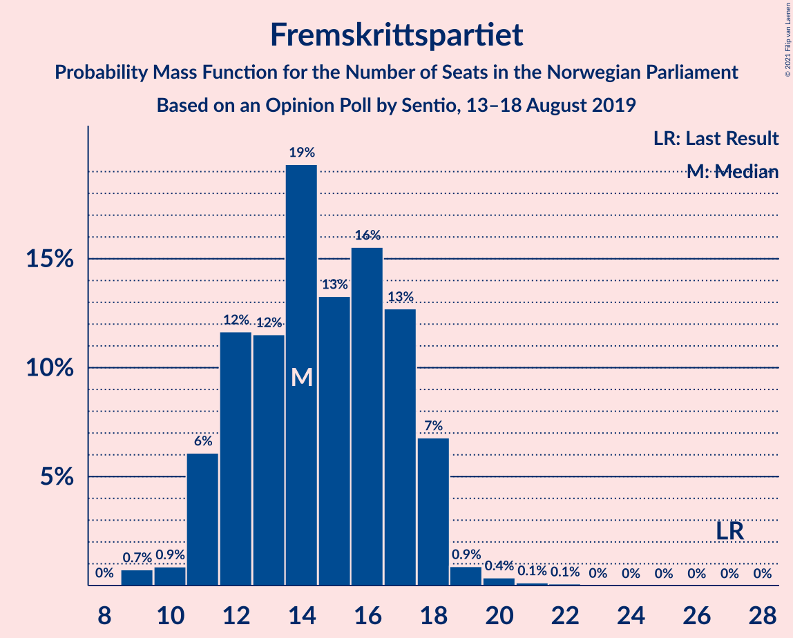
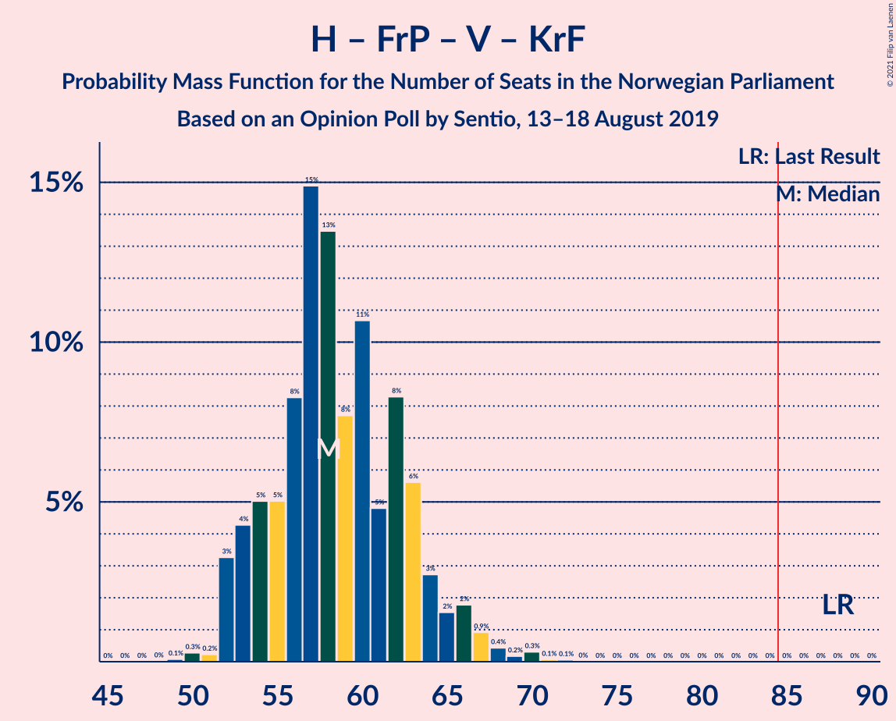

# Opinion Poll by Sentio, 13–18 August 2019

<a href="#voting-intentions">Voting Intentions</a> | <a href="#seats">Seats</a> | <a href="#coalitions">Coalitions</a> | <a href="#technical-information">Technical Information</a>

## Voting Intentions

### Confidence Intervals

| Party | Last Result | Poll Result | 80% Confidence Interval | 90% Confidence Interval | 95% Confidence Interval | 99% Confidence Interval |
|:-----:|:-----------:|:-----------:|:-----------------------:|:-----------------------:|:-----------------------:|:-----------------------:|
| Arbeiderpartiet | 27.4% | 27.3% | 25.5–29.2% |25.0–29.7% |24.6–30.1% |23.8–31.1% |
| Høyre | 25.0% | 20.9% | 19.3–22.6% |18.9–23.1% |18.5–23.5% |17.8–24.4% |
| Senterpartiet | 10.3% | 14.4% | 13.1–15.9% |12.7–16.3% |12.4–16.7% |11.7–17.5% |
| Fremskrittspartiet | 15.2% | 8.9% | 7.8–10.2% |7.5–10.5% |7.3–10.8% |6.8–11.5% |
| Sosialistisk Venstreparti | 6.0% | 6.5% | 5.6–7.6% |5.3–7.9% |5.1–8.2% |4.7–8.8% |
| Miljøpartiet De Grønne | 3.2% | 5.4% | 4.6–6.4% |4.3–6.7% |4.2–7.0% |3.8–7.5% |
| Rødt | 2.4% | 4.8% | 4.0–5.8% |3.8–6.1% |3.6–6.3% |3.3–6.8% |
| Venstre | 4.4% | 3.7% | 3.0–4.6% |2.9–4.8% |2.7–5.1% |2.4–5.5% |
| Kristelig Folkeparti | 4.2% | 3.5% | 2.9–4.4% |2.7–4.6% |2.5–4.8% |2.2–5.3% |

*Note:* The poll result column reflects the actual value used in the calculations. Published results may vary slightly, and in addition be rounded to fewer digits.

## Seats

### Confidence Intervals

| Party | Last Result | Median | 80% Confidence Interval | 90% Confidence Interval | 95% Confidence Interval | 99% Confidence Interval |
|:-----:|:-----------:|:------:|:-----------------------:|:-----------------------:|:-----------------------:|:-----------------------:|
| <a href="#arbeiderpartiet">Arbeiderpartiet</a> | 49 | 52 | 47–57 |46–58 |45–58 |44–59 |
| <a href="#høyre">Høyre</a> | 45 | 37 | 36–39 |35–40 |34–40 |32–45 |
| <a href="#senterpartiet">Senterpartiet</a> | 19 | 26 | 23–31 |22–31 |22–33 |20–35 |
| <a href="#fremskrittspartiet">Fremskrittspartiet</a> | 27 | 16 | 12–17 |12–18 |11–18 |10–19 |
| <a href="#sosialistisk-venstreparti">Sosialistisk Venstreparti</a> | 11 | 9 | 8–12 |8–12 |8–13 |7–15 |
| <a href="#miljøpartiet-de-grønne">Miljøpartiet De Grønne</a> | 1 | 8 | 7–10 |7–10 |7–11 |4–12 |
| <a href="#rødt">Rødt</a> | 1 | 7 | 6–10 |6–10 |2–10 |2–11 |
| <a href="#venstre">Venstre</a> | 8 | 2 | 2–6 |2–7 |2–7 |2–8 |
| <a href="#kristelig-folkeparti">Kristelig Folkeparti</a> | 8 | 3 | 1–6 |1–7 |1–8 |1–8 |

### Arbeiderpartiet

*For a full overview of the results for this party, see the [Arbeiderpartiet](party-arbeiderpartiet.html) page.*

| Number of Seats | Probability | Accumulated | Special Marks |
|:---------------:|:-----------:|:-----------:|:-------------:|
| 42 | 0.1% | 100% |  |
| 43 | 0.4% | 99.9% |  |
| 44 | 2% | 99.5% |  |
| 45 | 2% | 98% |  |
| 46 | 1.2% | 95% |  |
| 47 | 9% | 94% |  |
| 48 | 2% | 85% |  |
| 49 | 12% | 83% | Last Result |
| 50 | 8% | 71% |  |
| 51 | 7% | 63% |  |
| 52 | 11% | 56% | Median |
| 53 | 4% | 44% |  |
| 54 | 5% | 40% |  |
| 55 | 13% | 35% |  |
| 56 | 11% | 22% |  |
| 57 | 3% | 11% |  |
| 58 | 7% | 8% |  |
| 59 | 1.4% | 2% |  |
| 60 | 0.2% | 0.2% |  |
| 61 | 0% | 0% |  |

### Høyre

*For a full overview of the results for this party, see the [Høyre](party-høyre.html) page.*

| Number of Seats | Probability | Accumulated | Special Marks |
|:---------------:|:-----------:|:-----------:|:-------------:|
| 30 | 0.1% | 100% |  |
| 31 | 0.1% | 99.9% |  |
| 32 | 0.3% | 99.8% |  |
| 33 | 2% | 99.5% |  |
| 34 | 1.2% | 98% |  |
| 35 | 4% | 97% |  |
| 36 | 27% | 93% |  |
| 37 | 24% | 66% | Median |
| 38 | 19% | 42% |  |
| 39 | 16% | 23% |  |
| 40 | 4% | 7% |  |
| 41 | 0.6% | 2% |  |
| 42 | 0.4% | 2% |  |
| 43 | 0.2% | 1.2% |  |
| 44 | 0.4% | 1.1% |  |
| 45 | 0.3% | 0.6% | Last Result |
| 46 | 0.2% | 0.3% |  |
| 47 | 0% | 0.1% |  |
| 48 | 0.1% | 0.1% |  |
| 49 | 0% | 0% |  |

### Senterpartiet

*For a full overview of the results for this party, see the [Senterpartiet](party-senterpartiet.html) page.*

| Number of Seats | Probability | Accumulated | Special Marks |
|:---------------:|:-----------:|:-----------:|:-------------:|
| 19 | 0.3% | 100% | Last Result |
| 20 | 0.3% | 99.6% |  |
| 21 | 0.6% | 99.3% |  |
| 22 | 5% | 98.7% |  |
| 23 | 5% | 93% |  |
| 24 | 12% | 88% |  |
| 25 | 23% | 76% |  |
| 26 | 8% | 53% | Median |
| 27 | 24% | 44% |  |
| 28 | 8% | 20% |  |
| 29 | 0.6% | 13% |  |
| 30 | 0.8% | 12% |  |
| 31 | 7% | 11% |  |
| 32 | 1.4% | 5% |  |
| 33 | 2% | 3% |  |
| 34 | 0.6% | 1.4% |  |
| 35 | 0.6% | 0.8% |  |
| 36 | 0.2% | 0.2% |  |
| 37 | 0% | 0% |  |

### Fremskrittspartiet

*For a full overview of the results for this party, see the [Fremskrittspartiet](party-fremskrittspartiet.html) page.*

| Number of Seats | Probability | Accumulated | Special Marks |
|:---------------:|:-----------:|:-----------:|:-------------:|
| 8 | 0.1% | 100% |  |
| 9 | 0.3% | 99.9% |  |
| 10 | 0.4% | 99.6% |  |
| 11 | 3% | 99.2% |  |
| 12 | 10% | 97% |  |
| 13 | 6% | 86% |  |
| 14 | 5% | 81% |  |
| 15 | 18% | 76% |  |
| 16 | 32% | 58% | Median |
| 17 | 19% | 26% |  |
| 18 | 7% | 7% |  |
| 19 | 0.3% | 0.5% |  |
| 20 | 0.1% | 0.3% |  |
| 21 | 0.1% | 0.2% |  |
| 22 | 0% | 0% |  |
| 23 | 0% | 0% |  |
| 24 | 0% | 0% |  |
| 25 | 0% | 0% |  |
| 26 | 0% | 0% |  |
| 27 | 0% | 0% | Last Result |

### Sosialistisk Venstreparti

*For a full overview of the results for this party, see the [Sosialistisk Venstreparti](party-sosialistiskvenstreparti.html) page.*

| Number of Seats | Probability | Accumulated | Special Marks |
|:---------------:|:-----------:|:-----------:|:-------------:|
| 6 | 0.1% | 100% |  |
| 7 | 0.9% | 99.9% |  |
| 8 | 23% | 99.0% |  |
| 9 | 29% | 76% | Median |
| 10 | 14% | 46% |  |
| 11 | 20% | 32% | Last Result |
| 12 | 7% | 12% |  |
| 13 | 3% | 5% |  |
| 14 | 0.5% | 1.3% |  |
| 15 | 0.7% | 0.8% |  |
| 16 | 0.1% | 0.1% |  |
| 17 | 0% | 0% |  |

### Miljøpartiet De Grønne

*For a full overview of the results for this party, see the [Miljøpartiet De Grønne](party-miljøpartietdegrønne.html) page.*

| Number of Seats | Probability | Accumulated | Special Marks |
|:---------------:|:-----------:|:-----------:|:-------------:|
| 1 | 0% | 100% | Last Result |
| 2 | 0.3% | 100% |  |
| 3 | 0.1% | 99.7% |  |
| 4 | 0.2% | 99.6% |  |
| 5 | 0% | 99.3% |  |
| 6 | 2% | 99.3% |  |
| 7 | 25% | 98% |  |
| 8 | 31% | 73% | Median |
| 9 | 32% | 42% |  |
| 10 | 7% | 11% |  |
| 11 | 1.1% | 3% |  |
| 12 | 2% | 2% |  |
| 13 | 0.4% | 0.4% |  |
| 14 | 0% | 0% |  |

### Rødt

*For a full overview of the results for this party, see the [Rødt](party-rødt.html) page.*

| Number of Seats | Probability | Accumulated | Special Marks |
|:---------------:|:-----------:|:-----------:|:-------------:|
| 1 | 0% | 100% | Last Result |
| 2 | 5% | 100% |  |
| 3 | 0% | 95% |  |
| 4 | 0% | 95% |  |
| 5 | 0% | 95% |  |
| 6 | 41% | 95% |  |
| 7 | 15% | 54% | Median |
| 8 | 12% | 39% |  |
| 9 | 12% | 27% |  |
| 10 | 15% | 16% |  |
| 11 | 0.4% | 0.5% |  |
| 12 | 0.2% | 0.2% |  |
| 13 | 0% | 0% |  |

### Venstre

*For a full overview of the results for this party, see the [Venstre](party-venstre.html) page.*

| Number of Seats | Probability | Accumulated | Special Marks |
|:---------------:|:-----------:|:-----------:|:-------------:|
| 1 | 0.4% | 100% |  |
| 2 | 65% | 99.6% | Median |
| 3 | 5% | 35% |  |
| 4 | 0.4% | 29% |  |
| 5 | 0.3% | 29% |  |
| 6 | 20% | 29% |  |
| 7 | 7% | 9% |  |
| 8 | 2% | 2% | Last Result |
| 9 | 0.3% | 0.4% |  |
| 10 | 0% | 0% |  |

### Kristelig Folkeparti

*For a full overview of the results for this party, see the [Kristelig Folkeparti](party-kristeligfolkeparti.html) page.*

| Number of Seats | Probability | Accumulated | Special Marks |
|:---------------:|:-----------:|:-----------:|:-------------:|
| 0 | 0.5% | 100% |  |
| 1 | 31% | 99.5% |  |
| 2 | 4% | 69% |  |
| 3 | 37% | 65% | Median |
| 4 | 0% | 27% |  |
| 5 | 0.1% | 27% |  |
| 6 | 22% | 27% |  |
| 7 | 2% | 5% |  |
| 8 | 3% | 3% | Last Result |
| 9 | 0.1% | 0.1% |  |
| 10 | 0% | 0% |  |

## Coalitions

### Confidence Intervals

| Coalition | Last Result | Median | Majority? | 80% Confidence Interval | 90% Confidence Interval | 95% Confidence Interval | 99% Confidence Interval |
|:---------:|:-----------:|:------:|:---------:|:-----------------------:|:-----------------------:|:-----------------------:|:-----------------------:|
| Arbeiderpartiet – Senterpartiet – Sosialistisk Venstreparti – Miljøpartiet De Grønne – Rødt | 81 | 103 | 100% | 98–108 | 98–110 | 98–111 | 95–113 |
| Arbeiderpartiet – Senterpartiet – Sosialistisk Venstreparti – Miljøpartiet De Grønne – Kristelig Folkeparti | 88 | 98 | 100% | 97–104 | 94–106 | 94–107 | 90–110 |
| Arbeiderpartiet – Senterpartiet – Sosialistisk Venstreparti – Miljøpartiet De Grønne | 80 | 97 | 99.9% | 92–100 | 91–103 | 91–103 | 87–106 |
| Arbeiderpartiet – Senterpartiet – Sosialistisk Venstreparti – Rødt | 80 | 96 | 99.8% | 91–99 | 91–101 | 90–102 | 87–104 |
| Arbeiderpartiet – Senterpartiet – Miljøpartiet De Grønne – Kristelig Folkeparti | 77 | 89 | 95% | 87–93 | 84–96 | 84–97 | 80–98 |
| Arbeiderpartiet – Senterpartiet – Sosialistisk Venstreparti | 79 | 88 | 93% | 85–91 | 84–94 | 84–95 | 79–97 |
| Høyre – Senterpartiet – Fremskrittspartiet – Venstre – Kristelig Folkeparti | 107 | 85 | 56% | 81–92 | 79–93 | 77–93 | 77–97 |
| Arbeiderpartiet – Senterpartiet – Kristelig Folkeparti | 76 | 81 | 10% | 79–85 | 77–87 | 77–89 | 72–90 |
| Arbeiderpartiet – Senterpartiet | 68 | 78 | 3% | 75–81 | 74–83 | 73–85 | 69–86 |
| Høyre – Fremskrittspartiet – Miljøpartiet De Grønne – Venstre – Kristelig Folkeparti | 89 | 67 | 0% | 62–71 | 61–73 | 61–73 | 59–77 |
| Arbeiderpartiet – Sosialistisk Venstreparti | 60 | 61 | 0% | 57–66 | 56–67 | 54–68 | 53–70 |
| Høyre – Fremskrittspartiet – Venstre – Kristelig Folkeparti | 88 | 58 | 0% | 54–64 | 54–66 | 53–66 | 50–67 |
| Høyre – Fremskrittspartiet – Venstre | 80 | 56 | 0% | 51–59 | 50–60 | 49–60 | 47–65 |
| Høyre – Fremskrittspartiet | 72 | 53 | 0% | 49–55 | 48–55 | 47–56 | 45–61 |
| Høyre – Venstre – Kristelig Folkeparti | 61 | 43 | 0% | 40–48 | 39–49 | 39–50 | 38–53 |
| Senterpartiet – Venstre – Kristelig Folkeparti | 35 | 32 | 0% | 27–39 | 27–39 | 27–43 | 26–44 |

### Arbeiderpartiet – Senterpartiet – Sosialistisk Venstreparti – Miljøpartiet De Grønne – Rødt

| Number of Seats | Probability | Accumulated | Special Marks |
|:---------------:|:-----------:|:-----------:|:-------------:|
| 81 | 0% | 100% | Last Result |
| 82 | 0% | 100% |  |
| 83 | 0% | 100% |  |
| 84 | 0% | 100% |  |
| 85 | 0% | 100% | Majority |
| 86 | 0% | 100% |  |
| 87 | 0% | 100% |  |
| 88 | 0% | 100% |  |
| 89 | 0% | 100% |  |
| 90 | 0% | 100% |  |
| 91 | 0.1% | 100% |  |
| 92 | 0.1% | 99.8% |  |
| 93 | 0% | 99.8% |  |
| 94 | 0.2% | 99.7% |  |
| 95 | 0.4% | 99.5% |  |
| 96 | 0.1% | 99.2% |  |
| 97 | 1.2% | 99.1% |  |
| 98 | 10% | 98% |  |
| 99 | 5% | 88% |  |
| 100 | 11% | 83% |  |
| 101 | 3% | 72% |  |
| 102 | 1.3% | 70% | Median |
| 103 | 22% | 68% |  |
| 104 | 4% | 47% |  |
| 105 | 17% | 43% |  |
| 106 | 5% | 26% |  |
| 107 | 10% | 20% |  |
| 108 | 3% | 10% |  |
| 109 | 0.9% | 7% |  |
| 110 | 3% | 7% |  |
| 111 | 2% | 4% |  |
| 112 | 0.8% | 2% |  |
| 113 | 0.8% | 1.2% |  |
| 114 | 0.3% | 0.4% |  |
| 115 | 0% | 0.1% |  |
| 116 | 0% | 0% |  |

### Arbeiderpartiet – Senterpartiet – Sosialistisk Venstreparti – Miljøpartiet De Grønne – Kristelig Folkeparti

| Number of Seats | Probability | Accumulated | Special Marks |
|:---------------:|:-----------:|:-----------:|:-------------:|
| 87 | 0.1% | 100% |  |
| 88 | 0.1% | 99.9% | Last Result |
| 89 | 0.1% | 99.8% |  |
| 90 | 0.4% | 99.7% |  |
| 91 | 0.1% | 99.3% |  |
| 92 | 0.2% | 99.2% |  |
| 93 | 0.4% | 99.1% |  |
| 94 | 4% | 98.7% |  |
| 95 | 0.3% | 94% |  |
| 96 | 1.3% | 94% |  |
| 97 | 4% | 93% |  |
| 98 | 41% | 89% | Median |
| 99 | 5% | 49% |  |
| 100 | 21% | 44% |  |
| 101 | 5% | 23% |  |
| 102 | 6% | 19% |  |
| 103 | 2% | 13% |  |
| 104 | 1.2% | 11% |  |
| 105 | 3% | 10% |  |
| 106 | 3% | 6% |  |
| 107 | 2% | 4% |  |
| 108 | 0.7% | 2% |  |
| 109 | 0.4% | 1.0% |  |
| 110 | 0.1% | 0.6% |  |
| 111 | 0.4% | 0.5% |  |
| 112 | 0% | 0.1% |  |
| 113 | 0% | 0.1% |  |
| 114 | 0% | 0.1% |  |
| 115 | 0% | 0% |  |

### Arbeiderpartiet – Senterpartiet – Sosialistisk Venstreparti – Miljøpartiet De Grønne

| Number of Seats | Probability | Accumulated | Special Marks |
|:---------------:|:-----------:|:-----------:|:-------------:|
| 80 | 0% | 100% | Last Result |
| 81 | 0% | 100% |  |
| 82 | 0% | 100% |  |
| 83 | 0% | 100% |  |
| 84 | 0.1% | 99.9% |  |
| 85 | 0.1% | 99.9% | Majority |
| 86 | 0% | 99.8% |  |
| 87 | 0.4% | 99.7% |  |
| 88 | 0.1% | 99.4% |  |
| 89 | 0.2% | 99.2% |  |
| 90 | 0.3% | 99.1% |  |
| 91 | 4% | 98.8% |  |
| 92 | 8% | 95% |  |
| 93 | 3% | 87% |  |
| 94 | 13% | 84% |  |
| 95 | 16% | 71% | Median |
| 96 | 3% | 55% |  |
| 97 | 26% | 52% |  |
| 98 | 5% | 26% |  |
| 99 | 11% | 21% |  |
| 100 | 0.8% | 10% |  |
| 101 | 0.8% | 9% |  |
| 102 | 3% | 9% |  |
| 103 | 3% | 5% |  |
| 104 | 1.0% | 2% |  |
| 105 | 0.6% | 1.3% |  |
| 106 | 0.2% | 0.7% |  |
| 107 | 0.1% | 0.5% |  |
| 108 | 0.4% | 0.4% |  |
| 109 | 0% | 0% |  |

### Arbeiderpartiet – Senterpartiet – Sosialistisk Venstreparti – Rødt

| Number of Seats | Probability | Accumulated | Special Marks |
|:---------------:|:-----------:|:-----------:|:-------------:|
| 80 | 0% | 100% | Last Result |
| 81 | 0% | 100% |  |
| 82 | 0.1% | 100% |  |
| 83 | 0.1% | 99.9% |  |
| 84 | 0.1% | 99.8% |  |
| 85 | 0.1% | 99.8% | Majority |
| 86 | 0.1% | 99.6% |  |
| 87 | 0.6% | 99.5% |  |
| 88 | 0.3% | 99.0% |  |
| 89 | 0.2% | 98.6% |  |
| 90 | 1.3% | 98% |  |
| 91 | 23% | 97% |  |
| 92 | 4% | 74% |  |
| 93 | 1.2% | 70% |  |
| 94 | 12% | 69% | Median |
| 95 | 6% | 57% |  |
| 96 | 11% | 51% |  |
| 97 | 18% | 40% |  |
| 98 | 3% | 22% |  |
| 99 | 10% | 19% |  |
| 100 | 1.3% | 9% |  |
| 101 | 4% | 8% |  |
| 102 | 3% | 4% |  |
| 103 | 0.1% | 0.8% |  |
| 104 | 0.4% | 0.7% |  |
| 105 | 0.2% | 0.4% |  |
| 106 | 0.2% | 0.2% |  |
| 107 | 0% | 0% |  |

### Arbeiderpartiet – Senterpartiet – Miljøpartiet De Grønne – Kristelig Folkeparti

| Number of Seats | Probability | Accumulated | Special Marks |
|:---------------:|:-----------:|:-----------:|:-------------:|
| 77 | 0.1% | 100% | Last Result |
| 78 | 0.1% | 99.9% |  |
| 79 | 0.1% | 99.8% |  |
| 80 | 0.5% | 99.8% |  |
| 81 | 0.1% | 99.3% |  |
| 82 | 0.6% | 99.2% |  |
| 83 | 0.2% | 98.6% |  |
| 84 | 4% | 98% |  |
| 85 | 1.1% | 95% | Majority |
| 86 | 3% | 94% |  |
| 87 | 13% | 91% |  |
| 88 | 6% | 78% |  |
| 89 | 25% | 73% | Median |
| 90 | 12% | 48% |  |
| 91 | 6% | 35% |  |
| 92 | 17% | 29% |  |
| 93 | 3% | 11% |  |
| 94 | 2% | 9% |  |
| 95 | 1.4% | 7% |  |
| 96 | 0.4% | 5% |  |
| 97 | 4% | 5% |  |
| 98 | 0.7% | 1.2% |  |
| 99 | 0.2% | 0.4% |  |
| 100 | 0.1% | 0.2% |  |
| 101 | 0.1% | 0.1% |  |
| 102 | 0% | 0% |  |

### Arbeiderpartiet – Senterpartiet – Sosialistisk Venstreparti

| Number of Seats | Probability | Accumulated | Special Marks |
|:---------------:|:-----------:|:-----------:|:-------------:|
| 75 | 0.1% | 100% |  |
| 76 | 0.1% | 99.9% |  |
| 77 | 0.1% | 99.8% |  |
| 78 | 0% | 99.7% |  |
| 79 | 0.4% | 99.7% | Last Result |
| 80 | 0.1% | 99.3% |  |
| 81 | 0.4% | 99.3% |  |
| 82 | 0.4% | 98.9% |  |
| 83 | 0.7% | 98.5% |  |
| 84 | 4% | 98% |  |
| 85 | 22% | 93% | Majority |
| 86 | 1.4% | 72% |  |
| 87 | 18% | 70% | Median |
| 88 | 15% | 53% |  |
| 89 | 4% | 37% |  |
| 90 | 18% | 34% |  |
| 91 | 6% | 16% |  |
| 92 | 3% | 10% |  |
| 93 | 0.8% | 7% |  |
| 94 | 1.0% | 6% |  |
| 95 | 4% | 5% |  |
| 96 | 0.1% | 1.1% |  |
| 97 | 0.7% | 1.0% |  |
| 98 | 0.2% | 0.2% |  |
| 99 | 0% | 0% |  |

### Høyre – Senterpartiet – Fremskrittspartiet – Venstre – Kristelig Folkeparti

| Number of Seats | Probability | Accumulated | Special Marks |
|:---------------:|:-----------:|:-----------:|:-------------:|
| 74 | 0.1% | 100% |  |
| 75 | 0% | 99.9% |  |
| 76 | 0% | 99.9% |  |
| 77 | 4% | 99.8% |  |
| 78 | 0.2% | 96% |  |
| 79 | 5% | 96% |  |
| 80 | 0.7% | 91% |  |
| 81 | 6% | 90% |  |
| 82 | 12% | 84% |  |
| 83 | 2% | 73% |  |
| 84 | 14% | 70% | Median |
| 85 | 13% | 56% | Majority |
| 86 | 2% | 43% |  |
| 87 | 16% | 41% |  |
| 88 | 5% | 25% |  |
| 89 | 7% | 20% |  |
| 90 | 1.4% | 14% |  |
| 91 | 0.7% | 12% |  |
| 92 | 3% | 11% |  |
| 93 | 7% | 8% |  |
| 94 | 0.3% | 2% |  |
| 95 | 0.3% | 1.4% |  |
| 96 | 0.1% | 1.1% |  |
| 97 | 0.8% | 0.9% |  |
| 98 | 0.1% | 0.1% |  |
| 99 | 0% | 0% |  |
| 100 | 0% | 0% |  |
| 101 | 0% | 0% |  |
| 102 | 0% | 0% |  |
| 103 | 0% | 0% |  |
| 104 | 0% | 0% |  |
| 105 | 0% | 0% |  |
| 106 | 0% | 0% |  |
| 107 | 0% | 0% | Last Result |

### Arbeiderpartiet – Senterpartiet – Kristelig Folkeparti

| Number of Seats | Probability | Accumulated | Special Marks |
|:---------------:|:-----------:|:-----------:|:-------------:|
| 68 | 0.1% | 100% |  |
| 69 | 0.1% | 99.9% |  |
| 70 | 0.1% | 99.8% |  |
| 71 | 0.1% | 99.7% |  |
| 72 | 0.4% | 99.6% |  |
| 73 | 0.1% | 99.2% |  |
| 74 | 0.4% | 99.2% |  |
| 75 | 0.3% | 98.7% |  |
| 76 | 0.7% | 98% | Last Result |
| 77 | 5% | 98% |  |
| 78 | 2% | 93% |  |
| 79 | 18% | 91% |  |
| 80 | 15% | 74% |  |
| 81 | 10% | 59% | Median |
| 82 | 10% | 49% |  |
| 83 | 23% | 39% |  |
| 84 | 6% | 16% |  |
| 85 | 3% | 10% | Majority |
| 86 | 0.5% | 7% |  |
| 87 | 2% | 7% |  |
| 88 | 0.5% | 5% |  |
| 89 | 2% | 4% |  |
| 90 | 2% | 2% |  |
| 91 | 0.1% | 0.2% |  |
| 92 | 0% | 0.1% |  |
| 93 | 0% | 0% |  |

### Arbeiderpartiet – Senterpartiet

| Number of Seats | Probability | Accumulated | Special Marks |
|:---------------:|:-----------:|:-----------:|:-------------:|
| 65 | 0.1% | 100% |  |
| 66 | 0.1% | 99.9% |  |
| 67 | 0% | 99.9% |  |
| 68 | 0.1% | 99.8% | Last Result |
| 69 | 0.4% | 99.7% |  |
| 70 | 0.2% | 99.3% |  |
| 71 | 0.3% | 99.1% |  |
| 72 | 0.8% | 98.8% |  |
| 73 | 0.9% | 98% |  |
| 74 | 5% | 97% |  |
| 75 | 5% | 92% |  |
| 76 | 14% | 88% |  |
| 77 | 17% | 74% |  |
| 78 | 10% | 56% | Median |
| 79 | 17% | 46% |  |
| 80 | 7% | 29% |  |
| 81 | 12% | 22% |  |
| 82 | 4% | 10% |  |
| 83 | 0.7% | 6% |  |
| 84 | 2% | 5% |  |
| 85 | 0.4% | 3% | Majority |
| 86 | 2% | 2% |  |
| 87 | 0% | 0.2% |  |
| 88 | 0% | 0.2% |  |
| 89 | 0.1% | 0.1% |  |
| 90 | 0% | 0% |  |

### Høyre – Fremskrittspartiet – Miljøpartiet De Grønne – Venstre – Kristelig Folkeparti

| Number of Seats | Probability | Accumulated | Special Marks |
|:---------------:|:-----------:|:-----------:|:-------------:|
| 54 | 0.1% | 100% |  |
| 55 | 0% | 99.9% |  |
| 56 | 0% | 99.9% |  |
| 57 | 0% | 99.9% |  |
| 58 | 0.2% | 99.8% |  |
| 59 | 0.2% | 99.6% |  |
| 60 | 0.9% | 99.5% |  |
| 61 | 4% | 98.5% |  |
| 62 | 5% | 95% |  |
| 63 | 3% | 90% |  |
| 64 | 2% | 87% |  |
| 65 | 18% | 85% |  |
| 66 | 1.4% | 67% | Median |
| 67 | 24% | 65% |  |
| 68 | 5% | 42% |  |
| 69 | 4% | 37% |  |
| 70 | 7% | 32% |  |
| 71 | 15% | 25% |  |
| 72 | 1.3% | 10% |  |
| 73 | 7% | 9% |  |
| 74 | 0.4% | 2% |  |
| 75 | 0.6% | 2% |  |
| 76 | 0.6% | 1.1% |  |
| 77 | 0.2% | 0.5% |  |
| 78 | 0.1% | 0.3% |  |
| 79 | 0.1% | 0.2% |  |
| 80 | 0.1% | 0.1% |  |
| 81 | 0% | 0% |  |
| 82 | 0% | 0% |  |
| 83 | 0% | 0% |  |
| 84 | 0% | 0% |  |
| 85 | 0% | 0% | Majority |
| 86 | 0% | 0% |  |
| 87 | 0% | 0% |  |
| 88 | 0% | 0% |  |
| 89 | 0% | 0% | Last Result |

### Arbeiderpartiet – Sosialistisk Venstreparti

| Number of Seats | Probability | Accumulated | Special Marks |
|:---------------:|:-----------:|:-----------:|:-------------:|
| 51 | 0% | 100% |  |
| 52 | 0.1% | 99.9% |  |
| 53 | 1.0% | 99.9% |  |
| 54 | 2% | 98.9% |  |
| 55 | 2% | 97% |  |
| 56 | 0.7% | 96% |  |
| 57 | 5% | 95% |  |
| 58 | 8% | 90% |  |
| 59 | 9% | 82% |  |
| 60 | 22% | 73% | Last Result |
| 61 | 3% | 51% | Median |
| 62 | 2% | 48% |  |
| 63 | 3% | 46% |  |
| 64 | 13% | 42% |  |
| 65 | 15% | 29% |  |
| 66 | 5% | 15% |  |
| 67 | 7% | 10% |  |
| 68 | 0.4% | 3% |  |
| 69 | 0.6% | 2% |  |
| 70 | 2% | 2% |  |
| 71 | 0.2% | 0.2% |  |
| 72 | 0% | 0% |  |

### Høyre – Fremskrittspartiet – Venstre – Kristelig Folkeparti

| Number of Seats | Probability | Accumulated | Special Marks |
|:---------------:|:-----------:|:-----------:|:-------------:|
| 49 | 0.1% | 100% |  |
| 50 | 0.8% | 99.9% |  |
| 51 | 0.2% | 99.1% |  |
| 52 | 0.2% | 98.9% |  |
| 53 | 3% | 98.7% |  |
| 54 | 7% | 96% |  |
| 55 | 0.9% | 89% |  |
| 56 | 7% | 88% |  |
| 57 | 18% | 80% |  |
| 58 | 14% | 63% | Median |
| 59 | 2% | 49% |  |
| 60 | 10% | 47% |  |
| 61 | 4% | 37% |  |
| 62 | 20% | 33% |  |
| 63 | 3% | 13% |  |
| 64 | 3% | 10% |  |
| 65 | 0.4% | 8% |  |
| 66 | 6% | 7% |  |
| 67 | 0.5% | 1.0% |  |
| 68 | 0.2% | 0.5% |  |
| 69 | 0.1% | 0.3% |  |
| 70 | 0.1% | 0.3% |  |
| 71 | 0.1% | 0.2% |  |
| 72 | 0% | 0% |  |
| 73 | 0% | 0% |  |
| 74 | 0% | 0% |  |
| 75 | 0% | 0% |  |
| 76 | 0% | 0% |  |
| 77 | 0% | 0% |  |
| 78 | 0% | 0% |  |
| 79 | 0% | 0% |  |
| 80 | 0% | 0% |  |
| 81 | 0% | 0% |  |
| 82 | 0% | 0% |  |
| 83 | 0% | 0% |  |
| 84 | 0% | 0% |  |
| 85 | 0% | 0% | Majority |
| 86 | 0% | 0% |  |
| 87 | 0% | 0% |  |
| 88 | 0% | 0% | Last Result |

### Høyre – Fremskrittspartiet – Venstre

| Number of Seats | Probability | Accumulated | Special Marks |
|:---------------:|:-----------:|:-----------:|:-------------:|
| 46 | 0.1% | 100% |  |
| 47 | 0.9% | 99.9% |  |
| 48 | 0.2% | 99.0% |  |
| 49 | 1.3% | 98.8% |  |
| 50 | 3% | 97% |  |
| 51 | 7% | 95% |  |
| 52 | 0.7% | 88% |  |
| 53 | 2% | 87% |  |
| 54 | 14% | 85% |  |
| 55 | 9% | 70% | Median |
| 56 | 16% | 61% |  |
| 57 | 17% | 45% |  |
| 58 | 3% | 28% |  |
| 59 | 15% | 25% |  |
| 60 | 8% | 10% |  |
| 61 | 0.6% | 2% |  |
| 62 | 0.2% | 1.3% |  |
| 63 | 0.1% | 1.1% |  |
| 64 | 0.4% | 1.0% |  |
| 65 | 0.2% | 0.5% |  |
| 66 | 0% | 0.3% |  |
| 67 | 0.1% | 0.3% |  |
| 68 | 0.2% | 0.2% |  |
| 69 | 0% | 0% |  |
| 70 | 0% | 0% |  |
| 71 | 0% | 0% |  |
| 72 | 0% | 0% |  |
| 73 | 0% | 0% |  |
| 74 | 0% | 0% |  |
| 75 | 0% | 0% |  |
| 76 | 0% | 0% |  |
| 77 | 0% | 0% |  |
| 78 | 0% | 0% |  |
| 79 | 0% | 0% |  |
| 80 | 0% | 0% | Last Result |

### Høyre – Fremskrittspartiet

| Number of Seats | Probability | Accumulated | Special Marks |
|:---------------:|:-----------:|:-----------:|:-------------:|
| 44 | 0.1% | 100% |  |
| 45 | 1.0% | 99.9% |  |
| 46 | 0.6% | 98.9% |  |
| 47 | 2% | 98% |  |
| 48 | 4% | 96% |  |
| 49 | 8% | 93% |  |
| 50 | 2% | 84% |  |
| 51 | 3% | 82% |  |
| 52 | 18% | 80% |  |
| 53 | 20% | 61% | Median |
| 54 | 24% | 41% |  |
| 55 | 14% | 17% |  |
| 56 | 0.5% | 3% |  |
| 57 | 0.4% | 2% |  |
| 58 | 0.6% | 2% |  |
| 59 | 0.4% | 1.2% |  |
| 60 | 0.2% | 0.8% |  |
| 61 | 0.4% | 0.6% |  |
| 62 | 0.2% | 0.2% |  |
| 63 | 0% | 0% |  |
| 64 | 0% | 0% |  |
| 65 | 0% | 0% |  |
| 66 | 0% | 0% |  |
| 67 | 0% | 0% |  |
| 68 | 0% | 0% |  |
| 69 | 0% | 0% |  |
| 70 | 0% | 0% |  |
| 71 | 0% | 0% |  |
| 72 | 0% | 0% | Last Result |

### Høyre – Venstre – Kristelig Folkeparti

| Number of Seats | Probability | Accumulated | Special Marks |
|:---------------:|:-----------:|:-----------:|:-------------:|
| 35 | 0.1% | 100% |  |
| 36 | 0.2% | 99.9% |  |
| 37 | 0% | 99.8% |  |
| 38 | 1.4% | 99.7% |  |
| 39 | 5% | 98% |  |
| 40 | 5% | 94% |  |
| 41 | 6% | 89% |  |
| 42 | 28% | 83% | Median |
| 43 | 12% | 55% |  |
| 44 | 2% | 43% |  |
| 45 | 7% | 41% |  |
| 46 | 13% | 34% |  |
| 47 | 4% | 20% |  |
| 48 | 9% | 16% |  |
| 49 | 5% | 8% |  |
| 50 | 1.4% | 3% |  |
| 51 | 0.6% | 1.3% |  |
| 52 | 0.1% | 0.7% |  |
| 53 | 0.3% | 0.6% |  |
| 54 | 0.1% | 0.3% |  |
| 55 | 0.1% | 0.2% |  |
| 56 | 0.1% | 0.2% |  |
| 57 | 0.1% | 0.1% |  |
| 58 | 0% | 0% |  |
| 59 | 0% | 0% |  |
| 60 | 0% | 0% |  |
| 61 | 0% | 0% | Last Result |

### Senterpartiet – Venstre – Kristelig Folkeparti

| Number of Seats | Probability | Accumulated | Special Marks |
|:---------------:|:-----------:|:-----------:|:-------------:|
| 23 | 0.1% | 100% |  |
| 24 | 0.1% | 99.9% |  |
| 25 | 0.3% | 99.8% |  |
| 26 | 2% | 99.6% |  |
| 27 | 12% | 98% |  |
| 28 | 6% | 86% |  |
| 29 | 2% | 80% |  |
| 30 | 2% | 78% |  |
| 31 | 6% | 76% | Median |
| 32 | 22% | 70% |  |
| 33 | 15% | 47% |  |
| 34 | 7% | 33% |  |
| 35 | 0.8% | 26% | Last Result |
| 36 | 10% | 25% |  |
| 37 | 0.9% | 15% |  |
| 38 | 0.8% | 14% |  |
| 39 | 9% | 13% |  |
| 40 | 0.6% | 4% |  |
| 41 | 0.7% | 4% |  |
| 42 | 0.4% | 3% |  |
| 43 | 2% | 3% |  |
| 44 | 0.5% | 0.7% |  |
| 45 | 0.1% | 0.2% |  |
| 46 | 0% | 0.1% |  |
| 47 | 0% | 0.1% |  |
| 48 | 0% | 0% |  |

## Technical Information

### Opinion Poll

+ **Polling firm:** Sentio
+ **Commissioner(s):** —
+ **Fieldwork period:** 13–18 August 2019

### Calculations

+ **Sample size:** 1000
+ **Simulations done:** 131,072
+ **Error estimate:** 2.00%

