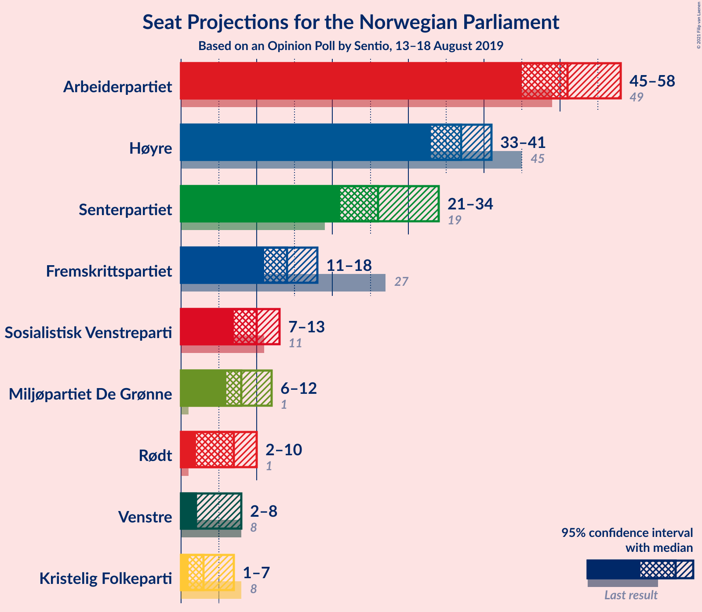
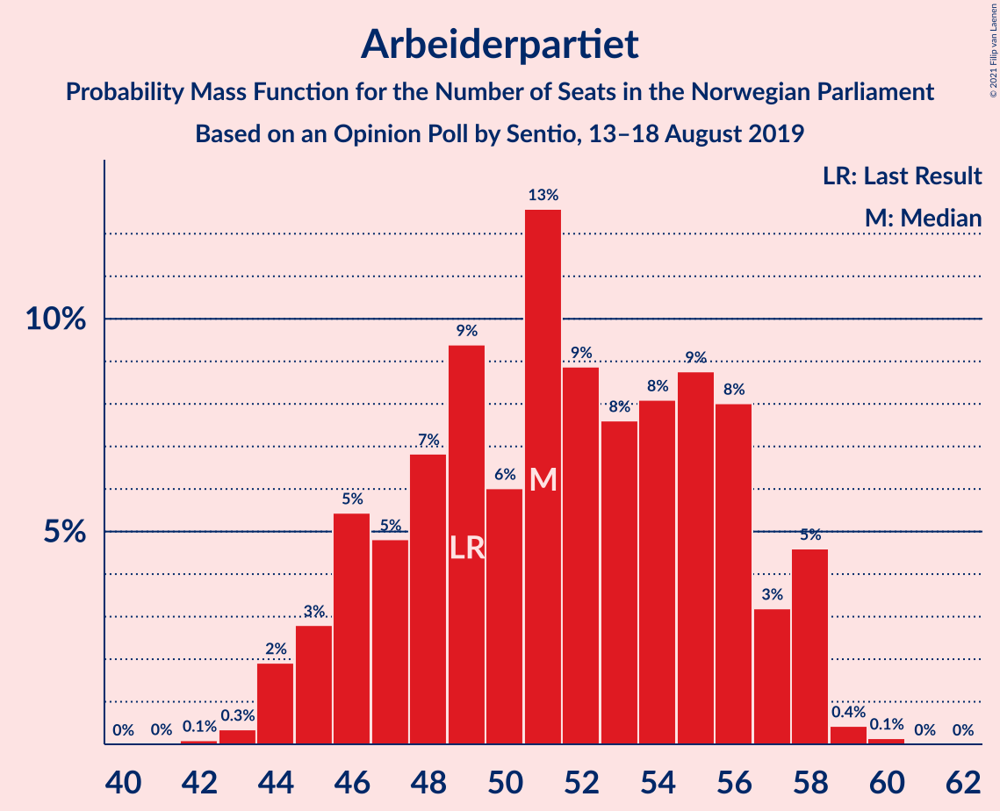
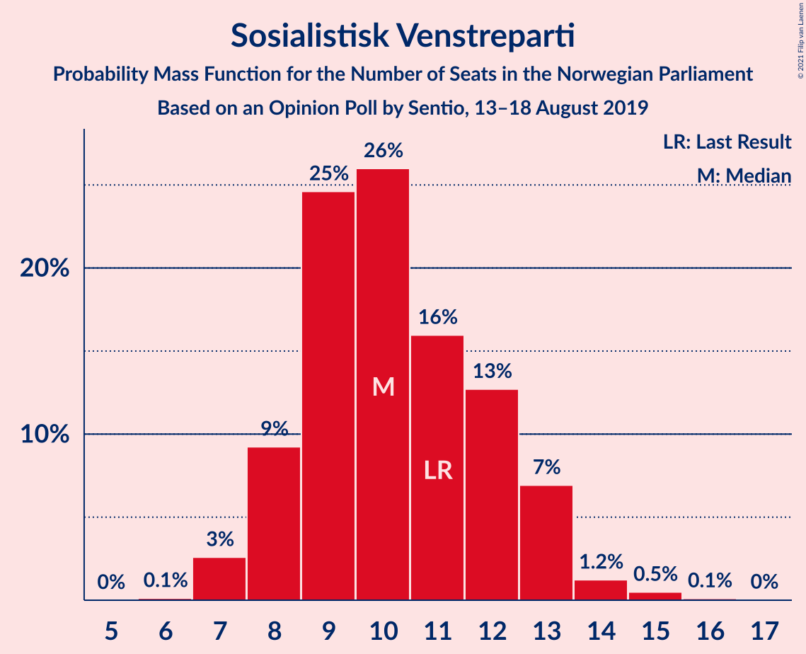
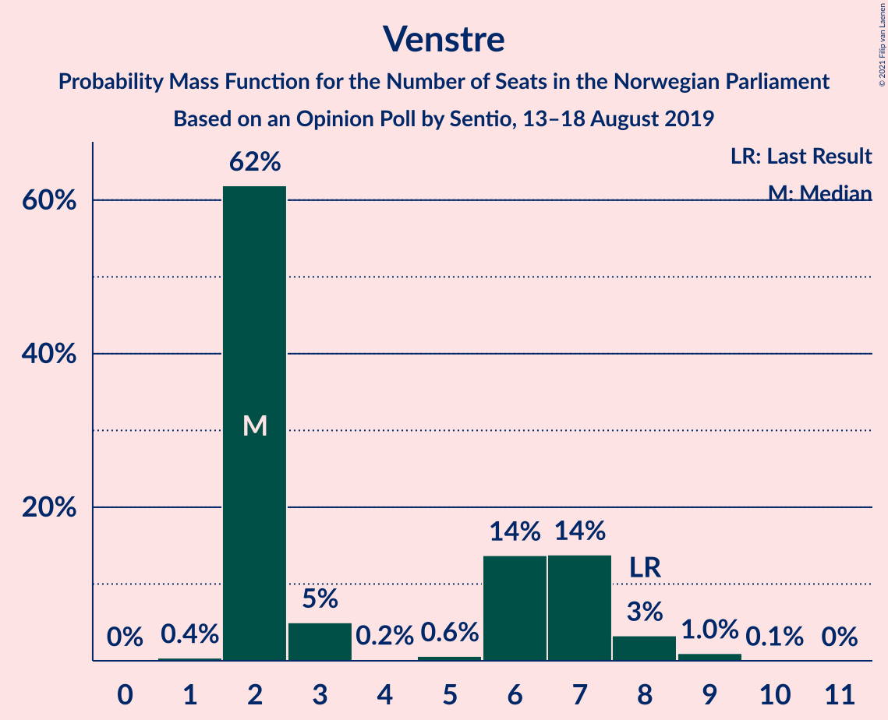
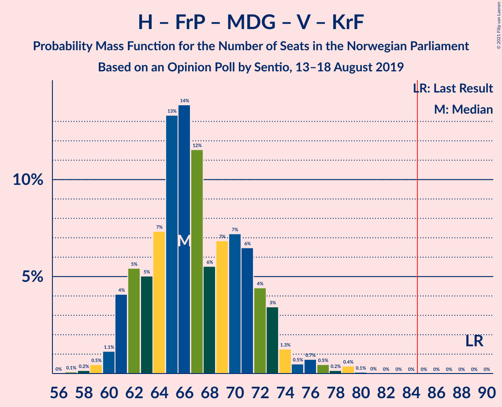

# Opinion Poll by Sentio, 13–18 August 2019

<a href="#voting-intentions">Voting Intentions</a> | <a href="#seats">Seats</a> | <a href="#coalitions">Coalitions</a> | <a href="#technical-information">Technical Information</a>

## Voting Intentions

### Confidence Intervals

| Party | Last Result | Poll Result | 80% Confidence Interval | 90% Confidence Interval | 95% Confidence Interval | 99% Confidence Interval |
|:-----:|:-----------:|:-----------:|:-----------------------:|:-----------------------:|:-----------------------:|:-----------------------:|
| Arbeiderpartiet | 27.4% | 27.3% | 25.5–29.2% |25.0–29.7% |24.6–30.1% |23.8–31.1% |
| Høyre | 25.0% | 20.9% | 19.3–22.6% |18.9–23.1% |18.5–23.5% |17.8–24.4% |
| Senterpartiet | 10.3% | 14.4% | 13.1–15.9% |12.7–16.3% |12.4–16.7% |11.7–17.5% |
| Fremskrittspartiet | 15.2% | 8.9% | 7.8–10.2% |7.5–10.5% |7.3–10.8% |6.8–11.5% |
| Sosialistisk Venstreparti | 6.0% | 6.5% | 5.6–7.6% |5.3–7.9% |5.1–8.2% |4.7–8.8% |
| Miljøpartiet De Grønne | 3.2% | 5.4% | 4.6–6.4% |4.3–6.7% |4.2–7.0% |3.8–7.5% |
| Rødt | 2.4% | 4.8% | 4.0–5.8% |3.8–6.1% |3.6–6.3% |3.3–6.8% |
| Venstre | 4.4% | 3.7% | 3.0–4.6% |2.9–4.8% |2.7–5.1% |2.4–5.5% |
| Kristelig Folkeparti | 4.2% | 3.5% | 2.9–4.4% |2.7–4.6% |2.5–4.8% |2.2–5.3% |

*Note:* The poll result column reflects the actual value used in the calculations. Published results may vary slightly, and in addition be rounded to fewer digits.

## Seats

### Confidence Intervals

| Party | Last Result | Median | 80% Confidence Interval | 90% Confidence Interval | 95% Confidence Interval | 99% Confidence Interval |
|:-----:|:-----------:|:------:|:-----------------------:|:-----------------------:|:-----------------------:|:-----------------------:|
| <a href="#arbeiderpartiet">Arbeiderpartiet</a> | 49 | 46 | 46–48 |46–55 |46–55 |46–55 |
| <a href="#høyre">Høyre</a> | 45 | 36 | 36–37 |36–42 |36–42 |35–42 |
| <a href="#senterpartiet">Senterpartiet</a> | 19 | 27 | 27–29 |26–29 |26–29 |25–38 |
| <a href="#fremskrittspartiet">Fremskrittspartiet</a> | 27 | 19 | 17–19 |8–19 |8–19 |8–19 |
| <a href="#sosialistisk-venstreparti">Sosialistisk Venstreparti</a> | 11 | 12 | 8–12 |8–12 |8–12 |8–13 |
| <a href="#miljøpartiet-de-grønne">Miljøpartiet De Grønne</a> | 1 | 8 | 8–9 |8–9 |8–9 |8–17 |
| <a href="#rødt">Rødt</a> | 1 | 6 | 6–8 |6–8 |6–8 |2–9 |
| <a href="#venstre">Venstre</a> | 8 | 2 | 1–2 |1–2 |1–2 |1–9 |
| <a href="#kristelig-folkeparti">Kristelig Folkeparti</a> | 8 | 6 | 3–6 |3–6 |3–6 |1–7 |

### Arbeiderpartiet

*For a full overview of the results for this party, see the [Arbeiderpartiet](party-arbeiderpartiet.html) page.*

| Number of Seats | Probability | Accumulated | Special Marks |
|:---------------:|:-----------:|:-----------:|:-------------:|
| 42 | 0.1% | 100% |  |
| 43 | 0% | 99.9% |  |
| 44 | 0.3% | 99.9% |  |
| 45 | 0% | 99.6% |  |
| 46 | 79% | 99.6% | Median |
| 47 | 0.9% | 20% |  |
| 48 | 10% | 19% |  |
| 49 | 0% | 9% | Last Result |
| 50 | 0.1% | 9% |  |
| 51 | 1.2% | 9% |  |
| 52 | 0.9% | 8% |  |
| 53 | 0% | 7% |  |
| 54 | 0% | 7% |  |
| 55 | 7% | 7% |  |
| 56 | 0% | 0.1% |  |
| 57 | 0.1% | 0.1% |  |
| 58 | 0% | 0% |  |

### Høyre

*For a full overview of the results for this party, see the [Høyre](party-høyre.html) page.*

| Number of Seats | Probability | Accumulated | Special Marks |
|:---------------:|:-----------:|:-----------:|:-------------:|
| 34 | 0.3% | 100% |  |
| 35 | 1.1% | 99.6% |  |
| 36 | 79% | 98.5% | Median |
| 37 | 11% | 19% |  |
| 38 | 0% | 8% |  |
| 39 | 0% | 8% |  |
| 40 | 0% | 8% |  |
| 41 | 1.2% | 8% |  |
| 42 | 7% | 7% |  |
| 43 | 0% | 0.1% |  |
| 44 | 0% | 0.1% |  |
| 45 | 0.1% | 0.1% | Last Result |
| 46 | 0% | 0% |  |

### Senterpartiet

*For a full overview of the results for this party, see the [Senterpartiet](party-senterpartiet.html) page.*

| Number of Seats | Probability | Accumulated | Special Marks |
|:---------------:|:-----------:|:-----------:|:-------------:|
| 19 | 0% | 100% | Last Result |
| 20 | 0% | 100% |  |
| 21 | 0.4% | 100% |  |
| 22 | 0% | 99.6% |  |
| 23 | 0% | 99.6% |  |
| 24 | 0% | 99.6% |  |
| 25 | 1.2% | 99.6% |  |
| 26 | 7% | 98% |  |
| 27 | 78% | 92% | Median |
| 28 | 0.6% | 13% |  |
| 29 | 10% | 13% |  |
| 30 | 0% | 2% |  |
| 31 | 0.1% | 2% |  |
| 32 | 0% | 2% |  |
| 33 | 0% | 2% |  |
| 34 | 0% | 2% |  |
| 35 | 1.1% | 2% |  |
| 36 | 0.2% | 1.1% |  |
| 37 | 0% | 0.9% |  |
| 38 | 0.9% | 0.9% |  |
| 39 | 0% | 0% |  |

### Fremskrittspartiet

*For a full overview of the results for this party, see the [Fremskrittspartiet](party-fremskrittspartiet.html) page.*

| Number of Seats | Probability | Accumulated | Special Marks |
|:---------------:|:-----------:|:-----------:|:-------------:|
| 8 | 7% | 100% |  |
| 9 | 0% | 93% |  |
| 10 | 0% | 93% |  |
| 11 | 0.1% | 93% |  |
| 12 | 0% | 93% |  |
| 13 | 1.0% | 93% |  |
| 14 | 0% | 92% |  |
| 15 | 0.2% | 92% |  |
| 16 | 2% | 92% |  |
| 17 | 10% | 90% |  |
| 18 | 2% | 80% |  |
| 19 | 78% | 78% | Median |
| 20 | 0% | 0% |  |
| 21 | 0% | 0% |  |
| 22 | 0% | 0% |  |
| 23 | 0% | 0% |  |
| 24 | 0% | 0% |  |
| 25 | 0% | 0% |  |
| 26 | 0% | 0% |  |
| 27 | 0% | 0% | Last Result |

### Sosialistisk Venstreparti

*For a full overview of the results for this party, see the [Sosialistisk Venstreparti](party-sosialistiskvenstreparti.html) page.*

| Number of Seats | Probability | Accumulated | Special Marks |
|:---------------:|:-----------:|:-----------:|:-------------:|
| 7 | 0.2% | 100% |  |
| 8 | 12% | 99.8% |  |
| 9 | 0% | 88% |  |
| 10 | 7% | 88% |  |
| 11 | 0.2% | 81% | Last Result |
| 12 | 80% | 81% | Median |
| 13 | 1.2% | 1.2% |  |
| 14 | 0% | 0% |  |

### Miljøpartiet De Grønne

*For a full overview of the results for this party, see the [Miljøpartiet De Grønne](party-miljøpartietdegrønne.html) page.*

| Number of Seats | Probability | Accumulated | Special Marks |
|:---------------:|:-----------:|:-----------:|:-------------:|
| 1 | 0% | 100% | Last Result |
| 2 | 0% | 100% |  |
| 3 | 0% | 100% |  |
| 4 | 0% | 100% |  |
| 5 | 0% | 100% |  |
| 6 | 0% | 100% |  |
| 7 | 0.3% | 100% |  |
| 8 | 89% | 99.7% | Median |
| 9 | 9% | 11% |  |
| 10 | 0.9% | 2% |  |
| 11 | 0% | 1.3% |  |
| 12 | 0% | 1.3% |  |
| 13 | 0% | 1.3% |  |
| 14 | 0.1% | 1.3% |  |
| 15 | 0% | 1.2% |  |
| 16 | 0% | 1.2% |  |
| 17 | 1.2% | 1.2% |  |
| 18 | 0% | 0% |  |

### Rødt

*For a full overview of the results for this party, see the [Rødt](party-rødt.html) page.*

| Number of Seats | Probability | Accumulated | Special Marks |
|:---------------:|:-----------:|:-----------:|:-------------:|
| 1 | 0% | 100% | Last Result |
| 2 | 2% | 100% |  |
| 3 | 0% | 98% |  |
| 4 | 0% | 98% |  |
| 5 | 0% | 98% |  |
| 6 | 78% | 98% | Median |
| 7 | 7% | 19% |  |
| 8 | 11% | 13% |  |
| 9 | 0.9% | 1.3% |  |
| 10 | 0.4% | 0.4% |  |
| 11 | 0% | 0% |  |

### Venstre

*For a full overview of the results for this party, see the [Venstre](party-venstre.html) page.*

| Number of Seats | Probability | Accumulated | Special Marks |
|:---------------:|:-----------:|:-----------:|:-------------:|
| 1 | 11% | 100% |  |
| 2 | 87% | 89% | Median |
| 3 | 0% | 2% |  |
| 4 | 0% | 2% |  |
| 5 | 0.2% | 2% |  |
| 6 | 0% | 2% |  |
| 7 | 0.1% | 2% |  |
| 8 | 0% | 1.5% | Last Result |
| 9 | 1.1% | 1.4% |  |
| 10 | 0.3% | 0.3% |  |
| 11 | 0% | 0% |  |

### Kristelig Folkeparti

*For a full overview of the results for this party, see the [Kristelig Folkeparti](party-kristeligfolkeparti.html) page.*

| Number of Seats | Probability | Accumulated | Special Marks |
|:---------------:|:-----------:|:-----------:|:-------------:|
| 0 | 0.2% | 100% |  |
| 1 | 2% | 99.8% |  |
| 2 | 0% | 98% |  |
| 3 | 8% | 98% |  |
| 4 | 0% | 89% |  |
| 5 | 0% | 89% |  |
| 6 | 89% | 89% | Median |
| 7 | 0.8% | 0.8% |  |
| 8 | 0% | 0% | Last Result |

## Coalitions

### Confidence Intervals

| Coalition | Last Result | Median | Majority? | 80% Confidence Interval | 90% Confidence Interval | 95% Confidence Interval | 99% Confidence Interval |
|:---------:|:-----------:|:------:|:---------:|:-----------------------:|:-----------------------:|:-----------------------:|:-----------------------:|
| Arbeiderpartiet – Senterpartiet – Sosialistisk Venstreparti – Miljøpartiet De Grønne – Rødt | 81 | 99 | 100% | 99–105 | 99–107 | 99–107 | 99–111 |
| Arbeiderpartiet – Senterpartiet – Sosialistisk Venstreparti – Miljøpartiet De Grønne – Kristelig Folkeparti | 88 | 99 | 100% | 99–103 | 99–103 | 99–104 | 98–108 |
| Arbeiderpartiet – Senterpartiet – Sosialistisk Venstreparti – Miljøpartiet De Grønne | 80 | 93 | 100% | 93–99 | 93–100 | 93–102 | 93–105 |
| Arbeiderpartiet – Senterpartiet – Sosialistisk Venstreparti – Rødt | 80 | 91 | 100% | 91–93 | 91–98 | 91–98 | 90–102 |
| Arbeiderpartiet – Senterpartiet – Miljøpartiet De Grønne – Kristelig Folkeparti | 77 | 87 | 99.9% | 87–91 | 87–93 | 87–95 | 86–96 |
| Arbeiderpartiet – Senterpartiet – Sosialistisk Venstreparti | 79 | 85 | 99.6% | 85–88 | 85–91 | 85–91 | 85–94 |
| Høyre – Senterpartiet – Fremskrittspartiet – Venstre – Kristelig Folkeparti | 107 | 90 | 93% | 90 | 81–90 | 81–90 | 81–99 |
| Arbeiderpartiet – Senterpartiet – Kristelig Folkeparti | 76 | 79 | 2% | 79–83 | 79–84 | 79–84 | 77–87 |
| Arbeiderpartiet – Senterpartiet | 68 | 73 | 0.9% | 73–77 | 73–81 | 73–81 | 73–85 |
| Høyre – Fremskrittspartiet – Miljøpartiet De Grønne – Venstre – Kristelig Folkeparti | 89 | 71 | 0% | 69–71 | 64–71 | 64–73 | 60–79 |
| Arbeiderpartiet – Sosialistisk Venstreparti | 60 | 58 | 0% | 56–59 | 56–65 | 56–65 | 55–65 |
| Høyre – Fremskrittspartiet – Venstre – Kristelig Folkeparti | 88 | 63 | 0% | 61–63 | 55–63 | 55–63 | 51–64 |
| Høyre – Fremskrittspartiet – Venstre | 80 | 57 | 0% | 55–57 | 52–57 | 52–59 | 50–63 |
| Høyre – Fremskrittspartiet | 72 | 55 | 0% | 54–55 | 50–55 | 50–55 | 48–57 |
| Høyre – Venstre – Kristelig Folkeparti | 61 | 44 | 0% | 44–45 | 44–47 | 44–47 | 38–47 |
| Senterpartiet – Venstre – Kristelig Folkeparti | 35 | 35 | 0% | 35–36 | 31–36 | 31–36 | 30–45 |

### Arbeiderpartiet – Senterpartiet – Sosialistisk Venstreparti – Miljøpartiet De Grønne – Rødt

| Number of Seats | Probability | Accumulated | Special Marks |
|:---------------:|:-----------:|:-----------:|:-------------:|
| 81 | 0% | 100% | Last Result |
| 82 | 0% | 100% |  |
| 83 | 0% | 100% |  |
| 84 | 0% | 100% |  |
| 85 | 0% | 100% | Majority |
| 86 | 0% | 100% |  |
| 87 | 0% | 100% |  |
| 88 | 0% | 100% |  |
| 89 | 0% | 100% |  |
| 90 | 0% | 100% |  |
| 91 | 0% | 100% |  |
| 92 | 0% | 100% |  |
| 93 | 0% | 100% |  |
| 94 | 0% | 100% |  |
| 95 | 0% | 100% |  |
| 96 | 0% | 100% |  |
| 97 | 0% | 100% |  |
| 98 | 0.2% | 100% |  |
| 99 | 78% | 99.8% | Median |
| 100 | 0% | 22% |  |
| 101 | 10% | 22% |  |
| 102 | 0.2% | 11% |  |
| 103 | 0.4% | 11% |  |
| 104 | 0% | 11% |  |
| 105 | 1.1% | 11% |  |
| 106 | 0.7% | 9% |  |
| 107 | 8% | 9% |  |
| 108 | 0% | 0.9% |  |
| 109 | 0% | 0.9% |  |
| 110 | 0% | 0.9% |  |
| 111 | 0.9% | 0.9% |  |
| 112 | 0% | 0% |  |

### Arbeiderpartiet – Senterpartiet – Sosialistisk Venstreparti – Miljøpartiet De Grønne – Kristelig Folkeparti

| Number of Seats | Probability | Accumulated | Special Marks |
|:---------------:|:-----------:|:-----------:|:-------------:|
| 88 | 0% | 100% | Last Result |
| 89 | 0% | 100% |  |
| 90 | 0% | 100% |  |
| 91 | 0% | 100% |  |
| 92 | 0% | 100% |  |
| 93 | 0% | 100% |  |
| 94 | 0.1% | 100% |  |
| 95 | 0% | 99.9% |  |
| 96 | 0.4% | 99.9% |  |
| 97 | 0% | 99.5% |  |
| 98 | 0.1% | 99.5% |  |
| 99 | 89% | 99.5% | Median |
| 100 | 0.2% | 11% |  |
| 101 | 0.2% | 11% |  |
| 102 | 0.1% | 10% |  |
| 103 | 7% | 10% |  |
| 104 | 1.1% | 3% |  |
| 105 | 0.5% | 2% |  |
| 106 | 0% | 1.2% |  |
| 107 | 0% | 1.2% |  |
| 108 | 1.2% | 1.2% |  |
| 109 | 0% | 0% |  |

### Arbeiderpartiet – Senterpartiet – Sosialistisk Venstreparti – Miljøpartiet De Grønne

| Number of Seats | Probability | Accumulated | Special Marks |
|:---------------:|:-----------:|:-----------:|:-------------:|
| 80 | 0% | 100% | Last Result |
| 81 | 0% | 100% |  |
| 82 | 0% | 100% |  |
| 83 | 0% | 100% |  |
| 84 | 0% | 100% |  |
| 85 | 0% | 100% | Majority |
| 86 | 0% | 100% |  |
| 87 | 0% | 100% |  |
| 88 | 0% | 100% |  |
| 89 | 0% | 100% |  |
| 90 | 0% | 100% |  |
| 91 | 0% | 100% |  |
| 92 | 0% | 99.9% |  |
| 93 | 89% | 99.9% | Median |
| 94 | 0.2% | 11% |  |
| 95 | 0% | 11% |  |
| 96 | 0.2% | 11% |  |
| 97 | 0% | 11% |  |
| 98 | 0.5% | 11% |  |
| 99 | 0.1% | 10% |  |
| 100 | 7% | 10% |  |
| 101 | 0% | 3% |  |
| 102 | 0.9% | 3% |  |
| 103 | 1.1% | 2% |  |
| 104 | 0% | 1.2% |  |
| 105 | 1.2% | 1.2% |  |
| 106 | 0% | 0% |  |

### Arbeiderpartiet – Senterpartiet – Sosialistisk Venstreparti – Rødt

| Number of Seats | Probability | Accumulated | Special Marks |
|:---------------:|:-----------:|:-----------:|:-------------:|
| 80 | 0% | 100% | Last Result |
| 81 | 0% | 100% |  |
| 82 | 0% | 100% |  |
| 83 | 0% | 100% |  |
| 84 | 0% | 100% |  |
| 85 | 0% | 100% | Majority |
| 86 | 0% | 100% |  |
| 87 | 0% | 100% |  |
| 88 | 0% | 100% |  |
| 89 | 0% | 100% |  |
| 90 | 1.4% | 100% |  |
| 91 | 78% | 98.5% | Median |
| 92 | 0% | 20% |  |
| 93 | 11% | 20% |  |
| 94 | 0.1% | 10% |  |
| 95 | 0.2% | 9% |  |
| 96 | 2% | 9% |  |
| 97 | 0% | 8% |  |
| 98 | 7% | 8% |  |
| 99 | 0% | 1.0% |  |
| 100 | 0% | 0.9% |  |
| 101 | 0% | 0.9% |  |
| 102 | 0.9% | 0.9% |  |
| 103 | 0% | 0% |  |

### Arbeiderpartiet – Senterpartiet – Miljøpartiet De Grønne – Kristelig Folkeparti

| Number of Seats | Probability | Accumulated | Special Marks |
|:---------------:|:-----------:|:-----------:|:-------------:|
| 77 | 0% | 100% | Last Result |
| 78 | 0% | 100% |  |
| 79 | 0% | 100% |  |
| 80 | 0% | 100% |  |
| 81 | 0% | 100% |  |
| 82 | 0% | 100% |  |
| 83 | 0% | 100% |  |
| 84 | 0% | 100% |  |
| 85 | 0% | 99.9% | Majority |
| 86 | 0.4% | 99.9% |  |
| 87 | 78% | 99.5% | Median |
| 88 | 0.1% | 21% |  |
| 89 | 0.1% | 21% |  |
| 90 | 0% | 21% |  |
| 91 | 12% | 21% |  |
| 92 | 0% | 9% |  |
| 93 | 7% | 9% |  |
| 94 | 0.2% | 3% |  |
| 95 | 0.9% | 3% |  |
| 96 | 1.2% | 2% |  |
| 97 | 0.5% | 0.5% |  |
| 98 | 0% | 0% |  |

### Arbeiderpartiet – Senterpartiet – Sosialistisk Venstreparti

| Number of Seats | Probability | Accumulated | Special Marks |
|:---------------:|:-----------:|:-----------:|:-------------:|
| 79 | 0% | 100% | Last Result |
| 80 | 0% | 100% |  |
| 81 | 0% | 100% |  |
| 82 | 0% | 99.9% |  |
| 83 | 0.4% | 99.9% |  |
| 84 | 0% | 99.6% |  |
| 85 | 89% | 99.6% | Median, Majority |
| 86 | 0.1% | 11% |  |
| 87 | 0.2% | 11% |  |
| 88 | 2% | 11% |  |
| 89 | 0% | 9% |  |
| 90 | 0% | 9% |  |
| 91 | 7% | 9% |  |
| 92 | 0.2% | 2% |  |
| 93 | 0.9% | 2% |  |
| 94 | 1.1% | 1.1% |  |
| 95 | 0% | 0% |  |

### Høyre – Senterpartiet – Fremskrittspartiet – Venstre – Kristelig Folkeparti

| Number of Seats | Probability | Accumulated | Special Marks |
|:---------------:|:-----------:|:-----------:|:-------------:|
| 79 | 0.1% | 100% |  |
| 80 | 0% | 99.9% |  |
| 81 | 7% | 99.9% |  |
| 82 | 0% | 93% |  |
| 83 | 0.1% | 93% |  |
| 84 | 0% | 93% |  |
| 85 | 0% | 93% | Majority |
| 86 | 0.2% | 93% |  |
| 87 | 2% | 93% |  |
| 88 | 0% | 91% |  |
| 89 | 0.9% | 91% |  |
| 90 | 89% | 90% | Median |
| 91 | 0.5% | 2% |  |
| 92 | 0.1% | 1.4% |  |
| 93 | 0% | 1.4% |  |
| 94 | 0% | 1.3% |  |
| 95 | 0% | 1.3% |  |
| 96 | 0% | 1.3% |  |
| 97 | 0.2% | 1.3% |  |
| 98 | 0% | 1.1% |  |
| 99 | 1.1% | 1.1% |  |
| 100 | 0% | 0% |  |
| 101 | 0% | 0% |  |
| 102 | 0% | 0% |  |
| 103 | 0% | 0% |  |
| 104 | 0% | 0% |  |
| 105 | 0% | 0% |  |
| 106 | 0% | 0% |  |
| 107 | 0% | 0% | Last Result |

### Arbeiderpartiet – Senterpartiet – Kristelig Folkeparti

| Number of Seats | Probability | Accumulated | Special Marks |
|:---------------:|:-----------:|:-----------:|:-------------:|
| 74 | 0% | 100% |  |
| 75 | 0% | 99.9% |  |
| 76 | 0.4% | 99.9% | Last Result |
| 77 | 0.1% | 99.5% |  |
| 78 | 0% | 99.5% |  |
| 79 | 79% | 99.4% | Median |
| 80 | 0.2% | 20% |  |
| 81 | 0% | 20% |  |
| 82 | 1.1% | 20% |  |
| 83 | 10% | 19% |  |
| 84 | 7% | 8% |  |
| 85 | 0% | 2% | Majority |
| 86 | 0.9% | 2% |  |
| 87 | 0.7% | 0.7% |  |
| 88 | 0% | 0% |  |

### Arbeiderpartiet – Senterpartiet

| Number of Seats | Probability | Accumulated | Special Marks |
|:---------------:|:-----------:|:-----------:|:-------------:|
| 68 | 0% | 100% | Last Result |
| 69 | 0% | 100% |  |
| 70 | 0% | 100% |  |
| 71 | 0% | 100% |  |
| 72 | 0% | 99.9% |  |
| 73 | 79% | 99.9% | Median |
| 74 | 0.1% | 21% |  |
| 75 | 0% | 21% |  |
| 76 | 1.4% | 21% |  |
| 77 | 10% | 20% |  |
| 78 | 0% | 10% |  |
| 79 | 0% | 9% |  |
| 80 | 0.8% | 9% |  |
| 81 | 8% | 9% |  |
| 82 | 0% | 1.0% |  |
| 83 | 0% | 0.9% |  |
| 84 | 0% | 0.9% |  |
| 85 | 0.9% | 0.9% | Majority |
| 86 | 0% | 0% |  |

### Høyre – Fremskrittspartiet – Miljøpartiet De Grønne – Venstre – Kristelig Folkeparti

| Number of Seats | Probability | Accumulated | Special Marks |
|:---------------:|:-----------:|:-----------:|:-------------:|
| 60 | 0.9% | 100% |  |
| 61 | 0% | 99.1% |  |
| 62 | 0.1% | 99.1% |  |
| 63 | 0.1% | 99.0% |  |
| 64 | 7% | 98.9% |  |
| 65 | 0% | 92% |  |
| 66 | 0.1% | 92% |  |
| 67 | 0.1% | 92% |  |
| 68 | 0.4% | 92% |  |
| 69 | 10% | 92% |  |
| 70 | 0% | 81% |  |
| 71 | 78% | 81% | Median |
| 72 | 0% | 3% |  |
| 73 | 2% | 3% |  |
| 74 | 0% | 2% |  |
| 75 | 0% | 2% |  |
| 76 | 0.4% | 2% |  |
| 77 | 0% | 1.2% |  |
| 78 | 0% | 1.2% |  |
| 79 | 1.2% | 1.2% |  |
| 80 | 0% | 0% |  |
| 81 | 0% | 0% |  |
| 82 | 0% | 0% |  |
| 83 | 0% | 0% |  |
| 84 | 0% | 0% |  |
| 85 | 0% | 0% | Majority |
| 86 | 0% | 0% |  |
| 87 | 0% | 0% |  |
| 88 | 0% | 0% |  |
| 89 | 0% | 0% | Last Result |

### Arbeiderpartiet – Sosialistisk Venstreparti

| Number of Seats | Probability | Accumulated | Special Marks |
|:---------------:|:-----------:|:-----------:|:-------------:|
| 51 | 0.2% | 100% |  |
| 52 | 0% | 99.8% |  |
| 53 | 0% | 99.7% |  |
| 54 | 0% | 99.7% |  |
| 55 | 1.0% | 99.7% |  |
| 56 | 10% | 98.7% |  |
| 57 | 0% | 88% |  |
| 58 | 78% | 88% | Median |
| 59 | 1.2% | 10% |  |
| 60 | 0.5% | 9% | Last Result |
| 61 | 0% | 8% |  |
| 62 | 0.5% | 8% |  |
| 63 | 1.2% | 8% |  |
| 64 | 0.1% | 7% |  |
| 65 | 7% | 7% |  |
| 66 | 0% | 0.1% |  |
| 67 | 0% | 0% |  |

### Høyre – Fremskrittspartiet – Venstre – Kristelig Folkeparti

| Number of Seats | Probability | Accumulated | Special Marks |
|:---------------:|:-----------:|:-----------:|:-------------:|
| 51 | 0.9% | 100% |  |
| 52 | 0% | 99.1% |  |
| 53 | 0.1% | 99.1% |  |
| 54 | 0% | 99.0% |  |
| 55 | 7% | 99.0% |  |
| 56 | 0% | 92% |  |
| 57 | 0% | 92% |  |
| 58 | 0% | 92% |  |
| 59 | 0.1% | 92% |  |
| 60 | 0.2% | 92% |  |
| 61 | 11% | 92% |  |
| 62 | 1.3% | 81% |  |
| 63 | 79% | 80% | Median |
| 64 | 1.1% | 1.5% |  |
| 65 | 0% | 0.4% |  |
| 66 | 0.4% | 0.4% |  |
| 67 | 0% | 0% |  |
| 68 | 0% | 0% |  |
| 69 | 0% | 0% |  |
| 70 | 0% | 0% |  |
| 71 | 0% | 0% |  |
| 72 | 0% | 0% |  |
| 73 | 0% | 0% |  |
| 74 | 0% | 0% |  |
| 75 | 0% | 0% |  |
| 76 | 0% | 0% |  |
| 77 | 0% | 0% |  |
| 78 | 0% | 0% |  |
| 79 | 0% | 0% |  |
| 80 | 0% | 0% |  |
| 81 | 0% | 0% |  |
| 82 | 0% | 0% |  |
| 83 | 0% | 0% |  |
| 84 | 0% | 0% |  |
| 85 | 0% | 0% | Majority |
| 86 | 0% | 0% |  |
| 87 | 0% | 0% |  |
| 88 | 0% | 0% | Last Result |

### Høyre – Fremskrittspartiet – Venstre

| Number of Seats | Probability | Accumulated | Special Marks |
|:---------------:|:-----------:|:-----------:|:-------------:|
| 50 | 1.0% | 100% |  |
| 51 | 0% | 99.0% |  |
| 52 | 7% | 99.0% |  |
| 53 | 0% | 92% |  |
| 54 | 0.2% | 92% |  |
| 55 | 10% | 92% |  |
| 56 | 0.5% | 82% |  |
| 57 | 78% | 81% | Median |
| 58 | 0% | 3% |  |
| 59 | 1.2% | 3% |  |
| 60 | 0% | 2% |  |
| 61 | 0% | 2% |  |
| 62 | 0% | 1.5% |  |
| 63 | 1.4% | 1.5% |  |
| 64 | 0% | 0% |  |
| 65 | 0% | 0% |  |
| 66 | 0% | 0% |  |
| 67 | 0% | 0% |  |
| 68 | 0% | 0% |  |
| 69 | 0% | 0% |  |
| 70 | 0% | 0% |  |
| 71 | 0% | 0% |  |
| 72 | 0% | 0% |  |
| 73 | 0% | 0% |  |
| 74 | 0% | 0% |  |
| 75 | 0% | 0% |  |
| 76 | 0% | 0% |  |
| 77 | 0% | 0% |  |
| 78 | 0% | 0% |  |
| 79 | 0% | 0% |  |
| 80 | 0% | 0% | Last Result |

### Høyre – Fremskrittspartiet

| Number of Seats | Probability | Accumulated | Special Marks |
|:---------------:|:-----------:|:-----------:|:-------------:|
| 48 | 1.0% | 100% |  |
| 49 | 0.2% | 99.0% |  |
| 50 | 7% | 98.8% |  |
| 51 | 0% | 92% |  |
| 52 | 0% | 92% |  |
| 53 | 0.5% | 92% |  |
| 54 | 11% | 92% |  |
| 55 | 79% | 80% | Median |
| 56 | 0% | 1.3% |  |
| 57 | 1.2% | 1.3% |  |
| 58 | 0% | 0.1% |  |
| 59 | 0% | 0% |  |
| 60 | 0% | 0% |  |
| 61 | 0% | 0% |  |
| 62 | 0% | 0% |  |
| 63 | 0% | 0% |  |
| 64 | 0% | 0% |  |
| 65 | 0% | 0% |  |
| 66 | 0% | 0% |  |
| 67 | 0% | 0% |  |
| 68 | 0% | 0% |  |
| 69 | 0% | 0% |  |
| 70 | 0% | 0% |  |
| 71 | 0% | 0% |  |
| 72 | 0% | 0% | Last Result |

### Høyre – Venstre – Kristelig Folkeparti

| Number of Seats | Probability | Accumulated | Special Marks |
|:---------------:|:-----------:|:-----------:|:-------------:|
| 37 | 0.1% | 100% |  |
| 38 | 0.9% | 99.8% |  |
| 39 | 0% | 98.9% |  |
| 40 | 0% | 98.9% |  |
| 41 | 0.1% | 98.9% |  |
| 42 | 0.2% | 98.8% |  |
| 43 | 0.1% | 98.6% |  |
| 44 | 89% | 98.6% | Median |
| 45 | 0.5% | 10% |  |
| 46 | 2% | 10% |  |
| 47 | 7% | 7% |  |
| 48 | 0% | 0.4% |  |
| 49 | 0% | 0.4% |  |
| 50 | 0.4% | 0.4% |  |
| 51 | 0% | 0% |  |
| 52 | 0% | 0% |  |
| 53 | 0% | 0% |  |
| 54 | 0% | 0% |  |
| 55 | 0% | 0% |  |
| 56 | 0% | 0% |  |
| 57 | 0% | 0% |  |
| 58 | 0% | 0% |  |
| 59 | 0% | 0% |  |
| 60 | 0% | 0% |  |
| 61 | 0% | 0% | Last Result |

### Senterpartiet – Venstre – Kristelig Folkeparti

| Number of Seats | Probability | Accumulated | Special Marks |
|:---------------:|:-----------:|:-----------:|:-------------:|
| 28 | 0% | 100% |  |
| 29 | 0% | 99.9% |  |
| 30 | 1.3% | 99.9% |  |
| 31 | 7% | 98.6% |  |
| 32 | 0% | 92% |  |
| 33 | 0.1% | 92% |  |
| 34 | 0.4% | 92% |  |
| 35 | 78% | 91% | Last Result, Median |
| 36 | 11% | 13% |  |
| 37 | 0% | 2% |  |
| 38 | 0% | 2% |  |
| 39 | 0% | 2% |  |
| 40 | 0.1% | 2% |  |
| 41 | 0.9% | 2% |  |
| 42 | 0% | 1.3% |  |
| 43 | 0% | 1.3% |  |
| 44 | 0% | 1.3% |  |
| 45 | 1.1% | 1.3% |  |
| 46 | 0% | 0.2% |  |
| 47 | 0% | 0.2% |  |
| 48 | 0.2% | 0.2% |  |
| 49 | 0% | 0% |  |

## Technical Information

### Opinion Poll

+ **Polling firm:** Sentio
+ **Commissioner(s):** —
+ **Fieldwork period:** 13–18 August 2019

### Calculations

+ **Sample size:** 1000
+ **Simulations done:** 1,024
+ **Error estimate:** 2.51%

