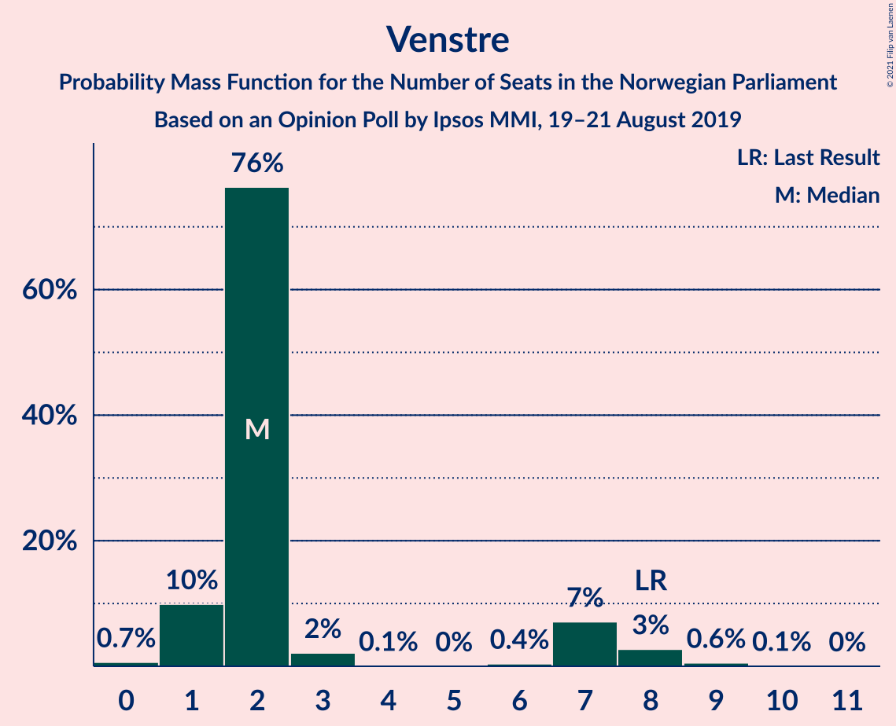
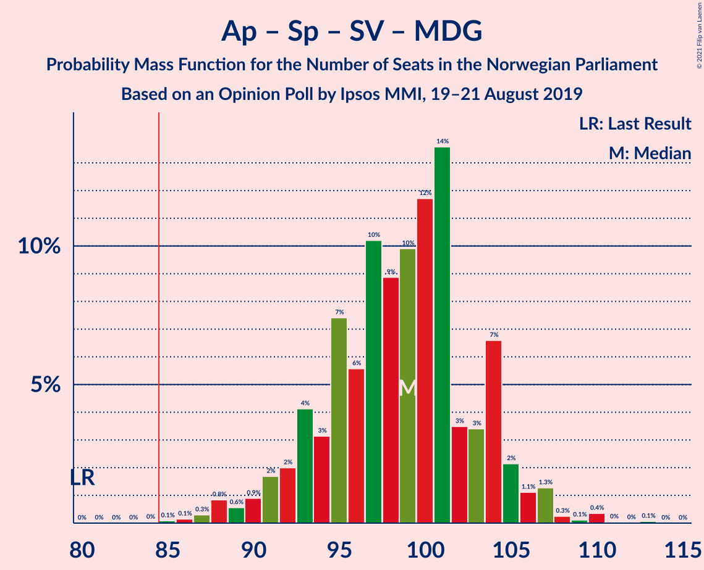
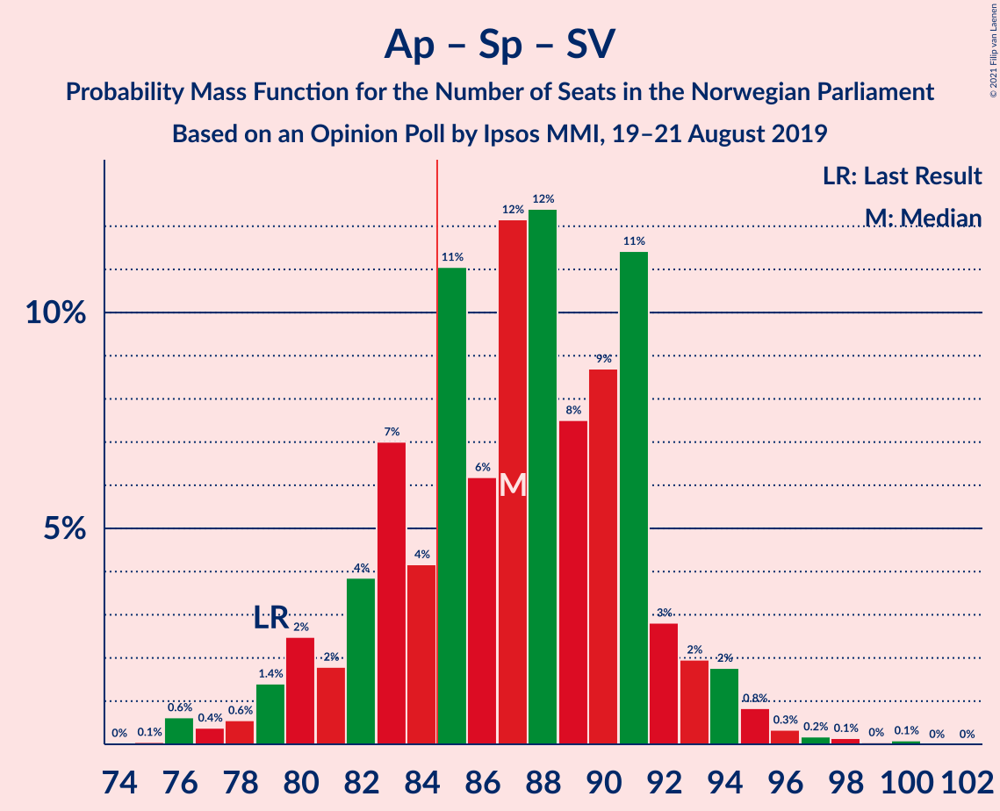
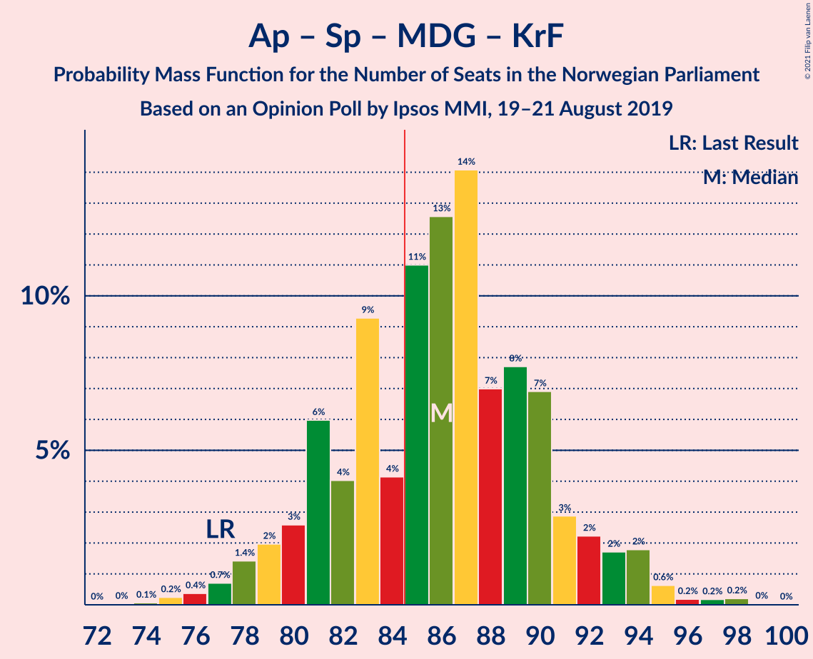
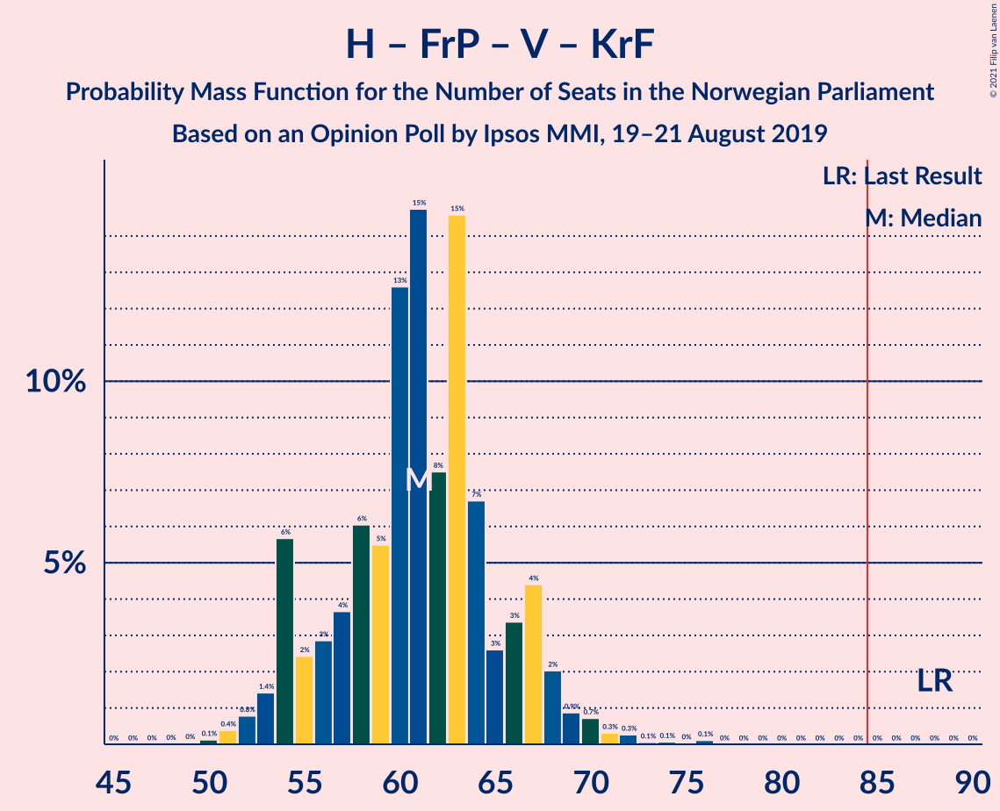

# Opinion Poll by Ipsos MMI, 19–21 August 2019

<a href="#voting-intentions">Voting Intentions</a> | <a href="#seats">Seats</a> | <a href="#coalitions">Coalitions</a> | <a href="#technical-information">Technical Information</a>

## Voting Intentions

### Confidence Intervals

| Party | Last Result | Poll Result | 80% Confidence Interval | 90% Confidence Interval | 95% Confidence Interval | 99% Confidence Interval |
|:-----:|:-----------:|:-----------:|:-----------------------:|:-----------------------:|:-----------------------:|:-----------------------:|
| Arbeiderpartiet | 27.4% | 23.4% | 21.4–25.5% |20.9–26.1% |20.4–26.6% |19.5–27.6% |
| Høyre | 25.0% | 20.9% | 19.0–22.9% |18.5–23.5% |18.0–24.0% |17.2–25.0% |
| Senterpartiet | 10.3% | 16.1% | 14.5–18.0% |14.0–18.5% |13.6–19.0% |12.9–19.9% |
| Fremskrittspartiet | 15.2% | 11.1% | 9.7–12.8% |9.4–13.2% |9.0–13.6% |8.4–14.5% |
| Sosialistisk Venstreparti | 6.0% | 7.9% | 6.8–9.4% |6.4–9.8% |6.2–10.1% |5.7–10.9% |
| Miljøpartiet De Grønne | 3.2% | 6.7% | 5.6–8.0% |5.3–8.4% |5.1–8.7% |4.6–9.4% |
| Rødt | 2.4% | 4.5% | 3.6–5.6% |3.4–5.9% |3.2–6.2% |2.8–6.8% |
| Venstre | 4.4% | 3.1% | 2.4–4.1% |2.2–4.3% |2.0–4.6% |1.7–5.1% |
| Kristelig Folkeparti | 4.2% | 2.6% | 2.0–3.6% |1.8–3.9% |1.7–4.1% |1.4–4.6% |

*Note:* The poll result column reflects the actual value used in the calculations. Published results may vary slightly, and in addition be rounded to fewer digits.

## Seats

### Confidence Intervals

| Party | Last Result | Median | 80% Confidence Interval | 90% Confidence Interval | 95% Confidence Interval | 99% Confidence Interval |
|:-----:|:-----------:|:------:|:-----------------------:|:-----------------------:|:-----------------------:|:-----------------------:|
| <a href="#arbeiderpartiet">Arbeiderpartiet</a> | 49 | 42 | 39–45 |39–46 |37–47 |36–49 |
| <a href="#høyre">Høyre</a> | 45 | 37 | 35–41 |33–43 |32–45 |29–46 |
| <a href="#senterpartiet">Senterpartiet</a> | 19 | 31 | 26–33 |26–34 |25–36 |23–37 |
| <a href="#fremskrittspartiet">Fremskrittspartiet</a> | 27 | 20 | 17–23 |16–24 |15–24 |15–26 |
| <a href="#sosialistisk-venstreparti">Sosialistisk Venstreparti</a> | 11 | 15 | 10–16 |10–18 |10–18 |9–19 |
| <a href="#miljøpartiet-de-grønne">Miljøpartiet De Grønne</a> | 1 | 10 | 9–14 |8–14 |8–14 |7–16 |
| <a href="#rødt">Rødt</a> | 1 | 7 | 2–9 |2–9 |2–10 |2–12 |
| <a href="#venstre">Venstre</a> | 8 | 2 | 2–7 |1–8 |1–8 |1–9 |
| <a href="#kristelig-folkeparti">Kristelig Folkeparti</a> | 8 | 2 | 1–3 |0–3 |0–6 |0–7 |

### Arbeiderpartiet

*For a full overview of the results for this party, see the [Arbeiderpartiet](party-arbeiderpartiet.html) page.*

| Number of Seats | Probability | Accumulated | Special Marks |
|:---------------:|:-----------:|:-----------:|:-------------:|
| 35 | 0.2% | 100% |  |
| 36 | 1.4% | 99.7% |  |
| 37 | 1.2% | 98% |  |
| 38 | 2% | 97% |  |
| 39 | 8% | 96% |  |
| 40 | 7% | 87% |  |
| 41 | 25% | 81% |  |
| 42 | 7% | 56% | Median |
| 43 | 5% | 49% |  |
| 44 | 31% | 44% |  |
| 45 | 4% | 13% |  |
| 46 | 6% | 9% |  |
| 47 | 1.1% | 3% |  |
| 48 | 0.9% | 2% |  |
| 49 | 0.3% | 0.8% | Last Result |
| 50 | 0.2% | 0.5% |  |
| 51 | 0% | 0.2% |  |
| 52 | 0.1% | 0.2% |  |
| 53 | 0% | 0.1% |  |
| 54 | 0.1% | 0.1% |  |
| 55 | 0% | 0% |  |

### Høyre

*For a full overview of the results for this party, see the [Høyre](party-høyre.html) page.*

| Number of Seats | Probability | Accumulated | Special Marks |
|:---------------:|:-----------:|:-----------:|:-------------:|
| 28 | 0.3% | 100% |  |
| 29 | 0.5% | 99.7% |  |
| 30 | 0.2% | 99.2% |  |
| 31 | 0.7% | 99.1% |  |
| 32 | 3% | 98% |  |
| 33 | 1.0% | 95% |  |
| 34 | 3% | 94% |  |
| 35 | 7% | 91% |  |
| 36 | 12% | 84% |  |
| 37 | 24% | 73% | Median |
| 38 | 2% | 49% |  |
| 39 | 2% | 46% |  |
| 40 | 30% | 44% |  |
| 41 | 6% | 14% |  |
| 42 | 3% | 8% |  |
| 43 | 2% | 5% |  |
| 44 | 0.4% | 3% |  |
| 45 | 2% | 3% | Last Result |
| 46 | 0.6% | 0.7% |  |
| 47 | 0% | 0.1% |  |
| 48 | 0% | 0% |  |

### Senterpartiet

*For a full overview of the results for this party, see the [Senterpartiet](party-senterpartiet.html) page.*

| Number of Seats | Probability | Accumulated | Special Marks |
|:---------------:|:-----------:|:-----------:|:-------------:|
| 19 | 0% | 100% | Last Result |
| 20 | 0% | 100% |  |
| 21 | 0% | 99.9% |  |
| 22 | 0.2% | 99.9% |  |
| 23 | 0.5% | 99.7% |  |
| 24 | 1.0% | 99.2% |  |
| 25 | 1.4% | 98% |  |
| 26 | 8% | 97% |  |
| 27 | 6% | 89% |  |
| 28 | 3% | 82% |  |
| 29 | 9% | 80% |  |
| 30 | 5% | 71% |  |
| 31 | 41% | 66% | Median |
| 32 | 4% | 24% |  |
| 33 | 11% | 20% |  |
| 34 | 5% | 10% |  |
| 35 | 0.4% | 4% |  |
| 36 | 2% | 4% |  |
| 37 | 1.2% | 2% |  |
| 38 | 0.3% | 0.3% |  |
| 39 | 0% | 0% |  |

### Fremskrittspartiet

*For a full overview of the results for this party, see the [Fremskrittspartiet](party-fremskrittspartiet.html) page.*

| Number of Seats | Probability | Accumulated | Special Marks |
|:---------------:|:-----------:|:-----------:|:-------------:|
| 12 | 0.1% | 100% |  |
| 13 | 0.1% | 99.9% |  |
| 14 | 0.3% | 99.9% |  |
| 15 | 3% | 99.6% |  |
| 16 | 2% | 97% |  |
| 17 | 7% | 95% |  |
| 18 | 6% | 88% |  |
| 19 | 14% | 82% |  |
| 20 | 43% | 68% | Median |
| 21 | 8% | 25% |  |
| 22 | 2% | 16% |  |
| 23 | 7% | 14% |  |
| 24 | 5% | 8% |  |
| 25 | 1.1% | 2% |  |
| 26 | 1.1% | 1.4% |  |
| 27 | 0.2% | 0.3% | Last Result |
| 28 | 0% | 0.1% |  |
| 29 | 0% | 0% |  |

### Sosialistisk Venstreparti

*For a full overview of the results for this party, see the [Sosialistisk Venstreparti](party-sosialistiskvenstreparti.html) page.*

| Number of Seats | Probability | Accumulated | Special Marks |
|:---------------:|:-----------:|:-----------:|:-------------:|
| 8 | 0.1% | 100% |  |
| 9 | 1.1% | 99.9% |  |
| 10 | 23% | 98.8% |  |
| 11 | 5% | 76% | Last Result |
| 12 | 7% | 71% |  |
| 13 | 6% | 64% |  |
| 14 | 3% | 58% |  |
| 15 | 40% | 55% | Median |
| 16 | 5% | 14% |  |
| 17 | 2% | 10% |  |
| 18 | 6% | 7% |  |
| 19 | 0.5% | 0.8% |  |
| 20 | 0.3% | 0.3% |  |
| 21 | 0% | 0.1% |  |
| 22 | 0% | 0% |  |

### Miljøpartiet De Grønne

*For a full overview of the results for this party, see the [Miljøpartiet De Grønne](party-miljøpartietdegrønne.html) page.*

| Number of Seats | Probability | Accumulated | Special Marks |
|:---------------:|:-----------:|:-----------:|:-------------:|
| 1 | 0% | 100% | Last Result |
| 2 | 0% | 100% |  |
| 3 | 0% | 100% |  |
| 4 | 0% | 100% |  |
| 5 | 0% | 100% |  |
| 6 | 0% | 100% |  |
| 7 | 0.6% | 100% |  |
| 8 | 4% | 99.4% |  |
| 9 | 8% | 95% |  |
| 10 | 43% | 87% | Median |
| 11 | 12% | 44% |  |
| 12 | 18% | 32% |  |
| 13 | 3% | 14% |  |
| 14 | 8% | 11% |  |
| 15 | 1.1% | 2% |  |
| 16 | 0.8% | 1.1% |  |
| 17 | 0.2% | 0.3% |  |
| 18 | 0.1% | 0.1% |  |
| 19 | 0% | 0% |  |

### Rødt

*For a full overview of the results for this party, see the [Rødt](party-rødt.html) page.*

| Number of Seats | Probability | Accumulated | Special Marks |
|:---------------:|:-----------:|:-----------:|:-------------:|
| 1 | 0.3% | 100% | Last Result |
| 2 | 46% | 99.7% |  |
| 3 | 0% | 53% |  |
| 4 | 0% | 53% |  |
| 5 | 0% | 53% |  |
| 6 | 2% | 53% |  |
| 7 | 33% | 51% | Median |
| 8 | 9% | 19% |  |
| 9 | 8% | 10% |  |
| 10 | 2% | 3% |  |
| 11 | 0.5% | 1.0% |  |
| 12 | 0.5% | 0.6% |  |
| 13 | 0.1% | 0.1% |  |
| 14 | 0% | 0% |  |

### Venstre

*For a full overview of the results for this party, see the [Venstre](party-venstre.html) page.*

| Number of Seats | Probability | Accumulated | Special Marks |
|:---------------:|:-----------:|:-----------:|:-------------:|
| 0 | 0.3% | 100% |  |
| 1 | 5% | 99.7% |  |
| 2 | 81% | 94% | Median |
| 3 | 0.6% | 13% |  |
| 4 | 0.1% | 12% |  |
| 5 | 0% | 12% |  |
| 6 | 0.4% | 12% |  |
| 7 | 5% | 12% |  |
| 8 | 6% | 7% | Last Result |
| 9 | 1.0% | 1.0% |  |
| 10 | 0% | 0.1% |  |
| 11 | 0% | 0% |  |

### Kristelig Folkeparti

*For a full overview of the results for this party, see the [Kristelig Folkeparti](party-kristeligfolkeparti.html) page.*

| Number of Seats | Probability | Accumulated | Special Marks |
|:---------------:|:-----------:|:-----------:|:-------------:|
| 0 | 5% | 100% |  |
| 1 | 44% | 95% |  |
| 2 | 30% | 51% | Median |
| 3 | 18% | 21% |  |
| 4 | 0% | 3% |  |
| 5 | 0% | 3% |  |
| 6 | 2% | 3% |  |
| 7 | 0.3% | 0.6% |  |
| 8 | 0.2% | 0.2% | Last Result |
| 9 | 0% | 0% |  |

## Coalitions

### Confidence Intervals

| Coalition | Last Result | Median | Majority? | 80% Confidence Interval | 90% Confidence Interval | 95% Confidence Interval | 99% Confidence Interval |
|:---------:|:-----------:|:------:|:---------:|:-----------------------:|:-----------------------:|:-----------------------:|:-----------------------:|
| Arbeiderpartiet – Senterpartiet – Sosialistisk Venstreparti – Miljøpartiet De Grønne – Rødt | 81 | 102 | 100% | 99–108 | 97–109 | 96–111 | 93–115 |
| Arbeiderpartiet – Senterpartiet – Sosialistisk Venstreparti – Miljøpartiet De Grønne – Kristelig Folkeparti | 88 | 98 | 100% | 95–103 | 93–105 | 90–106 | 88–110 |
| Arbeiderpartiet – Senterpartiet – Sosialistisk Venstreparti – Miljøpartiet De Grønne | 80 | 97 | 99.9% | 93–102 | 91–103 | 89–105 | 87–107 |
| Arbeiderpartiet – Senterpartiet – Sosialistisk Venstreparti – Rødt | 80 | 91 | 97% | 88–96 | 86–98 | 84–100 | 81–102 |
| Høyre – Senterpartiet – Fremskrittspartiet – Venstre – Kristelig Folkeparti | 107 | 94 | 97% | 88–97 | 86–99 | 84–100 | 81–103 |
| Arbeiderpartiet – Senterpartiet – Sosialistisk Venstreparti | 79 | 87 | 82% | 83–90 | 81–92 | 79–93 | 78–95 |
| Arbeiderpartiet – Senterpartiet – Miljøpartiet De Grønne – Kristelig Folkeparti | 77 | 86 | 59% | 83–90 | 80–91 | 79–92 | 77–95 |
| Høyre – Fremskrittspartiet – Miljøpartiet De Grønne – Venstre – Kristelig Folkeparti | 89 | 73 | 1.1% | 68–79 | 67–81 | 65–84 | 64–88 |
| Arbeiderpartiet – Senterpartiet – Kristelig Folkeparti | 76 | 74 | 0.2% | 71–79 | 70–80 | 69–81 | 66–84 |
| Arbeiderpartiet – Senterpartiet | 68 | 72 | 0% | 69–77 | 68–78 | 67–79 | 65–81 |
| Høyre – Fremskrittspartiet – Venstre – Kristelig Folkeparti | 88 | 62 | 0% | 58–67 | 56–70 | 55–70 | 52–76 |
| Høyre – Fremskrittspartiet – Venstre | 80 | 60 | 0% | 56–66 | 54–67 | 52–69 | 51–75 |
| Høyre – Fremskrittspartiet | 72 | 57 | 0% | 53–63 | 52–65 | 50–67 | 48–69 |
| Arbeiderpartiet – Sosialistisk Venstreparti | 60 | 56 | 0% | 52–61 | 51–62 | 50–62 | 46–65 |
| Høyre – Venstre – Kristelig Folkeparti | 61 | 42 | 0% | 39–47 | 37–48 | 37–50 | 33–52 |
| Senterpartiet – Venstre – Kristelig Folkeparti | 35 | 35 | 0% | 31–38 | 31–41 | 29–41 | 27–44 |

### Arbeiderpartiet – Senterpartiet – Sosialistisk Venstreparti – Miljøpartiet De Grønne – Rødt

| Number of Seats | Probability | Accumulated | Special Marks |
|:---------------:|:-----------:|:-----------:|:-------------:|
| 81 | 0% | 100% | Last Result |
| 82 | 0% | 100% |  |
| 83 | 0% | 100% |  |
| 84 | 0% | 100% |  |
| 85 | 0% | 100% | Majority |
| 86 | 0% | 100% |  |
| 87 | 0% | 100% |  |
| 88 | 0% | 100% |  |
| 89 | 0% | 100% |  |
| 90 | 0% | 100% |  |
| 91 | 0.1% | 100% |  |
| 92 | 0.1% | 99.9% |  |
| 93 | 0.8% | 99.8% |  |
| 94 | 0.7% | 99.0% |  |
| 95 | 0.2% | 98% |  |
| 96 | 3% | 98% |  |
| 97 | 2% | 95% |  |
| 98 | 1.3% | 93% |  |
| 99 | 27% | 92% |  |
| 100 | 4% | 64% |  |
| 101 | 6% | 61% |  |
| 102 | 19% | 54% |  |
| 103 | 4% | 35% |  |
| 104 | 3% | 31% |  |
| 105 | 6% | 28% | Median |
| 106 | 3% | 23% |  |
| 107 | 10% | 20% |  |
| 108 | 3% | 10% |  |
| 109 | 3% | 7% |  |
| 110 | 0.7% | 3% |  |
| 111 | 1.1% | 3% |  |
| 112 | 0.3% | 2% |  |
| 113 | 0.7% | 1.4% |  |
| 114 | 0.1% | 0.7% |  |
| 115 | 0% | 0.5% |  |
| 116 | 0.1% | 0.5% |  |
| 117 | 0.3% | 0.4% |  |
| 118 | 0.1% | 0.1% |  |
| 119 | 0% | 0% |  |

### Arbeiderpartiet – Senterpartiet – Sosialistisk Venstreparti – Miljøpartiet De Grønne – Kristelig Folkeparti

| Number of Seats | Probability | Accumulated | Special Marks |
|:---------------:|:-----------:|:-----------:|:-------------:|
| 86 | 0% | 100% |  |
| 87 | 0% | 99.9% |  |
| 88 | 0.6% | 99.9% | Last Result |
| 89 | 0.1% | 99.3% |  |
| 90 | 2% | 99.2% |  |
| 91 | 0.3% | 97% |  |
| 92 | 1.2% | 97% |  |
| 93 | 1.5% | 95% |  |
| 94 | 3% | 94% |  |
| 95 | 1.1% | 91% |  |
| 96 | 4% | 90% |  |
| 97 | 18% | 86% |  |
| 98 | 27% | 68% |  |
| 99 | 5% | 41% |  |
| 100 | 3% | 36% | Median |
| 101 | 10% | 33% |  |
| 102 | 6% | 24% |  |
| 103 | 9% | 18% |  |
| 104 | 0.7% | 9% |  |
| 105 | 4% | 8% |  |
| 106 | 2% | 4% |  |
| 107 | 0.2% | 2% |  |
| 108 | 0.4% | 2% |  |
| 109 | 0.9% | 2% |  |
| 110 | 0.6% | 0.8% |  |
| 111 | 0.1% | 0.2% |  |
| 112 | 0% | 0.1% |  |
| 113 | 0% | 0% |  |

### Arbeiderpartiet – Senterpartiet – Sosialistisk Venstreparti – Miljøpartiet De Grønne

| Number of Seats | Probability | Accumulated | Special Marks |
|:---------------:|:-----------:|:-----------:|:-------------:|
| 80 | 0% | 100% | Last Result |
| 81 | 0% | 100% |  |
| 82 | 0% | 100% |  |
| 83 | 0% | 100% |  |
| 84 | 0% | 100% |  |
| 85 | 0% | 99.9% | Majority |
| 86 | 0% | 99.9% |  |
| 87 | 0.7% | 99.9% |  |
| 88 | 0.1% | 99.2% |  |
| 89 | 3% | 99.2% |  |
| 90 | 1.3% | 97% |  |
| 91 | 2% | 95% |  |
| 92 | 2% | 93% |  |
| 93 | 5% | 92% |  |
| 94 | 0.2% | 87% |  |
| 95 | 18% | 87% |  |
| 96 | 4% | 69% |  |
| 97 | 29% | 64% |  |
| 98 | 2% | 35% | Median |
| 99 | 7% | 33% |  |
| 100 | 12% | 26% |  |
| 101 | 4% | 14% |  |
| 102 | 1.5% | 10% |  |
| 103 | 4% | 9% |  |
| 104 | 0.6% | 4% |  |
| 105 | 2% | 4% |  |
| 106 | 0.3% | 2% |  |
| 107 | 1.3% | 2% |  |
| 108 | 0.1% | 0.4% |  |
| 109 | 0.2% | 0.3% |  |
| 110 | 0.1% | 0.1% |  |
| 111 | 0% | 0% |  |

### Arbeiderpartiet – Senterpartiet – Sosialistisk Venstreparti – Rødt

| Number of Seats | Probability | Accumulated | Special Marks |
|:---------------:|:-----------:|:-----------:|:-------------:|
| 78 | 0.1% | 100% |  |
| 79 | 0% | 99.9% |  |
| 80 | 0% | 99.9% | Last Result |
| 81 | 0.8% | 99.8% |  |
| 82 | 0.2% | 99.1% |  |
| 83 | 0.7% | 98.9% |  |
| 84 | 1.0% | 98% |  |
| 85 | 2% | 97% | Majority |
| 86 | 1.0% | 95% |  |
| 87 | 3% | 94% |  |
| 88 | 4% | 91% |  |
| 89 | 30% | 87% |  |
| 90 | 6% | 57% |  |
| 91 | 2% | 51% |  |
| 92 | 17% | 49% |  |
| 93 | 5% | 32% |  |
| 94 | 7% | 27% |  |
| 95 | 8% | 20% | Median |
| 96 | 2% | 12% |  |
| 97 | 4% | 10% |  |
| 98 | 2% | 6% |  |
| 99 | 1.1% | 4% |  |
| 100 | 0.7% | 3% |  |
| 101 | 0.7% | 2% |  |
| 102 | 0.8% | 1.2% |  |
| 103 | 0.3% | 0.4% |  |
| 104 | 0.1% | 0.2% |  |
| 105 | 0.1% | 0.1% |  |
| 106 | 0% | 0% |  |

### Høyre – Senterpartiet – Fremskrittspartiet – Venstre – Kristelig Folkeparti

| Number of Seats | Probability | Accumulated | Special Marks |
|:---------------:|:-----------:|:-----------:|:-------------:|
| 79 | 0% | 100% |  |
| 80 | 0.1% | 99.9% |  |
| 81 | 0.9% | 99.9% |  |
| 82 | 0.4% | 99.0% |  |
| 83 | 0.7% | 98.5% |  |
| 84 | 0.6% | 98% |  |
| 85 | 2% | 97% | Majority |
| 86 | 1.1% | 95% |  |
| 87 | 2% | 94% |  |
| 88 | 7% | 92% |  |
| 89 | 3% | 85% |  |
| 90 | 2% | 82% |  |
| 91 | 4% | 80% |  |
| 92 | 18% | 75% | Median |
| 93 | 6% | 57% |  |
| 94 | 29% | 51% |  |
| 95 | 3% | 22% |  |
| 96 | 3% | 19% |  |
| 97 | 6% | 16% |  |
| 98 | 2% | 10% |  |
| 99 | 3% | 8% |  |
| 100 | 3% | 5% |  |
| 101 | 1.0% | 2% |  |
| 102 | 0.3% | 1.2% |  |
| 103 | 0.9% | 0.9% |  |
| 104 | 0.1% | 0.1% |  |
| 105 | 0% | 0% |  |
| 106 | 0% | 0% |  |
| 107 | 0% | 0% | Last Result |

### Arbeiderpartiet – Senterpartiet – Sosialistisk Venstreparti

| Number of Seats | Probability | Accumulated | Special Marks |
|:---------------:|:-----------:|:-----------:|:-------------:|
| 74 | 0% | 100% |  |
| 75 | 0.1% | 99.9% |  |
| 76 | 0.2% | 99.9% |  |
| 77 | 0.1% | 99.7% |  |
| 78 | 0.7% | 99.6% |  |
| 79 | 1.5% | 98.9% | Last Result |
| 80 | 2% | 97% |  |
| 81 | 3% | 95% |  |
| 82 | 1.4% | 93% |  |
| 83 | 5% | 91% |  |
| 84 | 3% | 86% |  |
| 85 | 20% | 82% | Majority |
| 86 | 5% | 62% |  |
| 87 | 31% | 57% |  |
| 88 | 13% | 27% | Median |
| 89 | 3% | 14% |  |
| 90 | 1.4% | 11% |  |
| 91 | 2% | 9% |  |
| 92 | 5% | 8% |  |
| 93 | 1.0% | 3% |  |
| 94 | 0.6% | 2% |  |
| 95 | 0.9% | 1.2% |  |
| 96 | 0.2% | 0.3% |  |
| 97 | 0% | 0.1% |  |
| 98 | 0% | 0% |  |

### Arbeiderpartiet – Senterpartiet – Miljøpartiet De Grønne – Kristelig Folkeparti

| Number of Seats | Probability | Accumulated | Special Marks |
|:---------------:|:-----------:|:-----------:|:-------------:|
| 74 | 0.1% | 100% |  |
| 75 | 0.1% | 99.9% |  |
| 76 | 0.1% | 99.8% |  |
| 77 | 1.0% | 99.7% | Last Result |
| 78 | 0.4% | 98.6% |  |
| 79 | 2% | 98% |  |
| 80 | 3% | 96% |  |
| 81 | 0.8% | 93% |  |
| 82 | 2% | 93% |  |
| 83 | 27% | 90% |  |
| 84 | 4% | 63% |  |
| 85 | 8% | 59% | Median, Majority |
| 86 | 10% | 51% |  |
| 87 | 21% | 41% |  |
| 88 | 3% | 19% |  |
| 89 | 5% | 16% |  |
| 90 | 5% | 11% |  |
| 91 | 3% | 6% |  |
| 92 | 1.2% | 4% |  |
| 93 | 0.8% | 2% |  |
| 94 | 1.0% | 2% |  |
| 95 | 0.3% | 0.6% |  |
| 96 | 0% | 0.3% |  |
| 97 | 0.1% | 0.3% |  |
| 98 | 0.1% | 0.2% |  |
| 99 | 0.1% | 0.1% |  |
| 100 | 0% | 0% |  |

### Høyre – Fremskrittspartiet – Miljøpartiet De Grønne – Venstre – Kristelig Folkeparti

| Number of Seats | Probability | Accumulated | Special Marks |
|:---------------:|:-----------:|:-----------:|:-------------:|
| 60 | 0.1% | 100% |  |
| 61 | 0% | 99.9% |  |
| 62 | 0.1% | 99.9% |  |
| 63 | 0% | 99.9% |  |
| 64 | 2% | 99.8% |  |
| 65 | 1.3% | 98% |  |
| 66 | 0.4% | 97% |  |
| 67 | 2% | 96% |  |
| 68 | 4% | 94% |  |
| 69 | 2% | 90% |  |
| 70 | 1.2% | 87% |  |
| 71 | 19% | 86% | Median |
| 72 | 7% | 68% |  |
| 73 | 26% | 60% |  |
| 74 | 9% | 34% |  |
| 75 | 6% | 26% |  |
| 76 | 3% | 20% |  |
| 77 | 1.4% | 16% |  |
| 78 | 2% | 15% |  |
| 79 | 4% | 13% |  |
| 80 | 3% | 9% |  |
| 81 | 2% | 6% |  |
| 82 | 1.2% | 4% |  |
| 83 | 0.7% | 3% |  |
| 84 | 1.4% | 3% |  |
| 85 | 0.1% | 1.1% | Majority |
| 86 | 0.1% | 1.0% |  |
| 87 | 0.1% | 0.9% |  |
| 88 | 0.8% | 0.8% |  |
| 89 | 0% | 0% | Last Result |

### Arbeiderpartiet – Senterpartiet – Kristelig Folkeparti

| Number of Seats | Probability | Accumulated | Special Marks |
|:---------------:|:-----------:|:-----------:|:-------------:|
| 63 | 0% | 100% |  |
| 64 | 0.1% | 99.9% |  |
| 65 | 0.2% | 99.8% |  |
| 66 | 0.2% | 99.7% |  |
| 67 | 0.3% | 99.4% |  |
| 68 | 1.5% | 99.1% |  |
| 69 | 2% | 98% |  |
| 70 | 4% | 96% |  |
| 71 | 3% | 92% |  |
| 72 | 5% | 90% |  |
| 73 | 33% | 84% |  |
| 74 | 10% | 51% |  |
| 75 | 6% | 41% | Median |
| 76 | 2% | 35% | Last Result |
| 77 | 18% | 33% |  |
| 78 | 4% | 15% |  |
| 79 | 4% | 11% |  |
| 80 | 3% | 7% |  |
| 81 | 2% | 4% |  |
| 82 | 2% | 2% |  |
| 83 | 0.1% | 0.7% |  |
| 84 | 0.4% | 0.6% |  |
| 85 | 0.1% | 0.2% | Majority |
| 86 | 0% | 0.1% |  |
| 87 | 0.1% | 0.1% |  |
| 88 | 0% | 0% |  |

### Arbeiderpartiet – Senterpartiet

| Number of Seats | Probability | Accumulated | Special Marks |
|:---------------:|:-----------:|:-----------:|:-------------:|
| 61 | 0% | 100% |  |
| 62 | 0.1% | 99.9% |  |
| 63 | 0.1% | 99.8% |  |
| 64 | 0.3% | 99.8% |  |
| 65 | 0.4% | 99.5% |  |
| 66 | 0.3% | 99.1% |  |
| 67 | 2% | 98.8% |  |
| 68 | 2% | 96% | Last Result |
| 69 | 6% | 94% |  |
| 70 | 8% | 89% |  |
| 71 | 4% | 80% |  |
| 72 | 34% | 76% |  |
| 73 | 6% | 42% | Median |
| 74 | 3% | 36% |  |
| 75 | 20% | 33% |  |
| 76 | 3% | 13% |  |
| 77 | 4% | 10% |  |
| 78 | 2% | 6% |  |
| 79 | 1.4% | 4% |  |
| 80 | 1.3% | 2% |  |
| 81 | 0.9% | 1.0% |  |
| 82 | 0% | 0.1% |  |
| 83 | 0% | 0% |  |

### Høyre – Fremskrittspartiet – Venstre – Kristelig Folkeparti

| Number of Seats | Probability | Accumulated | Special Marks |
|:---------------:|:-----------:|:-----------:|:-------------:|
| 50 | 0% | 100% |  |
| 51 | 0.2% | 99.9% |  |
| 52 | 0.6% | 99.8% |  |
| 53 | 0.5% | 99.1% |  |
| 54 | 0.6% | 98.6% |  |
| 55 | 2% | 98% |  |
| 56 | 2% | 96% |  |
| 57 | 3% | 93% |  |
| 58 | 1.5% | 90% |  |
| 59 | 1.2% | 89% |  |
| 60 | 7% | 87% |  |
| 61 | 20% | 80% | Median |
| 62 | 11% | 60% |  |
| 63 | 25% | 50% |  |
| 64 | 6% | 24% |  |
| 65 | 2% | 19% |  |
| 66 | 4% | 17% |  |
| 67 | 4% | 13% |  |
| 68 | 2% | 8% |  |
| 69 | 1.1% | 7% |  |
| 70 | 3% | 5% |  |
| 71 | 0.3% | 2% |  |
| 72 | 0.8% | 2% |  |
| 73 | 0% | 1.0% |  |
| 74 | 0.1% | 1.0% |  |
| 75 | 0.1% | 0.8% |  |
| 76 | 0.8% | 0.8% |  |
| 77 | 0% | 0% |  |
| 78 | 0% | 0% |  |
| 79 | 0% | 0% |  |
| 80 | 0% | 0% |  |
| 81 | 0% | 0% |  |
| 82 | 0% | 0% |  |
| 83 | 0% | 0% |  |
| 84 | 0% | 0% |  |
| 85 | 0% | 0% | Majority |
| 86 | 0% | 0% |  |
| 87 | 0% | 0% |  |
| 88 | 0% | 0% | Last Result |

### Høyre – Fremskrittspartiet – Venstre

| Number of Seats | Probability | Accumulated | Special Marks |
|:---------------:|:-----------:|:-----------:|:-------------:|
| 48 | 0.1% | 100% |  |
| 49 | 0% | 99.9% |  |
| 50 | 0.2% | 99.8% |  |
| 51 | 0.8% | 99.7% |  |
| 52 | 2% | 98.9% |  |
| 53 | 0.6% | 97% |  |
| 54 | 2% | 96% |  |
| 55 | 4% | 95% |  |
| 56 | 3% | 90% |  |
| 57 | 1.2% | 88% |  |
| 58 | 8% | 87% |  |
| 59 | 28% | 79% | Median |
| 60 | 2% | 51% |  |
| 61 | 3% | 49% |  |
| 62 | 27% | 46% |  |
| 63 | 2% | 19% |  |
| 64 | 0.9% | 17% |  |
| 65 | 4% | 16% |  |
| 66 | 5% | 12% |  |
| 67 | 3% | 8% |  |
| 68 | 0.5% | 5% |  |
| 69 | 2% | 4% |  |
| 70 | 0.2% | 2% |  |
| 71 | 0.9% | 2% |  |
| 72 | 0% | 0.9% |  |
| 73 | 0.1% | 0.9% |  |
| 74 | 0% | 0.8% |  |
| 75 | 0.8% | 0.8% |  |
| 76 | 0% | 0% |  |
| 77 | 0% | 0% |  |
| 78 | 0% | 0% |  |
| 79 | 0% | 0% |  |
| 80 | 0% | 0% | Last Result |

### Høyre – Fremskrittspartiet

| Number of Seats | Probability | Accumulated | Special Marks |
|:---------------:|:-----------:|:-----------:|:-------------:|
| 46 | 0% | 100% |  |
| 47 | 0.1% | 99.9% |  |
| 48 | 0.3% | 99.8% |  |
| 49 | 0.4% | 99.4% |  |
| 50 | 2% | 99.0% |  |
| 51 | 2% | 97% |  |
| 52 | 3% | 95% |  |
| 53 | 4% | 92% |  |
| 54 | 3% | 89% |  |
| 55 | 3% | 86% |  |
| 56 | 9% | 83% |  |
| 57 | 25% | 74% | Median |
| 58 | 5% | 49% |  |
| 59 | 4% | 44% |  |
| 60 | 27% | 39% |  |
| 61 | 0.8% | 12% |  |
| 62 | 0.9% | 11% |  |
| 63 | 4% | 10% |  |
| 64 | 0.6% | 7% |  |
| 65 | 2% | 6% |  |
| 66 | 0.8% | 4% |  |
| 67 | 3% | 4% |  |
| 68 | 0.1% | 0.9% |  |
| 69 | 0.8% | 0.9% |  |
| 70 | 0% | 0% |  |
| 71 | 0% | 0% |  |
| 72 | 0% | 0% | Last Result |

### Arbeiderpartiet – Sosialistisk Venstreparti

| Number of Seats | Probability | Accumulated | Special Marks |
|:---------------:|:-----------:|:-----------:|:-------------:|
| 46 | 0.5% | 100% |  |
| 47 | 0.1% | 99.5% |  |
| 48 | 1.0% | 99.3% |  |
| 49 | 0.3% | 98% |  |
| 50 | 2% | 98% |  |
| 51 | 3% | 96% |  |
| 52 | 6% | 94% |  |
| 53 | 1.5% | 87% |  |
| 54 | 27% | 86% |  |
| 55 | 3% | 59% |  |
| 56 | 27% | 56% |  |
| 57 | 3% | 29% | Median |
| 58 | 4% | 26% |  |
| 59 | 7% | 21% |  |
| 60 | 3% | 14% | Last Result |
| 61 | 3% | 11% |  |
| 62 | 6% | 9% |  |
| 63 | 0.8% | 2% |  |
| 64 | 0.2% | 1.4% |  |
| 65 | 0.7% | 1.2% |  |
| 66 | 0.2% | 0.5% |  |
| 67 | 0.1% | 0.3% |  |
| 68 | 0.2% | 0.2% |  |
| 69 | 0% | 0% |  |

### Høyre – Venstre – Kristelig Folkeparti

| Number of Seats | Probability | Accumulated | Special Marks |
|:---------------:|:-----------:|:-----------:|:-------------:|
| 32 | 0.3% | 100% |  |
| 33 | 0.2% | 99.7% |  |
| 34 | 0.2% | 99.5% |  |
| 35 | 0.8% | 99.3% |  |
| 36 | 1.0% | 98.6% |  |
| 37 | 3% | 98% |  |
| 38 | 1.5% | 94% |  |
| 39 | 4% | 93% |  |
| 40 | 4% | 89% |  |
| 41 | 31% | 85% | Median |
| 42 | 4% | 54% |  |
| 43 | 27% | 50% |  |
| 44 | 5% | 22% |  |
| 45 | 4% | 18% |  |
| 46 | 2% | 14% |  |
| 47 | 4% | 12% |  |
| 48 | 4% | 8% |  |
| 49 | 1.0% | 5% |  |
| 50 | 2% | 4% |  |
| 51 | 0.7% | 2% |  |
| 52 | 0.9% | 1.3% |  |
| 53 | 0.3% | 0.4% |  |
| 54 | 0% | 0.1% |  |
| 55 | 0.1% | 0.1% |  |
| 56 | 0% | 0% |  |
| 57 | 0% | 0% |  |
| 58 | 0% | 0% |  |
| 59 | 0% | 0% |  |
| 60 | 0% | 0% |  |
| 61 | 0% | 0% | Last Result |

### Senterpartiet – Venstre – Kristelig Folkeparti

| Number of Seats | Probability | Accumulated | Special Marks |
|:---------------:|:-----------:|:-----------:|:-------------:|
| 25 | 0.1% | 100% |  |
| 26 | 0.3% | 99.9% |  |
| 27 | 0.9% | 99.6% |  |
| 28 | 0.3% | 98.7% |  |
| 29 | 2% | 98% |  |
| 30 | 0.9% | 97% |  |
| 31 | 10% | 96% |  |
| 32 | 4% | 86% |  |
| 33 | 5% | 82% |  |
| 34 | 25% | 78% |  |
| 35 | 20% | 53% | Last Result, Median |
| 36 | 9% | 33% |  |
| 37 | 11% | 24% |  |
| 38 | 5% | 13% |  |
| 39 | 1.2% | 8% |  |
| 40 | 2% | 7% |  |
| 41 | 3% | 5% |  |
| 42 | 1.0% | 2% |  |
| 43 | 0.3% | 1.2% |  |
| 44 | 0.5% | 0.9% |  |
| 45 | 0% | 0.4% |  |
| 46 | 0.4% | 0.4% |  |
| 47 | 0% | 0% |  |

## Technical Information

### Opinion Poll

+ **Polling firm:** Ipsos MMI
+ **Commissioner(s):** —
+ **Fieldwork period:** 19–21 August 2019

### Calculations

+ **Sample size:** 719
+ **Simulations done:** 131,072
+ **Error estimate:** 2.71%

