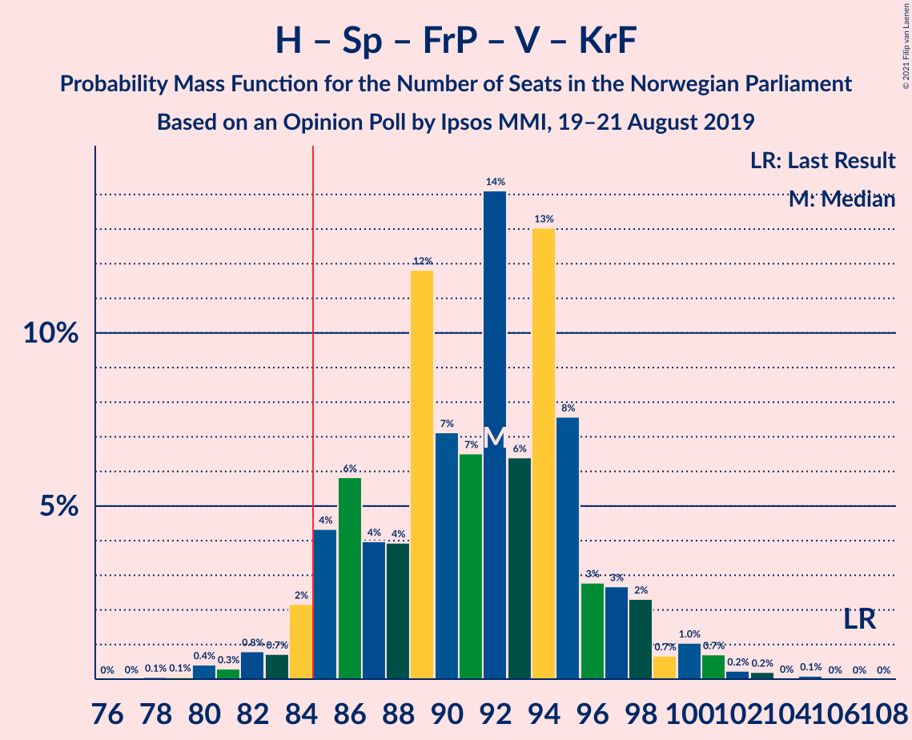

# Opinion Poll by Ipsos MMI, 19–21 August 2019

<a href="#voting-intentions">Voting Intentions</a> | <a href="#seats">Seats</a> | <a href="#coalitions">Coalitions</a> | <a href="#technical-information">Technical Information</a>

## Voting Intentions

### Confidence Intervals

| Party | Last Result | Poll Result | 80% Confidence Interval | 90% Confidence Interval | 95% Confidence Interval | 99% Confidence Interval |
|:-----:|:-----------:|:-----------:|:-----------------------:|:-----------------------:|:-----------------------:|:-----------------------:|
| Arbeiderpartiet | 27.4% | 23.4% | 21.4–25.5% |20.9–26.1% |20.4–26.6% |19.5–27.6% |
| Høyre | 25.0% | 20.9% | 19.0–22.9% |18.5–23.5% |18.0–24.0% |17.2–25.0% |
| Senterpartiet | 10.3% | 16.1% | 14.5–18.0% |14.0–18.5% |13.6–19.0% |12.9–19.9% |
| Fremskrittspartiet | 15.2% | 11.1% | 9.7–12.8% |9.4–13.2% |9.0–13.6% |8.4–14.5% |
| Sosialistisk Venstreparti | 6.0% | 7.9% | 6.8–9.4% |6.4–9.8% |6.2–10.1% |5.7–10.9% |
| Miljøpartiet De Grønne | 3.2% | 6.7% | 5.6–8.0% |5.3–8.4% |5.1–8.7% |4.6–9.4% |
| Rødt | 2.4% | 4.5% | 3.6–5.6% |3.4–5.9% |3.2–6.2% |2.8–6.8% |
| Venstre | 4.4% | 3.1% | 2.4–4.1% |2.2–4.3% |2.0–4.6% |1.7–5.1% |
| Kristelig Folkeparti | 4.2% | 2.6% | 2.0–3.6% |1.8–3.9% |1.7–4.1% |1.4–4.6% |

*Note:* The poll result column reflects the actual value used in the calculations. Published results may vary slightly, and in addition be rounded to fewer digits.

## Seats

### Confidence Intervals

| Party | Last Result | Median | 80% Confidence Interval | 90% Confidence Interval | 95% Confidence Interval | 99% Confidence Interval |
|:-----:|:-----------:|:------:|:-----------------------:|:-----------------------:|:-----------------------:|:-----------------------:|
| <a href="#arbeiderpartiet">Arbeiderpartiet</a> | 49 | 43 | 40–46 |39–47 |37–49 |36–51 |
| <a href="#høyre">Høyre</a> | 45 | 37 | 34–41 |33–42 |32–43 |30–45 |
| <a href="#senterpartiet">Senterpartiet</a> | 19 | 30 | 26–34 |26–35 |25–35 |23–37 |
| <a href="#fremskrittspartiet">Fremskrittspartiet</a> | 27 | 20 | 17–23 |16–24 |15–24 |13–26 |
| <a href="#sosialistisk-venstreparti">Sosialistisk Venstreparti</a> | 11 | 14 | 11–17 |10–17 |10–18 |9–20 |
| <a href="#miljøpartiet-de-grønne">Miljøpartiet De Grønne</a> | 1 | 12 | 9–14 |9–15 |8–15 |7–17 |
| <a href="#rødt">Rødt</a> | 1 | 7 | 2–9 |2–10 |2–10 |2–12 |
| <a href="#venstre">Venstre</a> | 8 | 2 | 1–4 |1–7 |1–7 |0–9 |
| <a href="#kristelig-folkeparti">Kristelig Folkeparti</a> | 8 | 1 | 0–3 |0–3 |0–3 |0–8 |

### Arbeiderpartiet

*For a full overview of the results for this party, see the [Arbeiderpartiet](party-arbeiderpartiet.html) page.*

| Number of Seats | Probability | Accumulated | Special Marks |
|:---------------:|:-----------:|:-----------:|:-------------:|
| 33 | 0% | 100% |  |
| 34 | 0% | 99.9% |  |
| 35 | 0.2% | 99.9% |  |
| 36 | 0.6% | 99.7% |  |
| 37 | 2% | 99.1% |  |
| 38 | 2% | 97% |  |
| 39 | 5% | 95% |  |
| 40 | 5% | 91% |  |
| 41 | 13% | 86% |  |
| 42 | 13% | 73% |  |
| 43 | 12% | 60% | Median |
| 44 | 20% | 48% |  |
| 45 | 15% | 28% |  |
| 46 | 5% | 13% |  |
| 47 | 3% | 8% |  |
| 48 | 1.3% | 5% |  |
| 49 | 1.3% | 4% | Last Result |
| 50 | 2% | 2% |  |
| 51 | 0.6% | 0.8% |  |
| 52 | 0.2% | 0.3% |  |
| 53 | 0% | 0.1% |  |
| 54 | 0% | 0.1% |  |
| 55 | 0% | 0% |  |

### Høyre

*For a full overview of the results for this party, see the [Høyre](party-høyre.html) page.*

| Number of Seats | Probability | Accumulated | Special Marks |
|:---------------:|:-----------:|:-----------:|:-------------:|
| 28 | 0.1% | 100% |  |
| 29 | 0.2% | 99.9% |  |
| 30 | 0.3% | 99.7% |  |
| 31 | 0.9% | 99.4% |  |
| 32 | 2% | 98.5% |  |
| 33 | 5% | 97% |  |
| 34 | 13% | 92% |  |
| 35 | 6% | 78% |  |
| 36 | 10% | 72% |  |
| 37 | 21% | 63% | Median |
| 38 | 12% | 41% |  |
| 39 | 3% | 29% |  |
| 40 | 12% | 26% |  |
| 41 | 9% | 14% |  |
| 42 | 2% | 5% |  |
| 43 | 1.1% | 3% |  |
| 44 | 0.7% | 2% |  |
| 45 | 0.8% | 1.2% | Last Result |
| 46 | 0.3% | 0.4% |  |
| 47 | 0.1% | 0.1% |  |
| 48 | 0% | 0.1% |  |
| 49 | 0% | 0% |  |

### Senterpartiet

*For a full overview of the results for this party, see the [Senterpartiet](party-senterpartiet.html) page.*

| Number of Seats | Probability | Accumulated | Special Marks |
|:---------------:|:-----------:|:-----------:|:-------------:|
| 19 | 0% | 100% | Last Result |
| 20 | 0% | 100% |  |
| 21 | 0.1% | 100% |  |
| 22 | 0.3% | 99.9% |  |
| 23 | 0.4% | 99.6% |  |
| 24 | 1.5% | 99.2% |  |
| 25 | 3% | 98% |  |
| 26 | 7% | 95% |  |
| 27 | 6% | 88% |  |
| 28 | 17% | 83% |  |
| 29 | 7% | 66% |  |
| 30 | 10% | 59% | Median |
| 31 | 19% | 49% |  |
| 32 | 10% | 30% |  |
| 33 | 10% | 20% |  |
| 34 | 5% | 11% |  |
| 35 | 3% | 5% |  |
| 36 | 2% | 2% |  |
| 37 | 0.6% | 0.9% |  |
| 38 | 0.2% | 0.3% |  |
| 39 | 0.1% | 0.1% |  |
| 40 | 0% | 0% |  |

### Fremskrittspartiet

*For a full overview of the results for this party, see the [Fremskrittspartiet](party-fremskrittspartiet.html) page.*

| Number of Seats | Probability | Accumulated | Special Marks |
|:---------------:|:-----------:|:-----------:|:-------------:|
| 12 | 0.1% | 100% |  |
| 13 | 0.4% | 99.9% |  |
| 14 | 0.9% | 99.5% |  |
| 15 | 2% | 98.5% |  |
| 16 | 4% | 96% |  |
| 17 | 10% | 92% |  |
| 18 | 13% | 82% |  |
| 19 | 14% | 69% |  |
| 20 | 22% | 56% | Median |
| 21 | 11% | 34% |  |
| 22 | 12% | 23% |  |
| 23 | 6% | 11% |  |
| 24 | 4% | 6% |  |
| 25 | 1.1% | 2% |  |
| 26 | 0.6% | 0.7% |  |
| 27 | 0.1% | 0.1% | Last Result |
| 28 | 0% | 0% |  |

### Sosialistisk Venstreparti

*For a full overview of the results for this party, see the [Sosialistisk Venstreparti](party-sosialistiskvenstreparti.html) page.*

| Number of Seats | Probability | Accumulated | Special Marks |
|:---------------:|:-----------:|:-----------:|:-------------:|
| 8 | 0.1% | 100% |  |
| 9 | 0.8% | 99.9% |  |
| 10 | 7% | 99.0% |  |
| 11 | 6% | 92% | Last Result |
| 12 | 10% | 86% |  |
| 13 | 14% | 76% |  |
| 14 | 12% | 62% | Median |
| 15 | 26% | 50% |  |
| 16 | 9% | 24% |  |
| 17 | 10% | 15% |  |
| 18 | 3% | 4% |  |
| 19 | 0.6% | 1.3% |  |
| 20 | 0.6% | 0.7% |  |
| 21 | 0.1% | 0.2% |  |
| 22 | 0% | 0% |  |

### Miljøpartiet De Grønne

*For a full overview of the results for this party, see the [Miljøpartiet De Grønne](party-miljøpartietdegrønne.html) page.*

| Number of Seats | Probability | Accumulated | Special Marks |
|:---------------:|:-----------:|:-----------:|:-------------:|
| 1 | 0% | 100% | Last Result |
| 2 | 0% | 100% |  |
| 3 | 0% | 100% |  |
| 4 | 0% | 100% |  |
| 5 | 0% | 100% |  |
| 6 | 0% | 100% |  |
| 7 | 0.6% | 100% |  |
| 8 | 3% | 99.3% |  |
| 9 | 9% | 96% |  |
| 10 | 16% | 88% |  |
| 11 | 13% | 71% |  |
| 12 | 31% | 58% | Median |
| 13 | 12% | 27% |  |
| 14 | 8% | 15% |  |
| 15 | 5% | 7% |  |
| 16 | 1.5% | 2% |  |
| 17 | 0.5% | 0.7% |  |
| 18 | 0.1% | 0.1% |  |
| 19 | 0% | 0% |  |

### Rødt

*For a full overview of the results for this party, see the [Rødt](party-rødt.html) page.*

| Number of Seats | Probability | Accumulated | Special Marks |
|:---------------:|:-----------:|:-----------:|:-------------:|
| 1 | 0.4% | 100% | Last Result |
| 2 | 30% | 99.6% |  |
| 3 | 0% | 69% |  |
| 4 | 0% | 69% |  |
| 5 | 0% | 69% |  |
| 6 | 2% | 69% |  |
| 7 | 20% | 68% | Median |
| 8 | 21% | 48% |  |
| 9 | 20% | 27% |  |
| 10 | 5% | 7% |  |
| 11 | 2% | 2% |  |
| 12 | 0.5% | 0.6% |  |
| 13 | 0.1% | 0.1% |  |
| 14 | 0% | 0% |  |

### Venstre

*For a full overview of the results for this party, see the [Venstre](party-venstre.html) page.*

| Number of Seats | Probability | Accumulated | Special Marks |
|:---------------:|:-----------:|:-----------:|:-------------:|
| 0 | 0.6% | 100% |  |
| 1 | 13% | 99.4% |  |
| 2 | 74% | 87% | Median |
| 3 | 3% | 13% |  |
| 4 | 0.1% | 10% |  |
| 5 | 0% | 10% |  |
| 6 | 0.3% | 10% |  |
| 7 | 7% | 10% |  |
| 8 | 2% | 2% | Last Result |
| 9 | 0.5% | 0.5% |  |
| 10 | 0% | 0% |  |

### Kristelig Folkeparti

*For a full overview of the results for this party, see the [Kristelig Folkeparti](party-kristeligfolkeparti.html) page.*

| Number of Seats | Probability | Accumulated | Special Marks |
|:---------------:|:-----------:|:-----------:|:-------------:|
| 0 | 23% | 100% |  |
| 1 | 53% | 77% | Median |
| 2 | 11% | 24% |  |
| 3 | 11% | 13% |  |
| 4 | 0% | 2% |  |
| 5 | 0% | 2% |  |
| 6 | 0.7% | 2% |  |
| 7 | 0.6% | 1.4% |  |
| 8 | 0.7% | 0.8% | Last Result |
| 9 | 0.1% | 0.1% |  |
| 10 | 0% | 0% |  |

## Coalitions

### Confidence Intervals

| Coalition | Last Result | Median | Majority? | 80% Confidence Interval | 90% Confidence Interval | 95% Confidence Interval | 99% Confidence Interval |
|:---------:|:-----------:|:------:|:---------:|:-----------------------:|:-----------------------:|:-----------------------:|:-----------------------:|
| Arbeiderpartiet – Senterpartiet – Sosialistisk Venstreparti – Miljøpartiet De Grønne – Rødt | 81 | 106 | 100% | 99–110 | 99–111 | 97–112 | 93–115 |
| Arbeiderpartiet – Senterpartiet – Sosialistisk Venstreparti – Miljøpartiet De Grønne – Kristelig Folkeparti | 88 | 100 | 100% | 95–105 | 94–107 | 92–107 | 89–111 |
| Arbeiderpartiet – Senterpartiet – Sosialistisk Venstreparti – Miljøpartiet De Grønne | 80 | 99 | 100% | 93–104 | 93–105 | 91–107 | 88–110 |
| Arbeiderpartiet – Senterpartiet – Sosialistisk Venstreparti – Rødt | 80 | 94 | 98% | 89–99 | 87–99 | 85–101 | 82–104 |
| Høyre – Senterpartiet – Fremskrittspartiet – Venstre – Kristelig Folkeparti | 107 | 90 | 95% | 85–95 | 85–98 | 83–99 | 80–102 |
| Arbeiderpartiet – Senterpartiet – Sosialistisk Venstreparti | 79 | 88 | 78% | 83–91 | 81–93 | 80–94 | 77–96 |
| Arbeiderpartiet – Senterpartiet – Miljøpartiet De Grønne – Kristelig Folkeparti | 77 | 86 | 68% | 81–90 | 80–93 | 79–94 | 76–95 |
| Arbeiderpartiet – Senterpartiet – Kristelig Folkeparti | 76 | 74 | 0.2% | 70–79 | 68–80 | 67–82 | 65–84 |
| Arbeiderpartiet – Senterpartiet | 68 | 73 | 0% | 69–78 | 67–79 | 66–80 | 64–81 |
| Høyre – Fremskrittspartiet – Miljøpartiet De Grønne – Venstre – Kristelig Folkeparti | 89 | 73 | 0.4% | 66–78 | 64–79 | 63–80 | 62–84 |
| Høyre – Fremskrittspartiet – Venstre – Kristelig Folkeparti | 88 | 61 | 0% | 54–66 | 54–67 | 53–68 | 51–72 |
| Høyre – Fremskrittspartiet – Venstre | 80 | 60 | 0% | 53–64 | 53–66 | 52–67 | 50–70 |
| Høyre – Fremskrittspartiet | 72 | 57 | 0% | 51–61 | 50–64 | 50–65 | 48–67 |
| Arbeiderpartiet – Sosialistisk Venstreparti | 60 | 57 | 0% | 53–61 | 52–62 | 51–63 | 48–65 |
| Høyre – Venstre – Kristelig Folkeparti | 61 | 41 | 0% | 36–45 | 36–47 | 36–48 | 34–51 |
| Senterpartiet – Venstre – Kristelig Folkeparti | 35 | 34 | 0% | 30–38 | 29–40 | 28–42 | 26–44 |

### Arbeiderpartiet – Senterpartiet – Sosialistisk Venstreparti – Miljøpartiet De Grønne – Rødt

| Number of Seats | Probability | Accumulated | Special Marks |
|:---------------:|:-----------:|:-----------:|:-------------:|
| 81 | 0% | 100% | Last Result |
| 82 | 0% | 100% |  |
| 83 | 0% | 100% |  |
| 84 | 0% | 100% |  |
| 85 | 0% | 100% | Majority |
| 86 | 0% | 100% |  |
| 87 | 0% | 100% |  |
| 88 | 0% | 100% |  |
| 89 | 0% | 100% |  |
| 90 | 0% | 100% |  |
| 91 | 0.1% | 100% |  |
| 92 | 0.1% | 99.8% |  |
| 93 | 0.6% | 99.8% |  |
| 94 | 0.4% | 99.2% |  |
| 95 | 0.2% | 98.7% |  |
| 96 | 0.9% | 98.6% |  |
| 97 | 2% | 98% |  |
| 98 | 0.6% | 96% |  |
| 99 | 7% | 95% |  |
| 100 | 2% | 88% |  |
| 101 | 4% | 86% |  |
| 102 | 10% | 82% |  |
| 103 | 7% | 72% |  |
| 104 | 4% | 65% |  |
| 105 | 6% | 60% |  |
| 106 | 10% | 54% | Median |
| 107 | 5% | 43% |  |
| 108 | 23% | 39% |  |
| 109 | 4% | 16% |  |
| 110 | 3% | 12% |  |
| 111 | 5% | 9% |  |
| 112 | 1.1% | 3% |  |
| 113 | 0.4% | 2% |  |
| 114 | 0.9% | 2% |  |
| 115 | 0.7% | 0.9% |  |
| 116 | 0% | 0.2% |  |
| 117 | 0.1% | 0.1% |  |
| 118 | 0% | 0% |  |

### Arbeiderpartiet – Senterpartiet – Sosialistisk Venstreparti – Miljøpartiet De Grønne – Kristelig Folkeparti

| Number of Seats | Probability | Accumulated | Special Marks |
|:---------------:|:-----------:|:-----------:|:-------------:|
| 86 | 0% | 100% |  |
| 87 | 0.2% | 99.9% |  |
| 88 | 0.2% | 99.7% | Last Result |
| 89 | 0.1% | 99.6% |  |
| 90 | 0.8% | 99.4% |  |
| 91 | 0.3% | 98.6% |  |
| 92 | 0.9% | 98% |  |
| 93 | 1.2% | 97% |  |
| 94 | 4% | 96% |  |
| 95 | 3% | 92% |  |
| 96 | 5% | 89% |  |
| 97 | 8% | 84% |  |
| 98 | 12% | 77% |  |
| 99 | 4% | 65% |  |
| 100 | 18% | 61% | Median |
| 101 | 12% | 43% |  |
| 102 | 5% | 31% |  |
| 103 | 6% | 26% |  |
| 104 | 3% | 20% |  |
| 105 | 10% | 17% |  |
| 106 | 1.4% | 7% |  |
| 107 | 3% | 5% |  |
| 108 | 0.7% | 2% |  |
| 109 | 0.8% | 2% |  |
| 110 | 0.3% | 0.9% |  |
| 111 | 0.5% | 0.6% |  |
| 112 | 0.1% | 0.1% |  |
| 113 | 0% | 0% |  |

### Arbeiderpartiet – Senterpartiet – Sosialistisk Venstreparti – Miljøpartiet De Grønne

| Number of Seats | Probability | Accumulated | Special Marks |
|:---------------:|:-----------:|:-----------:|:-------------:|
| 80 | 0% | 100% | Last Result |
| 81 | 0% | 100% |  |
| 82 | 0% | 100% |  |
| 83 | 0% | 100% |  |
| 84 | 0% | 100% |  |
| 85 | 0.1% | 100% | Majority |
| 86 | 0.2% | 99.9% |  |
| 87 | 0.2% | 99.7% |  |
| 88 | 0.2% | 99.5% |  |
| 89 | 0.8% | 99.3% |  |
| 90 | 0.7% | 98% |  |
| 91 | 1.5% | 98% |  |
| 92 | 0.9% | 96% |  |
| 93 | 5% | 95% |  |
| 94 | 2% | 90% |  |
| 95 | 9% | 88% |  |
| 96 | 5% | 79% |  |
| 97 | 11% | 74% |  |
| 98 | 4% | 63% |  |
| 99 | 12% | 59% | Median |
| 100 | 16% | 47% |  |
| 101 | 10% | 31% |  |
| 102 | 3% | 22% |  |
| 103 | 3% | 18% |  |
| 104 | 10% | 15% |  |
| 105 | 0.8% | 5% |  |
| 106 | 2% | 4% |  |
| 107 | 2% | 3% |  |
| 108 | 0.2% | 1.0% |  |
| 109 | 0.1% | 0.8% |  |
| 110 | 0.5% | 0.6% |  |
| 111 | 0.1% | 0.1% |  |
| 112 | 0% | 0% |  |

### Arbeiderpartiet – Senterpartiet – Sosialistisk Venstreparti – Rødt

| Number of Seats | Probability | Accumulated | Special Marks |
|:---------------:|:-----------:|:-----------:|:-------------:|
| 79 | 0% | 100% |  |
| 80 | 0.1% | 99.9% | Last Result |
| 81 | 0.2% | 99.9% |  |
| 82 | 0.2% | 99.6% |  |
| 83 | 0.4% | 99.4% |  |
| 84 | 0.7% | 99.0% |  |
| 85 | 2% | 98% | Majority |
| 86 | 1.0% | 97% |  |
| 87 | 1.2% | 96% |  |
| 88 | 2% | 94% |  |
| 89 | 9% | 92% |  |
| 90 | 4% | 83% |  |
| 91 | 10% | 79% |  |
| 92 | 10% | 68% |  |
| 93 | 7% | 58% |  |
| 94 | 6% | 51% | Median |
| 95 | 6% | 45% |  |
| 96 | 19% | 39% |  |
| 97 | 7% | 20% |  |
| 98 | 4% | 14% |  |
| 99 | 6% | 10% |  |
| 100 | 1.1% | 4% |  |
| 101 | 1.0% | 3% |  |
| 102 | 0.6% | 2% |  |
| 103 | 0.4% | 1.0% |  |
| 104 | 0.5% | 0.7% |  |
| 105 | 0.1% | 0.1% |  |
| 106 | 0% | 0% |  |

### Høyre – Senterpartiet – Fremskrittspartiet – Venstre – Kristelig Folkeparti

| Number of Seats | Probability | Accumulated | Special Marks |
|:---------------:|:-----------:|:-----------:|:-------------:|
| 79 | 0% | 100% |  |
| 80 | 0.6% | 99.9% |  |
| 81 | 0.4% | 99.3% |  |
| 82 | 1.1% | 99.0% |  |
| 83 | 0.7% | 98% |  |
| 84 | 2% | 97% |  |
| 85 | 6% | 95% | Majority |
| 86 | 7% | 89% |  |
| 87 | 5% | 82% |  |
| 88 | 4% | 77% |  |
| 89 | 18% | 73% |  |
| 90 | 8% | 56% | Median |
| 91 | 6% | 48% |  |
| 92 | 8% | 42% |  |
| 93 | 6% | 34% |  |
| 94 | 15% | 28% |  |
| 95 | 4% | 13% |  |
| 96 | 2% | 9% |  |
| 97 | 2% | 7% |  |
| 98 | 2% | 5% |  |
| 99 | 0.9% | 3% |  |
| 100 | 1.4% | 2% |  |
| 101 | 0.4% | 0.9% |  |
| 102 | 0.1% | 0.5% |  |
| 103 | 0.3% | 0.4% |  |
| 104 | 0% | 0.1% |  |
| 105 | 0% | 0% |  |
| 106 | 0% | 0% |  |
| 107 | 0% | 0% | Last Result |

### Arbeiderpartiet – Senterpartiet – Sosialistisk Venstreparti

| Number of Seats | Probability | Accumulated | Special Marks |
|:---------------:|:-----------:|:-----------:|:-------------:|
| 74 | 0% | 100% |  |
| 75 | 0.1% | 99.9% |  |
| 76 | 0.2% | 99.9% |  |
| 77 | 0.3% | 99.7% |  |
| 78 | 0.5% | 99.4% |  |
| 79 | 1.0% | 98.9% | Last Result |
| 80 | 3% | 98% |  |
| 81 | 1.3% | 95% |  |
| 82 | 3% | 94% |  |
| 83 | 8% | 91% |  |
| 84 | 5% | 82% |  |
| 85 | 7% | 78% | Majority |
| 86 | 4% | 71% |  |
| 87 | 14% | 66% | Median |
| 88 | 16% | 52% |  |
| 89 | 10% | 36% |  |
| 90 | 10% | 26% |  |
| 91 | 7% | 16% |  |
| 92 | 4% | 9% |  |
| 93 | 2% | 5% |  |
| 94 | 1.1% | 3% |  |
| 95 | 1.1% | 2% |  |
| 96 | 0.4% | 0.9% |  |
| 97 | 0.1% | 0.4% |  |
| 98 | 0.2% | 0.3% |  |
| 99 | 0% | 0.1% |  |
| 100 | 0% | 0% |  |

### Arbeiderpartiet – Senterpartiet – Miljøpartiet De Grønne – Kristelig Folkeparti

| Number of Seats | Probability | Accumulated | Special Marks |
|:---------------:|:-----------:|:-----------:|:-------------:|
| 74 | 0% | 100% |  |
| 75 | 0.2% | 99.9% |  |
| 76 | 0.3% | 99.7% |  |
| 77 | 1.0% | 99.4% | Last Result |
| 78 | 0.5% | 98% |  |
| 79 | 2% | 98% |  |
| 80 | 2% | 96% |  |
| 81 | 6% | 94% |  |
| 82 | 3% | 88% |  |
| 83 | 13% | 86% |  |
| 84 | 4% | 72% |  |
| 85 | 14% | 68% | Majority |
| 86 | 11% | 54% | Median |
| 87 | 10% | 44% |  |
| 88 | 7% | 34% |  |
| 89 | 9% | 26% |  |
| 90 | 8% | 18% |  |
| 91 | 2% | 10% |  |
| 92 | 3% | 8% |  |
| 93 | 2% | 5% |  |
| 94 | 2% | 3% |  |
| 95 | 0.7% | 1.1% |  |
| 96 | 0.1% | 0.4% |  |
| 97 | 0.1% | 0.3% |  |
| 98 | 0.2% | 0.2% |  |
| 99 | 0% | 0% |  |

### Arbeiderpartiet – Senterpartiet – Kristelig Folkeparti

| Number of Seats | Probability | Accumulated | Special Marks |
|:---------------:|:-----------:|:-----------:|:-------------:|
| 63 | 0.1% | 100% |  |
| 64 | 0.2% | 99.9% |  |
| 65 | 0.4% | 99.7% |  |
| 66 | 1.2% | 99.3% |  |
| 67 | 1.1% | 98% |  |
| 68 | 3% | 97% |  |
| 69 | 3% | 94% |  |
| 70 | 5% | 92% |  |
| 71 | 7% | 87% |  |
| 72 | 6% | 80% |  |
| 73 | 22% | 74% |  |
| 74 | 8% | 53% | Median |
| 75 | 8% | 45% |  |
| 76 | 7% | 37% | Last Result |
| 77 | 13% | 30% |  |
| 78 | 3% | 17% |  |
| 79 | 4% | 14% |  |
| 80 | 5% | 9% |  |
| 81 | 2% | 5% |  |
| 82 | 1.3% | 3% |  |
| 83 | 0.4% | 1.4% |  |
| 84 | 0.7% | 0.9% |  |
| 85 | 0.1% | 0.2% | Majority |
| 86 | 0.1% | 0.1% |  |
| 87 | 0% | 0% |  |

### Arbeiderpartiet – Senterpartiet

| Number of Seats | Probability | Accumulated | Special Marks |
|:---------------:|:-----------:|:-----------:|:-------------:|
| 61 | 0% | 100% |  |
| 62 | 0.1% | 99.9% |  |
| 63 | 0.3% | 99.9% |  |
| 64 | 0.5% | 99.6% |  |
| 65 | 1.4% | 99.1% |  |
| 66 | 2% | 98% |  |
| 67 | 2% | 96% |  |
| 68 | 3% | 94% | Last Result |
| 69 | 6% | 91% |  |
| 70 | 9% | 86% |  |
| 71 | 6% | 77% |  |
| 72 | 15% | 71% |  |
| 73 | 13% | 56% | Median |
| 74 | 6% | 43% |  |
| 75 | 9% | 37% |  |
| 76 | 14% | 29% |  |
| 77 | 4% | 14% |  |
| 78 | 3% | 10% |  |
| 79 | 4% | 7% |  |
| 80 | 2% | 3% |  |
| 81 | 0.9% | 1.4% |  |
| 82 | 0.4% | 0.5% |  |
| 83 | 0.1% | 0.1% |  |
| 84 | 0% | 0% |  |

### Høyre – Fremskrittspartiet – Miljøpartiet De Grønne – Venstre – Kristelig Folkeparti

| Number of Seats | Probability | Accumulated | Special Marks |
|:---------------:|:-----------:|:-----------:|:-------------:|
| 60 | 0.1% | 100% |  |
| 61 | 0.1% | 99.9% |  |
| 62 | 0.5% | 99.8% |  |
| 63 | 3% | 99.4% |  |
| 64 | 1.3% | 96% |  |
| 65 | 3% | 95% |  |
| 66 | 7% | 92% |  |
| 67 | 3% | 85% |  |
| 68 | 3% | 81% |  |
| 69 | 2% | 78% |  |
| 70 | 6% | 76% |  |
| 71 | 11% | 70% |  |
| 72 | 6% | 59% | Median |
| 73 | 19% | 53% |  |
| 74 | 5% | 34% |  |
| 75 | 7% | 29% |  |
| 76 | 6% | 23% |  |
| 77 | 4% | 17% |  |
| 78 | 6% | 14% |  |
| 79 | 2% | 7% |  |
| 80 | 2% | 5% |  |
| 81 | 0.7% | 2% |  |
| 82 | 0.5% | 2% |  |
| 83 | 0.4% | 1.3% |  |
| 84 | 0.4% | 0.8% |  |
| 85 | 0.1% | 0.4% | Majority |
| 86 | 0% | 0.3% |  |
| 87 | 0% | 0.2% |  |
| 88 | 0.2% | 0.2% |  |
| 89 | 0% | 0% | Last Result |

### Høyre – Fremskrittspartiet – Venstre – Kristelig Folkeparti

| Number of Seats | Probability | Accumulated | Special Marks |
|:---------------:|:-----------:|:-----------:|:-------------:|
| 50 | 0.1% | 100% |  |
| 51 | 0.5% | 99.9% |  |
| 52 | 1.0% | 99.4% |  |
| 53 | 2% | 98% |  |
| 54 | 9% | 97% |  |
| 55 | 2% | 88% |  |
| 56 | 3% | 86% |  |
| 57 | 3% | 83% |  |
| 58 | 8% | 79% |  |
| 59 | 6% | 72% |  |
| 60 | 8% | 66% | Median |
| 61 | 20% | 58% |  |
| 62 | 5% | 38% |  |
| 63 | 14% | 32% |  |
| 64 | 6% | 18% |  |
| 65 | 2% | 12% |  |
| 66 | 4% | 11% |  |
| 67 | 3% | 7% |  |
| 68 | 2% | 4% |  |
| 69 | 0.5% | 2% |  |
| 70 | 1.0% | 2% |  |
| 71 | 0.3% | 0.8% |  |
| 72 | 0.2% | 0.6% |  |
| 73 | 0.1% | 0.4% |  |
| 74 | 0.1% | 0.3% |  |
| 75 | 0% | 0.2% |  |
| 76 | 0.2% | 0.2% |  |
| 77 | 0% | 0% |  |
| 78 | 0% | 0% |  |
| 79 | 0% | 0% |  |
| 80 | 0% | 0% |  |
| 81 | 0% | 0% |  |
| 82 | 0% | 0% |  |
| 83 | 0% | 0% |  |
| 84 | 0% | 0% |  |
| 85 | 0% | 0% | Majority |
| 86 | 0% | 0% |  |
| 87 | 0% | 0% |  |
| 88 | 0% | 0% | Last Result |

### Høyre – Fremskrittspartiet – Venstre

| Number of Seats | Probability | Accumulated | Special Marks |
|:---------------:|:-----------:|:-----------:|:-------------:|
| 48 | 0% | 100% |  |
| 49 | 0.1% | 99.9% |  |
| 50 | 2% | 99.8% |  |
| 51 | 0.7% | 98% |  |
| 52 | 2% | 98% |  |
| 53 | 6% | 95% |  |
| 54 | 4% | 89% |  |
| 55 | 5% | 85% |  |
| 56 | 3% | 80% |  |
| 57 | 7% | 77% |  |
| 58 | 6% | 70% |  |
| 59 | 12% | 63% | Median |
| 60 | 10% | 51% |  |
| 61 | 11% | 41% |  |
| 62 | 14% | 31% |  |
| 63 | 5% | 17% |  |
| 64 | 2% | 12% |  |
| 65 | 2% | 10% |  |
| 66 | 4% | 8% |  |
| 67 | 2% | 3% |  |
| 68 | 0.5% | 2% |  |
| 69 | 0.6% | 1.3% |  |
| 70 | 0.2% | 0.7% |  |
| 71 | 0.2% | 0.5% |  |
| 72 | 0% | 0.3% |  |
| 73 | 0% | 0.2% |  |
| 74 | 0% | 0.2% |  |
| 75 | 0.2% | 0.2% |  |
| 76 | 0% | 0% |  |
| 77 | 0% | 0% |  |
| 78 | 0% | 0% |  |
| 79 | 0% | 0% |  |
| 80 | 0% | 0% | Last Result |

### Høyre – Fremskrittspartiet

| Number of Seats | Probability | Accumulated | Special Marks |
|:---------------:|:-----------:|:-----------:|:-------------:|
| 45 | 0% | 100% |  |
| 46 | 0% | 99.9% |  |
| 47 | 0.2% | 99.9% |  |
| 48 | 2% | 99.7% |  |
| 49 | 0.6% | 98% |  |
| 50 | 3% | 98% |  |
| 51 | 7% | 95% |  |
| 52 | 5% | 88% |  |
| 53 | 4% | 83% |  |
| 54 | 4% | 79% |  |
| 55 | 9% | 74% |  |
| 56 | 10% | 66% |  |
| 57 | 8% | 56% | Median |
| 58 | 7% | 48% |  |
| 59 | 16% | 41% |  |
| 60 | 14% | 25% |  |
| 61 | 2% | 12% |  |
| 62 | 2% | 10% |  |
| 63 | 2% | 7% |  |
| 64 | 3% | 6% |  |
| 65 | 1.3% | 3% |  |
| 66 | 0.5% | 2% |  |
| 67 | 0.7% | 1.1% |  |
| 68 | 0.1% | 0.3% |  |
| 69 | 0.2% | 0.2% |  |
| 70 | 0% | 0% |  |
| 71 | 0% | 0% |  |
| 72 | 0% | 0% | Last Result |

### Arbeiderpartiet – Sosialistisk Venstreparti

| Number of Seats | Probability | Accumulated | Special Marks |
|:---------------:|:-----------:|:-----------:|:-------------:|
| 46 | 0.2% | 100% |  |
| 47 | 0.1% | 99.8% |  |
| 48 | 0.4% | 99.7% |  |
| 49 | 0.3% | 99.3% |  |
| 50 | 1.3% | 99.0% |  |
| 51 | 2% | 98% |  |
| 52 | 5% | 96% |  |
| 53 | 4% | 91% |  |
| 54 | 8% | 87% |  |
| 55 | 5% | 79% |  |
| 56 | 18% | 73% |  |
| 57 | 9% | 56% | Median |
| 58 | 9% | 46% |  |
| 59 | 12% | 38% |  |
| 60 | 14% | 25% | Last Result |
| 61 | 2% | 12% |  |
| 62 | 5% | 9% |  |
| 63 | 2% | 5% |  |
| 64 | 0.5% | 2% |  |
| 65 | 1.3% | 2% |  |
| 66 | 0.1% | 0.4% |  |
| 67 | 0.1% | 0.3% |  |
| 68 | 0.2% | 0.3% |  |
| 69 | 0% | 0% |  |

### Høyre – Venstre – Kristelig Folkeparti

| Number of Seats | Probability | Accumulated | Special Marks |
|:---------------:|:-----------:|:-----------:|:-------------:|
| 31 | 0.1% | 100% |  |
| 32 | 0.1% | 99.9% |  |
| 33 | 0.2% | 99.8% |  |
| 34 | 0.6% | 99.6% |  |
| 35 | 0.8% | 99.0% |  |
| 36 | 9% | 98% |  |
| 37 | 8% | 90% |  |
| 38 | 6% | 82% |  |
| 39 | 11% | 76% |  |
| 40 | 13% | 65% | Median |
| 41 | 13% | 52% |  |
| 42 | 6% | 39% |  |
| 43 | 13% | 33% |  |
| 44 | 8% | 20% |  |
| 45 | 3% | 11% |  |
| 46 | 2% | 8% |  |
| 47 | 3% | 6% |  |
| 48 | 2% | 3% |  |
| 49 | 0.3% | 2% |  |
| 50 | 0.5% | 1.2% |  |
| 51 | 0.2% | 0.7% |  |
| 52 | 0.2% | 0.5% |  |
| 53 | 0.1% | 0.2% |  |
| 54 | 0.1% | 0.1% |  |
| 55 | 0% | 0% |  |
| 56 | 0% | 0% |  |
| 57 | 0% | 0% |  |
| 58 | 0% | 0% |  |
| 59 | 0% | 0% |  |
| 60 | 0% | 0% |  |
| 61 | 0% | 0% | Last Result |

### Senterpartiet – Venstre – Kristelig Folkeparti

| Number of Seats | Probability | Accumulated | Special Marks |
|:---------------:|:-----------:|:-----------:|:-------------:|
| 24 | 0.1% | 100% |  |
| 25 | 0.2% | 99.9% |  |
| 26 | 0.4% | 99.7% |  |
| 27 | 1.5% | 99.2% |  |
| 28 | 2% | 98% |  |
| 29 | 2% | 95% |  |
| 30 | 16% | 94% |  |
| 31 | 8% | 78% |  |
| 32 | 6% | 69% |  |
| 33 | 9% | 64% | Median |
| 34 | 17% | 55% |  |
| 35 | 13% | 38% | Last Result |
| 36 | 5% | 25% |  |
| 37 | 7% | 20% |  |
| 38 | 5% | 12% |  |
| 39 | 2% | 8% |  |
| 40 | 2% | 6% |  |
| 41 | 1.4% | 4% |  |
| 42 | 1.4% | 3% |  |
| 43 | 0.4% | 1.2% |  |
| 44 | 0.4% | 0.8% |  |
| 45 | 0.1% | 0.3% |  |
| 46 | 0.2% | 0.3% |  |
| 47 | 0% | 0% |  |

## Technical Information

### Opinion Poll

+ **Polling firm:** Ipsos MMI
+ **Commissioner(s):** —
+ **Fieldwork period:** 19–21 August 2019

### Calculations

+ **Sample size:** 719
+ **Simulations done:** 524,288
+ **Error estimate:** 2.77%

