# Opinion Poll by Ipsos MMI, 19–21 August 2019

<a href="#voting-intentions">Voting Intentions</a> | <a href="#seats">Seats</a> | <a href="#coalitions">Coalitions</a> | <a href="#technical-information">Technical Information</a>

## Voting Intentions

### Confidence Intervals

| Party | Last Result | Poll Result | 80% Confidence Interval | 90% Confidence Interval | 95% Confidence Interval | 99% Confidence Interval |
|:-----:|:-----------:|:-----------:|:-----------------------:|:-----------------------:|:-----------------------:|:-----------------------:|
| Arbeiderpartiet | 27.4% | 23.4% | 21.4–25.5% |20.9–26.1% |20.4–26.6% |19.5–27.6% |
| Høyre | 25.0% | 20.9% | 19.0–22.9% |18.5–23.5% |18.0–24.0% |17.2–25.0% |
| Senterpartiet | 10.3% | 16.1% | 14.5–18.0% |14.0–18.5% |13.6–19.0% |12.9–19.9% |
| Fremskrittspartiet | 15.2% | 11.1% | 9.7–12.8% |9.4–13.2% |9.0–13.6% |8.4–14.5% |
| Sosialistisk Venstreparti | 6.0% | 7.9% | 6.8–9.4% |6.4–9.8% |6.2–10.1% |5.7–10.9% |
| Miljøpartiet De Grønne | 3.2% | 6.7% | 5.6–8.0% |5.3–8.4% |5.1–8.7% |4.6–9.4% |
| Rødt | 2.4% | 4.5% | 3.6–5.6% |3.4–5.9% |3.2–6.2% |2.8–6.8% |
| Venstre | 4.4% | 3.1% | 2.4–4.1% |2.2–4.3% |2.0–4.6% |1.7–5.1% |
| Kristelig Folkeparti | 4.2% | 2.6% | 2.0–3.6% |1.8–3.9% |1.7–4.1% |1.4–4.6% |

*Note:* The poll result column reflects the actual value used in the calculations. Published results may vary slightly, and in addition be rounded to fewer digits.

## Seats

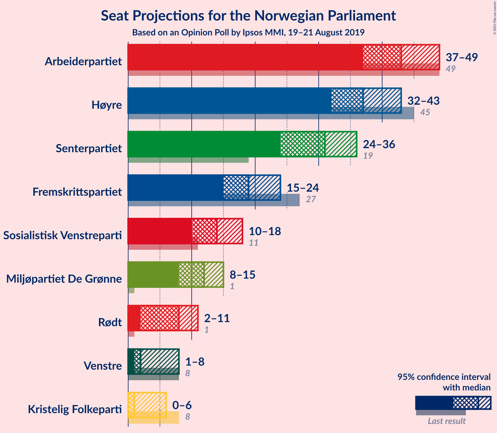

### Confidence Intervals

| Party | Last Result | Median | 80% Confidence Interval | 90% Confidence Interval | 95% Confidence Interval | 99% Confidence Interval |
|:-----:|:-----------:|:------:|:-----------------------:|:-----------------------:|:-----------------------:|:-----------------------:|
| <a href="#arbeiderpartiet">Arbeiderpartiet</a> | 49 | 44 | 40–45 |40–45 |40–45 |35–47 |
| <a href="#høyre">Høyre</a> | 45 | 38 | 37–44 |37–47 |36–47 |34–47 |
| <a href="#senterpartiet">Senterpartiet</a> | 19 | 25 | 25–30 |25–32 |25–32 |22–32 |
| <a href="#fremskrittspartiet">Fremskrittspartiet</a> | 27 | 20 | 17–29 |17–29 |17–29 |17–29 |
| <a href="#sosialistisk-venstreparti">Sosialistisk Venstreparti</a> | 11 | 16 | 13–18 |13–18 |12–18 |10–18 |
| <a href="#miljøpartiet-de-grønne">Miljøpartiet De Grønne</a> | 1 | 13 | 11–16 |11–16 |10–16 |9–16 |
| <a href="#rødt">Rødt</a> | 1 | 2 | 2–12 |2–12 |2–12 |2–12 |
| <a href="#venstre">Venstre</a> | 8 | 2 | 2–9 |2–9 |1–9 |0–9 |
| <a href="#kristelig-folkeparti">Kristelig Folkeparti</a> | 8 | 1 | 0–2 |0–2 |0–2 |0–3 |

### Arbeiderpartiet

*For a full overview of the results for this party, see the [Arbeiderpartiet](party-arbeiderpartiet.html) page.*

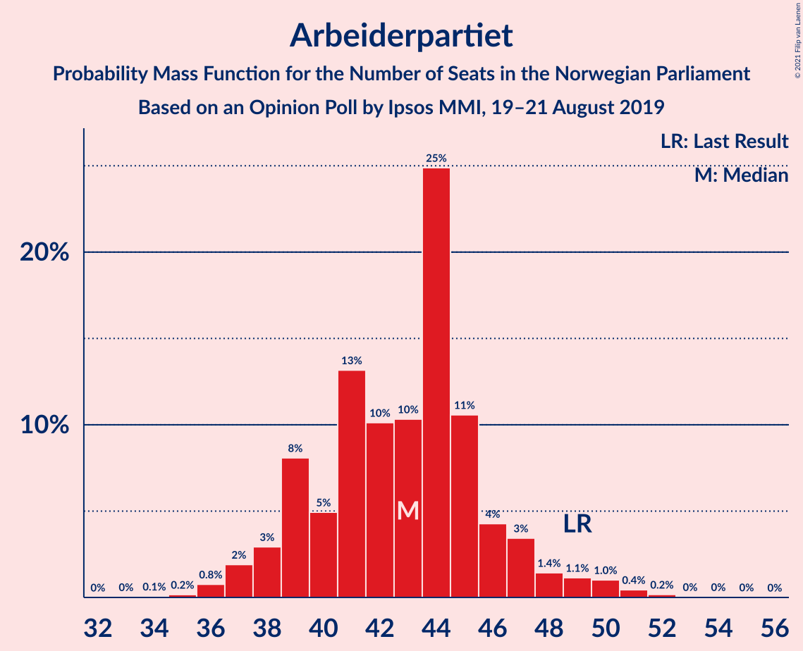

| Number of Seats | Probability | Accumulated | Special Marks |
|:---------------:|:-----------:|:-----------:|:-------------:|
| 35 | 1.1% | 100% |  |
| 36 | 0% | 98.9% |  |
| 37 | 0% | 98.8% |  |
| 38 | 0% | 98.8% |  |
| 39 | 0% | 98.8% |  |
| 40 | 25% | 98.8% |  |
| 41 | 0.5% | 74% |  |
| 42 | 9% | 74% |  |
| 43 | 10% | 64% |  |
| 44 | 17% | 55% | Median |
| 45 | 37% | 37% |  |
| 46 | 0% | 0.6% |  |
| 47 | 0.5% | 0.6% |  |
| 48 | 0% | 0.1% |  |
| 49 | 0.1% | 0.1% | Last Result |
| 50 | 0% | 0% |  |

### Høyre

*For a full overview of the results for this party, see the [Høyre](party-høyre.html) page.*

| Number of Seats | Probability | Accumulated | Special Marks |
|:---------------:|:-----------:|:-----------:|:-------------:|
| 31 | 0.1% | 100% |  |
| 32 | 0% | 99.9% |  |
| 33 | 0% | 99.9% |  |
| 34 | 0.7% | 99.9% |  |
| 35 | 0.9% | 99.3% |  |
| 36 | 1.0% | 98% |  |
| 37 | 25% | 97% |  |
| 38 | 61% | 72% | Median |
| 39 | 0% | 12% |  |
| 40 | 0.5% | 12% |  |
| 41 | 0.3% | 11% |  |
| 42 | 0% | 11% |  |
| 43 | 0% | 11% |  |
| 44 | 1.2% | 11% |  |
| 45 | 0% | 9% | Last Result |
| 46 | 3% | 9% |  |
| 47 | 7% | 7% |  |
| 48 | 0% | 0.1% |  |
| 49 | 0.1% | 0.1% |  |
| 50 | 0% | 0% |  |

### Senterpartiet

*For a full overview of the results for this party, see the [Senterpartiet](party-senterpartiet.html) page.*

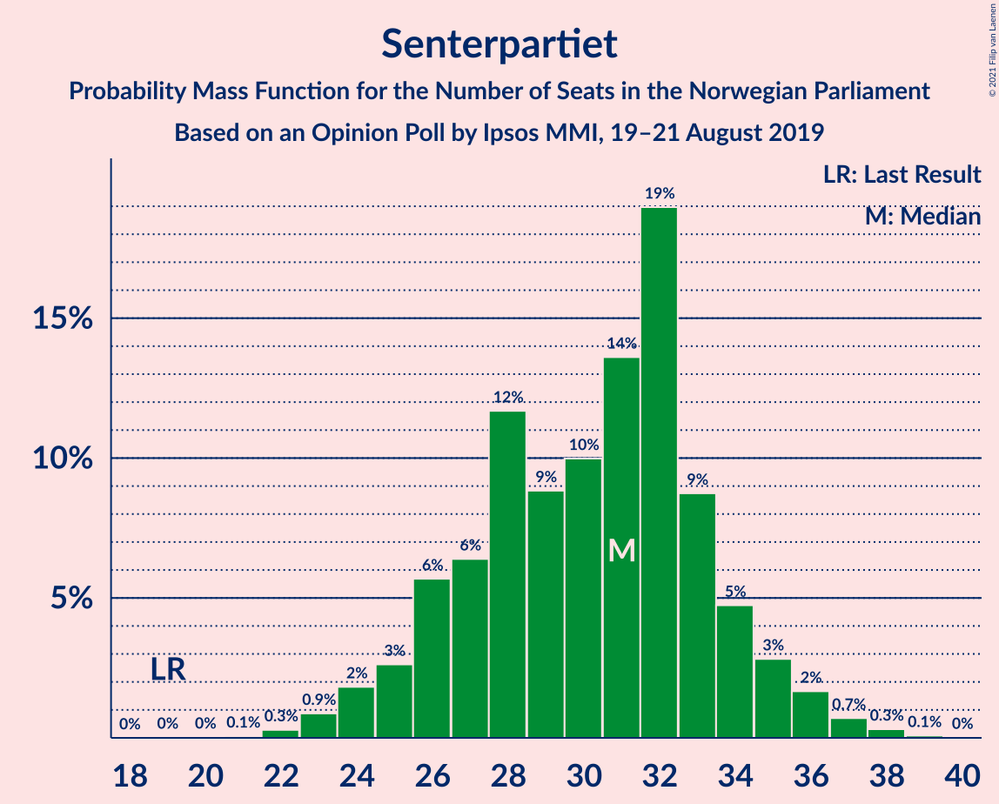

| Number of Seats | Probability | Accumulated | Special Marks |
|:---------------:|:-----------:|:-----------:|:-------------:|
| 19 | 0% | 100% | Last Result |
| 20 | 0% | 100% |  |
| 21 | 0.5% | 100% |  |
| 22 | 0% | 99.5% |  |
| 23 | 0.6% | 99.5% |  |
| 24 | 1.1% | 98.9% |  |
| 25 | 69% | 98% | Median |
| 26 | 1.2% | 29% |  |
| 27 | 17% | 28% |  |
| 28 | 0% | 11% |  |
| 29 | 0% | 11% |  |
| 30 | 2% | 11% |  |
| 31 | 0% | 9% |  |
| 32 | 8% | 9% |  |
| 33 | 0.1% | 0.2% |  |
| 34 | 0% | 0.1% |  |
| 35 | 0.1% | 0.1% |  |
| 36 | 0% | 0% |  |

### Fremskrittspartiet

*For a full overview of the results for this party, see the [Fremskrittspartiet](party-fremskrittspartiet.html) page.*

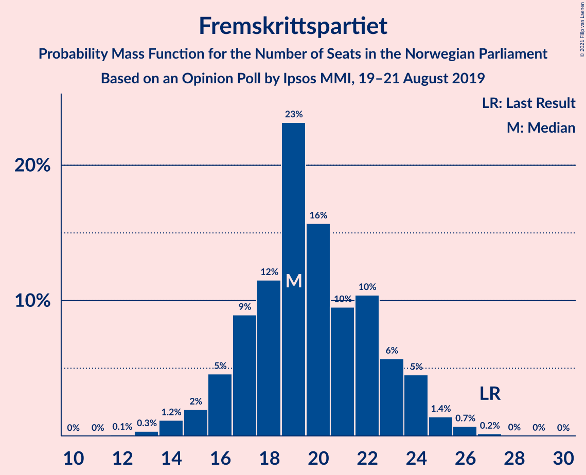

| Number of Seats | Probability | Accumulated | Special Marks |
|:---------------:|:-----------:|:-----------:|:-------------:|
| 14 | 0.2% | 100% |  |
| 15 | 0% | 99.8% |  |
| 16 | 0% | 99.8% |  |
| 17 | 37% | 99.7% |  |
| 18 | 4% | 63% |  |
| 19 | 0.1% | 59% |  |
| 20 | 32% | 59% | Median |
| 21 | 0.4% | 27% |  |
| 22 | 2% | 26% |  |
| 23 | 0% | 25% |  |
| 24 | 0% | 25% |  |
| 25 | 0.1% | 25% |  |
| 26 | 7% | 25% |  |
| 27 | 0% | 17% | Last Result |
| 28 | 0.7% | 17% |  |
| 29 | 17% | 17% |  |
| 30 | 0% | 0% |  |

### Sosialistisk Venstreparti

*For a full overview of the results for this party, see the [Sosialistisk Venstreparti](party-sosialistiskvenstreparti.html) page.*

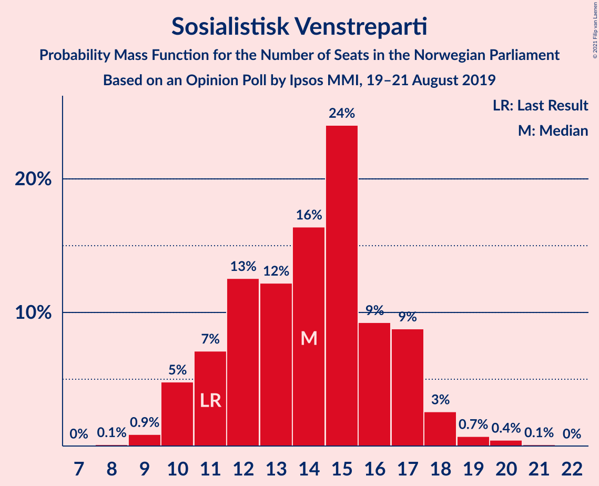

| Number of Seats | Probability | Accumulated | Special Marks |
|:---------------:|:-----------:|:-----------:|:-------------:|
| 8 | 0.1% | 100% |  |
| 9 | 0% | 99.9% |  |
| 10 | 0.5% | 99.9% |  |
| 11 | 0% | 99.3% | Last Result |
| 12 | 3% | 99.3% |  |
| 13 | 7% | 97% |  |
| 14 | 0.7% | 89% |  |
| 15 | 33% | 89% |  |
| 16 | 18% | 56% | Median |
| 17 | 0.1% | 38% |  |
| 18 | 38% | 38% |  |
| 19 | 0% | 0% |  |

### Miljøpartiet De Grønne

*For a full overview of the results for this party, see the [Miljøpartiet De Grønne](party-miljøpartietdegrønne.html) page.*

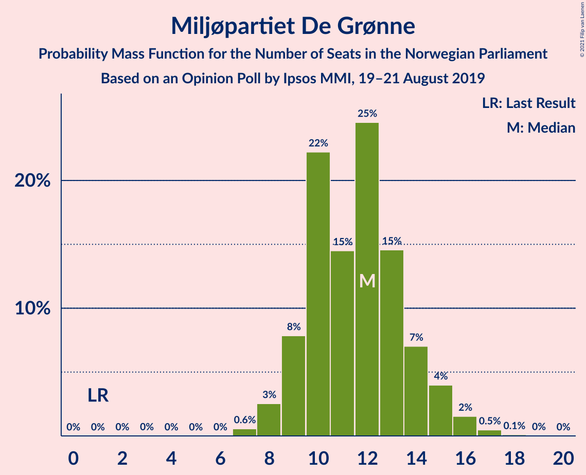

| Number of Seats | Probability | Accumulated | Special Marks |
|:---------------:|:-----------:|:-----------:|:-------------:|
| 1 | 0% | 100% | Last Result |
| 2 | 0% | 100% |  |
| 3 | 0% | 100% |  |
| 4 | 0% | 100% |  |
| 5 | 0% | 100% |  |
| 6 | 0% | 100% |  |
| 7 | 0.1% | 100% |  |
| 8 | 0% | 99.9% |  |
| 9 | 0.7% | 99.9% |  |
| 10 | 2% | 99.2% |  |
| 11 | 10% | 97% |  |
| 12 | 25% | 88% |  |
| 13 | 37% | 63% | Median |
| 14 | 1.1% | 26% |  |
| 15 | 0% | 25% |  |
| 16 | 25% | 25% |  |
| 17 | 0% | 0% |  |

### Rødt

*For a full overview of the results for this party, see the [Rødt](party-rødt.html) page.*

| Number of Seats | Probability | Accumulated | Special Marks |
|:---------------:|:-----------:|:-----------:|:-------------:|
| 1 | 0.1% | 100% | Last Result |
| 2 | 61% | 99.9% | Median |
| 3 | 0% | 39% |  |
| 4 | 0% | 39% |  |
| 5 | 0% | 39% |  |
| 6 | 0.4% | 39% |  |
| 7 | 0.5% | 38% |  |
| 8 | 9% | 38% |  |
| 9 | 4% | 29% |  |
| 10 | 0.9% | 25% |  |
| 11 | 0% | 24% |  |
| 12 | 24% | 24% |  |
| 13 | 0% | 0% |  |

### Venstre

*For a full overview of the results for this party, see the [Venstre](party-venstre.html) page.*

| Number of Seats | Probability | Accumulated | Special Marks |
|:---------------:|:-----------:|:-----------:|:-------------:|
| 0 | 1.3% | 100% |  |
| 1 | 3% | 98.7% |  |
| 2 | 59% | 96% | Median |
| 3 | 0% | 37% |  |
| 4 | 0% | 37% |  |
| 5 | 0% | 37% |  |
| 6 | 0% | 37% |  |
| 7 | 0% | 37% |  |
| 8 | 0% | 37% | Last Result |
| 9 | 37% | 37% |  |
| 10 | 0% | 0% |  |

### Kristelig Folkeparti

*For a full overview of the results for this party, see the [Kristelig Folkeparti](party-kristeligfolkeparti.html) page.*

| Number of Seats | Probability | Accumulated | Special Marks |
|:---------------:|:-----------:|:-----------:|:-------------:|
| 0 | 29% | 100% |  |
| 1 | 32% | 71% | Median |
| 2 | 38% | 39% |  |
| 3 | 1.0% | 1.1% |  |
| 4 | 0% | 0.1% |  |
| 5 | 0% | 0.1% |  |
| 6 | 0% | 0.1% |  |
| 7 | 0.1% | 0.1% |  |
| 8 | 0% | 0% | Last Result |

## Coalitions

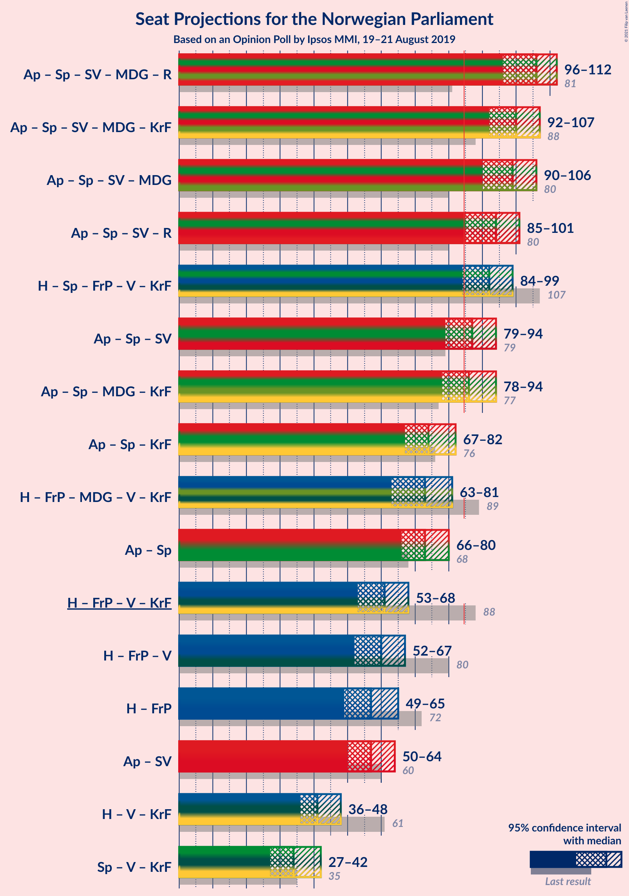

### Confidence Intervals

| Coalition | Last Result | Median | Majority? | 80% Confidence Interval | 90% Confidence Interval | 95% Confidence Interval | 99% Confidence Interval |
|:---------:|:-----------:|:------:|:---------:|:-----------------------:|:-----------------------:|:-----------------------:|:-----------------------:|
| Arbeiderpartiet – Senterpartiet – Sosialistisk Venstreparti – Miljøpartiet De Grønne – Rødt | 81 | 103 | 100% | 101–108 | 93–110 | 93–110 | 93–110 |
| Arbeiderpartiet – Senterpartiet – Sosialistisk Venstreparti – Miljøpartiet De Grønne – Kristelig Folkeparti | 88 | 99 | 100% | 95–103 | 92–103 | 92–103 | 91–103 |
| Arbeiderpartiet – Senterpartiet – Sosialistisk Venstreparti – Miljøpartiet De Grønne | 80 | 99 | 99.7% | 95–101 | 91–102 | 91–102 | 89–102 |
| Høyre – Senterpartiet – Fremskrittspartiet – Venstre – Kristelig Folkeparti | 107 | 91 | 98.9% | 86–95 | 86–101 | 86–101 | 79–101 |
| Arbeiderpartiet – Senterpartiet – Sosialistisk Venstreparti – Rødt | 80 | 90 | 92% | 89–93 | 82–98 | 82–98 | 82–98 |
| Arbeiderpartiet – Senterpartiet – Sosialistisk Venstreparti | 79 | 87 | 62% | 80–88 | 80–90 | 80–90 | 77–90 |
| Arbeiderpartiet – Senterpartiet – Miljøpartiet De Grønne – Kristelig Folkeparti | 77 | 83 | 46% | 82–85 | 79–87 | 78–87 | 73–87 |
| Høyre – Fremskrittspartiet – Miljøpartiet De Grønne – Venstre – Kristelig Folkeparti | 89 | 79 | 7% | 74–80 | 71–87 | 71–87 | 69–87 |
| Høyre – Fremskrittspartiet – Venstre – Kristelig Folkeparti | 88 | 66 | 0% | 61–68 | 59–76 | 59–76 | 55–76 |
| Arbeiderpartiet – Senterpartiet – Kristelig Folkeparti | 76 | 71 | 0.1% | 66–72 | 66–75 | 66–75 | 63–76 |
| Arbeiderpartiet – Senterpartiet | 68 | 70 | 0% | 65–72 | 65–75 | 65–75 | 61–76 |
| Høyre – Fremskrittspartiet – Venstre | 80 | 64 | 0% | 60–68 | 59–75 | 59–75 | 54–75 |
| Høyre – Fremskrittspartiet | 72 | 58 | 0% | 55–66 | 55–73 | 55–73 | 53–73 |
| Arbeiderpartiet – Sosialistisk Venstreparti | 60 | 60 | 0% | 55–63 | 55–63 | 54–63 | 53–63 |
| Høyre – Venstre – Kristelig Folkeparti | 61 | 41 | 0% | 39–49 | 39–50 | 39–50 | 36–50 |
| Senterpartiet – Venstre – Kristelig Folkeparti | 35 | 29 | 0% | 28–36 | 28–36 | 27–36 | 25–36 |

### Arbeiderpartiet – Senterpartiet – Sosialistisk Venstreparti – Miljøpartiet De Grønne – Rødt

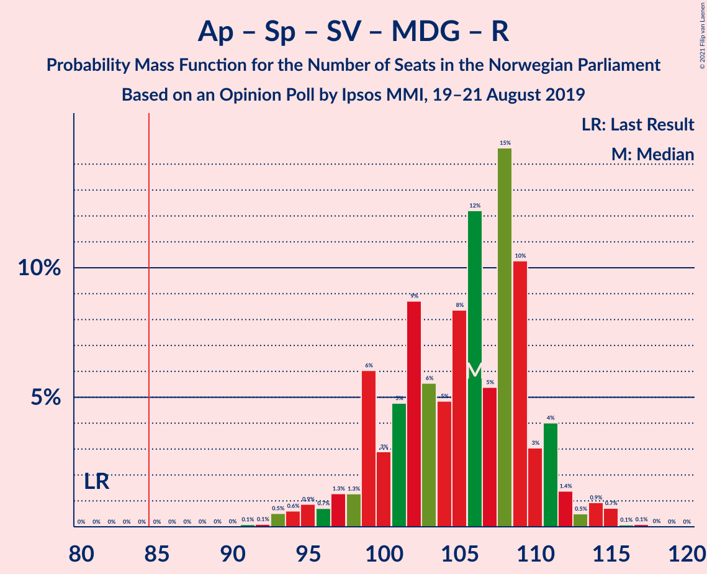

| Number of Seats | Probability | Accumulated | Special Marks |
|:---------------:|:-----------:|:-----------:|:-------------:|
| 81 | 0% | 100% | Last Result |
| 82 | 0% | 100% |  |
| 83 | 0% | 100% |  |
| 84 | 0% | 100% |  |
| 85 | 0% | 100% | Majority |
| 86 | 0% | 100% |  |
| 87 | 0% | 100% |  |
| 88 | 0% | 100% |  |
| 89 | 0% | 100% |  |
| 90 | 0% | 100% |  |
| 91 | 0% | 100% |  |
| 92 | 0% | 100% |  |
| 93 | 7% | 100% |  |
| 94 | 0.7% | 93% |  |
| 95 | 0% | 92% |  |
| 96 | 0.1% | 92% |  |
| 97 | 0.5% | 92% |  |
| 98 | 0% | 92% |  |
| 99 | 0.8% | 92% |  |
| 100 | 0% | 91% | Median |
| 101 | 17% | 91% |  |
| 102 | 0.1% | 74% |  |
| 103 | 37% | 74% |  |
| 104 | 2% | 37% |  |
| 105 | 0.9% | 34% |  |
| 106 | 1.0% | 33% |  |
| 107 | 0% | 32% |  |
| 108 | 24% | 32% |  |
| 109 | 0% | 8% |  |
| 110 | 8% | 8% |  |
| 111 | 0% | 0% |  |

### Arbeiderpartiet – Senterpartiet – Sosialistisk Venstreparti – Miljøpartiet De Grønne – Kristelig Folkeparti

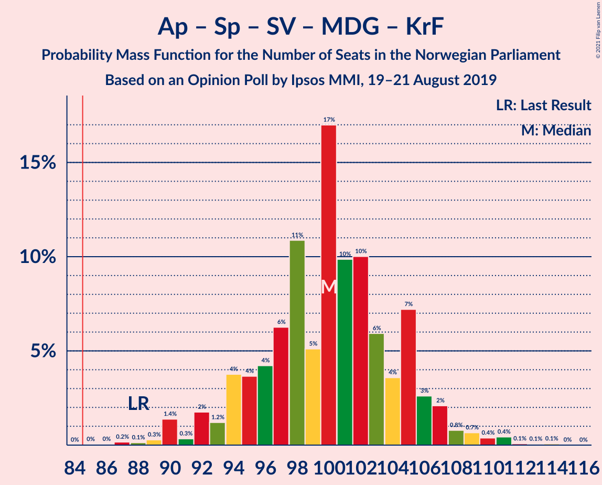

| Number of Seats | Probability | Accumulated | Special Marks |
|:---------------:|:-----------:|:-----------:|:-------------:|
| 86 | 0.3% | 100% |  |
| 87 | 0% | 99.7% |  |
| 88 | 0% | 99.7% | Last Result |
| 89 | 0% | 99.7% |  |
| 90 | 0% | 99.7% |  |
| 91 | 0.8% | 99.7% |  |
| 92 | 8% | 98.8% |  |
| 93 | 0.5% | 91% |  |
| 94 | 0% | 91% |  |
| 95 | 3% | 91% |  |
| 96 | 0.9% | 88% |  |
| 97 | 24% | 87% |  |
| 98 | 1.0% | 63% |  |
| 99 | 17% | 62% | Median |
| 100 | 0% | 45% |  |
| 101 | 0% | 45% |  |
| 102 | 8% | 45% |  |
| 103 | 37% | 37% |  |
| 104 | 0% | 0.2% |  |
| 105 | 0.1% | 0.2% |  |
| 106 | 0% | 0.1% |  |
| 107 | 0.1% | 0.1% |  |
| 108 | 0% | 0% |  |

### Arbeiderpartiet – Senterpartiet – Sosialistisk Venstreparti – Miljøpartiet De Grønne

| Number of Seats | Probability | Accumulated | Special Marks |
|:---------------:|:-----------:|:-----------:|:-------------:|
| 80 | 0% | 100% | Last Result |
| 81 | 0% | 100% |  |
| 82 | 0% | 100% |  |
| 83 | 0% | 100% |  |
| 84 | 0.3% | 100% |  |
| 85 | 0% | 99.7% | Majority |
| 86 | 0% | 99.7% |  |
| 87 | 0% | 99.7% |  |
| 88 | 0% | 99.7% |  |
| 89 | 0.8% | 99.7% |  |
| 90 | 0.5% | 98.8% |  |
| 91 | 7% | 98% |  |
| 92 | 0.8% | 91% |  |
| 93 | 0.4% | 91% |  |
| 94 | 0% | 90% |  |
| 95 | 2% | 90% |  |
| 96 | 25% | 88% |  |
| 97 | 1.0% | 63% |  |
| 98 | 0% | 62% | Median |
| 99 | 17% | 62% |  |
| 100 | 0.1% | 45% |  |
| 101 | 37% | 45% |  |
| 102 | 8% | 8% |  |
| 103 | 0% | 0% |  |

### Høyre – Senterpartiet – Fremskrittspartiet – Venstre – Kristelig Folkeparti

| Number of Seats | Probability | Accumulated | Special Marks |
|:---------------:|:-----------:|:-----------:|:-------------:|
| 79 | 1.0% | 100% |  |
| 80 | 0% | 99.0% |  |
| 81 | 0% | 99.0% |  |
| 82 | 0.2% | 99.0% |  |
| 83 | 0% | 98.9% |  |
| 84 | 0% | 98.9% |  |
| 85 | 0% | 98.9% | Majority |
| 86 | 25% | 98.9% | Median |
| 87 | 0.9% | 74% |  |
| 88 | 0% | 73% |  |
| 89 | 0.7% | 73% |  |
| 90 | 0% | 73% |  |
| 91 | 45% | 73% |  |
| 92 | 0.4% | 28% |  |
| 93 | 0.1% | 28% |  |
| 94 | 0.4% | 27% |  |
| 95 | 19% | 27% |  |
| 96 | 1.0% | 8% |  |
| 97 | 0% | 7% |  |
| 98 | 0.1% | 7% |  |
| 99 | 0% | 7% |  |
| 100 | 0% | 7% |  |
| 101 | 7% | 7% |  |
| 102 | 0% | 0% |  |
| 103 | 0% | 0% |  |
| 104 | 0% | 0% |  |
| 105 | 0% | 0% |  |
| 106 | 0% | 0% |  |
| 107 | 0% | 0% | Last Result |

### Arbeiderpartiet – Senterpartiet – Sosialistisk Venstreparti – Rødt

| Number of Seats | Probability | Accumulated | Special Marks |
|:---------------:|:-----------:|:-----------:|:-------------:|
| 80 | 0% | 100% | Last Result |
| 81 | 0% | 100% |  |
| 82 | 7% | 100% |  |
| 83 | 0.1% | 93% |  |
| 84 | 1.4% | 93% |  |
| 85 | 0% | 92% | Majority |
| 86 | 0% | 92% |  |
| 87 | 0% | 92% | Median |
| 88 | 0.1% | 92% |  |
| 89 | 18% | 91% |  |
| 90 | 37% | 73% |  |
| 91 | 0% | 37% |  |
| 92 | 25% | 37% |  |
| 93 | 2% | 11% |  |
| 94 | 0% | 9% |  |
| 95 | 0.4% | 9% |  |
| 96 | 0.1% | 8% |  |
| 97 | 0% | 8% |  |
| 98 | 8% | 8% |  |
| 99 | 0% | 0.1% |  |
| 100 | 0% | 0.1% |  |
| 101 | 0% | 0.1% |  |
| 102 | 0% | 0.1% |  |
| 103 | 0.1% | 0.1% |  |
| 104 | 0% | 0% |  |

### Arbeiderpartiet – Senterpartiet – Sosialistisk Venstreparti

| Number of Seats | Probability | Accumulated | Special Marks |
|:---------------:|:-----------:|:-----------:|:-------------:|
| 74 | 0% | 100% |  |
| 75 | 0.3% | 99.9% |  |
| 76 | 0% | 99.7% |  |
| 77 | 0.5% | 99.7% |  |
| 78 | 0.1% | 99.2% |  |
| 79 | 0.8% | 99.1% | Last Result |
| 80 | 31% | 98% |  |
| 81 | 0.1% | 67% |  |
| 82 | 0.7% | 67% |  |
| 83 | 1.0% | 66% |  |
| 84 | 3% | 65% |  |
| 85 | 0% | 62% | Median, Majority |
| 86 | 0% | 62% |  |
| 87 | 17% | 62% |  |
| 88 | 37% | 45% |  |
| 89 | 0.4% | 9% |  |
| 90 | 8% | 8% |  |
| 91 | 0.1% | 0.1% |  |
| 92 | 0% | 0.1% |  |
| 93 | 0% | 0.1% |  |
| 94 | 0.1% | 0.1% |  |
| 95 | 0% | 0% |  |

### Arbeiderpartiet – Senterpartiet – Miljøpartiet De Grønne – Kristelig Folkeparti

| Number of Seats | Probability | Accumulated | Special Marks |
|:---------------:|:-----------:|:-----------:|:-------------:|
| 71 | 0.3% | 100% |  |
| 72 | 0% | 99.7% |  |
| 73 | 0.8% | 99.7% |  |
| 74 | 0% | 98.9% |  |
| 75 | 0% | 98.9% |  |
| 76 | 0% | 98.9% |  |
| 77 | 0% | 98.9% | Last Result |
| 78 | 1.5% | 98.8% |  |
| 79 | 7% | 97% |  |
| 80 | 0.1% | 90% |  |
| 81 | 0.1% | 90% |  |
| 82 | 25% | 90% |  |
| 83 | 19% | 65% | Median |
| 84 | 0% | 46% |  |
| 85 | 37% | 46% | Majority |
| 86 | 0.9% | 9% |  |
| 87 | 8% | 8% |  |
| 88 | 0% | 0.1% |  |
| 89 | 0% | 0.1% |  |
| 90 | 0% | 0.1% |  |
| 91 | 0% | 0.1% |  |
| 92 | 0% | 0.1% |  |
| 93 | 0% | 0.1% |  |
| 94 | 0% | 0.1% |  |
| 95 | 0% | 0.1% |  |
| 96 | 0% | 0.1% |  |
| 97 | 0% | 0.1% |  |
| 98 | 0% | 0.1% |  |
| 99 | 0.1% | 0.1% |  |
| 100 | 0% | 0% |  |

### Høyre – Fremskrittspartiet – Miljøpartiet De Grønne – Venstre – Kristelig Folkeparti

| Number of Seats | Probability | Accumulated | Special Marks |
|:---------------:|:-----------:|:-----------:|:-------------:|
| 65 | 0.4% | 100% |  |
| 66 | 0.1% | 99.6% |  |
| 67 | 0% | 99.6% |  |
| 68 | 0% | 99.6% |  |
| 69 | 1.0% | 99.6% |  |
| 70 | 0% | 98.5% |  |
| 71 | 8% | 98.5% |  |
| 72 | 0% | 90% |  |
| 73 | 0.2% | 90% |  |
| 74 | 0.7% | 90% | Median |
| 75 | 0% | 89% |  |
| 76 | 3% | 89% |  |
| 77 | 24% | 87% |  |
| 78 | 0.5% | 62% |  |
| 79 | 37% | 62% |  |
| 80 | 18% | 25% |  |
| 81 | 0% | 7% |  |
| 82 | 0% | 7% |  |
| 83 | 0% | 7% |  |
| 84 | 0% | 7% |  |
| 85 | 0% | 7% | Majority |
| 86 | 0.1% | 7% |  |
| 87 | 7% | 7% |  |
| 88 | 0% | 0% |  |
| 89 | 0% | 0% | Last Result |

### Høyre – Fremskrittspartiet – Venstre – Kristelig Folkeparti

| Number of Seats | Probability | Accumulated | Special Marks |
|:---------------:|:-----------:|:-----------:|:-------------:|
| 55 | 1.3% | 100% |  |
| 56 | 0% | 98.7% |  |
| 57 | 0.1% | 98.7% |  |
| 58 | 0.1% | 98.6% |  |
| 59 | 8% | 98.5% |  |
| 60 | 0% | 90% |  |
| 61 | 24% | 90% | Median |
| 62 | 0% | 66% |  |
| 63 | 0% | 66% |  |
| 64 | 1.2% | 66% |  |
| 65 | 3% | 65% |  |
| 66 | 37% | 62% |  |
| 67 | 0.3% | 25% |  |
| 68 | 17% | 25% |  |
| 69 | 0% | 8% |  |
| 70 | 0.8% | 8% |  |
| 71 | 0% | 7% |  |
| 72 | 0% | 7% |  |
| 73 | 0% | 7% |  |
| 74 | 0% | 7% |  |
| 75 | 0.1% | 7% |  |
| 76 | 7% | 7% |  |
| 77 | 0% | 0% |  |
| 78 | 0% | 0% |  |
| 79 | 0% | 0% |  |
| 80 | 0% | 0% |  |
| 81 | 0% | 0% |  |
| 82 | 0% | 0% |  |
| 83 | 0% | 0% |  |
| 84 | 0% | 0% |  |
| 85 | 0% | 0% | Majority |
| 86 | 0% | 0% |  |
| 87 | 0% | 0% |  |
| 88 | 0% | 0% | Last Result |

### Arbeiderpartiet – Senterpartiet – Kristelig Folkeparti

| Number of Seats | Probability | Accumulated | Special Marks |
|:---------------:|:-----------:|:-----------:|:-------------:|
| 62 | 0.3% | 100% |  |
| 63 | 0.9% | 99.7% |  |
| 64 | 0% | 98.8% |  |
| 65 | 0.5% | 98.8% |  |
| 66 | 24% | 98% |  |
| 67 | 0% | 74% |  |
| 68 | 9% | 74% |  |
| 69 | 0.4% | 66% |  |
| 70 | 0.6% | 65% | Median |
| 71 | 17% | 65% |  |
| 72 | 39% | 48% |  |
| 73 | 0% | 9% |  |
| 74 | 0% | 9% |  |
| 75 | 8% | 9% |  |
| 76 | 0.4% | 0.6% | Last Result |
| 77 | 0% | 0.2% |  |
| 78 | 0.1% | 0.2% |  |
| 79 | 0% | 0.1% |  |
| 80 | 0% | 0.1% |  |
| 81 | 0% | 0.1% |  |
| 82 | 0% | 0.1% |  |
| 83 | 0% | 0.1% |  |
| 84 | 0% | 0.1% |  |
| 85 | 0% | 0.1% | Majority |
| 86 | 0% | 0.1% |  |
| 87 | 0.1% | 0.1% |  |
| 88 | 0% | 0% |  |

### Arbeiderpartiet – Senterpartiet

| Number of Seats | Probability | Accumulated | Special Marks |
|:---------------:|:-----------:|:-----------:|:-------------:|
| 60 | 0.3% | 100% |  |
| 61 | 0.8% | 99.7% |  |
| 62 | 0.5% | 98.9% |  |
| 63 | 0% | 98% |  |
| 64 | 0% | 98% |  |
| 65 | 24% | 98% |  |
| 66 | 0.4% | 74% |  |
| 67 | 8% | 74% |  |
| 68 | 0.7% | 66% | Last Result |
| 69 | 0% | 65% | Median |
| 70 | 37% | 65% |  |
| 71 | 17% | 28% |  |
| 72 | 2% | 11% |  |
| 73 | 0.1% | 9% |  |
| 74 | 0% | 9% |  |
| 75 | 8% | 9% |  |
| 76 | 0.4% | 0.6% |  |
| 77 | 0.1% | 0.2% |  |
| 78 | 0% | 0.1% |  |
| 79 | 0% | 0.1% |  |
| 80 | 0.1% | 0.1% |  |
| 81 | 0% | 0% |  |

### Høyre – Fremskrittspartiet – Venstre

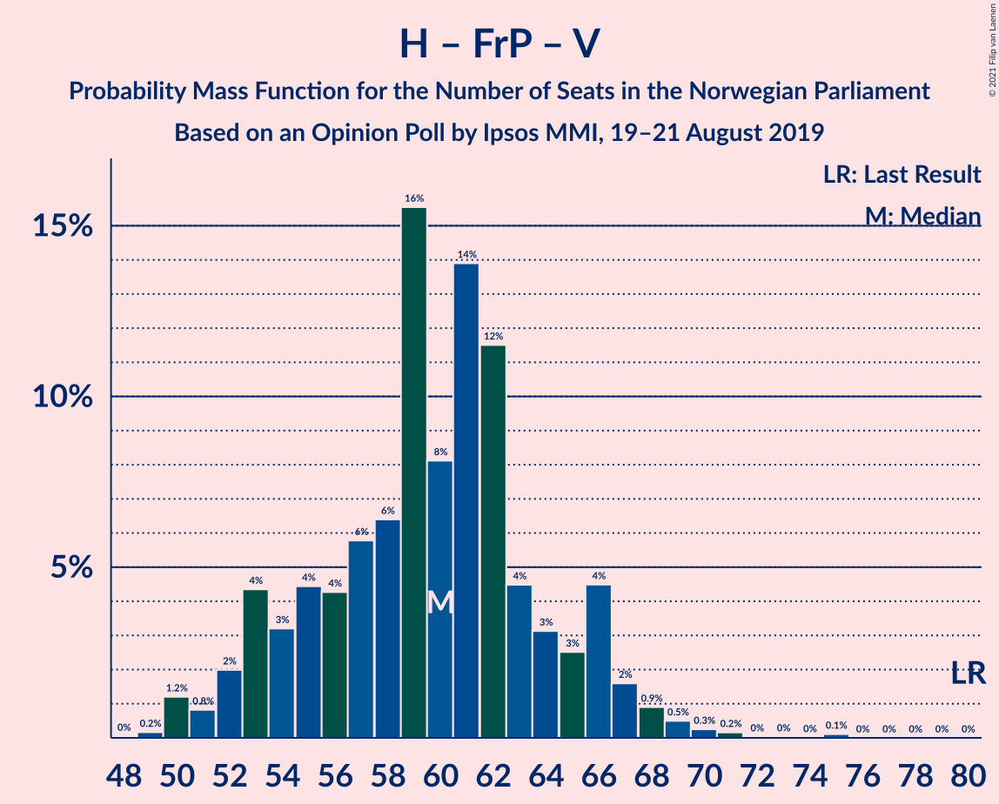

| Number of Seats | Probability | Accumulated | Special Marks |
|:---------------:|:-----------:|:-----------:|:-------------:|
| 54 | 1.1% | 100% |  |
| 55 | 0.4% | 98.9% |  |
| 56 | 0.1% | 98% |  |
| 57 | 0% | 98% |  |
| 58 | 0.1% | 98% |  |
| 59 | 8% | 98% |  |
| 60 | 24% | 90% | Median |
| 61 | 0% | 66% |  |
| 62 | 0.5% | 66% |  |
| 63 | 0% | 66% |  |
| 64 | 38% | 66% |  |
| 65 | 3% | 28% |  |
| 66 | 0% | 25% |  |
| 67 | 0% | 25% |  |
| 68 | 18% | 25% |  |
| 69 | 0% | 7% |  |
| 70 | 0% | 7% |  |
| 71 | 0% | 7% |  |
| 72 | 0.1% | 7% |  |
| 73 | 0% | 7% |  |
| 74 | 0% | 7% |  |
| 75 | 7% | 7% |  |
| 76 | 0% | 0% |  |
| 77 | 0% | 0% |  |
| 78 | 0% | 0% |  |
| 79 | 0% | 0% |  |
| 80 | 0% | 0% | Last Result |

### Høyre – Fremskrittspartiet

| Number of Seats | Probability | Accumulated | Special Marks |
|:---------------:|:-----------:|:-----------:|:-------------:|
| 52 | 0.1% | 100% |  |
| 53 | 0.4% | 99.9% |  |
| 54 | 1.1% | 99.5% |  |
| 55 | 37% | 98% |  |
| 56 | 0.1% | 62% |  |
| 57 | 8% | 62% |  |
| 58 | 24% | 53% | Median |
| 59 | 0% | 29% |  |
| 60 | 0% | 29% |  |
| 61 | 0.5% | 29% |  |
| 62 | 1.2% | 29% |  |
| 63 | 0.3% | 28% |  |
| 64 | 2% | 27% |  |
| 65 | 0.4% | 25% |  |
| 66 | 18% | 24% |  |
| 67 | 0% | 7% |  |
| 68 | 0% | 7% |  |
| 69 | 0% | 7% |  |
| 70 | 0% | 7% |  |
| 71 | 0% | 7% |  |
| 72 | 0% | 7% | Last Result |
| 73 | 7% | 7% |  |
| 74 | 0% | 0% |  |

### Arbeiderpartiet – Sosialistisk Venstreparti

| Number of Seats | Probability | Accumulated | Special Marks |
|:---------------:|:-----------:|:-----------:|:-------------:|
| 50 | 0.3% | 100% |  |
| 51 | 0% | 99.7% |  |
| 52 | 0% | 99.7% |  |
| 53 | 1.1% | 99.6% |  |
| 54 | 2% | 98.6% |  |
| 55 | 31% | 96% |  |
| 56 | 0.5% | 65% |  |
| 57 | 2% | 65% |  |
| 58 | 9% | 63% |  |
| 59 | 1.0% | 55% |  |
| 60 | 17% | 54% | Last Result, Median |
| 61 | 0.1% | 37% |  |
| 62 | 0% | 37% |  |
| 63 | 37% | 37% |  |
| 64 | 0% | 0.1% |  |
| 65 | 0% | 0.1% |  |
| 66 | 0% | 0.1% |  |
| 67 | 0.1% | 0.1% |  |
| 68 | 0% | 0% |  |

### Høyre – Venstre – Kristelig Folkeparti

| Number of Seats | Probability | Accumulated | Special Marks |
|:---------------:|:-----------:|:-----------:|:-------------:|
| 34 | 0.1% | 100% |  |
| 35 | 0% | 99.9% |  |
| 36 | 0.7% | 99.9% |  |
| 37 | 1.3% | 99.3% |  |
| 38 | 0.1% | 98% |  |
| 39 | 25% | 98% |  |
| 40 | 0% | 73% |  |
| 41 | 24% | 73% | Median |
| 42 | 0.5% | 48% |  |
| 43 | 0% | 48% |  |
| 44 | 0% | 48% |  |
| 45 | 0.3% | 48% |  |
| 46 | 0% | 48% |  |
| 47 | 3% | 48% |  |
| 48 | 0.8% | 45% |  |
| 49 | 37% | 44% |  |
| 50 | 7% | 7% |  |
| 51 | 0% | 0.1% |  |
| 52 | 0% | 0.1% |  |
| 53 | 0% | 0.1% |  |
| 54 | 0% | 0.1% |  |
| 55 | 0% | 0.1% |  |
| 56 | 0% | 0.1% |  |
| 57 | 0% | 0.1% |  |
| 58 | 0% | 0.1% |  |
| 59 | 0% | 0.1% |  |
| 60 | 0% | 0.1% |  |
| 61 | 0.1% | 0.1% | Last Result |
| 62 | 0% | 0% |  |

### Senterpartiet – Venstre – Kristelig Folkeparti

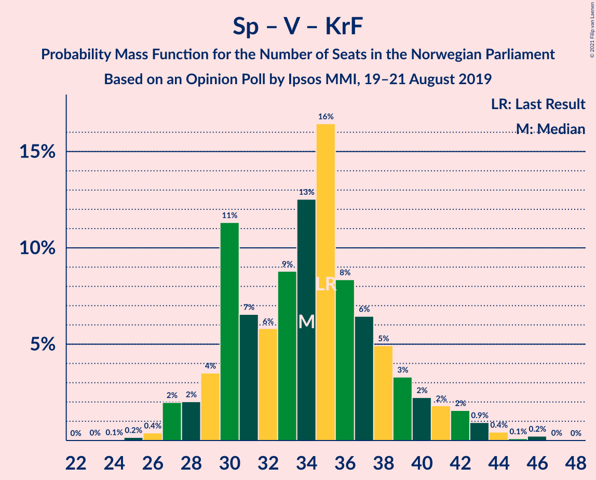

| Number of Seats | Probability | Accumulated | Special Marks |
|:---------------:|:-----------:|:-----------:|:-------------:|
| 25 | 2% | 100% |  |
| 26 | 0% | 98% |  |
| 27 | 0.7% | 98% |  |
| 28 | 31% | 97% | Median |
| 29 | 17% | 66% |  |
| 30 | 0.8% | 49% |  |
| 31 | 2% | 48% |  |
| 32 | 0% | 46% |  |
| 33 | 0.1% | 46% |  |
| 34 | 8% | 46% |  |
| 35 | 0.1% | 37% | Last Result |
| 36 | 37% | 37% |  |
| 37 | 0% | 0.1% |  |
| 38 | 0% | 0.1% |  |
| 39 | 0% | 0.1% |  |
| 40 | 0% | 0.1% |  |
| 41 | 0% | 0.1% |  |
| 42 | 0% | 0.1% |  |
| 43 | 0% | 0.1% |  |
| 44 | 0.1% | 0.1% |  |
| 45 | 0% | 0% |  |

## Technical Information

### Opinion Poll

+ **Polling firm:** Ipsos MMI
+ **Commissioner(s):** —
+ **Fieldwork period:** 19–21 August 2019

### Calculations

+ **Sample size:** 719
+ **Simulations done:** 1,024
+ **Error estimate:** 4.59%

