# Opinion Poll by Norstat, 20–26 August 2019

<a href="#voting-intentions">Voting Intentions</a> | <a href="#seats">Seats</a> | <a href="#coalitions">Coalitions</a> | <a href="#technical-information">Technical Information</a>

## Voting Intentions

### Confidence Intervals

| Party | Last Result | Poll Result | 80% Confidence Interval | 90% Confidence Interval | 95% Confidence Interval | 99% Confidence Interval |
|:-----:|:-----------:|:-----------:|:-----------------------:|:-----------------------:|:-----------------------:|:-----------------------:|
| Høyre | 25.0% | 22.8% | 21.1–24.6% |20.6–25.1% |20.2–25.6% |19.4–26.5% |
| Arbeiderpartiet | 27.4% | 22.2% | 20.5–24.0% |20.0–24.5% |19.6–24.9% |18.9–25.8% |
| Senterpartiet | 10.3% | 16.0% | 14.6–17.6% |14.2–18.1% |13.8–18.5% |13.1–19.3% |
| Fremskrittspartiet | 15.2% | 11.7% | 10.4–13.1% |10.1–13.5% |9.8–13.9% |9.2–14.6% |
| Sosialistisk Venstreparti | 6.0% | 6.3% | 5.3–7.4% |5.1–7.7% |4.9–8.0% |4.5–8.6% |
| Miljøpartiet De Grønne | 3.2% | 5.7% | 4.9–6.8% |4.6–7.1% |4.4–7.4% |4.0–8.0% |
| Rødt | 2.4% | 5.0% | 4.2–6.0% |3.9–6.3% |3.8–6.6% |3.4–7.1% |
| Kristelig Folkeparti | 4.2% | 4.3% | 3.6–5.3% |3.4–5.6% |3.2–5.9% |2.9–6.4% |
| Venstre | 4.4% | 3.1% | 2.5–3.9% |2.3–4.2% |2.1–4.4% |1.9–4.8% |

*Note:* The poll result column reflects the actual value used in the calculations. Published results may vary slightly, and in addition be rounded to fewer digits.

## Seats

### Confidence Intervals

| Party | Last Result | Median | 80% Confidence Interval | 90% Confidence Interval | 95% Confidence Interval | 99% Confidence Interval |
|:-----:|:-----------:|:------:|:-----------------------:|:-----------------------:|:-----------------------:|:-----------------------:|
| <a href="#høyre">Høyre</a> | 45 | 38 | 38 |37–38 |37–38 |37–38 |
| <a href="#arbeiderpartiet">Arbeiderpartiet</a> | 49 | 37 | 37 |37–41 |37–41 |37–41 |
| <a href="#senterpartiet">Senterpartiet</a> | 19 | 27 | 27 |25–27 |25–27 |25–27 |
| <a href="#fremskrittspartiet">Fremskrittspartiet</a> | 27 | 25 | 25 |24–25 |24–25 |24–25 |
| <a href="#sosialistisk-venstreparti">Sosialistisk Venstreparti</a> | 11 | 12 | 12 |10–12 |10–12 |10–12 |
| <a href="#miljøpartiet-de-grønne">Miljøpartiet De Grønne</a> | 1 | 11 | 11 |10–11 |10–11 |10–11 |
| <a href="#rødt">Rødt</a> | 1 | 9 | 9 |9–10 |9–10 |9–10 |
| <a href="#kristelig-folkeparti">Kristelig Folkeparti</a> | 8 | 8 | 8 |3–8 |3–8 |3–8 |
| <a href="#venstre">Venstre</a> | 8 | 2 | 2 |2 |2 |1–2 |

### Høyre

*For a full overview of the results for this party, see the [Høyre](party-høyre.html) page.*

| Number of Seats | Probability | Accumulated | Special Marks |
|:---------------:|:-----------:|:-----------:|:-------------:|
| 35 | 0.4% | 100% |  |
| 36 | 0% | 99.6% |  |
| 37 | 9% | 99.6% |  |
| 38 | 90% | 91% | Median |
| 39 | 0% | 0.4% |  |
| 40 | 0% | 0.4% |  |
| 41 | 0% | 0.4% |  |
| 42 | 0.4% | 0.4% |  |
| 43 | 0% | 0% |  |
| 44 | 0% | 0% |  |
| 45 | 0% | 0% | Last Result |

### Arbeiderpartiet

*For a full overview of the results for this party, see the [Arbeiderpartiet](party-arbeiderpartiet.html) page.*

| Number of Seats | Probability | Accumulated | Special Marks |
|:---------------:|:-----------:|:-----------:|:-------------:|
| 37 | 90% | 100% | Median |
| 38 | 0.4% | 10% |  |
| 39 | 0% | 9% |  |
| 40 | 0.4% | 9% |  |
| 41 | 9% | 9% |  |
| 42 | 0% | 0% |  |
| 43 | 0% | 0% |  |
| 44 | 0% | 0% |  |
| 45 | 0% | 0% |  |
| 46 | 0% | 0% |  |
| 47 | 0% | 0% |  |
| 48 | 0% | 0% |  |
| 49 | 0% | 0% | Last Result |

### Senterpartiet

*For a full overview of the results for this party, see the [Senterpartiet](party-senterpartiet.html) page.*

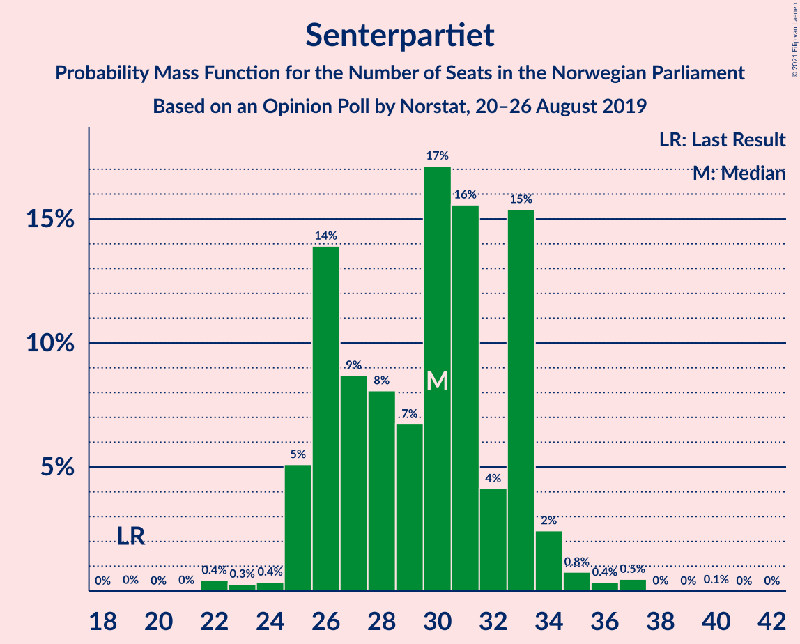

| Number of Seats | Probability | Accumulated | Special Marks |
|:---------------:|:-----------:|:-----------:|:-------------:|
| 19 | 0% | 100% | Last Result |
| 20 | 0% | 100% |  |
| 21 | 0% | 100% |  |
| 22 | 0% | 100% |  |
| 23 | 0% | 100% |  |
| 24 | 0% | 100% |  |
| 25 | 9% | 100% |  |
| 26 | 0% | 91% |  |
| 27 | 91% | 91% | Median |
| 28 | 0% | 0.4% |  |
| 29 | 0.4% | 0.4% |  |
| 30 | 0% | 0.1% |  |
| 31 | 0% | 0.1% |  |
| 32 | 0% | 0% |  |

### Fremskrittspartiet

*For a full overview of the results for this party, see the [Fremskrittspartiet](party-fremskrittspartiet.html) page.*

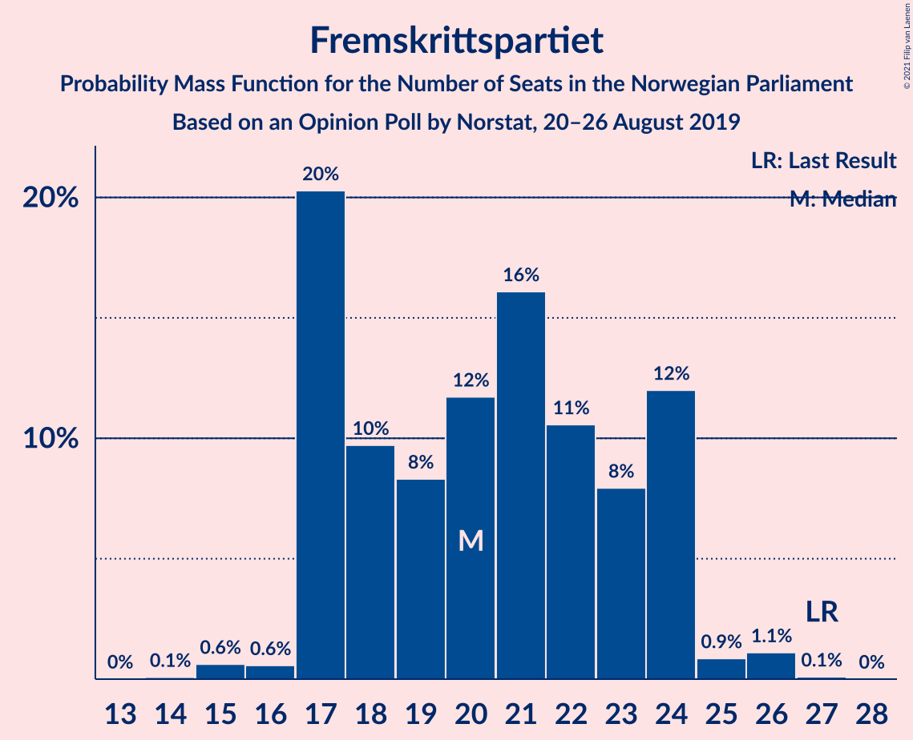

| Number of Seats | Probability | Accumulated | Special Marks |
|:---------------:|:-----------:|:-----------:|:-------------:|
| 21 | 0.1% | 100% |  |
| 22 | 0.4% | 99.9% |  |
| 23 | 0% | 99.6% |  |
| 24 | 9% | 99.6% |  |
| 25 | 90% | 90% | Median |
| 26 | 0% | 0% |  |
| 27 | 0% | 0% | Last Result |

### Sosialistisk Venstreparti

*For a full overview of the results for this party, see the [Sosialistisk Venstreparti](party-sosialistiskvenstreparti.html) page.*

| Number of Seats | Probability | Accumulated | Special Marks |
|:---------------:|:-----------:|:-----------:|:-------------:|
| 9 | 0% | 100% |  |
| 10 | 9% | 99.9% |  |
| 11 | 0% | 91% | Last Result |
| 12 | 90% | 91% | Median |
| 13 | 0.4% | 0.4% |  |
| 14 | 0% | 0% |  |

### Miljøpartiet De Grønne

*For a full overview of the results for this party, see the [Miljøpartiet De Grønne](party-miljøpartietdegrønne.html) page.*

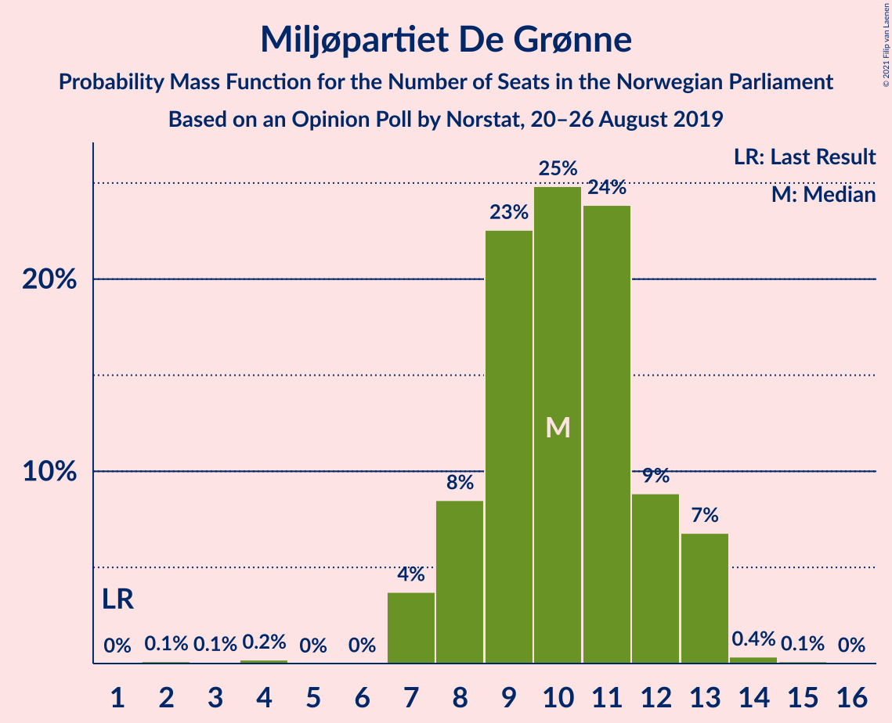

| Number of Seats | Probability | Accumulated | Special Marks |
|:---------------:|:-----------:|:-----------:|:-------------:|
| 1 | 0% | 100% | Last Result |
| 2 | 0% | 100% |  |
| 3 | 0% | 100% |  |
| 4 | 0% | 100% |  |
| 5 | 0% | 100% |  |
| 6 | 0% | 100% |  |
| 7 | 0% | 100% |  |
| 8 | 0% | 100% |  |
| 9 | 0% | 100% |  |
| 10 | 9% | 100% |  |
| 11 | 91% | 91% | Median |
| 12 | 0% | 0% |  |

### Rødt

*For a full overview of the results for this party, see the [Rødt](party-rødt.html) page.*

| Number of Seats | Probability | Accumulated | Special Marks |
|:---------------:|:-----------:|:-----------:|:-------------:|
| 1 | 0% | 100% | Last Result |
| 2 | 0% | 100% |  |
| 3 | 0% | 100% |  |
| 4 | 0% | 100% |  |
| 5 | 0% | 100% |  |
| 6 | 0% | 100% |  |
| 7 | 0.4% | 100% |  |
| 8 | 0% | 99.6% |  |
| 9 | 90% | 99.6% | Median |
| 10 | 9% | 9% |  |
| 11 | 0% | 0.4% |  |
| 12 | 0.4% | 0.4% |  |
| 13 | 0% | 0% |  |

### Kristelig Folkeparti

*For a full overview of the results for this party, see the [Kristelig Folkeparti](party-kristeligfolkeparti.html) page.*

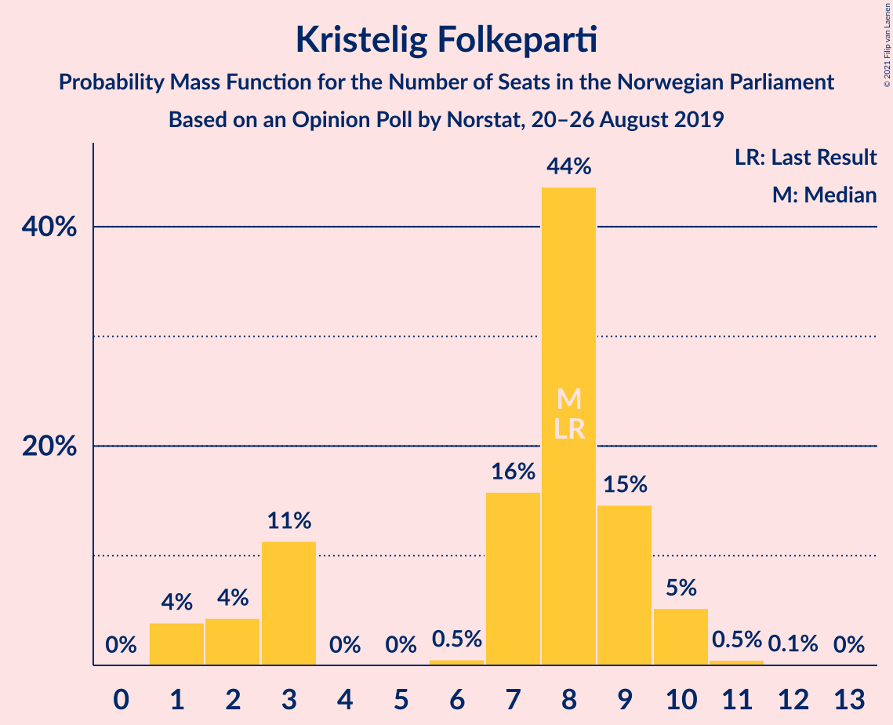

| Number of Seats | Probability | Accumulated | Special Marks |
|:---------------:|:-----------:|:-----------:|:-------------:|
| 3 | 9% | 100% |  |
| 4 | 0% | 91% |  |
| 5 | 0% | 91% |  |
| 6 | 0% | 91% |  |
| 7 | 0% | 91% |  |
| 8 | 91% | 91% | Last Result, Median |
| 9 | 0.4% | 0.4% |  |
| 10 | 0% | 0% |  |

### Venstre

*For a full overview of the results for this party, see the [Venstre](party-venstre.html) page.*

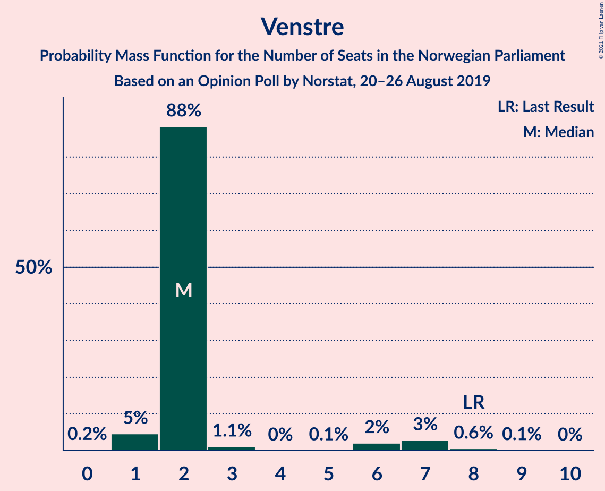

| Number of Seats | Probability | Accumulated | Special Marks |
|:---------------:|:-----------:|:-----------:|:-------------:|
| 0 | 0.4% | 100% |  |
| 1 | 0.4% | 99.6% |  |
| 2 | 99.2% | 99.2% | Median |
| 3 | 0% | 0% |  |
| 4 | 0% | 0% |  |
| 5 | 0% | 0% |  |
| 6 | 0% | 0% |  |
| 7 | 0% | 0% |  |
| 8 | 0% | 0% | Last Result |

## Coalitions

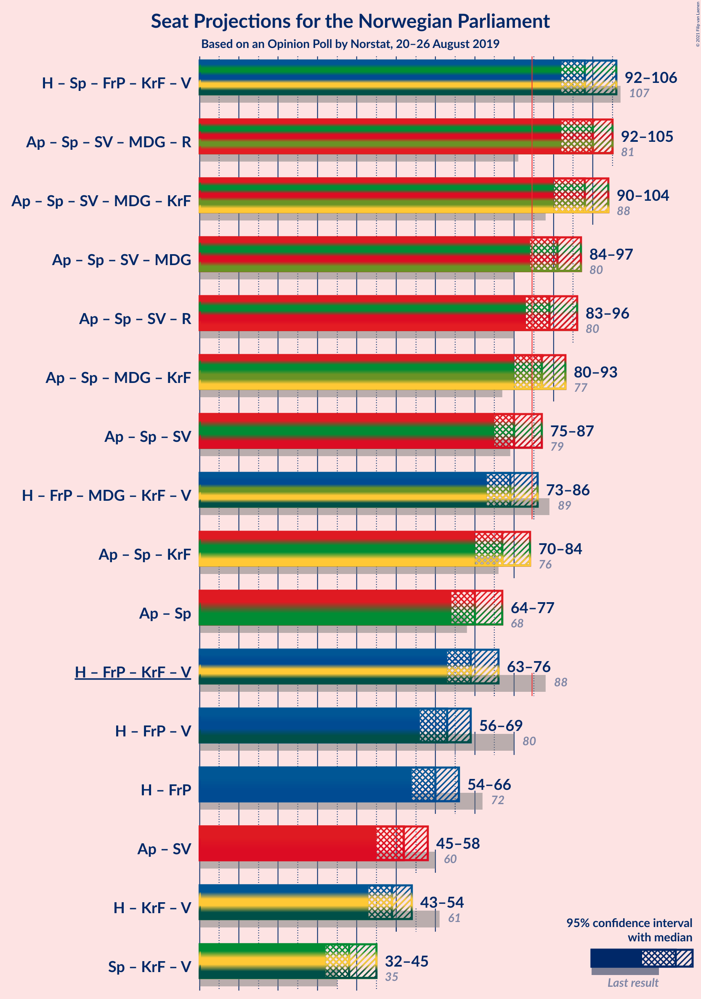

### Confidence Intervals

| Coalition | Last Result | Median | Majority? | 80% Confidence Interval | 90% Confidence Interval | 95% Confidence Interval | 99% Confidence Interval |
|:---------:|:-----------:|:------:|:---------:|:-----------------------:|:-----------------------:|:-----------------------:|:-----------------------:|
| Høyre – Senterpartiet – Fremskrittspartiet – Kristelig Folkeparti – Venstre | 107 | 100 | 100% | 100 | 91–100 | 91–100 | 91–100 |
| Arbeiderpartiet – Senterpartiet – Sosialistisk Venstreparti – Miljøpartiet De Grønne – Rødt | 81 | 96 | 100% | 96 | 96 | 96 | 96–97 |
| Arbeiderpartiet – Senterpartiet – Sosialistisk Venstreparti – Miljøpartiet De Grønne – Kristelig Folkeparti | 88 | 95 | 100% | 95 | 89–95 | 89–95 | 89–97 |
| Arbeiderpartiet – Senterpartiet – Sosialistisk Venstreparti – Miljøpartiet De Grønne | 80 | 87 | 100% | 87 | 86–87 | 86–87 | 86–88 |
| Arbeiderpartiet – Senterpartiet – Sosialistisk Venstreparti – Rødt | 80 | 85 | 100% | 85 | 85–86 | 85–86 | 85–87 |
| Høyre – Fremskrittspartiet – Miljøpartiet De Grønne – Kristelig Folkeparti – Venstre | 89 | 84 | 0% | 84 | 76–84 | 76–84 | 76–84 |
| Arbeiderpartiet – Senterpartiet – Miljøpartiet De Grønne – Kristelig Folkeparti | 77 | 83 | 0.8% | 83 | 79–83 | 79–83 | 79–85 |
| Arbeiderpartiet – Senterpartiet – Sosialistisk Venstreparti | 79 | 76 | 0% | 76 | 76 | 76 | 76–77 |
| Høyre – Fremskrittspartiet – Kristelig Folkeparti – Venstre | 88 | 73 | 0% | 73 | 66–73 | 66–73 | 66–73 |
| Arbeiderpartiet – Senterpartiet – Kristelig Folkeparti | 76 | 72 | 0% | 72 | 69–72 | 69–72 | 69–75 |
| Arbeiderpartiet – Senterpartiet | 68 | 64 | 0% | 64 | 64–66 | 64–66 | 64–67 |
| Høyre – Fremskrittspartiet – Venstre | 80 | 65 | 0% | 65 | 63–65 | 63–65 | 63–65 |
| Høyre – Fremskrittspartiet | 72 | 63 | 0% | 63 | 61–63 | 61–63 | 61–63 |
| Arbeiderpartiet – Sosialistisk Venstreparti | 60 | 49 | 0% | 49 | 49–51 | 49–51 | 49–51 |
| Høyre – Kristelig Folkeparti – Venstre | 61 | 48 | 0% | 48 | 42–48 | 42–48 | 42–48 |
| Senterpartiet – Kristelig Folkeparti – Venstre | 35 | 37 | 0% | 37 | 30–37 | 30–37 | 30–37 |

### Høyre – Senterpartiet – Fremskrittspartiet – Kristelig Folkeparti – Venstre

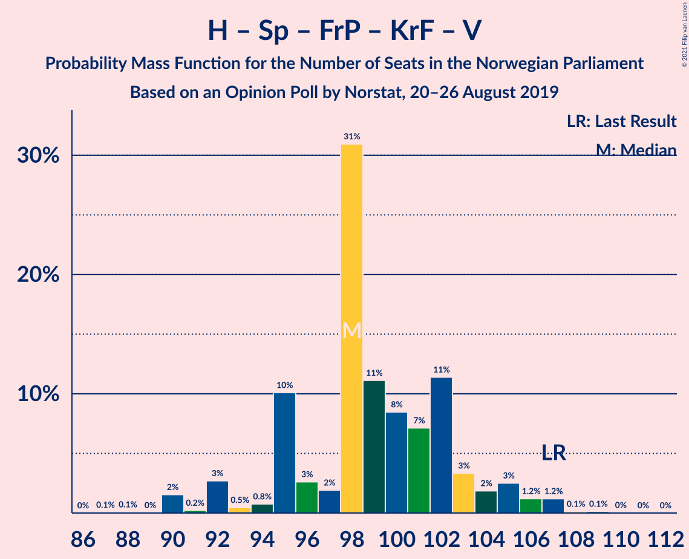

| Number of Seats | Probability | Accumulated | Special Marks |
|:---------------:|:-----------:|:-----------:|:-------------:|
| 91 | 9% | 100% |  |
| 92 | 0% | 91% |  |
| 93 | 0% | 91% |  |
| 94 | 0% | 91% |  |
| 95 | 0% | 91% |  |
| 96 | 0.4% | 91% |  |
| 97 | 0% | 91% |  |
| 98 | 0% | 91% |  |
| 99 | 0% | 91% |  |
| 100 | 90% | 91% | Median |
| 101 | 0.4% | 0.4% |  |
| 102 | 0% | 0% |  |
| 103 | 0% | 0% |  |
| 104 | 0% | 0% |  |
| 105 | 0% | 0% |  |
| 106 | 0% | 0% |  |
| 107 | 0% | 0% | Last Result |

### Arbeiderpartiet – Senterpartiet – Sosialistisk Venstreparti – Miljøpartiet De Grønne – Rødt

| Number of Seats | Probability | Accumulated | Special Marks |
|:---------------:|:-----------:|:-----------:|:-------------:|
| 81 | 0% | 100% | Last Result |
| 82 | 0% | 100% |  |
| 83 | 0% | 100% |  |
| 84 | 0% | 100% |  |
| 85 | 0% | 100% | Majority |
| 86 | 0% | 100% |  |
| 87 | 0% | 100% |  |
| 88 | 0% | 100% |  |
| 89 | 0% | 100% |  |
| 90 | 0% | 100% |  |
| 91 | 0% | 100% |  |
| 92 | 0% | 100% |  |
| 93 | 0% | 100% |  |
| 94 | 0% | 100% |  |
| 95 | 0% | 100% |  |
| 96 | 99.2% | 100% | Median |
| 97 | 0.4% | 0.8% |  |
| 98 | 0% | 0.4% |  |
| 99 | 0% | 0.4% |  |
| 100 | 0.4% | 0.4% |  |
| 101 | 0% | 0% |  |

### Arbeiderpartiet – Senterpartiet – Sosialistisk Venstreparti – Miljøpartiet De Grønne – Kristelig Folkeparti

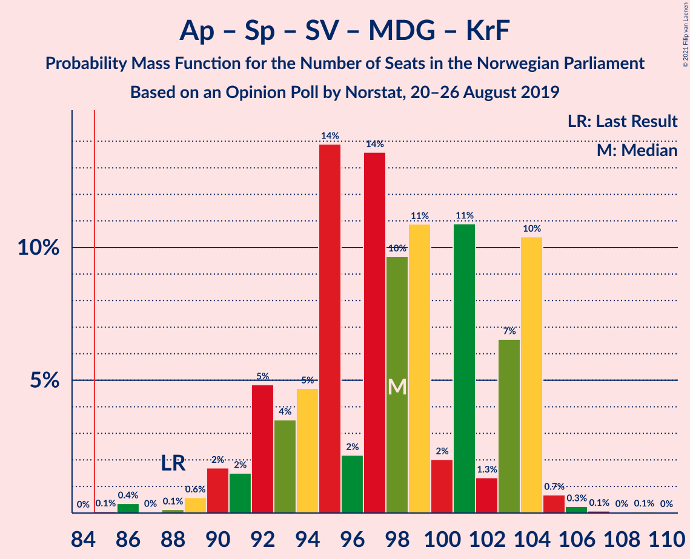

| Number of Seats | Probability | Accumulated | Special Marks |
|:---------------:|:-----------:|:-----------:|:-------------:|
| 88 | 0% | 100% | Last Result |
| 89 | 9% | 100% |  |
| 90 | 0% | 91% |  |
| 91 | 0% | 91% |  |
| 92 | 0% | 91% |  |
| 93 | 0% | 91% |  |
| 94 | 0% | 91% |  |
| 95 | 90% | 91% | Median |
| 96 | 0% | 0.8% |  |
| 97 | 0.4% | 0.8% |  |
| 98 | 0.4% | 0.4% |  |
| 99 | 0% | 0% |  |

### Arbeiderpartiet – Senterpartiet – Sosialistisk Venstreparti – Miljøpartiet De Grønne

| Number of Seats | Probability | Accumulated | Special Marks |
|:---------------:|:-----------:|:-----------:|:-------------:|
| 80 | 0% | 100% | Last Result |
| 81 | 0% | 100% |  |
| 82 | 0% | 100% |  |
| 83 | 0% | 100% |  |
| 84 | 0% | 100% |  |
| 85 | 0% | 100% | Majority |
| 86 | 9% | 100% |  |
| 87 | 90% | 91% | Median |
| 88 | 0.4% | 0.8% |  |
| 89 | 0% | 0.4% |  |
| 90 | 0.4% | 0.4% |  |
| 91 | 0% | 0.1% |  |
| 92 | 0% | 0% |  |

### Arbeiderpartiet – Senterpartiet – Sosialistisk Venstreparti – Rødt

| Number of Seats | Probability | Accumulated | Special Marks |
|:---------------:|:-----------:|:-----------:|:-------------:|
| 80 | 0% | 100% | Last Result |
| 81 | 0% | 100% |  |
| 82 | 0% | 100% |  |
| 83 | 0% | 100% |  |
| 84 | 0% | 100% |  |
| 85 | 90% | 100% | Median, Majority |
| 86 | 9% | 10% |  |
| 87 | 0.4% | 0.8% |  |
| 88 | 0% | 0.4% |  |
| 89 | 0.4% | 0.4% |  |
| 90 | 0% | 0% |  |

### Høyre – Fremskrittspartiet – Miljøpartiet De Grønne – Kristelig Folkeparti – Venstre

| Number of Seats | Probability | Accumulated | Special Marks |
|:---------------:|:-----------:|:-----------:|:-------------:|
| 76 | 9% | 100% |  |
| 77 | 0% | 91% |  |
| 78 | 0% | 91% |  |
| 79 | 0% | 91% |  |
| 80 | 0.4% | 91% |  |
| 81 | 0% | 91% |  |
| 82 | 0.4% | 91% |  |
| 83 | 0% | 90% |  |
| 84 | 90% | 90% | Median |
| 85 | 0% | 0% | Majority |
| 86 | 0% | 0% |  |
| 87 | 0% | 0% |  |
| 88 | 0% | 0% |  |
| 89 | 0% | 0% | Last Result |

### Arbeiderpartiet – Senterpartiet – Miljøpartiet De Grønne – Kristelig Folkeparti

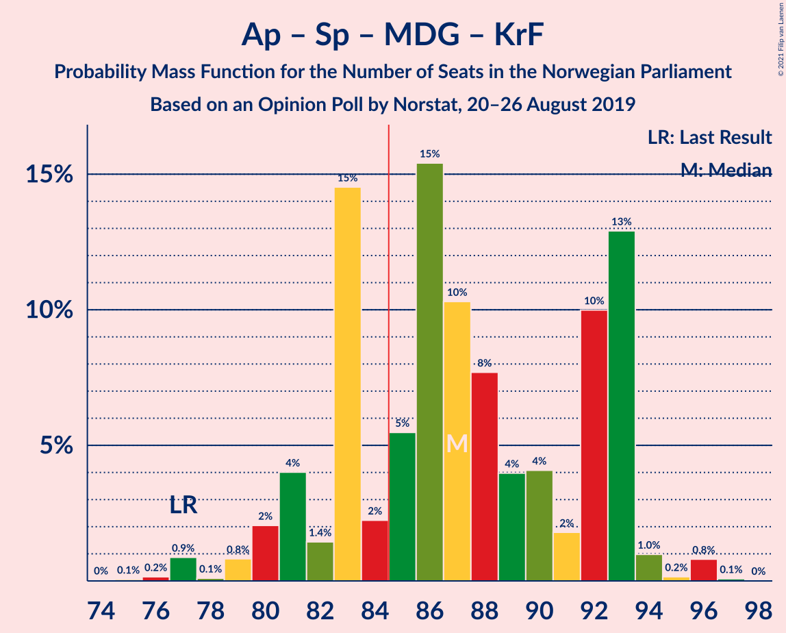

| Number of Seats | Probability | Accumulated | Special Marks |
|:---------------:|:-----------:|:-----------:|:-------------:|
| 77 | 0% | 100% | Last Result |
| 78 | 0% | 100% |  |
| 79 | 9% | 100% |  |
| 80 | 0% | 91% |  |
| 81 | 0% | 91% |  |
| 82 | 0% | 91% |  |
| 83 | 90% | 91% | Median |
| 84 | 0% | 0.8% |  |
| 85 | 0.4% | 0.8% | Majority |
| 86 | 0% | 0.4% |  |
| 87 | 0.4% | 0.4% |  |
| 88 | 0% | 0% |  |

### Arbeiderpartiet – Senterpartiet – Sosialistisk Venstreparti

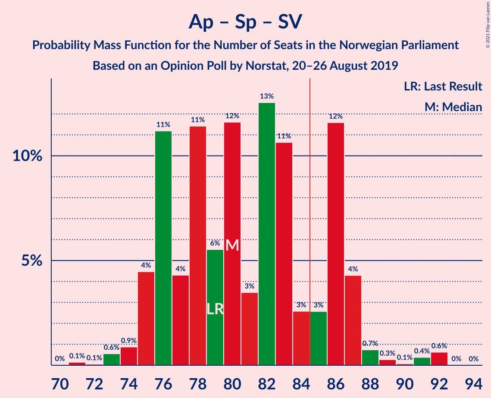

| Number of Seats | Probability | Accumulated | Special Marks |
|:---------------:|:-----------:|:-----------:|:-------------:|
| 76 | 99.2% | 100% | Median |
| 77 | 0.4% | 0.8% |  |
| 78 | 0% | 0.4% |  |
| 79 | 0% | 0.4% | Last Result |
| 80 | 0.4% | 0.4% |  |
| 81 | 0% | 0.1% |  |
| 82 | 0% | 0% |  |

### Høyre – Fremskrittspartiet – Kristelig Folkeparti – Venstre

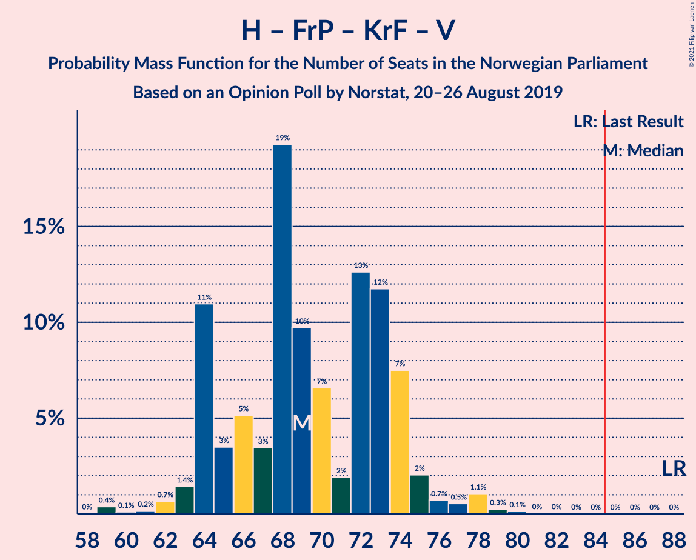

| Number of Seats | Probability | Accumulated | Special Marks |
|:---------------:|:-----------:|:-----------:|:-------------:|
| 66 | 9% | 100% |  |
| 67 | 0% | 91% |  |
| 68 | 0% | 91% |  |
| 69 | 0.4% | 91% |  |
| 70 | 0% | 91% |  |
| 71 | 0% | 91% |  |
| 72 | 0.4% | 91% |  |
| 73 | 90% | 90% | Median |
| 74 | 0% | 0% |  |
| 75 | 0% | 0% |  |
| 76 | 0% | 0% |  |
| 77 | 0% | 0% |  |
| 78 | 0% | 0% |  |
| 79 | 0% | 0% |  |
| 80 | 0% | 0% |  |
| 81 | 0% | 0% |  |
| 82 | 0% | 0% |  |
| 83 | 0% | 0% |  |
| 84 | 0% | 0% |  |
| 85 | 0% | 0% | Majority |
| 86 | 0% | 0% |  |
| 87 | 0% | 0% |  |
| 88 | 0% | 0% | Last Result |

### Arbeiderpartiet – Senterpartiet – Kristelig Folkeparti

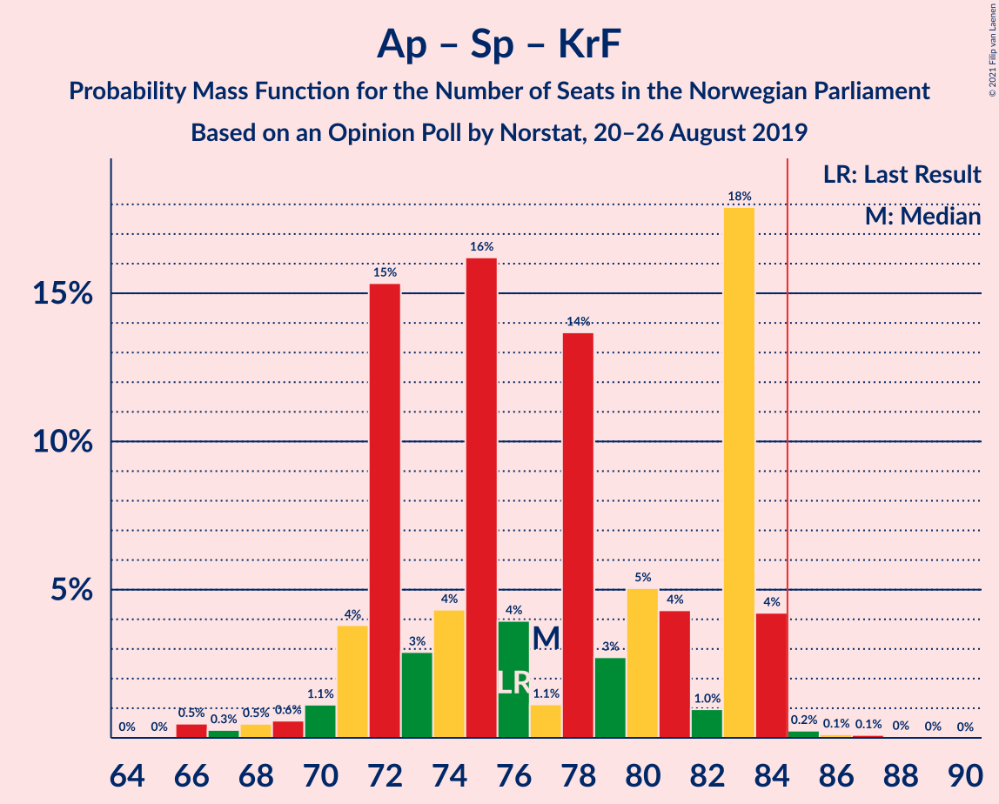

| Number of Seats | Probability | Accumulated | Special Marks |
|:---------------:|:-----------:|:-----------:|:-------------:|
| 69 | 9% | 100% |  |
| 70 | 0% | 91% |  |
| 71 | 0% | 91% |  |
| 72 | 90% | 91% | Median |
| 73 | 0% | 0.8% |  |
| 74 | 0% | 0.8% |  |
| 75 | 0.4% | 0.8% |  |
| 76 | 0.4% | 0.4% | Last Result |
| 77 | 0% | 0% |  |

### Arbeiderpartiet – Senterpartiet

| Number of Seats | Probability | Accumulated | Special Marks |
|:---------------:|:-----------:|:-----------:|:-------------:|
| 64 | 90% | 100% | Median |
| 65 | 0% | 10% |  |
| 66 | 9% | 10% |  |
| 67 | 0.7% | 0.8% |  |
| 68 | 0% | 0.1% | Last Result |
| 69 | 0% | 0.1% |  |
| 70 | 0% | 0.1% |  |
| 71 | 0% | 0.1% |  |
| 72 | 0% | 0.1% |  |
| 73 | 0% | 0% |  |

### Høyre – Fremskrittspartiet – Venstre

| Number of Seats | Probability | Accumulated | Special Marks |
|:---------------:|:-----------:|:-----------:|:-------------:|
| 60 | 0.4% | 100% |  |
| 61 | 0% | 99.6% |  |
| 62 | 0% | 99.6% |  |
| 63 | 9% | 99.6% |  |
| 64 | 0.4% | 91% |  |
| 65 | 90% | 90% | Median |
| 66 | 0% | 0% |  |
| 67 | 0% | 0% |  |
| 68 | 0% | 0% |  |
| 69 | 0% | 0% |  |
| 70 | 0% | 0% |  |
| 71 | 0% | 0% |  |
| 72 | 0% | 0% |  |
| 73 | 0% | 0% |  |
| 74 | 0% | 0% |  |
| 75 | 0% | 0% |  |
| 76 | 0% | 0% |  |
| 77 | 0% | 0% |  |
| 78 | 0% | 0% |  |
| 79 | 0% | 0% |  |
| 80 | 0% | 0% | Last Result |

### Høyre – Fremskrittspartiet

| Number of Seats | Probability | Accumulated | Special Marks |
|:---------------:|:-----------:|:-----------:|:-------------:|
| 59 | 0.4% | 100% |  |
| 60 | 0% | 99.6% |  |
| 61 | 9% | 99.6% |  |
| 62 | 0% | 91% |  |
| 63 | 90% | 91% | Median |
| 64 | 0.4% | 0.4% |  |
| 65 | 0% | 0% |  |
| 66 | 0% | 0% |  |
| 67 | 0% | 0% |  |
| 68 | 0% | 0% |  |
| 69 | 0% | 0% |  |
| 70 | 0% | 0% |  |
| 71 | 0% | 0% |  |
| 72 | 0% | 0% | Last Result |

### Arbeiderpartiet – Sosialistisk Venstreparti

| Number of Seats | Probability | Accumulated | Special Marks |
|:---------------:|:-----------:|:-----------:|:-------------:|
| 49 | 90% | 100% | Median |
| 50 | 0.4% | 10% |  |
| 51 | 9% | 9% |  |
| 52 | 0% | 0% |  |
| 53 | 0% | 0% |  |
| 54 | 0% | 0% |  |
| 55 | 0% | 0% |  |
| 56 | 0% | 0% |  |
| 57 | 0% | 0% |  |
| 58 | 0% | 0% |  |
| 59 | 0% | 0% |  |
| 60 | 0% | 0% | Last Result |

### Høyre – Kristelig Folkeparti – Venstre

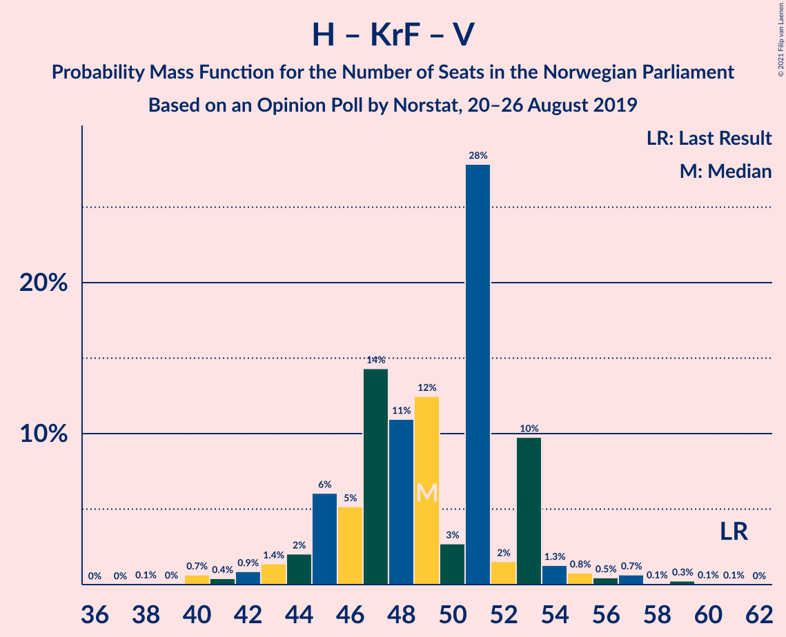

| Number of Seats | Probability | Accumulated | Special Marks |
|:---------------:|:-----------:|:-----------:|:-------------:|
| 42 | 9% | 100% |  |
| 43 | 0% | 91% |  |
| 44 | 0% | 91% |  |
| 45 | 0.4% | 91% |  |
| 46 | 0% | 91% |  |
| 47 | 0% | 91% |  |
| 48 | 90% | 91% | Median |
| 49 | 0% | 0.4% |  |
| 50 | 0.4% | 0.4% |  |
| 51 | 0% | 0% |  |
| 52 | 0% | 0% |  |
| 53 | 0% | 0% |  |
| 54 | 0% | 0% |  |
| 55 | 0% | 0% |  |
| 56 | 0% | 0% |  |
| 57 | 0% | 0% |  |
| 58 | 0% | 0% |  |
| 59 | 0% | 0% |  |
| 60 | 0% | 0% |  |
| 61 | 0% | 0% | Last Result |

### Senterpartiet – Kristelig Folkeparti – Venstre

| Number of Seats | Probability | Accumulated | Special Marks |
|:---------------:|:-----------:|:-----------:|:-------------:|
| 30 | 9% | 100% |  |
| 31 | 0% | 91% |  |
| 32 | 0% | 91% |  |
| 33 | 0% | 91% |  |
| 34 | 0% | 91% |  |
| 35 | 0% | 91% | Last Result |
| 36 | 0% | 91% |  |
| 37 | 91% | 91% | Median |
| 38 | 0% | 0.1% |  |
| 39 | 0% | 0% |  |

## Technical Information

### Opinion Poll

+ **Polling firm:** Norstat
+ **Commissioner(s):** —
+ **Fieldwork period:** 20–26 August 2019

### Calculations

+ **Sample size:** 943
+ **Simulations done:** 1,024
+ **Error estimate:** 2.04%

