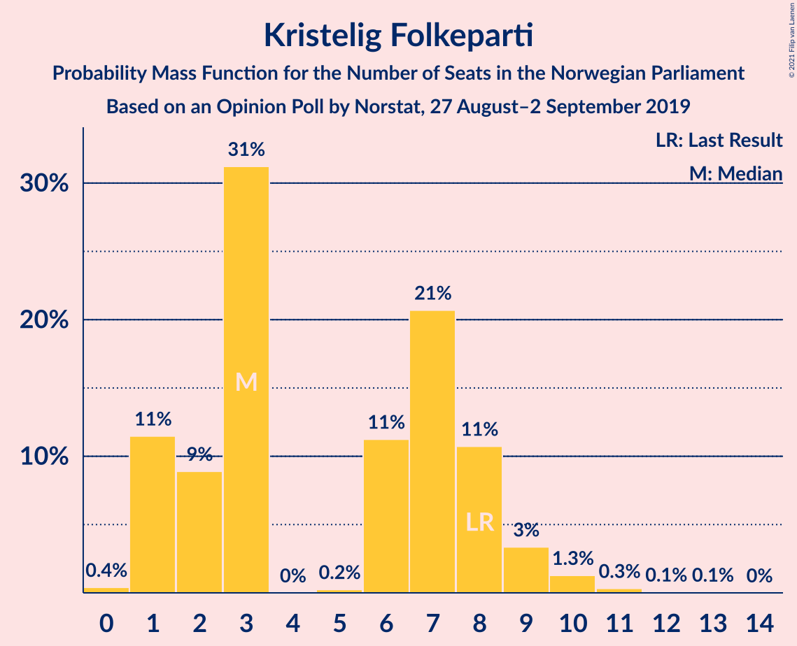
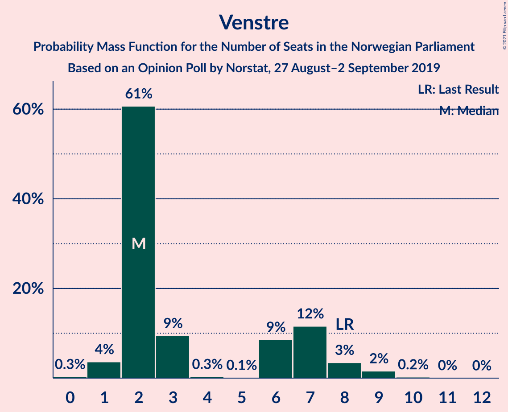
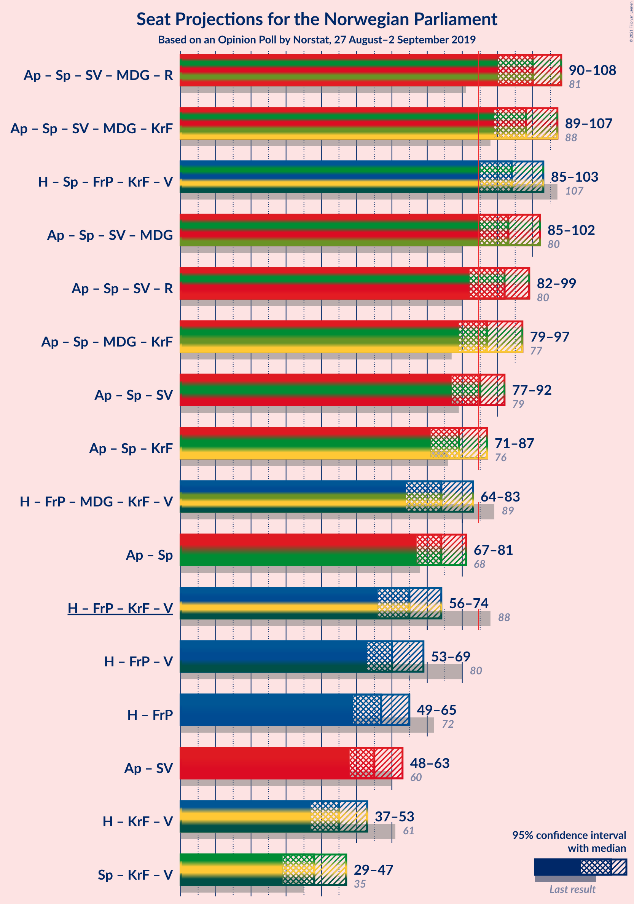
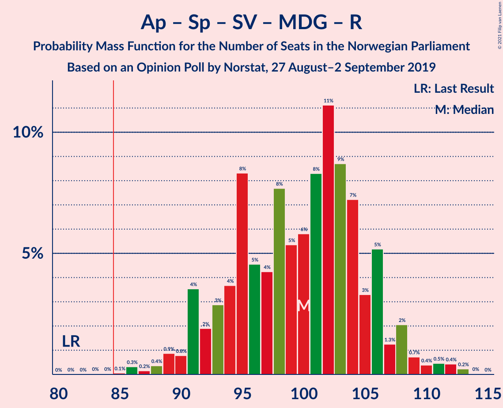
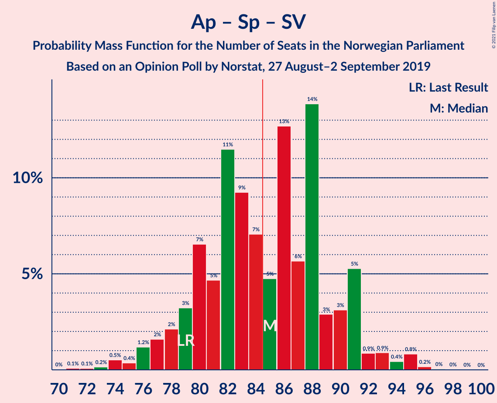
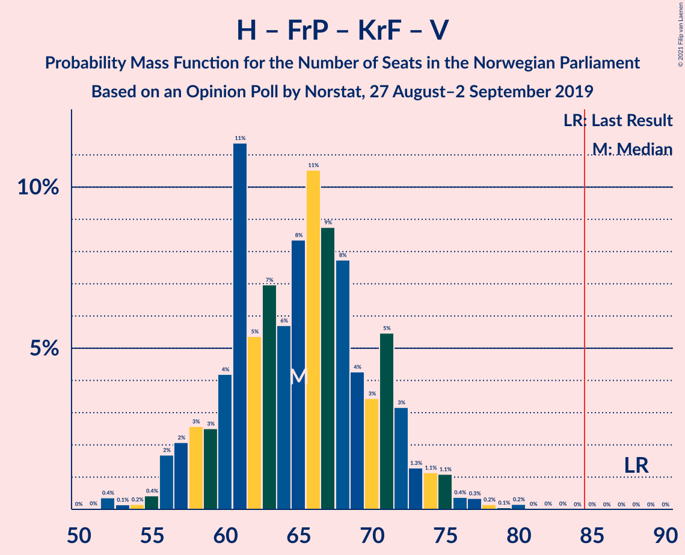
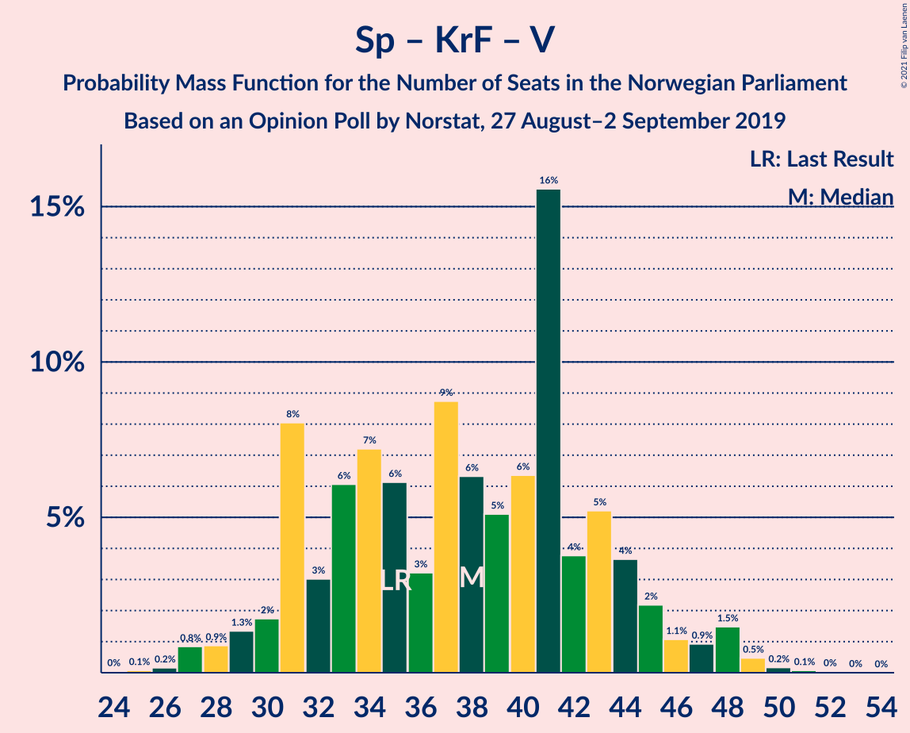

# Opinion Poll by Norstat, 27 August–2 September 2019

<a href="#voting-intentions">Voting Intentions</a> | <a href="#seats">Seats</a> | <a href="#coalitions">Coalitions</a> | <a href="#technical-information">Technical Information</a>

## Voting Intentions

### Confidence Intervals

| Party | Last Result | Poll Result | 80% Confidence Interval | 90% Confidence Interval | 95% Confidence Interval | 99% Confidence Interval |
|:-----:|:-----------:|:-----------:|:-----------------------:|:-----------------------:|:-----------------------:|:-----------------------:|
| Arbeiderpartiet | 27.4% | 24.5% | 22.3–26.8% |21.7–27.5% |21.2–28.1% |20.2–29.2% |
| Høyre | 25.0% | 20.9% | 18.9–23.2% |18.3–23.8% |17.8–24.4% |16.9–25.5% |
| Senterpartiet | 10.3% | 15.9% | 14.1–17.9% |13.6–18.5% |13.1–19.0% |12.3–20.0% |
| Fremskrittspartiet | 15.2% | 11.5% | 9.9–13.3% |9.5–13.8% |9.1–14.3% |8.5–15.2% |
| Sosialistisk Venstreparti | 6.0% | 6.1% | 5.0–7.5% |4.7–7.9% |4.4–8.3% |3.9–9.0% |
| Miljøpartiet De Grønne | 3.2% | 5.4% | 4.4–6.8% |4.1–7.2% |3.8–7.5% |3.4–8.2% |
| Rødt | 2.4% | 4.4% | 3.5–5.7% |3.2–6.0% |3.0–6.4% |2.6–7.0% |
| Kristelig Folkeparti | 4.2% | 3.9% | 3.0–5.1% |2.8–5.4% |2.6–5.8% |2.2–6.4% |
| Venstre | 4.4% | 3.4% | 2.6–4.5% |2.4–4.9% |2.2–5.2% |1.9–5.8% |

*Note:* The poll result column reflects the actual value used in the calculations. Published results may vary slightly, and in addition be rounded to fewer digits.

## Seats

### Confidence Intervals

| Party | Last Result | Median | 80% Confidence Interval | 90% Confidence Interval | 95% Confidence Interval | 99% Confidence Interval |
|:-----:|:-----------:|:------:|:-----------------------:|:-----------------------:|:-----------------------:|:-----------------------:|
| <a href="#arbeiderpartiet">Arbeiderpartiet</a> | 49 | 40 | 40–41 |40–41 |40–41 |40–49 |
| <a href="#høyre">Høyre</a> | 45 | 32 | 32–34 |32–34 |32–37 |32–44 |
| <a href="#senterpartiet">Senterpartiet</a> | 19 | 37 | 37 |37–38 |25–38 |21–38 |
| <a href="#fremskrittspartiet">Fremskrittspartiet</a> | 27 | 19 | 19 |17–19 |17–22 |16–24 |
| <a href="#sosialistisk-venstreparti">Sosialistisk Venstreparti</a> | 11 | 11 | 10–11 |10–11 |10–11 |8–13 |
| <a href="#miljøpartiet-de-grønne">Miljøpartiet De Grønne</a> | 1 | 10 | 10 |8–10 |8–11 |2–11 |
| <a href="#rødt">Rødt</a> | 1 | 2 | 2 |2 |2 |2–11 |
| <a href="#kristelig-folkeparti">Kristelig Folkeparti</a> | 8 | 3 | 3 |3 |3 |1–9 |
| <a href="#venstre">Venstre</a> | 8 | 7 | 7 |7 |2–7 |2–8 |

### Arbeiderpartiet

*For a full overview of the results for this party, see the [Arbeiderpartiet](party-arbeiderpartiet.html) page.*

| Number of Seats | Probability | Accumulated | Special Marks |
|:---------------:|:-----------:|:-----------:|:-------------:|
| 37 | 0% | 100% |  |
| 38 | 0.2% | 99.9% |  |
| 39 | 0.2% | 99.7% |  |
| 40 | 89% | 99.5% | Median |
| 41 | 9% | 10% |  |
| 42 | 0.1% | 1.5% |  |
| 43 | 0.1% | 1.4% |  |
| 44 | 0% | 1.3% |  |
| 45 | 0% | 1.3% |  |
| 46 | 0% | 1.2% |  |
| 47 | 0.4% | 1.2% |  |
| 48 | 0% | 0.8% |  |
| 49 | 0.5% | 0.8% | Last Result |
| 50 | 0% | 0.3% |  |
| 51 | 0.3% | 0.3% |  |
| 52 | 0% | 0% |  |

### Høyre

*For a full overview of the results for this party, see the [Høyre](party-høyre.html) page.*

| Number of Seats | Probability | Accumulated | Special Marks |
|:---------------:|:-----------:|:-----------:|:-------------:|
| 28 | 0.2% | 100% |  |
| 29 | 0.2% | 99.8% |  |
| 30 | 0% | 99.6% |  |
| 31 | 0% | 99.6% |  |
| 32 | 88% | 99.6% | Median |
| 33 | 0.5% | 12% |  |
| 34 | 9% | 11% |  |
| 35 | 0.2% | 3% |  |
| 36 | 0.1% | 3% |  |
| 37 | 0.3% | 3% |  |
| 38 | 0% | 2% |  |
| 39 | 0.1% | 2% |  |
| 40 | 0% | 2% |  |
| 41 | 0% | 2% |  |
| 42 | 0% | 2% |  |
| 43 | 0% | 2% |  |
| 44 | 2% | 2% |  |
| 45 | 0% | 0% | Last Result |

### Senterpartiet

*For a full overview of the results for this party, see the [Senterpartiet](party-senterpartiet.html) page.*

| Number of Seats | Probability | Accumulated | Special Marks |
|:---------------:|:-----------:|:-----------:|:-------------:|
| 19 | 0% | 100% | Last Result |
| 20 | 0% | 100% |  |
| 21 | 2% | 100% |  |
| 22 | 0.5% | 98% |  |
| 23 | 0% | 98% |  |
| 24 | 0% | 98% |  |
| 25 | 0.1% | 98% |  |
| 26 | 0% | 97% |  |
| 27 | 0% | 97% |  |
| 28 | 0.2% | 97% |  |
| 29 | 0.3% | 97% |  |
| 30 | 0.2% | 97% |  |
| 31 | 0% | 97% |  |
| 32 | 0% | 97% |  |
| 33 | 0.2% | 97% |  |
| 34 | 0% | 96% |  |
| 35 | 0% | 96% |  |
| 36 | 0.1% | 96% |  |
| 37 | 87% | 96% | Median |
| 38 | 9% | 9% |  |
| 39 | 0.3% | 0.4% |  |
| 40 | 0% | 0.1% |  |
| 41 | 0% | 0.1% |  |
| 42 | 0% | 0% |  |

### Fremskrittspartiet

*For a full overview of the results for this party, see the [Fremskrittspartiet](party-fremskrittspartiet.html) page.*

| Number of Seats | Probability | Accumulated | Special Marks |
|:---------------:|:-----------:|:-----------:|:-------------:|
| 14 | 0% | 100% |  |
| 15 | 0.2% | 99.9% |  |
| 16 | 0.3% | 99.7% |  |
| 17 | 9% | 99.4% |  |
| 18 | 0.3% | 91% |  |
| 19 | 88% | 91% | Median |
| 20 | 0.1% | 3% |  |
| 21 | 0% | 3% |  |
| 22 | 0.4% | 3% |  |
| 23 | 0% | 2% |  |
| 24 | 2% | 2% |  |
| 25 | 0% | 0% |  |
| 26 | 0% | 0% |  |
| 27 | 0% | 0% | Last Result |

### Sosialistisk Venstreparti

*For a full overview of the results for this party, see the [Sosialistisk Venstreparti](party-sosialistiskvenstreparti.html) page.*

| Number of Seats | Probability | Accumulated | Special Marks |
|:---------------:|:-----------:|:-----------:|:-------------:|
| 2 | 0% | 100% |  |
| 3 | 0% | 99.9% |  |
| 4 | 0% | 99.9% |  |
| 5 | 0% | 99.9% |  |
| 6 | 0% | 99.9% |  |
| 7 | 0.3% | 99.9% |  |
| 8 | 1.0% | 99.6% |  |
| 9 | 0% | 98.6% |  |
| 10 | 9% | 98.6% |  |
| 11 | 88% | 90% | Last Result, Median |
| 12 | 0% | 2% |  |
| 13 | 2% | 2% |  |
| 14 | 0% | 0.1% |  |
| 15 | 0% | 0.1% |  |
| 16 | 0% | 0.1% |  |
| 17 | 0.1% | 0.1% |  |
| 18 | 0% | 0% |  |

### Miljøpartiet De Grønne

*For a full overview of the results for this party, see the [Miljøpartiet De Grønne](party-miljøpartietdegrønne.html) page.*

| Number of Seats | Probability | Accumulated | Special Marks |
|:---------------:|:-----------:|:-----------:|:-------------:|
| 1 | 0% | 100% | Last Result |
| 2 | 0.5% | 100% |  |
| 3 | 0% | 99.4% |  |
| 4 | 0% | 99.4% |  |
| 5 | 0% | 99.4% |  |
| 6 | 0% | 99.4% |  |
| 7 | 0% | 99.4% |  |
| 8 | 9% | 99.4% |  |
| 9 | 0.3% | 90% |  |
| 10 | 88% | 90% | Median |
| 11 | 3% | 3% |  |
| 12 | 0.1% | 0.1% |  |
| 13 | 0% | 0% |  |

### Rødt

*For a full overview of the results for this party, see the [Rødt](party-rødt.html) page.*

| Number of Seats | Probability | Accumulated | Special Marks |
|:---------------:|:-----------:|:-----------:|:-------------:|
| 1 | 0.1% | 100% | Last Result |
| 2 | 98% | 99.9% | Median |
| 3 | 0% | 2% |  |
| 4 | 0% | 2% |  |
| 5 | 0% | 2% |  |
| 6 | 0.1% | 2% |  |
| 7 | 0.1% | 1.5% |  |
| 8 | 0.4% | 1.3% |  |
| 9 | 0% | 0.9% |  |
| 10 | 0.1% | 0.9% |  |
| 11 | 0.5% | 0.8% |  |
| 12 | 0% | 0.3% |  |
| 13 | 0.3% | 0.3% |  |
| 14 | 0% | 0% |  |

### Kristelig Folkeparti

*For a full overview of the results for this party, see the [Kristelig Folkeparti](party-kristeligfolkeparti.html) page.*

| Number of Seats | Probability | Accumulated | Special Marks |
|:---------------:|:-----------:|:-----------:|:-------------:|
| 0 | 0.2% | 100% |  |
| 1 | 0.4% | 99.8% |  |
| 2 | 0% | 99.4% |  |
| 3 | 98% | 99.4% | Median |
| 4 | 0% | 1.4% |  |
| 5 | 0% | 1.4% |  |
| 6 | 0.1% | 1.4% |  |
| 7 | 0.1% | 1.3% |  |
| 8 | 0.5% | 1.3% | Last Result |
| 9 | 0.7% | 0.8% |  |
| 10 | 0.1% | 0.1% |  |
| 11 | 0% | 0% |  |

### Venstre

*For a full overview of the results for this party, see the [Venstre](party-venstre.html) page.*

| Number of Seats | Probability | Accumulated | Special Marks |
|:---------------:|:-----------:|:-----------:|:-------------:|
| 0 | 0.1% | 100% |  |
| 1 | 0.1% | 99.9% |  |
| 2 | 3% | 99.8% |  |
| 3 | 0% | 97% |  |
| 4 | 0.1% | 97% |  |
| 5 | 0% | 97% |  |
| 6 | 0.3% | 97% |  |
| 7 | 96% | 97% | Median |
| 8 | 0.4% | 0.7% | Last Result |
| 9 | 0.2% | 0.3% |  |
| 10 | 0% | 0.1% |  |
| 11 | 0% | 0.1% |  |
| 12 | 0% | 0.1% |  |
| 13 | 0% | 0.1% |  |
| 14 | 0.1% | 0.1% |  |
| 15 | 0% | 0% |  |

## Coalitions

### Confidence Intervals

| Coalition | Last Result | Median | Majority? | 80% Confidence Interval | 90% Confidence Interval | 95% Confidence Interval | 99% Confidence Interval |
|:---------:|:-----------:|:------:|:---------:|:-----------------------:|:-----------------------:|:-----------------------:|:-----------------------:|
| Arbeiderpartiet – Senterpartiet – Sosialistisk Venstreparti – Miljøpartiet De Grønne – Kristelig Folkeparti | 88 | 101 | 100% | 100–101 | 100–101 | 96–101 | 88–101 |
| Arbeiderpartiet – Senterpartiet – Sosialistisk Venstreparti – Miljøpartiet De Grønne – Rødt | 81 | 100 | 100% | 99–100 | 99–100 | 95–100 | 87–102 |
| Høyre – Senterpartiet – Fremskrittspartiet – Kristelig Folkeparti – Venstre | 107 | 98 | 100% | 98 | 98–99 | 94–99 | 90–101 |
| Arbeiderpartiet – Senterpartiet – Sosialistisk Venstreparti – Miljøpartiet De Grønne | 80 | 98 | 99.8% | 97–98 | 97–98 | 90–98 | 85–98 |
| Arbeiderpartiet – Senterpartiet – Sosialistisk Venstreparti – Rødt | 80 | 90 | 98% | 90 | 90–91 | 89–91 | 76–95 |
| Arbeiderpartiet – Senterpartiet – Miljøpartiet De Grønne – Kristelig Folkeparti | 77 | 90 | 98% | 90 | 90 | 87–90 | 75–91 |
| Arbeiderpartiet – Senterpartiet – Sosialistisk Venstreparti | 79 | 88 | 97% | 88 | 88–89 | 79–89 | 74–89 |
| Arbeiderpartiet – Senterpartiet – Kristelig Folkeparti | 76 | 80 | 0.6% | 80 | 80–82 | 78–82 | 64–86 |
| Arbeiderpartiet – Senterpartiet | 68 | 77 | 0% | 77 | 77–79 | 71–79 | 61–79 |
| Høyre – Fremskrittspartiet – Miljøpartiet De Grønne – Kristelig Folkeparti – Venstre | 89 | 71 | 0.1% | 71 | 69–71 | 69–79 | 69–84 |
| Høyre – Fremskrittspartiet – Kristelig Folkeparti – Venstre | 88 | 61 | 0% | 61 | 61 | 61–68 | 61–73 |
| Høyre – Fremskrittspartiet – Venstre | 80 | 58 | 0% | 58 | 58 | 58–59 | 55–70 |
| Høyre – Fremskrittspartiet | 72 | 51 | 0% | 51 | 51 | 51–57 | 51–68 |
| Arbeiderpartiet – Sosialistisk Venstreparti | 60 | 51 | 0% | 51 | 51 | 51–53 | 48–57 |
| Senterpartiet – Kristelig Folkeparti – Venstre | 35 | 47 | 0% | 47 | 47–48 | 35–48 | 26–48 |
| Høyre – Kristelig Folkeparti – Venstre | 61 | 42 | 0% | 42–44 | 42–44 | 42–47 | 42–49 |

### Arbeiderpartiet – Senterpartiet – Sosialistisk Venstreparti – Miljøpartiet De Grønne – Kristelig Folkeparti

| Number of Seats | Probability | Accumulated | Special Marks |
|:---------------:|:-----------:|:-----------:|:-------------:|
| 85 | 0.2% | 100% | Majority |
| 86 | 0% | 99.8% |  |
| 87 | 0% | 99.8% |  |
| 88 | 2% | 99.8% | Last Result |
| 89 | 0% | 98% |  |
| 90 | 0% | 98% |  |
| 91 | 0.1% | 98% |  |
| 92 | 0% | 98% |  |
| 93 | 0% | 98% |  |
| 94 | 0% | 98% |  |
| 95 | 0.2% | 98% |  |
| 96 | 0.1% | 98% |  |
| 97 | 0.2% | 97% |  |
| 98 | 0% | 97% |  |
| 99 | 0.5% | 97% |  |
| 100 | 9% | 97% |  |
| 101 | 88% | 88% | Median |
| 102 | 0.2% | 0.5% |  |
| 103 | 0.1% | 0.2% |  |
| 104 | 0% | 0.1% |  |
| 105 | 0.1% | 0.1% |  |
| 106 | 0% | 0% |  |

### Arbeiderpartiet – Senterpartiet – Sosialistisk Venstreparti – Miljøpartiet De Grønne – Rødt

| Number of Seats | Probability | Accumulated | Special Marks |
|:---------------:|:-----------:|:-----------:|:-------------:|
| 81 | 0% | 100% | Last Result |
| 82 | 0% | 100% |  |
| 83 | 0% | 100% |  |
| 84 | 0% | 100% |  |
| 85 | 0% | 100% | Majority |
| 86 | 0% | 100% |  |
| 87 | 2% | 100% |  |
| 88 | 0% | 98% |  |
| 89 | 0% | 98% |  |
| 90 | 0% | 98% |  |
| 91 | 0% | 98% |  |
| 92 | 0.2% | 98% |  |
| 93 | 0% | 98% |  |
| 94 | 0% | 98% |  |
| 95 | 0.3% | 98% |  |
| 96 | 0% | 97% |  |
| 97 | 0.1% | 97% |  |
| 98 | 0% | 97% |  |
| 99 | 9% | 97% |  |
| 100 | 87% | 89% | Median |
| 101 | 0.5% | 1.1% |  |
| 102 | 0.2% | 0.6% |  |
| 103 | 0.1% | 0.5% |  |
| 104 | 0% | 0.4% |  |
| 105 | 0.1% | 0.4% |  |
| 106 | 0.3% | 0.3% |  |
| 107 | 0% | 0% |  |

### Høyre – Senterpartiet – Fremskrittspartiet – Kristelig Folkeparti – Venstre

| Number of Seats | Probability | Accumulated | Special Marks |
|:---------------:|:-----------:|:-----------:|:-------------:|
| 87 | 0% | 100% |  |
| 88 | 0% | 99.9% |  |
| 89 | 0.1% | 99.9% |  |
| 90 | 0.7% | 99.9% |  |
| 91 | 0% | 99.2% |  |
| 92 | 0.3% | 99.1% |  |
| 93 | 0% | 98.9% |  |
| 94 | 2% | 98.8% |  |
| 95 | 0% | 97% |  |
| 96 | 0.3% | 97% |  |
| 97 | 0.1% | 97% |  |
| 98 | 87% | 97% | Median |
| 99 | 9% | 9% |  |
| 100 | 0% | 0.5% |  |
| 101 | 0.2% | 0.5% |  |
| 102 | 0% | 0.3% |  |
| 103 | 0% | 0.3% |  |
| 104 | 0% | 0.3% |  |
| 105 | 0.3% | 0.3% |  |
| 106 | 0% | 0.1% |  |
| 107 | 0% | 0.1% | Last Result |
| 108 | 0% | 0% |  |

### Arbeiderpartiet – Senterpartiet – Sosialistisk Venstreparti – Miljøpartiet De Grønne

| Number of Seats | Probability | Accumulated | Special Marks |
|:---------------:|:-----------:|:-----------:|:-------------:|
| 80 | 0% | 100% | Last Result |
| 81 | 0% | 100% |  |
| 82 | 0% | 100% |  |
| 83 | 0% | 100% |  |
| 84 | 0.2% | 100% |  |
| 85 | 2% | 99.8% | Majority |
| 86 | 0% | 98% |  |
| 87 | 0.1% | 98% |  |
| 88 | 0.1% | 98% |  |
| 89 | 0% | 98% |  |
| 90 | 0.6% | 98% |  |
| 91 | 0% | 97% |  |
| 92 | 0% | 97% |  |
| 93 | 0.5% | 97% |  |
| 94 | 0.2% | 97% |  |
| 95 | 0.2% | 96% |  |
| 96 | 0% | 96% |  |
| 97 | 9% | 96% |  |
| 98 | 87% | 87% | Median |
| 99 | 0% | 0% |  |

### Arbeiderpartiet – Senterpartiet – Sosialistisk Venstreparti – Rødt

| Number of Seats | Probability | Accumulated | Special Marks |
|:---------------:|:-----------:|:-----------:|:-------------:|
| 76 | 2% | 100% |  |
| 77 | 0% | 98% |  |
| 78 | 0% | 98% |  |
| 79 | 0% | 98% |  |
| 80 | 0% | 98% | Last Result |
| 81 | 0% | 98% |  |
| 82 | 0.1% | 98% |  |
| 83 | 0% | 98% |  |
| 84 | 0% | 98% |  |
| 85 | 0.1% | 98% | Majority |
| 86 | 0% | 98% |  |
| 87 | 0.2% | 98% |  |
| 88 | 0.1% | 98% |  |
| 89 | 0.2% | 98% |  |
| 90 | 88% | 97% | Median |
| 91 | 9% | 9% |  |
| 92 | 0% | 0.7% |  |
| 93 | 0.2% | 0.7% |  |
| 94 | 0% | 0.5% |  |
| 95 | 0.1% | 0.5% |  |
| 96 | 0% | 0.4% |  |
| 97 | 0% | 0.3% |  |
| 98 | 0% | 0.3% |  |
| 99 | 0.1% | 0.3% |  |
| 100 | 0% | 0.3% |  |
| 101 | 0% | 0.3% |  |
| 102 | 0% | 0.3% |  |
| 103 | 0% | 0.3% |  |
| 104 | 0.3% | 0.3% |  |
| 105 | 0% | 0% |  |

### Arbeiderpartiet – Senterpartiet – Miljøpartiet De Grønne – Kristelig Folkeparti

| Number of Seats | Probability | Accumulated | Special Marks |
|:---------------:|:-----------:|:-----------:|:-------------:|
| 75 | 2% | 100% |  |
| 76 | 0% | 98% |  |
| 77 | 0% | 98% | Last Result |
| 78 | 0.3% | 98% |  |
| 79 | 0% | 98% |  |
| 80 | 0.1% | 98% |  |
| 81 | 0% | 98% |  |
| 82 | 0% | 98% |  |
| 83 | 0% | 98% |  |
| 84 | 0% | 98% |  |
| 85 | 0.1% | 98% | Majority |
| 86 | 0% | 98% |  |
| 87 | 0.2% | 98% |  |
| 88 | 0.1% | 97% |  |
| 89 | 0.1% | 97% |  |
| 90 | 96% | 97% | Median |
| 91 | 0.5% | 0.8% |  |
| 92 | 0% | 0.3% |  |
| 93 | 0% | 0.3% |  |
| 94 | 0.2% | 0.3% |  |
| 95 | 0% | 0% |  |

### Arbeiderpartiet – Senterpartiet – Sosialistisk Venstreparti

| Number of Seats | Probability | Accumulated | Special Marks |
|:---------------:|:-----------:|:-----------:|:-------------:|
| 74 | 2% | 100% |  |
| 75 | 0% | 98% |  |
| 76 | 0% | 98% |  |
| 77 | 0% | 98% |  |
| 78 | 0.1% | 98% |  |
| 79 | 0.5% | 98% | Last Result |
| 80 | 0% | 97% |  |
| 81 | 0.1% | 97% |  |
| 82 | 0.2% | 97% |  |
| 83 | 0% | 97% |  |
| 84 | 0% | 97% |  |
| 85 | 0.5% | 97% | Majority |
| 86 | 0.1% | 97% |  |
| 87 | 0.2% | 97% |  |
| 88 | 87% | 96% | Median |
| 89 | 9% | 9% |  |
| 90 | 0% | 0.3% |  |
| 91 | 0.3% | 0.3% |  |
| 92 | 0% | 0% |  |

### Arbeiderpartiet – Senterpartiet – Kristelig Folkeparti

| Number of Seats | Probability | Accumulated | Special Marks |
|:---------------:|:-----------:|:-----------:|:-------------:|
| 64 | 2% | 100% |  |
| 65 | 0% | 98% |  |
| 66 | 0% | 98% |  |
| 67 | 0% | 98% |  |
| 68 | 0% | 98% |  |
| 69 | 0% | 98% |  |
| 70 | 0.1% | 98% |  |
| 71 | 0% | 98% |  |
| 72 | 0% | 98% |  |
| 73 | 0% | 98% |  |
| 74 | 0% | 98% |  |
| 75 | 0% | 98% |  |
| 76 | 0.3% | 98% | Last Result |
| 77 | 0% | 98% |  |
| 78 | 0.3% | 98% |  |
| 79 | 0% | 97% |  |
| 80 | 88% | 97% | Median |
| 81 | 0% | 9% |  |
| 82 | 9% | 9% |  |
| 83 | 0% | 0.6% |  |
| 84 | 0% | 0.6% |  |
| 85 | 0% | 0.6% | Majority |
| 86 | 0.2% | 0.6% |  |
| 87 | 0% | 0.4% |  |
| 88 | 0.3% | 0.3% |  |
| 89 | 0% | 0% |  |

### Arbeiderpartiet – Senterpartiet

| Number of Seats | Probability | Accumulated | Special Marks |
|:---------------:|:-----------:|:-----------:|:-------------:|
| 61 | 2% | 100% |  |
| 62 | 0% | 98% |  |
| 63 | 0% | 98% |  |
| 64 | 0% | 98% |  |
| 65 | 0% | 98% |  |
| 66 | 0% | 98% |  |
| 67 | 0.1% | 98% |  |
| 68 | 0.1% | 98% | Last Result |
| 69 | 0% | 98% |  |
| 70 | 0% | 98% |  |
| 71 | 0.5% | 98% |  |
| 72 | 0% | 97% |  |
| 73 | 0% | 97% |  |
| 74 | 0.2% | 97% |  |
| 75 | 0.3% | 97% |  |
| 76 | 0% | 97% |  |
| 77 | 88% | 97% | Median |
| 78 | 0.1% | 9% |  |
| 79 | 9% | 9% |  |
| 80 | 0.3% | 0.4% |  |
| 81 | 0% | 0.1% |  |
| 82 | 0% | 0.1% |  |
| 83 | 0% | 0% |  |

### Høyre – Fremskrittspartiet – Miljøpartiet De Grønne – Kristelig Folkeparti – Venstre

| Number of Seats | Probability | Accumulated | Special Marks |
|:---------------:|:-----------:|:-----------:|:-------------:|
| 61 | 0% | 100% |  |
| 62 | 0% | 99.9% |  |
| 63 | 0% | 99.9% |  |
| 64 | 0% | 99.9% |  |
| 65 | 0.3% | 99.9% |  |
| 66 | 0% | 99.7% |  |
| 67 | 0.1% | 99.6% |  |
| 68 | 0% | 99.6% |  |
| 69 | 9% | 99.6% |  |
| 70 | 0.2% | 91% |  |
| 71 | 88% | 91% | Median |
| 72 | 0% | 3% |  |
| 73 | 0.2% | 3% |  |
| 74 | 0.3% | 3% |  |
| 75 | 0% | 3% |  |
| 76 | 0% | 3% |  |
| 77 | 0% | 3% |  |
| 78 | 0% | 3% |  |
| 79 | 0.5% | 3% |  |
| 80 | 0% | 2% |  |
| 81 | 0% | 2% |  |
| 82 | 0% | 2% |  |
| 83 | 0% | 2% |  |
| 84 | 2% | 2% |  |
| 85 | 0% | 0.1% | Majority |
| 86 | 0% | 0% |  |
| 87 | 0% | 0% |  |
| 88 | 0% | 0% |  |
| 89 | 0% | 0% | Last Result |

### Høyre – Fremskrittspartiet – Kristelig Folkeparti – Venstre

| Number of Seats | Probability | Accumulated | Special Marks |
|:---------------:|:-----------:|:-----------:|:-------------:|
| 58 | 0.1% | 100% |  |
| 59 | 0.1% | 99.9% |  |
| 60 | 0.2% | 99.9% |  |
| 61 | 96% | 99.7% | Median |
| 62 | 0.1% | 4% |  |
| 63 | 0.4% | 4% |  |
| 64 | 0.1% | 3% |  |
| 65 | 0% | 3% |  |
| 66 | 0.2% | 3% |  |
| 67 | 0% | 3% |  |
| 68 | 0.7% | 3% |  |
| 69 | 0% | 2% |  |
| 70 | 0% | 2% |  |
| 71 | 0% | 2% |  |
| 72 | 0% | 2% |  |
| 73 | 2% | 2% |  |
| 74 | 0.1% | 0.1% |  |
| 75 | 0% | 0% |  |
| 76 | 0% | 0% |  |
| 77 | 0% | 0% |  |
| 78 | 0% | 0% |  |
| 79 | 0% | 0% |  |
| 80 | 0% | 0% |  |
| 81 | 0% | 0% |  |
| 82 | 0% | 0% |  |
| 83 | 0% | 0% |  |
| 84 | 0% | 0% |  |
| 85 | 0% | 0% | Majority |
| 86 | 0% | 0% |  |
| 87 | 0% | 0% |  |
| 88 | 0% | 0% | Last Result |

### Høyre – Fremskrittspartiet – Venstre

| Number of Seats | Probability | Accumulated | Special Marks |
|:---------------:|:-----------:|:-----------:|:-------------:|
| 52 | 0% | 100% |  |
| 53 | 0% | 99.9% |  |
| 54 | 0.1% | 99.9% |  |
| 55 | 0.4% | 99.9% |  |
| 56 | 0% | 99.4% |  |
| 57 | 0.3% | 99.4% |  |
| 58 | 96% | 99.2% | Median |
| 59 | 0.8% | 3% |  |
| 60 | 0% | 2% |  |
| 61 | 0% | 2% |  |
| 62 | 0.1% | 2% |  |
| 63 | 0% | 2% |  |
| 64 | 0% | 2% |  |
| 65 | 0% | 2% |  |
| 66 | 0% | 2% |  |
| 67 | 0.2% | 2% |  |
| 68 | 0% | 2% |  |
| 69 | 0% | 2% |  |
| 70 | 2% | 2% |  |
| 71 | 0.1% | 0.1% |  |
| 72 | 0% | 0% |  |
| 73 | 0% | 0% |  |
| 74 | 0% | 0% |  |
| 75 | 0% | 0% |  |
| 76 | 0% | 0% |  |
| 77 | 0% | 0% |  |
| 78 | 0% | 0% |  |
| 79 | 0% | 0% |  |
| 80 | 0% | 0% | Last Result |

### Høyre – Fremskrittspartiet

| Number of Seats | Probability | Accumulated | Special Marks |
|:---------------:|:-----------:|:-----------:|:-------------:|
| 47 | 0.1% | 100% |  |
| 48 | 0% | 99.8% |  |
| 49 | 0% | 99.8% |  |
| 50 | 0.2% | 99.8% |  |
| 51 | 96% | 99.6% | Median |
| 52 | 0% | 3% |  |
| 53 | 0.3% | 3% |  |
| 54 | 0.1% | 3% |  |
| 55 | 0% | 3% |  |
| 56 | 0% | 3% |  |
| 57 | 0.6% | 3% |  |
| 58 | 0.1% | 2% |  |
| 59 | 0.2% | 2% |  |
| 60 | 0% | 2% |  |
| 61 | 0% | 2% |  |
| 62 | 0% | 2% |  |
| 63 | 0% | 2% |  |
| 64 | 0% | 2% |  |
| 65 | 0% | 2% |  |
| 66 | 0% | 2% |  |
| 67 | 0% | 2% |  |
| 68 | 2% | 2% |  |
| 69 | 0% | 0% |  |
| 70 | 0% | 0% |  |
| 71 | 0% | 0% |  |
| 72 | 0% | 0% | Last Result |

### Arbeiderpartiet – Sosialistisk Venstreparti

| Number of Seats | Probability | Accumulated | Special Marks |
|:---------------:|:-----------:|:-----------:|:-------------:|
| 46 | 0.2% | 100% |  |
| 47 | 0.2% | 99.8% |  |
| 48 | 0.1% | 99.6% |  |
| 49 | 0.1% | 99.5% |  |
| 50 | 0% | 99.4% |  |
| 51 | 96% | 99.4% | Median |
| 52 | 0% | 3% |  |
| 53 | 2% | 3% |  |
| 54 | 0.4% | 1.5% |  |
| 55 | 0.2% | 1.1% |  |
| 56 | 0% | 1.0% |  |
| 57 | 0.6% | 1.0% |  |
| 58 | 0% | 0.4% |  |
| 59 | 0% | 0.4% |  |
| 60 | 0.1% | 0.4% | Last Result |
| 61 | 0% | 0.3% |  |
| 62 | 0.3% | 0.3% |  |
| 63 | 0% | 0% |  |

### Senterpartiet – Kristelig Folkeparti – Venstre

| Number of Seats | Probability | Accumulated | Special Marks |
|:---------------:|:-----------:|:-----------:|:-------------:|
| 26 | 2% | 100% |  |
| 27 | 0% | 98% |  |
| 28 | 0% | 98% |  |
| 29 | 0% | 98% |  |
| 30 | 0% | 98% |  |
| 31 | 0% | 98% |  |
| 32 | 0% | 98% |  |
| 33 | 0.5% | 98% |  |
| 34 | 0% | 98% |  |
| 35 | 0.1% | 98% | Last Result |
| 36 | 0% | 97% |  |
| 37 | 0.2% | 97% |  |
| 38 | 0% | 97% |  |
| 39 | 0.3% | 97% |  |
| 40 | 0.2% | 97% |  |
| 41 | 0% | 97% |  |
| 42 | 0.1% | 97% |  |
| 43 | 0.1% | 97% |  |
| 44 | 0% | 97% |  |
| 45 | 0% | 97% |  |
| 46 | 0% | 97% |  |
| 47 | 87% | 96% | Median |
| 48 | 9% | 9% |  |
| 49 | 0.1% | 0.4% |  |
| 50 | 0% | 0.2% |  |
| 51 | 0% | 0.2% |  |
| 52 | 0% | 0.2% |  |
| 53 | 0% | 0.2% |  |
| 54 | 0.2% | 0.2% |  |
| 55 | 0% | 0% |  |

### Høyre – Kristelig Folkeparti – Venstre

| Number of Seats | Probability | Accumulated | Special Marks |
|:---------------:|:-----------:|:-----------:|:-------------:|
| 38 | 0.2% | 100% |  |
| 39 | 0% | 99.8% |  |
| 40 | 0.1% | 99.8% |  |
| 41 | 0.1% | 99.6% |  |
| 42 | 87% | 99.6% | Median |
| 43 | 0% | 12% |  |
| 44 | 9% | 12% |  |
| 45 | 0.2% | 3% |  |
| 46 | 0% | 3% |  |
| 47 | 0.5% | 3% |  |
| 48 | 0% | 2% |  |
| 49 | 2% | 2% |  |
| 50 | 0% | 0.4% |  |
| 51 | 0% | 0.4% |  |
| 52 | 0.1% | 0.4% |  |
| 53 | 0.2% | 0.3% |  |
| 54 | 0.1% | 0.1% |  |
| 55 | 0% | 0% |  |
| 56 | 0% | 0% |  |
| 57 | 0% | 0% |  |
| 58 | 0% | 0% |  |
| 59 | 0% | 0% |  |
| 60 | 0% | 0% |  |
| 61 | 0% | 0% | Last Result |

## Technical Information

### Opinion Poll

+ **Polling firm:** Norstat
+ **Commissioner(s):** —
+ **Fieldwork period:** 27 August–2 September 2019

### Calculations

+ **Sample size:** 593
+ **Simulations done:** 1,024
+ **Error estimate:** 1.40%

