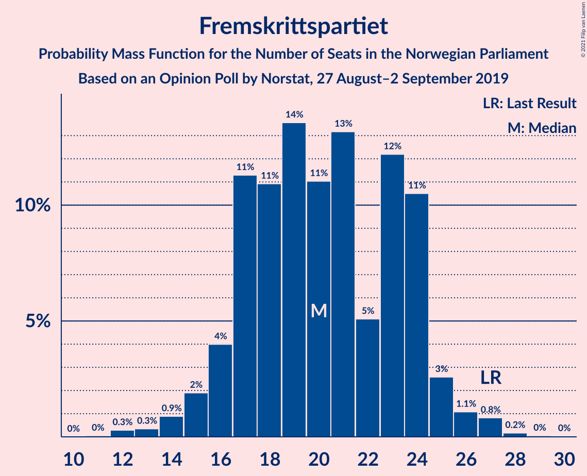
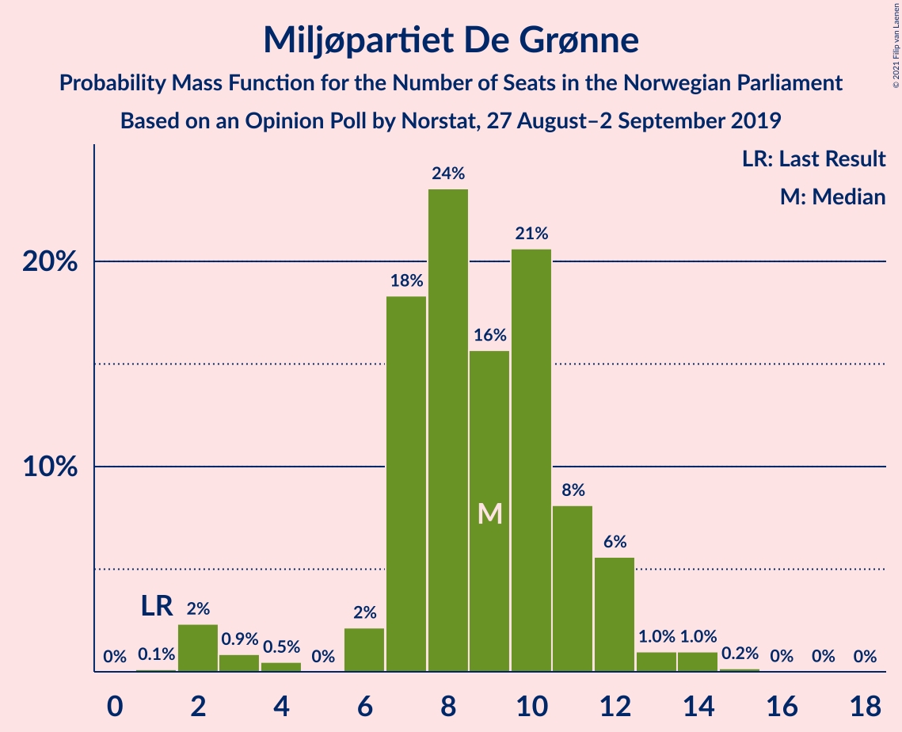
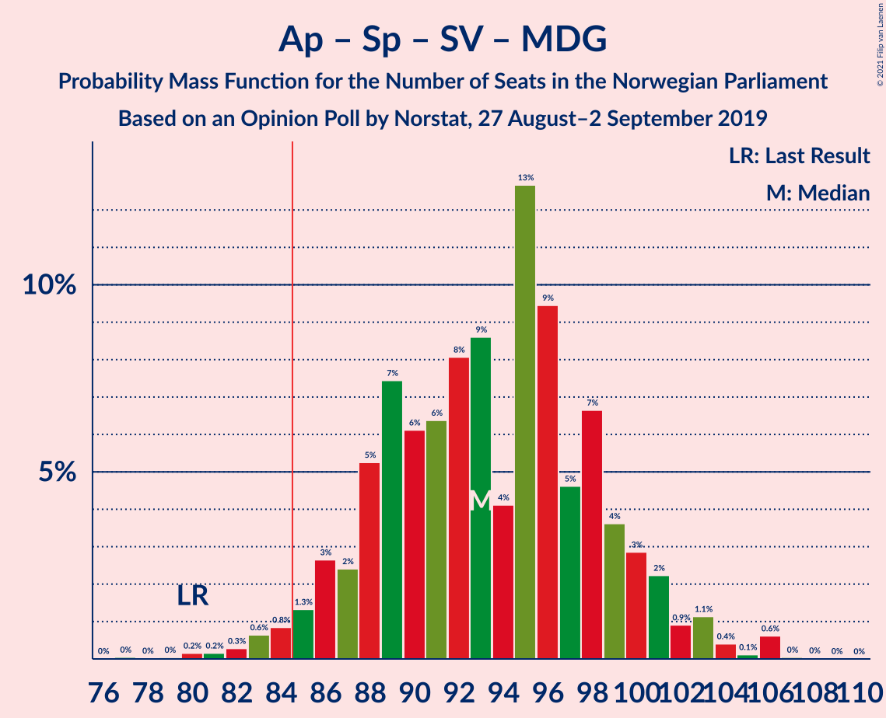
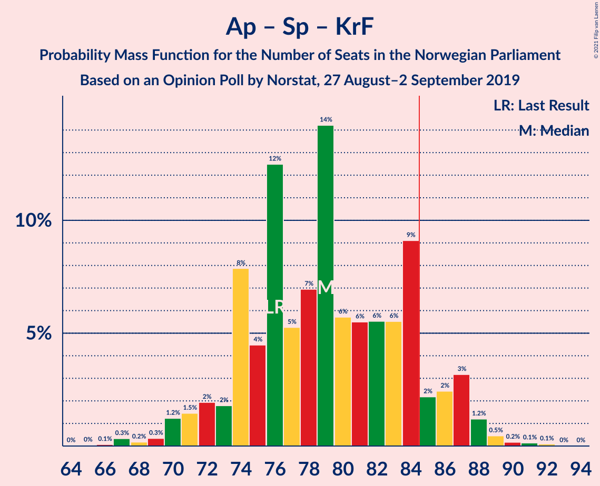
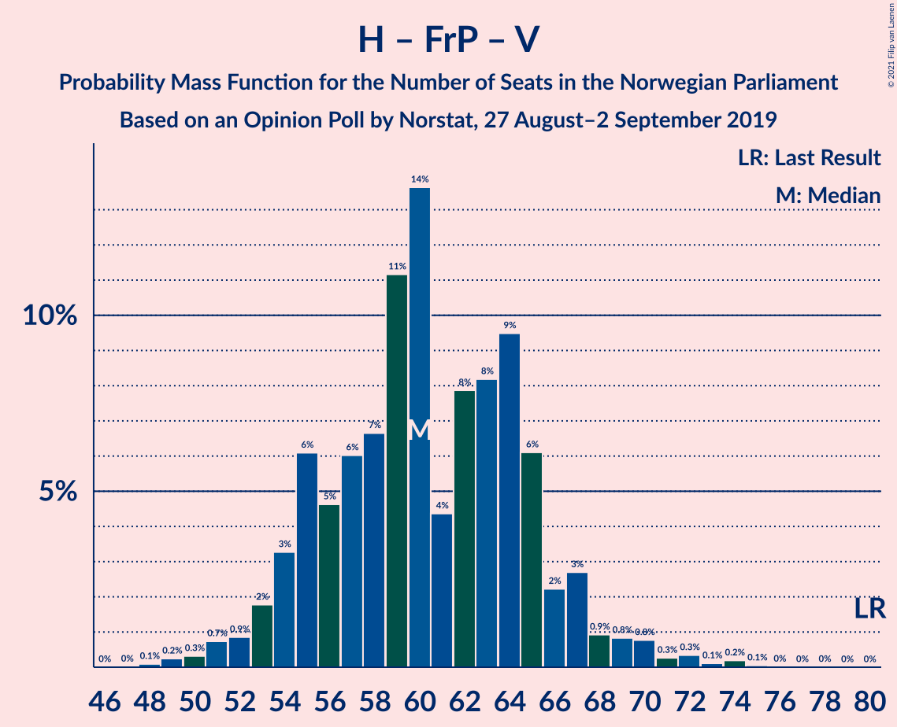
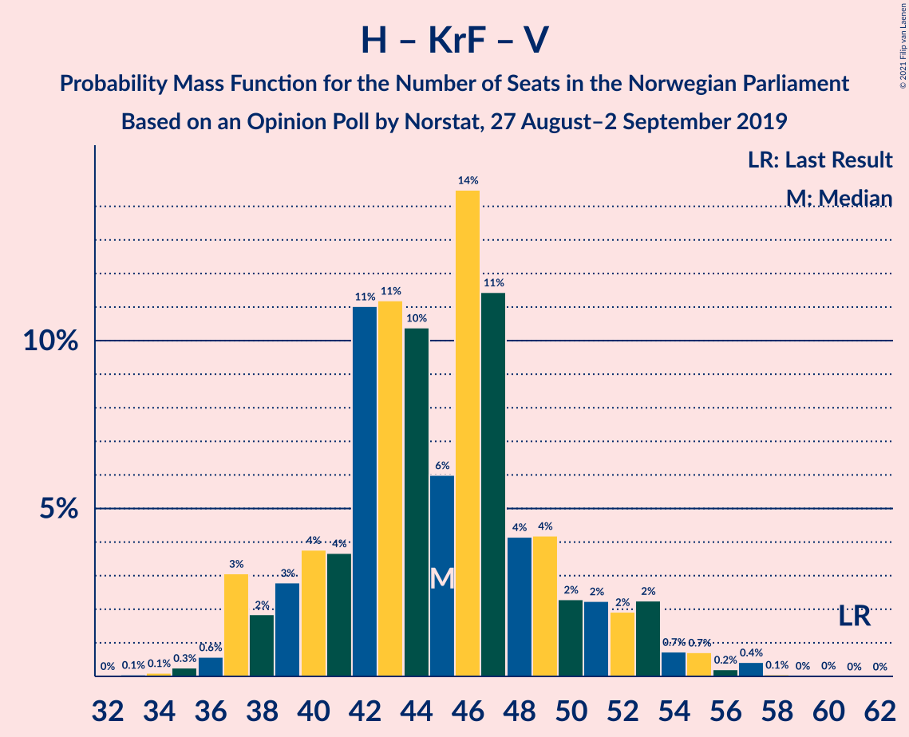

# Opinion Poll by Norstat, 27 August–2 September 2019

<a href="#voting-intentions">Voting Intentions</a> | <a href="#seats">Seats</a> | <a href="#coalitions">Coalitions</a> | <a href="#technical-information">Technical Information</a>

## Voting Intentions

### Confidence Intervals

| Party | Last Result | Poll Result | 80% Confidence Interval | 90% Confidence Interval | 95% Confidence Interval | 99% Confidence Interval |
|:-----:|:-----------:|:-----------:|:-----------------------:|:-----------------------:|:-----------------------:|:-----------------------:|
| Arbeiderpartiet | 27.4% | 24.5% | 22.3–26.8% |21.7–27.5% |21.2–28.1% |20.2–29.2% |
| Høyre | 25.0% | 20.9% | 18.9–23.2% |18.3–23.8% |17.8–24.4% |16.9–25.5% |
| Senterpartiet | 10.3% | 15.9% | 14.1–17.9% |13.6–18.5% |13.1–19.0% |12.3–20.0% |
| Fremskrittspartiet | 15.2% | 11.5% | 9.9–13.3% |9.5–13.8% |9.1–14.3% |8.5–15.2% |
| Sosialistisk Venstreparti | 6.0% | 6.1% | 5.0–7.5% |4.7–7.9% |4.4–8.3% |3.9–9.0% |
| Miljøpartiet De Grønne | 3.2% | 5.4% | 4.4–6.8% |4.1–7.2% |3.8–7.5% |3.4–8.2% |
| Rødt | 2.4% | 4.4% | 3.5–5.7% |3.2–6.0% |3.0–6.4% |2.6–7.0% |
| Kristelig Folkeparti | 4.2% | 3.9% | 3.0–5.1% |2.8–5.4% |2.6–5.8% |2.2–6.4% |
| Venstre | 4.4% | 3.4% | 2.6–4.5% |2.4–4.9% |2.2–5.2% |1.9–5.8% |

*Note:* The poll result column reflects the actual value used in the calculations. Published results may vary slightly, and in addition be rounded to fewer digits.

## Seats

### Confidence Intervals

| Party | Last Result | Median | 80% Confidence Interval | 90% Confidence Interval | 95% Confidence Interval | 99% Confidence Interval |
|:-----:|:-----------:|:------:|:-----------------------:|:-----------------------:|:-----------------------:|:-----------------------:|
| <a href="#arbeiderpartiet">Arbeiderpartiet</a> | 49 | 44 | 44–50 |43–53 |41–54 |38–55 |
| <a href="#høyre">Høyre</a> | 45 | 35 | 33–39 |32–41 |31–42 |29–47 |
| <a href="#senterpartiet">Senterpartiet</a> | 19 | 29 | 25–34 |23–35 |22–36 |21–36 |
| <a href="#fremskrittspartiet">Fremskrittspartiet</a> | 27 | 21 | 17–24 |16–24 |15–26 |14–27 |
| <a href="#sosialistisk-venstreparti">Sosialistisk Venstreparti</a> | 11 | 10 | 8–13 |7–13 |7–13 |6–16 |
| <a href="#miljøpartiet-de-grønne">Miljøpartiet De Grønne</a> | 1 | 9 | 7–11 |6–12 |4–13 |2–13 |
| <a href="#rødt">Rødt</a> | 1 | 6 | 2–9 |2–9 |2–9 |1–10 |
| <a href="#kristelig-folkeparti">Kristelig Folkeparti</a> | 8 | 6 | 1–8 |1–8 |1–9 |1–10 |
| <a href="#venstre">Venstre</a> | 8 | 6 | 2–7 |2–7 |2–8 |1–9 |

### Arbeiderpartiet

*For a full overview of the results for this party, see the [Arbeiderpartiet](party-arbeiderpartiet.html) page.*

| Number of Seats | Probability | Accumulated | Special Marks |
|:---------------:|:-----------:|:-----------:|:-------------:|
| 36 | 0% | 100% |  |
| 37 | 0.3% | 99.9% |  |
| 38 | 0.5% | 99.7% |  |
| 39 | 0.9% | 99.2% |  |
| 40 | 0.6% | 98% |  |
| 41 | 0.5% | 98% |  |
| 42 | 0.8% | 97% |  |
| 43 | 3% | 96% |  |
| 44 | 46% | 94% | Median |
| 45 | 11% | 47% |  |
| 46 | 15% | 37% |  |
| 47 | 2% | 22% |  |
| 48 | 7% | 20% |  |
| 49 | 1.1% | 13% | Last Result |
| 50 | 3% | 12% |  |
| 51 | 1.1% | 9% |  |
| 52 | 2% | 8% |  |
| 53 | 1.4% | 5% |  |
| 54 | 3% | 4% |  |
| 55 | 0.9% | 1.0% |  |
| 56 | 0.1% | 0.2% |  |
| 57 | 0.1% | 0.1% |  |
| 58 | 0% | 0% |  |

### Høyre

*For a full overview of the results for this party, see the [Høyre](party-høyre.html) page.*

| Number of Seats | Probability | Accumulated | Special Marks |
|:---------------:|:-----------:|:-----------:|:-------------:|
| 27 | 0.1% | 100% |  |
| 28 | 0.1% | 99.9% |  |
| 29 | 0.4% | 99.8% |  |
| 30 | 1.1% | 99.4% |  |
| 31 | 0.9% | 98% |  |
| 32 | 3% | 97% |  |
| 33 | 5% | 95% |  |
| 34 | 12% | 90% |  |
| 35 | 40% | 78% | Median |
| 36 | 11% | 38% |  |
| 37 | 6% | 27% |  |
| 38 | 6% | 21% |  |
| 39 | 7% | 15% |  |
| 40 | 2% | 8% |  |
| 41 | 3% | 6% |  |
| 42 | 1.0% | 3% |  |
| 43 | 0.7% | 2% |  |
| 44 | 0.1% | 2% |  |
| 45 | 0.8% | 1.4% | Last Result |
| 46 | 0.1% | 0.6% |  |
| 47 | 0.4% | 0.5% |  |
| 48 | 0.1% | 0.1% |  |
| 49 | 0% | 0.1% |  |
| 50 | 0% | 0% |  |

### Senterpartiet

*For a full overview of the results for this party, see the [Senterpartiet](party-senterpartiet.html) page.*

| Number of Seats | Probability | Accumulated | Special Marks |
|:---------------:|:-----------:|:-----------:|:-------------:|
| 18 | 0.1% | 100% |  |
| 19 | 0% | 99.9% | Last Result |
| 20 | 0.2% | 99.9% |  |
| 21 | 0.4% | 99.7% |  |
| 22 | 4% | 99.3% |  |
| 23 | 1.1% | 96% |  |
| 24 | 0.8% | 94% |  |
| 25 | 7% | 94% |  |
| 26 | 22% | 87% |  |
| 27 | 7% | 65% |  |
| 28 | 4% | 58% |  |
| 29 | 23% | 54% | Median |
| 30 | 3% | 31% |  |
| 31 | 3% | 28% |  |
| 32 | 7% | 25% |  |
| 33 | 2% | 18% |  |
| 34 | 10% | 16% |  |
| 35 | 1.3% | 6% |  |
| 36 | 4% | 4% |  |
| 37 | 0.2% | 0.3% |  |
| 38 | 0% | 0.1% |  |
| 39 | 0% | 0.1% |  |
| 40 | 0% | 0% |  |

### Fremskrittspartiet

*For a full overview of the results for this party, see the [Fremskrittspartiet](party-fremskrittspartiet.html) page.*

| Number of Seats | Probability | Accumulated | Special Marks |
|:---------------:|:-----------:|:-----------:|:-------------:|
| 11 | 0% | 100% |  |
| 12 | 0.2% | 99.9% |  |
| 13 | 0.1% | 99.7% |  |
| 14 | 0.7% | 99.6% |  |
| 15 | 2% | 98.9% |  |
| 16 | 3% | 97% |  |
| 17 | 13% | 94% |  |
| 18 | 5% | 82% |  |
| 19 | 6% | 77% |  |
| 20 | 5% | 71% |  |
| 21 | 30% | 67% | Median |
| 22 | 5% | 36% |  |
| 23 | 4% | 31% |  |
| 24 | 23% | 27% |  |
| 25 | 1.0% | 4% |  |
| 26 | 2% | 3% |  |
| 27 | 1.0% | 1.3% | Last Result |
| 28 | 0.2% | 0.3% |  |
| 29 | 0.1% | 0.1% |  |
| 30 | 0% | 0% |  |

### Sosialistisk Venstreparti

*For a full overview of the results for this party, see the [Sosialistisk Venstreparti](party-sosialistiskvenstreparti.html) page.*

| Number of Seats | Probability | Accumulated | Special Marks |
|:---------------:|:-----------:|:-----------:|:-------------:|
| 1 | 0.1% | 100% |  |
| 2 | 0.3% | 99.9% |  |
| 3 | 0.1% | 99.7% |  |
| 4 | 0% | 99.6% |  |
| 5 | 0% | 99.6% |  |
| 6 | 0.6% | 99.6% |  |
| 7 | 4% | 99.0% |  |
| 8 | 7% | 95% |  |
| 9 | 28% | 87% |  |
| 10 | 23% | 60% | Median |
| 11 | 7% | 37% | Last Result |
| 12 | 15% | 29% |  |
| 13 | 12% | 14% |  |
| 14 | 1.4% | 2% |  |
| 15 | 0.3% | 1.0% |  |
| 16 | 0.6% | 0.7% |  |
| 17 | 0.1% | 0.1% |  |
| 18 | 0% | 0% |  |

### Miljøpartiet De Grønne

*For a full overview of the results for this party, see the [Miljøpartiet De Grønne](party-miljøpartietdegrønne.html) page.*

| Number of Seats | Probability | Accumulated | Special Marks |
|:---------------:|:-----------:|:-----------:|:-------------:|
| 1 | 0.2% | 100% | Last Result |
| 2 | 2% | 99.8% |  |
| 3 | 0.5% | 98% |  |
| 4 | 0.6% | 98% |  |
| 5 | 0% | 97% |  |
| 6 | 2% | 97% |  |
| 7 | 30% | 95% |  |
| 8 | 11% | 65% |  |
| 9 | 29% | 54% | Median |
| 10 | 12% | 24% |  |
| 11 | 6% | 13% |  |
| 12 | 3% | 6% |  |
| 13 | 2% | 3% |  |
| 14 | 0.1% | 0.3% |  |
| 15 | 0.2% | 0.2% |  |
| 16 | 0% | 0% |  |

### Rødt

*For a full overview of the results for this party, see the [Rødt](party-rødt.html) page.*

| Number of Seats | Probability | Accumulated | Special Marks |
|:---------------:|:-----------:|:-----------:|:-------------:|
| 1 | 2% | 100% | Last Result |
| 2 | 44% | 98% |  |
| 3 | 0.2% | 54% |  |
| 4 | 0% | 54% |  |
| 5 | 0% | 54% |  |
| 6 | 26% | 54% | Median |
| 7 | 5% | 28% |  |
| 8 | 12% | 23% |  |
| 9 | 10% | 11% |  |
| 10 | 1.0% | 1.3% |  |
| 11 | 0.2% | 0.3% |  |
| 12 | 0.1% | 0.1% |  |
| 13 | 0% | 0.1% |  |
| 14 | 0% | 0% |  |

### Kristelig Folkeparti

*For a full overview of the results for this party, see the [Kristelig Folkeparti](party-kristeligfolkeparti.html) page.*

| Number of Seats | Probability | Accumulated | Special Marks |
|:---------------:|:-----------:|:-----------:|:-------------:|
| 0 | 0.3% | 100% |  |
| 1 | 11% | 99.7% |  |
| 2 | 5% | 89% |  |
| 3 | 28% | 84% |  |
| 4 | 0% | 56% |  |
| 5 | 0% | 56% |  |
| 6 | 42% | 56% | Median |
| 7 | 4% | 14% |  |
| 8 | 7% | 10% | Last Result |
| 9 | 2% | 3% |  |
| 10 | 0.9% | 1.2% |  |
| 11 | 0.3% | 0.4% |  |
| 12 | 0% | 0.1% |  |
| 13 | 0% | 0% |  |

### Venstre

*For a full overview of the results for this party, see the [Venstre](party-venstre.html) page.*

| Number of Seats | Probability | Accumulated | Special Marks |
|:---------------:|:-----------:|:-----------:|:-------------:|
| 0 | 0.1% | 100% |  |
| 1 | 2% | 99.9% |  |
| 2 | 46% | 98% |  |
| 3 | 0.5% | 52% |  |
| 4 | 0.9% | 51% |  |
| 5 | 0.1% | 50% |  |
| 6 | 39% | 50% | Median |
| 7 | 8% | 12% |  |
| 8 | 2% | 4% | Last Result |
| 9 | 1.3% | 1.5% |  |
| 10 | 0.1% | 0.2% |  |
| 11 | 0.1% | 0.1% |  |
| 12 | 0% | 0% |  |

## Coalitions

### Confidence Intervals

| Coalition | Last Result | Median | Majority? | 80% Confidence Interval | 90% Confidence Interval | 95% Confidence Interval | 99% Confidence Interval |
|:---------:|:-----------:|:------:|:---------:|:-----------------------:|:-----------------------:|:-----------------------:|:-----------------------:|
| Arbeiderpartiet – Senterpartiet – Sosialistisk Venstreparti – Miljøpartiet De Grønne – Rødt | 81 | 96 | 99.9% | 91–106 | 91–108 | 91–108 | 88–111 |
| Arbeiderpartiet – Senterpartiet – Sosialistisk Venstreparti – Miljøpartiet De Grønne – Kristelig Folkeparti | 88 | 95 | 99.9% | 93–104 | 90–107 | 90–108 | 87–110 |
| Høyre – Senterpartiet – Fremskrittspartiet – Kristelig Folkeparti – Venstre | 107 | 97 | 99.6% | 88–98 | 87–101 | 86–103 | 85–107 |
| Arbeiderpartiet – Senterpartiet – Sosialistisk Venstreparti – Miljøpartiet De Grønne | 80 | 90 | 99.2% | 89–100 | 87–101 | 86–102 | 82–103 |
| Arbeiderpartiet – Senterpartiet – Sosialistisk Venstreparti – Rødt | 80 | 88 | 79% | 82–98 | 82–98 | 82–99 | 80–105 |
| Arbeiderpartiet – Senterpartiet – Miljøpartiet De Grønne – Kristelig Folkeparti | 77 | 86 | 88% | 83–94 | 80–95 | 78–97 | 78–98 |
| Arbeiderpartiet – Senterpartiet – Sosialistisk Venstreparti | 79 | 83 | 45% | 80–91 | 79–91 | 79–92 | 75–95 |
| Arbeiderpartiet – Senterpartiet – Kristelig Folkeparti | 76 | 79 | 8% | 74–84 | 72–86 | 70–88 | 69–89 |
| Høyre – Fremskrittspartiet – Miljøpartiet De Grønne – Kristelig Folkeparti – Venstre | 89 | 75 | 1.3% | 68–80 | 66–80 | 63–82 | 63–88 |
| Arbeiderpartiet – Senterpartiet | 68 | 73 | 0.2% | 70–80 | 68–81 | 67–81 | 66–83 |
| Høyre – Fremskrittspartiet – Kristelig Folkeparti – Venstre | 88 | 66 | 0% | 60–71 | 57–71 | 56–73 | 56–77 |
| Høyre – Fremskrittspartiet – Venstre | 80 | 62 | 0% | 55–65 | 54–67 | 52–69 | 49–71 |
| Høyre – Fremskrittspartiet | 72 | 57 | 0% | 52–61 | 50–62 | 50–64 | 47–68 |
| Arbeiderpartiet – Sosialistisk Venstreparti | 60 | 54 | 0% | 53–62 | 52–63 | 50–63 | 46–67 |
| Høyre – Kristelig Folkeparti – Venstre | 61 | 47 | 0% | 40–48 | 37–50 | 37–52 | 36–56 |
| Senterpartiet – Kristelig Folkeparti – Venstre | 35 | 38 | 0% | 31–43 | 29–46 | 27–47 | 27–49 |

### Arbeiderpartiet – Senterpartiet – Sosialistisk Venstreparti – Miljøpartiet De Grønne – Rødt

| Number of Seats | Probability | Accumulated | Special Marks |
|:---------------:|:-----------:|:-----------:|:-------------:|
| 81 | 0.1% | 100% | Last Result |
| 82 | 0% | 99.9% |  |
| 83 | 0% | 99.9% |  |
| 84 | 0% | 99.9% |  |
| 85 | 0.1% | 99.9% | Majority |
| 86 | 0.1% | 99.8% |  |
| 87 | 0.2% | 99.8% |  |
| 88 | 0.1% | 99.6% |  |
| 89 | 0.1% | 99.5% |  |
| 90 | 1.0% | 99.4% |  |
| 91 | 16% | 98% |  |
| 92 | 0.9% | 82% |  |
| 93 | 2% | 81% |  |
| 94 | 2% | 79% |  |
| 95 | 23% | 78% |  |
| 96 | 5% | 55% |  |
| 97 | 2% | 50% |  |
| 98 | 9% | 47% | Median |
| 99 | 6% | 38% |  |
| 100 | 2% | 33% |  |
| 101 | 5% | 31% |  |
| 102 | 5% | 26% |  |
| 103 | 5% | 21% |  |
| 104 | 3% | 17% |  |
| 105 | 0.5% | 14% |  |
| 106 | 5% | 14% |  |
| 107 | 1.4% | 9% |  |
| 108 | 6% | 7% |  |
| 109 | 1.3% | 2% |  |
| 110 | 0.1% | 0.6% |  |
| 111 | 0.4% | 0.5% |  |
| 112 | 0% | 0.1% |  |
| 113 | 0% | 0.1% |  |
| 114 | 0% | 0% |  |

### Arbeiderpartiet – Senterpartiet – Sosialistisk Venstreparti – Miljøpartiet De Grønne – Kristelig Folkeparti

| Number of Seats | Probability | Accumulated | Special Marks |
|:---------------:|:-----------:|:-----------:|:-------------:|
| 82 | 0.1% | 100% |  |
| 83 | 0% | 99.9% |  |
| 84 | 0% | 99.9% |  |
| 85 | 0.1% | 99.9% | Majority |
| 86 | 0.1% | 99.8% |  |
| 87 | 0.7% | 99.7% |  |
| 88 | 0.2% | 99.0% | Last Result |
| 89 | 0.6% | 98.8% |  |
| 90 | 4% | 98% |  |
| 91 | 0.3% | 94% |  |
| 92 | 0.4% | 94% |  |
| 93 | 4% | 93% |  |
| 94 | 3% | 89% |  |
| 95 | 37% | 87% |  |
| 96 | 3% | 50% |  |
| 97 | 0.9% | 47% |  |
| 98 | 2% | 46% | Median |
| 99 | 10% | 43% |  |
| 100 | 6% | 34% |  |
| 101 | 8% | 28% |  |
| 102 | 3% | 20% |  |
| 103 | 5% | 17% |  |
| 104 | 4% | 12% |  |
| 105 | 1.2% | 8% |  |
| 106 | 0.3% | 6% |  |
| 107 | 3% | 6% |  |
| 108 | 2% | 3% |  |
| 109 | 0.4% | 1.4% |  |
| 110 | 0.8% | 1.0% |  |
| 111 | 0% | 0.2% |  |
| 112 | 0.1% | 0.2% |  |
| 113 | 0.1% | 0.1% |  |
| 114 | 0% | 0% |  |

### Høyre – Senterpartiet – Fremskrittspartiet – Kristelig Folkeparti – Venstre

| Number of Seats | Probability | Accumulated | Special Marks |
|:---------------:|:-----------:|:-----------:|:-------------:|
| 81 | 0.1% | 100% |  |
| 82 | 0.1% | 99.9% |  |
| 83 | 0.1% | 99.8% |  |
| 84 | 0.1% | 99.7% |  |
| 85 | 0.2% | 99.6% | Majority |
| 86 | 2% | 99.4% |  |
| 87 | 6% | 97% |  |
| 88 | 12% | 92% |  |
| 89 | 2% | 80% |  |
| 90 | 3% | 78% |  |
| 91 | 3% | 74% |  |
| 92 | 1.2% | 72% |  |
| 93 | 11% | 70% |  |
| 94 | 3% | 59% |  |
| 95 | 2% | 56% |  |
| 96 | 3% | 55% |  |
| 97 | 38% | 51% | Median |
| 98 | 5% | 14% |  |
| 99 | 1.3% | 9% |  |
| 100 | 2% | 7% |  |
| 101 | 1.5% | 5% |  |
| 102 | 1.2% | 4% |  |
| 103 | 1.1% | 3% |  |
| 104 | 0.2% | 2% |  |
| 105 | 0.4% | 2% |  |
| 106 | 0.6% | 1.2% |  |
| 107 | 0.3% | 0.6% | Last Result |
| 108 | 0.1% | 0.3% |  |
| 109 | 0.2% | 0.2% |  |
| 110 | 0% | 0.1% |  |
| 111 | 0% | 0% |  |

### Arbeiderpartiet – Senterpartiet – Sosialistisk Venstreparti – Miljøpartiet De Grønne

| Number of Seats | Probability | Accumulated | Special Marks |
|:---------------:|:-----------:|:-----------:|:-------------:|
| 79 | 0.1% | 100% |  |
| 80 | 0.1% | 99.9% | Last Result |
| 81 | 0.1% | 99.8% |  |
| 82 | 0.3% | 99.7% |  |
| 83 | 0.1% | 99.5% |  |
| 84 | 0.1% | 99.3% |  |
| 85 | 1.0% | 99.2% | Majority |
| 86 | 0.8% | 98% |  |
| 87 | 4% | 97% |  |
| 88 | 2% | 94% |  |
| 89 | 37% | 91% |  |
| 90 | 4% | 54% |  |
| 91 | 1.3% | 50% |  |
| 92 | 4% | 48% | Median |
| 93 | 2% | 45% |  |
| 94 | 2% | 43% |  |
| 95 | 3% | 41% |  |
| 96 | 7% | 38% |  |
| 97 | 4% | 31% |  |
| 98 | 5% | 26% |  |
| 99 | 5% | 22% |  |
| 100 | 10% | 17% |  |
| 101 | 3% | 7% |  |
| 102 | 3% | 4% |  |
| 103 | 0.6% | 0.9% |  |
| 104 | 0.2% | 0.3% |  |
| 105 | 0.1% | 0.1% |  |
| 106 | 0% | 0% |  |

### Arbeiderpartiet – Senterpartiet – Sosialistisk Venstreparti – Rødt

| Number of Seats | Probability | Accumulated | Special Marks |
|:---------------:|:-----------:|:-----------:|:-------------:|
| 76 | 0% | 100% |  |
| 77 | 0% | 99.9% |  |
| 78 | 0% | 99.9% |  |
| 79 | 0.3% | 99.9% |  |
| 80 | 0.1% | 99.6% | Last Result |
| 81 | 1.2% | 99.5% |  |
| 82 | 16% | 98% |  |
| 83 | 0.4% | 82% |  |
| 84 | 2% | 81% |  |
| 85 | 2% | 79% | Majority |
| 86 | 1.0% | 78% |  |
| 87 | 1.2% | 77% |  |
| 88 | 27% | 76% |  |
| 89 | 8% | 49% | Median |
| 90 | 4% | 40% |  |
| 91 | 4% | 36% |  |
| 92 | 9% | 32% |  |
| 93 | 5% | 23% |  |
| 94 | 2% | 17% |  |
| 95 | 2% | 16% |  |
| 96 | 0.4% | 14% |  |
| 97 | 0.8% | 13% |  |
| 98 | 8% | 13% |  |
| 99 | 3% | 5% |  |
| 100 | 0.9% | 2% |  |
| 101 | 0.4% | 1.0% |  |
| 102 | 0% | 0.6% |  |
| 103 | 0% | 0.6% |  |
| 104 | 0% | 0.5% |  |
| 105 | 0.5% | 0.5% |  |
| 106 | 0% | 0% |  |

### Arbeiderpartiet – Senterpartiet – Miljøpartiet De Grønne – Kristelig Folkeparti

| Number of Seats | Probability | Accumulated | Special Marks |
|:---------------:|:-----------:|:-----------:|:-------------:|
| 75 | 0.1% | 100% |  |
| 76 | 0% | 99.9% |  |
| 77 | 0.1% | 99.8% | Last Result |
| 78 | 4% | 99.7% |  |
| 79 | 0.4% | 96% |  |
| 80 | 0.6% | 95% |  |
| 81 | 4% | 95% |  |
| 82 | 0.6% | 91% |  |
| 83 | 2% | 91% |  |
| 84 | 1.2% | 89% |  |
| 85 | 16% | 88% | Majority |
| 86 | 30% | 72% |  |
| 87 | 2% | 42% |  |
| 88 | 5% | 40% | Median |
| 89 | 11% | 35% |  |
| 90 | 3% | 24% |  |
| 91 | 2% | 22% |  |
| 92 | 2% | 20% |  |
| 93 | 2% | 18% |  |
| 94 | 8% | 16% |  |
| 95 | 3% | 7% |  |
| 96 | 2% | 5% |  |
| 97 | 2% | 3% |  |
| 98 | 0.5% | 0.8% |  |
| 99 | 0.1% | 0.3% |  |
| 100 | 0.1% | 0.2% |  |
| 101 | 0% | 0.1% |  |
| 102 | 0% | 0.1% |  |
| 103 | 0.1% | 0.1% |  |
| 104 | 0% | 0% |  |

### Arbeiderpartiet – Senterpartiet – Sosialistisk Venstreparti

| Number of Seats | Probability | Accumulated | Special Marks |
|:---------------:|:-----------:|:-----------:|:-------------:|
| 72 | 0.1% | 100% |  |
| 73 | 0% | 99.8% |  |
| 74 | 0.1% | 99.8% |  |
| 75 | 0.4% | 99.7% |  |
| 76 | 0.5% | 99.2% |  |
| 77 | 0.3% | 98.7% |  |
| 78 | 0.5% | 98% |  |
| 79 | 4% | 98% | Last Result |
| 80 | 17% | 94% |  |
| 81 | 2% | 76% |  |
| 82 | 23% | 74% |  |
| 83 | 4% | 51% | Median |
| 84 | 2% | 47% |  |
| 85 | 2% | 45% | Majority |
| 86 | 4% | 43% |  |
| 87 | 9% | 38% |  |
| 88 | 4% | 30% |  |
| 89 | 5% | 26% |  |
| 90 | 10% | 20% |  |
| 91 | 8% | 11% |  |
| 92 | 0.5% | 3% |  |
| 93 | 1.0% | 2% |  |
| 94 | 0.2% | 1.0% |  |
| 95 | 0.6% | 0.8% |  |
| 96 | 0.1% | 0.2% |  |
| 97 | 0.1% | 0.1% |  |
| 98 | 0% | 0% |  |

### Arbeiderpartiet – Senterpartiet – Kristelig Folkeparti

| Number of Seats | Probability | Accumulated | Special Marks |
|:---------------:|:-----------:|:-----------:|:-------------:|
| 67 | 0.2% | 100% |  |
| 68 | 0.1% | 99.7% |  |
| 69 | 0.3% | 99.7% |  |
| 70 | 3% | 99.3% |  |
| 71 | 0.1% | 96% |  |
| 72 | 1.1% | 96% |  |
| 73 | 1.2% | 95% |  |
| 74 | 4% | 94% |  |
| 75 | 1.2% | 89% |  |
| 76 | 17% | 88% | Last Result |
| 77 | 8% | 72% |  |
| 78 | 1.4% | 64% |  |
| 79 | 29% | 62% | Median |
| 80 | 2% | 33% |  |
| 81 | 7% | 31% |  |
| 82 | 4% | 24% |  |
| 83 | 5% | 20% |  |
| 84 | 7% | 15% |  |
| 85 | 0.3% | 8% | Majority |
| 86 | 3% | 8% |  |
| 87 | 1.2% | 4% |  |
| 88 | 2% | 3% |  |
| 89 | 0.4% | 0.8% |  |
| 90 | 0% | 0.3% |  |
| 91 | 0.1% | 0.3% |  |
| 92 | 0.1% | 0.2% |  |
| 93 | 0% | 0% |  |

### Høyre – Fremskrittspartiet – Miljøpartiet De Grønne – Kristelig Folkeparti – Venstre

| Number of Seats | Probability | Accumulated | Special Marks |
|:---------------:|:-----------:|:-----------:|:-------------:|
| 59 | 0% | 100% |  |
| 60 | 0% | 99.9% |  |
| 61 | 0% | 99.9% |  |
| 62 | 0.1% | 99.9% |  |
| 63 | 3% | 99.8% |  |
| 64 | 0.7% | 97% |  |
| 65 | 0.2% | 96% |  |
| 66 | 2% | 96% |  |
| 67 | 1.0% | 94% |  |
| 68 | 3% | 93% |  |
| 69 | 4% | 90% |  |
| 70 | 5% | 86% |  |
| 71 | 18% | 81% |  |
| 72 | 2% | 63% |  |
| 73 | 2% | 60% |  |
| 74 | 6% | 58% |  |
| 75 | 22% | 53% |  |
| 76 | 3% | 30% |  |
| 77 | 3% | 27% | Median |
| 78 | 2% | 25% |  |
| 79 | 2% | 23% |  |
| 80 | 16% | 21% |  |
| 81 | 2% | 4% |  |
| 82 | 0.4% | 3% |  |
| 83 | 0.8% | 2% |  |
| 84 | 0.3% | 2% |  |
| 85 | 0.2% | 1.3% | Majority |
| 86 | 0.2% | 1.1% |  |
| 87 | 0.1% | 0.9% |  |
| 88 | 0.8% | 0.8% |  |
| 89 | 0% | 0% | Last Result |

### Arbeiderpartiet – Senterpartiet

| Number of Seats | Probability | Accumulated | Special Marks |
|:---------------:|:-----------:|:-----------:|:-------------:|
| 62 | 0% | 100% |  |
| 63 | 0% | 99.9% |  |
| 64 | 0.2% | 99.9% |  |
| 65 | 0.1% | 99.7% |  |
| 66 | 0.4% | 99.7% |  |
| 67 | 3% | 99.2% |  |
| 68 | 1.3% | 96% | Last Result |
| 69 | 1.2% | 95% |  |
| 70 | 16% | 93% |  |
| 71 | 4% | 77% |  |
| 72 | 2% | 73% |  |
| 73 | 23% | 71% | Median |
| 74 | 8% | 47% |  |
| 75 | 4% | 40% |  |
| 76 | 2% | 36% |  |
| 77 | 2% | 33% |  |
| 78 | 13% | 32% |  |
| 79 | 6% | 18% |  |
| 80 | 6% | 13% |  |
| 81 | 5% | 7% |  |
| 82 | 0.5% | 2% |  |
| 83 | 0.6% | 1.0% |  |
| 84 | 0.2% | 0.4% |  |
| 85 | 0.1% | 0.2% | Majority |
| 86 | 0% | 0.1% |  |
| 87 | 0% | 0.1% |  |
| 88 | 0% | 0% |  |

### Høyre – Fremskrittspartiet – Kristelig Folkeparti – Venstre

| Number of Seats | Probability | Accumulated | Special Marks |
|:---------------:|:-----------:|:-----------:|:-------------:|
| 52 | 0% | 100% |  |
| 53 | 0.1% | 99.9% |  |
| 54 | 0.1% | 99.8% |  |
| 55 | 0.2% | 99.8% |  |
| 56 | 3% | 99.6% |  |
| 57 | 3% | 97% |  |
| 58 | 2% | 94% |  |
| 59 | 1.3% | 92% |  |
| 60 | 6% | 91% |  |
| 61 | 6% | 84% |  |
| 62 | 12% | 78% |  |
| 63 | 3% | 66% |  |
| 64 | 4% | 64% |  |
| 65 | 3% | 60% |  |
| 66 | 7% | 57% |  |
| 67 | 3% | 50% |  |
| 68 | 23% | 47% | Median |
| 69 | 2% | 24% |  |
| 70 | 1.3% | 22% |  |
| 71 | 16% | 20% |  |
| 72 | 0.5% | 4% |  |
| 73 | 1.0% | 3% |  |
| 74 | 0.5% | 2% |  |
| 75 | 1.0% | 2% |  |
| 76 | 0.3% | 0.9% |  |
| 77 | 0.2% | 0.6% |  |
| 78 | 0.2% | 0.4% |  |
| 79 | 0.1% | 0.2% |  |
| 80 | 0% | 0.1% |  |
| 81 | 0.1% | 0.1% |  |
| 82 | 0% | 0% |  |
| 83 | 0% | 0% |  |
| 84 | 0% | 0% |  |
| 85 | 0% | 0% | Majority |
| 86 | 0% | 0% |  |
| 87 | 0% | 0% |  |
| 88 | 0% | 0% | Last Result |

### Høyre – Fremskrittspartiet – Venstre

| Number of Seats | Probability | Accumulated | Special Marks |
|:---------------:|:-----------:|:-----------:|:-------------:|
| 48 | 0.1% | 100% |  |
| 49 | 0.4% | 99.9% |  |
| 50 | 0.1% | 99.5% |  |
| 51 | 0.4% | 99.4% |  |
| 52 | 2% | 99.0% |  |
| 53 | 1.0% | 96% |  |
| 54 | 2% | 95% |  |
| 55 | 6% | 93% |  |
| 56 | 1.3% | 87% |  |
| 57 | 5% | 86% |  |
| 58 | 3% | 81% |  |
| 59 | 11% | 78% |  |
| 60 | 10% | 67% |  |
| 61 | 3% | 57% |  |
| 62 | 24% | 53% | Median |
| 63 | 6% | 30% |  |
| 64 | 1.0% | 24% |  |
| 65 | 16% | 23% |  |
| 66 | 1.4% | 6% |  |
| 67 | 2% | 5% |  |
| 68 | 0.4% | 3% |  |
| 69 | 1.0% | 3% |  |
| 70 | 0.5% | 2% |  |
| 71 | 0.8% | 1.1% |  |
| 72 | 0.1% | 0.3% |  |
| 73 | 0.1% | 0.2% |  |
| 74 | 0% | 0.1% |  |
| 75 | 0% | 0.1% |  |
| 76 | 0% | 0.1% |  |
| 77 | 0% | 0% |  |
| 78 | 0% | 0% |  |
| 79 | 0% | 0% |  |
| 80 | 0% | 0% | Last Result |

### Høyre – Fremskrittspartiet

| Number of Seats | Probability | Accumulated | Special Marks |
|:---------------:|:-----------:|:-----------:|:-------------:|
| 46 | 0.2% | 100% |  |
| 47 | 0.5% | 99.8% |  |
| 48 | 0.2% | 99.3% |  |
| 49 | 2% | 99.1% |  |
| 50 | 3% | 98% |  |
| 51 | 3% | 95% |  |
| 52 | 4% | 92% |  |
| 53 | 7% | 88% |  |
| 54 | 1.5% | 81% |  |
| 55 | 5% | 80% |  |
| 56 | 23% | 75% | Median |
| 57 | 10% | 51% |  |
| 58 | 10% | 41% |  |
| 59 | 17% | 31% |  |
| 60 | 3% | 14% |  |
| 61 | 5% | 11% |  |
| 62 | 1.2% | 5% |  |
| 63 | 1.3% | 4% |  |
| 64 | 0.8% | 3% |  |
| 65 | 1.0% | 2% |  |
| 66 | 0.1% | 1.0% |  |
| 67 | 0.3% | 0.9% |  |
| 68 | 0.3% | 0.6% |  |
| 69 | 0.3% | 0.3% |  |
| 70 | 0% | 0% |  |
| 71 | 0% | 0% |  |
| 72 | 0% | 0% | Last Result |

### Arbeiderpartiet – Sosialistisk Venstreparti

| Number of Seats | Probability | Accumulated | Special Marks |
|:---------------:|:-----------:|:-----------:|:-------------:|
| 43 | 0.1% | 100% |  |
| 44 | 0.1% | 99.9% |  |
| 45 | 0% | 99.8% |  |
| 46 | 0.9% | 99.8% |  |
| 47 | 0.3% | 98.9% |  |
| 48 | 0.1% | 98.6% |  |
| 49 | 0.3% | 98% |  |
| 50 | 1.2% | 98% |  |
| 51 | 2% | 97% |  |
| 52 | 4% | 95% |  |
| 53 | 23% | 91% |  |
| 54 | 20% | 68% | Median |
| 55 | 6% | 48% |  |
| 56 | 1.1% | 42% |  |
| 57 | 12% | 41% |  |
| 58 | 10% | 29% |  |
| 59 | 2% | 20% |  |
| 60 | 0.4% | 17% | Last Result |
| 61 | 6% | 17% |  |
| 62 | 3% | 10% |  |
| 63 | 6% | 8% |  |
| 64 | 1.3% | 2% |  |
| 65 | 0.1% | 0.8% |  |
| 66 | 0% | 0.6% |  |
| 67 | 0.5% | 0.6% |  |
| 68 | 0% | 0.1% |  |
| 69 | 0% | 0% |  |

### Høyre – Kristelig Folkeparti – Venstre

| Number of Seats | Probability | Accumulated | Special Marks |
|:---------------:|:-----------:|:-----------:|:-------------:|
| 33 | 0.1% | 100% |  |
| 34 | 0.1% | 99.9% |  |
| 35 | 0.2% | 99.8% |  |
| 36 | 0.1% | 99.6% |  |
| 37 | 9% | 99.5% |  |
| 38 | 0.4% | 91% |  |
| 39 | 0.6% | 91% |  |
| 40 | 3% | 90% |  |
| 41 | 12% | 87% |  |
| 42 | 3% | 75% |  |
| 43 | 8% | 72% |  |
| 44 | 8% | 64% |  |
| 45 | 3% | 56% |  |
| 46 | 2% | 53% |  |
| 47 | 40% | 51% | Median |
| 48 | 3% | 11% |  |
| 49 | 0.6% | 9% |  |
| 50 | 4% | 8% |  |
| 51 | 2% | 4% |  |
| 52 | 1.2% | 3% |  |
| 53 | 0.7% | 2% |  |
| 54 | 0.2% | 0.9% |  |
| 55 | 0.2% | 0.8% |  |
| 56 | 0.3% | 0.5% |  |
| 57 | 0.2% | 0.3% |  |
| 58 | 0.1% | 0.1% |  |
| 59 | 0% | 0% |  |
| 60 | 0% | 0% |  |
| 61 | 0% | 0% | Last Result |

### Senterpartiet – Kristelig Folkeparti – Venstre

| Number of Seats | Probability | Accumulated | Special Marks |
|:---------------:|:-----------:|:-----------:|:-------------:|
| 25 | 0% | 100% |  |
| 26 | 0.2% | 99.9% |  |
| 27 | 3% | 99.7% |  |
| 28 | 1.0% | 96% |  |
| 29 | 0.3% | 95% |  |
| 30 | 4% | 95% |  |
| 31 | 7% | 91% |  |
| 32 | 5% | 84% |  |
| 33 | 4% | 79% |  |
| 34 | 2% | 75% |  |
| 35 | 7% | 73% | Last Result |
| 36 | 1.0% | 67% |  |
| 37 | 5% | 66% |  |
| 38 | 17% | 60% |  |
| 39 | 2% | 43% |  |
| 40 | 3% | 42% |  |
| 41 | 25% | 39% | Median |
| 42 | 2% | 14% |  |
| 43 | 3% | 12% |  |
| 44 | 1.3% | 8% |  |
| 45 | 1.4% | 7% |  |
| 46 | 1.5% | 6% |  |
| 47 | 2% | 4% |  |
| 48 | 0.4% | 2% |  |
| 49 | 1.2% | 1.4% |  |
| 50 | 0.1% | 0.2% |  |
| 51 | 0% | 0.1% |  |
| 52 | 0% | 0.1% |  |
| 53 | 0% | 0% |  |

## Technical Information

### Opinion Poll

+ **Polling firm:** Norstat
+ **Commissioner(s):** —
+ **Fieldwork period:** 27 August–2 September 2019

### Calculations

+ **Sample size:** 593
+ **Simulations done:** 131,072
+ **Error estimate:** 4.01%

