# Opinion Poll by Norfakta, 3–4 September 2019

<a href="#voting-intentions">Voting Intentions</a> | <a href="#seats">Seats</a> | <a href="#coalitions">Coalitions</a> | <a href="#technical-information">Technical Information</a>

## Voting Intentions

### Confidence Intervals

| Party | Last Result | Poll Result | 80% Confidence Interval | 90% Confidence Interval | 95% Confidence Interval | 99% Confidence Interval |
|:-----:|:-----------:|:-----------:|:-----------------------:|:-----------------------:|:-----------------------:|:-----------------------:|
| Arbeiderpartiet | 27.4% | 23.8% | 22.2–25.6% |21.7–26.1% |21.3–26.6% |20.5–27.5% |
| Høyre | 25.0% | 22.1% | 20.5–23.9% |20.1–24.4% |19.7–24.8% |18.9–25.7% |
| Senterpartiet | 10.3% | 17.1% | 15.7–18.8% |15.3–19.2% |14.9–19.6% |14.3–20.4% |
| Fremskrittspartiet | 15.2% | 11.0% | 9.8–12.3% |9.4–12.7% |9.2–13.1% |8.6–13.7% |
| Sosialistisk Venstreparti | 6.0% | 7.4% | 6.4–8.6% |6.1–8.9% |5.9–9.2% |5.5–9.8% |
| Miljøpartiet De Grønne | 3.2% | 6.5% | 5.6–7.6% |5.3–7.9% |5.1–8.2% |4.7–8.7% |
| Rødt | 2.4% | 3.3% | 2.7–4.1% |2.5–4.4% |2.3–4.6% |2.1–5.0% |
| Kristelig Folkeparti | 4.2% | 3.3% | 2.7–4.1% |2.5–4.4% |2.3–4.6% |2.1–5.0% |
| Venstre | 4.4% | 2.4% | 1.9–3.1% |1.7–3.4% |1.6–3.5% |1.4–3.9% |

*Note:* The poll result column reflects the actual value used in the calculations. Published results may vary slightly, and in addition be rounded to fewer digits.

## Seats

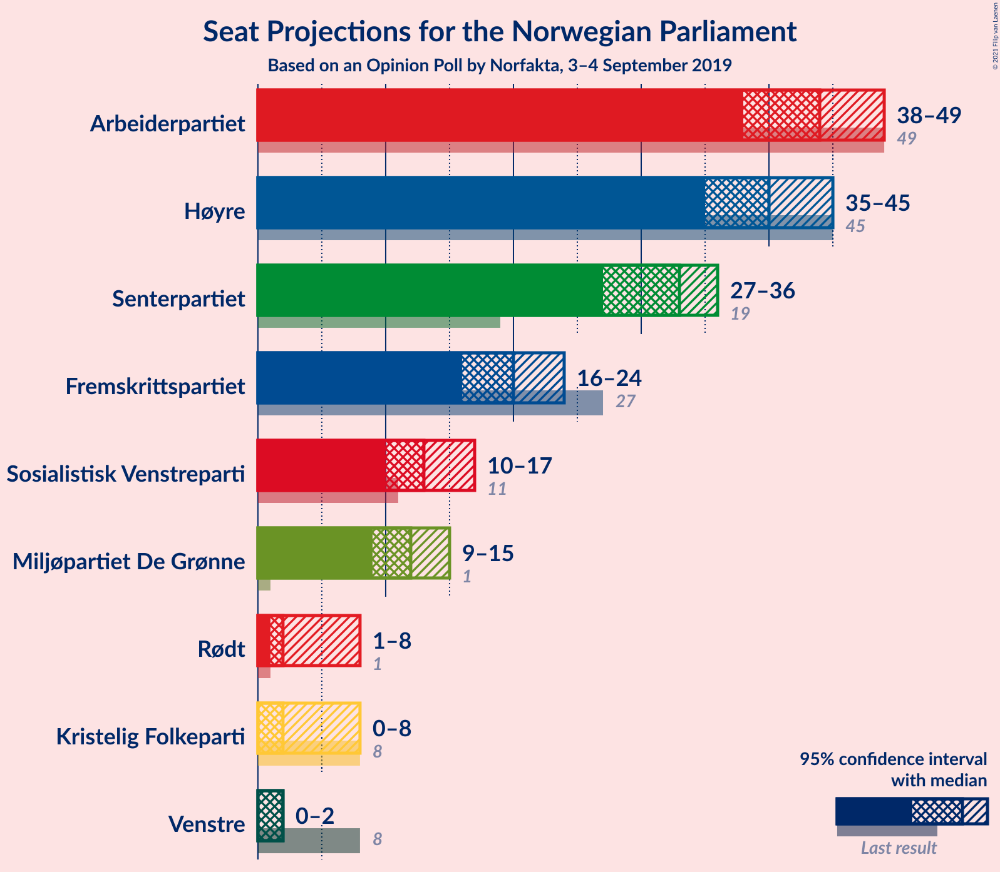

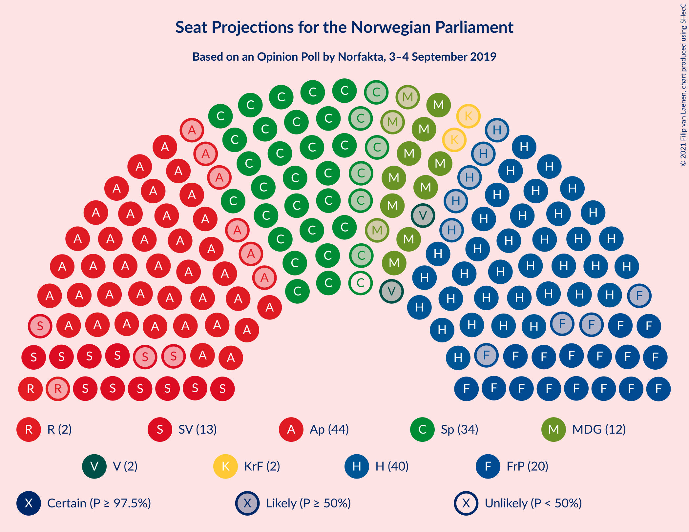

### Confidence Intervals

| Party | Last Result | Median | 80% Confidence Interval | 90% Confidence Interval | 95% Confidence Interval | 99% Confidence Interval |
|:-----:|:-----------:|:------:|:-----------------------:|:-----------------------:|:-----------------------:|:-----------------------:|
| <a href="#arbeiderpartiet">Arbeiderpartiet</a> | 49 | 44 | 40–48 |39–49 |38–49 |37–52 |
| <a href="#høyre">Høyre</a> | 45 | 40 | 37–44 |36–44 |35–45 |33–47 |
| <a href="#senterpartiet">Senterpartiet</a> | 19 | 33 | 29–35 |28–36 |27–36 |26–38 |
| <a href="#fremskrittspartiet">Fremskrittspartiet</a> | 27 | 20 | 17–23 |17–23 |16–24 |15–25 |
| <a href="#sosialistisk-venstreparti">Sosialistisk Venstreparti</a> | 11 | 13 | 11–16 |11–17 |10–17 |9–18 |
| <a href="#miljøpartiet-de-grønne">Miljøpartiet De Grønne</a> | 1 | 12 | 10–14 |9–14 |9–15 |8–16 |
| <a href="#rødt">Rødt</a> | 1 | 2 | 1–7 |1–8 |1–8 |1–9 |
| <a href="#kristelig-folkeparti">Kristelig Folkeparti</a> | 8 | 2 | 1–7 |1–8 |0–8 |0–9 |
| <a href="#venstre">Venstre</a> | 8 | 2 | 1–2 |0–2 |0–2 |0–3 |

### Arbeiderpartiet

*For a full overview of the results for this party, see the [Arbeiderpartiet](party-arbeiderpartiet.html) page.*

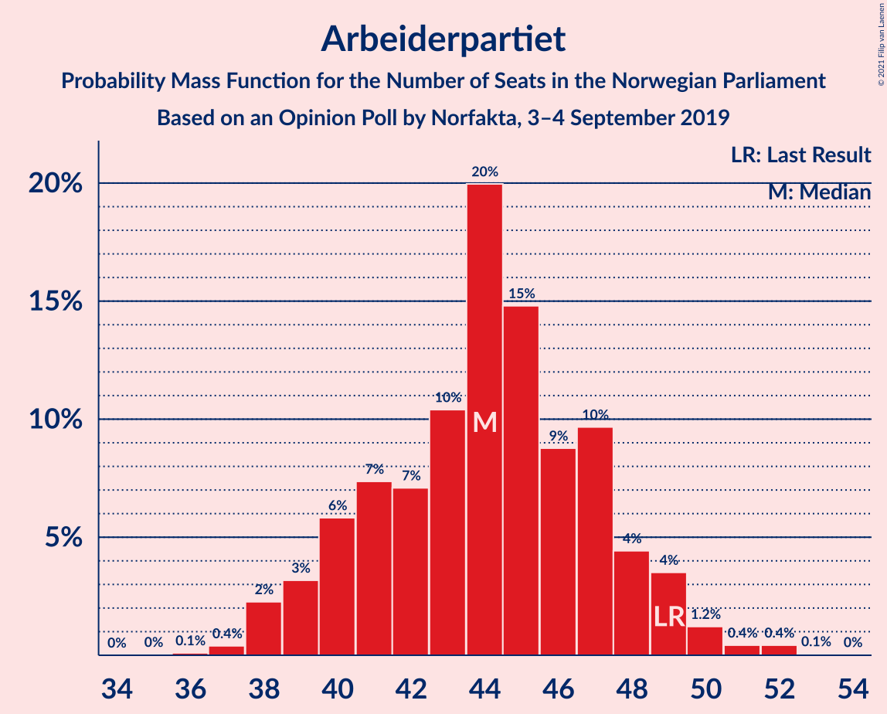

| Number of Seats | Probability | Accumulated | Special Marks |
|:---------------:|:-----------:|:-----------:|:-------------:|
| 36 | 0.1% | 100% |  |
| 37 | 0.4% | 99.9% |  |
| 38 | 2% | 99.5% |  |
| 39 | 3% | 97% |  |
| 40 | 6% | 94% |  |
| 41 | 7% | 88% |  |
| 42 | 7% | 81% |  |
| 43 | 10% | 74% |  |
| 44 | 20% | 63% | Median |
| 45 | 15% | 43% |  |
| 46 | 9% | 29% |  |
| 47 | 10% | 20% |  |
| 48 | 4% | 10% |  |
| 49 | 4% | 6% | Last Result |
| 50 | 1.2% | 2% |  |
| 51 | 0.4% | 1.0% |  |
| 52 | 0.4% | 0.5% |  |
| 53 | 0.1% | 0.1% |  |
| 54 | 0% | 0% |  |

### Høyre

*For a full overview of the results for this party, see the [Høyre](party-høyre.html) page.*

| Number of Seats | Probability | Accumulated | Special Marks |
|:---------------:|:-----------:|:-----------:|:-------------:|
| 32 | 0.1% | 100% |  |
| 33 | 0.5% | 99.9% |  |
| 34 | 1.0% | 99.3% |  |
| 35 | 2% | 98% |  |
| 36 | 5% | 96% |  |
| 37 | 6% | 91% |  |
| 38 | 9% | 85% |  |
| 39 | 19% | 77% |  |
| 40 | 13% | 58% | Median |
| 41 | 12% | 45% |  |
| 42 | 15% | 33% |  |
| 43 | 7% | 18% |  |
| 44 | 6% | 11% |  |
| 45 | 3% | 4% | Last Result |
| 46 | 0.7% | 1.4% |  |
| 47 | 0.5% | 0.7% |  |
| 48 | 0.2% | 0.2% |  |
| 49 | 0.1% | 0.1% |  |
| 50 | 0% | 0% |  |

### Senterpartiet

*For a full overview of the results for this party, see the [Senterpartiet](party-senterpartiet.html) page.*

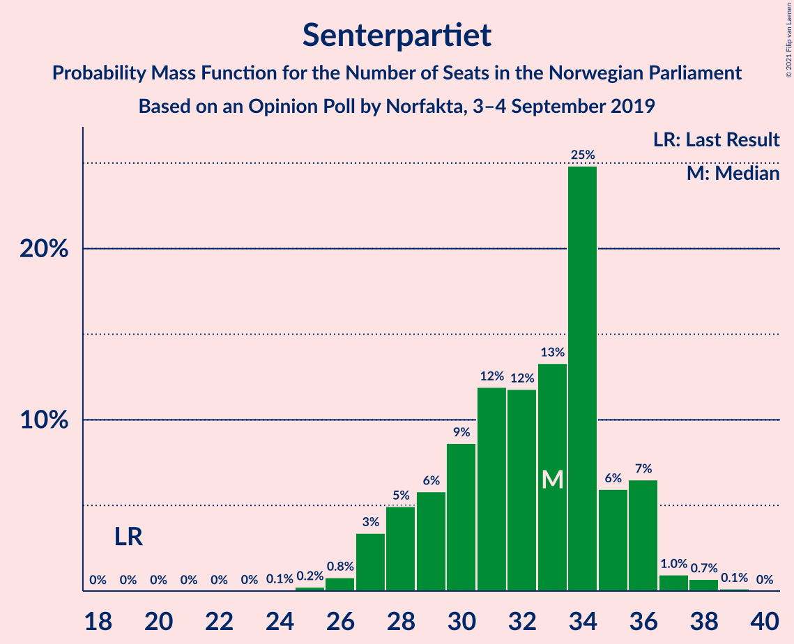

| Number of Seats | Probability | Accumulated | Special Marks |
|:---------------:|:-----------:|:-----------:|:-------------:|
| 19 | 0% | 100% | Last Result |
| 20 | 0% | 100% |  |
| 21 | 0% | 100% |  |
| 22 | 0% | 100% |  |
| 23 | 0% | 100% |  |
| 24 | 0.1% | 100% |  |
| 25 | 0.2% | 99.9% |  |
| 26 | 0.8% | 99.7% |  |
| 27 | 3% | 98.9% |  |
| 28 | 5% | 95% |  |
| 29 | 6% | 91% |  |
| 30 | 9% | 85% |  |
| 31 | 12% | 76% |  |
| 32 | 12% | 64% |  |
| 33 | 13% | 52% | Median |
| 34 | 25% | 39% |  |
| 35 | 6% | 14% |  |
| 36 | 7% | 8% |  |
| 37 | 1.0% | 2% |  |
| 38 | 0.7% | 0.9% |  |
| 39 | 0.1% | 0.2% |  |
| 40 | 0% | 0% |  |

### Fremskrittspartiet

*For a full overview of the results for this party, see the [Fremskrittspartiet](party-fremskrittspartiet.html) page.*

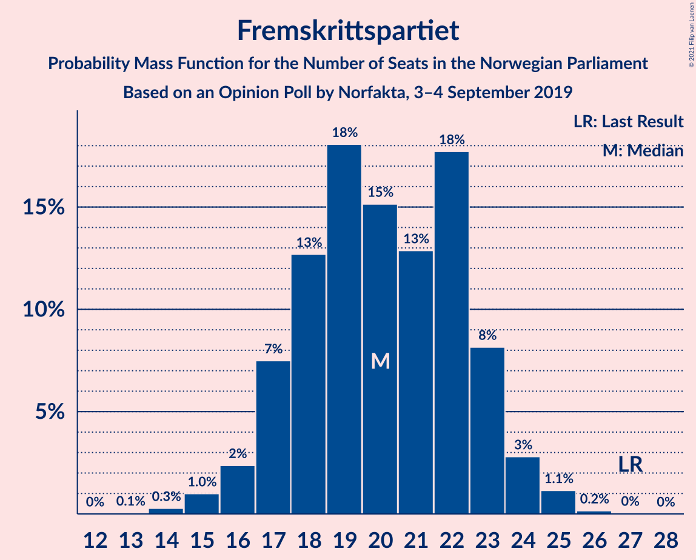

| Number of Seats | Probability | Accumulated | Special Marks |
|:---------------:|:-----------:|:-----------:|:-------------:|
| 13 | 0.1% | 100% |  |
| 14 | 0.3% | 99.9% |  |
| 15 | 1.0% | 99.7% |  |
| 16 | 2% | 98.7% |  |
| 17 | 7% | 96% |  |
| 18 | 13% | 89% |  |
| 19 | 18% | 76% |  |
| 20 | 15% | 58% | Median |
| 21 | 13% | 43% |  |
| 22 | 18% | 30% |  |
| 23 | 8% | 12% |  |
| 24 | 3% | 4% |  |
| 25 | 1.1% | 1.4% |  |
| 26 | 0.2% | 0.2% |  |
| 27 | 0% | 0.1% | Last Result |
| 28 | 0% | 0% |  |

### Sosialistisk Venstreparti

*For a full overview of the results for this party, see the [Sosialistisk Venstreparti](party-sosialistiskvenstreparti.html) page.*

| Number of Seats | Probability | Accumulated | Special Marks |
|:---------------:|:-----------:|:-----------:|:-------------:|
| 8 | 0.1% | 100% |  |
| 9 | 0.5% | 99.9% |  |
| 10 | 3% | 99.4% |  |
| 11 | 10% | 97% | Last Result |
| 12 | 19% | 87% |  |
| 13 | 26% | 67% | Median |
| 14 | 15% | 42% |  |
| 15 | 14% | 27% |  |
| 16 | 8% | 13% |  |
| 17 | 3% | 5% |  |
| 18 | 2% | 2% |  |
| 19 | 0.3% | 0.3% |  |
| 20 | 0% | 0% |  |

### Miljøpartiet De Grønne

*For a full overview of the results for this party, see the [Miljøpartiet De Grønne](party-miljøpartietdegrønne.html) page.*

| Number of Seats | Probability | Accumulated | Special Marks |
|:---------------:|:-----------:|:-----------:|:-------------:|
| 1 | 0% | 100% | Last Result |
| 2 | 0% | 100% |  |
| 3 | 0% | 100% |  |
| 4 | 0% | 100% |  |
| 5 | 0% | 100% |  |
| 6 | 0% | 100% |  |
| 7 | 0% | 100% |  |
| 8 | 0.8% | 100% |  |
| 9 | 5% | 99.2% |  |
| 10 | 19% | 94% |  |
| 11 | 23% | 75% |  |
| 12 | 23% | 53% | Median |
| 13 | 17% | 29% |  |
| 14 | 8% | 12% |  |
| 15 | 3% | 5% |  |
| 16 | 1.1% | 1.4% |  |
| 17 | 0.3% | 0.3% |  |
| 18 | 0% | 0% |  |

### Rødt

*For a full overview of the results for this party, see the [Rødt](party-rødt.html) page.*

| Number of Seats | Probability | Accumulated | Special Marks |
|:---------------:|:-----------:|:-----------:|:-------------:|
| 1 | 23% | 100% | Last Result |
| 2 | 64% | 77% | Median |
| 3 | 0.1% | 13% |  |
| 4 | 0% | 13% |  |
| 5 | 0% | 13% |  |
| 6 | 0.2% | 13% |  |
| 7 | 6% | 13% |  |
| 8 | 5% | 7% |  |
| 9 | 2% | 2% |  |
| 10 | 0.1% | 0.2% |  |
| 11 | 0% | 0% |  |

### Kristelig Folkeparti

*For a full overview of the results for this party, see the [Kristelig Folkeparti](party-kristeligfolkeparti.html) page.*

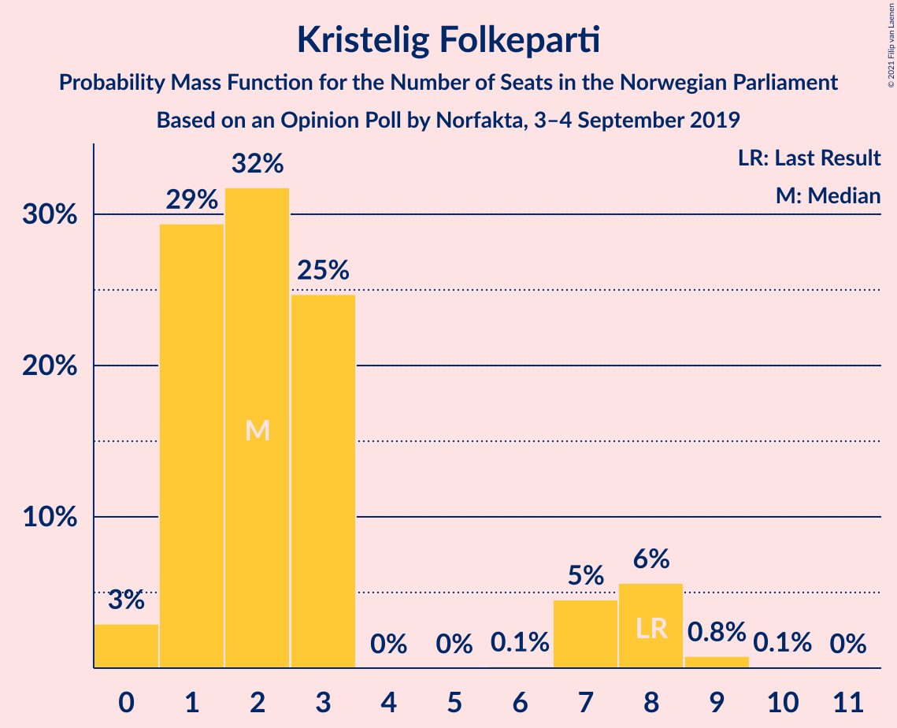

| Number of Seats | Probability | Accumulated | Special Marks |
|:---------------:|:-----------:|:-----------:|:-------------:|
| 0 | 3% | 100% |  |
| 1 | 29% | 97% |  |
| 2 | 32% | 68% | Median |
| 3 | 25% | 36% |  |
| 4 | 0% | 11% |  |
| 5 | 0% | 11% |  |
| 6 | 0.1% | 11% |  |
| 7 | 5% | 11% |  |
| 8 | 6% | 7% | Last Result |
| 9 | 0.8% | 0.9% |  |
| 10 | 0.1% | 0.1% |  |
| 11 | 0% | 0% |  |

### Venstre

*For a full overview of the results for this party, see the [Venstre](party-venstre.html) page.*

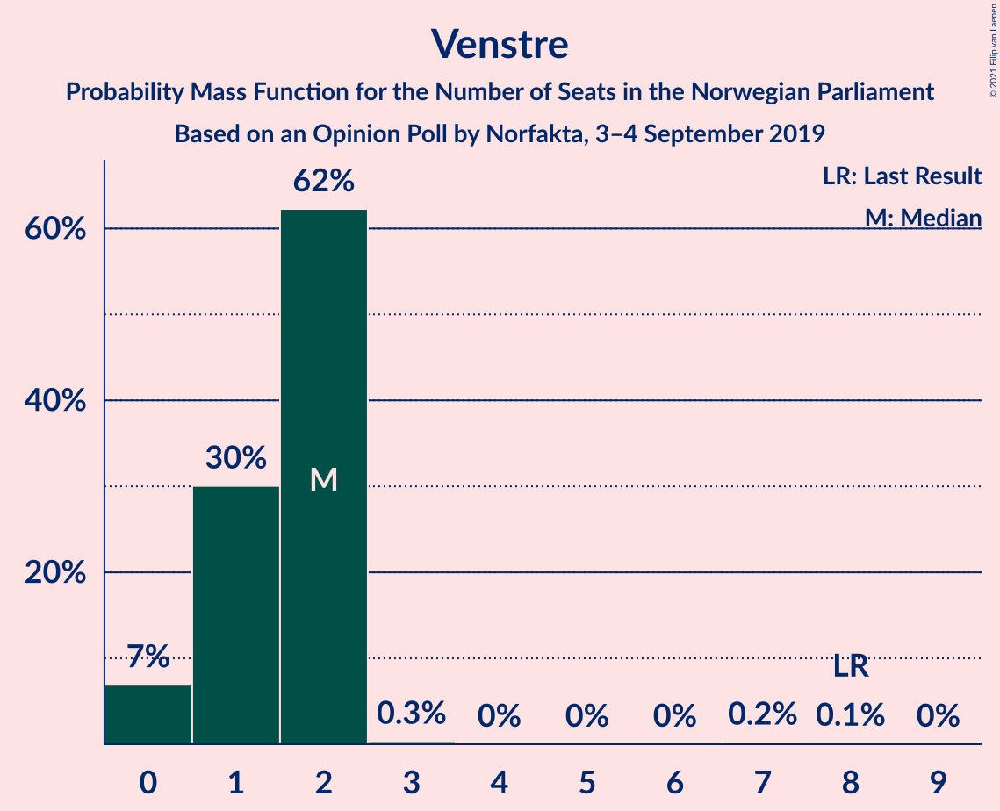

| Number of Seats | Probability | Accumulated | Special Marks |
|:---------------:|:-----------:|:-----------:|:-------------:|
| 0 | 7% | 100% |  |
| 1 | 30% | 93% |  |
| 2 | 62% | 63% | Median |
| 3 | 0.3% | 0.7% |  |
| 4 | 0% | 0.4% |  |
| 5 | 0% | 0.4% |  |
| 6 | 0% | 0.4% |  |
| 7 | 0.2% | 0.4% |  |
| 8 | 0.1% | 0.1% | Last Result |
| 9 | 0% | 0% |  |

## Coalitions

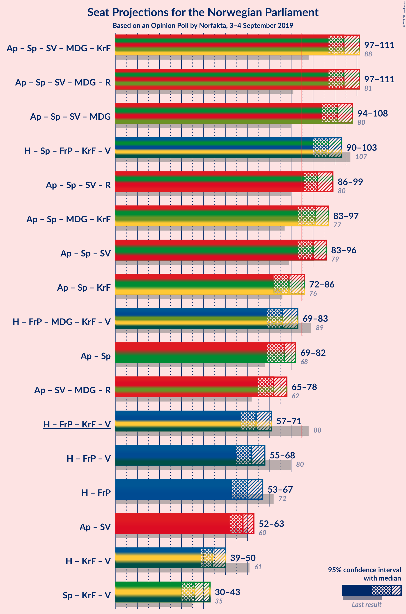

### Confidence Intervals

| Coalition | Last Result | Median | Majority? | 80% Confidence Interval | 90% Confidence Interval | 95% Confidence Interval | 99% Confidence Interval |
|:---------:|:-----------:|:------:|:---------:|:-----------------------:|:-----------------------:|:-----------------------:|:-----------------------:|
| Arbeiderpartiet – Senterpartiet – Sosialistisk Venstreparti – Miljøpartiet De Grønne – Kristelig Folkeparti | 88 | 104 | 100% | 99–108 | 98–110 | 97–111 | 95–112 |
| Arbeiderpartiet – Senterpartiet – Sosialistisk Venstreparti – Miljøpartiet De Grønne – Rødt | 81 | 104 | 100% | 99–108 | 98–110 | 97–111 | 94–113 |
| Arbeiderpartiet – Senterpartiet – Sosialistisk Venstreparti – Miljøpartiet De Grønne | 80 | 101 | 100% | 97–106 | 96–107 | 94–108 | 92–109 |
| Høyre – Senterpartiet – Fremskrittspartiet – Kristelig Folkeparti – Venstre | 107 | 97 | 100% | 92–101 | 91–102 | 90–103 | 88–105 |
| Arbeiderpartiet – Senterpartiet – Sosialistisk Venstreparti – Rødt | 80 | 92 | 98% | 88–96 | 87–98 | 86–99 | 83–101 |
| Arbeiderpartiet – Senterpartiet – Miljøpartiet De Grønne – Kristelig Folkeparti | 77 | 91 | 94% | 86–95 | 84–96 | 83–97 | 82–99 |
| Arbeiderpartiet – Senterpartiet – Sosialistisk Venstreparti | 79 | 90 | 94% | 85–94 | 84–95 | 83–96 | 81–97 |
| Arbeiderpartiet – Senterpartiet – Kristelig Folkeparti | 76 | 79 | 6% | 73–84 | 72–85 | 72–86 | 70–88 |
| Høyre – Fremskrittspartiet – Miljøpartiet De Grønne – Kristelig Folkeparti – Venstre | 89 | 76 | 0.7% | 72–81 | 70–82 | 69–83 | 67–85 |
| Arbeiderpartiet – Senterpartiet | 68 | 77 | 0.2% | 72–81 | 70–82 | 69–82 | 67–84 |
| Arbeiderpartiet – Sosialistisk Venstreparti – Miljøpartiet De Grønne – Rødt | 62 | 72 | 0% | 68–76 | 66–77 | 65–78 | 64–80 |
| Høyre – Fremskrittspartiet – Kristelig Folkeparti – Venstre | 88 | 64 | 0% | 60–69 | 59–70 | 57–71 | 56–73 |
| Høyre – Fremskrittspartiet – Venstre | 80 | 62 | 0% | 57–66 | 56–67 | 55–68 | 53–70 |
| Høyre – Fremskrittspartiet | 72 | 60 | 0% | 56–65 | 54–66 | 53–67 | 51–68 |
| Arbeiderpartiet – Sosialistisk Venstreparti | 60 | 58 | 0% | 54–61 | 53–62 | 52–63 | 50–65 |
| Høyre – Kristelig Folkeparti – Venstre | 61 | 44 | 0% | 41–48 | 40–49 | 39–50 | 37–52 |
| Senterpartiet – Kristelig Folkeparti – Venstre | 35 | 36 | 0% | 32–40 | 31–42 | 30–43 | 29–45 |

### Arbeiderpartiet – Senterpartiet – Sosialistisk Venstreparti – Miljøpartiet De Grønne – Kristelig Folkeparti

| Number of Seats | Probability | Accumulated | Special Marks |
|:---------------:|:-----------:|:-----------:|:-------------:|
| 88 | 0% | 100% | Last Result |
| 89 | 0% | 100% |  |
| 90 | 0% | 100% |  |
| 91 | 0% | 100% |  |
| 92 | 0% | 100% |  |
| 93 | 0.1% | 99.9% |  |
| 94 | 0.2% | 99.9% |  |
| 95 | 0.2% | 99.7% |  |
| 96 | 1.4% | 99.5% |  |
| 97 | 1.1% | 98% |  |
| 98 | 4% | 97% |  |
| 99 | 5% | 94% |  |
| 100 | 5% | 89% |  |
| 101 | 8% | 83% |  |
| 102 | 8% | 76% |  |
| 103 | 13% | 67% |  |
| 104 | 7% | 54% | Median |
| 105 | 13% | 47% |  |
| 106 | 9% | 35% |  |
| 107 | 11% | 26% |  |
| 108 | 6% | 15% |  |
| 109 | 4% | 9% |  |
| 110 | 2% | 5% |  |
| 111 | 2% | 3% |  |
| 112 | 0.9% | 1.3% |  |
| 113 | 0.1% | 0.4% |  |
| 114 | 0.2% | 0.2% |  |
| 115 | 0% | 0% |  |

### Arbeiderpartiet – Senterpartiet – Sosialistisk Venstreparti – Miljøpartiet De Grønne – Rødt

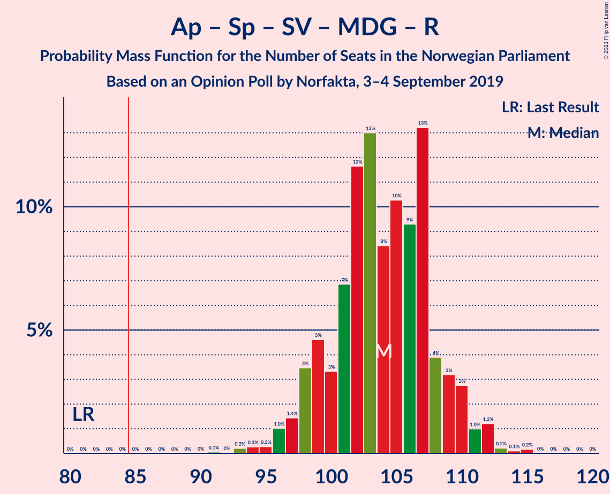

| Number of Seats | Probability | Accumulated | Special Marks |
|:---------------:|:-----------:|:-----------:|:-------------:|
| 81 | 0% | 100% | Last Result |
| 82 | 0% | 100% |  |
| 83 | 0% | 100% |  |
| 84 | 0% | 100% |  |
| 85 | 0% | 100% | Majority |
| 86 | 0% | 100% |  |
| 87 | 0% | 100% |  |
| 88 | 0% | 100% |  |
| 89 | 0% | 100% |  |
| 90 | 0% | 100% |  |
| 91 | 0.1% | 100% |  |
| 92 | 0% | 99.9% |  |
| 93 | 0.2% | 99.9% |  |
| 94 | 0.3% | 99.7% |  |
| 95 | 0.3% | 99.4% |  |
| 96 | 1.0% | 99.2% |  |
| 97 | 1.4% | 98% |  |
| 98 | 3% | 97% |  |
| 99 | 5% | 93% |  |
| 100 | 3% | 89% |  |
| 101 | 7% | 85% |  |
| 102 | 12% | 78% |  |
| 103 | 13% | 67% |  |
| 104 | 8% | 54% | Median |
| 105 | 10% | 45% |  |
| 106 | 9% | 35% |  |
| 107 | 13% | 26% |  |
| 108 | 4% | 13% |  |
| 109 | 3% | 9% |  |
| 110 | 3% | 5% |  |
| 111 | 1.0% | 3% |  |
| 112 | 1.2% | 2% |  |
| 113 | 0.2% | 0.5% |  |
| 114 | 0.1% | 0.3% |  |
| 115 | 0.2% | 0.2% |  |
| 116 | 0% | 0% |  |

### Arbeiderpartiet – Senterpartiet – Sosialistisk Venstreparti – Miljøpartiet De Grønne

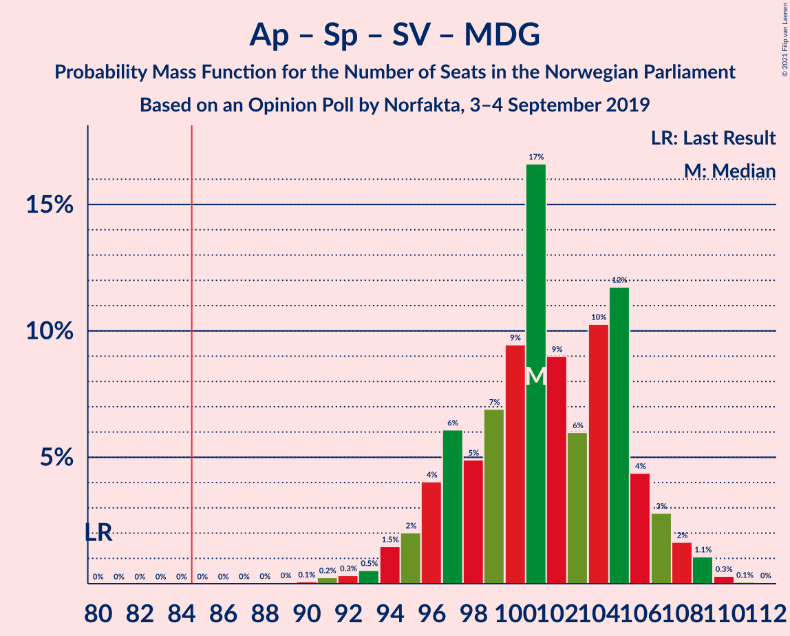

| Number of Seats | Probability | Accumulated | Special Marks |
|:---------------:|:-----------:|:-----------:|:-------------:|
| 80 | 0% | 100% | Last Result |
| 81 | 0% | 100% |  |
| 82 | 0% | 100% |  |
| 83 | 0% | 100% |  |
| 84 | 0% | 100% |  |
| 85 | 0% | 100% | Majority |
| 86 | 0% | 100% |  |
| 87 | 0% | 100% |  |
| 88 | 0% | 100% |  |
| 89 | 0% | 100% |  |
| 90 | 0.1% | 99.9% |  |
| 91 | 0.2% | 99.9% |  |
| 92 | 0.3% | 99.6% |  |
| 93 | 0.5% | 99.3% |  |
| 94 | 1.5% | 98.8% |  |
| 95 | 2% | 97% |  |
| 96 | 4% | 95% |  |
| 97 | 6% | 91% |  |
| 98 | 5% | 85% |  |
| 99 | 7% | 80% |  |
| 100 | 9% | 73% |  |
| 101 | 17% | 64% |  |
| 102 | 9% | 47% | Median |
| 103 | 6% | 38% |  |
| 104 | 10% | 32% |  |
| 105 | 12% | 22% |  |
| 106 | 4% | 10% |  |
| 107 | 3% | 6% |  |
| 108 | 2% | 3% |  |
| 109 | 1.1% | 1.5% |  |
| 110 | 0.3% | 0.4% |  |
| 111 | 0.1% | 0.1% |  |
| 112 | 0% | 0% |  |

### Høyre – Senterpartiet – Fremskrittspartiet – Kristelig Folkeparti – Venstre

| Number of Seats | Probability | Accumulated | Special Marks |
|:---------------:|:-----------:|:-----------:|:-------------:|
| 85 | 0% | 100% | Majority |
| 86 | 0.1% | 99.9% |  |
| 87 | 0.1% | 99.8% |  |
| 88 | 0.6% | 99.7% |  |
| 89 | 1.1% | 99.1% |  |
| 90 | 2% | 98% |  |
| 91 | 3% | 96% |  |
| 92 | 4% | 93% |  |
| 93 | 5% | 89% |  |
| 94 | 8% | 83% |  |
| 95 | 9% | 75% |  |
| 96 | 15% | 66% |  |
| 97 | 13% | 51% | Median |
| 98 | 8% | 38% |  |
| 99 | 7% | 29% |  |
| 100 | 11% | 23% |  |
| 101 | 6% | 12% |  |
| 102 | 3% | 6% |  |
| 103 | 2% | 3% |  |
| 104 | 0.6% | 1.3% |  |
| 105 | 0.5% | 0.7% |  |
| 106 | 0.2% | 0.2% |  |
| 107 | 0% | 0% | Last Result |

### Arbeiderpartiet – Senterpartiet – Sosialistisk Venstreparti – Rødt

| Number of Seats | Probability | Accumulated | Special Marks |
|:---------------:|:-----------:|:-----------:|:-------------:|
| 80 | 0.1% | 100% | Last Result |
| 81 | 0.1% | 99.9% |  |
| 82 | 0.2% | 99.8% |  |
| 83 | 0.3% | 99.7% |  |
| 84 | 1.0% | 99.4% |  |
| 85 | 0.7% | 98% | Majority |
| 86 | 2% | 98% |  |
| 87 | 5% | 95% |  |
| 88 | 5% | 91% |  |
| 89 | 5% | 86% |  |
| 90 | 9% | 81% |  |
| 91 | 10% | 72% |  |
| 92 | 14% | 62% | Median |
| 93 | 14% | 48% |  |
| 94 | 7% | 34% |  |
| 95 | 9% | 27% |  |
| 96 | 8% | 18% |  |
| 97 | 4% | 10% |  |
| 98 | 2% | 6% |  |
| 99 | 2% | 3% |  |
| 100 | 0.7% | 1.3% |  |
| 101 | 0.2% | 0.6% |  |
| 102 | 0.3% | 0.3% |  |
| 103 | 0% | 0.1% |  |
| 104 | 0% | 0% |  |

### Arbeiderpartiet – Senterpartiet – Miljøpartiet De Grønne – Kristelig Folkeparti

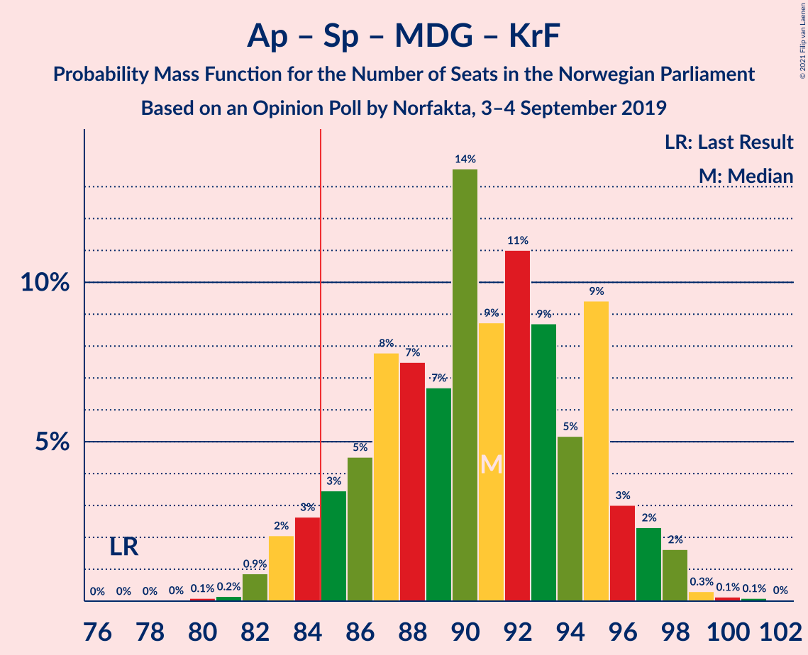

| Number of Seats | Probability | Accumulated | Special Marks |
|:---------------:|:-----------:|:-----------:|:-------------:|
| 77 | 0% | 100% | Last Result |
| 78 | 0% | 100% |  |
| 79 | 0% | 100% |  |
| 80 | 0.1% | 100% |  |
| 81 | 0.2% | 99.9% |  |
| 82 | 0.9% | 99.7% |  |
| 83 | 2% | 98.8% |  |
| 84 | 3% | 97% |  |
| 85 | 3% | 94% | Majority |
| 86 | 5% | 91% |  |
| 87 | 8% | 86% |  |
| 88 | 7% | 78% |  |
| 89 | 7% | 71% |  |
| 90 | 14% | 64% |  |
| 91 | 9% | 51% | Median |
| 92 | 11% | 42% |  |
| 93 | 9% | 31% |  |
| 94 | 5% | 22% |  |
| 95 | 9% | 17% |  |
| 96 | 3% | 8% |  |
| 97 | 2% | 5% |  |
| 98 | 2% | 2% |  |
| 99 | 0.3% | 0.6% |  |
| 100 | 0.1% | 0.3% |  |
| 101 | 0.1% | 0.1% |  |
| 102 | 0% | 0% |  |

### Arbeiderpartiet – Senterpartiet – Sosialistisk Venstreparti

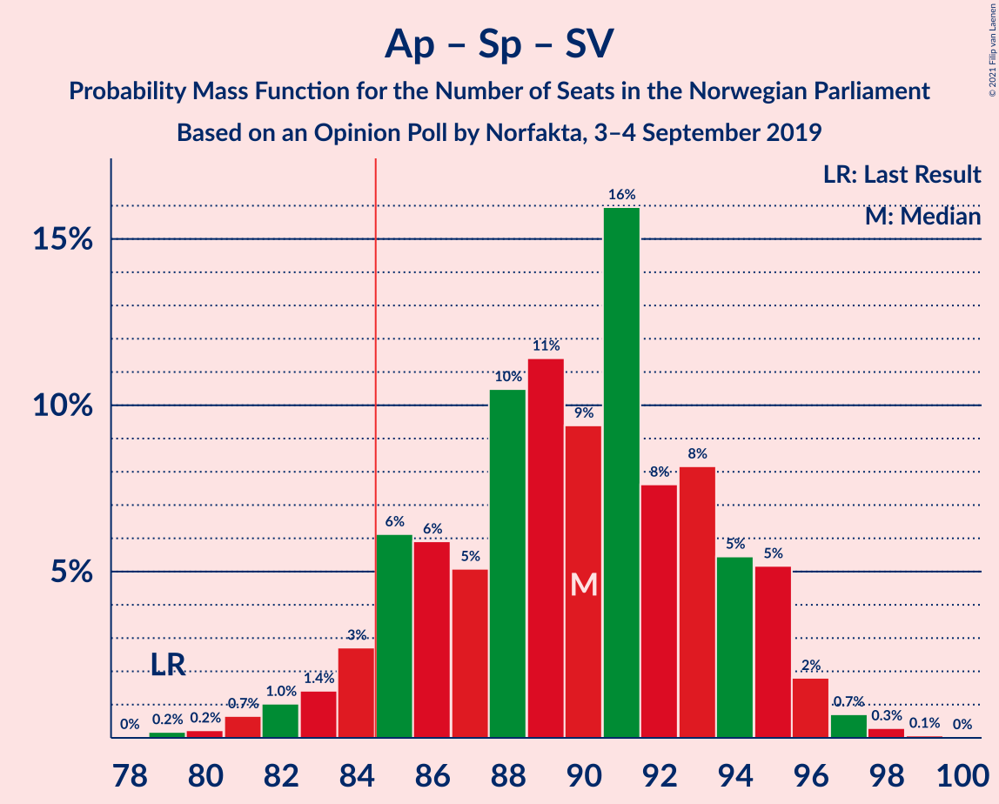

| Number of Seats | Probability | Accumulated | Special Marks |
|:---------------:|:-----------:|:-----------:|:-------------:|
| 78 | 0% | 100% |  |
| 79 | 0.2% | 99.9% | Last Result |
| 80 | 0.2% | 99.8% |  |
| 81 | 0.7% | 99.5% |  |
| 82 | 1.0% | 98.9% |  |
| 83 | 1.4% | 98% |  |
| 84 | 3% | 96% |  |
| 85 | 6% | 94% | Majority |
| 86 | 6% | 88% |  |
| 87 | 5% | 82% |  |
| 88 | 10% | 77% |  |
| 89 | 11% | 66% |  |
| 90 | 9% | 55% | Median |
| 91 | 16% | 45% |  |
| 92 | 8% | 29% |  |
| 93 | 8% | 22% |  |
| 94 | 5% | 14% |  |
| 95 | 5% | 8% |  |
| 96 | 2% | 3% |  |
| 97 | 0.7% | 1.1% |  |
| 98 | 0.3% | 0.4% |  |
| 99 | 0.1% | 0.1% |  |
| 100 | 0% | 0% |  |

### Arbeiderpartiet – Senterpartiet – Kristelig Folkeparti

| Number of Seats | Probability | Accumulated | Special Marks |
|:---------------:|:-----------:|:-----------:|:-------------:|
| 68 | 0.1% | 100% |  |
| 69 | 0.3% | 99.9% |  |
| 70 | 0.2% | 99.6% |  |
| 71 | 2% | 99.3% |  |
| 72 | 3% | 98% |  |
| 73 | 5% | 94% |  |
| 74 | 3% | 90% |  |
| 75 | 6% | 86% |  |
| 76 | 8% | 81% | Last Result |
| 77 | 12% | 73% |  |
| 78 | 6% | 61% |  |
| 79 | 6% | 55% | Median |
| 80 | 14% | 49% |  |
| 81 | 12% | 36% |  |
| 82 | 5% | 24% |  |
| 83 | 8% | 18% |  |
| 84 | 4% | 11% |  |
| 85 | 2% | 6% | Majority |
| 86 | 2% | 4% |  |
| 87 | 1.3% | 2% |  |
| 88 | 0.4% | 0.6% |  |
| 89 | 0.2% | 0.2% |  |
| 90 | 0% | 0.1% |  |
| 91 | 0% | 0% |  |

### Høyre – Fremskrittspartiet – Miljøpartiet De Grønne – Kristelig Folkeparti – Venstre

| Number of Seats | Probability | Accumulated | Special Marks |
|:---------------:|:-----------:|:-----------:|:-------------:|
| 65 | 0.2% | 100% |  |
| 66 | 0.2% | 99.8% |  |
| 67 | 0.5% | 99.6% |  |
| 68 | 1.0% | 99.0% |  |
| 69 | 0.9% | 98% |  |
| 70 | 3% | 97% |  |
| 71 | 3% | 95% |  |
| 72 | 5% | 91% |  |
| 73 | 10% | 87% |  |
| 74 | 9% | 77% |  |
| 75 | 8% | 67% |  |
| 76 | 14% | 60% | Median |
| 77 | 14% | 46% |  |
| 78 | 10% | 32% |  |
| 79 | 8% | 23% |  |
| 80 | 4% | 14% |  |
| 81 | 5% | 11% |  |
| 82 | 3% | 6% |  |
| 83 | 2% | 3% |  |
| 84 | 0.5% | 1.2% |  |
| 85 | 0.4% | 0.7% | Majority |
| 86 | 0.2% | 0.3% |  |
| 87 | 0.1% | 0.1% |  |
| 88 | 0% | 0% |  |
| 89 | 0% | 0% | Last Result |

### Arbeiderpartiet – Senterpartiet

| Number of Seats | Probability | Accumulated | Special Marks |
|:---------------:|:-----------:|:-----------:|:-------------:|
| 65 | 0.1% | 100% |  |
| 66 | 0.2% | 99.9% |  |
| 67 | 0.4% | 99.7% |  |
| 68 | 0.6% | 99.3% | Last Result |
| 69 | 2% | 98.7% |  |
| 70 | 3% | 97% |  |
| 71 | 4% | 94% |  |
| 72 | 6% | 90% |  |
| 73 | 7% | 84% |  |
| 74 | 9% | 78% |  |
| 75 | 7% | 68% |  |
| 76 | 9% | 61% |  |
| 77 | 7% | 52% | Median |
| 78 | 17% | 45% |  |
| 79 | 9% | 28% |  |
| 80 | 6% | 19% |  |
| 81 | 7% | 13% |  |
| 82 | 3% | 5% |  |
| 83 | 2% | 2% |  |
| 84 | 0.6% | 0.8% |  |
| 85 | 0.1% | 0.2% | Majority |
| 86 | 0% | 0.1% |  |
| 87 | 0% | 0% |  |

### Arbeiderpartiet – Sosialistisk Venstreparti – Miljøpartiet De Grønne – Rødt

| Number of Seats | Probability | Accumulated | Special Marks |
|:---------------:|:-----------:|:-----------:|:-------------:|
| 61 | 0% | 100% |  |
| 62 | 0.1% | 99.9% | Last Result |
| 63 | 0.3% | 99.8% |  |
| 64 | 1.2% | 99.5% |  |
| 65 | 0.9% | 98% |  |
| 66 | 3% | 97% |  |
| 67 | 4% | 95% |  |
| 68 | 6% | 91% |  |
| 69 | 13% | 85% |  |
| 70 | 8% | 72% |  |
| 71 | 8% | 64% | Median |
| 72 | 13% | 56% |  |
| 73 | 15% | 42% |  |
| 74 | 9% | 27% |  |
| 75 | 8% | 19% |  |
| 76 | 4% | 11% |  |
| 77 | 3% | 7% |  |
| 78 | 3% | 4% |  |
| 79 | 1.2% | 2% |  |
| 80 | 0.4% | 0.7% |  |
| 81 | 0.2% | 0.3% |  |
| 82 | 0.1% | 0.1% |  |
| 83 | 0% | 0% |  |

### Høyre – Fremskrittspartiet – Kristelig Folkeparti – Venstre

| Number of Seats | Probability | Accumulated | Special Marks |
|:---------------:|:-----------:|:-----------:|:-------------:|
| 54 | 0.2% | 100% |  |
| 55 | 0.3% | 99.8% |  |
| 56 | 0.5% | 99.5% |  |
| 57 | 1.5% | 99.0% |  |
| 58 | 2% | 97% |  |
| 59 | 4% | 96% |  |
| 60 | 4% | 92% |  |
| 61 | 5% | 88% |  |
| 62 | 14% | 83% |  |
| 63 | 11% | 69% |  |
| 64 | 11% | 58% | Median |
| 65 | 8% | 48% |  |
| 66 | 13% | 40% |  |
| 67 | 10% | 27% |  |
| 68 | 6% | 16% |  |
| 69 | 2% | 10% |  |
| 70 | 3% | 8% |  |
| 71 | 3% | 5% |  |
| 72 | 0.9% | 2% |  |
| 73 | 0.3% | 0.7% |  |
| 74 | 0.2% | 0.4% |  |
| 75 | 0.1% | 0.2% |  |
| 76 | 0.1% | 0.1% |  |
| 77 | 0% | 0% |  |
| 78 | 0% | 0% |  |
| 79 | 0% | 0% |  |
| 80 | 0% | 0% |  |
| 81 | 0% | 0% |  |
| 82 | 0% | 0% |  |
| 83 | 0% | 0% |  |
| 84 | 0% | 0% |  |
| 85 | 0% | 0% | Majority |
| 86 | 0% | 0% |  |
| 87 | 0% | 0% |  |
| 88 | 0% | 0% | Last Result |

### Høyre – Fremskrittspartiet – Venstre

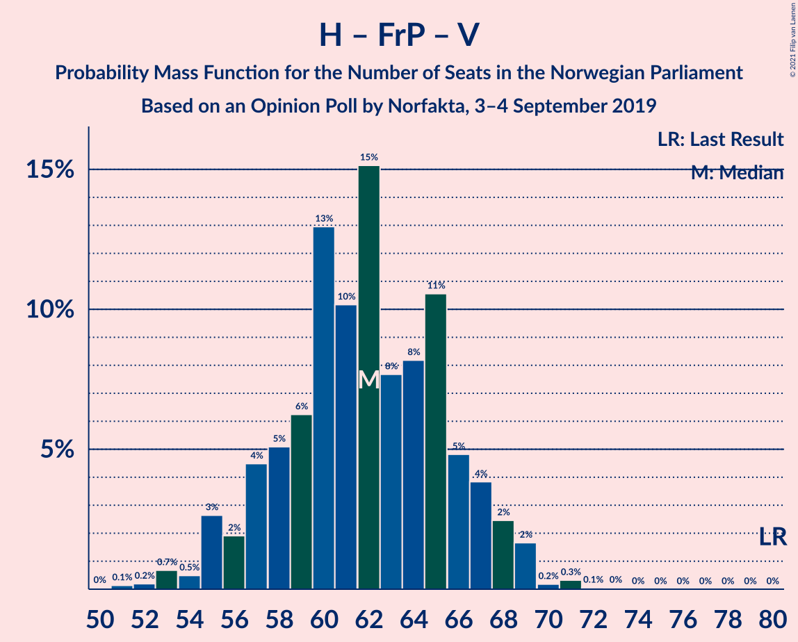

| Number of Seats | Probability | Accumulated | Special Marks |
|:---------------:|:-----------:|:-----------:|:-------------:|
| 51 | 0.1% | 100% |  |
| 52 | 0.2% | 99.8% |  |
| 53 | 0.7% | 99.6% |  |
| 54 | 0.5% | 98.9% |  |
| 55 | 3% | 98% |  |
| 56 | 2% | 96% |  |
| 57 | 4% | 94% |  |
| 58 | 5% | 89% |  |
| 59 | 6% | 84% |  |
| 60 | 13% | 78% |  |
| 61 | 10% | 65% |  |
| 62 | 15% | 55% | Median |
| 63 | 8% | 40% |  |
| 64 | 8% | 32% |  |
| 65 | 11% | 24% |  |
| 66 | 5% | 13% |  |
| 67 | 4% | 9% |  |
| 68 | 2% | 5% |  |
| 69 | 2% | 2% |  |
| 70 | 0.2% | 0.6% |  |
| 71 | 0.3% | 0.4% |  |
| 72 | 0.1% | 0.1% |  |
| 73 | 0% | 0.1% |  |
| 74 | 0% | 0% |  |
| 75 | 0% | 0% |  |
| 76 | 0% | 0% |  |
| 77 | 0% | 0% |  |
| 78 | 0% | 0% |  |
| 79 | 0% | 0% |  |
| 80 | 0% | 0% | Last Result |

### Høyre – Fremskrittspartiet

| Number of Seats | Probability | Accumulated | Special Marks |
|:---------------:|:-----------:|:-----------:|:-------------:|
| 49 | 0.1% | 100% |  |
| 50 | 0.1% | 99.9% |  |
| 51 | 0.3% | 99.8% |  |
| 52 | 0.6% | 99.5% |  |
| 53 | 2% | 98.9% |  |
| 54 | 2% | 97% |  |
| 55 | 3% | 95% |  |
| 56 | 4% | 92% |  |
| 57 | 5% | 87% |  |
| 58 | 13% | 82% |  |
| 59 | 12% | 69% |  |
| 60 | 10% | 57% | Median |
| 61 | 12% | 47% |  |
| 62 | 9% | 35% |  |
| 63 | 6% | 26% |  |
| 64 | 10% | 21% |  |
| 65 | 4% | 10% |  |
| 66 | 3% | 6% |  |
| 67 | 2% | 3% |  |
| 68 | 0.5% | 1.0% |  |
| 69 | 0.3% | 0.5% |  |
| 70 | 0.1% | 0.2% |  |
| 71 | 0.1% | 0.1% |  |
| 72 | 0% | 0% | Last Result |

### Arbeiderpartiet – Sosialistisk Venstreparti

| Number of Seats | Probability | Accumulated | Special Marks |
|:---------------:|:-----------:|:-----------:|:-------------:|
| 48 | 0.1% | 100% |  |
| 49 | 0.2% | 99.9% |  |
| 50 | 0.7% | 99.8% |  |
| 51 | 1.0% | 99.0% |  |
| 52 | 3% | 98% |  |
| 53 | 4% | 95% |  |
| 54 | 6% | 92% |  |
| 55 | 9% | 86% |  |
| 56 | 11% | 77% |  |
| 57 | 16% | 66% | Median |
| 58 | 13% | 50% |  |
| 59 | 16% | 37% |  |
| 60 | 7% | 21% | Last Result |
| 61 | 6% | 14% |  |
| 62 | 4% | 8% |  |
| 63 | 2% | 4% |  |
| 64 | 0.9% | 2% |  |
| 65 | 0.4% | 0.7% |  |
| 66 | 0.1% | 0.2% |  |
| 67 | 0.1% | 0.1% |  |
| 68 | 0% | 0% |  |

### Høyre – Kristelig Folkeparti – Venstre

| Number of Seats | Probability | Accumulated | Special Marks |
|:---------------:|:-----------:|:-----------:|:-------------:|
| 36 | 0.1% | 100% |  |
| 37 | 0.7% | 99.8% |  |
| 38 | 1.0% | 99.2% |  |
| 39 | 2% | 98% |  |
| 40 | 5% | 96% |  |
| 41 | 7% | 91% |  |
| 42 | 9% | 84% |  |
| 43 | 18% | 75% |  |
| 44 | 11% | 57% | Median |
| 45 | 16% | 46% |  |
| 46 | 8% | 30% |  |
| 47 | 6% | 22% |  |
| 48 | 9% | 16% |  |
| 49 | 3% | 7% |  |
| 50 | 2% | 4% |  |
| 51 | 0.9% | 2% |  |
| 52 | 0.5% | 1.0% |  |
| 53 | 0.2% | 0.4% |  |
| 54 | 0.1% | 0.2% |  |
| 55 | 0.1% | 0.1% |  |
| 56 | 0% | 0% |  |
| 57 | 0% | 0% |  |
| 58 | 0% | 0% |  |
| 59 | 0% | 0% |  |
| 60 | 0% | 0% |  |
| 61 | 0% | 0% | Last Result |

### Senterpartiet – Kristelig Folkeparti – Venstre

| Number of Seats | Probability | Accumulated | Special Marks |
|:---------------:|:-----------:|:-----------:|:-------------:|
| 27 | 0.1% | 100% |  |
| 28 | 0.1% | 99.9% |  |
| 29 | 0.3% | 99.8% |  |
| 30 | 2% | 99.5% |  |
| 31 | 4% | 97% |  |
| 32 | 5% | 94% |  |
| 33 | 7% | 89% |  |
| 34 | 8% | 82% |  |
| 35 | 7% | 74% | Last Result |
| 36 | 19% | 67% |  |
| 37 | 13% | 48% | Median |
| 38 | 16% | 35% |  |
| 39 | 7% | 19% |  |
| 40 | 3% | 12% |  |
| 41 | 2% | 9% |  |
| 42 | 2% | 7% |  |
| 43 | 2% | 5% |  |
| 44 | 2% | 2% |  |
| 45 | 0.5% | 0.8% |  |
| 46 | 0.2% | 0.3% |  |
| 47 | 0.1% | 0.1% |  |
| 48 | 0% | 0% |  |

## Technical Information

### Opinion Poll

+ **Polling firm:** Norfakta
+ **Commissioner(s):** —
+ **Fieldwork period:** 3–4 September 2019

### Calculations

+ **Sample size:** 1003
+ **Simulations done:** 1,048,576
+ **Error estimate:** 2.58%

