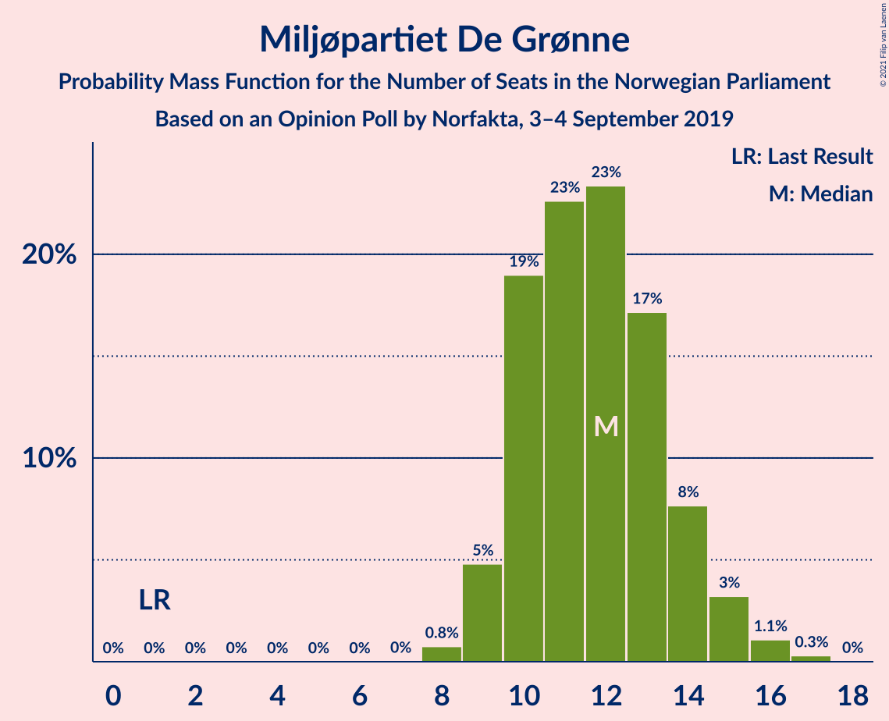
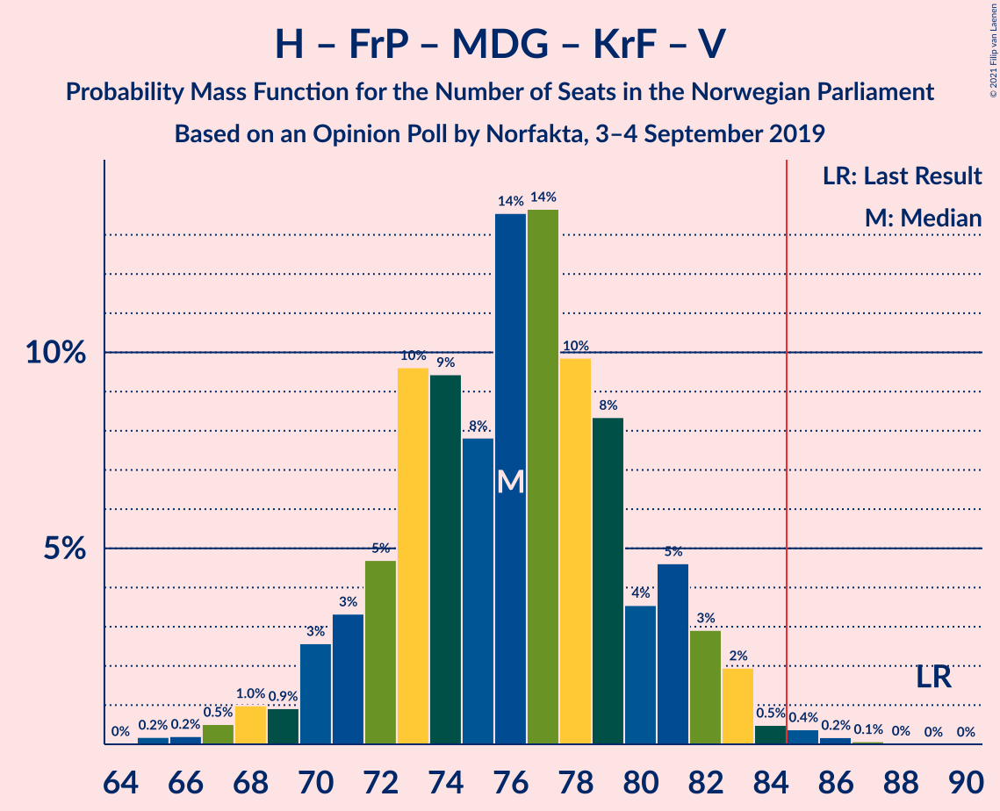
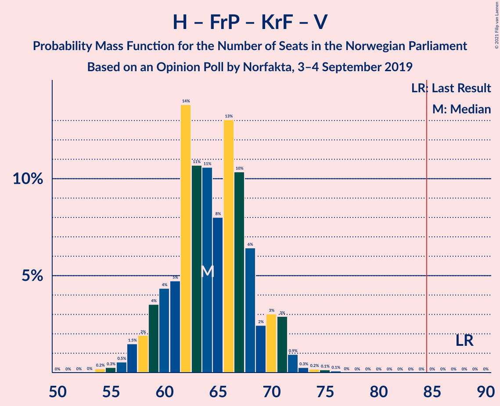
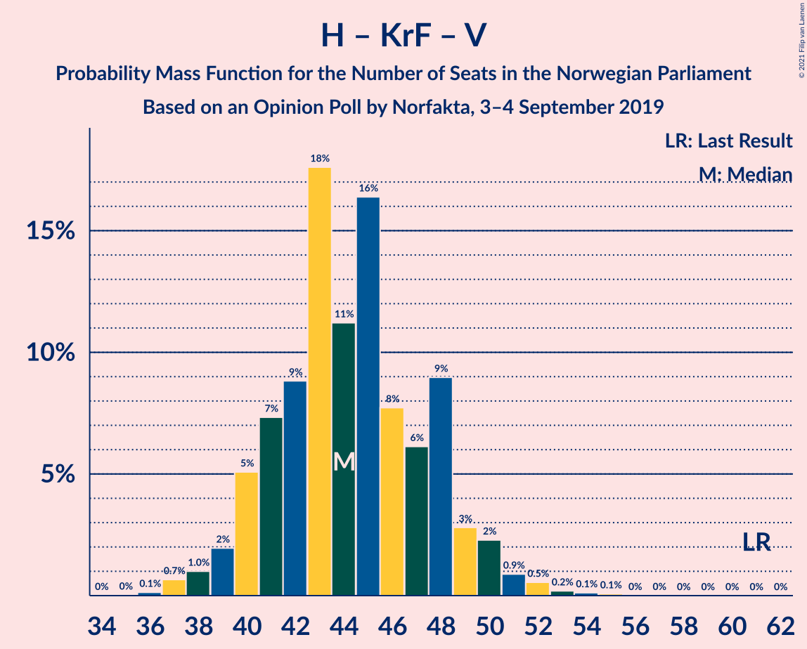
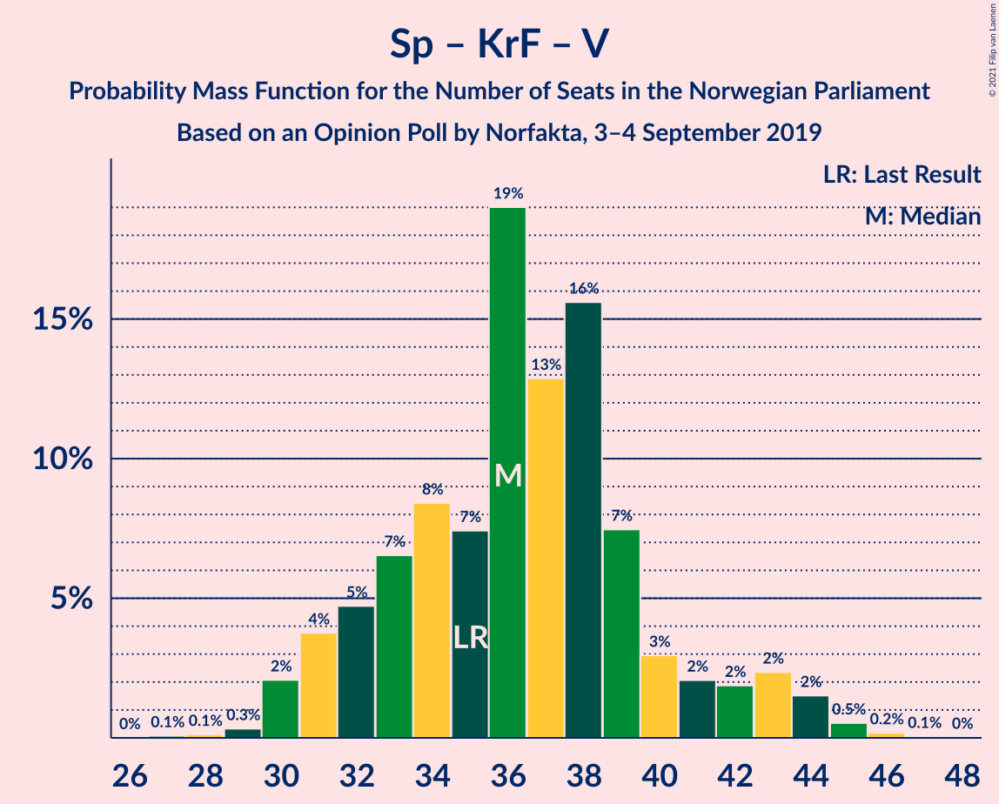

# Opinion Poll by Norfakta, 3–4 September 2019

<a href="#voting-intentions">Voting Intentions</a> | <a href="#seats">Seats</a> | <a href="#coalitions">Coalitions</a> | <a href="#technical-information">Technical Information</a>

## Voting Intentions

### Confidence Intervals

| Party | Last Result | Poll Result | 80% Confidence Interval | 90% Confidence Interval | 95% Confidence Interval | 99% Confidence Interval |
|:-----:|:-----------:|:-----------:|:-----------------------:|:-----------------------:|:-----------------------:|:-----------------------:|
| Arbeiderpartiet | 27.4% | 23.8% | 22.2–25.6% |21.7–26.1% |21.3–26.6% |20.5–27.5% |
| Høyre | 25.0% | 22.1% | 20.5–23.9% |20.1–24.4% |19.7–24.8% |18.9–25.7% |
| Senterpartiet | 10.3% | 17.1% | 15.7–18.8% |15.3–19.2% |14.9–19.6% |14.3–20.4% |
| Fremskrittspartiet | 15.2% | 11.0% | 9.8–12.3% |9.4–12.7% |9.2–13.1% |8.6–13.7% |
| Sosialistisk Venstreparti | 6.0% | 7.4% | 6.4–8.6% |6.1–8.9% |5.9–9.2% |5.5–9.8% |
| Miljøpartiet De Grønne | 3.2% | 6.5% | 5.6–7.6% |5.3–7.9% |5.1–8.2% |4.7–8.7% |
| Rødt | 2.4% | 3.3% | 2.7–4.1% |2.5–4.4% |2.3–4.6% |2.1–5.0% |
| Kristelig Folkeparti | 4.2% | 3.3% | 2.7–4.1% |2.5–4.4% |2.3–4.6% |2.1–5.0% |
| Venstre | 4.4% | 2.4% | 1.9–3.1% |1.7–3.4% |1.6–3.5% |1.4–3.9% |

*Note:* The poll result column reflects the actual value used in the calculations. Published results may vary slightly, and in addition be rounded to fewer digits.

## Seats

### Confidence Intervals

| Party | Last Result | Median | 80% Confidence Interval | 90% Confidence Interval | 95% Confidence Interval | 99% Confidence Interval |
|:-----:|:-----------:|:------:|:-----------------------:|:-----------------------:|:-----------------------:|:-----------------------:|
| <a href="#arbeiderpartiet">Arbeiderpartiet</a> | 49 | 45 | 40–47 |39–47 |39–49 |38–50 |
| <a href="#høyre">Høyre</a> | 45 | 43 | 37–44 |36–45 |35–46 |33–48 |
| <a href="#senterpartiet">Senterpartiet</a> | 19 | 35 | 28–37 |28–38 |27–39 |25–40 |
| <a href="#fremskrittspartiet">Fremskrittspartiet</a> | 27 | 20 | 16–24 |15–25 |14–25 |14–25 |
| <a href="#sosialistisk-venstreparti">Sosialistisk Venstreparti</a> | 11 | 12 | 11–15 |10–16 |10–18 |9–19 |
| <a href="#miljøpartiet-de-grønne">Miljøpartiet De Grønne</a> | 1 | 11 | 10–13 |10–14 |9–15 |8–16 |
| <a href="#rødt">Rødt</a> | 1 | 2 | 1–2 |1–8 |1–8 |1–9 |
| <a href="#kristelig-folkeparti">Kristelig Folkeparti</a> | 8 | 2 | 1–3 |0–8 |0–8 |0–8 |
| <a href="#venstre">Venstre</a> | 8 | 1 | 0–2 |0–2 |0–2 |0–7 |

### Arbeiderpartiet

*For a full overview of the results for this party, see the [Arbeiderpartiet](party-arbeiderpartiet.html) page.*

| Number of Seats | Probability | Accumulated | Special Marks |
|:---------------:|:-----------:|:-----------:|:-------------:|
| 35 | 0.1% | 100% |  |
| 36 | 0.2% | 99.9% |  |
| 37 | 0.1% | 99.7% |  |
| 38 | 0.9% | 99.6% |  |
| 39 | 5% | 98.7% |  |
| 40 | 5% | 94% |  |
| 41 | 10% | 88% |  |
| 42 | 17% | 79% |  |
| 43 | 4% | 62% |  |
| 44 | 5% | 57% |  |
| 45 | 34% | 53% | Median |
| 46 | 5% | 19% |  |
| 47 | 10% | 14% |  |
| 48 | 0.3% | 4% |  |
| 49 | 2% | 4% | Last Result |
| 50 | 2% | 2% |  |
| 51 | 0.2% | 0.2% |  |
| 52 | 0% | 0% |  |

### Høyre

*For a full overview of the results for this party, see the [Høyre](party-høyre.html) page.*

| Number of Seats | Probability | Accumulated | Special Marks |
|:---------------:|:-----------:|:-----------:|:-------------:|
| 31 | 0.1% | 100% |  |
| 32 | 0.2% | 99.9% |  |
| 33 | 0.6% | 99.6% |  |
| 34 | 0.4% | 99.0% |  |
| 35 | 2% | 98.6% |  |
| 36 | 2% | 97% |  |
| 37 | 5% | 95% |  |
| 38 | 2% | 90% |  |
| 39 | 10% | 87% |  |
| 40 | 10% | 78% |  |
| 41 | 11% | 68% |  |
| 42 | 5% | 57% |  |
| 43 | 34% | 52% | Median |
| 44 | 9% | 18% |  |
| 45 | 4% | 9% | Last Result |
| 46 | 2% | 5% |  |
| 47 | 2% | 2% |  |
| 48 | 0.4% | 0.7% |  |
| 49 | 0.2% | 0.2% |  |
| 50 | 0% | 0% |  |

### Senterpartiet

*For a full overview of the results for this party, see the [Senterpartiet](party-senterpartiet.html) page.*

| Number of Seats | Probability | Accumulated | Special Marks |
|:---------------:|:-----------:|:-----------:|:-------------:|
| 19 | 0% | 100% | Last Result |
| 20 | 0% | 100% |  |
| 21 | 0% | 100% |  |
| 22 | 0% | 100% |  |
| 23 | 0% | 100% |  |
| 24 | 0.1% | 100% |  |
| 25 | 0.5% | 99.9% |  |
| 26 | 0.8% | 99.4% |  |
| 27 | 3% | 98.6% |  |
| 28 | 6% | 96% |  |
| 29 | 7% | 90% |  |
| 30 | 3% | 83% |  |
| 31 | 5% | 80% |  |
| 32 | 3% | 75% |  |
| 33 | 3% | 72% |  |
| 34 | 11% | 69% |  |
| 35 | 34% | 58% | Median |
| 36 | 10% | 24% |  |
| 37 | 7% | 15% |  |
| 38 | 5% | 7% |  |
| 39 | 1.5% | 3% |  |
| 40 | 0.9% | 1.1% |  |
| 41 | 0% | 0.1% |  |
| 42 | 0% | 0.1% |  |
| 43 | 0.1% | 0.1% |  |
| 44 | 0% | 0% |  |

### Fremskrittspartiet

*For a full overview of the results for this party, see the [Fremskrittspartiet](party-fremskrittspartiet.html) page.*

| Number of Seats | Probability | Accumulated | Special Marks |
|:---------------:|:-----------:|:-----------:|:-------------:|
| 12 | 0.1% | 100% |  |
| 13 | 0.1% | 99.9% |  |
| 14 | 5% | 99.8% |  |
| 15 | 1.2% | 95% |  |
| 16 | 4% | 94% |  |
| 17 | 10% | 90% |  |
| 18 | 10% | 80% |  |
| 19 | 10% | 70% |  |
| 20 | 12% | 60% | Median |
| 21 | 23% | 48% |  |
| 22 | 6% | 24% |  |
| 23 | 6% | 19% |  |
| 24 | 7% | 12% |  |
| 25 | 5% | 6% |  |
| 26 | 0.3% | 0.4% |  |
| 27 | 0.1% | 0.1% | Last Result |
| 28 | 0% | 0.1% |  |
| 29 | 0% | 0% |  |

### Sosialistisk Venstreparti

*For a full overview of the results for this party, see the [Sosialistisk Venstreparti](party-sosialistiskvenstreparti.html) page.*

| Number of Seats | Probability | Accumulated | Special Marks |
|:---------------:|:-----------:|:-----------:|:-------------:|
| 8 | 0.1% | 100% |  |
| 9 | 1.3% | 99.9% |  |
| 10 | 8% | 98.6% |  |
| 11 | 13% | 90% | Last Result |
| 12 | 38% | 77% | Median |
| 13 | 7% | 38% |  |
| 14 | 9% | 31% |  |
| 15 | 15% | 22% |  |
| 16 | 3% | 7% |  |
| 17 | 1.4% | 4% |  |
| 18 | 0.5% | 3% |  |
| 19 | 2% | 2% |  |
| 20 | 0.1% | 0.1% |  |
| 21 | 0% | 0% |  |

### Miljøpartiet De Grønne

*For a full overview of the results for this party, see the [Miljøpartiet De Grønne](party-miljøpartietdegrønne.html) page.*

| Number of Seats | Probability | Accumulated | Special Marks |
|:---------------:|:-----------:|:-----------:|:-------------:|
| 1 | 0% | 100% | Last Result |
| 2 | 0% | 100% |  |
| 3 | 0% | 100% |  |
| 4 | 0% | 100% |  |
| 5 | 0% | 100% |  |
| 6 | 0% | 100% |  |
| 7 | 0% | 100% |  |
| 8 | 1.2% | 100% |  |
| 9 | 3% | 98.7% |  |
| 10 | 37% | 95% |  |
| 11 | 17% | 59% | Median |
| 12 | 22% | 42% |  |
| 13 | 12% | 20% |  |
| 14 | 4% | 8% |  |
| 15 | 2% | 4% |  |
| 16 | 1.1% | 1.4% |  |
| 17 | 0.3% | 0.3% |  |
| 18 | 0% | 0% |  |

### Rødt

*For a full overview of the results for this party, see the [Rødt](party-rødt.html) page.*

| Number of Seats | Probability | Accumulated | Special Marks |
|:---------------:|:-----------:|:-----------:|:-------------:|
| 1 | 45% | 100% | Last Result |
| 2 | 46% | 55% | Median |
| 3 | 0% | 9% |  |
| 4 | 0% | 9% |  |
| 5 | 0% | 9% |  |
| 6 | 0.3% | 9% |  |
| 7 | 3% | 9% |  |
| 8 | 5% | 6% |  |
| 9 | 0.7% | 0.8% |  |
| 10 | 0.1% | 0.1% |  |
| 11 | 0% | 0% |  |

### Kristelig Folkeparti

*For a full overview of the results for this party, see the [Kristelig Folkeparti](party-kristeligfolkeparti.html) page.*

| Number of Seats | Probability | Accumulated | Special Marks |
|:---------------:|:-----------:|:-----------:|:-------------:|
| 0 | 5% | 100% |  |
| 1 | 44% | 95% |  |
| 2 | 23% | 51% | Median |
| 3 | 19% | 28% |  |
| 4 | 0% | 9% |  |
| 5 | 0% | 9% |  |
| 6 | 0.1% | 9% |  |
| 7 | 3% | 9% |  |
| 8 | 5% | 6% | Last Result |
| 9 | 0.4% | 0.5% |  |
| 10 | 0% | 0% |  |

### Venstre

*For a full overview of the results for this party, see the [Venstre](party-venstre.html) page.*

| Number of Seats | Probability | Accumulated | Special Marks |
|:---------------:|:-----------:|:-----------:|:-------------:|
| 0 | 13% | 100% |  |
| 1 | 62% | 87% | Median |
| 2 | 22% | 24% |  |
| 3 | 2% | 2% |  |
| 4 | 0% | 0.7% |  |
| 5 | 0% | 0.7% |  |
| 6 | 0% | 0.7% |  |
| 7 | 0.5% | 0.7% |  |
| 8 | 0.2% | 0.2% | Last Result |
| 9 | 0% | 0% |  |

## Coalitions

### Confidence Intervals

| Coalition | Last Result | Median | Majority? | 80% Confidence Interval | 90% Confidence Interval | 95% Confidence Interval | 99% Confidence Interval |
|:---------:|:-----------:|:------:|:---------:|:-----------------------:|:-----------------------:|:-----------------------:|:-----------------------:|
| Arbeiderpartiet – Senterpartiet – Sosialistisk Venstreparti – Miljøpartiet De Grønne – Kristelig Folkeparti | 88 | 103 | 100% | 100–108 | 99–109 | 98–110 | 96–113 |
| Arbeiderpartiet – Senterpartiet – Sosialistisk Venstreparti – Miljøpartiet De Grønne – Rødt | 81 | 103 | 100% | 99–108 | 99–109 | 98–110 | 95–112 |
| Arbeiderpartiet – Senterpartiet – Sosialistisk Venstreparti – Miljøpartiet De Grønne | 80 | 102 | 100% | 97–106 | 97–106 | 95–108 | 92–110 |
| Høyre – Senterpartiet – Fremskrittspartiet – Kristelig Folkeparti – Venstre | 107 | 98 | 100% | 94–104 | 91–104 | 91–105 | 88–105 |
| Arbeiderpartiet – Senterpartiet – Sosialistisk Venstreparti – Rødt | 80 | 93 | 99.1% | 89–97 | 87–98 | 86–99 | 84–101 |
| Arbeiderpartiet – Senterpartiet – Miljøpartiet De Grønne – Kristelig Folkeparti | 77 | 91 | 97% | 86–96 | 85–97 | 84–98 | 82–102 |
| Arbeiderpartiet – Senterpartiet – Sosialistisk Venstreparti | 79 | 90 | 96% | 87–94 | 85–95 | 84–96 | 81–97 |
| Arbeiderpartiet – Senterpartiet – Kristelig Folkeparti | 76 | 80 | 10% | 74–84 | 73–86 | 72–86 | 71–91 |
| Arbeiderpartiet – Senterpartiet | 68 | 78 | 0.6% | 72–82 | 71–83 | 70–84 | 68–85 |
| Høyre – Fremskrittspartiet – Miljøpartiet De Grønne – Kristelig Folkeparti – Venstre | 89 | 76 | 0.7% | 72–80 | 70–81 | 70–82 | 67–85 |
| Høyre – Fremskrittspartiet – Kristelig Folkeparti – Venstre | 88 | 66 | 0% | 60–69 | 59–70 | 58–70 | 56–74 |
| Høyre – Fremskrittspartiet – Venstre | 80 | 64 | 0% | 58–67 | 57–68 | 55–68 | 53–69 |
| Høyre – Fremskrittspartiet | 72 | 62 | 0% | 57–65 | 55–67 | 53–67 | 52–68 |
| Arbeiderpartiet – Sosialistisk Venstreparti | 60 | 57 | 0% | 52–60 | 52–61 | 51–63 | 50–65 |
| Høyre – Kristelig Folkeparti – Venstre | 61 | 45 | 0% | 41–49 | 40–49 | 39–51 | 36–54 |
| Senterpartiet – Kristelig Folkeparti – Venstre | 35 | 37 | 0% | 32–42 | 31–44 | 30–45 | 29–47 |

### Arbeiderpartiet – Senterpartiet – Sosialistisk Venstreparti – Miljøpartiet De Grønne – Kristelig Folkeparti

| Number of Seats | Probability | Accumulated | Special Marks |
|:---------------:|:-----------:|:-----------:|:-------------:|
| 88 | 0% | 100% | Last Result |
| 89 | 0% | 100% |  |
| 90 | 0% | 100% |  |
| 91 | 0% | 100% |  |
| 92 | 0.1% | 100% |  |
| 93 | 0.1% | 99.9% |  |
| 94 | 0.1% | 99.8% |  |
| 95 | 0.1% | 99.7% |  |
| 96 | 0.4% | 99.5% |  |
| 97 | 1.1% | 99.2% |  |
| 98 | 0.6% | 98% |  |
| 99 | 6% | 97% |  |
| 100 | 7% | 92% |  |
| 101 | 7% | 85% |  |
| 102 | 9% | 78% |  |
| 103 | 33% | 69% |  |
| 104 | 5% | 36% |  |
| 105 | 4% | 31% | Median |
| 106 | 7% | 27% |  |
| 107 | 5% | 20% |  |
| 108 | 9% | 15% |  |
| 109 | 4% | 6% |  |
| 110 | 0.9% | 3% |  |
| 111 | 0.7% | 2% |  |
| 112 | 0.3% | 1.1% |  |
| 113 | 0.6% | 0.8% |  |
| 114 | 0.1% | 0.3% |  |
| 115 | 0.1% | 0.2% |  |
| 116 | 0.1% | 0.1% |  |
| 117 | 0% | 0% |  |

### Arbeiderpartiet – Senterpartiet – Sosialistisk Venstreparti – Miljøpartiet De Grønne – Rødt

| Number of Seats | Probability | Accumulated | Special Marks |
|:---------------:|:-----------:|:-----------:|:-------------:|
| 81 | 0% | 100% | Last Result |
| 82 | 0% | 100% |  |
| 83 | 0% | 100% |  |
| 84 | 0% | 100% |  |
| 85 | 0% | 100% | Majority |
| 86 | 0% | 100% |  |
| 87 | 0% | 100% |  |
| 88 | 0% | 100% |  |
| 89 | 0% | 100% |  |
| 90 | 0% | 100% |  |
| 91 | 0% | 100% |  |
| 92 | 0.1% | 100% |  |
| 93 | 0.1% | 99.9% |  |
| 94 | 0.1% | 99.8% |  |
| 95 | 0.5% | 99.7% |  |
| 96 | 0.6% | 99.2% |  |
| 97 | 1.0% | 98.7% |  |
| 98 | 1.2% | 98% |  |
| 99 | 7% | 96% |  |
| 100 | 3% | 90% |  |
| 101 | 17% | 86% |  |
| 102 | 5% | 69% |  |
| 103 | 25% | 64% |  |
| 104 | 10% | 40% |  |
| 105 | 4% | 30% | Median |
| 106 | 4% | 26% |  |
| 107 | 6% | 22% |  |
| 108 | 7% | 15% |  |
| 109 | 5% | 9% |  |
| 110 | 1.3% | 4% |  |
| 111 | 1.5% | 2% |  |
| 112 | 0.5% | 0.9% |  |
| 113 | 0.2% | 0.3% |  |
| 114 | 0.1% | 0.2% |  |
| 115 | 0.1% | 0.1% |  |
| 116 | 0% | 0% |  |

### Arbeiderpartiet – Senterpartiet – Sosialistisk Venstreparti – Miljøpartiet De Grønne

| Number of Seats | Probability | Accumulated | Special Marks |
|:---------------:|:-----------:|:-----------:|:-------------:|
| 80 | 0% | 100% | Last Result |
| 81 | 0% | 100% |  |
| 82 | 0% | 100% |  |
| 83 | 0% | 100% |  |
| 84 | 0% | 100% |  |
| 85 | 0% | 100% | Majority |
| 86 | 0% | 100% |  |
| 87 | 0% | 100% |  |
| 88 | 0% | 100% |  |
| 89 | 0% | 100% |  |
| 90 | 0.1% | 100% |  |
| 91 | 0.3% | 99.9% |  |
| 92 | 0.1% | 99.6% |  |
| 93 | 0.6% | 99.4% |  |
| 94 | 0.9% | 98.9% |  |
| 95 | 1.4% | 98% |  |
| 96 | 1.4% | 97% |  |
| 97 | 7% | 95% |  |
| 98 | 3% | 88% |  |
| 99 | 13% | 85% |  |
| 100 | 11% | 73% |  |
| 101 | 5% | 62% |  |
| 102 | 30% | 57% |  |
| 103 | 4% | 27% | Median |
| 104 | 5% | 22% |  |
| 105 | 3% | 18% |  |
| 106 | 11% | 15% |  |
| 107 | 0.3% | 4% |  |
| 108 | 3% | 4% |  |
| 109 | 0.4% | 1.0% |  |
| 110 | 0.4% | 0.6% |  |
| 111 | 0.1% | 0.2% |  |
| 112 | 0.1% | 0.1% |  |
| 113 | 0% | 0% |  |

### Høyre – Senterpartiet – Fremskrittspartiet – Kristelig Folkeparti – Venstre

| Number of Seats | Probability | Accumulated | Special Marks |
|:---------------:|:-----------:|:-----------:|:-------------:|
| 85 | 0% | 100% | Majority |
| 86 | 0.1% | 99.9% |  |
| 87 | 0.2% | 99.8% |  |
| 88 | 0.2% | 99.6% |  |
| 89 | 0.3% | 99.4% |  |
| 90 | 1.1% | 99.1% |  |
| 91 | 3% | 98% |  |
| 92 | 1.5% | 95% |  |
| 93 | 2% | 93% |  |
| 94 | 2% | 92% |  |
| 95 | 8% | 89% |  |
| 96 | 8% | 81% |  |
| 97 | 14% | 74% |  |
| 98 | 10% | 59% |  |
| 99 | 7% | 49% |  |
| 100 | 2% | 42% |  |
| 101 | 23% | 40% | Median |
| 102 | 5% | 17% |  |
| 103 | 2% | 12% |  |
| 104 | 6% | 10% |  |
| 105 | 4% | 5% |  |
| 106 | 0.3% | 0.4% |  |
| 107 | 0.1% | 0.1% | Last Result |
| 108 | 0% | 0% |  |

### Arbeiderpartiet – Senterpartiet – Sosialistisk Venstreparti – Rødt

| Number of Seats | Probability | Accumulated | Special Marks |
|:---------------:|:-----------:|:-----------:|:-------------:|
| 80 | 0% | 100% | Last Result |
| 81 | 0.1% | 99.9% |  |
| 82 | 0.1% | 99.9% |  |
| 83 | 0.2% | 99.8% |  |
| 84 | 0.5% | 99.5% |  |
| 85 | 1.1% | 99.1% | Majority |
| 86 | 1.4% | 98% |  |
| 87 | 2% | 97% |  |
| 88 | 3% | 94% |  |
| 89 | 12% | 91% |  |
| 90 | 10% | 79% |  |
| 91 | 11% | 68% |  |
| 92 | 4% | 57% |  |
| 93 | 28% | 53% |  |
| 94 | 2% | 25% | Median |
| 95 | 9% | 23% |  |
| 96 | 2% | 14% |  |
| 97 | 6% | 12% |  |
| 98 | 3% | 6% |  |
| 99 | 2% | 3% |  |
| 100 | 0.2% | 0.8% |  |
| 101 | 0.4% | 0.6% |  |
| 102 | 0.1% | 0.2% |  |
| 103 | 0% | 0.1% |  |
| 104 | 0% | 0% |  |

### Arbeiderpartiet – Senterpartiet – Miljøpartiet De Grønne – Kristelig Folkeparti

| Number of Seats | Probability | Accumulated | Special Marks |
|:---------------:|:-----------:|:-----------:|:-------------:|
| 77 | 0% | 100% | Last Result |
| 78 | 0% | 100% |  |
| 79 | 0.1% | 100% |  |
| 80 | 0.1% | 99.9% |  |
| 81 | 0.2% | 99.7% |  |
| 82 | 0.2% | 99.6% |  |
| 83 | 0.5% | 99.4% |  |
| 84 | 2% | 98.9% |  |
| 85 | 7% | 97% | Majority |
| 86 | 6% | 91% |  |
| 87 | 2% | 85% |  |
| 88 | 7% | 82% |  |
| 89 | 4% | 75% |  |
| 90 | 8% | 71% |  |
| 91 | 30% | 63% |  |
| 92 | 8% | 33% |  |
| 93 | 5% | 25% | Median |
| 94 | 3% | 21% |  |
| 95 | 2% | 17% |  |
| 96 | 8% | 15% |  |
| 97 | 5% | 8% |  |
| 98 | 1.2% | 3% |  |
| 99 | 0.5% | 1.4% |  |
| 100 | 0.1% | 0.9% |  |
| 101 | 0.1% | 0.7% |  |
| 102 | 0.4% | 0.6% |  |
| 103 | 0.1% | 0.2% |  |
| 104 | 0% | 0.1% |  |
| 105 | 0% | 0% |  |

### Arbeiderpartiet – Senterpartiet – Sosialistisk Venstreparti

| Number of Seats | Probability | Accumulated | Special Marks |
|:---------------:|:-----------:|:-----------:|:-------------:|
| 78 | 0.1% | 100% |  |
| 79 | 0.1% | 99.9% | Last Result |
| 80 | 0.2% | 99.9% |  |
| 81 | 0.4% | 99.7% |  |
| 82 | 0.4% | 99.3% |  |
| 83 | 0.6% | 98.9% |  |
| 84 | 2% | 98% |  |
| 85 | 4% | 96% | Majority |
| 86 | 2% | 92% |  |
| 87 | 12% | 90% |  |
| 88 | 9% | 79% |  |
| 89 | 13% | 69% |  |
| 90 | 8% | 57% |  |
| 91 | 6% | 49% |  |
| 92 | 25% | 43% | Median |
| 93 | 5% | 18% |  |
| 94 | 5% | 13% |  |
| 95 | 4% | 7% |  |
| 96 | 3% | 4% |  |
| 97 | 0.8% | 1.2% |  |
| 98 | 0.1% | 0.3% |  |
| 99 | 0.1% | 0.2% |  |
| 100 | 0.1% | 0.1% |  |
| 101 | 0% | 0% |  |

### Arbeiderpartiet – Senterpartiet – Kristelig Folkeparti

| Number of Seats | Probability | Accumulated | Special Marks |
|:---------------:|:-----------:|:-----------:|:-------------:|
| 67 | 0.1% | 100% |  |
| 68 | 0.1% | 99.9% |  |
| 69 | 0.1% | 99.8% |  |
| 70 | 0.1% | 99.7% |  |
| 71 | 0.3% | 99.6% |  |
| 72 | 2% | 99.3% |  |
| 73 | 2% | 97% |  |
| 74 | 5% | 95% |  |
| 75 | 8% | 90% |  |
| 76 | 4% | 82% | Last Result |
| 77 | 5% | 78% |  |
| 78 | 8% | 73% |  |
| 79 | 11% | 65% |  |
| 80 | 5% | 54% |  |
| 81 | 23% | 49% |  |
| 82 | 8% | 26% | Median |
| 83 | 3% | 17% |  |
| 84 | 5% | 15% |  |
| 85 | 4% | 10% | Majority |
| 86 | 3% | 5% |  |
| 87 | 0.9% | 2% |  |
| 88 | 0.6% | 1.3% |  |
| 89 | 0.1% | 0.7% |  |
| 90 | 0% | 0.6% |  |
| 91 | 0.5% | 0.6% |  |
| 92 | 0% | 0.1% |  |
| 93 | 0% | 0% |  |

### Arbeiderpartiet – Senterpartiet

| Number of Seats | Probability | Accumulated | Special Marks |
|:---------------:|:-----------:|:-----------:|:-------------:|
| 65 | 0.1% | 100% |  |
| 66 | 0.1% | 99.9% |  |
| 67 | 0.3% | 99.8% |  |
| 68 | 0.2% | 99.5% | Last Result |
| 69 | 2% | 99.3% |  |
| 70 | 2% | 98% |  |
| 71 | 3% | 96% |  |
| 72 | 3% | 93% |  |
| 73 | 5% | 89% |  |
| 74 | 9% | 84% |  |
| 75 | 5% | 75% |  |
| 76 | 11% | 70% |  |
| 77 | 2% | 59% |  |
| 78 | 9% | 56% |  |
| 79 | 8% | 47% |  |
| 80 | 23% | 39% | Median |
| 81 | 5% | 16% |  |
| 82 | 5% | 11% |  |
| 83 | 3% | 6% |  |
| 84 | 3% | 3% |  |
| 85 | 0.3% | 0.6% | Majority |
| 86 | 0.1% | 0.3% |  |
| 87 | 0.1% | 0.2% |  |
| 88 | 0.1% | 0.1% |  |
| 89 | 0% | 0% |  |

### Høyre – Fremskrittspartiet – Miljøpartiet De Grønne – Kristelig Folkeparti – Venstre

| Number of Seats | Probability | Accumulated | Special Marks |
|:---------------:|:-----------:|:-----------:|:-------------:|
| 62 | 0.1% | 100% |  |
| 63 | 0% | 99.9% |  |
| 64 | 0% | 99.9% |  |
| 65 | 0.1% | 99.9% |  |
| 66 | 0.1% | 99.8% |  |
| 67 | 0.5% | 99.7% |  |
| 68 | 0.7% | 99.2% |  |
| 69 | 0.3% | 98.6% |  |
| 70 | 4% | 98% |  |
| 71 | 3% | 94% |  |
| 72 | 9% | 91% |  |
| 73 | 3% | 82% |  |
| 74 | 9% | 80% |  |
| 75 | 3% | 71% |  |
| 76 | 29% | 68% |  |
| 77 | 3% | 39% | Median |
| 78 | 9% | 36% |  |
| 79 | 8% | 26% |  |
| 80 | 12% | 19% |  |
| 81 | 3% | 7% |  |
| 82 | 1.0% | 3% |  |
| 83 | 0.7% | 2% |  |
| 84 | 1.0% | 2% |  |
| 85 | 0.4% | 0.7% | Majority |
| 86 | 0.2% | 0.2% |  |
| 87 | 0% | 0.1% |  |
| 88 | 0% | 0% |  |
| 89 | 0% | 0% | Last Result |

### Høyre – Fremskrittspartiet – Kristelig Folkeparti – Venstre

| Number of Seats | Probability | Accumulated | Special Marks |
|:---------------:|:-----------:|:-----------:|:-------------:|
| 53 | 0.1% | 100% |  |
| 54 | 0.1% | 99.9% |  |
| 55 | 0.2% | 99.8% |  |
| 56 | 0.5% | 99.5% |  |
| 57 | 1.1% | 99.0% |  |
| 58 | 2% | 98% |  |
| 59 | 2% | 96% |  |
| 60 | 5% | 94% |  |
| 61 | 11% | 89% |  |
| 62 | 7% | 78% |  |
| 63 | 4% | 71% |  |
| 64 | 5% | 67% |  |
| 65 | 9% | 62% |  |
| 66 | 24% | 53% | Median |
| 67 | 4% | 29% |  |
| 68 | 14% | 24% |  |
| 69 | 2% | 11% |  |
| 70 | 7% | 9% |  |
| 71 | 0.4% | 2% |  |
| 72 | 0.7% | 2% |  |
| 73 | 0.4% | 0.9% |  |
| 74 | 0.4% | 0.5% |  |
| 75 | 0% | 0.1% |  |
| 76 | 0.1% | 0.1% |  |
| 77 | 0% | 0% |  |
| 78 | 0% | 0% |  |
| 79 | 0% | 0% |  |
| 80 | 0% | 0% |  |
| 81 | 0% | 0% |  |
| 82 | 0% | 0% |  |
| 83 | 0% | 0% |  |
| 84 | 0% | 0% |  |
| 85 | 0% | 0% | Majority |
| 86 | 0% | 0% |  |
| 87 | 0% | 0% |  |
| 88 | 0% | 0% | Last Result |

### Høyre – Fremskrittspartiet – Venstre

| Number of Seats | Probability | Accumulated | Special Marks |
|:---------------:|:-----------:|:-----------:|:-------------:|
| 50 | 0.1% | 100% |  |
| 51 | 0.1% | 99.9% |  |
| 52 | 0.2% | 99.8% |  |
| 53 | 0.3% | 99.6% |  |
| 54 | 0.6% | 99.3% |  |
| 55 | 2% | 98.8% |  |
| 56 | 2% | 97% |  |
| 57 | 2% | 95% |  |
| 58 | 7% | 93% |  |
| 59 | 7% | 86% |  |
| 60 | 9% | 79% |  |
| 61 | 10% | 70% |  |
| 62 | 1.5% | 60% |  |
| 63 | 6% | 58% |  |
| 64 | 9% | 52% | Median |
| 65 | 25% | 43% |  |
| 66 | 3% | 17% |  |
| 67 | 9% | 15% |  |
| 68 | 4% | 6% |  |
| 69 | 1.0% | 1.3% |  |
| 70 | 0.1% | 0.3% |  |
| 71 | 0.1% | 0.2% |  |
| 72 | 0% | 0.1% |  |
| 73 | 0% | 0.1% |  |
| 74 | 0% | 0% |  |
| 75 | 0% | 0% |  |
| 76 | 0% | 0% |  |
| 77 | 0% | 0% |  |
| 78 | 0% | 0% |  |
| 79 | 0% | 0% |  |
| 80 | 0% | 0% | Last Result |

### Høyre – Fremskrittspartiet

| Number of Seats | Probability | Accumulated | Special Marks |
|:---------------:|:-----------:|:-----------:|:-------------:|
| 49 | 0.1% | 100% |  |
| 50 | 0.1% | 99.9% |  |
| 51 | 0.2% | 99.7% |  |
| 52 | 0.3% | 99.5% |  |
| 53 | 2% | 99.2% |  |
| 54 | 0.8% | 97% |  |
| 55 | 2% | 96% |  |
| 56 | 2% | 95% |  |
| 57 | 5% | 92% |  |
| 58 | 7% | 88% |  |
| 59 | 13% | 81% |  |
| 60 | 7% | 68% |  |
| 61 | 5% | 60% |  |
| 62 | 6% | 55% |  |
| 63 | 8% | 50% | Median |
| 64 | 24% | 42% |  |
| 65 | 12% | 18% |  |
| 66 | 0.3% | 6% |  |
| 67 | 4% | 5% |  |
| 68 | 0.7% | 1.0% |  |
| 69 | 0.1% | 0.3% |  |
| 70 | 0.2% | 0.2% |  |
| 71 | 0% | 0.1% |  |
| 72 | 0% | 0% | Last Result |

### Arbeiderpartiet – Sosialistisk Venstreparti

| Number of Seats | Probability | Accumulated | Special Marks |
|:---------------:|:-----------:|:-----------:|:-------------:|
| 47 | 0.1% | 100% |  |
| 48 | 0.1% | 99.9% |  |
| 49 | 0.3% | 99.8% |  |
| 50 | 1.4% | 99.6% |  |
| 51 | 3% | 98% |  |
| 52 | 9% | 96% |  |
| 53 | 6% | 86% |  |
| 54 | 9% | 80% |  |
| 55 | 5% | 71% |  |
| 56 | 6% | 66% |  |
| 57 | 29% | 60% | Median |
| 58 | 4% | 31% |  |
| 59 | 10% | 26% |  |
| 60 | 9% | 16% | Last Result |
| 61 | 3% | 7% |  |
| 62 | 1.0% | 4% |  |
| 63 | 0.6% | 3% |  |
| 64 | 0.6% | 2% |  |
| 65 | 1.4% | 2% |  |
| 66 | 0.4% | 0.5% |  |
| 67 | 0% | 0% |  |

### Høyre – Kristelig Folkeparti – Venstre

| Number of Seats | Probability | Accumulated | Special Marks |
|:---------------:|:-----------:|:-----------:|:-------------:|
| 35 | 0.3% | 100% |  |
| 36 | 0.1% | 99.6% |  |
| 37 | 0.2% | 99.5% |  |
| 38 | 0.7% | 99.3% |  |
| 39 | 1.2% | 98.6% |  |
| 40 | 4% | 97% |  |
| 41 | 7% | 93% |  |
| 42 | 2% | 86% |  |
| 43 | 8% | 84% |  |
| 44 | 15% | 76% |  |
| 45 | 28% | 60% |  |
| 46 | 6% | 32% | Median |
| 47 | 12% | 27% |  |
| 48 | 4% | 15% |  |
| 49 | 5% | 10% |  |
| 50 | 0.6% | 5% |  |
| 51 | 3% | 4% |  |
| 52 | 0.3% | 1.4% |  |
| 53 | 0.4% | 1.1% |  |
| 54 | 0.5% | 0.7% |  |
| 55 | 0.1% | 0.1% |  |
| 56 | 0% | 0.1% |  |
| 57 | 0% | 0% |  |
| 58 | 0% | 0% |  |
| 59 | 0% | 0% |  |
| 60 | 0% | 0% |  |
| 61 | 0% | 0% | Last Result |

### Senterpartiet – Kristelig Folkeparti – Venstre

| Number of Seats | Probability | Accumulated | Special Marks |
|:---------------:|:-----------:|:-----------:|:-------------:|
| 27 | 0.1% | 100% |  |
| 28 | 0.3% | 99.9% |  |
| 29 | 0.8% | 99.7% |  |
| 30 | 2% | 98.9% |  |
| 31 | 4% | 97% |  |
| 32 | 7% | 93% |  |
| 33 | 2% | 86% |  |
| 34 | 5% | 84% |  |
| 35 | 6% | 79% | Last Result |
| 36 | 7% | 73% |  |
| 37 | 25% | 66% |  |
| 38 | 20% | 41% | Median |
| 39 | 4% | 21% |  |
| 40 | 6% | 18% |  |
| 41 | 2% | 12% |  |
| 42 | 2% | 10% |  |
| 43 | 0.5% | 8% |  |
| 44 | 3% | 7% |  |
| 45 | 3% | 4% |  |
| 46 | 0.2% | 0.7% |  |
| 47 | 0.1% | 0.6% |  |
| 48 | 0.4% | 0.5% |  |
| 49 | 0% | 0% |  |

## Technical Information

### Opinion Poll

+ **Polling firm:** Norfakta
+ **Commissioner(s):** —
+ **Fieldwork period:** 3–4 September 2019

### Calculations

+ **Sample size:** 1003
+ **Simulations done:** 131,072
+ **Error estimate:** 2.33%

