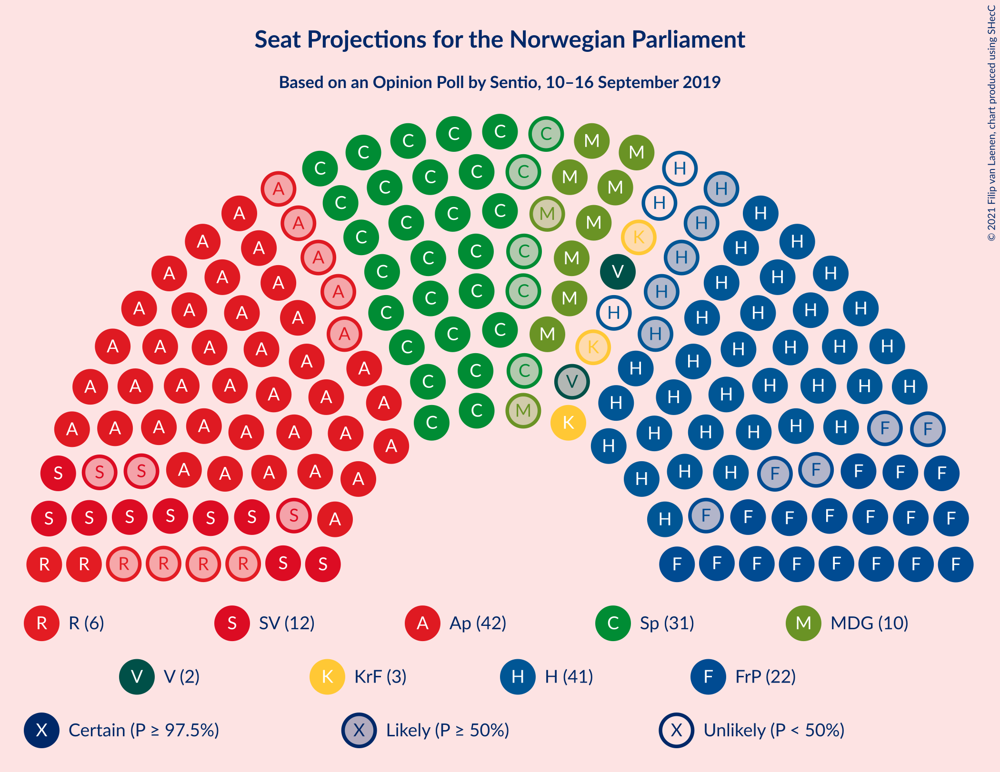
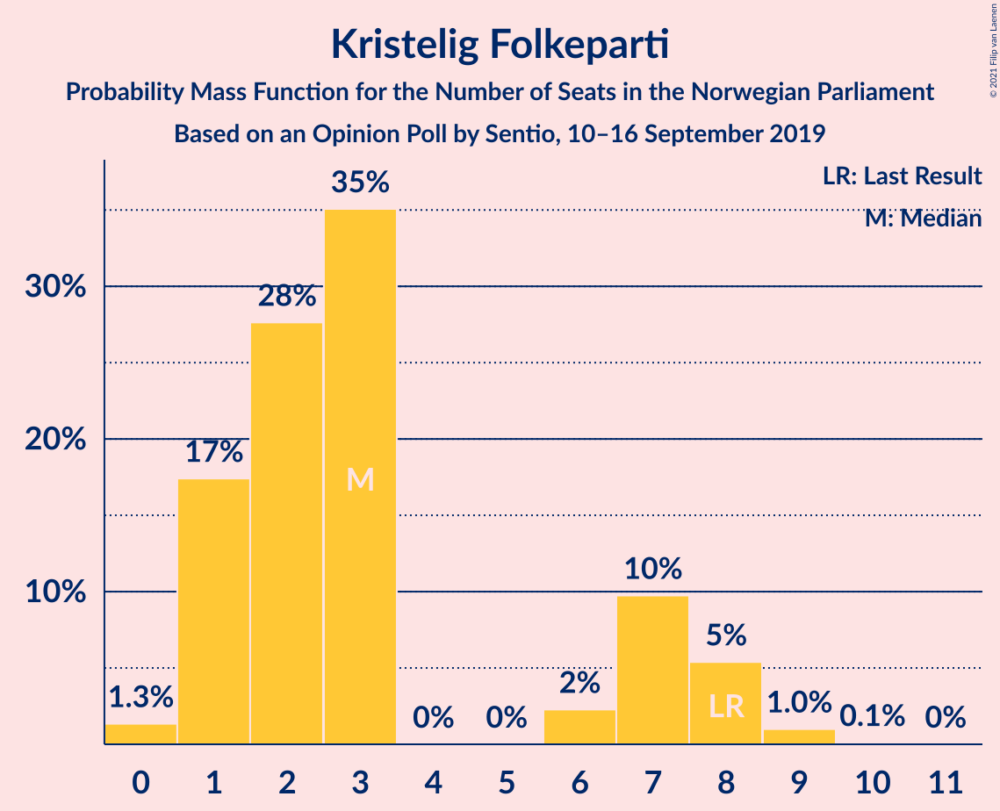
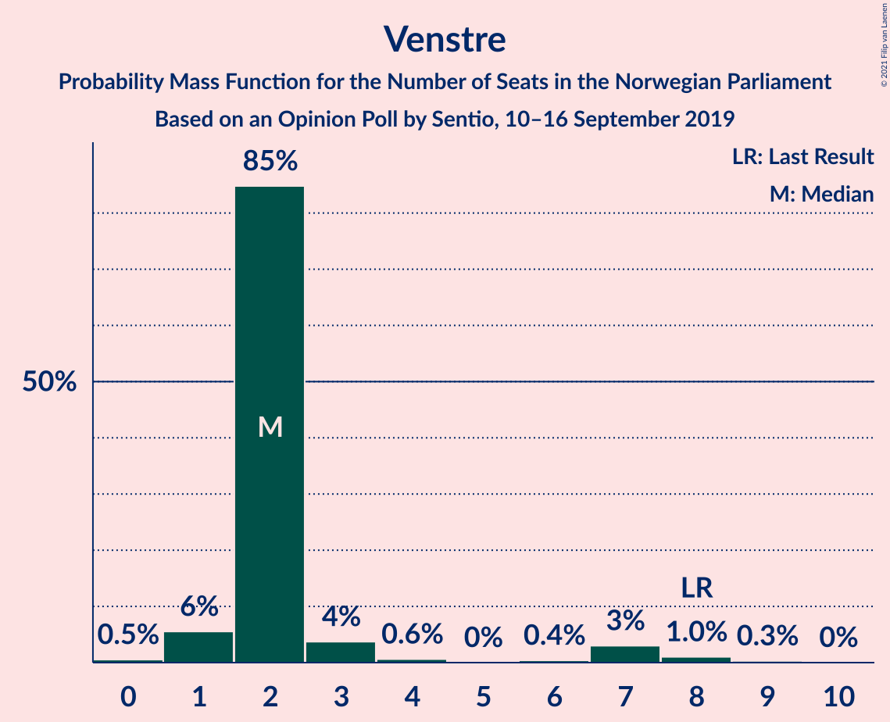
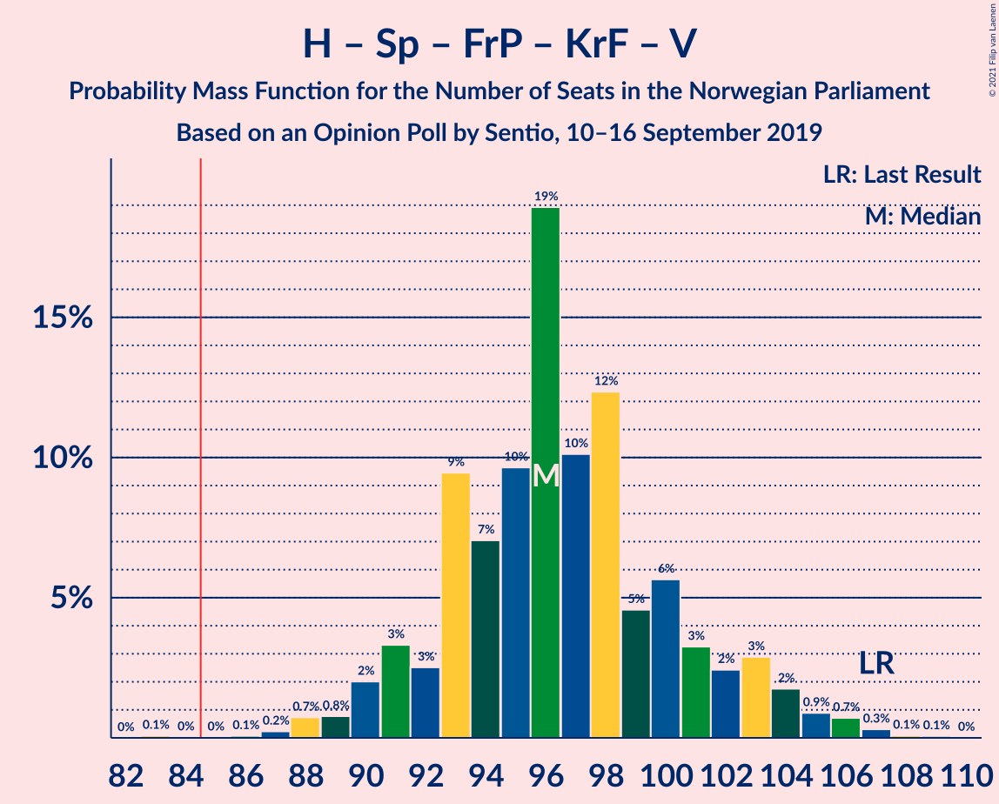
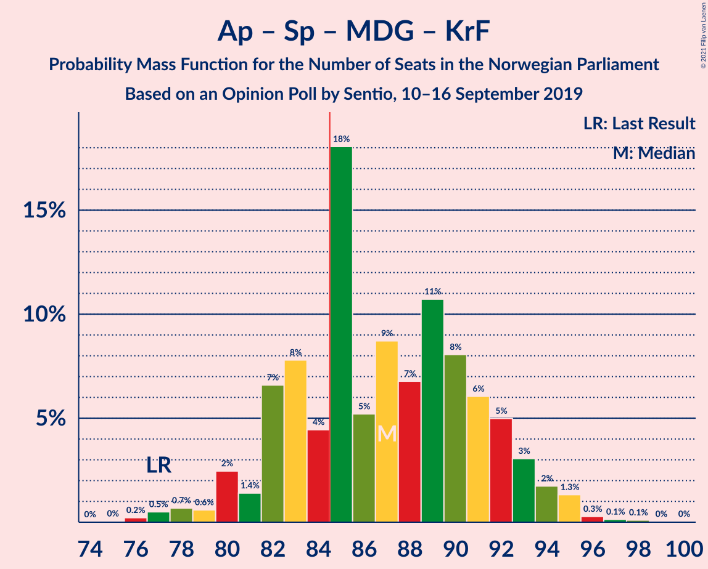
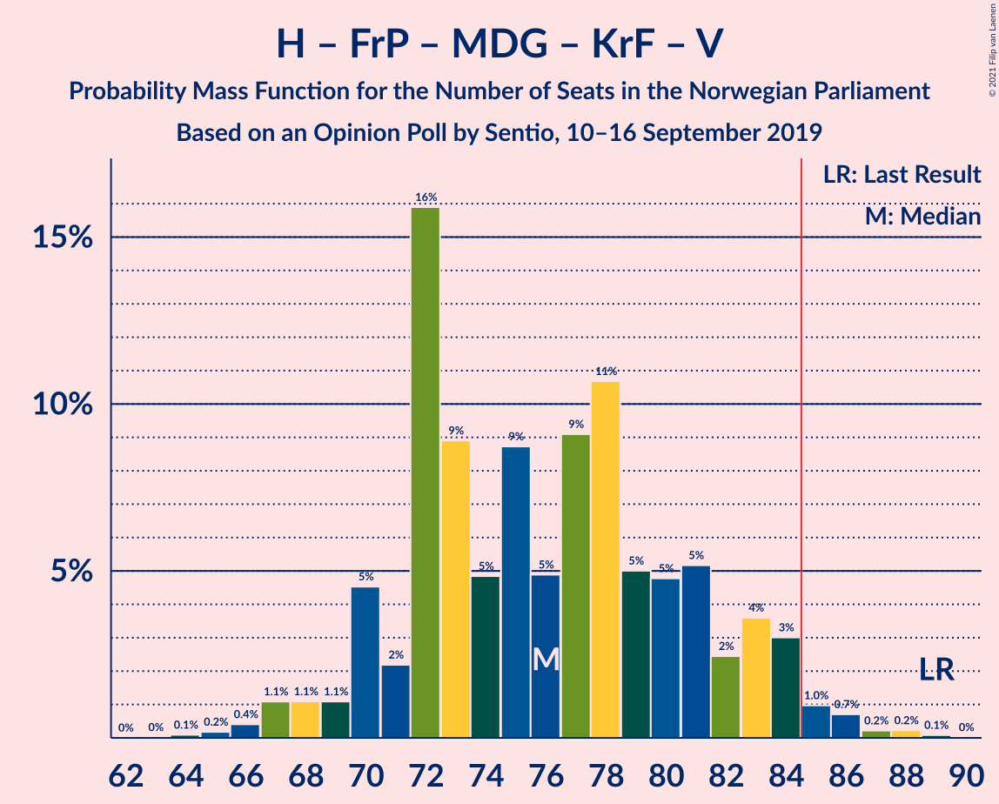
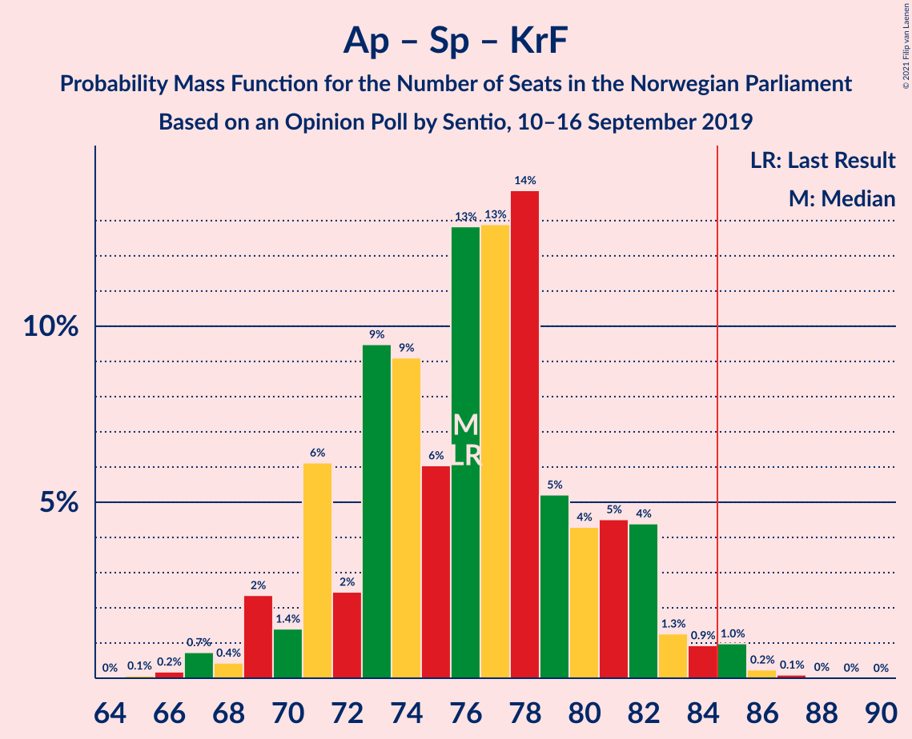
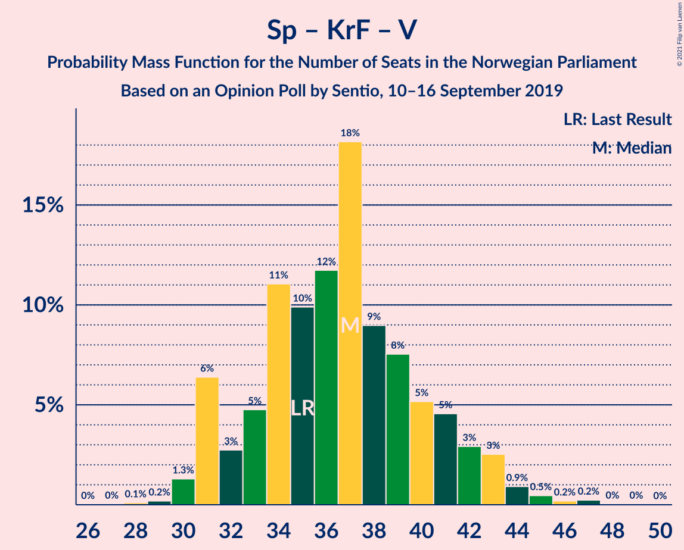

# Opinion Poll by Sentio, 10–16 September 2019

<a href="#voting-intentions">Voting Intentions</a> | <a href="#seats">Seats</a> | <a href="#coalitions">Coalitions</a> | <a href="#technical-information">Technical Information</a>

## Voting Intentions

### Confidence Intervals

| Party | Last Result | Poll Result | 80% Confidence Interval | 90% Confidence Interval | 95% Confidence Interval | 99% Confidence Interval |
|:-----:|:-----------:|:-----------:|:-----------------------:|:-----------------------:|:-----------------------:|:-----------------------:|
| Arbeiderpartiet | 27.4% | 22.6% | 21.0–24.4% |20.5–24.9% |20.1–25.3% |19.3–26.2% |
| Høyre | 25.0% | 21.1% | 19.5–22.8% |19.1–23.3% |18.7–23.7% |17.9–24.6% |
| Senterpartiet | 10.3% | 16.8% | 15.4–18.4% |15.0–18.9% |14.6–19.3% |13.9–20.0% |
| Fremskrittspartiet | 15.2% | 12.4% | 11.1–13.8% |10.8–14.2% |10.5–14.6% |9.9–15.3% |
| Sosialistisk Venstreparti | 6.0% | 6.9% | 6.0–8.0% |5.7–8.4% |5.5–8.7% |5.1–9.2% |
| Miljøpartiet De Grønne | 3.2% | 6.1% | 5.2–7.2% |5.0–7.5% |4.8–7.8% |4.4–8.3% |
| Rødt | 2.4% | 4.0% | 3.3–4.9% |3.1–5.2% |2.9–5.4% |2.7–5.9% |
| Kristelig Folkeparti | 4.2% | 3.4% | 2.8–4.3% |2.6–4.5% |2.4–4.7% |2.2–5.2% |
| Venstre | 4.4% | 3.0% | 2.4–3.8% |2.2–4.1% |2.1–4.3% |1.9–4.7% |

*Note:* The poll result column reflects the actual value used in the calculations. Published results may vary slightly, and in addition be rounded to fewer digits.

## Seats

### Confidence Intervals

| Party | Last Result | Median | 80% Confidence Interval | 90% Confidence Interval | 95% Confidence Interval | 99% Confidence Interval |
|:-----:|:-----------:|:------:|:-----------------------:|:-----------------------:|:-----------------------:|:-----------------------:|
| <a href="#arbeiderpartiet">Arbeiderpartiet</a> | 49 | 41 | 38–45 |38–45 |38–45 |37–49 |
| <a href="#høyre">Høyre</a> | 45 | 38 | 38–41 |34–41 |33–41 |31–44 |
| <a href="#senterpartiet">Senterpartiet</a> | 19 | 30 | 27–32 |27–34 |27–34 |27–37 |
| <a href="#fremskrittspartiet">Fremskrittspartiet</a> | 27 | 24 | 21–27 |18–27 |18–27 |17–27 |
| <a href="#sosialistisk-venstreparti">Sosialistisk Venstreparti</a> | 11 | 14 | 10–15 |10–15 |10–15 |9–15 |
| <a href="#miljøpartiet-de-grønne">Miljøpartiet De Grønne</a> | 1 | 11 | 10–13 |10–13 |9–13 |8–13 |
| <a href="#rødt">Rødt</a> | 1 | 7 | 2–9 |2–9 |2–9 |2–9 |
| <a href="#kristelig-folkeparti">Kristelig Folkeparti</a> | 8 | 2 | 1–7 |0–7 |0–7 |0–8 |
| <a href="#venstre">Venstre</a> | 8 | 2 | 1–2 |1–2 |1–7 |1–9 |

### Arbeiderpartiet

*For a full overview of the results for this party, see the [Arbeiderpartiet](party-arbeiderpartiet.html) page.*

| Number of Seats | Probability | Accumulated | Special Marks |
|:---------------:|:-----------:|:-----------:|:-------------:|
| 33 | 0.1% | 100% |  |
| 34 | 0% | 99.9% |  |
| 35 | 0% | 99.9% |  |
| 36 | 0% | 99.8% |  |
| 37 | 0.5% | 99.8% |  |
| 38 | 30% | 99.4% |  |
| 39 | 0.9% | 70% |  |
| 40 | 5% | 69% |  |
| 41 | 22% | 64% | Median |
| 42 | 0.1% | 42% |  |
| 43 | 12% | 41% |  |
| 44 | 1.5% | 29% |  |
| 45 | 25% | 27% |  |
| 46 | 1.0% | 2% |  |
| 47 | 0% | 1.4% |  |
| 48 | 0% | 1.4% |  |
| 49 | 1.3% | 1.3% | Last Result |
| 50 | 0% | 0% |  |

### Høyre

*For a full overview of the results for this party, see the [Høyre](party-høyre.html) page.*

| Number of Seats | Probability | Accumulated | Special Marks |
|:---------------:|:-----------:|:-----------:|:-------------:|
| 30 | 0.1% | 100% |  |
| 31 | 0.8% | 99.9% |  |
| 32 | 0.2% | 99.1% |  |
| 33 | 3% | 98.9% |  |
| 34 | 0.8% | 96% |  |
| 35 | 0.6% | 95% |  |
| 36 | 1.1% | 94% |  |
| 37 | 0.2% | 93% |  |
| 38 | 46% | 93% | Median |
| 39 | 1.2% | 47% |  |
| 40 | 3% | 46% |  |
| 41 | 41% | 43% |  |
| 42 | 0.9% | 2% |  |
| 43 | 0.5% | 1.0% |  |
| 44 | 0.4% | 0.6% |  |
| 45 | 0.1% | 0.2% | Last Result |
| 46 | 0% | 0% |  |

### Senterpartiet

*For a full overview of the results for this party, see the [Senterpartiet](party-senterpartiet.html) page.*

| Number of Seats | Probability | Accumulated | Special Marks |
|:---------------:|:-----------:|:-----------:|:-------------:|
| 19 | 0% | 100% | Last Result |
| 20 | 0% | 100% |  |
| 21 | 0% | 100% |  |
| 22 | 0% | 100% |  |
| 23 | 0% | 100% |  |
| 24 | 0% | 100% |  |
| 25 | 0.1% | 100% |  |
| 26 | 0.1% | 99.9% |  |
| 27 | 21% | 99.8% |  |
| 28 | 3% | 79% |  |
| 29 | 3% | 77% |  |
| 30 | 26% | 74% | Median |
| 31 | 37% | 48% |  |
| 32 | 2% | 11% |  |
| 33 | 4% | 9% |  |
| 34 | 4% | 5% |  |
| 35 | 0.7% | 2% |  |
| 36 | 0.3% | 0.9% |  |
| 37 | 0.5% | 0.6% |  |
| 38 | 0.1% | 0.1% |  |
| 39 | 0% | 0% |  |

### Fremskrittspartiet

*For a full overview of the results for this party, see the [Fremskrittspartiet](party-fremskrittspartiet.html) page.*

| Number of Seats | Probability | Accumulated | Special Marks |
|:---------------:|:-----------:|:-----------:|:-------------:|
| 16 | 0.5% | 100% |  |
| 17 | 0.3% | 99.5% |  |
| 18 | 7% | 99.2% |  |
| 19 | 0.3% | 92% |  |
| 20 | 2% | 92% |  |
| 21 | 26% | 90% |  |
| 22 | 1.0% | 64% |  |
| 23 | 0.4% | 63% |  |
| 24 | 22% | 63% | Median |
| 25 | 12% | 41% |  |
| 26 | 0.2% | 28% |  |
| 27 | 28% | 28% | Last Result |
| 28 | 0% | 0.1% |  |
| 29 | 0% | 0% |  |

### Sosialistisk Venstreparti

*For a full overview of the results for this party, see the [Sosialistisk Venstreparti](party-sosialistiskvenstreparti.html) page.*

| Number of Seats | Probability | Accumulated | Special Marks |
|:---------------:|:-----------:|:-----------:|:-------------:|
| 7 | 0.1% | 100% |  |
| 8 | 0.2% | 99.9% |  |
| 9 | 0.6% | 99.7% |  |
| 10 | 32% | 99.1% |  |
| 11 | 4% | 67% | Last Result |
| 12 | 2% | 62% |  |
| 13 | 1.4% | 61% |  |
| 14 | 49% | 59% | Median |
| 15 | 10% | 10% |  |
| 16 | 0.2% | 0.4% |  |
| 17 | 0.2% | 0.3% |  |
| 18 | 0% | 0% |  |

### Miljøpartiet De Grønne

*For a full overview of the results for this party, see the [Miljøpartiet De Grønne](party-miljøpartietdegrønne.html) page.*

| Number of Seats | Probability | Accumulated | Special Marks |
|:---------------:|:-----------:|:-----------:|:-------------:|
| 1 | 0% | 100% | Last Result |
| 2 | 0% | 100% |  |
| 3 | 0% | 100% |  |
| 4 | 0% | 100% |  |
| 5 | 0% | 100% |  |
| 6 | 0% | 100% |  |
| 7 | 0% | 100% |  |
| 8 | 2% | 100% |  |
| 9 | 0.8% | 98% |  |
| 10 | 41% | 97% |  |
| 11 | 6% | 56% | Median |
| 12 | 29% | 50% |  |
| 13 | 21% | 21% |  |
| 14 | 0.1% | 0.1% |  |
| 15 | 0% | 0% |  |

### Rødt

*For a full overview of the results for this party, see the [Rødt](party-rødt.html) page.*

| Number of Seats | Probability | Accumulated | Special Marks |
|:---------------:|:-----------:|:-----------:|:-------------:|
| 1 | 0.4% | 100% | Last Result |
| 2 | 45% | 99.6% |  |
| 3 | 0% | 54% |  |
| 4 | 0% | 54% |  |
| 5 | 0% | 54% |  |
| 6 | 3% | 54% |  |
| 7 | 30% | 51% | Median |
| 8 | 0.6% | 22% |  |
| 9 | 21% | 21% |  |
| 10 | 0.1% | 0.1% |  |
| 11 | 0% | 0% |  |

### Kristelig Folkeparti

*For a full overview of the results for this party, see the [Kristelig Folkeparti](party-kristeligfolkeparti.html) page.*

| Number of Seats | Probability | Accumulated | Special Marks |
|:---------------:|:-----------:|:-----------:|:-------------:|
| 0 | 9% | 100% |  |
| 1 | 22% | 91% |  |
| 2 | 30% | 68% | Median |
| 3 | 5% | 38% |  |
| 4 | 0% | 33% |  |
| 5 | 0% | 33% |  |
| 6 | 0.3% | 33% |  |
| 7 | 31% | 33% |  |
| 8 | 1.4% | 1.5% | Last Result |
| 9 | 0.1% | 0.1% |  |
| 10 | 0% | 0% |  |

### Venstre

*For a full overview of the results for this party, see the [Venstre](party-venstre.html) page.*

| Number of Seats | Probability | Accumulated | Special Marks |
|:---------------:|:-----------:|:-----------:|:-------------:|
| 0 | 0.2% | 100% |  |
| 1 | 27% | 99.8% |  |
| 2 | 69% | 73% | Median |
| 3 | 0% | 4% |  |
| 4 | 0% | 4% |  |
| 5 | 0% | 4% |  |
| 6 | 2% | 4% |  |
| 7 | 2% | 3% |  |
| 8 | 0.1% | 0.8% | Last Result |
| 9 | 0.7% | 0.7% |  |
| 10 | 0% | 0% |  |

## Coalitions

### Confidence Intervals

| Coalition | Last Result | Median | Majority? | 80% Confidence Interval | 90% Confidence Interval | 95% Confidence Interval | 99% Confidence Interval |
|:---------:|:-----------:|:------:|:---------:|:-----------------------:|:-----------------------:|:-----------------------:|:-----------------------:|
| Arbeiderpartiet – Senterpartiet – Sosialistisk Venstreparti – Miljøpartiet De Grønne – Rødt | 81 | 102 | 100% | 97–104 | 96–104 | 91–105 | 88–107 |
| Arbeiderpartiet – Senterpartiet – Sosialistisk Venstreparti – Miljøpartiet De Grønne – Kristelig Folkeparti | 88 | 97 | 100% | 96–102 | 96–104 | 90–105 | 89–107 |
| Høyre – Senterpartiet – Fremskrittspartiet – Kristelig Folkeparti – Venstre | 107 | 97 | 100% | 92–103 | 92–103 | 92–103 | 89–107 |
| Arbeiderpartiet – Senterpartiet – Sosialistisk Venstreparti – Miljøpartiet De Grønne | 80 | 95 | 100% | 95–99 | 94–99 | 89–101 | 86–103 |
| Arbeiderpartiet – Senterpartiet – Sosialistisk Venstreparti – Rødt | 80 | 91 | 96% | 85–92 | 85–93 | 83–95 | 78–96 |
| Arbeiderpartiet – Senterpartiet – Miljøpartiet De Grønne – Kristelig Folkeparti | 77 | 83 | 39% | 82–92 | 82–93 | 79–94 | 79–95 |
| Arbeiderpartiet – Senterpartiet – Sosialistisk Venstreparti | 79 | 83 | 41% | 82–89 | 82–89 | 81–91 | 76–93 |
| Høyre – Fremskrittspartiet – Miljøpartiet De Grønne – Kristelig Folkeparti – Venstre | 89 | 78 | 0.1% | 77–84 | 74–84 | 70–84 | 67–84 |
| Arbeiderpartiet – Senterpartiet – Kristelig Folkeparti | 76 | 71 | 0.5% | 69–82 | 69–83 | 69–84 | 69–86 |
| Arbeiderpartiet – Senterpartiet | 68 | 69 | 0% | 68–75 | 68–77 | 68–78 | 66–81 |
| Høyre – Fremskrittspartiet – Kristelig Folkeparti – Venstre | 88 | 67 | 0% | 65–72 | 62–72 | 60–73 | 57–74 |
| Høyre – Fremskrittspartiet – Venstre | 80 | 64 | 0% | 60–70 | 60–70 | 53–70 | 53–71 |
| Høyre – Fremskrittspartiet | 72 | 62 | 0% | 59–68 | 57–68 | 51–68 | 50–68 |
| Arbeiderpartiet – Sosialistisk Venstreparti | 60 | 55 | 0% | 52–58 | 50–58 | 50–59 | 48–61 |
| Høyre – Kristelig Folkeparti – Venstre | 61 | 45 | 0% | 41–46 | 41–49 | 41–50 | 36–51 |
| Senterpartiet – Kristelig Folkeparti – Venstre | 35 | 35 | 0% | 30–39 | 30–42 | 30–43 | 30–44 |

### Arbeiderpartiet – Senterpartiet – Sosialistisk Venstreparti – Miljøpartiet De Grønne – Rødt

| Number of Seats | Probability | Accumulated | Special Marks |
|:---------------:|:-----------:|:-----------:|:-------------:|
| 81 | 0% | 100% | Last Result |
| 82 | 0% | 100% |  |
| 83 | 0% | 100% |  |
| 84 | 0% | 100% |  |
| 85 | 0% | 100% | Majority |
| 86 | 0% | 100% |  |
| 87 | 0% | 100% |  |
| 88 | 2% | 100% |  |
| 89 | 0% | 98% |  |
| 90 | 0% | 98% |  |
| 91 | 1.3% | 98% |  |
| 92 | 0% | 97% |  |
| 93 | 0.2% | 97% |  |
| 94 | 0.5% | 97% |  |
| 95 | 0.4% | 96% |  |
| 96 | 1.0% | 96% |  |
| 97 | 29% | 95% |  |
| 98 | 0.4% | 66% |  |
| 99 | 0.1% | 66% |  |
| 100 | 0.4% | 65% |  |
| 101 | 13% | 65% |  |
| 102 | 25% | 52% |  |
| 103 | 4% | 28% | Median |
| 104 | 21% | 24% |  |
| 105 | 1.3% | 3% |  |
| 106 | 0.1% | 2% |  |
| 107 | 1.2% | 1.5% |  |
| 108 | 0.3% | 0.3% |  |
| 109 | 0% | 0% |  |

### Arbeiderpartiet – Senterpartiet – Sosialistisk Venstreparti – Miljøpartiet De Grønne – Kristelig Folkeparti

| Number of Seats | Probability | Accumulated | Special Marks |
|:---------------:|:-----------:|:-----------:|:-------------:|
| 88 | 0% | 100% | Last Result |
| 89 | 2% | 100% |  |
| 90 | 1.3% | 98% |  |
| 91 | 0% | 97% |  |
| 92 | 0% | 97% |  |
| 93 | 0.1% | 97% |  |
| 94 | 0.6% | 97% |  |
| 95 | 0.3% | 96% |  |
| 96 | 21% | 96% |  |
| 97 | 28% | 75% |  |
| 98 | 0.8% | 47% | Median |
| 99 | 10% | 46% |  |
| 100 | 1.1% | 37% |  |
| 101 | 4% | 35% |  |
| 102 | 26% | 31% |  |
| 103 | 0.2% | 6% |  |
| 104 | 3% | 5% |  |
| 105 | 2% | 3% |  |
| 106 | 0% | 0.8% |  |
| 107 | 0.3% | 0.7% |  |
| 108 | 0.5% | 0.5% |  |
| 109 | 0% | 0% |  |

### Høyre – Senterpartiet – Fremskrittspartiet – Kristelig Folkeparti – Venstre

| Number of Seats | Probability | Accumulated | Special Marks |
|:---------------:|:-----------:|:-----------:|:-------------:|
| 87 | 0% | 100% |  |
| 88 | 0% | 99.9% |  |
| 89 | 0.7% | 99.9% |  |
| 90 | 1.0% | 99.2% |  |
| 91 | 0.1% | 98% |  |
| 92 | 21% | 98% |  |
| 93 | 0.1% | 77% |  |
| 94 | 3% | 77% |  |
| 95 | 0.6% | 74% |  |
| 96 | 1.4% | 73% | Median |
| 97 | 25% | 72% |  |
| 98 | 0.2% | 46% |  |
| 99 | 9% | 46% |  |
| 100 | 1.3% | 37% |  |
| 101 | 4% | 36% |  |
| 102 | 3% | 32% |  |
| 103 | 28% | 29% |  |
| 104 | 0% | 1.2% |  |
| 105 | 0% | 1.2% |  |
| 106 | 0.2% | 1.1% |  |
| 107 | 0.9% | 0.9% | Last Result |
| 108 | 0.1% | 0.1% |  |
| 109 | 0% | 0% |  |

### Arbeiderpartiet – Senterpartiet – Sosialistisk Venstreparti – Miljøpartiet De Grønne

| Number of Seats | Probability | Accumulated | Special Marks |
|:---------------:|:-----------:|:-----------:|:-------------:|
| 80 | 0% | 100% | Last Result |
| 81 | 0% | 100% |  |
| 82 | 0% | 100% |  |
| 83 | 0% | 100% |  |
| 84 | 0% | 100% |  |
| 85 | 0% | 100% | Majority |
| 86 | 2% | 100% |  |
| 87 | 0% | 98% |  |
| 88 | 0.1% | 98% |  |
| 89 | 2% | 98% |  |
| 90 | 0.2% | 97% |  |
| 91 | 0.1% | 97% |  |
| 92 | 0.9% | 96% |  |
| 93 | 0.3% | 96% |  |
| 94 | 5% | 95% |  |
| 95 | 74% | 90% |  |
| 96 | 1.1% | 17% | Median |
| 97 | 3% | 16% |  |
| 98 | 0.1% | 13% |  |
| 99 | 9% | 13% |  |
| 100 | 1.2% | 4% |  |
| 101 | 0.3% | 3% |  |
| 102 | 0.5% | 2% |  |
| 103 | 1.3% | 2% |  |
| 104 | 0% | 0.5% |  |
| 105 | 0.5% | 0.5% |  |
| 106 | 0% | 0% |  |

### Arbeiderpartiet – Senterpartiet – Sosialistisk Venstreparti – Rødt

| Number of Seats | Probability | Accumulated | Special Marks |
|:---------------:|:-----------:|:-----------:|:-------------:|
| 78 | 2% | 100% |  |
| 79 | 0% | 98% |  |
| 80 | 0% | 98% | Last Result |
| 81 | 0% | 98% |  |
| 82 | 0% | 98% |  |
| 83 | 1.5% | 98% |  |
| 84 | 0.4% | 97% |  |
| 85 | 28% | 96% | Majority |
| 86 | 2% | 68% |  |
| 87 | 0.3% | 66% |  |
| 88 | 0.5% | 66% |  |
| 89 | 0.1% | 65% |  |
| 90 | 4% | 65% |  |
| 91 | 29% | 61% |  |
| 92 | 25% | 32% | Median |
| 93 | 4% | 7% |  |
| 94 | 0.1% | 3% |  |
| 95 | 2% | 3% |  |
| 96 | 0.5% | 0.6% |  |
| 97 | 0% | 0% |  |

### Arbeiderpartiet – Senterpartiet – Miljøpartiet De Grønne – Kristelig Folkeparti

| Number of Seats | Probability | Accumulated | Special Marks |
|:---------------:|:-----------:|:-----------:|:-------------:|
| 77 | 0% | 100% | Last Result |
| 78 | 0% | 100% |  |
| 79 | 3% | 100% |  |
| 80 | 0.5% | 97% |  |
| 81 | 0.1% | 97% |  |
| 82 | 21% | 96% |  |
| 83 | 28% | 76% |  |
| 84 | 9% | 47% | Median |
| 85 | 0.9% | 39% | Majority |
| 86 | 0.2% | 38% |  |
| 87 | 1.0% | 37% |  |
| 88 | 1.0% | 36% |  |
| 89 | 0.4% | 35% |  |
| 90 | 0.7% | 35% |  |
| 91 | 5% | 34% |  |
| 92 | 24% | 30% |  |
| 93 | 1.4% | 5% |  |
| 94 | 3% | 4% |  |
| 95 | 0.5% | 0.5% |  |
| 96 | 0% | 0% |  |

### Arbeiderpartiet – Senterpartiet – Sosialistisk Venstreparti

| Number of Seats | Probability | Accumulated | Special Marks |
|:---------------:|:-----------:|:-----------:|:-------------:|
| 76 | 2% | 100% |  |
| 77 | 0% | 98% |  |
| 78 | 0.2% | 98% |  |
| 79 | 0.4% | 98% | Last Result |
| 80 | 0% | 98% |  |
| 81 | 2% | 98% |  |
| 82 | 21% | 96% |  |
| 83 | 32% | 75% |  |
| 84 | 2% | 43% |  |
| 85 | 24% | 41% | Median, Majority |
| 86 | 2% | 17% |  |
| 87 | 3% | 15% |  |
| 88 | 1.0% | 13% |  |
| 89 | 9% | 12% |  |
| 90 | 0.2% | 3% |  |
| 91 | 0.8% | 3% |  |
| 92 | 0% | 2% |  |
| 93 | 2% | 2% |  |
| 94 | 0.5% | 0.5% |  |
| 95 | 0% | 0% |  |

### Høyre – Fremskrittspartiet – Miljøpartiet De Grønne – Kristelig Folkeparti – Venstre

| Number of Seats | Probability | Accumulated | Special Marks |
|:---------------:|:-----------:|:-----------:|:-------------:|
| 66 | 0.5% | 100% |  |
| 67 | 0.3% | 99.5% |  |
| 68 | 0.2% | 99.3% |  |
| 69 | 0% | 99.1% |  |
| 70 | 3% | 99.1% |  |
| 71 | 0.4% | 96% |  |
| 72 | 0.1% | 95% |  |
| 73 | 0.1% | 95% |  |
| 74 | 2% | 95% |  |
| 75 | 0.2% | 93% |  |
| 76 | 0.6% | 92% |  |
| 77 | 25% | 92% | Median |
| 78 | 29% | 67% |  |
| 79 | 5% | 37% |  |
| 80 | 0.1% | 32% |  |
| 81 | 0% | 32% |  |
| 82 | 0.3% | 32% |  |
| 83 | 2% | 32% |  |
| 84 | 30% | 30% |  |
| 85 | 0% | 0.1% | Majority |
| 86 | 0% | 0% |  |
| 87 | 0% | 0% |  |
| 88 | 0% | 0% |  |
| 89 | 0% | 0% | Last Result |

### Arbeiderpartiet – Senterpartiet – Kristelig Folkeparti

| Number of Seats | Probability | Accumulated | Special Marks |
|:---------------:|:-----------:|:-----------:|:-------------:|
| 66 | 0.1% | 100% |  |
| 67 | 0.3% | 99.9% |  |
| 68 | 0% | 99.6% |  |
| 69 | 22% | 99.6% |  |
| 70 | 0.4% | 77% |  |
| 71 | 29% | 77% |  |
| 72 | 0.2% | 48% |  |
| 73 | 1.0% | 48% | Median |
| 74 | 9% | 47% |  |
| 75 | 0.2% | 38% |  |
| 76 | 0.9% | 38% | Last Result |
| 77 | 0.4% | 37% |  |
| 78 | 0.8% | 36% |  |
| 79 | 0.4% | 35% |  |
| 80 | 4% | 35% |  |
| 81 | 1.1% | 31% |  |
| 82 | 24% | 30% |  |
| 83 | 1.5% | 5% |  |
| 84 | 3% | 4% |  |
| 85 | 0% | 0.5% | Majority |
| 86 | 0.5% | 0.5% |  |
| 87 | 0% | 0% |  |

### Arbeiderpartiet – Senterpartiet

| Number of Seats | Probability | Accumulated | Special Marks |
|:---------------:|:-----------:|:-----------:|:-------------:|
| 63 | 0.1% | 100% |  |
| 64 | 0% | 99.9% |  |
| 65 | 0.3% | 99.9% |  |
| 66 | 2% | 99.6% |  |
| 67 | 0.1% | 98% |  |
| 68 | 21% | 98% | Last Result |
| 69 | 28% | 77% |  |
| 70 | 1.4% | 49% |  |
| 71 | 0.5% | 47% | Median |
| 72 | 0.3% | 47% |  |
| 73 | 6% | 47% |  |
| 74 | 9% | 40% |  |
| 75 | 25% | 31% |  |
| 76 | 0.4% | 6% |  |
| 77 | 3% | 5% |  |
| 78 | 0.4% | 3% |  |
| 79 | 0.2% | 2% |  |
| 80 | 0.3% | 2% |  |
| 81 | 2% | 2% |  |
| 82 | 0% | 0% |  |

### Høyre – Fremskrittspartiet – Kristelig Folkeparti – Venstre

| Number of Seats | Probability | Accumulated | Special Marks |
|:---------------:|:-----------:|:-----------:|:-------------:|
| 55 | 0.5% | 100% |  |
| 56 | 0% | 99.5% |  |
| 57 | 0% | 99.5% |  |
| 58 | 0.2% | 99.5% |  |
| 59 | 0.2% | 99.3% |  |
| 60 | 3% | 99.1% |  |
| 61 | 0.3% | 96% |  |
| 62 | 0.9% | 95% |  |
| 63 | 0.4% | 94% |  |
| 64 | 2% | 94% |  |
| 65 | 21% | 92% |  |
| 66 | 0% | 71% | Median |
| 67 | 25% | 71% |  |
| 68 | 13% | 46% |  |
| 69 | 0.3% | 33% |  |
| 70 | 0.1% | 33% |  |
| 71 | 1.3% | 33% |  |
| 72 | 29% | 32% |  |
| 73 | 0.9% | 3% |  |
| 74 | 2% | 2% |  |
| 75 | 0% | 0.1% |  |
| 76 | 0.1% | 0.1% |  |
| 77 | 0% | 0% |  |
| 78 | 0% | 0% |  |
| 79 | 0% | 0% |  |
| 80 | 0% | 0% |  |
| 81 | 0% | 0% |  |
| 82 | 0% | 0% |  |
| 83 | 0% | 0% |  |
| 84 | 0% | 0% |  |
| 85 | 0% | 0% | Majority |
| 86 | 0% | 0% |  |
| 87 | 0% | 0% |  |
| 88 | 0% | 0% | Last Result |

### Høyre – Fremskrittspartiet – Venstre

| Number of Seats | Probability | Accumulated | Special Marks |
|:---------------:|:-----------:|:-----------:|:-------------:|
| 52 | 0.5% | 100% |  |
| 53 | 3% | 99.5% |  |
| 54 | 0.1% | 97% |  |
| 55 | 0.1% | 97% |  |
| 56 | 0.4% | 96% |  |
| 57 | 0.8% | 96% |  |
| 58 | 0% | 95% |  |
| 59 | 0.2% | 95% |  |
| 60 | 25% | 95% |  |
| 61 | 4% | 70% |  |
| 62 | 3% | 66% |  |
| 63 | 0% | 64% |  |
| 64 | 21% | 63% | Median |
| 65 | 1.4% | 43% |  |
| 66 | 0.6% | 41% |  |
| 67 | 0.4% | 41% |  |
| 68 | 9% | 40% |  |
| 69 | 0.8% | 32% |  |
| 70 | 29% | 31% |  |
| 71 | 2% | 2% |  |
| 72 | 0% | 0% |  |
| 73 | 0% | 0% |  |
| 74 | 0% | 0% |  |
| 75 | 0% | 0% |  |
| 76 | 0% | 0% |  |
| 77 | 0% | 0% |  |
| 78 | 0% | 0% |  |
| 79 | 0% | 0% |  |
| 80 | 0% | 0% | Last Result |

### Høyre – Fremskrittspartiet

| Number of Seats | Probability | Accumulated | Special Marks |
|:---------------:|:-----------:|:-----------:|:-------------:|
| 50 | 0.5% | 100% |  |
| 51 | 3% | 99.5% |  |
| 52 | 0.3% | 97% |  |
| 53 | 0.1% | 97% |  |
| 54 | 0.4% | 96% |  |
| 55 | 0.8% | 96% |  |
| 56 | 0.1% | 95% |  |
| 57 | 0.2% | 95% |  |
| 58 | 0.2% | 95% |  |
| 59 | 29% | 95% |  |
| 60 | 4% | 66% |  |
| 61 | 0% | 62% |  |
| 62 | 21% | 62% | Median |
| 63 | 2% | 42% |  |
| 64 | 2% | 40% |  |
| 65 | 2% | 38% |  |
| 66 | 9% | 37% |  |
| 67 | 0% | 28% |  |
| 68 | 28% | 28% |  |
| 69 | 0% | 0% |  |
| 70 | 0% | 0% |  |
| 71 | 0% | 0% |  |
| 72 | 0% | 0% | Last Result |

### Arbeiderpartiet – Sosialistisk Venstreparti

| Number of Seats | Probability | Accumulated | Special Marks |
|:---------------:|:-----------:|:-----------:|:-------------:|
| 47 | 0.1% | 100% |  |
| 48 | 2% | 99.8% |  |
| 49 | 0.2% | 98% |  |
| 50 | 5% | 98% |  |
| 51 | 0.6% | 93% |  |
| 52 | 30% | 92% |  |
| 53 | 3% | 62% |  |
| 54 | 0.8% | 60% |  |
| 55 | 45% | 59% | Median |
| 56 | 0.7% | 14% |  |
| 57 | 2% | 13% |  |
| 58 | 9% | 11% |  |
| 59 | 0.6% | 3% |  |
| 60 | 0.7% | 2% | Last Result |
| 61 | 1.3% | 1.3% |  |
| 62 | 0% | 0% |  |

### Høyre – Kristelig Folkeparti – Venstre

| Number of Seats | Probability | Accumulated | Special Marks |
|:---------------:|:-----------:|:-----------:|:-------------:|
| 36 | 0.8% | 100% |  |
| 37 | 0.5% | 99.2% |  |
| 38 | 0.3% | 98.7% |  |
| 39 | 0.5% | 98% |  |
| 40 | 0.4% | 98% |  |
| 41 | 22% | 98% |  |
| 42 | 3% | 76% | Median |
| 43 | 9% | 73% |  |
| 44 | 2% | 64% |  |
| 45 | 28% | 63% |  |
| 46 | 26% | 35% |  |
| 47 | 0.2% | 9% |  |
| 48 | 2% | 9% |  |
| 49 | 2% | 7% |  |
| 50 | 4% | 5% |  |
| 51 | 0.9% | 1.0% |  |
| 52 | 0% | 0.1% |  |
| 53 | 0% | 0.1% |  |
| 54 | 0% | 0% |  |
| 55 | 0% | 0% |  |
| 56 | 0% | 0% |  |
| 57 | 0% | 0% |  |
| 58 | 0% | 0% |  |
| 59 | 0% | 0% |  |
| 60 | 0% | 0% |  |
| 61 | 0% | 0% | Last Result |

### Senterpartiet – Kristelig Folkeparti – Venstre

| Number of Seats | Probability | Accumulated | Special Marks |
|:---------------:|:-----------:|:-----------:|:-------------:|
| 29 | 0% | 100% |  |
| 30 | 21% | 99.9% |  |
| 31 | 0.3% | 79% |  |
| 32 | 0.1% | 78% |  |
| 33 | 9% | 78% |  |
| 34 | 1.1% | 69% | Median |
| 35 | 28% | 68% | Last Result |
| 36 | 1.4% | 40% |  |
| 37 | 4% | 39% |  |
| 38 | 25% | 35% |  |
| 39 | 0.4% | 10% |  |
| 40 | 0.3% | 10% |  |
| 41 | 0.1% | 10% |  |
| 42 | 5% | 10% |  |
| 43 | 4% | 4% |  |
| 44 | 0.2% | 0.5% |  |
| 45 | 0% | 0.4% |  |
| 46 | 0.2% | 0.3% |  |
| 47 | 0.1% | 0.2% |  |
| 48 | 0% | 0.1% |  |
| 49 | 0% | 0.1% |  |
| 50 | 0% | 0% |  |

## Technical Information

### Opinion Poll

+ **Polling firm:** Sentio
+ **Commissioner(s):** —
+ **Fieldwork period:** 10–16 September 2019

### Calculations

+ **Sample size:** 1000
+ **Simulations done:** 8,192
+ **Error estimate:** 3.83%

