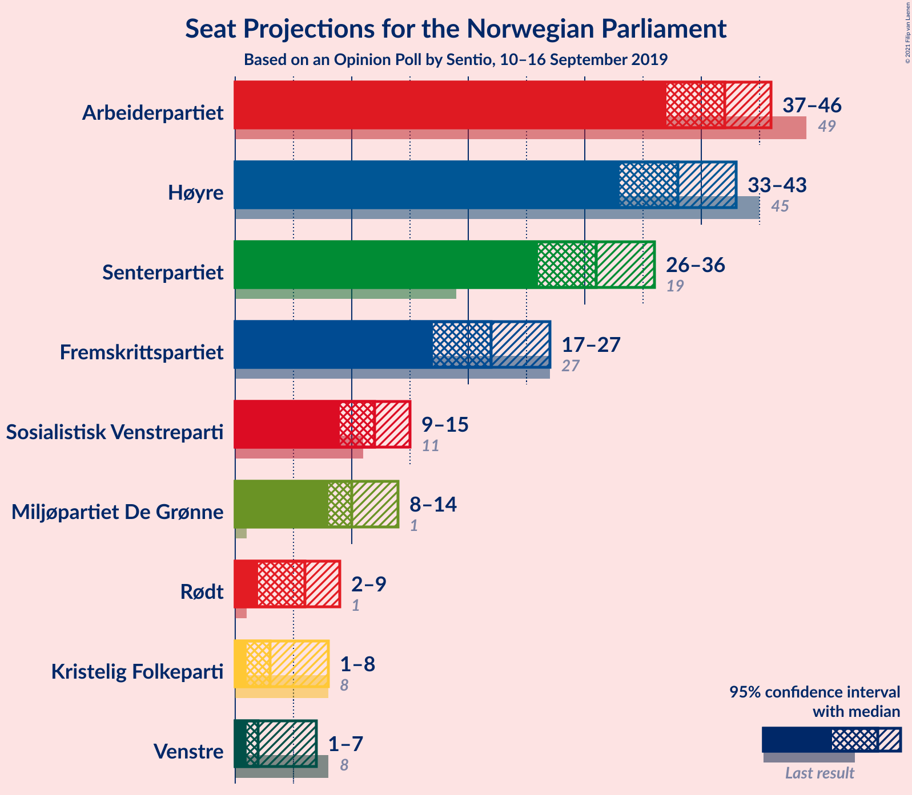
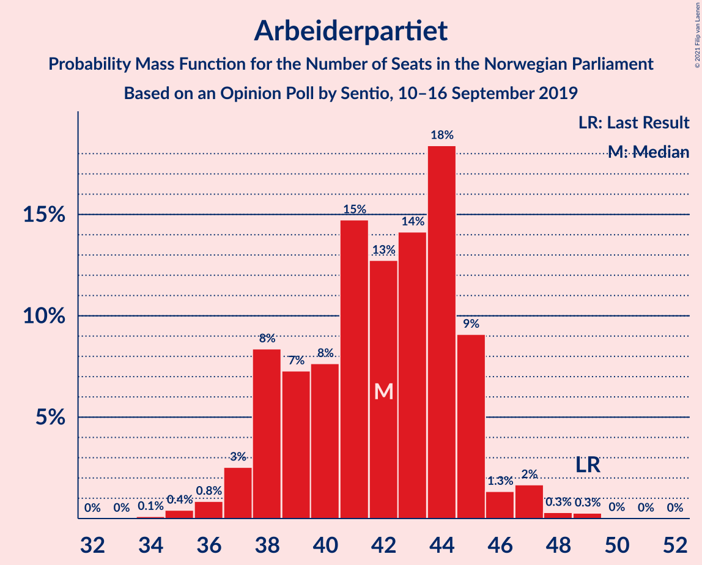
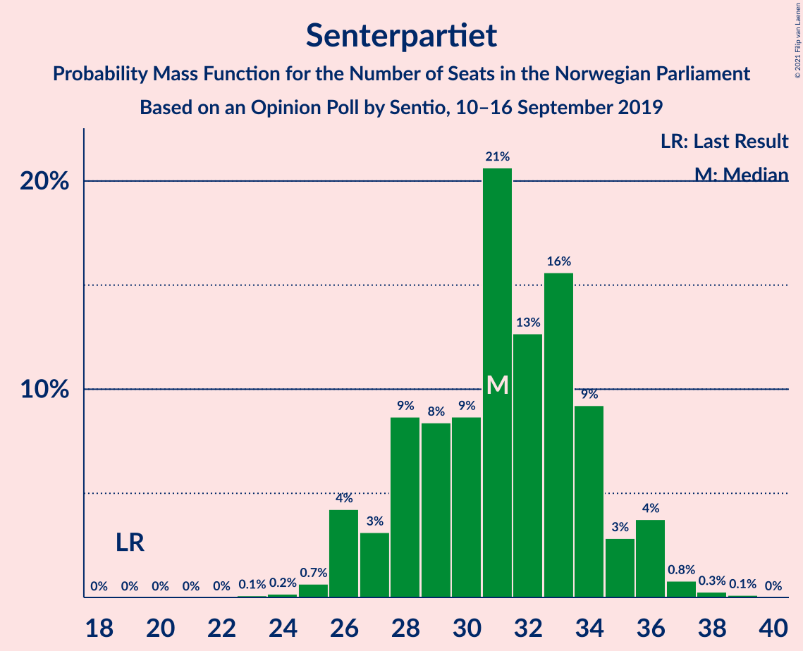
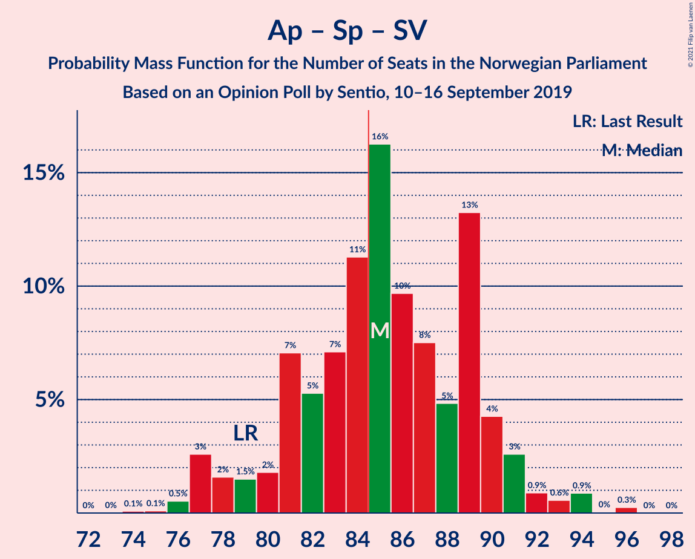
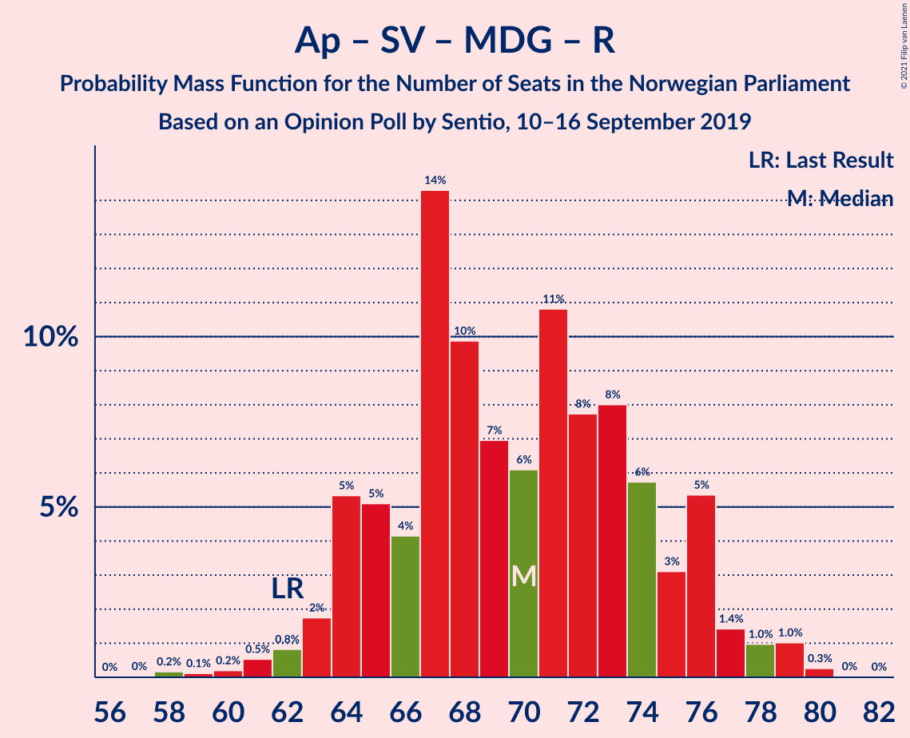
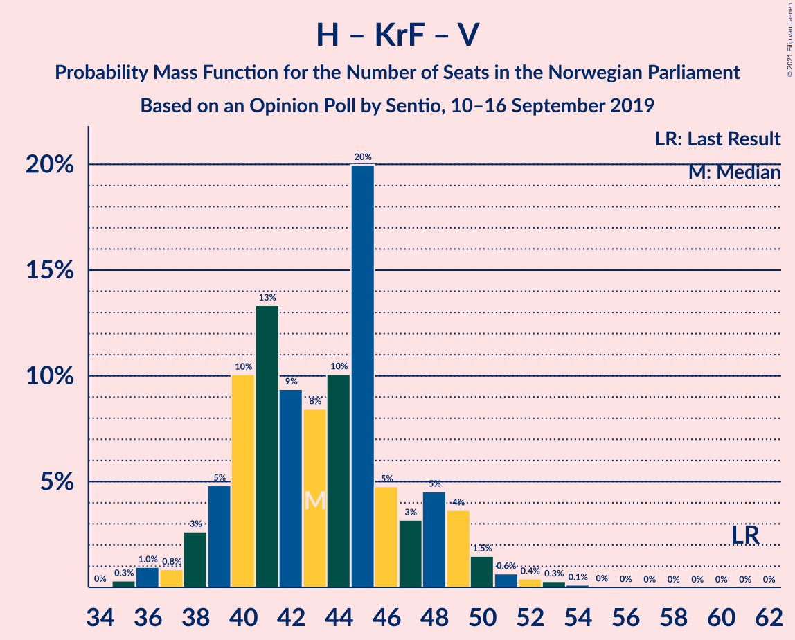

# Opinion Poll by Sentio, 10–16 September 2019

<a href="#voting-intentions">Voting Intentions</a> | <a href="#seats">Seats</a> | <a href="#coalitions">Coalitions</a> | <a href="#technical-information">Technical Information</a>

## Voting Intentions

### Confidence Intervals

| Party | Last Result | Poll Result | 80% Confidence Interval | 90% Confidence Interval | 95% Confidence Interval | 99% Confidence Interval |
|:-----:|:-----------:|:-----------:|:-----------------------:|:-----------------------:|:-----------------------:|:-----------------------:|
| Arbeiderpartiet | 27.4% | 22.6% | 21.0–24.4% |20.5–24.9% |20.1–25.3% |19.3–26.2% |
| Høyre | 25.0% | 21.1% | 19.5–22.8% |19.1–23.3% |18.7–23.7% |17.9–24.6% |
| Senterpartiet | 10.3% | 16.8% | 15.4–18.4% |15.0–18.9% |14.6–19.3% |13.9–20.0% |
| Fremskrittspartiet | 15.2% | 12.4% | 11.1–13.8% |10.8–14.2% |10.5–14.6% |9.9–15.3% |
| Sosialistisk Venstreparti | 6.0% | 6.9% | 6.0–8.0% |5.7–8.4% |5.5–8.7% |5.1–9.2% |
| Miljøpartiet De Grønne | 3.2% | 6.1% | 5.2–7.2% |5.0–7.5% |4.8–7.8% |4.4–8.3% |
| Rødt | 2.4% | 4.0% | 3.3–4.9% |3.1–5.2% |2.9–5.4% |2.7–5.9% |
| Kristelig Folkeparti | 4.2% | 3.4% | 2.8–4.3% |2.6–4.5% |2.4–4.7% |2.2–5.2% |
| Venstre | 4.4% | 3.0% | 2.4–3.8% |2.2–4.1% |2.1–4.3% |1.9–4.7% |

*Note:* The poll result column reflects the actual value used in the calculations. Published results may vary slightly, and in addition be rounded to fewer digits.

## Seats

### Confidence Intervals

| Party | Last Result | Median | 80% Confidence Interval | 90% Confidence Interval | 95% Confidence Interval | 99% Confidence Interval |
|:-----:|:-----------:|:------:|:-----------------------:|:-----------------------:|:-----------------------:|:-----------------------:|
| <a href="#arbeiderpartiet">Arbeiderpartiet</a> | 49 | 42 | 38–45 |38–45 |37–46 |35–48 |
| <a href="#høyre">Høyre</a> | 45 | 38 | 34–41 |33–42 |33–43 |31–45 |
| <a href="#senterpartiet">Senterpartiet</a> | 19 | 31 | 28–34 |26–35 |26–36 |25–37 |
| <a href="#fremskrittspartiet">Fremskrittspartiet</a> | 27 | 22 | 18–25 |18–26 |17–27 |17–28 |
| <a href="#sosialistisk-venstreparti">Sosialistisk Venstreparti</a> | 11 | 12 | 10–14 |9–15 |9–15 |8–17 |
| <a href="#miljøpartiet-de-grønne">Miljøpartiet De Grønne</a> | 1 | 10 | 8–13 |8–14 |8–14 |7–15 |
| <a href="#rødt">Rødt</a> | 1 | 6 | 2–8 |2–9 |2–9 |1–10 |
| <a href="#kristelig-folkeparti">Kristelig Folkeparti</a> | 8 | 3 | 1–7 |1–8 |1–8 |0–9 |
| <a href="#venstre">Venstre</a> | 8 | 2 | 2 |1–4 |1–7 |0–8 |

### Arbeiderpartiet

*For a full overview of the results for this party, see the [Arbeiderpartiet](party-arbeiderpartiet.html) page.*

| Number of Seats | Probability | Accumulated | Special Marks |
|:---------------:|:-----------:|:-----------:|:-------------:|
| 34 | 0.1% | 100% |  |
| 35 | 0.4% | 99.9% |  |
| 36 | 0.8% | 99.5% |  |
| 37 | 3% | 98.6% |  |
| 38 | 8% | 96% |  |
| 39 | 7% | 88% |  |
| 40 | 8% | 80% |  |
| 41 | 15% | 73% |  |
| 42 | 13% | 58% | Median |
| 43 | 14% | 45% |  |
| 44 | 18% | 31% |  |
| 45 | 9% | 13% |  |
| 46 | 1.3% | 4% |  |
| 47 | 2% | 2% |  |
| 48 | 0.3% | 0.7% |  |
| 49 | 0.3% | 0.4% | Last Result |
| 50 | 0% | 0.1% |  |
| 51 | 0% | 0% |  |

### Høyre

*For a full overview of the results for this party, see the [Høyre](party-høyre.html) page.*

| Number of Seats | Probability | Accumulated | Special Marks |
|:---------------:|:-----------:|:-----------:|:-------------:|
| 30 | 0.1% | 100% |  |
| 31 | 0.6% | 99.9% |  |
| 32 | 0.8% | 99.2% |  |
| 33 | 4% | 98% |  |
| 34 | 4% | 94% |  |
| 35 | 12% | 90% |  |
| 36 | 11% | 78% |  |
| 37 | 13% | 67% |  |
| 38 | 11% | 54% | Median |
| 39 | 10% | 44% |  |
| 40 | 9% | 33% |  |
| 41 | 17% | 24% |  |
| 42 | 2% | 7% |  |
| 43 | 4% | 5% |  |
| 44 | 0.7% | 1.4% |  |
| 45 | 0.5% | 0.6% | Last Result |
| 46 | 0.1% | 0.1% |  |
| 47 | 0% | 0% |  |

### Senterpartiet

*For a full overview of the results for this party, see the [Senterpartiet](party-senterpartiet.html) page.*

| Number of Seats | Probability | Accumulated | Special Marks |
|:---------------:|:-----------:|:-----------:|:-------------:|
| 19 | 0% | 100% | Last Result |
| 20 | 0% | 100% |  |
| 21 | 0% | 100% |  |
| 22 | 0% | 100% |  |
| 23 | 0.1% | 100% |  |
| 24 | 0.2% | 99.9% |  |
| 25 | 0.7% | 99.7% |  |
| 26 | 4% | 99.1% |  |
| 27 | 3% | 95% |  |
| 28 | 9% | 92% |  |
| 29 | 8% | 83% |  |
| 30 | 9% | 75% |  |
| 31 | 21% | 66% | Median |
| 32 | 13% | 45% |  |
| 33 | 16% | 33% |  |
| 34 | 9% | 17% |  |
| 35 | 3% | 8% |  |
| 36 | 4% | 5% |  |
| 37 | 0.8% | 1.2% |  |
| 38 | 0.3% | 0.4% |  |
| 39 | 0.1% | 0.1% |  |
| 40 | 0% | 0% |  |

### Fremskrittspartiet

*For a full overview of the results for this party, see the [Fremskrittspartiet](party-fremskrittspartiet.html) page.*

| Number of Seats | Probability | Accumulated | Special Marks |
|:---------------:|:-----------:|:-----------:|:-------------:|
| 15 | 0.1% | 100% |  |
| 16 | 0.4% | 99.9% |  |
| 17 | 3% | 99.5% |  |
| 18 | 10% | 96% |  |
| 19 | 6% | 86% |  |
| 20 | 9% | 80% |  |
| 21 | 11% | 71% |  |
| 22 | 13% | 60% | Median |
| 23 | 15% | 47% |  |
| 24 | 18% | 32% |  |
| 25 | 6% | 14% |  |
| 26 | 5% | 8% |  |
| 27 | 2% | 3% | Last Result |
| 28 | 0.7% | 1.0% |  |
| 29 | 0.2% | 0.2% |  |
| 30 | 0% | 0.1% |  |
| 31 | 0% | 0% |  |

### Sosialistisk Venstreparti

*For a full overview of the results for this party, see the [Sosialistisk Venstreparti](party-sosialistiskvenstreparti.html) page.*

| Number of Seats | Probability | Accumulated | Special Marks |
|:---------------:|:-----------:|:-----------:|:-------------:|
| 7 | 0.1% | 100% |  |
| 8 | 0.8% | 99.9% |  |
| 9 | 7% | 99.1% |  |
| 10 | 13% | 92% |  |
| 11 | 18% | 79% | Last Result |
| 12 | 18% | 61% | Median |
| 13 | 15% | 43% |  |
| 14 | 19% | 29% |  |
| 15 | 7% | 10% |  |
| 16 | 2% | 2% |  |
| 17 | 0.6% | 0.8% |  |
| 18 | 0.2% | 0.2% |  |
| 19 | 0% | 0% |  |

### Miljøpartiet De Grønne

*For a full overview of the results for this party, see the [Miljøpartiet De Grønne](party-miljøpartietdegrønne.html) page.*

| Number of Seats | Probability | Accumulated | Special Marks |
|:---------------:|:-----------:|:-----------:|:-------------:|
| 1 | 0% | 100% | Last Result |
| 2 | 0% | 100% |  |
| 3 | 0% | 100% |  |
| 4 | 0% | 99.9% |  |
| 5 | 0% | 99.9% |  |
| 6 | 0.1% | 99.9% |  |
| 7 | 0.5% | 99.9% |  |
| 8 | 10% | 99.4% |  |
| 9 | 19% | 90% |  |
| 10 | 22% | 71% | Median |
| 11 | 19% | 49% |  |
| 12 | 11% | 30% |  |
| 13 | 13% | 19% |  |
| 14 | 4% | 6% |  |
| 15 | 1.1% | 1.4% |  |
| 16 | 0.2% | 0.2% |  |
| 17 | 0% | 0% |  |

### Rødt

*For a full overview of the results for this party, see the [Rødt](party-rødt.html) page.*

| Number of Seats | Probability | Accumulated | Special Marks |
|:---------------:|:-----------:|:-----------:|:-------------:|
| 1 | 2% | 100% | Last Result |
| 2 | 40% | 98% |  |
| 3 | 0.1% | 58% |  |
| 4 | 0% | 58% |  |
| 5 | 0% | 58% |  |
| 6 | 16% | 58% | Median |
| 7 | 16% | 42% |  |
| 8 | 19% | 26% |  |
| 9 | 6% | 7% |  |
| 10 | 1.0% | 1.3% |  |
| 11 | 0.3% | 0.3% |  |
| 12 | 0% | 0% |  |

### Kristelig Folkeparti

*For a full overview of the results for this party, see the [Kristelig Folkeparti](party-kristeligfolkeparti.html) page.*

| Number of Seats | Probability | Accumulated | Special Marks |
|:---------------:|:-----------:|:-----------:|:-------------:|
| 0 | 1.3% | 100% |  |
| 1 | 17% | 98.7% |  |
| 2 | 28% | 81% |  |
| 3 | 35% | 54% | Median |
| 4 | 0% | 19% |  |
| 5 | 0% | 19% |  |
| 6 | 2% | 19% |  |
| 7 | 10% | 16% |  |
| 8 | 5% | 7% | Last Result |
| 9 | 1.0% | 1.1% |  |
| 10 | 0.1% | 0.1% |  |
| 11 | 0% | 0% |  |

### Venstre

*For a full overview of the results for this party, see the [Venstre](party-venstre.html) page.*

| Number of Seats | Probability | Accumulated | Special Marks |
|:---------------:|:-----------:|:-----------:|:-------------:|
| 0 | 0.5% | 100% |  |
| 1 | 6% | 99.5% |  |
| 2 | 85% | 94% | Median |
| 3 | 4% | 9% |  |
| 4 | 0.6% | 5% |  |
| 5 | 0% | 5% |  |
| 6 | 0.4% | 5% |  |
| 7 | 3% | 4% |  |
| 8 | 1.0% | 1.3% | Last Result |
| 9 | 0.3% | 0.3% |  |
| 10 | 0% | 0% |  |

## Coalitions

### Confidence Intervals

| Coalition | Last Result | Median | Majority? | 80% Confidence Interval | 90% Confidence Interval | 95% Confidence Interval | 99% Confidence Interval |
|:---------:|:-----------:|:------:|:---------:|:-----------------------:|:-----------------------:|:-----------------------:|:-----------------------:|
| Arbeiderpartiet – Senterpartiet – Sosialistisk Venstreparti – Miljøpartiet De Grønne – Rødt | 81 | 101 | 100% | 96–107 | 94–107 | 93–108 | 91–110 |
| Arbeiderpartiet – Senterpartiet – Sosialistisk Venstreparti – Miljøpartiet De Grønne – Kristelig Folkeparti | 88 | 99 | 100% | 94–104 | 92–106 | 90–107 | 89–108 |
| Høyre – Senterpartiet – Fremskrittspartiet – Kristelig Folkeparti – Venstre | 107 | 96 | 99.9% | 93–101 | 91–103 | 90–104 | 88–106 |
| Arbeiderpartiet – Senterpartiet – Sosialistisk Venstreparti – Miljøpartiet De Grønne | 80 | 95 | 99.9% | 91–101 | 89–103 | 87–104 | 86–106 |
| Arbeiderpartiet – Senterpartiet – Sosialistisk Venstreparti – Rødt | 80 | 91 | 94% | 85–96 | 84–96 | 83–97 | 81–99 |
| Arbeiderpartiet – Senterpartiet – Miljøpartiet De Grønne – Kristelig Folkeparti | 77 | 87 | 75% | 82–92 | 81–93 | 80–94 | 77–96 |
| Arbeiderpartiet – Senterpartiet – Sosialistisk Venstreparti | 79 | 85 | 61% | 81–89 | 79–91 | 77–92 | 76–94 |
| Høyre – Fremskrittspartiet – Miljøpartiet De Grønne – Kristelig Folkeparti – Venstre | 89 | 76 | 2% | 71–82 | 70–84 | 68–84 | 66–87 |
| Arbeiderpartiet – Senterpartiet – Kristelig Folkeparti | 76 | 76 | 1.4% | 71–81 | 70–82 | 69–83 | 67–85 |
| Arbeiderpartiet – Senterpartiet | 68 | 74 | 0% | 68–77 | 67–78 | 66–79 | 64–80 |
| Arbeiderpartiet – Sosialistisk Venstreparti – Miljøpartiet De Grønne – Rødt | 62 | 70 | 0% | 65–75 | 64–76 | 63–77 | 60–79 |
| Høyre – Fremskrittspartiet – Kristelig Folkeparti – Venstre | 88 | 65 | 0% | 61–70 | 60–72 | 58–73 | 56–76 |
| Høyre – Fremskrittspartiet – Venstre | 80 | 62 | 0% | 58–67 | 56–69 | 55–70 | 53–72 |
| Høyre – Fremskrittspartiet | 72 | 60 | 0% | 56–65 | 54–67 | 53–68 | 51–69 |
| Arbeiderpartiet – Sosialistisk Venstreparti | 60 | 54 | 0% | 50–58 | 48–59 | 48–60 | 46–61 |
| Høyre – Kristelig Folkeparti – Venstre | 61 | 43 | 0% | 40–48 | 39–49 | 38–50 | 36–52 |
| Senterpartiet – Kristelig Folkeparti – Venstre | 35 | 37 | 0% | 32–41 | 31–42 | 31–43 | 30–46 |

### Arbeiderpartiet – Senterpartiet – Sosialistisk Venstreparti – Miljøpartiet De Grønne – Rødt

| Number of Seats | Probability | Accumulated | Special Marks |
|:---------------:|:-----------:|:-----------:|:-------------:|
| 81 | 0% | 100% | Last Result |
| 82 | 0% | 100% |  |
| 83 | 0% | 100% |  |
| 84 | 0% | 100% |  |
| 85 | 0% | 100% | Majority |
| 86 | 0.1% | 100% |  |
| 87 | 0% | 99.9% |  |
| 88 | 0% | 99.9% |  |
| 89 | 0.1% | 99.9% |  |
| 90 | 0.1% | 99.8% |  |
| 91 | 0.6% | 99.6% |  |
| 92 | 0.9% | 99.1% |  |
| 93 | 1.0% | 98% |  |
| 94 | 3% | 97% |  |
| 95 | 2% | 94% |  |
| 96 | 5% | 93% |  |
| 97 | 8% | 88% |  |
| 98 | 6% | 81% |  |
| 99 | 9% | 75% |  |
| 100 | 14% | 65% |  |
| 101 | 13% | 51% | Median |
| 102 | 6% | 38% |  |
| 103 | 3% | 32% |  |
| 104 | 6% | 29% |  |
| 105 | 6% | 22% |  |
| 106 | 5% | 17% |  |
| 107 | 8% | 12% |  |
| 108 | 2% | 3% |  |
| 109 | 0.6% | 2% |  |
| 110 | 0.5% | 0.9% |  |
| 111 | 0.2% | 0.4% |  |
| 112 | 0.1% | 0.2% |  |
| 113 | 0% | 0% |  |

### Arbeiderpartiet – Senterpartiet – Sosialistisk Venstreparti – Miljøpartiet De Grønne – Kristelig Folkeparti

| Number of Seats | Probability | Accumulated | Special Marks |
|:---------------:|:-----------:|:-----------:|:-------------:|
| 87 | 0.1% | 100% |  |
| 88 | 0.2% | 99.9% | Last Result |
| 89 | 2% | 99.7% |  |
| 90 | 0.7% | 98% |  |
| 91 | 1.0% | 97% |  |
| 92 | 1.2% | 96% |  |
| 93 | 5% | 95% |  |
| 94 | 4% | 90% |  |
| 95 | 8% | 87% |  |
| 96 | 14% | 79% |  |
| 97 | 6% | 65% |  |
| 98 | 6% | 59% | Median |
| 99 | 6% | 53% |  |
| 100 | 6% | 47% |  |
| 101 | 7% | 40% |  |
| 102 | 9% | 34% |  |
| 103 | 9% | 25% |  |
| 104 | 6% | 16% |  |
| 105 | 2% | 10% |  |
| 106 | 4% | 7% |  |
| 107 | 2% | 3% |  |
| 108 | 1.0% | 1.4% |  |
| 109 | 0.2% | 0.3% |  |
| 110 | 0.1% | 0.1% |  |
| 111 | 0% | 0.1% |  |
| 112 | 0% | 0% |  |

### Høyre – Senterpartiet – Fremskrittspartiet – Kristelig Folkeparti – Venstre

| Number of Seats | Probability | Accumulated | Special Marks |
|:---------------:|:-----------:|:-----------:|:-------------:|
| 83 | 0.1% | 100% |  |
| 84 | 0% | 99.9% |  |
| 85 | 0% | 99.9% | Majority |
| 86 | 0.1% | 99.9% |  |
| 87 | 0.2% | 99.8% |  |
| 88 | 0.7% | 99.6% |  |
| 89 | 0.8% | 98.8% |  |
| 90 | 2% | 98% |  |
| 91 | 3% | 96% |  |
| 92 | 3% | 93% |  |
| 93 | 9% | 90% |  |
| 94 | 7% | 81% |  |
| 95 | 10% | 74% |  |
| 96 | 19% | 64% | Median |
| 97 | 10% | 45% |  |
| 98 | 12% | 35% |  |
| 99 | 5% | 23% |  |
| 100 | 6% | 18% |  |
| 101 | 3% | 12% |  |
| 102 | 2% | 9% |  |
| 103 | 3% | 7% |  |
| 104 | 2% | 4% |  |
| 105 | 0.9% | 2% |  |
| 106 | 0.7% | 1.2% |  |
| 107 | 0.3% | 0.5% | Last Result |
| 108 | 0.1% | 0.2% |  |
| 109 | 0.1% | 0.1% |  |
| 110 | 0% | 0% |  |

### Arbeiderpartiet – Senterpartiet – Sosialistisk Venstreparti – Miljøpartiet De Grønne

| Number of Seats | Probability | Accumulated | Special Marks |
|:---------------:|:-----------:|:-----------:|:-------------:|
| 80 | 0% | 100% | Last Result |
| 81 | 0% | 100% |  |
| 82 | 0% | 100% |  |
| 83 | 0% | 100% |  |
| 84 | 0.1% | 100% |  |
| 85 | 0.1% | 99.9% | Majority |
| 86 | 2% | 99.7% |  |
| 87 | 0.9% | 98% |  |
| 88 | 0.6% | 97% |  |
| 89 | 2% | 96% |  |
| 90 | 3% | 94% |  |
| 91 | 4% | 91% |  |
| 92 | 4% | 87% |  |
| 93 | 10% | 83% |  |
| 94 | 16% | 73% |  |
| 95 | 7% | 57% | Median |
| 96 | 7% | 50% |  |
| 97 | 6% | 43% |  |
| 98 | 6% | 36% |  |
| 99 | 9% | 30% |  |
| 100 | 9% | 21% |  |
| 101 | 2% | 12% |  |
| 102 | 3% | 9% |  |
| 103 | 3% | 6% |  |
| 104 | 1.0% | 3% |  |
| 105 | 1.3% | 2% |  |
| 106 | 0.4% | 0.6% |  |
| 107 | 0.2% | 0.3% |  |
| 108 | 0% | 0% |  |

### Arbeiderpartiet – Senterpartiet – Sosialistisk Venstreparti – Rødt

| Number of Seats | Probability | Accumulated | Special Marks |
|:---------------:|:-----------:|:-----------:|:-------------:|
| 76 | 0.1% | 100% |  |
| 77 | 0% | 99.9% |  |
| 78 | 0% | 99.9% |  |
| 79 | 0.1% | 99.9% |  |
| 80 | 0.2% | 99.8% | Last Result |
| 81 | 0.7% | 99.6% |  |
| 82 | 0.9% | 98.9% |  |
| 83 | 1.3% | 98% |  |
| 84 | 2% | 97% |  |
| 85 | 7% | 94% | Majority |
| 86 | 5% | 88% |  |
| 87 | 5% | 82% |  |
| 88 | 8% | 77% |  |
| 89 | 6% | 69% |  |
| 90 | 7% | 63% |  |
| 91 | 22% | 55% | Median |
| 92 | 8% | 33% |  |
| 93 | 6% | 25% |  |
| 94 | 4% | 20% |  |
| 95 | 5% | 16% |  |
| 96 | 7% | 11% |  |
| 97 | 2% | 3% |  |
| 98 | 1.1% | 2% |  |
| 99 | 0.5% | 0.7% |  |
| 100 | 0.1% | 0.2% |  |
| 101 | 0.1% | 0.1% |  |
| 102 | 0% | 0% |  |

### Arbeiderpartiet – Senterpartiet – Miljøpartiet De Grønne – Kristelig Folkeparti

| Number of Seats | Probability | Accumulated | Special Marks |
|:---------------:|:-----------:|:-----------:|:-------------:|
| 75 | 0% | 100% |  |
| 76 | 0.2% | 99.9% |  |
| 77 | 0.5% | 99.7% | Last Result |
| 78 | 0.7% | 99.2% |  |
| 79 | 0.6% | 98.5% |  |
| 80 | 2% | 98% |  |
| 81 | 1.4% | 95% |  |
| 82 | 7% | 94% |  |
| 83 | 8% | 88% |  |
| 84 | 4% | 80% |  |
| 85 | 18% | 75% | Majority |
| 86 | 5% | 57% | Median |
| 87 | 9% | 52% |  |
| 88 | 7% | 43% |  |
| 89 | 11% | 37% |  |
| 90 | 8% | 26% |  |
| 91 | 6% | 18% |  |
| 92 | 5% | 12% |  |
| 93 | 3% | 7% |  |
| 94 | 2% | 4% |  |
| 95 | 1.3% | 2% |  |
| 96 | 0.3% | 0.6% |  |
| 97 | 0.1% | 0.3% |  |
| 98 | 0.1% | 0.2% |  |
| 99 | 0% | 0.1% |  |
| 100 | 0% | 0% |  |

### Arbeiderpartiet – Senterpartiet – Sosialistisk Venstreparti

| Number of Seats | Probability | Accumulated | Special Marks |
|:---------------:|:-----------:|:-----------:|:-------------:|
| 74 | 0.1% | 100% |  |
| 75 | 0.1% | 99.9% |  |
| 76 | 0.5% | 99.8% |  |
| 77 | 3% | 99.3% |  |
| 78 | 2% | 97% |  |
| 79 | 1.5% | 95% | Last Result |
| 80 | 2% | 94% |  |
| 81 | 7% | 92% |  |
| 82 | 5% | 85% |  |
| 83 | 7% | 79% |  |
| 84 | 11% | 72% |  |
| 85 | 16% | 61% | Median, Majority |
| 86 | 10% | 45% |  |
| 87 | 8% | 35% |  |
| 88 | 5% | 28% |  |
| 89 | 13% | 23% |  |
| 90 | 4% | 10% |  |
| 91 | 3% | 5% |  |
| 92 | 0.9% | 3% |  |
| 93 | 0.6% | 2% |  |
| 94 | 0.9% | 1.2% |  |
| 95 | 0% | 0.3% |  |
| 96 | 0.3% | 0.3% |  |
| 97 | 0% | 0% |  |

### Høyre – Fremskrittspartiet – Miljøpartiet De Grønne – Kristelig Folkeparti – Venstre

| Number of Seats | Probability | Accumulated | Special Marks |
|:---------------:|:-----------:|:-----------:|:-------------:|
| 64 | 0.1% | 100% |  |
| 65 | 0.2% | 99.9% |  |
| 66 | 0.4% | 99.7% |  |
| 67 | 1.1% | 99.3% |  |
| 68 | 1.1% | 98% |  |
| 69 | 1.1% | 97% |  |
| 70 | 5% | 96% |  |
| 71 | 2% | 91% |  |
| 72 | 16% | 89% |  |
| 73 | 9% | 73% |  |
| 74 | 5% | 64% |  |
| 75 | 9% | 60% | Median |
| 76 | 5% | 51% |  |
| 77 | 9% | 46% |  |
| 78 | 11% | 37% |  |
| 79 | 5% | 26% |  |
| 80 | 5% | 21% |  |
| 81 | 5% | 16% |  |
| 82 | 2% | 11% |  |
| 83 | 4% | 9% |  |
| 84 | 3% | 5% |  |
| 85 | 1.0% | 2% | Majority |
| 86 | 0.7% | 1.3% |  |
| 87 | 0.2% | 0.6% |  |
| 88 | 0.2% | 0.3% |  |
| 89 | 0.1% | 0.1% | Last Result |
| 90 | 0% | 0% |  |

### Arbeiderpartiet – Senterpartiet – Kristelig Folkeparti

| Number of Seats | Probability | Accumulated | Special Marks |
|:---------------:|:-----------:|:-----------:|:-------------:|
| 65 | 0.1% | 100% |  |
| 66 | 0.2% | 99.9% |  |
| 67 | 0.7% | 99.7% |  |
| 68 | 0.4% | 99.0% |  |
| 69 | 2% | 98.6% |  |
| 70 | 1.4% | 96% |  |
| 71 | 6% | 95% |  |
| 72 | 2% | 89% |  |
| 73 | 9% | 86% |  |
| 74 | 9% | 77% |  |
| 75 | 6% | 68% |  |
| 76 | 13% | 62% | Last Result, Median |
| 77 | 13% | 49% |  |
| 78 | 14% | 36% |  |
| 79 | 5% | 22% |  |
| 80 | 4% | 17% |  |
| 81 | 5% | 12% |  |
| 82 | 4% | 8% |  |
| 83 | 1.3% | 4% |  |
| 84 | 0.9% | 2% |  |
| 85 | 1.0% | 1.4% | Majority |
| 86 | 0.2% | 0.4% |  |
| 87 | 0.1% | 0.1% |  |
| 88 | 0% | 0.1% |  |
| 89 | 0% | 0% |  |

### Arbeiderpartiet – Senterpartiet

| Number of Seats | Probability | Accumulated | Special Marks |
|:---------------:|:-----------:|:-----------:|:-------------:|
| 63 | 0.1% | 100% |  |
| 64 | 0.5% | 99.9% |  |
| 65 | 0.7% | 99.3% |  |
| 66 | 1.5% | 98.7% |  |
| 67 | 2% | 97% |  |
| 68 | 6% | 95% | Last Result |
| 69 | 3% | 89% |  |
| 70 | 8% | 85% |  |
| 71 | 8% | 77% |  |
| 72 | 8% | 70% |  |
| 73 | 7% | 62% | Median |
| 74 | 19% | 55% |  |
| 75 | 20% | 36% |  |
| 76 | 4% | 16% |  |
| 77 | 3% | 12% |  |
| 78 | 4% | 9% |  |
| 79 | 3% | 5% |  |
| 80 | 1.3% | 2% |  |
| 81 | 0.3% | 0.5% |  |
| 82 | 0.2% | 0.2% |  |
| 83 | 0% | 0.1% |  |
| 84 | 0% | 0% |  |

### Arbeiderpartiet – Sosialistisk Venstreparti – Miljøpartiet De Grønne – Rødt

| Number of Seats | Probability | Accumulated | Special Marks |
|:---------------:|:-----------:|:-----------:|:-------------:|
| 58 | 0.2% | 100% |  |
| 59 | 0.1% | 99.8% |  |
| 60 | 0.2% | 99.7% |  |
| 61 | 0.5% | 99.5% |  |
| 62 | 0.8% | 98.9% | Last Result |
| 63 | 2% | 98% |  |
| 64 | 5% | 96% |  |
| 65 | 5% | 91% |  |
| 66 | 4% | 86% |  |
| 67 | 14% | 82% |  |
| 68 | 10% | 67% |  |
| 69 | 7% | 58% |  |
| 70 | 6% | 51% | Median |
| 71 | 11% | 45% |  |
| 72 | 8% | 34% |  |
| 73 | 8% | 26% |  |
| 74 | 6% | 18% |  |
| 75 | 3% | 12% |  |
| 76 | 5% | 9% |  |
| 77 | 1.4% | 4% |  |
| 78 | 1.0% | 2% |  |
| 79 | 1.0% | 1.3% |  |
| 80 | 0.3% | 0.3% |  |
| 81 | 0% | 0.1% |  |
| 82 | 0% | 0% |  |

### Høyre – Fremskrittspartiet – Kristelig Folkeparti – Venstre

| Number of Seats | Probability | Accumulated | Special Marks |
|:---------------:|:-----------:|:-----------:|:-------------:|
| 54 | 0% | 100% |  |
| 55 | 0.1% | 99.9% |  |
| 56 | 0.7% | 99.8% |  |
| 57 | 0.6% | 99.1% |  |
| 58 | 1.0% | 98% |  |
| 59 | 2% | 97% |  |
| 60 | 2% | 95% |  |
| 61 | 4% | 93% |  |
| 62 | 11% | 89% |  |
| 63 | 15% | 78% |  |
| 64 | 10% | 63% |  |
| 65 | 12% | 53% | Median |
| 66 | 5% | 41% |  |
| 67 | 5% | 36% |  |
| 68 | 12% | 31% |  |
| 69 | 6% | 20% |  |
| 70 | 5% | 14% |  |
| 71 | 2% | 9% |  |
| 72 | 4% | 7% |  |
| 73 | 2% | 3% |  |
| 74 | 0.8% | 2% |  |
| 75 | 0.5% | 1.0% |  |
| 76 | 0.2% | 0.5% |  |
| 77 | 0.1% | 0.3% |  |
| 78 | 0.1% | 0.1% |  |
| 79 | 0% | 0% |  |
| 80 | 0% | 0% |  |
| 81 | 0% | 0% |  |
| 82 | 0% | 0% |  |
| 83 | 0% | 0% |  |
| 84 | 0% | 0% |  |
| 85 | 0% | 0% | Majority |
| 86 | 0% | 0% |  |
| 87 | 0% | 0% |  |
| 88 | 0% | 0% | Last Result |

### Høyre – Fremskrittspartiet – Venstre

| Number of Seats | Probability | Accumulated | Special Marks |
|:---------------:|:-----------:|:-----------:|:-------------:|
| 52 | 0.4% | 100% |  |
| 53 | 0.5% | 99.6% |  |
| 54 | 0.6% | 99.1% |  |
| 55 | 1.1% | 98% |  |
| 56 | 3% | 97% |  |
| 57 | 2% | 94% |  |
| 58 | 4% | 92% |  |
| 59 | 13% | 88% |  |
| 60 | 4% | 75% |  |
| 61 | 18% | 71% |  |
| 62 | 10% | 52% | Median |
| 63 | 9% | 43% |  |
| 64 | 7% | 33% |  |
| 65 | 8% | 27% |  |
| 66 | 6% | 18% |  |
| 67 | 4% | 12% |  |
| 68 | 2% | 8% |  |
| 69 | 3% | 6% |  |
| 70 | 2% | 3% |  |
| 71 | 0.9% | 2% |  |
| 72 | 0.3% | 0.7% |  |
| 73 | 0.2% | 0.3% |  |
| 74 | 0.1% | 0.1% |  |
| 75 | 0% | 0% |  |
| 76 | 0% | 0% |  |
| 77 | 0% | 0% |  |
| 78 | 0% | 0% |  |
| 79 | 0% | 0% |  |
| 80 | 0% | 0% | Last Result |

### Høyre – Fremskrittspartiet

| Number of Seats | Probability | Accumulated | Special Marks |
|:---------------:|:-----------:|:-----------:|:-------------:|
| 49 | 0.1% | 100% |  |
| 50 | 0.4% | 99.9% |  |
| 51 | 0.7% | 99.6% |  |
| 52 | 0.6% | 98.9% |  |
| 53 | 1.5% | 98% |  |
| 54 | 3% | 97% |  |
| 55 | 2% | 93% |  |
| 56 | 4% | 91% |  |
| 57 | 14% | 87% |  |
| 58 | 6% | 73% |  |
| 59 | 17% | 68% |  |
| 60 | 11% | 50% | Median |
| 61 | 9% | 40% |  |
| 62 | 8% | 30% |  |
| 63 | 5% | 23% |  |
| 64 | 6% | 18% |  |
| 65 | 4% | 11% |  |
| 66 | 2% | 7% |  |
| 67 | 2% | 5% |  |
| 68 | 2% | 3% |  |
| 69 | 0.8% | 1.1% |  |
| 70 | 0.2% | 0.3% |  |
| 71 | 0% | 0.1% |  |
| 72 | 0.1% | 0.1% | Last Result |
| 73 | 0% | 0% |  |

### Arbeiderpartiet – Sosialistisk Venstreparti

| Number of Seats | Probability | Accumulated | Special Marks |
|:---------------:|:-----------:|:-----------:|:-------------:|
| 44 | 0% | 100% |  |
| 45 | 0.1% | 99.9% |  |
| 46 | 0.5% | 99.8% |  |
| 47 | 0.5% | 99.3% |  |
| 48 | 5% | 98.8% |  |
| 49 | 2% | 94% |  |
| 50 | 3% | 91% |  |
| 51 | 5% | 88% |  |
| 52 | 16% | 83% |  |
| 53 | 10% | 67% |  |
| 54 | 12% | 58% | Median |
| 55 | 16% | 46% |  |
| 56 | 5% | 30% |  |
| 57 | 8% | 25% |  |
| 58 | 10% | 17% |  |
| 59 | 4% | 6% |  |
| 60 | 2% | 3% | Last Result |
| 61 | 0.7% | 1.1% |  |
| 62 | 0.2% | 0.4% |  |
| 63 | 0.1% | 0.2% |  |
| 64 | 0% | 0.1% |  |
| 65 | 0% | 0% |  |

### Høyre – Kristelig Folkeparti – Venstre

| Number of Seats | Probability | Accumulated | Special Marks |
|:---------------:|:-----------:|:-----------:|:-------------:|
| 34 | 0% | 100% |  |
| 35 | 0.3% | 99.9% |  |
| 36 | 1.0% | 99.6% |  |
| 37 | 0.8% | 98.7% |  |
| 38 | 3% | 98% |  |
| 39 | 5% | 95% |  |
| 40 | 10% | 90% |  |
| 41 | 13% | 80% |  |
| 42 | 9% | 67% |  |
| 43 | 8% | 58% | Median |
| 44 | 10% | 49% |  |
| 45 | 20% | 39% |  |
| 46 | 5% | 19% |  |
| 47 | 3% | 14% |  |
| 48 | 5% | 11% |  |
| 49 | 4% | 7% |  |
| 50 | 1.5% | 3% |  |
| 51 | 0.6% | 2% |  |
| 52 | 0.4% | 0.9% |  |
| 53 | 0.3% | 0.5% |  |
| 54 | 0.1% | 0.2% |  |
| 55 | 0% | 0.1% |  |
| 56 | 0% | 0% |  |
| 57 | 0% | 0% |  |
| 58 | 0% | 0% |  |
| 59 | 0% | 0% |  |
| 60 | 0% | 0% |  |
| 61 | 0% | 0% | Last Result |

### Senterpartiet – Kristelig Folkeparti – Venstre

| Number of Seats | Probability | Accumulated | Special Marks |
|:---------------:|:-----------:|:-----------:|:-------------:|
| 27 | 0% | 100% |  |
| 28 | 0.1% | 99.9% |  |
| 29 | 0.2% | 99.8% |  |
| 30 | 1.3% | 99.6% |  |
| 31 | 6% | 98% |  |
| 32 | 3% | 92% |  |
| 33 | 5% | 89% |  |
| 34 | 11% | 84% |  |
| 35 | 10% | 73% | Last Result |
| 36 | 12% | 64% | Median |
| 37 | 18% | 52% |  |
| 38 | 9% | 34% |  |
| 39 | 8% | 25% |  |
| 40 | 5% | 17% |  |
| 41 | 5% | 12% |  |
| 42 | 3% | 7% |  |
| 43 | 3% | 4% |  |
| 44 | 0.9% | 2% |  |
| 45 | 0.5% | 1.0% |  |
| 46 | 0.2% | 0.5% |  |
| 47 | 0.2% | 0.3% |  |
| 48 | 0% | 0.1% |  |
| 49 | 0% | 0.1% |  |
| 50 | 0% | 0% |  |

## Technical Information

### Opinion Poll

+ **Polling firm:** Sentio
+ **Commissioner(s):** —
+ **Fieldwork period:** 10–16 September 2019

### Calculations

+ **Sample size:** 1000
+ **Simulations done:** 1,048,576
+ **Error estimate:** 1.28%

