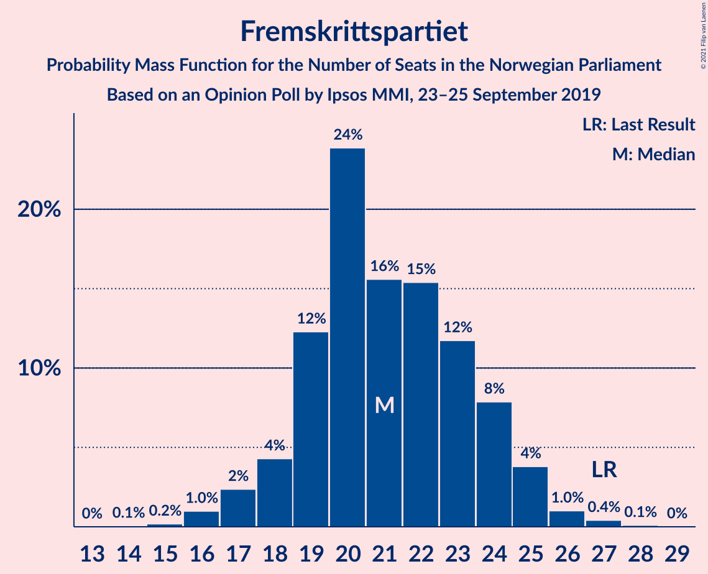
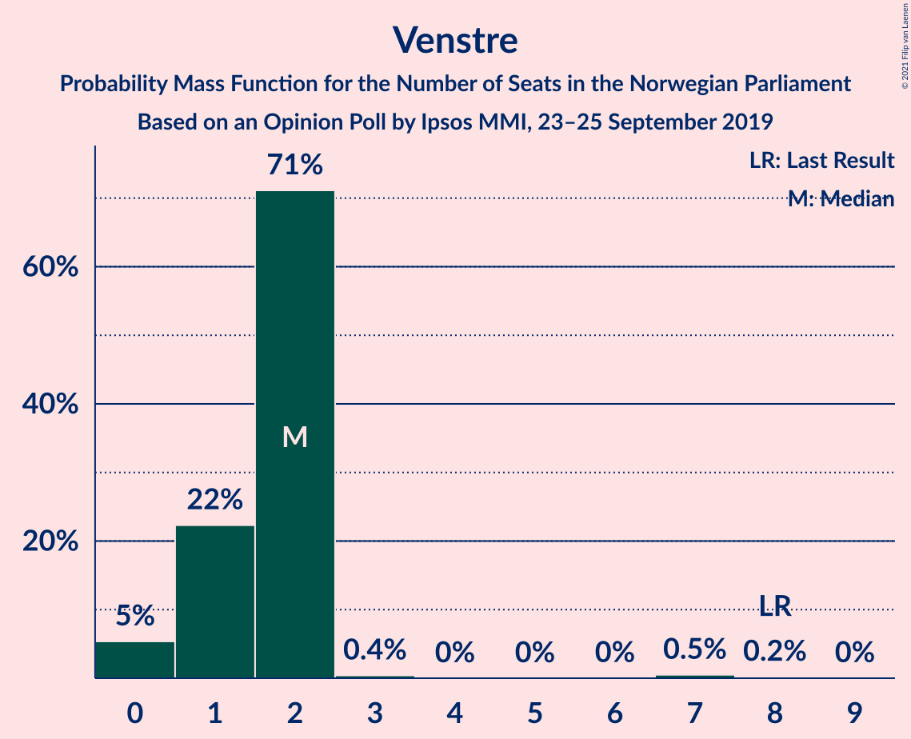
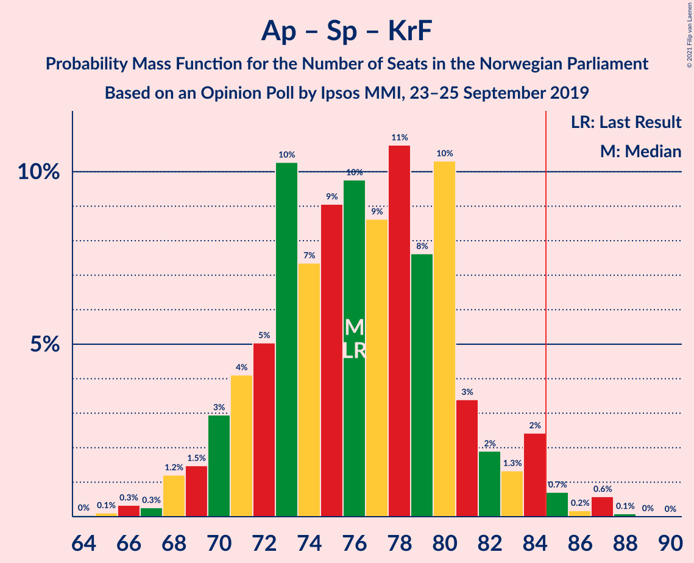
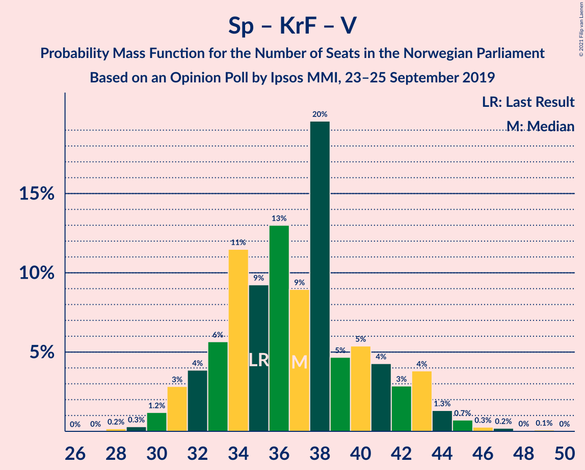

# Opinion Poll by Ipsos MMI, 23–25 September 2019

<a href="#voting-intentions">Voting Intentions</a> | <a href="#seats">Seats</a> | <a href="#coalitions">Coalitions</a> | <a href="#technical-information">Technical Information</a>

## Voting Intentions

### Confidence Intervals

| Party | Last Result | Poll Result | 80% Confidence Interval | 90% Confidence Interval | 95% Confidence Interval | 99% Confidence Interval |
|:-----:|:-----------:|:-----------:|:-----------------------:|:-----------------------:|:-----------------------:|:-----------------------:|
| Arbeiderpartiet | 27.4% | 22.0% | 20.4–23.9% |19.9–24.4% |19.5–24.8% |18.7–25.7% |
| Høyre | 25.0% | 21.3% | 19.7–23.1% |19.2–23.6% |18.8–24.0% |18.0–24.9% |
| Senterpartiet | 10.3% | 17.3% | 15.7–18.9% |15.3–19.4% |15.0–19.8% |14.3–20.6% |
| Fremskrittspartiet | 15.2% | 11.7% | 10.5–13.2% |10.1–13.6% |9.8–13.9% |9.2–14.7% |
| Sosialistisk Venstreparti | 6.0% | 8.4% | 7.3–9.7% |7.1–10.1% |6.8–10.4% |6.3–11.0% |
| Miljøpartiet De Grønne | 3.2% | 6.4% | 5.5–7.5% |5.2–7.9% |5.0–8.2% |4.6–8.7% |
| Rødt | 2.4% | 4.0% | 3.3–5.0% |3.1–5.3% |3.0–5.5% |2.7–6.0% |
| Kristelig Folkeparti | 4.2% | 3.4% | 2.8–4.3% |2.6–4.6% |2.4–4.8% |2.1–5.2% |
| Venstre | 4.4% | 2.6% | 2.0–3.4% |1.8–3.6% |1.7–3.8% |1.5–4.2% |

*Note:* The poll result column reflects the actual value used in the calculations. Published results may vary slightly, and in addition be rounded to fewer digits.

## Seats

### Confidence Intervals

| Party | Last Result | Median | 80% Confidence Interval | 90% Confidence Interval | 95% Confidence Interval | 99% Confidence Interval |
|:-----:|:-----------:|:------:|:-----------------------:|:-----------------------:|:-----------------------:|:-----------------------:|
| <a href="#arbeiderpartiet">Arbeiderpartiet</a> | 49 | 42 | 37–44 |37–45 |36–45 |35–47 |
| <a href="#høyre">Høyre</a> | 45 | 37 | 33–40 |32–42 |32–42 |31–44 |
| <a href="#senterpartiet">Senterpartiet</a> | 19 | 34 | 31–36 |30–38 |29–38 |27–40 |
| <a href="#fremskrittspartiet">Fremskrittspartiet</a> | 27 | 21 | 19–24 |18–25 |17–26 |16–27 |
| <a href="#sosialistisk-venstreparti">Sosialistisk Venstreparti</a> | 11 | 14 | 12–18 |12–19 |12–19 |11–21 |
| <a href="#miljøpartiet-de-grønne">Miljøpartiet De Grønne</a> | 1 | 12 | 11–15 |10–15 |10–15 |8–16 |
| <a href="#rødt">Rødt</a> | 1 | 2 | 2–8 |1–8 |1–9 |1–10 |
| <a href="#kristelig-folkeparti">Kristelig Folkeparti</a> | 8 | 2 | 1–8 |1–8 |0–8 |0–9 |
| <a href="#venstre">Venstre</a> | 8 | 1 | 0–2 |0–2 |0–2 |0–2 |

### Arbeiderpartiet

*For a full overview of the results for this party, see the [Arbeiderpartiet](party-arbeiderpartiet.html) page.*

| Number of Seats | Probability | Accumulated | Special Marks |
|:---------------:|:-----------:|:-----------:|:-------------:|
| 33 | 0.1% | 100% |  |
| 34 | 0.1% | 99.8% |  |
| 35 | 0.8% | 99.7% |  |
| 36 | 2% | 98.9% |  |
| 37 | 7% | 97% |  |
| 38 | 4% | 90% |  |
| 39 | 4% | 86% |  |
| 40 | 9% | 82% |  |
| 41 | 10% | 73% |  |
| 42 | 20% | 63% | Median |
| 43 | 26% | 43% |  |
| 44 | 9% | 17% |  |
| 45 | 7% | 9% |  |
| 46 | 1.0% | 2% |  |
| 47 | 0.6% | 0.7% |  |
| 48 | 0.1% | 0.1% |  |
| 49 | 0% | 0% | Last Result |

### Høyre

*For a full overview of the results for this party, see the [Høyre](party-høyre.html) page.*

| Number of Seats | Probability | Accumulated | Special Marks |
|:---------------:|:-----------:|:-----------:|:-------------:|
| 30 | 0.2% | 100% |  |
| 31 | 0.6% | 99.8% |  |
| 32 | 6% | 99.1% |  |
| 33 | 7% | 93% |  |
| 34 | 12% | 86% |  |
| 35 | 9% | 74% |  |
| 36 | 7% | 65% |  |
| 37 | 11% | 58% | Median |
| 38 | 20% | 46% |  |
| 39 | 11% | 27% |  |
| 40 | 8% | 16% |  |
| 41 | 3% | 8% |  |
| 42 | 3% | 5% |  |
| 43 | 0.9% | 2% |  |
| 44 | 0.5% | 0.7% |  |
| 45 | 0.1% | 0.2% | Last Result |
| 46 | 0.1% | 0.1% |  |
| 47 | 0% | 0% |  |

### Senterpartiet

*For a full overview of the results for this party, see the [Senterpartiet](party-senterpartiet.html) page.*

| Number of Seats | Probability | Accumulated | Special Marks |
|:---------------:|:-----------:|:-----------:|:-------------:|
| 19 | 0% | 100% | Last Result |
| 20 | 0% | 100% |  |
| 21 | 0% | 100% |  |
| 22 | 0% | 100% |  |
| 23 | 0% | 100% |  |
| 24 | 0.1% | 100% |  |
| 25 | 0.1% | 99.9% |  |
| 26 | 0.2% | 99.8% |  |
| 27 | 0.8% | 99.6% |  |
| 28 | 0.5% | 98.8% |  |
| 29 | 0.9% | 98% |  |
| 30 | 4% | 97% |  |
| 31 | 5% | 94% |  |
| 32 | 16% | 89% |  |
| 33 | 21% | 73% |  |
| 34 | 33% | 52% | Median |
| 35 | 8% | 19% |  |
| 36 | 2% | 11% |  |
| 37 | 0.7% | 9% |  |
| 38 | 6% | 8% |  |
| 39 | 1.1% | 2% |  |
| 40 | 0.7% | 0.7% |  |
| 41 | 0% | 0% |  |

### Fremskrittspartiet

*For a full overview of the results for this party, see the [Fremskrittspartiet](party-fremskrittspartiet.html) page.*

| Number of Seats | Probability | Accumulated | Special Marks |
|:---------------:|:-----------:|:-----------:|:-------------:|
| 14 | 0.1% | 100% |  |
| 15 | 0.2% | 99.9% |  |
| 16 | 1.1% | 99.7% |  |
| 17 | 3% | 98.6% |  |
| 18 | 2% | 96% |  |
| 19 | 13% | 93% |  |
| 20 | 26% | 80% |  |
| 21 | 17% | 54% | Median |
| 22 | 10% | 36% |  |
| 23 | 15% | 26% |  |
| 24 | 5% | 11% |  |
| 25 | 2% | 6% |  |
| 26 | 3% | 4% |  |
| 27 | 1.2% | 1.3% | Last Result |
| 28 | 0.1% | 0.1% |  |
| 29 | 0% | 0% |  |

### Sosialistisk Venstreparti

*For a full overview of the results for this party, see the [Sosialistisk Venstreparti](party-sosialistiskvenstreparti.html) page.*

| Number of Seats | Probability | Accumulated | Special Marks |
|:---------------:|:-----------:|:-----------:|:-------------:|
| 9 | 0.1% | 100% |  |
| 10 | 0.1% | 99.9% |  |
| 11 | 0.6% | 99.8% | Last Result |
| 12 | 10% | 99.2% |  |
| 13 | 16% | 89% |  |
| 14 | 27% | 74% | Median |
| 15 | 15% | 46% |  |
| 16 | 11% | 32% |  |
| 17 | 9% | 21% |  |
| 18 | 4% | 12% |  |
| 19 | 6% | 8% |  |
| 20 | 0.8% | 2% |  |
| 21 | 1.0% | 1.0% |  |
| 22 | 0% | 0% |  |

### Miljøpartiet De Grønne

*For a full overview of the results for this party, see the [Miljøpartiet De Grønne](party-miljøpartietdegrønne.html) page.*

| Number of Seats | Probability | Accumulated | Special Marks |
|:---------------:|:-----------:|:-----------:|:-------------:|
| 1 | 0% | 100% | Last Result |
| 2 | 0% | 100% |  |
| 3 | 0% | 100% |  |
| 4 | 0% | 100% |  |
| 5 | 0% | 100% |  |
| 6 | 0% | 100% |  |
| 7 | 0% | 100% |  |
| 8 | 0.4% | 99.9% |  |
| 9 | 0.8% | 99.5% |  |
| 10 | 6% | 98.6% |  |
| 11 | 27% | 93% |  |
| 12 | 24% | 65% | Median |
| 13 | 10% | 42% |  |
| 14 | 19% | 32% |  |
| 15 | 12% | 13% |  |
| 16 | 0.7% | 0.8% |  |
| 17 | 0.1% | 0.1% |  |
| 18 | 0% | 0% |  |

### Rødt

*For a full overview of the results for this party, see the [Rødt](party-rødt.html) page.*

| Number of Seats | Probability | Accumulated | Special Marks |
|:---------------:|:-----------:|:-----------:|:-------------:|
| 1 | 5% | 100% | Last Result |
| 2 | 56% | 95% | Median |
| 3 | 0% | 39% |  |
| 4 | 0% | 39% |  |
| 5 | 0% | 39% |  |
| 6 | 0.9% | 39% |  |
| 7 | 15% | 38% |  |
| 8 | 19% | 23% |  |
| 9 | 2% | 4% |  |
| 10 | 1.2% | 1.3% |  |
| 11 | 0.1% | 0.1% |  |
| 12 | 0% | 0% |  |

### Kristelig Folkeparti

*For a full overview of the results for this party, see the [Kristelig Folkeparti](party-kristeligfolkeparti.html) page.*

| Number of Seats | Probability | Accumulated | Special Marks |
|:---------------:|:-----------:|:-----------:|:-------------:|
| 0 | 3% | 100% |  |
| 1 | 12% | 97% |  |
| 2 | 46% | 85% | Median |
| 3 | 24% | 40% |  |
| 4 | 0% | 16% |  |
| 5 | 0% | 16% |  |
| 6 | 0.1% | 16% |  |
| 7 | 3% | 16% |  |
| 8 | 11% | 12% | Last Result |
| 9 | 1.3% | 1.4% |  |
| 10 | 0% | 0.1% |  |
| 11 | 0% | 0% |  |

### Venstre

*For a full overview of the results for this party, see the [Venstre](party-venstre.html) page.*

| Number of Seats | Probability | Accumulated | Special Marks |
|:---------------:|:-----------:|:-----------:|:-------------:|
| 0 | 10% | 100% |  |
| 1 | 40% | 90% | Median |
| 2 | 50% | 50% |  |
| 3 | 0% | 0.3% |  |
| 4 | 0% | 0.3% |  |
| 5 | 0% | 0.3% |  |
| 6 | 0% | 0.3% |  |
| 7 | 0.1% | 0.3% |  |
| 8 | 0.2% | 0.2% | Last Result |
| 9 | 0% | 0% |  |

## Coalitions

### Confidence Intervals

| Coalition | Last Result | Median | Majority? | 80% Confidence Interval | 90% Confidence Interval | 95% Confidence Interval | 99% Confidence Interval |
|:---------:|:-----------:|:------:|:---------:|:-----------------------:|:-----------------------:|:-----------------------:|:-----------------------:|
| Arbeiderpartiet – Senterpartiet – Sosialistisk Venstreparti – Miljøpartiet De Grønne – Rødt | 81 | 107 | 100% | 103–110 | 101–112 | 99–113 | 97–113 |
| Arbeiderpartiet – Senterpartiet – Sosialistisk Venstreparti – Miljøpartiet De Grønne – Kristelig Folkeparti | 88 | 106 | 100% | 102–109 | 101–110 | 99–112 | 95–112 |
| Arbeiderpartiet – Senterpartiet – Sosialistisk Venstreparti – Miljøpartiet De Grønne | 80 | 103 | 100% | 99–105 | 97–106 | 96–107 | 92–108 |
| Høyre – Senterpartiet – Fremskrittspartiet – Kristelig Folkeparti – Venstre | 107 | 96 | 100% | 92–99 | 90–101 | 89–103 | 88–106 |
| Arbeiderpartiet – Senterpartiet – Sosialistisk Venstreparti – Rødt | 80 | 94 | 99.6% | 91–98 | 89–100 | 87–100 | 85–102 |
| Arbeiderpartiet – Senterpartiet – Miljøpartiet De Grønne – Kristelig Folkeparti | 77 | 90 | 96% | 87–94 | 85–96 | 83–100 | 80–100 |
| Arbeiderpartiet – Senterpartiet – Sosialistisk Venstreparti | 79 | 90 | 95% | 87–94 | 85–94 | 83–95 | 81–98 |
| Arbeiderpartiet – Senterpartiet – Kristelig Folkeparti | 76 | 78 | 5% | 74–82 | 73–86 | 70–88 | 69–88 |
| Høyre – Fremskrittspartiet – Miljøpartiet De Grønne – Kristelig Folkeparti – Venstre | 89 | 75 | 0.3% | 70–78 | 69–79 | 68–82 | 66–84 |
| Arbeiderpartiet – Senterpartiet | 68 | 75 | 0% | 72–78 | 69–80 | 68–80 | 66–81 |
| Høyre – Fremskrittspartiet – Kristelig Folkeparti – Venstre | 88 | 62 | 0% | 59–66 | 57–67 | 56–69 | 55–71 |
| Høyre – Fremskrittspartiet – Venstre | 80 | 60 | 0% | 54–62 | 54–64 | 53–66 | 52–68 |
| Høyre – Fremskrittspartiet | 72 | 58 | 0% | 53–61 | 52–63 | 51–64 | 50–67 |
| Arbeiderpartiet – Sosialistisk Venstreparti | 60 | 57 | 0% | 52–60 | 51–61 | 51–61 | 49–63 |
| Høyre – Kristelig Folkeparti – Venstre | 61 | 42 | 0% | 37–44 | 36–45 | 36–47 | 35–49 |
| Senterpartiet – Kristelig Folkeparti – Venstre | 35 | 37 | 0% | 34–44 | 34–44 | 33–44 | 31–47 |

### Arbeiderpartiet – Senterpartiet – Sosialistisk Venstreparti – Miljøpartiet De Grønne – Rødt

| Number of Seats | Probability | Accumulated | Special Marks |
|:---------------:|:-----------:|:-----------:|:-------------:|
| 81 | 0% | 100% | Last Result |
| 82 | 0% | 100% |  |
| 83 | 0% | 100% |  |
| 84 | 0% | 100% |  |
| 85 | 0% | 100% | Majority |
| 86 | 0% | 100% |  |
| 87 | 0% | 100% |  |
| 88 | 0% | 100% |  |
| 89 | 0% | 100% |  |
| 90 | 0% | 100% |  |
| 91 | 0% | 100% |  |
| 92 | 0% | 100% |  |
| 93 | 0% | 100% |  |
| 94 | 0% | 100% |  |
| 95 | 0.1% | 99.9% |  |
| 96 | 0.2% | 99.9% |  |
| 97 | 0.2% | 99.7% |  |
| 98 | 1.3% | 99.5% |  |
| 99 | 0.9% | 98% |  |
| 100 | 2% | 97% |  |
| 101 | 0.9% | 95% |  |
| 102 | 4% | 95% |  |
| 103 | 2% | 91% |  |
| 104 | 9% | 88% | Median |
| 105 | 3% | 80% |  |
| 106 | 19% | 77% |  |
| 107 | 24% | 58% |  |
| 108 | 21% | 34% |  |
| 109 | 2% | 13% |  |
| 110 | 4% | 11% |  |
| 111 | 1.0% | 7% |  |
| 112 | 3% | 6% |  |
| 113 | 3% | 3% |  |
| 114 | 0.4% | 0.5% |  |
| 115 | 0% | 0.1% |  |
| 116 | 0.1% | 0.1% |  |
| 117 | 0% | 0% |  |

### Arbeiderpartiet – Senterpartiet – Sosialistisk Venstreparti – Miljøpartiet De Grønne – Kristelig Folkeparti

| Number of Seats | Probability | Accumulated | Special Marks |
|:---------------:|:-----------:|:-----------:|:-------------:|
| 88 | 0% | 100% | Last Result |
| 89 | 0% | 100% |  |
| 90 | 0% | 100% |  |
| 91 | 0.1% | 100% |  |
| 92 | 0.1% | 99.9% |  |
| 93 | 0% | 99.9% |  |
| 94 | 0.2% | 99.8% |  |
| 95 | 0.5% | 99.7% |  |
| 96 | 0.2% | 99.1% |  |
| 97 | 0.3% | 98.9% |  |
| 98 | 0.5% | 98.6% |  |
| 99 | 1.4% | 98% |  |
| 100 | 1.5% | 97% |  |
| 101 | 3% | 95% |  |
| 102 | 8% | 92% |  |
| 103 | 14% | 85% |  |
| 104 | 6% | 71% | Median |
| 105 | 12% | 65% |  |
| 106 | 13% | 53% |  |
| 107 | 23% | 40% |  |
| 108 | 6% | 17% |  |
| 109 | 3% | 11% |  |
| 110 | 3% | 8% |  |
| 111 | 0.2% | 5% |  |
| 112 | 4% | 5% |  |
| 113 | 0.1% | 0.1% |  |
| 114 | 0% | 0% |  |

### Arbeiderpartiet – Senterpartiet – Sosialistisk Venstreparti – Miljøpartiet De Grønne

| Number of Seats | Probability | Accumulated | Special Marks |
|:---------------:|:-----------:|:-----------:|:-------------:|
| 80 | 0% | 100% | Last Result |
| 81 | 0% | 100% |  |
| 82 | 0% | 100% |  |
| 83 | 0% | 100% |  |
| 84 | 0% | 100% |  |
| 85 | 0% | 100% | Majority |
| 86 | 0% | 100% |  |
| 87 | 0.1% | 100% |  |
| 88 | 0% | 99.9% |  |
| 89 | 0% | 99.9% |  |
| 90 | 0.1% | 99.8% |  |
| 91 | 0.1% | 99.8% |  |
| 92 | 0.5% | 99.6% |  |
| 93 | 0.3% | 99.2% |  |
| 94 | 0.4% | 98.8% |  |
| 95 | 0.9% | 98% |  |
| 96 | 1.3% | 98% |  |
| 97 | 2% | 96% |  |
| 98 | 3% | 94% |  |
| 99 | 1.2% | 91% |  |
| 100 | 14% | 90% |  |
| 101 | 13% | 76% |  |
| 102 | 12% | 63% | Median |
| 103 | 2% | 51% |  |
| 104 | 22% | 49% |  |
| 105 | 21% | 27% |  |
| 106 | 3% | 6% |  |
| 107 | 2% | 3% |  |
| 108 | 0.6% | 0.9% |  |
| 109 | 0.3% | 0.4% |  |
| 110 | 0% | 0% |  |

### Høyre – Senterpartiet – Fremskrittspartiet – Kristelig Folkeparti – Venstre

| Number of Seats | Probability | Accumulated | Special Marks |
|:---------------:|:-----------:|:-----------:|:-------------:|
| 85 | 0% | 100% | Majority |
| 86 | 0.2% | 99.9% |  |
| 87 | 0.1% | 99.7% |  |
| 88 | 0.7% | 99.7% |  |
| 89 | 2% | 98.9% |  |
| 90 | 3% | 97% |  |
| 91 | 3% | 95% |  |
| 92 | 6% | 91% |  |
| 93 | 10% | 86% |  |
| 94 | 4% | 75% |  |
| 95 | 15% | 71% | Median |
| 96 | 18% | 56% |  |
| 97 | 11% | 38% |  |
| 98 | 9% | 27% |  |
| 99 | 9% | 17% |  |
| 100 | 3% | 8% |  |
| 101 | 1.0% | 5% |  |
| 102 | 1.4% | 4% |  |
| 103 | 2% | 3% |  |
| 104 | 0.1% | 1.1% |  |
| 105 | 0.3% | 1.0% |  |
| 106 | 0.6% | 0.7% |  |
| 107 | 0% | 0.1% | Last Result |
| 108 | 0.1% | 0.1% |  |
| 109 | 0% | 0% |  |

### Arbeiderpartiet – Senterpartiet – Sosialistisk Venstreparti – Rødt

| Number of Seats | Probability | Accumulated | Special Marks |
|:---------------:|:-----------:|:-----------:|:-------------:|
| 80 | 0% | 100% | Last Result |
| 81 | 0% | 100% |  |
| 82 | 0% | 100% |  |
| 83 | 0.1% | 99.9% |  |
| 84 | 0.2% | 99.8% |  |
| 85 | 0.5% | 99.6% | Majority |
| 86 | 0.9% | 99.1% |  |
| 87 | 1.4% | 98% |  |
| 88 | 0.7% | 97% |  |
| 89 | 1.2% | 96% |  |
| 90 | 4% | 95% |  |
| 91 | 16% | 91% |  |
| 92 | 9% | 75% | Median |
| 93 | 14% | 66% |  |
| 94 | 8% | 52% |  |
| 95 | 4% | 44% |  |
| 96 | 11% | 40% |  |
| 97 | 18% | 30% |  |
| 98 | 4% | 12% |  |
| 99 | 3% | 8% |  |
| 100 | 3% | 5% |  |
| 101 | 2% | 2% |  |
| 102 | 0.4% | 0.6% |  |
| 103 | 0.1% | 0.1% |  |
| 104 | 0% | 0% |  |

### Arbeiderpartiet – Senterpartiet – Miljøpartiet De Grønne – Kristelig Folkeparti

| Number of Seats | Probability | Accumulated | Special Marks |
|:---------------:|:-----------:|:-----------:|:-------------:|
| 76 | 0% | 100% |  |
| 77 | 0.1% | 99.9% | Last Result |
| 78 | 0.1% | 99.9% |  |
| 79 | 0.2% | 99.8% |  |
| 80 | 0.5% | 99.6% |  |
| 81 | 0.1% | 99.1% |  |
| 82 | 0.5% | 98.9% |  |
| 83 | 2% | 98% |  |
| 84 | 1.2% | 97% |  |
| 85 | 1.0% | 96% | Majority |
| 86 | 4% | 95% |  |
| 87 | 0.9% | 91% |  |
| 88 | 30% | 90% |  |
| 89 | 8% | 60% |  |
| 90 | 3% | 52% | Median |
| 91 | 4% | 49% |  |
| 92 | 3% | 45% |  |
| 93 | 28% | 42% |  |
| 94 | 8% | 14% |  |
| 95 | 0.3% | 6% |  |
| 96 | 1.2% | 6% |  |
| 97 | 0.2% | 4% |  |
| 98 | 0.1% | 4% |  |
| 99 | 0.1% | 4% |  |
| 100 | 4% | 4% |  |
| 101 | 0% | 0% |  |

### Arbeiderpartiet – Senterpartiet – Sosialistisk Venstreparti

| Number of Seats | Probability | Accumulated | Special Marks |
|:---------------:|:-----------:|:-----------:|:-------------:|
| 77 | 0% | 100% |  |
| 78 | 0% | 99.9% |  |
| 79 | 0.1% | 99.9% | Last Result |
| 80 | 0.1% | 99.7% |  |
| 81 | 0.4% | 99.6% |  |
| 82 | 1.0% | 99.3% |  |
| 83 | 1.4% | 98% |  |
| 84 | 1.4% | 97% |  |
| 85 | 1.3% | 95% | Majority |
| 86 | 2% | 94% |  |
| 87 | 3% | 93% |  |
| 88 | 7% | 89% |  |
| 89 | 23% | 83% |  |
| 90 | 21% | 59% | Median |
| 91 | 17% | 38% |  |
| 92 | 8% | 21% |  |
| 93 | 2% | 12% |  |
| 94 | 7% | 11% |  |
| 95 | 2% | 3% |  |
| 96 | 0.7% | 1.3% |  |
| 97 | 0% | 0.6% |  |
| 98 | 0.5% | 0.5% |  |
| 99 | 0% | 0% |  |

### Arbeiderpartiet – Senterpartiet – Kristelig Folkeparti

| Number of Seats | Probability | Accumulated | Special Marks |
|:---------------:|:-----------:|:-----------:|:-------------:|
| 65 | 0% | 100% |  |
| 66 | 0% | 99.9% |  |
| 67 | 0.2% | 99.9% |  |
| 68 | 0.1% | 99.7% |  |
| 69 | 1.3% | 99.6% |  |
| 70 | 1.2% | 98% |  |
| 71 | 0.6% | 97% |  |
| 72 | 1.3% | 96% |  |
| 73 | 0.9% | 95% |  |
| 74 | 6% | 94% |  |
| 75 | 4% | 88% |  |
| 76 | 5% | 84% | Last Result |
| 77 | 28% | 79% |  |
| 78 | 12% | 51% | Median |
| 79 | 16% | 40% |  |
| 80 | 7% | 23% |  |
| 81 | 3% | 17% |  |
| 82 | 7% | 14% |  |
| 83 | 1.0% | 7% |  |
| 84 | 0.7% | 6% |  |
| 85 | 0.2% | 5% | Majority |
| 86 | 0.9% | 5% |  |
| 87 | 0.1% | 4% |  |
| 88 | 4% | 4% |  |
| 89 | 0.2% | 0.2% |  |
| 90 | 0% | 0% |  |

### Høyre – Fremskrittspartiet – Miljøpartiet De Grønne – Kristelig Folkeparti – Venstre

| Number of Seats | Probability | Accumulated | Special Marks |
|:---------------:|:-----------:|:-----------:|:-------------:|
| 63 | 0.1% | 100% |  |
| 64 | 0.1% | 99.9% |  |
| 65 | 0.2% | 99.9% |  |
| 66 | 0.3% | 99.7% |  |
| 67 | 1.2% | 99.4% |  |
| 68 | 2% | 98% |  |
| 69 | 3% | 96% |  |
| 70 | 3% | 93% |  |
| 71 | 4% | 90% |  |
| 72 | 18% | 86% |  |
| 73 | 10% | 68% | Median |
| 74 | 4% | 58% |  |
| 75 | 8% | 55% |  |
| 76 | 14% | 46% |  |
| 77 | 8% | 32% |  |
| 78 | 16% | 24% |  |
| 79 | 4% | 8% |  |
| 80 | 1.0% | 4% |  |
| 81 | 0.6% | 3% |  |
| 82 | 1.2% | 3% |  |
| 83 | 0.6% | 1.4% |  |
| 84 | 0.5% | 0.8% |  |
| 85 | 0.2% | 0.3% | Majority |
| 86 | 0.1% | 0.2% |  |
| 87 | 0% | 0% |  |
| 88 | 0% | 0% |  |
| 89 | 0% | 0% | Last Result |

### Arbeiderpartiet – Senterpartiet

| Number of Seats | Probability | Accumulated | Special Marks |
|:---------------:|:-----------:|:-----------:|:-------------:|
| 62 | 0.1% | 100% |  |
| 63 | 0% | 99.9% |  |
| 64 | 0.1% | 99.9% |  |
| 65 | 0.1% | 99.8% |  |
| 66 | 0.9% | 99.7% |  |
| 67 | 1.0% | 98.8% |  |
| 68 | 1.2% | 98% | Last Result |
| 69 | 2% | 97% |  |
| 70 | 1.0% | 95% |  |
| 71 | 3% | 94% |  |
| 72 | 2% | 91% |  |
| 73 | 7% | 89% |  |
| 74 | 15% | 82% |  |
| 75 | 22% | 67% |  |
| 76 | 14% | 45% | Median |
| 77 | 21% | 31% |  |
| 78 | 2% | 10% |  |
| 79 | 2% | 8% |  |
| 80 | 5% | 6% |  |
| 81 | 0.6% | 0.8% |  |
| 82 | 0.2% | 0.2% |  |
| 83 | 0.1% | 0.1% |  |
| 84 | 0% | 0% |  |

### Høyre – Fremskrittspartiet – Kristelig Folkeparti – Venstre

| Number of Seats | Probability | Accumulated | Special Marks |
|:---------------:|:-----------:|:-----------:|:-------------:|
| 52 | 0.1% | 100% |  |
| 53 | 0.2% | 99.9% |  |
| 54 | 0% | 99.7% |  |
| 55 | 0.6% | 99.6% |  |
| 56 | 4% | 99.1% |  |
| 57 | 3% | 95% |  |
| 58 | 1.4% | 93% |  |
| 59 | 4% | 91% |  |
| 60 | 3% | 87% |  |
| 61 | 21% | 84% | Median |
| 62 | 23% | 63% |  |
| 63 | 19% | 40% |  |
| 64 | 3% | 22% |  |
| 65 | 9% | 19% |  |
| 66 | 2% | 10% |  |
| 67 | 3% | 8% |  |
| 68 | 0.8% | 5% |  |
| 69 | 2% | 4% |  |
| 70 | 0.7% | 2% |  |
| 71 | 1.2% | 2% |  |
| 72 | 0.2% | 0.4% |  |
| 73 | 0.1% | 0.2% |  |
| 74 | 0.1% | 0.1% |  |
| 75 | 0% | 0% |  |
| 76 | 0% | 0% |  |
| 77 | 0% | 0% |  |
| 78 | 0% | 0% |  |
| 79 | 0% | 0% |  |
| 80 | 0% | 0% |  |
| 81 | 0% | 0% |  |
| 82 | 0% | 0% |  |
| 83 | 0% | 0% |  |
| 84 | 0% | 0% |  |
| 85 | 0% | 0% | Majority |
| 86 | 0% | 0% |  |
| 87 | 0% | 0% |  |
| 88 | 0% | 0% | Last Result |

### Høyre – Fremskrittspartiet – Venstre

| Number of Seats | Probability | Accumulated | Special Marks |
|:---------------:|:-----------:|:-----------:|:-------------:|
| 49 | 0.1% | 100% |  |
| 50 | 0.1% | 99.8% |  |
| 51 | 0.1% | 99.7% |  |
| 52 | 0.6% | 99.6% |  |
| 53 | 3% | 99.0% |  |
| 54 | 6% | 96% |  |
| 55 | 6% | 90% |  |
| 56 | 2% | 84% |  |
| 57 | 6% | 82% |  |
| 58 | 5% | 76% |  |
| 59 | 17% | 70% | Median |
| 60 | 20% | 53% |  |
| 61 | 13% | 33% |  |
| 62 | 11% | 20% |  |
| 63 | 3% | 9% |  |
| 64 | 2% | 6% |  |
| 65 | 1.1% | 4% |  |
| 66 | 1.4% | 3% |  |
| 67 | 0.3% | 1.3% |  |
| 68 | 0.7% | 1.0% |  |
| 69 | 0.1% | 0.3% |  |
| 70 | 0.1% | 0.2% |  |
| 71 | 0% | 0.1% |  |
| 72 | 0% | 0% |  |
| 73 | 0% | 0% |  |
| 74 | 0% | 0% |  |
| 75 | 0% | 0% |  |
| 76 | 0% | 0% |  |
| 77 | 0% | 0% |  |
| 78 | 0% | 0% |  |
| 79 | 0% | 0% |  |
| 80 | 0% | 0% | Last Result |

### Høyre – Fremskrittspartiet

| Number of Seats | Probability | Accumulated | Special Marks |
|:---------------:|:-----------:|:-----------:|:-------------:|
| 47 | 0% | 100% |  |
| 48 | 0.2% | 99.9% |  |
| 49 | 0.1% | 99.8% |  |
| 50 | 0.3% | 99.7% |  |
| 51 | 2% | 99.4% |  |
| 52 | 4% | 97% |  |
| 53 | 4% | 93% |  |
| 54 | 5% | 89% |  |
| 55 | 7% | 84% |  |
| 56 | 3% | 77% |  |
| 57 | 19% | 74% |  |
| 58 | 14% | 55% | Median |
| 59 | 3% | 41% |  |
| 60 | 20% | 38% |  |
| 61 | 10% | 18% |  |
| 62 | 2% | 8% |  |
| 63 | 3% | 6% |  |
| 64 | 1.4% | 3% |  |
| 65 | 0.5% | 2% |  |
| 66 | 0.3% | 1.0% |  |
| 67 | 0.4% | 0.7% |  |
| 68 | 0.3% | 0.4% |  |
| 69 | 0% | 0.1% |  |
| 70 | 0% | 0% |  |
| 71 | 0% | 0% |  |
| 72 | 0% | 0% | Last Result |

### Arbeiderpartiet – Sosialistisk Venstreparti

| Number of Seats | Probability | Accumulated | Special Marks |
|:---------------:|:-----------:|:-----------:|:-------------:|
| 47 | 0.1% | 100% |  |
| 48 | 0.3% | 99.9% |  |
| 49 | 0.5% | 99.6% |  |
| 50 | 0.9% | 99.2% |  |
| 51 | 6% | 98% |  |
| 52 | 2% | 92% |  |
| 53 | 2% | 90% |  |
| 54 | 5% | 88% |  |
| 55 | 12% | 83% |  |
| 56 | 13% | 71% | Median |
| 57 | 29% | 58% |  |
| 58 | 15% | 29% |  |
| 59 | 2% | 14% |  |
| 60 | 3% | 12% | Last Result |
| 61 | 8% | 9% |  |
| 62 | 0.8% | 2% |  |
| 63 | 0.7% | 0.8% |  |
| 64 | 0% | 0.1% |  |
| 65 | 0% | 0.1% |  |
| 66 | 0% | 0% |  |

### Høyre – Kristelig Folkeparti – Venstre

| Number of Seats | Probability | Accumulated | Special Marks |
|:---------------:|:-----------:|:-----------:|:-------------:|
| 34 | 0.2% | 100% |  |
| 35 | 0.5% | 99.8% |  |
| 36 | 5% | 99.3% |  |
| 37 | 5% | 94% |  |
| 38 | 13% | 89% |  |
| 39 | 4% | 76% |  |
| 40 | 10% | 72% | Median |
| 41 | 10% | 63% |  |
| 42 | 24% | 53% |  |
| 43 | 5% | 28% |  |
| 44 | 14% | 23% |  |
| 45 | 5% | 10% |  |
| 46 | 2% | 5% |  |
| 47 | 1.3% | 3% |  |
| 48 | 1.1% | 2% |  |
| 49 | 0.3% | 0.7% |  |
| 50 | 0.1% | 0.5% |  |
| 51 | 0.2% | 0.3% |  |
| 52 | 0% | 0.2% |  |
| 53 | 0% | 0.1% |  |
| 54 | 0.1% | 0.1% |  |
| 55 | 0% | 0% |  |
| 56 | 0% | 0% |  |
| 57 | 0% | 0% |  |
| 58 | 0% | 0% |  |
| 59 | 0% | 0% |  |
| 60 | 0% | 0% |  |
| 61 | 0% | 0% | Last Result |

### Senterpartiet – Kristelig Folkeparti – Venstre

| Number of Seats | Probability | Accumulated | Special Marks |
|:---------------:|:-----------:|:-----------:|:-------------:|
| 28 | 0.1% | 100% |  |
| 29 | 0.1% | 99.9% |  |
| 30 | 0.3% | 99.9% |  |
| 31 | 0.6% | 99.5% |  |
| 32 | 1.3% | 98.9% |  |
| 33 | 1.3% | 98% |  |
| 34 | 8% | 96% |  |
| 35 | 12% | 88% | Last Result |
| 36 | 11% | 76% |  |
| 37 | 21% | 66% | Median |
| 38 | 16% | 44% |  |
| 39 | 5% | 29% |  |
| 40 | 3% | 24% |  |
| 41 | 1.4% | 22% |  |
| 42 | 8% | 20% |  |
| 43 | 2% | 13% |  |
| 44 | 9% | 11% |  |
| 45 | 0.4% | 2% |  |
| 46 | 0.7% | 2% |  |
| 47 | 0.8% | 1.1% |  |
| 48 | 0.2% | 0.3% |  |
| 49 | 0% | 0% |  |

## Technical Information

### Opinion Poll

+ **Polling firm:** Ipsos MMI
+ **Commissioner(s):** —
+ **Fieldwork period:** 23–25 September 2019

### Calculations

+ **Sample size:** 939
+ **Simulations done:** 131,072
+ **Error estimate:** 2.93%

