# Opinion Poll by Ipsos MMI, 23–25 September 2019

<a href="#voting-intentions">Voting Intentions</a> | <a href="#seats">Seats</a> | <a href="#coalitions">Coalitions</a> | <a href="#technical-information">Technical Information</a>

## Voting Intentions

### Confidence Intervals

| Party | Last Result | Poll Result | 80% Confidence Interval | 90% Confidence Interval | 95% Confidence Interval | 99% Confidence Interval |
|:-----:|:-----------:|:-----------:|:-----------------------:|:-----------------------:|:-----------------------:|:-----------------------:|
| Arbeiderpartiet | 27.4% | 22.0% | 20.4–23.9% |19.9–24.4% |19.5–24.8% |18.7–25.7% |
| Høyre | 25.0% | 21.3% | 19.7–23.1% |19.2–23.6% |18.8–24.0% |18.0–24.9% |
| Senterpartiet | 10.3% | 17.3% | 15.7–18.9% |15.3–19.4% |15.0–19.8% |14.3–20.6% |
| Fremskrittspartiet | 15.2% | 11.7% | 10.5–13.2% |10.1–13.6% |9.8–13.9% |9.2–14.7% |
| Sosialistisk Venstreparti | 6.0% | 8.4% | 7.3–9.7% |7.1–10.1% |6.8–10.4% |6.3–11.0% |
| Miljøpartiet De Grønne | 3.2% | 6.4% | 5.5–7.5% |5.2–7.9% |5.0–8.2% |4.6–8.7% |
| Rødt | 2.4% | 4.0% | 3.3–5.0% |3.1–5.3% |3.0–5.5% |2.7–6.0% |
| Kristelig Folkeparti | 4.2% | 3.4% | 2.8–4.3% |2.6–4.6% |2.4–4.8% |2.1–5.2% |
| Venstre | 4.4% | 2.6% | 2.0–3.4% |1.8–3.6% |1.7–3.8% |1.5–4.2% |

*Note:* The poll result column reflects the actual value used in the calculations. Published results may vary slightly, and in addition be rounded to fewer digits.

## Seats

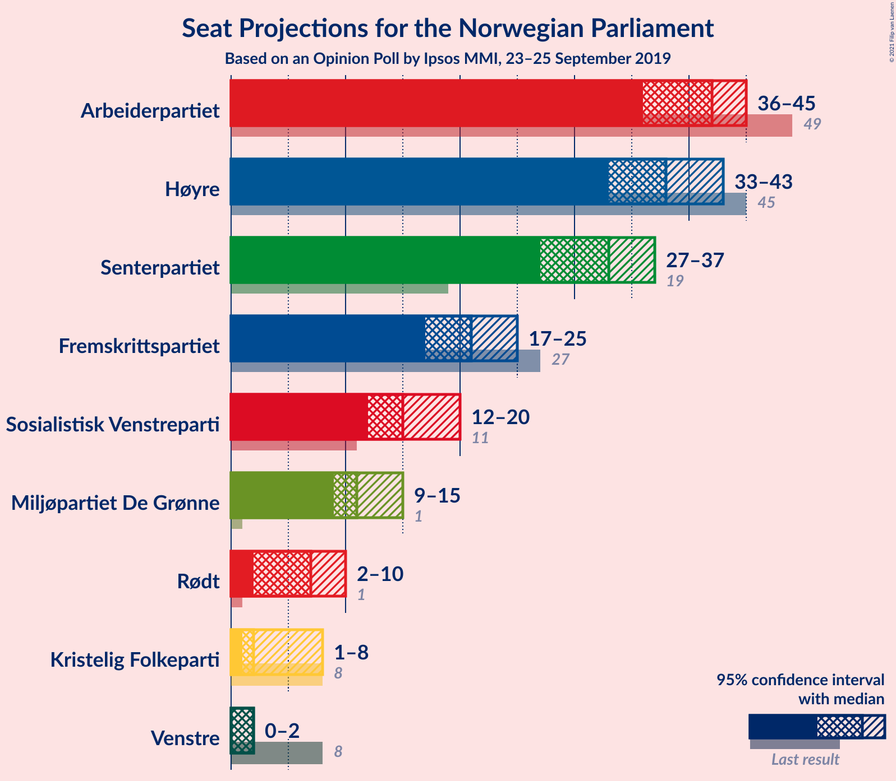

### Confidence Intervals

| Party | Last Result | Median | 80% Confidence Interval | 90% Confidence Interval | 95% Confidence Interval | 99% Confidence Interval |
|:-----:|:-----------:|:------:|:-----------------------:|:-----------------------:|:-----------------------:|:-----------------------:|
| <a href="#arbeiderpartiet">Arbeiderpartiet</a> | 49 | 42 | 37–44 |37–45 |36–45 |34–47 |
| <a href="#høyre">Høyre</a> | 45 | 38 | 34–42 |33–43 |33–43 |32–46 |
| <a href="#senterpartiet">Senterpartiet</a> | 19 | 33 | 29–35 |28–36 |27–37 |25–38 |
| <a href="#fremskrittspartiet">Fremskrittspartiet</a> | 27 | 21 | 19–24 |18–25 |17–25 |16–27 |
| <a href="#sosialistisk-venstreparti">Sosialistisk Venstreparti</a> | 11 | 15 | 13–18 |12–19 |12–20 |11–20 |
| <a href="#miljøpartiet-de-grønne">Miljøpartiet De Grønne</a> | 1 | 11 | 10–14 |9–14 |9–15 |8–16 |
| <a href="#rødt">Rødt</a> | 1 | 7 | 2–9 |2–9 |2–10 |1–11 |
| <a href="#kristelig-folkeparti">Kristelig Folkeparti</a> | 8 | 2 | 1–7 |1–8 |1–8 |0–9 |
| <a href="#venstre">Venstre</a> | 8 | 2 | 1–2 |0–2 |0–2 |0–7 |

### Arbeiderpartiet

*For a full overview of the results for this party, see the [Arbeiderpartiet](party-arbeiderpartiet.html) page.*

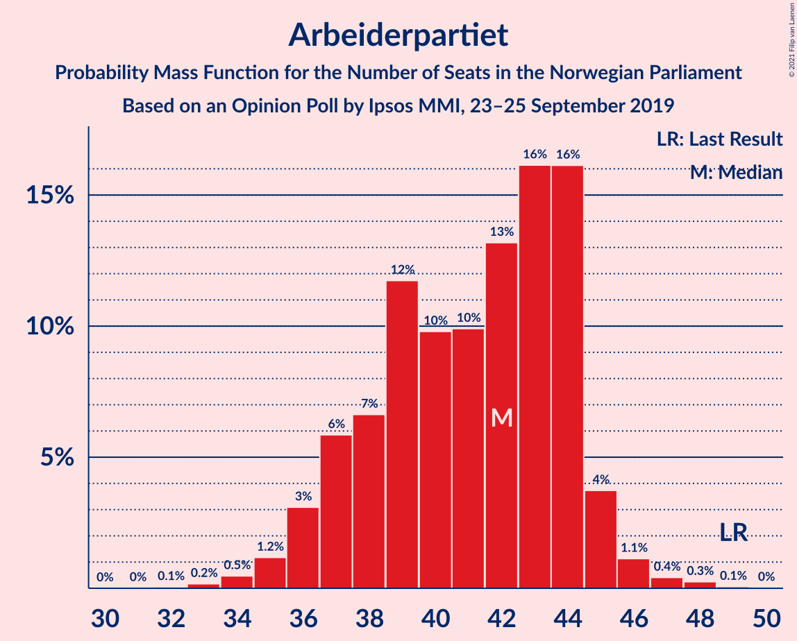

| Number of Seats | Probability | Accumulated | Special Marks |
|:---------------:|:-----------:|:-----------:|:-------------:|
| 32 | 0.1% | 100% |  |
| 33 | 0.2% | 99.9% |  |
| 34 | 0.5% | 99.7% |  |
| 35 | 1.2% | 99.3% |  |
| 36 | 3% | 98% |  |
| 37 | 6% | 95% |  |
| 38 | 7% | 89% |  |
| 39 | 12% | 83% |  |
| 40 | 10% | 71% |  |
| 41 | 10% | 61% |  |
| 42 | 13% | 51% | Median |
| 43 | 16% | 38% |  |
| 44 | 16% | 22% |  |
| 45 | 4% | 6% |  |
| 46 | 1.1% | 2% |  |
| 47 | 0.4% | 0.8% |  |
| 48 | 0.3% | 0.3% |  |
| 49 | 0.1% | 0.1% | Last Result |
| 50 | 0% | 0% |  |

### Høyre

*For a full overview of the results for this party, see the [Høyre](party-høyre.html) page.*

| Number of Seats | Probability | Accumulated | Special Marks |
|:---------------:|:-----------:|:-----------:|:-------------:|
| 30 | 0.1% | 100% |  |
| 31 | 0.3% | 99.9% |  |
| 32 | 2% | 99.7% |  |
| 33 | 4% | 98% |  |
| 34 | 9% | 94% |  |
| 35 | 9% | 84% |  |
| 36 | 14% | 76% |  |
| 37 | 8% | 62% |  |
| 38 | 15% | 54% | Median |
| 39 | 11% | 39% |  |
| 40 | 11% | 28% |  |
| 41 | 5% | 18% |  |
| 42 | 6% | 12% |  |
| 43 | 3% | 6% |  |
| 44 | 1.2% | 2% |  |
| 45 | 0.4% | 1.1% | Last Result |
| 46 | 0.4% | 0.7% |  |
| 47 | 0.3% | 0.4% |  |
| 48 | 0.1% | 0.1% |  |
| 49 | 0% | 0% |  |

### Senterpartiet

*For a full overview of the results for this party, see the [Senterpartiet](party-senterpartiet.html) page.*

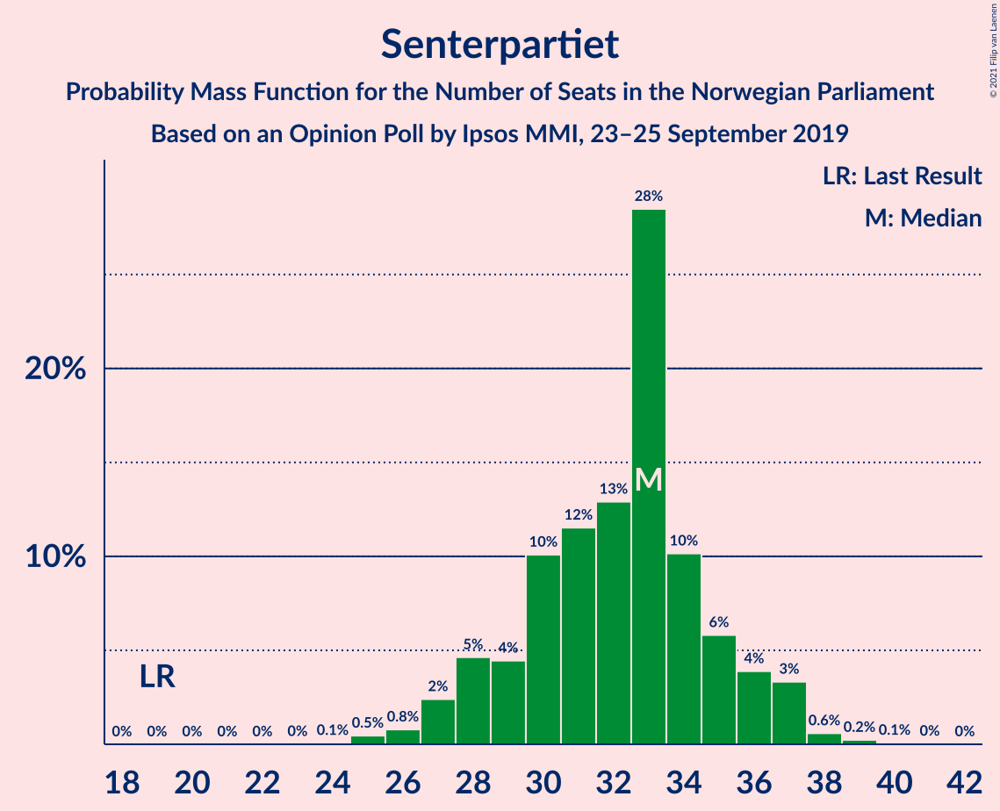

| Number of Seats | Probability | Accumulated | Special Marks |
|:---------------:|:-----------:|:-----------:|:-------------:|
| 19 | 0% | 100% | Last Result |
| 20 | 0% | 100% |  |
| 21 | 0% | 100% |  |
| 22 | 0% | 100% |  |
| 23 | 0% | 100% |  |
| 24 | 0.1% | 100% |  |
| 25 | 0.5% | 99.9% |  |
| 26 | 0.8% | 99.4% |  |
| 27 | 2% | 98.7% |  |
| 28 | 5% | 96% |  |
| 29 | 4% | 92% |  |
| 30 | 10% | 87% |  |
| 31 | 12% | 77% |  |
| 32 | 13% | 66% |  |
| 33 | 28% | 53% | Median |
| 34 | 10% | 24% |  |
| 35 | 6% | 14% |  |
| 36 | 4% | 8% |  |
| 37 | 3% | 4% |  |
| 38 | 0.6% | 0.9% |  |
| 39 | 0.2% | 0.4% |  |
| 40 | 0.1% | 0.1% |  |
| 41 | 0% | 0% |  |

### Fremskrittspartiet

*For a full overview of the results for this party, see the [Fremskrittspartiet](party-fremskrittspartiet.html) page.*

| Number of Seats | Probability | Accumulated | Special Marks |
|:---------------:|:-----------:|:-----------:|:-------------:|
| 14 | 0.1% | 100% |  |
| 15 | 0.2% | 99.9% |  |
| 16 | 1.0% | 99.8% |  |
| 17 | 2% | 98.8% |  |
| 18 | 4% | 96% |  |
| 19 | 12% | 92% |  |
| 20 | 24% | 80% |  |
| 21 | 16% | 56% | Median |
| 22 | 15% | 40% |  |
| 23 | 12% | 25% |  |
| 24 | 8% | 13% |  |
| 25 | 4% | 5% |  |
| 26 | 1.0% | 2% |  |
| 27 | 0.4% | 0.5% | Last Result |
| 28 | 0.1% | 0.1% |  |
| 29 | 0% | 0% |  |

### Sosialistisk Venstreparti

*For a full overview of the results for this party, see the [Sosialistisk Venstreparti](party-sosialistiskvenstreparti.html) page.*

| Number of Seats | Probability | Accumulated | Special Marks |
|:---------------:|:-----------:|:-----------:|:-------------:|
| 10 | 0.2% | 100% |  |
| 11 | 2% | 99.7% | Last Result |
| 12 | 8% | 98% |  |
| 13 | 15% | 90% |  |
| 14 | 23% | 75% |  |
| 15 | 15% | 52% | Median |
| 16 | 11% | 37% |  |
| 17 | 11% | 26% |  |
| 18 | 7% | 15% |  |
| 19 | 6% | 8% |  |
| 20 | 2% | 3% |  |
| 21 | 0.3% | 0.4% |  |
| 22 | 0% | 0% |  |

### Miljøpartiet De Grønne

*For a full overview of the results for this party, see the [Miljøpartiet De Grønne](party-miljøpartietdegrønne.html) page.*

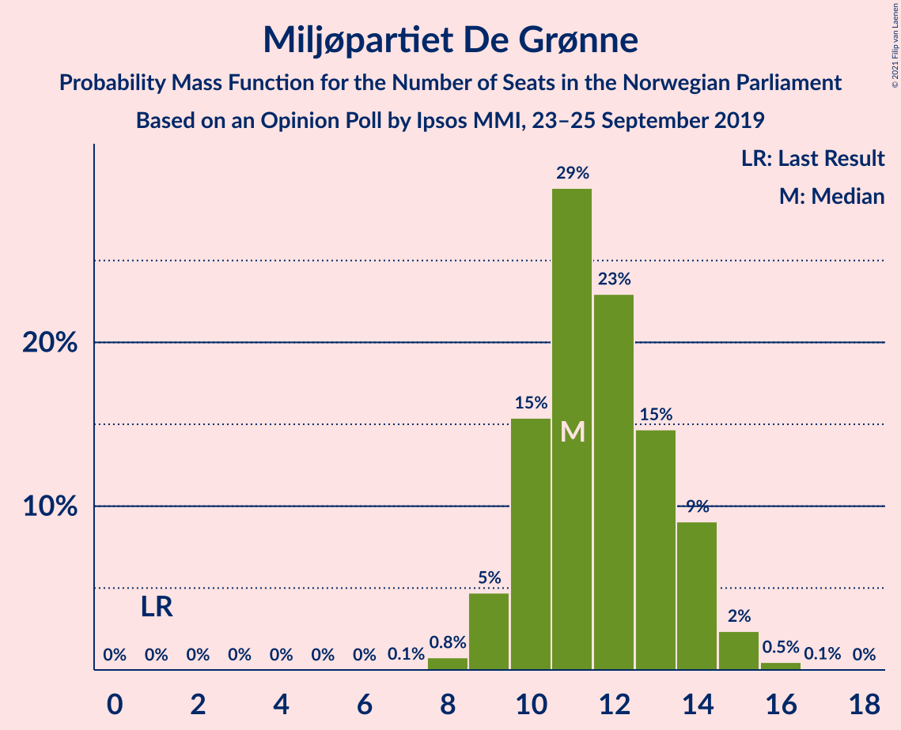

| Number of Seats | Probability | Accumulated | Special Marks |
|:---------------:|:-----------:|:-----------:|:-------------:|
| 1 | 0% | 100% | Last Result |
| 2 | 0% | 100% |  |
| 3 | 0% | 100% |  |
| 4 | 0% | 100% |  |
| 5 | 0% | 100% |  |
| 6 | 0% | 100% |  |
| 7 | 0.1% | 100% |  |
| 8 | 0.8% | 99.9% |  |
| 9 | 5% | 99.2% |  |
| 10 | 15% | 94% |  |
| 11 | 29% | 79% | Median |
| 12 | 23% | 50% |  |
| 13 | 15% | 27% |  |
| 14 | 9% | 12% |  |
| 15 | 2% | 3% |  |
| 16 | 0.5% | 0.6% |  |
| 17 | 0.1% | 0.1% |  |
| 18 | 0% | 0% |  |

### Rødt

*For a full overview of the results for this party, see the [Rødt](party-rødt.html) page.*

| Number of Seats | Probability | Accumulated | Special Marks |
|:---------------:|:-----------:|:-----------:|:-------------:|
| 1 | 2% | 100% | Last Result |
| 2 | 45% | 98% |  |
| 3 | 0.1% | 53% |  |
| 4 | 0% | 53% |  |
| 5 | 0% | 53% |  |
| 6 | 0.2% | 53% |  |
| 7 | 12% | 53% | Median |
| 8 | 29% | 42% |  |
| 9 | 9% | 13% |  |
| 10 | 2% | 3% |  |
| 11 | 0.7% | 0.8% |  |
| 12 | 0.1% | 0.1% |  |
| 13 | 0% | 0% |  |

### Kristelig Folkeparti

*For a full overview of the results for this party, see the [Kristelig Folkeparti](party-kristeligfolkeparti.html) page.*

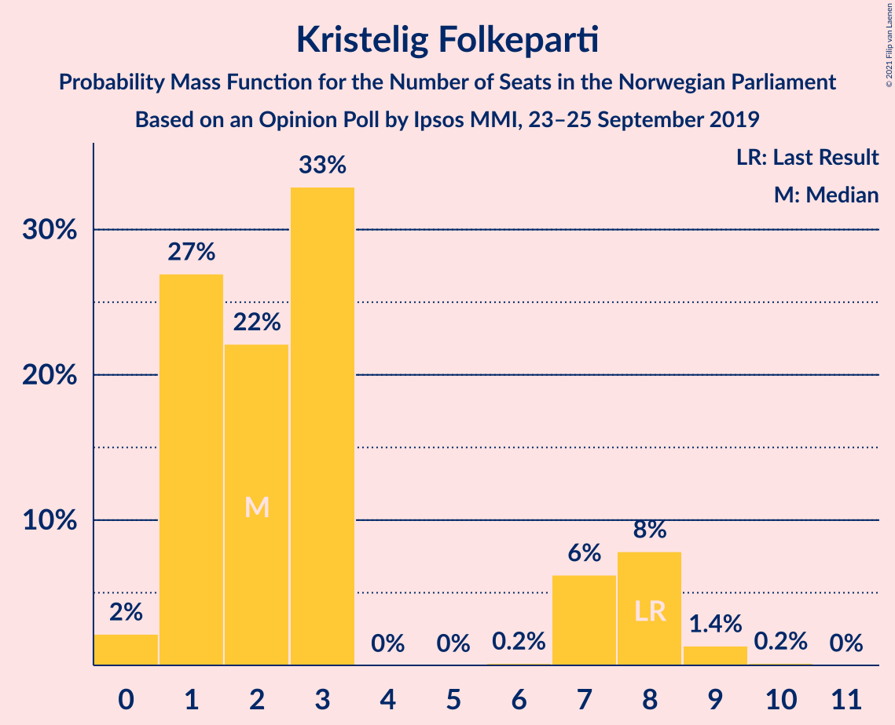

| Number of Seats | Probability | Accumulated | Special Marks |
|:---------------:|:-----------:|:-----------:|:-------------:|
| 0 | 2% | 100% |  |
| 1 | 27% | 98% |  |
| 2 | 22% | 71% | Median |
| 3 | 33% | 49% |  |
| 4 | 0% | 16% |  |
| 5 | 0% | 16% |  |
| 6 | 0.2% | 16% |  |
| 7 | 6% | 16% |  |
| 8 | 8% | 9% | Last Result |
| 9 | 1.4% | 2% |  |
| 10 | 0.2% | 0.2% |  |
| 11 | 0% | 0% |  |

### Venstre

*For a full overview of the results for this party, see the [Venstre](party-venstre.html) page.*

| Number of Seats | Probability | Accumulated | Special Marks |
|:---------------:|:-----------:|:-----------:|:-------------:|
| 0 | 5% | 100% |  |
| 1 | 22% | 95% |  |
| 2 | 71% | 72% | Median |
| 3 | 0.4% | 1.2% |  |
| 4 | 0% | 0.8% |  |
| 5 | 0% | 0.8% |  |
| 6 | 0% | 0.8% |  |
| 7 | 0.5% | 0.7% |  |
| 8 | 0.2% | 0.2% | Last Result |
| 9 | 0% | 0% |  |

## Coalitions

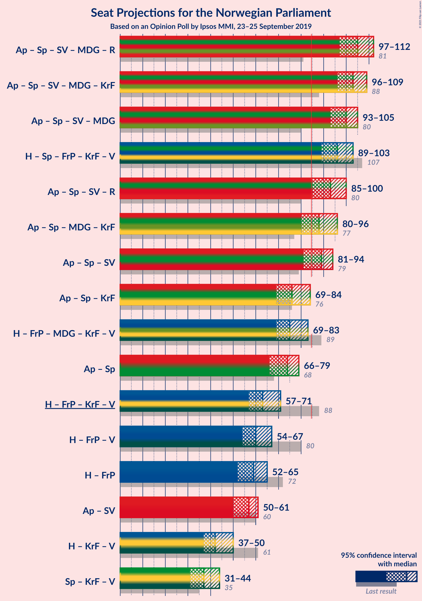

### Confidence Intervals

| Coalition | Last Result | Median | Majority? | 80% Confidence Interval | 90% Confidence Interval | 95% Confidence Interval | 99% Confidence Interval |
|:---------:|:-----------:|:------:|:---------:|:-----------------------:|:-----------------------:|:-----------------------:|:-----------------------:|
| Arbeiderpartiet – Senterpartiet – Sosialistisk Venstreparti – Miljøpartiet De Grønne – Rødt | 81 | 105 | 100% | 101–110 | 99–111 | 97–112 | 95–113 |
| Arbeiderpartiet – Senterpartiet – Sosialistisk Venstreparti – Miljøpartiet De Grønne – Kristelig Folkeparti | 88 | 103 | 100% | 98–107 | 97–108 | 96–109 | 93–111 |
| Arbeiderpartiet – Senterpartiet – Sosialistisk Venstreparti – Miljøpartiet De Grønne | 80 | 100 | 100% | 96–104 | 94–105 | 93–105 | 90–107 |
| Høyre – Senterpartiet – Fremskrittspartiet – Kristelig Folkeparti – Venstre | 107 | 96 | 99.9% | 91–100 | 90–102 | 89–103 | 88–105 |
| Arbeiderpartiet – Senterpartiet – Sosialistisk Venstreparti – Rødt | 80 | 93 | 98% | 89–99 | 87–99 | 85–100 | 83–102 |
| Arbeiderpartiet – Senterpartiet – Miljøpartiet De Grønne – Kristelig Folkeparti | 77 | 88 | 81% | 83–93 | 82–94 | 80–96 | 78–99 |
| Arbeiderpartiet – Senterpartiet – Sosialistisk Venstreparti | 79 | 89 | 87% | 84–92 | 82–93 | 81–94 | 79–96 |
| Arbeiderpartiet – Senterpartiet – Kristelig Folkeparti | 76 | 76 | 2% | 71–81 | 70–83 | 69–84 | 66–87 |
| Høyre – Fremskrittspartiet – Miljøpartiet De Grønne – Kristelig Folkeparti – Venstre | 89 | 75 | 1.4% | 70–80 | 70–81 | 69–83 | 66–86 |
| Arbeiderpartiet – Senterpartiet | 68 | 74 | 0% | 69–77 | 67–78 | 66–79 | 64–81 |
| Høyre – Fremskrittspartiet – Kristelig Folkeparti – Venstre | 88 | 63 | 0% | 59–68 | 58–70 | 57–71 | 55–73 |
| Høyre – Fremskrittspartiet – Venstre | 80 | 60 | 0% | 56–65 | 55–66 | 54–67 | 52–70 |
| Høyre – Fremskrittspartiet | 72 | 59 | 0% | 54–64 | 54–65 | 52–65 | 50–68 |
| Arbeiderpartiet – Sosialistisk Venstreparti | 60 | 57 | 0% | 52–59 | 51–61 | 50–61 | 48–63 |
| Høyre – Kristelig Folkeparti – Venstre | 61 | 42 | 0% | 39–47 | 38–48 | 37–50 | 36–52 |
| Senterpartiet – Kristelig Folkeparti – Venstre | 35 | 37 | 0% | 33–41 | 32–43 | 31–44 | 30–46 |

### Arbeiderpartiet – Senterpartiet – Sosialistisk Venstreparti – Miljøpartiet De Grønne – Rødt

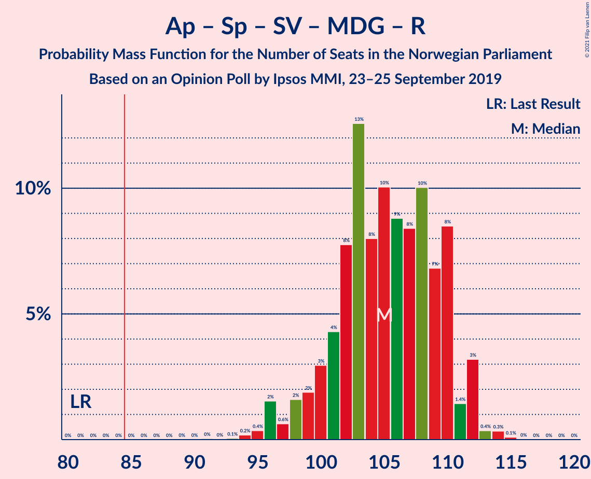

| Number of Seats | Probability | Accumulated | Special Marks |
|:---------------:|:-----------:|:-----------:|:-------------:|
| 81 | 0% | 100% | Last Result |
| 82 | 0% | 100% |  |
| 83 | 0% | 100% |  |
| 84 | 0% | 100% |  |
| 85 | 0% | 100% | Majority |
| 86 | 0% | 100% |  |
| 87 | 0% | 100% |  |
| 88 | 0% | 100% |  |
| 89 | 0% | 100% |  |
| 90 | 0% | 100% |  |
| 91 | 0% | 100% |  |
| 92 | 0% | 99.9% |  |
| 93 | 0.1% | 99.9% |  |
| 94 | 0.2% | 99.9% |  |
| 95 | 0.4% | 99.7% |  |
| 96 | 2% | 99.3% |  |
| 97 | 0.6% | 98% |  |
| 98 | 2% | 97% |  |
| 99 | 2% | 96% |  |
| 100 | 3% | 94% |  |
| 101 | 4% | 91% |  |
| 102 | 8% | 86% |  |
| 103 | 13% | 79% |  |
| 104 | 8% | 66% |  |
| 105 | 10% | 58% |  |
| 106 | 9% | 48% |  |
| 107 | 8% | 39% |  |
| 108 | 10% | 31% | Median |
| 109 | 7% | 21% |  |
| 110 | 8% | 14% |  |
| 111 | 1.4% | 5% |  |
| 112 | 3% | 4% |  |
| 113 | 0.4% | 0.8% |  |
| 114 | 0.3% | 0.5% |  |
| 115 | 0.1% | 0.1% |  |
| 116 | 0% | 0% |  |

### Arbeiderpartiet – Senterpartiet – Sosialistisk Venstreparti – Miljøpartiet De Grønne – Kristelig Folkeparti

| Number of Seats | Probability | Accumulated | Special Marks |
|:---------------:|:-----------:|:-----------:|:-------------:|
| 88 | 0% | 100% | Last Result |
| 89 | 0% | 100% |  |
| 90 | 0% | 100% |  |
| 91 | 0.1% | 100% |  |
| 92 | 0.2% | 99.9% |  |
| 93 | 0.2% | 99.7% |  |
| 94 | 0.6% | 99.5% |  |
| 95 | 1.3% | 98.9% |  |
| 96 | 1.2% | 98% |  |
| 97 | 3% | 96% |  |
| 98 | 4% | 94% |  |
| 99 | 4% | 90% |  |
| 100 | 7% | 86% |  |
| 101 | 9% | 78% |  |
| 102 | 9% | 70% |  |
| 103 | 19% | 61% | Median |
| 104 | 8% | 42% |  |
| 105 | 15% | 34% |  |
| 106 | 6% | 19% |  |
| 107 | 5% | 13% |  |
| 108 | 3% | 8% |  |
| 109 | 3% | 5% |  |
| 110 | 0.8% | 2% |  |
| 111 | 0.8% | 1.2% |  |
| 112 | 0.3% | 0.4% |  |
| 113 | 0.1% | 0.1% |  |
| 114 | 0% | 0% |  |

### Arbeiderpartiet – Senterpartiet – Sosialistisk Venstreparti – Miljøpartiet De Grønne

| Number of Seats | Probability | Accumulated | Special Marks |
|:---------------:|:-----------:|:-----------:|:-------------:|
| 80 | 0% | 100% | Last Result |
| 81 | 0% | 100% |  |
| 82 | 0% | 100% |  |
| 83 | 0% | 100% |  |
| 84 | 0% | 100% |  |
| 85 | 0% | 100% | Majority |
| 86 | 0% | 100% |  |
| 87 | 0% | 100% |  |
| 88 | 0% | 99.9% |  |
| 89 | 0.1% | 99.9% |  |
| 90 | 0.3% | 99.7% |  |
| 91 | 0.5% | 99.4% |  |
| 92 | 1.0% | 98.9% |  |
| 93 | 2% | 98% |  |
| 94 | 4% | 96% |  |
| 95 | 2% | 92% |  |
| 96 | 4% | 90% |  |
| 97 | 7% | 86% |  |
| 98 | 6% | 79% |  |
| 99 | 9% | 73% |  |
| 100 | 15% | 65% |  |
| 101 | 15% | 49% | Median |
| 102 | 16% | 35% |  |
| 103 | 6% | 19% |  |
| 104 | 7% | 13% |  |
| 105 | 3% | 6% |  |
| 106 | 1.3% | 2% |  |
| 107 | 0.7% | 1.1% |  |
| 108 | 0.3% | 0.4% |  |
| 109 | 0.1% | 0.1% |  |
| 110 | 0% | 0.1% |  |
| 111 | 0% | 0% |  |

### Høyre – Senterpartiet – Fremskrittspartiet – Kristelig Folkeparti – Venstre

| Number of Seats | Probability | Accumulated | Special Marks |
|:---------------:|:-----------:|:-----------:|:-------------:|
| 84 | 0.1% | 100% |  |
| 85 | 0% | 99.9% | Majority |
| 86 | 0.1% | 99.9% |  |
| 87 | 0.3% | 99.8% |  |
| 88 | 0.6% | 99.5% |  |
| 89 | 3% | 98.9% |  |
| 90 | 3% | 96% |  |
| 91 | 6% | 93% |  |
| 92 | 10% | 87% |  |
| 93 | 10% | 77% |  |
| 94 | 8% | 66% |  |
| 95 | 6% | 59% |  |
| 96 | 10% | 53% | Median |
| 97 | 7% | 43% |  |
| 98 | 11% | 36% |  |
| 99 | 10% | 24% |  |
| 100 | 6% | 14% |  |
| 101 | 3% | 8% |  |
| 102 | 1.3% | 5% |  |
| 103 | 3% | 4% |  |
| 104 | 0.8% | 2% |  |
| 105 | 0.4% | 0.9% |  |
| 106 | 0.3% | 0.4% |  |
| 107 | 0.1% | 0.1% | Last Result |
| 108 | 0% | 0% |  |

### Arbeiderpartiet – Senterpartiet – Sosialistisk Venstreparti – Rødt

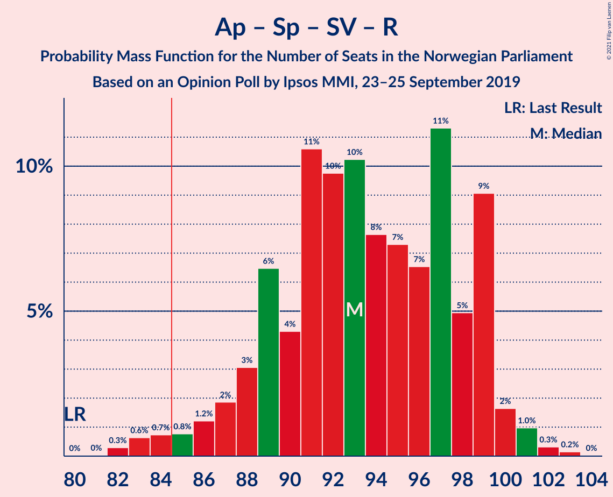

| Number of Seats | Probability | Accumulated | Special Marks |
|:---------------:|:-----------:|:-----------:|:-------------:|
| 80 | 0% | 100% | Last Result |
| 81 | 0% | 99.9% |  |
| 82 | 0.3% | 99.9% |  |
| 83 | 0.6% | 99.6% |  |
| 84 | 0.7% | 99.0% |  |
| 85 | 0.8% | 98% | Majority |
| 86 | 1.2% | 97% |  |
| 87 | 2% | 96% |  |
| 88 | 3% | 94% |  |
| 89 | 6% | 91% |  |
| 90 | 4% | 85% |  |
| 91 | 11% | 81% |  |
| 92 | 10% | 70% |  |
| 93 | 10% | 60% |  |
| 94 | 8% | 50% |  |
| 95 | 7% | 42% |  |
| 96 | 7% | 35% |  |
| 97 | 11% | 28% | Median |
| 98 | 5% | 17% |  |
| 99 | 9% | 12% |  |
| 100 | 2% | 3% |  |
| 101 | 1.0% | 1.5% |  |
| 102 | 0.3% | 0.5% |  |
| 103 | 0.2% | 0.2% |  |
| 104 | 0% | 0% |  |

### Arbeiderpartiet – Senterpartiet – Miljøpartiet De Grønne – Kristelig Folkeparti

| Number of Seats | Probability | Accumulated | Special Marks |
|:---------------:|:-----------:|:-----------:|:-------------:|
| 75 | 0% | 100% |  |
| 76 | 0.1% | 99.9% |  |
| 77 | 0.2% | 99.9% | Last Result |
| 78 | 0.1% | 99.6% |  |
| 79 | 1.0% | 99.5% |  |
| 80 | 1.2% | 98% |  |
| 81 | 2% | 97% |  |
| 82 | 4% | 96% |  |
| 83 | 4% | 92% |  |
| 84 | 6% | 88% |  |
| 85 | 9% | 81% | Majority |
| 86 | 8% | 72% |  |
| 87 | 12% | 64% |  |
| 88 | 6% | 53% | Median |
| 89 | 10% | 47% |  |
| 90 | 12% | 37% |  |
| 91 | 11% | 26% |  |
| 92 | 4% | 15% |  |
| 93 | 4% | 11% |  |
| 94 | 2% | 6% |  |
| 95 | 0.9% | 4% |  |
| 96 | 2% | 3% |  |
| 97 | 0.2% | 0.9% |  |
| 98 | 0.1% | 0.7% |  |
| 99 | 0.6% | 0.6% |  |
| 100 | 0% | 0% |  |

### Arbeiderpartiet – Senterpartiet – Sosialistisk Venstreparti

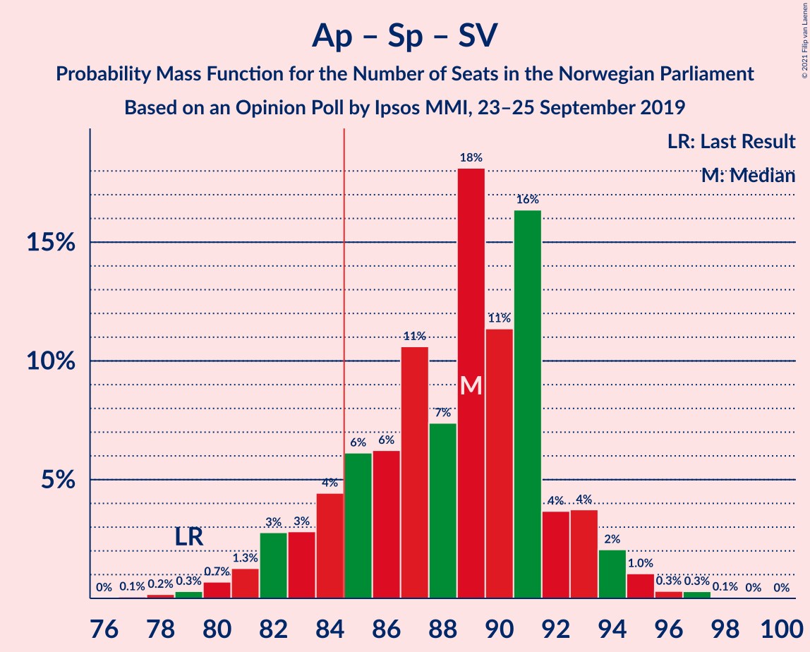

| Number of Seats | Probability | Accumulated | Special Marks |
|:---------------:|:-----------:|:-----------:|:-------------:|
| 77 | 0.1% | 100% |  |
| 78 | 0.2% | 99.9% |  |
| 79 | 0.3% | 99.7% | Last Result |
| 80 | 0.7% | 99.4% |  |
| 81 | 1.3% | 98.7% |  |
| 82 | 3% | 97% |  |
| 83 | 3% | 95% |  |
| 84 | 4% | 92% |  |
| 85 | 6% | 87% | Majority |
| 86 | 6% | 81% |  |
| 87 | 11% | 75% |  |
| 88 | 7% | 64% |  |
| 89 | 18% | 57% |  |
| 90 | 11% | 39% | Median |
| 91 | 16% | 28% |  |
| 92 | 4% | 11% |  |
| 93 | 4% | 8% |  |
| 94 | 2% | 4% |  |
| 95 | 1.0% | 2% |  |
| 96 | 0.3% | 0.7% |  |
| 97 | 0.3% | 0.4% |  |
| 98 | 0.1% | 0.1% |  |
| 99 | 0% | 0% |  |

### Arbeiderpartiet – Senterpartiet – Kristelig Folkeparti

| Number of Seats | Probability | Accumulated | Special Marks |
|:---------------:|:-----------:|:-----------:|:-------------:|
| 64 | 0% | 100% |  |
| 65 | 0.1% | 99.9% |  |
| 66 | 0.3% | 99.8% |  |
| 67 | 0.3% | 99.5% |  |
| 68 | 1.2% | 99.2% |  |
| 69 | 1.5% | 98% |  |
| 70 | 3% | 97% |  |
| 71 | 4% | 94% |  |
| 72 | 5% | 89% |  |
| 73 | 10% | 84% |  |
| 74 | 7% | 74% |  |
| 75 | 9% | 67% |  |
| 76 | 10% | 58% | Last Result |
| 77 | 9% | 48% | Median |
| 78 | 11% | 39% |  |
| 79 | 8% | 29% |  |
| 80 | 10% | 21% |  |
| 81 | 3% | 11% |  |
| 82 | 2% | 7% |  |
| 83 | 1.3% | 5% |  |
| 84 | 2% | 4% |  |
| 85 | 0.7% | 2% | Majority |
| 86 | 0.2% | 0.9% |  |
| 87 | 0.6% | 0.7% |  |
| 88 | 0.1% | 0.1% |  |
| 89 | 0% | 0% |  |

### Høyre – Fremskrittspartiet – Miljøpartiet De Grønne – Kristelig Folkeparti – Venstre

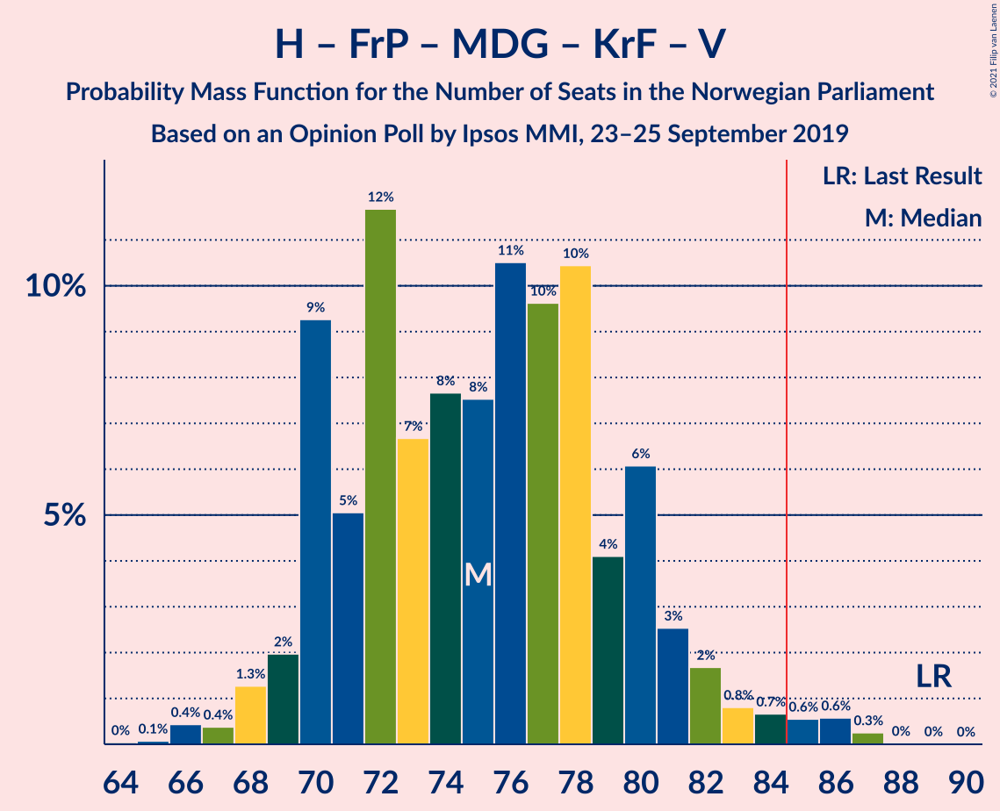

| Number of Seats | Probability | Accumulated | Special Marks |
|:---------------:|:-----------:|:-----------:|:-------------:|
| 64 | 0% | 100% |  |
| 65 | 0.1% | 99.9% |  |
| 66 | 0.4% | 99.8% |  |
| 67 | 0.4% | 99.4% |  |
| 68 | 1.3% | 99.0% |  |
| 69 | 2% | 98% |  |
| 70 | 9% | 96% |  |
| 71 | 5% | 87% |  |
| 72 | 12% | 81% |  |
| 73 | 7% | 70% |  |
| 74 | 8% | 63% | Median |
| 75 | 8% | 55% |  |
| 76 | 11% | 48% |  |
| 77 | 10% | 37% |  |
| 78 | 10% | 28% |  |
| 79 | 4% | 17% |  |
| 80 | 6% | 13% |  |
| 81 | 3% | 7% |  |
| 82 | 2% | 5% |  |
| 83 | 0.8% | 3% |  |
| 84 | 0.7% | 2% |  |
| 85 | 0.6% | 1.4% | Majority |
| 86 | 0.6% | 0.9% |  |
| 87 | 0.3% | 0.3% |  |
| 88 | 0% | 0.1% |  |
| 89 | 0% | 0% | Last Result |

### Arbeiderpartiet – Senterpartiet

| Number of Seats | Probability | Accumulated | Special Marks |
|:---------------:|:-----------:|:-----------:|:-------------:|
| 62 | 0.1% | 100% |  |
| 63 | 0.2% | 99.9% |  |
| 64 | 0.3% | 99.7% |  |
| 65 | 0.9% | 99.3% |  |
| 66 | 2% | 98% |  |
| 67 | 3% | 97% |  |
| 68 | 2% | 94% | Last Result |
| 69 | 5% | 92% |  |
| 70 | 8% | 87% |  |
| 71 | 7% | 79% |  |
| 72 | 11% | 72% |  |
| 73 | 11% | 61% |  |
| 74 | 12% | 51% |  |
| 75 | 7% | 39% | Median |
| 76 | 9% | 32% |  |
| 77 | 15% | 23% |  |
| 78 | 4% | 8% |  |
| 79 | 1.3% | 3% |  |
| 80 | 1.3% | 2% |  |
| 81 | 0.4% | 0.6% |  |
| 82 | 0.1% | 0.1% |  |
| 83 | 0% | 0% |  |

### Høyre – Fremskrittspartiet – Kristelig Folkeparti – Venstre

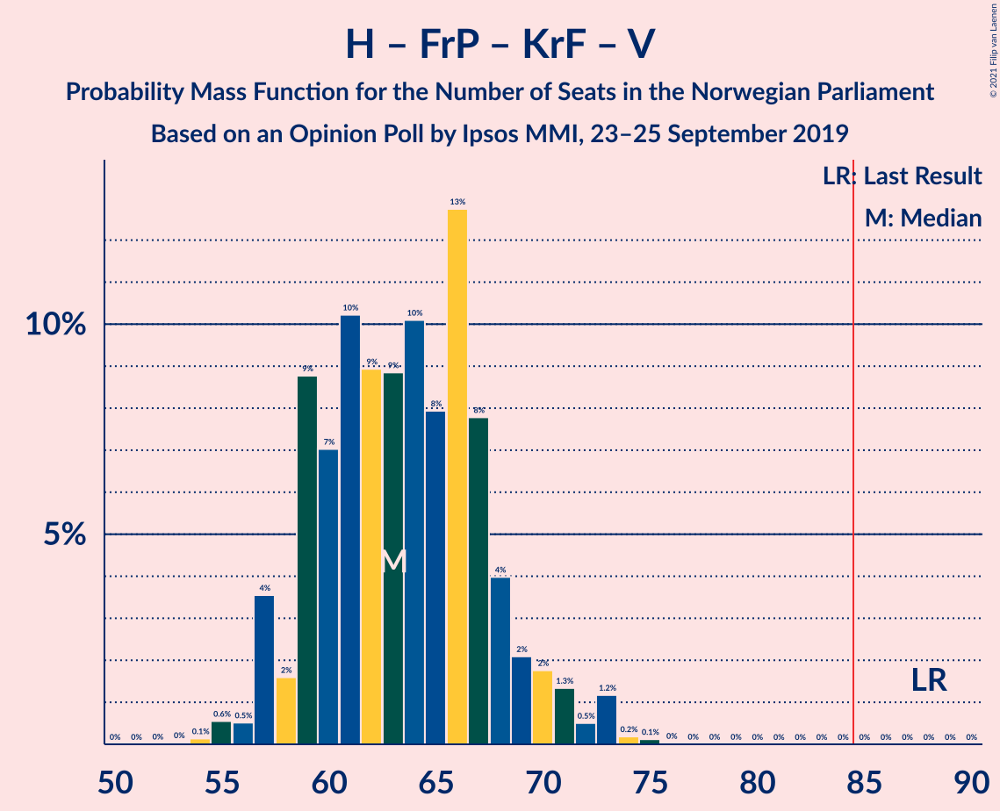

| Number of Seats | Probability | Accumulated | Special Marks |
|:---------------:|:-----------:|:-----------:|:-------------:|
| 53 | 0% | 100% |  |
| 54 | 0.1% | 99.9% |  |
| 55 | 0.6% | 99.8% |  |
| 56 | 0.5% | 99.3% |  |
| 57 | 4% | 98.7% |  |
| 58 | 2% | 95% |  |
| 59 | 9% | 94% |  |
| 60 | 7% | 85% |  |
| 61 | 10% | 78% |  |
| 62 | 9% | 68% |  |
| 63 | 9% | 59% | Median |
| 64 | 10% | 50% |  |
| 65 | 8% | 40% |  |
| 66 | 13% | 32% |  |
| 67 | 8% | 19% |  |
| 68 | 4% | 11% |  |
| 69 | 2% | 7% |  |
| 70 | 2% | 5% |  |
| 71 | 1.3% | 3% |  |
| 72 | 0.5% | 2% |  |
| 73 | 1.2% | 2% |  |
| 74 | 0.2% | 0.4% |  |
| 75 | 0.1% | 0.2% |  |
| 76 | 0% | 0% |  |
| 77 | 0% | 0% |  |
| 78 | 0% | 0% |  |
| 79 | 0% | 0% |  |
| 80 | 0% | 0% |  |
| 81 | 0% | 0% |  |
| 82 | 0% | 0% |  |
| 83 | 0% | 0% |  |
| 84 | 0% | 0% |  |
| 85 | 0% | 0% | Majority |
| 86 | 0% | 0% |  |
| 87 | 0% | 0% |  |
| 88 | 0% | 0% | Last Result |

### Høyre – Fremskrittspartiet – Venstre

| Number of Seats | Probability | Accumulated | Special Marks |
|:---------------:|:-----------:|:-----------:|:-------------:|
| 50 | 0.1% | 100% |  |
| 51 | 0.2% | 99.9% |  |
| 52 | 0.5% | 99.7% |  |
| 53 | 0.8% | 99.2% |  |
| 54 | 2% | 98% |  |
| 55 | 2% | 96% |  |
| 56 | 11% | 95% |  |
| 57 | 3% | 84% |  |
| 58 | 9% | 80% |  |
| 59 | 12% | 71% |  |
| 60 | 10% | 59% |  |
| 61 | 9% | 50% | Median |
| 62 | 10% | 40% |  |
| 63 | 6% | 31% |  |
| 64 | 12% | 24% |  |
| 65 | 6% | 12% |  |
| 66 | 3% | 7% |  |
| 67 | 1.5% | 4% |  |
| 68 | 0.6% | 2% |  |
| 69 | 0.8% | 1.5% |  |
| 70 | 0.3% | 0.6% |  |
| 71 | 0.3% | 0.4% |  |
| 72 | 0.1% | 0.1% |  |
| 73 | 0% | 0% |  |
| 74 | 0% | 0% |  |
| 75 | 0% | 0% |  |
| 76 | 0% | 0% |  |
| 77 | 0% | 0% |  |
| 78 | 0% | 0% |  |
| 79 | 0% | 0% |  |
| 80 | 0% | 0% | Last Result |

### Høyre – Fremskrittspartiet

| Number of Seats | Probability | Accumulated | Special Marks |
|:---------------:|:-----------:|:-----------:|:-------------:|
| 48 | 0.1% | 100% |  |
| 49 | 0.2% | 99.9% |  |
| 50 | 0.3% | 99.8% |  |
| 51 | 0.9% | 99.5% |  |
| 52 | 2% | 98.6% |  |
| 53 | 2% | 97% |  |
| 54 | 10% | 95% |  |
| 55 | 4% | 85% |  |
| 56 | 9% | 81% |  |
| 57 | 9% | 73% |  |
| 58 | 12% | 64% |  |
| 59 | 9% | 52% | Median |
| 60 | 10% | 42% |  |
| 61 | 5% | 33% |  |
| 62 | 12% | 28% |  |
| 63 | 6% | 16% |  |
| 64 | 5% | 10% |  |
| 65 | 3% | 5% |  |
| 66 | 0.8% | 2% |  |
| 67 | 0.9% | 2% |  |
| 68 | 0.3% | 0.7% |  |
| 69 | 0.3% | 0.4% |  |
| 70 | 0.1% | 0.1% |  |
| 71 | 0% | 0% |  |
| 72 | 0% | 0% | Last Result |

### Arbeiderpartiet – Sosialistisk Venstreparti

| Number of Seats | Probability | Accumulated | Special Marks |
|:---------------:|:-----------:|:-----------:|:-------------:|
| 46 | 0% | 100% |  |
| 47 | 0.2% | 99.9% |  |
| 48 | 0.5% | 99.8% |  |
| 49 | 1.3% | 99.2% |  |
| 50 | 2% | 98% |  |
| 51 | 5% | 96% |  |
| 52 | 5% | 91% |  |
| 53 | 5% | 86% |  |
| 54 | 6% | 82% |  |
| 55 | 7% | 75% |  |
| 56 | 17% | 69% |  |
| 57 | 17% | 52% | Median |
| 58 | 18% | 35% |  |
| 59 | 8% | 17% |  |
| 60 | 3% | 9% | Last Result |
| 61 | 4% | 6% |  |
| 62 | 1.2% | 2% |  |
| 63 | 0.7% | 1.0% |  |
| 64 | 0.1% | 0.2% |  |
| 65 | 0.1% | 0.1% |  |
| 66 | 0% | 0% |  |

### Høyre – Kristelig Folkeparti – Venstre

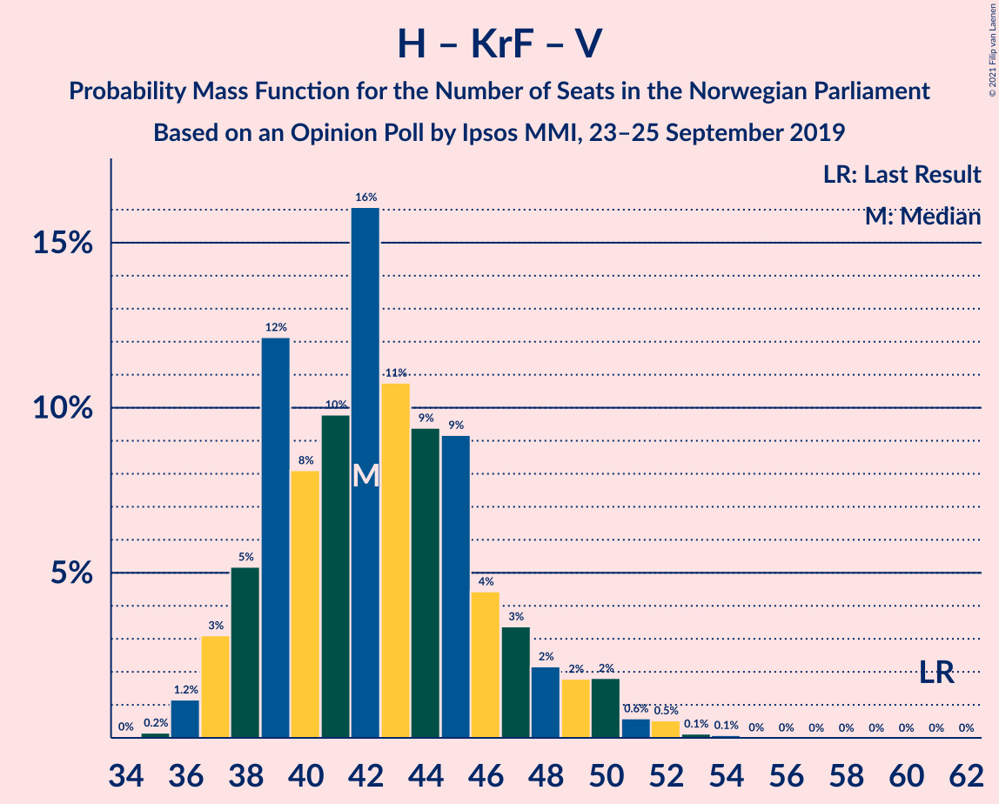

| Number of Seats | Probability | Accumulated | Special Marks |
|:---------------:|:-----------:|:-----------:|:-------------:|
| 34 | 0% | 100% |  |
| 35 | 0.2% | 99.9% |  |
| 36 | 1.2% | 99.8% |  |
| 37 | 3% | 98.6% |  |
| 38 | 5% | 96% |  |
| 39 | 12% | 90% |  |
| 40 | 8% | 78% |  |
| 41 | 10% | 70% |  |
| 42 | 16% | 60% | Median |
| 43 | 11% | 44% |  |
| 44 | 9% | 33% |  |
| 45 | 9% | 24% |  |
| 46 | 4% | 15% |  |
| 47 | 3% | 10% |  |
| 48 | 2% | 7% |  |
| 49 | 2% | 5% |  |
| 50 | 2% | 3% |  |
| 51 | 0.6% | 1.3% |  |
| 52 | 0.5% | 0.8% |  |
| 53 | 0.1% | 0.2% |  |
| 54 | 0.1% | 0.1% |  |
| 55 | 0% | 0% |  |
| 56 | 0% | 0% |  |
| 57 | 0% | 0% |  |
| 58 | 0% | 0% |  |
| 59 | 0% | 0% |  |
| 60 | 0% | 0% |  |
| 61 | 0% | 0% | Last Result |

### Senterpartiet – Kristelig Folkeparti – Venstre

| Number of Seats | Probability | Accumulated | Special Marks |
|:---------------:|:-----------:|:-----------:|:-------------:|
| 28 | 0.2% | 100% |  |
| 29 | 0.3% | 99.8% |  |
| 30 | 1.2% | 99.5% |  |
| 31 | 3% | 98% |  |
| 32 | 4% | 95% |  |
| 33 | 6% | 92% |  |
| 34 | 11% | 86% |  |
| 35 | 9% | 74% | Last Result |
| 36 | 13% | 65% |  |
| 37 | 9% | 52% | Median |
| 38 | 20% | 43% |  |
| 39 | 5% | 24% |  |
| 40 | 5% | 19% |  |
| 41 | 4% | 14% |  |
| 42 | 3% | 9% |  |
| 43 | 4% | 6% |  |
| 44 | 1.3% | 3% |  |
| 45 | 0.7% | 1.4% |  |
| 46 | 0.3% | 0.6% |  |
| 47 | 0.2% | 0.4% |  |
| 48 | 0% | 0.2% |  |
| 49 | 0.1% | 0.1% |  |
| 50 | 0% | 0% |  |

## Technical Information

### Opinion Poll

+ **Polling firm:** Ipsos MMI
+ **Commissioner(s):** —
+ **Fieldwork period:** 23–25 September 2019

### Calculations

+ **Sample size:** 939
+ **Simulations done:** 1,048,576
+ **Error estimate:** 1.30%

