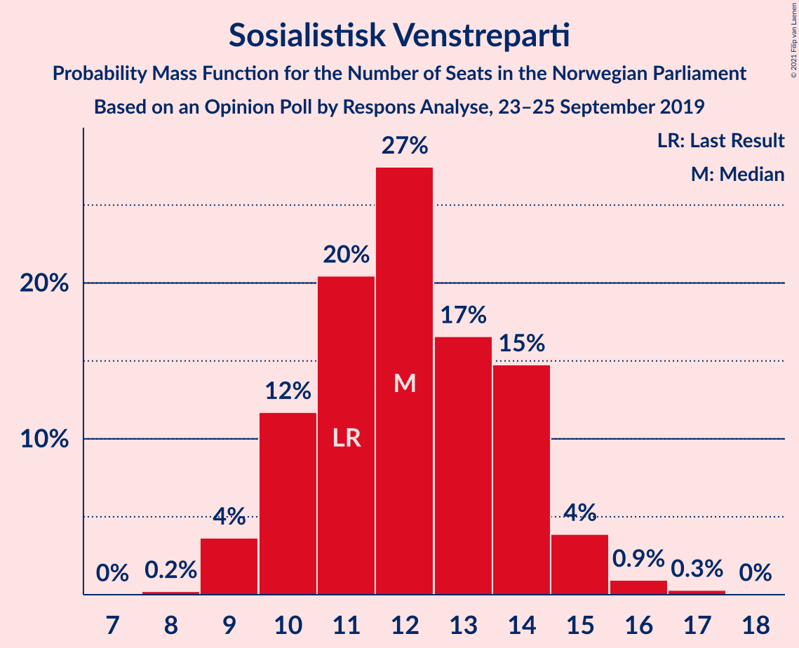
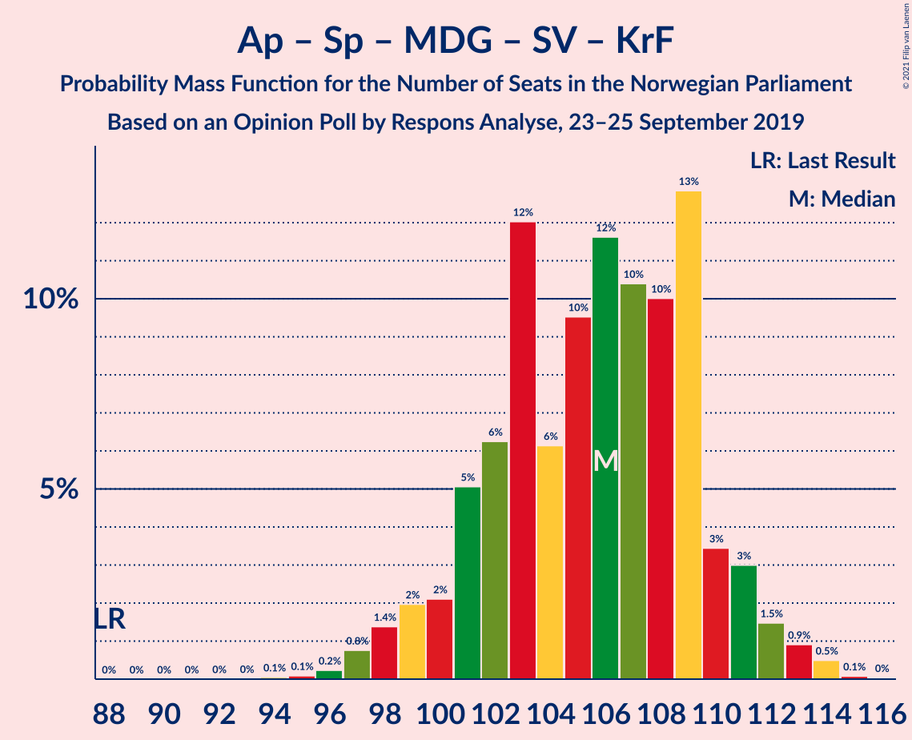
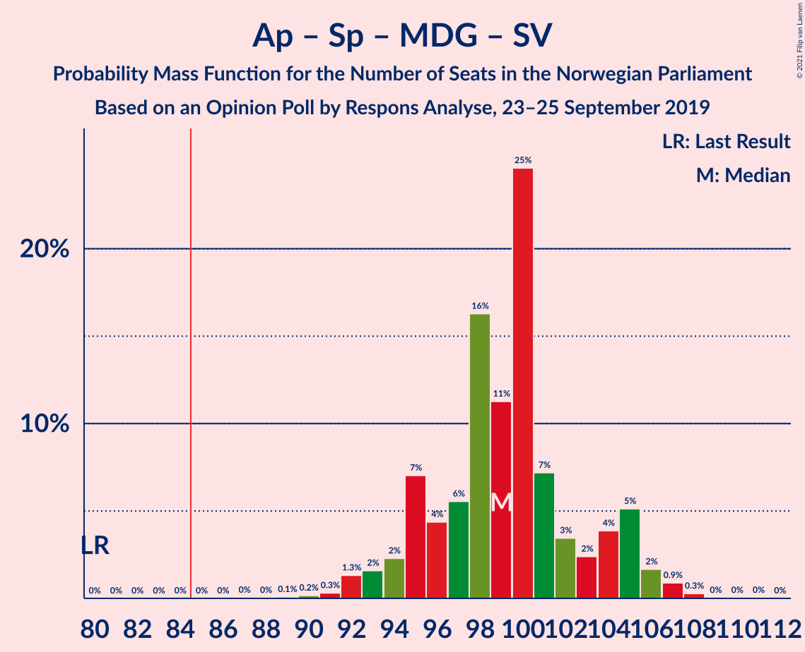
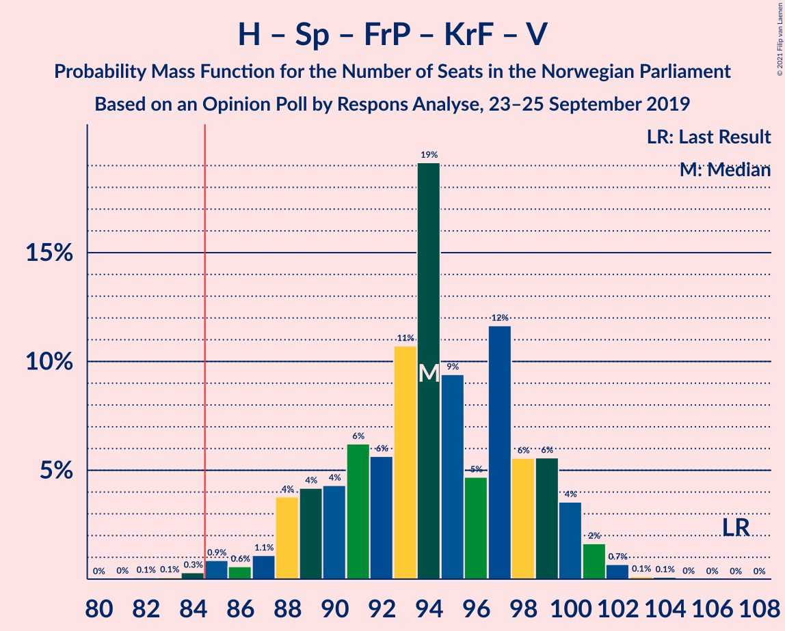
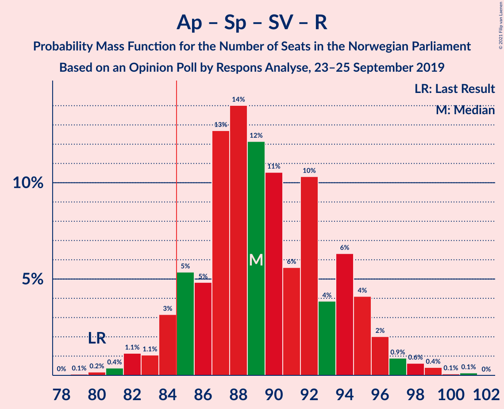
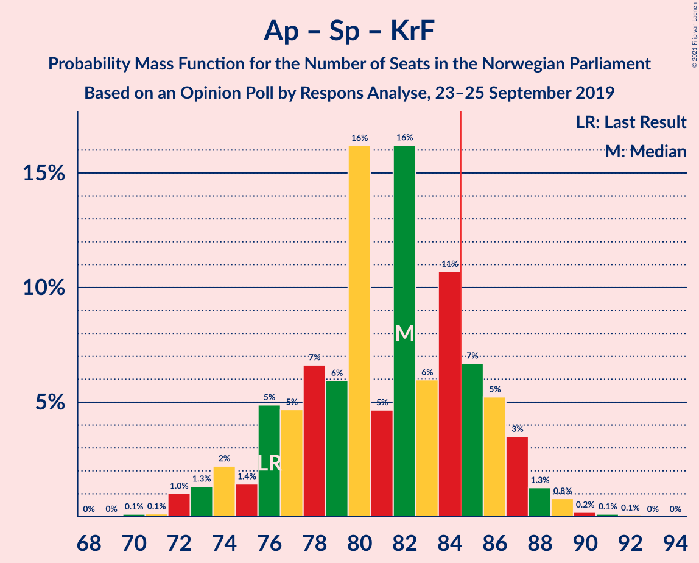
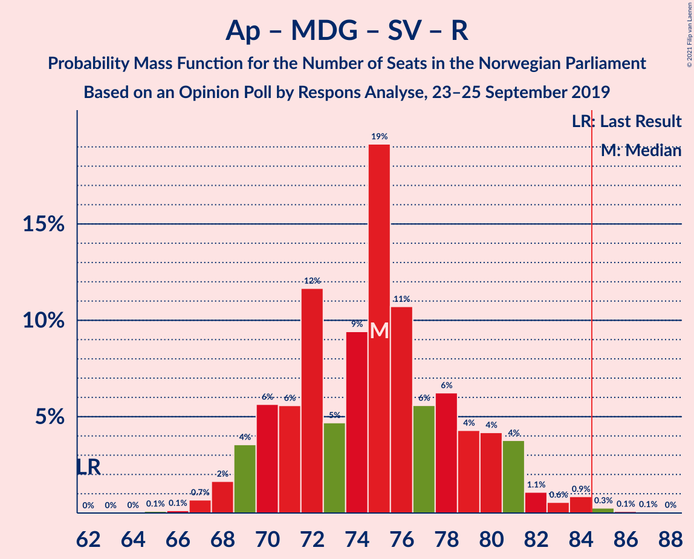
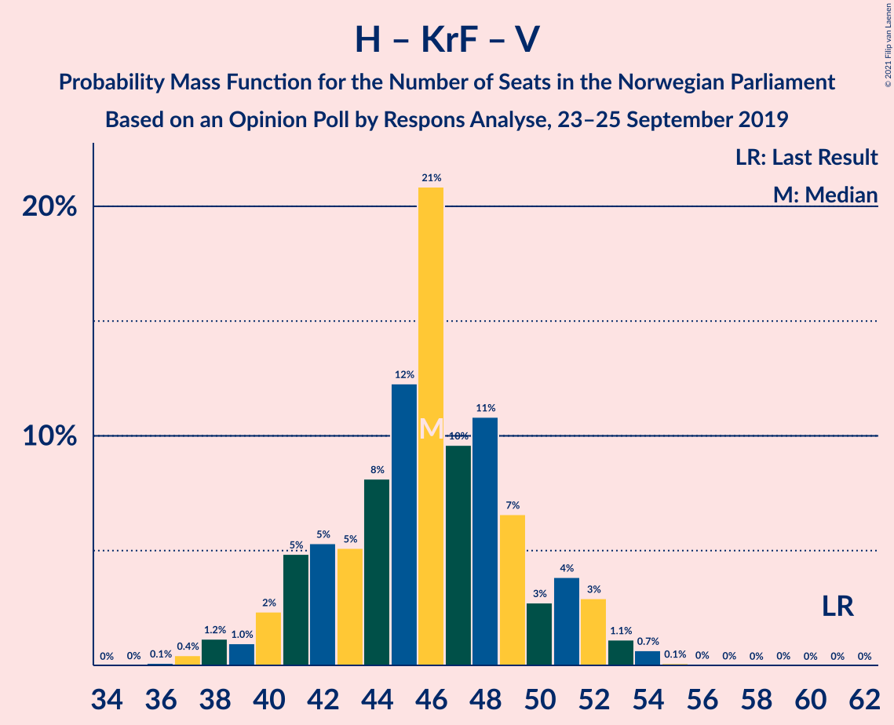
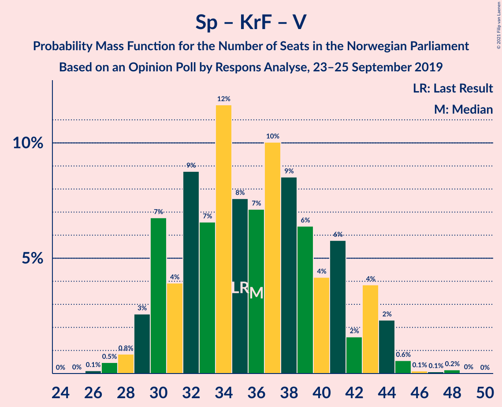

# Opinion Poll by Respons Analyse, 23–25 September 2019

<a href="#voting-intentions">Voting Intentions</a> | <a href="#seats">Seats</a> | <a href="#coalitions">Coalitions</a> | <a href="#technical-information">Technical Information</a>

## Voting Intentions

### Confidence Intervals

| Party | Last Result | Poll Result | 80% Confidence Interval | 90% Confidence Interval | 95% Confidence Interval | 99% Confidence Interval |
|:-----:|:-----------:|:-----------:|:-----------------------:|:-----------------------:|:-----------------------:|:-----------------------:|
| Arbeiderpartiet | 27.4% | 26.3% | 24.6–28.2% |24.1–28.7% |23.7–29.1% |22.8–30.0% |
| Høyre | 25.0% | 20.6% | 19.0–22.3% |18.6–22.8% |18.2–23.2% |17.5–24.1% |
| Senterpartiet | 10.3% | 14.8% | 13.4–16.3% |13.1–16.8% |12.7–17.1% |12.1–17.9% |
| Fremskrittspartiet | 15.2% | 11.9% | 10.7–13.3% |10.3–13.7% |10.0–14.1% |9.5–14.8% |
| Miljøpartiet De Grønne | 3.2% | 6.9% | 6.0–8.0% |5.7–8.4% |5.5–8.7% |5.1–9.2% |
| Sosialistisk Venstreparti | 6.0% | 6.7% | 5.8–7.8% |5.5–8.2% |5.3–8.4% |4.9–9.0% |
| Kristelig Folkeparti | 4.2% | 4.2% | 3.5–5.1% |3.3–5.4% |3.1–5.6% |2.8–6.1% |
| Rødt | 2.4% | 3.3% | 2.7–4.1% |2.5–4.4% |2.4–4.6% |2.1–5.0% |
| Venstre | 4.4% | 3.0% | 2.4–3.8% |2.2–4.1% |2.1–4.3% |1.9–4.7% |

*Note:* The poll result column reflects the actual value used in the calculations. Published results may vary slightly, and in addition be rounded to fewer digits.

## Seats

### Confidence Intervals

| Party | Last Result | Median | 80% Confidence Interval | 90% Confidence Interval | 95% Confidence Interval | 99% Confidence Interval |
|:-----:|:-----------:|:------:|:-----------------------:|:-----------------------:|:-----------------------:|:-----------------------:|
| <a href="#arbeiderpartiet">Arbeiderpartiet</a> | 49 | 48 | 45–51 |44–53 |43–54 |42–55 |
| <a href="#høyre">Høyre</a> | 45 | 37 | 34–41 |33–41 |32–42 |31–44 |
| <a href="#senterpartiet">Senterpartiet</a> | 19 | 27 | 24–30 |23–32 |22–33 |21–34 |
| <a href="#fremskrittspartiet">Fremskrittspartiet</a> | 27 | 21 | 19–24 |18–25 |18–25 |17–27 |
| <a href="#miljøpartiet-de-grønne">Miljøpartiet De Grønne</a> | 1 | 12 | 10–14 |10–15 |10–15 |9–17 |
| <a href="#sosialistisk-venstreparti">Sosialistisk Venstreparti</a> | 11 | 12 | 10–14 |10–15 |9–15 |9–16 |
| <a href="#kristelig-folkeparti">Kristelig Folkeparti</a> | 8 | 8 | 3–9 |2–10 |2–10 |1–11 |
| <a href="#rødt">Rødt</a> | 1 | 2 | 1–7 |1–8 |1–8 |1–9 |
| <a href="#venstre">Venstre</a> | 8 | 2 | 2–3 |1–7 |1–7 |1–8 |

### Arbeiderpartiet

*For a full overview of the results for this party, see the [Arbeiderpartiet](party-arbeiderpartiet.html) page.*

| Number of Seats | Probability | Accumulated | Special Marks |
|:---------------:|:-----------:|:-----------:|:-------------:|
| 40 | 0.1% | 100% |  |
| 41 | 0.3% | 99.9% |  |
| 42 | 1.3% | 99.6% |  |
| 43 | 2% | 98% |  |
| 44 | 7% | 97% |  |
| 45 | 17% | 90% |  |
| 46 | 11% | 73% |  |
| 47 | 8% | 62% |  |
| 48 | 15% | 55% | Median |
| 49 | 14% | 39% | Last Result |
| 50 | 9% | 26% |  |
| 51 | 7% | 16% |  |
| 52 | 2% | 9% |  |
| 53 | 3% | 6% |  |
| 54 | 3% | 4% |  |
| 55 | 0.7% | 1.2% |  |
| 56 | 0.3% | 0.5% |  |
| 57 | 0.1% | 0.2% |  |
| 58 | 0% | 0% |  |

### Høyre

*For a full overview of the results for this party, see the [Høyre](party-høyre.html) page.*

| Number of Seats | Probability | Accumulated | Special Marks |
|:---------------:|:-----------:|:-----------:|:-------------:|
| 29 | 0.1% | 100% |  |
| 30 | 0.2% | 99.9% |  |
| 31 | 0.8% | 99.7% |  |
| 32 | 2% | 98.9% |  |
| 33 | 4% | 97% |  |
| 34 | 8% | 93% |  |
| 35 | 12% | 84% |  |
| 36 | 17% | 72% |  |
| 37 | 11% | 55% | Median |
| 38 | 14% | 44% |  |
| 39 | 9% | 30% |  |
| 40 | 10% | 22% |  |
| 41 | 8% | 12% |  |
| 42 | 2% | 4% |  |
| 43 | 1.3% | 2% |  |
| 44 | 0.4% | 0.5% |  |
| 45 | 0.1% | 0.2% | Last Result |
| 46 | 0% | 0.1% |  |
| 47 | 0% | 0% |  |

### Senterpartiet

*For a full overview of the results for this party, see the [Senterpartiet](party-senterpartiet.html) page.*

| Number of Seats | Probability | Accumulated | Special Marks |
|:---------------:|:-----------:|:-----------:|:-------------:|
| 19 | 0% | 100% | Last Result |
| 20 | 0.1% | 100% |  |
| 21 | 0.7% | 99.9% |  |
| 22 | 2% | 99.2% |  |
| 23 | 4% | 97% |  |
| 24 | 7% | 94% |  |
| 25 | 18% | 86% |  |
| 26 | 13% | 68% |  |
| 27 | 18% | 56% | Median |
| 28 | 12% | 38% |  |
| 29 | 8% | 26% |  |
| 30 | 9% | 18% |  |
| 31 | 2% | 9% |  |
| 32 | 2% | 7% |  |
| 33 | 4% | 5% |  |
| 34 | 1.1% | 1.3% |  |
| 35 | 0.2% | 0.2% |  |
| 36 | 0% | 0% |  |

### Fremskrittspartiet

*For a full overview of the results for this party, see the [Fremskrittspartiet](party-fremskrittspartiet.html) page.*

| Number of Seats | Probability | Accumulated | Special Marks |
|:---------------:|:-----------:|:-----------:|:-------------:|
| 15 | 0.1% | 100% |  |
| 16 | 0.3% | 99.9% |  |
| 17 | 2% | 99.7% |  |
| 18 | 6% | 98% |  |
| 19 | 10% | 92% |  |
| 20 | 17% | 82% |  |
| 21 | 23% | 65% | Median |
| 22 | 21% | 43% |  |
| 23 | 10% | 22% |  |
| 24 | 5% | 12% |  |
| 25 | 5% | 7% |  |
| 26 | 2% | 2% |  |
| 27 | 0.5% | 0.7% | Last Result |
| 28 | 0.3% | 0.3% |  |
| 29 | 0% | 0% |  |

### Miljøpartiet De Grønne

*For a full overview of the results for this party, see the [Miljøpartiet De Grønne](party-miljøpartietdegrønne.html) page.*

| Number of Seats | Probability | Accumulated | Special Marks |
|:---------------:|:-----------:|:-----------:|:-------------:|
| 1 | 0% | 100% | Last Result |
| 2 | 0% | 100% |  |
| 3 | 0% | 100% |  |
| 4 | 0% | 100% |  |
| 5 | 0% | 100% |  |
| 6 | 0% | 100% |  |
| 7 | 0% | 100% |  |
| 8 | 0.2% | 100% |  |
| 9 | 2% | 99.8% |  |
| 10 | 8% | 98% |  |
| 11 | 14% | 90% |  |
| 12 | 33% | 76% | Median |
| 13 | 24% | 43% |  |
| 14 | 11% | 19% |  |
| 15 | 6% | 8% |  |
| 16 | 2% | 2% |  |
| 17 | 0.5% | 0.6% |  |
| 18 | 0.1% | 0.1% |  |
| 19 | 0% | 0% |  |

### Sosialistisk Venstreparti

*For a full overview of the results for this party, see the [Sosialistisk Venstreparti](party-sosialistiskvenstreparti.html) page.*

| Number of Seats | Probability | Accumulated | Special Marks |
|:---------------:|:-----------:|:-----------:|:-------------:|
| 8 | 0.2% | 100% |  |
| 9 | 4% | 99.8% |  |
| 10 | 12% | 96% |  |
| 11 | 20% | 84% | Last Result |
| 12 | 27% | 64% | Median |
| 13 | 17% | 37% |  |
| 14 | 15% | 20% |  |
| 15 | 4% | 5% |  |
| 16 | 0.9% | 1.3% |  |
| 17 | 0.3% | 0.3% |  |
| 18 | 0% | 0% |  |

### Kristelig Folkeparti

*For a full overview of the results for this party, see the [Kristelig Folkeparti](party-kristeligfolkeparti.html) page.*

| Number of Seats | Probability | Accumulated | Special Marks |
|:---------------:|:-----------:|:-----------:|:-------------:|
| 1 | 2% | 100% |  |
| 2 | 6% | 98% |  |
| 3 | 28% | 92% |  |
| 4 | 0% | 64% |  |
| 5 | 0% | 64% |  |
| 6 | 0.1% | 64% |  |
| 7 | 12% | 64% |  |
| 8 | 26% | 52% | Last Result, Median |
| 9 | 19% | 26% |  |
| 10 | 6% | 7% |  |
| 11 | 1.3% | 1.4% |  |
| 12 | 0.1% | 0.1% |  |
| 13 | 0% | 0% |  |

### Rødt

*For a full overview of the results for this party, see the [Rødt](party-rødt.html) page.*

| Number of Seats | Probability | Accumulated | Special Marks |
|:---------------:|:-----------:|:-----------:|:-------------:|
| 1 | 23% | 100% | Last Result |
| 2 | 63% | 77% | Median |
| 3 | 0% | 15% |  |
| 4 | 0% | 15% |  |
| 5 | 0% | 15% |  |
| 6 | 0.1% | 15% |  |
| 7 | 9% | 15% |  |
| 8 | 5% | 6% |  |
| 9 | 0.9% | 0.9% |  |
| 10 | 0.1% | 0.1% |  |
| 11 | 0% | 0% |  |

### Venstre

*For a full overview of the results for this party, see the [Venstre](party-venstre.html) page.*

| Number of Seats | Probability | Accumulated | Special Marks |
|:---------------:|:-----------:|:-----------:|:-------------:|
| 0 | 0.3% | 100% |  |
| 1 | 5% | 99.7% |  |
| 2 | 83% | 94% | Median |
| 3 | 2% | 11% |  |
| 4 | 0% | 9% |  |
| 5 | 0% | 9% |  |
| 6 | 0.2% | 9% |  |
| 7 | 7% | 8% |  |
| 8 | 2% | 2% | Last Result |
| 9 | 0.2% | 0.2% |  |
| 10 | 0% | 0% |  |

## Coalitions

### Confidence Intervals

| Coalition | Last Result | Median | Majority? | 80% Confidence Interval | 90% Confidence Interval | 95% Confidence Interval | 99% Confidence Interval |
|:---------:|:-----------:|:------:|:---------:|:-----------------------:|:-----------------------:|:-----------------------:|:-----------------------:|
| Arbeiderpartiet – Senterpartiet – Miljøpartiet De Grønne – Sosialistisk Venstreparti – Kristelig Folkeparti | 88 | 106 | 100% | 101–109 | 100–111 | 98–112 | 97–114 |
| Arbeiderpartiet – Senterpartiet – Miljøpartiet De Grønne – Sosialistisk Venstreparti – Rødt | 81 | 102 | 100% | 98–107 | 97–108 | 95–109 | 94–111 |
| Arbeiderpartiet – Senterpartiet – Miljøpartiet De Grønne – Sosialistisk Venstreparti | 80 | 99 | 100% | 95–104 | 94–105 | 93–106 | 91–107 |
| Høyre – Senterpartiet – Fremskrittspartiet – Kristelig Folkeparti – Venstre | 107 | 94 | 99.5% | 89–99 | 88–100 | 87–101 | 85–102 |
| Arbeiderpartiet – Senterpartiet – Miljøpartiet De Grønne – Kristelig Folkeparti | 77 | 94 | 98.9% | 89–98 | 87–99 | 86–100 | 84–102 |
| Arbeiderpartiet – Senterpartiet – Sosialistisk Venstreparti – Rødt | 80 | 89 | 94% | 85–94 | 84–95 | 83–96 | 81–99 |
| Arbeiderpartiet – Senterpartiet – Sosialistisk Venstreparti | 79 | 87 | 80% | 83–91 | 82–93 | 81–93 | 79–96 |
| Arbeiderpartiet – Senterpartiet – Kristelig Folkeparti | 76 | 82 | 18% | 76–86 | 75–87 | 73–87 | 72–89 |
| Høyre – Fremskrittspartiet – Miljøpartiet De Grønne – Kristelig Folkeparti – Venstre | 89 | 80 | 6% | 75–84 | 74–85 | 73–86 | 70–88 |
| Arbeiderpartiet – Miljøpartiet De Grønne – Sosialistisk Venstreparti – Rødt | 62 | 75 | 0.4% | 70–80 | 69–81 | 68–82 | 67–84 |
| Arbeiderpartiet – Senterpartiet | 68 | 75 | 0.1% | 71–79 | 70–80 | 69–81 | 67–83 |
| Høyre – Fremskrittspartiet – Kristelig Folkeparti – Venstre | 88 | 67 | 0% | 62–71 | 61–72 | 60–74 | 58–75 |
| Høyre – Fremskrittspartiet – Venstre | 80 | 61 | 0% | 57–65 | 55–66 | 55–67 | 52–69 |
| Arbeiderpartiet – Sosialistisk Venstreparti | 60 | 60 | 0% | 56–64 | 55–65 | 55–66 | 53–68 |
| Høyre – Fremskrittspartiet | 72 | 58 | 0% | 54–63 | 53–64 | 52–64 | 50–66 |
| Høyre – Kristelig Folkeparti – Venstre | 61 | 46 | 0% | 42–50 | 40–51 | 39–52 | 37–54 |
| Senterpartiet – Kristelig Folkeparti – Venstre | 35 | 36 | 0% | 30–41 | 30–43 | 29–44 | 27–45 |

### Arbeiderpartiet – Senterpartiet – Miljøpartiet De Grønne – Sosialistisk Venstreparti – Kristelig Folkeparti

| Number of Seats | Probability | Accumulated | Special Marks |
|:---------------:|:-----------:|:-----------:|:-------------:|
| 88 | 0% | 100% | Last Result |
| 89 | 0% | 100% |  |
| 90 | 0% | 100% |  |
| 91 | 0% | 100% |  |
| 92 | 0% | 100% |  |
| 93 | 0% | 100% |  |
| 94 | 0.1% | 100% |  |
| 95 | 0.1% | 99.9% |  |
| 96 | 0.2% | 99.8% |  |
| 97 | 0.8% | 99.6% |  |
| 98 | 1.4% | 98.8% |  |
| 99 | 2% | 97% |  |
| 100 | 2% | 95% |  |
| 101 | 5% | 93% |  |
| 102 | 6% | 88% |  |
| 103 | 12% | 82% |  |
| 104 | 6% | 70% |  |
| 105 | 10% | 64% |  |
| 106 | 12% | 54% |  |
| 107 | 10% | 43% | Median |
| 108 | 10% | 32% |  |
| 109 | 13% | 22% |  |
| 110 | 3% | 9% |  |
| 111 | 3% | 6% |  |
| 112 | 1.5% | 3% |  |
| 113 | 0.9% | 2% |  |
| 114 | 0.5% | 0.6% |  |
| 115 | 0.1% | 0.1% |  |
| 116 | 0% | 0% |  |

### Arbeiderpartiet – Senterpartiet – Miljøpartiet De Grønne – Sosialistisk Venstreparti – Rødt

| Number of Seats | Probability | Accumulated | Special Marks |
|:---------------:|:-----------:|:-----------:|:-------------:|
| 81 | 0% | 100% | Last Result |
| 82 | 0% | 100% |  |
| 83 | 0% | 100% |  |
| 84 | 0% | 100% |  |
| 85 | 0% | 100% | Majority |
| 86 | 0% | 100% |  |
| 87 | 0% | 100% |  |
| 88 | 0% | 100% |  |
| 89 | 0% | 100% |  |
| 90 | 0% | 100% |  |
| 91 | 0% | 100% |  |
| 92 | 0.1% | 99.9% |  |
| 93 | 0.3% | 99.8% |  |
| 94 | 1.2% | 99.6% |  |
| 95 | 1.1% | 98% |  |
| 96 | 1.3% | 97% |  |
| 97 | 5% | 96% |  |
| 98 | 3% | 91% |  |
| 99 | 8% | 88% |  |
| 100 | 11% | 79% |  |
| 101 | 15% | 68% | Median |
| 102 | 20% | 53% |  |
| 103 | 8% | 33% |  |
| 104 | 6% | 25% |  |
| 105 | 3% | 20% |  |
| 106 | 7% | 17% |  |
| 107 | 5% | 10% |  |
| 108 | 2% | 5% |  |
| 109 | 2% | 3% |  |
| 110 | 0.6% | 1.2% |  |
| 111 | 0.4% | 0.6% |  |
| 112 | 0.1% | 0.2% |  |
| 113 | 0.1% | 0.1% |  |
| 114 | 0% | 0% |  |

### Arbeiderpartiet – Senterpartiet – Miljøpartiet De Grønne – Sosialistisk Venstreparti

| Number of Seats | Probability | Accumulated | Special Marks |
|:---------------:|:-----------:|:-----------:|:-------------:|
| 80 | 0% | 100% | Last Result |
| 81 | 0% | 100% |  |
| 82 | 0% | 100% |  |
| 83 | 0% | 100% |  |
| 84 | 0% | 100% |  |
| 85 | 0% | 100% | Majority |
| 86 | 0% | 100% |  |
| 87 | 0% | 100% |  |
| 88 | 0% | 99.9% |  |
| 89 | 0.1% | 99.9% |  |
| 90 | 0.2% | 99.8% |  |
| 91 | 0.3% | 99.6% |  |
| 92 | 1.3% | 99.3% |  |
| 93 | 2% | 98% |  |
| 94 | 2% | 96% |  |
| 95 | 7% | 94% |  |
| 96 | 4% | 87% |  |
| 97 | 6% | 83% |  |
| 98 | 16% | 77% |  |
| 99 | 11% | 61% | Median |
| 100 | 25% | 50% |  |
| 101 | 7% | 25% |  |
| 102 | 3% | 18% |  |
| 103 | 2% | 14% |  |
| 104 | 4% | 12% |  |
| 105 | 5% | 8% |  |
| 106 | 2% | 3% |  |
| 107 | 0.9% | 1.3% |  |
| 108 | 0.3% | 0.4% |  |
| 109 | 0% | 0.1% |  |
| 110 | 0% | 0.1% |  |
| 111 | 0% | 0% |  |

### Høyre – Senterpartiet – Fremskrittspartiet – Kristelig Folkeparti – Venstre

| Number of Seats | Probability | Accumulated | Special Marks |
|:---------------:|:-----------:|:-----------:|:-------------:|
| 82 | 0.1% | 100% |  |
| 83 | 0.1% | 99.9% |  |
| 84 | 0.3% | 99.8% |  |
| 85 | 0.9% | 99.5% | Majority |
| 86 | 0.6% | 98.6% |  |
| 87 | 1.1% | 98% |  |
| 88 | 4% | 97% |  |
| 89 | 4% | 93% |  |
| 90 | 4% | 89% |  |
| 91 | 6% | 85% |  |
| 92 | 6% | 78% |  |
| 93 | 11% | 73% |  |
| 94 | 19% | 62% |  |
| 95 | 9% | 43% | Median |
| 96 | 5% | 34% |  |
| 97 | 12% | 29% |  |
| 98 | 6% | 17% |  |
| 99 | 6% | 12% |  |
| 100 | 4% | 6% |  |
| 101 | 2% | 3% |  |
| 102 | 0.7% | 0.9% |  |
| 103 | 0.1% | 0.2% |  |
| 104 | 0.1% | 0.1% |  |
| 105 | 0% | 0% |  |
| 106 | 0% | 0% |  |
| 107 | 0% | 0% | Last Result |

### Arbeiderpartiet – Senterpartiet – Miljøpartiet De Grønne – Kristelig Folkeparti

| Number of Seats | Probability | Accumulated | Special Marks |
|:---------------:|:-----------:|:-----------:|:-------------:|
| 77 | 0% | 100% | Last Result |
| 78 | 0% | 100% |  |
| 79 | 0% | 100% |  |
| 80 | 0% | 100% |  |
| 81 | 0% | 100% |  |
| 82 | 0.1% | 100% |  |
| 83 | 0.1% | 99.9% |  |
| 84 | 0.9% | 99.8% |  |
| 85 | 1.2% | 98.9% | Majority |
| 86 | 2% | 98% |  |
| 87 | 2% | 96% |  |
| 88 | 2% | 94% |  |
| 89 | 6% | 92% |  |
| 90 | 5% | 87% |  |
| 91 | 6% | 81% |  |
| 92 | 16% | 75% |  |
| 93 | 7% | 59% |  |
| 94 | 12% | 52% |  |
| 95 | 10% | 41% | Median |
| 96 | 6% | 30% |  |
| 97 | 12% | 25% |  |
| 98 | 6% | 13% |  |
| 99 | 3% | 6% |  |
| 100 | 1.0% | 3% |  |
| 101 | 1.2% | 2% |  |
| 102 | 0.6% | 0.8% |  |
| 103 | 0.2% | 0.2% |  |
| 104 | 0% | 0.1% |  |
| 105 | 0% | 0% |  |

### Arbeiderpartiet – Senterpartiet – Sosialistisk Venstreparti – Rødt

| Number of Seats | Probability | Accumulated | Special Marks |
|:---------------:|:-----------:|:-----------:|:-------------:|
| 79 | 0.1% | 100% |  |
| 80 | 0.2% | 99.9% | Last Result |
| 81 | 0.4% | 99.7% |  |
| 82 | 1.1% | 99.3% |  |
| 83 | 1.1% | 98% |  |
| 84 | 3% | 97% |  |
| 85 | 5% | 94% | Majority |
| 86 | 5% | 89% |  |
| 87 | 13% | 84% |  |
| 88 | 14% | 71% |  |
| 89 | 12% | 57% | Median |
| 90 | 11% | 45% |  |
| 91 | 6% | 34% |  |
| 92 | 10% | 29% |  |
| 93 | 4% | 18% |  |
| 94 | 6% | 15% |  |
| 95 | 4% | 8% |  |
| 96 | 2% | 4% |  |
| 97 | 0.9% | 2% |  |
| 98 | 0.6% | 1.3% |  |
| 99 | 0.4% | 0.6% |  |
| 100 | 0.1% | 0.2% |  |
| 101 | 0.1% | 0.1% |  |
| 102 | 0% | 0% |  |

### Arbeiderpartiet – Senterpartiet – Sosialistisk Venstreparti

| Number of Seats | Probability | Accumulated | Special Marks |
|:---------------:|:-----------:|:-----------:|:-------------:|
| 77 | 0.1% | 100% |  |
| 78 | 0.2% | 99.8% |  |
| 79 | 0.4% | 99.6% | Last Result |
| 80 | 1.2% | 99.2% |  |
| 81 | 1.3% | 98% |  |
| 82 | 4% | 97% |  |
| 83 | 7% | 93% |  |
| 84 | 6% | 86% |  |
| 85 | 10% | 80% | Majority |
| 86 | 14% | 70% |  |
| 87 | 19% | 56% | Median |
| 88 | 11% | 37% |  |
| 89 | 5% | 25% |  |
| 90 | 8% | 21% |  |
| 91 | 4% | 12% |  |
| 92 | 3% | 8% |  |
| 93 | 3% | 5% |  |
| 94 | 2% | 2% |  |
| 95 | 0.3% | 0.8% |  |
| 96 | 0.5% | 0.5% |  |
| 97 | 0.1% | 0.1% |  |
| 98 | 0% | 0% |  |

### Arbeiderpartiet – Senterpartiet – Kristelig Folkeparti

| Number of Seats | Probability | Accumulated | Special Marks |
|:---------------:|:-----------:|:-----------:|:-------------:|
| 70 | 0.1% | 100% |  |
| 71 | 0.1% | 99.9% |  |
| 72 | 1.0% | 99.7% |  |
| 73 | 1.3% | 98.7% |  |
| 74 | 2% | 97% |  |
| 75 | 1.4% | 95% |  |
| 76 | 5% | 94% | Last Result |
| 77 | 5% | 89% |  |
| 78 | 7% | 84% |  |
| 79 | 6% | 78% |  |
| 80 | 16% | 72% |  |
| 81 | 5% | 55% |  |
| 82 | 16% | 51% |  |
| 83 | 6% | 35% | Median |
| 84 | 11% | 29% |  |
| 85 | 7% | 18% | Majority |
| 86 | 5% | 11% |  |
| 87 | 3% | 6% |  |
| 88 | 1.3% | 2% |  |
| 89 | 0.8% | 1.2% |  |
| 90 | 0.2% | 0.4% |  |
| 91 | 0.1% | 0.2% |  |
| 92 | 0.1% | 0.1% |  |
| 93 | 0% | 0% |  |

### Høyre – Fremskrittspartiet – Miljøpartiet De Grønne – Kristelig Folkeparti – Venstre

| Number of Seats | Probability | Accumulated | Special Marks |
|:---------------:|:-----------:|:-----------:|:-------------:|
| 68 | 0.1% | 100% |  |
| 69 | 0.1% | 99.9% |  |
| 70 | 0.4% | 99.8% |  |
| 71 | 0.6% | 99.3% |  |
| 72 | 0.9% | 98.7% |  |
| 73 | 2% | 98% |  |
| 74 | 4% | 96% |  |
| 75 | 6% | 92% |  |
| 76 | 4% | 85% |  |
| 77 | 10% | 81% |  |
| 78 | 6% | 71% |  |
| 79 | 11% | 65% |  |
| 80 | 12% | 55% | Median |
| 81 | 14% | 43% |  |
| 82 | 13% | 29% |  |
| 83 | 5% | 16% |  |
| 84 | 5% | 11% |  |
| 85 | 3% | 6% | Majority |
| 86 | 1.0% | 3% |  |
| 87 | 1.1% | 2% |  |
| 88 | 0.4% | 0.6% |  |
| 89 | 0.2% | 0.3% | Last Result |
| 90 | 0.1% | 0.1% |  |
| 91 | 0% | 0% |  |

### Arbeiderpartiet – Miljøpartiet De Grønne – Sosialistisk Venstreparti – Rødt

| Number of Seats | Probability | Accumulated | Special Marks |
|:---------------:|:-----------:|:-----------:|:-------------:|
| 62 | 0% | 100% | Last Result |
| 63 | 0% | 100% |  |
| 64 | 0% | 100% |  |
| 65 | 0.1% | 100% |  |
| 66 | 0.1% | 99.9% |  |
| 67 | 0.7% | 99.7% |  |
| 68 | 2% | 99.1% |  |
| 69 | 4% | 97% |  |
| 70 | 6% | 94% |  |
| 71 | 6% | 88% |  |
| 72 | 12% | 83% |  |
| 73 | 5% | 71% |  |
| 74 | 9% | 66% | Median |
| 75 | 19% | 57% |  |
| 76 | 11% | 38% |  |
| 77 | 6% | 27% |  |
| 78 | 6% | 21% |  |
| 79 | 4% | 15% |  |
| 80 | 4% | 11% |  |
| 81 | 4% | 7% |  |
| 82 | 1.1% | 3% |  |
| 83 | 0.6% | 2% |  |
| 84 | 0.9% | 1.3% |  |
| 85 | 0.3% | 0.4% | Majority |
| 86 | 0.1% | 0.2% |  |
| 87 | 0.1% | 0.1% |  |
| 88 | 0% | 0% |  |

### Arbeiderpartiet – Senterpartiet

| Number of Seats | Probability | Accumulated | Special Marks |
|:---------------:|:-----------:|:-----------:|:-------------:|
| 65 | 0.1% | 100% |  |
| 66 | 0.2% | 99.9% |  |
| 67 | 0.5% | 99.7% |  |
| 68 | 1.2% | 99.3% | Last Result |
| 69 | 2% | 98% |  |
| 70 | 4% | 96% |  |
| 71 | 7% | 93% |  |
| 72 | 7% | 85% |  |
| 73 | 15% | 78% |  |
| 74 | 10% | 64% |  |
| 75 | 13% | 53% | Median |
| 76 | 10% | 40% |  |
| 77 | 12% | 30% |  |
| 78 | 7% | 19% |  |
| 79 | 4% | 11% |  |
| 80 | 3% | 7% |  |
| 81 | 2% | 4% |  |
| 82 | 1.2% | 2% |  |
| 83 | 0.7% | 1.0% |  |
| 84 | 0.2% | 0.3% |  |
| 85 | 0.1% | 0.1% | Majority |
| 86 | 0% | 0% |  |

### Høyre – Fremskrittspartiet – Kristelig Folkeparti – Venstre

| Number of Seats | Probability | Accumulated | Special Marks |
|:---------------:|:-----------:|:-----------:|:-------------:|
| 56 | 0.1% | 100% |  |
| 57 | 0.2% | 99.9% |  |
| 58 | 0.4% | 99.8% |  |
| 59 | 0.7% | 99.4% |  |
| 60 | 2% | 98.7% |  |
| 61 | 2% | 97% |  |
| 62 | 5% | 95% |  |
| 63 | 7% | 89% |  |
| 64 | 3% | 83% |  |
| 65 | 6% | 80% |  |
| 66 | 8% | 75% |  |
| 67 | 20% | 66% |  |
| 68 | 15% | 47% | Median |
| 69 | 11% | 32% |  |
| 70 | 8% | 21% |  |
| 71 | 3% | 12% |  |
| 72 | 5% | 9% |  |
| 73 | 1.3% | 4% |  |
| 74 | 1.1% | 3% |  |
| 75 | 1.2% | 2% |  |
| 76 | 0.2% | 0.4% |  |
| 77 | 0.1% | 0.2% |  |
| 78 | 0% | 0.1% |  |
| 79 | 0% | 0% |  |
| 80 | 0% | 0% |  |
| 81 | 0% | 0% |  |
| 82 | 0% | 0% |  |
| 83 | 0% | 0% |  |
| 84 | 0% | 0% |  |
| 85 | 0% | 0% | Majority |
| 86 | 0% | 0% |  |
| 87 | 0% | 0% |  |
| 88 | 0% | 0% | Last Result |

### Høyre – Fremskrittspartiet – Venstre

| Number of Seats | Probability | Accumulated | Special Marks |
|:---------------:|:-----------:|:-----------:|:-------------:|
| 51 | 0.1% | 100% |  |
| 52 | 0.4% | 99.9% |  |
| 53 | 0.6% | 99.4% |  |
| 54 | 1.0% | 98.8% |  |
| 55 | 3% | 98% |  |
| 56 | 4% | 94% |  |
| 57 | 5% | 90% |  |
| 58 | 13% | 85% |  |
| 59 | 9% | 73% |  |
| 60 | 12% | 63% | Median |
| 61 | 7% | 51% |  |
| 62 | 13% | 44% |  |
| 63 | 7% | 31% |  |
| 64 | 9% | 24% |  |
| 65 | 7% | 15% |  |
| 66 | 4% | 8% |  |
| 67 | 2% | 3% |  |
| 68 | 0.5% | 1.3% |  |
| 69 | 0.3% | 0.8% |  |
| 70 | 0.4% | 0.5% |  |
| 71 | 0% | 0.1% |  |
| 72 | 0% | 0% |  |
| 73 | 0% | 0% |  |
| 74 | 0% | 0% |  |
| 75 | 0% | 0% |  |
| 76 | 0% | 0% |  |
| 77 | 0% | 0% |  |
| 78 | 0% | 0% |  |
| 79 | 0% | 0% |  |
| 80 | 0% | 0% | Last Result |

### Arbeiderpartiet – Sosialistisk Venstreparti

| Number of Seats | Probability | Accumulated | Special Marks |
|:---------------:|:-----------:|:-----------:|:-------------:|
| 51 | 0% | 100% |  |
| 52 | 0.2% | 99.9% |  |
| 53 | 0.7% | 99.8% |  |
| 54 | 1.4% | 99.1% |  |
| 55 | 5% | 98% |  |
| 56 | 5% | 93% |  |
| 57 | 17% | 88% |  |
| 58 | 11% | 71% |  |
| 59 | 9% | 60% |  |
| 60 | 6% | 52% | Last Result, Median |
| 61 | 12% | 46% |  |
| 62 | 12% | 33% |  |
| 63 | 9% | 21% |  |
| 64 | 5% | 12% |  |
| 65 | 4% | 7% |  |
| 66 | 2% | 3% |  |
| 67 | 0.5% | 1.2% |  |
| 68 | 0.3% | 0.6% |  |
| 69 | 0.2% | 0.3% |  |
| 70 | 0.1% | 0.2% |  |
| 71 | 0.1% | 0.1% |  |
| 72 | 0% | 0% |  |

### Høyre – Fremskrittspartiet

| Number of Seats | Probability | Accumulated | Special Marks |
|:---------------:|:-----------:|:-----------:|:-------------:|
| 48 | 0% | 100% |  |
| 49 | 0.1% | 99.9% |  |
| 50 | 0.5% | 99.8% |  |
| 51 | 0.7% | 99.4% |  |
| 52 | 1.3% | 98.7% |  |
| 53 | 5% | 97% |  |
| 54 | 4% | 93% |  |
| 55 | 6% | 89% |  |
| 56 | 14% | 83% |  |
| 57 | 13% | 70% |  |
| 58 | 12% | 57% | Median |
| 59 | 7% | 45% |  |
| 60 | 12% | 38% |  |
| 61 | 6% | 25% |  |
| 62 | 6% | 20% |  |
| 63 | 7% | 13% |  |
| 64 | 4% | 6% |  |
| 65 | 2% | 2% |  |
| 66 | 0.3% | 0.6% |  |
| 67 | 0.1% | 0.2% |  |
| 68 | 0% | 0.1% |  |
| 69 | 0% | 0.1% |  |
| 70 | 0% | 0% |  |
| 71 | 0% | 0% |  |
| 72 | 0% | 0% | Last Result |

### Høyre – Kristelig Folkeparti – Venstre

| Number of Seats | Probability | Accumulated | Special Marks |
|:---------------:|:-----------:|:-----------:|:-------------:|
| 36 | 0.1% | 100% |  |
| 37 | 0.4% | 99.9% |  |
| 38 | 1.2% | 99.4% |  |
| 39 | 1.0% | 98% |  |
| 40 | 2% | 97% |  |
| 41 | 5% | 95% |  |
| 42 | 5% | 90% |  |
| 43 | 5% | 85% |  |
| 44 | 8% | 80% |  |
| 45 | 12% | 72% |  |
| 46 | 21% | 59% |  |
| 47 | 10% | 38% | Median |
| 48 | 11% | 29% |  |
| 49 | 7% | 18% |  |
| 50 | 3% | 11% |  |
| 51 | 4% | 9% |  |
| 52 | 3% | 5% |  |
| 53 | 1.1% | 2% |  |
| 54 | 0.7% | 0.8% |  |
| 55 | 0.1% | 0.2% |  |
| 56 | 0% | 0.1% |  |
| 57 | 0% | 0% |  |
| 58 | 0% | 0% |  |
| 59 | 0% | 0% |  |
| 60 | 0% | 0% |  |
| 61 | 0% | 0% | Last Result |

### Senterpartiet – Kristelig Folkeparti – Venstre

| Number of Seats | Probability | Accumulated | Special Marks |
|:---------------:|:-----------:|:-----------:|:-------------:|
| 26 | 0.1% | 100% |  |
| 27 | 0.5% | 99.9% |  |
| 28 | 0.8% | 99.4% |  |
| 29 | 3% | 98.5% |  |
| 30 | 7% | 96% |  |
| 31 | 4% | 89% |  |
| 32 | 9% | 85% |  |
| 33 | 7% | 77% |  |
| 34 | 12% | 70% |  |
| 35 | 8% | 58% | Last Result |
| 36 | 7% | 51% |  |
| 37 | 10% | 44% | Median |
| 38 | 9% | 34% |  |
| 39 | 6% | 25% |  |
| 40 | 4% | 19% |  |
| 41 | 6% | 14% |  |
| 42 | 2% | 9% |  |
| 43 | 4% | 7% |  |
| 44 | 2% | 3% |  |
| 45 | 0.6% | 0.9% |  |
| 46 | 0.1% | 0.4% |  |
| 47 | 0.1% | 0.3% |  |
| 48 | 0.2% | 0.2% |  |
| 49 | 0% | 0% |  |

## Technical Information

### Opinion Poll

+ **Polling firm:** Respons Analyse
+ **Commissioner(s):** —
+ **Fieldwork period:** 23–25 September 2019

### Calculations

+ **Sample size:** 1000
+ **Simulations done:** 1,048,576
+ **Error estimate:** 1.77%

