# Opinion Poll by Respons Analyse, 23–25 September 2019

<a href="#voting-intentions">Voting Intentions</a> | <a href="#seats">Seats</a> | <a href="#coalitions">Coalitions</a> | <a href="#technical-information">Technical Information</a>

## Voting Intentions

### Confidence Intervals

| Party | Last Result | Poll Result | 80% Confidence Interval | 90% Confidence Interval | 95% Confidence Interval | 99% Confidence Interval |
|:-----:|:-----------:|:-----------:|:-----------------------:|:-----------------------:|:-----------------------:|:-----------------------:|
| Arbeiderpartiet | 27.4% | 26.3% | 24.6–28.2% |24.1–28.7% |23.7–29.1% |22.8–30.0% |
| Høyre | 25.0% | 20.6% | 19.0–22.3% |18.6–22.8% |18.2–23.2% |17.5–24.1% |
| Senterpartiet | 10.3% | 14.8% | 13.4–16.3% |13.1–16.8% |12.7–17.1% |12.1–17.9% |
| Fremskrittspartiet | 15.2% | 11.9% | 10.7–13.3% |10.3–13.7% |10.0–14.1% |9.5–14.8% |
| Miljøpartiet De Grønne | 3.2% | 6.9% | 6.0–8.0% |5.7–8.4% |5.5–8.7% |5.1–9.2% |
| Sosialistisk Venstreparti | 6.0% | 6.7% | 5.8–7.8% |5.5–8.2% |5.3–8.4% |4.9–9.0% |
| Kristelig Folkeparti | 4.2% | 4.2% | 3.5–5.1% |3.3–5.4% |3.1–5.6% |2.8–6.1% |
| Rødt | 2.4% | 3.3% | 2.7–4.1% |2.5–4.4% |2.4–4.6% |2.1–5.0% |
| Venstre | 4.4% | 3.0% | 2.4–3.8% |2.2–4.1% |2.1–4.3% |1.9–4.7% |

*Note:* The poll result column reflects the actual value used in the calculations. Published results may vary slightly, and in addition be rounded to fewer digits.

## Seats

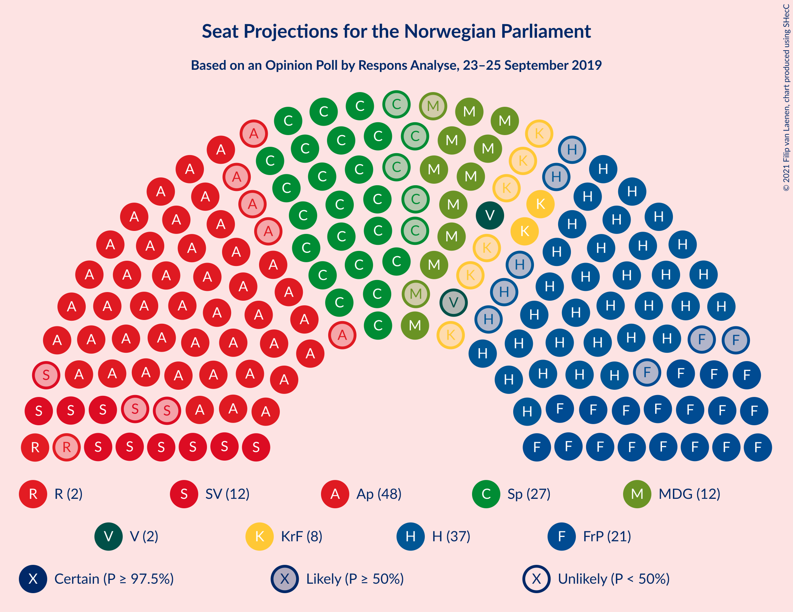

### Confidence Intervals

| Party | Last Result | Median | 80% Confidence Interval | 90% Confidence Interval | 95% Confidence Interval | 99% Confidence Interval |
|:-----:|:-----------:|:------:|:-----------------------:|:-----------------------:|:-----------------------:|:-----------------------:|
| <a href="#arbeiderpartiet">Arbeiderpartiet</a> | 49 | 48 | 45–51 |45–52 |44–53 |42–56 |
| <a href="#høyre">Høyre</a> | 45 | 36 | 33–41 |33–42 |32–42 |30–42 |
| <a href="#senterpartiet">Senterpartiet</a> | 19 | 27 | 25–30 |24–34 |23–34 |22–35 |
| <a href="#fremskrittspartiet">Fremskrittspartiet</a> | 27 | 22 | 19–23 |18–24 |18–25 |17–27 |
| <a href="#miljøpartiet-de-grønne">Miljøpartiet De Grønne</a> | 1 | 12 | 10–14 |10–14 |10–16 |9–16 |
| <a href="#sosialistisk-venstreparti">Sosialistisk Venstreparti</a> | 11 | 12 | 10–14 |10–14 |10–15 |9–16 |
| <a href="#kristelig-folkeparti">Kristelig Folkeparti</a> | 8 | 8 | 3–9 |3–9 |2–10 |1–10 |
| <a href="#rødt">Rødt</a> | 1 | 2 | 1–7 |1–7 |1–7 |1–8 |
| <a href="#venstre">Venstre</a> | 8 | 2 | 1–2 |1–7 |1–7 |0–8 |

### Arbeiderpartiet

*For a full overview of the results for this party, see the [Arbeiderpartiet](party-arbeiderpartiet.html) page.*

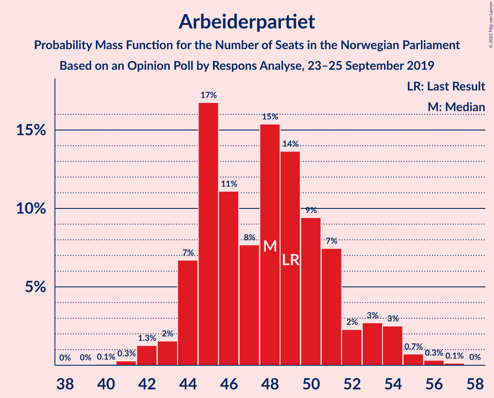

| Number of Seats | Probability | Accumulated | Special Marks |
|:---------------:|:-----------:|:-----------:|:-------------:|
| 40 | 0.1% | 100% |  |
| 41 | 0.1% | 99.9% |  |
| 42 | 0.5% | 99.8% |  |
| 43 | 0.8% | 99.3% |  |
| 44 | 3% | 98% |  |
| 45 | 15% | 95% |  |
| 46 | 4% | 80% |  |
| 47 | 4% | 77% |  |
| 48 | 36% | 73% | Median |
| 49 | 8% | 37% | Last Result |
| 50 | 15% | 29% |  |
| 51 | 5% | 14% |  |
| 52 | 5% | 9% |  |
| 53 | 2% | 3% |  |
| 54 | 0.6% | 1.3% |  |
| 55 | 0.1% | 0.7% |  |
| 56 | 0.4% | 0.6% |  |
| 57 | 0.2% | 0.2% |  |
| 58 | 0% | 0% |  |

### Høyre

*For a full overview of the results for this party, see the [Høyre](party-høyre.html) page.*

| Number of Seats | Probability | Accumulated | Special Marks |
|:---------------:|:-----------:|:-----------:|:-------------:|
| 30 | 0.5% | 100% |  |
| 31 | 0.5% | 99.5% |  |
| 32 | 2% | 99.0% |  |
| 33 | 13% | 97% |  |
| 34 | 15% | 84% |  |
| 35 | 14% | 69% |  |
| 36 | 24% | 55% | Median |
| 37 | 4% | 31% |  |
| 38 | 3% | 27% |  |
| 39 | 5% | 25% |  |
| 40 | 2% | 20% |  |
| 41 | 10% | 18% |  |
| 42 | 7% | 8% |  |
| 43 | 0.2% | 0.4% |  |
| 44 | 0.1% | 0.2% |  |
| 45 | 0% | 0.1% | Last Result |
| 46 | 0% | 0% |  |

### Senterpartiet

*For a full overview of the results for this party, see the [Senterpartiet](party-senterpartiet.html) page.*

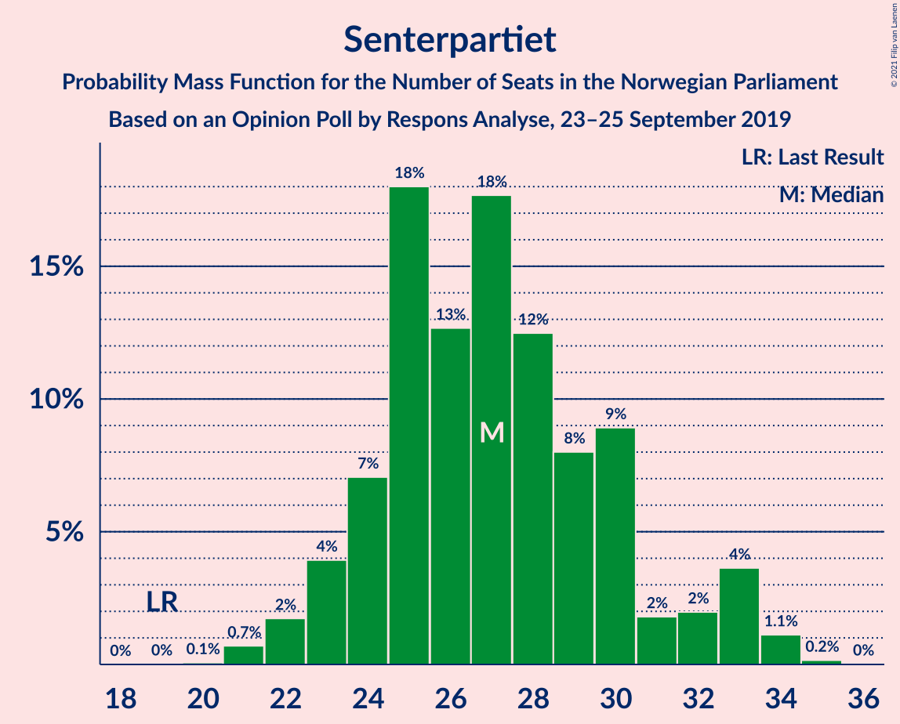

| Number of Seats | Probability | Accumulated | Special Marks |
|:---------------:|:-----------:|:-----------:|:-------------:|
| 19 | 0% | 100% | Last Result |
| 20 | 0% | 100% |  |
| 21 | 0.4% | 100% |  |
| 22 | 1.2% | 99.6% |  |
| 23 | 3% | 98% |  |
| 24 | 0.7% | 95% |  |
| 25 | 30% | 95% |  |
| 26 | 11% | 64% |  |
| 27 | 11% | 54% | Median |
| 28 | 21% | 43% |  |
| 29 | 2% | 22% |  |
| 30 | 12% | 20% |  |
| 31 | 0.2% | 8% |  |
| 32 | 2% | 8% |  |
| 33 | 0.4% | 6% |  |
| 34 | 5% | 6% |  |
| 35 | 1.0% | 1.3% |  |
| 36 | 0.3% | 0.3% |  |
| 37 | 0% | 0% |  |

### Fremskrittspartiet

*For a full overview of the results for this party, see the [Fremskrittspartiet](party-fremskrittspartiet.html) page.*

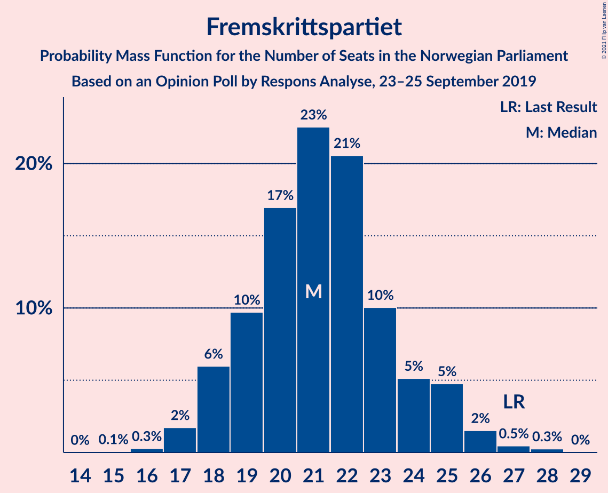

| Number of Seats | Probability | Accumulated | Special Marks |
|:---------------:|:-----------:|:-----------:|:-------------:|
| 15 | 0% | 100% |  |
| 16 | 0.1% | 99.9% |  |
| 17 | 1.3% | 99.9% |  |
| 18 | 4% | 98.5% |  |
| 19 | 14% | 95% |  |
| 20 | 16% | 81% |  |
| 21 | 14% | 65% |  |
| 22 | 32% | 50% | Median |
| 23 | 11% | 18% |  |
| 24 | 2% | 7% |  |
| 25 | 3% | 5% |  |
| 26 | 0.5% | 2% |  |
| 27 | 1.1% | 1.3% | Last Result |
| 28 | 0.2% | 0.2% |  |
| 29 | 0% | 0% |  |

### Miljøpartiet De Grønne

*For a full overview of the results for this party, see the [Miljøpartiet De Grønne](party-miljøpartietdegrønne.html) page.*

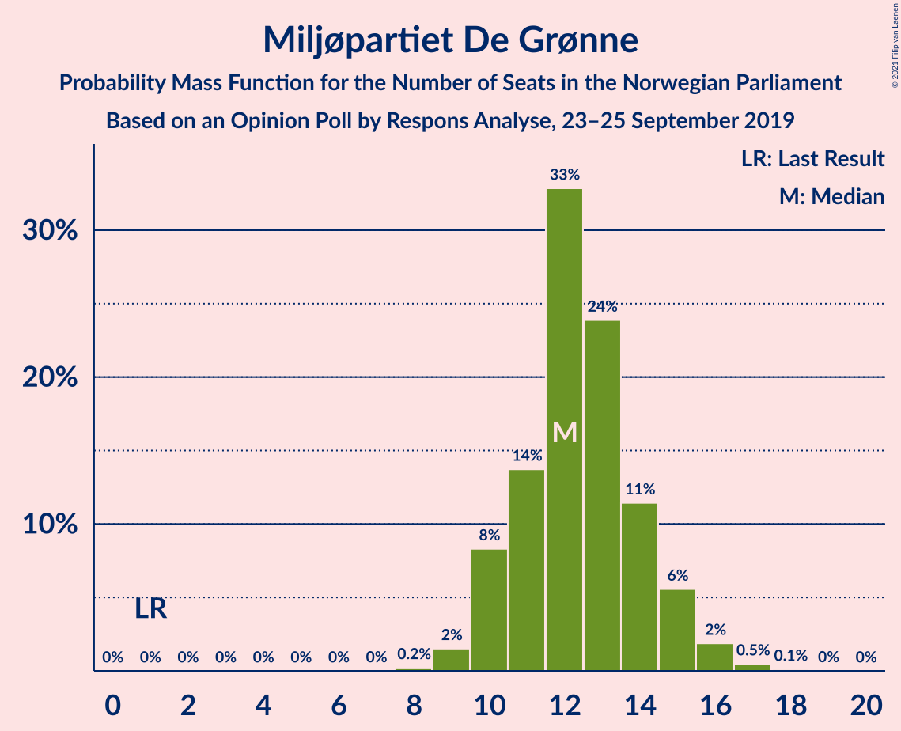

| Number of Seats | Probability | Accumulated | Special Marks |
|:---------------:|:-----------:|:-----------:|:-------------:|
| 1 | 0% | 100% | Last Result |
| 2 | 0% | 100% |  |
| 3 | 0% | 100% |  |
| 4 | 0% | 100% |  |
| 5 | 0% | 100% |  |
| 6 | 0% | 100% |  |
| 7 | 0% | 100% |  |
| 8 | 0.2% | 100% |  |
| 9 | 0.7% | 99.8% |  |
| 10 | 10% | 99.2% |  |
| 11 | 10% | 89% |  |
| 12 | 30% | 79% | Median |
| 13 | 33% | 49% |  |
| 14 | 11% | 16% |  |
| 15 | 2% | 5% |  |
| 16 | 3% | 3% |  |
| 17 | 0.2% | 0.4% |  |
| 18 | 0.3% | 0.3% |  |
| 19 | 0% | 0% |  |

### Sosialistisk Venstreparti

*For a full overview of the results for this party, see the [Sosialistisk Venstreparti](party-sosialistiskvenstreparti.html) page.*

| Number of Seats | Probability | Accumulated | Special Marks |
|:---------------:|:-----------:|:-----------:|:-------------:|
| 7 | 0% | 100% |  |
| 8 | 0.2% | 99.9% |  |
| 9 | 1.3% | 99.8% |  |
| 10 | 23% | 98.5% |  |
| 11 | 24% | 76% | Last Result |
| 12 | 12% | 52% | Median |
| 13 | 18% | 40% |  |
| 14 | 18% | 22% |  |
| 15 | 3% | 4% |  |
| 16 | 0.7% | 0.9% |  |
| 17 | 0.2% | 0.2% |  |
| 18 | 0% | 0% |  |

### Kristelig Folkeparti

*For a full overview of the results for this party, see the [Kristelig Folkeparti](party-kristeligfolkeparti.html) page.*

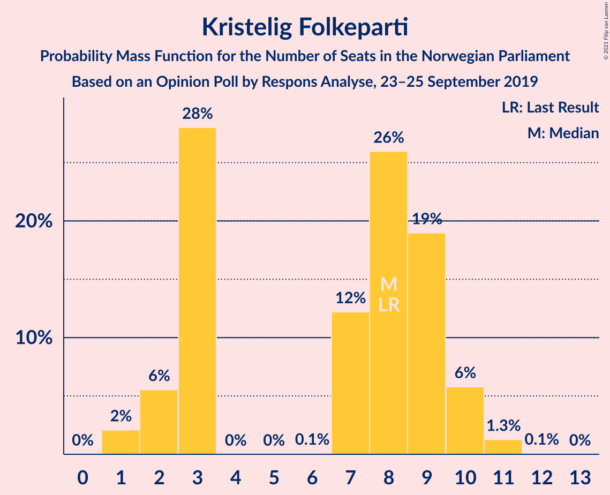

| Number of Seats | Probability | Accumulated | Special Marks |
|:---------------:|:-----------:|:-----------:|:-------------:|
| 1 | 1.5% | 100% |  |
| 2 | 1.3% | 98.5% |  |
| 3 | 22% | 97% |  |
| 4 | 0% | 75% |  |
| 5 | 0% | 75% |  |
| 6 | 0% | 75% |  |
| 7 | 2% | 75% |  |
| 8 | 44% | 73% | Last Result, Median |
| 9 | 25% | 29% |  |
| 10 | 4% | 4% |  |
| 11 | 0.1% | 0.2% |  |
| 12 | 0.1% | 0.1% |  |
| 13 | 0% | 0% |  |

### Rødt

*For a full overview of the results for this party, see the [Rødt](party-rødt.html) page.*

| Number of Seats | Probability | Accumulated | Special Marks |
|:---------------:|:-----------:|:-----------:|:-------------:|
| 1 | 36% | 100% | Last Result |
| 2 | 49% | 64% | Median |
| 3 | 0% | 16% |  |
| 4 | 0% | 16% |  |
| 5 | 0% | 16% |  |
| 6 | 0.1% | 16% |  |
| 7 | 14% | 16% |  |
| 8 | 2% | 2% |  |
| 9 | 0.3% | 0.3% |  |
| 10 | 0.1% | 0.1% |  |
| 11 | 0% | 0% |  |

### Venstre

*For a full overview of the results for this party, see the [Venstre](party-venstre.html) page.*

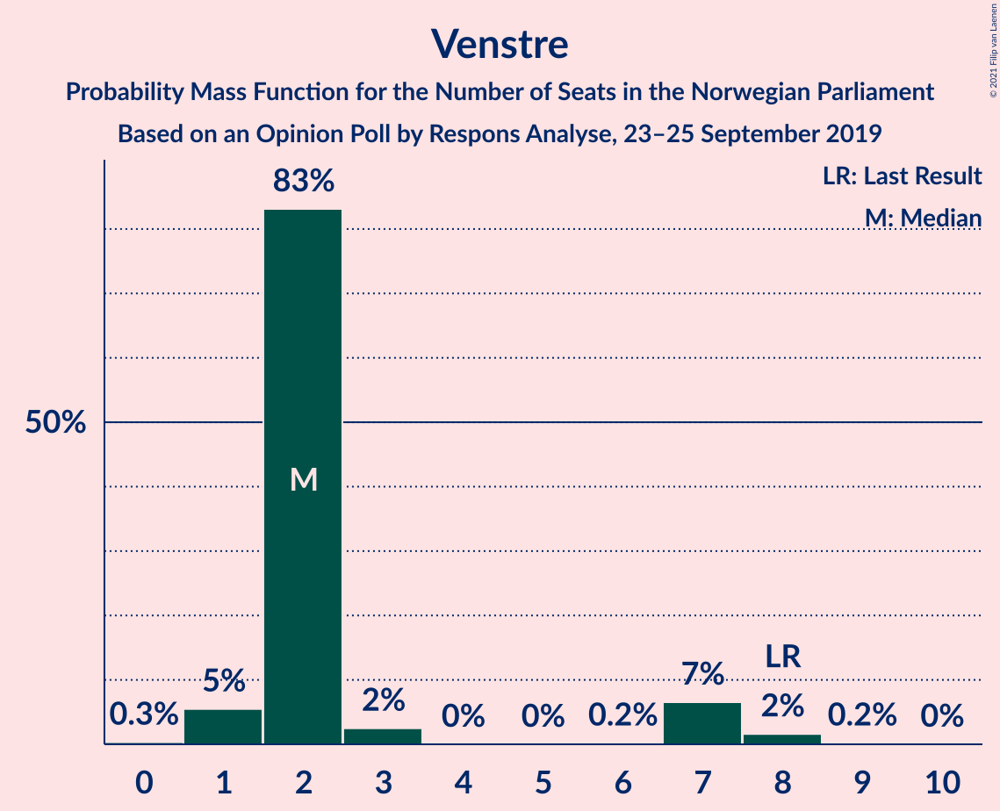

| Number of Seats | Probability | Accumulated | Special Marks |
|:---------------:|:-----------:|:-----------:|:-------------:|
| 0 | 0.7% | 100% |  |
| 1 | 17% | 99.3% |  |
| 2 | 74% | 82% | Median |
| 3 | 0.1% | 8% |  |
| 4 | 0% | 8% |  |
| 5 | 0% | 8% |  |
| 6 | 0.1% | 8% |  |
| 7 | 7% | 8% |  |
| 8 | 1.3% | 1.4% | Last Result |
| 9 | 0.1% | 0.1% |  |
| 10 | 0% | 0% |  |

## Coalitions

### Confidence Intervals

| Coalition | Last Result | Median | Majority? | 80% Confidence Interval | 90% Confidence Interval | 95% Confidence Interval | 99% Confidence Interval |
|:---------:|:-----------:|:------:|:---------:|:-----------------------:|:-----------------------:|:-----------------------:|:-----------------------:|
| Arbeiderpartiet – Senterpartiet – Miljøpartiet De Grønne – Sosialistisk Venstreparti – Kristelig Folkeparti | 88 | 107 | 100% | 103–111 | 102–112 | 100–112 | 96–114 |
| Arbeiderpartiet – Senterpartiet – Miljøpartiet De Grønne – Sosialistisk Venstreparti – Rødt | 81 | 102 | 100% | 99–105 | 98–106 | 96–107 | 93–111 |
| Arbeiderpartiet – Senterpartiet – Miljøpartiet De Grønne – Sosialistisk Venstreparti | 80 | 100 | 100% | 97–103 | 95–103 | 94–105 | 92–109 |
| Høyre – Senterpartiet – Fremskrittspartiet – Kristelig Folkeparti – Venstre | 107 | 94 | 99.7% | 89–98 | 89–99 | 89–100 | 85–102 |
| Arbeiderpartiet – Senterpartiet – Miljøpartiet De Grønne – Kristelig Folkeparti | 77 | 95 | 99.2% | 89–99 | 89–100 | 88–100 | 84–103 |
| Arbeiderpartiet – Senterpartiet – Sosialistisk Venstreparti – Rødt | 80 | 89 | 97% | 86–93 | 86–93 | 84–95 | 83–97 |
| Arbeiderpartiet – Senterpartiet – Sosialistisk Venstreparti | 79 | 87 | 85% | 84–91 | 84–91 | 83–92 | 80–94 |
| Arbeiderpartiet – Senterpartiet – Kristelig Folkeparti | 76 | 82 | 39% | 76–88 | 76–89 | 76–89 | 73–90 |
| Høyre – Fremskrittspartiet – Miljøpartiet De Grønne – Kristelig Folkeparti – Venstre | 89 | 80 | 3% | 76–83 | 76–83 | 74–85 | 72–86 |
| Arbeiderpartiet – Senterpartiet | 68 | 76 | 0% | 72–79 | 71–80 | 70–81 | 68–82 |
| Høyre – Fremskrittspartiet – Kristelig Folkeparti – Venstre | 88 | 67 | 0% | 64–70 | 63–71 | 62–73 | 58–76 |
| Høyre – Fremskrittspartiet – Venstre | 80 | 59 | 0% | 56–65 | 56–66 | 55–66 | 53–69 |
| Arbeiderpartiet – Sosialistisk Venstreparti | 60 | 61 | 0% | 57–63 | 56–63 | 56–65 | 53–68 |
| Høyre – Fremskrittspartiet | 72 | 57 | 0% | 54–63 | 54–63 | 53–64 | 51–65 |
| Høyre – Kristelig Folkeparti – Venstre | 61 | 45 | 0% | 44–49 | 41–50 | 40–51 | 38–52 |
| Senterpartiet – Kristelig Folkeparti – Venstre | 35 | 37 | 0% | 30–44 | 30–45 | 29–45 | 28–48 |

### Arbeiderpartiet – Senterpartiet – Miljøpartiet De Grønne – Sosialistisk Venstreparti – Kristelig Folkeparti

| Number of Seats | Probability | Accumulated | Special Marks |
|:---------------:|:-----------:|:-----------:|:-------------:|
| 88 | 0% | 100% | Last Result |
| 89 | 0% | 100% |  |
| 90 | 0% | 100% |  |
| 91 | 0% | 100% |  |
| 92 | 0% | 100% |  |
| 93 | 0% | 100% |  |
| 94 | 0% | 100% |  |
| 95 | 0.2% | 100% |  |
| 96 | 0.5% | 99.8% |  |
| 97 | 0.1% | 99.3% |  |
| 98 | 0.4% | 99.2% |  |
| 99 | 1.0% | 98.8% |  |
| 100 | 0.4% | 98% |  |
| 101 | 1.0% | 97% |  |
| 102 | 5% | 96% |  |
| 103 | 13% | 92% |  |
| 104 | 5% | 79% |  |
| 105 | 2% | 74% |  |
| 106 | 20% | 71% |  |
| 107 | 3% | 51% | Median |
| 108 | 14% | 48% |  |
| 109 | 15% | 34% |  |
| 110 | 8% | 19% |  |
| 111 | 4% | 10% |  |
| 112 | 5% | 6% |  |
| 113 | 0.2% | 1.0% |  |
| 114 | 0.6% | 0.7% |  |
| 115 | 0.1% | 0.1% |  |
| 116 | 0% | 0% |  |

### Arbeiderpartiet – Senterpartiet – Miljøpartiet De Grønne – Sosialistisk Venstreparti – Rødt

| Number of Seats | Probability | Accumulated | Special Marks |
|:---------------:|:-----------:|:-----------:|:-------------:|
| 81 | 0% | 100% | Last Result |
| 82 | 0% | 100% |  |
| 83 | 0% | 100% |  |
| 84 | 0% | 100% |  |
| 85 | 0% | 100% | Majority |
| 86 | 0% | 100% |  |
| 87 | 0% | 100% |  |
| 88 | 0% | 100% |  |
| 89 | 0% | 100% |  |
| 90 | 0% | 100% |  |
| 91 | 0% | 100% |  |
| 92 | 0% | 100% |  |
| 93 | 0.5% | 99.9% |  |
| 94 | 0.3% | 99.4% |  |
| 95 | 0.6% | 99.1% |  |
| 96 | 2% | 98% |  |
| 97 | 0.7% | 96% |  |
| 98 | 2% | 96% |  |
| 99 | 7% | 94% |  |
| 100 | 6% | 87% |  |
| 101 | 22% | 81% | Median |
| 102 | 16% | 59% |  |
| 103 | 15% | 43% |  |
| 104 | 9% | 28% |  |
| 105 | 13% | 19% |  |
| 106 | 3% | 7% |  |
| 107 | 2% | 4% |  |
| 108 | 0.4% | 2% |  |
| 109 | 0.9% | 2% |  |
| 110 | 0.3% | 1.0% |  |
| 111 | 0.6% | 0.7% |  |
| 112 | 0.1% | 0.1% |  |
| 113 | 0% | 0% |  |

### Arbeiderpartiet – Senterpartiet – Miljøpartiet De Grønne – Sosialistisk Venstreparti

| Number of Seats | Probability | Accumulated | Special Marks |
|:---------------:|:-----------:|:-----------:|:-------------:|
| 80 | 0% | 100% | Last Result |
| 81 | 0% | 100% |  |
| 82 | 0% | 100% |  |
| 83 | 0% | 100% |  |
| 84 | 0% | 100% |  |
| 85 | 0% | 100% | Majority |
| 86 | 0% | 100% |  |
| 87 | 0% | 100% |  |
| 88 | 0% | 100% |  |
| 89 | 0% | 100% |  |
| 90 | 0.2% | 99.9% |  |
| 91 | 0.1% | 99.8% |  |
| 92 | 0.7% | 99.7% |  |
| 93 | 0.9% | 98.9% |  |
| 94 | 2% | 98% |  |
| 95 | 1.1% | 96% |  |
| 96 | 1.2% | 95% |  |
| 97 | 7% | 93% |  |
| 98 | 15% | 86% |  |
| 99 | 14% | 71% | Median |
| 100 | 19% | 57% |  |
| 101 | 24% | 38% |  |
| 102 | 4% | 14% |  |
| 103 | 6% | 11% |  |
| 104 | 0.6% | 5% |  |
| 105 | 2% | 4% |  |
| 106 | 0.5% | 2% |  |
| 107 | 0.4% | 2% |  |
| 108 | 0.5% | 1.1% |  |
| 109 | 0.6% | 0.6% |  |
| 110 | 0% | 0% |  |

### Høyre – Senterpartiet – Fremskrittspartiet – Kristelig Folkeparti – Venstre

| Number of Seats | Probability | Accumulated | Special Marks |
|:---------------:|:-----------:|:-----------:|:-------------:|
| 83 | 0% | 100% |  |
| 84 | 0.2% | 99.9% |  |
| 85 | 0.3% | 99.7% | Majority |
| 86 | 0.2% | 99.4% |  |
| 87 | 1.0% | 99.2% |  |
| 88 | 0.7% | 98% |  |
| 89 | 13% | 98% |  |
| 90 | 2% | 85% |  |
| 91 | 3% | 82% |  |
| 92 | 2% | 79% |  |
| 93 | 11% | 77% |  |
| 94 | 30% | 67% |  |
| 95 | 9% | 36% | Median |
| 96 | 0.7% | 27% |  |
| 97 | 10% | 27% |  |
| 98 | 8% | 16% |  |
| 99 | 5% | 8% |  |
| 100 | 2% | 3% |  |
| 101 | 0.2% | 1.3% |  |
| 102 | 0.7% | 1.1% |  |
| 103 | 0.2% | 0.4% |  |
| 104 | 0% | 0.2% |  |
| 105 | 0.1% | 0.1% |  |
| 106 | 0% | 0% |  |
| 107 | 0% | 0% | Last Result |

### Arbeiderpartiet – Senterpartiet – Miljøpartiet De Grønne – Kristelig Folkeparti

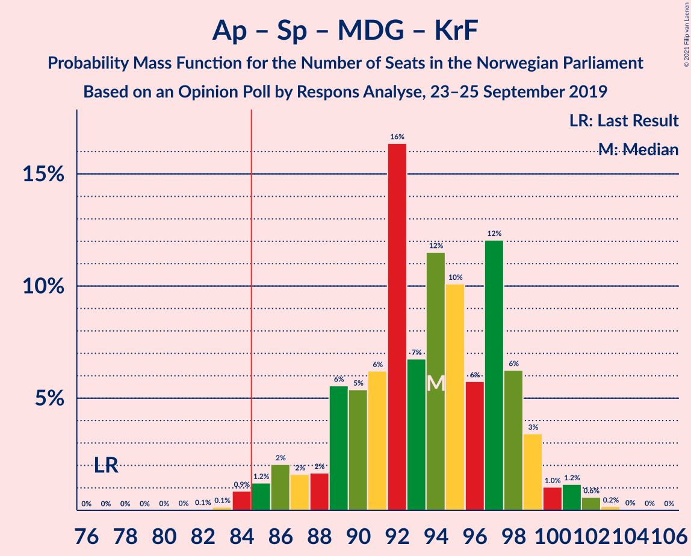

| Number of Seats | Probability | Accumulated | Special Marks |
|:---------------:|:-----------:|:-----------:|:-------------:|
| 77 | 0% | 100% | Last Result |
| 78 | 0% | 100% |  |
| 79 | 0% | 100% |  |
| 80 | 0% | 100% |  |
| 81 | 0% | 100% |  |
| 82 | 0.1% | 100% |  |
| 83 | 0.2% | 99.9% |  |
| 84 | 0.5% | 99.7% |  |
| 85 | 0.1% | 99.2% | Majority |
| 86 | 0.6% | 99.1% |  |
| 87 | 0.2% | 98.5% |  |
| 88 | 0.8% | 98% |  |
| 89 | 13% | 97% |  |
| 90 | 2% | 84% |  |
| 91 | 9% | 83% |  |
| 92 | 3% | 74% |  |
| 93 | 13% | 71% |  |
| 94 | 2% | 57% |  |
| 95 | 6% | 55% | Median |
| 96 | 4% | 50% |  |
| 97 | 13% | 46% |  |
| 98 | 5% | 32% |  |
| 99 | 21% | 28% |  |
| 100 | 5% | 7% |  |
| 101 | 1.0% | 2% |  |
| 102 | 0.5% | 1.0% |  |
| 103 | 0.5% | 0.5% |  |
| 104 | 0.1% | 0.1% |  |
| 105 | 0% | 0% |  |

### Arbeiderpartiet – Senterpartiet – Sosialistisk Venstreparti – Rødt

| Number of Seats | Probability | Accumulated | Special Marks |
|:---------------:|:-----------:|:-----------:|:-------------:|
| 79 | 0% | 100% |  |
| 80 | 0% | 99.9% | Last Result |
| 81 | 0.1% | 99.9% |  |
| 82 | 0.1% | 99.8% |  |
| 83 | 0.8% | 99.7% |  |
| 84 | 2% | 98.9% |  |
| 85 | 0.7% | 97% | Majority |
| 86 | 10% | 96% |  |
| 87 | 3% | 86% |  |
| 88 | 18% | 83% |  |
| 89 | 19% | 65% | Median |
| 90 | 12% | 46% |  |
| 91 | 2% | 34% |  |
| 92 | 9% | 32% |  |
| 93 | 18% | 23% |  |
| 94 | 1.1% | 5% |  |
| 95 | 1.5% | 4% |  |
| 96 | 2% | 2% |  |
| 97 | 0.4% | 0.8% |  |
| 98 | 0.2% | 0.4% |  |
| 99 | 0.1% | 0.2% |  |
| 100 | 0.1% | 0.1% |  |
| 101 | 0.1% | 0.1% |  |
| 102 | 0% | 0% |  |

### Arbeiderpartiet – Senterpartiet – Sosialistisk Venstreparti

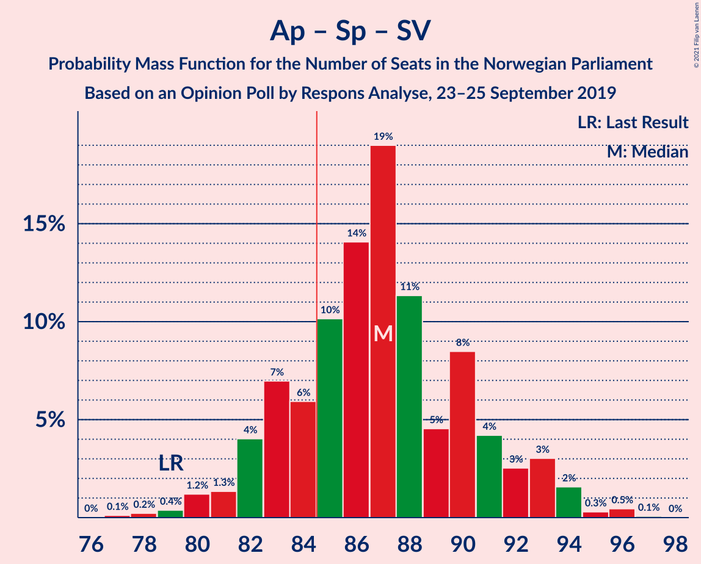

| Number of Seats | Probability | Accumulated | Special Marks |
|:---------------:|:-----------:|:-----------:|:-------------:|
| 77 | 0.2% | 100% |  |
| 78 | 0% | 99.8% |  |
| 79 | 0.1% | 99.8% | Last Result |
| 80 | 0.3% | 99.7% |  |
| 81 | 0.2% | 99.4% |  |
| 82 | 1.4% | 99.1% |  |
| 83 | 2% | 98% |  |
| 84 | 10% | 96% |  |
| 85 | 4% | 85% | Majority |
| 86 | 17% | 82% |  |
| 87 | 22% | 64% | Median |
| 88 | 18% | 42% |  |
| 89 | 5% | 24% |  |
| 90 | 5% | 19% |  |
| 91 | 10% | 14% |  |
| 92 | 2% | 4% |  |
| 93 | 1.5% | 2% |  |
| 94 | 0.3% | 0.7% |  |
| 95 | 0.2% | 0.4% |  |
| 96 | 0.2% | 0.2% |  |
| 97 | 0% | 0.1% |  |
| 98 | 0% | 0% |  |

### Arbeiderpartiet – Senterpartiet – Kristelig Folkeparti

| Number of Seats | Probability | Accumulated | Special Marks |
|:---------------:|:-----------:|:-----------:|:-------------:|
| 70 | 0.1% | 100% |  |
| 71 | 0.1% | 99.9% |  |
| 72 | 0.2% | 99.9% |  |
| 73 | 0.7% | 99.7% |  |
| 74 | 0.8% | 99.0% |  |
| 75 | 0.6% | 98% |  |
| 76 | 10% | 98% | Last Result |
| 77 | 3% | 87% |  |
| 78 | 6% | 84% |  |
| 79 | 5% | 78% |  |
| 80 | 4% | 73% |  |
| 81 | 13% | 69% |  |
| 82 | 8% | 57% |  |
| 83 | 3% | 49% | Median |
| 84 | 7% | 46% |  |
| 85 | 9% | 39% | Majority |
| 86 | 16% | 30% |  |
| 87 | 2% | 13% |  |
| 88 | 5% | 12% |  |
| 89 | 6% | 7% |  |
| 90 | 0.9% | 1.3% |  |
| 91 | 0.3% | 0.4% |  |
| 92 | 0.1% | 0.1% |  |
| 93 | 0% | 0% |  |

### Høyre – Fremskrittspartiet – Miljøpartiet De Grønne – Kristelig Folkeparti – Venstre

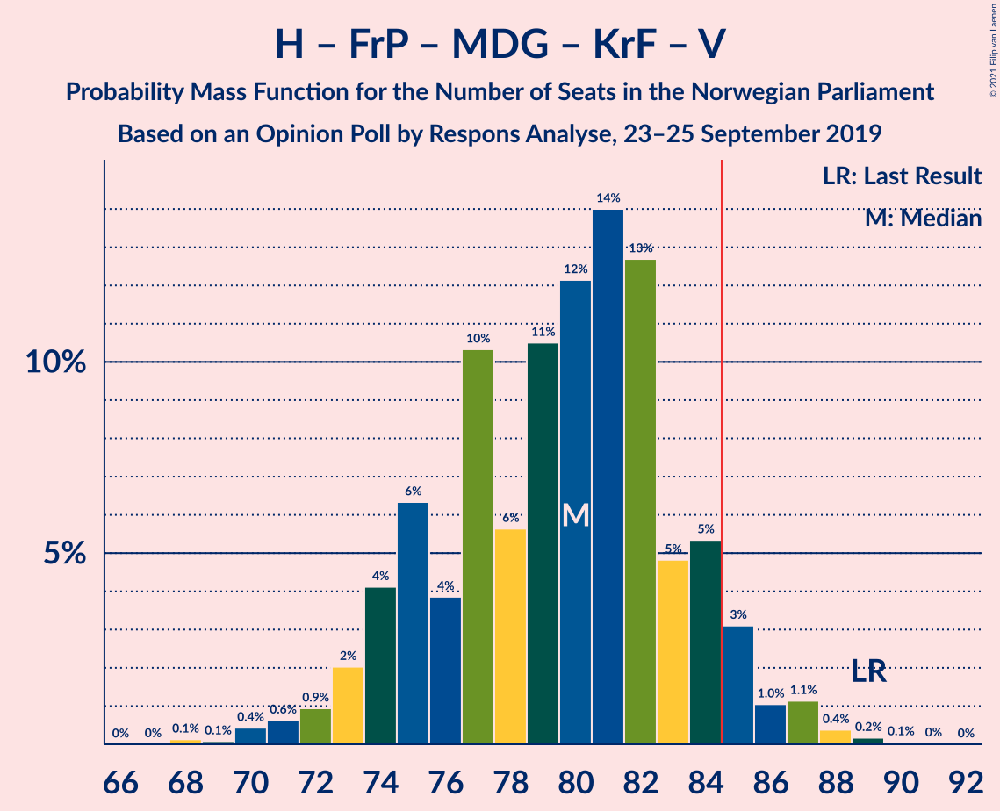

| Number of Seats | Probability | Accumulated | Special Marks |
|:---------------:|:-----------:|:-----------:|:-------------:|
| 68 | 0.1% | 100% |  |
| 69 | 0.1% | 99.9% |  |
| 70 | 0.1% | 99.8% |  |
| 71 | 0.2% | 99.8% |  |
| 72 | 0.4% | 99.6% |  |
| 73 | 2% | 99.2% |  |
| 74 | 1.5% | 98% |  |
| 75 | 1.1% | 96% |  |
| 76 | 18% | 95% |  |
| 77 | 9% | 77% |  |
| 78 | 2% | 68% |  |
| 79 | 12% | 66% |  |
| 80 | 19% | 54% | Median |
| 81 | 18% | 35% |  |
| 82 | 3% | 17% |  |
| 83 | 10% | 14% |  |
| 84 | 0.7% | 3% |  |
| 85 | 2% | 3% | Majority |
| 86 | 0.8% | 1.1% |  |
| 87 | 0.1% | 0.3% |  |
| 88 | 0.1% | 0.2% |  |
| 89 | 0% | 0.1% | Last Result |
| 90 | 0% | 0.1% |  |
| 91 | 0% | 0% |  |

### Arbeiderpartiet – Senterpartiet

| Number of Seats | Probability | Accumulated | Special Marks |
|:---------------:|:-----------:|:-----------:|:-------------:|
| 65 | 0% | 100% |  |
| 66 | 0% | 99.9% |  |
| 67 | 0.3% | 99.9% |  |
| 68 | 0.6% | 99.6% | Last Result |
| 69 | 0.4% | 99.0% |  |
| 70 | 3% | 98.6% |  |
| 71 | 2% | 96% |  |
| 72 | 6% | 94% |  |
| 73 | 26% | 88% |  |
| 74 | 3% | 62% |  |
| 75 | 6% | 58% | Median |
| 76 | 20% | 52% |  |
| 77 | 1.1% | 32% |  |
| 78 | 16% | 31% |  |
| 79 | 6% | 15% |  |
| 80 | 6% | 9% |  |
| 81 | 1.1% | 3% |  |
| 82 | 1.3% | 2% |  |
| 83 | 0.2% | 0.3% |  |
| 84 | 0.1% | 0.1% |  |
| 85 | 0% | 0% | Majority |

### Høyre – Fremskrittspartiet – Kristelig Folkeparti – Venstre

| Number of Seats | Probability | Accumulated | Special Marks |
|:---------------:|:-----------:|:-----------:|:-------------:|
| 57 | 0.1% | 100% |  |
| 58 | 0.6% | 99.9% |  |
| 59 | 0.3% | 99.2% |  |
| 60 | 0.9% | 99.0% |  |
| 61 | 0.4% | 98% |  |
| 62 | 2% | 98% |  |
| 63 | 3% | 96% |  |
| 64 | 13% | 93% |  |
| 65 | 9% | 81% |  |
| 66 | 15% | 72% |  |
| 67 | 16% | 57% |  |
| 68 | 22% | 41% | Median |
| 69 | 6% | 19% |  |
| 70 | 7% | 13% |  |
| 71 | 2% | 6% |  |
| 72 | 0.7% | 4% |  |
| 73 | 2% | 4% |  |
| 74 | 0.6% | 2% |  |
| 75 | 0.3% | 0.9% |  |
| 76 | 0.5% | 0.6% |  |
| 77 | 0% | 0.1% |  |
| 78 | 0% | 0% |  |
| 79 | 0% | 0% |  |
| 80 | 0% | 0% |  |
| 81 | 0% | 0% |  |
| 82 | 0% | 0% |  |
| 83 | 0% | 0% |  |
| 84 | 0% | 0% |  |
| 85 | 0% | 0% | Majority |
| 86 | 0% | 0% |  |
| 87 | 0% | 0% |  |
| 88 | 0% | 0% | Last Result |

### Høyre – Fremskrittspartiet – Venstre

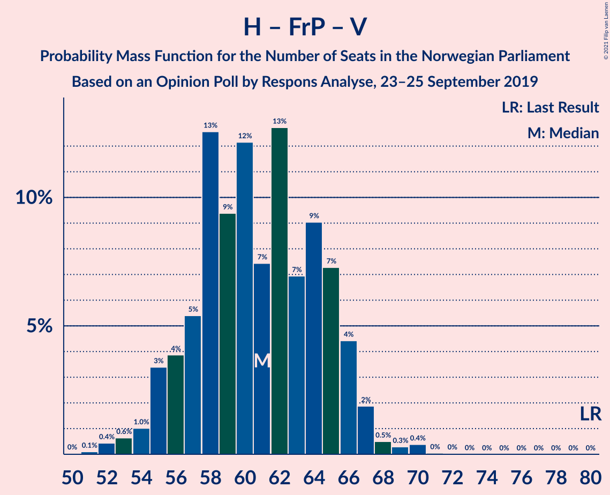

| Number of Seats | Probability | Accumulated | Special Marks |
|:---------------:|:-----------:|:-----------:|:-------------:|
| 51 | 0.1% | 100% |  |
| 52 | 0.1% | 99.9% |  |
| 53 | 0.7% | 99.9% |  |
| 54 | 0.3% | 99.1% |  |
| 55 | 2% | 98.9% |  |
| 56 | 19% | 97% |  |
| 57 | 10% | 77% |  |
| 58 | 7% | 68% |  |
| 59 | 23% | 61% |  |
| 60 | 1.1% | 38% | Median |
| 61 | 9% | 37% |  |
| 62 | 2% | 28% |  |
| 63 | 5% | 26% |  |
| 64 | 1.4% | 21% |  |
| 65 | 13% | 19% |  |
| 66 | 4% | 6% |  |
| 67 | 0.4% | 2% |  |
| 68 | 0.6% | 1.3% |  |
| 69 | 0.5% | 0.6% |  |
| 70 | 0% | 0.1% |  |
| 71 | 0% | 0.1% |  |
| 72 | 0.1% | 0.1% |  |
| 73 | 0% | 0% |  |
| 74 | 0% | 0% |  |
| 75 | 0% | 0% |  |
| 76 | 0% | 0% |  |
| 77 | 0% | 0% |  |
| 78 | 0% | 0% |  |
| 79 | 0% | 0% |  |
| 80 | 0% | 0% | Last Result |

### Arbeiderpartiet – Sosialistisk Venstreparti

| Number of Seats | Probability | Accumulated | Special Marks |
|:---------------:|:-----------:|:-----------:|:-------------:|
| 51 | 0% | 100% |  |
| 52 | 0.2% | 99.9% |  |
| 53 | 0.3% | 99.7% |  |
| 54 | 1.0% | 99.4% |  |
| 55 | 0.3% | 98% |  |
| 56 | 8% | 98% |  |
| 57 | 8% | 91% |  |
| 58 | 11% | 83% |  |
| 59 | 7% | 71% |  |
| 60 | 10% | 64% | Last Result, Median |
| 61 | 22% | 54% |  |
| 62 | 21% | 31% |  |
| 63 | 8% | 10% |  |
| 64 | 0.3% | 3% |  |
| 65 | 1.4% | 3% |  |
| 66 | 0.2% | 1.2% |  |
| 67 | 0.4% | 1.0% |  |
| 68 | 0.3% | 0.6% |  |
| 69 | 0.1% | 0.3% |  |
| 70 | 0.1% | 0.3% |  |
| 71 | 0.2% | 0.2% |  |
| 72 | 0% | 0% |  |

### Høyre – Fremskrittspartiet

| Number of Seats | Probability | Accumulated | Special Marks |
|:---------------:|:-----------:|:-----------:|:-------------:|
| 49 | 0.1% | 100% |  |
| 50 | 0.3% | 99.9% |  |
| 51 | 0.8% | 99.6% |  |
| 52 | 1.0% | 98.8% |  |
| 53 | 2% | 98% |  |
| 54 | 24% | 96% |  |
| 55 | 7% | 72% |  |
| 56 | 9% | 65% |  |
| 57 | 14% | 56% |  |
| 58 | 11% | 42% | Median |
| 59 | 5% | 31% |  |
| 60 | 2% | 27% |  |
| 61 | 4% | 25% |  |
| 62 | 2% | 20% |  |
| 63 | 13% | 18% |  |
| 64 | 4% | 5% |  |
| 65 | 0.2% | 0.6% |  |
| 66 | 0.2% | 0.4% |  |
| 67 | 0.1% | 0.1% |  |
| 68 | 0% | 0.1% |  |
| 69 | 0% | 0.1% |  |
| 70 | 0% | 0% |  |
| 71 | 0% | 0% |  |
| 72 | 0% | 0% | Last Result |

### Høyre – Kristelig Folkeparti – Venstre

| Number of Seats | Probability | Accumulated | Special Marks |
|:---------------:|:-----------:|:-----------:|:-------------:|
| 36 | 0.1% | 100% |  |
| 37 | 0.2% | 99.9% |  |
| 38 | 0.9% | 99.6% |  |
| 39 | 0.4% | 98.7% |  |
| 40 | 1.0% | 98% |  |
| 41 | 3% | 97% |  |
| 42 | 0.4% | 94% |  |
| 43 | 4% | 94% |  |
| 44 | 8% | 90% |  |
| 45 | 36% | 82% |  |
| 46 | 23% | 46% | Median |
| 47 | 9% | 23% |  |
| 48 | 2% | 13% |  |
| 49 | 5% | 11% |  |
| 50 | 2% | 6% |  |
| 51 | 3% | 4% |  |
| 52 | 0.9% | 1.2% |  |
| 53 | 0.1% | 0.2% |  |
| 54 | 0.1% | 0.2% |  |
| 55 | 0.1% | 0.1% |  |
| 56 | 0% | 0% |  |
| 57 | 0% | 0% |  |
| 58 | 0% | 0% |  |
| 59 | 0% | 0% |  |
| 60 | 0% | 0% |  |
| 61 | 0% | 0% | Last Result |

### Senterpartiet – Kristelig Folkeparti – Venstre

| Number of Seats | Probability | Accumulated | Special Marks |
|:---------------:|:-----------:|:-----------:|:-------------:|
| 26 | 0.2% | 100% |  |
| 27 | 0.2% | 99.8% |  |
| 28 | 0.9% | 99.6% |  |
| 29 | 2% | 98.7% |  |
| 30 | 13% | 97% |  |
| 31 | 1.2% | 84% |  |
| 32 | 5% | 83% |  |
| 33 | 3% | 78% |  |
| 34 | 0.7% | 75% |  |
| 35 | 15% | 74% | Last Result |
| 36 | 3% | 59% |  |
| 37 | 16% | 56% | Median |
| 38 | 7% | 40% |  |
| 39 | 17% | 32% |  |
| 40 | 2% | 15% |  |
| 41 | 0.3% | 13% |  |
| 42 | 0.5% | 13% |  |
| 43 | 0.6% | 12% |  |
| 44 | 5% | 11% |  |
| 45 | 5% | 7% |  |
| 46 | 0% | 1.3% |  |
| 47 | 0.3% | 1.3% |  |
| 48 | 1.0% | 1.0% |  |
| 49 | 0% | 0% |  |

## Technical Information

### Opinion Poll

+ **Polling firm:** Respons Analyse
+ **Commissioner(s):** —
+ **Fieldwork period:** 23–25 September 2019

### Calculations

+ **Sample size:** 1000
+ **Simulations done:** 131,072
+ **Error estimate:** 2.23%

