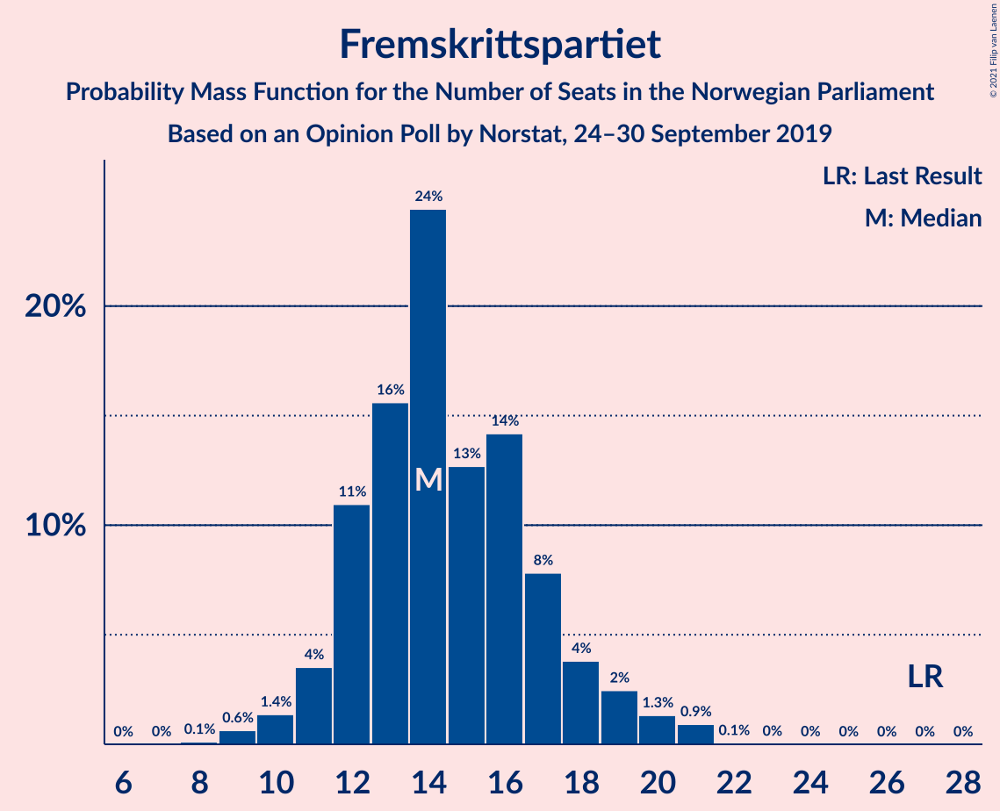
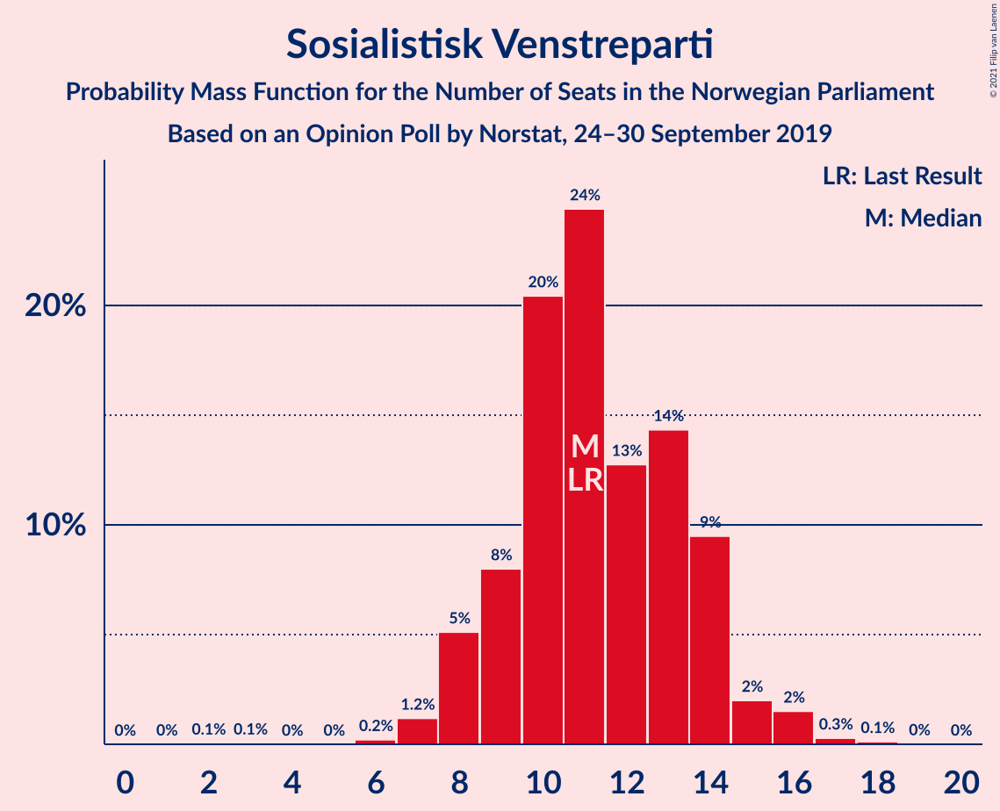
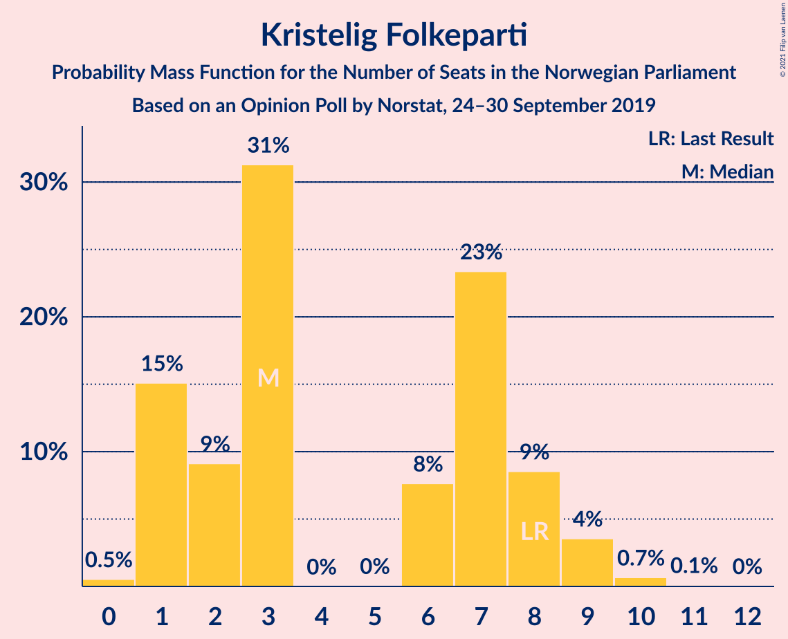
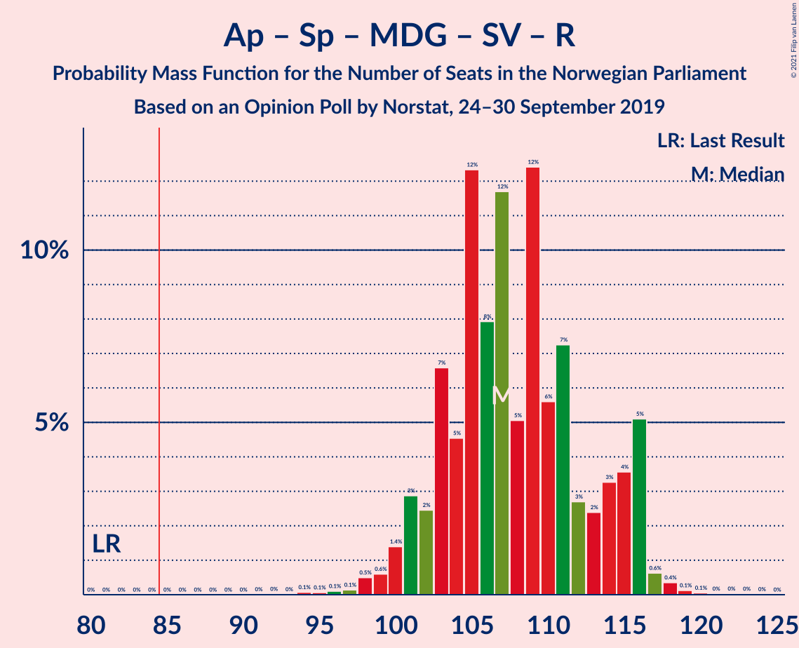
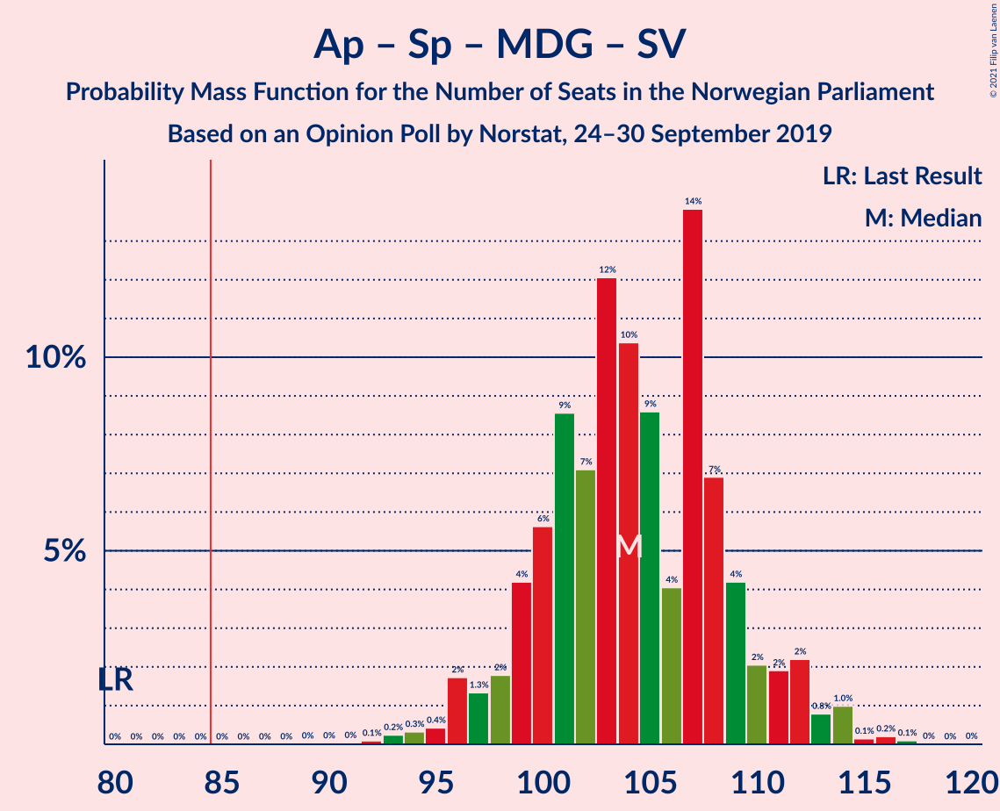
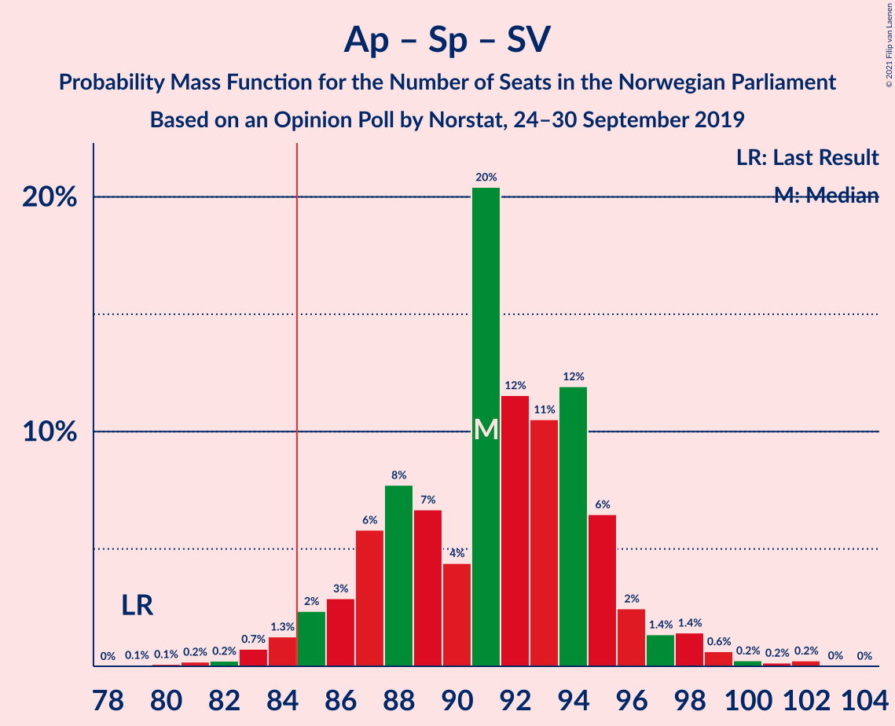

# Opinion Poll by Norstat, 24–30 September 2019

<a href="#voting-intentions">Voting Intentions</a> | <a href="#seats">Seats</a> | <a href="#coalitions">Coalitions</a> | <a href="#technical-information">Technical Information</a>

## Voting Intentions

### Confidence Intervals

| Party | Last Result | Poll Result | 80% Confidence Interval | 90% Confidence Interval | 95% Confidence Interval | 99% Confidence Interval |
|:-----:|:-----------:|:-----------:|:-----------------------:|:-----------------------:|:-----------------------:|:-----------------------:|
| Arbeiderpartiet | 27.4% | 24.0% | 21.9–26.3% |21.4–27.0% |20.9–27.5% |19.9–28.7% |
| Høyre | 25.0% | 19.7% | 17.8–21.9% |17.3–22.5% |16.8–23.0% |15.9–24.1% |
| Senterpartiet | 10.3% | 18.6% | 16.8–20.7% |16.2–21.4% |15.8–21.9% |14.9–22.9% |
| Fremskrittspartiet | 15.2% | 8.6% | 7.3–10.2% |7.0–10.7% |6.6–11.1% |6.1–11.9% |
| Miljøpartiet De Grønne | 3.2% | 7.8% | 6.6–9.3% |6.2–9.8% |5.9–10.2% |5.4–11.0% |
| Sosialistisk Venstreparti | 6.0% | 6.5% | 5.4–8.0% |5.1–8.4% |4.8–8.7% |4.4–9.5% |
| Rødt | 2.4% | 3.7% | 2.9–4.8% |2.6–5.2% |2.5–5.4% |2.1–6.1% |
| Kristelig Folkeparti | 4.2% | 3.7% | 2.9–4.8% |2.6–5.2% |2.5–5.4% |2.1–6.1% |
| Venstre | 4.4% | 3.3% | 2.6–4.5% |2.4–4.8% |2.2–5.1% |1.9–5.7% |

*Note:* The poll result column reflects the actual value used in the calculations. Published results may vary slightly, and in addition be rounded to fewer digits.

## Seats

### Confidence Intervals

| Party | Last Result | Median | 80% Confidence Interval | 90% Confidence Interval | 95% Confidence Interval | 99% Confidence Interval |
|:-----:|:-----------:|:------:|:-----------------------:|:-----------------------:|:-----------------------:|:-----------------------:|
| <a href="#arbeiderpartiet">Arbeiderpartiet</a> | 49 | 44 | 42–47 |40–47 |39–51 |38–54 |
| <a href="#høyre">Høyre</a> | 45 | 35 | 32–37 |31–39 |31–40 |29–42 |
| <a href="#senterpartiet">Senterpartiet</a> | 19 | 36 | 34–40 |32–41 |31–41 |29–42 |
| <a href="#fremskrittspartiet">Fremskrittspartiet</a> | 27 | 14 | 12–17 |12–18 |11–19 |9–21 |
| <a href="#miljøpartiet-de-grønne">Miljøpartiet De Grønne</a> | 1 | 13 | 10–17 |10–17 |9–17 |8–19 |
| <a href="#sosialistisk-venstreparti">Sosialistisk Venstreparti</a> | 11 | 11 | 9–13 |8–15 |8–15 |7–16 |
| <a href="#rødt">Rødt</a> | 1 | 2 | 2–8 |1–8 |1–8 |1–10 |
| <a href="#kristelig-folkeparti">Kristelig Folkeparti</a> | 8 | 3 | 1–8 |1–8 |1–9 |1–10 |
| <a href="#venstre">Venstre</a> | 8 | 2 | 1–7 |1–7 |1–8 |0–9 |

### Arbeiderpartiet

*For a full overview of the results for this party, see the [Arbeiderpartiet](party-arbeiderpartiet.html) page.*

| Number of Seats | Probability | Accumulated | Special Marks |
|:---------------:|:-----------:|:-----------:|:-------------:|
| 35 | 0% | 100% |  |
| 36 | 0.1% | 99.9% |  |
| 37 | 0.1% | 99.8% |  |
| 38 | 0.6% | 99.7% |  |
| 39 | 3% | 99.1% |  |
| 40 | 2% | 96% |  |
| 41 | 2% | 95% |  |
| 42 | 11% | 93% |  |
| 43 | 28% | 81% |  |
| 44 | 9% | 53% | Median |
| 45 | 8% | 44% |  |
| 46 | 25% | 36% |  |
| 47 | 7% | 12% |  |
| 48 | 0.7% | 4% |  |
| 49 | 0.6% | 4% | Last Result |
| 50 | 0.3% | 3% |  |
| 51 | 0.4% | 3% |  |
| 52 | 1.5% | 2% |  |
| 53 | 0.2% | 1.0% |  |
| 54 | 0.6% | 0.8% |  |
| 55 | 0% | 0.2% |  |
| 56 | 0.1% | 0.2% |  |
| 57 | 0.1% | 0.1% |  |
| 58 | 0% | 0% |  |

### Høyre

*For a full overview of the results for this party, see the [Høyre](party-høyre.html) page.*

| Number of Seats | Probability | Accumulated | Special Marks |
|:---------------:|:-----------:|:-----------:|:-------------:|
| 25 | 0.1% | 100% |  |
| 26 | 0.1% | 99.9% |  |
| 27 | 0.1% | 99.9% |  |
| 28 | 0.2% | 99.7% |  |
| 29 | 1.2% | 99.6% |  |
| 30 | 0.8% | 98% |  |
| 31 | 4% | 98% |  |
| 32 | 4% | 94% |  |
| 33 | 23% | 89% |  |
| 34 | 11% | 66% |  |
| 35 | 7% | 55% | Median |
| 36 | 36% | 48% |  |
| 37 | 3% | 12% |  |
| 38 | 1.3% | 9% |  |
| 39 | 5% | 8% |  |
| 40 | 1.3% | 3% |  |
| 41 | 0.6% | 1.2% |  |
| 42 | 0.3% | 0.6% |  |
| 43 | 0.2% | 0.3% |  |
| 44 | 0% | 0.1% |  |
| 45 | 0% | 0.1% | Last Result |
| 46 | 0% | 0.1% |  |
| 47 | 0% | 0.1% |  |
| 48 | 0% | 0% |  |

### Senterpartiet

*For a full overview of the results for this party, see the [Senterpartiet](party-senterpartiet.html) page.*

| Number of Seats | Probability | Accumulated | Special Marks |
|:---------------:|:-----------:|:-----------:|:-------------:|
| 19 | 0% | 100% | Last Result |
| 20 | 0% | 100% |  |
| 21 | 0% | 100% |  |
| 22 | 0% | 100% |  |
| 23 | 0% | 100% |  |
| 24 | 0% | 100% |  |
| 25 | 0% | 100% |  |
| 26 | 0% | 100% |  |
| 27 | 0% | 99.9% |  |
| 28 | 0.1% | 99.9% |  |
| 29 | 0.3% | 99.8% |  |
| 30 | 1.4% | 99.4% |  |
| 31 | 2% | 98% |  |
| 32 | 2% | 96% |  |
| 33 | 4% | 94% |  |
| 34 | 12% | 91% |  |
| 35 | 6% | 79% |  |
| 36 | 24% | 73% | Median |
| 37 | 15% | 48% |  |
| 38 | 12% | 33% |  |
| 39 | 4% | 21% |  |
| 40 | 11% | 16% |  |
| 41 | 5% | 6% |  |
| 42 | 0.6% | 1.1% |  |
| 43 | 0.3% | 0.5% |  |
| 44 | 0% | 0.2% |  |
| 45 | 0.1% | 0.1% |  |
| 46 | 0% | 0% |  |

### Fremskrittspartiet

*For a full overview of the results for this party, see the [Fremskrittspartiet](party-fremskrittspartiet.html) page.*

| Number of Seats | Probability | Accumulated | Special Marks |
|:---------------:|:-----------:|:-----------:|:-------------:|
| 8 | 0.1% | 100% |  |
| 9 | 0.5% | 99.9% |  |
| 10 | 1.5% | 99.4% |  |
| 11 | 3% | 98% |  |
| 12 | 27% | 95% |  |
| 13 | 11% | 68% |  |
| 14 | 19% | 57% | Median |
| 15 | 12% | 38% |  |
| 16 | 13% | 26% |  |
| 17 | 6% | 13% |  |
| 18 | 4% | 7% |  |
| 19 | 2% | 3% |  |
| 20 | 0.5% | 1.2% |  |
| 21 | 0.6% | 0.8% |  |
| 22 | 0.1% | 0.2% |  |
| 23 | 0% | 0.1% |  |
| 24 | 0.1% | 0.1% |  |
| 25 | 0% | 0% |  |
| 26 | 0% | 0% |  |
| 27 | 0% | 0% | Last Result |

### Miljøpartiet De Grønne

*For a full overview of the results for this party, see the [Miljøpartiet De Grønne](party-miljøpartietdegrønne.html) page.*

| Number of Seats | Probability | Accumulated | Special Marks |
|:---------------:|:-----------:|:-----------:|:-------------:|
| 1 | 0% | 100% | Last Result |
| 2 | 0% | 100% |  |
| 3 | 0% | 100% |  |
| 4 | 0% | 100% |  |
| 5 | 0% | 100% |  |
| 6 | 0% | 100% |  |
| 7 | 0.3% | 100% |  |
| 8 | 0.3% | 99.7% |  |
| 9 | 2% | 99.4% |  |
| 10 | 17% | 97% |  |
| 11 | 6% | 80% |  |
| 12 | 15% | 74% |  |
| 13 | 11% | 58% | Median |
| 14 | 6% | 47% |  |
| 15 | 7% | 41% |  |
| 16 | 22% | 33% |  |
| 17 | 9% | 11% |  |
| 18 | 1.3% | 2% |  |
| 19 | 0.9% | 1.0% |  |
| 20 | 0% | 0.1% |  |
| 21 | 0% | 0% |  |

### Sosialistisk Venstreparti

*For a full overview of the results for this party, see the [Sosialistisk Venstreparti](party-sosialistiskvenstreparti.html) page.*

| Number of Seats | Probability | Accumulated | Special Marks |
|:---------------:|:-----------:|:-----------:|:-------------:|
| 2 | 0.1% | 100% |  |
| 3 | 0% | 99.9% |  |
| 4 | 0% | 99.9% |  |
| 5 | 0% | 99.9% |  |
| 6 | 0.1% | 99.9% |  |
| 7 | 1.0% | 99.8% |  |
| 8 | 5% | 98.8% |  |
| 9 | 14% | 94% |  |
| 10 | 27% | 80% |  |
| 11 | 19% | 52% | Last Result, Median |
| 12 | 19% | 33% |  |
| 13 | 8% | 15% |  |
| 14 | 2% | 7% |  |
| 15 | 4% | 5% |  |
| 16 | 0.4% | 0.7% |  |
| 17 | 0.2% | 0.3% |  |
| 18 | 0% | 0.1% |  |
| 19 | 0% | 0% |  |

### Rødt

*For a full overview of the results for this party, see the [Rødt](party-rødt.html) page.*

| Number of Seats | Probability | Accumulated | Special Marks |
|:---------------:|:-----------:|:-----------:|:-------------:|
| 1 | 9% | 100% | Last Result |
| 2 | 46% | 91% | Median |
| 3 | 0% | 45% |  |
| 4 | 0% | 45% |  |
| 5 | 0.1% | 45% |  |
| 6 | 7% | 45% |  |
| 7 | 18% | 37% |  |
| 8 | 17% | 19% |  |
| 9 | 1.1% | 2% |  |
| 10 | 0.9% | 1.1% |  |
| 11 | 0.1% | 0.1% |  |
| 12 | 0% | 0% |  |

### Kristelig Folkeparti

*For a full overview of the results for this party, see the [Kristelig Folkeparti](party-kristeligfolkeparti.html) page.*

| Number of Seats | Probability | Accumulated | Special Marks |
|:---------------:|:-----------:|:-----------:|:-------------:|
| 0 | 0.4% | 100% |  |
| 1 | 13% | 99.6% |  |
| 2 | 3% | 86% |  |
| 3 | 54% | 83% | Median |
| 4 | 0% | 29% |  |
| 5 | 0% | 29% |  |
| 6 | 4% | 29% |  |
| 7 | 10% | 26% |  |
| 8 | 11% | 15% | Last Result |
| 9 | 2% | 4% |  |
| 10 | 2% | 2% |  |
| 11 | 0.1% | 0.1% |  |
| 12 | 0% | 0% |  |

### Venstre

*For a full overview of the results for this party, see the [Venstre](party-venstre.html) page.*

| Number of Seats | Probability | Accumulated | Special Marks |
|:---------------:|:-----------:|:-----------:|:-------------:|
| 0 | 0.7% | 100% |  |
| 1 | 19% | 99.3% |  |
| 2 | 61% | 80% | Median |
| 3 | 0.4% | 19% |  |
| 4 | 0% | 19% |  |
| 5 | 0% | 19% |  |
| 6 | 3% | 19% |  |
| 7 | 11% | 16% |  |
| 8 | 3% | 5% | Last Result |
| 9 | 2% | 2% |  |
| 10 | 0.1% | 0.1% |  |
| 11 | 0% | 0% |  |

## Coalitions

### Confidence Intervals

| Coalition | Last Result | Median | Majority? | 80% Confidence Interval | 90% Confidence Interval | 95% Confidence Interval | 99% Confidence Interval |
|:---------:|:-----------:|:------:|:---------:|:-----------------------:|:-----------------------:|:-----------------------:|:-----------------------:|
| Arbeiderpartiet – Senterpartiet – Miljøpartiet De Grønne – Sosialistisk Venstreparti – Kristelig Folkeparti | 88 | 109 | 100% | 104–115 | 103–117 | 101–117 | 98–120 |
| Arbeiderpartiet – Senterpartiet – Miljøpartiet De Grønne – Sosialistisk Venstreparti – Rødt | 81 | 110 | 100% | 103–116 | 103–116 | 100–116 | 99–117 |
| Arbeiderpartiet – Senterpartiet – Miljøpartiet De Grønne – Sosialistisk Venstreparti | 80 | 106 | 100% | 100–112 | 98–112 | 97–114 | 95–114 |
| Arbeiderpartiet – Senterpartiet – Miljøpartiet De Grønne – Kristelig Folkeparti | 77 | 98 | 100% | 94–103 | 92–103 | 90–105 | 87–107 |
| Arbeiderpartiet – Senterpartiet – Sosialistisk Venstreparti – Rødt | 80 | 97 | 99.8% | 89–101 | 88–101 | 88–102 | 86–105 |
| Høyre – Senterpartiet – Fremskrittspartiet – Kristelig Folkeparti – Venstre | 107 | 91 | 98.8% | 86–101 | 86–101 | 86–101 | 82–104 |
| Arbeiderpartiet – Senterpartiet – Sosialistisk Venstreparti | 79 | 92 | 96% | 86–96 | 86–98 | 84–98 | 83–100 |
| Arbeiderpartiet – Senterpartiet – Kristelig Folkeparti | 76 | 86 | 71% | 79–88 | 78–91 | 77–92 | 75–94 |
| Arbeiderpartiet – Senterpartiet | 68 | 82 | 4% | 77–84 | 76–84 | 74–87 | 72–88 |
| Høyre – Fremskrittspartiet – Miljøpartiet De Grønne – Kristelig Folkeparti – Venstre | 89 | 69 | 0% | 61–75 | 61–77 | 61–80 | 59–81 |
| Høyre – Fremskrittspartiet – Kristelig Folkeparti – Venstre | 88 | 56 | 0% | 49–63 | 49–63 | 49–64 | 48–66 |
| Arbeiderpartiet – Sosialistisk Venstreparti | 60 | 56 | 0% | 52–59 | 50–60 | 49–62 | 48–65 |
| Høyre – Fremskrittspartiet – Venstre | 80 | 51 | 0% | 46–57 | 46–59 | 46–60 | 44–63 |
| Høyre – Fremskrittspartiet | 72 | 49 | 0% | 45–53 | 45–55 | 44–57 | 41–59 |
| Senterpartiet – Kristelig Folkeparti – Venstre | 35 | 42 | 0% | 39–50 | 37–52 | 36–52 | 35–55 |
| Høyre – Kristelig Folkeparti – Venstre | 61 | 41 | 0% | 37–48 | 37–50 | 36–50 | 34–51 |

### Arbeiderpartiet – Senterpartiet – Miljøpartiet De Grønne – Sosialistisk Venstreparti – Kristelig Folkeparti

| Number of Seats | Probability | Accumulated | Special Marks |
|:---------------:|:-----------:|:-----------:|:-------------:|
| 88 | 0% | 100% | Last Result |
| 89 | 0% | 100% |  |
| 90 | 0% | 100% |  |
| 91 | 0% | 100% |  |
| 92 | 0% | 100% |  |
| 93 | 0% | 100% |  |
| 94 | 0% | 100% |  |
| 95 | 0.2% | 100% |  |
| 96 | 0.3% | 99.8% |  |
| 97 | 0.1% | 99.6% |  |
| 98 | 0.9% | 99.5% |  |
| 99 | 0.1% | 98.6% |  |
| 100 | 1.0% | 98% |  |
| 101 | 1.4% | 98% |  |
| 102 | 0.9% | 96% |  |
| 103 | 3% | 95% |  |
| 104 | 3% | 93% |  |
| 105 | 1.1% | 90% |  |
| 106 | 12% | 88% |  |
| 107 | 10% | 77% | Median |
| 108 | 4% | 66% |  |
| 109 | 26% | 63% |  |
| 110 | 5% | 37% |  |
| 111 | 12% | 32% |  |
| 112 | 2% | 20% |  |
| 113 | 2% | 18% |  |
| 114 | 2% | 16% |  |
| 115 | 8% | 14% |  |
| 116 | 0.3% | 6% |  |
| 117 | 3% | 6% |  |
| 118 | 0.5% | 2% |  |
| 119 | 0.9% | 2% |  |
| 120 | 0.8% | 0.9% |  |
| 121 | 0% | 0% |  |

### Arbeiderpartiet – Senterpartiet – Miljøpartiet De Grønne – Sosialistisk Venstreparti – Rødt

| Number of Seats | Probability | Accumulated | Special Marks |
|:---------------:|:-----------:|:-----------:|:-------------:|
| 81 | 0% | 100% | Last Result |
| 82 | 0% | 100% |  |
| 83 | 0% | 100% |  |
| 84 | 0% | 100% |  |
| 85 | 0% | 100% | Majority |
| 86 | 0% | 100% |  |
| 87 | 0% | 100% |  |
| 88 | 0% | 100% |  |
| 89 | 0% | 100% |  |
| 90 | 0% | 100% |  |
| 91 | 0% | 100% |  |
| 92 | 0% | 100% |  |
| 93 | 0% | 100% |  |
| 94 | 0% | 100% |  |
| 95 | 0% | 100% |  |
| 96 | 0.1% | 100% |  |
| 97 | 0.1% | 99.8% |  |
| 98 | 0.1% | 99.7% |  |
| 99 | 0.5% | 99.5% |  |
| 100 | 2% | 99.0% |  |
| 101 | 2% | 97% |  |
| 102 | 0.5% | 96% |  |
| 103 | 8% | 95% |  |
| 104 | 3% | 87% |  |
| 105 | 11% | 84% |  |
| 106 | 10% | 73% | Median |
| 107 | 4% | 63% |  |
| 108 | 4% | 60% |  |
| 109 | 4% | 56% |  |
| 110 | 9% | 52% |  |
| 111 | 2% | 43% |  |
| 112 | 2% | 41% |  |
| 113 | 16% | 39% |  |
| 114 | 6% | 23% |  |
| 115 | 1.0% | 17% |  |
| 116 | 14% | 16% |  |
| 117 | 0.7% | 1.2% |  |
| 118 | 0.2% | 0.4% |  |
| 119 | 0.1% | 0.3% |  |
| 120 | 0.1% | 0.2% |  |
| 121 | 0% | 0.1% |  |
| 122 | 0% | 0% |  |

### Arbeiderpartiet – Senterpartiet – Miljøpartiet De Grønne – Sosialistisk Venstreparti

| Number of Seats | Probability | Accumulated | Special Marks |
|:---------------:|:-----------:|:-----------:|:-------------:|
| 80 | 0% | 100% | Last Result |
| 81 | 0% | 100% |  |
| 82 | 0% | 100% |  |
| 83 | 0% | 100% |  |
| 84 | 0% | 100% |  |
| 85 | 0% | 100% | Majority |
| 86 | 0% | 100% |  |
| 87 | 0% | 100% |  |
| 88 | 0% | 100% |  |
| 89 | 0% | 100% |  |
| 90 | 0% | 100% |  |
| 91 | 0% | 100% |  |
| 92 | 0% | 100% |  |
| 93 | 0.2% | 99.9% |  |
| 94 | 0.3% | 99.8% |  |
| 95 | 1.0% | 99.5% |  |
| 96 | 0.4% | 98% |  |
| 97 | 1.3% | 98% |  |
| 98 | 2% | 97% |  |
| 99 | 1.5% | 95% |  |
| 100 | 7% | 93% |  |
| 101 | 8% | 86% |  |
| 102 | 6% | 78% |  |
| 103 | 12% | 72% |  |
| 104 | 4% | 59% | Median |
| 105 | 2% | 55% |  |
| 106 | 18% | 53% |  |
| 107 | 3% | 35% |  |
| 108 | 15% | 32% |  |
| 109 | 2% | 16% |  |
| 110 | 2% | 14% |  |
| 111 | 2% | 12% |  |
| 112 | 6% | 10% |  |
| 113 | 0.7% | 4% |  |
| 114 | 3% | 3% |  |
| 115 | 0% | 0.1% |  |
| 116 | 0% | 0.1% |  |
| 117 | 0% | 0.1% |  |
| 118 | 0% | 0% |  |

### Arbeiderpartiet – Senterpartiet – Miljøpartiet De Grønne – Kristelig Folkeparti

| Number of Seats | Probability | Accumulated | Special Marks |
|:---------------:|:-----------:|:-----------:|:-------------:|
| 77 | 0% | 100% | Last Result |
| 78 | 0% | 100% |  |
| 79 | 0% | 100% |  |
| 80 | 0% | 100% |  |
| 81 | 0% | 100% |  |
| 82 | 0% | 100% |  |
| 83 | 0% | 100% |  |
| 84 | 0% | 100% |  |
| 85 | 0.1% | 100% | Majority |
| 86 | 0.2% | 99.9% |  |
| 87 | 0.2% | 99.7% |  |
| 88 | 0.1% | 99.5% |  |
| 89 | 1.0% | 99.3% |  |
| 90 | 1.2% | 98% |  |
| 91 | 1.2% | 97% |  |
| 92 | 2% | 96% |  |
| 93 | 3% | 94% |  |
| 94 | 6% | 91% |  |
| 95 | 3% | 86% |  |
| 96 | 11% | 82% | Median |
| 97 | 7% | 71% |  |
| 98 | 23% | 64% |  |
| 99 | 2% | 41% |  |
| 100 | 8% | 40% |  |
| 101 | 14% | 31% |  |
| 102 | 6% | 18% |  |
| 103 | 8% | 12% |  |
| 104 | 0.6% | 3% |  |
| 105 | 0.6% | 3% |  |
| 106 | 1.0% | 2% |  |
| 107 | 1.0% | 1.2% |  |
| 108 | 0.2% | 0.3% |  |
| 109 | 0% | 0% |  |

### Arbeiderpartiet – Senterpartiet – Sosialistisk Venstreparti – Rødt

| Number of Seats | Probability | Accumulated | Special Marks |
|:---------------:|:-----------:|:-----------:|:-------------:|
| 80 | 0% | 100% | Last Result |
| 81 | 0% | 100% |  |
| 82 | 0.1% | 100% |  |
| 83 | 0% | 99.9% |  |
| 84 | 0% | 99.8% |  |
| 85 | 0.1% | 99.8% | Majority |
| 86 | 2% | 99.7% |  |
| 87 | 0.3% | 98% |  |
| 88 | 7% | 98% |  |
| 89 | 2% | 91% |  |
| 90 | 4% | 89% |  |
| 91 | 2% | 85% |  |
| 92 | 6% | 82% |  |
| 93 | 2% | 76% | Median |
| 94 | 8% | 74% |  |
| 95 | 9% | 67% |  |
| 96 | 7% | 57% |  |
| 97 | 10% | 50% |  |
| 98 | 5% | 40% |  |
| 99 | 2% | 35% |  |
| 100 | 17% | 33% |  |
| 101 | 13% | 16% |  |
| 102 | 2% | 3% |  |
| 103 | 0.6% | 2% |  |
| 104 | 0.5% | 1.2% |  |
| 105 | 0.2% | 0.7% |  |
| 106 | 0.2% | 0.4% |  |
| 107 | 0.2% | 0.3% |  |
| 108 | 0% | 0% |  |

### Høyre – Senterpartiet – Fremskrittspartiet – Kristelig Folkeparti – Venstre

| Number of Seats | Probability | Accumulated | Special Marks |
|:---------------:|:-----------:|:-----------:|:-------------:|
| 80 | 0% | 100% |  |
| 81 | 0.1% | 99.9% |  |
| 82 | 0.5% | 99.9% |  |
| 83 | 0.1% | 99.4% |  |
| 84 | 0.5% | 99.3% |  |
| 85 | 0.5% | 98.8% | Majority |
| 86 | 13% | 98% |  |
| 87 | 5% | 85% |  |
| 88 | 2% | 80% |  |
| 89 | 13% | 78% |  |
| 90 | 1.5% | 65% | Median |
| 91 | 16% | 64% |  |
| 92 | 4% | 47% |  |
| 93 | 9% | 43% |  |
| 94 | 3% | 34% |  |
| 95 | 3% | 31% |  |
| 96 | 11% | 28% |  |
| 97 | 0.9% | 17% |  |
| 98 | 2% | 16% |  |
| 99 | 2% | 14% |  |
| 100 | 2% | 12% |  |
| 101 | 8% | 10% |  |
| 102 | 1.2% | 2% |  |
| 103 | 0.8% | 1.3% |  |
| 104 | 0.4% | 0.5% |  |
| 105 | 0.1% | 0.1% |  |
| 106 | 0% | 0.1% |  |
| 107 | 0% | 0.1% | Last Result |
| 108 | 0% | 0% |  |

### Arbeiderpartiet – Senterpartiet – Sosialistisk Venstreparti

| Number of Seats | Probability | Accumulated | Special Marks |
|:---------------:|:-----------:|:-----------:|:-------------:|
| 79 | 0% | 100% | Last Result |
| 80 | 0.1% | 100% |  |
| 81 | 0.1% | 99.9% |  |
| 82 | 0.1% | 99.8% |  |
| 83 | 0.4% | 99.6% |  |
| 84 | 3% | 99.3% |  |
| 85 | 0.6% | 96% | Majority |
| 86 | 8% | 95% |  |
| 87 | 2% | 87% |  |
| 88 | 3% | 84% |  |
| 89 | 7% | 82% |  |
| 90 | 10% | 75% |  |
| 91 | 3% | 65% | Median |
| 92 | 18% | 62% |  |
| 93 | 11% | 44% |  |
| 94 | 13% | 32% |  |
| 95 | 7% | 19% |  |
| 96 | 3% | 12% |  |
| 97 | 4% | 9% |  |
| 98 | 4% | 5% |  |
| 99 | 0.3% | 1.2% |  |
| 100 | 0.7% | 0.9% |  |
| 101 | 0.1% | 0.3% |  |
| 102 | 0.1% | 0.1% |  |
| 103 | 0% | 0% |  |

### Arbeiderpartiet – Senterpartiet – Kristelig Folkeparti

| Number of Seats | Probability | Accumulated | Special Marks |
|:---------------:|:-----------:|:-----------:|:-------------:|
| 73 | 0.2% | 100% |  |
| 74 | 0.1% | 99.7% |  |
| 75 | 0.1% | 99.6% |  |
| 76 | 1.1% | 99.5% | Last Result |
| 77 | 3% | 98% |  |
| 78 | 4% | 96% |  |
| 79 | 2% | 92% |  |
| 80 | 3% | 89% |  |
| 81 | 7% | 87% |  |
| 82 | 2% | 80% |  |
| 83 | 1.1% | 77% | Median |
| 84 | 5% | 76% |  |
| 85 | 20% | 71% | Majority |
| 86 | 30% | 51% |  |
| 87 | 4% | 21% |  |
| 88 | 8% | 17% |  |
| 89 | 2% | 10% |  |
| 90 | 2% | 8% |  |
| 91 | 1.3% | 6% |  |
| 92 | 3% | 5% |  |
| 93 | 1.0% | 2% |  |
| 94 | 0.4% | 0.6% |  |
| 95 | 0% | 0.2% |  |
| 96 | 0.1% | 0.2% |  |
| 97 | 0% | 0% |  |

### Arbeiderpartiet – Senterpartiet

| Number of Seats | Probability | Accumulated | Special Marks |
|:---------------:|:-----------:|:-----------:|:-------------:|
| 68 | 0% | 100% | Last Result |
| 69 | 0% | 100% |  |
| 70 | 0.1% | 100% |  |
| 71 | 0.2% | 99.9% |  |
| 72 | 0.3% | 99.7% |  |
| 73 | 1.0% | 99.4% |  |
| 74 | 3% | 98% |  |
| 75 | 0.7% | 96% |  |
| 76 | 3% | 95% |  |
| 77 | 13% | 92% |  |
| 78 | 6% | 79% |  |
| 79 | 3% | 73% |  |
| 80 | 6% | 70% | Median |
| 81 | 9% | 63% |  |
| 82 | 14% | 55% |  |
| 83 | 30% | 41% |  |
| 84 | 6% | 10% |  |
| 85 | 0.8% | 4% | Majority |
| 86 | 1.0% | 4% |  |
| 87 | 2% | 3% |  |
| 88 | 0.1% | 0.6% |  |
| 89 | 0.2% | 0.5% |  |
| 90 | 0.2% | 0.2% |  |
| 91 | 0% | 0.1% |  |
| 92 | 0% | 0% |  |

### Høyre – Fremskrittspartiet – Miljøpartiet De Grønne – Kristelig Folkeparti – Venstre

| Number of Seats | Probability | Accumulated | Special Marks |
|:---------------:|:-----------:|:-----------:|:-------------:|
| 56 | 0.1% | 100% |  |
| 57 | 0.2% | 99.9% |  |
| 58 | 0.1% | 99.8% |  |
| 59 | 0.5% | 99.7% |  |
| 60 | 0.1% | 99.2% |  |
| 61 | 13% | 99.1% |  |
| 62 | 2% | 86% |  |
| 63 | 1.3% | 84% |  |
| 64 | 0.5% | 83% |  |
| 65 | 1.4% | 83% |  |
| 66 | 10% | 81% |  |
| 67 | 6% | 71% | Median |
| 68 | 1.0% | 65% |  |
| 69 | 17% | 64% |  |
| 70 | 5% | 47% |  |
| 71 | 6% | 41% |  |
| 72 | 12% | 35% |  |
| 73 | 7% | 23% |  |
| 74 | 6% | 16% |  |
| 75 | 2% | 10% |  |
| 76 | 2% | 8% |  |
| 77 | 2% | 6% |  |
| 78 | 0.6% | 4% |  |
| 79 | 0.4% | 3% |  |
| 80 | 1.3% | 3% |  |
| 81 | 1.1% | 1.3% |  |
| 82 | 0% | 0.2% |  |
| 83 | 0.1% | 0.1% |  |
| 84 | 0.1% | 0.1% |  |
| 85 | 0% | 0% | Majority |
| 86 | 0% | 0% |  |
| 87 | 0% | 0% |  |
| 88 | 0% | 0% |  |
| 89 | 0% | 0% | Last Result |

### Høyre – Fremskrittspartiet – Kristelig Folkeparti – Venstre

| Number of Seats | Probability | Accumulated | Special Marks |
|:---------------:|:-----------:|:-----------:|:-------------:|
| 43 | 0% | 100% |  |
| 44 | 0% | 99.9% |  |
| 45 | 0.1% | 99.9% |  |
| 46 | 0.1% | 99.8% |  |
| 47 | 0.1% | 99.8% |  |
| 48 | 0.3% | 99.7% |  |
| 49 | 13% | 99.4% |  |
| 50 | 1.2% | 86% |  |
| 51 | 5% | 85% |  |
| 52 | 3% | 81% |  |
| 53 | 15% | 78% |  |
| 54 | 2% | 63% | Median |
| 55 | 10% | 61% |  |
| 56 | 13% | 51% |  |
| 57 | 3% | 37% |  |
| 58 | 5% | 34% |  |
| 59 | 10% | 29% |  |
| 60 | 3% | 20% |  |
| 61 | 3% | 17% |  |
| 62 | 3% | 13% |  |
| 63 | 8% | 11% |  |
| 64 | 2% | 3% |  |
| 65 | 0.5% | 1.2% |  |
| 66 | 0.2% | 0.7% |  |
| 67 | 0% | 0.4% |  |
| 68 | 0.3% | 0.4% |  |
| 69 | 0% | 0.1% |  |
| 70 | 0.1% | 0.1% |  |
| 71 | 0% | 0% |  |
| 72 | 0% | 0% |  |
| 73 | 0% | 0% |  |
| 74 | 0% | 0% |  |
| 75 | 0% | 0% |  |
| 76 | 0% | 0% |  |
| 77 | 0% | 0% |  |
| 78 | 0% | 0% |  |
| 79 | 0% | 0% |  |
| 80 | 0% | 0% |  |
| 81 | 0% | 0% |  |
| 82 | 0% | 0% |  |
| 83 | 0% | 0% |  |
| 84 | 0% | 0% |  |
| 85 | 0% | 0% | Majority |
| 86 | 0% | 0% |  |
| 87 | 0% | 0% |  |
| 88 | 0% | 0% | Last Result |

### Arbeiderpartiet – Sosialistisk Venstreparti

| Number of Seats | Probability | Accumulated | Special Marks |
|:---------------:|:-----------:|:-----------:|:-------------:|
| 45 | 0.1% | 100% |  |
| 46 | 0.1% | 99.9% |  |
| 47 | 0.2% | 99.8% |  |
| 48 | 1.4% | 99.6% |  |
| 49 | 2% | 98% |  |
| 50 | 2% | 97% |  |
| 51 | 2% | 94% |  |
| 52 | 13% | 92% |  |
| 53 | 14% | 79% |  |
| 54 | 5% | 65% |  |
| 55 | 8% | 59% | Median |
| 56 | 21% | 51% |  |
| 57 | 14% | 30% |  |
| 58 | 2% | 16% |  |
| 59 | 7% | 14% |  |
| 60 | 4% | 7% | Last Result |
| 61 | 0.2% | 3% |  |
| 62 | 1.2% | 3% |  |
| 63 | 0.2% | 2% |  |
| 64 | 0.6% | 1.5% |  |
| 65 | 0.7% | 0.9% |  |
| 66 | 0% | 0.1% |  |
| 67 | 0% | 0.1% |  |
| 68 | 0% | 0.1% |  |
| 69 | 0% | 0% |  |

### Høyre – Fremskrittspartiet – Venstre

| Number of Seats | Probability | Accumulated | Special Marks |
|:---------------:|:-----------:|:-----------:|:-------------:|
| 42 | 0.1% | 100% |  |
| 43 | 0.1% | 99.9% |  |
| 44 | 0.4% | 99.7% |  |
| 45 | 0.5% | 99.3% |  |
| 46 | 13% | 98.8% |  |
| 47 | 2% | 86% |  |
| 48 | 3% | 84% |  |
| 49 | 3% | 82% |  |
| 50 | 21% | 78% |  |
| 51 | 10% | 57% | Median |
| 52 | 11% | 47% |  |
| 53 | 11% | 36% |  |
| 54 | 0.6% | 24% |  |
| 55 | 6% | 24% |  |
| 56 | 8% | 18% |  |
| 57 | 3% | 11% |  |
| 58 | 2% | 7% |  |
| 59 | 1.1% | 5% |  |
| 60 | 2% | 4% |  |
| 61 | 1.2% | 2% |  |
| 62 | 0.2% | 0.7% |  |
| 63 | 0.2% | 0.5% |  |
| 64 | 0.2% | 0.3% |  |
| 65 | 0.1% | 0.2% |  |
| 66 | 0% | 0% |  |
| 67 | 0% | 0% |  |
| 68 | 0% | 0% |  |
| 69 | 0% | 0% |  |
| 70 | 0% | 0% |  |
| 71 | 0% | 0% |  |
| 72 | 0% | 0% |  |
| 73 | 0% | 0% |  |
| 74 | 0% | 0% |  |
| 75 | 0% | 0% |  |
| 76 | 0% | 0% |  |
| 77 | 0% | 0% |  |
| 78 | 0% | 0% |  |
| 79 | 0% | 0% |  |
| 80 | 0% | 0% | Last Result |

### Høyre – Fremskrittspartiet

| Number of Seats | Probability | Accumulated | Special Marks |
|:---------------:|:-----------:|:-----------:|:-------------:|
| 39 | 0% | 100% |  |
| 40 | 0.3% | 99.9% |  |
| 41 | 0.2% | 99.7% |  |
| 42 | 0.8% | 99.5% |  |
| 43 | 0.5% | 98.7% |  |
| 44 | 1.1% | 98% |  |
| 45 | 15% | 97% |  |
| 46 | 3% | 82% |  |
| 47 | 5% | 79% |  |
| 48 | 18% | 73% |  |
| 49 | 18% | 56% | Median |
| 50 | 15% | 38% |  |
| 51 | 9% | 23% |  |
| 52 | 3% | 14% |  |
| 53 | 4% | 11% |  |
| 54 | 1.1% | 7% |  |
| 55 | 1.5% | 6% |  |
| 56 | 1.4% | 4% |  |
| 57 | 0.9% | 3% |  |
| 58 | 1.3% | 2% |  |
| 59 | 0.4% | 0.6% |  |
| 60 | 0.1% | 0.3% |  |
| 61 | 0.1% | 0.1% |  |
| 62 | 0% | 0% |  |
| 63 | 0% | 0% |  |
| 64 | 0% | 0% |  |
| 65 | 0% | 0% |  |
| 66 | 0% | 0% |  |
| 67 | 0% | 0% |  |
| 68 | 0% | 0% |  |
| 69 | 0% | 0% |  |
| 70 | 0% | 0% |  |
| 71 | 0% | 0% |  |
| 72 | 0% | 0% | Last Result |

### Senterpartiet – Kristelig Folkeparti – Venstre

| Number of Seats | Probability | Accumulated | Special Marks |
|:---------------:|:-----------:|:-----------:|:-------------:|
| 31 | 0.1% | 100% |  |
| 32 | 0.1% | 99.9% |  |
| 33 | 0.1% | 99.9% |  |
| 34 | 0% | 99.8% |  |
| 35 | 2% | 99.7% | Last Result |
| 36 | 1.3% | 98% |  |
| 37 | 2% | 97% |  |
| 38 | 2% | 95% |  |
| 39 | 5% | 93% |  |
| 40 | 0.9% | 88% |  |
| 41 | 32% | 87% | Median |
| 42 | 5% | 55% |  |
| 43 | 7% | 50% |  |
| 44 | 11% | 43% |  |
| 45 | 10% | 32% |  |
| 46 | 4% | 22% |  |
| 47 | 3% | 18% |  |
| 48 | 3% | 16% |  |
| 49 | 1.3% | 12% |  |
| 50 | 1.5% | 11% |  |
| 51 | 2% | 10% |  |
| 52 | 5% | 7% |  |
| 53 | 0.9% | 2% |  |
| 54 | 0.2% | 0.9% |  |
| 55 | 0.5% | 0.7% |  |
| 56 | 0.1% | 0.2% |  |
| 57 | 0% | 0% |  |

### Høyre – Kristelig Folkeparti – Venstre

| Number of Seats | Probability | Accumulated | Special Marks |
|:---------------:|:-----------:|:-----------:|:-------------:|
| 30 | 0% | 100% |  |
| 31 | 0% | 99.9% |  |
| 32 | 0.2% | 99.9% |  |
| 33 | 0.2% | 99.8% |  |
| 34 | 0.6% | 99.6% |  |
| 35 | 0.6% | 99.0% |  |
| 36 | 2% | 98% |  |
| 37 | 21% | 96% |  |
| 38 | 0.8% | 75% |  |
| 39 | 3% | 74% |  |
| 40 | 3% | 71% | Median |
| 41 | 28% | 68% |  |
| 42 | 5% | 39% |  |
| 43 | 6% | 34% |  |
| 44 | 6% | 28% |  |
| 45 | 8% | 23% |  |
| 46 | 2% | 14% |  |
| 47 | 2% | 13% |  |
| 48 | 0.9% | 10% |  |
| 49 | 2% | 10% |  |
| 50 | 6% | 7% |  |
| 51 | 0.9% | 1.4% |  |
| 52 | 0.2% | 0.5% |  |
| 53 | 0.2% | 0.3% |  |
| 54 | 0% | 0.2% |  |
| 55 | 0% | 0.1% |  |
| 56 | 0% | 0.1% |  |
| 57 | 0.1% | 0.1% |  |
| 58 | 0% | 0% |  |
| 59 | 0% | 0% |  |
| 60 | 0% | 0% |  |
| 61 | 0% | 0% | Last Result |

## Technical Information

### Opinion Poll

+ **Polling firm:** Norstat
+ **Commissioner(s):** —
+ **Fieldwork period:** 24–30 September 2019

### Calculations

+ **Sample size:** 628
+ **Simulations done:** 131,072
+ **Error estimate:** 1.62%

