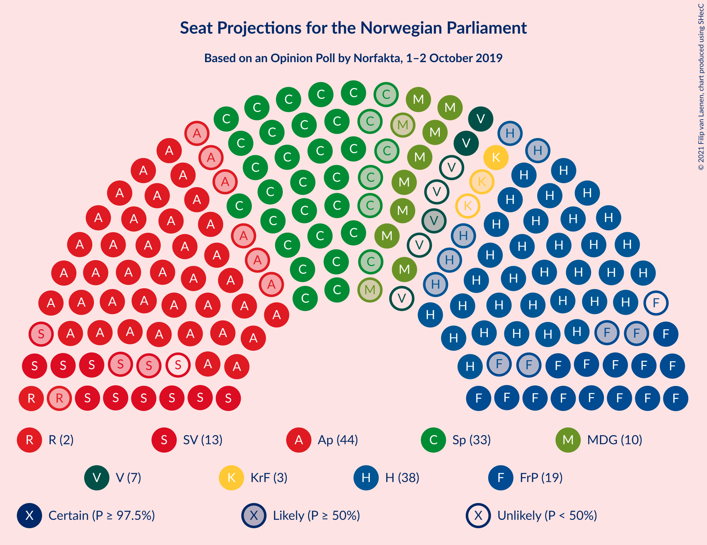
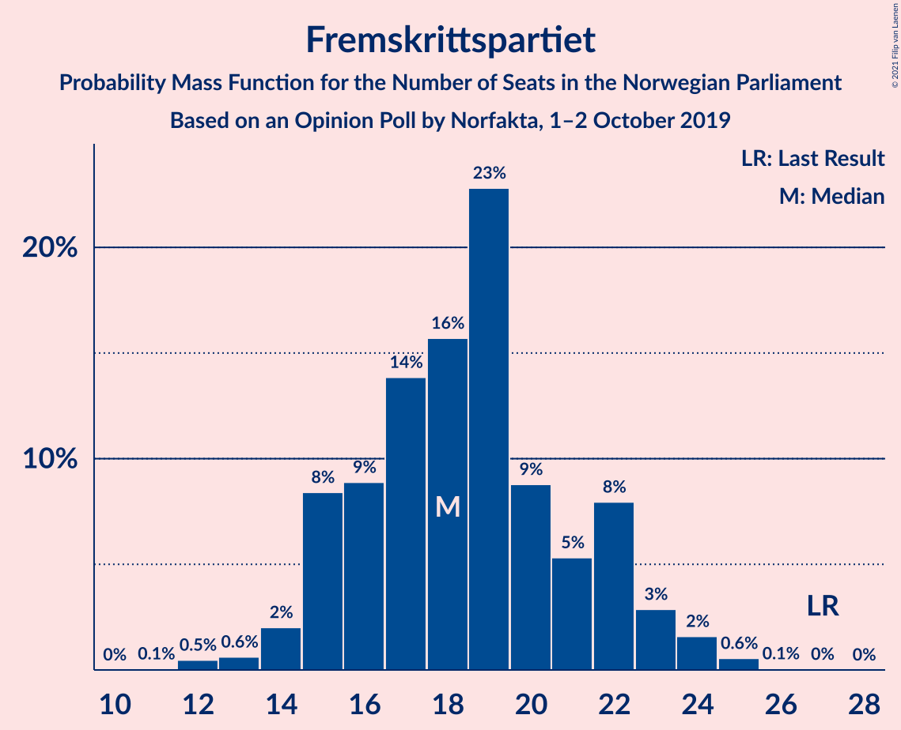
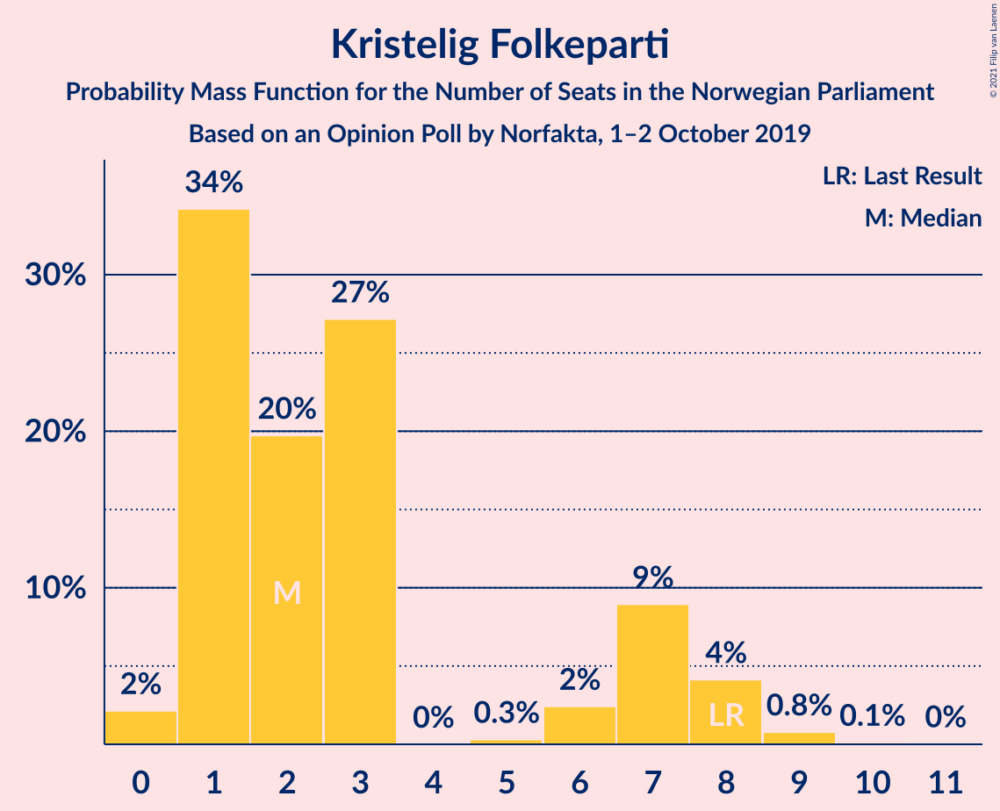
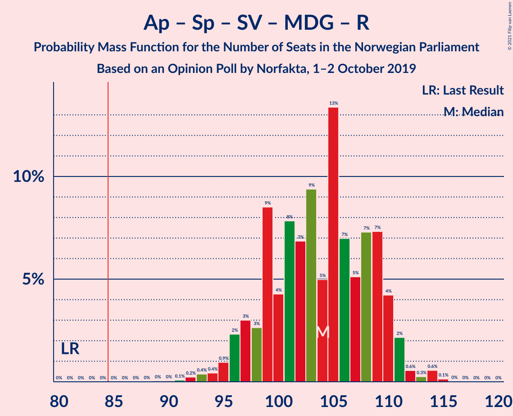
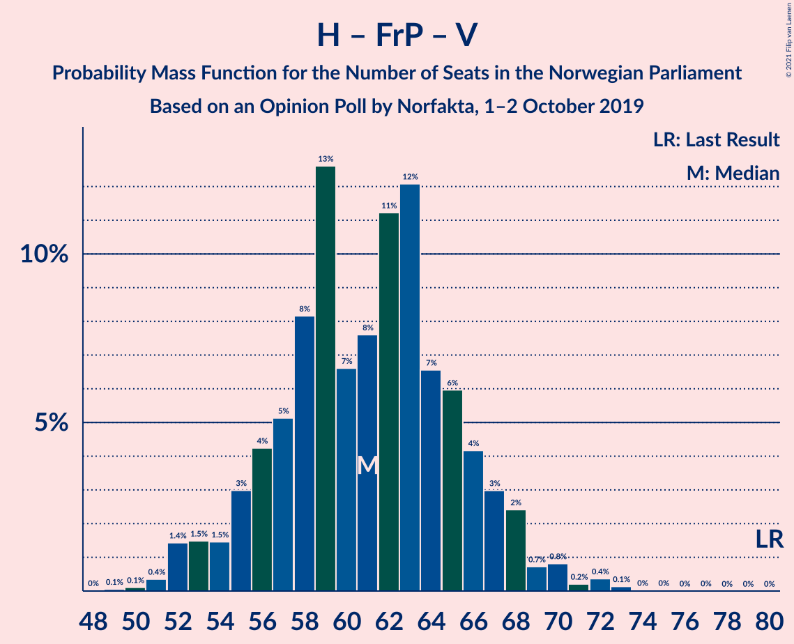
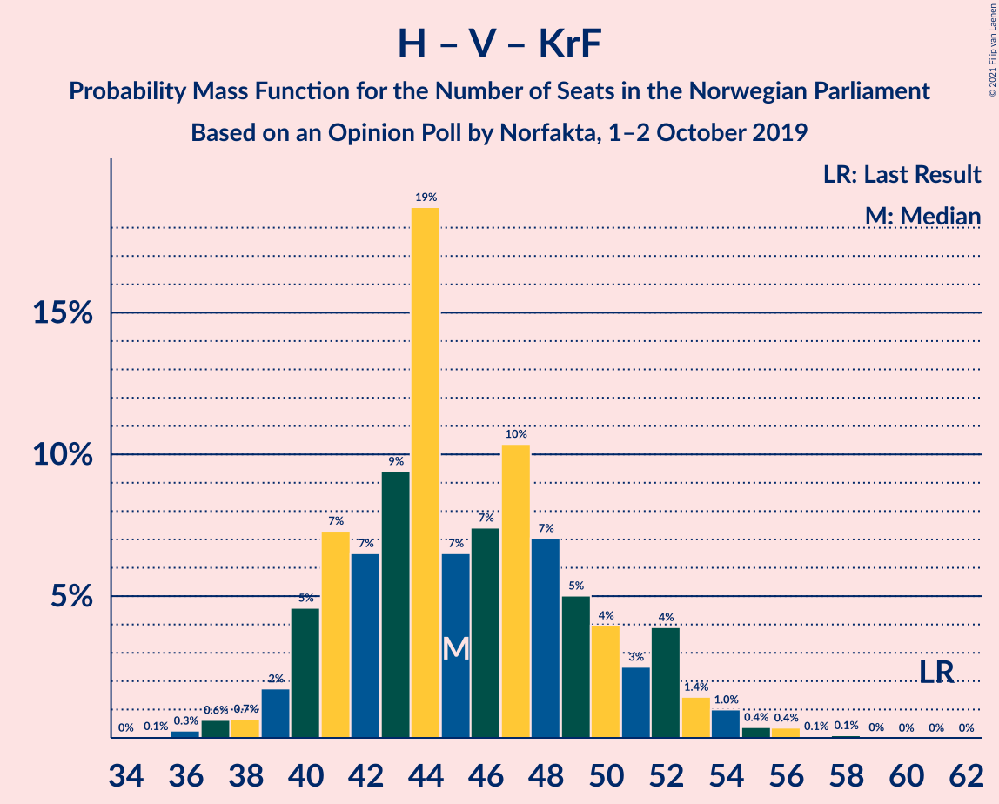

# Opinion Poll by Norfakta, 1–2 October 2019

<a href="#voting-intentions">Voting Intentions</a> | <a href="#seats">Seats</a> | <a href="#coalitions">Coalitions</a> | <a href="#technical-information">Technical Information</a>

## Voting Intentions

### Confidence Intervals

| Party | Last Result | Poll Result | 80% Confidence Interval | 90% Confidence Interval | 95% Confidence Interval | 99% Confidence Interval |
|:-----:|:-----------:|:-----------:|:-----------------------:|:-----------------------:|:-----------------------:|:-----------------------:|
| Arbeiderpartiet | 27.4% | 23.5% | 21.6–25.5% |21.1–26.0% |20.7–26.5% |19.8–27.5% |
| Høyre | 25.0% | 21.4% | 19.6–23.3% |19.1–23.8% |18.7–24.3% |17.8–25.3% |
| Senterpartiet | 10.3% | 17.2% | 15.5–19.0% |15.1–19.5% |14.7–19.9% |14.0–20.8% |
| Fremskrittspartiet | 15.2% | 10.5% | 9.2–12.0% |8.9–12.4% |8.6–12.8% |8.0–13.5% |
| Sosialistisk Venstreparti | 6.0% | 7.0% | 6.0–8.3% |5.7–8.7% |5.5–9.0% |5.0–9.7% |
| Miljøpartiet De Grønne | 3.2% | 6.0% | 5.1–7.3% |4.8–7.6% |4.6–7.9% |4.2–8.5% |
| Rødt | 2.4% | 4.0% | 3.2–5.0% |3.0–5.3% |2.8–5.5% |2.5–6.1% |
| Venstre | 4.4% | 3.8% | 3.1–4.8% |2.9–5.1% |2.7–5.4% |2.4–5.9% |
| Kristelig Folkeparti | 4.2% | 3.3% | 2.7–4.3% |2.5–4.6% |2.3–4.8% |2.0–5.3% |

*Note:* The poll result column reflects the actual value used in the calculations. Published results may vary slightly, and in addition be rounded to fewer digits.

## Seats

### Confidence Intervals

| Party | Last Result | Median | 80% Confidence Interval | 90% Confidence Interval | 95% Confidence Interval | 99% Confidence Interval |
|:-----:|:-----------:|:------:|:-----------------------:|:-----------------------:|:-----------------------:|:-----------------------:|
| <a href="#arbeiderpartiet">Arbeiderpartiet</a> | 49 | 44 | 40–46 |39–47 |38–48 |37–50 |
| <a href="#høyre">Høyre</a> | 45 | 38 | 34–42 |34–43 |33–43 |31–45 |
| <a href="#senterpartiet">Senterpartiet</a> | 19 | 33 | 29–36 |28–36 |27–37 |25–39 |
| <a href="#fremskrittspartiet">Fremskrittspartiet</a> | 27 | 18 | 15–22 |15–23 |14–23 |12–25 |
| <a href="#sosialistisk-venstreparti">Sosialistisk Venstreparti</a> | 11 | 12 | 10–15 |10–15 |9–16 |8–17 |
| <a href="#miljøpartiet-de-grønne">Miljøpartiet De Grønne</a> | 1 | 10 | 9–13 |8–13 |8–14 |7–16 |
| <a href="#rødt">Rødt</a> | 1 | 2 | 2–9 |2–9 |1–10 |1–10 |
| <a href="#venstre">Venstre</a> | 8 | 3 | 2–8 |2–9 |2–9 |2–10 |
| <a href="#kristelig-folkeparti">Kristelig Folkeparti</a> | 8 | 2 | 1–7 |1–8 |1–8 |0–9 |

### Arbeiderpartiet

*For a full overview of the results for this party, see the [Arbeiderpartiet](party-arbeiderpartiet.html) page.*

| Number of Seats | Probability | Accumulated | Special Marks |
|:---------------:|:-----------:|:-----------:|:-------------:|
| 34 | 0% | 100% |  |
| 35 | 0.1% | 99.9% |  |
| 36 | 0.2% | 99.8% |  |
| 37 | 0.9% | 99.6% |  |
| 38 | 2% | 98.7% |  |
| 39 | 6% | 97% |  |
| 40 | 7% | 91% |  |
| 41 | 8% | 84% |  |
| 42 | 14% | 76% |  |
| 43 | 11% | 62% |  |
| 44 | 26% | 51% | Median |
| 45 | 11% | 25% |  |
| 46 | 5% | 14% |  |
| 47 | 6% | 10% |  |
| 48 | 2% | 4% |  |
| 49 | 0.7% | 2% | Last Result |
| 50 | 0.7% | 1.2% |  |
| 51 | 0.2% | 0.4% |  |
| 52 | 0.1% | 0.2% |  |
| 53 | 0.1% | 0.1% |  |
| 54 | 0% | 0% |  |

### Høyre

*For a full overview of the results for this party, see the [Høyre](party-høyre.html) page.*

| Number of Seats | Probability | Accumulated | Special Marks |
|:---------------:|:-----------:|:-----------:|:-------------:|
| 30 | 0.1% | 100% |  |
| 31 | 0.5% | 99.9% |  |
| 32 | 1.1% | 99.3% |  |
| 33 | 2% | 98% |  |
| 34 | 7% | 97% |  |
| 35 | 12% | 90% |  |
| 36 | 8% | 78% |  |
| 37 | 11% | 70% |  |
| 38 | 16% | 59% | Median |
| 39 | 10% | 43% |  |
| 40 | 8% | 33% |  |
| 41 | 14% | 25% |  |
| 42 | 5% | 12% |  |
| 43 | 5% | 7% |  |
| 44 | 1.1% | 2% |  |
| 45 | 0.7% | 1.1% | Last Result |
| 46 | 0.2% | 0.4% |  |
| 47 | 0.1% | 0.2% |  |
| 48 | 0.1% | 0.1% |  |
| 49 | 0% | 0% |  |

### Senterpartiet

*For a full overview of the results for this party, see the [Senterpartiet](party-senterpartiet.html) page.*

| Number of Seats | Probability | Accumulated | Special Marks |
|:---------------:|:-----------:|:-----------:|:-------------:|
| 19 | 0% | 100% | Last Result |
| 20 | 0% | 100% |  |
| 21 | 0% | 100% |  |
| 22 | 0% | 100% |  |
| 23 | 0% | 100% |  |
| 24 | 0.1% | 99.9% |  |
| 25 | 0.4% | 99.8% |  |
| 26 | 1.0% | 99.5% |  |
| 27 | 2% | 98% |  |
| 28 | 3% | 97% |  |
| 29 | 4% | 94% |  |
| 30 | 9% | 90% |  |
| 31 | 9% | 81% |  |
| 32 | 15% | 72% |  |
| 33 | 19% | 57% | Median |
| 34 | 14% | 38% |  |
| 35 | 9% | 24% |  |
| 36 | 11% | 15% |  |
| 37 | 3% | 4% |  |
| 38 | 0.7% | 1.3% |  |
| 39 | 0.4% | 0.6% |  |
| 40 | 0.1% | 0.2% |  |
| 41 | 0% | 0.1% |  |
| 42 | 0% | 0% |  |

### Fremskrittspartiet

*For a full overview of the results for this party, see the [Fremskrittspartiet](party-fremskrittspartiet.html) page.*

| Number of Seats | Probability | Accumulated | Special Marks |
|:---------------:|:-----------:|:-----------:|:-------------:|
| 11 | 0.1% | 100% |  |
| 12 | 0.5% | 99.9% |  |
| 13 | 0.6% | 99.5% |  |
| 14 | 2% | 98.8% |  |
| 15 | 8% | 97% |  |
| 16 | 9% | 88% |  |
| 17 | 14% | 80% |  |
| 18 | 16% | 66% | Median |
| 19 | 23% | 50% |  |
| 20 | 9% | 27% |  |
| 21 | 5% | 18% |  |
| 22 | 8% | 13% |  |
| 23 | 3% | 5% |  |
| 24 | 2% | 2% |  |
| 25 | 0.6% | 0.7% |  |
| 26 | 0.1% | 0.1% |  |
| 27 | 0% | 0% | Last Result |

### Sosialistisk Venstreparti

*For a full overview of the results for this party, see the [Sosialistisk Venstreparti](party-sosialistiskvenstreparti.html) page.*

| Number of Seats | Probability | Accumulated | Special Marks |
|:---------------:|:-----------:|:-----------:|:-------------:|
| 7 | 0.1% | 100% |  |
| 8 | 2% | 99.9% |  |
| 9 | 3% | 98% |  |
| 10 | 7% | 95% |  |
| 11 | 18% | 88% | Last Result |
| 12 | 21% | 70% | Median |
| 13 | 22% | 49% |  |
| 14 | 8% | 27% |  |
| 15 | 16% | 19% |  |
| 16 | 2% | 4% |  |
| 17 | 1.3% | 2% |  |
| 18 | 0.4% | 0.4% |  |
| 19 | 0% | 0.1% |  |
| 20 | 0% | 0% |  |

### Miljøpartiet De Grønne

*For a full overview of the results for this party, see the [Miljøpartiet De Grønne](party-miljøpartietdegrønne.html) page.*

| Number of Seats | Probability | Accumulated | Special Marks |
|:---------------:|:-----------:|:-----------:|:-------------:|
| 1 | 0% | 100% | Last Result |
| 2 | 0.2% | 100% |  |
| 3 | 0% | 99.8% |  |
| 4 | 0% | 99.8% |  |
| 5 | 0% | 99.8% |  |
| 6 | 0.1% | 99.8% |  |
| 7 | 2% | 99.7% |  |
| 8 | 7% | 98% |  |
| 9 | 19% | 91% |  |
| 10 | 25% | 72% | Median |
| 11 | 18% | 48% |  |
| 12 | 17% | 30% |  |
| 13 | 9% | 13% |  |
| 14 | 3% | 4% |  |
| 15 | 0.6% | 1.2% |  |
| 16 | 0.6% | 0.7% |  |
| 17 | 0.1% | 0.1% |  |
| 18 | 0% | 0% |  |

### Rødt

*For a full overview of the results for this party, see the [Rødt](party-rødt.html) page.*

| Number of Seats | Probability | Accumulated | Special Marks |
|:---------------:|:-----------:|:-----------:|:-------------:|
| 1 | 4% | 100% | Last Result |
| 2 | 46% | 96% | Median |
| 3 | 0% | 50% |  |
| 4 | 0% | 50% |  |
| 5 | 0% | 50% |  |
| 6 | 2% | 50% |  |
| 7 | 21% | 48% |  |
| 8 | 16% | 27% |  |
| 9 | 8% | 11% |  |
| 10 | 3% | 3% |  |
| 11 | 0.3% | 0.4% |  |
| 12 | 0.1% | 0.1% |  |
| 13 | 0% | 0% |  |

### Venstre

*For a full overview of the results for this party, see the [Venstre](party-venstre.html) page.*

| Number of Seats | Probability | Accumulated | Special Marks |
|:---------------:|:-----------:|:-----------:|:-------------:|
| 1 | 0.2% | 100% |  |
| 2 | 46% | 99.8% |  |
| 3 | 14% | 54% | Median |
| 4 | 0.3% | 40% |  |
| 5 | 0% | 40% |  |
| 6 | 3% | 40% |  |
| 7 | 17% | 37% |  |
| 8 | 15% | 21% | Last Result |
| 9 | 4% | 5% |  |
| 10 | 0.9% | 1.1% |  |
| 11 | 0.2% | 0.3% |  |
| 12 | 0% | 0% |  |

### Kristelig Folkeparti

*For a full overview of the results for this party, see the [Kristelig Folkeparti](party-kristeligfolkeparti.html) page.*

| Number of Seats | Probability | Accumulated | Special Marks |
|:---------------:|:-----------:|:-----------:|:-------------:|
| 0 | 2% | 100% |  |
| 1 | 34% | 98% |  |
| 2 | 20% | 64% | Median |
| 3 | 27% | 44% |  |
| 4 | 0% | 17% |  |
| 5 | 0.3% | 17% |  |
| 6 | 2% | 16% |  |
| 7 | 9% | 14% |  |
| 8 | 4% | 5% | Last Result |
| 9 | 0.8% | 0.9% |  |
| 10 | 0.1% | 0.2% |  |
| 11 | 0% | 0% |  |

## Coalitions

### Confidence Intervals

| Coalition | Last Result | Median | Majority? | 80% Confidence Interval | 90% Confidence Interval | 95% Confidence Interval | 99% Confidence Interval |
|:---------:|:-----------:|:------:|:---------:|:-----------------------:|:-----------------------:|:-----------------------:|:-----------------------:|
| Arbeiderpartiet – Senterpartiet – Sosialistisk Venstreparti – Miljøpartiet De Grønne – Rødt | 81 | 104 | 100% | 98–109 | 97–110 | 96–111 | 93–114 |
| Arbeiderpartiet – Senterpartiet – Sosialistisk Venstreparti – Miljøpartiet De Grønne – Kristelig Folkeparti | 88 | 102 | 100% | 97–107 | 96–109 | 94–109 | 92–111 |
| Arbeiderpartiet – Senterpartiet – Sosialistisk Venstreparti – Miljøpartiet De Grønne | 80 | 99 | 100% | 94–104 | 93–106 | 92–107 | 89–108 |
| Høyre – Senterpartiet – Fremskrittspartiet – Venstre – Kristelig Folkeparti | 107 | 96 | 99.8% | 92–102 | 91–103 | 90–104 | 86–106 |
| Arbeiderpartiet – Senterpartiet – Sosialistisk Venstreparti – Rødt | 80 | 93 | 98.7% | 88–99 | 86–100 | 85–100 | 83–102 |
| Arbeiderpartiet – Senterpartiet – Miljøpartiet De Grønne – Kristelig Folkeparti | 77 | 89 | 88% | 84–94 | 83–96 | 82–97 | 79–99 |
| Arbeiderpartiet – Senterpartiet – Sosialistisk Venstreparti | 79 | 88 | 86% | 84–93 | 83–94 | 81–95 | 79–97 |
| Arbeiderpartiet – Senterpartiet – Kristelig Folkeparti | 76 | 78 | 6% | 74–83 | 72–85 | 71–86 | 69–88 |
| Høyre – Fremskrittspartiet – Miljøpartiet De Grønne – Venstre – Kristelig Folkeparti | 89 | 74 | 0.7% | 69–80 | 68–82 | 67–83 | 64–86 |
| Arbeiderpartiet – Senterpartiet | 68 | 76 | 0.2% | 72–80 | 70–81 | 69–82 | 66–84 |
| Høyre – Fremskrittspartiet – Venstre – Kristelig Folkeparti | 88 | 64 | 0% | 59–69 | 58–71 | 57–73 | 54–74 |
| Høyre – Fremskrittspartiet – Venstre | 80 | 61 | 0% | 56–66 | 55–67 | 53–68 | 51–72 |
| Høyre – Fremskrittspartiet | 72 | 56 | 0% | 52–61 | 51–63 | 49–64 | 47–66 |
| Arbeiderpartiet – Sosialistisk Venstreparti | 60 | 56 | 0% | 52–60 | 51–61 | 50–62 | 48–64 |
| Høyre – Venstre – Kristelig Folkeparti | 61 | 45 | 0% | 41–50 | 40–52 | 39–53 | 37–56 |
| Senterpartiet – Venstre – Kristelig Folkeparti | 35 | 40 | 0% | 35–45 | 34–47 | 32–48 | 30–51 |

### Arbeiderpartiet – Senterpartiet – Sosialistisk Venstreparti – Miljøpartiet De Grønne – Rødt

| Number of Seats | Probability | Accumulated | Special Marks |
|:---------------:|:-----------:|:-----------:|:-------------:|
| 81 | 0% | 100% | Last Result |
| 82 | 0% | 100% |  |
| 83 | 0% | 100% |  |
| 84 | 0% | 100% |  |
| 85 | 0% | 100% | Majority |
| 86 | 0% | 100% |  |
| 87 | 0% | 100% |  |
| 88 | 0% | 100% |  |
| 89 | 0% | 100% |  |
| 90 | 0% | 99.9% |  |
| 91 | 0.1% | 99.9% |  |
| 92 | 0.2% | 99.8% |  |
| 93 | 0.4% | 99.6% |  |
| 94 | 0.4% | 99.2% |  |
| 95 | 0.9% | 98.8% |  |
| 96 | 2% | 98% |  |
| 97 | 3% | 95% |  |
| 98 | 3% | 92% |  |
| 99 | 9% | 90% |  |
| 100 | 4% | 81% |  |
| 101 | 8% | 77% | Median |
| 102 | 7% | 69% |  |
| 103 | 9% | 62% |  |
| 104 | 5% | 53% |  |
| 105 | 13% | 48% |  |
| 106 | 7% | 35% |  |
| 107 | 5% | 28% |  |
| 108 | 7% | 23% |  |
| 109 | 7% | 15% |  |
| 110 | 4% | 8% |  |
| 111 | 2% | 4% |  |
| 112 | 0.6% | 2% |  |
| 113 | 0.3% | 1.0% |  |
| 114 | 0.6% | 0.7% |  |
| 115 | 0.1% | 0.2% |  |
| 116 | 0% | 0% |  |

### Arbeiderpartiet – Senterpartiet – Sosialistisk Venstreparti – Miljøpartiet De Grønne – Kristelig Folkeparti

| Number of Seats | Probability | Accumulated | Special Marks |
|:---------------:|:-----------:|:-----------:|:-------------:|
| 88 | 0% | 100% | Last Result |
| 89 | 0.1% | 99.9% |  |
| 90 | 0.1% | 99.9% |  |
| 91 | 0.2% | 99.7% |  |
| 92 | 0.5% | 99.6% |  |
| 93 | 1.3% | 99.0% |  |
| 94 | 1.5% | 98% |  |
| 95 | 1.0% | 96% |  |
| 96 | 5% | 95% |  |
| 97 | 5% | 90% |  |
| 98 | 6% | 85% |  |
| 99 | 10% | 79% |  |
| 100 | 8% | 69% |  |
| 101 | 10% | 61% | Median |
| 102 | 8% | 51% |  |
| 103 | 11% | 43% |  |
| 104 | 10% | 32% |  |
| 105 | 4% | 22% |  |
| 106 | 5% | 18% |  |
| 107 | 4% | 13% |  |
| 108 | 4% | 9% |  |
| 109 | 4% | 6% |  |
| 110 | 1.0% | 2% |  |
| 111 | 0.5% | 0.9% |  |
| 112 | 0.1% | 0.4% |  |
| 113 | 0.1% | 0.3% |  |
| 114 | 0.1% | 0.2% |  |
| 115 | 0% | 0.1% |  |
| 116 | 0% | 0% |  |

### Arbeiderpartiet – Senterpartiet – Sosialistisk Venstreparti – Miljøpartiet De Grønne

| Number of Seats | Probability | Accumulated | Special Marks |
|:---------------:|:-----------:|:-----------:|:-------------:|
| 80 | 0% | 100% | Last Result |
| 81 | 0% | 100% |  |
| 82 | 0% | 100% |  |
| 83 | 0% | 100% |  |
| 84 | 0% | 100% |  |
| 85 | 0% | 100% | Majority |
| 86 | 0.1% | 99.9% |  |
| 87 | 0.1% | 99.8% |  |
| 88 | 0.2% | 99.7% |  |
| 89 | 0.3% | 99.6% |  |
| 90 | 0.8% | 99.3% |  |
| 91 | 0.9% | 98% |  |
| 92 | 2% | 98% |  |
| 93 | 2% | 95% |  |
| 94 | 4% | 93% |  |
| 95 | 7% | 89% |  |
| 96 | 9% | 82% |  |
| 97 | 11% | 73% |  |
| 98 | 7% | 61% |  |
| 99 | 13% | 54% | Median |
| 100 | 9% | 41% |  |
| 101 | 7% | 33% |  |
| 102 | 5% | 25% |  |
| 103 | 9% | 21% |  |
| 104 | 3% | 11% |  |
| 105 | 2% | 9% |  |
| 106 | 3% | 7% |  |
| 107 | 3% | 4% |  |
| 108 | 0.4% | 0.7% |  |
| 109 | 0.2% | 0.3% |  |
| 110 | 0.1% | 0.2% |  |
| 111 | 0% | 0% |  |

### Høyre – Senterpartiet – Fremskrittspartiet – Venstre – Kristelig Folkeparti

| Number of Seats | Probability | Accumulated | Special Marks |
|:---------------:|:-----------:|:-----------:|:-------------:|
| 83 | 0% | 100% |  |
| 84 | 0.1% | 99.9% |  |
| 85 | 0.1% | 99.8% | Majority |
| 86 | 0.3% | 99.8% |  |
| 87 | 0.5% | 99.5% |  |
| 88 | 0.5% | 99.0% |  |
| 89 | 0.8% | 98.5% |  |
| 90 | 2% | 98% |  |
| 91 | 3% | 96% |  |
| 92 | 7% | 93% |  |
| 93 | 3% | 86% |  |
| 94 | 12% | 83% | Median |
| 95 | 10% | 71% |  |
| 96 | 18% | 61% |  |
| 97 | 12% | 43% |  |
| 98 | 5% | 31% |  |
| 99 | 6% | 25% |  |
| 100 | 5% | 20% |  |
| 101 | 3% | 15% |  |
| 102 | 4% | 12% |  |
| 103 | 4% | 8% |  |
| 104 | 2% | 4% |  |
| 105 | 1.0% | 2% |  |
| 106 | 0.3% | 0.7% |  |
| 107 | 0.3% | 0.5% | Last Result |
| 108 | 0.1% | 0.1% |  |
| 109 | 0% | 0.1% |  |
| 110 | 0% | 0% |  |

### Arbeiderpartiet – Senterpartiet – Sosialistisk Venstreparti – Rødt

| Number of Seats | Probability | Accumulated | Special Marks |
|:---------------:|:-----------:|:-----------:|:-------------:|
| 80 | 0% | 100% | Last Result |
| 81 | 0.1% | 99.9% |  |
| 82 | 0.2% | 99.8% |  |
| 83 | 0.7% | 99.6% |  |
| 84 | 0.3% | 99.0% |  |
| 85 | 2% | 98.7% | Majority |
| 86 | 2% | 96% |  |
| 87 | 3% | 94% |  |
| 88 | 4% | 91% |  |
| 89 | 8% | 87% |  |
| 90 | 6% | 79% |  |
| 91 | 5% | 72% | Median |
| 92 | 9% | 67% |  |
| 93 | 9% | 58% |  |
| 94 | 7% | 48% |  |
| 95 | 9% | 41% |  |
| 96 | 8% | 32% |  |
| 97 | 8% | 24% |  |
| 98 | 4% | 16% |  |
| 99 | 7% | 12% |  |
| 100 | 3% | 5% |  |
| 101 | 2% | 2% |  |
| 102 | 0.5% | 0.9% |  |
| 103 | 0.2% | 0.4% |  |
| 104 | 0.2% | 0.2% |  |
| 105 | 0.1% | 0.1% |  |
| 106 | 0% | 0% |  |

### Arbeiderpartiet – Senterpartiet – Miljøpartiet De Grønne – Kristelig Folkeparti

| Number of Seats | Probability | Accumulated | Special Marks |
|:---------------:|:-----------:|:-----------:|:-------------:|
| 77 | 0.1% | 100% | Last Result |
| 78 | 0.2% | 99.9% |  |
| 79 | 0.2% | 99.7% |  |
| 80 | 0.4% | 99.5% |  |
| 81 | 2% | 99.1% |  |
| 82 | 1.2% | 98% |  |
| 83 | 2% | 96% |  |
| 84 | 6% | 94% |  |
| 85 | 5% | 88% | Majority |
| 86 | 9% | 83% |  |
| 87 | 6% | 75% |  |
| 88 | 9% | 69% |  |
| 89 | 18% | 59% | Median |
| 90 | 8% | 42% |  |
| 91 | 9% | 33% |  |
| 92 | 4% | 24% |  |
| 93 | 5% | 20% |  |
| 94 | 6% | 15% |  |
| 95 | 3% | 10% |  |
| 96 | 4% | 7% |  |
| 97 | 0.9% | 3% |  |
| 98 | 1.1% | 2% |  |
| 99 | 0.4% | 0.6% |  |
| 100 | 0.1% | 0.2% |  |
| 101 | 0% | 0.1% |  |
| 102 | 0.1% | 0.1% |  |
| 103 | 0% | 0% |  |

### Arbeiderpartiet – Senterpartiet – Sosialistisk Venstreparti

| Number of Seats | Probability | Accumulated | Special Marks |
|:---------------:|:-----------:|:-----------:|:-------------:|
| 76 | 0.1% | 100% |  |
| 77 | 0.1% | 99.9% |  |
| 78 | 0.1% | 99.8% |  |
| 79 | 0.5% | 99.7% | Last Result |
| 80 | 0.7% | 99.2% |  |
| 81 | 1.2% | 98% |  |
| 82 | 2% | 97% |  |
| 83 | 3% | 96% |  |
| 84 | 6% | 92% |  |
| 85 | 6% | 86% | Majority |
| 86 | 8% | 80% |  |
| 87 | 16% | 73% |  |
| 88 | 8% | 56% |  |
| 89 | 11% | 48% | Median |
| 90 | 7% | 37% |  |
| 91 | 11% | 31% |  |
| 92 | 8% | 19% |  |
| 93 | 5% | 11% |  |
| 94 | 2% | 6% |  |
| 95 | 3% | 5% |  |
| 96 | 0.6% | 2% |  |
| 97 | 0.9% | 1.2% |  |
| 98 | 0.1% | 0.3% |  |
| 99 | 0.2% | 0.2% |  |
| 100 | 0% | 0% |  |

### Arbeiderpartiet – Senterpartiet – Kristelig Folkeparti

| Number of Seats | Probability | Accumulated | Special Marks |
|:---------------:|:-----------:|:-----------:|:-------------:|
| 67 | 0.1% | 100% |  |
| 68 | 0.1% | 99.8% |  |
| 69 | 0.3% | 99.7% |  |
| 70 | 1.1% | 99.4% |  |
| 71 | 1.4% | 98% |  |
| 72 | 2% | 97% |  |
| 73 | 2% | 95% |  |
| 74 | 4% | 92% |  |
| 75 | 5% | 89% |  |
| 76 | 12% | 83% | Last Result |
| 77 | 11% | 71% |  |
| 78 | 11% | 60% |  |
| 79 | 11% | 49% | Median |
| 80 | 11% | 39% |  |
| 81 | 5% | 28% |  |
| 82 | 8% | 23% |  |
| 83 | 5% | 15% |  |
| 84 | 4% | 10% |  |
| 85 | 2% | 6% | Majority |
| 86 | 1.4% | 4% |  |
| 87 | 1.0% | 2% |  |
| 88 | 1.1% | 1.4% |  |
| 89 | 0.1% | 0.3% |  |
| 90 | 0.1% | 0.2% |  |
| 91 | 0% | 0% |  |

### Høyre – Fremskrittspartiet – Miljøpartiet De Grønne – Venstre – Kristelig Folkeparti

| Number of Seats | Probability | Accumulated | Special Marks |
|:---------------:|:-----------:|:-----------:|:-------------:|
| 62 | 0.1% | 100% |  |
| 63 | 0.2% | 99.8% |  |
| 64 | 0.3% | 99.6% |  |
| 65 | 0.7% | 99.4% |  |
| 66 | 0.8% | 98.7% |  |
| 67 | 1.3% | 98% |  |
| 68 | 3% | 97% |  |
| 69 | 5% | 94% |  |
| 70 | 7% | 89% |  |
| 71 | 6% | 82% | Median |
| 72 | 9% | 76% |  |
| 73 | 13% | 66% |  |
| 74 | 10% | 53% |  |
| 75 | 7% | 43% |  |
| 76 | 8% | 36% |  |
| 77 | 8% | 28% |  |
| 78 | 2% | 20% |  |
| 79 | 5% | 17% |  |
| 80 | 3% | 12% |  |
| 81 | 3% | 9% |  |
| 82 | 2% | 6% |  |
| 83 | 1.4% | 4% |  |
| 84 | 2% | 2% |  |
| 85 | 0.2% | 0.7% | Majority |
| 86 | 0.4% | 0.5% |  |
| 87 | 0.1% | 0.2% |  |
| 88 | 0% | 0.1% |  |
| 89 | 0% | 0% | Last Result |

### Arbeiderpartiet – Senterpartiet

| Number of Seats | Probability | Accumulated | Special Marks |
|:---------------:|:-----------:|:-----------:|:-------------:|
| 64 | 0% | 100% |  |
| 65 | 0.1% | 99.9% |  |
| 66 | 0.4% | 99.8% |  |
| 67 | 0.6% | 99.5% |  |
| 68 | 0.7% | 98.9% | Last Result |
| 69 | 1.1% | 98% |  |
| 70 | 3% | 97% |  |
| 71 | 3% | 94% |  |
| 72 | 5% | 91% |  |
| 73 | 9% | 86% |  |
| 74 | 10% | 77% |  |
| 75 | 10% | 67% |  |
| 76 | 13% | 57% |  |
| 77 | 15% | 44% | Median |
| 78 | 10% | 29% |  |
| 79 | 5% | 19% |  |
| 80 | 5% | 14% |  |
| 81 | 6% | 9% |  |
| 82 | 2% | 3% |  |
| 83 | 0.6% | 1.2% |  |
| 84 | 0.4% | 0.6% |  |
| 85 | 0.1% | 0.2% | Majority |
| 86 | 0% | 0.1% |  |
| 87 | 0% | 0% |  |

### Høyre – Fremskrittspartiet – Venstre – Kristelig Folkeparti

| Number of Seats | Probability | Accumulated | Special Marks |
|:---------------:|:-----------:|:-----------:|:-------------:|
| 52 | 0.1% | 100% |  |
| 53 | 0.1% | 99.8% |  |
| 54 | 0.4% | 99.7% |  |
| 55 | 1.0% | 99.3% |  |
| 56 | 0.5% | 98% |  |
| 57 | 1.1% | 98% |  |
| 58 | 3% | 97% |  |
| 59 | 6% | 94% |  |
| 60 | 9% | 88% |  |
| 61 | 11% | 79% | Median |
| 62 | 6% | 68% |  |
| 63 | 11% | 62% |  |
| 64 | 14% | 51% |  |
| 65 | 6% | 37% |  |
| 66 | 9% | 31% |  |
| 67 | 6% | 22% |  |
| 68 | 4% | 17% |  |
| 69 | 4% | 13% |  |
| 70 | 4% | 9% |  |
| 71 | 2% | 6% |  |
| 72 | 1.1% | 4% |  |
| 73 | 2% | 3% |  |
| 74 | 0.3% | 0.7% |  |
| 75 | 0.2% | 0.4% |  |
| 76 | 0.1% | 0.2% |  |
| 77 | 0.1% | 0.2% |  |
| 78 | 0% | 0.1% |  |
| 79 | 0% | 0% |  |
| 80 | 0% | 0% |  |
| 81 | 0% | 0% |  |
| 82 | 0% | 0% |  |
| 83 | 0% | 0% |  |
| 84 | 0% | 0% |  |
| 85 | 0% | 0% | Majority |
| 86 | 0% | 0% |  |
| 87 | 0% | 0% |  |
| 88 | 0% | 0% | Last Result |

### Høyre – Fremskrittspartiet – Venstre

| Number of Seats | Probability | Accumulated | Special Marks |
|:---------------:|:-----------:|:-----------:|:-------------:|
| 49 | 0.1% | 100% |  |
| 50 | 0.1% | 99.9% |  |
| 51 | 0.4% | 99.8% |  |
| 52 | 1.4% | 99.5% |  |
| 53 | 1.5% | 98% |  |
| 54 | 1.5% | 97% |  |
| 55 | 3% | 95% |  |
| 56 | 4% | 92% |  |
| 57 | 5% | 88% |  |
| 58 | 8% | 83% |  |
| 59 | 13% | 75% | Median |
| 60 | 7% | 62% |  |
| 61 | 8% | 55% |  |
| 62 | 11% | 48% |  |
| 63 | 12% | 36% |  |
| 64 | 7% | 24% |  |
| 65 | 6% | 18% |  |
| 66 | 4% | 12% |  |
| 67 | 3% | 8% |  |
| 68 | 2% | 5% |  |
| 69 | 0.7% | 2% |  |
| 70 | 0.8% | 2% |  |
| 71 | 0.2% | 0.8% |  |
| 72 | 0.4% | 0.6% |  |
| 73 | 0.1% | 0.2% |  |
| 74 | 0% | 0.1% |  |
| 75 | 0% | 0% |  |
| 76 | 0% | 0% |  |
| 77 | 0% | 0% |  |
| 78 | 0% | 0% |  |
| 79 | 0% | 0% |  |
| 80 | 0% | 0% | Last Result |

### Høyre – Fremskrittspartiet

| Number of Seats | Probability | Accumulated | Special Marks |
|:---------------:|:-----------:|:-----------:|:-------------:|
| 46 | 0.1% | 100% |  |
| 47 | 0.4% | 99.9% |  |
| 48 | 0.4% | 99.5% |  |
| 49 | 2% | 99.0% |  |
| 50 | 2% | 97% |  |
| 51 | 5% | 95% |  |
| 52 | 6% | 90% |  |
| 53 | 6% | 84% |  |
| 54 | 8% | 78% |  |
| 55 | 12% | 70% |  |
| 56 | 10% | 58% | Median |
| 57 | 10% | 49% |  |
| 58 | 8% | 39% |  |
| 59 | 5% | 31% |  |
| 60 | 8% | 26% |  |
| 61 | 8% | 18% |  |
| 62 | 2% | 10% |  |
| 63 | 4% | 7% |  |
| 64 | 1.3% | 4% |  |
| 65 | 0.8% | 2% |  |
| 66 | 1.3% | 2% |  |
| 67 | 0.1% | 0.3% |  |
| 68 | 0.1% | 0.2% |  |
| 69 | 0% | 0.1% |  |
| 70 | 0% | 0% |  |
| 71 | 0% | 0% |  |
| 72 | 0% | 0% | Last Result |

### Arbeiderpartiet – Sosialistisk Venstreparti

| Number of Seats | Probability | Accumulated | Special Marks |
|:---------------:|:-----------:|:-----------:|:-------------:|
| 46 | 0.1% | 100% |  |
| 47 | 0.2% | 99.8% |  |
| 48 | 0.4% | 99.7% |  |
| 49 | 1.2% | 99.3% |  |
| 50 | 3% | 98% |  |
| 51 | 5% | 95% |  |
| 52 | 5% | 91% |  |
| 53 | 12% | 86% |  |
| 54 | 10% | 73% |  |
| 55 | 13% | 64% |  |
| 56 | 13% | 51% | Median |
| 57 | 10% | 38% |  |
| 58 | 6% | 29% |  |
| 59 | 12% | 23% |  |
| 60 | 5% | 11% | Last Result |
| 61 | 3% | 6% |  |
| 62 | 1.0% | 3% |  |
| 63 | 1.1% | 2% |  |
| 64 | 0.4% | 0.7% |  |
| 65 | 0.1% | 0.2% |  |
| 66 | 0.1% | 0.1% |  |
| 67 | 0% | 0.1% |  |
| 68 | 0% | 0% |  |

### Høyre – Venstre – Kristelig Folkeparti

| Number of Seats | Probability | Accumulated | Special Marks |
|:---------------:|:-----------:|:-----------:|:-------------:|
| 35 | 0.1% | 100% |  |
| 36 | 0.3% | 99.9% |  |
| 37 | 0.6% | 99.7% |  |
| 38 | 0.7% | 99.0% |  |
| 39 | 2% | 98% |  |
| 40 | 5% | 97% |  |
| 41 | 7% | 92% |  |
| 42 | 7% | 85% |  |
| 43 | 9% | 78% | Median |
| 44 | 19% | 69% |  |
| 45 | 7% | 50% |  |
| 46 | 7% | 44% |  |
| 47 | 10% | 36% |  |
| 48 | 7% | 26% |  |
| 49 | 5% | 19% |  |
| 50 | 4% | 14% |  |
| 51 | 3% | 10% |  |
| 52 | 4% | 7% |  |
| 53 | 1.4% | 3% |  |
| 54 | 1.0% | 2% |  |
| 55 | 0.4% | 0.9% |  |
| 56 | 0.4% | 0.5% |  |
| 57 | 0.1% | 0.2% |  |
| 58 | 0.1% | 0.1% |  |
| 59 | 0% | 0% |  |
| 60 | 0% | 0% |  |
| 61 | 0% | 0% | Last Result |

### Senterpartiet – Venstre – Kristelig Folkeparti

| Number of Seats | Probability | Accumulated | Special Marks |
|:---------------:|:-----------:|:-----------:|:-------------:|
| 28 | 0.1% | 100% |  |
| 29 | 0.2% | 99.9% |  |
| 30 | 0.2% | 99.7% |  |
| 31 | 0.7% | 99.4% |  |
| 32 | 2% | 98.7% |  |
| 33 | 1.2% | 97% |  |
| 34 | 5% | 96% |  |
| 35 | 7% | 91% | Last Result |
| 36 | 8% | 84% |  |
| 37 | 6% | 77% |  |
| 38 | 9% | 71% | Median |
| 39 | 8% | 61% |  |
| 40 | 8% | 54% |  |
| 41 | 12% | 45% |  |
| 42 | 8% | 34% |  |
| 43 | 7% | 26% |  |
| 44 | 6% | 19% |  |
| 45 | 4% | 13% |  |
| 46 | 3% | 9% |  |
| 47 | 2% | 5% |  |
| 48 | 1.2% | 3% |  |
| 49 | 0.5% | 2% |  |
| 50 | 0.7% | 1.2% |  |
| 51 | 0.2% | 0.5% |  |
| 52 | 0.3% | 0.4% |  |
| 53 | 0% | 0.1% |  |
| 54 | 0% | 0% |  |

## Technical Information

### Opinion Poll

+ **Polling firm:** Norfakta
+ **Commissioner(s):** —
+ **Fieldwork period:** 1–2 October 2019

### Calculations

+ **Sample size:** 810
+ **Simulations done:** 1,048,576
+ **Error estimate:** 2.65%

