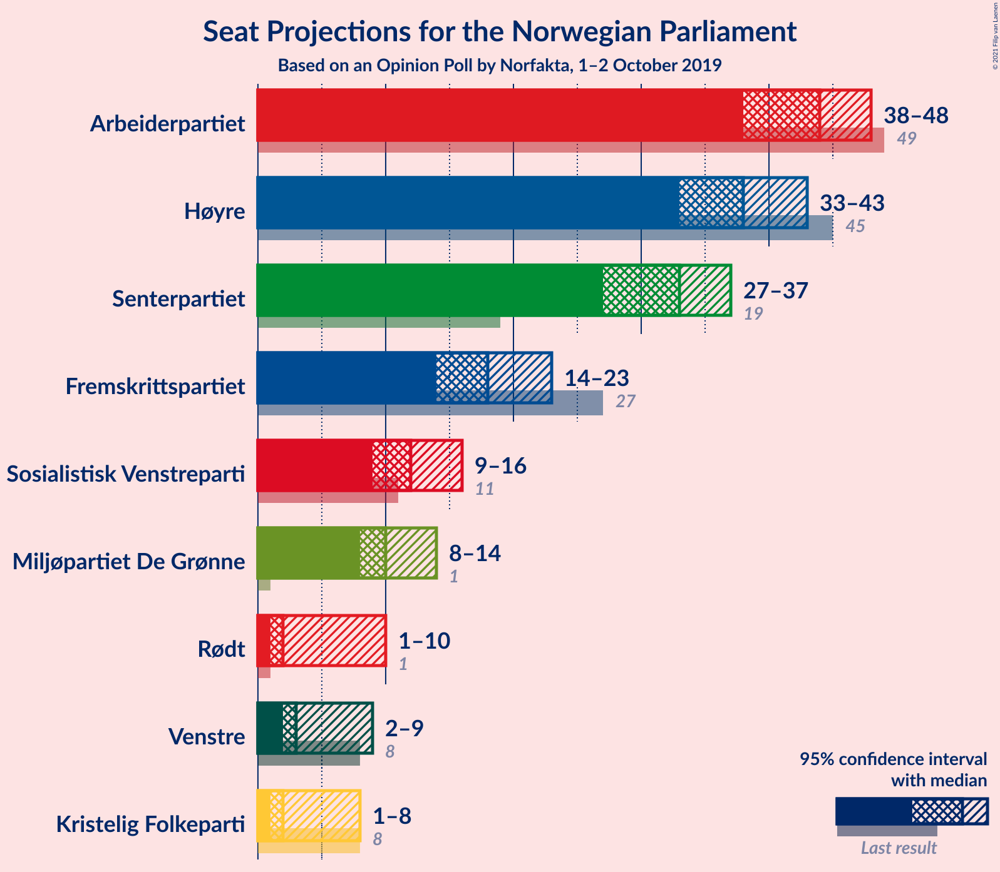
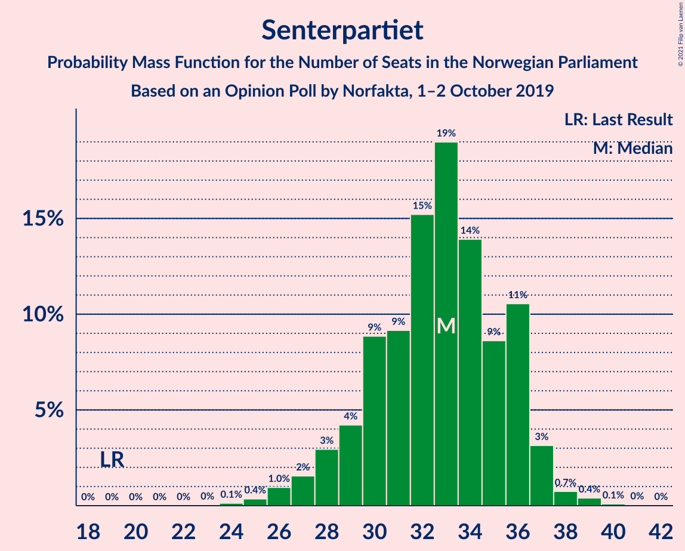
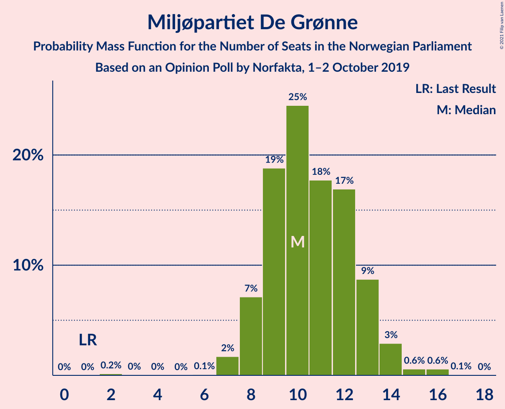
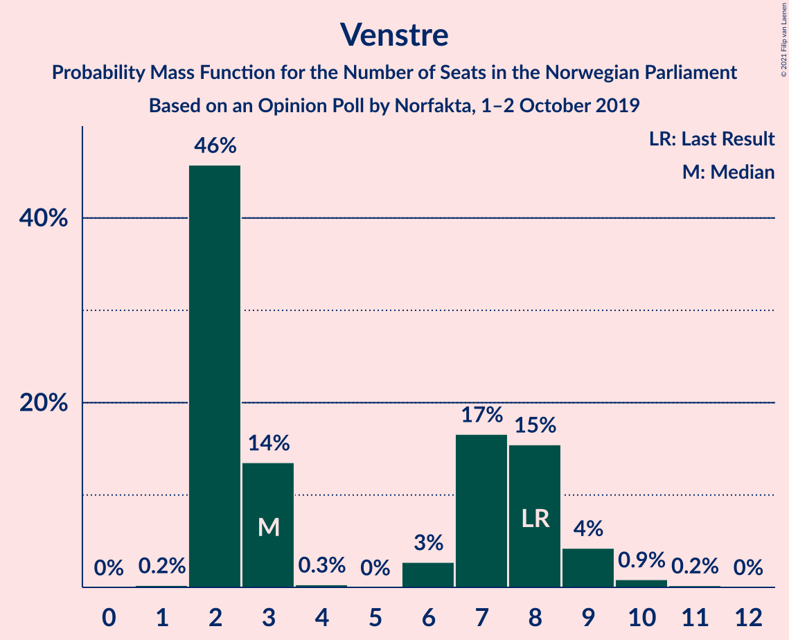
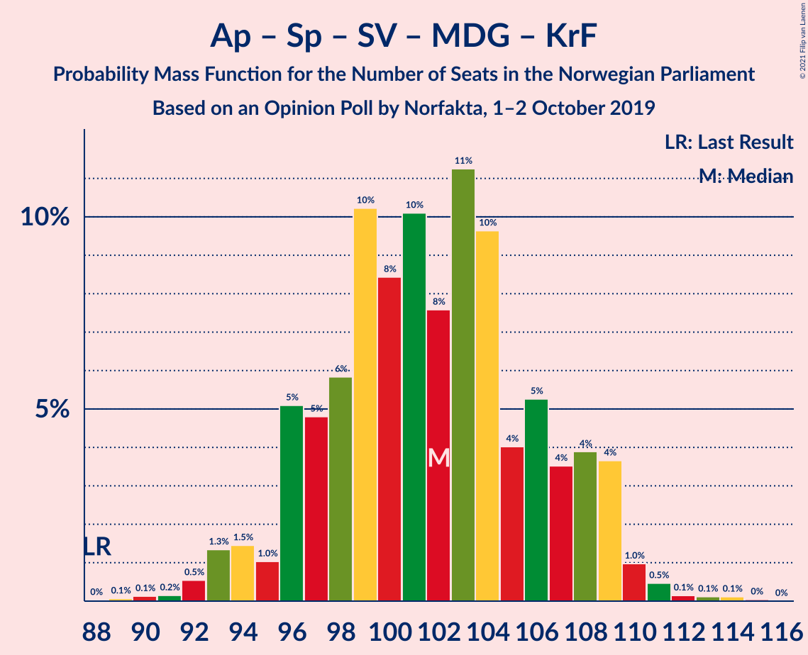
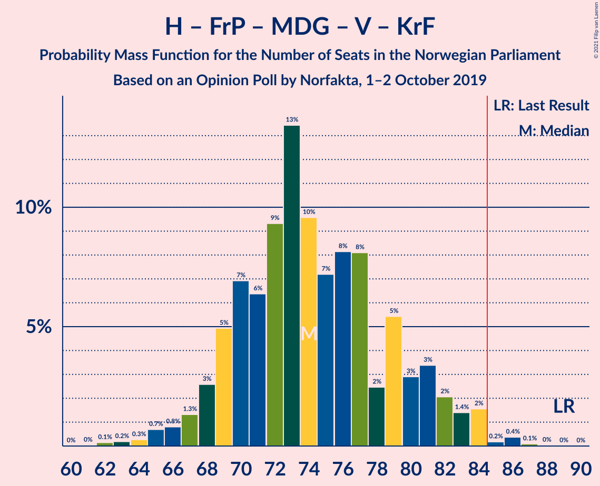
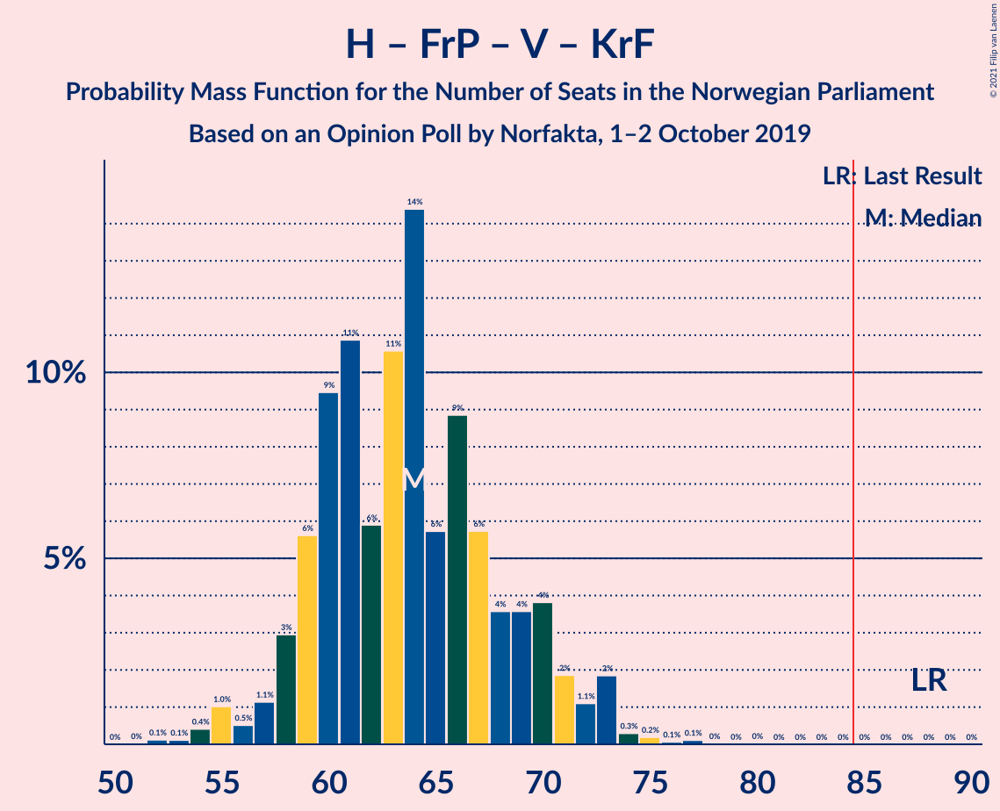

# Opinion Poll by Norfakta, 1–2 October 2019

<a href="#voting-intentions">Voting Intentions</a> | <a href="#seats">Seats</a> | <a href="#coalitions">Coalitions</a> | <a href="#technical-information">Technical Information</a>

## Voting Intentions

### Confidence Intervals

| Party | Last Result | Poll Result | 80% Confidence Interval | 90% Confidence Interval | 95% Confidence Interval | 99% Confidence Interval |
|:-----:|:-----------:|:-----------:|:-----------------------:|:-----------------------:|:-----------------------:|:-----------------------:|
| Arbeiderpartiet | 27.4% | 23.5% | 21.6–25.5% |21.1–26.0% |20.7–26.5% |19.8–27.5% |
| Høyre | 25.0% | 21.4% | 19.6–23.3% |19.1–23.8% |18.7–24.3% |17.8–25.3% |
| Senterpartiet | 10.3% | 17.2% | 15.5–19.0% |15.1–19.5% |14.7–19.9% |14.0–20.8% |
| Fremskrittspartiet | 15.2% | 10.5% | 9.2–12.0% |8.9–12.4% |8.6–12.8% |8.0–13.5% |
| Sosialistisk Venstreparti | 6.0% | 7.0% | 6.0–8.3% |5.7–8.7% |5.5–9.0% |5.0–9.7% |
| Miljøpartiet De Grønne | 3.2% | 6.0% | 5.1–7.3% |4.8–7.6% |4.6–7.9% |4.2–8.5% |
| Rødt | 2.4% | 4.0% | 3.2–5.0% |3.0–5.3% |2.8–5.5% |2.5–6.1% |
| Venstre | 4.4% | 3.8% | 3.1–4.8% |2.9–5.1% |2.7–5.4% |2.4–5.9% |
| Kristelig Folkeparti | 4.2% | 3.3% | 2.7–4.3% |2.5–4.6% |2.3–4.8% |2.0–5.3% |

*Note:* The poll result column reflects the actual value used in the calculations. Published results may vary slightly, and in addition be rounded to fewer digits.

## Seats

### Confidence Intervals

| Party | Last Result | Median | 80% Confidence Interval | 90% Confidence Interval | 95% Confidence Interval | 99% Confidence Interval |
|:-----:|:-----------:|:------:|:-----------------------:|:-----------------------:|:-----------------------:|:-----------------------:|
| <a href="#arbeiderpartiet">Arbeiderpartiet</a> | 49 | 45 | 39–46 |38–46 |38–46 |37–50 |
| <a href="#høyre">Høyre</a> | 45 | 37 | 35–42 |33–45 |33–45 |32–45 |
| <a href="#senterpartiet">Senterpartiet</a> | 19 | 35 | 30–38 |28–39 |26–40 |26–40 |
| <a href="#fremskrittspartiet">Fremskrittspartiet</a> | 27 | 17 | 15–21 |14–22 |14–24 |12–25 |
| <a href="#sosialistisk-venstreparti">Sosialistisk Venstreparti</a> | 11 | 12 | 10–13 |10–15 |9–15 |8–18 |
| <a href="#miljøpartiet-de-grønne">Miljøpartiet De Grønne</a> | 1 | 10 | 8–13 |7–13 |7–15 |7–15 |
| <a href="#rødt">Rødt</a> | 1 | 7 | 2–8 |2–9 |2–9 |1–10 |
| <a href="#venstre">Venstre</a> | 8 | 2 | 2–9 |2–9 |2–9 |1–10 |
| <a href="#kristelig-folkeparti">Kristelig Folkeparti</a> | 8 | 3 | 1–7 |1–7 |1–7 |0–8 |

### Arbeiderpartiet

*For a full overview of the results for this party, see the [Arbeiderpartiet](party-arbeiderpartiet.html) page.*

| Number of Seats | Probability | Accumulated | Special Marks |
|:---------------:|:-----------:|:-----------:|:-------------:|
| 34 | 0% | 100% |  |
| 35 | 0% | 99.9% |  |
| 36 | 0.1% | 99.9% |  |
| 37 | 0.9% | 99.8% |  |
| 38 | 5% | 98.9% |  |
| 39 | 6% | 94% |  |
| 40 | 18% | 87% |  |
| 41 | 4% | 69% |  |
| 42 | 2% | 65% |  |
| 43 | 0.6% | 63% |  |
| 44 | 6% | 63% |  |
| 45 | 34% | 57% | Median |
| 46 | 20% | 22% |  |
| 47 | 0.8% | 2% |  |
| 48 | 0.3% | 1.1% |  |
| 49 | 0.2% | 0.8% | Last Result |
| 50 | 0.3% | 0.6% |  |
| 51 | 0.2% | 0.3% |  |
| 52 | 0% | 0.1% |  |
| 53 | 0% | 0.1% |  |
| 54 | 0% | 0% |  |

### Høyre

*For a full overview of the results for this party, see the [Høyre](party-høyre.html) page.*

| Number of Seats | Probability | Accumulated | Special Marks |
|:---------------:|:-----------:|:-----------:|:-------------:|
| 29 | 0.1% | 100% |  |
| 30 | 0.2% | 99.9% |  |
| 31 | 0.2% | 99.8% |  |
| 32 | 2% | 99.6% |  |
| 33 | 4% | 98% |  |
| 34 | 2% | 94% |  |
| 35 | 23% | 92% |  |
| 36 | 7% | 70% |  |
| 37 | 34% | 63% | Median |
| 38 | 3% | 28% |  |
| 39 | 6% | 25% |  |
| 40 | 5% | 19% |  |
| 41 | 2% | 14% |  |
| 42 | 3% | 12% |  |
| 43 | 3% | 10% |  |
| 44 | 0.5% | 7% |  |
| 45 | 6% | 6% | Last Result |
| 46 | 0.1% | 0.1% |  |
| 47 | 0% | 0% |  |

### Senterpartiet

*For a full overview of the results for this party, see the [Senterpartiet](party-senterpartiet.html) page.*

| Number of Seats | Probability | Accumulated | Special Marks |
|:---------------:|:-----------:|:-----------:|:-------------:|
| 19 | 0% | 100% | Last Result |
| 20 | 0% | 100% |  |
| 21 | 0% | 100% |  |
| 22 | 0% | 100% |  |
| 23 | 0% | 100% |  |
| 24 | 0% | 100% |  |
| 25 | 0.3% | 99.9% |  |
| 26 | 2% | 99.7% |  |
| 27 | 0.1% | 97% |  |
| 28 | 6% | 97% |  |
| 29 | 0.7% | 92% |  |
| 30 | 7% | 91% |  |
| 31 | 3% | 84% |  |
| 32 | 5% | 81% |  |
| 33 | 3% | 76% |  |
| 34 | 11% | 73% |  |
| 35 | 20% | 62% | Median |
| 36 | 0.9% | 42% |  |
| 37 | 1.3% | 42% |  |
| 38 | 35% | 40% |  |
| 39 | 0.6% | 6% |  |
| 40 | 5% | 5% |  |
| 41 | 0% | 0.1% |  |
| 42 | 0% | 0.1% |  |
| 43 | 0.1% | 0.1% |  |
| 44 | 0% | 0% |  |

### Fremskrittspartiet

*For a full overview of the results for this party, see the [Fremskrittspartiet](party-fremskrittspartiet.html) page.*

| Number of Seats | Probability | Accumulated | Special Marks |
|:---------------:|:-----------:|:-----------:|:-------------:|
| 10 | 0.1% | 100% |  |
| 11 | 0% | 99.9% |  |
| 12 | 1.1% | 99.9% |  |
| 13 | 0.2% | 98.9% |  |
| 14 | 7% | 98.7% |  |
| 15 | 39% | 92% |  |
| 16 | 1.4% | 53% |  |
| 17 | 3% | 51% | Median |
| 18 | 19% | 48% |  |
| 19 | 16% | 29% |  |
| 20 | 2% | 13% |  |
| 21 | 2% | 11% |  |
| 22 | 5% | 9% |  |
| 23 | 0.4% | 3% |  |
| 24 | 2% | 3% |  |
| 25 | 1.2% | 1.3% |  |
| 26 | 0.1% | 0.1% |  |
| 27 | 0% | 0% | Last Result |

### Sosialistisk Venstreparti

*For a full overview of the results for this party, see the [Sosialistisk Venstreparti](party-sosialistiskvenstreparti.html) page.*

| Number of Seats | Probability | Accumulated | Special Marks |
|:---------------:|:-----------:|:-----------:|:-------------:|
| 8 | 0.5% | 100% |  |
| 9 | 3% | 99.5% |  |
| 10 | 13% | 97% |  |
| 11 | 18% | 84% | Last Result |
| 12 | 38% | 66% | Median |
| 13 | 19% | 28% |  |
| 14 | 2% | 9% |  |
| 15 | 5% | 7% |  |
| 16 | 0.8% | 2% |  |
| 17 | 0.4% | 2% |  |
| 18 | 0.9% | 1.2% |  |
| 19 | 0.3% | 0.4% |  |
| 20 | 0% | 0% |  |

### Miljøpartiet De Grønne

*For a full overview of the results for this party, see the [Miljøpartiet De Grønne](party-miljøpartietdegrønne.html) page.*

| Number of Seats | Probability | Accumulated | Special Marks |
|:---------------:|:-----------:|:-----------:|:-------------:|
| 1 | 0% | 100% | Last Result |
| 2 | 0.1% | 100% |  |
| 3 | 0.1% | 99.9% |  |
| 4 | 0% | 99.8% |  |
| 5 | 0% | 99.8% |  |
| 6 | 0% | 99.8% |  |
| 7 | 9% | 99.8% |  |
| 8 | 3% | 90% |  |
| 9 | 3% | 88% |  |
| 10 | 57% | 85% | Median |
| 11 | 8% | 28% |  |
| 12 | 7% | 19% |  |
| 13 | 9% | 12% |  |
| 14 | 0.9% | 3% |  |
| 15 | 2% | 3% |  |
| 16 | 0.1% | 0.2% |  |
| 17 | 0% | 0.1% |  |
| 18 | 0.1% | 0.1% |  |
| 19 | 0% | 0% |  |

### Rødt

*For a full overview of the results for this party, see the [Rødt](party-rødt.html) page.*

| Number of Seats | Probability | Accumulated | Special Marks |
|:---------------:|:-----------:|:-----------:|:-------------:|
| 1 | 2% | 100% | Last Result |
| 2 | 23% | 98% |  |
| 3 | 0% | 75% |  |
| 4 | 0% | 75% |  |
| 5 | 0% | 75% |  |
| 6 | 5% | 75% |  |
| 7 | 44% | 70% | Median |
| 8 | 17% | 26% |  |
| 9 | 9% | 9% |  |
| 10 | 0.3% | 0.7% |  |
| 11 | 0.4% | 0.4% |  |
| 12 | 0% | 0% |  |

### Venstre

*For a full overview of the results for this party, see the [Venstre](party-venstre.html) page.*

| Number of Seats | Probability | Accumulated | Special Marks |
|:---------------:|:-----------:|:-----------:|:-------------:|
| 1 | 0.6% | 100% |  |
| 2 | 68% | 99.3% | Median |
| 3 | 5% | 31% |  |
| 4 | 0% | 26% |  |
| 5 | 0.1% | 26% |  |
| 6 | 0.5% | 26% |  |
| 7 | 4% | 26% |  |
| 8 | 7% | 22% | Last Result |
| 9 | 14% | 15% |  |
| 10 | 1.0% | 1.1% |  |
| 11 | 0% | 0% |  |

### Kristelig Folkeparti

*For a full overview of the results for this party, see the [Kristelig Folkeparti](party-kristeligfolkeparti.html) page.*

| Number of Seats | Probability | Accumulated | Special Marks |
|:---------------:|:-----------:|:-----------:|:-------------:|
| 0 | 2% | 100% |  |
| 1 | 15% | 98% |  |
| 2 | 9% | 84% |  |
| 3 | 55% | 75% | Median |
| 4 | 0% | 20% |  |
| 5 | 0% | 20% |  |
| 6 | 4% | 20% |  |
| 7 | 15% | 16% |  |
| 8 | 1.3% | 2% | Last Result |
| 9 | 0.2% | 0.4% |  |
| 10 | 0.1% | 0.1% |  |
| 11 | 0% | 0% |  |

## Coalitions

### Confidence Intervals

| Coalition | Last Result | Median | Majority? | 80% Confidence Interval | 90% Confidence Interval | 95% Confidence Interval | 99% Confidence Interval |
|:---------:|:-----------:|:------:|:---------:|:-----------------------:|:-----------------------:|:-----------------------:|:-----------------------:|
| Arbeiderpartiet – Senterpartiet – Sosialistisk Venstreparti – Miljøpartiet De Grønne – Rødt | 81 | 106 | 100% | 98–112 | 96–112 | 96–112 | 93–113 |
| Arbeiderpartiet – Senterpartiet – Sosialistisk Venstreparti – Miljøpartiet De Grønne – Kristelig Folkeparti | 88 | 105 | 100% | 97–108 | 95–108 | 95–108 | 91–109 |
| Arbeiderpartiet – Senterpartiet – Sosialistisk Venstreparti – Miljøpartiet De Grønne | 80 | 101 | 100% | 93–105 | 93–105 | 91–105 | 89–108 |
| Høyre – Senterpartiet – Fremskrittspartiet – Venstre – Kristelig Folkeparti | 107 | 95 | 99.8% | 94–101 | 89–101 | 89–104 | 88–107 |
| Arbeiderpartiet – Senterpartiet – Sosialistisk Venstreparti – Rødt | 80 | 98 | 94% | 86–102 | 83–102 | 83–102 | 83–103 |
| Arbeiderpartiet – Senterpartiet – Miljøpartiet De Grønne – Kristelig Folkeparti | 77 | 94 | 83% | 83–96 | 82–96 | 82–96 | 81–97 |
| Arbeiderpartiet – Senterpartiet – Sosialistisk Venstreparti | 79 | 91 | 81% | 83–95 | 81–95 | 81–95 | 79–96 |
| Arbeiderpartiet – Senterpartiet – Kristelig Folkeparti | 76 | 84 | 44% | 72–86 | 71–88 | 71–88 | 70–88 |
| Høyre – Fremskrittspartiet – Miljøpartiet De Grønne – Venstre – Kristelig Folkeparti | 89 | 70 | 5% | 65–83 | 65–86 | 65–86 | 63–86 |
| Arbeiderpartiet – Senterpartiet | 68 | 81 | 0.1% | 70–83 | 68–83 | 68–83 | 66–83 |
| Høyre – Fremskrittspartiet – Venstre – Kristelig Folkeparti | 88 | 60 | 0% | 55–70 | 54–73 | 54–73 | 54–74 |
| Høyre – Fremskrittspartiet – Venstre | 80 | 56 | 0% | 53–65 | 52–70 | 52–70 | 51–71 |
| Høyre – Fremskrittspartiet | 72 | 53 | 0% | 51–61 | 49–63 | 49–64 | 44–68 |
| Arbeiderpartiet – Sosialistisk Venstreparti | 60 | 56 | 0% | 52–57 | 50–57 | 49–59 | 48–62 |
| Høyre – Venstre – Kristelig Folkeparti | 61 | 43 | 0% | 41–51 | 39–51 | 39–52 | 37–54 |
| Senterpartiet – Venstre – Kristelig Folkeparti | 35 | 43 | 0% | 35–47 | 34–47 | 34–47 | 31–52 |

### Arbeiderpartiet – Senterpartiet – Sosialistisk Venstreparti – Miljøpartiet De Grønne – Rødt

| Number of Seats | Probability | Accumulated | Special Marks |
|:---------------:|:-----------:|:-----------:|:-------------:|
| 81 | 0% | 100% | Last Result |
| 82 | 0% | 100% |  |
| 83 | 0% | 100% |  |
| 84 | 0% | 100% |  |
| 85 | 0% | 100% | Majority |
| 86 | 0% | 100% |  |
| 87 | 0% | 100% |  |
| 88 | 0% | 100% |  |
| 89 | 0% | 100% |  |
| 90 | 0% | 100% |  |
| 91 | 0.3% | 99.9% |  |
| 92 | 0.1% | 99.7% |  |
| 93 | 0.4% | 99.6% |  |
| 94 | 0% | 99.2% |  |
| 95 | 0.5% | 99.2% |  |
| 96 | 7% | 98.7% |  |
| 97 | 0.4% | 92% |  |
| 98 | 2% | 92% |  |
| 99 | 3% | 89% |  |
| 100 | 1.3% | 86% |  |
| 101 | 0.6% | 85% |  |
| 102 | 8% | 84% |  |
| 103 | 2% | 76% |  |
| 104 | 13% | 74% |  |
| 105 | 0.6% | 61% |  |
| 106 | 15% | 60% |  |
| 107 | 2% | 46% |  |
| 108 | 0.5% | 44% |  |
| 109 | 9% | 44% | Median |
| 110 | 0.5% | 35% |  |
| 111 | 0.3% | 35% |  |
| 112 | 33% | 34% |  |
| 113 | 1.0% | 1.1% |  |
| 114 | 0% | 0.1% |  |
| 115 | 0% | 0.1% |  |
| 116 | 0.1% | 0.1% |  |
| 117 | 0% | 0% |  |

### Arbeiderpartiet – Senterpartiet – Sosialistisk Venstreparti – Miljøpartiet De Grønne – Kristelig Folkeparti

| Number of Seats | Probability | Accumulated | Special Marks |
|:---------------:|:-----------:|:-----------:|:-------------:|
| 88 | 0% | 100% | Last Result |
| 89 | 0% | 100% |  |
| 90 | 0.5% | 100% |  |
| 91 | 0.1% | 99.5% |  |
| 92 | 0.1% | 99.4% |  |
| 93 | 0.2% | 99.3% |  |
| 94 | 0.2% | 99.2% |  |
| 95 | 6% | 98.9% |  |
| 96 | 2% | 92% |  |
| 97 | 9% | 91% |  |
| 98 | 0.4% | 82% |  |
| 99 | 0.6% | 82% |  |
| 100 | 3% | 81% |  |
| 101 | 3% | 78% |  |
| 102 | 8% | 76% |  |
| 103 | 9% | 68% |  |
| 104 | 2% | 58% |  |
| 105 | 21% | 56% | Median |
| 106 | 0.1% | 35% |  |
| 107 | 0.5% | 35% |  |
| 108 | 33% | 35% |  |
| 109 | 1.2% | 1.4% |  |
| 110 | 0.1% | 0.2% |  |
| 111 | 0.1% | 0.2% |  |
| 112 | 0% | 0.1% |  |
| 113 | 0% | 0% |  |

### Arbeiderpartiet – Senterpartiet – Sosialistisk Venstreparti – Miljøpartiet De Grønne

| Number of Seats | Probability | Accumulated | Special Marks |
|:---------------:|:-----------:|:-----------:|:-------------:|
| 80 | 0% | 100% | Last Result |
| 81 | 0% | 100% |  |
| 82 | 0% | 100% |  |
| 83 | 0% | 100% |  |
| 84 | 0% | 100% |  |
| 85 | 0% | 100% | Majority |
| 86 | 0% | 100% |  |
| 87 | 0% | 100% |  |
| 88 | 0.4% | 99.9% |  |
| 89 | 2% | 99.5% |  |
| 90 | 0.1% | 98% |  |
| 91 | 0.2% | 98% |  |
| 92 | 2% | 97% |  |
| 93 | 7% | 95% |  |
| 94 | 5% | 89% |  |
| 95 | 0.5% | 83% |  |
| 96 | 3% | 83% |  |
| 97 | 6% | 79% |  |
| 98 | 11% | 74% |  |
| 99 | 2% | 63% |  |
| 100 | 7% | 61% |  |
| 101 | 5% | 53% |  |
| 102 | 12% | 48% | Median |
| 103 | 0.3% | 36% |  |
| 104 | 1.1% | 36% |  |
| 105 | 33% | 35% |  |
| 106 | 0.4% | 1.4% |  |
| 107 | 0.1% | 1.1% |  |
| 108 | 0.9% | 1.0% |  |
| 109 | 0% | 0.1% |  |
| 110 | 0.1% | 0.1% |  |
| 111 | 0% | 0% |  |

### Høyre – Senterpartiet – Fremskrittspartiet – Venstre – Kristelig Folkeparti

| Number of Seats | Probability | Accumulated | Special Marks |
|:---------------:|:-----------:|:-----------:|:-------------:|
| 83 | 0.1% | 100% |  |
| 84 | 0.1% | 99.9% |  |
| 85 | 0% | 99.8% | Majority |
| 86 | 0% | 99.8% |  |
| 87 | 0.1% | 99.8% |  |
| 88 | 0.3% | 99.6% |  |
| 89 | 5% | 99.3% |  |
| 90 | 0.9% | 94% |  |
| 91 | 1.2% | 94% |  |
| 92 | 0.6% | 92% |  |
| 93 | 0.7% | 92% |  |
| 94 | 9% | 91% | Median |
| 95 | 34% | 82% |  |
| 96 | 2% | 48% |  |
| 97 | 10% | 45% |  |
| 98 | 10% | 35% |  |
| 99 | 4% | 25% |  |
| 100 | 10% | 22% |  |
| 101 | 8% | 12% |  |
| 102 | 0.2% | 4% |  |
| 103 | 1.3% | 4% |  |
| 104 | 1.5% | 3% |  |
| 105 | 0.2% | 1.3% |  |
| 106 | 0.1% | 1.1% |  |
| 107 | 0.9% | 1.0% | Last Result |
| 108 | 0% | 0.1% |  |
| 109 | 0% | 0% |  |

### Arbeiderpartiet – Senterpartiet – Sosialistisk Venstreparti – Rødt

| Number of Seats | Probability | Accumulated | Special Marks |
|:---------------:|:-----------:|:-----------:|:-------------:|
| 80 | 0.1% | 100% | Last Result |
| 81 | 0% | 99.9% |  |
| 82 | 0.4% | 99.9% |  |
| 83 | 5% | 99.5% |  |
| 84 | 0.3% | 94% |  |
| 85 | 0.3% | 94% | Majority |
| 86 | 5% | 94% |  |
| 87 | 0.3% | 89% |  |
| 88 | 0.7% | 89% |  |
| 89 | 4% | 88% |  |
| 90 | 0.1% | 84% |  |
| 91 | 1.0% | 84% |  |
| 92 | 12% | 83% |  |
| 93 | 0.7% | 72% |  |
| 94 | 12% | 71% |  |
| 95 | 1.5% | 59% |  |
| 96 | 7% | 58% |  |
| 97 | 1.0% | 51% |  |
| 98 | 5% | 50% |  |
| 99 | 10% | 45% | Median |
| 100 | 2% | 35% |  |
| 101 | 0% | 34% |  |
| 102 | 33% | 34% |  |
| 103 | 0.2% | 0.6% |  |
| 104 | 0.2% | 0.4% |  |
| 105 | 0.1% | 0.2% |  |
| 106 | 0.1% | 0.1% |  |
| 107 | 0% | 0% |  |

### Arbeiderpartiet – Senterpartiet – Miljøpartiet De Grønne – Kristelig Folkeparti

| Number of Seats | Probability | Accumulated | Special Marks |
|:---------------:|:-----------:|:-----------:|:-------------:|
| 75 | 0% | 100% |  |
| 76 | 0% | 99.9% |  |
| 77 | 0% | 99.9% | Last Result |
| 78 | 0.1% | 99.9% |  |
| 79 | 0% | 99.8% |  |
| 80 | 0.1% | 99.8% |  |
| 81 | 1.3% | 99.7% |  |
| 82 | 6% | 98% |  |
| 83 | 3% | 92% |  |
| 84 | 7% | 90% |  |
| 85 | 2% | 83% | Majority |
| 86 | 2% | 81% |  |
| 87 | 0.6% | 79% |  |
| 88 | 2% | 79% |  |
| 89 | 2% | 77% |  |
| 90 | 5% | 75% |  |
| 91 | 12% | 69% |  |
| 92 | 1.4% | 57% |  |
| 93 | 0.9% | 56% | Median |
| 94 | 10% | 55% |  |
| 95 | 10% | 45% |  |
| 96 | 35% | 35% |  |
| 97 | 0.1% | 0.5% |  |
| 98 | 0.3% | 0.4% |  |
| 99 | 0.1% | 0.2% |  |
| 100 | 0% | 0.1% |  |
| 101 | 0% | 0.1% |  |
| 102 | 0% | 0% |  |

### Arbeiderpartiet – Senterpartiet – Sosialistisk Venstreparti

| Number of Seats | Probability | Accumulated | Special Marks |
|:---------------:|:-----------:|:-----------:|:-------------:|
| 78 | 0.1% | 100% |  |
| 79 | 2% | 99.9% | Last Result |
| 80 | 0.2% | 98% |  |
| 81 | 6% | 98% |  |
| 82 | 1.3% | 92% |  |
| 83 | 6% | 91% |  |
| 84 | 3% | 85% |  |
| 85 | 7% | 81% | Majority |
| 86 | 1.0% | 74% |  |
| 87 | 4% | 73% |  |
| 88 | 1.1% | 69% |  |
| 89 | 0.6% | 68% |  |
| 90 | 11% | 67% |  |
| 91 | 9% | 56% |  |
| 92 | 10% | 47% | Median |
| 93 | 2% | 37% |  |
| 94 | 0.6% | 35% |  |
| 95 | 34% | 35% |  |
| 96 | 0.3% | 0.6% |  |
| 97 | 0.1% | 0.3% |  |
| 98 | 0.1% | 0.2% |  |
| 99 | 0.1% | 0.1% |  |
| 100 | 0% | 0% |  |

### Arbeiderpartiet – Senterpartiet – Kristelig Folkeparti

| Number of Seats | Probability | Accumulated | Special Marks |
|:---------------:|:-----------:|:-----------:|:-------------:|
| 67 | 0.1% | 100% |  |
| 68 | 0% | 99.8% |  |
| 69 | 0% | 99.8% |  |
| 70 | 0.4% | 99.8% |  |
| 71 | 5% | 99.4% |  |
| 72 | 8% | 94% |  |
| 73 | 6% | 87% |  |
| 74 | 0.6% | 81% |  |
| 75 | 2% | 80% |  |
| 76 | 3% | 78% | Last Result |
| 77 | 0.7% | 75% |  |
| 78 | 4% | 74% |  |
| 79 | 0.2% | 70% |  |
| 80 | 8% | 70% |  |
| 81 | 6% | 63% |  |
| 82 | 0.6% | 57% |  |
| 83 | 2% | 56% | Median |
| 84 | 10% | 55% |  |
| 85 | 2% | 44% | Majority |
| 86 | 34% | 43% |  |
| 87 | 0.2% | 9% |  |
| 88 | 9% | 9% |  |
| 89 | 0% | 0.1% |  |
| 90 | 0.1% | 0.1% |  |
| 91 | 0% | 0% |  |

### Høyre – Fremskrittspartiet – Miljøpartiet De Grønne – Venstre – Kristelig Folkeparti

| Number of Seats | Probability | Accumulated | Special Marks |
|:---------------:|:-----------:|:-----------:|:-------------:|
| 61 | 0.3% | 100% |  |
| 62 | 0% | 99.7% |  |
| 63 | 1.2% | 99.7% |  |
| 64 | 0.1% | 98% |  |
| 65 | 10% | 98% |  |
| 66 | 0.2% | 89% |  |
| 67 | 34% | 88% |  |
| 68 | 0.2% | 54% |  |
| 69 | 0.7% | 54% | Median |
| 70 | 10% | 53% |  |
| 71 | 0.7% | 43% |  |
| 72 | 2% | 43% |  |
| 73 | 2% | 41% |  |
| 74 | 2% | 39% |  |
| 75 | 10% | 37% |  |
| 76 | 0.5% | 27% |  |
| 77 | 12% | 27% |  |
| 78 | 0.6% | 15% |  |
| 79 | 0.1% | 15% |  |
| 80 | 4% | 15% |  |
| 81 | 0.2% | 11% |  |
| 82 | 0.3% | 11% |  |
| 83 | 5% | 10% |  |
| 84 | 0.2% | 5% |  |
| 85 | 0% | 5% | Majority |
| 86 | 5% | 5% |  |
| 87 | 0% | 0% |  |
| 88 | 0% | 0% |  |
| 89 | 0% | 0% | Last Result |

### Arbeiderpartiet – Senterpartiet

| Number of Seats | Probability | Accumulated | Special Marks |
|:---------------:|:-----------:|:-----------:|:-------------:|
| 66 | 2% | 100% |  |
| 67 | 0.6% | 98% |  |
| 68 | 5% | 98% | Last Result |
| 69 | 2% | 93% |  |
| 70 | 7% | 91% |  |
| 71 | 2% | 83% |  |
| 72 | 6% | 81% |  |
| 73 | 2% | 75% |  |
| 74 | 2% | 73% |  |
| 75 | 2% | 71% |  |
| 76 | 0.7% | 69% |  |
| 77 | 0.3% | 68% |  |
| 78 | 6% | 68% |  |
| 79 | 6% | 62% |  |
| 80 | 0.9% | 55% | Median |
| 81 | 19% | 55% |  |
| 82 | 0.8% | 36% |  |
| 83 | 35% | 35% |  |
| 84 | 0% | 0.1% |  |
| 85 | 0% | 0.1% | Majority |
| 86 | 0% | 0% |  |

### Høyre – Fremskrittspartiet – Venstre – Kristelig Folkeparti

| Number of Seats | Probability | Accumulated | Special Marks |
|:---------------:|:-----------:|:-----------:|:-------------:|
| 52 | 0.1% | 100% |  |
| 53 | 0.4% | 99.9% |  |
| 54 | 6% | 99.5% |  |
| 55 | 5% | 94% |  |
| 56 | 1.1% | 89% |  |
| 57 | 33% | 88% |  |
| 58 | 0.4% | 55% |  |
| 59 | 2% | 54% | Median |
| 60 | 3% | 53% |  |
| 61 | 0.7% | 50% |  |
| 62 | 2% | 49% |  |
| 63 | 10% | 47% |  |
| 64 | 1.2% | 37% |  |
| 65 | 14% | 36% |  |
| 66 | 2% | 23% |  |
| 67 | 7% | 21% |  |
| 68 | 0.6% | 14% |  |
| 69 | 2% | 13% |  |
| 70 | 3% | 12% |  |
| 71 | 1.4% | 9% |  |
| 72 | 0.1% | 7% |  |
| 73 | 7% | 7% |  |
| 74 | 0.5% | 0.6% |  |
| 75 | 0% | 0.1% |  |
| 76 | 0% | 0.1% |  |
| 77 | 0% | 0.1% |  |
| 78 | 0% | 0% |  |
| 79 | 0% | 0% |  |
| 80 | 0% | 0% |  |
| 81 | 0% | 0% |  |
| 82 | 0% | 0% |  |
| 83 | 0% | 0% |  |
| 84 | 0% | 0% |  |
| 85 | 0% | 0% | Majority |
| 86 | 0% | 0% |  |
| 87 | 0% | 0% |  |
| 88 | 0% | 0% | Last Result |

### Høyre – Fremskrittspartiet – Venstre

| Number of Seats | Probability | Accumulated | Special Marks |
|:---------------:|:-----------:|:-----------:|:-------------:|
| 50 | 0.1% | 100% |  |
| 51 | 1.0% | 99.8% |  |
| 52 | 5% | 98.8% |  |
| 53 | 5% | 94% |  |
| 54 | 33% | 89% |  |
| 55 | 1.1% | 55% |  |
| 56 | 9% | 54% | Median |
| 57 | 2% | 45% |  |
| 58 | 0.8% | 43% |  |
| 59 | 6% | 42% |  |
| 60 | 1.5% | 36% |  |
| 61 | 1.4% | 34% |  |
| 62 | 11% | 33% |  |
| 63 | 3% | 22% |  |
| 64 | 0.3% | 19% |  |
| 65 | 9% | 19% |  |
| 66 | 2% | 10% |  |
| 67 | 0.1% | 7% |  |
| 68 | 0% | 7% |  |
| 69 | 0.2% | 7% |  |
| 70 | 6% | 7% |  |
| 71 | 0.1% | 0.6% |  |
| 72 | 0.4% | 0.4% |  |
| 73 | 0% | 0% |  |
| 74 | 0% | 0% |  |
| 75 | 0% | 0% |  |
| 76 | 0% | 0% |  |
| 77 | 0% | 0% |  |
| 78 | 0% | 0% |  |
| 79 | 0% | 0% |  |
| 80 | 0% | 0% | Last Result |

### Høyre – Fremskrittspartiet

| Number of Seats | Probability | Accumulated | Special Marks |
|:---------------:|:-----------:|:-----------:|:-------------:|
| 44 | 1.0% | 100% |  |
| 45 | 0% | 99.0% |  |
| 46 | 0.1% | 99.0% |  |
| 47 | 0.1% | 98.9% |  |
| 48 | 0.6% | 98.8% |  |
| 49 | 5% | 98% |  |
| 50 | 1.3% | 93% |  |
| 51 | 9% | 92% |  |
| 52 | 33% | 84% |  |
| 53 | 10% | 50% |  |
| 54 | 9% | 41% | Median |
| 55 | 3% | 32% |  |
| 56 | 0.7% | 29% |  |
| 57 | 6% | 28% |  |
| 58 | 1.4% | 22% |  |
| 59 | 1.4% | 21% |  |
| 60 | 1.4% | 20% |  |
| 61 | 8% | 18% |  |
| 62 | 0.5% | 10% |  |
| 63 | 6% | 9% |  |
| 64 | 2% | 3% |  |
| 65 | 0% | 1.2% |  |
| 66 | 0% | 1.2% |  |
| 67 | 0% | 1.2% |  |
| 68 | 1.1% | 1.2% |  |
| 69 | 0% | 0% |  |
| 70 | 0% | 0% |  |
| 71 | 0% | 0% |  |
| 72 | 0% | 0% | Last Result |

### Arbeiderpartiet – Sosialistisk Venstreparti

| Number of Seats | Probability | Accumulated | Special Marks |
|:---------------:|:-----------:|:-----------:|:-------------:|
| 46 | 0% | 100% |  |
| 47 | 0.1% | 99.9% |  |
| 48 | 1.1% | 99.9% |  |
| 49 | 2% | 98.8% |  |
| 50 | 5% | 97% |  |
| 51 | 1.4% | 92% |  |
| 52 | 4% | 91% |  |
| 53 | 20% | 86% |  |
| 54 | 0.6% | 66% |  |
| 55 | 3% | 66% |  |
| 56 | 16% | 63% |  |
| 57 | 43% | 47% | Median |
| 58 | 0.9% | 4% |  |
| 59 | 0.6% | 3% |  |
| 60 | 0.3% | 2% | Last Result |
| 61 | 1.2% | 2% |  |
| 62 | 0.2% | 0.6% |  |
| 63 | 0.1% | 0.4% |  |
| 64 | 0.2% | 0.3% |  |
| 65 | 0.1% | 0.1% |  |
| 66 | 0% | 0.1% |  |
| 67 | 0% | 0% |  |

### Høyre – Venstre – Kristelig Folkeparti

| Number of Seats | Probability | Accumulated | Special Marks |
|:---------------:|:-----------:|:-----------:|:-------------:|
| 35 | 0.1% | 100% |  |
| 36 | 0.1% | 99.9% |  |
| 37 | 1.2% | 99.8% |  |
| 38 | 0.3% | 98.6% |  |
| 39 | 5% | 98% |  |
| 40 | 2% | 93% |  |
| 41 | 6% | 91% |  |
| 42 | 34% | 85% | Median |
| 43 | 2% | 51% |  |
| 44 | 10% | 48% |  |
| 45 | 0.8% | 38% |  |
| 46 | 4% | 38% |  |
| 47 | 13% | 34% |  |
| 48 | 0.8% | 21% |  |
| 49 | 8% | 20% |  |
| 50 | 0.8% | 12% |  |
| 51 | 8% | 11% |  |
| 52 | 2% | 3% |  |
| 53 | 0% | 2% |  |
| 54 | 1.4% | 1.5% |  |
| 55 | 0% | 0.1% |  |
| 56 | 0% | 0.1% |  |
| 57 | 0.1% | 0.1% |  |
| 58 | 0% | 0.1% |  |
| 59 | 0% | 0% |  |
| 60 | 0% | 0% |  |
| 61 | 0% | 0% | Last Result |

### Senterpartiet – Venstre – Kristelig Folkeparti

| Number of Seats | Probability | Accumulated | Special Marks |
|:---------------:|:-----------:|:-----------:|:-------------:|
| 29 | 0% | 100% |  |
| 30 | 0.1% | 99.9% |  |
| 31 | 0.6% | 99.8% |  |
| 32 | 0% | 99.3% |  |
| 33 | 0.1% | 99.2% |  |
| 34 | 7% | 99.1% |  |
| 35 | 3% | 92% | Last Result |
| 36 | 0.2% | 89% |  |
| 37 | 5% | 89% |  |
| 38 | 2% | 84% |  |
| 39 | 2% | 83% |  |
| 40 | 12% | 81% | Median |
| 41 | 0.7% | 69% |  |
| 42 | 3% | 68% |  |
| 43 | 39% | 66% |  |
| 44 | 11% | 27% |  |
| 45 | 0.7% | 16% |  |
| 46 | 4% | 15% |  |
| 47 | 9% | 11% |  |
| 48 | 0.3% | 2% |  |
| 49 | 0.1% | 1.3% |  |
| 50 | 0% | 1.2% |  |
| 51 | 0.2% | 1.2% |  |
| 52 | 1.0% | 1.0% |  |
| 53 | 0% | 0% |  |

## Technical Information

### Opinion Poll

+ **Polling firm:** Norfakta
+ **Commissioner(s):** —
+ **Fieldwork period:** 1–2 October 2019

### Calculations

+ **Sample size:** 810
+ **Simulations done:** 32,768
+ **Error estimate:** 3.73%

