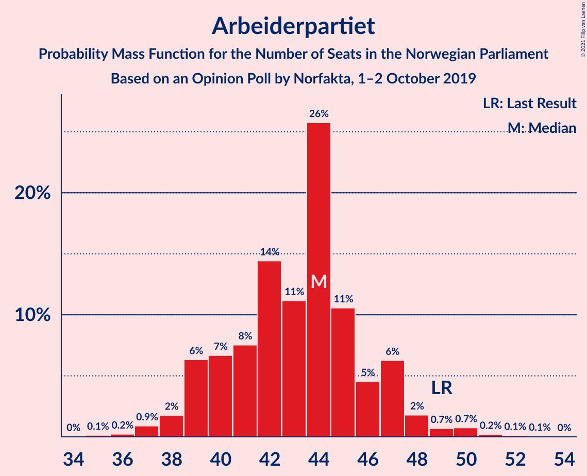
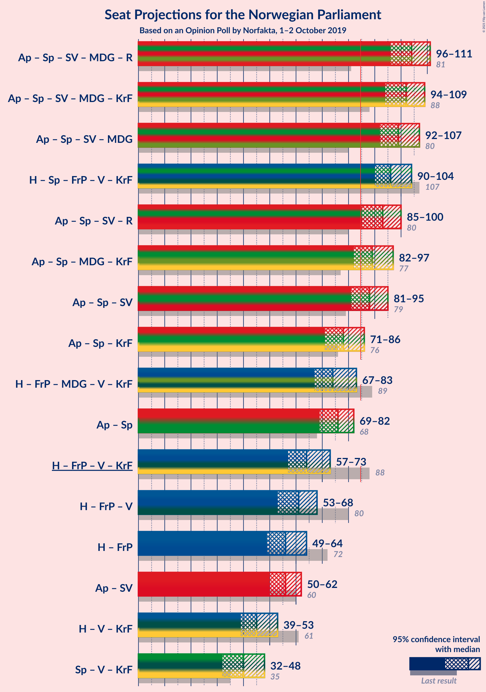
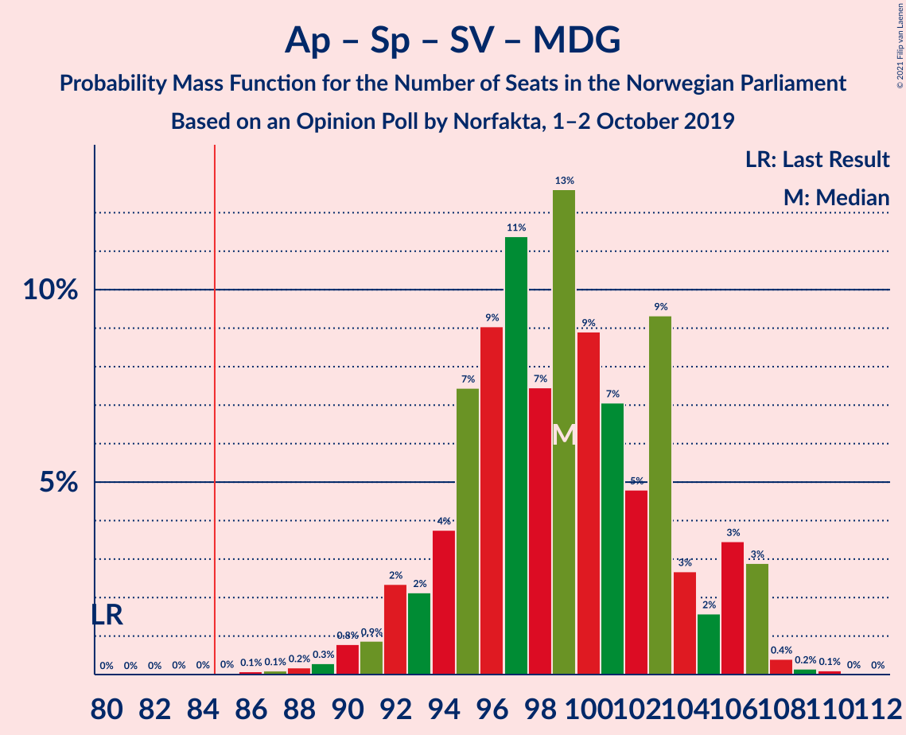
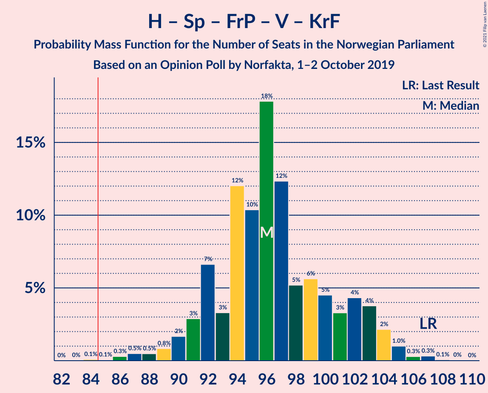

# Opinion Poll by Norfakta, 1–2 October 2019

<a href="#voting-intentions">Voting Intentions</a> | <a href="#seats">Seats</a> | <a href="#coalitions">Coalitions</a> | <a href="#technical-information">Technical Information</a>

## Voting Intentions

### Confidence Intervals

| Party | Last Result | Poll Result | 80% Confidence Interval | 90% Confidence Interval | 95% Confidence Interval | 99% Confidence Interval |
|:-----:|:-----------:|:-----------:|:-----------------------:|:-----------------------:|:-----------------------:|:-----------------------:|
| Arbeiderpartiet | 27.4% | 23.5% | 21.6–25.5% |21.1–26.0% |20.7–26.5% |19.8–27.5% |
| Høyre | 25.0% | 21.4% | 19.6–23.3% |19.1–23.8% |18.7–24.3% |17.8–25.3% |
| Senterpartiet | 10.3% | 17.2% | 15.5–19.0% |15.1–19.5% |14.7–19.9% |14.0–20.8% |
| Fremskrittspartiet | 15.2% | 10.5% | 9.2–12.0% |8.9–12.4% |8.6–12.8% |8.0–13.5% |
| Sosialistisk Venstreparti | 6.0% | 7.0% | 6.0–8.3% |5.7–8.7% |5.5–9.0% |5.0–9.7% |
| Miljøpartiet De Grønne | 3.2% | 6.0% | 5.1–7.3% |4.8–7.6% |4.6–7.9% |4.2–8.5% |
| Rødt | 2.4% | 4.0% | 3.2–5.0% |3.0–5.3% |2.8–5.5% |2.5–6.1% |
| Venstre | 4.4% | 3.8% | 3.1–4.8% |2.9–5.1% |2.7–5.4% |2.4–5.9% |
| Kristelig Folkeparti | 4.2% | 3.3% | 2.7–4.3% |2.5–4.6% |2.3–4.8% |2.0–5.3% |

*Note:* The poll result column reflects the actual value used in the calculations. Published results may vary slightly, and in addition be rounded to fewer digits.

## Seats

### Confidence Intervals

| Party | Last Result | Median | 80% Confidence Interval | 90% Confidence Interval | 95% Confidence Interval | 99% Confidence Interval |
|:-----:|:-----------:|:------:|:-----------------------:|:-----------------------:|:-----------------------:|:-----------------------:|
| <a href="#arbeiderpartiet">Arbeiderpartiet</a> | 49 | 44 | 40–47 |39–47 |38–47 |37–48 |
| <a href="#høyre">Høyre</a> | 45 | 39 | 34–41 |34–43 |34–43 |31–45 |
| <a href="#senterpartiet">Senterpartiet</a> | 19 | 33 | 30–36 |28–37 |28–37 |26–38 |
| <a href="#fremskrittspartiet">Fremskrittspartiet</a> | 27 | 19 | 15–22 |15–22 |14–22 |14–24 |
| <a href="#sosialistisk-venstreparti">Sosialistisk Venstreparti</a> | 11 | 13 | 11–15 |10–15 |9–15 |9–17 |
| <a href="#miljøpartiet-de-grønne">Miljøpartiet De Grønne</a> | 1 | 10 | 9–12 |8–12 |7–13 |7–15 |
| <a href="#rødt">Rødt</a> | 1 | 7 | 2–9 |2–9 |2–9 |1–9 |
| <a href="#venstre">Venstre</a> | 8 | 3 | 2–8 |2–8 |2–9 |2–10 |
| <a href="#kristelig-folkeparti">Kristelig Folkeparti</a> | 8 | 3 | 1–7 |1–7 |1–7 |0–8 |

### Arbeiderpartiet

*For a full overview of the results for this party, see the [Arbeiderpartiet](party-arbeiderpartiet.html) page.*

| Number of Seats | Probability | Accumulated | Special Marks |
|:---------------:|:-----------:|:-----------:|:-------------:|
| 35 | 0.2% | 100% |  |
| 36 | 0% | 99.8% |  |
| 37 | 1.3% | 99.8% |  |
| 38 | 2% | 98% |  |
| 39 | 2% | 96% |  |
| 40 | 7% | 94% |  |
| 41 | 2% | 87% |  |
| 42 | 15% | 85% |  |
| 43 | 4% | 70% |  |
| 44 | 38% | 66% | Median |
| 45 | 12% | 29% |  |
| 46 | 4% | 16% |  |
| 47 | 11% | 12% |  |
| 48 | 0.6% | 1.0% |  |
| 49 | 0.2% | 0.4% | Last Result |
| 50 | 0.1% | 0.3% |  |
| 51 | 0% | 0.2% |  |
| 52 | 0.1% | 0.1% |  |
| 53 | 0% | 0.1% |  |
| 54 | 0% | 0% |  |

### Høyre

*For a full overview of the results for this party, see the [Høyre](party-høyre.html) page.*

| Number of Seats | Probability | Accumulated | Special Marks |
|:---------------:|:-----------:|:-----------:|:-------------:|
| 30 | 0% | 100% |  |
| 31 | 1.1% | 99.9% |  |
| 32 | 0.5% | 98.9% |  |
| 33 | 0.6% | 98% |  |
| 34 | 10% | 98% |  |
| 35 | 25% | 88% |  |
| 36 | 2% | 63% |  |
| 37 | 2% | 61% |  |
| 38 | 8% | 59% |  |
| 39 | 15% | 51% | Median |
| 40 | 14% | 36% |  |
| 41 | 14% | 22% |  |
| 42 | 3% | 9% |  |
| 43 | 4% | 6% |  |
| 44 | 0.5% | 2% |  |
| 45 | 1.1% | 1.4% | Last Result |
| 46 | 0.1% | 0.3% |  |
| 47 | 0.1% | 0.2% |  |
| 48 | 0% | 0% |  |

### Senterpartiet

*For a full overview of the results for this party, see the [Senterpartiet](party-senterpartiet.html) page.*

| Number of Seats | Probability | Accumulated | Special Marks |
|:---------------:|:-----------:|:-----------:|:-------------:|
| 19 | 0% | 100% | Last Result |
| 20 | 0% | 100% |  |
| 21 | 0% | 100% |  |
| 22 | 0% | 100% |  |
| 23 | 0% | 100% |  |
| 24 | 0% | 100% |  |
| 25 | 0.1% | 99.9% |  |
| 26 | 0.7% | 99.8% |  |
| 27 | 0.6% | 99.1% |  |
| 28 | 4% | 98% |  |
| 29 | 1.1% | 94% |  |
| 30 | 15% | 93% |  |
| 31 | 4% | 78% |  |
| 32 | 15% | 74% |  |
| 33 | 20% | 59% | Median |
| 34 | 21% | 39% |  |
| 35 | 4% | 18% |  |
| 36 | 8% | 14% |  |
| 37 | 5% | 6% |  |
| 38 | 1.3% | 2% |  |
| 39 | 0.2% | 0.2% |  |
| 40 | 0% | 0% |  |

### Fremskrittspartiet

*For a full overview of the results for this party, see the [Fremskrittspartiet](party-fremskrittspartiet.html) page.*

| Number of Seats | Probability | Accumulated | Special Marks |
|:---------------:|:-----------:|:-----------:|:-------------:|
| 12 | 0.1% | 100% |  |
| 13 | 0.3% | 99.8% |  |
| 14 | 2% | 99.5% |  |
| 15 | 23% | 97% |  |
| 16 | 4% | 74% |  |
| 17 | 5% | 70% |  |
| 18 | 8% | 65% |  |
| 19 | 22% | 57% | Median |
| 20 | 15% | 35% |  |
| 21 | 3% | 19% |  |
| 22 | 15% | 17% |  |
| 23 | 0.9% | 2% |  |
| 24 | 0.8% | 1.1% |  |
| 25 | 0.3% | 0.3% |  |
| 26 | 0% | 0% |  |
| 27 | 0% | 0% | Last Result |

### Sosialistisk Venstreparti

*For a full overview of the results for this party, see the [Sosialistisk Venstreparti](party-sosialistiskvenstreparti.html) page.*

| Number of Seats | Probability | Accumulated | Special Marks |
|:---------------:|:-----------:|:-----------:|:-------------:|
| 8 | 0.4% | 100% |  |
| 9 | 3% | 99.6% |  |
| 10 | 5% | 97% |  |
| 11 | 20% | 92% | Last Result |
| 12 | 12% | 72% |  |
| 13 | 38% | 60% | Median |
| 14 | 4% | 23% |  |
| 15 | 17% | 19% |  |
| 16 | 1.1% | 2% |  |
| 17 | 0.3% | 0.7% |  |
| 18 | 0.2% | 0.3% |  |
| 19 | 0.1% | 0.1% |  |
| 20 | 0% | 0% |  |

### Miljøpartiet De Grønne

*For a full overview of the results for this party, see the [Miljøpartiet De Grønne](party-miljøpartietdegrønne.html) page.*

| Number of Seats | Probability | Accumulated | Special Marks |
|:---------------:|:-----------:|:-----------:|:-------------:|
| 1 | 0% | 100% | Last Result |
| 2 | 0% | 100% |  |
| 3 | 0% | 100% |  |
| 4 | 0% | 99.9% |  |
| 5 | 0% | 99.9% |  |
| 6 | 0% | 99.9% |  |
| 7 | 3% | 99.9% |  |
| 8 | 3% | 97% |  |
| 9 | 17% | 94% |  |
| 10 | 30% | 77% | Median |
| 11 | 33% | 47% |  |
| 12 | 8% | 13% |  |
| 13 | 3% | 5% |  |
| 14 | 1.1% | 2% |  |
| 15 | 0.8% | 1.0% |  |
| 16 | 0.1% | 0.1% |  |
| 17 | 0% | 0.1% |  |
| 18 | 0% | 0% |  |

### Rødt

*For a full overview of the results for this party, see the [Rødt](party-rødt.html) page.*

| Number of Seats | Probability | Accumulated | Special Marks |
|:---------------:|:-----------:|:-----------:|:-------------:|
| 1 | 2% | 100% | Last Result |
| 2 | 34% | 98% |  |
| 3 | 0% | 65% |  |
| 4 | 0% | 65% |  |
| 5 | 0% | 65% |  |
| 6 | 1.5% | 65% |  |
| 7 | 42% | 63% | Median |
| 8 | 6% | 21% |  |
| 9 | 15% | 16% |  |
| 10 | 0.2% | 0.5% |  |
| 11 | 0.2% | 0.3% |  |
| 12 | 0% | 0% |  |

### Venstre

*For a full overview of the results for this party, see the [Venstre](party-venstre.html) page.*

| Number of Seats | Probability | Accumulated | Special Marks |
|:---------------:|:-----------:|:-----------:|:-------------:|
| 1 | 0.1% | 100% |  |
| 2 | 46% | 99.9% |  |
| 3 | 24% | 54% | Median |
| 4 | 0% | 30% |  |
| 5 | 0% | 30% |  |
| 6 | 0.3% | 30% |  |
| 7 | 18% | 30% |  |
| 8 | 7% | 12% | Last Result |
| 9 | 4% | 5% |  |
| 10 | 0.5% | 0.6% |  |
| 11 | 0.1% | 0.1% |  |
| 12 | 0% | 0% |  |

### Kristelig Folkeparti

*For a full overview of the results for this party, see the [Kristelig Folkeparti](party-kristeligfolkeparti.html) page.*

| Number of Seats | Probability | Accumulated | Special Marks |
|:---------------:|:-----------:|:-----------:|:-------------:|
| 0 | 1.4% | 100% |  |
| 1 | 34% | 98.6% |  |
| 2 | 13% | 65% |  |
| 3 | 36% | 52% | Median |
| 4 | 0% | 16% |  |
| 5 | 0% | 16% |  |
| 6 | 2% | 16% |  |
| 7 | 12% | 14% |  |
| 8 | 2% | 2% | Last Result |
| 9 | 0.2% | 0.3% |  |
| 10 | 0.1% | 0.1% |  |
| 11 | 0% | 0% |  |

## Coalitions

### Confidence Intervals

| Coalition | Last Result | Median | Majority? | 80% Confidence Interval | 90% Confidence Interval | 95% Confidence Interval | 99% Confidence Interval |
|:---------:|:-----------:|:------:|:---------:|:-----------------------:|:-----------------------:|:-----------------------:|:-----------------------:|
| Arbeiderpartiet – Senterpartiet – Sosialistisk Venstreparti – Miljøpartiet De Grønne – Rødt | 81 | 105 | 100% | 98–110 | 97–111 | 96–111 | 93–112 |
| Arbeiderpartiet – Senterpartiet – Sosialistisk Venstreparti – Miljøpartiet De Grønne – Kristelig Folkeparti | 88 | 103 | 100% | 97–107 | 95–109 | 94–110 | 92–111 |
| Arbeiderpartiet – Senterpartiet – Sosialistisk Venstreparti – Miljøpartiet De Grønne | 80 | 99 | 99.9% | 95–103 | 93–104 | 92–104 | 89–108 |
| Høyre – Senterpartiet – Fremskrittspartiet – Venstre – Kristelig Folkeparti | 107 | 96 | 99.9% | 92–100 | 92–101 | 91–104 | 87–105 |
| Arbeiderpartiet – Senterpartiet – Sosialistisk Venstreparti – Rødt | 80 | 96 | 98% | 87–100 | 86–101 | 85–101 | 83–101 |
| Arbeiderpartiet – Senterpartiet – Miljøpartiet De Grønne – Kristelig Folkeparti | 77 | 90 | 79% | 84–94 | 83–96 | 81–98 | 81–98 |
| Arbeiderpartiet – Senterpartiet – Sosialistisk Venstreparti | 79 | 90 | 90% | 84–93 | 83–94 | 81–94 | 79–96 |
| Arbeiderpartiet – Senterpartiet – Kristelig Folkeparti | 76 | 79 | 8% | 75–84 | 71–87 | 71–88 | 70–88 |
| Høyre – Fremskrittspartiet – Miljøpartiet De Grønne – Venstre – Kristelig Folkeparti | 89 | 73 | 1.1% | 69–78 | 68–81 | 66–82 | 65–86 |
| Arbeiderpartiet – Senterpartiet | 68 | 77 | 0.2% | 72–81 | 70–81 | 68–81 | 66–82 |
| Høyre – Fremskrittspartiet – Venstre – Kristelig Folkeparti | 88 | 64 | 0% | 59–67 | 58–70 | 56–71 | 55–73 |
| Høyre – Fremskrittspartiet – Venstre | 80 | 62 | 0% | 55–64 | 52–66 | 52–67 | 52–70 |
| Høyre – Fremskrittspartiet | 72 | 55 | 0% | 52–61 | 49–62 | 49–63 | 48–65 |
| Arbeiderpartiet – Sosialistisk Venstreparti | 60 | 56 | 0% | 53–60 | 51–60 | 50–60 | 48–61 |
| Høyre – Venstre – Kristelig Folkeparti | 61 | 44 | 0% | 40–49 | 40–51 | 40–51 | 37–55 |
| Senterpartiet – Venstre – Kristelig Folkeparti | 35 | 39 | 0% | 35–46 | 35–47 | 34–47 | 32–48 |

### Arbeiderpartiet – Senterpartiet – Sosialistisk Venstreparti – Miljøpartiet De Grønne – Rødt

| Number of Seats | Probability | Accumulated | Special Marks |
|:---------------:|:-----------:|:-----------:|:-------------:|
| 81 | 0% | 100% | Last Result |
| 82 | 0% | 100% |  |
| 83 | 0% | 100% |  |
| 84 | 0% | 100% |  |
| 85 | 0% | 100% | Majority |
| 86 | 0% | 100% |  |
| 87 | 0% | 100% |  |
| 88 | 0% | 100% |  |
| 89 | 0.1% | 100% |  |
| 90 | 0% | 99.9% |  |
| 91 | 0% | 99.9% |  |
| 92 | 0.2% | 99.9% |  |
| 93 | 0.2% | 99.6% |  |
| 94 | 0.3% | 99.4% |  |
| 95 | 0.3% | 99.1% |  |
| 96 | 1.3% | 98.8% |  |
| 97 | 5% | 97% |  |
| 98 | 3% | 93% |  |
| 99 | 2% | 89% |  |
| 100 | 1.0% | 87% |  |
| 101 | 6% | 86% |  |
| 102 | 5% | 81% |  |
| 103 | 15% | 75% |  |
| 104 | 3% | 61% |  |
| 105 | 13% | 58% |  |
| 106 | 14% | 44% |  |
| 107 | 1.1% | 30% | Median |
| 108 | 1.5% | 29% |  |
| 109 | 1.0% | 28% |  |
| 110 | 20% | 27% |  |
| 111 | 6% | 7% |  |
| 112 | 0.9% | 1.3% |  |
| 113 | 0.3% | 0.4% |  |
| 114 | 0% | 0.1% |  |
| 115 | 0.1% | 0.1% |  |
| 116 | 0% | 0% |  |

### Arbeiderpartiet – Senterpartiet – Sosialistisk Venstreparti – Miljøpartiet De Grønne – Kristelig Folkeparti

| Number of Seats | Probability | Accumulated | Special Marks |
|:---------------:|:-----------:|:-----------:|:-------------:|
| 85 | 0.1% | 100% | Majority |
| 86 | 0% | 99.9% |  |
| 87 | 0% | 99.9% |  |
| 88 | 0% | 99.9% | Last Result |
| 89 | 0% | 99.9% |  |
| 90 | 0.1% | 99.9% |  |
| 91 | 0.2% | 99.9% |  |
| 92 | 0.4% | 99.6% |  |
| 93 | 0.9% | 99.2% |  |
| 94 | 2% | 98% |  |
| 95 | 1.5% | 96% |  |
| 96 | 4% | 95% |  |
| 97 | 13% | 91% |  |
| 98 | 1.3% | 78% |  |
| 99 | 0.5% | 77% |  |
| 100 | 13% | 76% |  |
| 101 | 4% | 64% |  |
| 102 | 5% | 59% |  |
| 103 | 19% | 55% | Median |
| 104 | 4% | 36% |  |
| 105 | 3% | 32% |  |
| 106 | 17% | 29% |  |
| 107 | 6% | 12% |  |
| 108 | 0.4% | 6% |  |
| 109 | 0.4% | 5% |  |
| 110 | 4% | 5% |  |
| 111 | 0.5% | 0.8% |  |
| 112 | 0.2% | 0.3% |  |
| 113 | 0.1% | 0.2% |  |
| 114 | 0.1% | 0.1% |  |
| 115 | 0% | 0% |  |

### Arbeiderpartiet – Senterpartiet – Sosialistisk Venstreparti – Miljøpartiet De Grønne

| Number of Seats | Probability | Accumulated | Special Marks |
|:---------------:|:-----------:|:-----------:|:-------------:|
| 80 | 0% | 100% | Last Result |
| 81 | 0% | 100% |  |
| 82 | 0% | 100% |  |
| 83 | 0.1% | 100% |  |
| 84 | 0% | 99.9% |  |
| 85 | 0% | 99.9% | Majority |
| 86 | 0.2% | 99.9% |  |
| 87 | 0.1% | 99.7% |  |
| 88 | 0.1% | 99.7% |  |
| 89 | 0.5% | 99.5% |  |
| 90 | 0.8% | 99.0% |  |
| 91 | 0.5% | 98% |  |
| 92 | 2% | 98% |  |
| 93 | 2% | 96% |  |
| 94 | 2% | 94% |  |
| 95 | 5% | 92% |  |
| 96 | 17% | 87% |  |
| 97 | 3% | 70% |  |
| 98 | 0.7% | 67% |  |
| 99 | 16% | 66% |  |
| 100 | 6% | 50% | Median |
| 101 | 12% | 43% |  |
| 102 | 3% | 32% |  |
| 103 | 21% | 29% |  |
| 104 | 6% | 8% |  |
| 105 | 0.2% | 2% |  |
| 106 | 0.7% | 2% |  |
| 107 | 0% | 0.9% |  |
| 108 | 0.7% | 0.9% |  |
| 109 | 0% | 0.2% |  |
| 110 | 0.1% | 0.2% |  |
| 111 | 0% | 0.1% |  |
| 112 | 0% | 0% |  |

### Høyre – Senterpartiet – Fremskrittspartiet – Venstre – Kristelig Folkeparti

| Number of Seats | Probability | Accumulated | Special Marks |
|:---------------:|:-----------:|:-----------:|:-------------:|
| 84 | 0% | 100% |  |
| 85 | 0% | 99.9% | Majority |
| 86 | 0.1% | 99.9% |  |
| 87 | 0.4% | 99.9% |  |
| 88 | 0.1% | 99.5% |  |
| 89 | 1.2% | 99.4% |  |
| 90 | 0.2% | 98% |  |
| 91 | 1.4% | 98% |  |
| 92 | 17% | 96% |  |
| 93 | 1.5% | 80% |  |
| 94 | 11% | 78% |  |
| 95 | 5% | 67% |  |
| 96 | 28% | 63% |  |
| 97 | 14% | 35% | Median |
| 98 | 5% | 21% |  |
| 99 | 4% | 16% |  |
| 100 | 6% | 12% |  |
| 101 | 2% | 6% |  |
| 102 | 0.4% | 4% |  |
| 103 | 0.4% | 4% |  |
| 104 | 2% | 3% |  |
| 105 | 0.5% | 1.0% |  |
| 106 | 0.2% | 0.4% |  |
| 107 | 0.1% | 0.2% | Last Result |
| 108 | 0% | 0% |  |

### Arbeiderpartiet – Senterpartiet – Sosialistisk Venstreparti – Rødt

| Number of Seats | Probability | Accumulated | Special Marks |
|:---------------:|:-----------:|:-----------:|:-------------:|
| 80 | 0.1% | 100% | Last Result |
| 81 | 0% | 99.9% |  |
| 82 | 0.4% | 99.9% |  |
| 83 | 1.0% | 99.5% |  |
| 84 | 0.1% | 98.6% |  |
| 85 | 3% | 98% | Majority |
| 86 | 1.4% | 96% |  |
| 87 | 5% | 94% |  |
| 88 | 2% | 89% |  |
| 89 | 0.7% | 88% |  |
| 90 | 3% | 87% |  |
| 91 | 3% | 84% |  |
| 92 | 18% | 81% |  |
| 93 | 2% | 63% |  |
| 94 | 3% | 61% |  |
| 95 | 3% | 58% |  |
| 96 | 24% | 55% |  |
| 97 | 0.9% | 30% | Median |
| 98 | 3% | 29% |  |
| 99 | 16% | 27% |  |
| 100 | 5% | 11% |  |
| 101 | 6% | 6% |  |
| 102 | 0.1% | 0.3% |  |
| 103 | 0% | 0.3% |  |
| 104 | 0.2% | 0.2% |  |
| 105 | 0% | 0% |  |

### Arbeiderpartiet – Senterpartiet – Miljøpartiet De Grønne – Kristelig Folkeparti

| Number of Seats | Probability | Accumulated | Special Marks |
|:---------------:|:-----------:|:-----------:|:-------------:|
| 76 | 0.1% | 100% |  |
| 77 | 0% | 99.9% | Last Result |
| 78 | 0% | 99.9% |  |
| 79 | 0% | 99.9% |  |
| 80 | 0.2% | 99.8% |  |
| 81 | 2% | 99.6% |  |
| 82 | 1.3% | 97% |  |
| 83 | 4% | 96% |  |
| 84 | 14% | 92% |  |
| 85 | 0.3% | 79% | Majority |
| 86 | 2% | 78% |  |
| 87 | 0.9% | 77% |  |
| 88 | 1.4% | 76% |  |
| 89 | 15% | 74% |  |
| 90 | 15% | 59% | Median |
| 91 | 22% | 44% |  |
| 92 | 2% | 21% |  |
| 93 | 4% | 19% |  |
| 94 | 9% | 15% |  |
| 95 | 0.7% | 6% |  |
| 96 | 0.3% | 5% |  |
| 97 | 0.6% | 5% |  |
| 98 | 4% | 4% |  |
| 99 | 0.1% | 0.3% |  |
| 100 | 0.1% | 0.3% |  |
| 101 | 0% | 0.2% |  |
| 102 | 0.2% | 0.2% |  |
| 103 | 0% | 0% |  |

### Arbeiderpartiet – Senterpartiet – Sosialistisk Venstreparti

| Number of Seats | Probability | Accumulated | Special Marks |
|:---------------:|:-----------:|:-----------:|:-------------:|
| 76 | 0.1% | 100% |  |
| 77 | 0.1% | 99.9% |  |
| 78 | 0.1% | 99.8% |  |
| 79 | 1.1% | 99.8% | Last Result |
| 80 | 0.6% | 98.7% |  |
| 81 | 1.4% | 98% |  |
| 82 | 1.3% | 97% |  |
| 83 | 3% | 95% |  |
| 84 | 3% | 93% |  |
| 85 | 7% | 90% | Majority |
| 86 | 1.4% | 83% |  |
| 87 | 12% | 81% |  |
| 88 | 7% | 69% |  |
| 89 | 12% | 62% |  |
| 90 | 20% | 50% | Median |
| 91 | 1.1% | 31% |  |
| 92 | 18% | 30% |  |
| 93 | 5% | 12% |  |
| 94 | 6% | 7% |  |
| 95 | 0.3% | 1.2% |  |
| 96 | 0.6% | 0.8% |  |
| 97 | 0.1% | 0.2% |  |
| 98 | 0% | 0.1% |  |
| 99 | 0% | 0.1% |  |
| 100 | 0% | 0% |  |

### Arbeiderpartiet – Senterpartiet – Kristelig Folkeparti

| Number of Seats | Probability | Accumulated | Special Marks |
|:---------------:|:-----------:|:-----------:|:-------------:|
| 67 | 0% | 100% |  |
| 68 | 0.1% | 99.9% |  |
| 69 | 0.3% | 99.9% |  |
| 70 | 0.7% | 99.6% |  |
| 71 | 5% | 98.9% |  |
| 72 | 2% | 94% |  |
| 73 | 1.1% | 93% |  |
| 74 | 0.4% | 91% |  |
| 75 | 12% | 91% |  |
| 76 | 3% | 79% | Last Result |
| 77 | 2% | 76% |  |
| 78 | 6% | 74% |  |
| 79 | 24% | 69% |  |
| 80 | 20% | 44% | Median |
| 81 | 2% | 24% |  |
| 82 | 6% | 23% |  |
| 83 | 0.8% | 17% |  |
| 84 | 8% | 16% |  |
| 85 | 2% | 8% | Majority |
| 86 | 0.1% | 6% |  |
| 87 | 2% | 6% |  |
| 88 | 4% | 4% |  |
| 89 | 0% | 0.1% |  |
| 90 | 0.1% | 0.1% |  |
| 91 | 0% | 0% |  |

### Høyre – Fremskrittspartiet – Miljøpartiet De Grønne – Venstre – Kristelig Folkeparti

| Number of Seats | Probability | Accumulated | Special Marks |
|:---------------:|:-----------:|:-----------:|:-------------:|
| 61 | 0.1% | 100% |  |
| 62 | 0.1% | 99.9% |  |
| 63 | 0.1% | 99.7% |  |
| 64 | 0.1% | 99.7% |  |
| 65 | 1.2% | 99.6% |  |
| 66 | 1.1% | 98% |  |
| 67 | 0.8% | 97% |  |
| 68 | 6% | 97% |  |
| 69 | 7% | 90% |  |
| 70 | 16% | 83% |  |
| 71 | 3% | 67% |  |
| 72 | 1.1% | 64% |  |
| 73 | 23% | 63% |  |
| 74 | 3% | 40% | Median |
| 75 | 5% | 37% |  |
| 76 | 3% | 32% |  |
| 77 | 18% | 30% |  |
| 78 | 2% | 12% |  |
| 79 | 3% | 10% |  |
| 80 | 0.8% | 6% |  |
| 81 | 1.2% | 6% |  |
| 82 | 2% | 4% |  |
| 83 | 1.1% | 2% |  |
| 84 | 0.1% | 1.2% |  |
| 85 | 0.1% | 1.1% | Majority |
| 86 | 0.9% | 1.0% |  |
| 87 | 0.1% | 0.1% |  |
| 88 | 0% | 0% |  |
| 89 | 0% | 0% | Last Result |

### Arbeiderpartiet – Senterpartiet

| Number of Seats | Probability | Accumulated | Special Marks |
|:---------------:|:-----------:|:-----------:|:-------------:|
| 65 | 0.1% | 100% |  |
| 66 | 0.5% | 99.9% |  |
| 67 | 0.8% | 99.4% |  |
| 68 | 1.1% | 98.6% | Last Result |
| 69 | 2% | 97% |  |
| 70 | 3% | 96% |  |
| 71 | 2% | 93% |  |
| 72 | 2% | 91% |  |
| 73 | 5% | 89% |  |
| 74 | 13% | 84% |  |
| 75 | 6% | 71% |  |
| 76 | 3% | 66% |  |
| 77 | 28% | 63% | Median |
| 78 | 15% | 35% |  |
| 79 | 5% | 20% |  |
| 80 | 2% | 15% |  |
| 81 | 12% | 13% |  |
| 82 | 0.7% | 1.1% |  |
| 83 | 0.2% | 0.4% |  |
| 84 | 0.1% | 0.3% |  |
| 85 | 0.1% | 0.2% | Majority |
| 86 | 0% | 0.1% |  |
| 87 | 0.1% | 0.1% |  |
| 88 | 0% | 0% |  |

### Høyre – Fremskrittspartiet – Venstre – Kristelig Folkeparti

| Number of Seats | Probability | Accumulated | Special Marks |
|:---------------:|:-----------:|:-----------:|:-------------:|
| 52 | 0.2% | 100% |  |
| 53 | 0% | 99.8% |  |
| 54 | 0.1% | 99.7% |  |
| 55 | 2% | 99.6% |  |
| 56 | 0.6% | 98% |  |
| 57 | 1.1% | 97% |  |
| 58 | 6% | 96% |  |
| 59 | 20% | 90% |  |
| 60 | 4% | 70% |  |
| 61 | 2% | 66% |  |
| 62 | 0.5% | 64% |  |
| 63 | 13% | 64% |  |
| 64 | 14% | 51% | Median |
| 65 | 7% | 36% |  |
| 66 | 15% | 30% |  |
| 67 | 5% | 14% |  |
| 68 | 3% | 10% |  |
| 69 | 1.0% | 7% |  |
| 70 | 2% | 6% |  |
| 71 | 2% | 4% |  |
| 72 | 0.2% | 2% |  |
| 73 | 1.2% | 2% |  |
| 74 | 0.1% | 0.3% |  |
| 75 | 0.1% | 0.2% |  |
| 76 | 0.1% | 0.1% |  |
| 77 | 0% | 0% |  |
| 78 | 0% | 0% |  |
| 79 | 0% | 0% |  |
| 80 | 0% | 0% |  |
| 81 | 0% | 0% |  |
| 82 | 0% | 0% |  |
| 83 | 0% | 0% |  |
| 84 | 0% | 0% |  |
| 85 | 0% | 0% | Majority |
| 86 | 0% | 0% |  |
| 87 | 0% | 0% |  |
| 88 | 0% | 0% | Last Result |

### Høyre – Fremskrittspartiet – Venstre

| Number of Seats | Probability | Accumulated | Special Marks |
|:---------------:|:-----------:|:-----------:|:-------------:|
| 49 | 0.1% | 100% |  |
| 50 | 0% | 99.8% |  |
| 51 | 0.2% | 99.8% |  |
| 52 | 5% | 99.6% |  |
| 53 | 0.7% | 95% |  |
| 54 | 1.1% | 94% |  |
| 55 | 6% | 93% |  |
| 56 | 17% | 87% |  |
| 57 | 6% | 69% |  |
| 58 | 0.6% | 63% |  |
| 59 | 4% | 63% |  |
| 60 | 2% | 58% |  |
| 61 | 0.8% | 56% | Median |
| 62 | 14% | 55% |  |
| 63 | 14% | 41% |  |
| 64 | 18% | 27% |  |
| 65 | 2% | 9% |  |
| 66 | 4% | 7% |  |
| 67 | 1.4% | 3% |  |
| 68 | 0.2% | 2% |  |
| 69 | 0.1% | 2% |  |
| 70 | 1.2% | 1.5% |  |
| 71 | 0.1% | 0.3% |  |
| 72 | 0.1% | 0.2% |  |
| 73 | 0% | 0.1% |  |
| 74 | 0% | 0.1% |  |
| 75 | 0.1% | 0.1% |  |
| 76 | 0% | 0% |  |
| 77 | 0% | 0% |  |
| 78 | 0% | 0% |  |
| 79 | 0% | 0% |  |
| 80 | 0% | 0% | Last Result |

### Høyre – Fremskrittspartiet

| Number of Seats | Probability | Accumulated | Special Marks |
|:---------------:|:-----------:|:-----------:|:-------------:|
| 46 | 0.2% | 100% |  |
| 47 | 0.2% | 99.8% |  |
| 48 | 0.2% | 99.6% |  |
| 49 | 6% | 99.4% |  |
| 50 | 0.2% | 93% |  |
| 51 | 3% | 93% |  |
| 52 | 3% | 91% |  |
| 53 | 8% | 87% |  |
| 54 | 21% | 79% |  |
| 55 | 14% | 58% |  |
| 56 | 5% | 44% |  |
| 57 | 2% | 40% |  |
| 58 | 3% | 38% | Median |
| 59 | 3% | 35% |  |
| 60 | 2% | 33% |  |
| 61 | 25% | 31% |  |
| 62 | 3% | 5% |  |
| 63 | 0.5% | 3% |  |
| 64 | 2% | 2% |  |
| 65 | 0.3% | 0.6% |  |
| 66 | 0% | 0.3% |  |
| 67 | 0% | 0.3% |  |
| 68 | 0.3% | 0.3% |  |
| 69 | 0% | 0% |  |
| 70 | 0% | 0% |  |
| 71 | 0% | 0% |  |
| 72 | 0% | 0% | Last Result |

### Arbeiderpartiet – Sosialistisk Venstreparti

| Number of Seats | Probability | Accumulated | Special Marks |
|:---------------:|:-----------:|:-----------:|:-------------:|
| 46 | 0.1% | 100% |  |
| 47 | 0.2% | 99.9% |  |
| 48 | 0.4% | 99.7% |  |
| 49 | 1.3% | 99.4% |  |
| 50 | 3% | 98% |  |
| 51 | 2% | 95% |  |
| 52 | 3% | 93% |  |
| 53 | 7% | 90% |  |
| 54 | 3% | 84% |  |
| 55 | 24% | 80% |  |
| 56 | 11% | 56% |  |
| 57 | 8% | 45% | Median |
| 58 | 8% | 37% |  |
| 59 | 16% | 29% |  |
| 60 | 11% | 13% | Last Result |
| 61 | 0.7% | 1.2% |  |
| 62 | 0.2% | 0.5% |  |
| 63 | 0.1% | 0.3% |  |
| 64 | 0% | 0.2% |  |
| 65 | 0% | 0.1% |  |
| 66 | 0% | 0.1% |  |
| 67 | 0.1% | 0.1% |  |
| 68 | 0% | 0% |  |

### Høyre – Venstre – Kristelig Folkeparti

| Number of Seats | Probability | Accumulated | Special Marks |
|:---------------:|:-----------:|:-----------:|:-------------:|
| 35 | 0% | 100% |  |
| 36 | 0.1% | 99.9% |  |
| 37 | 0.6% | 99.8% |  |
| 38 | 0.3% | 99.2% |  |
| 39 | 0.3% | 98.9% |  |
| 40 | 17% | 98.5% |  |
| 41 | 4% | 82% |  |
| 42 | 0.7% | 78% |  |
| 43 | 8% | 77% |  |
| 44 | 29% | 69% |  |
| 45 | 6% | 40% | Median |
| 46 | 2% | 34% |  |
| 47 | 6% | 32% |  |
| 48 | 15% | 26% |  |
| 49 | 2% | 11% |  |
| 50 | 1.1% | 9% |  |
| 51 | 5% | 8% |  |
| 52 | 1.2% | 2% |  |
| 53 | 0.5% | 1.2% |  |
| 54 | 0.1% | 0.7% |  |
| 55 | 0.4% | 0.6% |  |
| 56 | 0% | 0.1% |  |
| 57 | 0% | 0.1% |  |
| 58 | 0% | 0% |  |
| 59 | 0% | 0% |  |
| 60 | 0% | 0% |  |
| 61 | 0% | 0% | Last Result |

### Senterpartiet – Venstre – Kristelig Folkeparti

| Number of Seats | Probability | Accumulated | Special Marks |
|:---------------:|:-----------:|:-----------:|:-------------:|
| 29 | 0.1% | 100% |  |
| 30 | 0% | 99.8% |  |
| 31 | 0.2% | 99.8% |  |
| 32 | 2% | 99.6% |  |
| 33 | 0.5% | 98% |  |
| 34 | 2% | 98% |  |
| 35 | 22% | 95% | Last Result |
| 36 | 2% | 73% |  |
| 37 | 2% | 71% |  |
| 38 | 17% | 69% |  |
| 39 | 2% | 52% | Median |
| 40 | 6% | 50% |  |
| 41 | 9% | 44% |  |
| 42 | 18% | 35% |  |
| 43 | 1.2% | 17% |  |
| 44 | 4% | 16% |  |
| 45 | 1.3% | 12% |  |
| 46 | 3% | 11% |  |
| 47 | 7% | 8% |  |
| 48 | 0.7% | 1.2% |  |
| 49 | 0.1% | 0.5% |  |
| 50 | 0.3% | 0.4% |  |
| 51 | 0% | 0.1% |  |
| 52 | 0% | 0.1% |  |
| 53 | 0% | 0.1% |  |
| 54 | 0% | 0% |  |

## Technical Information

### Opinion Poll

+ **Polling firm:** Norfakta
+ **Commissioner(s):** —
+ **Fieldwork period:** 1–2 October 2019

### Calculations

+ **Sample size:** 810
+ **Simulations done:** 131,072
+ **Error estimate:** 3.58%

