# Opinion Poll by Kantar TNS, 30 September–4 October 2019

<a href="#voting-intentions">Voting Intentions</a> | <a href="#seats">Seats</a> | <a href="#coalitions">Coalitions</a> | <a href="#technical-information">Technical Information</a>

## Voting Intentions

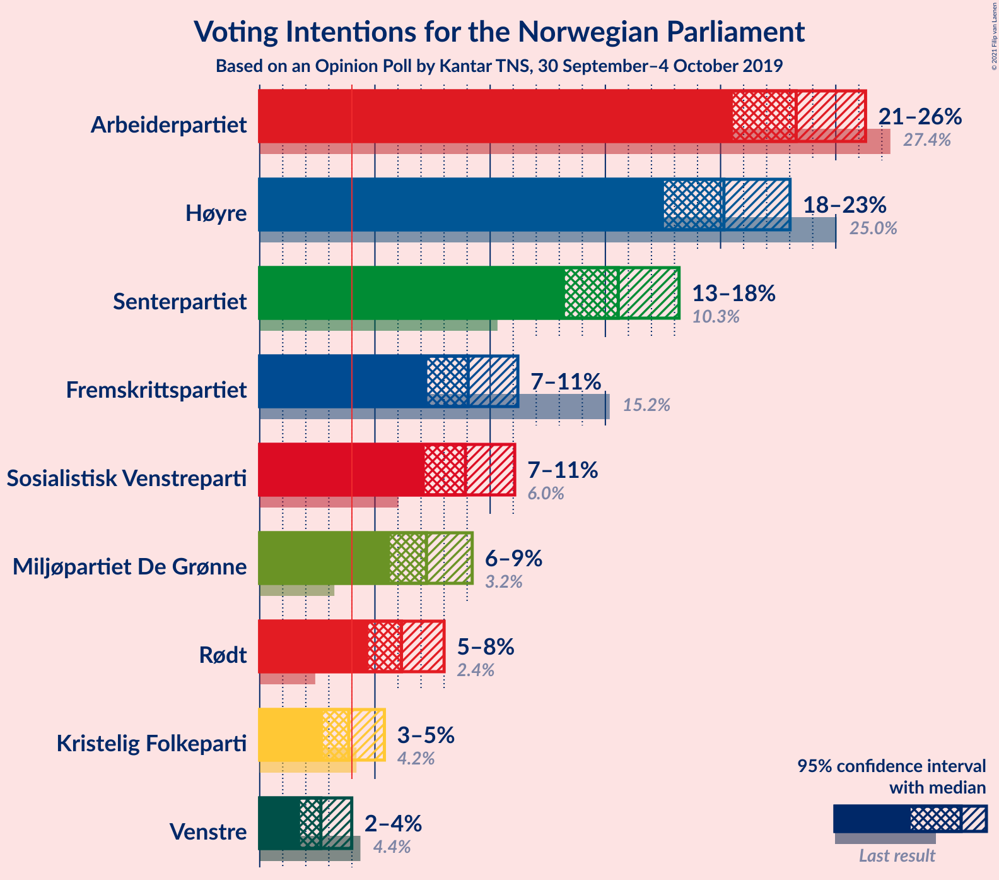

### Confidence Intervals

| Party | Last Result | Poll Result | 80% Confidence Interval | 90% Confidence Interval | 95% Confidence Interval | 99% Confidence Interval |
|:-----:|:-----------:|:-----------:|:-----------------------:|:-----------------------:|:-----------------------:|:-----------------------:|
| Arbeiderpartiet | 27.4% | 23.3% | 21.5–25.2% |21.0–25.8% |20.5–26.3% |19.7–27.3% |
| Høyre | 25.0% | 20.1% | 18.4–22.0% |18.0–22.6% |17.5–23.0% |16.8–23.9% |
| Senterpartiet | 10.3% | 15.6% | 14.0–17.3% |13.6–17.8% |13.2–18.2% |12.5–19.1% |
| Fremskrittspartiet | 15.2% | 9.0% | 7.9–10.5% |7.5–10.9% |7.3–11.2% |6.8–11.9% |
| Sosialistisk Venstreparti | 6.0% | 8.9% | 7.8–10.3% |7.4–10.7% |7.2–11.1% |6.6–11.8% |
| Miljøpartiet De Grønne | 3.2% | 7.2% | 6.2–8.5% |5.9–8.9% |5.7–9.2% |5.2–9.9% |
| Rødt | 2.4% | 6.2% | 5.2–7.4% |4.9–7.7% |4.7–8.0% |4.3–8.6% |
| Kristelig Folkeparti | 4.2% | 3.9% | 3.1–4.9% |2.9–5.2% |2.7–5.4% |2.4–5.9% |
| Venstre | 4.4% | 2.7% | 2.1–3.5% |1.9–3.8% |1.8–4.0% |1.5–4.5% |

*Note:* The poll result column reflects the actual value used in the calculations. Published results may vary slightly, and in addition be rounded to fewer digits.

## Seats

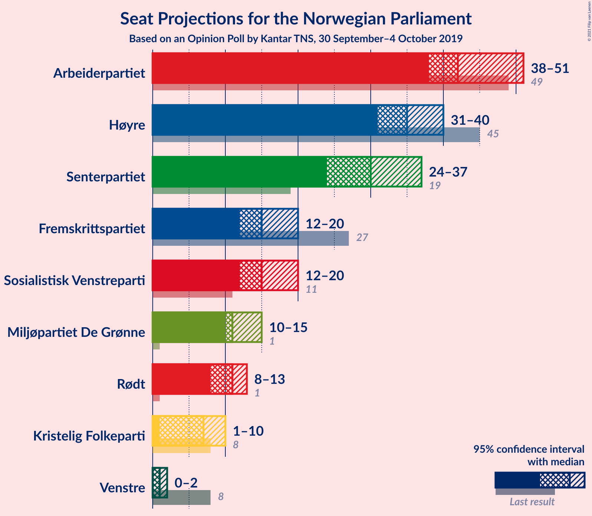

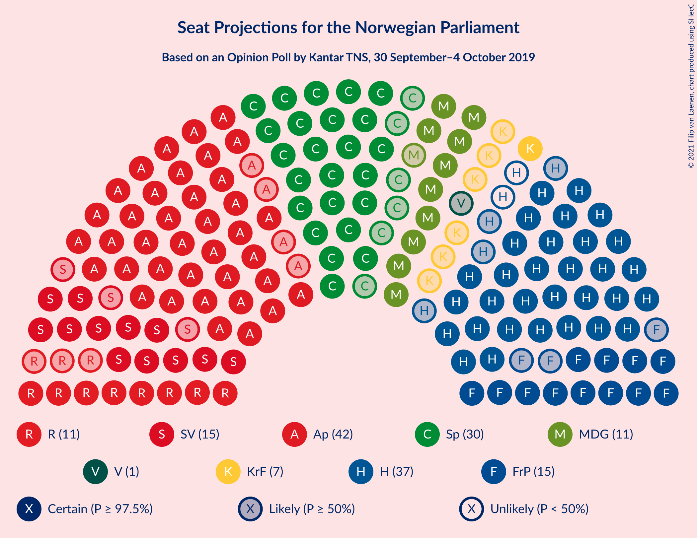

### Confidence Intervals

| Party | Last Result | Median | 80% Confidence Interval | 90% Confidence Interval | 95% Confidence Interval | 99% Confidence Interval |
|:-----:|:-----------:|:------:|:-----------------------:|:-----------------------:|:-----------------------:|:-----------------------:|
| <a href="#arbeiderpartiet">Arbeiderpartiet</a> | 49 | 42 | 39–45 |39–49 |38–51 |37–51 |
| <a href="#høyre">Høyre</a> | 45 | 35 | 32–38 |31–40 |31–40 |29–41 |
| <a href="#senterpartiet">Senterpartiet</a> | 19 | 30 | 24–34 |24–37 |24–37 |23–37 |
| <a href="#fremskrittspartiet">Fremskrittspartiet</a> | 27 | 15 | 13–18 |12–19 |12–20 |11–21 |
| <a href="#sosialistisk-venstreparti">Sosialistisk Venstreparti</a> | 11 | 15 | 13–17 |13–19 |12–20 |11–20 |
| <a href="#miljøpartiet-de-grønne">Miljøpartiet De Grønne</a> | 1 | 11 | 10–14 |10–15 |10–15 |9–17 |
| <a href="#rødt">Rødt</a> | 1 | 11 | 9–12 |9–13 |8–13 |7–15 |
| <a href="#kristelig-folkeparti">Kristelig Folkeparti</a> | 8 | 7 | 2–8 |1–9 |1–10 |1–10 |
| <a href="#venstre">Venstre</a> | 8 | 1 | 1–2 |1–2 |0–2 |0–7 |

### Arbeiderpartiet

*For a full overview of the results for this party, see the [Arbeiderpartiet](party-arbeiderpartiet.html) page.*

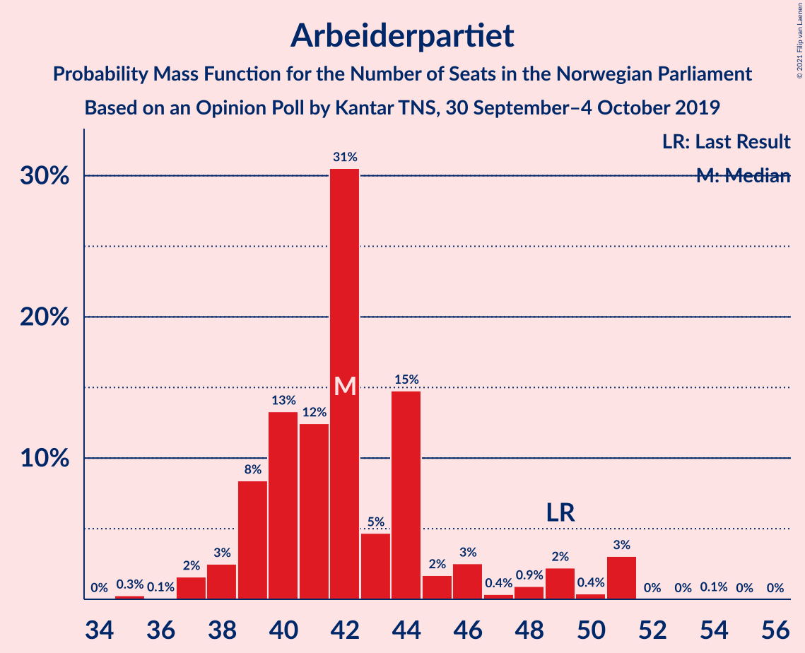

| Number of Seats | Probability | Accumulated | Special Marks |
|:---------------:|:-----------:|:-----------:|:-------------:|
| 34 | 0% | 100% |  |
| 35 | 0.3% | 99.9% |  |
| 36 | 0.1% | 99.7% |  |
| 37 | 2% | 99.6% |  |
| 38 | 3% | 98% |  |
| 39 | 8% | 96% |  |
| 40 | 13% | 87% |  |
| 41 | 12% | 74% |  |
| 42 | 31% | 61% | Median |
| 43 | 5% | 31% |  |
| 44 | 15% | 26% |  |
| 45 | 2% | 11% |  |
| 46 | 3% | 10% |  |
| 47 | 0.4% | 7% |  |
| 48 | 0.9% | 7% |  |
| 49 | 2% | 6% | Last Result |
| 50 | 0.4% | 4% |  |
| 51 | 3% | 3% |  |
| 52 | 0% | 0.1% |  |
| 53 | 0% | 0.1% |  |
| 54 | 0.1% | 0.1% |  |
| 55 | 0% | 0% |  |

### Høyre

*For a full overview of the results for this party, see the [Høyre](party-høyre.html) page.*

| Number of Seats | Probability | Accumulated | Special Marks |
|:---------------:|:-----------:|:-----------:|:-------------:|
| 28 | 0.4% | 100% |  |
| 29 | 1.3% | 99.6% |  |
| 30 | 0.7% | 98% |  |
| 31 | 3% | 98% |  |
| 32 | 22% | 94% |  |
| 33 | 14% | 72% |  |
| 34 | 5% | 58% |  |
| 35 | 11% | 53% | Median |
| 36 | 3% | 42% |  |
| 37 | 21% | 39% |  |
| 38 | 9% | 19% |  |
| 39 | 5% | 10% |  |
| 40 | 4% | 5% |  |
| 41 | 0.9% | 1.3% |  |
| 42 | 0.2% | 0.4% |  |
| 43 | 0.1% | 0.2% |  |
| 44 | 0.1% | 0.2% |  |
| 45 | 0% | 0.1% | Last Result |
| 46 | 0% | 0.1% |  |
| 47 | 0% | 0% |  |

### Senterpartiet

*For a full overview of the results for this party, see the [Senterpartiet](party-senterpartiet.html) page.*

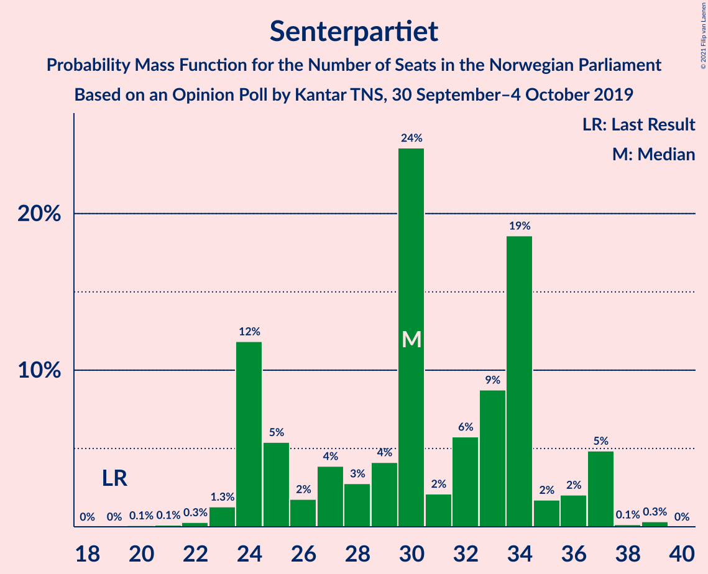

| Number of Seats | Probability | Accumulated | Special Marks |
|:---------------:|:-----------:|:-----------:|:-------------:|
| 19 | 0% | 100% | Last Result |
| 20 | 0.1% | 100% |  |
| 21 | 0.1% | 99.9% |  |
| 22 | 0.3% | 99.8% |  |
| 23 | 1.3% | 99.5% |  |
| 24 | 12% | 98% |  |
| 25 | 5% | 86% |  |
| 26 | 2% | 81% |  |
| 27 | 4% | 79% |  |
| 28 | 3% | 75% |  |
| 29 | 4% | 73% |  |
| 30 | 24% | 68% | Median |
| 31 | 2% | 44% |  |
| 32 | 6% | 42% |  |
| 33 | 9% | 36% |  |
| 34 | 19% | 28% |  |
| 35 | 2% | 9% |  |
| 36 | 2% | 7% |  |
| 37 | 5% | 5% |  |
| 38 | 0.1% | 0.5% |  |
| 39 | 0.3% | 0.3% |  |
| 40 | 0% | 0% |  |

### Fremskrittspartiet

*For a full overview of the results for this party, see the [Fremskrittspartiet](party-fremskrittspartiet.html) page.*

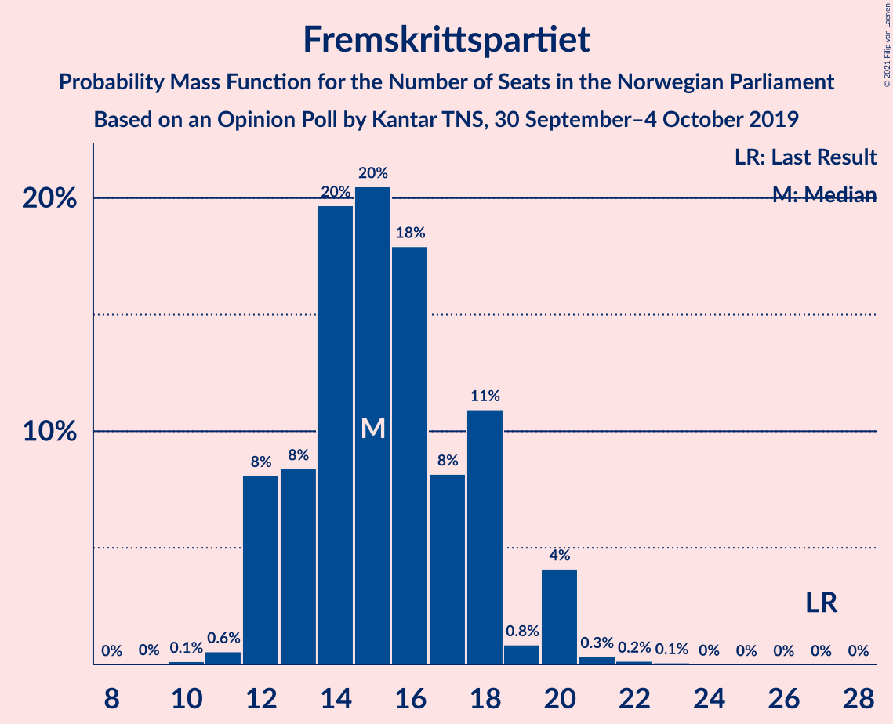

| Number of Seats | Probability | Accumulated | Special Marks |
|:---------------:|:-----------:|:-----------:|:-------------:|
| 10 | 0.1% | 100% |  |
| 11 | 0.6% | 99.8% |  |
| 12 | 8% | 99.3% |  |
| 13 | 8% | 91% |  |
| 14 | 20% | 83% |  |
| 15 | 20% | 63% | Median |
| 16 | 18% | 43% |  |
| 17 | 8% | 25% |  |
| 18 | 11% | 16% |  |
| 19 | 0.8% | 6% |  |
| 20 | 4% | 5% |  |
| 21 | 0.3% | 0.6% |  |
| 22 | 0.2% | 0.3% |  |
| 23 | 0.1% | 0.1% |  |
| 24 | 0% | 0% |  |
| 25 | 0% | 0% |  |
| 26 | 0% | 0% |  |
| 27 | 0% | 0% | Last Result |

### Sosialistisk Venstreparti

*For a full overview of the results for this party, see the [Sosialistisk Venstreparti](party-sosialistiskvenstreparti.html) page.*

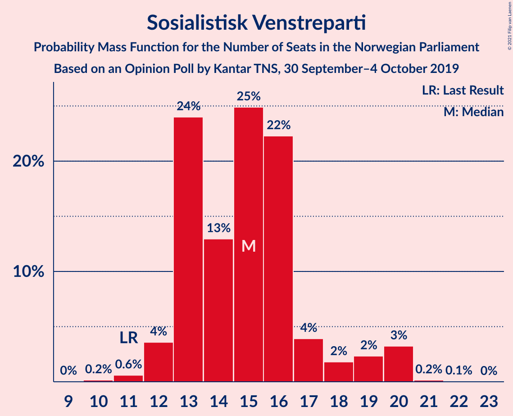

| Number of Seats | Probability | Accumulated | Special Marks |
|:---------------:|:-----------:|:-----------:|:-------------:|
| 10 | 0.2% | 100% |  |
| 11 | 0.6% | 99.8% | Last Result |
| 12 | 4% | 99.2% |  |
| 13 | 24% | 96% |  |
| 14 | 13% | 72% |  |
| 15 | 25% | 59% | Median |
| 16 | 22% | 34% |  |
| 17 | 4% | 11% |  |
| 18 | 2% | 8% |  |
| 19 | 2% | 6% |  |
| 20 | 3% | 3% |  |
| 21 | 0.2% | 0.2% |  |
| 22 | 0.1% | 0.1% |  |
| 23 | 0% | 0% |  |

### Miljøpartiet De Grønne

*For a full overview of the results for this party, see the [Miljøpartiet De Grønne](party-miljøpartietdegrønne.html) page.*

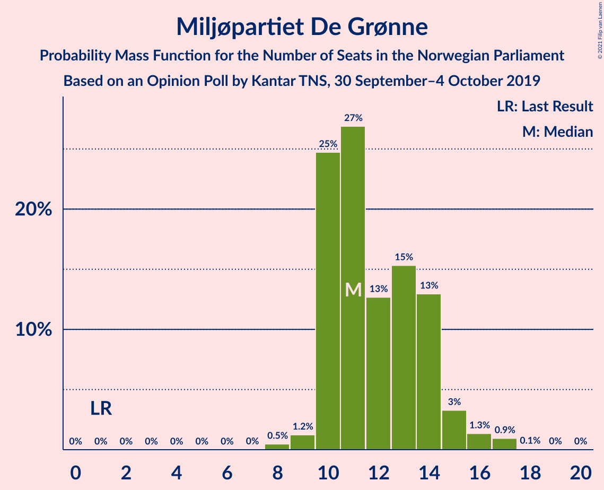

| Number of Seats | Probability | Accumulated | Special Marks |
|:---------------:|:-----------:|:-----------:|:-------------:|
| 1 | 0% | 100% | Last Result |
| 2 | 0% | 100% |  |
| 3 | 0% | 100% |  |
| 4 | 0% | 100% |  |
| 5 | 0% | 100% |  |
| 6 | 0% | 100% |  |
| 7 | 0% | 100% |  |
| 8 | 0.5% | 100% |  |
| 9 | 1.2% | 99.5% |  |
| 10 | 25% | 98% |  |
| 11 | 27% | 74% | Median |
| 12 | 13% | 47% |  |
| 13 | 15% | 34% |  |
| 14 | 13% | 19% |  |
| 15 | 3% | 6% |  |
| 16 | 1.3% | 2% |  |
| 17 | 0.9% | 1.1% |  |
| 18 | 0.1% | 0.1% |  |
| 19 | 0% | 0% |  |

### Rødt

*For a full overview of the results for this party, see the [Rødt](party-rødt.html) page.*

| Number of Seats | Probability | Accumulated | Special Marks |
|:---------------:|:-----------:|:-----------:|:-------------:|
| 1 | 0% | 100% | Last Result |
| 2 | 0.2% | 100% |  |
| 3 | 0% | 99.8% |  |
| 4 | 0% | 99.8% |  |
| 5 | 0% | 99.8% |  |
| 6 | 0% | 99.8% |  |
| 7 | 0.8% | 99.7% |  |
| 8 | 4% | 98.9% |  |
| 9 | 10% | 95% |  |
| 10 | 35% | 85% |  |
| 11 | 31% | 50% | Median |
| 12 | 10% | 19% |  |
| 13 | 6% | 9% |  |
| 14 | 1.3% | 2% |  |
| 15 | 0.9% | 0.9% |  |
| 16 | 0.1% | 0.1% |  |
| 17 | 0% | 0% |  |

### Kristelig Folkeparti

*For a full overview of the results for this party, see the [Kristelig Folkeparti](party-kristeligfolkeparti.html) page.*

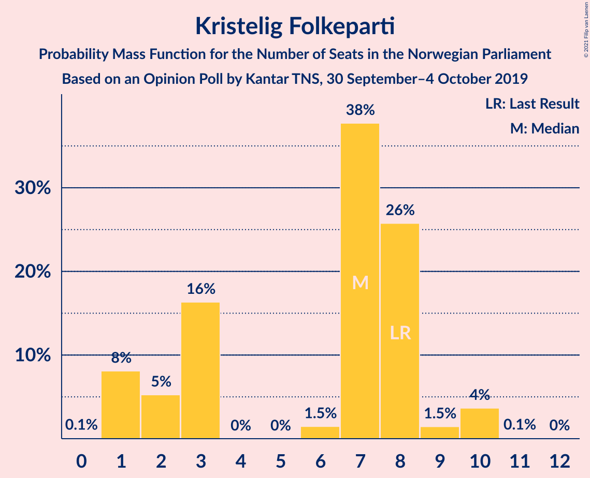

| Number of Seats | Probability | Accumulated | Special Marks |
|:---------------:|:-----------:|:-----------:|:-------------:|
| 0 | 0.1% | 100% |  |
| 1 | 8% | 99.9% |  |
| 2 | 5% | 92% |  |
| 3 | 16% | 87% |  |
| 4 | 0% | 70% |  |
| 5 | 0% | 70% |  |
| 6 | 1.5% | 70% |  |
| 7 | 38% | 69% | Median |
| 8 | 26% | 31% | Last Result |
| 9 | 1.5% | 5% |  |
| 10 | 4% | 4% |  |
| 11 | 0.1% | 0.1% |  |
| 12 | 0% | 0% |  |

### Venstre

*For a full overview of the results for this party, see the [Venstre](party-venstre.html) page.*

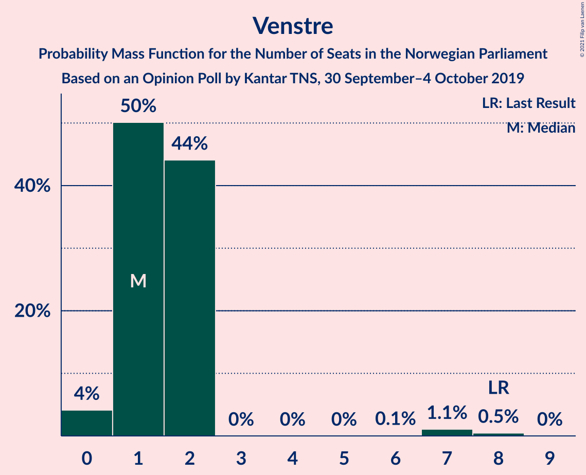

| Number of Seats | Probability | Accumulated | Special Marks |
|:---------------:|:-----------:|:-----------:|:-------------:|
| 0 | 4% | 100% |  |
| 1 | 50% | 96% | Median |
| 2 | 44% | 46% |  |
| 3 | 0% | 2% |  |
| 4 | 0% | 2% |  |
| 5 | 0% | 2% |  |
| 6 | 0.1% | 2% |  |
| 7 | 1.1% | 2% |  |
| 8 | 0.5% | 0.5% | Last Result |
| 9 | 0% | 0% |  |

## Coalitions

### Confidence Intervals

| Coalition | Last Result | Median | Majority? | 80% Confidence Interval | 90% Confidence Interval | 95% Confidence Interval | 99% Confidence Interval |
|:---------:|:-----------:|:------:|:---------:|:-----------------------:|:-----------------------:|:-----------------------:|:-----------------------:|
| Arbeiderpartiet – Senterpartiet – Sosialistisk Venstreparti – Miljøpartiet De Grønne – Rødt | 81 | 109 | 100% | 106–115 | 106–118 | 104–118 | 101–120 |
| Arbeiderpartiet – Senterpartiet – Sosialistisk Venstreparti – Miljøpartiet De Grønne – Kristelig Folkeparti | 88 | 106 | 100% | 102–110 | 99–110 | 98–111 | 96–114 |
| Arbeiderpartiet – Senterpartiet – Sosialistisk Venstreparti – Miljøpartiet De Grønne | 80 | 99 | 100% | 95–103 | 95–107 | 94–107 | 91–109 |
| Arbeiderpartiet – Senterpartiet – Sosialistisk Venstreparti – Rødt | 80 | 98 | 100% | 95–103 | 93–105 | 92–106 | 89–106 |
| Arbeiderpartiet – Senterpartiet – Miljøpartiet De Grønne – Kristelig Folkeparti | 77 | 90 | 91% | 86–96 | 83–96 | 83–98 | 79–99 |
| Arbeiderpartiet – Senterpartiet – Sosialistisk Venstreparti | 79 | 88 | 76% | 84–92 | 83–95 | 82–95 | 79–96 |
| Høyre – Senterpartiet – Fremskrittspartiet – Kristelig Folkeparti – Venstre | 107 | 88 | 87% | 83–92 | 81–93 | 79–93 | 78–95 |
| Arbeiderpartiet – Senterpartiet – Kristelig Folkeparti | 76 | 79 | 7% | 72–84 | 71–86 | 69–86 | 67–87 |
| Arbeiderpartiet – Senterpartiet | 68 | 72 | 0% | 68–78 | 67–79 | 65–81 | 63–82 |
| Høyre – Fremskrittspartiet – Miljøpartiet De Grønne – Kristelig Folkeparti – Venstre | 89 | 71 | 0% | 64–74 | 63–76 | 63–76 | 61–79 |
| Arbeiderpartiet – Sosialistisk Venstreparti | 60 | 56 | 0% | 54–61 | 54–63 | 53–65 | 50–65 |
| Høyre – Fremskrittspartiet – Kristelig Folkeparti – Venstre | 88 | 58 | 0% | 53–63 | 51–63 | 51–63 | 48–66 |
| Høyre – Fremskrittspartiet – Venstre | 80 | 52 | 0% | 47–56 | 47–58 | 47–58 | 44–60 |
| Høyre – Fremskrittspartiet | 72 | 50 | 0% | 46–54 | 46–56 | 46–56 | 43–58 |
| Høyre – Kristelig Folkeparti – Venstre | 61 | 42 | 0% | 38–47 | 38–47 | 36–48 | 34–49 |
| Senterpartiet – Kristelig Folkeparti – Venstre | 35 | 38 | 0% | 34–42 | 31–43 | 29–46 | 28–46 |

### Arbeiderpartiet – Senterpartiet – Sosialistisk Venstreparti – Miljøpartiet De Grønne – Rødt

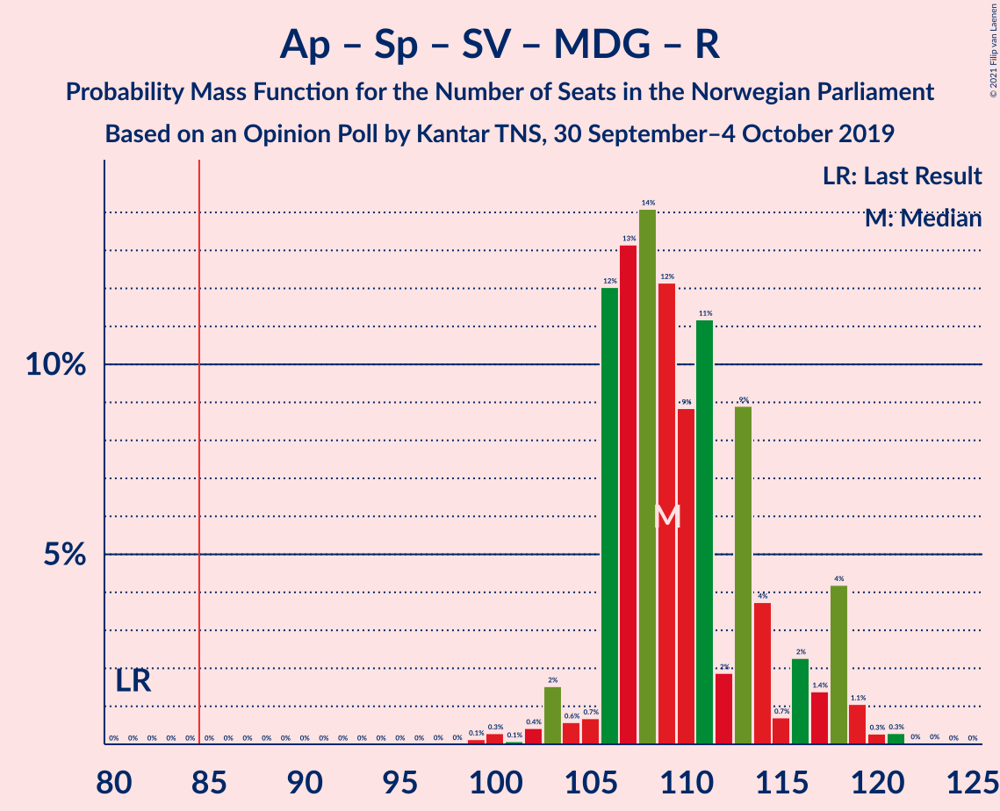

| Number of Seats | Probability | Accumulated | Special Marks |
|:---------------:|:-----------:|:-----------:|:-------------:|
| 81 | 0% | 100% | Last Result |
| 82 | 0% | 100% |  |
| 83 | 0% | 100% |  |
| 84 | 0% | 100% |  |
| 85 | 0% | 100% | Majority |
| 86 | 0% | 100% |  |
| 87 | 0% | 100% |  |
| 88 | 0% | 100% |  |
| 89 | 0% | 100% |  |
| 90 | 0% | 100% |  |
| 91 | 0% | 100% |  |
| 92 | 0% | 100% |  |
| 93 | 0% | 100% |  |
| 94 | 0% | 100% |  |
| 95 | 0% | 100% |  |
| 96 | 0% | 100% |  |
| 97 | 0% | 100% |  |
| 98 | 0% | 100% |  |
| 99 | 0.1% | 100% |  |
| 100 | 0.3% | 99.8% |  |
| 101 | 0.1% | 99.5% |  |
| 102 | 0.4% | 99.5% |  |
| 103 | 2% | 99.0% |  |
| 104 | 0.6% | 98% |  |
| 105 | 0.7% | 97% |  |
| 106 | 12% | 96% |  |
| 107 | 13% | 84% |  |
| 108 | 14% | 71% |  |
| 109 | 12% | 57% | Median |
| 110 | 9% | 45% |  |
| 111 | 11% | 36% |  |
| 112 | 2% | 25% |  |
| 113 | 9% | 23% |  |
| 114 | 4% | 14% |  |
| 115 | 0.7% | 10% |  |
| 116 | 2% | 10% |  |
| 117 | 1.4% | 7% |  |
| 118 | 4% | 6% |  |
| 119 | 1.1% | 2% |  |
| 120 | 0.3% | 0.6% |  |
| 121 | 0.3% | 0.4% |  |
| 122 | 0% | 0.1% |  |
| 123 | 0% | 0% |  |

### Arbeiderpartiet – Senterpartiet – Sosialistisk Venstreparti – Miljøpartiet De Grønne – Kristelig Folkeparti

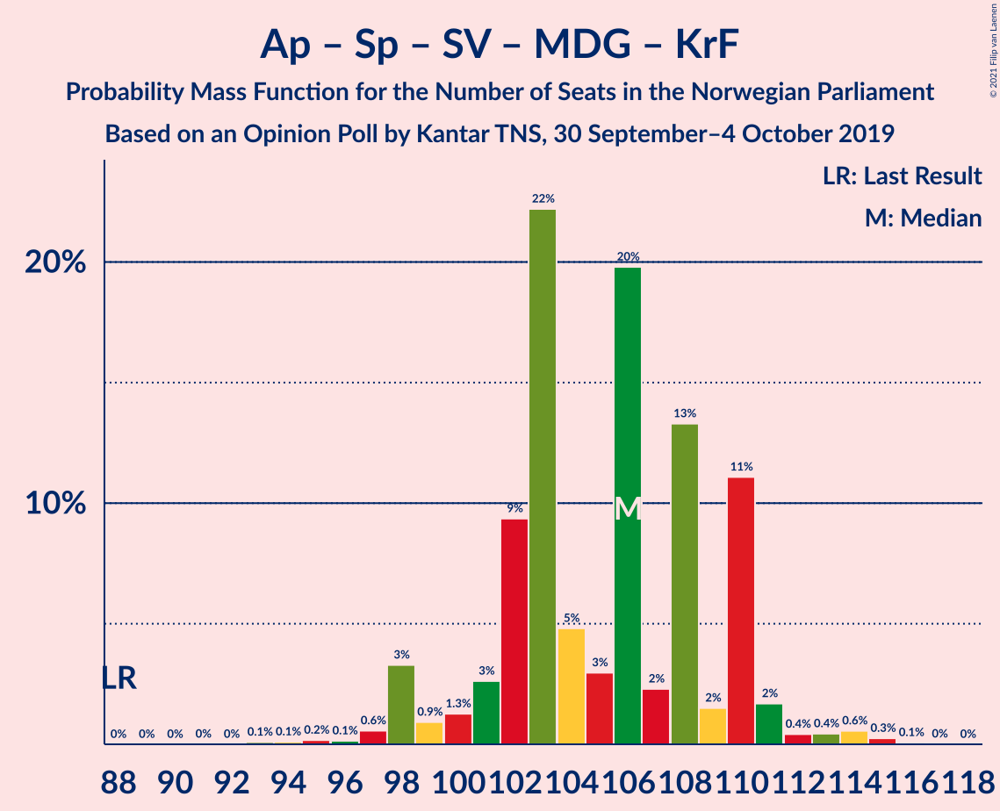

| Number of Seats | Probability | Accumulated | Special Marks |
|:---------------:|:-----------:|:-----------:|:-------------:|
| 88 | 0% | 100% | Last Result |
| 89 | 0% | 100% |  |
| 90 | 0% | 100% |  |
| 91 | 0% | 100% |  |
| 92 | 0% | 100% |  |
| 93 | 0.1% | 100% |  |
| 94 | 0.1% | 99.9% |  |
| 95 | 0.2% | 99.8% |  |
| 96 | 0.1% | 99.6% |  |
| 97 | 0.6% | 99.5% |  |
| 98 | 3% | 98.9% |  |
| 99 | 0.9% | 96% |  |
| 100 | 1.3% | 95% |  |
| 101 | 3% | 93% |  |
| 102 | 9% | 91% |  |
| 103 | 22% | 81% |  |
| 104 | 5% | 59% |  |
| 105 | 3% | 54% | Median |
| 106 | 20% | 51% |  |
| 107 | 2% | 32% |  |
| 108 | 13% | 29% |  |
| 109 | 2% | 16% |  |
| 110 | 11% | 15% |  |
| 111 | 2% | 3% |  |
| 112 | 0.4% | 2% |  |
| 113 | 0.4% | 1.3% |  |
| 114 | 0.6% | 0.9% |  |
| 115 | 0.3% | 0.3% |  |
| 116 | 0.1% | 0.1% |  |
| 117 | 0% | 0% |  |

### Arbeiderpartiet – Senterpartiet – Sosialistisk Venstreparti – Miljøpartiet De Grønne

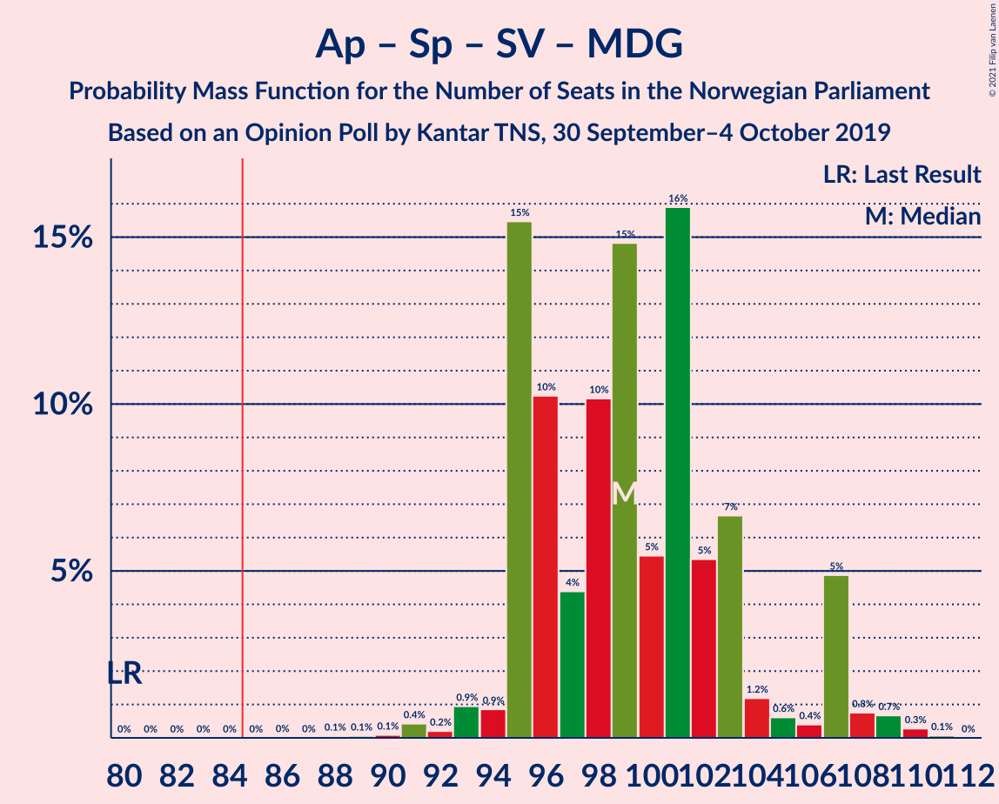

| Number of Seats | Probability | Accumulated | Special Marks |
|:---------------:|:-----------:|:-----------:|:-------------:|
| 80 | 0% | 100% | Last Result |
| 81 | 0% | 100% |  |
| 82 | 0% | 100% |  |
| 83 | 0% | 100% |  |
| 84 | 0% | 100% |  |
| 85 | 0% | 100% | Majority |
| 86 | 0% | 100% |  |
| 87 | 0% | 100% |  |
| 88 | 0.1% | 100% |  |
| 89 | 0.1% | 99.9% |  |
| 90 | 0.1% | 99.9% |  |
| 91 | 0.4% | 99.8% |  |
| 92 | 0.2% | 99.4% |  |
| 93 | 0.9% | 99.1% |  |
| 94 | 0.9% | 98% |  |
| 95 | 15% | 97% |  |
| 96 | 10% | 82% |  |
| 97 | 4% | 72% |  |
| 98 | 10% | 67% | Median |
| 99 | 15% | 57% |  |
| 100 | 5% | 42% |  |
| 101 | 16% | 37% |  |
| 102 | 5% | 21% |  |
| 103 | 7% | 16% |  |
| 104 | 1.2% | 9% |  |
| 105 | 0.6% | 8% |  |
| 106 | 0.4% | 7% |  |
| 107 | 5% | 7% |  |
| 108 | 0.8% | 2% |  |
| 109 | 0.7% | 1.0% |  |
| 110 | 0.3% | 0.4% |  |
| 111 | 0.1% | 0.1% |  |
| 112 | 0% | 0% |  |

### Arbeiderpartiet – Senterpartiet – Sosialistisk Venstreparti – Rødt

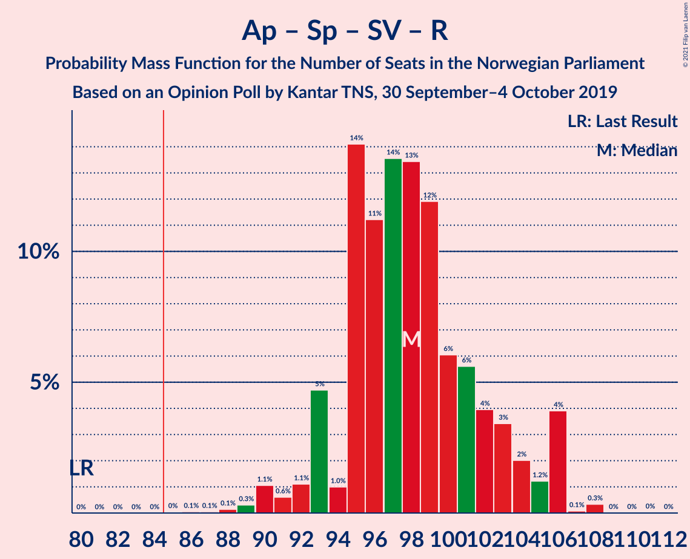

| Number of Seats | Probability | Accumulated | Special Marks |
|:---------------:|:-----------:|:-----------:|:-------------:|
| 80 | 0% | 100% | Last Result |
| 81 | 0% | 100% |  |
| 82 | 0% | 100% |  |
| 83 | 0% | 100% |  |
| 84 | 0% | 100% |  |
| 85 | 0% | 100% | Majority |
| 86 | 0.1% | 99.9% |  |
| 87 | 0.1% | 99.9% |  |
| 88 | 0.1% | 99.8% |  |
| 89 | 0.3% | 99.7% |  |
| 90 | 1.1% | 99.4% |  |
| 91 | 0.6% | 98% |  |
| 92 | 1.1% | 98% |  |
| 93 | 5% | 97% |  |
| 94 | 1.0% | 92% |  |
| 95 | 14% | 91% |  |
| 96 | 11% | 77% |  |
| 97 | 14% | 66% |  |
| 98 | 13% | 52% | Median |
| 99 | 12% | 39% |  |
| 100 | 6% | 27% |  |
| 101 | 6% | 21% |  |
| 102 | 4% | 15% |  |
| 103 | 3% | 11% |  |
| 104 | 2% | 8% |  |
| 105 | 1.2% | 6% |  |
| 106 | 4% | 4% |  |
| 107 | 0.1% | 0.5% |  |
| 108 | 0.3% | 0.4% |  |
| 109 | 0% | 0.1% |  |
| 110 | 0% | 0.1% |  |
| 111 | 0% | 0% |  |

### Arbeiderpartiet – Senterpartiet – Miljøpartiet De Grønne – Kristelig Folkeparti

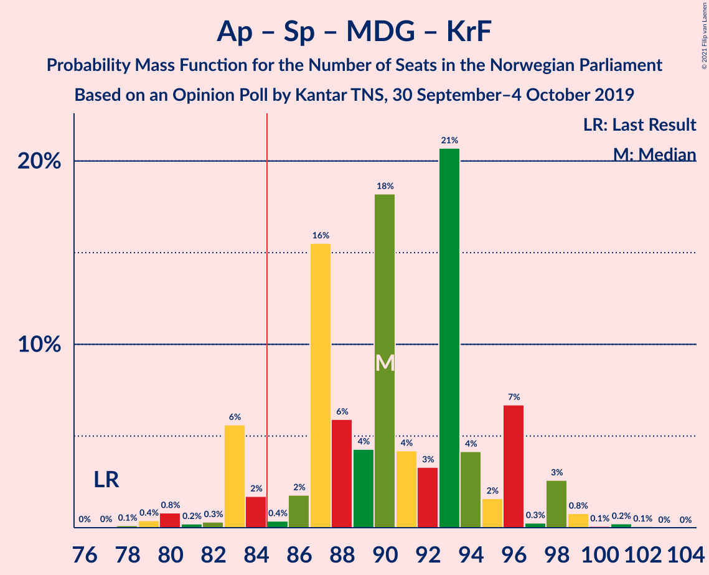

| Number of Seats | Probability | Accumulated | Special Marks |
|:---------------:|:-----------:|:-----------:|:-------------:|
| 77 | 0% | 100% | Last Result |
| 78 | 0.1% | 99.9% |  |
| 79 | 0.4% | 99.8% |  |
| 80 | 0.8% | 99.4% |  |
| 81 | 0.2% | 98.6% |  |
| 82 | 0.3% | 98% |  |
| 83 | 6% | 98% |  |
| 84 | 2% | 92% |  |
| 85 | 0.4% | 91% | Majority |
| 86 | 2% | 90% |  |
| 87 | 16% | 89% |  |
| 88 | 6% | 73% |  |
| 89 | 4% | 67% |  |
| 90 | 18% | 63% | Median |
| 91 | 4% | 45% |  |
| 92 | 3% | 40% |  |
| 93 | 21% | 37% |  |
| 94 | 4% | 16% |  |
| 95 | 2% | 12% |  |
| 96 | 7% | 11% |  |
| 97 | 0.3% | 4% |  |
| 98 | 3% | 4% |  |
| 99 | 0.8% | 1.2% |  |
| 100 | 0.1% | 0.4% |  |
| 101 | 0.2% | 0.3% |  |
| 102 | 0.1% | 0.1% |  |
| 103 | 0% | 0% |  |

### Arbeiderpartiet – Senterpartiet – Sosialistisk Venstreparti

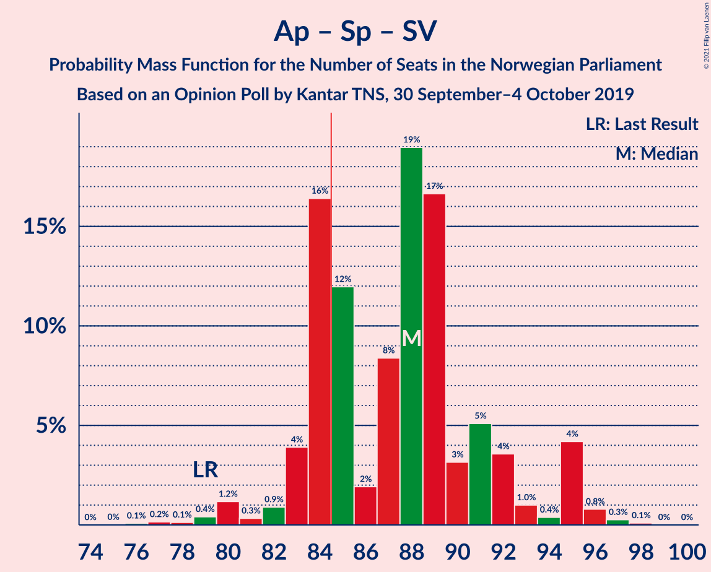

| Number of Seats | Probability | Accumulated | Special Marks |
|:---------------:|:-----------:|:-----------:|:-------------:|
| 76 | 0.1% | 100% |  |
| 77 | 0.2% | 99.9% |  |
| 78 | 0.1% | 99.7% |  |
| 79 | 0.4% | 99.6% | Last Result |
| 80 | 1.2% | 99.2% |  |
| 81 | 0.3% | 98% |  |
| 82 | 0.9% | 98% |  |
| 83 | 4% | 97% |  |
| 84 | 16% | 93% |  |
| 85 | 12% | 76% | Majority |
| 86 | 2% | 64% |  |
| 87 | 8% | 63% | Median |
| 88 | 19% | 54% |  |
| 89 | 17% | 35% |  |
| 90 | 3% | 19% |  |
| 91 | 5% | 15% |  |
| 92 | 4% | 10% |  |
| 93 | 1.0% | 7% |  |
| 94 | 0.4% | 6% |  |
| 95 | 4% | 5% |  |
| 96 | 0.8% | 1.2% |  |
| 97 | 0.3% | 0.4% |  |
| 98 | 0.1% | 0.1% |  |
| 99 | 0% | 0% |  |

### Høyre – Senterpartiet – Fremskrittspartiet – Kristelig Folkeparti – Venstre

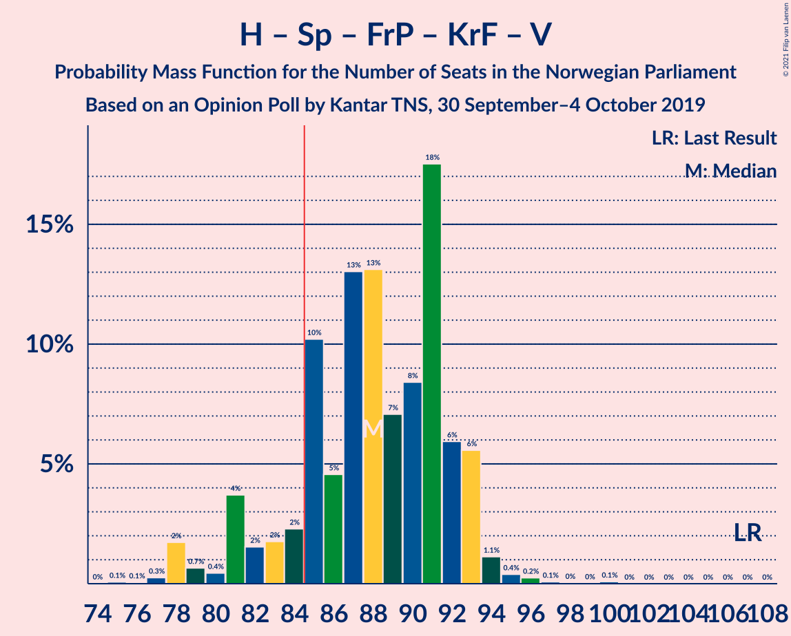

| Number of Seats | Probability | Accumulated | Special Marks |
|:---------------:|:-----------:|:-----------:|:-------------:|
| 74 | 0% | 100% |  |
| 75 | 0.1% | 99.9% |  |
| 76 | 0.1% | 99.9% |  |
| 77 | 0.3% | 99.8% |  |
| 78 | 2% | 99.6% |  |
| 79 | 0.7% | 98% |  |
| 80 | 0.4% | 97% |  |
| 81 | 4% | 97% |  |
| 82 | 2% | 93% |  |
| 83 | 2% | 91% |  |
| 84 | 2% | 90% |  |
| 85 | 10% | 87% | Majority |
| 86 | 5% | 77% |  |
| 87 | 13% | 73% |  |
| 88 | 13% | 60% | Median |
| 89 | 7% | 47% |  |
| 90 | 8% | 39% |  |
| 91 | 18% | 31% |  |
| 92 | 6% | 13% |  |
| 93 | 6% | 8% |  |
| 94 | 1.1% | 2% |  |
| 95 | 0.4% | 0.9% |  |
| 96 | 0.2% | 0.5% |  |
| 97 | 0.1% | 0.2% |  |
| 98 | 0% | 0.1% |  |
| 99 | 0% | 0.1% |  |
| 100 | 0.1% | 0.1% |  |
| 101 | 0% | 0% |  |
| 102 | 0% | 0% |  |
| 103 | 0% | 0% |  |
| 104 | 0% | 0% |  |
| 105 | 0% | 0% |  |
| 106 | 0% | 0% |  |
| 107 | 0% | 0% | Last Result |

### Arbeiderpartiet – Senterpartiet – Kristelig Folkeparti

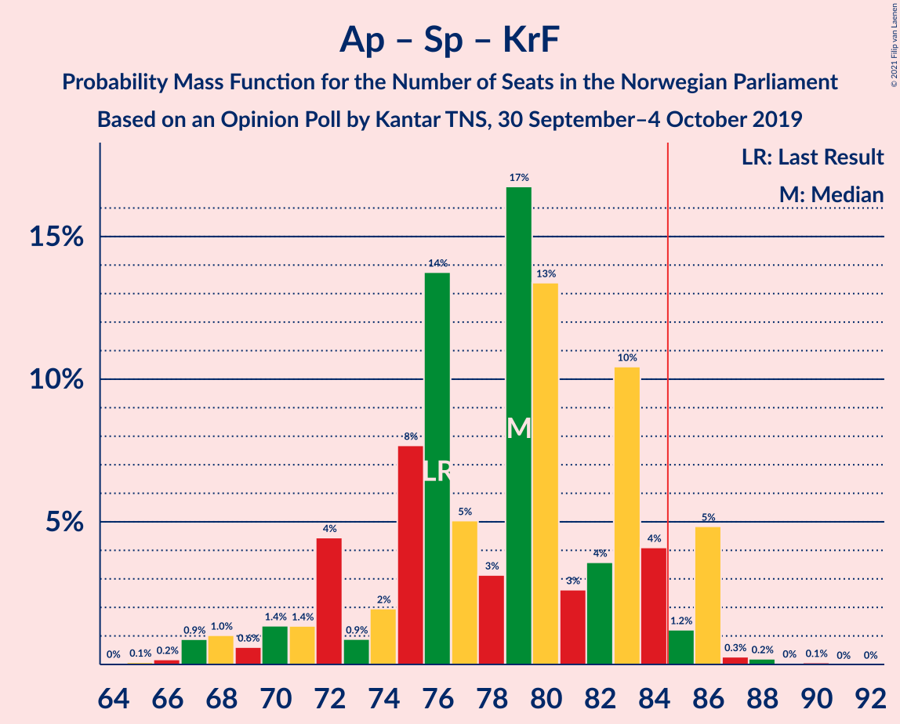

| Number of Seats | Probability | Accumulated | Special Marks |
|:---------------:|:-----------:|:-----------:|:-------------:|
| 64 | 0% | 100% |  |
| 65 | 0.1% | 99.9% |  |
| 66 | 0.2% | 99.8% |  |
| 67 | 0.9% | 99.7% |  |
| 68 | 1.0% | 98.8% |  |
| 69 | 0.6% | 98% |  |
| 70 | 1.4% | 97% |  |
| 71 | 1.4% | 96% |  |
| 72 | 4% | 94% |  |
| 73 | 0.9% | 90% |  |
| 74 | 2% | 89% |  |
| 75 | 8% | 87% |  |
| 76 | 14% | 79% | Last Result |
| 77 | 5% | 66% |  |
| 78 | 3% | 61% |  |
| 79 | 17% | 58% | Median |
| 80 | 13% | 41% |  |
| 81 | 3% | 27% |  |
| 82 | 4% | 25% |  |
| 83 | 10% | 21% |  |
| 84 | 4% | 11% |  |
| 85 | 1.2% | 7% | Majority |
| 86 | 5% | 5% |  |
| 87 | 0.3% | 0.6% |  |
| 88 | 0.2% | 0.3% |  |
| 89 | 0% | 0.1% |  |
| 90 | 0.1% | 0.1% |  |
| 91 | 0% | 0% |  |

### Arbeiderpartiet – Senterpartiet

| Number of Seats | Probability | Accumulated | Special Marks |
|:---------------:|:-----------:|:-----------:|:-------------:|
| 60 | 0% | 100% |  |
| 61 | 0.1% | 99.9% |  |
| 62 | 0% | 99.8% |  |
| 63 | 0.4% | 99.8% |  |
| 64 | 0.2% | 99.4% |  |
| 65 | 2% | 99.2% |  |
| 66 | 0.8% | 97% |  |
| 67 | 1.2% | 96% |  |
| 68 | 16% | 95% | Last Result |
| 69 | 5% | 79% |  |
| 70 | 1.5% | 73% |  |
| 71 | 4% | 72% |  |
| 72 | 25% | 68% | Median |
| 73 | 6% | 43% |  |
| 74 | 9% | 37% |  |
| 75 | 3% | 28% |  |
| 76 | 12% | 25% |  |
| 77 | 0.6% | 14% |  |
| 78 | 6% | 13% |  |
| 79 | 2% | 7% |  |
| 80 | 0.3% | 4% |  |
| 81 | 3% | 4% |  |
| 82 | 0.8% | 0.9% |  |
| 83 | 0% | 0.1% |  |
| 84 | 0% | 0.1% |  |
| 85 | 0% | 0% | Majority |

### Høyre – Fremskrittspartiet – Miljøpartiet De Grønne – Kristelig Folkeparti – Venstre

| Number of Seats | Probability | Accumulated | Special Marks |
|:---------------:|:-----------:|:-----------:|:-------------:|
| 57 | 0% | 100% |  |
| 58 | 0% | 99.9% |  |
| 59 | 0.1% | 99.9% |  |
| 60 | 0.1% | 99.8% |  |
| 61 | 0.5% | 99.7% |  |
| 62 | 0.2% | 99.3% |  |
| 63 | 4% | 99.1% |  |
| 64 | 11% | 95% |  |
| 65 | 2% | 84% |  |
| 66 | 13% | 82% |  |
| 67 | 4% | 68% |  |
| 68 | 6% | 64% |  |
| 69 | 6% | 58% | Median |
| 70 | 2% | 52% |  |
| 71 | 14% | 50% |  |
| 72 | 14% | 36% |  |
| 73 | 1.2% | 23% |  |
| 74 | 14% | 21% |  |
| 75 | 0.8% | 7% |  |
| 76 | 5% | 7% |  |
| 77 | 0.3% | 2% |  |
| 78 | 0.6% | 2% |  |
| 79 | 0.8% | 1.1% |  |
| 80 | 0.1% | 0.3% |  |
| 81 | 0.1% | 0.1% |  |
| 82 | 0% | 0.1% |  |
| 83 | 0% | 0% |  |
| 84 | 0% | 0% |  |
| 85 | 0% | 0% | Majority |
| 86 | 0% | 0% |  |
| 87 | 0% | 0% |  |
| 88 | 0% | 0% |  |
| 89 | 0% | 0% | Last Result |

### Arbeiderpartiet – Sosialistisk Venstreparti

| Number of Seats | Probability | Accumulated | Special Marks |
|:---------------:|:-----------:|:-----------:|:-------------:|
| 49 | 0.1% | 100% |  |
| 50 | 1.0% | 99.8% |  |
| 51 | 0.3% | 98.9% |  |
| 52 | 0.8% | 98.6% |  |
| 53 | 0.8% | 98% |  |
| 54 | 13% | 97% |  |
| 55 | 30% | 84% |  |
| 56 | 9% | 54% |  |
| 57 | 3% | 46% | Median |
| 58 | 13% | 43% |  |
| 59 | 4% | 30% |  |
| 60 | 16% | 26% | Last Result |
| 61 | 3% | 10% |  |
| 62 | 2% | 7% |  |
| 63 | 1.3% | 5% |  |
| 64 | 0.5% | 4% |  |
| 65 | 3% | 4% |  |
| 66 | 0% | 0.4% |  |
| 67 | 0.1% | 0.4% |  |
| 68 | 0.1% | 0.3% |  |
| 69 | 0.1% | 0.2% |  |
| 70 | 0% | 0.1% |  |
| 71 | 0% | 0% |  |

### Høyre – Fremskrittspartiet – Kristelig Folkeparti – Venstre

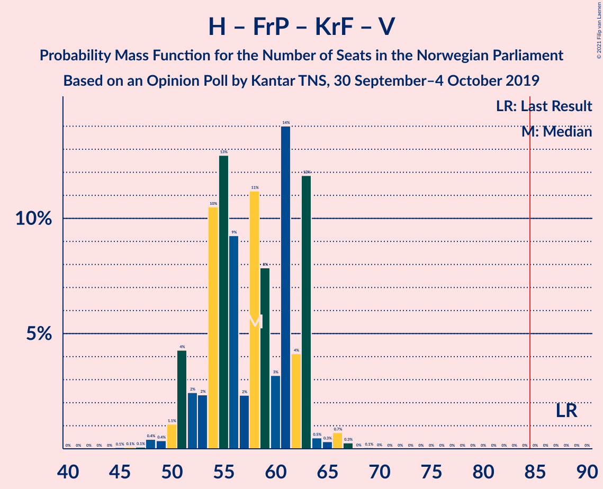

| Number of Seats | Probability | Accumulated | Special Marks |
|:---------------:|:-----------:|:-----------:|:-------------:|
| 45 | 0.1% | 100% |  |
| 46 | 0.1% | 99.9% |  |
| 47 | 0.1% | 99.9% |  |
| 48 | 0.4% | 99.8% |  |
| 49 | 0.4% | 99.4% |  |
| 50 | 1.1% | 99.0% |  |
| 51 | 4% | 98% |  |
| 52 | 2% | 94% |  |
| 53 | 2% | 91% |  |
| 54 | 10% | 89% |  |
| 55 | 13% | 78% |  |
| 56 | 9% | 66% |  |
| 57 | 2% | 56% |  |
| 58 | 11% | 54% | Median |
| 59 | 8% | 43% |  |
| 60 | 3% | 35% |  |
| 61 | 14% | 32% |  |
| 62 | 4% | 18% |  |
| 63 | 12% | 14% |  |
| 64 | 0.5% | 2% |  |
| 65 | 0.3% | 1.4% |  |
| 66 | 0.7% | 1.1% |  |
| 67 | 0.3% | 0.3% |  |
| 68 | 0% | 0.1% |  |
| 69 | 0.1% | 0.1% |  |
| 70 | 0% | 0% |  |
| 71 | 0% | 0% |  |
| 72 | 0% | 0% |  |
| 73 | 0% | 0% |  |
| 74 | 0% | 0% |  |
| 75 | 0% | 0% |  |
| 76 | 0% | 0% |  |
| 77 | 0% | 0% |  |
| 78 | 0% | 0% |  |
| 79 | 0% | 0% |  |
| 80 | 0% | 0% |  |
| 81 | 0% | 0% |  |
| 82 | 0% | 0% |  |
| 83 | 0% | 0% |  |
| 84 | 0% | 0% |  |
| 85 | 0% | 0% | Majority |
| 86 | 0% | 0% |  |
| 87 | 0% | 0% |  |
| 88 | 0% | 0% | Last Result |

### Høyre – Fremskrittspartiet – Venstre

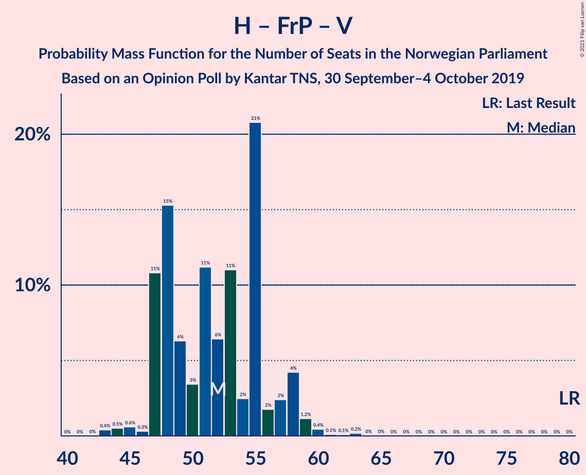

| Number of Seats | Probability | Accumulated | Special Marks |
|:---------------:|:-----------:|:-----------:|:-------------:|
| 43 | 0.4% | 100% |  |
| 44 | 0.5% | 99.6% |  |
| 45 | 0.6% | 99.1% |  |
| 46 | 0.3% | 98% |  |
| 47 | 11% | 98% |  |
| 48 | 15% | 87% |  |
| 49 | 6% | 72% |  |
| 50 | 3% | 66% |  |
| 51 | 11% | 62% | Median |
| 52 | 6% | 51% |  |
| 53 | 11% | 45% |  |
| 54 | 2% | 34% |  |
| 55 | 21% | 31% |  |
| 56 | 2% | 10% |  |
| 57 | 2% | 9% |  |
| 58 | 4% | 6% |  |
| 59 | 1.2% | 2% |  |
| 60 | 0.4% | 0.9% |  |
| 61 | 0.1% | 0.4% |  |
| 62 | 0.1% | 0.3% |  |
| 63 | 0.2% | 0.2% |  |
| 64 | 0% | 0.1% |  |
| 65 | 0% | 0% |  |
| 66 | 0% | 0% |  |
| 67 | 0% | 0% |  |
| 68 | 0% | 0% |  |
| 69 | 0% | 0% |  |
| 70 | 0% | 0% |  |
| 71 | 0% | 0% |  |
| 72 | 0% | 0% |  |
| 73 | 0% | 0% |  |
| 74 | 0% | 0% |  |
| 75 | 0% | 0% |  |
| 76 | 0% | 0% |  |
| 77 | 0% | 0% |  |
| 78 | 0% | 0% |  |
| 79 | 0% | 0% |  |
| 80 | 0% | 0% | Last Result |

### Høyre – Fremskrittspartiet

| Number of Seats | Probability | Accumulated | Special Marks |
|:---------------:|:-----------:|:-----------:|:-------------:|
| 42 | 0.4% | 100% |  |
| 43 | 0.9% | 99.6% |  |
| 44 | 0.3% | 98.6% |  |
| 45 | 0.7% | 98% |  |
| 46 | 14% | 98% |  |
| 47 | 15% | 83% |  |
| 48 | 6% | 69% |  |
| 49 | 4% | 63% |  |
| 50 | 10% | 59% | Median |
| 51 | 6% | 49% |  |
| 52 | 11% | 43% |  |
| 53 | 21% | 32% |  |
| 54 | 2% | 11% |  |
| 55 | 1.4% | 9% |  |
| 56 | 5% | 7% |  |
| 57 | 0.5% | 2% |  |
| 58 | 1.1% | 2% |  |
| 59 | 0.1% | 0.4% |  |
| 60 | 0.2% | 0.4% |  |
| 61 | 0.1% | 0.1% |  |
| 62 | 0.1% | 0.1% |  |
| 63 | 0% | 0% |  |
| 64 | 0% | 0% |  |
| 65 | 0% | 0% |  |
| 66 | 0% | 0% |  |
| 67 | 0% | 0% |  |
| 68 | 0% | 0% |  |
| 69 | 0% | 0% |  |
| 70 | 0% | 0% |  |
| 71 | 0% | 0% |  |
| 72 | 0% | 0% | Last Result |

### Høyre – Kristelig Folkeparti – Venstre

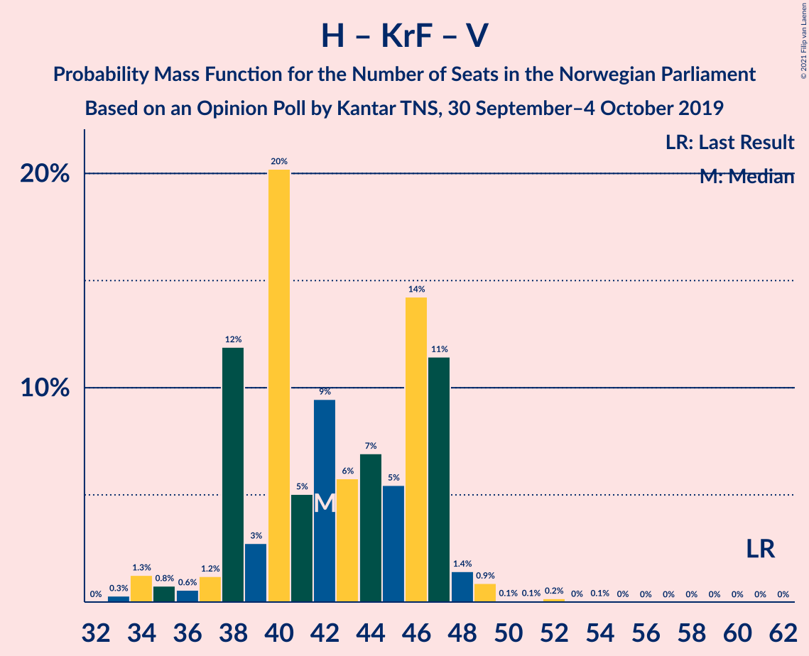

| Number of Seats | Probability | Accumulated | Special Marks |
|:---------------:|:-----------:|:-----------:|:-------------:|
| 32 | 0% | 100% |  |
| 33 | 0.3% | 99.9% |  |
| 34 | 1.3% | 99.6% |  |
| 35 | 0.8% | 98% |  |
| 36 | 0.6% | 98% |  |
| 37 | 1.2% | 97% |  |
| 38 | 12% | 96% |  |
| 39 | 3% | 84% |  |
| 40 | 20% | 81% |  |
| 41 | 5% | 61% |  |
| 42 | 9% | 56% |  |
| 43 | 6% | 47% | Median |
| 44 | 7% | 41% |  |
| 45 | 5% | 34% |  |
| 46 | 14% | 28% |  |
| 47 | 11% | 14% |  |
| 48 | 1.4% | 3% |  |
| 49 | 0.9% | 1.3% |  |
| 50 | 0.1% | 0.4% |  |
| 51 | 0.1% | 0.3% |  |
| 52 | 0.2% | 0.3% |  |
| 53 | 0% | 0.1% |  |
| 54 | 0.1% | 0.1% |  |
| 55 | 0% | 0% |  |
| 56 | 0% | 0% |  |
| 57 | 0% | 0% |  |
| 58 | 0% | 0% |  |
| 59 | 0% | 0% |  |
| 60 | 0% | 0% |  |
| 61 | 0% | 0% | Last Result |

### Senterpartiet – Kristelig Folkeparti – Venstre

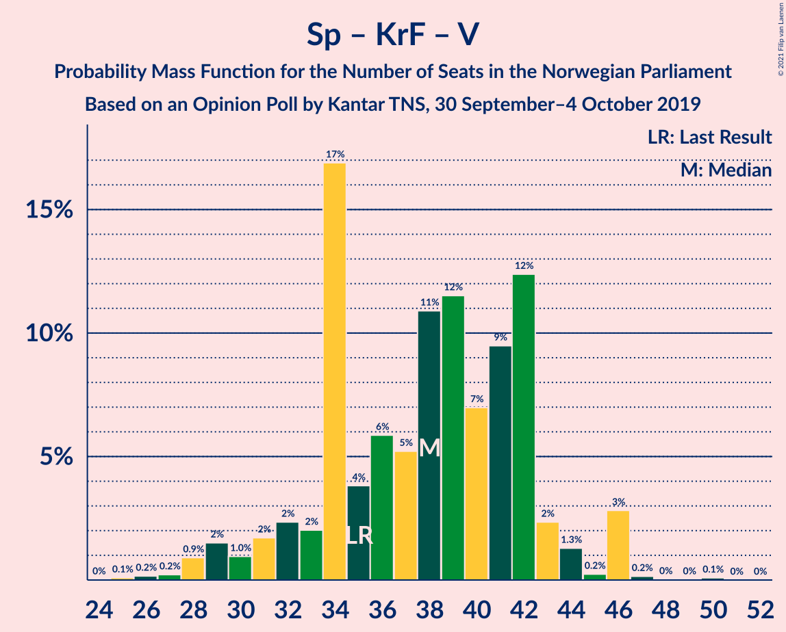

| Number of Seats | Probability | Accumulated | Special Marks |
|:---------------:|:-----------:|:-----------:|:-------------:|
| 25 | 0.1% | 100% |  |
| 26 | 0.2% | 99.9% |  |
| 27 | 0.2% | 99.7% |  |
| 28 | 0.9% | 99.5% |  |
| 29 | 2% | 98.6% |  |
| 30 | 1.0% | 97% |  |
| 31 | 2% | 96% |  |
| 32 | 2% | 94% |  |
| 33 | 2% | 92% |  |
| 34 | 17% | 90% |  |
| 35 | 4% | 73% | Last Result |
| 36 | 6% | 69% |  |
| 37 | 5% | 63% |  |
| 38 | 11% | 58% | Median |
| 39 | 12% | 47% |  |
| 40 | 7% | 36% |  |
| 41 | 9% | 29% |  |
| 42 | 12% | 19% |  |
| 43 | 2% | 7% |  |
| 44 | 1.3% | 5% |  |
| 45 | 0.2% | 3% |  |
| 46 | 3% | 3% |  |
| 47 | 0.2% | 0.3% |  |
| 48 | 0% | 0.1% |  |
| 49 | 0% | 0.1% |  |
| 50 | 0.1% | 0.1% |  |
| 51 | 0% | 0% |  |

## Technical Information

### Opinion Poll

+ **Polling firm:** Kantar TNS
+ **Commissioner(s):** —
+ **Fieldwork period:** 30 September–4 October 2019

### Calculations

+ **Sample size:** 829
+ **Simulations done:** 131,072
+ **Error estimate:** 1.27%

