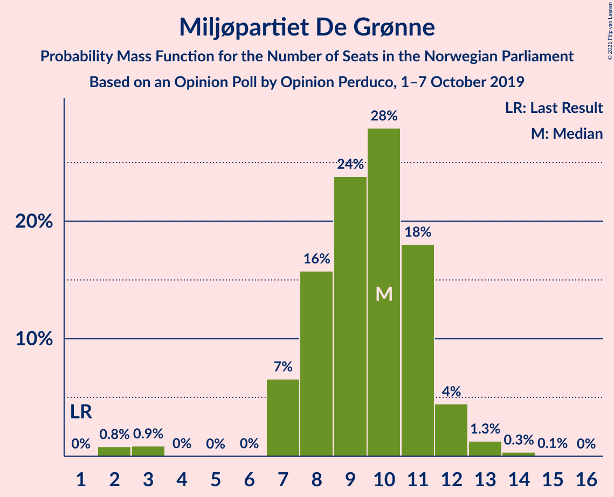
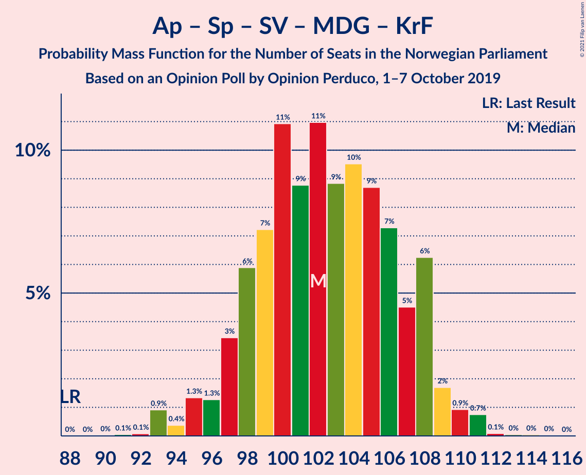
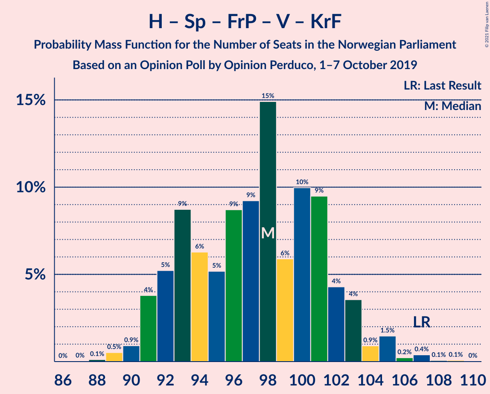
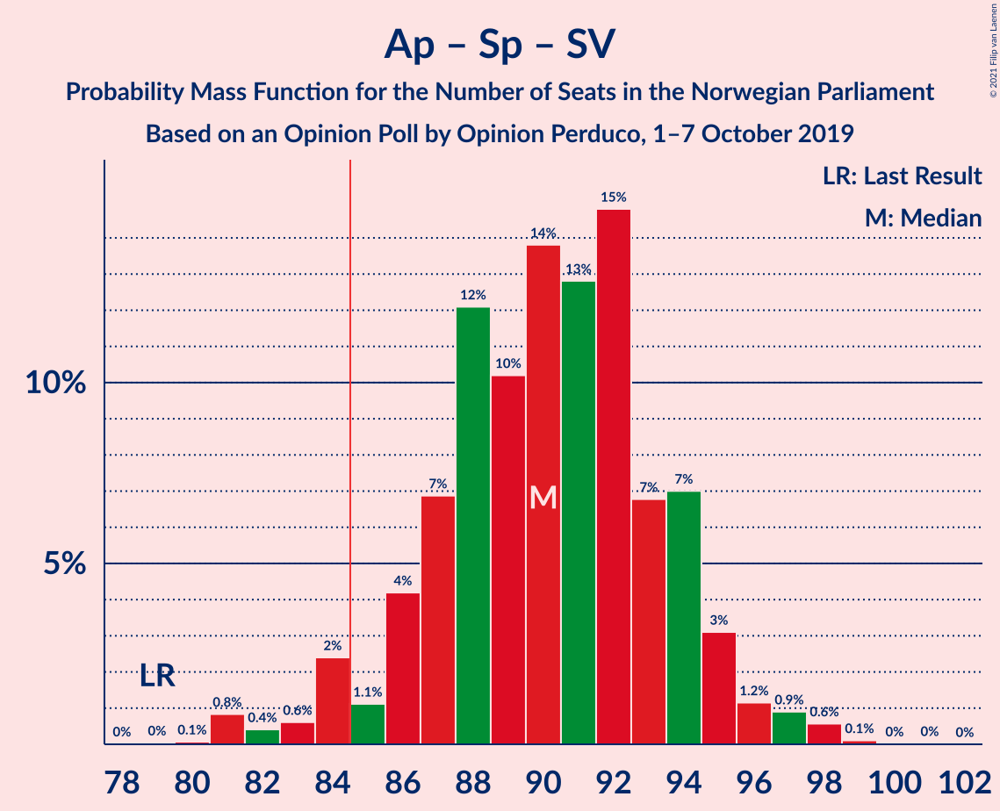
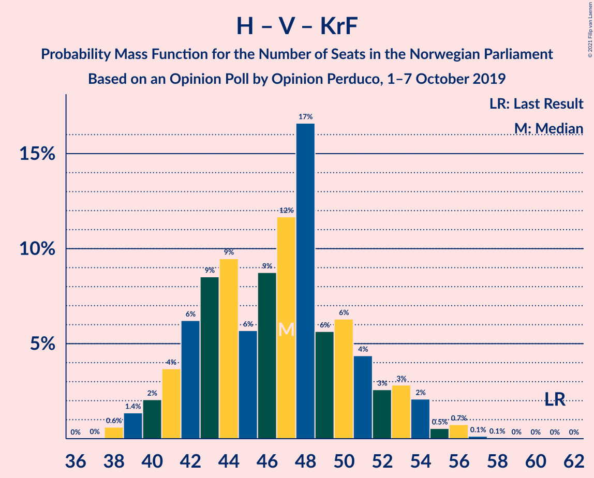
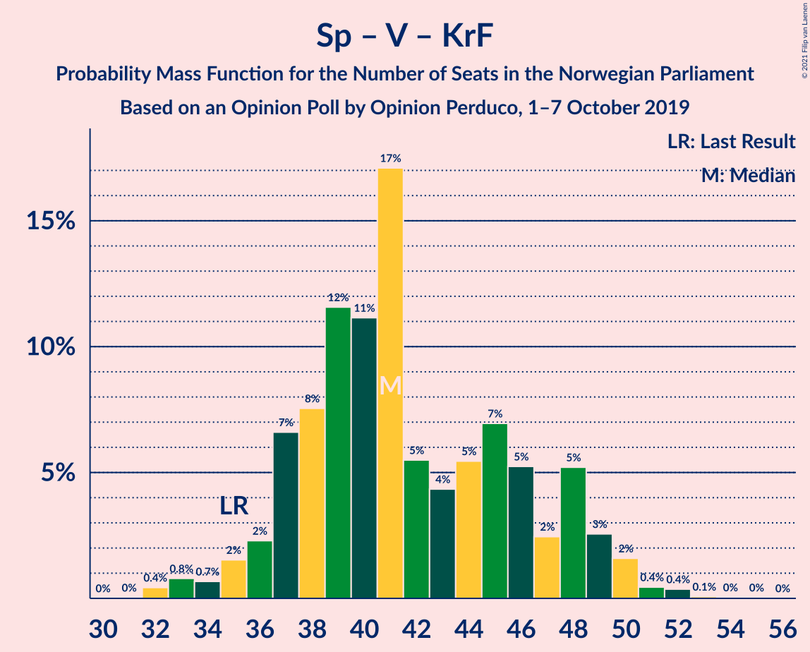

# Opinion Poll by Opinion Perduco, 1–7 October 2019

<a href="#voting-intentions">Voting Intentions</a> | <a href="#seats">Seats</a> | <a href="#coalitions">Coalitions</a> | <a href="#technical-information">Technical Information</a>

## Voting Intentions

### Confidence Intervals

| Party | Last Result | Poll Result | 80% Confidence Interval | 90% Confidence Interval | 95% Confidence Interval | 99% Confidence Interval |
|:-----:|:-----------:|:-----------:|:-----------------------:|:-----------------------:|:-----------------------:|:-----------------------:|
| Høyre | 25.0% | 22.8% | 21.1–24.6% |20.7–25.1% |20.3–25.6% |19.5–26.5% |
| Arbeiderpartiet | 27.4% | 22.2% | 20.5–24.0% |20.1–24.5% |19.7–25.0% |18.9–25.8% |
| Senterpartiet | 10.3% | 18.7% | 17.2–20.4% |16.7–20.9% |16.4–21.3% |15.6–22.2% |
| Fremskrittspartiet | 15.2% | 9.0% | 7.9–10.3% |7.6–10.7% |7.4–11.1% |6.9–11.7% |
| Sosialistisk Venstreparti | 6.0% | 8.2% | 7.2–9.5% |6.9–9.8% |6.6–10.1% |6.1–10.8% |
| Miljøpartiet De Grønne | 3.2% | 5.5% | 4.6–6.5% |4.4–6.8% |4.2–7.1% |3.8–7.7% |
| Rødt | 2.4% | 4.6% | 3.9–5.6% |3.6–5.9% |3.5–6.2% |3.1–6.7% |
| Venstre | 4.4% | 3.7% | 3.0–4.6% |2.8–4.8% |2.7–5.1% |2.4–5.5% |
| Kristelig Folkeparti | 4.2% | 3.4% | 2.7–4.3% |2.5–4.5% |2.4–4.7% |2.1–5.2% |

*Note:* The poll result column reflects the actual value used in the calculations. Published results may vary slightly, and in addition be rounded to fewer digits.

## Seats

### Confidence Intervals

| Party | Last Result | Median | 80% Confidence Interval | 90% Confidence Interval | 95% Confidence Interval | 99% Confidence Interval |
|:-----:|:-----------:|:------:|:-----------------------:|:-----------------------:|:-----------------------:|:-----------------------:|
| <a href="#høyre">Høyre</a> | 45 | 41 | 38–43 |37–43 |35–44 |33–46 |
| <a href="#arbeiderpartiet">Arbeiderpartiet</a> | 49 | 41 | 37–43 |37–44 |34–44 |32–44 |
| <a href="#senterpartiet">Senterpartiet</a> | 19 | 34 | 31–38 |31–40 |31–40 |31–40 |
| <a href="#fremskrittspartiet">Fremskrittspartiet</a> | 27 | 17 | 13–18 |13–19 |12–19 |11–20 |
| <a href="#sosialistisk-venstreparti">Sosialistisk Venstreparti</a> | 11 | 14 | 12–16 |11–16 |11–17 |10–19 |
| <a href="#miljøpartiet-de-grønne">Miljøpartiet De Grønne</a> | 1 | 9 | 7–12 |7–13 |2–13 |2–13 |
| <a href="#rødt">Rødt</a> | 1 | 8 | 2–10 |2–10 |2–11 |2–11 |
| <a href="#venstre">Venstre</a> | 8 | 2 | 2–8 |1–8 |1–9 |1–9 |
| <a href="#kristelig-folkeparti">Kristelig Folkeparti</a> | 8 | 2 | 1–3 |1–7 |1–8 |0–8 |

### Høyre

*For a full overview of the results for this party, see the [Høyre](party-høyre.html) page.*

| Number of Seats | Probability | Accumulated | Special Marks |
|:---------------:|:-----------:|:-----------:|:-------------:|
| 32 | 0% | 100% |  |
| 33 | 0.6% | 99.9% |  |
| 34 | 0.8% | 99.3% |  |
| 35 | 2% | 98.5% |  |
| 36 | 1.0% | 97% |  |
| 37 | 4% | 96% |  |
| 38 | 5% | 92% |  |
| 39 | 4% | 87% |  |
| 40 | 10% | 83% |  |
| 41 | 30% | 73% | Median |
| 42 | 1.0% | 43% |  |
| 43 | 40% | 42% |  |
| 44 | 1.0% | 3% |  |
| 45 | 0.9% | 2% | Last Result |
| 46 | 0.3% | 0.6% |  |
| 47 | 0.2% | 0.3% |  |
| 48 | 0% | 0.1% |  |
| 49 | 0% | 0.1% |  |
| 50 | 0% | 0.1% |  |
| 51 | 0% | 0% |  |

### Arbeiderpartiet

*For a full overview of the results for this party, see the [Arbeiderpartiet](party-arbeiderpartiet.html) page.*

| Number of Seats | Probability | Accumulated | Special Marks |
|:---------------:|:-----------:|:-----------:|:-------------:|
| 32 | 0.9% | 100% |  |
| 33 | 0.2% | 99.1% |  |
| 34 | 2% | 98.8% |  |
| 35 | 0.4% | 97% |  |
| 36 | 0.1% | 97% |  |
| 37 | 28% | 96% |  |
| 38 | 1.2% | 69% |  |
| 39 | 7% | 68% |  |
| 40 | 9% | 60% |  |
| 41 | 2% | 51% | Median |
| 42 | 29% | 49% |  |
| 43 | 15% | 20% |  |
| 44 | 5% | 5% |  |
| 45 | 0.3% | 0.5% |  |
| 46 | 0.1% | 0.2% |  |
| 47 | 0.1% | 0.1% |  |
| 48 | 0% | 0% |  |
| 49 | 0% | 0% | Last Result |

### Senterpartiet

*For a full overview of the results for this party, see the [Senterpartiet](party-senterpartiet.html) page.*

| Number of Seats | Probability | Accumulated | Special Marks |
|:---------------:|:-----------:|:-----------:|:-------------:|
| 19 | 0% | 100% | Last Result |
| 20 | 0% | 100% |  |
| 21 | 0% | 100% |  |
| 22 | 0% | 100% |  |
| 23 | 0% | 100% |  |
| 24 | 0% | 100% |  |
| 25 | 0% | 100% |  |
| 26 | 0% | 100% |  |
| 27 | 0% | 100% |  |
| 28 | 0.1% | 99.9% |  |
| 29 | 0% | 99.8% |  |
| 30 | 0% | 99.8% |  |
| 31 | 27% | 99.8% |  |
| 32 | 4% | 73% |  |
| 33 | 7% | 68% |  |
| 34 | 12% | 61% | Median |
| 35 | 6% | 49% |  |
| 36 | 5% | 44% |  |
| 37 | 24% | 38% |  |
| 38 | 4% | 14% |  |
| 39 | 4% | 10% |  |
| 40 | 5% | 5% |  |
| 41 | 0.1% | 0.2% |  |
| 42 | 0.1% | 0.1% |  |
| 43 | 0% | 0% |  |

### Fremskrittspartiet

*For a full overview of the results for this party, see the [Fremskrittspartiet](party-fremskrittspartiet.html) page.*

| Number of Seats | Probability | Accumulated | Special Marks |
|:---------------:|:-----------:|:-----------:|:-------------:|
| 10 | 0.2% | 100% |  |
| 11 | 0.6% | 99.8% |  |
| 12 | 4% | 99.2% |  |
| 13 | 5% | 95% |  |
| 14 | 5% | 90% |  |
| 15 | 1.2% | 85% |  |
| 16 | 17% | 84% |  |
| 17 | 24% | 66% | Median |
| 18 | 36% | 42% |  |
| 19 | 4% | 6% |  |
| 20 | 2% | 2% |  |
| 21 | 0.2% | 0.2% |  |
| 22 | 0% | 0% |  |
| 23 | 0% | 0% |  |
| 24 | 0% | 0% |  |
| 25 | 0% | 0% |  |
| 26 | 0% | 0% |  |
| 27 | 0% | 0% | Last Result |

### Sosialistisk Venstreparti

*For a full overview of the results for this party, see the [Sosialistisk Venstreparti](party-sosialistiskvenstreparti.html) page.*

| Number of Seats | Probability | Accumulated | Special Marks |
|:---------------:|:-----------:|:-----------:|:-------------:|
| 10 | 2% | 100% |  |
| 11 | 4% | 98% | Last Result |
| 12 | 34% | 94% |  |
| 13 | 4% | 60% |  |
| 14 | 31% | 55% | Median |
| 15 | 12% | 25% |  |
| 16 | 8% | 13% |  |
| 17 | 4% | 5% |  |
| 18 | 0.3% | 1.1% |  |
| 19 | 0.5% | 0.8% |  |
| 20 | 0.3% | 0.3% |  |
| 21 | 0% | 0% |  |

### Miljøpartiet De Grønne

*For a full overview of the results for this party, see the [Miljøpartiet De Grønne](party-miljøpartietdegrønne.html) page.*

| Number of Seats | Probability | Accumulated | Special Marks |
|:---------------:|:-----------:|:-----------:|:-------------:|
| 1 | 0.1% | 100% | Last Result |
| 2 | 3% | 99.9% |  |
| 3 | 1.3% | 97% |  |
| 4 | 0% | 96% |  |
| 5 | 0% | 96% |  |
| 6 | 0.1% | 96% |  |
| 7 | 7% | 96% |  |
| 8 | 9% | 89% |  |
| 9 | 33% | 80% | Median |
| 10 | 30% | 47% |  |
| 11 | 3% | 17% |  |
| 12 | 4% | 14% |  |
| 13 | 9% | 10% |  |
| 14 | 0.1% | 0.1% |  |
| 15 | 0% | 0% |  |

### Rødt

*For a full overview of the results for this party, see the [Rødt](party-rødt.html) page.*

| Number of Seats | Probability | Accumulated | Special Marks |
|:---------------:|:-----------:|:-----------:|:-------------:|
| 1 | 0.2% | 100% | Last Result |
| 2 | 12% | 99.8% |  |
| 3 | 0% | 88% |  |
| 4 | 0% | 88% |  |
| 5 | 0% | 88% |  |
| 6 | 0.2% | 88% |  |
| 7 | 37% | 88% |  |
| 8 | 26% | 51% | Median |
| 9 | 14% | 25% |  |
| 10 | 7% | 11% |  |
| 11 | 4% | 4% |  |
| 12 | 0.1% | 0.2% |  |
| 13 | 0% | 0.1% |  |
| 14 | 0% | 0% |  |

### Venstre

*For a full overview of the results for this party, see the [Venstre](party-venstre.html) page.*

| Number of Seats | Probability | Accumulated | Special Marks |
|:---------------:|:-----------:|:-----------:|:-------------:|
| 1 | 5% | 100% |  |
| 2 | 53% | 95% | Median |
| 3 | 0% | 42% |  |
| 4 | 0% | 42% |  |
| 5 | 0% | 42% |  |
| 6 | 2% | 42% |  |
| 7 | 29% | 40% |  |
| 8 | 8% | 11% | Last Result |
| 9 | 3% | 3% |  |
| 10 | 0.1% | 0.2% |  |
| 11 | 0% | 0% |  |

### Kristelig Folkeparti

*For a full overview of the results for this party, see the [Kristelig Folkeparti](party-kristeligfolkeparti.html) page.*

| Number of Seats | Probability | Accumulated | Special Marks |
|:---------------:|:-----------:|:-----------:|:-------------:|
| 0 | 0.8% | 100% |  |
| 1 | 47% | 99.2% |  |
| 2 | 33% | 53% | Median |
| 3 | 12% | 19% |  |
| 4 | 0% | 8% |  |
| 5 | 0% | 8% |  |
| 6 | 0.2% | 8% |  |
| 7 | 3% | 7% |  |
| 8 | 4% | 4% | Last Result |
| 9 | 0.2% | 0.2% |  |
| 10 | 0% | 0% |  |

## Coalitions

### Confidence Intervals

| Coalition | Last Result | Median | Majority? | 80% Confidence Interval | 90% Confidence Interval | 95% Confidence Interval | 99% Confidence Interval |
|:---------:|:-----------:|:------:|:---------:|:-----------------------:|:-----------------------:|:-----------------------:|:-----------------------:|
| Arbeiderpartiet – Senterpartiet – Sosialistisk Venstreparti – Miljøpartiet De Grønne – Rødt | 81 | 107 | 100% | 99–110 | 99–112 | 99–114 | 97–115 |
| Arbeiderpartiet – Senterpartiet – Sosialistisk Venstreparti – Miljøpartiet De Grønne – Kristelig Folkeparti | 88 | 101 | 100% | 94–106 | 94–106 | 94–108 | 94–110 |
| Arbeiderpartiet – Senterpartiet – Sosialistisk Venstreparti – Miljøpartiet De Grønne | 80 | 99 | 100% | 92–105 | 92–105 | 92–106 | 92–107 |
| Høyre – Senterpartiet – Fremskrittspartiet – Venstre – Kristelig Folkeparti | 107 | 99 | 100% | 95–102 | 92–103 | 92–104 | 90–108 |
| Arbeiderpartiet – Senterpartiet – Sosialistisk Venstreparti – Rødt | 80 | 97 | 100% | 89–102 | 89–102 | 89–104 | 89–107 |
| Arbeiderpartiet – Senterpartiet – Sosialistisk Venstreparti | 79 | 90 | 68% | 82–93 | 82–94 | 82–95 | 82–99 |
| Arbeiderpartiet – Senterpartiet – Miljøpartiet De Grønne – Kristelig Folkeparti | 77 | 89 | 62% | 80–91 | 80–93 | 79–94 | 78–97 |
| Arbeiderpartiet – Senterpartiet – Kristelig Folkeparti | 76 | 79 | 4% | 70–82 | 70–84 | 70–85 | 69–86 |
| Arbeiderpartiet – Senterpartiet | 68 | 77 | 0.1% | 68–79 | 68–80 | 68–82 | 68–83 |
| Høyre – Fremskrittspartiet – Miljøpartiet De Grønne – Venstre – Kristelig Folkeparti | 89 | 72 | 0% | 67–80 | 67–80 | 65–80 | 62–80 |
| Høyre – Fremskrittspartiet – Venstre – Kristelig Folkeparti | 88 | 62 | 0% | 59–70 | 57–70 | 55–70 | 54–72 |
| Høyre – Fremskrittspartiet – Venstre | 80 | 61 | 0% | 56–68 | 54–68 | 53–68 | 51–69 |
| Høyre – Fremskrittspartiet | 72 | 58 | 0% | 52–61 | 51–61 | 50–62 | 48–63 |
| Arbeiderpartiet – Sosialistisk Venstreparti | 60 | 54 | 0% | 51–58 | 51–58 | 49–58 | 47–61 |
| Høyre – Venstre – Kristelig Folkeparti | 61 | 46 | 0% | 43–52 | 42–52 | 42–52 | 38–55 |
| Senterpartiet – Venstre – Kristelig Folkeparti | 35 | 40 | 0% | 37–45 | 37–47 | 34–50 | 34–51 |

### Arbeiderpartiet – Senterpartiet – Sosialistisk Venstreparti – Miljøpartiet De Grønne – Rødt

| Number of Seats | Probability | Accumulated | Special Marks |
|:---------------:|:-----------:|:-----------:|:-------------:|
| 81 | 0% | 100% | Last Result |
| 82 | 0% | 100% |  |
| 83 | 0% | 100% |  |
| 84 | 0% | 100% |  |
| 85 | 0% | 100% | Majority |
| 86 | 0% | 100% |  |
| 87 | 0% | 100% |  |
| 88 | 0% | 100% |  |
| 89 | 0% | 100% |  |
| 90 | 0% | 100% |  |
| 91 | 0% | 100% |  |
| 92 | 0% | 100% |  |
| 93 | 0% | 100% |  |
| 94 | 0% | 100% |  |
| 95 | 0% | 100% |  |
| 96 | 0% | 100% |  |
| 97 | 0.9% | 99.9% |  |
| 98 | 0.1% | 99.1% |  |
| 99 | 27% | 99.0% |  |
| 100 | 3% | 72% |  |
| 101 | 0.8% | 69% |  |
| 102 | 0.5% | 68% |  |
| 103 | 1.3% | 68% |  |
| 104 | 11% | 66% |  |
| 105 | 4% | 55% |  |
| 106 | 0.9% | 51% | Median |
| 107 | 10% | 50% |  |
| 108 | 23% | 40% |  |
| 109 | 6% | 17% |  |
| 110 | 3% | 11% |  |
| 111 | 0.5% | 8% |  |
| 112 | 3% | 7% |  |
| 113 | 0.3% | 4% |  |
| 114 | 1.5% | 4% |  |
| 115 | 2% | 2% |  |
| 116 | 0.1% | 0.1% |  |
| 117 | 0% | 0% |  |

### Arbeiderpartiet – Senterpartiet – Sosialistisk Venstreparti – Miljøpartiet De Grønne – Kristelig Folkeparti

| Number of Seats | Probability | Accumulated | Special Marks |
|:---------------:|:-----------:|:-----------:|:-------------:|
| 88 | 0% | 100% | Last Result |
| 89 | 0% | 100% |  |
| 90 | 0% | 100% |  |
| 91 | 0% | 100% |  |
| 92 | 0% | 100% |  |
| 93 | 0.1% | 100% |  |
| 94 | 27% | 99.8% |  |
| 95 | 3% | 72% |  |
| 96 | 1.4% | 69% |  |
| 97 | 1.3% | 68% |  |
| 98 | 7% | 67% |  |
| 99 | 0.1% | 59% |  |
| 100 | 1.1% | 59% | Median |
| 101 | 31% | 58% |  |
| 102 | 4% | 27% |  |
| 103 | 3% | 23% |  |
| 104 | 3% | 20% |  |
| 105 | 2% | 17% |  |
| 106 | 10% | 14% |  |
| 107 | 1.0% | 5% |  |
| 108 | 2% | 4% |  |
| 109 | 0.7% | 1.5% |  |
| 110 | 0.5% | 0.8% |  |
| 111 | 0.1% | 0.3% |  |
| 112 | 0.1% | 0.2% |  |
| 113 | 0% | 0.1% |  |
| 114 | 0% | 0.1% |  |
| 115 | 0.1% | 0.1% |  |
| 116 | 0% | 0% |  |

### Arbeiderpartiet – Senterpartiet – Sosialistisk Venstreparti – Miljøpartiet De Grønne

| Number of Seats | Probability | Accumulated | Special Marks |
|:---------------:|:-----------:|:-----------:|:-------------:|
| 80 | 0% | 100% | Last Result |
| 81 | 0% | 100% |  |
| 82 | 0% | 100% |  |
| 83 | 0% | 100% |  |
| 84 | 0% | 100% |  |
| 85 | 0% | 100% | Majority |
| 86 | 0% | 100% |  |
| 87 | 0% | 100% |  |
| 88 | 0.1% | 100% |  |
| 89 | 0% | 99.9% |  |
| 90 | 0% | 99.9% |  |
| 91 | 0.1% | 99.9% |  |
| 92 | 27% | 99.8% |  |
| 93 | 4% | 72% |  |
| 94 | 4% | 69% |  |
| 95 | 4% | 65% |  |
| 96 | 2% | 61% |  |
| 97 | 6% | 59% |  |
| 98 | 2% | 53% | Median |
| 99 | 3% | 51% |  |
| 100 | 26% | 48% |  |
| 101 | 5% | 22% |  |
| 102 | 2% | 16% |  |
| 103 | 0.4% | 14% |  |
| 104 | 3% | 14% |  |
| 105 | 8% | 11% |  |
| 106 | 1.3% | 3% |  |
| 107 | 1.2% | 1.4% |  |
| 108 | 0.1% | 0.2% |  |
| 109 | 0% | 0.2% |  |
| 110 | 0.1% | 0.2% |  |
| 111 | 0% | 0% |  |

### Høyre – Senterpartiet – Fremskrittspartiet – Venstre – Kristelig Folkeparti

| Number of Seats | Probability | Accumulated | Special Marks |
|:---------------:|:-----------:|:-----------:|:-------------:|
| 90 | 1.4% | 100% |  |
| 91 | 0.6% | 98.6% |  |
| 92 | 4% | 98% |  |
| 93 | 3% | 94% |  |
| 94 | 0.7% | 91% |  |
| 95 | 3% | 91% |  |
| 96 | 11% | 88% | Median |
| 97 | 3% | 77% |  |
| 98 | 24% | 74% |  |
| 99 | 6% | 51% |  |
| 100 | 7% | 45% |  |
| 101 | 28% | 38% |  |
| 102 | 4% | 10% |  |
| 103 | 2% | 6% |  |
| 104 | 2% | 4% |  |
| 105 | 0.3% | 2% |  |
| 106 | 0.4% | 1.4% |  |
| 107 | 0.1% | 1.0% | Last Result |
| 108 | 0.8% | 0.9% |  |
| 109 | 0.1% | 0.1% |  |
| 110 | 0% | 0% |  |

### Arbeiderpartiet – Senterpartiet – Sosialistisk Venstreparti – Rødt

| Number of Seats | Probability | Accumulated | Special Marks |
|:---------------:|:-----------:|:-----------:|:-------------:|
| 80 | 0% | 100% | Last Result |
| 81 | 0% | 100% |  |
| 82 | 0% | 100% |  |
| 83 | 0% | 100% |  |
| 84 | 0% | 100% |  |
| 85 | 0% | 100% | Majority |
| 86 | 0% | 100% |  |
| 87 | 0.1% | 100% |  |
| 88 | 0.1% | 99.9% |  |
| 89 | 27% | 99.8% |  |
| 90 | 0.1% | 72% |  |
| 91 | 4% | 72% |  |
| 92 | 0.1% | 69% |  |
| 93 | 2% | 69% |  |
| 94 | 8% | 67% |  |
| 95 | 2% | 59% |  |
| 96 | 2% | 57% |  |
| 97 | 12% | 54% | Median |
| 98 | 2% | 42% |  |
| 99 | 23% | 40% |  |
| 100 | 2% | 17% |  |
| 101 | 2% | 15% |  |
| 102 | 8% | 13% |  |
| 103 | 2% | 5% |  |
| 104 | 2% | 3% |  |
| 105 | 0% | 1.3% |  |
| 106 | 0.3% | 1.2% |  |
| 107 | 1.0% | 1.0% |  |
| 108 | 0% | 0% |  |

### Arbeiderpartiet – Senterpartiet – Sosialistisk Venstreparti

| Number of Seats | Probability | Accumulated | Special Marks |
|:---------------:|:-----------:|:-----------:|:-------------:|
| 79 | 0.1% | 100% | Last Result |
| 80 | 0% | 99.9% |  |
| 81 | 0% | 99.9% |  |
| 82 | 27% | 99.9% |  |
| 83 | 0.7% | 73% |  |
| 84 | 4% | 72% |  |
| 85 | 1.4% | 68% | Majority |
| 86 | 1.1% | 67% |  |
| 87 | 3% | 66% |  |
| 88 | 4% | 63% |  |
| 89 | 3% | 59% | Median |
| 90 | 7% | 56% |  |
| 91 | 24% | 49% |  |
| 92 | 12% | 25% |  |
| 93 | 7% | 13% |  |
| 94 | 0.9% | 5% |  |
| 95 | 3% | 4% |  |
| 96 | 0.2% | 2% |  |
| 97 | 0.3% | 1.5% |  |
| 98 | 0.1% | 1.1% |  |
| 99 | 1.0% | 1.1% |  |
| 100 | 0% | 0.1% |  |
| 101 | 0% | 0% |  |

### Arbeiderpartiet – Senterpartiet – Miljøpartiet De Grønne – Kristelig Folkeparti

| Number of Seats | Probability | Accumulated | Special Marks |
|:---------------:|:-----------:|:-----------:|:-------------:|
| 77 | 0.1% | 100% | Last Result |
| 78 | 0.6% | 99.9% |  |
| 79 | 3% | 99.3% |  |
| 80 | 27% | 97% |  |
| 81 | 0.4% | 70% |  |
| 82 | 3% | 69% |  |
| 83 | 0.2% | 67% |  |
| 84 | 4% | 67% |  |
| 85 | 2% | 62% | Majority |
| 86 | 6% | 60% | Median |
| 87 | 2% | 55% |  |
| 88 | 0.8% | 53% |  |
| 89 | 30% | 52% |  |
| 90 | 2% | 22% |  |
| 91 | 10% | 20% |  |
| 92 | 3% | 10% |  |
| 93 | 4% | 6% |  |
| 94 | 1.4% | 3% |  |
| 95 | 0.8% | 1.4% |  |
| 96 | 0.1% | 0.6% |  |
| 97 | 0.1% | 0.6% |  |
| 98 | 0.2% | 0.5% |  |
| 99 | 0.3% | 0.3% |  |
| 100 | 0% | 0% |  |

### Arbeiderpartiet – Senterpartiet – Kristelig Folkeparti

| Number of Seats | Probability | Accumulated | Special Marks |
|:---------------:|:-----------:|:-----------:|:-------------:|
| 68 | 0.4% | 100% |  |
| 69 | 0.1% | 99.5% |  |
| 70 | 27% | 99.5% |  |
| 71 | 0.3% | 73% |  |
| 72 | 4% | 72% |  |
| 73 | 1.3% | 69% |  |
| 74 | 0.5% | 67% |  |
| 75 | 0.8% | 67% |  |
| 76 | 2% | 66% | Last Result |
| 77 | 4% | 64% | Median |
| 78 | 9% | 60% |  |
| 79 | 7% | 52% |  |
| 80 | 30% | 44% |  |
| 81 | 2% | 15% |  |
| 82 | 5% | 12% |  |
| 83 | 2% | 8% |  |
| 84 | 1.3% | 5% |  |
| 85 | 4% | 4% | Majority |
| 86 | 0.1% | 0.6% |  |
| 87 | 0.4% | 0.5% |  |
| 88 | 0% | 0.1% |  |
| 89 | 0% | 0% |  |

### Arbeiderpartiet – Senterpartiet

| Number of Seats | Probability | Accumulated | Special Marks |
|:---------------:|:-----------:|:-----------:|:-------------:|
| 67 | 0.5% | 100% |  |
| 68 | 27% | 99.5% | Last Result |
| 69 | 0.8% | 73% |  |
| 70 | 1.4% | 72% |  |
| 71 | 4% | 70% |  |
| 72 | 3% | 66% |  |
| 73 | 0.6% | 63% |  |
| 74 | 2% | 62% |  |
| 75 | 2% | 60% | Median |
| 76 | 3% | 58% |  |
| 77 | 11% | 55% |  |
| 78 | 8% | 43% |  |
| 79 | 27% | 35% |  |
| 80 | 4% | 8% |  |
| 81 | 0.2% | 4% |  |
| 82 | 3% | 4% |  |
| 83 | 1.0% | 1.1% |  |
| 84 | 0% | 0.2% |  |
| 85 | 0% | 0.1% | Majority |
| 86 | 0.1% | 0.1% |  |
| 87 | 0% | 0% |  |

### Høyre – Fremskrittspartiet – Miljøpartiet De Grønne – Venstre – Kristelig Folkeparti

| Number of Seats | Probability | Accumulated | Special Marks |
|:---------------:|:-----------:|:-----------:|:-------------:|
| 62 | 1.0% | 100% |  |
| 63 | 0.3% | 99.0% |  |
| 64 | 0% | 98.7% |  |
| 65 | 2% | 98.7% |  |
| 66 | 2% | 97% |  |
| 67 | 8% | 95% |  |
| 68 | 2% | 87% |  |
| 69 | 2% | 85% |  |
| 70 | 23% | 83% |  |
| 71 | 2% | 60% | Median |
| 72 | 12% | 58% |  |
| 73 | 2% | 46% |  |
| 74 | 2% | 43% |  |
| 75 | 8% | 41% |  |
| 76 | 2% | 33% |  |
| 77 | 0.1% | 31% |  |
| 78 | 4% | 31% |  |
| 79 | 0.1% | 28% |  |
| 80 | 27% | 28% |  |
| 81 | 0.1% | 0.2% |  |
| 82 | 0.1% | 0.1% |  |
| 83 | 0% | 0% |  |
| 84 | 0% | 0% |  |
| 85 | 0% | 0% | Majority |
| 86 | 0% | 0% |  |
| 87 | 0% | 0% |  |
| 88 | 0% | 0% |  |
| 89 | 0% | 0% | Last Result |

### Høyre – Fremskrittspartiet – Venstre – Kristelig Folkeparti

| Number of Seats | Probability | Accumulated | Special Marks |
|:---------------:|:-----------:|:-----------:|:-------------:|
| 53 | 0.1% | 100% |  |
| 54 | 2% | 99.9% |  |
| 55 | 1.5% | 98% |  |
| 56 | 0.3% | 96% |  |
| 57 | 3% | 96% |  |
| 58 | 0.5% | 93% |  |
| 59 | 3% | 92% |  |
| 60 | 6% | 89% |  |
| 61 | 23% | 83% |  |
| 62 | 10% | 60% | Median |
| 63 | 0.9% | 50% |  |
| 64 | 4% | 49% |  |
| 65 | 11% | 45% |  |
| 66 | 1.3% | 34% |  |
| 67 | 0.5% | 32% |  |
| 68 | 0.8% | 32% |  |
| 69 | 3% | 31% |  |
| 70 | 27% | 28% |  |
| 71 | 0.1% | 1.0% |  |
| 72 | 0.9% | 0.9% |  |
| 73 | 0% | 0.1% |  |
| 74 | 0% | 0% |  |
| 75 | 0% | 0% |  |
| 76 | 0% | 0% |  |
| 77 | 0% | 0% |  |
| 78 | 0% | 0% |  |
| 79 | 0% | 0% |  |
| 80 | 0% | 0% |  |
| 81 | 0% | 0% |  |
| 82 | 0% | 0% |  |
| 83 | 0% | 0% |  |
| 84 | 0% | 0% |  |
| 85 | 0% | 0% | Majority |
| 86 | 0% | 0% |  |
| 87 | 0% | 0% |  |
| 88 | 0% | 0% | Last Result |

### Høyre – Fremskrittspartiet – Venstre

| Number of Seats | Probability | Accumulated | Special Marks |
|:---------------:|:-----------:|:-----------:|:-------------:|
| 50 | 0.3% | 100% |  |
| 51 | 0.2% | 99.7% |  |
| 52 | 2% | 99.5% |  |
| 53 | 2% | 98% |  |
| 54 | 0.8% | 95% |  |
| 55 | 2% | 94% |  |
| 56 | 4% | 93% |  |
| 57 | 3% | 89% |  |
| 58 | 2% | 86% |  |
| 59 | 7% | 84% |  |
| 60 | 23% | 78% | Median |
| 61 | 12% | 55% |  |
| 62 | 4% | 42% |  |
| 63 | 0.3% | 38% |  |
| 64 | 9% | 38% |  |
| 65 | 0.8% | 29% |  |
| 66 | 0.4% | 28% |  |
| 67 | 0.2% | 28% |  |
| 68 | 27% | 28% |  |
| 69 | 0.8% | 0.9% |  |
| 70 | 0% | 0.1% |  |
| 71 | 0% | 0.1% |  |
| 72 | 0.1% | 0.1% |  |
| 73 | 0% | 0% |  |
| 74 | 0% | 0% |  |
| 75 | 0% | 0% |  |
| 76 | 0% | 0% |  |
| 77 | 0% | 0% |  |
| 78 | 0% | 0% |  |
| 79 | 0% | 0% |  |
| 80 | 0% | 0% | Last Result |

### Høyre – Fremskrittspartiet

| Number of Seats | Probability | Accumulated | Special Marks |
|:---------------:|:-----------:|:-----------:|:-------------:|
| 47 | 0% | 100% |  |
| 48 | 0.5% | 99.9% |  |
| 49 | 2% | 99.5% |  |
| 50 | 2% | 98% |  |
| 51 | 4% | 95% |  |
| 52 | 1.4% | 91% |  |
| 53 | 4% | 90% |  |
| 54 | 3% | 85% |  |
| 55 | 1.0% | 82% |  |
| 56 | 7% | 81% |  |
| 57 | 2% | 74% |  |
| 58 | 27% | 72% | Median |
| 59 | 12% | 45% |  |
| 60 | 0.4% | 33% |  |
| 61 | 28% | 33% |  |
| 62 | 4% | 5% |  |
| 63 | 0.6% | 1.0% |  |
| 64 | 0.2% | 0.4% |  |
| 65 | 0.1% | 0.2% |  |
| 66 | 0% | 0% |  |
| 67 | 0% | 0% |  |
| 68 | 0% | 0% |  |
| 69 | 0% | 0% |  |
| 70 | 0% | 0% |  |
| 71 | 0% | 0% |  |
| 72 | 0% | 0% | Last Result |

### Arbeiderpartiet – Sosialistisk Venstreparti

| Number of Seats | Probability | Accumulated | Special Marks |
|:---------------:|:-----------:|:-----------:|:-------------:|
| 46 | 0% | 100% |  |
| 47 | 1.3% | 99.9% |  |
| 48 | 0.2% | 98.6% |  |
| 49 | 1.2% | 98% |  |
| 50 | 2% | 97% |  |
| 51 | 31% | 96% |  |
| 52 | 1.5% | 64% |  |
| 53 | 6% | 63% |  |
| 54 | 26% | 57% |  |
| 55 | 7% | 31% | Median |
| 56 | 8% | 23% |  |
| 57 | 3% | 16% |  |
| 58 | 10% | 13% |  |
| 59 | 0.7% | 2% |  |
| 60 | 1.2% | 2% | Last Result |
| 61 | 0.3% | 0.5% |  |
| 62 | 0.2% | 0.3% |  |
| 63 | 0% | 0.1% |  |
| 64 | 0% | 0% |  |

### Høyre – Venstre – Kristelig Folkeparti

| Number of Seats | Probability | Accumulated | Special Marks |
|:---------------:|:-----------:|:-----------:|:-------------:|
| 38 | 0.9% | 100% |  |
| 39 | 0% | 99.1% |  |
| 40 | 0.2% | 99.0% |  |
| 41 | 0.1% | 98.9% |  |
| 42 | 7% | 98.7% |  |
| 43 | 3% | 92% |  |
| 44 | 25% | 88% |  |
| 45 | 1.1% | 63% | Median |
| 46 | 17% | 62% |  |
| 47 | 0.8% | 45% |  |
| 48 | 2% | 44% |  |
| 49 | 7% | 42% |  |
| 50 | 0.6% | 35% |  |
| 51 | 4% | 34% |  |
| 52 | 28% | 30% |  |
| 53 | 0.2% | 2% |  |
| 54 | 1.0% | 2% |  |
| 55 | 0.8% | 1.2% |  |
| 56 | 0.1% | 0.4% |  |
| 57 | 0.3% | 0.3% |  |
| 58 | 0% | 0% |  |
| 59 | 0% | 0% |  |
| 60 | 0% | 0% |  |
| 61 | 0% | 0% | Last Result |

### Senterpartiet – Venstre – Kristelig Folkeparti

| Number of Seats | Probability | Accumulated | Special Marks |
|:---------------:|:-----------:|:-----------:|:-------------:|
| 34 | 4% | 100% |  |
| 35 | 0.2% | 96% | Last Result |
| 36 | 0.6% | 96% |  |
| 37 | 11% | 96% |  |
| 38 | 2% | 85% | Median |
| 39 | 0.1% | 83% |  |
| 40 | 51% | 83% |  |
| 41 | 3% | 32% |  |
| 42 | 4% | 28% |  |
| 43 | 3% | 25% |  |
| 44 | 8% | 21% |  |
| 45 | 6% | 13% |  |
| 46 | 1.1% | 7% |  |
| 47 | 2% | 6% |  |
| 48 | 1.1% | 4% |  |
| 49 | 0.4% | 3% |  |
| 50 | 0.6% | 3% |  |
| 51 | 2% | 2% |  |
| 52 | 0.3% | 0.4% |  |
| 53 | 0.1% | 0.2% |  |
| 54 | 0% | 0.1% |  |
| 55 | 0% | 0% |  |

## Technical Information

### Opinion Poll

+ **Polling firm:** Opinion Perduco
+ **Commissioner(s):** —
+ **Fieldwork period:** 1–7 October 2019

### Calculations

+ **Sample size:** 951
+ **Simulations done:** 32,768
+ **Error estimate:** 2.97%

