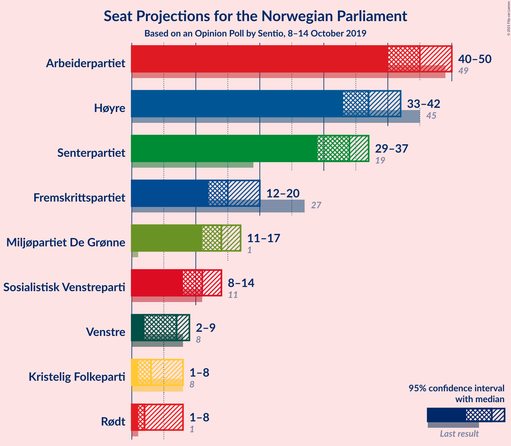
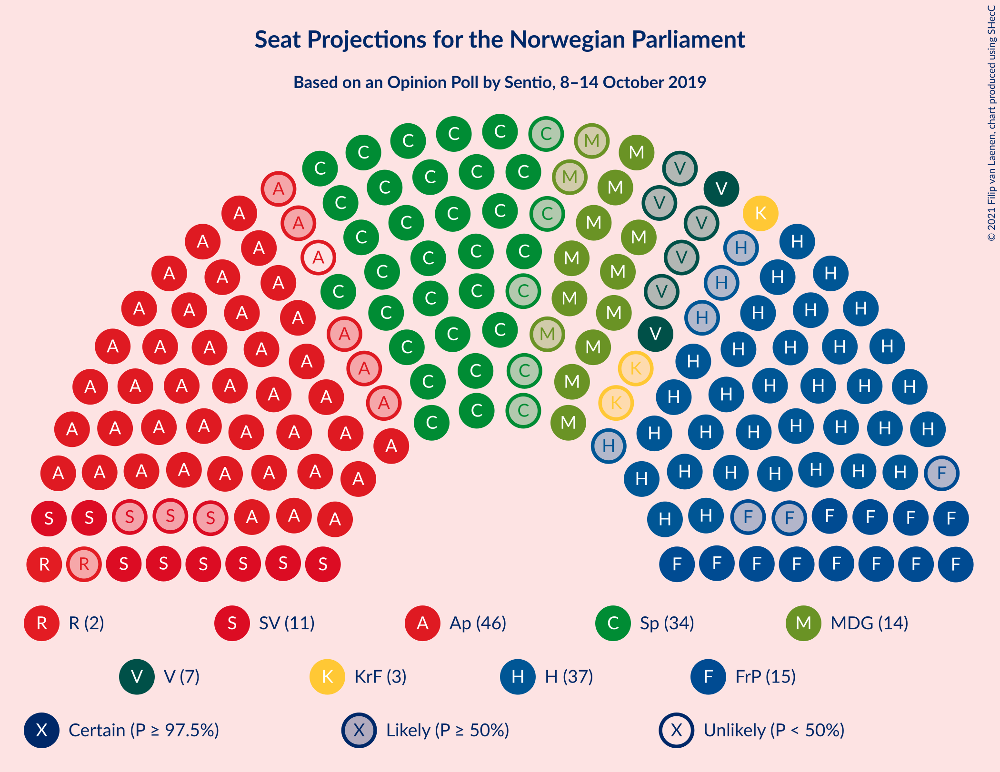
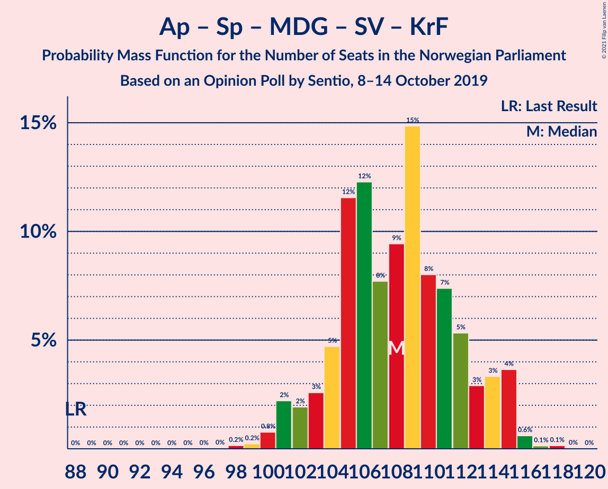
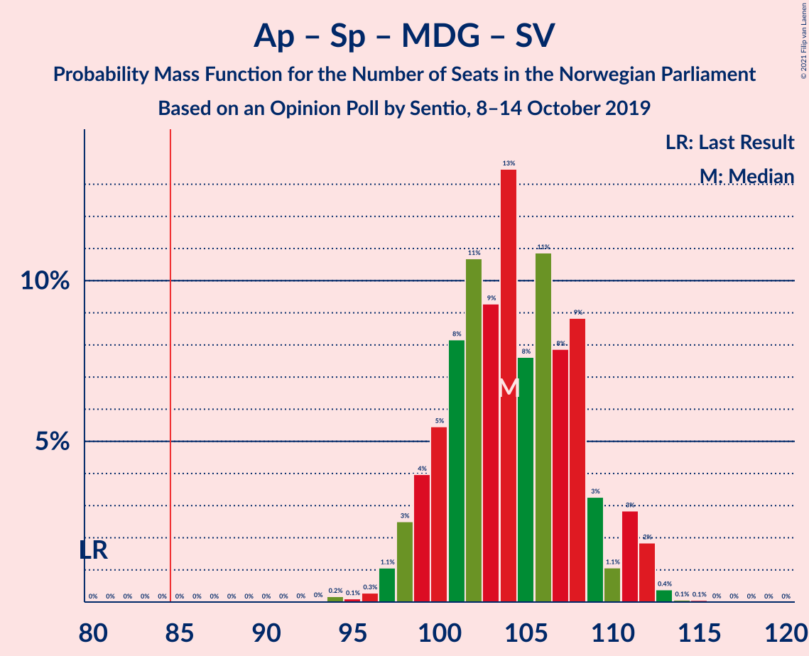
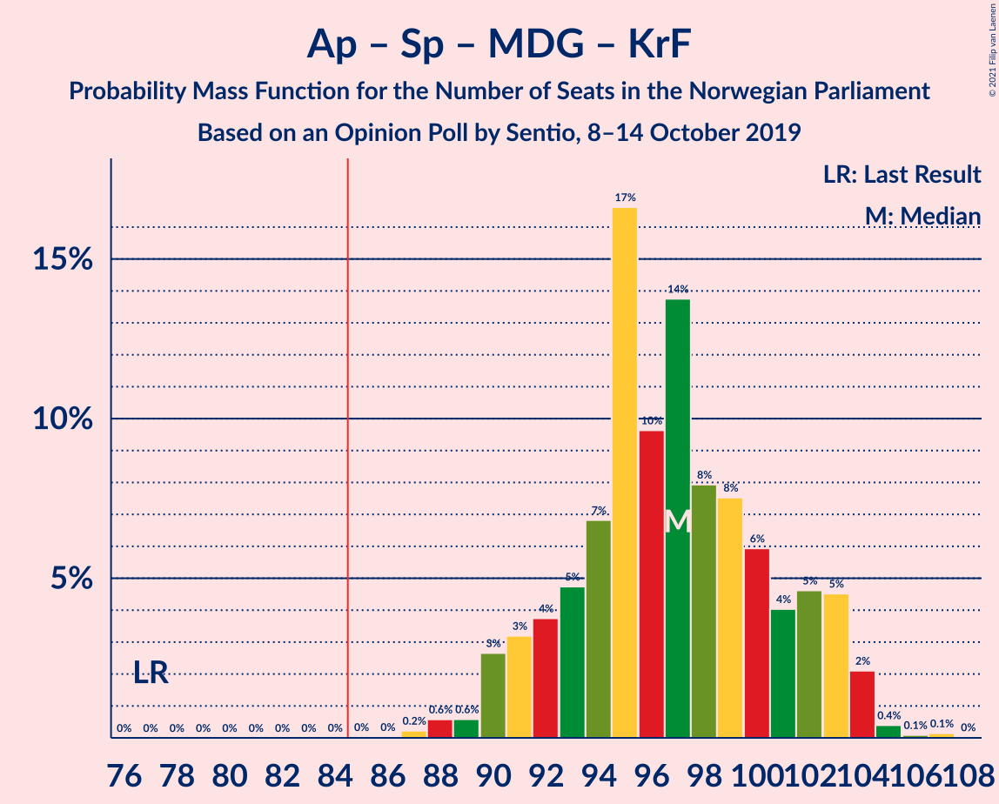
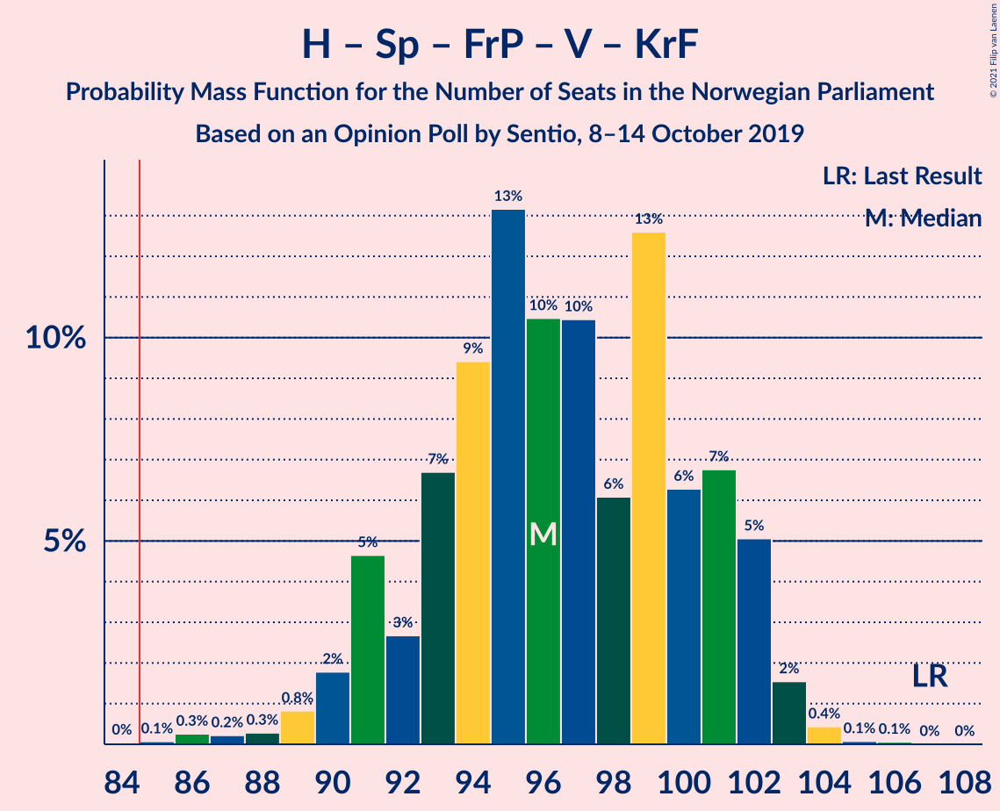
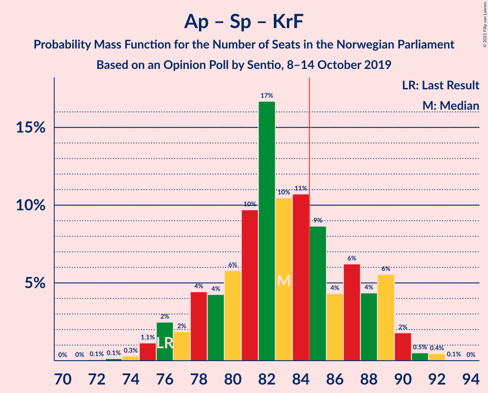
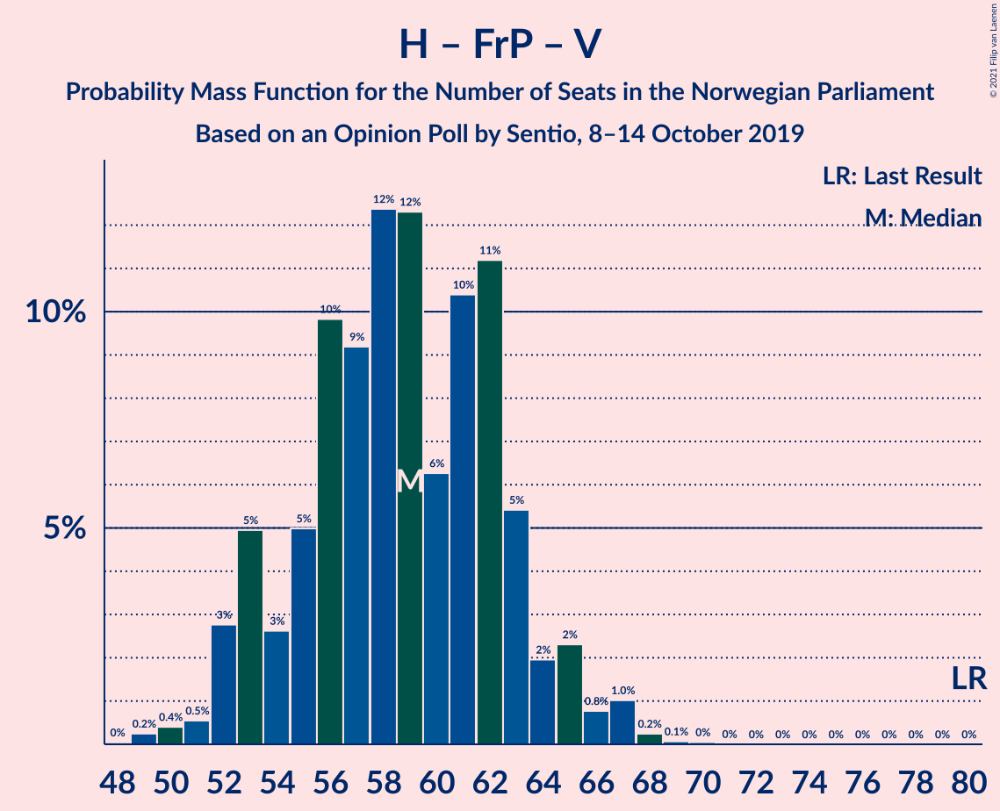
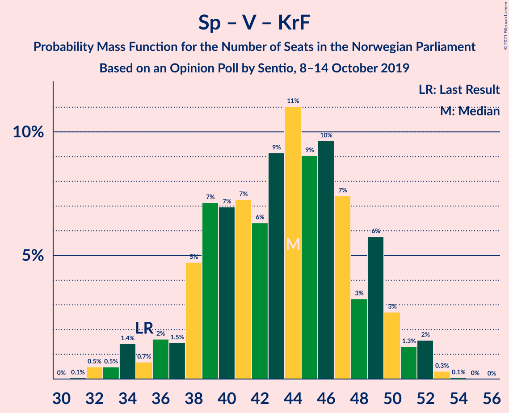

# Opinion Poll by Sentio, 8–14 October 2019

<a href="#voting-intentions">Voting Intentions</a> | <a href="#seats">Seats</a> | <a href="#coalitions">Coalitions</a> | <a href="#technical-information">Technical Information</a>

## Voting Intentions

### Confidence Intervals

| Party | Last Result | Poll Result | 80% Confidence Interval | 90% Confidence Interval | 95% Confidence Interval | 99% Confidence Interval |
|:-----:|:-----------:|:-----------:|:-----------------------:|:-----------------------:|:-----------------------:|:-----------------------:|
| Arbeiderpartiet | 27.4% | 24.9% | 23.2–26.7% |22.7–27.2% |22.3–27.7% |21.5–28.6% |
| Høyre | 25.0% | 20.9% | 19.3–22.6% |18.9–23.1% |18.5–23.5% |17.8–24.4% |
| Senterpartiet | 10.3% | 17.6% | 16.1–19.2% |15.7–19.7% |15.4–20.1% |14.7–20.9% |
| Fremskrittspartiet | 15.2% | 9.0% | 7.9–10.3% |7.6–10.6% |7.4–10.9% |6.9–11.6% |
| Miljøpartiet De Grønne | 3.2% | 7.7% | 6.7–8.9% |6.4–9.2% |6.2–9.5% |5.8–10.1% |
| Sosialistisk Venstreparti | 6.0% | 6.4% | 5.5–7.5% |5.3–7.8% |5.0–8.1% |4.6–8.7% |
| Venstre | 4.4% | 4.1% | 3.4–5.0% |3.2–5.3% |3.0–5.5% |2.7–6.0% |
| Kristelig Folkeparti | 4.2% | 3.6% | 2.9–4.5% |2.8–4.7% |2.6–5.0% |2.3–5.4% |
| Rødt | 2.4% | 3.2% | 2.6–4.0% |2.4–4.3% |2.3–4.5% |2.0–4.9% |

*Note:* The poll result column reflects the actual value used in the calculations. Published results may vary slightly, and in addition be rounded to fewer digits.

## Seats

### Confidence Intervals

| Party | Last Result | Median | 80% Confidence Interval | 90% Confidence Interval | 95% Confidence Interval | 99% Confidence Interval |
|:-----:|:-----------:|:------:|:-----------------------:|:-----------------------:|:-----------------------:|:-----------------------:|
| <a href="#arbeiderpartiet">Arbeiderpartiet</a> | 49 | 45 | 42–49 |41–49 |40–51 |38–54 |
| <a href="#høyre">Høyre</a> | 45 | 37 | 34–40 |33–41 |32–42 |31–45 |
| <a href="#senterpartiet">Senterpartiet</a> | 19 | 35 | 31–38 |30–38 |29–39 |28–40 |
| <a href="#fremskrittspartiet">Fremskrittspartiet</a> | 27 | 15 | 12–18 |12–20 |12–20 |11–21 |
| <a href="#miljøpartiet-de-grønne">Miljøpartiet De Grønne</a> | 1 | 14 | 11–16 |11–16 |10–16 |10–18 |
| <a href="#sosialistisk-venstreparti">Sosialistisk Venstreparti</a> | 11 | 11 | 9–13 |9–13 |9–14 |8–16 |
| <a href="#venstre">Venstre</a> | 8 | 7 | 2–9 |2–9 |2–10 |2–10 |
| <a href="#kristelig-folkeparti">Kristelig Folkeparti</a> | 8 | 3 | 1–8 |1–8 |1–8 |1–10 |
| <a href="#rødt">Rødt</a> | 1 | 2 | 1–6 |1–7 |1–8 |1–8 |

### Arbeiderpartiet

*For a full overview of the results for this party, see the [Arbeiderpartiet](party-arbeiderpartiet.html) page.*

| Number of Seats | Probability | Accumulated | Special Marks |
|:---------------:|:-----------:|:-----------:|:-------------:|
| 37 | 0.1% | 100% |  |
| 38 | 1.0% | 99.9% |  |
| 39 | 0.2% | 98.9% |  |
| 40 | 3% | 98.8% |  |
| 41 | 4% | 96% |  |
| 42 | 3% | 92% |  |
| 43 | 10% | 89% |  |
| 44 | 20% | 79% |  |
| 45 | 23% | 59% | Median |
| 46 | 13% | 35% |  |
| 47 | 3% | 23% |  |
| 48 | 2% | 20% |  |
| 49 | 14% | 18% | Last Result |
| 50 | 1.1% | 4% |  |
| 51 | 2% | 3% |  |
| 52 | 0.1% | 1.3% |  |
| 53 | 0.1% | 1.2% |  |
| 54 | 0.9% | 1.1% |  |
| 55 | 0.1% | 0.2% |  |
| 56 | 0% | 0.1% |  |
| 57 | 0% | 0% |  |

### Høyre

*For a full overview of the results for this party, see the [Høyre](party-høyre.html) page.*

| Number of Seats | Probability | Accumulated | Special Marks |
|:---------------:|:-----------:|:-----------:|:-------------:|
| 30 | 0.1% | 100% |  |
| 31 | 1.4% | 99.8% |  |
| 32 | 1.3% | 98% |  |
| 33 | 5% | 97% |  |
| 34 | 7% | 92% |  |
| 35 | 7% | 85% |  |
| 36 | 17% | 78% |  |
| 37 | 16% | 61% | Median |
| 38 | 8% | 45% |  |
| 39 | 13% | 37% |  |
| 40 | 17% | 24% |  |
| 41 | 4% | 7% |  |
| 42 | 0.9% | 3% |  |
| 43 | 0.6% | 2% |  |
| 44 | 1.0% | 2% |  |
| 45 | 0.7% | 0.7% | Last Result |
| 46 | 0% | 0% |  |

### Senterpartiet

*For a full overview of the results for this party, see the [Senterpartiet](party-senterpartiet.html) page.*

| Number of Seats | Probability | Accumulated | Special Marks |
|:---------------:|:-----------:|:-----------:|:-------------:|
| 19 | 0% | 100% | Last Result |
| 20 | 0% | 100% |  |
| 21 | 0% | 100% |  |
| 22 | 0% | 100% |  |
| 23 | 0% | 100% |  |
| 24 | 0% | 100% |  |
| 25 | 0.1% | 100% |  |
| 26 | 0.1% | 99.8% |  |
| 27 | 0.2% | 99.7% |  |
| 28 | 1.5% | 99.5% |  |
| 29 | 2% | 98% |  |
| 30 | 1.2% | 96% |  |
| 31 | 12% | 95% |  |
| 32 | 2% | 82% |  |
| 33 | 6% | 80% |  |
| 34 | 20% | 74% |  |
| 35 | 12% | 54% | Median |
| 36 | 11% | 42% |  |
| 37 | 6% | 31% |  |
| 38 | 22% | 25% |  |
| 39 | 2% | 3% |  |
| 40 | 0.6% | 0.9% |  |
| 41 | 0.3% | 0.3% |  |
| 42 | 0% | 0% |  |

### Fremskrittspartiet

*For a full overview of the results for this party, see the [Fremskrittspartiet](party-fremskrittspartiet.html) page.*

| Number of Seats | Probability | Accumulated | Special Marks |
|:---------------:|:-----------:|:-----------:|:-------------:|
| 11 | 2% | 100% |  |
| 12 | 8% | 98% |  |
| 13 | 6% | 90% |  |
| 14 | 16% | 84% |  |
| 15 | 24% | 68% | Median |
| 16 | 8% | 44% |  |
| 17 | 18% | 36% |  |
| 18 | 9% | 18% |  |
| 19 | 3% | 9% |  |
| 20 | 5% | 6% |  |
| 21 | 0.3% | 0.7% |  |
| 22 | 0.4% | 0.4% |  |
| 23 | 0% | 0% |  |
| 24 | 0% | 0% |  |
| 25 | 0% | 0% |  |
| 26 | 0% | 0% |  |
| 27 | 0% | 0% | Last Result |

### Miljøpartiet De Grønne

*For a full overview of the results for this party, see the [Miljøpartiet De Grønne](party-miljøpartietdegrønne.html) page.*

| Number of Seats | Probability | Accumulated | Special Marks |
|:---------------:|:-----------:|:-----------:|:-------------:|
| 1 | 0% | 100% | Last Result |
| 2 | 0% | 100% |  |
| 3 | 0% | 100% |  |
| 4 | 0% | 100% |  |
| 5 | 0% | 100% |  |
| 6 | 0% | 100% |  |
| 7 | 0% | 100% |  |
| 8 | 0% | 100% |  |
| 9 | 0.3% | 100% |  |
| 10 | 4% | 99.7% |  |
| 11 | 7% | 95% |  |
| 12 | 21% | 88% |  |
| 13 | 10% | 67% |  |
| 14 | 30% | 57% | Median |
| 15 | 6% | 27% |  |
| 16 | 19% | 20% |  |
| 17 | 0.6% | 2% |  |
| 18 | 0.9% | 1.0% |  |
| 19 | 0.1% | 0.2% |  |
| 20 | 0.1% | 0.1% |  |
| 21 | 0% | 0% |  |

### Sosialistisk Venstreparti

*For a full overview of the results for this party, see the [Sosialistisk Venstreparti](party-sosialistiskvenstreparti.html) page.*

| Number of Seats | Probability | Accumulated | Special Marks |
|:---------------:|:-----------:|:-----------:|:-------------:|
| 7 | 0.1% | 100% |  |
| 8 | 2% | 99.9% |  |
| 9 | 13% | 98% |  |
| 10 | 31% | 85% |  |
| 11 | 14% | 53% | Last Result, Median |
| 12 | 25% | 39% |  |
| 13 | 10% | 14% |  |
| 14 | 2% | 4% |  |
| 15 | 0.6% | 1.2% |  |
| 16 | 0.5% | 0.6% |  |
| 17 | 0.1% | 0.1% |  |
| 18 | 0% | 0% |  |

### Venstre

*For a full overview of the results for this party, see the [Venstre](party-venstre.html) page.*

| Number of Seats | Probability | Accumulated | Special Marks |
|:---------------:|:-----------:|:-----------:|:-------------:|
| 1 | 0.3% | 100% |  |
| 2 | 41% | 99.7% |  |
| 3 | 3% | 58% |  |
| 4 | 0% | 55% |  |
| 5 | 0% | 55% |  |
| 6 | 4% | 55% |  |
| 7 | 20% | 51% | Median |
| 8 | 21% | 31% | Last Result |
| 9 | 8% | 11% |  |
| 10 | 2% | 3% |  |
| 11 | 0.2% | 0.2% |  |
| 12 | 0% | 0% |  |

### Kristelig Folkeparti

*For a full overview of the results for this party, see the [Kristelig Folkeparti](party-kristeligfolkeparti.html) page.*

| Number of Seats | Probability | Accumulated | Special Marks |
|:---------------:|:-----------:|:-----------:|:-------------:|
| 0 | 0.4% | 100% |  |
| 1 | 11% | 99.6% |  |
| 2 | 19% | 89% |  |
| 3 | 36% | 71% | Median |
| 4 | 0% | 35% |  |
| 5 | 0% | 35% |  |
| 6 | 3% | 35% |  |
| 7 | 21% | 31% |  |
| 8 | 8% | 10% | Last Result |
| 9 | 1.0% | 2% |  |
| 10 | 0.8% | 0.9% |  |
| 11 | 0% | 0% |  |

### Rødt

*For a full overview of the results for this party, see the [Rødt](party-rødt.html) page.*

| Number of Seats | Probability | Accumulated | Special Marks |
|:---------------:|:-----------:|:-----------:|:-------------:|
| 1 | 43% | 100% | Last Result |
| 2 | 45% | 57% | Median |
| 3 | 0% | 12% |  |
| 4 | 0% | 12% |  |
| 5 | 0% | 12% |  |
| 6 | 3% | 12% |  |
| 7 | 4% | 9% |  |
| 8 | 4% | 4% |  |
| 9 | 0.2% | 0.3% |  |
| 10 | 0.1% | 0.1% |  |
| 11 | 0% | 0% |  |

## Coalitions

### Confidence Intervals

| Coalition | Last Result | Median | Majority? | 80% Confidence Interval | 90% Confidence Interval | 95% Confidence Interval | 99% Confidence Interval |
|:---------:|:-----------:|:------:|:---------:|:-----------------------:|:-----------------------:|:-----------------------:|:-----------------------:|
| Arbeiderpartiet – Senterpartiet – Miljøpartiet De Grønne – Sosialistisk Venstreparti – Kristelig Folkeparti | 88 | 108 | 100% | 104–115 | 103–116 | 101–117 | 100–120 |
| Arbeiderpartiet – Senterpartiet – Miljøpartiet De Grønne – Sosialistisk Venstreparti – Rødt | 81 | 107 | 100% | 103–111 | 101–112 | 100–113 | 98–115 |
| Arbeiderpartiet – Senterpartiet – Miljøpartiet De Grønne – Sosialistisk Venstreparti | 80 | 104 | 100% | 101–109 | 99–110 | 98–112 | 97–113 |
| Arbeiderpartiet – Senterpartiet – Miljøpartiet De Grønne – Kristelig Folkeparti | 77 | 97 | 100% | 94–103 | 93–104 | 90–106 | 88–109 |
| Høyre – Senterpartiet – Fremskrittspartiet – Venstre – Kristelig Folkeparti | 107 | 97 | 99.9% | 94–101 | 92–102 | 90–103 | 87–104 |
| Arbeiderpartiet – Senterpartiet – Sosialistisk Venstreparti – Rødt | 80 | 93 | 99.8% | 89–98 | 87–99 | 87–100 | 85–103 |
| Arbeiderpartiet – Senterpartiet – Sosialistisk Venstreparti | 79 | 91 | 98.9% | 87–96 | 86–97 | 85–98 | 83–99 |
| Arbeiderpartiet – Senterpartiet – Kristelig Folkeparti | 76 | 84 | 35% | 80–91 | 78–91 | 77–94 | 75–94 |
| Arbeiderpartiet – Senterpartiet | 68 | 80 | 7% | 76–84 | 75–86 | 73–87 | 72–87 |
| Høyre – Fremskrittspartiet – Miljøpartiet De Grønne – Venstre – Kristelig Folkeparti | 89 | 76 | 0.2% | 71–80 | 70–82 | 69–82 | 66–84 |
| Høyre – Fremskrittspartiet – Venstre – Kristelig Folkeparti | 88 | 62 | 0% | 58–66 | 57–68 | 56–69 | 53–71 |
| Høyre – Fremskrittspartiet – Venstre | 80 | 58 | 0% | 52–62 | 51–64 | 51–65 | 47–67 |
| Arbeiderpartiet – Sosialistisk Venstreparti | 60 | 56 | 0% | 53–59 | 52–60 | 51–61 | 49–67 |
| Høyre – Fremskrittspartiet | 72 | 54 | 0% | 48–56 | 48–58 | 47–59 | 45–63 |
| Høyre – Venstre – Kristelig Folkeparti | 61 | 47 | 0% | 42–51 | 40–52 | 40–53 | 38–54 |
| Senterpartiet – Venstre – Kristelig Folkeparti | 35 | 45 | 0% | 39–50 | 38–52 | 37–52 | 34–52 |

### Arbeiderpartiet – Senterpartiet – Miljøpartiet De Grønne – Sosialistisk Venstreparti – Kristelig Folkeparti

| Number of Seats | Probability | Accumulated | Special Marks |
|:---------------:|:-----------:|:-----------:|:-------------:|
| 88 | 0% | 100% | Last Result |
| 89 | 0% | 100% |  |
| 90 | 0% | 100% |  |
| 91 | 0% | 100% |  |
| 92 | 0% | 100% |  |
| 93 | 0% | 100% |  |
| 94 | 0% | 100% |  |
| 95 | 0% | 100% |  |
| 96 | 0% | 100% |  |
| 97 | 0% | 100% |  |
| 98 | 0% | 99.9% |  |
| 99 | 0.3% | 99.9% |  |
| 100 | 1.0% | 99.6% |  |
| 101 | 2% | 98.6% |  |
| 102 | 1.0% | 96% |  |
| 103 | 2% | 95% |  |
| 104 | 6% | 94% |  |
| 105 | 5% | 88% |  |
| 106 | 23% | 84% |  |
| 107 | 3% | 61% |  |
| 108 | 12% | 58% | Median |
| 109 | 8% | 46% |  |
| 110 | 13% | 38% |  |
| 111 | 3% | 25% |  |
| 112 | 8% | 23% |  |
| 113 | 2% | 15% |  |
| 114 | 2% | 13% |  |
| 115 | 1.5% | 11% |  |
| 116 | 6% | 10% |  |
| 117 | 3% | 4% |  |
| 118 | 0.1% | 0.8% |  |
| 119 | 0.1% | 0.8% |  |
| 120 | 0.7% | 0.7% |  |
| 121 | 0% | 0% |  |

### Arbeiderpartiet – Senterpartiet – Miljøpartiet De Grønne – Sosialistisk Venstreparti – Rødt

| Number of Seats | Probability | Accumulated | Special Marks |
|:---------------:|:-----------:|:-----------:|:-------------:|
| 81 | 0% | 100% | Last Result |
| 82 | 0% | 100% |  |
| 83 | 0% | 100% |  |
| 84 | 0% | 100% |  |
| 85 | 0% | 100% | Majority |
| 86 | 0% | 100% |  |
| 87 | 0% | 100% |  |
| 88 | 0% | 100% |  |
| 89 | 0% | 100% |  |
| 90 | 0% | 100% |  |
| 91 | 0% | 100% |  |
| 92 | 0% | 100% |  |
| 93 | 0% | 100% |  |
| 94 | 0% | 100% |  |
| 95 | 0% | 100% |  |
| 96 | 0% | 100% |  |
| 97 | 0% | 99.9% |  |
| 98 | 1.0% | 99.9% |  |
| 99 | 0.8% | 98.9% |  |
| 100 | 2% | 98% |  |
| 101 | 1.4% | 96% |  |
| 102 | 3% | 95% |  |
| 103 | 8% | 92% |  |
| 104 | 4% | 84% |  |
| 105 | 26% | 80% |  |
| 106 | 4% | 55% |  |
| 107 | 11% | 51% | Median |
| 108 | 6% | 40% |  |
| 109 | 14% | 34% |  |
| 110 | 8% | 20% |  |
| 111 | 6% | 12% |  |
| 112 | 2% | 6% |  |
| 113 | 2% | 4% |  |
| 114 | 0.4% | 2% |  |
| 115 | 1.1% | 2% |  |
| 116 | 0.4% | 0.5% |  |
| 117 | 0% | 0.1% |  |
| 118 | 0% | 0% |  |

### Arbeiderpartiet – Senterpartiet – Miljøpartiet De Grønne – Sosialistisk Venstreparti

| Number of Seats | Probability | Accumulated | Special Marks |
|:---------------:|:-----------:|:-----------:|:-------------:|
| 80 | 0% | 100% | Last Result |
| 81 | 0% | 100% |  |
| 82 | 0% | 100% |  |
| 83 | 0% | 100% |  |
| 84 | 0% | 100% |  |
| 85 | 0% | 100% | Majority |
| 86 | 0% | 100% |  |
| 87 | 0% | 100% |  |
| 88 | 0% | 100% |  |
| 89 | 0% | 100% |  |
| 90 | 0% | 100% |  |
| 91 | 0% | 100% |  |
| 92 | 0% | 100% |  |
| 93 | 0% | 100% |  |
| 94 | 0% | 100% |  |
| 95 | 0.1% | 99.9% |  |
| 96 | 0.1% | 99.8% |  |
| 97 | 2% | 99.7% |  |
| 98 | 3% | 98% |  |
| 99 | 3% | 95% |  |
| 100 | 2% | 92% |  |
| 101 | 10% | 90% |  |
| 102 | 6% | 80% |  |
| 103 | 10% | 74% |  |
| 104 | 17% | 65% |  |
| 105 | 14% | 48% | Median |
| 106 | 4% | 34% |  |
| 107 | 13% | 30% |  |
| 108 | 2% | 17% |  |
| 109 | 7% | 15% |  |
| 110 | 4% | 8% |  |
| 111 | 1.1% | 4% |  |
| 112 | 2% | 3% |  |
| 113 | 1.0% | 1.0% |  |
| 114 | 0% | 0.1% |  |
| 115 | 0% | 0% |  |

### Arbeiderpartiet – Senterpartiet – Miljøpartiet De Grønne – Kristelig Folkeparti

| Number of Seats | Probability | Accumulated | Special Marks |
|:---------------:|:-----------:|:-----------:|:-------------:|
| 77 | 0% | 100% | Last Result |
| 78 | 0% | 100% |  |
| 79 | 0% | 100% |  |
| 80 | 0% | 100% |  |
| 81 | 0% | 100% |  |
| 82 | 0% | 100% |  |
| 83 | 0% | 100% |  |
| 84 | 0% | 100% |  |
| 85 | 0% | 100% | Majority |
| 86 | 0% | 100% |  |
| 87 | 0.1% | 99.9% |  |
| 88 | 2% | 99.9% |  |
| 89 | 0.3% | 98% |  |
| 90 | 1.0% | 98% |  |
| 91 | 0.6% | 97% |  |
| 92 | 1.1% | 96% |  |
| 93 | 4% | 95% |  |
| 94 | 11% | 92% |  |
| 95 | 3% | 80% |  |
| 96 | 22% | 77% |  |
| 97 | 6% | 55% | Median |
| 98 | 18% | 49% |  |
| 99 | 7% | 31% |  |
| 100 | 2% | 23% |  |
| 101 | 2% | 21% |  |
| 102 | 0.9% | 19% |  |
| 103 | 11% | 18% |  |
| 104 | 3% | 7% |  |
| 105 | 0.3% | 4% |  |
| 106 | 3% | 4% |  |
| 107 | 0% | 0.8% |  |
| 108 | 0.1% | 0.8% |  |
| 109 | 0.7% | 0.7% |  |
| 110 | 0% | 0% |  |

### Høyre – Senterpartiet – Fremskrittspartiet – Venstre – Kristelig Folkeparti

| Number of Seats | Probability | Accumulated | Special Marks |
|:---------------:|:-----------:|:-----------:|:-------------:|
| 84 | 0.1% | 100% |  |
| 85 | 0% | 99.9% | Majority |
| 86 | 0% | 99.9% |  |
| 87 | 1.1% | 99.9% |  |
| 88 | 0.1% | 98.8% |  |
| 89 | 0.6% | 98.7% |  |
| 90 | 1.2% | 98% |  |
| 91 | 2% | 97% |  |
| 92 | 2% | 95% |  |
| 93 | 1.1% | 93% |  |
| 94 | 16% | 92% |  |
| 95 | 15% | 77% |  |
| 96 | 6% | 62% |  |
| 97 | 10% | 56% | Median |
| 98 | 11% | 45% |  |
| 99 | 5% | 34% |  |
| 100 | 17% | 29% |  |
| 101 | 6% | 12% |  |
| 102 | 3% | 6% |  |
| 103 | 2% | 3% |  |
| 104 | 1.1% | 1.5% |  |
| 105 | 0.3% | 0.4% |  |
| 106 | 0% | 0.1% |  |
| 107 | 0% | 0% | Last Result |

### Arbeiderpartiet – Senterpartiet – Sosialistisk Venstreparti – Rødt

| Number of Seats | Probability | Accumulated | Special Marks |
|:---------------:|:-----------:|:-----------:|:-------------:|
| 80 | 0% | 100% | Last Result |
| 81 | 0% | 100% |  |
| 82 | 0% | 100% |  |
| 83 | 0% | 100% |  |
| 84 | 0.1% | 99.9% |  |
| 85 | 0.4% | 99.8% | Majority |
| 86 | 0.4% | 99.4% |  |
| 87 | 5% | 99.0% |  |
| 88 | 2% | 94% |  |
| 89 | 2% | 92% |  |
| 90 | 6% | 90% |  |
| 91 | 20% | 84% |  |
| 92 | 6% | 64% |  |
| 93 | 19% | 57% | Median |
| 94 | 3% | 38% |  |
| 95 | 11% | 34% |  |
| 96 | 8% | 23% |  |
| 97 | 5% | 15% |  |
| 98 | 3% | 10% |  |
| 99 | 4% | 8% |  |
| 100 | 2% | 3% |  |
| 101 | 0.8% | 2% |  |
| 102 | 0.2% | 0.8% |  |
| 103 | 0.4% | 0.6% |  |
| 104 | 0.1% | 0.1% |  |
| 105 | 0.1% | 0.1% |  |
| 106 | 0% | 0% |  |

### Arbeiderpartiet – Senterpartiet – Sosialistisk Venstreparti

| Number of Seats | Probability | Accumulated | Special Marks |
|:---------------:|:-----------:|:-----------:|:-------------:|
| 79 | 0% | 100% | Last Result |
| 80 | 0% | 100% |  |
| 81 | 0% | 100% |  |
| 82 | 0% | 99.9% |  |
| 83 | 0.6% | 99.9% |  |
| 84 | 0.3% | 99.3% |  |
| 85 | 3% | 98.9% | Majority |
| 86 | 5% | 96% |  |
| 87 | 4% | 91% |  |
| 88 | 7% | 87% |  |
| 89 | 7% | 80% |  |
| 90 | 22% | 73% |  |
| 91 | 20% | 51% | Median |
| 92 | 3% | 31% |  |
| 93 | 7% | 28% |  |
| 94 | 3% | 21% |  |
| 95 | 7% | 18% |  |
| 96 | 5% | 11% |  |
| 97 | 2% | 6% |  |
| 98 | 4% | 5% |  |
| 99 | 0.3% | 0.7% |  |
| 100 | 0.2% | 0.3% |  |
| 101 | 0.1% | 0.2% |  |
| 102 | 0% | 0% |  |

### Arbeiderpartiet – Senterpartiet – Kristelig Folkeparti

| Number of Seats | Probability | Accumulated | Special Marks |
|:---------------:|:-----------:|:-----------:|:-------------:|
| 73 | 0.1% | 100% |  |
| 74 | 0.2% | 99.8% |  |
| 75 | 2% | 99.6% |  |
| 76 | 0.2% | 98% | Last Result |
| 77 | 0.9% | 98% |  |
| 78 | 3% | 97% |  |
| 79 | 1.5% | 94% |  |
| 80 | 8% | 92% |  |
| 81 | 3% | 84% |  |
| 82 | 23% | 80% |  |
| 83 | 7% | 57% | Median |
| 84 | 15% | 50% |  |
| 85 | 7% | 35% | Majority |
| 86 | 5% | 28% |  |
| 87 | 2% | 23% |  |
| 88 | 3% | 22% |  |
| 89 | 7% | 18% |  |
| 90 | 1.5% | 12% |  |
| 91 | 6% | 10% |  |
| 92 | 0.1% | 4% |  |
| 93 | 0.8% | 4% |  |
| 94 | 3% | 3% |  |
| 95 | 0% | 0% |  |

### Arbeiderpartiet – Senterpartiet

| Number of Seats | Probability | Accumulated | Special Marks |
|:---------------:|:-----------:|:-----------:|:-------------:|
| 68 | 0% | 100% | Last Result |
| 69 | 0% | 100% |  |
| 70 | 0% | 100% |  |
| 71 | 0.2% | 99.9% |  |
| 72 | 2% | 99.7% |  |
| 73 | 0.9% | 98% |  |
| 74 | 0.5% | 97% |  |
| 75 | 2% | 97% |  |
| 76 | 7% | 95% |  |
| 77 | 6% | 87% |  |
| 78 | 10% | 81% |  |
| 79 | 16% | 71% |  |
| 80 | 17% | 55% | Median |
| 81 | 8% | 38% |  |
| 82 | 10% | 29% |  |
| 83 | 3% | 20% |  |
| 84 | 10% | 17% |  |
| 85 | 2% | 7% | Majority |
| 86 | 1.1% | 5% |  |
| 87 | 4% | 4% |  |
| 88 | 0.1% | 0.3% |  |
| 89 | 0% | 0.2% |  |
| 90 | 0.1% | 0.2% |  |
| 91 | 0% | 0% |  |

### Høyre – Fremskrittspartiet – Miljøpartiet De Grønne – Venstre – Kristelig Folkeparti

| Number of Seats | Probability | Accumulated | Special Marks |
|:---------------:|:-----------:|:-----------:|:-------------:|
| 64 | 0.3% | 100% |  |
| 65 | 0.1% | 99.7% |  |
| 66 | 0.4% | 99.6% |  |
| 67 | 0.2% | 99.2% |  |
| 68 | 0.8% | 99.0% |  |
| 69 | 2% | 98% |  |
| 70 | 6% | 96% |  |
| 71 | 3% | 91% |  |
| 72 | 5% | 88% |  |
| 73 | 8% | 83% |  |
| 74 | 11% | 75% |  |
| 75 | 3% | 64% |  |
| 76 | 19% | 61% | Median |
| 77 | 6% | 42% |  |
| 78 | 20% | 36% |  |
| 79 | 6% | 16% |  |
| 80 | 2% | 10% |  |
| 81 | 2% | 8% |  |
| 82 | 5% | 6% |  |
| 83 | 0.4% | 0.9% |  |
| 84 | 0.4% | 0.5% |  |
| 85 | 0.1% | 0.2% | Majority |
| 86 | 0% | 0.1% |  |
| 87 | 0% | 0% |  |
| 88 | 0% | 0% |  |
| 89 | 0% | 0% | Last Result |

### Høyre – Fremskrittspartiet – Venstre – Kristelig Folkeparti

| Number of Seats | Probability | Accumulated | Special Marks |
|:---------------:|:-----------:|:-----------:|:-------------:|
| 52 | 0.1% | 100% |  |
| 53 | 0.4% | 99.8% |  |
| 54 | 1.1% | 99.4% |  |
| 55 | 0.5% | 98% |  |
| 56 | 2% | 98% |  |
| 57 | 3% | 95% |  |
| 58 | 6% | 93% |  |
| 59 | 8% | 87% |  |
| 60 | 15% | 79% |  |
| 61 | 6% | 64% |  |
| 62 | 11% | 59% | Median |
| 63 | 4% | 47% |  |
| 64 | 25% | 44% |  |
| 65 | 4% | 18% |  |
| 66 | 7% | 15% |  |
| 67 | 3% | 8% |  |
| 68 | 1.4% | 5% |  |
| 69 | 2% | 4% |  |
| 70 | 0.7% | 2% |  |
| 71 | 1.0% | 1.1% |  |
| 72 | 0% | 0.1% |  |
| 73 | 0% | 0.1% |  |
| 74 | 0% | 0% |  |
| 75 | 0% | 0% |  |
| 76 | 0% | 0% |  |
| 77 | 0% | 0% |  |
| 78 | 0% | 0% |  |
| 79 | 0% | 0% |  |
| 80 | 0% | 0% |  |
| 81 | 0% | 0% |  |
| 82 | 0% | 0% |  |
| 83 | 0% | 0% |  |
| 84 | 0% | 0% |  |
| 85 | 0% | 0% | Majority |
| 86 | 0% | 0% |  |
| 87 | 0% | 0% |  |
| 88 | 0% | 0% | Last Result |

### Høyre – Fremskrittspartiet – Venstre

| Number of Seats | Probability | Accumulated | Special Marks |
|:---------------:|:-----------:|:-----------:|:-------------:|
| 47 | 0.7% | 100% |  |
| 48 | 0% | 99.2% |  |
| 49 | 0.3% | 99.2% |  |
| 50 | 0.4% | 98.9% |  |
| 51 | 4% | 98.6% |  |
| 52 | 6% | 95% |  |
| 53 | 2% | 89% |  |
| 54 | 4% | 86% |  |
| 55 | 9% | 82% |  |
| 56 | 3% | 73% |  |
| 57 | 14% | 70% |  |
| 58 | 12% | 56% |  |
| 59 | 5% | 44% | Median |
| 60 | 6% | 39% |  |
| 61 | 8% | 33% |  |
| 62 | 16% | 25% |  |
| 63 | 4% | 9% |  |
| 64 | 1.1% | 5% |  |
| 65 | 2% | 4% |  |
| 66 | 2% | 2% |  |
| 67 | 0.6% | 0.7% |  |
| 68 | 0% | 0.1% |  |
| 69 | 0% | 0.1% |  |
| 70 | 0% | 0% |  |
| 71 | 0% | 0% |  |
| 72 | 0% | 0% |  |
| 73 | 0% | 0% |  |
| 74 | 0% | 0% |  |
| 75 | 0% | 0% |  |
| 76 | 0% | 0% |  |
| 77 | 0% | 0% |  |
| 78 | 0% | 0% |  |
| 79 | 0% | 0% |  |
| 80 | 0% | 0% | Last Result |

### Arbeiderpartiet – Sosialistisk Venstreparti

| Number of Seats | Probability | Accumulated | Special Marks |
|:---------------:|:-----------:|:-----------:|:-------------:|
| 48 | 0.1% | 100% |  |
| 49 | 1.0% | 99.9% |  |
| 50 | 0.4% | 98.9% |  |
| 51 | 3% | 98% |  |
| 52 | 1.4% | 95% |  |
| 53 | 14% | 94% |  |
| 54 | 8% | 80% |  |
| 55 | 16% | 72% |  |
| 56 | 10% | 56% | Median |
| 57 | 18% | 47% |  |
| 58 | 7% | 28% |  |
| 59 | 13% | 21% |  |
| 60 | 4% | 9% | Last Result |
| 61 | 2% | 5% |  |
| 62 | 0.8% | 2% |  |
| 63 | 0.5% | 2% |  |
| 64 | 0% | 1.1% |  |
| 65 | 0.1% | 1.1% |  |
| 66 | 0% | 1.0% |  |
| 67 | 0.9% | 1.0% |  |
| 68 | 0% | 0.1% |  |
| 69 | 0.1% | 0.1% |  |
| 70 | 0% | 0% |  |

### Høyre – Fremskrittspartiet

| Number of Seats | Probability | Accumulated | Special Marks |
|:---------------:|:-----------:|:-----------:|:-------------:|
| 45 | 1.3% | 100% |  |
| 46 | 0.7% | 98.7% |  |
| 47 | 0.8% | 98% |  |
| 48 | 12% | 97% |  |
| 49 | 4% | 86% |  |
| 50 | 8% | 82% |  |
| 51 | 7% | 74% |  |
| 52 | 6% | 67% | Median |
| 53 | 6% | 62% |  |
| 54 | 23% | 55% |  |
| 55 | 17% | 32% |  |
| 56 | 7% | 15% |  |
| 57 | 3% | 8% |  |
| 58 | 2% | 5% |  |
| 59 | 0.7% | 3% |  |
| 60 | 0.2% | 2% |  |
| 61 | 1.2% | 2% |  |
| 62 | 0% | 0.8% |  |
| 63 | 0.7% | 0.7% |  |
| 64 | 0% | 0% |  |
| 65 | 0% | 0% |  |
| 66 | 0% | 0% |  |
| 67 | 0% | 0% |  |
| 68 | 0% | 0% |  |
| 69 | 0% | 0% |  |
| 70 | 0% | 0% |  |
| 71 | 0% | 0% |  |
| 72 | 0% | 0% | Last Result |

### Høyre – Venstre – Kristelig Folkeparti

| Number of Seats | Probability | Accumulated | Special Marks |
|:---------------:|:-----------:|:-----------:|:-------------:|
| 36 | 0.1% | 100% |  |
| 37 | 0.2% | 99.9% |  |
| 38 | 0.5% | 99.7% |  |
| 39 | 1.1% | 99.2% |  |
| 40 | 4% | 98% |  |
| 41 | 2% | 94% |  |
| 42 | 3% | 93% |  |
| 43 | 4% | 90% |  |
| 44 | 12% | 86% |  |
| 45 | 18% | 73% |  |
| 46 | 5% | 56% |  |
| 47 | 13% | 50% | Median |
| 48 | 5% | 38% |  |
| 49 | 5% | 32% |  |
| 50 | 14% | 28% |  |
| 51 | 7% | 13% |  |
| 52 | 3% | 6% |  |
| 53 | 2% | 3% |  |
| 54 | 1.1% | 1.3% |  |
| 55 | 0% | 0.3% |  |
| 56 | 0.1% | 0.2% |  |
| 57 | 0% | 0.1% |  |
| 58 | 0% | 0.1% |  |
| 59 | 0% | 0% |  |
| 60 | 0% | 0% |  |
| 61 | 0% | 0% | Last Result |

### Senterpartiet – Venstre – Kristelig Folkeparti

| Number of Seats | Probability | Accumulated | Special Marks |
|:---------------:|:-----------:|:-----------:|:-------------:|
| 31 | 0% | 100% |  |
| 32 | 0.4% | 99.9% |  |
| 33 | 0% | 99.6% |  |
| 34 | 0.9% | 99.5% |  |
| 35 | 0.5% | 98.6% | Last Result |
| 36 | 0.1% | 98% |  |
| 37 | 2% | 98% |  |
| 38 | 2% | 96% |  |
| 39 | 13% | 94% |  |
| 40 | 6% | 81% |  |
| 41 | 13% | 75% |  |
| 42 | 2% | 62% |  |
| 43 | 5% | 60% |  |
| 44 | 6% | 56% |  |
| 45 | 7% | 50% | Median |
| 46 | 11% | 43% |  |
| 47 | 8% | 32% |  |
| 48 | 7% | 24% |  |
| 49 | 7% | 17% |  |
| 50 | 2% | 10% |  |
| 51 | 2% | 8% |  |
| 52 | 6% | 6% |  |
| 53 | 0.2% | 0.4% |  |
| 54 | 0.1% | 0.2% |  |
| 55 | 0.1% | 0.1% |  |
| 56 | 0% | 0% |  |

## Technical Information

### Opinion Poll

+ **Polling firm:** Sentio
+ **Commissioner(s):** —
+ **Fieldwork period:** 8–14 October 2019

### Calculations

+ **Sample size:** 1000
+ **Simulations done:** 131,072
+ **Error estimate:** 5.04%

