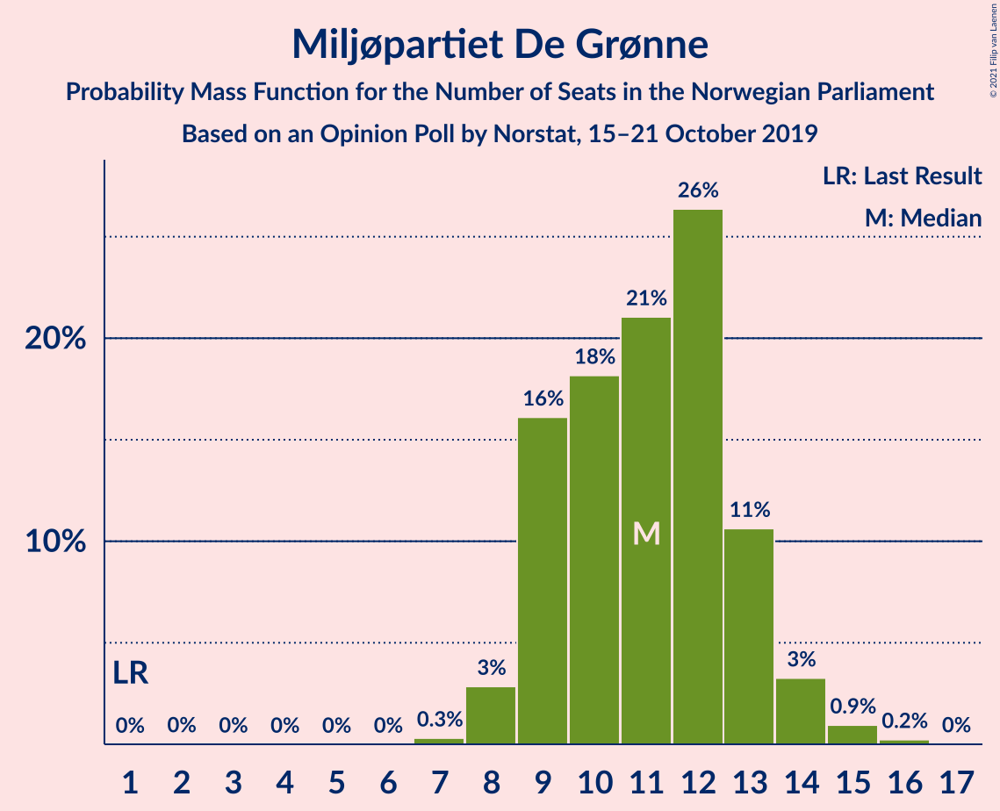
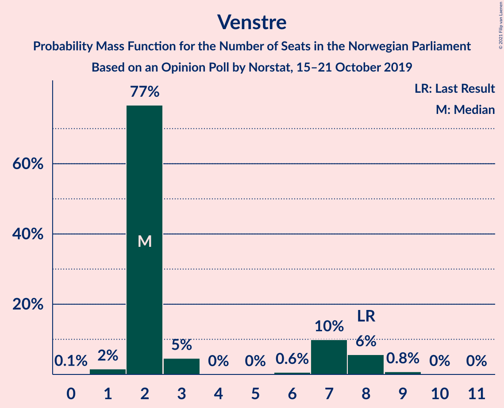
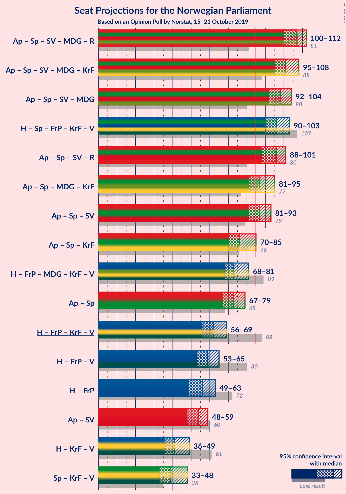
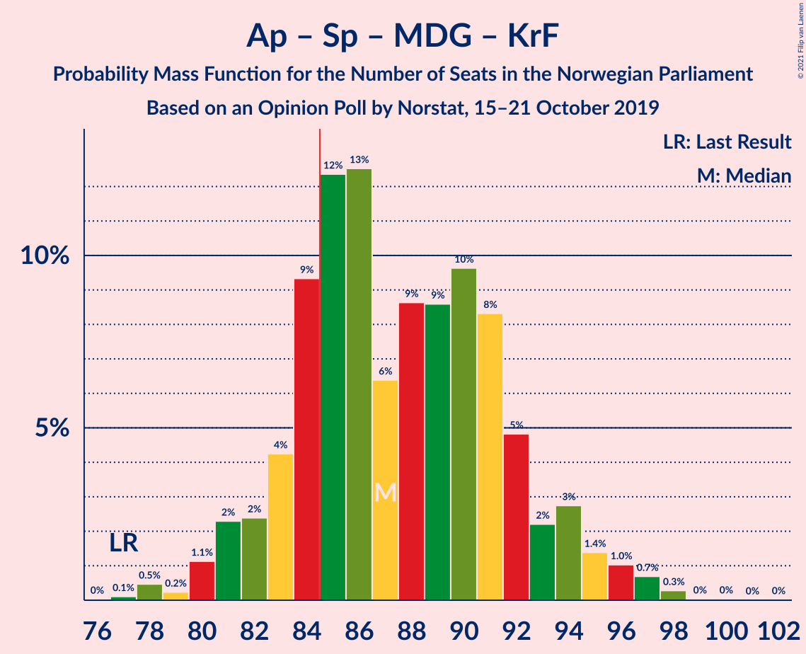
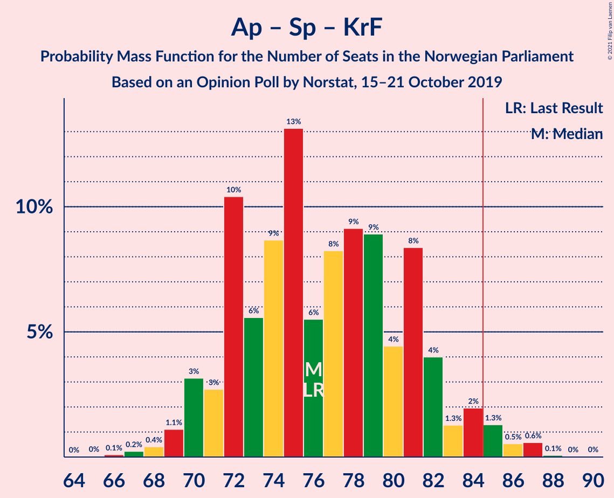
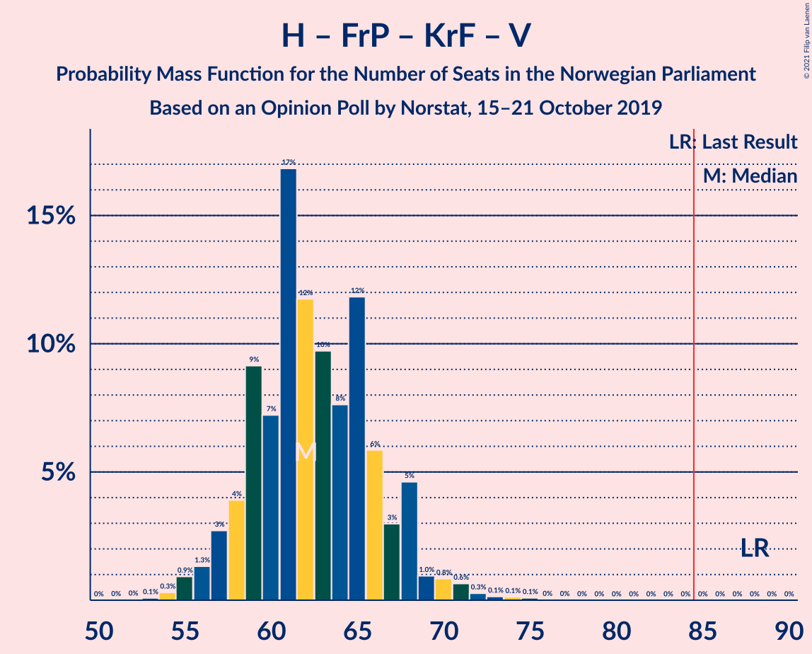

# Opinion Poll by Norstat, 15–21 October 2019

<a href="#voting-intentions">Voting Intentions</a> | <a href="#seats">Seats</a> | <a href="#coalitions">Coalitions</a> | <a href="#technical-information">Technical Information</a>

## Voting Intentions

### Confidence Intervals

| Party | Last Result | Poll Result | 80% Confidence Interval | 90% Confidence Interval | 95% Confidence Interval | 99% Confidence Interval |
|:-----:|:-----------:|:-----------:|:-----------------------:|:-----------------------:|:-----------------------:|:-----------------------:|
| Arbeiderpartiet | 27.4% | 21.6% | 20.0–23.4% |19.5–24.0% |19.1–24.4% |18.3–25.3% |
| Høyre | 25.0% | 20.1% | 18.5–21.9% |18.1–22.4% |17.7–22.8% |16.9–23.7% |
| Senterpartiet | 10.3% | 18.1% | 16.5–19.8% |16.1–20.3% |15.7–20.7% |15.0–21.5% |
| Fremskrittspartiet | 15.2% | 11.7% | 10.5–13.2% |10.1–13.6% |9.8–14.0% |9.2–14.7% |
| Sosialistisk Venstreparti | 6.0% | 7.8% | 6.7–9.0% |6.4–9.3% |6.2–9.7% |5.7–10.3% |
| Miljøpartiet De Grønne | 3.2% | 6.2% | 5.3–7.4% |5.1–7.7% |4.9–8.0% |4.5–8.6% |
| Rødt | 2.4% | 5.0% | 4.1–6.0% |3.9–6.3% |3.7–6.6% |3.4–7.1% |
| Kristelig Folkeparti | 4.2% | 3.6% | 2.9–4.5% |2.7–4.7% |2.5–5.0% |2.3–5.4% |
| Venstre | 4.4% | 3.3% | 2.7–4.2% |2.5–4.5% |2.4–4.7% |2.1–5.2% |

*Note:* The poll result column reflects the actual value used in the calculations. Published results may vary slightly, and in addition be rounded to fewer digits.

## Seats

### Confidence Intervals

| Party | Last Result | Median | 80% Confidence Interval | 90% Confidence Interval | 95% Confidence Interval | 99% Confidence Interval |
|:-----:|:-----------:|:------:|:-----------------------:|:-----------------------:|:-----------------------:|:-----------------------:|
| <a href="#arbeiderpartiet">Arbeiderpartiet</a> | 49 | 39 | 37–44 |35–44 |35–44 |34–45 |
| <a href="#høyre">Høyre</a> | 45 | 35 | 32–37 |31–39 |31–39 |29–41 |
| <a href="#senterpartiet">Senterpartiet</a> | 19 | 33 | 30–37 |29–38 |29–38 |28–39 |
| <a href="#fremskrittspartiet">Fremskrittspartiet</a> | 27 | 22 | 18–24 |17–24 |17–25 |16–27 |
| <a href="#sosialistisk-venstreparti">Sosialistisk Venstreparti</a> | 11 | 14 | 13–16 |13–16 |11–17 |10–17 |
| <a href="#miljøpartiet-de-grønne">Miljøpartiet De Grønne</a> | 1 | 12 | 10–12 |9–13 |9–13 |8–15 |
| <a href="#rødt">Rødt</a> | 1 | 8 | 8–10 |2–10 |2–11 |2–12 |
| <a href="#kristelig-folkeparti">Kristelig Folkeparti</a> | 8 | 3 | 1–7 |1–8 |1–8 |1–9 |
| <a href="#venstre">Venstre</a> | 8 | 2 | 2–7 |2–8 |2–8 |1–9 |

### Arbeiderpartiet

*For a full overview of the results for this party, see the [Arbeiderpartiet](party-arbeiderpartiet.html) page.*

| Number of Seats | Probability | Accumulated | Special Marks |
|:---------------:|:-----------:|:-----------:|:-------------:|
| 31 | 0.1% | 100% |  |
| 32 | 0.1% | 99.9% |  |
| 33 | 0.1% | 99.8% |  |
| 34 | 0.3% | 99.7% |  |
| 35 | 5% | 99.4% |  |
| 36 | 3% | 94% |  |
| 37 | 21% | 92% |  |
| 38 | 7% | 71% |  |
| 39 | 32% | 64% | Median |
| 40 | 7% | 32% |  |
| 41 | 5% | 25% |  |
| 42 | 5% | 20% |  |
| 43 | 4% | 15% |  |
| 44 | 10% | 11% |  |
| 45 | 0.7% | 0.9% |  |
| 46 | 0.1% | 0.2% |  |
| 47 | 0% | 0% |  |
| 48 | 0% | 0% |  |
| 49 | 0% | 0% | Last Result |

### Høyre

*For a full overview of the results for this party, see the [Høyre](party-høyre.html) page.*

| Number of Seats | Probability | Accumulated | Special Marks |
|:---------------:|:-----------:|:-----------:|:-------------:|
| 28 | 0.1% | 100% |  |
| 29 | 0.8% | 99.9% |  |
| 30 | 1.1% | 99.1% |  |
| 31 | 5% | 98% |  |
| 32 | 10% | 93% |  |
| 33 | 7% | 82% |  |
| 34 | 8% | 76% |  |
| 35 | 25% | 67% | Median |
| 36 | 4% | 43% |  |
| 37 | 31% | 39% |  |
| 38 | 3% | 8% |  |
| 39 | 4% | 5% |  |
| 40 | 0.3% | 1.1% |  |
| 41 | 0.5% | 0.9% |  |
| 42 | 0.3% | 0.4% |  |
| 43 | 0.1% | 0.1% |  |
| 44 | 0% | 0% |  |
| 45 | 0% | 0% | Last Result |

### Senterpartiet

*For a full overview of the results for this party, see the [Senterpartiet](party-senterpartiet.html) page.*

| Number of Seats | Probability | Accumulated | Special Marks |
|:---------------:|:-----------:|:-----------:|:-------------:|
| 19 | 0% | 100% | Last Result |
| 20 | 0% | 100% |  |
| 21 | 0% | 100% |  |
| 22 | 0% | 100% |  |
| 23 | 0% | 100% |  |
| 24 | 0% | 100% |  |
| 25 | 0.1% | 100% |  |
| 26 | 0.3% | 99.9% |  |
| 27 | 0.1% | 99.6% |  |
| 28 | 0.1% | 99.5% |  |
| 29 | 5% | 99.4% |  |
| 30 | 29% | 95% |  |
| 31 | 3% | 66% |  |
| 32 | 3% | 63% |  |
| 33 | 11% | 59% | Median |
| 34 | 6% | 48% |  |
| 35 | 30% | 43% |  |
| 36 | 2% | 12% |  |
| 37 | 2% | 11% |  |
| 38 | 8% | 9% |  |
| 39 | 0.7% | 1.1% |  |
| 40 | 0.2% | 0.4% |  |
| 41 | 0.1% | 0.2% |  |
| 42 | 0.1% | 0.2% |  |
| 43 | 0.1% | 0.1% |  |
| 44 | 0% | 0% |  |

### Fremskrittspartiet

*For a full overview of the results for this party, see the [Fremskrittspartiet](party-fremskrittspartiet.html) page.*

| Number of Seats | Probability | Accumulated | Special Marks |
|:---------------:|:-----------:|:-----------:|:-------------:|
| 14 | 0.1% | 100% |  |
| 15 | 0.1% | 99.9% |  |
| 16 | 1.5% | 99.8% |  |
| 17 | 6% | 98% |  |
| 18 | 6% | 92% |  |
| 19 | 15% | 86% |  |
| 20 | 9% | 70% |  |
| 21 | 5% | 62% |  |
| 22 | 24% | 57% | Median |
| 23 | 21% | 33% |  |
| 24 | 9% | 12% |  |
| 25 | 1.3% | 3% |  |
| 26 | 0.7% | 1.4% |  |
| 27 | 0.6% | 0.7% | Last Result |
| 28 | 0.1% | 0.1% |  |
| 29 | 0% | 0% |  |

### Sosialistisk Venstreparti

*For a full overview of the results for this party, see the [Sosialistisk Venstreparti](party-sosialistiskvenstreparti.html) page.*

| Number of Seats | Probability | Accumulated | Special Marks |
|:---------------:|:-----------:|:-----------:|:-------------:|
| 8 | 0.1% | 100% |  |
| 9 | 0.4% | 99.9% |  |
| 10 | 2% | 99.6% |  |
| 11 | 0.7% | 98% | Last Result |
| 12 | 1.0% | 97% |  |
| 13 | 15% | 96% |  |
| 14 | 31% | 81% | Median |
| 15 | 29% | 50% |  |
| 16 | 17% | 21% |  |
| 17 | 4% | 4% |  |
| 18 | 0.1% | 0.1% |  |
| 19 | 0% | 0% |  |

### Miljøpartiet De Grønne

*For a full overview of the results for this party, see the [Miljøpartiet De Grønne](party-miljøpartietdegrønne.html) page.*

| Number of Seats | Probability | Accumulated | Special Marks |
|:---------------:|:-----------:|:-----------:|:-------------:|
| 1 | 0% | 100% | Last Result |
| 2 | 0% | 100% |  |
| 3 | 0% | 100% |  |
| 4 | 0% | 100% |  |
| 5 | 0% | 100% |  |
| 6 | 0% | 100% |  |
| 7 | 0.1% | 100% |  |
| 8 | 2% | 99.9% |  |
| 9 | 5% | 98% |  |
| 10 | 15% | 93% |  |
| 11 | 13% | 78% |  |
| 12 | 59% | 65% | Median |
| 13 | 4% | 6% |  |
| 14 | 1.0% | 2% |  |
| 15 | 0.2% | 0.6% |  |
| 16 | 0.4% | 0.4% |  |
| 17 | 0% | 0% |  |

### Rødt

*For a full overview of the results for this party, see the [Rødt](party-rødt.html) page.*

| Number of Seats | Probability | Accumulated | Special Marks |
|:---------------:|:-----------:|:-----------:|:-------------:|
| 1 | 0% | 100% | Last Result |
| 2 | 5% | 100% |  |
| 3 | 0% | 95% |  |
| 4 | 0% | 95% |  |
| 5 | 0% | 95% |  |
| 6 | 0% | 95% |  |
| 7 | 2% | 95% |  |
| 8 | 42% | 92% | Median |
| 9 | 13% | 50% |  |
| 10 | 33% | 37% |  |
| 11 | 2% | 4% |  |
| 12 | 2% | 2% |  |
| 13 | 0.2% | 0.2% |  |
| 14 | 0% | 0% |  |

### Kristelig Folkeparti

*For a full overview of the results for this party, see the [Kristelig Folkeparti](party-kristeligfolkeparti.html) page.*

| Number of Seats | Probability | Accumulated | Special Marks |
|:---------------:|:-----------:|:-----------:|:-------------:|
| 0 | 0.4% | 100% |  |
| 1 | 34% | 99.6% |  |
| 2 | 9% | 66% |  |
| 3 | 41% | 57% | Median |
| 4 | 0% | 16% |  |
| 5 | 0% | 16% |  |
| 6 | 0.1% | 16% |  |
| 7 | 9% | 16% |  |
| 8 | 6% | 6% | Last Result |
| 9 | 0.7% | 0.8% |  |
| 10 | 0.1% | 0.1% |  |
| 11 | 0% | 0% |  |

### Venstre

*For a full overview of the results for this party, see the [Venstre](party-venstre.html) page.*

| Number of Seats | Probability | Accumulated | Special Marks |
|:---------------:|:-----------:|:-----------:|:-------------:|
| 0 | 0.1% | 100% |  |
| 1 | 1.3% | 99.9% |  |
| 2 | 62% | 98.6% | Median |
| 3 | 22% | 37% |  |
| 4 | 0% | 15% |  |
| 5 | 0% | 15% |  |
| 6 | 0% | 15% |  |
| 7 | 6% | 15% |  |
| 8 | 8% | 9% | Last Result |
| 9 | 0.8% | 0.9% |  |
| 10 | 0% | 0% |  |

## Coalitions

### Confidence Intervals

| Coalition | Last Result | Median | Majority? | 80% Confidence Interval | 90% Confidence Interval | 95% Confidence Interval | 99% Confidence Interval |
|:---------:|:-----------:|:------:|:---------:|:-----------------------:|:-----------------------:|:-----------------------:|:-----------------------:|
| Arbeiderpartiet – Senterpartiet – Sosialistisk Venstreparti – Miljøpartiet De Grønne – Rødt | 81 | 107 | 100% | 104–110 | 104–111 | 102–112 | 98–115 |
| Arbeiderpartiet – Senterpartiet – Sosialistisk Venstreparti – Miljøpartiet De Grønne – Kristelig Folkeparti | 88 | 99 | 100% | 99–107 | 97–108 | 97–110 | 94–111 |
| Arbeiderpartiet – Senterpartiet – Sosialistisk Venstreparti – Miljøpartiet De Grønne | 80 | 98 | 100% | 96–102 | 95–103 | 93–104 | 90–106 |
| Arbeiderpartiet – Senterpartiet – Sosialistisk Venstreparti – Rødt | 80 | 96 | 99.9% | 92–99 | 92–100 | 91–101 | 87–104 |
| Høyre – Senterpartiet – Fremskrittspartiet – Kristelig Folkeparti – Venstre | 107 | 95 | 100% | 92–99 | 91–100 | 90–101 | 88–104 |
| Arbeiderpartiet – Senterpartiet – Miljøpartiet De Grønne – Kristelig Folkeparti | 77 | 85 | 65% | 84–93 | 82–94 | 81–97 | 80–97 |
| Arbeiderpartiet – Senterpartiet – Sosialistisk Venstreparti | 79 | 86 | 72% | 84–91 | 83–92 | 82–92 | 80–95 |
| Arbeiderpartiet – Senterpartiet – Kristelig Folkeparti | 76 | 73 | 3% | 72–82 | 71–84 | 70–85 | 68–85 |
| Arbeiderpartiet – Senterpartiet | 68 | 72 | 0% | 69–77 | 69–77 | 67–78 | 65–80 |
| Høyre – Fremskrittspartiet – Miljøpartiet De Grønne – Kristelig Folkeparti – Venstre | 89 | 73 | 0.1% | 70–77 | 69–77 | 67–78 | 65–81 |
| Høyre – Fremskrittspartiet – Kristelig Folkeparti – Venstre | 88 | 62 | 0% | 59–65 | 58–65 | 57–67 | 54–70 |
| Høyre – Fremskrittspartiet – Venstre | 80 | 60 | 0% | 54–62 | 53–63 | 51–64 | 50–66 |
| Høyre – Fremskrittspartiet | 72 | 58 | 0% | 51–59 | 49–61 | 49–61 | 48–63 |
| Arbeiderpartiet – Sosialistisk Venstreparti | 60 | 54 | 0% | 51–57 | 51–58 | 49–58 | 47–60 |
| Høyre – Kristelig Folkeparti – Venstre | 61 | 41 | 0% | 38–43 | 38–45 | 36–47 | 34–50 |
| Senterpartiet – Kristelig Folkeparti – Venstre | 35 | 38 | 0% | 35–44 | 34–45 | 33–45 | 33–50 |

### Arbeiderpartiet – Senterpartiet – Sosialistisk Venstreparti – Miljøpartiet De Grønne – Rødt

| Number of Seats | Probability | Accumulated | Special Marks |
|:---------------:|:-----------:|:-----------:|:-------------:|
| 81 | 0% | 100% | Last Result |
| 82 | 0% | 100% |  |
| 83 | 0% | 100% |  |
| 84 | 0% | 100% |  |
| 85 | 0% | 100% | Majority |
| 86 | 0% | 100% |  |
| 87 | 0% | 100% |  |
| 88 | 0% | 100% |  |
| 89 | 0% | 100% |  |
| 90 | 0% | 100% |  |
| 91 | 0% | 100% |  |
| 92 | 0% | 100% |  |
| 93 | 0% | 100% |  |
| 94 | 0% | 100% |  |
| 95 | 0% | 100% |  |
| 96 | 0.1% | 99.9% |  |
| 97 | 0.2% | 99.8% |  |
| 98 | 0.2% | 99.7% |  |
| 99 | 0.1% | 99.5% |  |
| 100 | 0.8% | 99.4% |  |
| 101 | 0.9% | 98.6% |  |
| 102 | 0.5% | 98% |  |
| 103 | 2% | 97% |  |
| 104 | 24% | 95% |  |
| 105 | 8% | 71% |  |
| 106 | 5% | 63% | Median |
| 107 | 13% | 58% |  |
| 108 | 26% | 46% |  |
| 109 | 6% | 20% |  |
| 110 | 8% | 14% |  |
| 111 | 2% | 6% |  |
| 112 | 2% | 4% |  |
| 113 | 1.4% | 2% |  |
| 114 | 0.3% | 0.8% |  |
| 115 | 0.5% | 0.5% |  |
| 116 | 0% | 0.1% |  |
| 117 | 0% | 0% |  |

### Arbeiderpartiet – Senterpartiet – Sosialistisk Venstreparti – Miljøpartiet De Grønne – Kristelig Folkeparti

| Number of Seats | Probability | Accumulated | Special Marks |
|:---------------:|:-----------:|:-----------:|:-------------:|
| 88 | 0% | 100% | Last Result |
| 89 | 0% | 100% |  |
| 90 | 0% | 100% |  |
| 91 | 0% | 100% |  |
| 92 | 0.2% | 99.9% |  |
| 93 | 0.1% | 99.7% |  |
| 94 | 0.7% | 99.6% |  |
| 95 | 0.2% | 98.9% |  |
| 96 | 0.8% | 98.7% |  |
| 97 | 5% | 98% |  |
| 98 | 2% | 93% |  |
| 99 | 48% | 92% |  |
| 100 | 6% | 44% |  |
| 101 | 3% | 38% | Median |
| 102 | 7% | 34% |  |
| 103 | 6% | 27% |  |
| 104 | 3% | 21% |  |
| 105 | 3% | 18% |  |
| 106 | 3% | 15% |  |
| 107 | 3% | 13% |  |
| 108 | 5% | 10% |  |
| 109 | 0.8% | 4% |  |
| 110 | 3% | 3% |  |
| 111 | 0.2% | 0.5% |  |
| 112 | 0.1% | 0.3% |  |
| 113 | 0.1% | 0.2% |  |
| 114 | 0% | 0.1% |  |
| 115 | 0.1% | 0.1% |  |
| 116 | 0% | 0% |  |

### Arbeiderpartiet – Senterpartiet – Sosialistisk Venstreparti – Miljøpartiet De Grønne

| Number of Seats | Probability | Accumulated | Special Marks |
|:---------------:|:-----------:|:-----------:|:-------------:|
| 80 | 0% | 100% | Last Result |
| 81 | 0% | 100% |  |
| 82 | 0% | 100% |  |
| 83 | 0% | 100% |  |
| 84 | 0% | 100% |  |
| 85 | 0% | 100% | Majority |
| 86 | 0% | 100% |  |
| 87 | 0% | 100% |  |
| 88 | 0.1% | 99.9% |  |
| 89 | 0.1% | 99.9% |  |
| 90 | 0.3% | 99.7% |  |
| 91 | 0.9% | 99.4% |  |
| 92 | 0.2% | 98.5% |  |
| 93 | 2% | 98% |  |
| 94 | 1.2% | 97% |  |
| 95 | 3% | 95% |  |
| 96 | 27% | 92% |  |
| 97 | 6% | 65% |  |
| 98 | 27% | 60% | Median |
| 99 | 0.8% | 32% |  |
| 100 | 13% | 32% |  |
| 101 | 6% | 19% |  |
| 102 | 7% | 13% |  |
| 103 | 1.2% | 6% |  |
| 104 | 3% | 5% |  |
| 105 | 1.4% | 2% |  |
| 106 | 0.6% | 1.0% |  |
| 107 | 0.1% | 0.4% |  |
| 108 | 0.2% | 0.3% |  |
| 109 | 0.1% | 0.1% |  |
| 110 | 0% | 0% |  |

### Arbeiderpartiet – Senterpartiet – Sosialistisk Venstreparti – Rødt

| Number of Seats | Probability | Accumulated | Special Marks |
|:---------------:|:-----------:|:-----------:|:-------------:|
| 80 | 0% | 100% | Last Result |
| 81 | 0% | 100% |  |
| 82 | 0% | 100% |  |
| 83 | 0% | 100% |  |
| 84 | 0.1% | 99.9% |  |
| 85 | 0.1% | 99.9% | Majority |
| 86 | 0% | 99.8% |  |
| 87 | 0.2% | 99.7% |  |
| 88 | 0.1% | 99.5% |  |
| 89 | 0.4% | 99.4% |  |
| 90 | 0.7% | 99.0% |  |
| 91 | 1.1% | 98% |  |
| 92 | 24% | 97% |  |
| 93 | 3% | 73% |  |
| 94 | 7% | 70% | Median |
| 95 | 12% | 63% |  |
| 96 | 21% | 51% |  |
| 97 | 9% | 30% |  |
| 98 | 4% | 21% |  |
| 99 | 8% | 16% |  |
| 100 | 6% | 9% |  |
| 101 | 0.8% | 3% |  |
| 102 | 1.3% | 2% |  |
| 103 | 0.3% | 1.0% |  |
| 104 | 0.5% | 0.7% |  |
| 105 | 0.1% | 0.1% |  |
| 106 | 0% | 0% |  |

### Høyre – Senterpartiet – Fremskrittspartiet – Kristelig Folkeparti – Venstre

| Number of Seats | Probability | Accumulated | Special Marks |
|:---------------:|:-----------:|:-----------:|:-------------:|
| 86 | 0% | 100% |  |
| 87 | 0.2% | 99.9% |  |
| 88 | 0.7% | 99.8% |  |
| 89 | 0.5% | 99.1% |  |
| 90 | 1.1% | 98.6% |  |
| 91 | 6% | 97% |  |
| 92 | 5% | 91% |  |
| 93 | 8% | 86% |  |
| 94 | 12% | 79% |  |
| 95 | 24% | 67% | Median |
| 96 | 19% | 43% |  |
| 97 | 8% | 24% |  |
| 98 | 2% | 16% |  |
| 99 | 8% | 14% |  |
| 100 | 2% | 6% |  |
| 101 | 3% | 4% |  |
| 102 | 0.3% | 2% |  |
| 103 | 0.8% | 1.3% |  |
| 104 | 0.3% | 0.5% |  |
| 105 | 0.1% | 0.2% |  |
| 106 | 0.1% | 0.2% |  |
| 107 | 0% | 0.1% | Last Result |
| 108 | 0% | 0.1% |  |
| 109 | 0% | 0% |  |

### Arbeiderpartiet – Senterpartiet – Miljøpartiet De Grønne – Kristelig Folkeparti

| Number of Seats | Probability | Accumulated | Special Marks |
|:---------------:|:-----------:|:-----------:|:-------------:|
| 76 | 0% | 100% |  |
| 77 | 0.2% | 99.9% | Last Result |
| 78 | 0.1% | 99.8% |  |
| 79 | 0.1% | 99.7% |  |
| 80 | 1.2% | 99.5% |  |
| 81 | 3% | 98% |  |
| 82 | 2% | 96% |  |
| 83 | 1.3% | 93% |  |
| 84 | 27% | 92% |  |
| 85 | 20% | 65% | Majority |
| 86 | 12% | 45% |  |
| 87 | 4% | 33% | Median |
| 88 | 4% | 29% |  |
| 89 | 2% | 25% |  |
| 90 | 6% | 23% |  |
| 91 | 2% | 18% |  |
| 92 | 5% | 15% |  |
| 93 | 0.5% | 10% |  |
| 94 | 5% | 10% |  |
| 95 | 1.2% | 4% |  |
| 96 | 0.3% | 3% |  |
| 97 | 3% | 3% |  |
| 98 | 0% | 0.1% |  |
| 99 | 0.1% | 0.1% |  |
| 100 | 0% | 0% |  |

### Arbeiderpartiet – Senterpartiet – Sosialistisk Venstreparti

| Number of Seats | Probability | Accumulated | Special Marks |
|:---------------:|:-----------:|:-----------:|:-------------:|
| 77 | 0.1% | 100% |  |
| 78 | 0.1% | 99.9% |  |
| 79 | 0.2% | 99.8% | Last Result |
| 80 | 0.4% | 99.6% |  |
| 81 | 0.8% | 99.2% |  |
| 82 | 2% | 98% |  |
| 83 | 3% | 97% |  |
| 84 | 22% | 94% |  |
| 85 | 9% | 72% | Majority |
| 86 | 24% | 63% | Median |
| 87 | 4% | 38% |  |
| 88 | 4% | 35% |  |
| 89 | 7% | 30% |  |
| 90 | 10% | 23% |  |
| 91 | 6% | 13% |  |
| 92 | 5% | 7% |  |
| 93 | 0.9% | 2% |  |
| 94 | 0.5% | 1.4% |  |
| 95 | 0.4% | 0.9% |  |
| 96 | 0.4% | 0.5% |  |
| 97 | 0% | 0.1% |  |
| 98 | 0% | 0% |  |

### Arbeiderpartiet – Senterpartiet – Kristelig Folkeparti

| Number of Seats | Probability | Accumulated | Special Marks |
|:---------------:|:-----------:|:-----------:|:-------------:|
| 66 | 0.1% | 100% |  |
| 67 | 0.3% | 99.9% |  |
| 68 | 0.3% | 99.6% |  |
| 69 | 0.5% | 99.4% |  |
| 70 | 3% | 98.8% |  |
| 71 | 1.4% | 96% |  |
| 72 | 26% | 94% |  |
| 73 | 20% | 68% |  |
| 74 | 7% | 48% |  |
| 75 | 9% | 41% | Median |
| 76 | 3% | 33% | Last Result |
| 77 | 3% | 30% |  |
| 78 | 4% | 27% |  |
| 79 | 4% | 23% |  |
| 80 | 7% | 19% |  |
| 81 | 2% | 12% |  |
| 82 | 0.8% | 10% |  |
| 83 | 1.2% | 9% |  |
| 84 | 5% | 8% |  |
| 85 | 3% | 3% | Majority |
| 86 | 0.2% | 0.4% |  |
| 87 | 0.1% | 0.2% |  |
| 88 | 0% | 0.1% |  |
| 89 | 0% | 0% |  |

### Arbeiderpartiet – Senterpartiet

| Number of Seats | Probability | Accumulated | Special Marks |
|:---------------:|:-----------:|:-----------:|:-------------:|
| 62 | 0% | 100% |  |
| 63 | 0.1% | 99.9% |  |
| 64 | 0.1% | 99.9% |  |
| 65 | 0.5% | 99.8% |  |
| 66 | 0.6% | 99.3% |  |
| 67 | 2% | 98.7% |  |
| 68 | 1.1% | 96% | Last Result |
| 69 | 28% | 95% |  |
| 70 | 1.0% | 67% |  |
| 71 | 3% | 66% |  |
| 72 | 21% | 63% | Median |
| 73 | 14% | 42% |  |
| 74 | 3% | 28% |  |
| 75 | 3% | 25% |  |
| 76 | 3% | 22% |  |
| 77 | 15% | 19% |  |
| 78 | 2% | 4% |  |
| 79 | 0.6% | 2% |  |
| 80 | 0.9% | 1.1% |  |
| 81 | 0.1% | 0.2% |  |
| 82 | 0.1% | 0.1% |  |
| 83 | 0.1% | 0.1% |  |
| 84 | 0% | 0% |  |

### Høyre – Fremskrittspartiet – Miljøpartiet De Grønne – Kristelig Folkeparti – Venstre

| Number of Seats | Probability | Accumulated | Special Marks |
|:---------------:|:-----------:|:-----------:|:-------------:|
| 63 | 0.1% | 100% |  |
| 64 | 0.1% | 99.9% |  |
| 65 | 0.6% | 99.8% |  |
| 66 | 0.3% | 99.2% |  |
| 67 | 1.4% | 98.9% |  |
| 68 | 0.8% | 97% |  |
| 69 | 6% | 97% |  |
| 70 | 8% | 91% |  |
| 71 | 4% | 83% |  |
| 72 | 9% | 79% |  |
| 73 | 21% | 70% |  |
| 74 | 12% | 49% | Median |
| 75 | 7% | 37% |  |
| 76 | 3% | 30% |  |
| 77 | 24% | 26% |  |
| 78 | 1.1% | 3% |  |
| 79 | 0.6% | 2% |  |
| 80 | 0.4% | 1.0% |  |
| 81 | 0.1% | 0.6% |  |
| 82 | 0.2% | 0.5% |  |
| 83 | 0% | 0.3% |  |
| 84 | 0.1% | 0.2% |  |
| 85 | 0.1% | 0.1% | Majority |
| 86 | 0% | 0.1% |  |
| 87 | 0% | 0% |  |
| 88 | 0% | 0% |  |
| 89 | 0% | 0% | Last Result |

### Høyre – Fremskrittspartiet – Kristelig Folkeparti – Venstre

| Number of Seats | Probability | Accumulated | Special Marks |
|:---------------:|:-----------:|:-----------:|:-------------:|
| 53 | 0.1% | 100% |  |
| 54 | 0.5% | 99.9% |  |
| 55 | 0.4% | 99.4% |  |
| 56 | 1.5% | 99.0% |  |
| 57 | 2% | 98% |  |
| 58 | 2% | 95% |  |
| 59 | 8% | 93% |  |
| 60 | 6% | 86% |  |
| 61 | 26% | 79% |  |
| 62 | 13% | 54% | Median |
| 63 | 5% | 41% |  |
| 64 | 8% | 37% |  |
| 65 | 24% | 29% |  |
| 66 | 2% | 5% |  |
| 67 | 0.4% | 3% |  |
| 68 | 0.9% | 2% |  |
| 69 | 0.7% | 1.3% |  |
| 70 | 0.1% | 0.6% |  |
| 71 | 0.2% | 0.5% |  |
| 72 | 0.2% | 0.3% |  |
| 73 | 0.1% | 0.1% |  |
| 74 | 0% | 0.1% |  |
| 75 | 0% | 0% |  |
| 76 | 0% | 0% |  |
| 77 | 0% | 0% |  |
| 78 | 0% | 0% |  |
| 79 | 0% | 0% |  |
| 80 | 0% | 0% |  |
| 81 | 0% | 0% |  |
| 82 | 0% | 0% |  |
| 83 | 0% | 0% |  |
| 84 | 0% | 0% |  |
| 85 | 0% | 0% | Majority |
| 86 | 0% | 0% |  |
| 87 | 0% | 0% |  |
| 88 | 0% | 0% | Last Result |

### Høyre – Fremskrittspartiet – Venstre

| Number of Seats | Probability | Accumulated | Special Marks |
|:---------------:|:-----------:|:-----------:|:-------------:|
| 48 | 0.1% | 100% |  |
| 49 | 0.1% | 99.9% |  |
| 50 | 0.4% | 99.9% |  |
| 51 | 3% | 99.5% |  |
| 52 | 0.2% | 96% |  |
| 53 | 6% | 96% |  |
| 54 | 2% | 90% |  |
| 55 | 4% | 88% |  |
| 56 | 7% | 84% |  |
| 57 | 1.1% | 77% |  |
| 58 | 2% | 76% |  |
| 59 | 11% | 75% | Median |
| 60 | 24% | 63% |  |
| 61 | 8% | 39% |  |
| 62 | 24% | 31% |  |
| 63 | 5% | 8% |  |
| 64 | 1.1% | 3% |  |
| 65 | 0.7% | 1.4% |  |
| 66 | 0.4% | 0.7% |  |
| 67 | 0.1% | 0.3% |  |
| 68 | 0.1% | 0.2% |  |
| 69 | 0.1% | 0.2% |  |
| 70 | 0.1% | 0.1% |  |
| 71 | 0% | 0% |  |
| 72 | 0% | 0% |  |
| 73 | 0% | 0% |  |
| 74 | 0% | 0% |  |
| 75 | 0% | 0% |  |
| 76 | 0% | 0% |  |
| 77 | 0% | 0% |  |
| 78 | 0% | 0% |  |
| 79 | 0% | 0% |  |
| 80 | 0% | 0% | Last Result |

### Høyre – Fremskrittspartiet

| Number of Seats | Probability | Accumulated | Special Marks |
|:---------------:|:-----------:|:-----------:|:-------------:|
| 46 | 0.1% | 100% |  |
| 47 | 0.1% | 99.9% |  |
| 48 | 1.0% | 99.8% |  |
| 49 | 7% | 98.9% |  |
| 50 | 0.6% | 92% |  |
| 51 | 7% | 91% |  |
| 52 | 3% | 84% |  |
| 53 | 9% | 82% |  |
| 54 | 4% | 72% |  |
| 55 | 2% | 69% |  |
| 56 | 2% | 67% |  |
| 57 | 10% | 65% | Median |
| 58 | 24% | 55% |  |
| 59 | 23% | 31% |  |
| 60 | 2% | 8% |  |
| 61 | 4% | 6% |  |
| 62 | 1.1% | 2% |  |
| 63 | 0.6% | 0.9% |  |
| 64 | 0.1% | 0.2% |  |
| 65 | 0% | 0.1% |  |
| 66 | 0% | 0.1% |  |
| 67 | 0% | 0% |  |
| 68 | 0% | 0% |  |
| 69 | 0% | 0% |  |
| 70 | 0% | 0% |  |
| 71 | 0% | 0% |  |
| 72 | 0% | 0% | Last Result |

### Arbeiderpartiet – Sosialistisk Venstreparti

| Number of Seats | Probability | Accumulated | Special Marks |
|:---------------:|:-----------:|:-----------:|:-------------:|
| 43 | 0.1% | 100% |  |
| 44 | 0% | 99.9% |  |
| 45 | 0.1% | 99.9% |  |
| 46 | 0.1% | 99.8% |  |
| 47 | 0.2% | 99.7% |  |
| 48 | 0.5% | 99.5% |  |
| 49 | 2% | 99.0% |  |
| 50 | 2% | 97% |  |
| 51 | 29% | 96% |  |
| 52 | 2% | 67% |  |
| 53 | 5% | 65% | Median |
| 54 | 29% | 60% |  |
| 55 | 9% | 32% |  |
| 56 | 4% | 22% |  |
| 57 | 8% | 18% |  |
| 58 | 8% | 10% |  |
| 59 | 1.0% | 2% |  |
| 60 | 1.0% | 1.1% | Last Result |
| 61 | 0.1% | 0.2% |  |
| 62 | 0% | 0% |  |

### Høyre – Kristelig Folkeparti – Venstre

| Number of Seats | Probability | Accumulated | Special Marks |
|:---------------:|:-----------:|:-----------:|:-------------:|
| 34 | 0.5% | 100% |  |
| 35 | 1.0% | 99.5% |  |
| 36 | 2% | 98.5% |  |
| 37 | 1.4% | 97% |  |
| 38 | 24% | 95% |  |
| 39 | 2% | 72% |  |
| 40 | 7% | 70% | Median |
| 41 | 15% | 63% |  |
| 42 | 10% | 48% |  |
| 43 | 29% | 38% |  |
| 44 | 1.0% | 9% |  |
| 45 | 5% | 8% |  |
| 46 | 0.3% | 3% |  |
| 47 | 0.5% | 3% |  |
| 48 | 1.4% | 2% |  |
| 49 | 0.4% | 1.0% |  |
| 50 | 0.2% | 0.6% |  |
| 51 | 0.3% | 0.4% |  |
| 52 | 0% | 0.1% |  |
| 53 | 0% | 0.1% |  |
| 54 | 0% | 0% |  |
| 55 | 0% | 0% |  |
| 56 | 0% | 0% |  |
| 57 | 0% | 0% |  |
| 58 | 0% | 0% |  |
| 59 | 0% | 0% |  |
| 60 | 0% | 0% |  |
| 61 | 0% | 0% | Last Result |

### Senterpartiet – Kristelig Folkeparti – Venstre

| Number of Seats | Probability | Accumulated | Special Marks |
|:---------------:|:-----------:|:-----------:|:-------------:|
| 30 | 0% | 100% |  |
| 31 | 0.1% | 99.9% |  |
| 32 | 0.1% | 99.9% |  |
| 33 | 4% | 99.8% |  |
| 34 | 5% | 96% |  |
| 35 | 2% | 91% | Last Result |
| 36 | 25% | 89% |  |
| 37 | 1.2% | 64% |  |
| 38 | 22% | 63% | Median |
| 39 | 3% | 41% |  |
| 40 | 2% | 38% |  |
| 41 | 0.7% | 36% |  |
| 42 | 14% | 35% |  |
| 43 | 7% | 21% |  |
| 44 | 7% | 14% |  |
| 45 | 5% | 7% |  |
| 46 | 0.7% | 2% |  |
| 47 | 0.6% | 2% |  |
| 48 | 0.4% | 1.1% |  |
| 49 | 0.1% | 0.6% |  |
| 50 | 0.4% | 0.5% |  |
| 51 | 0% | 0.1% |  |
| 52 | 0% | 0% |  |

## Technical Information

### Opinion Poll

+ **Polling firm:** Norstat
+ **Commissioner(s):** —
+ **Fieldwork period:** 15–21 October 2019

### Calculations

+ **Sample size:** 929
+ **Simulations done:** 131,072
+ **Error estimate:** 3.80%

