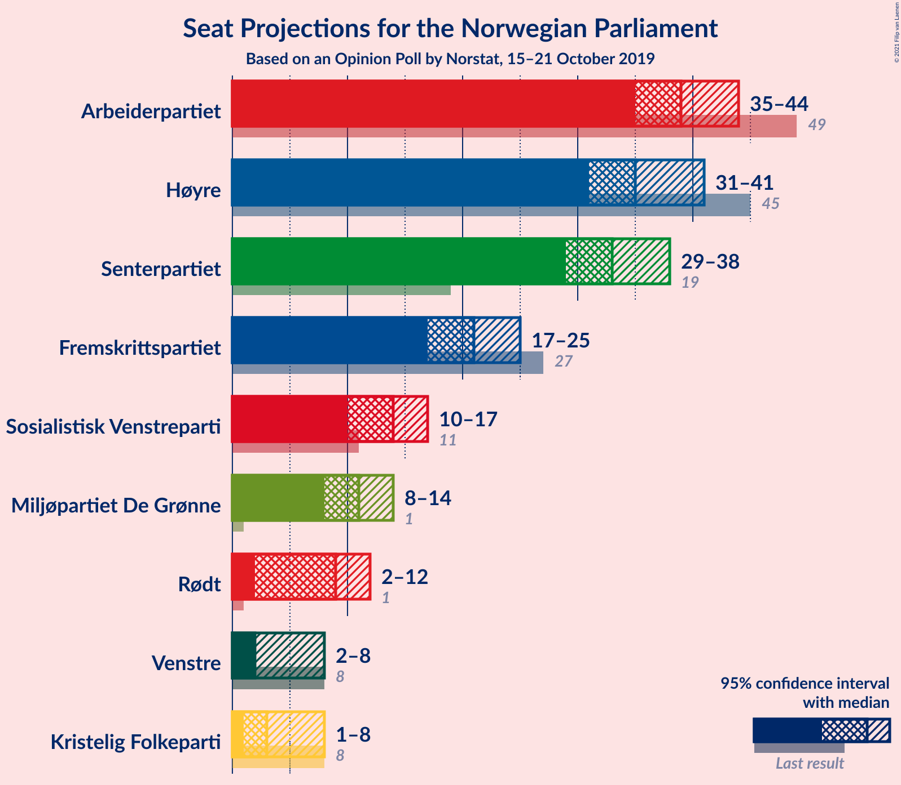
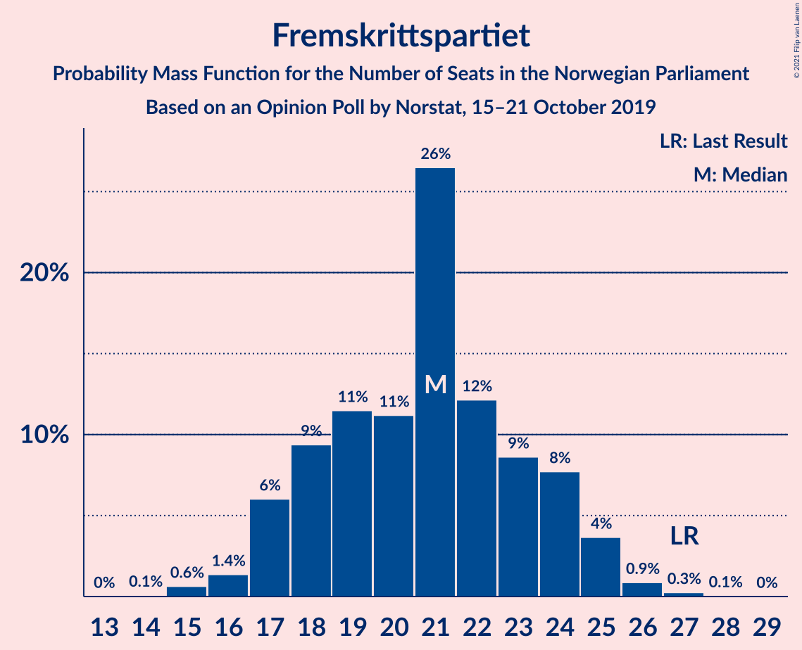
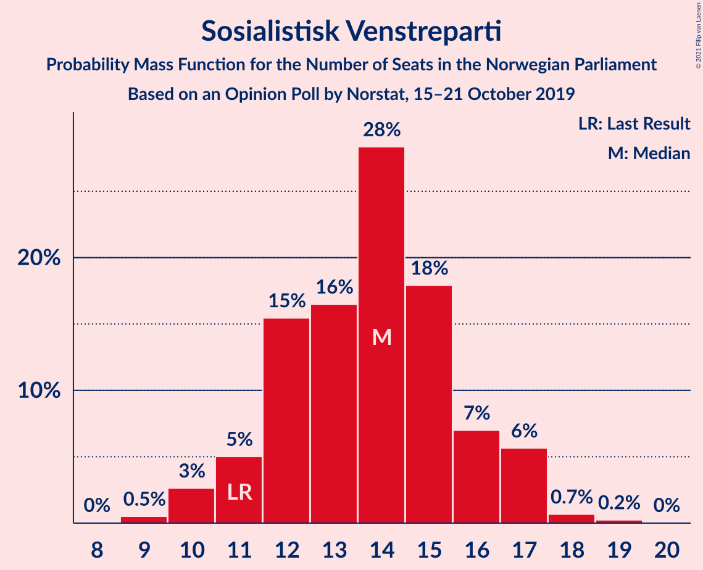
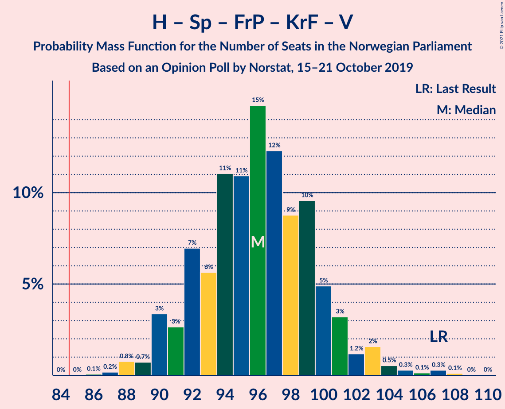
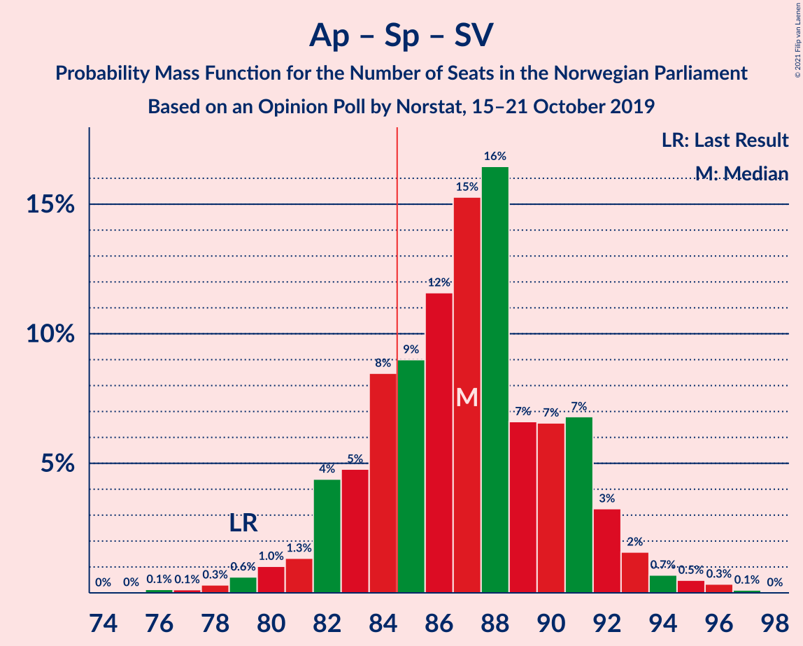
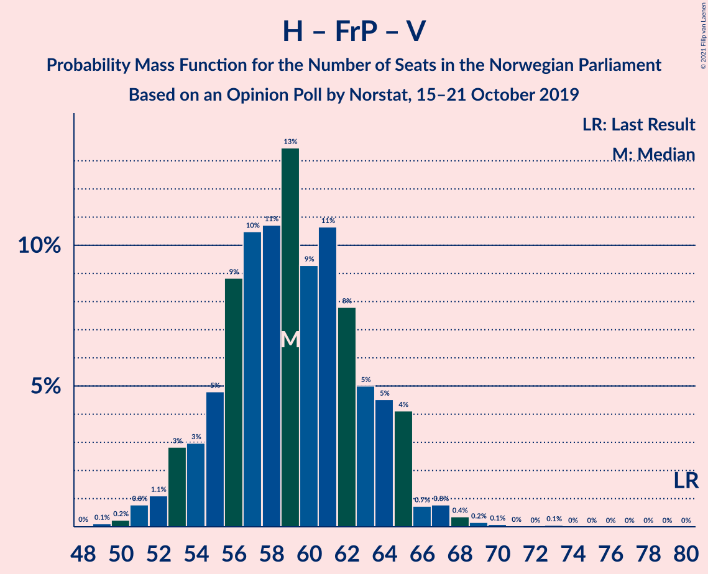

# Opinion Poll by Norstat, 15–21 October 2019

<a href="#voting-intentions">Voting Intentions</a> | <a href="#seats">Seats</a> | <a href="#coalitions">Coalitions</a> | <a href="#technical-information">Technical Information</a>

## Voting Intentions

### Confidence Intervals

| Party | Last Result | Poll Result | 80% Confidence Interval | 90% Confidence Interval | 95% Confidence Interval | 99% Confidence Interval |
|:-----:|:-----------:|:-----------:|:-----------------------:|:-----------------------:|:-----------------------:|:-----------------------:|
| Arbeiderpartiet | 27.4% | 21.6% | 20.0–23.4% |19.5–24.0% |19.1–24.4% |18.3–25.3% |
| Høyre | 25.0% | 20.1% | 18.5–21.9% |18.1–22.4% |17.7–22.8% |16.9–23.7% |
| Senterpartiet | 10.3% | 18.1% | 16.5–19.8% |16.1–20.3% |15.7–20.7% |15.0–21.5% |
| Fremskrittspartiet | 15.2% | 11.7% | 10.5–13.2% |10.1–13.6% |9.8–14.0% |9.2–14.7% |
| Sosialistisk Venstreparti | 6.0% | 7.8% | 6.7–9.0% |6.4–9.3% |6.2–9.7% |5.7–10.3% |
| Miljøpartiet De Grønne | 3.2% | 6.2% | 5.3–7.4% |5.1–7.7% |4.9–8.0% |4.5–8.6% |
| Rødt | 2.4% | 5.0% | 4.1–6.0% |3.9–6.3% |3.7–6.6% |3.4–7.1% |
| Kristelig Folkeparti | 4.2% | 3.6% | 2.9–4.5% |2.7–4.7% |2.5–5.0% |2.3–5.4% |
| Venstre | 4.4% | 3.3% | 2.7–4.2% |2.5–4.5% |2.4–4.7% |2.1–5.2% |

*Note:* The poll result column reflects the actual value used in the calculations. Published results may vary slightly, and in addition be rounded to fewer digits.

## Seats

### Confidence Intervals

| Party | Last Result | Median | 80% Confidence Interval | 90% Confidence Interval | 95% Confidence Interval | 99% Confidence Interval |
|:-----:|:-----------:|:------:|:-----------------------:|:-----------------------:|:-----------------------:|:-----------------------:|
| <a href="#arbeiderpartiet">Arbeiderpartiet</a> | 49 | 41 | 35–43 |35–44 |33–44 |33–44 |
| <a href="#høyre">Høyre</a> | 45 | 29 | 29–36 |29–36 |29–36 |29–40 |
| <a href="#senterpartiet">Senterpartiet</a> | 19 | 36 | 34–38 |34–38 |34–38 |33–38 |
| <a href="#fremskrittspartiet">Fremskrittspartiet</a> | 27 | 19 | 19–24 |19–24 |18–24 |15–24 |
| <a href="#sosialistisk-venstreparti">Sosialistisk Venstreparti</a> | 11 | 11 | 11–13 |11–14 |11–15 |11–21 |
| <a href="#miljøpartiet-de-grønne">Miljøpartiet De Grønne</a> | 1 | 11 | 11–13 |11–13 |11–13 |9–14 |
| <a href="#rødt">Rødt</a> | 1 | 8 | 8 |2–8 |2–8 |2–11 |
| <a href="#kristelig-folkeparti">Kristelig Folkeparti</a> | 8 | 7 | 0–7 |0–7 |0–8 |0–8 |
| <a href="#venstre">Venstre</a> | 8 | 7 | 2–8 |0–8 |0–8 |0–8 |

### Arbeiderpartiet

*For a full overview of the results for this party, see the [Arbeiderpartiet](party-arbeiderpartiet.html) page.*

| Number of Seats | Probability | Accumulated | Special Marks |
|:---------------:|:-----------:|:-----------:|:-------------:|
| 33 | 3% | 100% |  |
| 34 | 0.1% | 97% |  |
| 35 | 10% | 97% |  |
| 36 | 0.5% | 87% |  |
| 37 | 0.1% | 87% |  |
| 38 | 0.5% | 87% |  |
| 39 | 14% | 86% |  |
| 40 | 0.3% | 73% |  |
| 41 | 62% | 72% | Median |
| 42 | 0% | 10% |  |
| 43 | 2% | 10% |  |
| 44 | 8% | 9% |  |
| 45 | 0% | 0.2% |  |
| 46 | 0% | 0.2% |  |
| 47 | 0.2% | 0.2% |  |
| 48 | 0% | 0% |  |
| 49 | 0% | 0% | Last Result |

### Høyre

*For a full overview of the results for this party, see the [Høyre](party-høyre.html) page.*

| Number of Seats | Probability | Accumulated | Special Marks |
|:---------------:|:-----------:|:-----------:|:-------------:|
| 28 | 0.2% | 100% |  |
| 29 | 62% | 99.8% | Median |
| 30 | 0.5% | 38% |  |
| 31 | 0% | 38% |  |
| 32 | 0.1% | 38% |  |
| 33 | 1.2% | 38% |  |
| 34 | 14% | 36% |  |
| 35 | 12% | 23% |  |
| 36 | 9% | 11% |  |
| 37 | 1.4% | 2% |  |
| 38 | 0% | 0.6% |  |
| 39 | 0% | 0.6% |  |
| 40 | 0.3% | 0.6% |  |
| 41 | 0.1% | 0.3% |  |
| 42 | 0% | 0.2% |  |
| 43 | 0.1% | 0.2% |  |
| 44 | 0.2% | 0.2% |  |
| 45 | 0% | 0% | Last Result |

### Senterpartiet

*For a full overview of the results for this party, see the [Senterpartiet](party-senterpartiet.html) page.*

| Number of Seats | Probability | Accumulated | Special Marks |
|:---------------:|:-----------:|:-----------:|:-------------:|
| 19 | 0% | 100% | Last Result |
| 20 | 0% | 100% |  |
| 21 | 0% | 100% |  |
| 22 | 0% | 100% |  |
| 23 | 0% | 100% |  |
| 24 | 0% | 100% |  |
| 25 | 0% | 100% |  |
| 26 | 0% | 100% |  |
| 27 | 0% | 100% |  |
| 28 | 0% | 100% |  |
| 29 | 0% | 100% |  |
| 30 | 0% | 100% |  |
| 31 | 0% | 100% |  |
| 32 | 0% | 100% |  |
| 33 | 0.5% | 99.9% |  |
| 34 | 13% | 99.5% |  |
| 35 | 1.3% | 87% |  |
| 36 | 61% | 86% | Median |
| 37 | 0% | 24% |  |
| 38 | 24% | 24% |  |
| 39 | 0.3% | 0.3% |  |
| 40 | 0% | 0% |  |

### Fremskrittspartiet

*For a full overview of the results for this party, see the [Fremskrittspartiet](party-fremskrittspartiet.html) page.*

| Number of Seats | Probability | Accumulated | Special Marks |
|:---------------:|:-----------:|:-----------:|:-------------:|
| 15 | 1.4% | 100% |  |
| 16 | 0% | 98.6% |  |
| 17 | 0% | 98.6% |  |
| 18 | 3% | 98.5% |  |
| 19 | 62% | 96% | Median |
| 20 | 10% | 34% |  |
| 21 | 9% | 24% |  |
| 22 | 1.2% | 15% |  |
| 23 | 0% | 14% |  |
| 24 | 14% | 14% |  |
| 25 | 0% | 0% |  |
| 26 | 0% | 0% |  |
| 27 | 0% | 0% | Last Result |

### Sosialistisk Venstreparti

*For a full overview of the results for this party, see the [Sosialistisk Venstreparti](party-sosialistiskvenstreparti.html) page.*

| Number of Seats | Probability | Accumulated | Special Marks |
|:---------------:|:-----------:|:-----------:|:-------------:|
| 10 | 0.3% | 100% |  |
| 11 | 75% | 99.7% | Last Result, Median |
| 12 | 10% | 25% |  |
| 13 | 9% | 15% |  |
| 14 | 3% | 6% |  |
| 15 | 2% | 3% |  |
| 16 | 0% | 1.2% |  |
| 17 | 0% | 1.2% |  |
| 18 | 0.5% | 1.2% |  |
| 19 | 0% | 0.6% |  |
| 20 | 0.1% | 0.6% |  |
| 21 | 0.6% | 0.6% |  |
| 22 | 0% | 0% |  |

### Miljøpartiet De Grønne

*For a full overview of the results for this party, see the [Miljøpartiet De Grønne](party-miljøpartietdegrønne.html) page.*

| Number of Seats | Probability | Accumulated | Special Marks |
|:---------------:|:-----------:|:-----------:|:-------------:|
| 1 | 0% | 100% | Last Result |
| 2 | 0% | 100% |  |
| 3 | 0% | 100% |  |
| 4 | 0% | 100% |  |
| 5 | 0% | 100% |  |
| 6 | 0% | 100% |  |
| 7 | 0.1% | 100% |  |
| 8 | 0% | 99.9% |  |
| 9 | 0.4% | 99.9% |  |
| 10 | 1.0% | 99.5% |  |
| 11 | 72% | 98% | Median |
| 12 | 10% | 26% |  |
| 13 | 15% | 16% |  |
| 14 | 0.9% | 1.1% |  |
| 15 | 0% | 0.2% |  |
| 16 | 0% | 0.2% |  |
| 17 | 0.2% | 0.2% |  |
| 18 | 0% | 0% |  |

### Rødt

*For a full overview of the results for this party, see the [Rødt](party-rødt.html) page.*

| Number of Seats | Probability | Accumulated | Special Marks |
|:---------------:|:-----------:|:-----------:|:-------------:|
| 1 | 0.3% | 100% | Last Result |
| 2 | 5% | 99.7% |  |
| 3 | 0% | 95% |  |
| 4 | 0% | 95% |  |
| 5 | 0% | 95% |  |
| 6 | 0% | 95% |  |
| 7 | 0.2% | 95% |  |
| 8 | 93% | 94% | Median |
| 9 | 0.5% | 1.2% |  |
| 10 | 0.2% | 0.8% |  |
| 11 | 0.5% | 0.6% |  |
| 12 | 0.1% | 0.1% |  |
| 13 | 0% | 0% |  |

### Kristelig Folkeparti

*For a full overview of the results for this party, see the [Kristelig Folkeparti](party-kristeligfolkeparti.html) page.*

| Number of Seats | Probability | Accumulated | Special Marks |
|:---------------:|:-----------:|:-----------:|:-------------:|
| 0 | 14% | 100% |  |
| 1 | 11% | 86% |  |
| 2 | 8% | 76% |  |
| 3 | 2% | 67% |  |
| 4 | 0% | 65% |  |
| 5 | 0% | 65% |  |
| 6 | 0% | 65% |  |
| 7 | 62% | 65% | Median |
| 8 | 3% | 3% | Last Result |
| 9 | 0.1% | 0.3% |  |
| 10 | 0% | 0.2% |  |
| 11 | 0.1% | 0.1% |  |
| 12 | 0% | 0% |  |

### Venstre

*For a full overview of the results for this party, see the [Venstre](party-venstre.html) page.*

| Number of Seats | Probability | Accumulated | Special Marks |
|:---------------:|:-----------:|:-----------:|:-------------:|
| 0 | 8% | 100% |  |
| 1 | 1.4% | 92% |  |
| 2 | 15% | 90% |  |
| 3 | 0% | 75% |  |
| 4 | 0% | 75% |  |
| 5 | 0% | 75% |  |
| 6 | 0% | 75% |  |
| 7 | 65% | 75% | Median |
| 8 | 10% | 10% | Last Result |
| 9 | 0% | 0% |  |

## Coalitions

### Confidence Intervals

| Coalition | Last Result | Median | Majority? | 80% Confidence Interval | 90% Confidence Interval | 95% Confidence Interval | 99% Confidence Interval |
|:---------:|:-----------:|:------:|:---------:|:-----------------------:|:-----------------------:|:-----------------------:|:-----------------------:|
| Arbeiderpartiet – Senterpartiet – Sosialistisk Venstreparti – Miljøpartiet De Grønne – Rødt | 81 | 107 | 100% | 105–109 | 105–110 | 97–110 | 94–114 |
| Arbeiderpartiet – Senterpartiet – Sosialistisk Venstreparti – Miljøpartiet De Grønne – Kristelig Folkeparti | 88 | 106 | 100% | 98–106 | 98–106 | 98–106 | 98–110 |
| Arbeiderpartiet – Senterpartiet – Sosialistisk Venstreparti – Miljøpartiet De Grønne | 80 | 99 | 100% | 97–102 | 97–102 | 92–103 | 92–107 |
| Høyre – Senterpartiet – Fremskrittspartiet – Kristelig Folkeparti – Venstre | 107 | 98 | 100% | 95–102 | 93–102 | 93–102 | 90–104 |
| Arbeiderpartiet – Senterpartiet – Sosialistisk Venstreparti – Rødt | 80 | 96 | 98% | 93–98 | 93–99 | 85–99 | 83–100 |
| Arbeiderpartiet – Senterpartiet – Miljøpartiet De Grønne – Kristelig Folkeparti | 77 | 95 | 99.7% | 86–95 | 86–95 | 86–95 | 86–95 |
| Arbeiderpartiet – Senterpartiet – Sosialistisk Venstreparti | 79 | 88 | 97% | 85–91 | 85–91 | 81–91 | 81–97 |
| Arbeiderpartiet – Senterpartiet – Kristelig Folkeparti | 76 | 84 | 0.3% | 74–84 | 74–84 | 74–84 | 72–84 |
| Høyre – Fremskrittspartiet – Miljøpartiet De Grønne – Kristelig Folkeparti – Venstre | 89 | 73 | 0% | 71–76 | 70–76 | 70–79 | 69–79 |
| Arbeiderpartiet – Senterpartiet | 68 | 77 | 0% | 73–77 | 73–78 | 67–78 | 67–78 |
| Høyre – Fremskrittspartiet – Kristelig Folkeparti – Venstre | 88 | 62 | 0% | 60–64 | 59–64 | 59–68 | 55–68 |
| Høyre – Fremskrittspartiet – Venstre | 80 | 55 | 0% | 55–63 | 55–63 | 55–63 | 53–64 |
| Høyre – Fremskrittspartiet | 72 | 48 | 0% | 48–58 | 48–58 | 48–58 | 48–61 |
| Arbeiderpartiet – Sosialistisk Venstreparti | 60 | 52 | 0% | 47–57 | 47–57 | 47–57 | 46–62 |
| Høyre – Kristelig Folkeparti – Venstre | 61 | 43 | 0% | 36–44 | 36–44 | 36–50 | 33–50 |
| Senterpartiet – Kristelig Folkeparti – Venstre | 35 | 50 | 0% | 40–50 | 36–50 | 36–50 | 36–50 |

### Arbeiderpartiet – Senterpartiet – Sosialistisk Venstreparti – Miljøpartiet De Grønne – Rødt

| Number of Seats | Probability | Accumulated | Special Marks |
|:---------------:|:-----------:|:-----------:|:-------------:|
| 81 | 0% | 100% | Last Result |
| 82 | 0% | 100% |  |
| 83 | 0% | 100% |  |
| 84 | 0% | 100% |  |
| 85 | 0% | 100% | Majority |
| 86 | 0% | 100% |  |
| 87 | 0% | 100% |  |
| 88 | 0% | 100% |  |
| 89 | 0% | 100% |  |
| 90 | 0% | 100% |  |
| 91 | 0% | 100% |  |
| 92 | 0% | 100% |  |
| 93 | 0% | 100% |  |
| 94 | 2% | 100% |  |
| 95 | 0% | 98% |  |
| 96 | 0% | 98% |  |
| 97 | 0.2% | 98% |  |
| 98 | 0% | 97% |  |
| 99 | 0.3% | 97% |  |
| 100 | 0% | 97% |  |
| 101 | 0.5% | 97% |  |
| 102 | 0.1% | 97% |  |
| 103 | 0% | 97% |  |
| 104 | 0.2% | 97% |  |
| 105 | 10% | 96% |  |
| 106 | 0% | 87% |  |
| 107 | 63% | 87% | Median |
| 108 | 0.3% | 24% |  |
| 109 | 14% | 24% |  |
| 110 | 9% | 9% |  |
| 111 | 0.2% | 0.9% |  |
| 112 | 0% | 0.7% |  |
| 113 | 0% | 0.7% |  |
| 114 | 0.5% | 0.7% |  |
| 115 | 0.2% | 0.2% |  |
| 116 | 0% | 0% |  |

### Arbeiderpartiet – Senterpartiet – Sosialistisk Venstreparti – Miljøpartiet De Grønne – Kristelig Folkeparti

| Number of Seats | Probability | Accumulated | Special Marks |
|:---------------:|:-----------:|:-----------:|:-------------:|
| 88 | 0% | 100% | Last Result |
| 89 | 0% | 100% |  |
| 90 | 0% | 100% |  |
| 91 | 0% | 100% |  |
| 92 | 0% | 100% |  |
| 93 | 0% | 100% |  |
| 94 | 0% | 100% |  |
| 95 | 0% | 100% |  |
| 96 | 0.2% | 100% |  |
| 97 | 0% | 99.7% |  |
| 98 | 10% | 99.7% |  |
| 99 | 0.3% | 90% |  |
| 100 | 2% | 90% |  |
| 101 | 14% | 87% |  |
| 102 | 0.4% | 74% |  |
| 103 | 0% | 73% |  |
| 104 | 9% | 73% |  |
| 105 | 0% | 64% |  |
| 106 | 62% | 64% | Median |
| 107 | 0% | 2% |  |
| 108 | 2% | 2% |  |
| 109 | 0% | 0.9% |  |
| 110 | 0.6% | 0.8% |  |
| 111 | 0.1% | 0.2% |  |
| 112 | 0.2% | 0.2% |  |
| 113 | 0% | 0% |  |

### Arbeiderpartiet – Senterpartiet – Sosialistisk Venstreparti – Miljøpartiet De Grønne

| Number of Seats | Probability | Accumulated | Special Marks |
|:---------------:|:-----------:|:-----------:|:-------------:|
| 80 | 0% | 100% | Last Result |
| 81 | 0% | 100% |  |
| 82 | 0% | 100% |  |
| 83 | 0% | 100% |  |
| 84 | 0% | 100% |  |
| 85 | 0% | 100% | Majority |
| 86 | 0% | 100% |  |
| 87 | 0% | 100% |  |
| 88 | 0.2% | 100% |  |
| 89 | 0% | 99.8% |  |
| 90 | 0% | 99.8% |  |
| 91 | 0% | 99.8% |  |
| 92 | 2% | 99.8% |  |
| 93 | 0% | 97% |  |
| 94 | 0% | 97% |  |
| 95 | 0.1% | 97% |  |
| 96 | 0% | 97% |  |
| 97 | 10% | 97% |  |
| 98 | 0.3% | 87% |  |
| 99 | 62% | 87% | Median |
| 100 | 0.1% | 25% |  |
| 101 | 14% | 25% |  |
| 102 | 9% | 11% |  |
| 103 | 0.5% | 3% |  |
| 104 | 0% | 2% |  |
| 105 | 2% | 2% |  |
| 106 | 0% | 0.8% |  |
| 107 | 0.6% | 0.7% |  |
| 108 | 0% | 0.2% |  |
| 109 | 0.2% | 0.2% |  |
| 110 | 0% | 0% |  |

### Høyre – Senterpartiet – Fremskrittspartiet – Kristelig Folkeparti – Venstre

| Number of Seats | Probability | Accumulated | Special Marks |
|:---------------:|:-----------:|:-----------:|:-------------:|
| 87 | 0.2% | 100% |  |
| 88 | 0% | 99.8% |  |
| 89 | 0% | 99.8% |  |
| 90 | 0.5% | 99.8% |  |
| 91 | 0% | 99.3% |  |
| 92 | 0% | 99.3% |  |
| 93 | 9% | 99.3% |  |
| 94 | 0% | 90% |  |
| 95 | 0.6% | 90% |  |
| 96 | 1.4% | 90% |  |
| 97 | 0.1% | 88% |  |
| 98 | 75% | 88% | Median |
| 99 | 0.4% | 13% |  |
| 100 | 0% | 13% |  |
| 101 | 0% | 13% |  |
| 102 | 12% | 13% |  |
| 103 | 0% | 0.5% |  |
| 104 | 0.3% | 0.5% |  |
| 105 | 0.2% | 0.3% |  |
| 106 | 0% | 0% |  |
| 107 | 0% | 0% | Last Result |

### Arbeiderpartiet – Senterpartiet – Sosialistisk Venstreparti – Rødt

| Number of Seats | Probability | Accumulated | Special Marks |
|:---------------:|:-----------:|:-----------:|:-------------:|
| 80 | 0% | 100% | Last Result |
| 81 | 0% | 100% |  |
| 82 | 0% | 100% |  |
| 83 | 2% | 100% |  |
| 84 | 0% | 98% |  |
| 85 | 0.2% | 98% | Majority |
| 86 | 0% | 97% |  |
| 87 | 0% | 97% |  |
| 88 | 0% | 97% |  |
| 89 | 0.1% | 97% |  |
| 90 | 0.3% | 97% |  |
| 91 | 0.5% | 97% |  |
| 92 | 0% | 97% |  |
| 93 | 10% | 97% |  |
| 94 | 2% | 87% |  |
| 95 | 0.2% | 85% |  |
| 96 | 75% | 85% | Median |
| 97 | 0% | 10% |  |
| 98 | 0.4% | 10% |  |
| 99 | 9% | 10% |  |
| 100 | 0.6% | 0.6% |  |
| 101 | 0% | 0% |  |

### Arbeiderpartiet – Senterpartiet – Miljøpartiet De Grønne – Kristelig Folkeparti

| Number of Seats | Probability | Accumulated | Special Marks |
|:---------------:|:-----------:|:-----------:|:-------------:|
| 77 | 0% | 100% | Last Result |
| 78 | 0% | 100% |  |
| 79 | 0% | 100% |  |
| 80 | 0% | 100% |  |
| 81 | 0.1% | 100% |  |
| 82 | 0% | 99.9% |  |
| 83 | 0% | 99.9% |  |
| 84 | 0.3% | 99.9% |  |
| 85 | 0% | 99.7% | Majority |
| 86 | 13% | 99.6% |  |
| 87 | 0.1% | 87% |  |
| 88 | 0% | 87% |  |
| 89 | 0.6% | 87% |  |
| 90 | 14% | 86% |  |
| 91 | 9% | 72% |  |
| 92 | 0% | 64% |  |
| 93 | 2% | 64% |  |
| 94 | 0.3% | 62% |  |
| 95 | 61% | 61% | Median |
| 96 | 0% | 0.2% |  |
| 97 | 0% | 0.2% |  |
| 98 | 0.2% | 0.2% |  |
| 99 | 0% | 0% |  |

### Arbeiderpartiet – Senterpartiet – Sosialistisk Venstreparti

| Number of Seats | Probability | Accumulated | Special Marks |
|:---------------:|:-----------:|:-----------:|:-------------:|
| 76 | 0.2% | 100% |  |
| 77 | 0% | 99.8% |  |
| 78 | 0% | 99.8% |  |
| 79 | 0% | 99.8% | Last Result |
| 80 | 0% | 99.8% |  |
| 81 | 2% | 99.8% |  |
| 82 | 0% | 97% |  |
| 83 | 0% | 97% |  |
| 84 | 0% | 97% |  |
| 85 | 10% | 97% | Majority |
| 86 | 0% | 87% |  |
| 87 | 0% | 87% |  |
| 88 | 75% | 87% | Median |
| 89 | 1.2% | 12% |  |
| 90 | 0.1% | 11% |  |
| 91 | 8% | 11% |  |
| 92 | 1.4% | 2% |  |
| 93 | 0% | 0.7% |  |
| 94 | 0% | 0.7% |  |
| 95 | 0% | 0.7% |  |
| 96 | 0.2% | 0.7% |  |
| 97 | 0.6% | 0.6% |  |
| 98 | 0% | 0% |  |

### Arbeiderpartiet – Senterpartiet – Kristelig Folkeparti

| Number of Seats | Probability | Accumulated | Special Marks |
|:---------------:|:-----------:|:-----------:|:-------------:|
| 72 | 0.5% | 100% |  |
| 73 | 0% | 99.5% |  |
| 74 | 10% | 99.4% |  |
| 75 | 3% | 89% |  |
| 76 | 0% | 87% | Last Result |
| 77 | 14% | 87% |  |
| 78 | 0% | 73% |  |
| 79 | 0.6% | 73% |  |
| 80 | 10% | 72% |  |
| 81 | 0% | 62% |  |
| 82 | 0% | 62% |  |
| 83 | 0.5% | 62% |  |
| 84 | 61% | 62% | Median |
| 85 | 0.3% | 0.3% | Majority |
| 86 | 0% | 0% |  |

### Høyre – Fremskrittspartiet – Miljøpartiet De Grønne – Kristelig Folkeparti – Venstre

| Number of Seats | Probability | Accumulated | Special Marks |
|:---------------:|:-----------:|:-----------:|:-------------:|
| 68 | 0.3% | 100% |  |
| 69 | 0.6% | 99.7% |  |
| 70 | 9% | 99.1% |  |
| 71 | 0.9% | 90% |  |
| 72 | 0% | 89% |  |
| 73 | 75% | 89% | Median |
| 74 | 0.2% | 14% |  |
| 75 | 1.4% | 14% |  |
| 76 | 10% | 13% |  |
| 77 | 0% | 3% |  |
| 78 | 0% | 3% |  |
| 79 | 3% | 3% |  |
| 80 | 0.1% | 0.3% |  |
| 81 | 0% | 0.2% |  |
| 82 | 0% | 0.2% |  |
| 83 | 0% | 0.2% |  |
| 84 | 0.2% | 0.2% |  |
| 85 | 0% | 0% | Majority |
| 86 | 0% | 0% |  |
| 87 | 0% | 0% |  |
| 88 | 0% | 0% |  |
| 89 | 0% | 0% | Last Result |

### Arbeiderpartiet – Senterpartiet

| Number of Seats | Probability | Accumulated | Special Marks |
|:---------------:|:-----------:|:-----------:|:-------------:|
| 66 | 0.2% | 100% |  |
| 67 | 2% | 99.8% |  |
| 68 | 0% | 97% | Last Result |
| 69 | 0% | 97% |  |
| 70 | 0.1% | 97% |  |
| 71 | 0.5% | 97% |  |
| 72 | 0% | 97% |  |
| 73 | 10% | 97% |  |
| 74 | 0.7% | 87% |  |
| 75 | 0% | 86% |  |
| 76 | 1.2% | 86% |  |
| 77 | 76% | 85% | Median |
| 78 | 8% | 9% |  |
| 79 | 0% | 0.2% |  |
| 80 | 0% | 0.2% |  |
| 81 | 0% | 0.2% |  |
| 82 | 0.2% | 0.2% |  |
| 83 | 0% | 0% |  |

### Høyre – Fremskrittspartiet – Kristelig Folkeparti – Venstre

| Number of Seats | Probability | Accumulated | Special Marks |
|:---------------:|:-----------:|:-----------:|:-------------:|
| 54 | 0.4% | 100% |  |
| 55 | 0.5% | 99.5% |  |
| 56 | 0% | 99.0% |  |
| 57 | 0% | 99.0% |  |
| 58 | 0.2% | 99.0% |  |
| 59 | 9% | 98.8% |  |
| 60 | 14% | 90% |  |
| 61 | 0.5% | 76% |  |
| 62 | 63% | 76% | Median |
| 63 | 0% | 13% |  |
| 64 | 10% | 13% |  |
| 65 | 0.2% | 3% |  |
| 66 | 0% | 3% |  |
| 67 | 0.1% | 3% |  |
| 68 | 2% | 3% |  |
| 69 | 0% | 0.4% |  |
| 70 | 0.3% | 0.4% |  |
| 71 | 0% | 0.2% |  |
| 72 | 0.2% | 0.2% |  |
| 73 | 0% | 0% |  |
| 74 | 0% | 0% |  |
| 75 | 0% | 0% |  |
| 76 | 0% | 0% |  |
| 77 | 0% | 0% |  |
| 78 | 0% | 0% |  |
| 79 | 0% | 0% |  |
| 80 | 0% | 0% |  |
| 81 | 0% | 0% |  |
| 82 | 0% | 0% |  |
| 83 | 0% | 0% |  |
| 84 | 0% | 0% |  |
| 85 | 0% | 0% | Majority |
| 86 | 0% | 0% |  |
| 87 | 0% | 0% |  |
| 88 | 0% | 0% | Last Result |

### Høyre – Fremskrittspartiet – Venstre

| Number of Seats | Probability | Accumulated | Special Marks |
|:---------------:|:-----------:|:-----------:|:-------------:|
| 50 | 0.1% | 100% |  |
| 51 | 0.3% | 99.9% |  |
| 52 | 0% | 99.6% |  |
| 53 | 0.2% | 99.6% |  |
| 54 | 1.1% | 99.5% |  |
| 55 | 61% | 98% | Median |
| 56 | 0% | 37% |  |
| 57 | 9% | 37% |  |
| 58 | 0% | 28% |  |
| 59 | 1.5% | 28% |  |
| 60 | 16% | 26% |  |
| 61 | 0.1% | 10% |  |
| 62 | 0% | 10% |  |
| 63 | 10% | 10% |  |
| 64 | 0.2% | 0.5% |  |
| 65 | 0% | 0.3% |  |
| 66 | 0.1% | 0.3% |  |
| 67 | 0% | 0.3% |  |
| 68 | 0% | 0.3% |  |
| 69 | 0.3% | 0.3% |  |
| 70 | 0% | 0% |  |
| 71 | 0% | 0% |  |
| 72 | 0% | 0% |  |
| 73 | 0% | 0% |  |
| 74 | 0% | 0% |  |
| 75 | 0% | 0% |  |
| 76 | 0% | 0% |  |
| 77 | 0% | 0% |  |
| 78 | 0% | 0% |  |
| 79 | 0% | 0% |  |
| 80 | 0% | 0% | Last Result |

### Høyre – Fremskrittspartiet

| Number of Seats | Probability | Accumulated | Special Marks |
|:---------------:|:-----------:|:-----------:|:-------------:|
| 47 | 0.2% | 100% |  |
| 48 | 61% | 99.8% | Median |
| 49 | 0% | 39% |  |
| 50 | 0.3% | 39% |  |
| 51 | 0% | 38% |  |
| 52 | 2% | 38% |  |
| 53 | 3% | 36% |  |
| 54 | 0.2% | 33% |  |
| 55 | 10% | 33% |  |
| 56 | 0% | 23% |  |
| 57 | 8% | 23% |  |
| 58 | 14% | 14% |  |
| 59 | 0% | 0.6% |  |
| 60 | 0.1% | 0.6% |  |
| 61 | 0.3% | 0.5% |  |
| 62 | 0% | 0.2% |  |
| 63 | 0.2% | 0.2% |  |
| 64 | 0% | 0.1% |  |
| 65 | 0.1% | 0.1% |  |
| 66 | 0% | 0% |  |
| 67 | 0% | 0% |  |
| 68 | 0% | 0% |  |
| 69 | 0% | 0% |  |
| 70 | 0% | 0% |  |
| 71 | 0% | 0% |  |
| 72 | 0% | 0% | Last Result |

### Arbeiderpartiet – Sosialistisk Venstreparti

| Number of Seats | Probability | Accumulated | Special Marks |
|:---------------:|:-----------:|:-----------:|:-------------:|
| 43 | 0.2% | 100% |  |
| 44 | 0% | 99.8% |  |
| 45 | 0% | 99.8% |  |
| 46 | 0.3% | 99.8% |  |
| 47 | 12% | 99.5% |  |
| 48 | 0% | 87% |  |
| 49 | 0% | 87% |  |
| 50 | 14% | 87% |  |
| 51 | 0.5% | 74% |  |
| 52 | 61% | 73% | Median |
| 53 | 0% | 12% |  |
| 54 | 0.6% | 12% |  |
| 55 | 0.6% | 11% |  |
| 56 | 0.1% | 11% |  |
| 57 | 8% | 11% |  |
| 58 | 1.4% | 2% |  |
| 59 | 0% | 0.7% |  |
| 60 | 0% | 0.7% | Last Result |
| 61 | 0.2% | 0.7% |  |
| 62 | 0.6% | 0.6% |  |
| 63 | 0% | 0% |  |

### Høyre – Kristelig Folkeparti – Venstre

| Number of Seats | Probability | Accumulated | Special Marks |
|:---------------:|:-----------:|:-----------:|:-------------:|
| 33 | 0.8% | 100% |  |
| 34 | 0% | 99.2% |  |
| 35 | 0.2% | 99.2% |  |
| 36 | 14% | 99.0% |  |
| 37 | 0% | 85% |  |
| 38 | 9% | 85% |  |
| 39 | 0.1% | 76% |  |
| 40 | 0.2% | 76% |  |
| 41 | 0.5% | 76% |  |
| 42 | 0% | 76% |  |
| 43 | 61% | 76% | Median |
| 44 | 10% | 14% |  |
| 45 | 0.1% | 5% |  |
| 46 | 0.2% | 4% |  |
| 47 | 1.4% | 4% |  |
| 48 | 0% | 3% |  |
| 49 | 0.3% | 3% |  |
| 50 | 2% | 3% |  |
| 51 | 0% | 0.2% |  |
| 52 | 0% | 0.2% |  |
| 53 | 0.2% | 0.2% |  |
| 54 | 0% | 0% |  |
| 55 | 0% | 0% |  |
| 56 | 0% | 0% |  |
| 57 | 0% | 0% |  |
| 58 | 0% | 0% |  |
| 59 | 0% | 0% |  |
| 60 | 0% | 0% |  |
| 61 | 0% | 0% | Last Result |

### Senterpartiet – Kristelig Folkeparti – Venstre

| Number of Seats | Probability | Accumulated | Special Marks |
|:---------------:|:-----------:|:-----------:|:-------------:|
| 35 | 0.2% | 100% | Last Result |
| 36 | 8% | 99.8% |  |
| 37 | 0% | 91% |  |
| 38 | 0.6% | 91% |  |
| 39 | 0.2% | 91% |  |
| 40 | 14% | 91% |  |
| 41 | 0% | 76% |  |
| 42 | 0.2% | 76% |  |
| 43 | 0.6% | 76% |  |
| 44 | 1.5% | 76% |  |
| 45 | 0% | 74% |  |
| 46 | 0.5% | 74% |  |
| 47 | 10% | 74% |  |
| 48 | 0% | 64% |  |
| 49 | 2% | 64% |  |
| 50 | 61% | 61% | Median |
| 51 | 0.2% | 0.2% |  |
| 52 | 0% | 0% |  |

## Technical Information

### Opinion Poll

+ **Polling firm:** Norstat
+ **Commissioner(s):** —
+ **Fieldwork period:** 15–21 October 2019

### Calculations

+ **Sample size:** 929
+ **Simulations done:** 1,024
+ **Error estimate:** 5.55%

