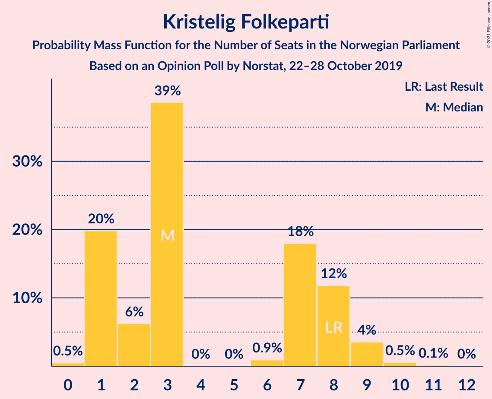
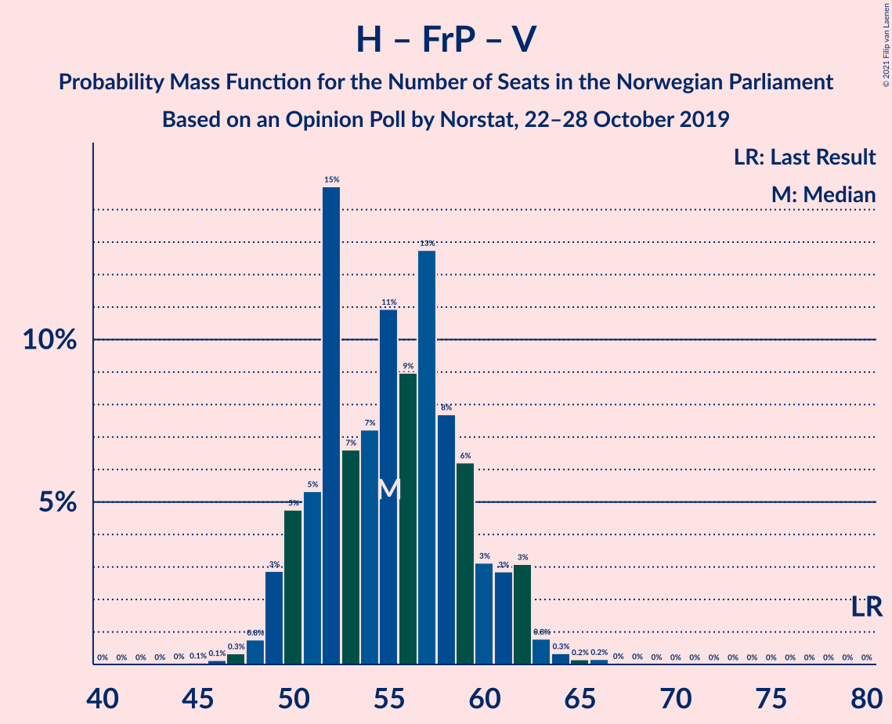

# Opinion Poll by Norstat, 22–28 October 2019

<a href="#voting-intentions">Voting Intentions</a> | <a href="#seats">Seats</a> | <a href="#coalitions">Coalitions</a> | <a href="#technical-information">Technical Information</a>

## Voting Intentions

### Confidence Intervals

| Party | Last Result | Poll Result | 80% Confidence Interval | 90% Confidence Interval | 95% Confidence Interval | 99% Confidence Interval |
|:-----:|:-----------:|:-----------:|:-----------------------:|:-----------------------:|:-----------------------:|:-----------------------:|
| Arbeiderpartiet | 27.4% | 23.6% | 21.6–25.8% |21.1–26.4% |20.6–26.9% |19.7–28.0% |
| Høyre | 25.0% | 21.8% | 19.9–23.9% |19.3–24.4% |18.9–25.0% |18.0–26.0% |
| Senterpartiet | 10.3% | 17.5% | 15.8–19.4% |15.3–20.0% |14.9–20.5% |14.1–21.5% |
| Fremskrittspartiet | 15.2% | 8.4% | 7.2–9.9% |6.8–10.3% |6.6–10.7% |6.0–11.4% |
| Sosialistisk Venstreparti | 6.0% | 7.4% | 6.3–8.8% |5.9–9.2% |5.7–9.6% |5.2–10.3% |
| Miljøpartiet De Grønne | 3.2% | 6.1% | 5.1–7.4% |4.8–7.8% |4.6–8.2% |4.1–8.8% |
| Rødt | 2.4% | 6.0% | 5.0–7.3% |4.7–7.7% |4.5–8.0% |4.0–8.7% |
| Kristelig Folkeparti | 4.2% | 3.8% | 3.0–4.9% |2.8–5.3% |2.7–5.5% |2.3–6.1% |
| Venstre | 4.4% | 3.3% | 2.6–4.3% |2.3–4.6% |2.2–4.9% |1.9–5.4% |

*Note:* The poll result column reflects the actual value used in the calculations. Published results may vary slightly, and in addition be rounded to fewer digits.

## Seats

### Confidence Intervals

| Party | Last Result | Median | 80% Confidence Interval | 90% Confidence Interval | 95% Confidence Interval | 99% Confidence Interval |
|:-----:|:-----------:|:------:|:-----------------------:|:-----------------------:|:-----------------------:|:-----------------------:|
| <a href="#arbeiderpartiet">Arbeiderpartiet</a> | 49 | 45 | 38–45 |38–45 |38–45 |38–45 |
| <a href="#høyre">Høyre</a> | 45 | 39 | 38–46 |33–46 |33–46 |33–46 |
| <a href="#senterpartiet">Senterpartiet</a> | 19 | 28 | 28–37 |28–37 |28–40 |28–40 |
| <a href="#fremskrittspartiet">Fremskrittspartiet</a> | 27 | 18 | 12–18 |12–18 |10–18 |10–18 |
| <a href="#sosialistisk-venstreparti">Sosialistisk Venstreparti</a> | 11 | 9 | 9–13 |9–14 |9–14 |9–14 |
| <a href="#miljøpartiet-de-grønne">Miljøpartiet De Grønne</a> | 1 | 13 | 3–13 |3–13 |3–13 |3–13 |
| <a href="#rødt">Rødt</a> | 1 | 12 | 11–12 |7–12 |7–12 |7–12 |
| <a href="#kristelig-folkeparti">Kristelig Folkeparti</a> | 8 | 3 | 3–7 |0–7 |0–8 |0–8 |
| <a href="#venstre">Venstre</a> | 8 | 2 | 2 |2–7 |2–7 |2–7 |

### Arbeiderpartiet

*For a full overview of the results for this party, see the [Arbeiderpartiet](party-arbeiderpartiet.html) page.*

| Number of Seats | Probability | Accumulated | Special Marks |
|:---------------:|:-----------:|:-----------:|:-------------:|
| 34 | 0.1% | 100% |  |
| 35 | 0% | 99.9% |  |
| 36 | 0.1% | 99.9% |  |
| 37 | 0% | 99.8% |  |
| 38 | 18% | 99.8% |  |
| 39 | 0% | 82% |  |
| 40 | 8% | 82% |  |
| 41 | 0% | 74% |  |
| 42 | 0% | 74% |  |
| 43 | 9% | 74% |  |
| 44 | 0% | 64% |  |
| 45 | 64% | 64% | Median |
| 46 | 0% | 0.1% |  |
| 47 | 0% | 0.1% |  |
| 48 | 0% | 0.1% |  |
| 49 | 0.1% | 0.1% | Last Result |
| 50 | 0% | 0% |  |

### Høyre

*For a full overview of the results for this party, see the [Høyre](party-høyre.html) page.*

| Number of Seats | Probability | Accumulated | Special Marks |
|:---------------:|:-----------:|:-----------:|:-------------:|
| 32 | 0.1% | 100% |  |
| 33 | 9% | 99.9% |  |
| 34 | 0% | 90% |  |
| 35 | 0% | 90% |  |
| 36 | 0% | 90% |  |
| 37 | 0% | 90% |  |
| 38 | 4% | 90% |  |
| 39 | 64% | 86% | Median |
| 40 | 4% | 22% |  |
| 41 | 0% | 18% |  |
| 42 | 0% | 18% |  |
| 43 | 0% | 18% |  |
| 44 | 0% | 18% |  |
| 45 | 0.1% | 18% | Last Result |
| 46 | 18% | 18% |  |
| 47 | 0% | 0% |  |

### Senterpartiet

*For a full overview of the results for this party, see the [Senterpartiet](party-senterpartiet.html) page.*

| Number of Seats | Probability | Accumulated | Special Marks |
|:---------------:|:-----------:|:-----------:|:-------------:|
| 19 | 0% | 100% | Last Result |
| 20 | 0% | 100% |  |
| 21 | 0% | 100% |  |
| 22 | 0% | 100% |  |
| 23 | 0% | 100% |  |
| 24 | 0.1% | 100% |  |
| 25 | 0% | 99.9% |  |
| 26 | 0% | 99.9% |  |
| 27 | 0% | 99.9% |  |
| 28 | 64% | 99.9% | Median |
| 29 | 0% | 36% |  |
| 30 | 0% | 36% |  |
| 31 | 0% | 36% |  |
| 32 | 0% | 36% |  |
| 33 | 0% | 36% |  |
| 34 | 4% | 36% |  |
| 35 | 0% | 32% |  |
| 36 | 0.1% | 32% |  |
| 37 | 28% | 32% |  |
| 38 | 0% | 4% |  |
| 39 | 0.1% | 4% |  |
| 40 | 4% | 4% |  |
| 41 | 0% | 0% |  |

### Fremskrittspartiet

*For a full overview of the results for this party, see the [Fremskrittspartiet](party-fremskrittspartiet.html) page.*

| Number of Seats | Probability | Accumulated | Special Marks |
|:---------------:|:-----------:|:-----------:|:-------------:|
| 9 | 0.1% | 100% |  |
| 10 | 4% | 99.9% |  |
| 11 | 0% | 96% |  |
| 12 | 18% | 96% |  |
| 13 | 4% | 78% |  |
| 14 | 0.1% | 74% |  |
| 15 | 9% | 74% |  |
| 16 | 0% | 64% |  |
| 17 | 0% | 64% |  |
| 18 | 64% | 64% | Median |
| 19 | 0% | 0% |  |
| 20 | 0% | 0% |  |
| 21 | 0% | 0% |  |
| 22 | 0% | 0% |  |
| 23 | 0% | 0% |  |
| 24 | 0% | 0% |  |
| 25 | 0% | 0% |  |
| 26 | 0% | 0% |  |
| 27 | 0% | 0% | Last Result |

### Sosialistisk Venstreparti

*For a full overview of the results for this party, see the [Sosialistisk Venstreparti](party-sosialistiskvenstreparti.html) page.*

| Number of Seats | Probability | Accumulated | Special Marks |
|:---------------:|:-----------:|:-----------:|:-------------:|
| 9 | 64% | 100% | Median |
| 10 | 0.1% | 36% |  |
| 11 | 0% | 36% | Last Result |
| 12 | 9% | 36% |  |
| 13 | 18% | 26% |  |
| 14 | 8% | 8% |  |
| 15 | 0% | 0.2% |  |
| 16 | 0.2% | 0.2% |  |
| 17 | 0% | 0% |  |

### Miljøpartiet De Grønne

*For a full overview of the results for this party, see the [Miljøpartiet De Grønne](party-miljøpartietdegrønne.html) page.*

| Number of Seats | Probability | Accumulated | Special Marks |
|:---------------:|:-----------:|:-----------:|:-------------:|
| 1 | 0% | 100% | Last Result |
| 2 | 0% | 100% |  |
| 3 | 18% | 100% |  |
| 4 | 0% | 82% |  |
| 5 | 0% | 82% |  |
| 6 | 0% | 82% |  |
| 7 | 0.1% | 82% |  |
| 8 | 4% | 82% |  |
| 9 | 0% | 78% |  |
| 10 | 0.2% | 78% |  |
| 11 | 9% | 78% |  |
| 12 | 4% | 69% |  |
| 13 | 64% | 64% | Median |
| 14 | 0% | 0.1% |  |
| 15 | 0% | 0.1% |  |
| 16 | 0% | 0% |  |

### Rødt

*For a full overview of the results for this party, see the [Rødt](party-rødt.html) page.*

| Number of Seats | Probability | Accumulated | Special Marks |
|:---------------:|:-----------:|:-----------:|:-------------:|
| 1 | 0% | 100% | Last Result |
| 2 | 0% | 100% |  |
| 3 | 0% | 100% |  |
| 4 | 0% | 100% |  |
| 5 | 0% | 100% |  |
| 6 | 0.1% | 100% |  |
| 7 | 8% | 99.9% |  |
| 8 | 0% | 92% |  |
| 9 | 0% | 92% |  |
| 10 | 0.1% | 92% |  |
| 11 | 28% | 92% |  |
| 12 | 64% | 64% | Median |
| 13 | 0% | 0.1% |  |
| 14 | 0% | 0.1% |  |
| 15 | 0% | 0% |  |

### Kristelig Folkeparti

*For a full overview of the results for this party, see the [Kristelig Folkeparti](party-kristeligfolkeparti.html) page.*

| Number of Seats | Probability | Accumulated | Special Marks |
|:---------------:|:-----------:|:-----------:|:-------------:|
| 0 | 9% | 100% |  |
| 1 | 0% | 91% |  |
| 2 | 0% | 91% |  |
| 3 | 69% | 91% | Median |
| 4 | 0% | 22% |  |
| 5 | 0% | 22% |  |
| 6 | 0% | 22% |  |
| 7 | 18% | 22% |  |
| 8 | 4% | 4% | Last Result |
| 9 | 0% | 0.1% |  |
| 10 | 0% | 0.1% |  |
| 11 | 0.1% | 0.1% |  |
| 12 | 0% | 0% |  |

### Venstre

*For a full overview of the results for this party, see the [Venstre](party-venstre.html) page.*

| Number of Seats | Probability | Accumulated | Special Marks |
|:---------------:|:-----------:|:-----------:|:-------------:|
| 0 | 0.1% | 100% |  |
| 1 | 0.1% | 99.9% |  |
| 2 | 90% | 99.8% | Median |
| 3 | 0% | 10% |  |
| 4 | 0% | 10% |  |
| 5 | 0% | 10% |  |
| 6 | 0% | 10% |  |
| 7 | 9% | 10% |  |
| 8 | 0% | 0% | Last Result |

## Coalitions

### Confidence Intervals

| Coalition | Last Result | Median | Majority? | 80% Confidence Interval | 90% Confidence Interval | 95% Confidence Interval | 99% Confidence Interval |
|:---------:|:-----------:|:------:|:---------:|:-----------------------:|:-----------------------:|:-----------------------:|:-----------------------:|
| Arbeiderpartiet – Senterpartiet – Sosialistisk Venstreparti – Miljøpartiet De Grønne – Rødt | 81 | 107 | 100% | 102–113 | 102–114 | 102–114 | 102–114 |
| Arbeiderpartiet – Senterpartiet – Sosialistisk Venstreparti – Miljøpartiet De Grønne – Kristelig Folkeparti | 88 | 98 | 100% | 98–103 | 98–104 | 98–109 | 98–109 |
| Arbeiderpartiet – Senterpartiet – Sosialistisk Venstreparti – Miljøpartiet De Grønne | 80 | 95 | 100% | 91–103 | 91–103 | 91–106 | 91–106 |
| Høyre – Senterpartiet – Fremskrittspartiet – Kristelig Folkeparti – Venstre | 107 | 90 | 99.9% | 90–104 | 90–104 | 90–104 | 90–104 |
| Arbeiderpartiet – Senterpartiet – Sosialistisk Venstreparti – Rødt | 80 | 94 | 100% | 94–101 | 94–103 | 94–103 | 94–103 |
| Arbeiderpartiet – Senterpartiet – Miljøpartiet De Grønne – Kristelig Folkeparti | 77 | 89 | 99.9% | 85–91 | 85–91 | 85–95 | 85–95 |
| Arbeiderpartiet – Senterpartiet – Sosialistisk Venstreparti | 79 | 82 | 36% | 82–92 | 82–92 | 82–94 | 82–94 |
| Arbeiderpartiet – Senterpartiet – Kristelig Folkeparti | 76 | 76 | 0.1% | 76–82 | 76–82 | 76–83 | 76–83 |
| Arbeiderpartiet – Senterpartiet | 68 | 73 | 0.1% | 73–80 | 73–80 | 73–80 | 73–80 |
| Høyre – Fremskrittspartiet – Miljøpartiet De Grønne – Kristelig Folkeparti – Venstre | 89 | 75 | 0% | 68–75 | 66–75 | 66–75 | 66–75 |
| Høyre – Fremskrittspartiet – Kristelig Folkeparti – Venstre | 88 | 62 | 0% | 56–67 | 55–67 | 55–67 | 55–67 |
| Høyre – Fremskrittspartiet – Venstre | 80 | 59 | 0% | 55–60 | 53–60 | 52–60 | 52–60 |
| Høyre – Fremskrittspartiet | 72 | 57 | 0% | 50–58 | 48–58 | 48–58 | 48–58 |
| Arbeiderpartiet – Sosialistisk Venstreparti | 60 | 54 | 0% | 51–54 | 51–55 | 51–55 | 51–55 |
| Høyre – Kristelig Folkeparti – Venstre | 61 | 44 | 0% | 43–55 | 40–55 | 40–55 | 40–55 |
| Senterpartiet – Kristelig Folkeparti – Venstre | 35 | 33 | 0% | 33–46 | 33–46 | 33–46 | 33–46 |

### Arbeiderpartiet – Senterpartiet – Sosialistisk Venstreparti – Miljøpartiet De Grønne – Rødt

| Number of Seats | Probability | Accumulated | Special Marks |
|:---------------:|:-----------:|:-----------:|:-------------:|
| 81 | 0% | 100% | Last Result |
| 82 | 0% | 100% |  |
| 83 | 0% | 100% |  |
| 84 | 0% | 100% |  |
| 85 | 0% | 100% | Majority |
| 86 | 0% | 100% |  |
| 87 | 0% | 100% |  |
| 88 | 0% | 100% |  |
| 89 | 0% | 100% |  |
| 90 | 0% | 100% |  |
| 91 | 0% | 100% |  |
| 92 | 0% | 100% |  |
| 93 | 0% | 100% |  |
| 94 | 0% | 100% |  |
| 95 | 0% | 100% |  |
| 96 | 0% | 100% |  |
| 97 | 0% | 100% |  |
| 98 | 0% | 100% |  |
| 99 | 0% | 100% |  |
| 100 | 0% | 100% |  |
| 101 | 0% | 100% |  |
| 102 | 18% | 100% |  |
| 103 | 4% | 82% |  |
| 104 | 0% | 78% |  |
| 105 | 0.1% | 78% |  |
| 106 | 0% | 78% |  |
| 107 | 64% | 78% | Median |
| 108 | 0% | 14% |  |
| 109 | 0% | 14% |  |
| 110 | 0% | 14% |  |
| 111 | 0% | 14% |  |
| 112 | 0% | 14% |  |
| 113 | 4% | 14% |  |
| 114 | 9% | 9% |  |
| 115 | 0% | 0.1% |  |
| 116 | 0% | 0.1% |  |
| 117 | 0% | 0.1% |  |
| 118 | 0% | 0.1% |  |
| 119 | 0% | 0.1% |  |
| 120 | 0% | 0.1% |  |
| 121 | 0% | 0.1% |  |
| 122 | 0% | 0.1% |  |
| 123 | 0% | 0.1% |  |
| 124 | 0.1% | 0.1% |  |
| 125 | 0% | 0% |  |

### Arbeiderpartiet – Senterpartiet – Sosialistisk Venstreparti – Miljøpartiet De Grønne – Kristelig Folkeparti

| Number of Seats | Probability | Accumulated | Special Marks |
|:---------------:|:-----------:|:-----------:|:-------------:|
| 88 | 0% | 100% | Last Result |
| 89 | 0% | 100% |  |
| 90 | 0% | 100% |  |
| 91 | 0% | 100% |  |
| 92 | 0% | 100% |  |
| 93 | 0% | 100% |  |
| 94 | 0% | 100% |  |
| 95 | 0% | 100% |  |
| 96 | 0% | 100% |  |
| 97 | 0% | 99.9% |  |
| 98 | 82% | 99.9% | Median |
| 99 | 0% | 18% |  |
| 100 | 0% | 18% |  |
| 101 | 0% | 18% |  |
| 102 | 0% | 18% |  |
| 103 | 9% | 18% |  |
| 104 | 4% | 8% |  |
| 105 | 0.1% | 4% |  |
| 106 | 0% | 4% |  |
| 107 | 0% | 4% |  |
| 108 | 0% | 4% |  |
| 109 | 4% | 4% |  |
| 110 | 0% | 0.1% |  |
| 111 | 0% | 0.1% |  |
| 112 | 0% | 0.1% |  |
| 113 | 0% | 0.1% |  |
| 114 | 0% | 0.1% |  |
| 115 | 0% | 0.1% |  |
| 116 | 0% | 0.1% |  |
| 117 | 0.1% | 0.1% |  |
| 118 | 0% | 0% |  |

### Arbeiderpartiet – Senterpartiet – Sosialistisk Venstreparti – Miljøpartiet De Grønne

| Number of Seats | Probability | Accumulated | Special Marks |
|:---------------:|:-----------:|:-----------:|:-------------:|
| 80 | 0% | 100% | Last Result |
| 81 | 0% | 100% |  |
| 82 | 0% | 100% |  |
| 83 | 0% | 100% |  |
| 84 | 0% | 100% |  |
| 85 | 0% | 100% | Majority |
| 86 | 0% | 100% |  |
| 87 | 0% | 100% |  |
| 88 | 0% | 100% |  |
| 89 | 0% | 100% |  |
| 90 | 0% | 100% |  |
| 91 | 18% | 100% |  |
| 92 | 0% | 82% |  |
| 93 | 0.1% | 82% |  |
| 94 | 0.1% | 82% |  |
| 95 | 64% | 82% | Median |
| 96 | 4% | 18% |  |
| 97 | 0% | 14% |  |
| 98 | 0% | 14% |  |
| 99 | 0% | 14% |  |
| 100 | 0% | 14% |  |
| 101 | 0% | 14% |  |
| 102 | 0% | 14% |  |
| 103 | 9% | 14% |  |
| 104 | 0% | 4% |  |
| 105 | 0% | 4% |  |
| 106 | 4% | 4% |  |
| 107 | 0% | 0.1% |  |
| 108 | 0% | 0.1% |  |
| 109 | 0% | 0.1% |  |
| 110 | 0% | 0.1% |  |
| 111 | 0% | 0.1% |  |
| 112 | 0% | 0.1% |  |
| 113 | 0% | 0.1% |  |
| 114 | 0.1% | 0.1% |  |
| 115 | 0% | 0% |  |

### Høyre – Senterpartiet – Fremskrittspartiet – Kristelig Folkeparti – Venstre

| Number of Seats | Probability | Accumulated | Special Marks |
|:---------------:|:-----------:|:-----------:|:-------------:|
| 84 | 0.1% | 100% |  |
| 85 | 0% | 99.9% | Majority |
| 86 | 0% | 99.9% |  |
| 87 | 0% | 99.9% |  |
| 88 | 0% | 99.8% |  |
| 89 | 0% | 99.8% |  |
| 90 | 64% | 99.8% | Median |
| 91 | 0% | 36% |  |
| 92 | 9% | 36% |  |
| 93 | 0% | 26% |  |
| 94 | 4% | 26% |  |
| 95 | 0% | 23% |  |
| 96 | 4% | 23% |  |
| 97 | 0% | 18% |  |
| 98 | 0.1% | 18% |  |
| 99 | 0% | 18% |  |
| 100 | 0% | 18% |  |
| 101 | 0% | 18% |  |
| 102 | 0% | 18% |  |
| 103 | 0% | 18% |  |
| 104 | 18% | 18% |  |
| 105 | 0% | 0% |  |
| 106 | 0% | 0% |  |
| 107 | 0% | 0% | Last Result |

### Arbeiderpartiet – Senterpartiet – Sosialistisk Venstreparti – Rødt

| Number of Seats | Probability | Accumulated | Special Marks |
|:---------------:|:-----------:|:-----------:|:-------------:|
| 80 | 0% | 100% | Last Result |
| 81 | 0% | 100% |  |
| 82 | 0% | 100% |  |
| 83 | 0% | 100% |  |
| 84 | 0% | 100% |  |
| 85 | 0% | 100% | Majority |
| 86 | 0% | 100% |  |
| 87 | 0% | 100% |  |
| 88 | 0% | 100% |  |
| 89 | 0.1% | 100% |  |
| 90 | 0% | 99.9% |  |
| 91 | 0% | 99.9% |  |
| 92 | 0% | 99.9% |  |
| 93 | 0% | 99.9% |  |
| 94 | 64% | 99.9% | Median |
| 95 | 4% | 36% |  |
| 96 | 0% | 32% |  |
| 97 | 0% | 32% |  |
| 98 | 0% | 32% |  |
| 99 | 18% | 32% |  |
| 100 | 0% | 14% |  |
| 101 | 4% | 14% |  |
| 102 | 0% | 10% |  |
| 103 | 9% | 10% |  |
| 104 | 0% | 0.1% |  |
| 105 | 0% | 0.1% |  |
| 106 | 0% | 0.1% |  |
| 107 | 0% | 0.1% |  |
| 108 | 0% | 0.1% |  |
| 109 | 0% | 0.1% |  |
| 110 | 0% | 0.1% |  |
| 111 | 0% | 0.1% |  |
| 112 | 0% | 0.1% |  |
| 113 | 0% | 0.1% |  |
| 114 | 0.1% | 0.1% |  |
| 115 | 0% | 0% |  |

### Arbeiderpartiet – Senterpartiet – Miljøpartiet De Grønne – Kristelig Folkeparti

| Number of Seats | Probability | Accumulated | Special Marks |
|:---------------:|:-----------:|:-----------:|:-------------:|
| 77 | 0% | 100% | Last Result |
| 78 | 0% | 100% |  |
| 79 | 0% | 100% |  |
| 80 | 0% | 100% |  |
| 81 | 0% | 100% |  |
| 82 | 0% | 100% |  |
| 83 | 0% | 100% |  |
| 84 | 0% | 99.9% |  |
| 85 | 18% | 99.9% | Majority |
| 86 | 0.1% | 82% |  |
| 87 | 0% | 82% |  |
| 88 | 0% | 82% |  |
| 89 | 64% | 82% | Median |
| 90 | 4% | 18% |  |
| 91 | 9% | 14% |  |
| 92 | 0% | 4% |  |
| 93 | 0% | 4% |  |
| 94 | 0.1% | 4% |  |
| 95 | 4% | 4% |  |
| 96 | 0% | 0.1% |  |
| 97 | 0% | 0.1% |  |
| 98 | 0% | 0.1% |  |
| 99 | 0% | 0.1% |  |
| 100 | 0% | 0.1% |  |
| 101 | 0.1% | 0.1% |  |
| 102 | 0% | 0% |  |

### Arbeiderpartiet – Senterpartiet – Sosialistisk Venstreparti

| Number of Seats | Probability | Accumulated | Special Marks |
|:---------------:|:-----------:|:-----------:|:-------------:|
| 79 | 0% | 100% | Last Result |
| 80 | 0% | 100% |  |
| 81 | 0% | 100% |  |
| 82 | 64% | 100% | Median |
| 83 | 0.1% | 36% |  |
| 84 | 0.1% | 36% |  |
| 85 | 0% | 36% | Majority |
| 86 | 0% | 36% |  |
| 87 | 0% | 36% |  |
| 88 | 22% | 36% |  |
| 89 | 0% | 14% |  |
| 90 | 0% | 14% |  |
| 91 | 0% | 14% |  |
| 92 | 9% | 14% |  |
| 93 | 0% | 4% |  |
| 94 | 4% | 4% |  |
| 95 | 0% | 0.1% |  |
| 96 | 0% | 0.1% |  |
| 97 | 0% | 0.1% |  |
| 98 | 0% | 0.1% |  |
| 99 | 0% | 0.1% |  |
| 100 | 0% | 0.1% |  |
| 101 | 0% | 0.1% |  |
| 102 | 0% | 0.1% |  |
| 103 | 0% | 0.1% |  |
| 104 | 0.1% | 0.1% |  |
| 105 | 0% | 0% |  |

### Arbeiderpartiet – Senterpartiet – Kristelig Folkeparti

| Number of Seats | Probability | Accumulated | Special Marks |
|:---------------:|:-----------:|:-----------:|:-------------:|
| 75 | 0% | 100% |  |
| 76 | 64% | 99.9% | Last Result, Median |
| 77 | 0% | 36% |  |
| 78 | 0% | 36% |  |
| 79 | 0.1% | 36% |  |
| 80 | 9% | 36% |  |
| 81 | 0.1% | 26% |  |
| 82 | 22% | 26% |  |
| 83 | 4% | 4% |  |
| 84 | 0% | 0.2% |  |
| 85 | 0% | 0.1% | Majority |
| 86 | 0% | 0.1% |  |
| 87 | 0% | 0.1% |  |
| 88 | 0% | 0.1% |  |
| 89 | 0% | 0.1% |  |
| 90 | 0% | 0.1% |  |
| 91 | 0.1% | 0.1% |  |
| 92 | 0% | 0% |  |

### Arbeiderpartiet – Senterpartiet

| Number of Seats | Probability | Accumulated | Special Marks |
|:---------------:|:-----------:|:-----------:|:-------------:|
| 68 | 0.1% | 100% | Last Result |
| 69 | 0% | 99.9% |  |
| 70 | 0% | 99.9% |  |
| 71 | 0% | 99.8% |  |
| 72 | 0% | 99.8% |  |
| 73 | 64% | 99.8% | Median |
| 74 | 4% | 36% |  |
| 75 | 18% | 32% |  |
| 76 | 0% | 14% |  |
| 77 | 0% | 14% |  |
| 78 | 0% | 14% |  |
| 79 | 0% | 14% |  |
| 80 | 14% | 14% |  |
| 81 | 0% | 0.1% |  |
| 82 | 0% | 0.1% |  |
| 83 | 0% | 0.1% |  |
| 84 | 0% | 0.1% |  |
| 85 | 0% | 0.1% | Majority |
| 86 | 0% | 0.1% |  |
| 87 | 0% | 0.1% |  |
| 88 | 0.1% | 0.1% |  |
| 89 | 0% | 0% |  |

### Høyre – Fremskrittspartiet – Miljøpartiet De Grønne – Kristelig Folkeparti – Venstre

| Number of Seats | Probability | Accumulated | Special Marks |
|:---------------:|:-----------:|:-----------:|:-------------:|
| 55 | 0.1% | 100% |  |
| 56 | 0% | 99.9% |  |
| 57 | 0% | 99.9% |  |
| 58 | 0% | 99.9% |  |
| 59 | 0% | 99.9% |  |
| 60 | 0% | 99.9% |  |
| 61 | 0% | 99.9% |  |
| 62 | 0% | 99.9% |  |
| 63 | 0% | 99.9% |  |
| 64 | 0% | 99.9% |  |
| 65 | 0.1% | 99.9% |  |
| 66 | 9% | 99.9% |  |
| 67 | 0% | 90% |  |
| 68 | 8% | 90% |  |
| 69 | 0% | 83% |  |
| 70 | 18% | 83% |  |
| 71 | 0% | 64% |  |
| 72 | 0% | 64% |  |
| 73 | 0% | 64% |  |
| 74 | 0.1% | 64% |  |
| 75 | 64% | 64% | Median |
| 76 | 0% | 0.1% |  |
| 77 | 0% | 0.1% |  |
| 78 | 0% | 0.1% |  |
| 79 | 0% | 0.1% |  |
| 80 | 0.1% | 0.1% |  |
| 81 | 0% | 0% |  |
| 82 | 0% | 0% |  |
| 83 | 0% | 0% |  |
| 84 | 0% | 0% |  |
| 85 | 0% | 0% | Majority |
| 86 | 0% | 0% |  |
| 87 | 0% | 0% |  |
| 88 | 0% | 0% |  |
| 89 | 0% | 0% | Last Result |

### Høyre – Fremskrittspartiet – Kristelig Folkeparti – Venstre

| Number of Seats | Probability | Accumulated | Special Marks |
|:---------------:|:-----------:|:-----------:|:-------------:|
| 45 | 0.1% | 100% |  |
| 46 | 0% | 99.9% |  |
| 47 | 0% | 99.9% |  |
| 48 | 0% | 99.9% |  |
| 49 | 0% | 99.9% |  |
| 50 | 0% | 99.9% |  |
| 51 | 0% | 99.9% |  |
| 52 | 0% | 99.9% |  |
| 53 | 0% | 99.9% |  |
| 54 | 0% | 99.9% |  |
| 55 | 9% | 99.9% |  |
| 56 | 4% | 90% |  |
| 57 | 0% | 86% |  |
| 58 | 0.1% | 86% |  |
| 59 | 0% | 86% |  |
| 60 | 4% | 86% |  |
| 61 | 0% | 83% |  |
| 62 | 64% | 83% | Median |
| 63 | 0% | 18% |  |
| 64 | 0.1% | 18% |  |
| 65 | 0% | 18% |  |
| 66 | 0% | 18% |  |
| 67 | 18% | 18% |  |
| 68 | 0% | 0% |  |
| 69 | 0% | 0% |  |
| 70 | 0% | 0% |  |
| 71 | 0% | 0% |  |
| 72 | 0% | 0% |  |
| 73 | 0% | 0% |  |
| 74 | 0% | 0% |  |
| 75 | 0% | 0% |  |
| 76 | 0% | 0% |  |
| 77 | 0% | 0% |  |
| 78 | 0% | 0% |  |
| 79 | 0% | 0% |  |
| 80 | 0% | 0% |  |
| 81 | 0% | 0% |  |
| 82 | 0% | 0% |  |
| 83 | 0% | 0% |  |
| 84 | 0% | 0% |  |
| 85 | 0% | 0% | Majority |
| 86 | 0% | 0% |  |
| 87 | 0% | 0% |  |
| 88 | 0% | 0% | Last Result |

### Høyre – Fremskrittspartiet – Venstre

| Number of Seats | Probability | Accumulated | Special Marks |
|:---------------:|:-----------:|:-----------:|:-------------:|
| 42 | 0.1% | 100% |  |
| 43 | 0% | 99.9% |  |
| 44 | 0% | 99.9% |  |
| 45 | 0% | 99.9% |  |
| 46 | 0% | 99.9% |  |
| 47 | 0% | 99.9% |  |
| 48 | 0% | 99.9% |  |
| 49 | 0% | 99.9% |  |
| 50 | 0% | 99.9% |  |
| 51 | 0% | 99.9% |  |
| 52 | 4% | 99.9% |  |
| 53 | 4% | 96% |  |
| 54 | 0% | 92% |  |
| 55 | 9% | 92% |  |
| 56 | 0% | 82% |  |
| 57 | 0% | 82% |  |
| 58 | 0% | 82% |  |
| 59 | 64% | 82% | Median |
| 60 | 18% | 18% |  |
| 61 | 0% | 0% |  |
| 62 | 0% | 0% |  |
| 63 | 0% | 0% |  |
| 64 | 0% | 0% |  |
| 65 | 0% | 0% |  |
| 66 | 0% | 0% |  |
| 67 | 0% | 0% |  |
| 68 | 0% | 0% |  |
| 69 | 0% | 0% |  |
| 70 | 0% | 0% |  |
| 71 | 0% | 0% |  |
| 72 | 0% | 0% |  |
| 73 | 0% | 0% |  |
| 74 | 0% | 0% |  |
| 75 | 0% | 0% |  |
| 76 | 0% | 0% |  |
| 77 | 0% | 0% |  |
| 78 | 0% | 0% |  |
| 79 | 0% | 0% |  |
| 80 | 0% | 0% | Last Result |

### Høyre – Fremskrittspartiet

| Number of Seats | Probability | Accumulated | Special Marks |
|:---------------:|:-----------:|:-----------:|:-------------:|
| 41 | 0.1% | 100% |  |
| 42 | 0% | 99.9% |  |
| 43 | 0% | 99.9% |  |
| 44 | 0% | 99.9% |  |
| 45 | 0% | 99.9% |  |
| 46 | 0% | 99.9% |  |
| 47 | 0% | 99.8% |  |
| 48 | 9% | 99.8% |  |
| 49 | 0% | 90% |  |
| 50 | 4% | 90% |  |
| 51 | 4% | 87% |  |
| 52 | 0% | 82% |  |
| 53 | 0% | 82% |  |
| 54 | 0% | 82% |  |
| 55 | 0% | 82% |  |
| 56 | 0% | 82% |  |
| 57 | 64% | 82% | Median |
| 58 | 18% | 18% |  |
| 59 | 0.1% | 0.1% |  |
| 60 | 0% | 0% |  |
| 61 | 0% | 0% |  |
| 62 | 0% | 0% |  |
| 63 | 0% | 0% |  |
| 64 | 0% | 0% |  |
| 65 | 0% | 0% |  |
| 66 | 0% | 0% |  |
| 67 | 0% | 0% |  |
| 68 | 0% | 0% |  |
| 69 | 0% | 0% |  |
| 70 | 0% | 0% |  |
| 71 | 0% | 0% |  |
| 72 | 0% | 0% | Last Result |

### Arbeiderpartiet – Sosialistisk Venstreparti

| Number of Seats | Probability | Accumulated | Special Marks |
|:---------------:|:-----------:|:-----------:|:-------------:|
| 46 | 0.1% | 100% |  |
| 47 | 0% | 99.9% |  |
| 48 | 0% | 99.9% |  |
| 49 | 0% | 99.9% |  |
| 50 | 0.1% | 99.9% |  |
| 51 | 18% | 99.8% |  |
| 52 | 0% | 82% |  |
| 53 | 0% | 82% |  |
| 54 | 72% | 82% | Median |
| 55 | 9% | 10% |  |
| 56 | 0% | 0.2% |  |
| 57 | 0% | 0.2% |  |
| 58 | 0% | 0.2% |  |
| 59 | 0% | 0.1% |  |
| 60 | 0% | 0.1% | Last Result |
| 61 | 0% | 0.1% |  |
| 62 | 0% | 0.1% |  |
| 63 | 0% | 0.1% |  |
| 64 | 0% | 0.1% |  |
| 65 | 0.1% | 0.1% |  |
| 66 | 0% | 0% |  |

### Høyre – Kristelig Folkeparti – Venstre

| Number of Seats | Probability | Accumulated | Special Marks |
|:---------------:|:-----------:|:-----------:|:-------------:|
| 36 | 0.1% | 100% |  |
| 37 | 0% | 99.9% |  |
| 38 | 0% | 99.9% |  |
| 39 | 0% | 99.9% |  |
| 40 | 9% | 99.9% |  |
| 41 | 0% | 91% |  |
| 42 | 0% | 91% |  |
| 43 | 4% | 91% |  |
| 44 | 64% | 86% | Median |
| 45 | 0% | 22% |  |
| 46 | 0.1% | 22% |  |
| 47 | 0% | 22% |  |
| 48 | 0% | 22% |  |
| 49 | 0% | 22% |  |
| 50 | 4% | 22% |  |
| 51 | 0% | 18% |  |
| 52 | 0.1% | 18% |  |
| 53 | 0.1% | 18% |  |
| 54 | 0% | 18% |  |
| 55 | 18% | 18% |  |
| 56 | 0% | 0% |  |
| 57 | 0% | 0% |  |
| 58 | 0% | 0% |  |
| 59 | 0% | 0% |  |
| 60 | 0% | 0% |  |
| 61 | 0% | 0% | Last Result |

### Senterpartiet – Kristelig Folkeparti – Venstre

| Number of Seats | Probability | Accumulated | Special Marks |
|:---------------:|:-----------:|:-----------:|:-------------:|
| 33 | 64% | 100% | Median |
| 34 | 0% | 36% |  |
| 35 | 0% | 36% | Last Result |
| 36 | 0% | 36% |  |
| 37 | 0% | 36% |  |
| 38 | 0% | 36% |  |
| 39 | 0% | 36% |  |
| 40 | 0% | 36% |  |
| 41 | 0.1% | 36% |  |
| 42 | 0% | 36% |  |
| 43 | 0.1% | 36% |  |
| 44 | 13% | 36% |  |
| 45 | 4% | 23% |  |
| 46 | 18% | 18% |  |
| 47 | 0.1% | 0.1% |  |
| 48 | 0% | 0.1% |  |
| 49 | 0% | 0% |  |

## Technical Information

### Opinion Poll

+ **Polling firm:** Norstat
+ **Commissioner(s):** —
+ **Fieldwork period:** 22–28 October 2019

### Calculations

+ **Sample size:** 703
+ **Simulations done:** 1,024
+ **Error estimate:** 3.57%

