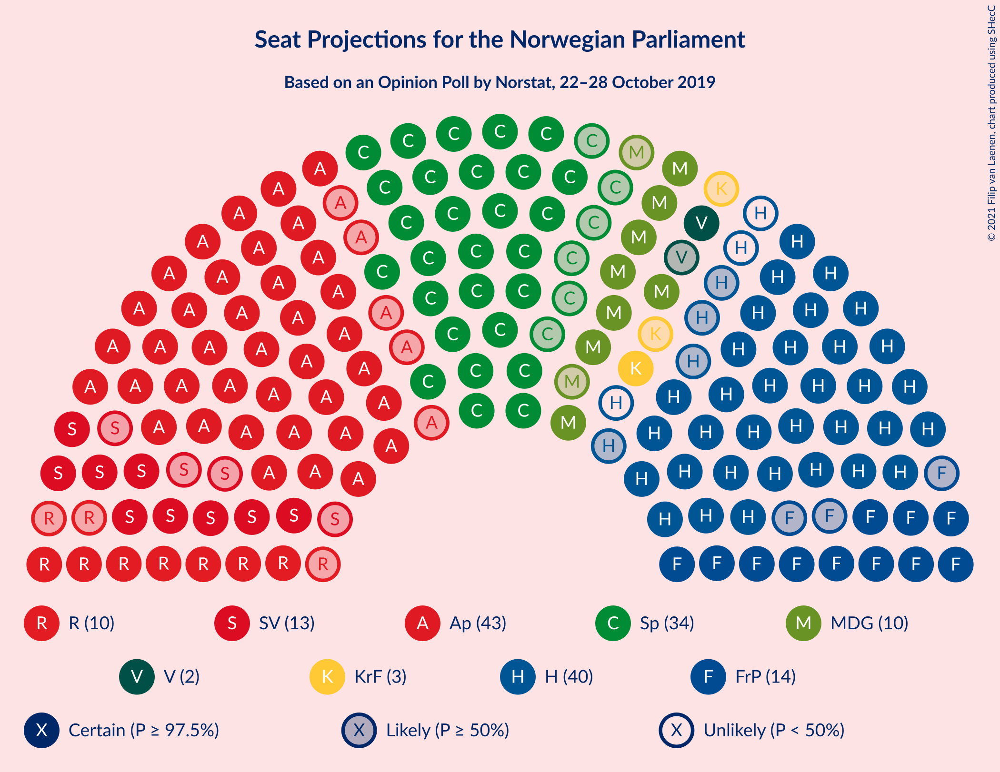
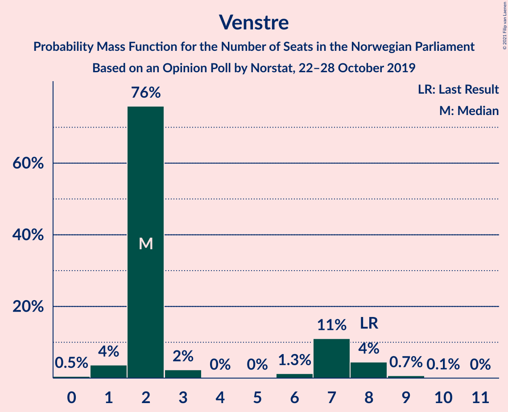
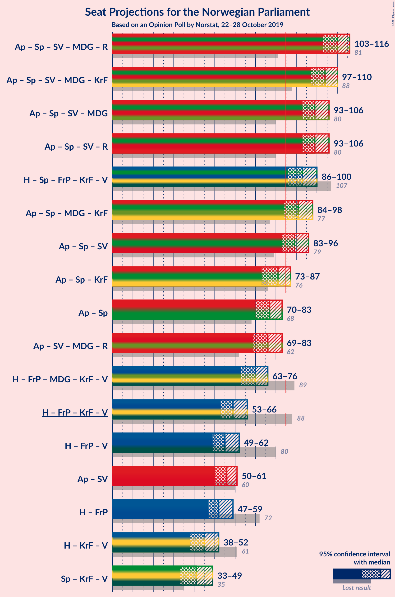
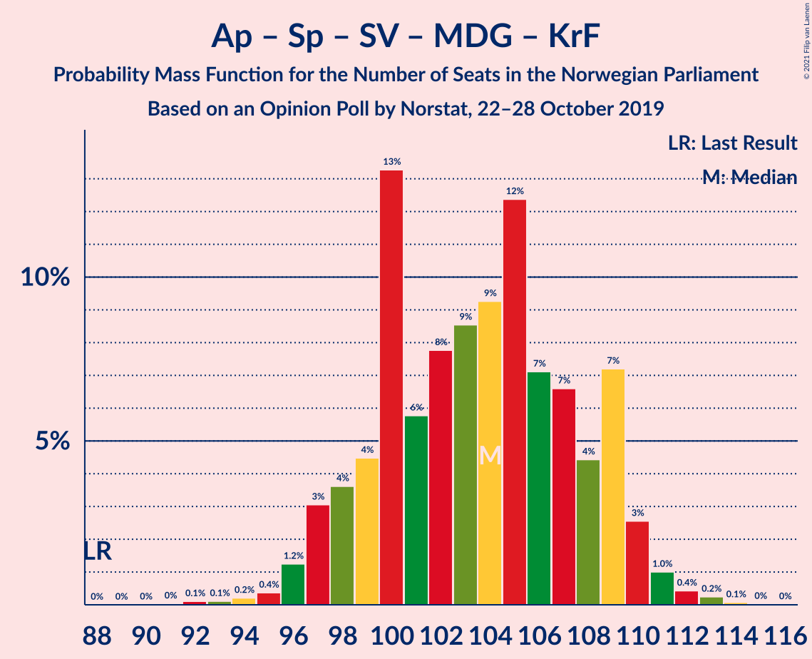
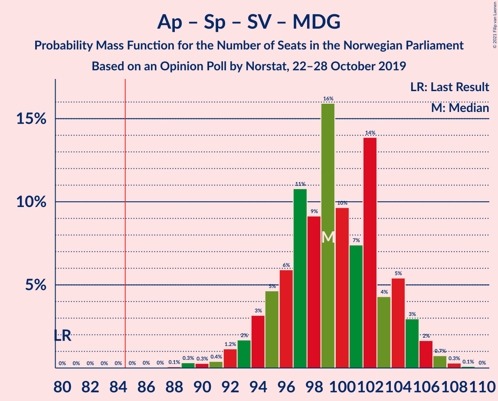
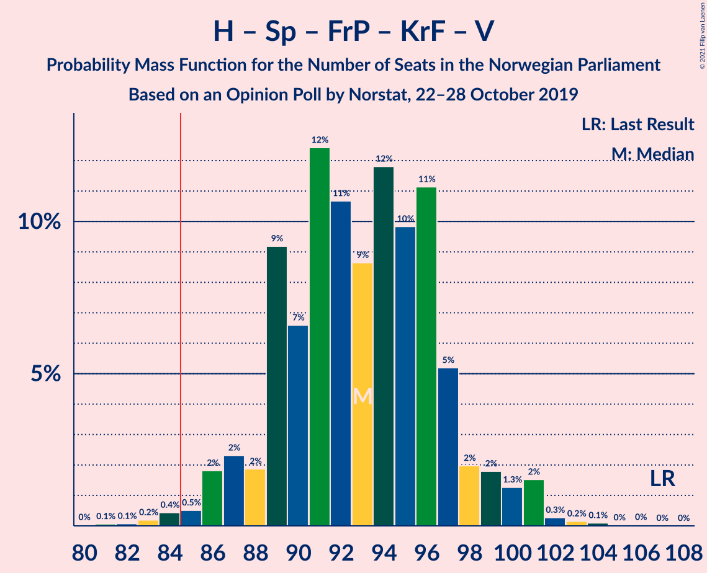
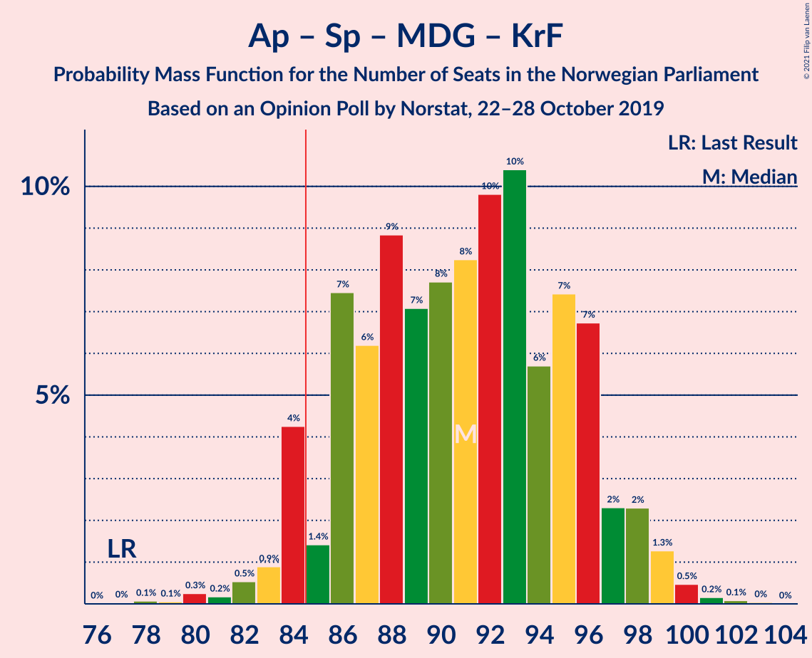

# Opinion Poll by Norstat, 22–28 October 2019

<a href="#voting-intentions">Voting Intentions</a> | <a href="#seats">Seats</a> | <a href="#coalitions">Coalitions</a> | <a href="#technical-information">Technical Information</a>

## Voting Intentions

### Confidence Intervals

| Party | Last Result | Poll Result | 80% Confidence Interval | 90% Confidence Interval | 95% Confidence Interval | 99% Confidence Interval |
|:-----:|:-----------:|:-----------:|:-----------------------:|:-----------------------:|:-----------------------:|:-----------------------:|
| Arbeiderpartiet | 27.4% | 23.6% | 21.6–25.8% |21.1–26.4% |20.6–26.9% |19.7–28.0% |
| Høyre | 25.0% | 21.8% | 19.9–23.9% |19.3–24.4% |18.9–25.0% |18.0–26.0% |
| Senterpartiet | 10.3% | 17.5% | 15.8–19.4% |15.3–20.0% |14.9–20.5% |14.1–21.5% |
| Fremskrittspartiet | 15.2% | 8.4% | 7.2–9.9% |6.8–10.3% |6.6–10.7% |6.0–11.4% |
| Sosialistisk Venstreparti | 6.0% | 7.4% | 6.3–8.8% |5.9–9.2% |5.7–9.6% |5.2–10.3% |
| Miljøpartiet De Grønne | 3.2% | 6.1% | 5.1–7.4% |4.8–7.8% |4.6–8.2% |4.1–8.8% |
| Rødt | 2.4% | 6.0% | 5.0–7.3% |4.7–7.7% |4.5–8.0% |4.0–8.7% |
| Kristelig Folkeparti | 4.2% | 3.8% | 3.0–4.9% |2.8–5.3% |2.7–5.5% |2.3–6.1% |
| Venstre | 4.4% | 3.3% | 2.6–4.3% |2.3–4.6% |2.2–4.9% |1.9–5.4% |

*Note:* The poll result column reflects the actual value used in the calculations. Published results may vary slightly, and in addition be rounded to fewer digits.

## Seats

### Confidence Intervals

| Party | Last Result | Median | 80% Confidence Interval | 90% Confidence Interval | 95% Confidence Interval | 99% Confidence Interval |
|:-----:|:-----------:|:------:|:-----------------------:|:-----------------------:|:-----------------------:|:-----------------------:|
| <a href="#arbeiderpartiet">Arbeiderpartiet</a> | 49 | 43 | 39–44 |38–46 |38–48 |37–50 |
| <a href="#høyre">Høyre</a> | 45 | 36 | 35–40 |35–41 |34–42 |32–45 |
| <a href="#senterpartiet">Senterpartiet</a> | 19 | 34 | 31–36 |30–36 |29–37 |25–39 |
| <a href="#fremskrittspartiet">Fremskrittspartiet</a> | 27 | 14 | 12–18 |11–18 |10–18 |10–20 |
| <a href="#sosialistisk-venstreparti">Sosialistisk Venstreparti</a> | 11 | 12 | 10–14 |10–16 |9–16 |9–18 |
| <a href="#miljøpartiet-de-grønne">Miljøpartiet De Grønne</a> | 1 | 10 | 8–12 |8–13 |8–14 |7–14 |
| <a href="#rødt">Rødt</a> | 1 | 10 | 9–12 |8–12 |7–13 |7–15 |
| <a href="#kristelig-folkeparti">Kristelig Folkeparti</a> | 8 | 3 | 1–8 |1–9 |1–9 |1–10 |
| <a href="#venstre">Venstre</a> | 8 | 2 | 2–7 |2–7 |1–8 |1–9 |

### Arbeiderpartiet

*For a full overview of the results for this party, see the [Arbeiderpartiet](party-arbeiderpartiet.html) page.*

| Number of Seats | Probability | Accumulated | Special Marks |
|:---------------:|:-----------:|:-----------:|:-------------:|
| 33 | 0.1% | 100% |  |
| 34 | 0.1% | 99.9% |  |
| 35 | 0% | 99.8% |  |
| 36 | 0.2% | 99.8% |  |
| 37 | 0.2% | 99.6% |  |
| 38 | 7% | 99.4% |  |
| 39 | 4% | 92% |  |
| 40 | 3% | 88% |  |
| 41 | 15% | 85% |  |
| 42 | 10% | 71% |  |
| 43 | 19% | 60% | Median |
| 44 | 33% | 42% |  |
| 45 | 3% | 9% |  |
| 46 | 2% | 6% |  |
| 47 | 1.1% | 4% |  |
| 48 | 0.4% | 3% |  |
| 49 | 0.9% | 2% | Last Result |
| 50 | 1.2% | 1.5% |  |
| 51 | 0.2% | 0.3% |  |
| 52 | 0% | 0.1% |  |
| 53 | 0% | 0.1% |  |
| 54 | 0% | 0.1% |  |
| 55 | 0% | 0.1% |  |
| 56 | 0% | 0% |  |

### Høyre

*For a full overview of the results for this party, see the [Høyre](party-høyre.html) page.*

| Number of Seats | Probability | Accumulated | Special Marks |
|:---------------:|:-----------:|:-----------:|:-------------:|
| 29 | 0.1% | 100% |  |
| 30 | 0.2% | 99.9% |  |
| 31 | 0.1% | 99.7% |  |
| 32 | 1.3% | 99.6% |  |
| 33 | 0.8% | 98% |  |
| 34 | 2% | 98% |  |
| 35 | 18% | 95% |  |
| 36 | 29% | 78% | Median |
| 37 | 11% | 49% |  |
| 38 | 9% | 38% |  |
| 39 | 13% | 29% |  |
| 40 | 8% | 16% |  |
| 41 | 4% | 8% |  |
| 42 | 1.2% | 3% |  |
| 43 | 1.1% | 2% |  |
| 44 | 0.6% | 1.1% |  |
| 45 | 0.3% | 0.6% | Last Result |
| 46 | 0.1% | 0.3% |  |
| 47 | 0.1% | 0.2% |  |
| 48 | 0% | 0.1% |  |
| 49 | 0.1% | 0.1% |  |
| 50 | 0% | 0% |  |

### Senterpartiet

*For a full overview of the results for this party, see the [Senterpartiet](party-senterpartiet.html) page.*

| Number of Seats | Probability | Accumulated | Special Marks |
|:---------------:|:-----------:|:-----------:|:-------------:|
| 19 | 0% | 100% | Last Result |
| 20 | 0% | 100% |  |
| 21 | 0% | 100% |  |
| 22 | 0% | 100% |  |
| 23 | 0% | 100% |  |
| 24 | 0.3% | 99.9% |  |
| 25 | 0.3% | 99.6% |  |
| 26 | 0.3% | 99.3% |  |
| 27 | 0.4% | 99.0% |  |
| 28 | 1.0% | 98.6% |  |
| 29 | 1.2% | 98% |  |
| 30 | 2% | 96% |  |
| 31 | 5% | 94% |  |
| 32 | 10% | 90% |  |
| 33 | 9% | 80% |  |
| 34 | 22% | 70% | Median |
| 35 | 31% | 49% |  |
| 36 | 14% | 18% |  |
| 37 | 3% | 4% |  |
| 38 | 0.9% | 1.4% |  |
| 39 | 0.2% | 0.5% |  |
| 40 | 0.1% | 0.4% |  |
| 41 | 0.2% | 0.2% |  |
| 42 | 0% | 0% |  |

### Fremskrittspartiet

*For a full overview of the results for this party, see the [Fremskrittspartiet](party-fremskrittspartiet.html) page.*

| Number of Seats | Probability | Accumulated | Special Marks |
|:---------------:|:-----------:|:-----------:|:-------------:|
| 9 | 0.3% | 100% |  |
| 10 | 3% | 99.7% |  |
| 11 | 2% | 97% |  |
| 12 | 14% | 95% |  |
| 13 | 5% | 81% |  |
| 14 | 30% | 77% | Median |
| 15 | 17% | 47% |  |
| 16 | 5% | 30% |  |
| 17 | 3% | 24% |  |
| 18 | 20% | 21% |  |
| 19 | 1.0% | 2% |  |
| 20 | 0.2% | 0.6% |  |
| 21 | 0.3% | 0.4% |  |
| 22 | 0% | 0.1% |  |
| 23 | 0.1% | 0.1% |  |
| 24 | 0% | 0% |  |
| 25 | 0% | 0% |  |
| 26 | 0% | 0% |  |
| 27 | 0% | 0% | Last Result |

### Sosialistisk Venstreparti

*For a full overview of the results for this party, see the [Sosialistisk Venstreparti](party-sosialistiskvenstreparti.html) page.*

| Number of Seats | Probability | Accumulated | Special Marks |
|:---------------:|:-----------:|:-----------:|:-------------:|
| 8 | 0.2% | 100% |  |
| 9 | 3% | 99.7% |  |
| 10 | 14% | 97% |  |
| 11 | 14% | 83% | Last Result |
| 12 | 25% | 68% | Median |
| 13 | 14% | 43% |  |
| 14 | 21% | 30% |  |
| 15 | 3% | 9% |  |
| 16 | 3% | 5% |  |
| 17 | 1.1% | 2% |  |
| 18 | 0.9% | 0.9% |  |
| 19 | 0% | 0.1% |  |
| 20 | 0% | 0% |  |

### Miljøpartiet De Grønne

*For a full overview of the results for this party, see the [Miljøpartiet De Grønne](party-miljøpartietdegrønne.html) page.*

| Number of Seats | Probability | Accumulated | Special Marks |
|:---------------:|:-----------:|:-----------:|:-------------:|
| 1 | 0% | 100% | Last Result |
| 2 | 0.2% | 100% |  |
| 3 | 0.1% | 99.8% |  |
| 4 | 0% | 99.7% |  |
| 5 | 0% | 99.7% |  |
| 6 | 0% | 99.7% |  |
| 7 | 1.0% | 99.7% |  |
| 8 | 10% | 98.7% |  |
| 9 | 32% | 88% |  |
| 10 | 8% | 57% | Median |
| 11 | 24% | 48% |  |
| 12 | 17% | 24% |  |
| 13 | 4% | 7% |  |
| 14 | 2% | 3% |  |
| 15 | 0.2% | 0.4% |  |
| 16 | 0.2% | 0.2% |  |
| 17 | 0% | 0% |  |

### Rødt

*For a full overview of the results for this party, see the [Rødt](party-rødt.html) page.*

| Number of Seats | Probability | Accumulated | Special Marks |
|:---------------:|:-----------:|:-----------:|:-------------:|
| 1 | 0% | 100% | Last Result |
| 2 | 0.3% | 100% |  |
| 3 | 0% | 99.7% |  |
| 4 | 0% | 99.7% |  |
| 5 | 0% | 99.7% |  |
| 6 | 0.1% | 99.7% |  |
| 7 | 3% | 99.6% |  |
| 8 | 6% | 97% |  |
| 9 | 22% | 91% |  |
| 10 | 30% | 69% | Median |
| 11 | 22% | 39% |  |
| 12 | 13% | 17% |  |
| 13 | 2% | 4% |  |
| 14 | 1.0% | 2% |  |
| 15 | 1.3% | 1.4% |  |
| 16 | 0.1% | 0.1% |  |
| 17 | 0% | 0% |  |

### Kristelig Folkeparti

*For a full overview of the results for this party, see the [Kristelig Folkeparti](party-kristeligfolkeparti.html) page.*

| Number of Seats | Probability | Accumulated | Special Marks |
|:---------------:|:-----------:|:-----------:|:-------------:|
| 0 | 0.2% | 100% |  |
| 1 | 13% | 99.8% |  |
| 2 | 5% | 87% |  |
| 3 | 34% | 82% | Median |
| 4 | 0% | 48% |  |
| 5 | 0% | 48% |  |
| 6 | 1.2% | 48% |  |
| 7 | 35% | 47% |  |
| 8 | 6% | 12% | Last Result |
| 9 | 5% | 6% |  |
| 10 | 0.4% | 0.6% |  |
| 11 | 0.1% | 0.2% |  |
| 12 | 0% | 0.1% |  |
| 13 | 0% | 0% |  |

### Venstre

*For a full overview of the results for this party, see the [Venstre](party-venstre.html) page.*

| Number of Seats | Probability | Accumulated | Special Marks |
|:---------------:|:-----------:|:-----------:|:-------------:|
| 0 | 0.3% | 100% |  |
| 1 | 4% | 99.7% |  |
| 2 | 78% | 95% | Median |
| 3 | 0.2% | 18% |  |
| 4 | 0% | 17% |  |
| 5 | 0% | 17% |  |
| 6 | 3% | 17% |  |
| 7 | 9% | 14% |  |
| 8 | 4% | 5% | Last Result |
| 9 | 0.5% | 0.6% |  |
| 10 | 0.1% | 0.1% |  |
| 11 | 0% | 0% |  |

## Coalitions

### Confidence Intervals

| Coalition | Last Result | Median | Majority? | 80% Confidence Interval | 90% Confidence Interval | 95% Confidence Interval | 99% Confidence Interval |
|:---------:|:-----------:|:------:|:---------:|:-----------------------:|:-----------------------:|:-----------------------:|:-----------------------:|
| Arbeiderpartiet – Senterpartiet – Sosialistisk Venstreparti – Miljøpartiet De Grønne – Rødt | 81 | 110 | 100% | 106–113 | 105–114 | 103–115 | 100–118 |
| Arbeiderpartiet – Senterpartiet – Sosialistisk Venstreparti – Miljøpartiet De Grønne – Kristelig Folkeparti | 88 | 104 | 100% | 100–109 | 98–109 | 97–109 | 95–112 |
| Arbeiderpartiet – Senterpartiet – Sosialistisk Venstreparti – Miljøpartiet De Grønne | 80 | 99 | 100% | 95–102 | 95–103 | 93–105 | 90–107 |
| Arbeiderpartiet – Senterpartiet – Sosialistisk Venstreparti – Rødt | 80 | 99 | 100% | 96–102 | 95–104 | 93–104 | 89–106 |
| Høyre – Senterpartiet – Fremskrittspartiet – Kristelig Folkeparti – Venstre | 107 | 94 | 98% | 90–96 | 88–98 | 87–99 | 84–103 |
| Arbeiderpartiet – Senterpartiet – Miljøpartiet De Grønne – Kristelig Folkeparti | 77 | 91 | 97% | 87–95 | 86–96 | 84–99 | 82–100 |
| Arbeiderpartiet – Senterpartiet – Sosialistisk Venstreparti | 79 | 89 | 96% | 87–92 | 85–93 | 83–93 | 81–95 |
| Arbeiderpartiet – Senterpartiet – Kristelig Folkeparti | 76 | 82 | 8% | 75–84 | 75–86 | 74–87 | 71–89 |
| Arbeiderpartiet – Senterpartiet | 68 | 77 | 0.2% | 73–79 | 73–80 | 71–81 | 68–83 |
| Høyre – Fremskrittspartiet – Miljøpartiet De Grønne – Kristelig Folkeparti – Venstre | 89 | 70 | 0% | 67–73 | 65–74 | 65–76 | 63–80 |
| Høyre – Fremskrittspartiet – Kristelig Folkeparti – Venstre | 88 | 59 | 0% | 56–63 | 55–64 | 54–66 | 51–69 |
| Arbeiderpartiet – Sosialistisk Venstreparti | 60 | 56 | 0% | 52–58 | 51–59 | 50–61 | 49–64 |
| Høyre – Fremskrittspartiet – Venstre | 80 | 55 | 0% | 50–58 | 49–60 | 49–61 | 48–65 |
| Høyre – Fremskrittspartiet | 72 | 53 | 0% | 47–55 | 47–56 | 47–57 | 46–59 |
| Høyre – Kristelig Folkeparti – Venstre | 61 | 44 | 0% | 41–49 | 41–51 | 39–52 | 37–55 |
| Senterpartiet – Kristelig Folkeparti – Venstre | 35 | 43 | 0% | 36–46 | 36–46 | 35–48 | 31–51 |

### Arbeiderpartiet – Senterpartiet – Sosialistisk Venstreparti – Miljøpartiet De Grønne – Rødt

| Number of Seats | Probability | Accumulated | Special Marks |
|:---------------:|:-----------:|:-----------:|:-------------:|
| 81 | 0% | 100% | Last Result |
| 82 | 0% | 100% |  |
| 83 | 0% | 100% |  |
| 84 | 0% | 100% |  |
| 85 | 0% | 100% | Majority |
| 86 | 0% | 100% |  |
| 87 | 0% | 100% |  |
| 88 | 0% | 100% |  |
| 89 | 0% | 100% |  |
| 90 | 0% | 100% |  |
| 91 | 0% | 100% |  |
| 92 | 0% | 100% |  |
| 93 | 0% | 100% |  |
| 94 | 0% | 100% |  |
| 95 | 0% | 100% |  |
| 96 | 0.1% | 100% |  |
| 97 | 0% | 99.9% |  |
| 98 | 0.1% | 99.9% |  |
| 99 | 0.1% | 99.8% |  |
| 100 | 0.3% | 99.8% |  |
| 101 | 0.6% | 99.4% |  |
| 102 | 1.1% | 98.8% |  |
| 103 | 0.9% | 98% |  |
| 104 | 1.2% | 97% |  |
| 105 | 3% | 96% |  |
| 106 | 4% | 93% |  |
| 107 | 16% | 89% |  |
| 108 | 2% | 73% |  |
| 109 | 20% | 71% | Median |
| 110 | 21% | 51% |  |
| 111 | 9% | 30% |  |
| 112 | 4% | 21% |  |
| 113 | 11% | 17% |  |
| 114 | 3% | 5% |  |
| 115 | 1.3% | 3% |  |
| 116 | 0.3% | 1.2% |  |
| 117 | 0.2% | 0.9% |  |
| 118 | 0.4% | 0.7% |  |
| 119 | 0.2% | 0.3% |  |
| 120 | 0% | 0.1% |  |
| 121 | 0% | 0.1% |  |
| 122 | 0% | 0% |  |

### Arbeiderpartiet – Senterpartiet – Sosialistisk Venstreparti – Miljøpartiet De Grønne – Kristelig Folkeparti

| Number of Seats | Probability | Accumulated | Special Marks |
|:---------------:|:-----------:|:-----------:|:-------------:|
| 88 | 0% | 100% | Last Result |
| 89 | 0% | 100% |  |
| 90 | 0% | 100% |  |
| 91 | 0% | 100% |  |
| 92 | 0.1% | 100% |  |
| 93 | 0.3% | 99.9% |  |
| 94 | 0.1% | 99.6% |  |
| 95 | 0.4% | 99.5% |  |
| 96 | 0.5% | 99.1% |  |
| 97 | 1.4% | 98.6% |  |
| 98 | 3% | 97% |  |
| 99 | 2% | 94% |  |
| 100 | 7% | 92% |  |
| 101 | 2% | 85% |  |
| 102 | 5% | 83% | Median |
| 103 | 28% | 79% |  |
| 104 | 7% | 51% |  |
| 105 | 18% | 44% |  |
| 106 | 4% | 25% |  |
| 107 | 4% | 22% |  |
| 108 | 5% | 17% |  |
| 109 | 10% | 12% |  |
| 110 | 0.3% | 2% |  |
| 111 | 1.0% | 2% |  |
| 112 | 0.7% | 1.2% |  |
| 113 | 0.4% | 0.5% |  |
| 114 | 0% | 0.1% |  |
| 115 | 0% | 0% |  |

### Arbeiderpartiet – Senterpartiet – Sosialistisk Venstreparti – Miljøpartiet De Grønne

| Number of Seats | Probability | Accumulated | Special Marks |
|:---------------:|:-----------:|:-----------:|:-------------:|
| 80 | 0% | 100% | Last Result |
| 81 | 0% | 100% |  |
| 82 | 0% | 100% |  |
| 83 | 0% | 100% |  |
| 84 | 0% | 100% |  |
| 85 | 0% | 100% | Majority |
| 86 | 0.1% | 100% |  |
| 87 | 0% | 99.9% |  |
| 88 | 0% | 99.9% |  |
| 89 | 0.1% | 99.8% |  |
| 90 | 0.4% | 99.8% |  |
| 91 | 0.8% | 99.3% |  |
| 92 | 0.9% | 98.6% |  |
| 93 | 1.1% | 98% |  |
| 94 | 1.2% | 97% |  |
| 95 | 5% | 95% |  |
| 96 | 1.1% | 90% |  |
| 97 | 4% | 89% |  |
| 98 | 20% | 85% |  |
| 99 | 15% | 65% | Median |
| 100 | 27% | 50% |  |
| 101 | 5% | 23% |  |
| 102 | 10% | 18% |  |
| 103 | 4% | 8% |  |
| 104 | 1.3% | 4% |  |
| 105 | 1.1% | 3% |  |
| 106 | 0.7% | 2% |  |
| 107 | 0.5% | 1.0% |  |
| 108 | 0.2% | 0.5% |  |
| 109 | 0.2% | 0.3% |  |
| 110 | 0% | 0% |  |

### Arbeiderpartiet – Senterpartiet – Sosialistisk Venstreparti – Rødt

| Number of Seats | Probability | Accumulated | Special Marks |
|:---------------:|:-----------:|:-----------:|:-------------:|
| 80 | 0% | 100% | Last Result |
| 81 | 0% | 100% |  |
| 82 | 0% | 100% |  |
| 83 | 0% | 100% |  |
| 84 | 0% | 100% |  |
| 85 | 0% | 100% | Majority |
| 86 | 0% | 100% |  |
| 87 | 0.1% | 100% |  |
| 88 | 0.1% | 99.9% |  |
| 89 | 0.3% | 99.8% |  |
| 90 | 0.3% | 99.4% |  |
| 91 | 0.1% | 99.2% |  |
| 92 | 0.7% | 99.0% |  |
| 93 | 1.0% | 98% |  |
| 94 | 1.0% | 97% |  |
| 95 | 2% | 96% |  |
| 96 | 14% | 95% |  |
| 97 | 6% | 80% |  |
| 98 | 16% | 75% |  |
| 99 | 10% | 59% | Median |
| 100 | 7% | 49% |  |
| 101 | 31% | 42% |  |
| 102 | 3% | 11% |  |
| 103 | 3% | 9% |  |
| 104 | 4% | 6% |  |
| 105 | 0.7% | 1.4% |  |
| 106 | 0.3% | 0.7% |  |
| 107 | 0.3% | 0.4% |  |
| 108 | 0.1% | 0.2% |  |
| 109 | 0% | 0.1% |  |
| 110 | 0% | 0.1% |  |
| 111 | 0% | 0% |  |

### Høyre – Senterpartiet – Fremskrittspartiet – Kristelig Folkeparti – Venstre

| Number of Seats | Probability | Accumulated | Special Marks |
|:---------------:|:-----------:|:-----------:|:-------------:|
| 80 | 0.1% | 100% |  |
| 81 | 0% | 99.9% |  |
| 82 | 0.1% | 99.8% |  |
| 83 | 0.1% | 99.8% |  |
| 84 | 2% | 99.7% |  |
| 85 | 0.5% | 98% | Majority |
| 86 | 0.1% | 98% |  |
| 87 | 2% | 98% |  |
| 88 | 2% | 96% |  |
| 89 | 1.4% | 94% | Median |
| 90 | 9% | 93% |  |
| 91 | 11% | 84% |  |
| 92 | 5% | 73% |  |
| 93 | 7% | 68% |  |
| 94 | 22% | 61% |  |
| 95 | 10% | 39% |  |
| 96 | 20% | 29% |  |
| 97 | 4% | 9% |  |
| 98 | 0.9% | 5% |  |
| 99 | 2% | 5% |  |
| 100 | 0.7% | 2% |  |
| 101 | 0.6% | 1.5% |  |
| 102 | 0.2% | 0.8% |  |
| 103 | 0.2% | 0.7% |  |
| 104 | 0.4% | 0.5% |  |
| 105 | 0% | 0% |  |
| 106 | 0% | 0% |  |
| 107 | 0% | 0% | Last Result |

### Arbeiderpartiet – Senterpartiet – Miljøpartiet De Grønne – Kristelig Folkeparti

| Number of Seats | Probability | Accumulated | Special Marks |
|:---------------:|:-----------:|:-----------:|:-------------:|
| 77 | 0% | 100% | Last Result |
| 78 | 0% | 100% |  |
| 79 | 0% | 99.9% |  |
| 80 | 0.2% | 99.9% |  |
| 81 | 0.1% | 99.8% |  |
| 82 | 0.8% | 99.6% |  |
| 83 | 0.3% | 98.9% |  |
| 84 | 2% | 98.6% |  |
| 85 | 1.4% | 97% | Majority |
| 86 | 3% | 96% |  |
| 87 | 10% | 93% |  |
| 88 | 0.8% | 83% |  |
| 89 | 1.4% | 82% |  |
| 90 | 8% | 80% | Median |
| 91 | 28% | 72% |  |
| 92 | 7% | 44% |  |
| 93 | 4% | 37% |  |
| 94 | 1.5% | 33% |  |
| 95 | 23% | 32% |  |
| 96 | 4% | 8% |  |
| 97 | 0.8% | 5% |  |
| 98 | 1.3% | 4% |  |
| 99 | 2% | 3% |  |
| 100 | 0.5% | 0.7% |  |
| 101 | 0% | 0.2% |  |
| 102 | 0.1% | 0.1% |  |
| 103 | 0% | 0% |  |

### Arbeiderpartiet – Senterpartiet – Sosialistisk Venstreparti

| Number of Seats | Probability | Accumulated | Special Marks |
|:---------------:|:-----------:|:-----------:|:-------------:|
| 77 | 0.1% | 100% |  |
| 78 | 0% | 99.9% |  |
| 79 | 0.1% | 99.8% | Last Result |
| 80 | 0.1% | 99.7% |  |
| 81 | 0.9% | 99.6% |  |
| 82 | 0.3% | 98.7% |  |
| 83 | 2% | 98% |  |
| 84 | 0.8% | 97% |  |
| 85 | 2% | 96% | Majority |
| 86 | 4% | 94% |  |
| 87 | 27% | 90% |  |
| 88 | 6% | 63% |  |
| 89 | 11% | 57% | Median |
| 90 | 10% | 46% |  |
| 91 | 26% | 36% |  |
| 92 | 2% | 10% |  |
| 93 | 6% | 8% |  |
| 94 | 1.1% | 2% |  |
| 95 | 0.9% | 1.3% |  |
| 96 | 0.2% | 0.4% |  |
| 97 | 0.1% | 0.3% |  |
| 98 | 0.1% | 0.2% |  |
| 99 | 0% | 0.1% |  |
| 100 | 0% | 0.1% |  |
| 101 | 0% | 0% |  |

### Arbeiderpartiet – Senterpartiet – Kristelig Folkeparti

| Number of Seats | Probability | Accumulated | Special Marks |
|:---------------:|:-----------:|:-----------:|:-------------:|
| 68 | 0.1% | 100% |  |
| 69 | 0.3% | 99.9% |  |
| 70 | 0% | 99.6% |  |
| 71 | 0.6% | 99.6% |  |
| 72 | 0.1% | 99.0% |  |
| 73 | 0.1% | 98.8% |  |
| 74 | 2% | 98.8% |  |
| 75 | 8% | 97% |  |
| 76 | 0.6% | 89% | Last Result |
| 77 | 1.5% | 89% |  |
| 78 | 4% | 87% |  |
| 79 | 4% | 83% |  |
| 80 | 9% | 79% | Median |
| 81 | 5% | 69% |  |
| 82 | 26% | 64% |  |
| 83 | 14% | 39% |  |
| 84 | 17% | 25% |  |
| 85 | 0.7% | 8% | Majority |
| 86 | 3% | 7% |  |
| 87 | 3% | 5% |  |
| 88 | 0.8% | 2% |  |
| 89 | 0.9% | 1.1% |  |
| 90 | 0% | 0.3% |  |
| 91 | 0.1% | 0.2% |  |
| 92 | 0.1% | 0.1% |  |
| 93 | 0.1% | 0.1% |  |
| 94 | 0% | 0% |  |

### Arbeiderpartiet – Senterpartiet

| Number of Seats | Probability | Accumulated | Special Marks |
|:---------------:|:-----------:|:-----------:|:-------------:|
| 64 | 0% | 100% |  |
| 65 | 0% | 99.9% |  |
| 66 | 0.1% | 99.9% |  |
| 67 | 0.2% | 99.7% |  |
| 68 | 0.9% | 99.5% | Last Result |
| 69 | 0.3% | 98.7% |  |
| 70 | 0.3% | 98% |  |
| 71 | 0.8% | 98% |  |
| 72 | 2% | 97% |  |
| 73 | 9% | 95% |  |
| 74 | 8% | 86% |  |
| 75 | 13% | 78% |  |
| 76 | 9% | 65% |  |
| 77 | 18% | 56% | Median |
| 78 | 6% | 39% |  |
| 79 | 24% | 33% |  |
| 80 | 7% | 10% |  |
| 81 | 0.7% | 3% |  |
| 82 | 1.0% | 2% |  |
| 83 | 0.5% | 0.9% |  |
| 84 | 0.1% | 0.3% |  |
| 85 | 0.2% | 0.2% | Majority |
| 86 | 0% | 0.1% |  |
| 87 | 0% | 0% |  |

### Høyre – Fremskrittspartiet – Miljøpartiet De Grønne – Kristelig Folkeparti – Venstre

| Number of Seats | Probability | Accumulated | Special Marks |
|:---------------:|:-----------:|:-----------:|:-------------:|
| 58 | 0% | 100% |  |
| 59 | 0% | 99.9% |  |
| 60 | 0% | 99.9% |  |
| 61 | 0.1% | 99.9% |  |
| 62 | 0.3% | 99.8% |  |
| 63 | 0.3% | 99.5% |  |
| 64 | 0.7% | 99.2% |  |
| 65 | 4% | 98.6% | Median |
| 66 | 3% | 94% |  |
| 67 | 3% | 91% |  |
| 68 | 31% | 88% |  |
| 69 | 7% | 58% |  |
| 70 | 10% | 50% |  |
| 71 | 16% | 41% |  |
| 72 | 6% | 25% |  |
| 73 | 14% | 19% |  |
| 74 | 2% | 5% |  |
| 75 | 1.0% | 4% |  |
| 76 | 1.0% | 3% |  |
| 77 | 0.7% | 2% |  |
| 78 | 0.1% | 0.9% |  |
| 79 | 0.3% | 0.8% |  |
| 80 | 0.3% | 0.6% |  |
| 81 | 0.1% | 0.2% |  |
| 82 | 0.1% | 0.1% |  |
| 83 | 0% | 0% |  |
| 84 | 0% | 0% |  |
| 85 | 0% | 0% | Majority |
| 86 | 0% | 0% |  |
| 87 | 0% | 0% |  |
| 88 | 0% | 0% |  |
| 89 | 0% | 0% | Last Result |

### Høyre – Fremskrittspartiet – Kristelig Folkeparti – Venstre

| Number of Seats | Probability | Accumulated | Special Marks |
|:---------------:|:-----------:|:-----------:|:-------------:|
| 48 | 0% | 100% |  |
| 49 | 0% | 99.9% |  |
| 50 | 0.2% | 99.9% |  |
| 51 | 0.4% | 99.7% |  |
| 52 | 0.3% | 99.3% |  |
| 53 | 0.3% | 99.1% |  |
| 54 | 1.3% | 98.7% |  |
| 55 | 3% | 97% | Median |
| 56 | 11% | 95% |  |
| 57 | 4% | 83% |  |
| 58 | 9% | 79% |  |
| 59 | 21% | 70% |  |
| 60 | 20% | 49% |  |
| 61 | 2% | 29% |  |
| 62 | 16% | 27% |  |
| 63 | 4% | 11% |  |
| 64 | 3% | 7% |  |
| 65 | 1.2% | 4% |  |
| 66 | 0.8% | 3% |  |
| 67 | 1.1% | 2% |  |
| 68 | 0.6% | 1.2% |  |
| 69 | 0.3% | 0.6% |  |
| 70 | 0.1% | 0.2% |  |
| 71 | 0% | 0.2% |  |
| 72 | 0% | 0.1% |  |
| 73 | 0.1% | 0.1% |  |
| 74 | 0% | 0% |  |
| 75 | 0% | 0% |  |
| 76 | 0% | 0% |  |
| 77 | 0% | 0% |  |
| 78 | 0% | 0% |  |
| 79 | 0% | 0% |  |
| 80 | 0% | 0% |  |
| 81 | 0% | 0% |  |
| 82 | 0% | 0% |  |
| 83 | 0% | 0% |  |
| 84 | 0% | 0% |  |
| 85 | 0% | 0% | Majority |
| 86 | 0% | 0% |  |
| 87 | 0% | 0% |  |
| 88 | 0% | 0% | Last Result |

### Arbeiderpartiet – Sosialistisk Venstreparti

| Number of Seats | Probability | Accumulated | Special Marks |
|:---------------:|:-----------:|:-----------:|:-------------:|
| 45 | 0.1% | 100% |  |
| 46 | 0% | 99.9% |  |
| 47 | 0.1% | 99.9% |  |
| 48 | 0.2% | 99.7% |  |
| 49 | 1.2% | 99.5% |  |
| 50 | 1.4% | 98% |  |
| 51 | 4% | 97% |  |
| 52 | 10% | 93% |  |
| 53 | 13% | 84% |  |
| 54 | 10% | 71% |  |
| 55 | 9% | 60% | Median |
| 56 | 34% | 51% |  |
| 57 | 8% | 18% |  |
| 58 | 4% | 10% |  |
| 59 | 2% | 6% |  |
| 60 | 1.1% | 4% | Last Result |
| 61 | 1.0% | 3% |  |
| 62 | 0.4% | 2% |  |
| 63 | 0.8% | 2% |  |
| 64 | 0.8% | 1.0% |  |
| 65 | 0% | 0.3% |  |
| 66 | 0.2% | 0.2% |  |
| 67 | 0% | 0.1% |  |
| 68 | 0% | 0% |  |

### Høyre – Fremskrittspartiet – Venstre

| Number of Seats | Probability | Accumulated | Special Marks |
|:---------------:|:-----------:|:-----------:|:-------------:|
| 45 | 0% | 100% |  |
| 46 | 0.1% | 99.9% |  |
| 47 | 0.2% | 99.8% |  |
| 48 | 1.0% | 99.7% |  |
| 49 | 9% | 98.6% |  |
| 50 | 0.6% | 90% |  |
| 51 | 6% | 90% |  |
| 52 | 4% | 83% | Median |
| 53 | 13% | 80% |  |
| 54 | 4% | 67% |  |
| 55 | 18% | 63% |  |
| 56 | 20% | 45% |  |
| 57 | 14% | 25% |  |
| 58 | 2% | 11% |  |
| 59 | 1.3% | 9% |  |
| 60 | 3% | 7% |  |
| 61 | 2% | 4% |  |
| 62 | 0.3% | 1.4% |  |
| 63 | 0.3% | 1.2% |  |
| 64 | 0.3% | 0.9% |  |
| 65 | 0.2% | 0.6% |  |
| 66 | 0.3% | 0.3% |  |
| 67 | 0% | 0.1% |  |
| 68 | 0% | 0% |  |
| 69 | 0% | 0% |  |
| 70 | 0% | 0% |  |
| 71 | 0% | 0% |  |
| 72 | 0% | 0% |  |
| 73 | 0% | 0% |  |
| 74 | 0% | 0% |  |
| 75 | 0% | 0% |  |
| 76 | 0% | 0% |  |
| 77 | 0% | 0% |  |
| 78 | 0% | 0% |  |
| 79 | 0% | 0% |  |
| 80 | 0% | 0% | Last Result |

### Høyre – Fremskrittspartiet

| Number of Seats | Probability | Accumulated | Special Marks |
|:---------------:|:-----------:|:-----------:|:-------------:|
| 42 | 0% | 100% |  |
| 43 | 0.1% | 99.9% |  |
| 44 | 0.1% | 99.9% |  |
| 45 | 0.2% | 99.8% |  |
| 46 | 1.2% | 99.5% |  |
| 47 | 10% | 98% |  |
| 48 | 3% | 88% |  |
| 49 | 7% | 85% |  |
| 50 | 9% | 78% | Median |
| 51 | 13% | 69% |  |
| 52 | 2% | 57% |  |
| 53 | 21% | 55% |  |
| 54 | 20% | 33% |  |
| 55 | 7% | 13% |  |
| 56 | 3% | 6% |  |
| 57 | 0.7% | 3% |  |
| 58 | 1.2% | 2% |  |
| 59 | 0.8% | 1.2% |  |
| 60 | 0.1% | 0.4% |  |
| 61 | 0.1% | 0.3% |  |
| 62 | 0.1% | 0.2% |  |
| 63 | 0.1% | 0.1% |  |
| 64 | 0.1% | 0.1% |  |
| 65 | 0% | 0% |  |
| 66 | 0% | 0% |  |
| 67 | 0% | 0% |  |
| 68 | 0% | 0% |  |
| 69 | 0% | 0% |  |
| 70 | 0% | 0% |  |
| 71 | 0% | 0% |  |
| 72 | 0% | 0% | Last Result |

### Høyre – Kristelig Folkeparti – Venstre

| Number of Seats | Probability | Accumulated | Special Marks |
|:---------------:|:-----------:|:-----------:|:-------------:|
| 35 | 0.2% | 100% |  |
| 36 | 0.2% | 99.8% |  |
| 37 | 0.2% | 99.6% |  |
| 38 | 0.6% | 99.4% |  |
| 39 | 1.3% | 98.7% |  |
| 40 | 0.8% | 97% |  |
| 41 | 22% | 97% | Median |
| 42 | 6% | 75% |  |
| 43 | 7% | 69% |  |
| 44 | 12% | 62% |  |
| 45 | 6% | 49% |  |
| 46 | 16% | 44% |  |
| 47 | 1.2% | 28% |  |
| 48 | 15% | 27% |  |
| 49 | 3% | 12% |  |
| 50 | 3% | 9% |  |
| 51 | 1.2% | 6% |  |
| 52 | 3% | 4% |  |
| 53 | 0.2% | 2% |  |
| 54 | 0.8% | 2% |  |
| 55 | 0.2% | 0.7% |  |
| 56 | 0.3% | 0.5% |  |
| 57 | 0% | 0.1% |  |
| 58 | 0% | 0.1% |  |
| 59 | 0% | 0.1% |  |
| 60 | 0.1% | 0.1% |  |
| 61 | 0% | 0% | Last Result |

### Senterpartiet – Kristelig Folkeparti – Venstre

| Number of Seats | Probability | Accumulated | Special Marks |
|:---------------:|:-----------:|:-----------:|:-------------:|
| 28 | 0.1% | 100% |  |
| 29 | 0% | 99.8% |  |
| 30 | 0.1% | 99.8% |  |
| 31 | 0.7% | 99.7% |  |
| 32 | 0.4% | 99.0% |  |
| 33 | 0.2% | 98.6% |  |
| 34 | 0.9% | 98% |  |
| 35 | 2% | 98% | Last Result |
| 36 | 7% | 96% |  |
| 37 | 3% | 89% |  |
| 38 | 1.0% | 85% |  |
| 39 | 1.1% | 84% | Median |
| 40 | 26% | 83% |  |
| 41 | 4% | 57% |  |
| 42 | 3% | 53% |  |
| 43 | 22% | 50% |  |
| 44 | 10% | 28% |  |
| 45 | 4% | 18% |  |
| 46 | 10% | 15% |  |
| 47 | 1.4% | 5% |  |
| 48 | 2% | 3% |  |
| 49 | 0.4% | 1.1% |  |
| 50 | 0.1% | 0.7% |  |
| 51 | 0.5% | 0.6% |  |
| 52 | 0.1% | 0.1% |  |
| 53 | 0% | 0.1% |  |
| 54 | 0% | 0% |  |

## Technical Information

### Opinion Poll

+ **Polling firm:** Norstat
+ **Commissioner(s):** —
+ **Fieldwork period:** 22–28 October 2019

### Calculations

+ **Sample size:** 703
+ **Simulations done:** 131,072
+ **Error estimate:** 2.24%

