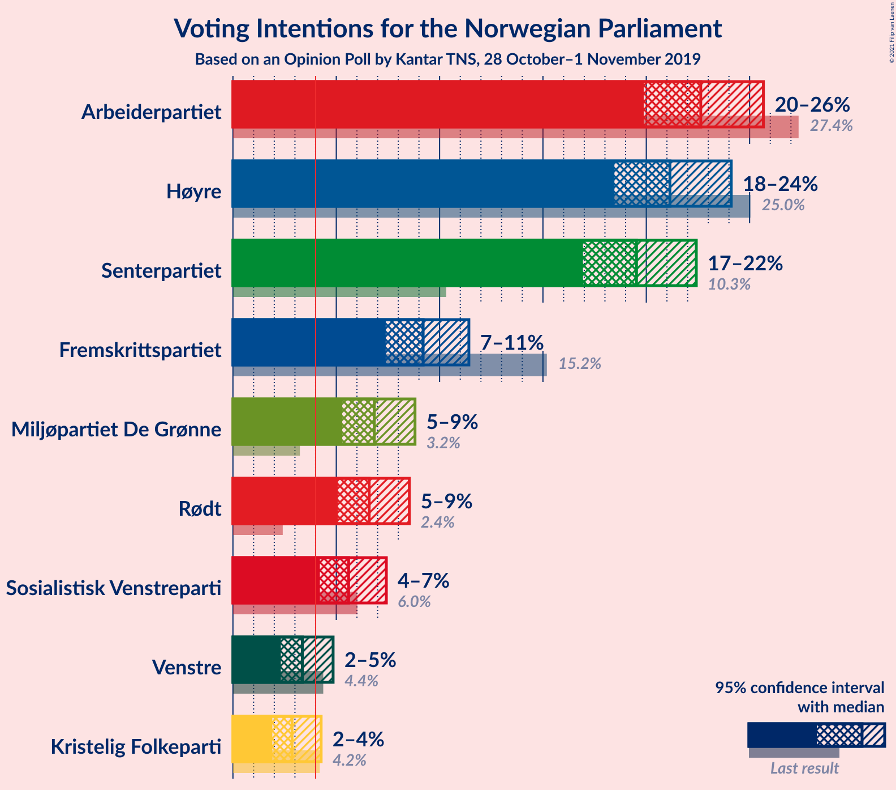
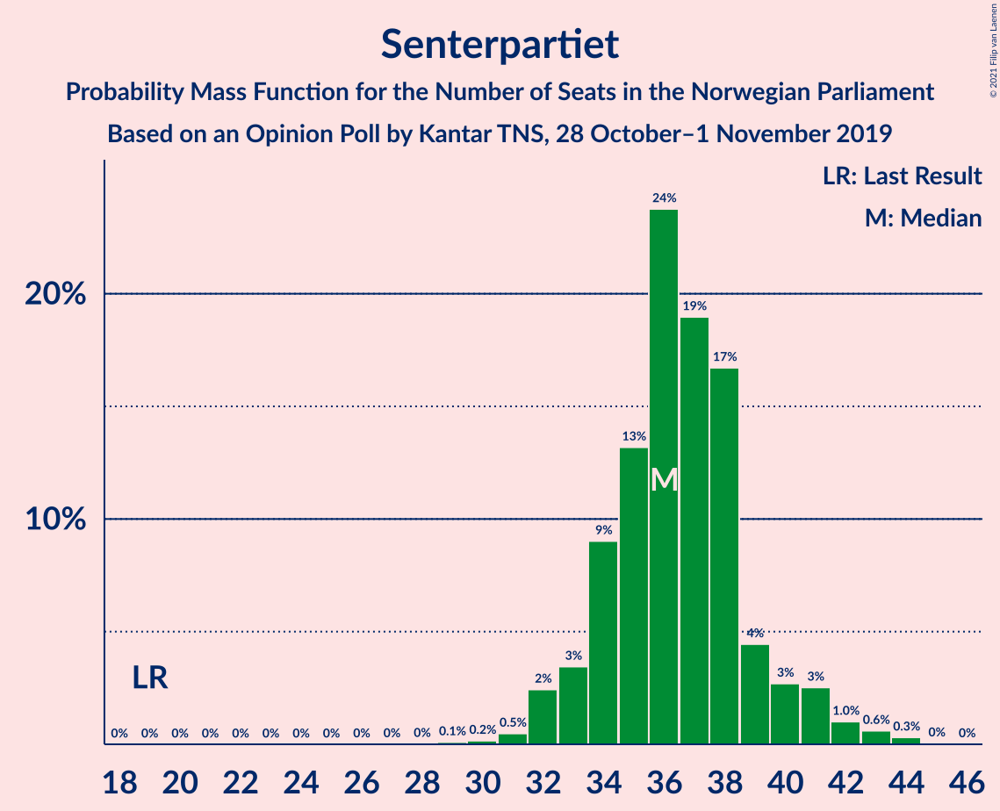
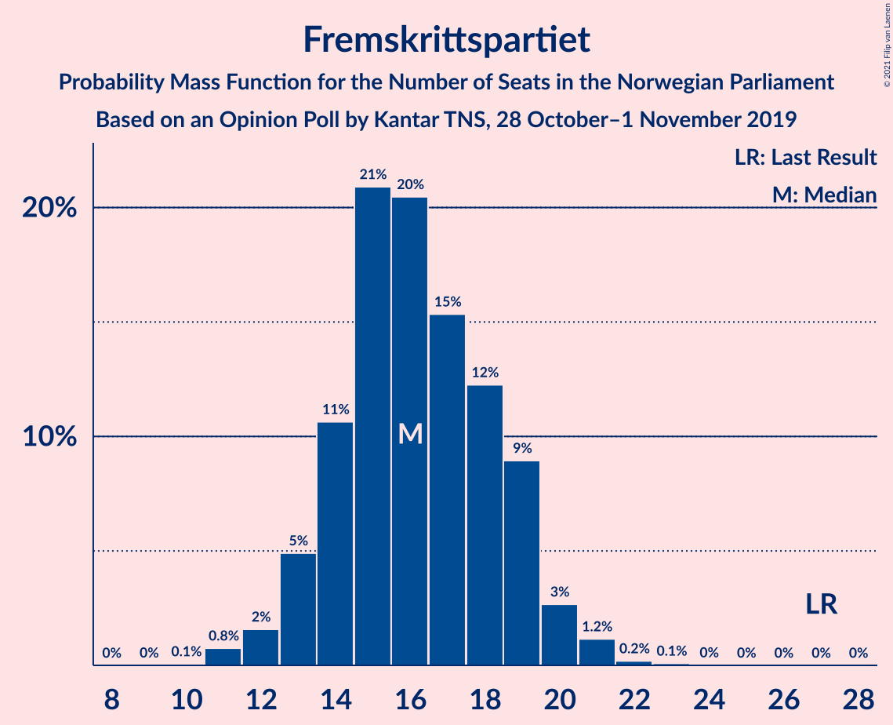
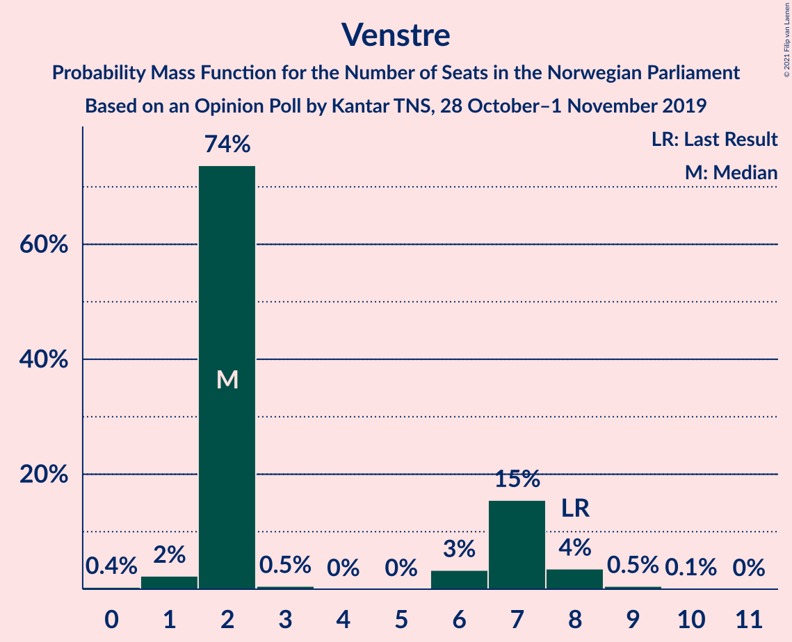
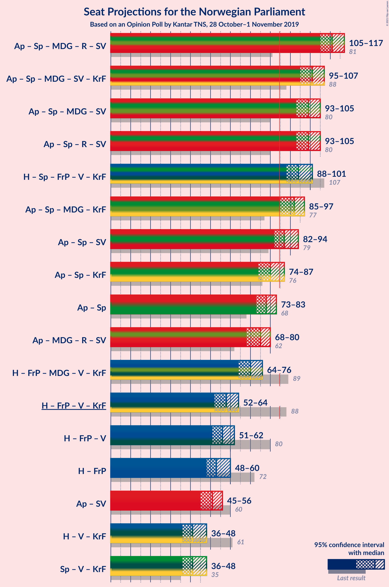
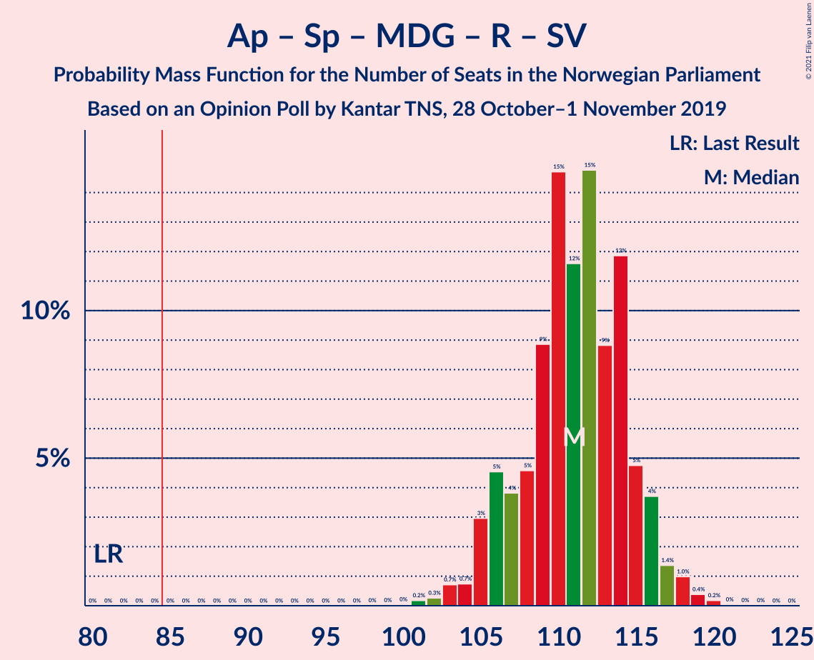
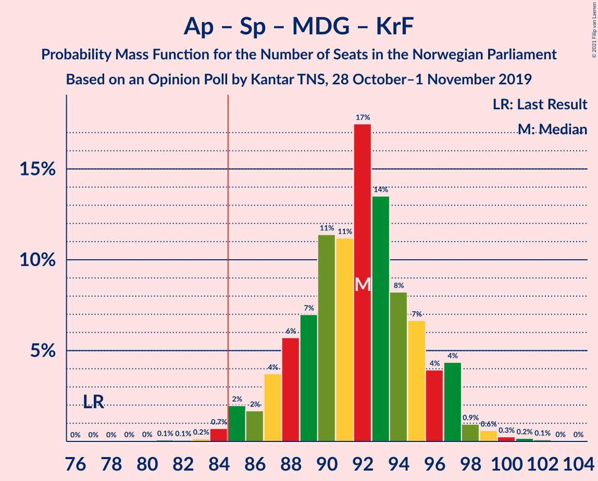
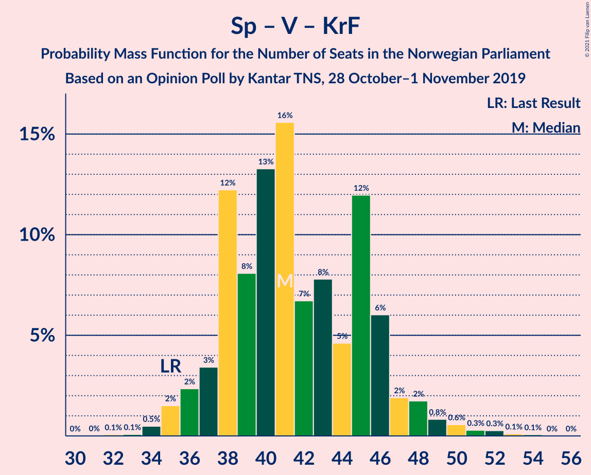

# Opinion Poll by Kantar TNS, 28 October–1 November 2019

<a href="#voting-intentions">Voting Intentions</a> | <a href="#seats">Seats</a> | <a href="#coalitions">Coalitions</a> | <a href="#technical-information">Technical Information</a>

## Voting Intentions

### Confidence Intervals

| Party | Last Result | Poll Result | 80% Confidence Interval | 90% Confidence Interval | 95% Confidence Interval | 99% Confidence Interval |
|:-----:|:-----------:|:-----------:|:-----------------------:|:-----------------------:|:-----------------------:|:-----------------------:|
| Arbeiderpartiet | 27.4% | 22.6% | 20.8–24.6% |20.3–25.2% |19.9–25.7% |19.0–26.6% |
| Høyre | 25.0% | 21.1% | 19.4–23.1% |18.9–23.6% |18.5–24.1% |17.6–25.1% |
| Senterpartiet | 10.3% | 19.5% | 17.8–21.4% |17.3–21.9% |16.9–22.4% |16.1–23.4% |
| Fremskrittspartiet | 15.2% | 9.2% | 8.0–10.6% |7.7–11.1% |7.4–11.4% |6.9–12.1% |
| Miljøpartiet De Grønne | 3.2% | 6.8% | 5.8–8.1% |5.5–8.5% |5.3–8.8% |4.8–9.5% |
| Rødt | 2.4% | 6.6% | 5.6–7.8% |5.3–8.2% |5.1–8.5% |4.6–9.2% |
| Sosialistisk Venstreparti | 6.0% | 5.6% | 4.7–6.8% |4.4–7.1% |4.2–7.4% |3.8–8.0% |
| Venstre | 4.4% | 3.4% | 2.7–4.3% |2.5–4.6% |2.3–4.8% |2.0–5.3% |
| Kristelig Folkeparti | 4.2% | 2.9% | 2.2–3.8% |2.1–4.0% |1.9–4.3% |1.6–4.7% |

*Note:* The poll result column reflects the actual value used in the calculations. Published results may vary slightly, and in addition be rounded to fewer digits.

## Seats

### Confidence Intervals

| Party | Last Result | Median | 80% Confidence Interval | 90% Confidence Interval | 95% Confidence Interval | 99% Confidence Interval |
|:-----:|:-----------:|:------:|:-----------------------:|:-----------------------:|:-----------------------:|:-----------------------:|
| <a href="#arbeiderpartiet">Arbeiderpartiet</a> | 49 | 40 | 40–41 |40–43 |40–43 |40–43 |
| <a href="#høyre">Høyre</a> | 45 | 41 | 41 |29–41 |29–41 |29–41 |
| <a href="#senterpartiet">Senterpartiet</a> | 19 | 38 | 38–40 |38–42 |38–42 |38–42 |
| <a href="#fremskrittspartiet">Fremskrittspartiet</a> | 27 | 13 | 13–15 |13–18 |13–18 |13–18 |
| <a href="#miljøpartiet-de-grønne">Miljøpartiet De Grønne</a> | 1 | 12 | 12 |12–14 |12–14 |9–14 |
| <a href="#rødt">Rødt</a> | 1 | 12 | 11–12 |9–12 |9–12 |9–12 |
| <a href="#sosialistisk-venstreparti">Sosialistisk Venstreparti</a> | 11 | 8 | 8 |8–9 |8–9 |8–9 |
| <a href="#venstre">Venstre</a> | 8 | 2 | 2 |0–2 |0–2 |0–9 |
| <a href="#kristelig-folkeparti">Kristelig Folkeparti</a> | 8 | 3 | 3 |1–3 |1–3 |1–6 |

### Arbeiderpartiet

*For a full overview of the results for this party, see the [Arbeiderpartiet](party-arbeiderpartiet.html) page.*

| Number of Seats | Probability | Accumulated | Special Marks |
|:---------------:|:-----------:|:-----------:|:-------------:|
| 40 | 88% | 100% | Median |
| 41 | 5% | 12% |  |
| 42 | 0.2% | 7% |  |
| 43 | 7% | 7% |  |
| 44 | 0% | 0.1% |  |
| 45 | 0.1% | 0.1% |  |
| 46 | 0% | 0.1% |  |
| 47 | 0% | 0.1% |  |
| 48 | 0% | 0.1% |  |
| 49 | 0.1% | 0.1% | Last Result |
| 50 | 0% | 0% |  |

### Høyre

*For a full overview of the results for this party, see the [Høyre](party-høyre.html) page.*

| Number of Seats | Probability | Accumulated | Special Marks |
|:---------------:|:-----------:|:-----------:|:-------------:|
| 29 | 7% | 100% |  |
| 30 | 0% | 93% |  |
| 31 | 0.1% | 93% |  |
| 32 | 0% | 93% |  |
| 33 | 0.1% | 93% |  |
| 34 | 0% | 93% |  |
| 35 | 0.2% | 93% |  |
| 36 | 0.1% | 92% |  |
| 37 | 0% | 92% |  |
| 38 | 0% | 92% |  |
| 39 | 0% | 92% |  |
| 40 | 0% | 92% |  |
| 41 | 92% | 92% | Median |
| 42 | 0% | 0% |  |
| 43 | 0% | 0% |  |
| 44 | 0% | 0% |  |
| 45 | 0% | 0% | Last Result |

### Senterpartiet

*For a full overview of the results for this party, see the [Senterpartiet](party-senterpartiet.html) page.*

| Number of Seats | Probability | Accumulated | Special Marks |
|:---------------:|:-----------:|:-----------:|:-------------:|
| 19 | 0% | 100% | Last Result |
| 20 | 0% | 100% |  |
| 21 | 0% | 100% |  |
| 22 | 0% | 100% |  |
| 23 | 0% | 100% |  |
| 24 | 0% | 100% |  |
| 25 | 0% | 100% |  |
| 26 | 0% | 100% |  |
| 27 | 0% | 100% |  |
| 28 | 0% | 100% |  |
| 29 | 0% | 100% |  |
| 30 | 0% | 100% |  |
| 31 | 0% | 100% |  |
| 32 | 0% | 100% |  |
| 33 | 0% | 100% |  |
| 34 | 0.1% | 100% |  |
| 35 | 0% | 99.9% |  |
| 36 | 0% | 99.9% |  |
| 37 | 0.1% | 99.9% |  |
| 38 | 87% | 99.9% | Median |
| 39 | 0.2% | 13% |  |
| 40 | 5% | 13% |  |
| 41 | 0.6% | 7% |  |
| 42 | 7% | 7% |  |
| 43 | 0% | 0% |  |

### Fremskrittspartiet

*For a full overview of the results for this party, see the [Fremskrittspartiet](party-fremskrittspartiet.html) page.*

| Number of Seats | Probability | Accumulated | Special Marks |
|:---------------:|:-----------:|:-----------:|:-------------:|
| 12 | 0.1% | 100% |  |
| 13 | 87% | 99.9% | Median |
| 14 | 0% | 13% |  |
| 15 | 6% | 13% |  |
| 16 | 0% | 7% |  |
| 17 | 0.1% | 7% |  |
| 18 | 7% | 7% |  |
| 19 | 0% | 0.2% |  |
| 20 | 0% | 0.2% |  |
| 21 | 0.2% | 0.2% |  |
| 22 | 0% | 0% |  |
| 23 | 0% | 0% |  |
| 24 | 0% | 0% |  |
| 25 | 0% | 0% |  |
| 26 | 0% | 0% |  |
| 27 | 0% | 0% | Last Result |

### Miljøpartiet De Grønne

*For a full overview of the results for this party, see the [Miljøpartiet De Grønne](party-miljøpartietdegrønne.html) page.*

| Number of Seats | Probability | Accumulated | Special Marks |
|:---------------:|:-----------:|:-----------:|:-------------:|
| 1 | 0% | 100% | Last Result |
| 2 | 0% | 100% |  |
| 3 | 0% | 100% |  |
| 4 | 0% | 100% |  |
| 5 | 0% | 100% |  |
| 6 | 0% | 100% |  |
| 7 | 0% | 100% |  |
| 8 | 0% | 100% |  |
| 9 | 0.7% | 100% |  |
| 10 | 0% | 99.3% |  |
| 11 | 0.1% | 99.2% |  |
| 12 | 94% | 99.2% | Median |
| 13 | 0.1% | 5% |  |
| 14 | 5% | 5% |  |
| 15 | 0.1% | 0.1% |  |
| 16 | 0% | 0% |  |

### Rødt

*For a full overview of the results for this party, see the [Rødt](party-rødt.html) page.*

| Number of Seats | Probability | Accumulated | Special Marks |
|:---------------:|:-----------:|:-----------:|:-------------:|
| 1 | 0% | 100% | Last Result |
| 2 | 0% | 100% |  |
| 3 | 0% | 100% |  |
| 4 | 0% | 100% |  |
| 5 | 0% | 100% |  |
| 6 | 0% | 100% |  |
| 7 | 0% | 100% |  |
| 8 | 0.1% | 100% |  |
| 9 | 5% | 99.9% |  |
| 10 | 0.1% | 95% |  |
| 11 | 7% | 95% |  |
| 12 | 88% | 88% | Median |
| 13 | 0.1% | 0.1% |  |
| 14 | 0% | 0% |  |

### Sosialistisk Venstreparti

*For a full overview of the results for this party, see the [Sosialistisk Venstreparti](party-sosialistiskvenstreparti.html) page.*

| Number of Seats | Probability | Accumulated | Special Marks |
|:---------------:|:-----------:|:-----------:|:-------------:|
| 8 | 93% | 100% | Median |
| 9 | 7% | 7% |  |
| 10 | 0.3% | 0.3% |  |
| 11 | 0% | 0% | Last Result |

### Venstre

*For a full overview of the results for this party, see the [Venstre](party-venstre.html) page.*

| Number of Seats | Probability | Accumulated | Special Marks |
|:---------------:|:-----------:|:-----------:|:-------------:|
| 0 | 5% | 100% |  |
| 1 | 0.1% | 95% |  |
| 2 | 94% | 95% | Median |
| 3 | 0% | 0.6% |  |
| 4 | 0% | 0.6% |  |
| 5 | 0% | 0.6% |  |
| 6 | 0.1% | 0.6% |  |
| 7 | 0% | 0.5% |  |
| 8 | 0% | 0.5% | Last Result |
| 9 | 0.5% | 0.5% |  |
| 10 | 0% | 0% |  |

### Kristelig Folkeparti

*For a full overview of the results for this party, see the [Kristelig Folkeparti](party-kristeligfolkeparti.html) page.*

| Number of Seats | Probability | Accumulated | Special Marks |
|:---------------:|:-----------:|:-----------:|:-------------:|
| 0 | 0.3% | 100% |  |
| 1 | 5% | 99.7% |  |
| 2 | 0% | 94% |  |
| 3 | 94% | 94% | Median |
| 4 | 0% | 0.6% |  |
| 5 | 0% | 0.6% |  |
| 6 | 0.5% | 0.6% |  |
| 7 | 0% | 0% |  |
| 8 | 0% | 0% | Last Result |

## Coalitions

### Confidence Intervals

| Coalition | Last Result | Median | Majority? | 80% Confidence Interval | 90% Confidence Interval | 95% Confidence Interval | 99% Confidence Interval |
|:---------:|:-----------:|:------:|:---------:|:-----------------------:|:-----------------------:|:-----------------------:|:-----------------------:|
| Arbeiderpartiet – Senterpartiet – Miljøpartiet De Grønne – Rødt – Sosialistisk Venstreparti | 81 | 110 | 100% | 110–112 | 110–117 | 110–117 | 110–117 |
| Arbeiderpartiet – Senterpartiet – Miljøpartiet De Grønne – Sosialistisk Venstreparti – Kristelig Folkeparti | 88 | 101 | 100% | 101–104 | 101–109 | 101–109 | 101–109 |
| Arbeiderpartiet – Senterpartiet – Miljøpartiet De Grønne – Sosialistisk Venstreparti | 80 | 98 | 100% | 98–103 | 98–106 | 98–106 | 98–106 |
| Arbeiderpartiet – Senterpartiet – Rødt – Sosialistisk Venstreparti | 80 | 98 | 100% | 98 | 98–105 | 98–105 | 98–105 |
| Arbeiderpartiet – Senterpartiet – Miljøpartiet De Grønne – Kristelig Folkeparti | 77 | 93 | 100% | 93–96 | 93–100 | 93–100 | 93–100 |
| Høyre – Senterpartiet – Fremskrittspartiet – Venstre – Kristelig Folkeparti | 107 | 97 | 99.9% | 97 | 94–97 | 94–97 | 94–100 |
| Arbeiderpartiet – Senterpartiet – Sosialistisk Venstreparti | 79 | 86 | 100% | 86–89 | 86–94 | 86–94 | 86–94 |
| Arbeiderpartiet – Senterpartiet – Kristelig Folkeparti | 76 | 81 | 7% | 81–82 | 81–88 | 81–88 | 81–88 |
| Arbeiderpartiet – Senterpartiet | 68 | 78 | 7% | 78–81 | 78–85 | 78–85 | 78–85 |
| Høyre – Fremskrittspartiet – Miljøpartiet De Grønne – Venstre – Kristelig Folkeparti | 89 | 71 | 0% | 71 | 64–71 | 64–71 | 64–71 |
| Høyre – Fremskrittspartiet – Venstre – Kristelig Folkeparti | 88 | 59 | 0% | 57–59 | 52–59 | 52–59 | 52–59 |
| Høyre – Fremskrittspartiet – Venstre | 80 | 56 | 0% | 56 | 49–56 | 49–56 | 49–56 |
| Høyre – Fremskrittspartiet | 72 | 54 | 0% | 54 | 47–56 | 47–56 | 44–56 |
| Arbeiderpartiet – Sosialistisk Venstreparti | 60 | 48 | 0% | 48–49 | 48–52 | 48–52 | 48–52 |
| Senterpartiet – Venstre – Kristelig Folkeparti | 35 | 43 | 0% | 43 | 41–47 | 41–47 | 41–56 |
| Høyre – Venstre – Kristelig Folkeparti | 61 | 46 | 0% | 42–46 | 34–46 | 34–46 | 34–46 |

### Arbeiderpartiet – Senterpartiet – Miljøpartiet De Grønne – Rødt – Sosialistisk Venstreparti

| Number of Seats | Probability | Accumulated | Special Marks |
|:---------------:|:-----------:|:-----------:|:-------------:|
| 81 | 0% | 100% | Last Result |
| 82 | 0% | 100% |  |
| 83 | 0% | 100% |  |
| 84 | 0% | 100% |  |
| 85 | 0% | 100% | Majority |
| 86 | 0% | 100% |  |
| 87 | 0% | 100% |  |
| 88 | 0% | 100% |  |
| 89 | 0% | 100% |  |
| 90 | 0% | 100% |  |
| 91 | 0% | 100% |  |
| 92 | 0% | 100% |  |
| 93 | 0% | 100% |  |
| 94 | 0% | 100% |  |
| 95 | 0% | 100% |  |
| 96 | 0% | 100% |  |
| 97 | 0% | 100% |  |
| 98 | 0% | 100% |  |
| 99 | 0% | 100% |  |
| 100 | 0% | 100% |  |
| 101 | 0% | 100% |  |
| 102 | 0% | 100% |  |
| 103 | 0% | 100% |  |
| 104 | 0% | 100% |  |
| 105 | 0% | 100% |  |
| 106 | 0% | 100% |  |
| 107 | 0% | 100% |  |
| 108 | 0.1% | 100% |  |
| 109 | 0% | 99.9% |  |
| 110 | 88% | 99.9% | Median |
| 111 | 0.2% | 12% |  |
| 112 | 5% | 12% |  |
| 113 | 0% | 7% |  |
| 114 | 0.1% | 7% |  |
| 115 | 0.1% | 7% |  |
| 116 | 0% | 7% |  |
| 117 | 7% | 7% |  |
| 118 | 0% | 0.1% |  |
| 119 | 0.1% | 0.1% |  |
| 120 | 0% | 0% |  |

### Arbeiderpartiet – Senterpartiet – Miljøpartiet De Grønne – Sosialistisk Venstreparti – Kristelig Folkeparti

| Number of Seats | Probability | Accumulated | Special Marks |
|:---------------:|:-----------:|:-----------:|:-------------:|
| 88 | 0% | 100% | Last Result |
| 89 | 0% | 100% |  |
| 90 | 0% | 100% |  |
| 91 | 0% | 100% |  |
| 92 | 0% | 100% |  |
| 93 | 0% | 100% |  |
| 94 | 0% | 100% |  |
| 95 | 0% | 100% |  |
| 96 | 0% | 100% |  |
| 97 | 0% | 100% |  |
| 98 | 0% | 100% |  |
| 99 | 0% | 99.9% |  |
| 100 | 0.2% | 99.9% |  |
| 101 | 87% | 99.7% | Median |
| 102 | 0% | 13% |  |
| 103 | 0% | 13% |  |
| 104 | 6% | 13% |  |
| 105 | 0.1% | 7% |  |
| 106 | 0% | 7% |  |
| 107 | 0.1% | 7% |  |
| 108 | 0% | 7% |  |
| 109 | 7% | 7% |  |
| 110 | 0% | 0% |  |

### Arbeiderpartiet – Senterpartiet – Miljøpartiet De Grønne – Sosialistisk Venstreparti

| Number of Seats | Probability | Accumulated | Special Marks |
|:---------------:|:-----------:|:-----------:|:-------------:|
| 80 | 0% | 100% | Last Result |
| 81 | 0% | 100% |  |
| 82 | 0% | 100% |  |
| 83 | 0% | 100% |  |
| 84 | 0% | 100% |  |
| 85 | 0% | 100% | Majority |
| 86 | 0% | 100% |  |
| 87 | 0% | 100% |  |
| 88 | 0% | 100% |  |
| 89 | 0% | 100% |  |
| 90 | 0% | 100% |  |
| 91 | 0% | 100% |  |
| 92 | 0% | 100% |  |
| 93 | 0% | 100% |  |
| 94 | 0% | 100% |  |
| 95 | 0% | 100% |  |
| 96 | 0% | 100% |  |
| 97 | 0% | 100% |  |
| 98 | 88% | 99.9% | Median |
| 99 | 0% | 12% |  |
| 100 | 0.2% | 12% |  |
| 101 | 0% | 12% |  |
| 102 | 0% | 12% |  |
| 103 | 5% | 12% |  |
| 104 | 0.1% | 7% |  |
| 105 | 0% | 7% |  |
| 106 | 7% | 7% |  |
| 107 | 0% | 0% |  |

### Arbeiderpartiet – Senterpartiet – Rødt – Sosialistisk Venstreparti

| Number of Seats | Probability | Accumulated | Special Marks |
|:---------------:|:-----------:|:-----------:|:-------------:|
| 80 | 0% | 100% | Last Result |
| 81 | 0% | 100% |  |
| 82 | 0% | 100% |  |
| 83 | 0% | 100% |  |
| 84 | 0% | 100% |  |
| 85 | 0% | 100% | Majority |
| 86 | 0% | 100% |  |
| 87 | 0% | 100% |  |
| 88 | 0% | 100% |  |
| 89 | 0% | 100% |  |
| 90 | 0% | 100% |  |
| 91 | 0% | 100% |  |
| 92 | 0% | 100% |  |
| 93 | 0% | 100% |  |
| 94 | 0% | 100% |  |
| 95 | 0% | 100% |  |
| 96 | 0% | 100% |  |
| 97 | 0% | 100% |  |
| 98 | 92% | 99.9% | Median |
| 99 | 0.1% | 8% |  |
| 100 | 0% | 8% |  |
| 101 | 0.5% | 8% |  |
| 102 | 0.3% | 7% |  |
| 103 | 0% | 7% |  |
| 104 | 0% | 7% |  |
| 105 | 7% | 7% |  |
| 106 | 0.1% | 0.1% |  |
| 107 | 0% | 0% |  |

### Arbeiderpartiet – Senterpartiet – Miljøpartiet De Grønne – Kristelig Folkeparti

| Number of Seats | Probability | Accumulated | Special Marks |
|:---------------:|:-----------:|:-----------:|:-------------:|
| 77 | 0% | 100% | Last Result |
| 78 | 0% | 100% |  |
| 79 | 0% | 100% |  |
| 80 | 0% | 100% |  |
| 81 | 0% | 100% |  |
| 82 | 0% | 100% |  |
| 83 | 0% | 100% |  |
| 84 | 0% | 100% |  |
| 85 | 0% | 100% | Majority |
| 86 | 0% | 100% |  |
| 87 | 0% | 100% |  |
| 88 | 0% | 100% |  |
| 89 | 0% | 100% |  |
| 90 | 0.2% | 100% |  |
| 91 | 0% | 99.7% |  |
| 92 | 0% | 99.7% |  |
| 93 | 87% | 99.7% | Median |
| 94 | 0% | 13% |  |
| 95 | 0.1% | 13% |  |
| 96 | 6% | 13% |  |
| 97 | 0.1% | 7% |  |
| 98 | 0% | 7% |  |
| 99 | 0% | 7% |  |
| 100 | 7% | 7% |  |
| 101 | 0% | 0% |  |

### Høyre – Senterpartiet – Fremskrittspartiet – Venstre – Kristelig Folkeparti

| Number of Seats | Probability | Accumulated | Special Marks |
|:---------------:|:-----------:|:-----------:|:-------------:|
| 84 | 0.1% | 100% |  |
| 85 | 0% | 99.9% | Majority |
| 86 | 0% | 99.9% |  |
| 87 | 0% | 99.9% |  |
| 88 | 0% | 99.9% |  |
| 89 | 0.1% | 99.9% |  |
| 90 | 0% | 99.9% |  |
| 91 | 0.1% | 99.9% |  |
| 92 | 0% | 99.8% |  |
| 93 | 0% | 99.8% |  |
| 94 | 7% | 99.8% |  |
| 95 | 0% | 93% |  |
| 96 | 0% | 93% |  |
| 97 | 92% | 93% | Median |
| 98 | 0% | 0.6% |  |
| 99 | 0% | 0.6% |  |
| 100 | 0.5% | 0.5% |  |
| 101 | 0% | 0% |  |
| 102 | 0% | 0% |  |
| 103 | 0% | 0% |  |
| 104 | 0% | 0% |  |
| 105 | 0% | 0% |  |
| 106 | 0% | 0% |  |
| 107 | 0% | 0% | Last Result |

### Arbeiderpartiet – Senterpartiet – Sosialistisk Venstreparti

| Number of Seats | Probability | Accumulated | Special Marks |
|:---------------:|:-----------:|:-----------:|:-------------:|
| 79 | 0% | 100% | Last Result |
| 80 | 0% | 100% |  |
| 81 | 0% | 100% |  |
| 82 | 0% | 100% |  |
| 83 | 0% | 100% |  |
| 84 | 0% | 100% |  |
| 85 | 0% | 100% | Majority |
| 86 | 87% | 100% | Median |
| 87 | 0% | 13% |  |
| 88 | 0% | 13% |  |
| 89 | 6% | 13% |  |
| 90 | 0% | 7% |  |
| 91 | 0.3% | 7% |  |
| 92 | 0% | 7% |  |
| 93 | 0.1% | 7% |  |
| 94 | 7% | 7% |  |
| 95 | 0% | 0% |  |

### Arbeiderpartiet – Senterpartiet – Kristelig Folkeparti

| Number of Seats | Probability | Accumulated | Special Marks |
|:---------------:|:-----------:|:-----------:|:-------------:|
| 76 | 0% | 100% | Last Result |
| 77 | 0% | 100% |  |
| 78 | 0% | 100% |  |
| 79 | 0% | 100% |  |
| 80 | 0% | 100% |  |
| 81 | 87% | 100% | Median |
| 82 | 5% | 13% |  |
| 83 | 0% | 7% |  |
| 84 | 0.1% | 7% |  |
| 85 | 0% | 7% | Majority |
| 86 | 0% | 7% |  |
| 87 | 0.5% | 7% |  |
| 88 | 7% | 7% |  |
| 89 | 0% | 0% |  |

### Arbeiderpartiet – Senterpartiet

| Number of Seats | Probability | Accumulated | Special Marks |
|:---------------:|:-----------:|:-----------:|:-------------:|
| 68 | 0% | 100% | Last Result |
| 69 | 0% | 100% |  |
| 70 | 0% | 100% |  |
| 71 | 0% | 100% |  |
| 72 | 0% | 100% |  |
| 73 | 0% | 100% |  |
| 74 | 0% | 100% |  |
| 75 | 0% | 100% |  |
| 76 | 0% | 100% |  |
| 77 | 0% | 100% |  |
| 78 | 87% | 100% | Median |
| 79 | 0% | 13% |  |
| 80 | 0% | 13% |  |
| 81 | 6% | 13% |  |
| 82 | 0.1% | 7% |  |
| 83 | 0.1% | 7% |  |
| 84 | 0% | 7% |  |
| 85 | 7% | 7% | Majority |
| 86 | 0% | 0% |  |

### Høyre – Fremskrittspartiet – Miljøpartiet De Grønne – Venstre – Kristelig Folkeparti

| Number of Seats | Probability | Accumulated | Special Marks |
|:---------------:|:-----------:|:-----------:|:-------------:|
| 63 | 0.1% | 100% |  |
| 64 | 7% | 99.9% |  |
| 65 | 0% | 93% |  |
| 66 | 0% | 93% |  |
| 67 | 0.3% | 93% |  |
| 68 | 0.5% | 93% |  |
| 69 | 0% | 92% |  |
| 70 | 0% | 92% |  |
| 71 | 92% | 92% | Median |
| 72 | 0% | 0.1% |  |
| 73 | 0% | 0% |  |
| 74 | 0% | 0% |  |
| 75 | 0% | 0% |  |
| 76 | 0% | 0% |  |
| 77 | 0% | 0% |  |
| 78 | 0% | 0% |  |
| 79 | 0% | 0% |  |
| 80 | 0% | 0% |  |
| 81 | 0% | 0% |  |
| 82 | 0% | 0% |  |
| 83 | 0% | 0% |  |
| 84 | 0% | 0% |  |
| 85 | 0% | 0% | Majority |
| 86 | 0% | 0% |  |
| 87 | 0% | 0% |  |
| 88 | 0% | 0% |  |
| 89 | 0% | 0% | Last Result |

### Høyre – Fremskrittspartiet – Venstre – Kristelig Folkeparti

| Number of Seats | Probability | Accumulated | Special Marks |
|:---------------:|:-----------:|:-----------:|:-------------:|
| 48 | 0.1% | 100% |  |
| 49 | 0% | 99.9% |  |
| 50 | 0.1% | 99.9% |  |
| 51 | 0% | 99.9% |  |
| 52 | 7% | 99.9% |  |
| 53 | 0% | 93% |  |
| 54 | 0.1% | 93% |  |
| 55 | 0% | 93% |  |
| 56 | 0% | 93% |  |
| 57 | 5% | 93% |  |
| 58 | 0.2% | 88% |  |
| 59 | 88% | 88% | Median |
| 60 | 0% | 0.1% |  |
| 61 | 0.1% | 0.1% |  |
| 62 | 0% | 0% |  |
| 63 | 0% | 0% |  |
| 64 | 0% | 0% |  |
| 65 | 0% | 0% |  |
| 66 | 0% | 0% |  |
| 67 | 0% | 0% |  |
| 68 | 0% | 0% |  |
| 69 | 0% | 0% |  |
| 70 | 0% | 0% |  |
| 71 | 0% | 0% |  |
| 72 | 0% | 0% |  |
| 73 | 0% | 0% |  |
| 74 | 0% | 0% |  |
| 75 | 0% | 0% |  |
| 76 | 0% | 0% |  |
| 77 | 0% | 0% |  |
| 78 | 0% | 0% |  |
| 79 | 0% | 0% |  |
| 80 | 0% | 0% |  |
| 81 | 0% | 0% |  |
| 82 | 0% | 0% |  |
| 83 | 0% | 0% |  |
| 84 | 0% | 0% |  |
| 85 | 0% | 0% | Majority |
| 86 | 0% | 0% |  |
| 87 | 0% | 0% |  |
| 88 | 0% | 0% | Last Result |

### Høyre – Fremskrittspartiet – Venstre

| Number of Seats | Probability | Accumulated | Special Marks |
|:---------------:|:-----------:|:-----------:|:-------------:|
| 47 | 0.1% | 100% |  |
| 48 | 0% | 99.9% |  |
| 49 | 7% | 99.9% |  |
| 50 | 0% | 93% |  |
| 51 | 0% | 93% |  |
| 52 | 0% | 93% |  |
| 53 | 0.5% | 93% |  |
| 54 | 0.1% | 93% |  |
| 55 | 0% | 92% |  |
| 56 | 92% | 92% | Median |
| 57 | 0% | 0.3% |  |
| 58 | 0.2% | 0.3% |  |
| 59 | 0% | 0.1% |  |
| 60 | 0% | 0% |  |
| 61 | 0% | 0% |  |
| 62 | 0% | 0% |  |
| 63 | 0% | 0% |  |
| 64 | 0% | 0% |  |
| 65 | 0% | 0% |  |
| 66 | 0% | 0% |  |
| 67 | 0% | 0% |  |
| 68 | 0% | 0% |  |
| 69 | 0% | 0% |  |
| 70 | 0% | 0% |  |
| 71 | 0% | 0% |  |
| 72 | 0% | 0% |  |
| 73 | 0% | 0% |  |
| 74 | 0% | 0% |  |
| 75 | 0% | 0% |  |
| 76 | 0% | 0% |  |
| 77 | 0% | 0% |  |
| 78 | 0% | 0% |  |
| 79 | 0% | 0% |  |
| 80 | 0% | 0% | Last Result |

### Høyre – Fremskrittspartiet

| Number of Seats | Probability | Accumulated | Special Marks |
|:---------------:|:-----------:|:-----------:|:-------------:|
| 43 | 0.1% | 100% |  |
| 44 | 0.5% | 99.9% |  |
| 45 | 0.1% | 99.4% |  |
| 46 | 0% | 99.4% |  |
| 47 | 7% | 99.3% |  |
| 48 | 0% | 93% |  |
| 49 | 0% | 93% |  |
| 50 | 0% | 93% |  |
| 51 | 0% | 93% |  |
| 52 | 0% | 93% |  |
| 53 | 0.1% | 93% |  |
| 54 | 87% | 92% | Median |
| 55 | 0% | 5% |  |
| 56 | 5% | 5% |  |
| 57 | 0% | 0% |  |
| 58 | 0% | 0% |  |
| 59 | 0% | 0% |  |
| 60 | 0% | 0% |  |
| 61 | 0% | 0% |  |
| 62 | 0% | 0% |  |
| 63 | 0% | 0% |  |
| 64 | 0% | 0% |  |
| 65 | 0% | 0% |  |
| 66 | 0% | 0% |  |
| 67 | 0% | 0% |  |
| 68 | 0% | 0% |  |
| 69 | 0% | 0% |  |
| 70 | 0% | 0% |  |
| 71 | 0% | 0% |  |
| 72 | 0% | 0% | Last Result |

### Arbeiderpartiet – Sosialistisk Venstreparti

| Number of Seats | Probability | Accumulated | Special Marks |
|:---------------:|:-----------:|:-----------:|:-------------:|
| 48 | 88% | 100% | Median |
| 49 | 5% | 12% |  |
| 50 | 0% | 7% |  |
| 51 | 0% | 7% |  |
| 52 | 7% | 7% |  |
| 53 | 0% | 0.1% |  |
| 54 | 0.1% | 0.1% |  |
| 55 | 0% | 0.1% |  |
| 56 | 0% | 0.1% |  |
| 57 | 0% | 0.1% |  |
| 58 | 0% | 0.1% |  |
| 59 | 0.1% | 0.1% |  |
| 60 | 0% | 0% | Last Result |

### Senterpartiet – Venstre – Kristelig Folkeparti

| Number of Seats | Probability | Accumulated | Special Marks |
|:---------------:|:-----------:|:-----------:|:-------------:|
| 35 | 0% | 100% | Last Result |
| 36 | 0% | 100% |  |
| 37 | 0% | 100% |  |
| 38 | 0.1% | 100% |  |
| 39 | 0% | 99.9% |  |
| 40 | 0% | 99.9% |  |
| 41 | 5% | 99.9% |  |
| 42 | 0% | 94% |  |
| 43 | 87% | 94% | Median |
| 44 | 0.1% | 7% |  |
| 45 | 0% | 7% |  |
| 46 | 0% | 7% |  |
| 47 | 7% | 7% |  |
| 48 | 0% | 0.6% |  |
| 49 | 0% | 0.6% |  |
| 50 | 0% | 0.6% |  |
| 51 | 0% | 0.6% |  |
| 52 | 0% | 0.6% |  |
| 53 | 0% | 0.5% |  |
| 54 | 0% | 0.5% |  |
| 55 | 0% | 0.5% |  |
| 56 | 0.5% | 0.5% |  |
| 57 | 0% | 0% |  |

### Høyre – Venstre – Kristelig Folkeparti

| Number of Seats | Probability | Accumulated | Special Marks |
|:---------------:|:-----------:|:-----------:|:-------------:|
| 34 | 7% | 100% |  |
| 35 | 0% | 93% |  |
| 36 | 0.1% | 93% |  |
| 37 | 0.3% | 93% |  |
| 38 | 0.1% | 93% |  |
| 39 | 0% | 93% |  |
| 40 | 0% | 93% |  |
| 41 | 0% | 93% |  |
| 42 | 5% | 93% |  |
| 43 | 0% | 88% |  |
| 44 | 0.5% | 88% |  |
| 45 | 0% | 87% |  |
| 46 | 87% | 87% | Median |
| 47 | 0% | 0.1% |  |
| 48 | 0% | 0% |  |
| 49 | 0% | 0% |  |
| 50 | 0% | 0% |  |
| 51 | 0% | 0% |  |
| 52 | 0% | 0% |  |
| 53 | 0% | 0% |  |
| 54 | 0% | 0% |  |
| 55 | 0% | 0% |  |
| 56 | 0% | 0% |  |
| 57 | 0% | 0% |  |
| 58 | 0% | 0% |  |
| 59 | 0% | 0% |  |
| 60 | 0% | 0% |  |
| 61 | 0% | 0% | Last Result |

## Technical Information

### Opinion Poll

+ **Polling firm:** Kantar TNS
+ **Commissioner(s):** —
+ **Fieldwork period:** 28 October–1 November 2019

### Calculations

+ **Sample size:** 804
+ **Simulations done:** 1,024
+ **Error estimate:** 7.32%

